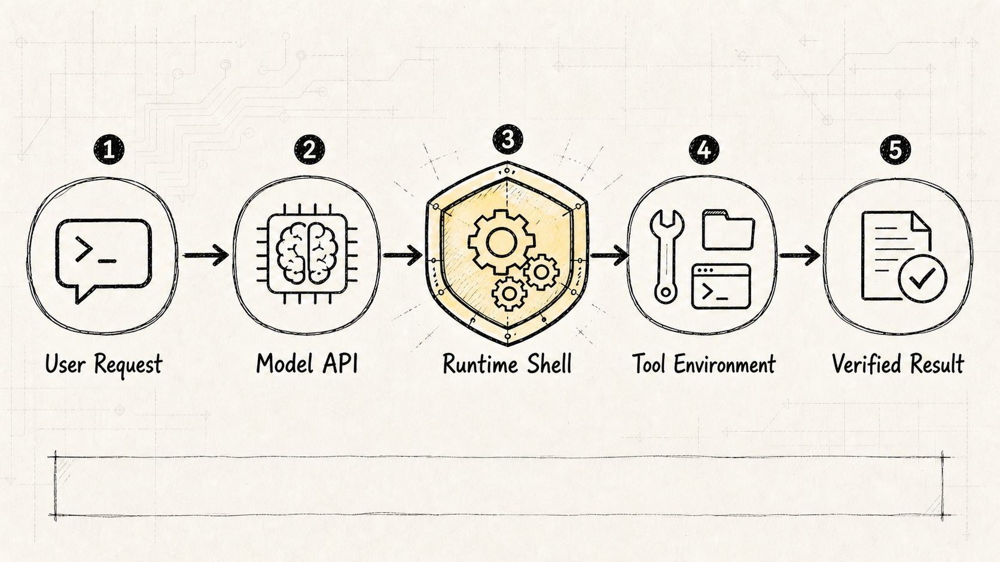
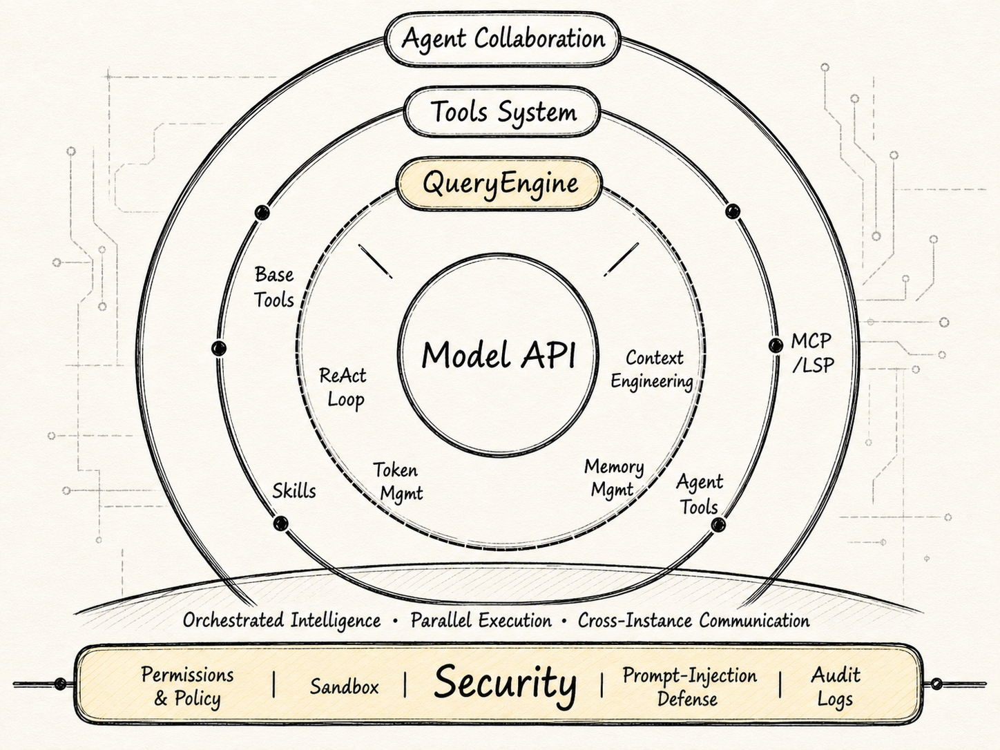
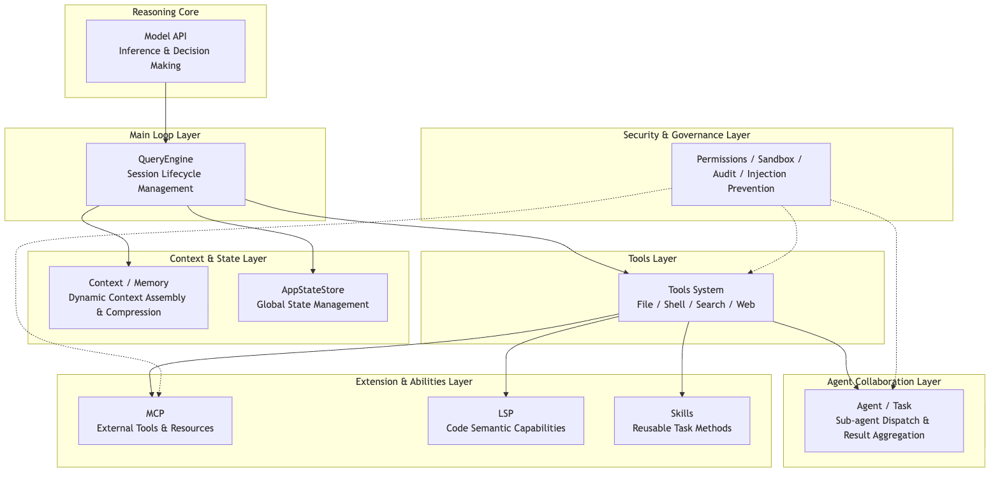
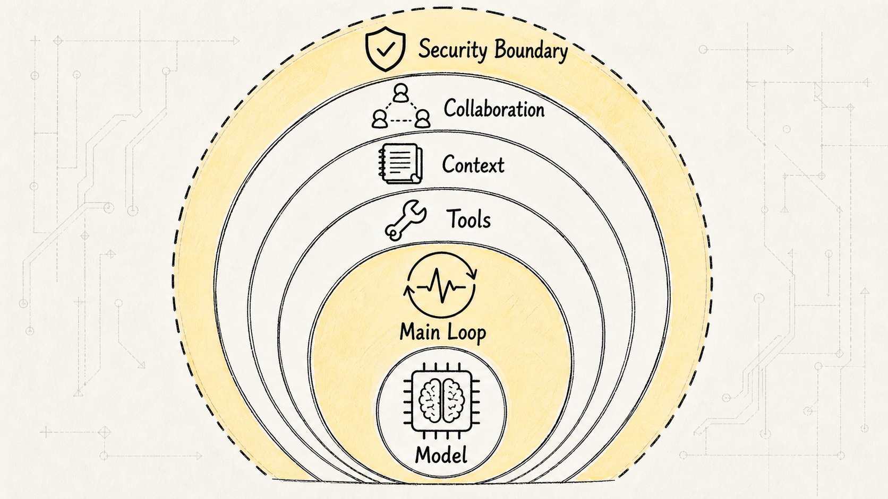
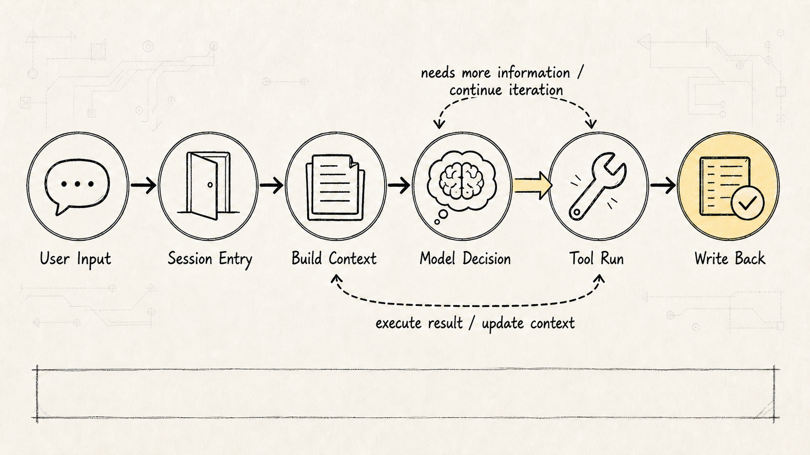
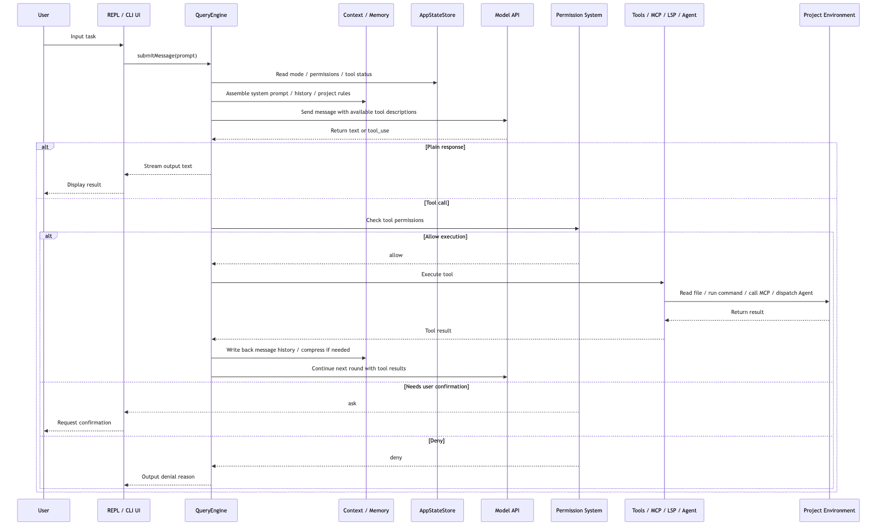
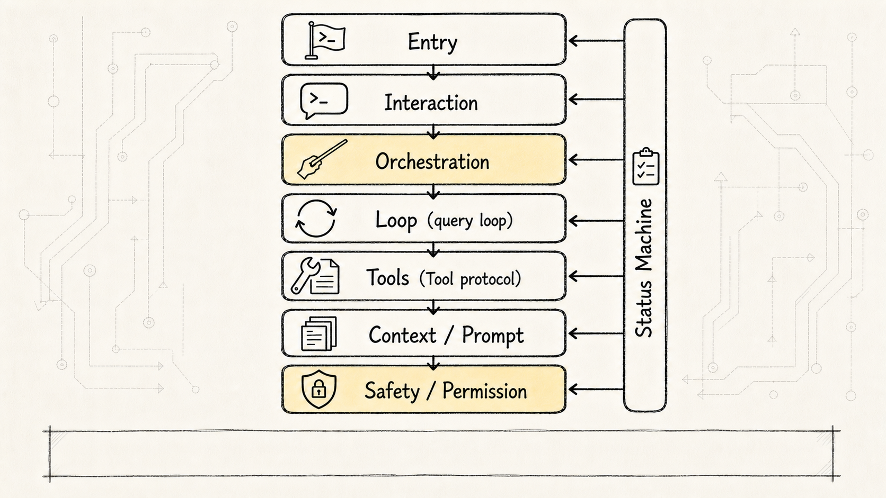
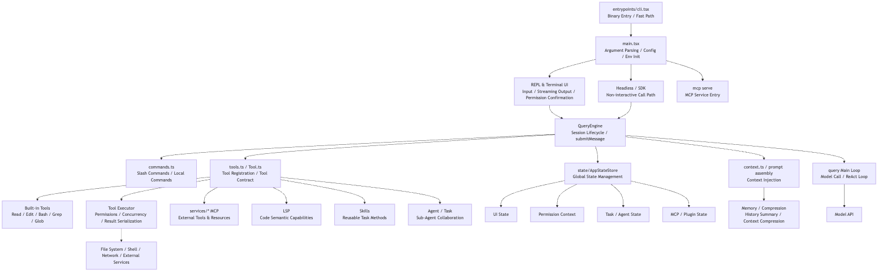

# Claude Code Source Analysis Series, Chapter 1: Engineering Architecture

When most people first encounter Claude Code, they mentally file it as "a chat box that can write code."

That's not wrong, but it misses the point. What makes Claude Code truly powerful isn't just that the model can answer coding questions. Wrapped around that model is an entire engineering system: it reads your project, invokes tools, maintains context, manages state, connects to MCP, dispatches sub-agents, and enforces permission and security boundaries.

So rather than diving straight into a specific function in the source, this chapter starts by answering a bigger question:

**What kind of engineering architecture is Claude Code, exactly?**

Here it is in one sentence:

**Claude Code = Model API + QueryEngine main loop + Tools system + Context/State management + Security governance + Agent collaboration.**

The model provides the core reasoning capability. What turns it into a "programming agent that gets things done" is the entire runtime layer wrapped around it.

To make this concrete, we'll approach it through three questions:

1. Functional architecture: What capability layers does it have?
2. Runtime architecture: How does a user's prompt flow through the system?
3. Code architecture: How is the source roughly organized by module?

These three questions build on each other: first understand what capabilities Claude Code has, then see how the QueryEngine orchestrates them, and finally map them back to the modules in the source code.

## 1. Why You Can't Just Hook Up a Model API

Suppose you build the simplest possible AI coding assistant. The flow would look something like:

```text
User asks a question
-> Backend forwards the question to the LLM
-> LLM returns an answer
-> Display the answer to the user
```

That's barely adequate for "explain this piece of code." But the moment the user says:

```text
Look at this project and figure out why the tests are failing, then fix them.
```

Things get complicated fast.

The model needs to understand the project structure, know what files exist, know how to run the test command, know where the error logs live, and know which file to change. After making changes, it needs to re-run the tests to verify. If it hits a permission error, a failed command, an overflowing context window, or an oversized tool output along the way, it needs to recover.

**Models can think — but they can't touch a real engineering environment on their own.**

A model doesn't natively read files. It doesn't natively execute shell commands. It doesn't natively maintain long-running task state. And it doesn't natively know which operations are dangerous. So Claude Code has to wrap a layer around the Model API — an "engineering shell."

That engineering shell is the core value of Claude Code.

This is exactly where many open-source agent projects stall: the model-calling layer looks great, but the engineering shell leaks the moment anything pushes back.



## 2. Functional Architecture: What Capability Layers Does Claude Code Have?



Viewed through its functional architecture, Claude Code resembles a layered Agent Runtime — an agent execution environment built around the model, responsible for dispatching tools, managing state, and advancing tasks.

At the innermost layer sits the `Model API`. This is the reasoning core, responsible for understanding tasks, generating responses, and deciding whether the next step requires calling a tool. But it is only the "brain," not the complete system.

Wrapped around the model is the first runtime layer: the `QueryEngine` — the query engine that turns a single user input into a continuously running agent main loop. Without the QueryEngine, Claude Code would be nothing more than a plain API wrapper. With it, it becomes a runtime capable of driving tasks forward on its own.

The next layer outward is the `Tools` system. This layer gives the model "hands and feet": file reads and writes, shell commands, search, web access, MCP, LSP, Agent tools, and Skills all belong here.

Beyond that lies `Context / Memory / State`. This layer answers the question: "What exactly should the model know for this turn?" It dynamically assembles the system prompt, user input, project rules, message history, tool results, file caches, compression summaries, and current application state.

Farther out still is `Agent Collaboration`. When tasks become complex, Claude Code does more than converse with the model in a single thread — it can decompose subtasks to subordinate Agents or Tasks. The main Agent handles the overall judgment; child Agents handle code search, solution exploration, or hypothesis validation.

At the outermost layer, underpinning every capability, is security governance. Because Claude Code operates in real engineering environments, it can read proprietary code, execute commands, modify files, and invoke external services. Without permissions, policies, sandboxing, prompt injection defenses, and audit logging, a more powerful agent only means greater risk.

The following diagram captures this:



The core message this diagram aims to convey is not "Claude Code has many modules," but rather:

**Claude Code's capabilities do not grow directly out of the model. They grow out of the engineering systems layered one by one around the model.**



### Model API: Responsible for Judgment, Not Execution

Let's clarify the most easily confused point first: the `Model API` does not directly execute any tools.

What the model actually produces is intent, roughly like this:

```text
I need to read a certain file.
I need to search for a certain keyword.
I need to run a test command.
I need to modify a certain piece of code.
```

But the actions — "read the file," "execute the command," "modify the code" — are all carried out by the Claude Code host program.

The division of labor is clear:

```text
The model handles understanding, planning, and choosing.
The program handles execution, constraints, and recording.
```

If you imagine every capability as the model's own magic, you'll miss where Claude Code's real value lies. The parts actually worth studying are precisely those that are "not intelligent but deeply engineered": tool contracts, permission systems, state management, context compression, error recovery, UI rendering, and session recording.

### QueryEngine: The Heartbeat of the Entire System

The `QueryEngine` is Claude Code's main loop.

Its role is not simply "sending requests to the model." It manages an entire session lifecycle. A session contains multiple rounds of user input, multiple rounds of model responses, multiple tool calls, and multiple state changes. The QueryEngine must string all of these together.

The state it maintains includes at minimum:

- Current message history
- Current working directory
- Currently available tool set
- Current model and budget
- File read cache
- Permission denial records
- Skill discovery records
- Token usage count
- Session transcript

Together, this state determines what Claude Code should do next.

(The implementation details of the QueryEngine will be covered in the next article, but it is fundamentally a state machine: each turn decides what to do based on the current state, executes it, then updates the state.)

### Tools System: The Model's Hands and Feet — But Always Under Control

Claude Code's tool system can be understood as a unified capability marketplace.

It includes basic tools:

```text
Read / Write / Edit / Grep / Glob / Bash
```

As well as extended capabilities:

```text
MCP / LSP / Web / Agent / Skill
```

The most important thing about the tool system is not "many tools," but that they are all placed inside a unified tool contract. Every tool must answer a set of questions:

- What is this tool called?
- What are its input parameters?
- How are inputs validated?
- How is it executed?
- How is output converted back into a message?
- Is it read-only?
- Is it destructive?
- Is concurrent execution allowed?
- Does it require user confirmation?

This is what makes Claude Code more engineered than "letting the model write shell commands on its own."

Take viewing a file, for example. Letting the model directly run:

```bash
cat src/main.ts
```

would certainly work, but the system would have no way of knowing the real semantics of that action. It's just a shell string.

By going through the `Read` tool instead, Claude Code can know:

This is a read operation.
What is the target path?
Is access authorized?
Is the output too large?
Should it be truncated?
Should it enter the file cache?
Will a subsequent Edit be based on the latest version?

This is the value of tool abstraction:

**Tools exist not to let the model "do more," but to make the model's actions understandable, constrainable, and auditable.**

### Context / Memory / State: Giving the Model What It Needs to Know

Another easily underestimated capability of Claude Code is context engineering.

Many people hear "context" and assume it means "writing longer prompts." But in Claude Code, context is not a static block of text — it is a runtime input dynamically assembled anew for every turn.

It may include:

- The base system prompt
- The current user input
- Conversation history
- Project-level rules
- User-level rules
- The current working directory
- Available tool descriptions
- External capabilities exposed via MCP / LSP
- Skill instructions
- File read results
- The result of the last tool execution
- A compressed summary of history
- The current AppState

Two problems here are genuinely hard.

**The first is "what to give."** Give too little, and the model lacks context; give too much, and the context explodes, sending cost and latency out of control.

**The second is "when to give it."** Some information should enter the system prompt right from the start; some should be fetched via tools only when the model actually needs it; some tool schemas can also be discovered lazily rather than crammed in all at once.

Put bluntly:

**Context Engineering is not prompt writing — it is context scheduling.**

`Memory / Compression` addresses the long-task problem. Real engineering tasks routinely cycle through searching code, reading files, running tests, analyzing errors, modifying code, and running tests again. Every step produces messages and tool results. If you stuff all of them back into the model verbatim, the context quickly becomes long and noisy.

The value of the compression mechanism is not simply saving tokens — it is keeping the Agent on track through long-running tasks.

`AppStateStore`, meanwhile, unifies CLI UI state, session state, tool state, and Agent state. Is the current session in Plan Mode? What MCP tools are currently available? What is the current permission mode? Is there a background task running right now? None of these can be resolved by model messages alone — they require an application state system.

### MCP / LSP / Skills: The Capability Integration Layer

Claude Code cannot bake every capability directly into the main program, so it needs an extension mechanism.

`MCP` (Model Context Protocol — a protocol that lets external tools and resources be called by the Agent in a standardized way) functions more like an external tool protocol. It lets Claude Code discover and invoke tools and resources provided by external services. Databases, browsers, design tools, internal systems — all can become Agent-callable capabilities through MCP.

`LSP` (Language Server Protocol — provides code-semantic capabilities like symbols, definitions, and references) leans more toward code intelligence. It helps Claude Code better understand the programming language itself.

`Skills` are closer to reusable task-method bundles. They are typically not a single API but a set of instructions, scripts, templates, and trigger rules that tell the Agent how to handle a certain class of task.

These three solve different problems:

```
MCP: How to standardize integration of external capabilities.
LSP: How to integrate code-semantic capabilities.
Skills: How to load reusable working methods.
```

Together they form Claude Code's extension layer.

(A practical pitfall during integration: if an MCP tool's schema is too large, it will directly blow up the context. Claude Code's approach is lazy discovery — not stuffing everything in all at once.)

### Security Governance: The More Capable the Agent, the More It Needs Boundaries

The security layer is not decoration — it is the prerequisite for Claude Code to exist as an engineering tool at all.

The security layer must address roughly four categories of problems:

```
Permissions & Policy: Which tools are available, which paths are accessible, which commands require confirmation.
Sandboxing: Confining dangerous actions to a controlled environment.
Prompt Injection Prevention: Preventing project files or external content from inducing the model to act without authorization.
Audit Logs: Recording what the model did, what tools executed, and what the user approved.
```

The most critical design principle here is:

**The model can suggest actions, but it cannot bypass system boundaries to act directly.**

When the model outputs a `tool_use` (the behavior where the model requests to invoke a tool via a specific format), it is only initiating a request. Before actual execution, it must still pass through the tool system and the permission system.

This is also the watershed between Claude Code and many toy Agents: toy Agents pursue "getting it to run"; production-grade Agents must pursue "getting it to run within constraints."

## 3. Runtime Architecture: How Does a Single User Sentence Flow Through the System?

After understanding the functional layer, let's look at the runtime architecture.

From the user's perspective, the process boils down to one sentence:

```text
User: Help me fix this bug
```

But inside Claude Code, that sentence isn't sent directly to the model. It first enters a runtime orchestrated by the QueryEngine.

A simplified runtime flow:

```text
User input
-> Claude Code session
-> QueryEngine.submitMessage()
-> Process user input and slash commands
-> Build context and system prompt
-> Call Model API
-> Model returns text or tool_use
-> Tool system checks permissions and executes tools
-> Tool results written back to message history
-> QueryEngine continues to the next round
-> Until the task is complete or user decision is needed
```



Drawn as a sequence diagram:



There are two feedback loops in this diagram.

**The first loop is the cycle between the model and tools:**

```text
Model determines the next step
-> Tool executes a real action
-> Tool result goes back to the model
-> Model continues reasoning
```

This is what enables Claude Code to push tasks forward continuously.

**The second loop is the cycle between context and state:**

```text
Each round changes the message history, tool results, permission state, task state
-> The next round, QueryEngine reassembles context based on those changes
```

This is why Claude Code isn't just "one question, one answer." It behaves more like a continuously running state machine.

### Slash Commands Don't Always Hit the Model

There's another detail in the runtime architecture: not all user input triggers a Model API call.

Some inputs are local commands — configuration, cleanup, compression, status viewing. If these were forced through the model, they'd waste tokens and introduce instability.

So when QueryEngine processes user input, it first determines:

```text
Is this a task that requires model reasoning?
Or is this a command that can be executed locally?
```

If it's a local command, the system returns the result directly and ends the round early.

(This is a pragmatic design choice. If typing `/clear` to clear the screen still required a round trip to the model, the experience would be terrible.)

### Plan Mode: Slowing Down Execution First

The runtime architecture also includes an important mode: `Plan Mode`.

For a typical chat product, the model can just respond directly. But for a coding agent, "acting immediately" carries risk — it might modify files, run commands, and affect the project state.

The point of Plan Mode is to split a task into two phases:

```text
First: understand and plan
Then: execute and modify
```

What this reflects is Claude Code's design philosophy around control:

- Not every task should be executed immediately.
- Not every tool should be open by default.
- The user should be able to see the plan at key decision points and decide whether to proceed.

A mature agent system doesn't blindly pursue "maximum automation." The real challenge is finding the balance between automation and controllability.

## 4. Code Architecture: How Is the Source Code Organized?

Let's return to code architecture at the end.

If functional architecture answers "what capabilities does Claude Code have," and runtime architecture answers "how do those capabilities run together," then code architecture answers:

**When you open the source code, what mental map should you build first?**

Here's a trick for reading the source: don't scan the directory tree horizontally. Claude Code has many source directories — `components`, `services`, `tools`, `hooks`, `utils` — and it's easy to get lost. A more reliable approach is to first identify the *load-bearing chain*:

```text
Entry point hands user input to a session
→ QueryEngine manages a conversation
→ query.ts drives rounds of ReAct
→ The Tool protocol turns model intent into executable requests
→ Context / Prompt determine what the model sees each round
→ Permission / Hooks / State determine whether an action can land
```



In other words, this section isn't listing directories — it's locating the source-code coordinates for the articles that follow.

Start by building an overall mental picture with this diagram:



This code architecture diagram can be read in layers.

### Entry Layer: cli.tsx and main.tsx

At the top are `cli.tsx` and `main.tsx`.

`cli.tsx` is the actual binary entry point. It handles fast-path options like `--version` that don't require loading the full application. The goal is to make the CLI tool start as quickly as possible.

`main.tsx` enters the full startup flow, responsible for command-line arguments, configuration, environment variables, preloading, and mode dispatch. It routes the program into different runtime paths:

```text
Interactive REPL
Headless / SDK
MCP service
Other command paths
```

Claude Code isn't just the "terminal chat" form factor. The REPL, SDK, and MCP service can all share the same underlying capabilities.

### Interaction Layer: REPL and Terminal UI

Claude Code is a CLI product. The terminal UI is not an afterthought.

It has to handle:

- User input
- Streaming output
- Tool execution progress
- Permission confirmations
- Error prompts
- Task status display
- Plan Mode interaction

This is also why the source code contains a substantial amount of UI rendering and state subscription logic. The agent doesn't just run in the background — the user needs to understand what it's doing, right in the terminal.

### Orchestration Layer: QueryEngine and the query Main Loop

`QueryEngine` is the session-level orchestration layer.

It connects upward to the REPL / SDK and downward to the query main loop, context system, state system, tool system, and command system.

The `query` main loop is more focused on model invocation and the ReAct Loop — an action-loop pattern where the model alternates between reasoning and executing actions. It's responsible for sending messages to the model, receiving model responses, identifying `tool_use`, and placing tool execution results back into the message stream.

A simple distinction:

```text
QueryEngine: manages an entire session.
query main loop: manages one or more model-tool cycles.
```

### Capability Layer: Tools / Commands / Services

The capability layer breaks down into three categories.

The first is `Commands`. It handles slash commands and local commands. Some user inputs don't require model reasoning — executing them locally is more reliable.

The second is `Tools`. It handles the tool capabilities the model can invoke: reading files, editing files, running shell commands, searching code, calling sub-agents.

The third is `Services`. It carries external integrations and extension capabilities: MCP, LSP, plugins, remote sessions.

These three categories together form Claude Code's execution layer.

### Context Layer: context, memory, compression

The context layer answers one question:

```text
What exactly should be sent to the model this round?
```

It's not just concatenating strings. It synthesizes the current task, conversation history, project rules, user rules, tool descriptions, MCP capabilities, skill descriptions, file read results, and compressed summaries.

This is also why Claude Code seems to "understand your project": the model doesn't innately understand it — the context layer continuously assembles project-relevant information and feeds it to the model.

### State Layer: AppStateStore

`AppStateStore` is responsible for global state.

It manages more than just UI state; it also covers:

- Current model configuration
- Tool permission context
- MCP clients and tools
- Plugin state
- Sub-agent / Task state
- Remote session state
- User settings

Without the state layer, it would be difficult for Claude Code to unify the "terminal application" and the "agent runtime."

### Security Layer: permissions, sandbox, audit

The security layer doesn't map to a single file in the code. Instead, it runs through tool execution, permission decisions, command classification, MCP calls, user confirmations, and session recording.

Its essence is turning the model's free-form intent into governed execution requests.

```text
The model says "here's what I want to do"
The system decides "are you allowed to do it"
The tool enforces "do it according to the rules"
The log records "here's what you did"
```

This is the difference between a production-grade agent and a demo agent.

### Load-Bearing Files in the Source: Read a Few Beams First

When it comes to reading source code, don't start by surveying every directory. Start with a handful of load-bearing files.

**`QueryEngine.ts`** is the session layer. Its job isn't that it "does everything directly" — it's that it holds everything one conversation needs to persist across turns: message history, permission denial records, file read caches, model configuration, tool sets, the MCP client, Agent definitions, and the AppState read/write entry point. Each call to `submitMessage()` is just a new turn within the same conversation.

**`query.ts`** is the loop layer. It maintains a per-iteration `State`, carrying messages, `toolUseContext`, `autoCompactTracking`, `turnCount`, `pendingToolUseSummary`, and other state into the next round. As the model streams its response, `query.ts` collects any `tool_use` blocks in the assistant message. If there are no tool calls, it wraps up. If there are, it executes them, appends the results back to the message list, and continues the loop.

**`Tool.ts`** is the action protocol layer. A tool is not a function — it is a protocol: input schema, invocation mode, whether it's read-only, concurrency-safe, destructive, requires permission, its result size, how it renders in the UI, how errors get backfilled, and more — all declared up front. The model doesn't output "I'll just do whatever." It outputs "I want to initiate a request under this tool protocol."

**`tools.ts`** and **`services/tools/toolExecution.ts`** are the tool menu and execution lifecycle. The former determines which tools the model can see in the current turn; the latter governs how a single tool call goes through schema validation, tool-level input validation, permission checks, hooks, actual execution, and result serialization.

**`context.ts`**, **`constants/prompts.ts`**, and **`services/compact`** are the model's workbench. They determine how system rules, project memory, Git state, tool descriptions, message history, tool result budgets, and compaction summaries are assembled into each model request.

So source reading can be compressed into one line:

```text
QueryEngine manages sessions, query.ts manages the loop, Tool defines action boundaries, Context/Prompt assemble the model's workbench.
```

Once this backbone is clear in your mind, MCP, Skills, Agents, and Plans won't feel like scattered feature islands. They're all extensions that plug into this main highway.

## 5. The Three-Layer Architecture as a Whole

Now let's bring everything together into a unified understanding.

The functional architecture tells us that Claude Code is not a model—it is a *capability system* built around a model:

```text
Model API
-> QueryEngine
-> Tools / Context / Memory / State
-> MCP / LSP / Skills / Agent Collaboration
-> Security & Governance
```

The runtime architecture tells us that a user's prompt does not go directly to the model—it enters a continuously running Agent Runtime:

```text
User Input
-> QueryEngine assembles context
-> Model API makes a decision
-> Tools execute
-> Results flow back
-> QueryEngine proceeds to the next round
```

The code architecture tells us how to find entry points when reading the source, guided by these layers:

```text
Entry layer:       cli.tsx / main.tsx
Interaction layer: REPL / Terminal UI
Orchestration layer: QueryEngine / query
Capability layer:  Tools / Commands / Services
Context layer:     context / memory / compression
State layer:       AppStateStore
Security layer:    permissions / sandbox / audit
```

So the essence of Claude Code is not "a model plus a handful of tools." It is:

**An extensible, governable, continuously running Agent Harness built around a model.**

"Harness" is an apt metaphor here: the model supplies intelligence; the Harness supplies the operating environment. Without the model, the system has no reasoning ability; without the Harness, the model has no stable ability to get things done.

## 6. The Main Thread in a Nutshell

If all you want is the backbone of Claude Code's engineering architecture, hold on to these few lines:

1. Claude Code is not a chat box — it is a CLI-based Agent Runtime.
2. The Model API is the reasoning core, but it does not directly execute real-world actions.
3. The QueryEngine is the main loop that strings together user input, model responses, tool calls, and state transitions.
4. The Tools system is the execution layer, but every tool must pass through contracts, permissions, and result serialization.
5. Context Engineering is the dynamic assembly of context — it is not simply writing a long prompt.
6. The AppStateStore enables the CLI UI, session state, tool state, and agent state to work in concert.
7. MCP, LSP, and Skills form the extension layer, so Claude Code does not have to hard-code every capability internally.
8. The security layer determines whether an agent can graduate from demo to real-world engineering environments.

The next piece dives deeper: how exactly the `QueryEngine` implements this dialogue main loop, and how it threads model calls, tool execution, and context compression together into a resumable state machine.
