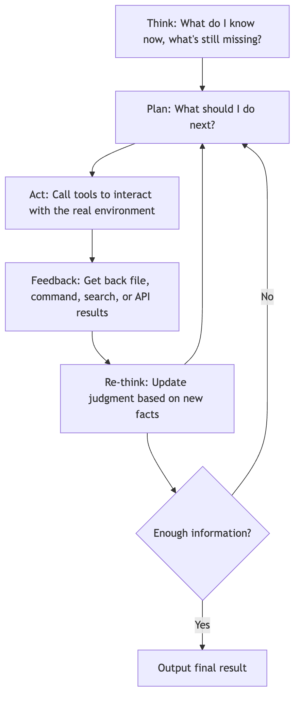
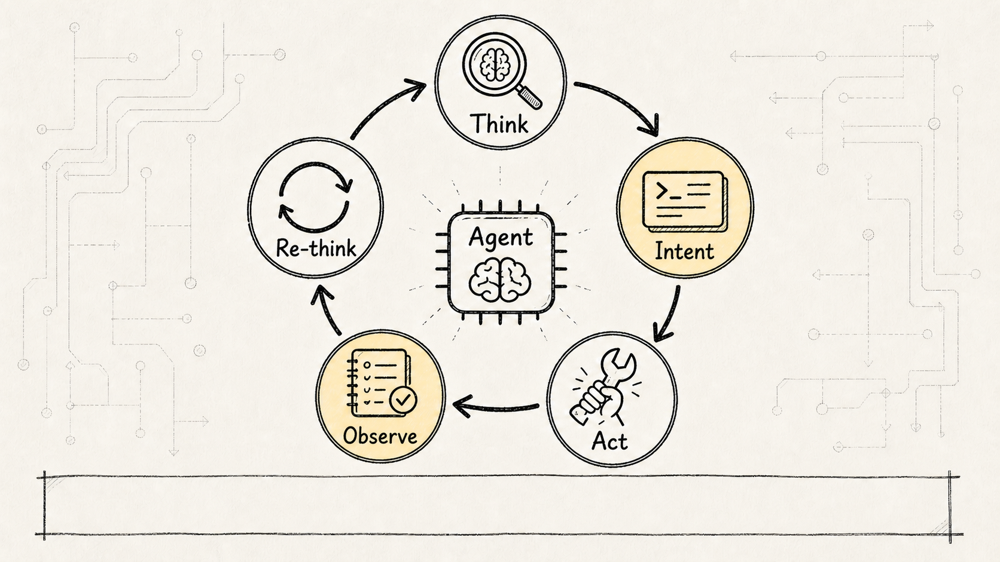
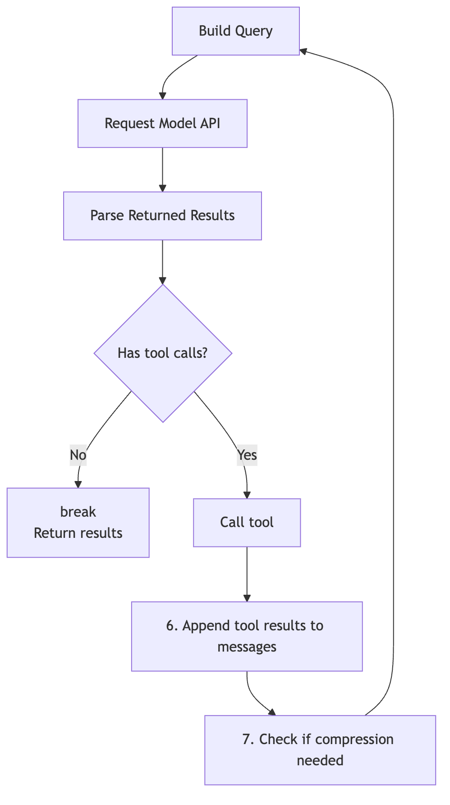
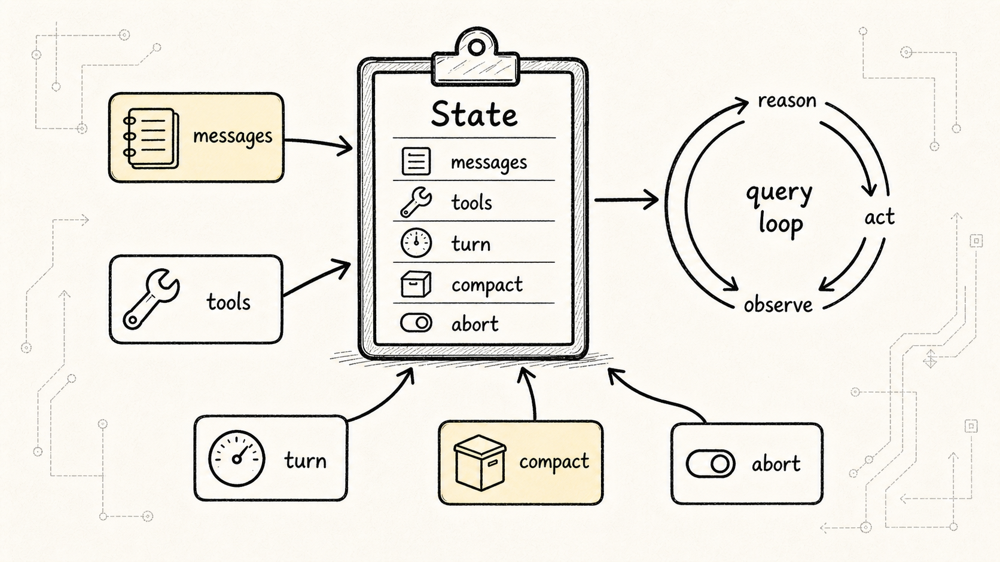
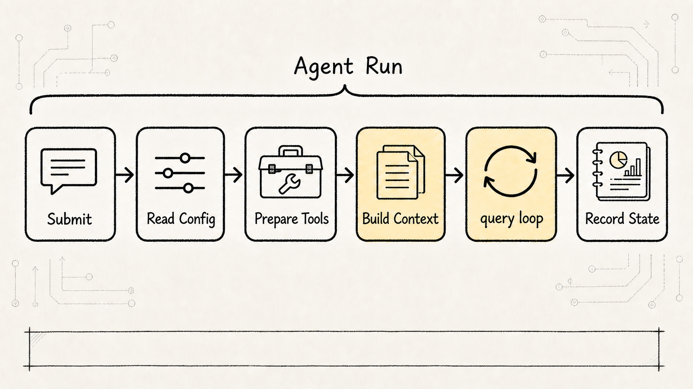
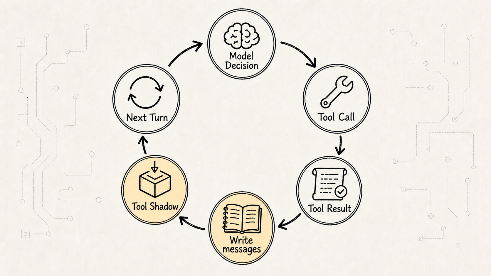
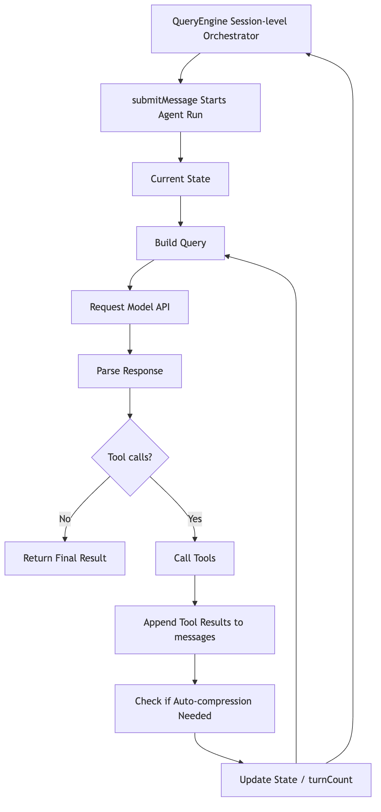

# Chapter 2 of the *Claude Code Source Analysis Series* — The ReAct Main Loop

Claude Code is not just a model wrapper. It is a runtime where `Model API` handles reasoning, `QueryEngine` carries the session forward, `Tools` interface with the real engineering environment, and `Context / State` keeps multi-step work coherent across turns.

This chapter drills into the innermost control loop: how `query.ts` turns a single model call into an agent run that can keep gathering evidence, invoking tools, and advancing the task.

We'll use a simple debugging scenario throughout:

```text
Take a look at why the tests are failing in this project and fix them.
```

A model on its own cannot natively read files, run commands, or maintain task state. So the question becomes:

**How does Claude Code get the model to operate inside a controlled loop — reasoning, acting, absorbing results — until the task genuinely moves forward?**

This is exactly what `ReAct` solves.

You do not need to memorize the acronym. Just keep this minimal feedback loop in mind:

```text
Assess the current situation
Decide what to do next
Actually carry it out
Get the result
Reassess based on the new result
```

As a flowchart, it looks like this:



What `query.ts` does in Claude Code is engineer this feedback loop into a working system. The model reasons over the current context, then decides whether to act; the results of that action are written back into context, and the model proceeds to the next round of reasoning.

The part of the diagram that really matters isn't the fancy terminology — it's the straightforward state machine on the right side:

```text
Build Query
-> Request Model API
-> Parse the response
-> Check if there are tool calls
-> If none, return the result
-> If yes, invoke the tools
-> Append tool results to messages
-> Check if compression is needed
-> Loop back to the next Query
```

This loop is what turns the architecture into a working runtime instead of a static component list.

But if you think of it as nothing more than a `while` loop, you're still missing a layer. A better framing is to see `QueryEngine` not as a "single-request handler" but as a "session-level task orchestrator." It doesn't just spin up for one incoming message and then disappear — it holds long-lived state across an entire conversation, threading together the model, tools, permissions, context, and compression.

So in this chapter we need to grasp both layers at once:

```text
The query.ts layer: how each round of ReAct state transitions happens.
The QueryEngine layer: how state, tools, permissions, and resources are continuously orchestrated across an entire session.
```

The former explains "how the loop runs"; the latter explains "why this loop can persist stably across many rounds of a task."

## 1. Why the Main Loop Can't Just Call the Model API Once

Let's start with the simplest case.

A user asks:

```text
Explain what useEffect does.
```

The program sends the question to the model, the model produces an answer, done.

But what if the user asks:

```text
This React project won't start. Help me fix it.
```

The model almost certainly doesn't know the answer on the first round. It needs more facts at minimum:

```text
What's the project structure?
What scripts are in package.json?
What error does the start command throw?
Where's the relevant source code?
After I make changes, do the tests pass?
```

These facts don't live in the model's parameters, and they're not in the user's one-liner. They exist in the real engineering environment: the file system, the shell, Git, test frameworks, logs, dependency configs.

So the agent needs an extra layer of mechanism:

```text
The model assesses what it's missing
→ initiates a tool call
→ the program executes the tool
→ feeds the result back to the model
→ the model reassesses based on new facts
```

That's why the ReAct loop exists.

It's not about making the pipeline complex. Real tasks simply can't be resolved in a single response. It's more like a continuous correction process: form a hypothesis, gather evidence from the scene, then adjust the next move based on what you find.

Anyone who's debugged a production outage will recognize this pattern: start with a hypothesis, go gather evidence on the ground, then revise the next step based on what the evidence tells you.



## 2. ReAct Is Not the Model Acting on Its Own — It Is the Model Expressing Intent

This is an easy point to get wrong:

**The model is not literally reading files, running commands, or editing code by itself.**

What the model can produce is an *intent to act*. For example:

```text
I need to read package.json.
I need to search for handleEnter.
I need to run npm test.
I need to edit a file.
```

The part that actually acts is Claude Code's host runtime: the outer layer made up of `QueryEngine`, the tools system, and the permissions system.

So the more accurate division of labor is:

```text
The model decides what should happen next.
Claude Code decides whether it is allowed, how it is executed, and how the result is recorded.
```

That is exactly why Claude Code is much more than simply "connecting the model to a shell."

If you let the model emit raw shell commands and execute them directly, the system has no structured understanding of what the action means. Permissions, auditing, error recovery, and context write-back all become difficult to control.

The tools system turns an action into a structured event:

```text
Tool: Read
Arguments: a file path
Permission mode: read-only
Result: file contents or an error
Write-back: appended to messages as a tool result
```

That way, the model still does the reasoning, but the action itself is placed inside a controlled engineering framework.

In one sentence: the model decides, the tools touch the real world, and `QueryEngine` organizes judgment and action into a sustainable loop.

## 3. The `query.ts` State Machine: The Core Is Not a Function — It's the `State`



The diagram on the left lists the `State` structure in `query.ts`. It highlights something important:

The Claude Code main loop doesn't chug along on scattered global variables — it revolves around a unified state object.

In simplified form, it looks like this:

```ts
interface State {
  messages: MessageParam[]
  toolUseContext: ToolUseContext
  turnCount: number
  shouldAutoCompact: boolean
  autoCompactTracking: {
    consecutiveFailures: number
    totalMessages: number
  }
  aborted: boolean
}
```



These few fields are the keys to understanding the ReAct loop.

### `messages`: The Agent's Short-Term Working Memory

`messages` is not an ordinary chat log.

Inside the agent loop, it acts more like a running ledger:

```text
What the user just said
What the model decided in the last turn
What tool calls the model initiated
What results the tools returned
What summary the system retained after compaction
```

The model does not automatically remember everything that has happened before. Every time Claude Code calls the Model API, it repackages the relevant history and includes it in the next model request.

So the point of `messages` is:

**Turning multi-turn actions into context the model can see in the next turn.**

Without `messages`, every model invocation would start from scratch, as if suffering from amnesia.

### `toolUseContext`: What Tools Are Available This Turn

`toolUseContext` is the tool environment.

It's not just a list of tools — it tells the main loop:

```text
Which tools are available right now?
What is the input schema for each tool?
What context does tool execution need?
How should results be converted into messages?
Which operations require permission checks?
```

The `Act` in ReAct is not an abstract action — it's a concrete action constrained by the tool system.

"Read a file" via the `Read` tool and "read a file" by running `cat` directly are two entirely different things in engineering terms. The former is traceable, constrainable, and can be written back into context as a structured tool result; the latter is just a string — and you may never know what it actually did when something goes wrong.

In other words, tools don't just need to run — they need to be traceable, constrainable, and structured so their results can flow cleanly back into the loop.

### `turnCount`: This Is a Multi-Turn System, Not a Single Request

`turnCount` tracks how many iterations the loop has already completed.

The field itself looks mundane, but it exposes a fundamental design truth:

**Claude Code was designed from the start with the assumption that tasks will span multiple turns.**

It is not "ask the model once and hope it gets the answer right." It allows the model to gather information incrementally across turns, invoke tools, and course-correct its judgments.

`turnCount` also serves as a guard against infinite loops, enables logging statistics, and triggers degradation strategies. A mature agent must know how long it has been spinning, or it can easily get stuck circling a failure path.

So a mature agent must have turn counts, budgets, and exit conditions. Without these boundaries, a multi-turn loop easily turns into running in circles.

### `shouldAutoCompact`: Context Swells — Compaction Must Be Part of the Main Loop

Once an agent starts invoking tools, `messages` grows rapidly.

Reading a large file, running a test, searching for a batch of results — all of these dump huge amounts of information back into message history. Short tasks are fine, but long tasks will slam into the context window very quickly.

So `shouldAutoCompact` is not a nice-to-have optimization — it is a mandatory capacity-governance signal for any long-running agent.

It answers:

```text
Is the current message history too long?
Should older content be compressed into a summary?
Has compaction been failing consecutively?
How has the message volume changed before and after compaction?
```

Notice in the reference diagram why "check if compaction is needed" comes immediately after "append tool results to messages."

Because tool results are precisely what causes context to swell.

### `aborted`: An Agent Must Also Be Safely Interruptible

Real engineering tasks don't always end gracefully.

A user might cancel, a command might get stuck, a tool might time out, a permission might be denied.

`aborted` signals that this loop can be interrupted externally. It's a reminder that an agent's main loop must account not only for "how to start" and "how to succeed," but also for "how to stop."

An agent that can't be safely stopped becomes more dangerous the more capable it gets.

The more capable an agent is, the more it needs the ability to be halted cleanly.

## 4. The QueryEngine Perspective: It Manages a Session, Not a Single Request

At this point, we've seen how one round of the ReAct state machine works inside `query.ts`. But reading the source code requires stepping one layer further out: who holds the long-lived state that this loop depends on?

The answer is `QueryEngine`.

One useful way to read the source is to treat `QueryEngine` at the conversation level. That framing matters because `QueryEngine` is not a one-shot request handler — it is a session object.

A single-request handler typically cares about:

```text
What's the input?
What should I return?
Is this call finished?
```

A session-level orchestrator, however, cares about:

```text
How do I keep appending to the message history?
Which permissions were previously denied?
Which files have already been read?
What's the current-round and cumulative usage?
Which skills have been discovered?
Which memory paths have been loaded?
Is the current task interrupted?
```

That's why `QueryEngine` surfaces a lot of cross-round state, for example:

```ts
type ConversationRuntimeState = {
  messages: Message[]
  abortController: AbortController
  permissionDenials: PermissionDenial[]
  totalUsage: Usage
  readFileCache: FileStateCache
  discoveredSkills: Set<string>
  loadedMemoryPaths: Set<string>
}
```

These fields show it's not a thin wrapper that "forwards the prompt to the model." It's maintaining the live context of a conversation.

The relationship between the two can be understood like this:

```text
QueryEngine: session-level runtime, responsible for holding long-lived resources and state.
query.ts loop: task execution engine, responsible for building a Query round by round,
               calling the model, running tools, and appending messages.
```

`State` is more like a working snapshot of a single loop iteration; `QueryEngine` is more like the scheduling center behind the session.

With this perspective in place, ReAct is no longer just a small loop of "should the model keep calling tools." It's part of a complete task lifecycle.

## 5. `submitMessage()`: The Real Entry Point That Starts an Agent Run

Following the trail from a user action, whenever a user submits a message, the real entry point typically lands on a method like `submitMessage()`.

Unlike a typical backend endpoint that receives nothing more than a `prompt`, this method reads and prepares an entire set of runtime resources at once:

```text
Current cwd
Available tools
Slash commands
MCP clients
Thinking configuration (whether extended reasoning mode is enabled)
Max turns
Budget limits
Session persistence state
```

So `submitMessage()` is not fundamentally "fire off a chat request." It is:

**Launch an agent run.**

Over the course of that run, it has to handle roughly the following:

```text
Read current config and session state
Set up the working directory and session environment
Wrap the tool permission determination logic
Prepare the system prompt and context
Invoke the underlying query loop
Handle tool calls as the model produces output
Write tool results back into session history
Track usage, cost, and boundary conditions
```

The ReAct loop inside `query.ts` is just the inner kernel of "how the task moves forward"; `submitMessage()` and `QueryEngine` are what put that kernel into a real Claude Code session and actually run it.

This is also where Claude Code is more engineered than a minimal agent demo. A demo usually only proves that "the model can call tools," but `QueryEngine` has to guarantee:

```text
Is this tool call actually allowed?
Can the result feed back into the next round of model input?
Can it recover on failure?
Will state get corrupted across a long-running session?
Will context or budget spiral out of control?
```

Real agent engineering lives in these places that don't look flashy.



## 6. Translating the Right-Hand Flow into Code: What Actually Happens Inside the While Loop?

The right side of the diagram translates into a simplified pseudocode snippet:

```ts
while (!state.aborted) {
  const query = buildQuery(state)
  const response = await requestModelAPI(query)
  const parsed = parseModelResponse(response)

  if (!parsed.hasToolUse) {
    return parsed.finalAnswer
  }

  const toolResults = await runTools(
    parsed.toolUses,
    state.toolUseContext,
  )

  state = appendToolResultsToMessages(state, response, toolResults)
  state = maybeAutoCompact(state)
  state = nextTurn(state)
}
```

There are three key points in this pseudocode.

First, `buildQuery(state)` is not simply concatenating the user's question. It constructs the model input for the current turn based on the current `State`, including message history, system prompt, available tools, context summaries, and so on.

Second, the result returned by `requestModelAPI(query)` is not necessarily the final answer. It could be text, or it could contain a tool invocation request.

Third, the loop only ends when the model no longer requests tools. As long as the model still needs tools, Claude Code will keep executing them, feeding results back, and advancing to the next turn.

So `while(true)` isn't a mindless infinite loop.

The real exit conditions are:

```text
The model no longer requests tools
or the task is interrupted
or an engineering limit, error, or permission block is triggered
```

This is the heartbeat of the agent loop.

(When reading the source, set breakpoints on these three functions: `buildQuery`, `parseModelResponse`, `maybeAutoCompact`. They map to three core questions: how input is assembled, how output is interpreted, and how state is governed. If those three are clear, the rest of the file becomes much easier to follow.)

## 7. "Has Tool Calls?" — the critical fork in the whole machine

Refer back to the diamond in the diagram:

```text
Has tool calls?
```

Simple as it looks, this step defines the semantics of the current turn.

No tool calls means the model considers the available information sufficient and can deliver a final answer:

```text
no -> break -> return result
```

Has tool calls means the model believes the information is still incomplete and it needs to go gather evidence from the outside world:

```text
yes -> invoke tools -> write back to messages -> another round
```

Tool calls are not an add-on feature. They are the switch that moves Claude Code from answer mode into action mode.

A conventional chatbot usually stops at the first case: generate text and done.

An agent, on the other hand, must support the second case: the model admits it doesn't yet know and fills in the gaps through tools.

This is also the core of ReAct:

```text
Reason: the model judges the next step based on current context
Act:    the model issues a tool-call intent
Observe: the tool result is written back into messages
Reason: the model continues judging based on the new observation
```

Round after round, it spins through this cycle — and only then does the system come across as something that "gets things done."

## 8. Why Must Tool Results Be Appended to Messages?

After a tool executes, the most critical step isn't "getting the result" — it's:

**Writing the result back into the message stream.**

For example, the model requests reading `package.json`. The tool does read the file contents, but if that result isn't appended to `messages`, the model in the next turn has no way to see it.

This creates a bizarre disconnect:

```text
Model: "I need to read package.json"
System reads package.json
Model (next turn): "I still don't know what's in package.json"
```

Appending tool results to `messages` is fundamentally about completing the `Observation` step in ReAct.

It translates a fact from the external world back into context the model can consume.

Another way to think about it:

```text
Tool calls let the model touch the real world.
Appending to messages lets the model remember what it just touched.
```

Without the former, the model can only guess.

Without the latter, the model suffers amnesia after every action.

Plenty of minimal agent demos appear to invoke tools, yet they fail on longer tasks for exactly this reason: they have `Act`, but they do not have a reliable `Observe -> write-back -> next-round Reason` loop.



## 9. Why Is Compaction Placed After Tool Write-Back?

The final step in the reference diagram is:

```text
Check if compression is needed
```

And it sits right after "Append tool results to messages."

This ordering matters a great deal.

Tool results are often the primary source of context bloat:

```text
Read a file     → may return hundreds of lines of code
Run a test      → may return a long log dump
Search code     → may return dozens of hit locations
Call an external service → may return a large structured JSON
```

If every one of these results gets fed verbatim into the next round of model input, long tasks quickly become expensive, slow, and prone to losing focus.

So Claude Code has to keep asking one question inside the main loop:

```text
Can the current messages still be carried forward as-is?
```

If not, compression kicks in.

Compression doesn't mean casually discarding content — it means preserving the information that remains useful for downstream tasks:

```text
What is the user's goal?
What has already been tried?
Which files have been read?
Which commands have been run?
Which errors are still unresolved?
What should the next step focus on?
```

Auto-compression is not a "token-saving trick" — it is the infrastructure that makes long-running Agents possible in the first place.

Without compression, the harder the ReAct loop works, the more the message history spirals out of control.

The compaction strategy is a strong signal of agent-engineering maturity: crude truncation risks dropping critical information, while over-compression can make the model "forget" what it has already done. We'll unpack this in more detail when we get to context management.

## 10. From a Source-Reading Perspective, How Do You Trace This Main Thread?

Read `query.ts`, but don't jump straight into the branches.

A better approach is to first get a handle on these 8 questions:

```text
1. Where is the QueryEngine created?
2. How does submitMessage kick off an agent run?
3. Where is State created?
4. What does buildQuery pull from State?
5. After the Model API returns, how does the code detect tool use?
6. Where are tool calls actually executed?
7. How are tool results appended back into messages?
8. When does compaction trigger?
```

Once these 8 questions connect, the main relationships between `query.ts` and `QueryEngine` become clear.

If you want to go deeper, you can pin these questions to a few more concrete source anchors:

```text
QueryEngine.ts
-> Find submitMessage: how user input enters a turn

query.ts
-> Find QueryParams: what inputs a query round needs
-> Find State: what state is preserved between loops
-> Find queryLoop: where messagesForQuery is assembled each round
-> Find tool_use collection: how model output becomes a list of tool calls
-> Find the tool execution entry: how runTools / StreamingToolExecutor is chosen
-> Find tool_result write-back: how tool results merge into the next round's messages

services/tools/StreamingToolExecutor.ts
-> See how streaming tool execution and concurrency safety work together

services/tools/toolOrchestration.ts
-> See how batched tool calls are grouped by isConcurrencySafe
```

Behind these anchors lies the same engineering pipeline:

```text
messagesForQuery
-> model stream
-> assistantMessages + toolUseBlocks
-> toolResults
-> next State.messages
```

The many branches in the source still trace back to this same pipeline. Prompt-too-long recovery, max-output-tokens recovery, stop-hook blocking, compaction, memory prefetch, and skill discovery are all, at bottom, answering the same question: if this round does not complete cleanly, how should the next round's `State` be constructed?

You'll find that what this file really wants to convey isn't "some particular function is incredibly complex," but rather a very stable engineering pattern:

```text
State
-> Query
-> Model Response
-> Tool Use?
-> Tool Result
-> Updated State
-> Next Query
```

Once you understand this pipeline, everything else — Tools, Context, Prompt, Memory, Permission — can be mapped back onto it.

Tools are the action layer.

Context is the material organization for each round's Query.

Prompt is the set of rules telling the model how to decide and act.

Permission is the brake that sits before every action.

Compact is capacity governance for long-running tasks.

And `query.ts`'s ReAct state machine is the backbone that threads all of these capabilities together.

## 11. Redraw the Reference Diagram as a Mermaid Flow

You can compress the entire diagram into the following flow:



The two loops in this diagram are the most important thing to take away.

The first is the ReAct loop:

```text
Reason -> Act -> Observe -> Reason
```

The second is the engineering state loop:

```text
QueryEngine -> State -> Query -> Response -> Tool Result -> State -> QueryEngine
```

The former explains why an agent seems to think while doing.

The latter explains why the source code must include `QueryEngine`, `State`, `messages`, `toolUseContext`, `turnCount`, `autoCompactTracking`, `permissionDenials`, and `totalUsage`.

## 12. One-Sentence Summary

The ReAct mechanism in `query.ts` is, at its core, maintaining a continuously evolving `State`.

In each cycle, Claude Code builds a Query from the current `State`, calls the model API, and parses whether the model wants to invoke a tool. If the model no longer needs a tool, it returns the final result. If the model needs a tool, the system executes it, appends the result to `messages`, checks whether compression is necessary, and then enters the next cycle with the updated `State`.

Surrounding this loop, `QueryEngine` holds session-level state and organizes tools, permissions, context, budget, caching, and interrupt control into a complete task runtime.

So Claude Code is not a "model answers once" program. It is a state-driven agent runtime:

```text
The model decides the next step.
Tools touch the real world.
messages bring the real world back to the model.
Compression keeps long tasks running.
State organizes all of this into a sustainable loop.
QueryEngine places this loop inside a session-level runtime.
```

Once you understand this ReAct loop, Prompts, Tools, Context management, and multi-agent collaboration stop looking like scattered modules.

They all serve the same purpose:

**Enabling the model not just to speak, but to get things done step by step in the engineering world.**
