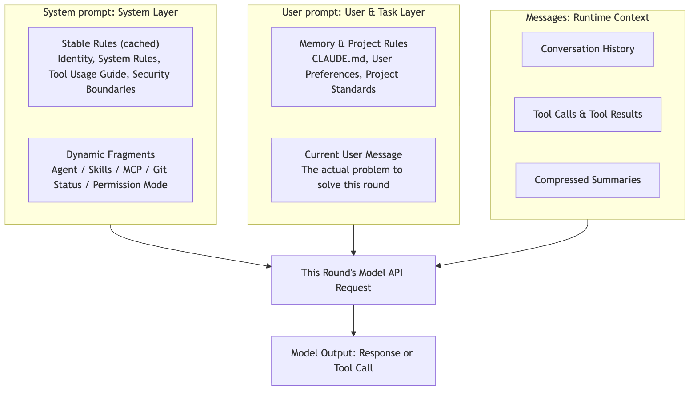
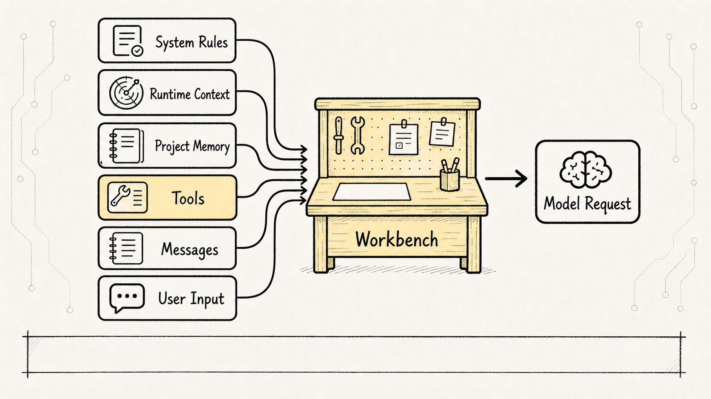
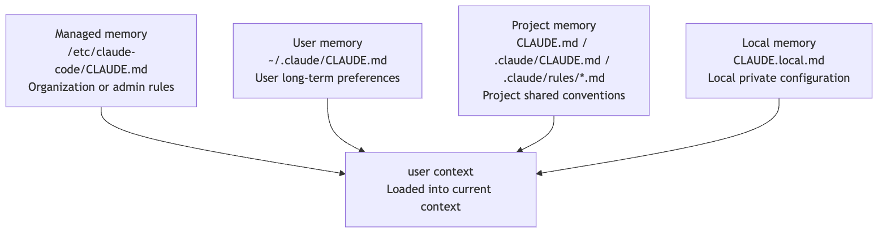
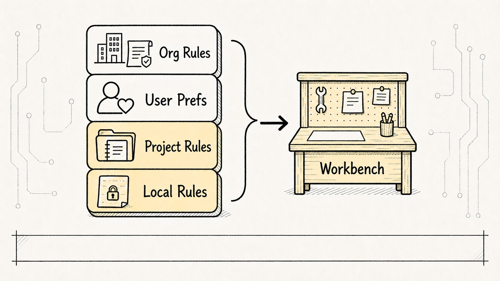
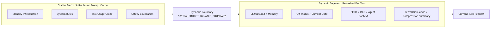
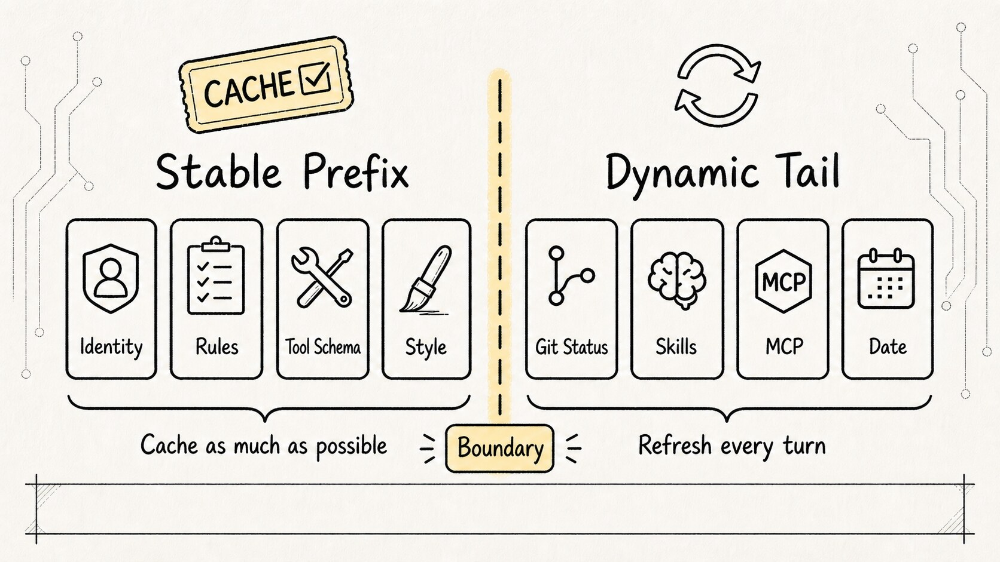
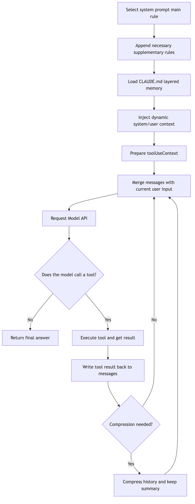

# Chapter 3 of the *Claude Code Source Analysis Series* — Prompt Construction

Claude Code does not run on a single static prompt. Before every model call, it rebuilds a working context from system rules, project memory, runtime state, tool descriptions, message history, and the user's latest input.

That leads straight to a new question:

**Before each round of model invocation, what exactly does Claude Code show the model?**

When people first build an Agent, they often start from a very natural assumption:

```text
All I need is a sufficiently strong system prompt.
I'll tell the model it's a programming assistant,
that it should follow the rules and can call tools.
Wouldn't that basically give me Claude Code?
```

That assumption isn't wrong, but it only scratches the surface.

The real Claude Code does not rely on a single fixed prompt at all. Before each round of calling the model, it assembles a fresh batch of information from scratch: base identity, system rules, the current mode, project memory, user preferences, Git status, tool descriptions, skill descriptions, MCP capabilities, message history, tool results, compressed summaries — plus the user's latest input.

So this chapter is not answering:

**What does Claude Code's prompt say?**

It is answering:

**How does Claude Code stitch together context from multiple sources at runtime into an input that the model can understand, act on, and stay within bounds?**

In one sentence:

**Claude Code's prompt is not a static template. It is a runtime assembly process: it selects system prompts by priority, loads memory by layer, injects dynamic context each turn, and feeds tool results back into the next round's messages.**

Take a look at this diagram first to build a mental model:



What this diagram shows is that what looks like a single prompt is actually split into a stable segment, a dynamic segment, a memory segment, the current user message, and message history. What this runtime manages is not just wording. It manages **which source overrides which, what enters context first, what can be cached, and what must be refreshed every turn**.

## 1. Why can't you just write one big prompt?

Think about a real scenario.

A user types this from the project root:

```text
Help me figure out why this project's tests are failing and fix them.
```

With a single generic prompt, the model knows at most:

```text
You are a programming assistant.
Help the user fix code.
Keep answers concise.
```

Not even close.

What the model actually needs to know:

```text
Which project is this?
What's the current directory?
Does the project have its own development conventions?
Does the user have personal preferences?
Are there uncommitted changes in the working tree right now?
Which tools are available?
Which commands require confirmation?
Which files have already been read and which tests run in previous turns?
If the context gets too long, which history has been compressed into summaries?
```

This information isn't hardcoded into a template — it's only available at runtime.

Git status changes. Today's date changes. Tool call results change. User input changes. The `CLAUDE.md` in the current directory might be completely different from another project's.

So the challenge Claude Code faces isn't "how to write a universal prompt" — it's a more engineering-driven question:

**Before each model call, exactly which information should go in? In what order? If information conflicts, which source wins? If it's too long, what gets dropped first? If something can be cached, where do you draw the boundary?**

That's why Prompt Runtime exists.



## 2. A Single Model Turn Contains More Than Just the System Prompt

Let's disentangle a few concepts first, so they don't blur together later.

We habitually call everything we feed the model a "prompt." But in an agent system like Claude Code, a single model turn breaks down into at least these categories:

```text
system prompt       System-level behavioral rules
system context      System environment context, e.g. Git status
user context        User and project context, e.g. date, CLAUDE.md
messages            User messages, model responses, tool calls, tool results
toolUseContext      Currently available tools, their schemas, permissions, and execution context
```

Each of these has a distinct job.

The `system prompt` is the model's operating manual — it says "who you are, how you work, what your boundaries are."

The `user context` provides long-term constraints from the user and the project: "this project uses pnpm," "write commit messages in Chinese," "don't directly edit generated files."

The `system context` is runtime intelligence: the current Git branch, working-tree changes, latest commit, current username.

The `messages` are the live ledger — a record of everything that has happened so far in this task: what the user said, what tools the model invoked, what results came back.

The `toolUseContext` tells the model which "hands and feet" it has available this turn: `Read`, `Edit`, `Bash`, `Grep`, `Task`, MCP tools, Skill tools, and so on.

So Claude Code's assembly logic can be simplified to this:

```text
Stable system rules
+ current runtime environment
+ user / project memory
+ tool capability descriptions
+ historical messages and tool results
+ current user input
=> this turn's model request
```

Fixating solely on "how well-written the prompt text is" misses the point. What really determines whether an agent is reliable is how this information gets organized, overlaid, cached, and compressed. You can craft a gorgeous system prompt, but if the tool results aren't correctly backfilled, the model will still lose its thread.

## 3. First Layer: The System Prompt Is a Priority Decision, Not Simple Concatenation

First, let's look at the system prompt priority. Abstracted, it forms this selection chain:

```text
0. overrideSystemPrompt   Completely replaces all prompts, e.g. loop mode
1. Coordinator prompt     Used when coordinator mode is active
2. Agent prompt           Prompt defined by a custom Agent
3. customSystemPrompt     Specified via --system-prompt
4. defaultSystemPrompt    The standard default Claude Code prompt
5. appendSystemPrompt     Always appended at the end
```

Let's unpack these names individually. They are not configuration items of the same provenance — they are the "entry points" Claude Code reserves when assembling the effective system prompt:

| Name | What it means | Where it comes from |
| --- | --- | --- |
| `overrideSystemPrompt` | The highest-priority internal override. When present, it bypasses the default prompt, custom prompt, and Agent prompt selection logic entirely, directly replacing the main system prompt with this content. | Not a regular user-facing CLI argument. It typically comes from higher-level internal callers — for example, certain loop / fork / background task modes pass a pre-rendered system prompt when invoking an Agent or QueryEngine. It solves the problem of "the current task must run under a different set of rules." |
| `Coordinator prompt` | The coordinator's own system prompt. It defines the model as a multi-Agent orchestrator whose core responsibilities are decomposing tasks, assigning workers, collecting results, and synthesizing judgments — rather than editing files or executing all tools directly. | Originates from Coordinator-mode modules. It is only used when coordinator mode is activated by feature flag and runtime configuration. This mode also changes available tools and worker descriptions accordingly. |
| `Agent prompt` | The exclusive system prompt for a sub-Agent or custom Agent. It defines what this Agent is suited for, which tools it can use, and what form its output should take. | Comes from the Agent definition. Built-in Agents generate it dynamically via `getSystemPrompt()`; custom Agents typically come from user-authored Agent Markdown / JSON definitions, where the body becomes that Agent's system prompt, optionally augmented with Agent memory-related prompts. |
| `customSystemPrompt` | The user-explicitly-specified "replacement for the default system prompt." It is not supplementary notes — it replaces the default Claude Code prompt with user-provided content. | Comes from the CLI / SDK entry point, e.g. `--system-prompt`, represented in `QueryEngineConfig` as `customSystemPrompt?: string`. |
| `defaultSystemPrompt` | The standard system prompt for a normal Claude Code session. It defines the default persona, collaboration style, tool-use principles, safety boundaries, code-task handling approach, and so on. | Comes from Claude Code's built-in prompt construction functions. The main flow calls logic like `fetchSystemPromptParts()` / `getSystemPrompt()` to obtain the default system prompt fragments. |
| `appendSystemPrompt` | Supplementary constraints that are always appended at the end of the main prompt. It does not change the model's persona, only adds an extra block of rules after the already-selected main system prompt. | Comes from the CLI / SDK entry point, e.g. `--append-system-prompt`, and may also be auto-appended by certain internal modes with additional notes. Placed at the end of the system prompt array during assembly. |

So these "sources" fall roughly into three categories:

```text
Built-in:       defaultSystemPrompt / Coordinator prompt / built-in Agent prompts
User-configured: customSystemPrompt / appendSystemPrompt
Internal runtime: overrideSystemPrompt / certain auto-appended appendSystemPrompt values
```

Looking at the source-level flow makes this even clearer. In the normal main flow, `QueryEngine.submitMessage()` first obtains the default prompt, user context, and system context, then assembles them roughly like this:

```typescript
const systemPrompt = asSystemPrompt([
  ...(customPrompt !== undefined ? [customPrompt] : defaultSystemPrompt),
  ...(memoryMechanicsPrompt ? [memoryMechanicsPrompt] : []),
  ...(appendSystemPrompt ? [appendSystemPrompt] : []),
])
```

This logic expresses the most basic substitution relationship: if `customSystemPrompt` is present, use it to replace `defaultSystemPrompt`; if not, use the default prompt; finally, append `appendSystemPrompt`.

## 4. Second Layer: `CLAUDE.md` Is Project Memory, Not an Ordinary README

The system prompt answers "how should the model behave by default," but it doesn't yet know the rules of the current project.

That's where `CLAUDE.md` comes in.

Think of `CLAUDE.md` as Claude Code's **project work specification**. It's not a README written for humans — it's an operating manual written for an Agent:

```text
How do you start this project?
What's the test command?
What code style does it follow?
Which directories should never be touched?
How should PR descriptions be written?
What should you watch out for when touching database migrations?
```

The `CLAUDE.md` loading order can be drawn as a memory hierarchy:

```text
1. Managed memory  /etc/claude-code/CLAUDE.md
2. User memory     ~/.claude/CLAUDE.md
3. Project memory  CLAUDE.md, .claude/CLAUDE.md, .claude/rules/*.md
4. Local memory    CLAUDE.local.md
```



Each tier has a distinct purpose.

`Managed memory` holds organization- or admin-level rules. This is where company-wide constraints go — security policies, code review requirements, production environment prohibitions.

`User memory` stores the user's own long-term preferences. Maybe you prefer explanations in Chinese, have a preferred testing style, or want commit messages to follow a particular format.

`Project memory` contains project-level rules, usually maintained alongside the repository. It tells the Agent how this specific project is built, its directory conventions, and the boundaries of its tech stack.

`Local memory` holds private, local rules that typically aren't checked into version control. This is for information that only applies to your machine — local service ports, private paths, temporary debugging habits.

This hierarchy isn't complexity for complexity's sake. It solves a very practical problem:

**The Agent must obey organization rules, respect user preferences, adapt to the current project, and never leak local private configuration to the team.**

That's also why the memory layers need to be separate: if organization rules, user preferences, project norms, and local private config are all jumbled together, it becomes impossible to decide which one wins when they conflict.

With a single flat `CLAUDE.md`, all this information would bleed together. Organization rules, personal habits, project conventions, and local ad-hoc settings get dumped into one file, and when conflicts arise, there's no clear priority.

By layering the memory system, Claude Code turns it into a governable stack of rules.



### Why does `CLAUDE.md` end up in the prompt?

Because the model simply doesn't know your project's conventions.

Say the project contains:

```md
- Use pnpm, never npm.
- After editing TypeScript files, always run pnpm typecheck.
- Never manually edit the generated/ directory.
```

If these rules don't make it into context, the model will very naturally run:

```bash
npm test
```

or directly modify generated files.

This isn't the model being "stupid" — it just hasn't seen the project rules.

The value of `CLAUDE.md` is that it loads project knowledge into the model's visible working memory, so it operates the way the current repo expects from the very start.

There's a boundary to keep in mind, though: more `CLAUDE.md` is not always better.

If you stuff tens of thousands of words of historical explanations into it, the model gets drowned in noise and costs go up. That's why Claude Code applies size limits, caching, and selective loading to memory content. More advanced sub-agents may also choose `omitClaudeMd`, skipping project memory in certain read-only search or planning scenarios to reduce token cost and attention noise.

This reveals the core idea — `CLAUDE.md` isn't about "always shove the whole thing into the prompt no matter what." It's about:

**Injecting the right tier of project memory into the model for the right task.**

## 5. Third Layer: Dynamic Context Is Re-evaluated Every Turn

By this point, we have the system prompt and project memory. But Claude Code still needs runtime intelligence.

Typical dynamic context includes:

```text
Current date
Current working directory
Current Git branch
git status
Most recent commit
Current username
Tools available this turn
Tools exposed by MCP servers
Discovered Skills
Permission mode
Compression summary
```

None of this belongs in `CLAUDE.md`.

Git status changes constantly, the date advances daily, the tool list shifts with MCP connections, and Skills can be hot-reloaded at runtime.

So Claude Code generates context at runtime through paths like `getSystemContext()` and `getUserContext()`.

A rough sketch:

```text
getSystemContext()
-> reads Git status, branch, recent commits, environment info
-> produces system-level context

getUserContext()
-> reads date, CLAUDE.md, user / project memory
-> produces user-level context
```

This has two benefits.

First, dynamic information does not pollute the static prompt.

`defaultSystemPrompt` stays stable; high-churn information like Git status is injected separately. That makes caching easier and makes it simpler to detect what actually changed.

Second, the model sees the most relevant current information on every turn.

On the first turn, the model hasn't read any files yet and needs more global rules and tool descriptions. By the fifth turn, it already has test errors and the relevant source code — at that point the message history and tool results are what matter. If context compression occurs, old history gets replaced by a summary, and the model sees the compressed state on the next turn.

So Claude Code's context assembly is not a one-time event — it's a continuous action inside the loop:

```text
User input
-> build context for this turn
-> call the model
-> model requests tools
-> tool results written back into messages
-> check whether compression is needed
-> rebuild context for the next turn
```

This connects directly to the ReAct loop: prompt assembly does not sit outside the agent runtime. It sits at the entrance to every turn.

## 6. Caching: Why Separate Stable and Dynamic Segments?

This comes down to a very practical concern: an agent calls the model frequently, and if every turn has to recompute, re-bill, and re-process the same massive block of system prompts, the cost and latency both spike.

So Claude Code tries to keep stable content at the front, making it easier to hit the prompt cache.

Stable segments typically include:

```text
Identity introduction
System rules
Task execution guidelines
Operational safety guidelines
Tool usage guidelines
Tone and style
Output efficiency requirements
```

These generally stay the same across a session and are well-suited for caching.

Dynamic segments include:

```text
Agent tool context
Skills context
CLAUDE.md loading results
MCP server directives
Git status
Current date
```

These change more frequently and need to be separated from the stable segments.

The cache boundary can be drawn like this:



The source mentions the `SYSTEM_PROMPT_DYNAMIC_BOUNDARY` design. In plain terms:

```text
Keep everything above this line as stable as possible for caching;
everything below this line may change and is refreshed per turn.
```

This boundary is critical.



If you mix highly volatile information into the stable segment — say, stuffing a dynamic skill list directly into tool descriptions — every change to that skill list invalidates the entire system prompt cache. What looks like a small list update can actually force every turn's request to re-process thousands or even tens of thousands of tokens.

That's why the prompt runtime isn't just about "giving the model more to know" — it also has to control costs:

```text
Keep stable content as stable as possible
Isolate dynamic content separately
Have a clear boundary for cache invalidation
```

This is also what separates Claude Code from a toy agent. A toy agent only cares about "does it run?" A mature agent also cares about "after 20 turns, 50 turns, 100 turns — are the cost and latency still acceptable?"

In complex tasks, the gap between cache hits and cache misses gets amplified across multiple turns. What the user perceives isn't a minor optimization — it's whether the entire task feels smooth or not.

## 7. User Prompt: The Current Question Is Just the Final Puzzle Piece

We've covered the system prompt, CLAUDE.md, and dynamic context. Now let's look at user input.

User input certainly matters, but it doesn't reach the model in isolation.

Say the user types:

```text
Fix the tests.
```

This sentence is very short on its own. Sent to the model in isolation, it carries almost no actionable information.

But inside Claude Code, it arrives alongside all the context that came before it:

```text
System rules: You are Claude Code. Modify files with care.
Project memory: This project uses pnpm; the test command is pnpm test.
Git status: The current branch has 3 uncommitted files.
Tool descriptions: Read, Grep, Bash, Edit are available.
Message history: The user just mentioned a failing login test.
Current input: Fix the tests.
```

What the model understands is no longer the bare phrase "Fix the tests." It becomes:

```text
On top of the current repo, the current rules, the current tool boundaries,
and the current task history, carry forward the engineering action
of "fixing the tests."
```

The user prompt is more like the final trigger. It tells the Agent *what to do now*, but whether the Agent can do it correctly depends on whether the context assembly that came before it is complete.

## 8. Why do tool results count as part of prompt assembly?

This is easy to overlook.

We usually think of a prompt as "the content written before sending it to the model." But in an agent loop, tool results become part of the next round's model input.

For example, in the first round the model decides:

```text
I want to read package.json.
```

Claude Code executes the `Read` tool and gets back the file contents.

If the tool result isn't written back into `messages`, the model in the next round still has no idea what's inside `package.json`.

So tool-result write-back is a critical step in prompt construction:

```text
The model expresses an intention to act
-> The tool system executes it
-> The tool result becomes a message
-> Carried into the model during the next round of context assembly
```

This step translates facts from the external world back into context the model can read.

In other words, Claude Code does not assemble prompt context once at input time. It keeps growing, trimming, and rebuilding it after every new observation.

That's why the Agent can work across multiple rounds.

## 9. Connecting the Entire Chain

Now we can distill Claude Code's prompt assembly into a single chain:



There are three key takeaways from this diagram.

First, system prompts have priority — not all sources are simply concatenated flat.

Second, information like `CLAUDE.md`, Git status, the current date, and tool context is not static templating; it's runtime context.

Third, tool results and compressed summaries feed back into the next turn's input — prompt construction spans the entire agent loop.

## 10. Tying It All Together with a Complete Example

Suppose the user types:

```text
Fix the login test for me.
```

What Claude Code actually feeds the model is not that single line — it's an entire operating snapshot.

**Step 1: Select the system prompt.**

A normal conversation uses the default Claude Code behavior rules; a sub-agent gets an agent-specific prompt; coordinator mode uses the Coordinator prompt; if an override is present, it replaces everything.

**Step 2: Load memory.**

The system might read:

```text
User-level: Reply in Chinese.
Project-level: This project uses pnpm.
Project-level: The test command is pnpm test -- --runInBand.
Project-level: Do not modify generated/ directly.
Local-level: The local backend service port is 4000.
```

**Step 3: Inject dynamic context.**

The system might supplement:

```text
Current branch: feature/login-test
Git status: src/auth/login.ts has unstaged changes
Recent commit: fix auth redirect
Current date: 2026-05-02
```

**Step 4: Prepare tool context.**

The model sees what it can use:

```text
Read / Grep / Bash / Edit / Task ...
```

It also learns which tools require permission and which operations it cannot perform directly.

**Step 5: Merge message history with the current user input.**

If the user already pasted an error log earlier, or if the model just ran a test in the previous turn, those all enter the current round of context as part of `messages`.

**Step 6: The model starts acting.**

The model might first call `Grep` to search for the login test, then `Read` to inspect the test file, then `Bash` to run the specific test, and after getting the error back, use `Edit` to modify the source.

Every tool result is fed back into `messages`, and Claude Code reassembles the context for the next round.

This is why Claude Code appears to "understand your project." It does not understand it out of thin air. Every round, it puts project rules, runtime state, and tool observations back in front of the model.

## 11. What Problem Does This Mechanism Actually Solve?

The prompt assembly mechanism isn't about "writing longer prompts" — it addresses four engineering problems.

**First, behavioral consistency.**

System prompt tiering ensures the model maintains a clear identity across different modes. `CLAUDE.md` layering ensures that organizational rules, user preferences, and project conventions reliably enter the context.

**Second, task relevance.**

Dynamic context gives the model awareness of the current directory, Git status, date, tool set, and recent execution results — rather than rigidly applying generic rules to every project.

**Third, continuity across long tasks.**

Tool results are fed back into `messages`, and compressed summaries carry forward into subsequent rounds. The Agent doesn't suffer amnesia after each action.

**Fourth, cost and performance.**

Stable-segment caching, dynamic-segment isolation, and `CacheSafeParams` reuse prevent multi-turn calls and child Agent forks from re-processing the entire prefix every time.

These four together — that's the real Prompt Engineering behind Claude Code.

More precisely, this is no longer prompt engineering in the narrow, traditional sense. It is **context engineering**.

The distinction is worth remembering: Prompt Engineering asks "how do I phrase this for better results?" Context Engineering asks "what information does the model see, in what order, and how is it updated?" The latter is the core competency of production-grade Agents.

## 12. The Final Word in One Sentence

Claude Code's prompt is not some "magic incantation."

It's more like a workbench that gets reorganized every single turn:

```text
System rules on the left,
project memory on the right,
the current task in the center,
tools laid out alongside,
compacted and tidied when the desk gets too cluttered,
then laid out fresh again when it's time to get back to work.
```

This dynamic assembly mechanism is the key piece that transforms Claude Code from an ordinary chat window into an engineering agent.

If the ReAct chapter was about how an agent acts turn by turn, this chapter is about:

**Before each turn of action, how Claude Code rearranges the world the model needs to see.**
