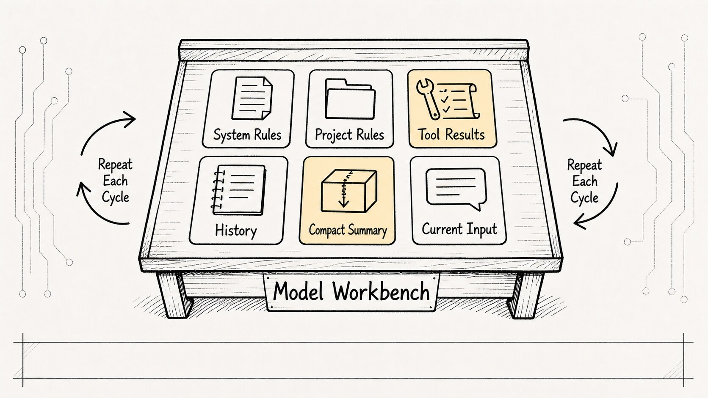
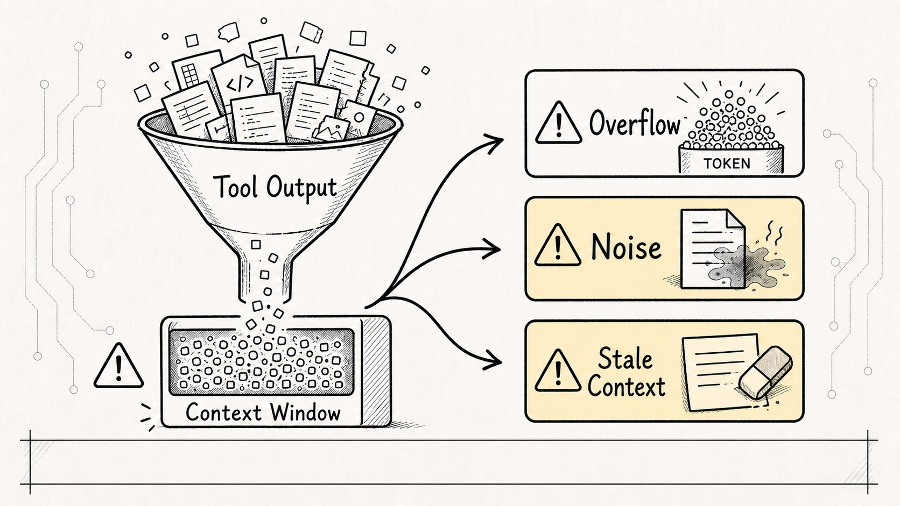
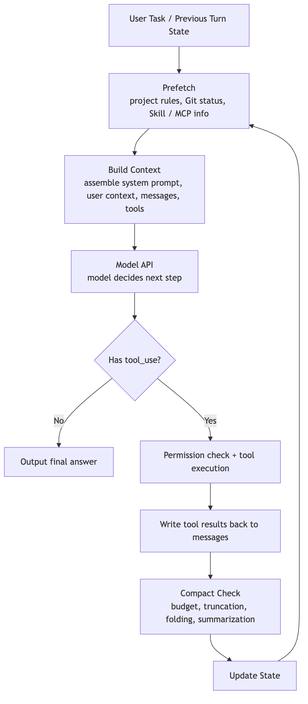
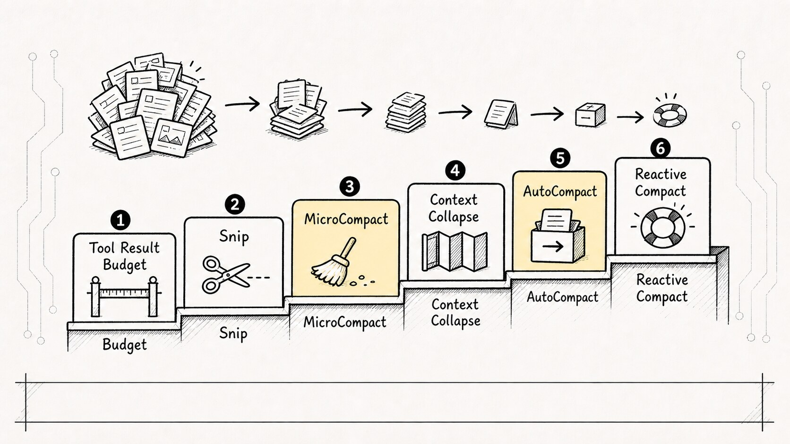
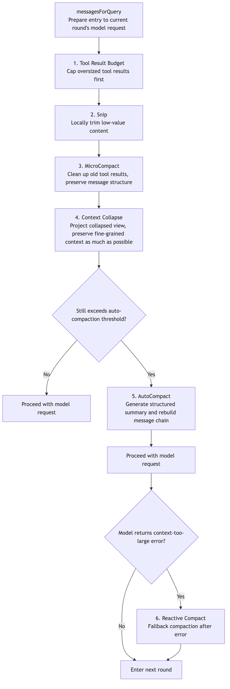
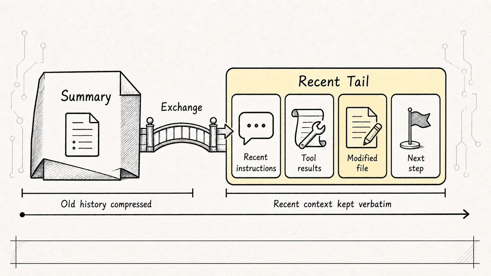

# Chapter 4 of the *Claude Code Source Analysis Series* | Context Management

In the previous article, we looked at Claude Code's prompt runtime: on every turn, the outer system rebuilds the model request from system rules, project memory, dynamic context, tool descriptions, message history, and prior tool results.

This chapter asks the next question:

**Once all of that keeps accumulating, how does Claude Code decide what to keep, what to compress, and what to leave out?**

People often reduce context management to a single idea:

```text
Just stuff more history into the model.
```

That is only half true.

In a normal chat app, context does look a lot like chat history. But Claude Code is a coding agent, so its context is closer to a dynamic workbench. What the model sees on any given turn is not just "what the user said before." It may include system rules, project conventions, tool descriptions, file reads, shell output, error logs, the file that was just edited, task progress, and compressed summaries of earlier work.

So the real question is not whether context should exist. The real question is this:

**How does an agent that keeps reading files, running commands, and editing code decide what the model should see on this turn? How does it preserve older information? How does it compress when space gets tight?**

If the previous article was about assembling an operating manual for the model, this one is about something even more fundamental:

```text
The model's workbench has limited space.
Claude Code has to keep reorganizing that workbench while the task is still in motion.
```

We will keep using the same running example as the rest of this series:

```text
The user says: the tests in this project are failing. Find the cause and fix them.
```

That sounds short. For Claude Code, it quickly unfolds into a much longer chain:

```text
Inspect the project structure
-> Read package.json
-> Run the test command
-> Analyze the failure
-> Search the relevant code
-> Read the target file
-> Edit the code
-> Run the tests again
-> Summarize the result
```

Each step creates more context. Context management exists to make sure that, over a long task, this information does not break continuity and does not drown the model.

## 1. Context Is Not Just Text History. It Is a Workbench Rebuilt Every Turn

The most important fact to carry over from the previous chapter is that the model itself is stateless from one call to the next.

Claude Code only appears continuous because the outer harness rebuilds the right working scene on every turn and sends that reconstructed scene back to the model.

So a model request is not really:

```text
user question -> model
```

It is much closer to:

```text
system rules
+ project rules
+ user preferences
+ current tool descriptions
+ message history
+ tool results
+ compressed summaries
+ current user input
=> this turn's model request
```

That is why context management should not be understood as "saving the chat log." A better name would be:

**context orchestration**

It has to answer a series of concrete questions:

- Which information must survive every turn?
- Which information should stay in the runtime and never be exposed to the model?
- Which pieces can be cached?
- Which pieces should only be fetched again on demand?
- Which old tool results are already stale?
- Which parts of history must be compressed into summaries?
- After compression, how does the model still know what it is currently doing?

Without this layer, the ReAct-style main loop quickly runs into two opposite failures:

```text
Too little context: the model loses track of what already happened.
Too much context: token usage, cost, latency, and attention all spiral out of control.
```

Context management is the balancing act between those two failures.



## 2. Why Does a Coding Agent's Token Usage Spike So Quickly?

A normal chat turn might cost a few hundred tokens.

A coding agent is different. Every action it takes pulls real environment output back into the conversation. A 500-line source file can cost thousands of tokens. One failed test can return a long stack trace. A global search can produce dozens of matches.

Worse, you usually cannot discard that information immediately. On the next turn, the model still needs to know things like:

```text
Which file was just read?
Which line triggered the error?
What fixes have already been tried?
Which command failed?
Did the user warn us not to touch a certain kind of file?
```

So an agent's context does not grow like "a few more messages." Tool calls keep injecting environment state into the message stream.

That creates three classic failure modes.

### 1. Token Explosion

Tool outputs pile up until the next request exceeds the model's context window. At that point this is not just lower answer quality. The run can stall outright.

### 2. Context Pollution

Old file contents, outdated command output, and stale error logs remain in history. The model may treat obsolete information as current truth. A file has already been changed, but the context still contains the old version, so the model keeps reasoning from stale code.

### 3. Compression Amnesia

Compress too aggressively, and the model forgets the user's original goal, the current stage of the task, or something that just happened a moment ago. This is the most frustrating failure mode: the system still looks active, but its direction has quietly drifted off course.

That is why Claude Code's context management is not "summarize when full." It is continuous capacity governance running inside the main loop.

In engineering terms, this behaves more like a resident GC worker than a full GC that only runs after the heap is exhausted.



## 3. Put Context Back Inside the QueryEngine Main Loop

Claude Code's main execution loop is not just:

```text
request model
-> call tool
-> request model again
```

Each turn actually passes through a context-governance layer:

```text
prefetch project and session information
-> assemble this turn's context
-> request the model
-> decide whether the model is answering or asking for a tool
-> execute the tool and write the result back into message history
-> check token pressure
-> trim, collapse, or compress when needed
-> carry the new state into the next turn
```

Visually, it looks like this:



The most important segment is `H -> I -> J -> B`.

Tool results are not merely UI logs. They are raw material for the next round of reasoning. Every file read, shell command, and code search writes a result back into message history, and that history is then re-evaluated to decide what can still fit into the next model request.

Context management is not a helper living off to the side of `QueryEngine`. It is part of what makes the loop runnable at all.

## 4. Governance Comes Before Compression

When people hear "context management," they often jump straight to compression. But a mature agent cannot just compress.

It first has to answer at least four classes of information-governance questions.

First, **visibility**:

```text
Should this information go to the model, or should it stay inside the runtime?
```

API keys, permission objects, and internal traces should not enter the prompt. Large files and giant logs do not always need to be passed through verbatim either. Sometimes a reference or a summary is enough.

Second, **authority**:

```text
If system rules, project rules, user instructions, and long-term memory conflict, which one wins?
```

If the project rules say "do not edit generated files" but the user asks for exactly that, the system cannot leave the decision to the model's intuition alone.

Third, **hot / warm / cold tiering**:

```text
What is hot context and needed right now?
What is warm context and might be needed soon?
What should stay outside the prompt until it is recalled on demand?
```

The log from the currently failing test is hot. An old error from two hours ago that has already been resolved is warm. The full transcript is cold. You cannot push all of it into every turn.

Fourth, **shape transformation**:

```text
Should this information exist as raw text, a summary, structured state, a diff, or a reference?
```

A failing test log can remain in raw form, or it can be normalized into something like:

```text
Command: pnpm test auth
Status: failed
Key error: TypeError: user.id should be string
Relevant file: src/auth/session.ts
Next step: inspect the mock user construction logic
```

Those two forms consume very different numbers of tokens, and they help the model in different ways.

**Context management is information governance. Compression is only one action inside that broader system.**

## 5. Claude Code's Compression Is a Layered Defense, Not a Blunt Instrument

If you read the source, Claude Code's compression pipeline is easiest to understand as a staged defense that escalates from light to heavy.

It does not begin by turning all old history into one paragraph. It starts with low-risk, low-loss local cleanup. If that is not enough, it escalates toward folded views and only later toward full summarization.





The philosophy is simple:

**If local slimming is enough, do not jump to global summarization. If structure can be preserved, do not collapse everything into a paragraph. Lossy folding should be the last resort.**

Let's look at the layers one by one.

### 1. Tool Result Budget: Cap the loudest noise source first

The first thing that usually needs control is not the user's message. It is the tool output.

- `Bash` can return thousands of log lines
- `Read` can return a large file
- `Grep` can return dozens of matching blocks
- `WebFetch` can pull in a full webpage

If those are passed into the next turn unchanged, the window fills quickly. The role of `applyToolResultBudget` is to cap oversized individual tool results before heavier compression starts.

In one sentence:

**Do not let one tool result consume the entire workbench.**

### 2. Snip: Remove low-value bulk without breaking the structure

`snip` works like local surgery.

It does not remove entire turns. Instead, it replaces large low-value blocks with markers or shorter representations while preserving the structure of the message chain.

Why not simply delete them? Because message history carries tool call IDs, `tool_result` pairings, and cross-turn references. Deleting a message outright can break continuity. Replacing it with a marker frees space while preserving the fact that "a tool result used to be here."

In one sentence:

**The content gets shorter, but the ledger stays intact.**

### 3. MicroCompact: Clean stale tool results without destroying the task's structure

`MicroCompact` is a more systematic local cleanup pass.

It mainly targets tool outputs that are large, time-sensitive, and already superseded by later work, such as:

```text
old file read results
old search results
old command output
old webpage or external-query results
```

It usually leaves these alone:

```text
original user messages
key assistant responses
recent tool results
currently active context
```

For example, suppose the agent reads `src/auth/session.ts`, later edits that file, and then reads the new version. The first read is now stale. Keeping it in full wastes space and can also mislead the model.

In one sentence:

**Take out the trash, but keep the ledger.**

### 4. Context Collapse: Fold the view before you rush to summarize

`Context Collapse` is a smarter intermediate layer.

The goal is not just to delete history. It is to project a more compact view of the context. If that folded view drops the request back below the safety threshold, there is no need to trigger the more expensive `AutoCompact`.

This reflects an important engineering tradeoff in Claude Code:

**If fine-grained structure can be preserved, do not rush to turn the whole history into one large summary.**

Full summarization saves space, but it always loses detail. Collapse is more like grouping, folding, and stowing documents on a desk, not burning them all and keeping only a meeting note.

### 5. AutoCompact: At the end of the line, turn history into a handoff note

Only after the lighter local defenses fail does automatic summary compression begin.

But the summary cannot be something vague like this:

```text
We discussed the failing tests, read some files, and changed some code.
```

That is useless if the task has to continue.

A good compact summary should read like a **task handoff note**, preserving at least:

```text
the user's main request
key constraints
files touched
important facts discovered
errors encountered
fixes already attempted
what is currently in progress
what should happen next
```

The last two are especially important:

```text
what is currently in progress
what should happen next
```

Many weak summaries record what happened but not where the task currently stands. After compression, the model remembers the rough story but does not know where to resume.

So the essence of `AutoCompact` is not "write a summary."

It is this:

**Turn the conversation into a handoff note that the next turn can keep executing from.**

### 6. Reactive Compact: The recovery path after the model says it is full

Even with proactive budgeting and automatic compression, reality can still surprise the system.

The model API may return a context-too-large error. Media may exceed limits. Token estimates may not match the actual encoding exactly. That is where reactive compaction enters. It is not proactive prevention. It is recovery after a budget failure.

Its existence points to one core lesson:

**A long-running agent cannot assume its budget estimate is always perfect. It needs a recovery path for when the estimate is wrong.**

This is the same engineering instinct you see in retry and recovery logic elsewhere: do not assume the system will never fail; make sure it can recover when it does.

## 6. Why Keep the Recent Tail After Compression?

The most common compression failure is not total forgetting. It is losing the *feel of the live scene*.

The last few turns before compression might look like this:

```text
Just edited src/auth/session.ts
Just ran pnpm test auth
Just saw a new TypeError
The user just added: do not change the public API
```

These details are closest to the current action, and they are often the most important. If they all get folded into a summary, the next turn feels distant, like reading meeting minutes without having been in the room.

So the better pattern is not:

```text
old history -> one summary -> continue
```

It is:

```text
old history -> one summary
+ the last few raw turns
+ key recent tool outputs
-> continue
```

The underlying idea is simple: keep the recent tail and reconnect the summary to the live scene.

The summary preserves the long-term storyline. The tail preserves the current feel of the work.

One of the most important lessons from long-running agents is this:

**Compression is not only about remembering the past. It is also about staying grounded in the present.**



## 7. Do Not Confuse Context, Memory, and Transcript

At this point it becomes easy to blur three different ideas together: `Context`, `Memory`, and `Transcript`.

They are not the same thing.

| Concept | Plain-English Analogy | Role in Claude Code |
| --- | --- | --- |
| Context | Active workbench | What the model can actually see on this turn; rebuilt for each request |
| Memory | Reusable notes | Project rules, user preferences, and key session facts that are loaded before entering context |
| Transcript | Full archive | The raw event log used for recovery, audit, and replay; too large to include verbatim on every turn |

The shortest way to remember them is:

```text
Context: active workbench
Memory: reusable notes
Transcript: full archive
```

Claude Code's context-management logic is fundamentally about moving information between these three layers:

```text
Preserve the full history in the transcript
Extract key facts into memory
Pack what matters most right now into context
```

Treat the transcript like context, and every turn explodes in token usage.

Treat context like memory, and temporary task details pollute long-term rules.

Treat memory like transcript, and you lose the detailed record of what really happened.

Once these boundaries are clear, a lot of agent "amnesia" becomes much easier to explain.

## 8. What Claude Code Achieves Through the Seven-Dimension Lens

One useful way to evaluate Claude Code is a seven-dimension context model: Visibility, Authority, Temperature, Shape, Retrieval, Compression, and Boundary.

Seen through that lens, the system looks like this:

| Dimension | Claude Code mechanism | Strength | Current limitation |
| --- | --- | --- | --- |
| Visibility | `system prompt`, user context, `toolUseContext`, tool-result budgeting, `snip`, and collapse jointly decide what enters the model and what stays in the runtime | Strong | Not all information is abstracted behind one unified `ContextItem`; visibility logic is still scattered across modules |
| Authority | system-priority rules, project rules, current user instructions, permission rules, and security policy together form a decision chain | Strong | Conflict handling still relies on cooperation between prompts and runtime rules rather than a single explicit authority resolver |
| Temperature | the recent message tail, current tool output, session memory, and transcript / resume state behave like hot, warm, and cold layers | Moderately strong | The behavior exists, but the source may not always name the layers explicitly |
| Shape | raw tool results, truncation markers, summary messages, boundary messages, diffs, and structured `tool_result` payloads coexist | Strong | More task state could be lifted into explicit structure instead of living mostly in natural-language history |
| Retrieval | `CLAUDE.md` loading, git status, `Read`, `Grep`, `Glob`, web tools, MCP, and skills pull information in on demand | Moderately strong | The design leans more on tools and files than on a unified retrieval substrate |
| Compression | Tool Result Budget, `Snip`, `MicroCompact`, `Context Collapse`, `AutoCompact`, and reactive compaction form a multi-layer defense | Very strong | Summary drift is still a real risk, so constraints, source scope, and the recent tail must be preserved carefully |
| Boundary | permission checks, Plan Mode, tool protocols, sub-agent forks, MCP boundaries, hooks, and sandboxing isolate actions and information | Strong | Enterprise-grade tenancy and data isolation still depend on deployment environment, not just the context layer itself |

What stands out most is this:

**Claude Code is strongest in compression and boundaries, highly engineered in shape and retrieval, and still has room to keep abstracting visibility, authority, and temperature.**

Put differently, this is no longer just "a CLI that compresses chat history." Context governance is woven through `QueryEngine`, the prompt runtime, the tool system, the permission system, the compaction system, and the session-resume path. Together they form a full harness.

But it is also not a textbook standalone `ContextManager`. Many of these capabilities are distributed across the main loop and supporting runtime subsystems rather than centralized in one class.

That is exactly what readers can miss when they first inspect the source:

**Do not go hunting for a file literally named `ContextManager`. Context management is a cross-cutting engineering pipeline running through the loop.**

## 9. Which Objects Matter Most When You Read the Source?

Do not start by reading files in isolation just because their filenames look relevant. A better method is to trace the context lifecycle:

```text
Where does information enter?
What state does it become?
What rules filter it?
When does compression trigger?
Where is the compressed result written back?
How does the next model turn see it again?
```

These are good places to start:

| Object to inspect | Main question |
| --- | --- |
| Query loop / `query.ts` | Where in the main loop does context governance happen? |
| Context builder / prompt runtime | What pieces make up the model input for this turn? |
| `CLAUDE.md` loader | How do project rules and user memory enter the context? |
| Message store / messages | How do user messages, model replies, and tool results accumulate? |
| Token budget / tracking | At what point does the system consider the request unsafe in size? |
| Tool Result Budget / `Snip` | Which tool outputs get trimmed first? |
| `MicroCompact` | Which stale tool outputs can be cleaned away? |
| Context Collapse | How does the system fold the view before it jumps to full summarization? |
| `AutoCompact` / reactive compact | How is history replaced with structured summaries, and what fallback exists if compression fails? |
| Transcript / resume | How is raw history backed up and later restored? |

When you read these objects, do not only ask what the function does. Ask where it sits inside the loop.

Viewed alone, `TokenBudget` can look like a simple length-calculation helper. Placed back inside `QueryEngine`, it becomes the switch that moves the system from normal execution into compression governance.

Viewed alone, `MicroCompact` can look like message cleanup. Placed back inside a long-running task, it becomes what prevents stale tool output from continuously polluting the next round of judgment.

Viewed alone, `AutoCompact` can look like summarization. Placed back inside an agent session, it is writing the handoff note that lets the next model turn keep working.

One strong habit for reading agent source code is:

**Do not just ask what a function is. Ask what kind of runaway behavior in the loop it is there to prevent.**

If you trace one request round through `query.ts`, the context-management path compresses into something like this:

```text
getMessagesAfterCompactBoundary()
-> applyToolResultBudget()
-> snipCompactIfNeeded()
-> microcompact()
-> contextCollapse.applyCollapsesIfNeeded()
-> autoCompactIfNeeded()
-> appendSystemContext()
-> queryModelWithStreaming()
```

That line makes something very clear: context management is not a rescue step after an API error. It is proactive governance that runs before every model request.

Inside that chain, `applyToolResultBudget()` handles the noisiest source first: tool output. A shell log, a large file read, or one MCP response can fill the window faster than the message history itself. So Claude Code first applies a local budget and only then considers global compression.

`microcompact` and `contextCollapse` form the middle layer. They try to project, fold, and clean up local history so that the system does not degrade too quickly into "one giant summary." That matters because programming tasks need structure preserved: which tool call produced which result, which file was read, which error is still unresolved.

`autoCompactIfNeeded()` is the heavier step. It reserves space for summary output before the context is completely exhausted. If compression fails, it also needs a circuit breaker so the system does not keep triggering the same unrecoverable compression request on every turn.

Inside `compact.ts`, pay attention to the rebuild logic after compression as well. Compression is not finished when old history becomes a paragraph. The system also has to preserve the compact boundary, summary messages, the recent tail, attachments, hook results, and sometimes even recently accessed key files. Otherwise the next turn sees only the summary and loses its current working scene.

Another easy detail to miss is that some context management hides inside individual tools. For example, if the file-read tool sees that the same file and the same range were already read and the file has not changed, it can return `file_unchanged` instead of shoving the full content into messages again. That small optimization is really a way to prevent duplicate context pollution.

So when you map this chapter back to the code, do not go looking for a single class called `ContextManager`. Follow the lifecycle instead: how information enters, gets budgeted, gets collapsed, gets compressed, and then gets restored.

## 10. If You Were Building a Minimal Context Manager Yourself, Where Would You Start?

If you want to build a "mini Claude Code," you do not need to reproduce the full six-layer compaction pipeline on day one.

A minimal version can start here:

```text
1. Append user messages, assistant replies, and tool results into one message store
2. Estimate token usage before each model request
3. Trim oversized tool results first when they cross a threshold
4. Keep the last N turns in raw form
5. Compress older history into a structured summary
6. Persist the raw transcript to disk for recovery
7. Force the summary to retain: user goal, constraints, files changed, failed attempts, and next step
```

That already solves the problem that causes many demo agents to lose coherence after just a few turns.

Once that works, you can gradually add:

- loading project rules and user memory
- different budgets for different tool types
- reference-based file handling plus re-read on demand
- collapsed views instead of immediate full summarization
- sub-agent or fork isolation for long search tasks
- permission-aware context injection
- a context-plan log explaining why this turn included these specific pieces of information

This is a more stable evolution path than simply starting with a model that has an enormous context window.

Larger windows solve a capacity problem. They do not automatically solve an information-discipline problem. The real challenge for an agent is this:

```text
As the information keeps growing,
can the system keep showing the model the small subset that matters most right now?
```

## 11. One-Sentence Summary

If you compress this whole chapter into one sentence, it becomes:

**Claude Code's context management is not about feeding the model more and more history. It is about continuously assembling, budgeting, pruning, folding, summarizing, and reconnecting information inside a finite token budget.**

If you compress it even further, it turns into six verbs:

```text
Assemble: decide what the model should see this turn
Budget: detect when tokens are entering the danger zone
Prune: trim oversized tool outputs first
Fold: preserve fine-grained structure where possible
Summarize: produce a handoff note the next turn can continue from
Reconnect: keep the recent tail attached to the live working state
```

In the end, context management determines something very practical:

```text
After turn 20,
does the agent still behave like someone who has been working continuously,
or like someone who just woke up and only read the meeting notes?
```

That is one of the key mechanisms that turns Claude Code from "a chat box with tools" into "an engineering agent that can sustain long-running work."
