# Chapter 6 of the *Claude Code Source Analysis Series* | Tools Overview

This article focuses on the layer that turns model intent into real engineering action.

Inside Claude Code, `QueryEngine` runs the multi-turn agent loop, the prompt runtime assembles what the model sees on each turn, and context management keeps long-running work from collapsing under its own history. The tool system is the next critical layer: once the model decides what it wants to do, how does Claude Code turn that intent into an action that is executable, constrained, recoverable, and auditable?

The model itself does not execute commands or modify files directly. It emits structured action intent, and the runtime tool system decides how that intent is interpreted, gated, executed, and written back into the session.

To keep the discussion concrete, we will use one running example:

```text
User: Help me fix the failing tests in this project.
```

As we've already discussed, Claude Code can't stop at "guessing." For this task, it actually needs to do the following:

- Search the project structure
- Read relevant files
- Edit code
- Run the tests
- Adjust based on errors
- Ask for confirmation before high-risk operations

Behind these actions is the Tools system.

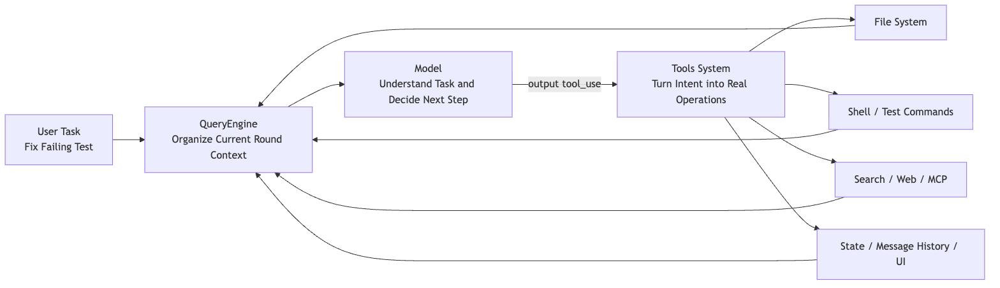

So the core question this chapter answers is not "what tools does Claude Code have," but rather:

> How does Claude Code turn the model's intent to act into engineering actions that are executable, constrainable, recoverable, and auditable?

## 1. `Tool.ts` Solves the Problem of "Actions Must Become Protocols First"

`Tool.ts` is not a specific tool, but the contract that all tools must honor.

You can think of it as a "tool ID card." Every tool must declare:

- Its name
- What parameters it accepts
- Whether it is read-only
- Whether it can run concurrently
- What permissions it needs
- What context it receives during execution
- How it hands results back to the system after execution

This step is critical. Only once an action has been protocolized can the system govern it.

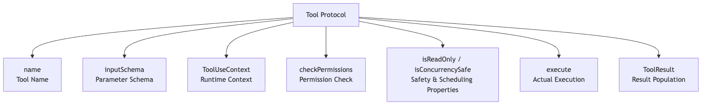

A mature tool cannot be just a function. It must simultaneously answer "how to invoke it," "whether it can be invoked," "where it can be invoked," and "what happens after invocation."

This is the first core layer of the Claude Code tool system:

> A Tool is not a feature button — it is the runtime contract that a model action must sign before entering the real world.

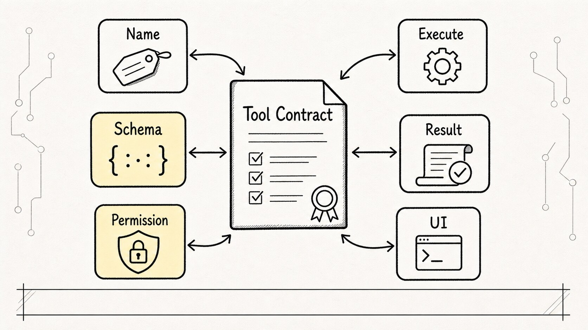

## 2. `inputSchema` Turns Model Output from "Natural Language" into "Structured Intent"

The most easily underestimated part of the tool protocol is `inputSchema`.

Its purpose isn't to make TypeScript look pretty. It's to constrain model output into parseable data.

Take file reading, for example. If the model just says:

```text
I want to look at src/foo.ts
```

The host program still has to guess at its intent. But if the model emits a tool call:

```json
{
  "tool": "Read",
  "input": {
    "file_path": "src/foo.ts"
  }
}
```

The system knows unambiguously:

- Which tool to invoke
- What the parameters are
- Whether the parameters are valid
- Whether this action is a read, write, search, or execution
- Which permission and execution path to follow next

This is also the key difference between function calling, tool use, and a plain prompt: the model doesn't just "say what it wants to do" — it submits an executable request against the protocol.

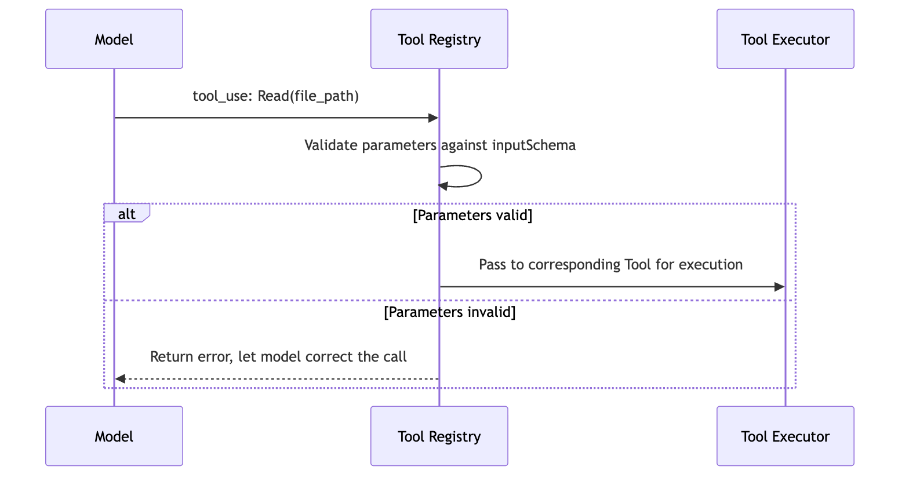

So the value of `inputSchema` goes beyond just "defining parameters."

It turns a model's vague intent into an engineering object the system can act on.

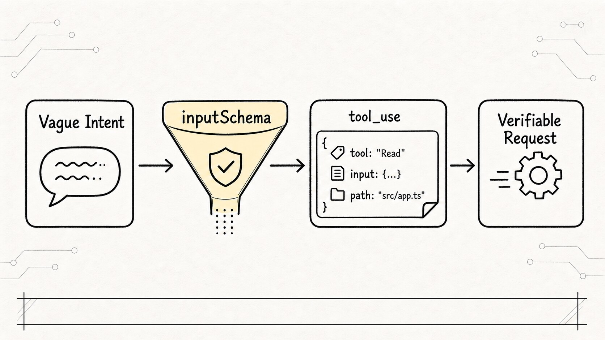

## 3. `ToolUseContext` — Tools Are Not Isolated Functions

If you look at a single tool in isolation, it's easy to imagine it running like this:

```text
input parameters -> execute function -> return result
```

(Many demo-level Agent frameworks are designed exactly this way. The cracks don't show until you hit production.)

But Claude Code's tools don't operate that way.

When a tool executes, it receives the full `ToolUseContext`, the runtime context object passed into tool execution. This context carries a wealth of information the current session needs to function, such as:

- The currently active tool set
- The MCP client and MCP resource
- The current AppState
- The message history
- The file read cache
- The abort controller
- Notification capabilities
- Task and file history updaters

What this means is that a tool is never an "island." Every action it performs can ripple through the entire session.

Returning to the "fix a failing test" example:

- `Grep` finds files related to the failing test — that affects the model context for the next turn.
- `Read` reads a file — the system tracks the read state.
- `Edit` modifies a file — the UI needs to render the diff.
- `Bash` runs a test and it fails — the error log flows back into the message stream.
- If the user interrupts — any long-running command must be cancellable or wind itself down cleanly.

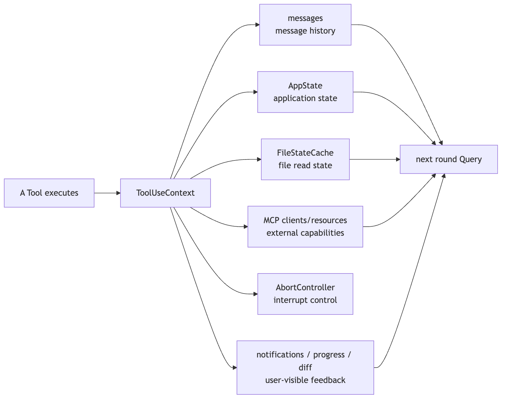

So the tool system is not a simple function-call layer.

It is part of the Claude Code runtime.

## 4. `tools.ts` Is a Tool Registry, Not the Final Menu

Once you understand what a single Tool looks like, the next step is `tools.ts`.

It's responsible for registering Claude Code's foundational capabilities into a tool pool. You'll see many categories of tools here:

- File tools: Read, Edit, Write, Notebook
- Search tools: Glob, Grep
- Terminal tools: Bash, PowerShell
- Web tools: WebFetch, WebSearch, WebBrowser
- Collaboration tools: Agent, SendMessage, AskUserQuestion
- Workflow tools: Todo, Task, Plan, Worktree
- Extension tools: MCP, LSP, ToolSearch, Skill

But there's one point where people commonly trip up:

> `getAllBaseTools()` produces a candidate pool, not the final tool menu that the model sees.

Many readers make a wrong assumption at this stage, thinking that however many tools are registered is how many the model can use directly. That's not how it works.

Claude Code first assembles a large candidate pool, then filters it down layer by layer based on environment, mode, rules, and runtime state. Only then does it produce the tools visible for the current turn.

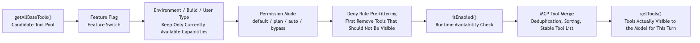

This pipeline illustrates a foundational principle for mature agent systems:

> More capabilities is not better. Capabilities must be dynamically trimmed by context, permissions, and cost.

## 5. Why Tools Are Filtered Before They Reach the Model

Here we have a critical security design decision.

Claude Code does not wait until the model invokes a tool to decide whether it can execute. It performs "tool visibility filtering" first.

If a tool is entirely blocked by a deny rule, the model simply never sees it in this round.

Think of it as two gates:

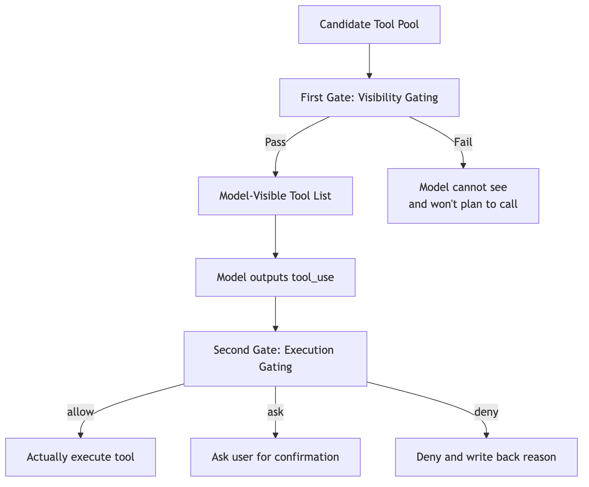

To put it bluntly: if the model can't see a tool, it won't plan tasks around it. This is far safer than "let it see, then reject."

The first gate answers:

> Is the model even allowed to see this tool in this round?

The second gate answers:

> Can this specific invocation actually execute?

These two concerns must not be conflated.

That is the point of "pushing security upstream."

(In permission design, we often face this temptation: "let the model see everything, then block at execution time." Claude Code makes the opposite choice — what shouldn't be seen simply isn't shown. The cost is that the tool list changes frequently, but security improves by an order of magnitude.)

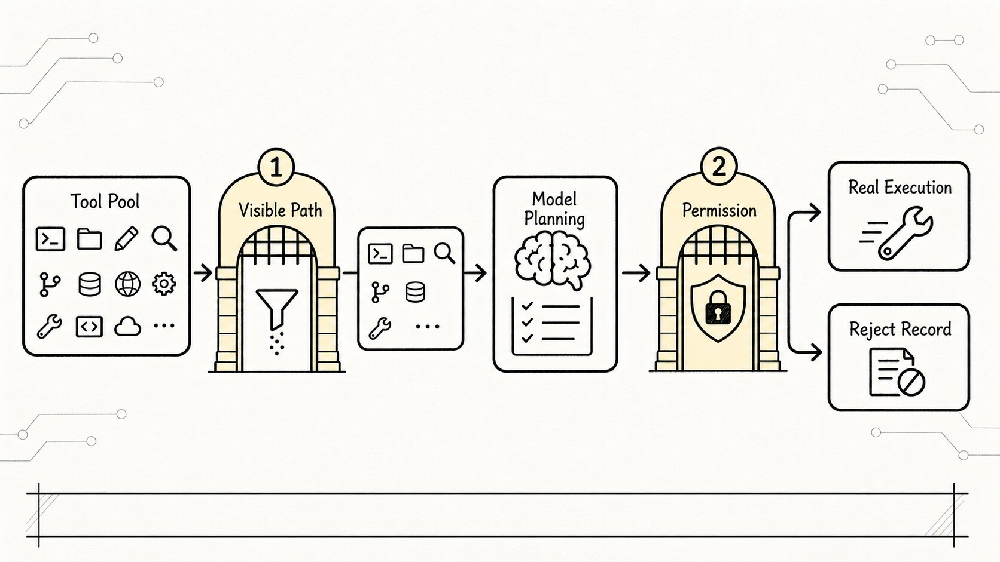

## 6. `ToolPermissionContext` — The Permission Backpack

Both tool filtering and tool execution depend on `ToolPermissionContext`, the runtime bundle of rules and permission state used to decide visibility and execution behavior.

It's not a simple `true` / `false` toggle. It's an entire bundle of permission context, typically containing:

- the current permission mode
- user-level rules
- project-level rules
- local rules
- policy rules
- command-line rules
- session-level rules
- three behavior categories: allow / deny / ask
- whether bypass is permitted
- whether dialogs should be suppressed
- additional working-directory boundaries

This explains why Claude Code's permission system feels "heavyweight."

Because it's not just answering "can this tool be used?" — it's answering something far more nuanced:

```text
In the current project,
under the current permission mode,
accounting for user settings, project settings, policy settings, CLI arguments, and session-level ad-hoc rules —
should this tool even be visible to the model?
And if the model does invoke it, should that invocation be allowed, asked about, or denied?
```

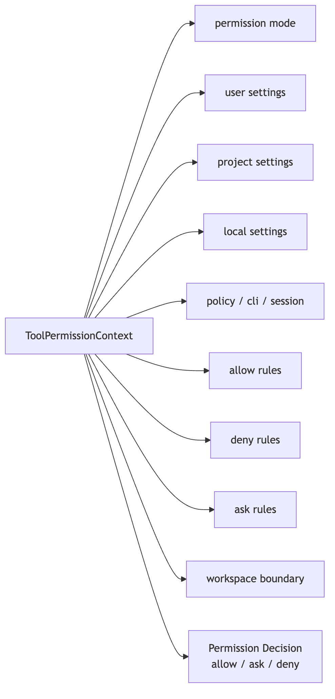

The most critical rule of all:

> Deny beats allow.

Even if a tool is permitted somewhere, it must be rejected as soon as a more specific rule explicitly denies it. A security system can't rely on "default trust"; explicit denials must carry higher priority.

(This mirrors firewall rule-matching logic: more specific rules take precedence, and once a deny rule is hit, the chain stops — no further rules are evaluated.)

## 7. Tool Execution Is Not Just "Calling a Function" — It's a Lifecycle

When the model actually issues a `tool_use` block, the structured tool-call record returned by the model, Claude Code still has to run it through an execution pipeline.

A typical tool lifecycle looks roughly like this:

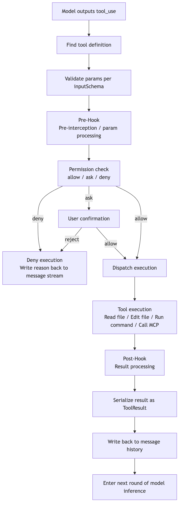

None of the steps in this pipeline are decorative.

Parameter validation prevents the model from sending malformed structures.

Permission checks block dangerous operations.

Scheduling determines which tools can run in parallel and which must be serialized.

Result serialization ensures the model can understand what just happened in the next round.

Message write-back guarantees the entire session isn't a one-shot action — it's a cycle that can keep advancing.

Strip all of this away, and Claude Code degrades to:

```text
model says something -> program takes a gamble -> command runs unchecked -> result gets stuffed back in
```

That clearly cannot support real-world engineering projects.

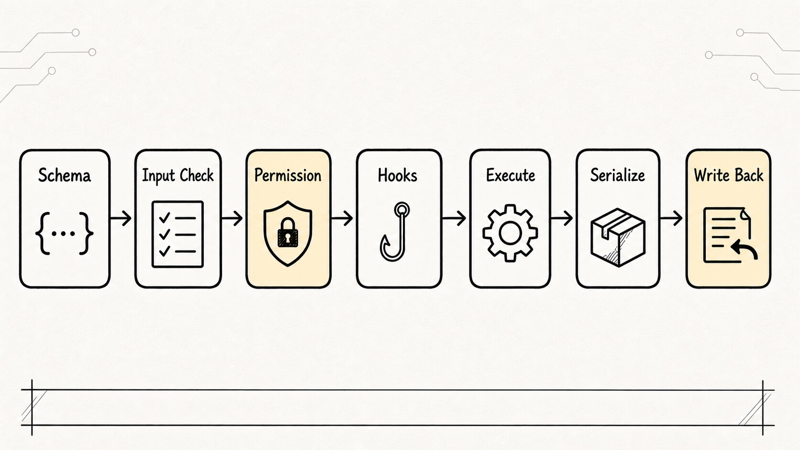

## 8. Why Tools Are Categorized as Read-Only, Destructive, and Concurrency-Safe

In a simple demo, the only question about a tool tends to be "can I call it or not?"

But in a real development environment like Claude Code, a tool needs to answer at least three questions.

**First, is it read-only?**

`Read`, `Grep`, and `Glob` are generally low-risk tools because they observe the project without directly modifying it. `Edit`, `Write`, and `Bash`, on the other hand, can change files or the environment and carry higher risk.

**Second, is it a destructive operation?**

Even within `Bash`, `npm test` and `rm -rf` are not remotely in the same league. The tool system must support finer-grained risk assessment.

**Third, can it run concurrently?**

Two read tools running in parallel is usually fine. But two write tools modifying the same area at the same time, or one `Bash` command that depends on the output of another, cannot be parallelized casually.

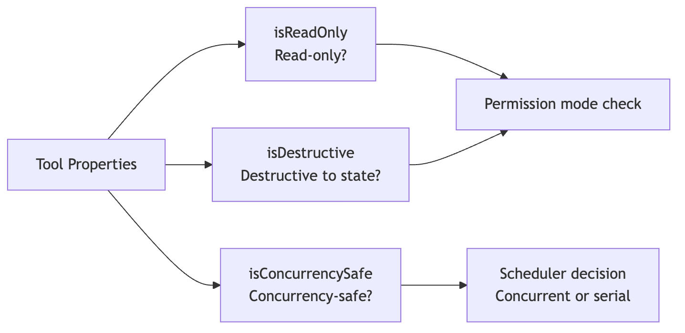

This is why the Tool protocol includes so much metadata that seems "extra" at first glance.

It's not about making the interface complex. It's about letting the system know: how should this action be treated?

## 9. Built-in Tools Fall into Five Categories — Not a Pile of Names

If you just list 40+ tools, readers get lost quickly.

A better way to understand them is by grouping them around *what problem they solve*.

| Category | Representative Tools | Problem Solved |
| --- | --- | --- |
| Files & Search | Read, Edit, Write, Glob, Grep | Let the agent understand and modify the project |
| Shell Execution | Bash, PowerShell | Let the agent verify, build, and test |
| Session Control | AskUserQuestion, Todo, Plan | Let the agent plan, clarify, and maintain task state |
| Collaboration Tasks | Agent, Task, SendMessage | Let complex work be split, tracked, and results collected |
| External Extension | MCP, LSP, WebFetch, WebSearch, Skill | Extend capability boundaries to external services and reusable workflows |

These categories capture a single insight:

> Claude Code isn't just "able to operate on files" — it's decomposing the real software development process into a set of governable action interfaces.

When fixing tests, the agent might walk a path like this:

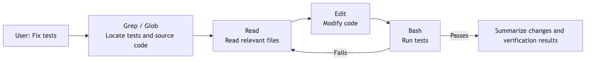

This isn't "one tool call" — it's a closed loop where a chain of tool invocations and model reasoning push each other forward.

## 10. Why MCP, LSP, and Skill Can All Plug Into the Same System

A unified Tool protocol has another major benefit: new capabilities can be plugged in without upending the entire architecture.

Whether it's an MCP tool, an LSP tool, or a Skill tool, they all ultimately need to be translated into a tool view that Claude Code understands:

- A name
- An input schema
- A description
- Enabling conditions
- Permission semantics
- An execution result

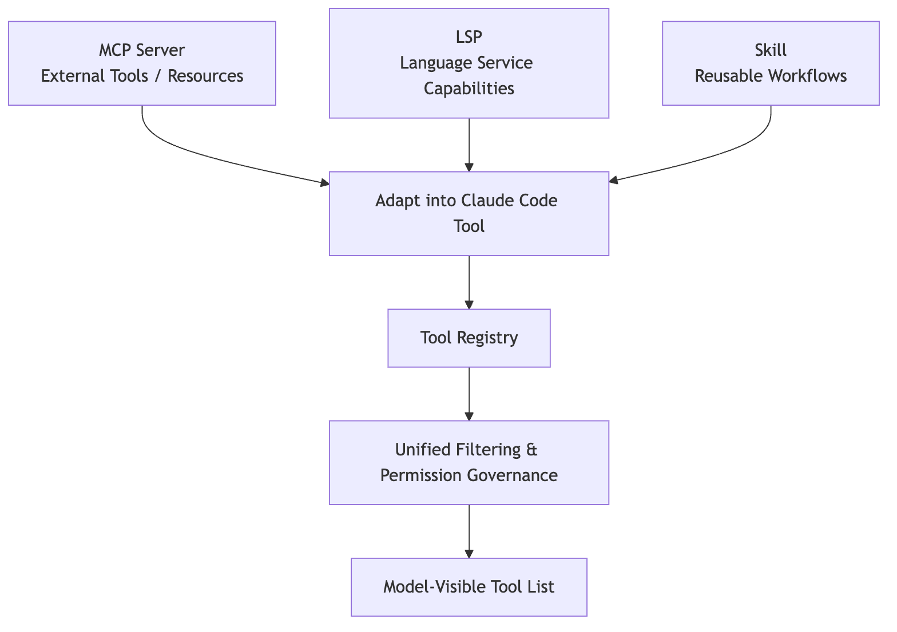

That's the technical debt the unified protocol eliminates.

Without it, every external system you connect would require inventing a new set of rules. The more you hook up, the messier the system becomes.

With a unified protocol, adding a new capability boils down to answering five questions:

```text
How do you describe yourself?
How do you receive input?
How do you execute?
How do you declare risk?
How do you hand results back to the main loop?
```

## 11. The Tool System Is Where Claude Code's Engineering Philosophy Really Shows

After reading through the Tools system, the most important takeaway isn't memorizing any particular tool name — it's understanding Claude Code's engineering orientation.

**The model is not the executor. The runtime is the executor.**

The model decides whether the next step requires action and what the intent behind that action is. The tool system inside the host process is what actually carries out the action.

**Tools aren't plugins — they're runtime protocols.**

Every tool must pass through the full pipeline: schema registration, context, permissions, dispatch, result backfill, and UI presentation.

**Security isn't a final pop-up. It's two-phase governance: tool exposure and tool execution.**

What the model can see is itself part of the security boundary. What the model actually gets to invoke forms the second boundary.

**Extensibility isn't about maximum surface area — it's about being trimmable, filterable, and auditable.**

Claude Code supports MCP, LSP, Skills, and multi-agent workflows not by dumping every capability onto the model, but because every one of those capabilities has to pass through the same tool pipeline.

## 12. The Whole Chapter in One Diagram

Finally, here is Claude Code's tool system compressed into a single complete diagram:

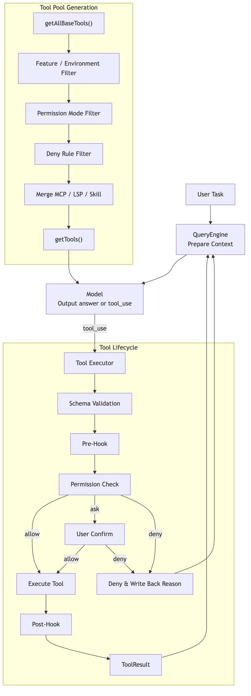

Use this diagram as a map when reading `Tool.ts`, `tools.ts`, `toolExecution.ts`, and the permission-related code.

## 13. Which Tool Chain to Follow When Reading the Source

If you really want to understand the tool system by reading the source, don't start from a specific tool. Instead, trace a complete call chain first:

```text
Tool.ts
-> tools.ts
-> query.ts
-> toolExecution.ts
-> permissions.ts
-> tool_result → backfilled into messages
```

**Step one**: read `Tool.ts`. The focus isn't the tool names, but the `Tool` protocol itself: `inputSchema`, `call`, `validateInput`, `checkPermissions`, `isReadOnly`, `isConcurrencySafe`, `isDestructive`, `interruptBehavior`, `maxResultSizeChars`. Together, these fields answer one question: what governance information does the system need to know about a model-initiated action before it enters a real engineering environment.

**Step two**: read `tools.ts`. `getAllBaseTools()` is only a candidate pool, not the model's final menu. Before being exposed to the model, tools pass through mode filtering, permission deny-rule filtering, MCP tool merging, sorting, deduplication, and cache stability handling. A key point here: tool visibility is itself part of permissions. A blanket-denied tool should ideally disappear before the model ever sees it—not after the model calls it and gets rejected.

**Step three**: go back to `query.ts`. The `tool_use` blocks returned by the model are collected and handed to `runTools()` or `StreamingToolExecutor`. This is where you see the interface between the tool system and the ReAct main loop: a tool is not a UI button, but a fork point in the next round of the state machine.

**Step four**: read the single-invocation lifecycle in `toolExecution.ts`:

```text
Find the tool definition
-> inputSchema validation
-> tool-level validateInput
-> PreToolUse hooks
-> permission check
-> tool.call()
-> result serialization
-> PostToolUse hooks
-> produce tool_result
```

This lifecycle is what separates a production-grade agent from a simple function map. Errors don't blow up the main loop; instead, they are converted into tool results the model can understand in the next round whenever possible.

**Step five**: pick one concrete tool to read, such as `FileReadTool`. It's not just `fs.readFile()`—it also handles path validation, large-file budgeting, offset/limit, PDF/image processing, duplicate-read deduplication, permission checks, Skill triggering, and UI display. After reading it, you'll better understand why Claude Code builds tools as a "semantic protocol" rather than stuffing every action into Bash.

Once you've traced this chain, the essence of Tools becomes clear:

```text
The model only proposes structured intent.
The tool protocol describes the boundaries of an action.
The executor governs the lifecycle.
The permission system decides whether the action lands.
tool_result brings the real world back to the model.
```

## 14. Summary

Claude Code's tool system can be summed up in a single sentence:

> Tools are the runtime protocol layer in Claude Code that turns model intent into real engineering actions; they give the model hands and feet, while also fitting those hands and feet with boundaries, permissions, and feedback loops.

Once you grasp Tools, you stop seeing Claude Code as "a chat model plus a few plugins." It's better understood as an Agent Harness: the model handles thinking, tools handle acting, permissions handle boundaries, and state ties each action into a sustainable, forward-moving engineering loop.
