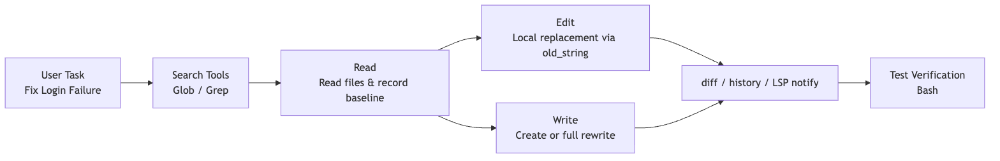
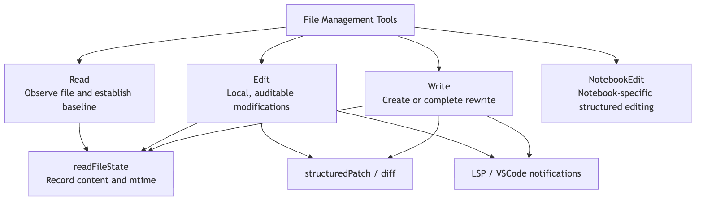
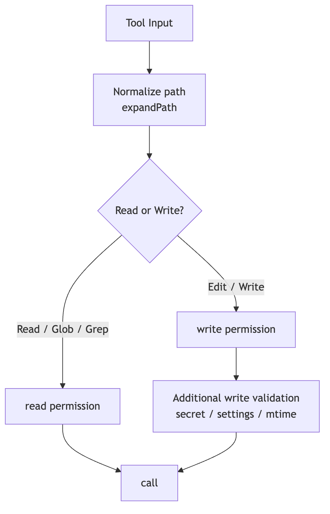
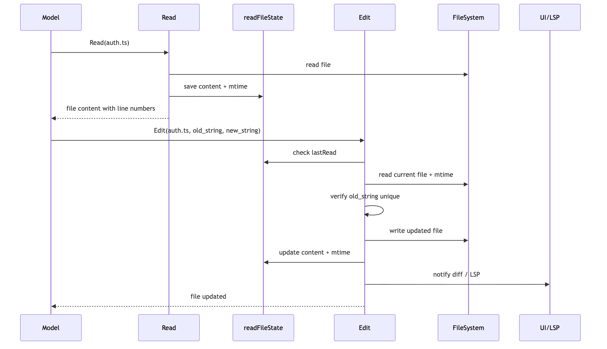

# Chapter 7 of the *Claude Code Source Analysis Series* | File Tools

You ask an AI to fix a bug, and it just says "Done, file updated."

You open the file and discover every comment you hand-edited moments ago is gone.

This is the scariest part of letting an agent change code: it doesn't remember what the file looked like before, and it has no awareness that you might have touched that line. Claude Code's answer to this problem is a set of file tools that look utterly mundane: `Read`, `Edit`, `Write`.

The names are indeed plain:

- `Read`: reads a file.
- `Edit`: modifies a file by string replacement.
- `Write`: creates or fully rewrites a file.
- `NotebookEdit`: edits Jupyter Notebooks specifically.

Just hearing the names, you'd assume they're thin wrappers around shell commands:

```text
Read  ~= cat
Edit  ~= sed
Write ~= echo > file
```

But what's genuinely interesting in the source code is that Claude Code explicitly does *not* want the model to understand them that way.

In `packages/builtin-tools/src/tools/BashTool/prompt.ts`, the Bash tool reminds the model:

```text
Read files: Use Read (NOT cat/head/tail)
Edit files: Use Edit (NOT sed/awk)
Write files: Use Write (NOT echo >/cat <<EOF)
```

The design judgment behind this line is direct:

> File operations aren't ordinary I/O. They are the boundary where an agent crosses from "observing code" into "changing code."

For a human engineer, opening a file, changing a line, and saving is a natural act. For an agent, however, several questions must be handled systematically:

- Has it actually read the file?
- Is what it read the latest content?
- Is the string it's about to replace unique?
- Has the file been modified by the user or a formatter since it was read?
- Can this change be shown as a diff?
- Is there a recoverable history snapshot before the change?
- Do LSP, VS Code, and the diagnostics system need to know after the change?

So the core question this article sets out to answer is not "how does Claude Code read and write files," but rather:

> How does Claude Code let the model change code while doing everything possible to prevent reading wrong, editing wrong, and overwriting other people's changes?

Use this simple running example throughout:

```text
User says: Help me fix the login failure.
```

A reliable file operation chain should not be the model guessing a file and then overwriting it. It should be:

```text
Glob / Grep narrow down the candidates first
-> Read reads candidate files, establishing a content baseline
-> Edit applies a localized replacement using a unique string
-> Write is only used when creating a new file or doing a full rewrite
-> The tool layer generates a diff, updates readFileState, notifies LSP / VS Code
-> Bash runs tests to verify the result
```



This is where file tools sit within the agent system: they are not a "file API," but a safety workflow built around file reading and writing.

## 1. Why not just use Bash for file I/O?

The simplest approach seems obvious: let the model issue shell commands directly.

```bash
cat src/auth.ts
sed -i 's/old/new/g' src/auth.ts
cat <<EOF > src/auth.ts
...
EOF
```

This looks like what a real engineer does every day. But inside an agent runtime, things break down.

### 1. Shell commands can't express *what kind* of operation this is

Take the same Bash snippet:

```bash
cat src/auth.ts
```

That's a read.

```bash
sed -i 's/foo/bar/g' src/auth.ts
```

That's a write.

```bash
node scripts/migrate.js
```

That might read, might write, might hit a database.

When every action is lumped together as Bash, Claude Code has a hard time deciding at the tool layer:

- Read or write?
- Can it run concurrently?
- Does it need permission confirmation?
- Should a diff be displayed?
- Should the read-file cache be updated?
- Should file history be triggered?

That's the point of dedicated file tools: they turn these actions into explicit tool semantics upfront.

### 2. Shell commands bypass the file tools' state management

The scariest thing about file modification isn't "the write failed" — it's "the write succeeded but overwrote something it shouldn't have."

For example:

```text
1. agent reads src/auth.ts
2. User manually edits src/auth.ts
3. agent writes back based on the stale content
4. The user's edits are silently clobbered
```

If the agent uses `sed` or `echo > file`, the tool system sees nothing more than a command string. It has no way to know which file was actually changed, what the content looked like before, or whether the read cache should be invalidated after the write.

In contrast, `Read / Edit / Write` encode the file path, original content, modified content, mtime, and diff directly into the tool protocol. That's what enables Claude Code to enforce "read-then-edit" and guard against dirty writes.

### 3. File operations need two different outputs — one for the model, one for the user

What the model needs is precision:

- File content with line numbers.
- Why a string match failed.
- Structured success or failure results for modifications.

What the user needs is human-readable feedback:

- Which file was read.
- Which file was modified.
- What the diff looks like.
- Whether the action was denied.

In the source, `FileReadTool`'s UI layer even explicitly avoids exposing the full file content to the user-facing search index — only the model side receives it. This shows that file tools aren't simply forwarding `cat` output to every consumer. They split the stream between "model context" and "user interface."

## 2. Where File Tools Sit in the Overall Tool Menu

Claude Code registers its base tools here:

```text
src/tools.ts
```

That's where file tools are mounted into the base tool list:

```ts
FileReadTool
FileEditTool
FileWriteTool
NotebookEditTool
```

The search tools `GlobTool / GrepTool` are also registered here. Together with the file tools, they form a natural pipeline:

```text
Find files
-> Read files
-> Modify files
```

A minor boundary detail: this codebase does not include a standalone `LS` tool.

The `Read` tool's prompt explicitly states that it reads files only—not directories; if you need to inspect a directory, use Bash to run `ls`. And if the goal is to "find files by pattern," the preferred path is `Glob`. So Claude Code doesn't try to mirror a full set of Unix commands in its file management. Instead, it slices things by the semantics most relevant to an agent:

```text
Inspect directory structure: Bash ls
Find candidates by filename: Glob
Find candidates by content: Grep
Read a specific file: Read
Edit locally: Edit
Create or full rewrite: Write
```

The source paths map like this:

```text
src/tools.ts
packages/builtin-tools/src/tools/FileReadTool/FileReadTool.ts
packages/builtin-tools/src/tools/FileEditTool/FileEditTool.ts
packages/builtin-tools/src/tools/FileWriteTool/FileWriteTool.ts
packages/builtin-tools/src/tools/NotebookEditTool/NotebookEditTool.ts
```

From the perspective of `Tool.ts`, they're all ordinary Tools: each has an `inputSchema`, `outputSchema`, `validateInput()`, `checkPermissions()`, `call()`, and UI rendering functions.

But from the perspective of agent behavior, their responsibility split is very clear:



You can think of them as three distinct "file-action semantics":

- `Read` is observation.
- `Edit` is a local modification on top of already-observed content.
- `Write` is creation or wholesale replacement.

Only once these three semantics are separated do permissions, caching, diffing, and conflict detection have a place to land.

## 3. `Read`: Not `cat`, but Establishing a File Baseline

The entry point for `Read` is:

```text
packages/builtin-tools/src/tools/FileReadTool/FileReadTool.ts
```

Its prompt definition is at:

```text
packages/builtin-tools/src/tools/FileReadTool/prompt.ts
```

`Read` takes a straightforward input:

```ts
{
  file_path: string
  offset?: number
  limit?: number
  pages?: string
}
```

On the surface, it just reads a path. But inside the source, three things really matter:

1. It is a formal, read-only, concurrency-safe tool.
2. It writes what it reads into `readFileState`.
3. It controls output size to keep any single file from eating too much context.

### 1. `Read` Is a Read-Only Tool, Safe for Concurrency

`FileReadTool` declares:

```ts
isConcurrencySafe() {
  return true
}

isReadOnly() {
  return true
}

isSearchOrReadCommand() {
  return { isSearch: false, isRead: true }
}
```

This tells the scheduler it can run multiple `Read` calls concurrently. Say the model wants to look at three related files in one turn:

```text
Read src/auth.ts
Read src/session.ts
Read tests/auth.test.ts
```

None of these writes to a file, so they can run in parallel. Compared to `Edit` / `Write`, this is a critical runtime property for a read tool.

### 2. `Read` Validates Paths, Permissions, and File Types

Inside `validateInput()`, `Read` normalizes the path first:

```text
expandPath(file_path)
```

Then checks against read-deny rules:

```text
matchingRuleForInput(fullFilePath, permissionContext, "read", "deny")
```

If the path is denied by the permission config, the tool returns an error immediately and never reaches the actual file read.

A few security details that are easy to overlook:

- Windows UNC network paths skip filesystem `stat` calls to avoid triggering SMB/NTLM credential leakage during path checks.
- Ordinary binary files are rejected, but PDFs, images, and SVGs have dedicated handling paths.
- Certain device files are blocked to prevent hanging or unbounded output during reads.

This is why `Read` is not `cat`. `cat` just dumps bytes; `Read` also decides whether this read belongs in the agent's context at all.

### 3. `Read` Defaults to 2,000 Lines and Supports `offset` / `limit`

`FileReadTool/prompt.ts` states:

```ts
export const MAX_LINES_TO_READ = 2000
```

By default, `Read` reads up to 2,000 lines from the beginning of the file. For large files, the model can use:

```json
{
  "file_path": "/repo/src/big.ts",
  "offset": 1200,
  "limit": 200
}
```

This turns file reading into "pageable observation" rather than stuffing the entire world into context.

The source also enforces two more ceilings:

- `maxSizeBytes`: a pre-read cap by total file size.
- `maxTokens`: a post-read cap by output token count.

In `limits.ts`, the default token ceiling is `25000`. If exceeded, the tool prompts the model to use `offset` / `limit` or to search for the specific content first.

This is essential for an agent: not everything is worth reading into context. File tools should help the model build the habit of "locate first, then read selectively."

### 4. `Read` Writes Content into `readFileState`

The core text-read finalization happens inside `callInner()`:

```text
readFileState.set(fullFilePath, {
  content,
  timestamp: Math.floor(mtimeMs),
  offset,
  limit,
})
```

This step is critical.

You can think of `readFileState` as Claude Code's session-level record of "which files I've read, what their content was at the time, and what their mtime was at the time."

Downstream, `Edit` / `Write` will consult this record to decide:

```
Did you read this file?
Has it changed since you read it?
Is the baseline you're about to write back to still trustworthy?
```

So `Read` does more than show the model some content. It establishes the baseline that subsequent modifications depend on.

### 5. Repeated Reads Are Deduplicated to Avoid Wasting Context

`FileReadTool.call()` also includes a read-cache optimization:

If the same file, same offset/limit has already been read
and the file's mtime hasn't changed
return `file_unchanged`

What the model receives is not another copy of the full file content, but a notice:

```text
File unchanged since last read...
```

The reasoning behind this is pragmatic: the previous `Read` result is already in the conversation context, and re-sending the same full content would just waste tokens.

## 4. `Edit`: Not arbitrary file changes, but "precise string replacement"

The entry point for `Edit` lives here:

```text
packages/builtin-tools/src/tools/FileEditTool/FileEditTool.ts
```

Its prompt is here:

```text
packages/builtin-tools/src/tools/FileEditTool/prompt.ts
```

`Edit`'s core input is neither a patch nor a shell command, but this:

```ts
{
  file_path: string
  old_string: string
  new_string: string
  replace_all?: boolean
}
```

This reveals how deliberately restrained Claude Code's abstraction is around localized edits:

> You must tell me which segment of old text in the file to replace with which segment of new text.

This design looks clumsy at first glance, but it's exceptionally well-suited to an agent.

### 1. Why not line-number editing

Humans often say "change line 42." But for an agent, line numbers are inherently unstable:

- The file might get formatted.
- The user might insert a line in between.
- A previous edit may shift subsequent line numbers.
- The model might accidentally copy the line-number prefixes from `Read` output into the edit.

That's why `Edit` relies on `old_string -> new_string`.

As long as `old_string` is unique enough, the system can locate it within the current file content instead of blindly trusting whatever line number the model remembered.

`FileEditTool/prompt.ts` also reminds the model:

```text
When copying content from Read output, do not include the line number prefix in old_string / new_string.
```

In other words, line numbers exist to help the model *read* the file, not as part of the editing protocol itself.

### 2. `Edit` requires the model to read the file first

`Edit`'s prompt states it clearly:

```text
You must use your Read tool at least once in the conversation before editing.
```

At execution time, `FileEditTool.call()` checks:

```text
lastRead = readFileState.get(absoluteFilePath)
```

If the file exists but has no corresponding `lastRead`, or the file's last-modified time is later than the last read timestamp, the tool throws:

```text
FILE_UNEXPECTEDLY_MODIFIED_ERROR
```

This is the "read before edit" hard constraint.

Note that this isn't formalism—it's not just nagging the model to call `Read` once. What it actually guarantees is:

```text
The agent's modification must be based on a known version of the file.
```

Without this baseline, `Edit` has no way of knowing whether what the model saw and what's on disk are the same version.

### 3. `Edit` prevents dirty writes

The dirty write problem is best illustrated with a small story:

```text
10:00 agent reads auth.ts
10:01 User manually edits a line in auth.ts
10:02 agent makes a change to auth.ts based on the stale content from 10:00
```

If the tool doesn't check whether the file has changed, the user's edit at 10:01 gets silently overwritten.

The key logic in `FileEditTool.call()` goes:

```text
Read the current file
-> Get current mtime
-> Look up lastRead in readFileState
-> If no lastRead, or current mtime > lastRead.timestamp
-> Then compare whether the content actually changed
-> If content has changed, refuse to write
```

This is more careful than checking mtime alone. The source code also accounts for edge cases like Windows, cloud sync, and antivirus software: sometimes mtime changes but the content hasn't. So it does a content diff on the full read to avoid false rejections.

This is the engineering flavor of file tools: not a single idealized rule, but a compromise that wrestles with the messiness of real file systems.

### 4. `Edit` requires `old_string` to be unique

Inside `validateInput()`, `Edit` first locates the actual string to replace:

```text
findActualString(file, old_string)
```

If it can't find it, the call is rejected:

```text
String to replace not found in file.
```

If it finds a match, but the match count exceeds 1 and `replace_all` is not `true`, the call is also rejected:

```text
Found N matches of the string to replace, but replace_all is false.
```

This step is critical. The most common model mistake isn't that it can't edit at all—it's that it supplies an `old_string` that's too short:

```ts
return false
```

A snippet like this might appear many times throughout the file. If the system blindly replaces the first match, it's effectively mutating code at random.

So Claude Code's strategy is:

```text
Either provide enough context to make old_string unique;
or explicitly declare replace_all;
otherwise, reject.
```

This effectively pushes the responsibility of "which exact location do I want to modify" onto the model itself.

### 5. `Edit` preserves encoding and line-ending style

Before actually writing, `Edit` calls `readFileForEdit()`, which returns:

```ts
{
  content,
  fileExists,
  encoding,
  lineEndings
}
```

Then `writeTextContent()` writes back using the original encoding and line-ending style.

This may go unnoticed by human readers, but it matters a great deal for code repositories. Without it, a small change could inadvertently convert the entire file's CRLF/LF or encoding style, producing an enormous diff.

A good file tool isn't just about "can write" — it must also write only what should be written, and nothing more.

### 6. `Edit` updates the entire runtime after writing

After a successful write, `Edit` doesn't just return "done." It runs a whole cleanup sequence:

```text
generate structuredPatch
-> writeTextContent writes to disk
-> notify LSP didChange / didSave
-> notify VS Code to update the diff view
-> update readFileState with the modified content and mtime
-> record file operation analytics
-> compute git diff when necessary
```

This shows that `Edit` is part of the Claude Code runtime, not an isolated file function.

Once a file is modified by the agent, every downstream system needs to know about it:

- LSP must re-diagnose.
- The UI must be able to display the changes.
- The next edit must be based on the new content.
- Session history must record the modification.
- Remote mode may need to compute a diff.

## 5. `Write` — Not a Recommended Edit Method, but "Create or Complete Rewrite"

The entry point for `Write` is:

```text
packages/builtin-tools/src/tools/FileWriteTool/FileWriteTool.ts
```

Its input is more direct:

```ts
{
  file_path: string
  content: string
}
```

This means `Write` is always a full overwrite.

That's why `FileWriteTool/prompt.ts` reminds the model:

```text
Prefer the Edit tool for modifying existing files.
Only use this tool to create new files or for complete rewrites.
```

This line is crucial.

`Write` is more powerful — and more dangerous. It doesn't replace a localized string; it turns the entire target file into `content`.

### 1. Existing Files Must Still Be `Read` First

The `Write` prompt states:

```text
If this is an existing file, you MUST use the Read tool first.
```

During execution, `FileWriteTool.call()` performs a similar dirty-write guard:

```text
Read current file meta
-> If the file exists
-> Look up lastRead in readFileState
-> If there's no lastRead, or the file's mtime is later than lastRead.timestamp
-> The content can't be proven unchanged, so the write is rejected
```

So even for a full overwrite, Claude Code won't let the model blindly overwrite a file it hasn't inspected.

### 2. `Write` Distinguishes Between Create and Update

After writing, `Write` returns one of two result types:

```ts
type: "create"
type: "update"
```

For a new file:

```text
originalFile: null
structuredPatch: []
```

For an update to an existing file:

```text
originalFile: oldContent
structuredPatch: patch
```

In other words, even though `Write` is a full overwrite, it still generates a diff for existing files — so the user and the system can see exactly what the overwrite changed.

### 3. `Write` Also Hooks Into History, LSP, and the UI

Like `Edit`, before actually writing, `Write` calls:

```text
fileHistoryTrackEdit(...)
diagnosticTracker.beforeFileEdited(...)
```

After writing, it calls:

```text
notifyVscodeFileUpdated(...)
lspManager.changeFile(...)
lspManager.saveFile(...)
readFileState.set(...)
```

This shows that `Write` isn't a "brute-force overwrite" shortcut — it's a formally instrumented tool with higher risk, suited for a narrower set of scenarios.

It is appropriate for:

- Creating new files
- Cases where the user explicitly asks for a complete file to be generated
- Situations where rewriting the entire file is clearer than making localized replacements

It is not appropriate for:

- Changing a few lines in existing code
- Renaming variables
- Editing a single field in a config file
- Overwriting a file without having read it first

## 6. `NotebookEdit`: Why Notebooks Get Their Own Tool

`Read` can read `.ipynb` files, but a plain `Edit` cannot directly edit a Notebook.

Inside `FileEditTool.validateInput()`, if the target file ends in `.ipynb`, it returns:

```text
File is a Jupyter Notebook. Use the NotebookEdit tool to edit this file.
```

The reason is straightforward: a Notebook is not a plain text file.

An `.ipynb` file looks like JSON on the surface, but what you actually edit are:

- cells
- cell types
- source
- outputs
- metadata

If you let the model mutate an `.ipynb` with ordinary string replacement, it can easily break the JSON structure or corrupt cell outputs and metadata in the process.

So Claude Code factors Notebook editing out into a dedicated `NotebookEdit` tool. This reflects a design principle behind the file tools:

> A file is not merely a layer of "bytes." Different file formats call for different editing granularity.

Plain source files work well with `old_string -> new_string`.

A Notebook works better with "edit by cell."

## 7. The Core State of File Tools: `readFileState`

If I had to pick one source-code concept to remember, it would be `readFileState`.

It is passed into tools via `ToolUseContext`:

```text
ToolUseContext.readFileState
```

`Read` writes into it.

`Edit / Write` reads from it, and updates it after a successful write.

Think of it as Claude Code's "file ledger":

```text
Which file did I read, and when?
What was its content at the time?
What was the file's mtime?
Was this a full read or a partial read (offset / limit)?
```

It solves something more fundamental than caching — it addresses two critical problems in agent programming.

### 1. Preventing the model from editing files it hasn't read

Without `readFileState`, the model could simply say:

```json
{
  "file_path": "/repo/src/auth.ts",
  "old_string": "return false",
  "new_string": "return true"
}
```

But the system has no way of knowing whether it actually read the file.

With `readFileState`, `Edit / Write` can at least ask:

```text
Has a baseline been established for this file via Read?
```

If not, reject the edit.

### 2. Preventing the model from overwriting intermediate changes by the user or other tools

The filesystem is shared. The user, a formatter, a test script, another agent — any of them could modify the same file.

`readFileState` lets `Edit / Write` compare:

```text
lastRead.timestamp
currentFile.mtime
```

If the current file is newer, the tool demands a re-read.

This step transforms Claude Code's file modification from "blind writes" to "version-aware writes."

It's not yet a full git merge, nor is it a CRDT (Conflict-free Replicated Data Type, a data structure used in distributed systems to achieve eventual consistency), but for a single-machine CLI agent, it already blocks a large class of accidental overwrites.

## 8. Permissions: Read and Write Are Two Separate Paths

All file tools go through `checkPermissions()`.

But reading and writing use different permission semantics:

```text
Read / Glob / Grep -> checkReadPermissionForTool
Edit / Write       -> checkWritePermissionForTool
```

This makes sense. Reading a file and modifying a file carry different levels of risk.

For example:

- Reading `src/auth.ts` is generally low-risk.
- Modifying `src/auth.ts` is higher risk.
- Reading secrets files can also be high-risk.
- Writing to settings files like `.claude/settings.json` requires additional validation.

`Edit` and `Write` also perform secret checks on team memory files to prevent sensitive information from being written into team memory sync paths.

So file tool permissions are not a single master switch — they are split by action semantics:



This is also why dedicated file tools exist. If everything were crammed into Bash, the permission system would have a hard time knowing "what exactly this command read and what it wrote."

## 9. The Complete Chain — Seen Through a Real Edit

Now let's connect all the mechanisms we've walked through.

The user says:

```text
Help me fix the login failure issue.
```

Claude Code might first use search tools to locate the relevant code:

```text
Glob: **/*auth*.ts
Grep: "login|signIn|authenticate"
```

Then read the core file:

```json
{
  "file_path": "/repo/src/auth.ts"
}
```

Here's what `Read` does under the hood:

```text
Path normalization
-> read permission check
-> file type and size check
-> read content
-> return with line numbers to the model
-> readFileState records content / timestamp / offset / limit
```

Once the model identifies the problem, it uses `Edit`:

```json
{
  "file_path": "/repo/src/auth.ts",
  "old_string": "if (!session.user) {\n  return false\n}",
  "new_string": "if (!session?.user) {\n  return false\n}"
}
```

Here's what `Edit` does under the hood:

```text
Path normalization
-> write permission check
-> secret / settings / file size validation
-> confirm old_string != new_string
-> read current file
-> check readFileState to guard against external modification since last read
-> confirm old_string exists and is unique
-> generate patch
-> write to disk
-> notify LSP / VS Code
-> update readFileState with post-edit content
-> return structured diff
```

Finally, Claude Code runs the tests with Bash:

```text
npm test -- auth
```

If the tests fail, the new error output feeds back into the ReAct loop (an agent pattern where reasoning and action alternate), and the model continues searching, reading, editing, and verifying.



The key takeaway from this chain isn't "there are lots of tools" — it's that every step leaves verifiable state for the next step to build on.

## 10. Relationship with Search Tools and Terminal Tools

File tools don't work in isolation.

In Claude Code's real workflow, they typically form a closed loop together with search and terminal tools:

```text
Glob / Grep: locate potentially relevant positions
Read: load candidate files into context and establish a baseline
Edit: make local, auditable changes
Write: create new files or perform complete rewrites
Bash: run tests, builds, formatting, git commands
```

Dedicated file tools handle "safe reads and writes of code content."

Bash handles "project command execution."

Search tools handle "narrowing scope in large repositories."

Separating these three roles allows the system to optimize each one:

- Search tools cap result counts to avoid context explosion.
- File tools maintain read/write baselines to avoid overwrite mistakes.
- Terminal tools handle long-running commands, tests, builds, and sandboxing.

If everything were handed to Bash, all of these boundaries would blur.

## 11. Keep This Main Thread in Mind

This whole chapter can be compressed into one sentence:

> Claude Code's file tools are not a thin wrapper around `cat`, `sed`, and `echo`; they turn reading, editing, and writing into an agent file workflow that is validated, permissioned, recoverable, and visible to the rest of the runtime.

Compressed even further:

```text
Read establishes a baseline
Edit makes local replacements on top of that baseline
Write is reserved for file creation or full rewrites
readFileState prevents editing without reading and writing against stale content
diff, history, LSP, and UI feedback pull each file change into the larger engineering loop
```

So when we ask why Claude Code can change code in a way that feels more like an engineer and less like a reckless text generator, the answer is not just that the model can write code.

The deeper answer is that these deceptively plain file tools enforce engineering discipline:

- don't edit what you haven't read
- don't overwrite changes you haven't revalidated
- don't replace ambiguous strings casually
- don't let one read dump too much context into the session
- don't let one file write escape the diff, history, and diagnostics loop

An agent's ability to "modify code" is not a single generation skill. It is a workflow discipline built around the file system.
