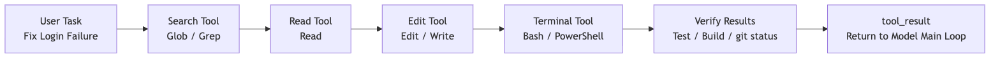
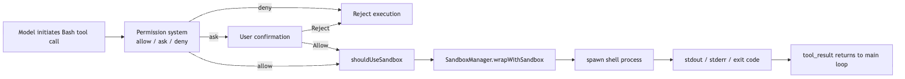

# Terminal Tools in Claude Code

Many people look at Claude Code's tool list and assume `Bash` is a very plain utility:

> Doesn't it just let the model run a shell command?

That interpretation is only half right.

If Claude Code were just a chatbot, it would not need such a heavyweight terminal tool. The model answering questions would be enough. But once it has to work inside a real code repository, the situation changes completely: after changing code, it has to run tests; to inspect project state, it needs `git status`; to start a service, it may need `npm run dev`; to verify a build, it might run `bun test`, `pytest`, or `cargo test`.

None of those actions fall under "read a file" or "write a file." They require handing execution over to the local environment.

Put plainly, the terminal tool solves this core problem:

> How does an agent turn "I want to run a command" into a controllable execution unit with a schema, permissions, progress, output, sandboxing, and a background-task lifecycle?

To keep this article concrete, we'll reuse one simple running example:

```text
The user says: Help me fix the login failure issue.
```

A reliable Claude Code workflow will usually look something like this:

```text
Glob / Grep locate auth-related files
-> Read inspects the core logic
-> Edit changes the code
-> Bash runs tests to verify the fix
-> Bash checks git diff / git status
```

In that chain, `Bash` usually appears in the second half. It does not replace `Read`, `Grep`, or `Edit`. It handles the questions that only the project environment itself can answer:

- Do the tests actually pass?
- Can the build script complete?
- What is the current state of the git working tree?
- Did the local service really start?
- What did the script actually output?

So the terminal tool is not a "universal entry point." It is the bridge between the agent and the real machine: the most dangerous bridge, and also one of the most valuable.



One scope note before we dive in: this chapter describes the Claude Code implementation as reflected in the source snapshot examined for this series, not as a timeless API contract. File paths and runtime behavior can change across releases.

## 1. Why You Can't Just Let the Model Run Arbitrary Shell Commands

The simplest implementation would be:

```ts
exec(modelGeneratedCommand)
```

But that is arguably one of the most dangerous designs in any agent system. Shell commands are not narrow APIs. The `Read` tool reads at most one file, `Grep` searches text, and `Edit` has an explicit file path and replacement content. A shell command, by contrast, can do almost anything:

```bash
cat package.json
npm test
rm -rf dist
curl https://example.com/install.sh | bash
git reset --hard
python script.py
```

Some commands are read-only. Some write files. Some run tests. Some download from the network. Some execute remote code. Worse, shell commands can be chained:

```bash
ls && git push
cat file | xargs rm
make test && npm publish
```

If the system only inspects the first part, it is easy to bypass. A permission check that approves the first command can still be followed by `&& rm -rf /`.

So Claude Code cannot implement `BashTool` as a thin `exec()` wrapper. It has to answer a whole sequence of questions first:

```text
Is the input valid?
Is this command read-only, a search, or potentially a write?
Does the current permission mode allow it?
Does it match an allow / ask / deny rule?
Does the user need to confirm?
Should it run in a sandbox?
If it runs for a long time, should it become a background task?
What happens if the output is too long?
Does the cwd change after execution?
How does the result go back into model context?
```

That is why `BashTool` looks so heavyweight in the source. It wraps an execution lifecycle, not just a command string.

## 2. BashTool Input: More Than Just a Command String

The main entry point for `BashTool` is:

```text
packages/builtin-tools/src/tools/BashTool/BashTool.tsx
```

It is defined through `buildTool()` as a formal tool, not a loose helper function.

The input schema shown to the model is roughly:

```ts
{
  command: string
  timeout?: number
  description?: string
  run_in_background?: boolean
  dangerouslyDisableSandbox?: boolean
}
```

Each field corresponds to a real execution concern.

`command` is the literal command to run.

`description` is a short human-readable summary. The source even requires active-voice descriptions of what the command does, rather than vague labels like "complex" or "risky." For example:

```text
ls -> List files in current directory
git status -> Show working tree status
npm install -> Install package dependencies
```

This is not just polish. Terminal commands are often long and cryptic, and UI collapses, permission prompts, and task lists all need a sentence a human can scan quickly.

`timeout` limits the maximum execution time. The default comes from `getDefaultTimeoutMs()`, and the maximum is capped by `getMaxTimeoutMs()`, which prevents the model from hanging the session with a command that never finishes. A `while true; do sleep 1; done` loop is exactly the kind of thing this is meant to stop.

`run_in_background` indicates that the command can become a background task. Starting a dev server, running a long build, or tailing logs should not block the main loop indefinitely.

`dangerouslyDisableSandbox` is a deliberately sensitive escape hatch. When policy allows it, this field explicitly requests that the command skip sandboxing. The `dangerously` prefix is there on purpose: this is not a normal toggle.

Even from the schema alone, the design intent is clear: Claude Code does not treat Bash as "execute this text." It treats it as "execute a governable action."

## 3. When Does BashTool Count as Read-Only

The first problem terminal tooling has to solve is:

> Which commands can be treated as safe observational actions, and which must be treated as potentially side-effectful actions?

The source introduces two related concepts that are easy to conflate:

- `isSearchOrReadCommand()`: mainly used for UI folding and display; it classifies a command as search, read, or list.
- `isReadOnly()`: used for concurrency safety and permission decisions; only commands that actually satisfy read-only constraints count as read-only.

Inside `BashTool.tsx`, Claude Code keeps several groups of common commands:

```text
Search: find, grep, rg, ag, ack, locate, which, whereis
Read:   cat, head, tail, wc, stat, file, strings, jq, awk, cut, sort, uniq, tr
List:   ls, tree, du
Semantically neutral: echo, printf, true, false, :
```

If the command is just:

```bash
rg "login" src
```

it can be classified as a search command.

If it is:

```bash
cat package.json | jq '.scripts'
```

it can be classified as a read / analysis command.

But if it is:

```bash
cat package.json | sh
```

then it can no longer be considered read-only. The second half, `sh`, executes whatever it receives as input.

The source takes a deliberately conservative approach. After splitting on pipelines, `&&`, `||`, and `;`, every non-neutral segment must belong to the search / read / list sets before the whole command can be treated as "read or search." The moment any unrecognized or potentially mutating command appears, Claude Code falls back to ordinary Bash handling.

The real read-only permission check goes deeper, into:

```text
packages/builtin-tools/src/tools/BashTool/readOnlyValidation.ts
```

That layer checks a more granular allowlist, including:

- Read-only git commands like `git status` and `git diff`
- Safe flags for `rg`
- Safe flags for `fd`
- Read-only subcommands for tools like `docker`, `gh`, and `pyright`
- Output redirection, path constraints, UNC path risks, and `sed` edge cases

Claude Code does not rely on a crude "command name whitelist." It keeps going, inspecting arguments, redirections, paths, and command structure. In other words, it cares about what the command will actually do, not what the model claims it wants to do.

This also explains why the documentation keeps repeating the same guidance: when `Read`, `Glob`, or `Grep` can express the action, prefer them. Bash is for the things that genuinely need a shell: testing, building, git operations, and starting services.

## 4. Permission Checking: BashTool Doesn't Guess

`BashTool`'s permission entry point is short:

```ts
async checkPermissions(input, context) {
  return bashToolHasPermission(input, context)
}
```

The real complexity lives in:

```text
packages/builtin-tools/src/tools/BashTool/bashPermissions.ts
src/utils/permissions/bashClassifier.ts
src/utils/permissions/shellRuleMatching.ts
```

That layer routes a shell command through Claude Code's permission system:

```text
permission mode
-> deny / ask / allow rules
-> auto-approve read-only commands
-> Bash safety classification
-> compound command splitting
-> user confirmation suggestions
-> sandbox-related auto-approval policy
```

One detail that matters: `preparePermissionMatcher()` parses the command through `parseForSecurity(command)`.

For a compound command like:

```bash
ls && git push
```

it cannot just match `ls`. The parser splits the subcommands so that `git push` also participates in permission matching. That way, if the user or policy has configured a rule like `Bash(git push:*)`, the command cannot slip through just because the first half looked harmless.

What if parsing fails?

Claude Code defaults to a fail-safe answer: if it cannot parse the command, it does not pretend the command is safe. The matcher returns a more conservative result so the security hooks still have a chance to block or escalate it.

The principle is simple:

> The less you understand a shell string, the less automatically you should trust it.

That principle runs through the whole security layer.

## 5. Bash Security: Pre-Execution Checks Can Only Go So Far

Claude Code performs a great deal of static safety analysis on Bash commands.

In `bashPermissions.ts`, for example, overly broad rule suggestions are blocked to prevent patterns like:

```text
Bash(sh:*)
Bash(bash:*)
Bash(env:*)
Bash(sudo:*)
```

Once saved, a rule like this effectively allows arbitrary commands to run through a wrapper. In practice, that is not much different from exposing raw `exec()`.

`readOnlyValidation.ts` is also full of safety annotations. For example, `fd`'s `--exec` and `--exec-batch` flags are excluded from the safe parameter list because they execute arbitrary commands against search results. Certain `xargs` parameters require special care as well, because GNU getopt's optional-argument behavior can make the validator and the actual execution behavior diverge.

These details show that Claude Code's Bash security model is much more than a "dangerous command blacklist." It behaves more like a layered evaluation:

```text
Can the command be parsed?
What is the subcommand?
Is there a dangerous shell wrapper?
Is there output redirection?
Are the command and arguments on the read-only allowlist?
Would it write to internal git paths?
Would it create a symlink?
Does it match a user-configured rule?
```

But no matter how fine-grained the static analysis becomes, the shell has one inherent problem:

> Once a command starts running, it may execute scripts, spawn child processes, or read and write dynamic paths. Many of those behaviors cannot be fully predicted from a pre-execution string analysis.

That is what brings in the next layer: sandboxing.

## 6. Sandbox: Not a Permission Replacement, but a Runtime Boundary

Whether `BashTool` enters the sandbox is determined by:

```text
packages/builtin-tools/src/tools/BashTool/shouldUseSandbox.ts
```

The logic reduces to four checks:

```text
Is sandbox enabled globally?
Was dangerouslyDisableSandbox explicitly set, and does policy allow it?
Does input.command exist?
Does the command match excludedCommands?
```

If those checks pass, the answer is `true`.

This tells us that Claude Code's sandbox is not a "this looks dangerous, so put it in a sandbox" mechanism. It is closer to:

```text
Sandbox by default whenever possible
-> only skip it for explicitly configured exceptions
```

At execution time, the sandbox participates in command construction inside `src/utils/Shell.ts`:

```text
provider.buildExecCommand(command)
-> shouldUseSandbox returns true
-> SandboxManager.wrapWithSandbox(...)
-> spawn(wrappedCommand)
```

So the sandbox is not an audit step after the fact. It changes the execution shape before `spawn` happens.

It is important to separate two layers of guardrails:

```text
Permission system: Should this command run at all?
Sandbox: Once it runs, what can it reach at most?
```

The permission system handles authorization. The sandbox handles isolation. Authorization cannot replace isolation, because pre-execution reasoning always has blind spots. Isolation cannot replace authorization either, because some actions should never be allowed in the first place.

The full chain looks roughly like this:



That is why terminal tooling and sandboxing sit so close together in the overall architecture: `BashTool` is the action entry point, and the sandbox is the runtime boundary where that action lands.

## 7. Real Execution: Every Command Is a New Shell Process

`BashTool.call()` eventually enters `runShellCommand()`, which calls:

```text
src/utils/Shell.ts
```

The core function is:

```ts
exec(command, abortSignal, 'bash', options)
```

Several very engineering-oriented things happen there.

First, Claude Code chooses a shell provider.

It checks `CLAUDE_CODE_SHELL` first, then the user's `SHELL` environment variable, then falls back to `zsh` or `bash`. But it only supports POSIX-style shells like bash and zsh, because BashTool's parsing, safety checks, and command construction all assume that shell family.

Second, it builds the command that actually runs.

`provider.buildExecCommand()` wraps the original command into an executable form and also records the cwd. After execution, Claude Code reads a temporary cwd file, checks whether the working directory changed, and updates the global cwd state.

That is why this works inside Claude Code:

```bash
cd packages/builtin-tools
```

Subsequent commands follow into the new directory. A normal `child_process.spawn` call would not push that state back into the parent process. Claude Code gets around that with an extra cwd tracking file, which is a neat way to reconcile process isolation with state synchronization.

Third, it handles output.

stdout and stderr flow into `TaskOutput`. Normally, output is written to a task output file, and a progress poller reads the tail once per second. If the caller provides `onStdout`, it can also switch into a pipe mode for real-time stdout.

Fourth, it injects runtime environment variables, including:

```text
GIT_EDITOR=true
CLAUDECODE=1
SHELL=<current shell>
```

`GIT_EDITOR=true` is especially important. It prevents commands like `git commit` from suddenly opening an editor and hanging the terminal session.

## 8. Long Commands Must Not Block the Main Loop

The terminal tool also has to solve a very practical problem:

> If the model runs `npm install`, `npm run dev`, or `pytest`, how long should the main loop wait?

Claude Code's answer is more nuanced than simply waiting.

`BashTool` defines several important constants:

```text
PROGRESS_THRESHOLD_MS = 2000
ASSISTANT_BLOCKING_BUDGET_MS = 15000
```

If a command has not finished within two seconds, the UI starts showing progress. `TaskOutput` polls the output file every second and sends the last few lines back to the UI.

If the command keeps running, for example beyond 15 seconds in assistant mode, the main agent should not remain blocked forever. Claude Code converts eligible commands into background tasks:

```text
Foreground shellCommand is running
-> registerForeground
-> exceeds blocking budget or user manually backgrounds it
-> backgroundExistingForegroundTask / spawnShellTask
-> returns backgroundTaskId
-> main loop continues
```

The model sees a result like:

```text
Command running in background with ID: ...
Output is being written to: ...
```

At that point, the agent can keep reading files and editing code, then later inspect the task output when the command finishes.

This is also where the terminal tool overlaps with the task system:

- `BashTool` launches the real shell process
- `LocalShellTask` brings long-running commands into the task lifecycle
- `TaskOutput` persists output and polls it
- `tool_result` feeds a consumable summary back to the model

Claude Code is not merely "running commands." It is turning them into manageable runtime objects.

## 9. What to Do When Output Gets Too Long

Terminal output can explode very easily.

For example:

```bash
npm test
pytest -vv
cat large.log
```

If all of that is shoved back into the model context, it does not just waste tokens. It also drowns the useful signal in noise.

`BashTool` has several layers of output governance.

First, the tool itself has `maxResultSizeChars`. In the source, BashTool sets it to `30_000`, and anything beyond that threshold is handled as a large result.

Second, progress updates only surface recent output. `onProgress(lastLines, allLines, totalLines, totalBytes, isIncomplete)` tells the UI and caller how many lines and bytes exist in total, and whether the visible slice is incomplete.

Third, genuinely large output is persisted to disk, and the model gets a response that effectively says: here is a preview, and the full output is available at this path.

The relevant logic lives in:

```text
src/utils/toolResultStorage.ts
packages/builtin-tools/src/tools/BashTool/BashTool.tsx
```

That has one especially important effect:

> The model knows the output was truncated, and it knows where the full output lives, rather than incorrectly believing it saw everything.

That is much safer than just chopping off the tail.

## 10. PowerShellTool: A Separate Shell Runtime, Not a Bash Clone

So far, we've focused on the POSIX shell path. But Claude Code also has a second terminal path for Windows and PowerShell.

The entry point for `PowerShellTool` is:

```text
packages/builtin-tools/src/tools/PowerShellTool/PowerShellTool.tsx
```

It looks a lot like `BashTool`, and shares the same core input shape:

```ts
{
  command: string
  timeout?: number
  description?: string
  run_in_background?: boolean
  dangerouslyDisableSandbox?: boolean
}
```

It also includes:

- `isSearchOrReadCommand()`
- `isReadOnly()`
- `checkPermissions()`
- `call()`
- background tasks
- output truncation
- a sandbox entry point

But PowerShell is not just Bash with different syntax.

It has its own command semantics:

```text
Get-Content
Get-ChildItem
Select-String
Invoke-WebRequest
Invoke-Expression
Start-Process
Remove-Item
```

And its own aliases:

```text
ls -> Get-ChildItem
cat -> Get-Content
rm -> Remove-Item
```

So `PowerShellTool` needs its own parser, read-only classification, security rules, and permission matching.

The relevant source files include:

```text
packages/builtin-tools/src/tools/PowerShellTool/powershellPermissions.ts
packages/builtin-tools/src/tools/PowerShellTool/powershellSecurity.ts
packages/builtin-tools/src/tools/PowerShellTool/readOnlyValidation.ts
src/utils/powershell/parser.ts
```

For example, `powershellSecurity.ts` explicitly checks for:

- `Invoke-Expression`, PowerShell's version of `eval`
- dynamic command names
- intent-obscuring parameters like `-EncodedCommand`
- nested invocations of `pwsh` or `powershell`
- download-and-execute cradle patterns
- privilege escalation paths like `Start-Process -Verb RunAs`
- COM objects, module loading, and dangerous script blocks

None of that is covered by Bash's security model. PowerShell's attack surface is genuinely different.

There is also an important platform boundary: sandboxing is unavailable on native Windows. If enterprise policy requires sandboxing and does not allow unsandboxed commands, `PowerShellTool` refuses to run rather than silently bypassing the restriction.

The source is explicit:

```text
Enterprise policy requires sandboxing, but sandboxing is not available on native Windows.
Shell command execution is blocked on this platform by policy.
```

So Claude Code's stance on cross-platform terminal tools is not "make it run at all costs." It is:

> Different shells have different semantics. Different platforms have different security capabilities. You cannot pretend they are all the same.

## 11. Why Terminal Tools Shouldn't Replace Dedicated Tools

At this point, a natural question comes up:

> If Bash can do everything, why do we still need Read, Glob, Grep, Edit, and Write?

The answer is simple: "can" is not the same as "should."

Yes, you can read a file with Bash:

```bash
cat src/auth.ts
```

But `Read` provides much stronger governance:

- It knows the action is read-only
- It controls read size and pagination
- It updates `readFileState`
- It supports images and other multimodal files
- It establishes an "already-read" baseline for `Edit`
- It lets the UI render the file as a file-reading interaction

You can also search with Bash:

```bash
rg "login" src
```

But `Grep` and `Glob` give the model a more structured and better-controlled search interface, while also making permission checks and result caps easier to enforce.

Writing files through Bash is possible too:

```bash
python - <<'PY'
...
PY
```

But that bypasses the whole chain behind `Edit` and `Write`: diffs, file history, permissions, LSP integration, and IDE presentation. In plain terms, writing files through Bash skips the file-governance layer and writes directly to disk.

So Claude Code's tool-selection strategy contains an implicit rule:

```text
Prefer dedicated tools for narrow actions
-> use terminal tools only for project-environment behavior that dedicated tools cannot express
```

The more powerful the terminal tool, the more important it is to keep it in the right role.

## 12. Putting Bash and PowerShell Back into the Agent Main Loop

Now place the terminal tools back into Claude Code's larger runtime picture.

One command execution usually follows a chain like this:

```text
The model emits tool_use
-> BashTool / PowerShellTool validate the input
-> the permission system decides allow / ask / deny
-> read-only and safety classification attempt auto-approval
-> shouldUseSandbox decides whether sandboxing applies
-> Shell.exec builds the command and spawns it
-> TaskOutput collects stdout / stderr
-> long commands turn into background tasks
-> large output is persisted and previewed
-> tool_result returns to the model
-> the model decides what to do next
```

That chain explains why terminal tools are such a central layer in the agent harness.

The model does not really run tests or start services. It only proposes the intent. Claude Code's tool runtime is what actually lands that intent on the machine.

The value of `BashTool` and `PowerShellTool` is that they take the most open-ended, most dangerous action in the system, "execute a command," and reshape it into an engineering workflow that is explainable, reviewable, isolatable, observable, and recoverable.

## 13. The One-Sentence Takeaway

If you only remember one sentence, let it be this:

> Claude Code's terminal tool is not just an `exec()` wrapper. It is the runtime layer that brings shell commands into the agent main loop: schema, read-only checks, and permissions up front; sandboxing and shell providers in the middle; progress, background tasks, output truncation, and `tool_result` on the back end.

That is also why Bash and PowerShell are among the Claude Code tools that feel most like a real engineering system.
