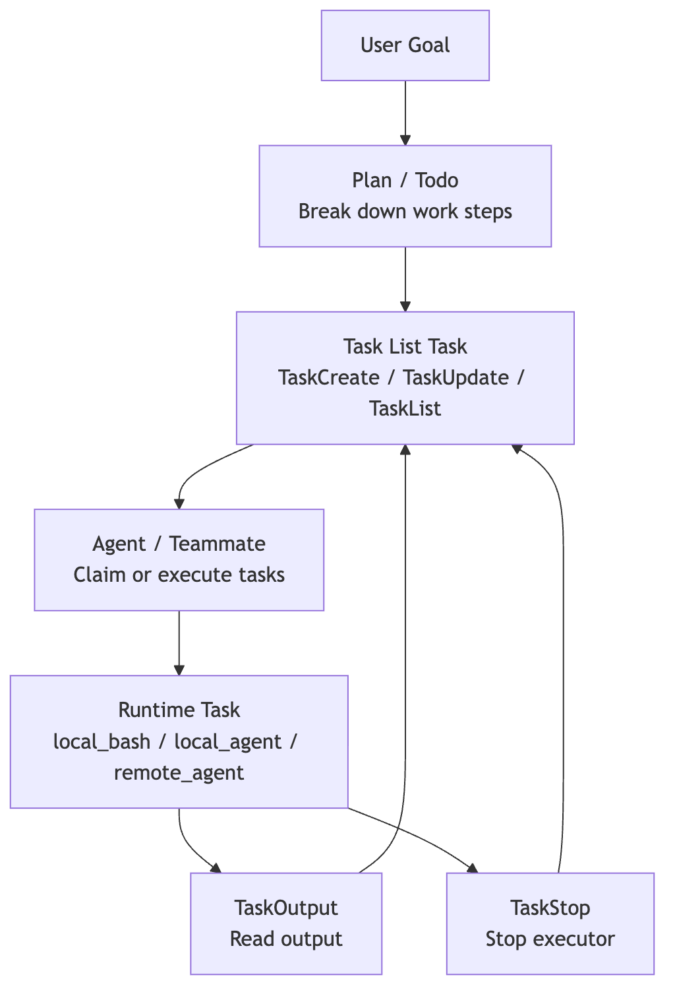

# Task Management in Claude Code

The earlier chapters in this series looked at tools mainly through one lens: how the model reaches beyond the conversation and touches the outside world.

- File tools let it read and write code
- Search tools let it locate clues
- Terminal tools let it run commands
- Network and MCP tools let it connect to outside capabilities

But there is another class of tools that does not read files, run commands, or make requests. It answers a different question:

> Once a task stretches across multiple steps, how does Claude Code know where it is in the work?

Imagine the user says:

```text
Fix the login failure, add tests, confirm existing endpoints still work, and then summarize the changes.
```

That is obviously not a one-step action. At minimum it has to move through something like:

```text
Diagnose the issue
-> Design the fix
-> Change the code
-> Run tests
-> Handle failures
-> Summarize the result
```

If all of that state lives only in conversational text, the model can get into trouble very quickly:

- It forgets what it promised halfway through
- It repeats work it already completed
- It loses track of dependencies and tackles downstream tasks first
- A background command is still running, but the main conversation does not know where to read its output
- In multi-agent collaboration, ownership quickly turns into a mess

So Claude Code needs a set of workflow tools. These tools do not represent an external resource. They turn the agent's own work process into visible, updatable, and recoverable state.

You can think of them in four layers:

| Layer | Problem it solves | Typical form |
| --- | --- | --- |
| `Todo` | What still needs to happen in the current conversation | Lightweight checklist |
| `Task` | How complex work is persisted, assigned, dependency-tracked, and stopped | Task list + runtime task layer |
| `Plan` | How to enter a read-only planning and approval phase before execution | Plan Mode / plan file / permission switching |
| `Worktree` | How to isolate parallel or high-risk changes | Independent git worktree |

This chapter focuses on `Task`. In this article, `Task` refers to two related but distinct mechanisms: the persistent task list that tracks planned work, and the runtime task layer that tracks live execution objects. That split is the key to the whole chapter.

## 1. Why Todo Lists Fall Short

A todo list captures "what should I do next." Intuitively, it seems simple enough:

```text
[ ] Reproduce the login failure
[ ] Identify the root cause
[ ] Fix the auth logic
[ ] Add tests
[ ] Run the full test suite
```

For short tasks, this kind of checklist works fine. The user can see the agent's progress, and the model can remind itself not to drift off course.

But the todo list has a natural boundary: it describes a cognitive plan, not a system-level task object.

Once tasks become complex, the checklist begins to strain.

"Add tests" might depend on "fix the auth logic" happening first. "Run the full test suite" could be a background command that takes minutes to produce results. And if sub-agents enter the picture, one reviewer handling the security audit while another worker runs compatibility tests, a plain checklist struggles to answer questions like:

- Does this piece of work have a unique ID?
- Where is its full description stored?
- Who picked it up?
- Which tasks block it?
- Which tasks will it unblock once completed?
- If it maps to a background process, where do you read its output?
- If that background process gets stuck, how do you stop it?

Tasks do not exist because the todo list was not written nicely enough.

The real problem Tasks solve is:

> Upgrading "what I want to do" from a short sentence in a chat into a piece of task state that the runtime can manage.

## 2. Task, Layer One: The Task List

Claude Code's Task is easy to get confused about because there are two mechanisms sharing the same name.

The first layer is the task list. It focuses on:

> What the work is, who owns it, what state it is in now, and what dependencies exist between it and other tasks.

At this layer, `TaskCreate`, `TaskGet`, `TaskUpdate`, and `TaskList` are about the work plan, not background processes.

Think of it as a task database that is more formal than a Todo:

```text
TaskCreate
-> Creates a pending task
-> Writes the task ID, title, description, owner, dependencies, and metadata
-> Saves it in the local task directory
```

A task of this kind usually includes:

```text
id: Task number
subject: One-line title
description: Full task description
activeForm: How to describe it while in progress
owner: Who is responsible
status: pending / in_progress / completed
blocks: Which tasks it blocks
blockedBy: Which tasks block it
metadata: Additional context
```

The difference from a Todo is important. A Todo is closer to a short-term reminder for the model. A task-list entry is a structured work object consumed by the runtime and collaboration system.

The source stores these as JSON files rather than in-memory arrays. That design choice matters, and we will come back to it in a moment.

A small example:

```text
User goal: Fix login failure

#1 Reproduce the login failure
#2 Inspect the auth middleware
#3 Fix the token refresh logic
#4 Add a regression test
#5 Run the full test suite
```

Here, `#4` might be blocked by `#3`, and `#5` by `#4`. A Todo can help the model understand this relationship, but the system cannot maintain it very reliably. The task list can encode those dependencies into structured fields.

The value of the task-list layer is not "showing more text." It is turning work into computable state:

```text
Which tasks have not started yet
Which tasks are currently in progress
Which tasks are completed
Which tasks are blocked
What gets unlocked after the current task completes
Which tasks a given owner is responsible for
```

This is also a critical layer in multi-agent collaboration. Once teammates, workers, or reviewers are involved, tasks can no longer live only inside the main agent's head. They have to become a shared protocol that everyone can read and write.

## 3. Why Task Lists Live on the Filesystem

Looking at the source, Claude Code does not store the task list as an in-memory array. Instead, each task is a standalone JSON file.

That may seem heavyweight, but it is a deliberate engineering trade-off.

If all tasks lived inside one global array, fine-grained locking would become painful under multi-agent or multi-process concurrency. A reviewer updates task `#4`'s status while a worker edits task `#3`'s description, and without per-task isolation the last writer can silently clobber the other's changes.

One file per task shrinks the conflict domain down to the individual task:

```text
tasks/
  task-list-id/
    .highwatermark
    1.json
    2.json
    3.json
```

`.highwatermark` tracks the highest ID ever assigned, preventing old IDs from being reused after deletion. A list-level lock governs bulk operations like creation, reset, and claiming; task-level locks govern updates to a single task.

That tells us the Task system is not about slapping a list onto the UI. It is solving real state-consistency problems in collaborative workflows.

One compact way to remember the distinction:

> A todo is working memory inside the conversation. A task list is durable work state on the filesystem.

## 4. Task, Layer Two: Runtime Tasks

So far, we have only talked about the first layer of `Task`.

Claude Code has a second layer, also called `Task`, but it is not concerned with "what should be done." Instead, it asks:

> What background execution units are currently running, where is their output, and how do we stop them if necessary?

This is the runtime task layer.

For example, the model executes:

```bash
npm test
```

If that command finishes quickly, it is just an ordinary Bash invocation. But if it becomes a background task, the main conversation needs to keep moving while retaining control over the process:

```text
Background test task is running
-> Main agent keeps reviewing code or waits for the user
-> Reads test output later
-> Stops the task if it gets stuck
```

Runtime tasks manage exactly these objects. They live in `AppState.tasks` for the current session, with types including:

```text
local_bash
local_agent
remote_agent
in_process_teammate
local_workflow
monitor_mcp
dream
```

Their states are different from task-list states:

```text
pending
running
completed
failed
killed
```

Notice that these are no longer `pending / in_progress / completed`. A runtime task behaves more like a process lifecycle than a work-plan state.

That is why `TaskStop` and `TaskOutput` do not belong to the task-list layer.

`TaskOutput` is concerned with:

```text
Does this background task have output?
Where did we last read up to?
Should we block and wait this time?
Has the output file exceeded its limit?
```

`TaskStop` is concerned with:

```text
Does this task exist?
Is it still running?
What type of background task is it?
Which kill implementation should be invoked?
```

That is a completely different responsibility from `TaskCreate`.

## 5. Why the Same Piece of Work Has Two IDs

The easiest place to confuse the two Task layers is when one real piece of work corresponds to two IDs at the same time.

The task list contains:

```text
#5 Run full test suite
```

The model starts executing and launches the tests through Bash. If the tests move into the background, the system also creates a runtime task:

```text
b9x4k2...  local_bash  running
```

Same work, two identities:

| Identity | What it represents | Who uses it |
| --- | --- | --- |
| `#5` | The planned work item "Run full test suite" | User, main agent, teammates |
| `b9x4k2...` | The running test process | Runtime, TaskOutput, TaskStop |

The first answers "is the work done?" The second answers "what is happening with the process right now?"

When the test fails, the model reads the output from `b9x4k2...`, then keeps `#5` as `in_progress` or updates related tasks. When the test passes, it marks `#5` as `completed`.

Why the two Task layers cannot be merged:

```text
Task list Task: collaboration state
Runtime Task: execution lifecycle
```

One describes what the team intends to do and how far it has gotten. The other describes what is actively running in the system, where the output lives, and how to stop it.

## 6. Splitting Responsibilities Across Task Tools

Once the two layers are separated, the tool names become much clearer.

Task-list layer:

| Tool | Purpose |
| --- | --- |
| `TaskCreate` | Create a planned task without starting execution |
| `TaskGet` | Read a task's full description, status, and dependencies |
| `TaskList` | List task summaries so the model and teammates can scan the current work |
| `TaskUpdate` | Update status, owner, metadata, dependencies, or delete a task |

Runtime layer:

| Tool | Purpose |
| --- | --- |
| `TaskOutput` | Read background task output, with support for incremental reads and waiting |
| `TaskStop` | Stop a background task that is still running |

Mixing them up causes problems:

- `TaskCreate` creates `#1`, but `TaskStop` cannot stop it
- `TaskOutput` cannot read the `description` inside a planned task
- `TaskUpdate` changes task-list state, not background-process state
- A background process failing does not mean the corresponding planned task automatically completes or disappears

This is a crucial point when reading the source. Whenever you see the word `Task`, ask:

> Is this referring to an entry in the task list, or a runtime execution body?

## 7. How Tasks and Agents Collaborate

The Task system sits under workflow tools for another reason: it is one of the foundations of multi-agent collaboration.

In a single-agent world, task state can be rough. The main agent knows what it needs to do and may keep a Todo list at most.

Once you enter multi-agent territory, things change:

```text
Main agent: responsible for the overall objective and final decisions
Worker: responsible for implementing a particular module
Reviewer: responsible for auditing risks
Tester: responsible for running tests and reproducing bugs
```

At that point, a task must support several things:

- It can be claimed by a specific owner
- It can be displayed to different participants
- It can express dependencies
- It can notify relevant parties when completed
- It can release unfinished work when a teammate exits
- It can bring background agents or shells under runtime management

So Task is not an isolated tool. It is wired into Agent, Plan, Bash, permissions, and the UI.

A simple diagram shows the bigger picture:



The task list and runtime tasks are not substitutes for each other. They collaborate.

The task list tells the team what should be done; runtime tasks tell the system who is currently running.

## 8. Boundaries with Plan and Worktree

Task often appears alongside Plan and Worktree, but the three solve different problems.

Plan handles the boundary before action begins:

```text
Read-only research first
-> Generate a plan
-> Wait for user approval
-> Then enter execution
```

Task handles state during execution:

```text
Which work items exist
-> Who owns them
-> Which are completed
-> How background executors read output and stop
```

Worktree handles file-modification isolation:

```text
Parallel changes or high-risk changes
-> Create an isolated workspace
-> Avoid polluting the main worktree
-> Finally merge or discard
```

Chained together:

```text
Plan: Decide what to do first
Task: Turn what needs to be done into trackable state
Worktree: Provide an isolated workspace for the execution phase where code actually changes
```

Todo is lighter-weight. Most of the time, it is just a progress indicator for the user and model inside the current conversation.

## 9. The Thread to Follow in the Source

When reading Claude Code's Task source, do not start by memorizing tool names.

A more useful approach is to keep two questions in mind:

```text
Question 1: Is this code managing a work plan or a background execution unit?
Question 2: Who is this state for — the model, the user, a teammate, or the runtime?
```

Start with the task-list layer, because that is where planned work becomes structured shared state:

- `src/utils/tasks.ts`
- `TaskCreateTool`
- `TaskGetTool`
- `TaskUpdateTool`
- `TaskListTool`
- `useTasksV2`
- `TaskListV2`

Then move to the runtime layer, because that is where live execution objects become observable and controllable:

- `src/Task.ts`
- `src/tasks.ts`
- `src/tasks/stopTask.ts`
- `LocalShellTask`
- `LocalAgentTask`
- `TaskStopTool`
- `TaskOutputTool`
- `diskOutput`
- `framework`

If you only read `TaskCreate`, you will think Task is just a fancier Todo.

If you only read `TaskStop`, you will think Task is just a background process.

Only when you hold both layers together does Claude Code's real design come into focus:

> It is not about making the model remember what it needs to do. It is about giving the host system a work-state model that is observable, assignable, dependency-aware, stoppable, recoverable, and able to notify the right participants.

## 10. Summary

Task is one of the most central workflow tools in Claude Code, and also one of the easiest to misunderstand.

It is not a beefed-up Todo. It is the combination of two distinct mechanisms:

- **Task list**: turns planned work into persistent, assignable, dependency-aware work objects
- **Runtime task**: turns background shells, agents, remote sessions, and similar executors into lifecycle-managed objects that can be inspected, stopped, and tied back into the larger workflow

Once you grasp that split, Claude Code's long-running task behavior becomes much easier to read:

```text
Todo makes short-term steps visible
Plan makes pre-execution understanding and approval controllable
Task makes the execution process traceable
Worktree makes file modifications isolatable
```

Taken together, these layers are what make Claude Code more than a chat assistant that merely says "here's what I'll do next." They turn it into a runtime that can organize, coordinate, and recover real engineering work.
