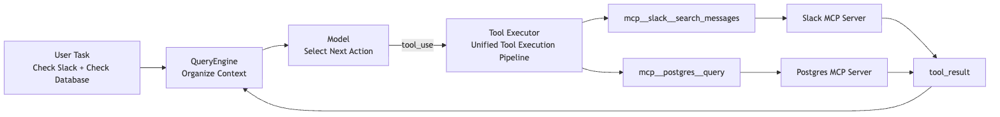
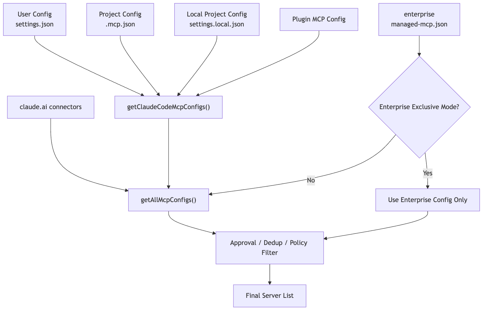
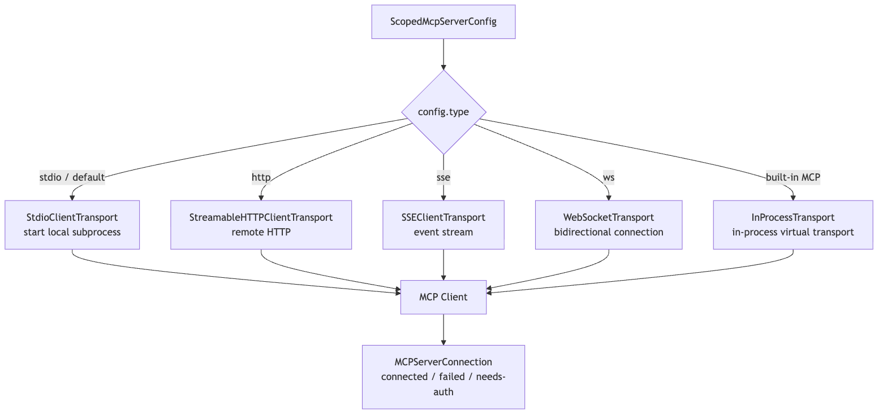
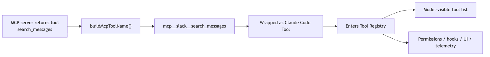
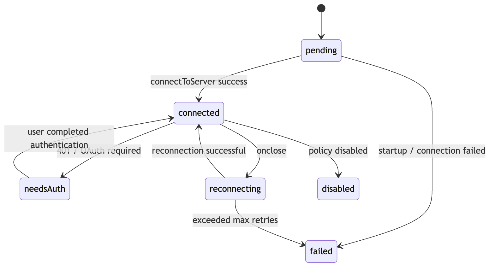
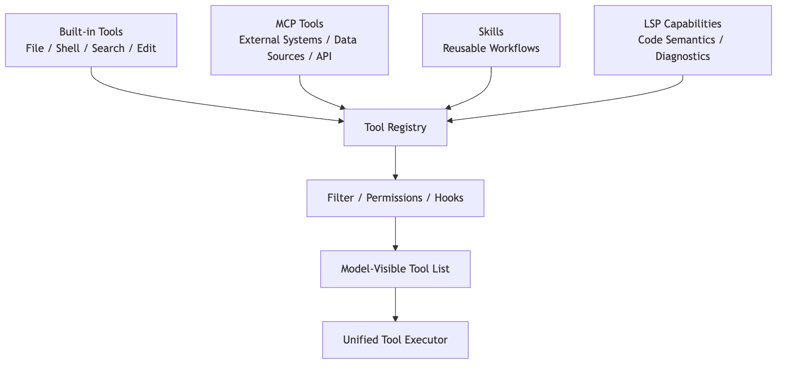
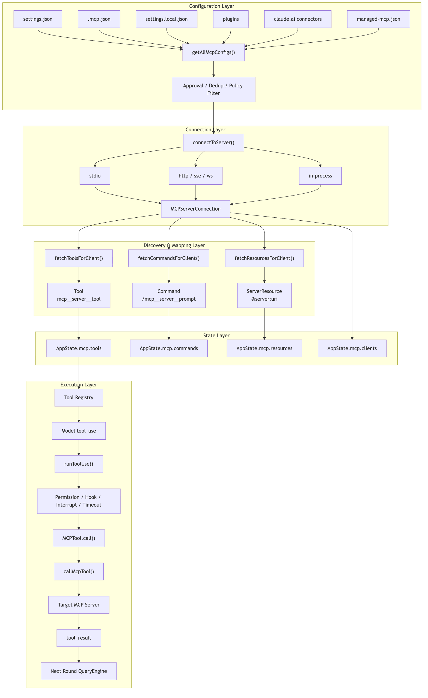

# MCP in Claude Code

In the previous chapter on tools, we already saw a core design principle in Claude Code:

> The model does not directly operate the computer. It proposes an action, and Claude Code's tool system is what actually executes it.

By that point, Claude Code could already read files, edit files, run commands, and search code. So why does it still need MCP?

We already mentioned MCP in the extension layer earlier: it is the protocol through which external systems expose tools, resources, and prompts in a unified way. This chapter does not repeat the general concept. It focuses on something more specific:

> How does Claude Code take an external MCP server and turn it into an internal capability that the model can call safely, the UI can display, the permission system can govern, and the main loop can keep driving forward?

Because real development does not happen only inside a local repository.

A real engineering task often touches outside systems such as:

- GitHub issues or PRs
- Jira tickets
- Slack conversations
- Figma designs
- Postgres or MySQL databases
- Sentry or Datadog monitoring
- Internal docs, knowledge bases, and business APIs

If Claude Code hard-coded one built-in tool for each of those systems, the whole architecture would quickly become unmanageable: too many tools, fragmented connection paths, harder permission governance, and no clean way for teams to standardize access to their private systems.

That is exactly the problem MCP is meant to solve.

To keep the discussion concrete, use this running example throughout:

```text
The user configures two MCP servers for Claude Code:

1. slack: a remote MCP, exposing tools such as search_messages and send_message
2. postgres: a local stdio MCP, exposing tools such as list_tables and query

The user says:
"Look up yesterday's Slack discussions about order timeouts, then cross-reference the database to see the distribution of recently failed orders."
```

On the surface, that is one conversational request. Under the hood, Claude Code has to do a lot:

1. Read MCP configuration at startup and discover that `slack` and `postgres` exist.
2. Establish a remote connection for one and a local child-process connection for the other.
3. Ask each server what tools, prompts, and resources it exposes.
4. Turn those external capabilities into Claude Code's own internal objects.
5. Sync them into `AppState.mcp` and the active tool pool.
6. Route calls like `mcp__slack__search_messages` through the same permission pipeline as other tools.
7. Only at invocation time, translate the request into MCP JSON-RPC and send it to the server.
8. Wrap the result back into Claude Code's `tool_result` format so the next round of model reasoning can continue.

That whole chain is Claude Code's MCP implementation.



The core conclusion of this chapter can be stated up front:

> MCP in Claude Code is not a side-channel RPC path. It is a main-pipeline integration. Claude Code first translates an MCP server into its own `Tool` / `Command` / `Resource` objects, then reuses the existing tool pool, permissions, state, UI, telemetry, interrupt handling, and main loop.

## 1. Why MCP Can't Just Be "Send an RPC"

The simplest MCP client can be paper-thin:

```text
Read a server config
-> Connect to the server
-> Call tools/list
-> Call tools/call
-> Return the result to the model
```

For a demo, that is enough.

But Claude Code cannot afford to be that simple. It is not a chat box. It is an agent harness that has to run continuously inside real engineering environments.

The moment you plug in external tools, everything becomes more complicated.

First, where do servers come from?

MCP servers can come from user config, shared project config, plugins, enterprise policy, the claude.ai connector, and capabilities built directly into Claude Code. Those sources cannot simply be thrown together.

Second, how do you connect to them?

A local database MCP may use stdio. A Slack MCP may use HTTP. SSE was supported historically. Browser-control MCP can even run inside the Claude Code process itself.

Third, how do you handle tool names?

Suppose Slack MCP exposes `send_message`, and another IM MCP also exposes `send_message`. The model cannot be shown two identically named tools with different risk profiles, and the permission system must know exactly which tool belongs to which server.

Fourth, how do you manage connection state?

Remote tokens expire. Servers disconnect. Tool lists change. Resources update. MCP is not a one-time startup scan. It is a set of live connections.

Fifth, where is the security boundary?

An external MCP server may send messages, query a database, or reach into the internal network. Claude Code cannot let it bypass the existing permission model, hooks, and audit trail simply because it is labeled MCP.

That is why Claude Code's MCP module effectively grows into six layers:

```text
Configuration layer: decide which MCP servers exist
-> Transport layer: decide how each server connects, and whether it is connected
-> Discovery layer: pull back tools / prompts / resources
-> Mapping layer: wrap external capabilities as internal Tool / Command / Resource
-> State layer: synchronize those connections and capabilities into AppState.mcp
-> Execution layer: reuse the generic tool pipeline, sending MCP RPC only at the moment of actual invocation
```

The rest of the chapter follows that chain.

## 2. Configuration Layer: Claude Code First Produces a Final Server List

The first step in MCP is not connecting. It is configuration merging.

Claude Code can discover MCP servers from many places:

- User-level config, such as `~/.claude/settings.json`
- Project-level config, such as `.mcp.json` at the repo root
- Local project config, such as `.claude/settings.local.json`
- MCP servers bundled with plugins
- The claude.ai connector
- Enterprise-managed config, such as `managed-mcp.json`
- Built-in MCP servers injected at runtime

From the user's point of view, this may look simple:

```bash
claude mcp add postgres -- npx -y postgres-mcp-server
```

Or it may look like a `.mcp.json` file in the project:

```json
{
  "mcpServers": {
    "postgres": {
      "type": "stdio",
      "command": "npx",
      "args": ["-y", "postgres-mcp-server"],
      "env": {
        "DATABASE_URL": "${DATABASE_URL}"
      }
    }
  }
}
```

But in the source, Claude Code is not just "reading a JSON file." It is merging multiple configuration sources into one final usable mapping.

Two key entry points:

```text
src/services/mcp/config.ts

getClaudeCodeMcpConfigs()
getAllMcpConfigs()
```

The high-level path for `getAllMcpConfigs()` looks like this:

```text
Enterprise MCP exists
-> Hand directly to getClaudeCodeMcpConfigs()

Otherwise:
-> Start the claude.ai connector fetch early
-> Read local / project / user / plugin configs in parallel
-> Apply policy filtering to the claude.ai connector
-> Deduplicate connectors by URL signature
-> Merge the final server list with claude.ai at the lowest priority
```

Two subtle points matter here.

First, the claude.ai connector fetch is launched early as a Promise so it can proceed in parallel with local config and plugin cache loading. MCP configuration is not purely local I/O; it may involve the network, so startup performance already matters at this layer.

Second, deduplication is not simple key overwriting. Comments in the source make it clear that names like `slack` and `claude.ai Slack` may not collide by key at all, so deduplication has to happen by content, using URL signatures.

In plain terms, the configuration layer answers this question:

> The same external capability may enter Claude Code through different channels. What finally gets exposed to the model must be a clean, governable, non-duplicated server list.

### Merging Configurations Across Scopes

In the official Claude Code workflow, MCP configuration has at least three scopes: local, project, and user.

In practice:

- `local`: only affects you inside the current project; useful for private config and sensitive credentials
- `project`: stored in `.mcp.json`; useful for team-shared setup
- `user`: applies across projects; useful for your own recurring tools

When the same server name appears in multiple scopes, Claude Code needs a stable priority order. Otherwise the user can never know which server definition actually wins.

The configuration layer in the source resolves those inputs into a structure like:

```text
Record<string, ScopedMcpServerConfig>
```

That is:

```text
serverName -> Server config with source and scope metadata
```

### Project-Level `.mcp.json` Requires Approval

Project-level MCP config is convenient, but it is also risky.

Because `.mcp.json` can be committed into a repository. If you clone a project and Claude Code accepts it blindly, the repository can influence what processes your machine starts and what services it connects to.

That is why Claude Code requires approval for project-level MCP configuration.

This matters because MCP security does not begin only when a tool is invoked. It starts much earlier, at the point where the system decides whether a server is even allowed to enter the runtime.

### Enterprise Configuration May Enter Exclusive Mode

If enterprise-managed MCP config is present, Claude Code can enter a stronger policy-control mode.

This shows that MCP is not just a hobby extension point. It is designed as an extension layer that can live under organizational governance.

An organization can decide:

- Which MCP servers are allowed
- Which servers are denied
- Which config sources take priority
- Which capabilities must go through centralized authentication

### Post-Merge Deduplication and Policy Filtering

Plugins, user config, and the claude.ai connector may all point to the same or similar server. Claude Code has to deduplicate them to avoid exposing the same capability multiple times.

After merging, the server list also goes through policy filtering.

That policy filtering is not just a server-name check. In the current source, `filterMcpServersByPolicy()` calls `isMcpServerAllowedByPolicy()`, which checks different dimensions depending on server type:

```text
stdio server: match against the command array
remote server: match against URL patterns
unknown type: fall back to name matching
SDK server: exempt from CLI-side policy, since the CLI is not responsible for spawn/network
```

This is more reliable than a server-name allowlist. Server names are arbitrary; real risk depends on what command gets spawned, what URL gets contacted, and what privileges get introduced.

So the configuration layer is simultaneously handling:

```text
Source priority
Content deduplication
Policy filtering
```

What it produces is not "everything that was read," but rather:

> A final MCP server mapping that has already gone through scope merging, project approval, enterprise policy, deduplication, and policy filtering.



That layer solves one core problem:

> Before an external capability enters Claude Code, establish where it came from, which scope it belongs to, and whether it is allowed.

## 3. Transport Layer: One MCP, Multiple Transports in Claude Code

Once Claude Code has a server list, the next step is connection.

The key entry point is:

```text
src/services/mcp/client.ts

connectToServer()
```

This is not a simple `new Client()`. It behaves more like a connection factory with memoization:

```text
serverName + serverConfig
-> MCPServerConnection
```

The most important detail is the return value.

Claude Code does not return a bare MCP client. It returns a stateful connection object:

```text
MCPServerConnection

connected
failed
needs-auth
disabled
pending
```

Why model it that way?

Because an MCP server is not just "present" or "absent." It can occupy many intermediate states:

- The local command does not exist, so startup fails
- A remote server returns 401 and needs OAuth
- Enterprise policy disables the server
- The connection is still pending
- The server is connected but capability refresh has not completed

The UI, `AppState`, tool pool, and main loop all need to observe those states.

### stdio: Local MCP Servers Are Child Processes

The most common local MCP shape is stdio.

Its model is roughly:

```text
Claude Code launches a child process
-> child stdin receives JSON-RPC
-> child stdout returns JSON-RPC
-> child stderr emits logs
```

For example, a Postgres MCP might look like:

```text
command: npx
args: ["-y", "postgres-mcp-server"]
env: { DATABASE_URL: "..." }
```

The transport layer has to:

- Resolve the final command / args / env
- Launch the child process
- Capture stderr
- Build the MCP client transport
- Clean up resources when the server exits
- Escalate shutdown through `SIGINT -> SIGTERM -> SIGKILL` if needed

That is no longer "send a request." It is local process lifecycle management.

### HTTP / SSE / WebSocket: Remote MCP Needs Network and Auth Governance

Remote MCP servers may use HTTP, SSE, or WebSocket transports. In current official guidance, remote HTTP is preferred; SSE remains in compatibility paths but is documented as deprecated.

A Slack MCP might look like:

```json
{
  "type": "http",
  "url": "https://example.com/mcp/slack",
  "headers": {
    "Authorization": "Bearer ${SLACK_MCP_TOKEN}"
  }
}
```

This kind of transport has to deal with more:

- Environment-variable expansion in URLs and headers
- Connection timeouts
- Proxy config
- 401 auth failures
- OAuth login
- HTTP / SSE session invalidation recovery
- Reconnection after network loss

So `connectToServer()` chooses different transports based on `config.type`, then funnels all of those differences into the same `MCPServerConnection` abstraction.



At a high level, the most important `connectToServer()` branches are:

```text
serverRef.type === "sse"
-> assemble ClaudeAuthProvider, headers, proxy, timeout, SSE transport

serverRef.type === "ws"
-> assemble websocket headers, proxy agent, TLS options

Built-in Chrome / Computer Use MCP
-> createLinkedTransportPair()
-> use in-process transport

stdio or no declared type
-> StdioClientTransport(command, args, env, stderr: "pipe")

Then:
-> new MCP Client({ name: "claude-code", capabilities: roots / elicitation })
-> client.connect(transport)
-> race against a connection timeout Promise
-> success returns connected
-> failure wraps into failed / needs-auth / and related states
```

Several implementation details stand out.

First, `connectToServer()` is memoized. Claude Code does not want to connect repeatedly to the same server + config, especially when a stdio transport would spawn more child processes.

Second, remote transport is not just `fetch(url)`. It packages auth providers, headers, proxy settings, timeout handling, step-up detection, and User-Agent behavior.

Third, built-in MCP and stdio MCP share the same upper-layer abstraction. Chrome MCP uses `createLinkedTransportPair()` for an in-process transport, but downstream it is still treated as an ordinary MCP client.

Fourth, connection itself has timeout protection. On failure, the code does not simply throw; it turns the failure into connection state that `/mcp`, `AppState`, and the tool pool can all consume.

### Built-In MCP: It Looks Like a Server, but Lives in the Same Process

Claude Code also has a special category of MCP: built-in MCP.

Examples include:

- `claude-in-chrome`
- `computer-use`

At the upper layer, these still look like MCP servers. But they do not necessarily spawn an external process. The source instead creates a pair of in-process transports and directly wires client and server together.

Conceptually:

```text
clientTransport.send(message)
-> queueMicrotask()
-> serverTransport.onmessage(message)
```

The essence of `InProcessTransport.ts` compresses down to:

```text
createLinkedTransportPair()
-> create two Transports that hold peer references
-> send(message) dispatches to peer.onmessage via queueMicrotask
```

No network packets are sent. Nothing is serialized to stdio. It is just asynchronous delivery of JSON-RPC messages to a peer transport. But because it implements the MCP SDK's `Transport` interface, the upper layer does not need to care.

That has a few big benefits:

- The upper layer still sees a standard MCP client
- Capabilities still go through MCP discovery for tools, resources, and prompts
- No extra IPC or child processes are needed
- Built-in and external MCP share the same adaptation logic

That reflects a broader design choice in Claude Code:

> Transports may vary, but upper-layer objects must stay uniform.

### What the Transport Layer Really Solves

So the transport layer is not fundamentally about opening a socket.

It is about this:

> Whether the server comes from a local process, a remote service, or an in-process implementation, always turn it into a stateful, reconnectable, auth-aware, and cleanly managed `MCPServerConnection`.

## 4. Discovery Layer: MCP Servers Expose More Than Just Tools

Once a connection is established, Claude Code cannot immediately hand the server to the model.

It still has to perform capability discovery.

MCP servers can expose three major kinds of capabilities:

- `tools`: actions the model can invoke, such as querying a database, sending messages, or searching issues
- `prompts`: user-selectable prompt templates, often surfaced in Claude Code as slash commands
- `resources`: referenceable context objects, such as issues, documentation, or database schemas

The corresponding source entry points are:

```text
fetchToolsForClient()
fetchCommandsForClient()
fetchResourcesForClient()
```

At the protocol level, these roughly correspond to:

```text
tools/list
prompts/list
resources/list
```

But Claude Code does not pass those raw results straight to the model. It first translates them into its own runtime objects.

## 5. Mapping Layer: MCP Tools Are Wrapped as Claude Code's Own Tools

This is the single most important step for understanding MCP in Claude Code.

An MCP server may return a tool like this:

```json
{
  "name": "search_messages",
  "description": "Search Slack messages",
  "inputSchema": {
    "type": "object",
    "properties": {
      "query": { "type": "string" }
    },
    "required": ["query"]
  }
}
```

If Claude Code simply exposed it as `search_messages`, it would immediately hit two problems.

First, name collisions.

A database MCP might expose `search`. A GitHub MCP might also expose `search`. Internal tools may have similar names.

Second, permissions become ambiguous.

The user or organization does not want to allow some abstract `send_message`. They want to allow "Slack server's `send_message`."

So Claude Code rewrites MCP tool names into:

```text
mcp__<server>__<tool>
```

For example:

```text
mcp__slack__search_messages
mcp__slack__send_message
mcp__postgres__list_tables
mcp__postgres__query
```

This naming is handled by utilities such as:

```text
src/services/mcp/mcpStringUtils.ts

getMcpPrefix(serverName)
buildMcpToolName(serverName, toolName)
getToolNameForPermissionCheck(tool)
```

This is not a cosmetic detail. The namespace is what lets MCP enter Claude Code's permission system.

### The Internal Shape of an MCP Tool

Once adapted, an MCP tool becomes a Claude Code `Tool`.

In practical terms, it is no longer just a JSON schema from an external protocol. It gains the same shape as built-in tools:

```text
name
description()
prompt()
inputJSONSchema
checkPermissions()
call()
userFacingName()
mcpInfo
```

You can think of the mapping like this:

```text
Raw MCP tool
-> add the mcp__server__tool namespace
-> store serverName / toolName in mcpInfo
-> adopt the Claude Code Tool protocol
-> inside call(), translate back into an MCP tool call
```

There is also a source-level subtlety here: `src/tools/MCPTool/MCPTool.ts` is itself only a thin template tool. It defines a generic shell with `name: "mcp"`, `isMcp: true`, passthrough input schema, passthrough permission behavior, UI rendering hooks, and an empty `call` shell. The real callable `mcp__server__tool` objects are generated dynamically by `fetchToolsForClient()`: they spread the `MCPTool` template, then override name, description, prompt, schema, permission behavior, call implementation, and display name.

So the more accurate picture is:

```text
MCPTool provides the common shell
-> client.ts dynamically generates the concrete tool objects from tools/list
```

That adapter pattern lets every MCP tool look like `isMcp` to the broader system while preserving each external tool's own schema, description, and annotations.



The core translation chain inside `fetchToolsForClient()` looks like this:

```text
client.type is not connected
-> return an empty tool list

client supports the tools capability
-> send tools/list
-> normalize the returned tools
-> for each MCP tool:
   -> buildMcpToolName(server, tool)
   -> attach mcpInfo: { serverName, toolName }
   -> convert inputSchema into Tool.inputJSONSchema
   -> map annotations into isReadOnly / isDestructive / isOpenWorld
   -> inside call(), ensureConnectedClient()
   -> then call callMCPToolWithUrlElicitationRetry()
```

Five details matter most here.

First, the MCP tool schema enters `inputJSONSchema` directly. That is why the model can call external tools through structured arguments.

Second, the `mcp__server__tool` name is not just for display. It is the identifier used for permission checks, hooks, UI labeling, and later dispatch.

Third, `mcpInfo` preserves the original MCP server and tool names, and it remains the authoritative provenance record even if a display name or SDK-facing alias differs. That is how Claude Code can reliably translate from its own tool namespace back into the underlying MCP tool identity at execution time.

Fourth, MCP annotations are not decorative metadata. They feed runtime semantics such as `isReadOnly()`, `isDestructive()`, `isOpenWorld()`, and, for read-only hints, concurrency safety. In other words, the server's annotations affect how Claude Code schedules, governs, and presents the tool.

Fifth, the real execution path is still part of Claude Code's runtime stack. Inside the generated `call()` implementation, the code first runs `ensureConnectedClient()`, then delegates to `callMCPToolWithUrlElicitationRetry()`, carrying runtime context such as abort signals, progress reporting, elicitation handling, and `AppState`. It is not a raw `client.callTool()` shortcut.

## 6. Prompts and Resources Also Surface in the Claude Code Interface

MCP discovery is not only about tools.

MCP prompts and resources also become part of Claude Code's interaction surface.

Prompts behave more like reusable workflow templates. In Claude Code, they are usually adapted into command surfaces, often slash-command-style entry points that let the user choose a workflow explicitly.

Resources behave more like addressable context objects from external systems. A resource may represent an issue, a document, or a database schema that the model can later reference or read as context.

That boundary matters. In Claude Code's design:

- tools are primarily model-initiated actions
- prompts are primarily user-initiated workflow choices
- resources are external context surfaces

So Claude Code does not treat MCP as "just tool calls." Instead, MCP can feed three different interaction channels:

```text
tools: actionable operations
prompts: reusable interaction templates
resources: external context the model can read
```

That broader interpretation is what makes MCP feel like a real extension layer rather than just a remote RPC wrapper.

## 7. State Layer: MCP Is a Live Connection, and It Must Sync into AppState

If an MCP server were scanned only once at startup, Claude Code would not need a rich state layer.

But real MCP servers change:

- A remote token expires
- The Slack MCP disconnects
- The Postgres MCP child process exits
- A server pushes `tools/list_changed`
- The resource list updates
- A user completes OAuth through `/mcp`
- Enterprise policy or plugin state changes

So Claude Code needs a place to maintain MCP connections over time.

The key entry point is:

```text
src/services/mcp/useManageMCPConnections.ts
```

This module is responsible for syncing the MCP connection pool into `AppState.mcp`.

You can think of `AppState.mcp` as four coordinated tables:

```text
mcp.clients
mcp.tools
mcp.commands
mcp.resources
```

In other words:

- What server connections currently exist
- What state each server is in
- What MCP tools have been discovered
- What MCP commands have been discovered
- What MCP resources have been discovered

These tables form the shared source of truth for MCP runtime state. The transport layer is only responsible for connecting to a server. The tool pool, slash commands, resource references, UI, the `/mcp` page, and the execution pipeline all need to consume the same facts from `AppState.mcp`.

Otherwise, a server could disconnect while the UI shows "disconnected" but the tool pool still offers stale MCP tools to the model.

### Why the State Is Split This Finely

Because connection state and capability state are not the same thing.

A server may be connected but not yet finished `tools/list`.

A server may have working tools but no resource support.

A server may be in `needs-auth`, in which case the UI should prompt the user to authenticate and the tool pool must not treat those tools as normally available.

A server may have lost its connection, which means its old tools need to be removed from the pool or the model may keep trying to call tools that no longer exist.

So Claude Code cannot just keep an array of `mcpClients`. It has to synchronize clients, tools, commands, and resources separately.

There is another important detail when updating tools: the state layer deletes a server's old tools by server prefix before writing the new set. In practice, it removes stale Tools whose names start with `mcp__<server>__`, then inserts the fresh list. That way, if a reconnect or `tools/list_changed` event removes a capability on the server side, the old tool does not linger in AppState and mislead the model.

### `list_changed` Triggers Rediscovery

An MCP server can tell the client that its tool list has changed.

When Claude Code receives a notification like `tools/list_changed`, it does three things:

```text
Clear the fetchTools cache
-> Re-fetch fetchToolsForClient()
-> updateServer() writes the result back to AppState.mcp.tools
```

That turns MCP into a dynamic capability system.

If a Slack MCP server adds a new `summarize_channel` tool, Claude Code can pick it up without restarting the session.

The same pattern applies to prompts and resources:

```text
Receive tools/list_changed
-> clear fetchToolsForClient cache
-> re-fetch tools
-> updateServer({ tools: newTools })

Receive prompts/list_changed
-> clear fetchCommandsForClient cache
-> re-fetch prompts
-> merge any existing MCP skills
-> updateServer({ commands })

Receive resources/list_changed
-> clear fetchResourcesForClient cache
-> re-fetch resources
-> if MCP_SKILLS is enabled, refresh MCP skills and commands too
-> updateServer({ resources, commands })
```

So MCP tools, prompts, and resources are not static arrays. They are cached, invalidated, rediscovered, and resynchronized over time.

The resources case is especially telling, because refreshing resources can also refresh skills and commands. In other words, a resource in Claude Code is not merely "context the model can read." It can also participate in higher-level workflow discovery.

### Disconnection Triggers Reconnect and State Refresh

The transport layer also attaches an `onclose` handler to the client.

When a connection drops, Claude Code will:

- Update the server state to pending or reconnecting
- Clear the old connection cache
- Attempt reconnection with exponential backoff
- Rediscover tools, commands, and resources after a successful reconnect
- Mark the state as failed if reconnection ultimately fails



The key value of the state layer is:

> MCP is not a one-time configuration artifact. It is a set of runtime connections that can change, break, recover, and alter the tool pool.

## 8. Execution Layer: Model Calls Still Enter Through `runToolUse`

Once MCP tools are discovered and wrapped, how are they actually executed?

They still go through Claude Code's normal tool execution pipeline.

When the model calls an MCP tool, the entry point is still `runToolUse`.

That matters because MCP is not given a separate execution tunnel. It inherits the same machinery used by other tools:

- input validation
- permission checks
- hook integration
- progress and interruption behavior
- result wrapping
- telemetry

Only inside the MCP tool's own `call()` implementation does Claude Code translate the invocation back into an MCP RPC call.

The control-flow proof matters here. The path is closer to:

```text
Model emits tool_use
-> runToolUse enters the generic tool execution pipeline
-> findToolByName resolves the wrapped MCP tool object
-> streamedCheckPermissionsAndCallTool runs validation, hooks, and permission gating
-> wrapped MCP Tool.call executes
-> ensureConnectedClient()
-> callMcpTool / related execution helper performs the MCP RPC
-> protocol-level failures such as 401 or isError are normalized
-> MCP JSON-RPC leaves Claude Code
-> result comes back
-> wrapped as tool_result
```

That shared path is why MCP inherits the same interruption handling, progress updates, result presentation, hook behavior, and telemetry conventions as built-in tools.

The architectural point is not merely that MCP eventually performs an RPC. It is that the proof runs through the same mainline control flow as every other tool. MCP does not bypass the agent harness. It joins it.

## 9. The Permission Layer: `mcp__server__tool` Is the Key to Security Governance

Many people imagine MCP as a dynamic plugin system.

But in Claude Code, an MCP tool is not just dynamically added. It must also enter the permission namespace.

Suppose you have:

```text
mcp__slack__send_message
mcp__discord__send_message
```

Both are named `send_message`, but their risk profiles are very different. One may post into the company Slack. The other may post into a public community channel.

The permission system has to distinguish them.

That is why Claude Code does not rely on the raw tool name returned by the server. It constructs a fully qualified tool name.

At permission-check time, the system does not look at:

```text
send_message
```

It looks at:

```text
mcp__slack__send_message
```

That makes much finer-grained governance possible:

```text
Allow  mcp__postgres__list_tables
Ask    mcp__postgres__query
Deny   mcp__slack__send_message
Allow  mcp__slack__search_messages
```

And it integrates naturally with hooks.

For example, all Slack write operations can be matched with:

```text
mcp__slack__send_.*
```

And all MCP tools can be matched with:

```text
mcp__.*
```

From a design standpoint, `mcp__server__tool` solves three problems at once:

1. It prevents tool-name collisions
2. It shows the model where the capability came from
3. It lets permissions and hooks target external capabilities precisely

Two functions summarize the idea:

```text
buildMcpToolName(serverName, toolName)
-> Generate mcp__server__tool

getToolNameForPermissionCheck(tool)
-> If tool has mcpInfo, reconstruct the fully qualified name from mcpInfo
-> Otherwise fall back to tool.name
```

A subtle but important point about `getToolNameForPermissionCheck()` is that the permission system does not naively trust `tool.name`. It prefers the fully qualified name derived from `mcpInfo`. That way, if an MCP tool is presented under a simpler display name in some context, it still will not accidentally match rules intended for a built-in tool with the same display name.

Permission matching then uses rule logic like `toolMatchesRule()` to support two granularities:

```text
mcp__slack__send_message
-> exact match for Slack's send_message

mcp__slack  or  mcp__slack__*
-> match every tool under the Slack server
```

So Claude Code's MCP permission model is not the coarse "ask before running any external tool" model. It can govern both at the server level and the tool level.

That is what makes it safe for MCP to enter the tool system at all.

## 10. The Auth Layer: `needs-auth` Is Not an Error — It Is a Runtime State

Remote MCP servers often require authentication.

You cannot access services like Slack, GitHub, Jira, or Figma with just a local command. They usually require OAuth, bearer tokens, enterprise identity providers, or some other auth path.

When Claude Code's transport layer encounters remote auth failure, it does not just throw a generic "connection failed."

Instead, it uses a more meaningful state:

```text
needs-auth
```

That represents:

```text
The server exists
The configuration exists
But the current user has not completed authentication
```

That is different from `failed`.

- `failed` looks more like a missing command, unreachable network, or crashed server
- `needs-auth` means the user must log in before the capability can proceed

This state modeling affects both the UI and the runtime:

- `/mcp` can guide the user through authentication
- `AppState` can show that a particular server requires login
- The tool pool does not treat unauthenticated tools as normally available
- Once auth completes, the system can reconnect and rediscover tools, resources, and prompts

So the core of the auth layer is not "how to get a token." It is:

> An authentication failure must become a runtime state the agent system can understand, not just an ordinary exception.

## 11. Resource Tools: Why MCP Resources Also Need List/Read Tools

MCP resources are context, not actions.

So why does Claude Code still expose tools like listing and reading MCP resources?

Because the model still needs a way to discover and read external context.

A user can explicitly type something like:

```text
@postgres:schema://orders
```

But during a task, the model may also need to answer:

```text
What MCP resources are currently available?
What does a given resource contain?
```

So when an MCP server supports resources, Claude Code automatically surfaces ways to list and read them.

This is very similar to `Glob` and `Read` in the filesystem:

- A file is not itself a tool result, but the model still needs to discover and read files
- A resource is not itself a tool action, but the model still needs to discover and read external context

One compact way to think about it:

```text
MCP Resource
-> addressable context from an external system

ListMcpResourcesTool / ReadMcpResourceTool
-> the discovery and read interface Claude Code exposes to the model
```

This is why MCP should not be reduced to an "external tool protocol." Inside Claude Code, it plugs into:

- action: through tools
- context: through resources
- workflow templates: through prompts

## 12. Relationship with Built-in Tools: MCP Is an Extension, Not a Replacement

When thinking about MCP, avoid one common misconception:

> Now that MCP exists, do Claude Code's built-in tools matter less?

No.

Built-in tools and MCP tools play different roles.

Built-in tools are Claude Code's core physical capabilities:

- Reading files
- Writing files
- Searching
- Running shell commands
- Managing tasks
- Maintaining plans

MCP tools are more like external capability interfaces:

- Querying Slack
- Querying Jira
- Operating on GitHub
- Reading databases
- Connecting to Figma
- Calling internal APIs

Both ultimately flow into the same unified tool protocol, but they differ in origin and in what kind of governance matters most.



So MCP is not meaningful because it replaces built-in tools. It matters because it expands Claude Code from "able to operate only inside the local engineering environment" into "able to connect to the external engineering world under explicit runtime governance."

## 13. Why the MCP Module Feels Heavy

If you only look at the protocol, MCP does not seem complicated:

```text
initialize
tools/list
tools/call
resources/list
resources/read
prompts/list
prompts/get
```

But Claude Code's MCP implementation feels heavy because it is not solving protocol syntax. It is solving runtime governance.

It has to handle all of these at once:

- Multi-scope configuration
- Project config approval
- Enterprise policy
- Plugin injection
- claude.ai connector
- stdio / HTTP / SSE / WS / in-process transport
- OAuth and `needs-auth`
- Connection caching
- Automatic reconnection
- `list_changed` refresh
- Three capability types: tools / prompts / resources
- The `mcp__server__tool` namespace
- Tool wrapping
- AppState synchronization
- Permissions and hooks
- Tool-result wrapping
- Interrupts, timeouts, progress, and error handling

That is why it does not read like a thin SDK wrapper.

More precisely:

> Claude Code's MCP module is the combination of an external capability intake layer, connection lifecycle management, capability discovery, permission namespacing, and tool adaptation.

## 14. Compressing Claude Code's MCP Implementation into One Diagram

The full chain can be captured in the diagram below.



If you prefer a single text chain:

```text
MCP config merge
-> connectToServer establishes connection
-> fetchTools / fetchCommands / fetchResources performs capability discovery
-> wrapped as Tool / Command / ServerResource
-> useManageMCPConnections writes to AppState.mcp
-> runToolUse reuses the generic tool execution chain
-> MCPTool.call internally invokes callMcpTool
-> MCP server returns result
-> tool_result flows into the next conversation turn
```

## 15. Source Code Reading Guide

If you want to follow the source code, I recommend this order:

1. `src/services/mcp/config.ts`

   See how MCP config enters the system from multiple sources, and how it gets merged, approved, deduplicated, and filtered.

2. `src/services/mcp/client.ts`

   See how `connectToServer()` handles stdio, HTTP, SSE, WebSocket, built-in MCP, auth failures, and connection states.

3. `src/services/mcp/InProcessTransport.ts`

   See how built-in MCP masquerades as a standard MCP server through an in-process transport.

4. `src/services/mcp/mcpStringUtils.ts`

   See how the `mcp__server__tool` namespace is generated, and why permission checks depend on it.

5. `src/services/mcp/useManageMCPConnections.ts`

   See how the MCP connection pool syncs into `AppState.mcp`, and how it handles `list_changed`, disconnections, and reconnections.

6. `src/services/tools/toolExecution.ts`

   See why MCP tools still enter the unified tool execution pipeline through `runToolUse()`.

7. `packages/mcp-client/src/execution.ts`

   See how the real `callMcpTool()` invokes the MCP SDK, passes signals, handles timeouts, and wraps errors.

When reading these files, do not stop at the functions themselves. For each function, ask four questions:

```text
What input does it receive?
What runtime objects does it produce?
What state does it write to?
Who consumes its output in the next layer?
```

That way, the MCP source code does not stay scattered as a pile of function names. It becomes one execution chain.

## 16. Summary

Claude Code's MCP implementation can be compressed into one sentence:

> MCP is the standardized extension layer Claude Code uses to connect external systems into the agent harness. Through configuration governance, transport connections, capability discovery, internal Tool mapping, AppState synchronization, and unified tool execution, it turns an external server into a runtime capability that is invocable, governable, reconnectable, and auditable.

That is also what separates it from an ordinary plugin system.

A typical plugin system usually just means "a few extra feature entry points." Claude Code's MCP, by contrast, is more like an official on-ramp into the main loop: external capabilities must first become a `Tool`, `Command`, or `Resource`, then pass through permissions, state, UI, and the execution pipeline before they can affect the real world.

Once you understand this chapter, the later chapters on Skills, multi-agent collaboration, and Plans become much easier to place relative to MCP:

- MCP answers how external capabilities enter the system in a standardized way
- Skills answer how a task methodology gets reused
- Agent collaboration answers how complex work gets split across multiple executors
- Plans answer how intent becomes reviewable execution steps before action

MCP is not the entirety of Claude Code's extension model, but it is the first major doorway through which Claude Code steps from local tools into the external engineering world.
