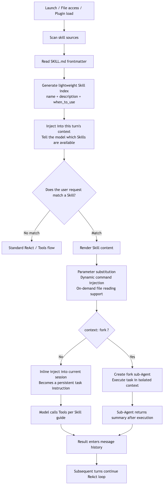
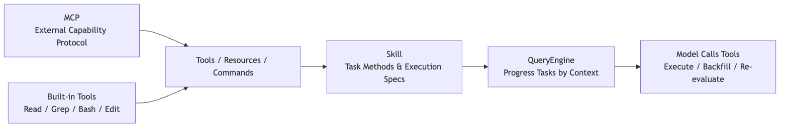
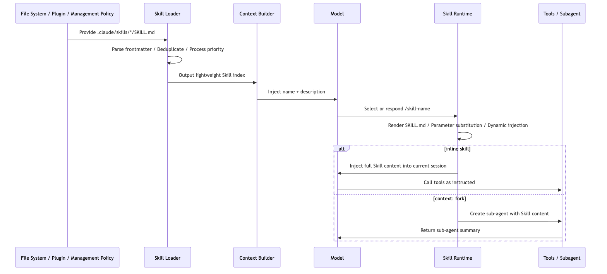
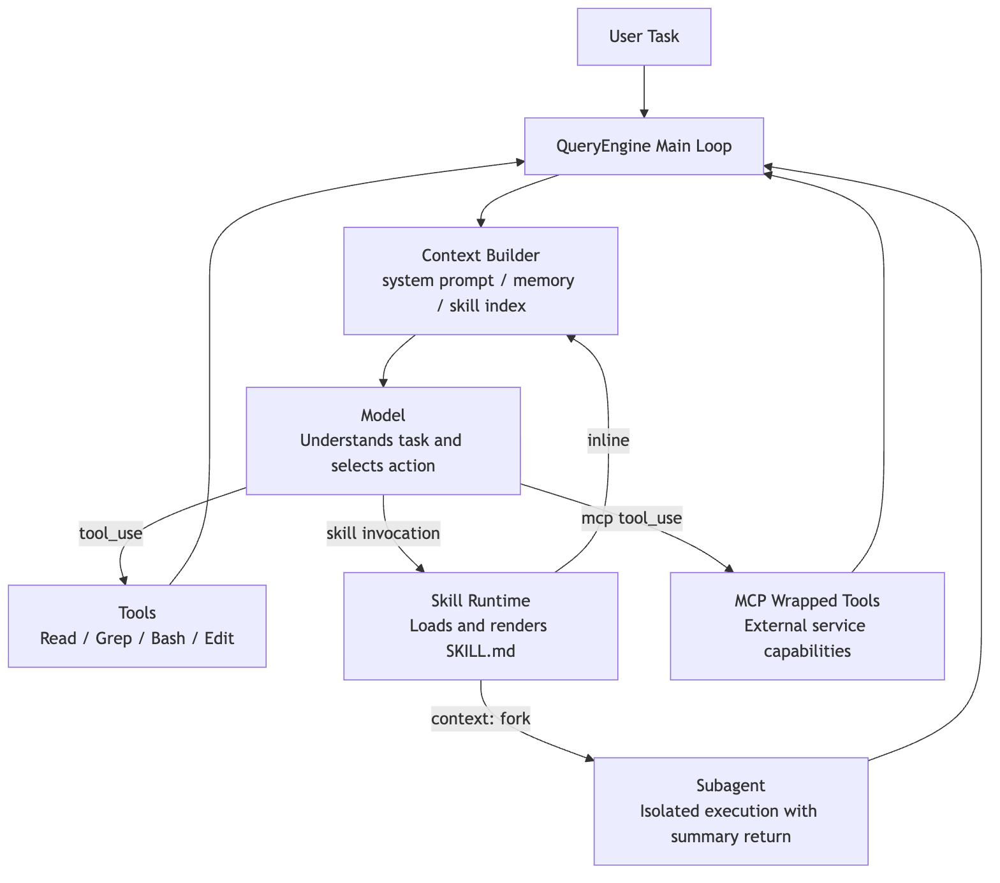

# Skills in Claude Code

A coding agent can already have plenty of tools. It can read files, run commands, search a codebase, talk to external systems, and even delegate work.

But that still leaves one important question:

> If the tools are already there, why do we need Skills at all?

Suppose the user says:

```text
Help me review this PR.
```

At the tool layer, Claude Code already has `Read`, `Grep`, `Bash`, the GitHub MCP, a browser, and sub-agents. But "how to review a PR" is not a single tool call. It is a body of experience:

- Start with the diff scope instead of wandering through unrelated files.
- Focus on behavioral changes, not just style.
- Prioritize bugs, permissions, data consistency, and missing tests.
- List findings first, then summarize.
- If the repo has its own review conventions, prefer those local rules.

If all of that lives in the main system prompt, the prompt keeps growing. If the user has to repeat it every time, the workflow is clumsy. And if it is hard-coded into the product, teams have to edit Claude Code itself just to change a review process.

Skills solve exactly that class of problem.

**A Skill is not a new low-level tool. It is a load-on-demand capability pack that bundles task methodology, constraints, examples, scripts, and reference material.**

To keep the chapter concrete, use one running example throughout:

```text
We want a code-review skill.
When the user says "review the current changes," Claude Code should read the diff, follow the team's conventions, inspect risk, and produce review feedback.
```

The core question of this chapter is:

> How does Claude Code go from a single `SKILL.md` file to "the model knows when to use it and loads the full instructions at the right time"?

## 1. Why Tools Alone Aren't Enough

A tool system solves one problem:

> How does the model reach the real world?

But tools only answer what the model *can* do. They do not answer how it *should* do the work.

`Read` can open files, but it does not tell the model which files matter. `Bash` can run commands, but it does not tell the model whether to inspect the diff first or run tests first. `Grep` can search, but it does not tell the model what patterns are most important during a PR review.

If tools are the knives, pans, and stove in a kitchen, then a Skill is the recipe.

A recipe does not chop vegetables or light the fire. It tells you:

```text
Which knife to use
What to prepare first
Which steps you cannot skip
How to recover when something fails
How to plate the final dish
```

In Claude Code terms:

```text
Tools: Read / Grep / Bash / Edit / MCP
Skill: For a code review task, how to combine those tools and what standard the output should meet
```

So Skills do not exist because the toolset is too small. They exist because:

**The more tools you give the model, the more you need a reusable methodology that governs how those tools should be used.**

## 2. What a Skill Actually Is in the System

On disk, a Skill is usually just a directory that contains a required `SKILL.md`:

```text
.claude/skills/
└── code-review/
    ├── SKILL.md
    ├── review-checklist.md
    ├── examples/
    │   └── finding-format.md
    └── scripts/
        └── collect-diff.sh
```

`SKILL.md` has two parts:

```md
---
name: code-review
description: Review code changes for bugs, regressions, security risks, and missing tests. Use when the user asks to review a diff, PR, or current changes.
allowed-tools: Read Grep Bash(git diff *) Bash(git status *)
---

# Code Review

## Instructions

Review the current change as a senior engineer.

1. Inspect the diff before reading unrelated files.
2. Prioritize correctness, data integrity, security, and missing tests.
3. Report findings first, ordered by severity.
4. Keep summaries brief.

For detailed review criteria, read `review-checklist.md` only when needed.
```

The frontmatter is for Claude Code's runtime. The body is for the model.

In Claude Code's implementation, the frontmatter is parsed into runtime configuration, including items such as:

```text
description
allowed-tools
model
effort
context: fork
agent
paths
hooks
user-invocable
disable-model-invocation
```

For example, `context: fork` becomes `executionContext: "fork"`. `model` and `effort` can change which model settings apply when the Skill is active. `paths` can delay activation until relevant files are actually touched. In other words, `SKILL.md` is not just a Markdown snippet. It is a capability declaration with both instructions and runtime boundaries.

The field that matters most for invocation is `description`.

Claude Code does not dump the full text of every Skill into context up front. It first shows the model a lightweight index:

```text
Available skills:
- code-review: Review code changes for bugs, regressions, security risks...
- write-blog: Write problem-driven technical concept blogs...
- debug: Systematically investigate and fix bugs...
```

The model first decides whether a Skill is relevant based on its name and description. Only after a Skill is actually selected does Claude Code render the full contents and inject them into the active task.

That is the first core design idea behind Skills:

> Expose lightweight metadata first, then load the full instructions only when the Skill is actually needed.

This is progressive disclosure applied to context engineering. Do not stuff all knowledge into the model at once. Show the right instructions at the right time.

## 3. Overall Flow: From Discovery to Execution

Start with the big picture.



The last branch in that diagram is the one people misunderstand most often.

Older source-code writeups sometimes describe Skills as if they always fork a child agent through a Skill tool. That is only partly true. In the current official design, normal Skills are inline by default: the rendered `SKILL.md` becomes new messages in the current conversation and keeps shaping the main session afterward.

Only when the frontmatter explicitly says:

```yaml
context: fork
```

does Claude Code treat the Skill as an isolated task and hand it to a forked sub-agent.

So the more accurate mental model is:

```text
Normal Skill: inject methodology into the current context
Fork Skill: hand the work to an isolated sub-agent and bring the result back
```

## 4. Loading Layer: Where Skills Come From

Skills do not come from just one directory. Claude Code loads them from multiple scopes:

| Source | Typical path | Best used for |
| --- | --- | --- |
| Enterprise / managed | Admin-managed directories | Company-wide policy, security, and compliance workflows |
| Personal | `~/.claude/skills/<skill-name>/SKILL.md` | Personal writing, debugging, commit, or summary habits |
| Project | `.claude/skills/<skill-name>/SKILL.md` | Repo-specific conventions, scaffolding, and architecture rules |
| Plugin | `<plugin>/skills/<skill-name>/SKILL.md` | Capabilities shipped with a plugin |
| Nested project | `packages/foo/.claude/skills/` | Skills that belong only to one part of a monorepo |

At runtime, Claude Code loads several categories in parallel: managed policy skills, user skills, project skills, `.claude/skills` directories added through `--add-dir`, and legacy commands. After loading, it deduplicates them by `realpath` so the same Skill is not registered multiple times through symlinks, nested roots, or compatibility paths.

In simplified form, the loader looks something like this:

```ts
type SkillSource = "managed" | "personal" | "project" | "plugin" | "nested";

type LoadedSkill = {
  name: string;
  description: string;
  path: string;
  source: SkillSource;
  frontmatter: SkillFrontmatter;
};

async function loadSkills(cwd: string): Promise<Map<string, LoadedSkill>> {
  const roots = await collectSkillRoots(cwd);
  const skills = new Map<string, LoadedSkill>();

  for (const root of roots) {
    for (const dir of await listSkillDirs(root.path)) {
      const realPath = await fs.realpath(dir);
      if (alreadyLoaded(realPath)) continue;

      const skill = await parseSkillFile(`${dir}/SKILL.md`, root.source);
      const key = namespaceSkillName(skill, root.source);

      if (!skills.has(key) || hasHigherPriority(skill, skills.get(key)!)) {
        skills.set(key, skill);
      }
    }
  }

  return skills;
}
```

That is not literal source code. It is a compressed model of the loading logic. The real implementation also handles file watching, policy toggles, plugin caches, path deduplication, `.gitignore` filtering, and dynamic discovery.

Two engineering details matter most here.

First, `realpath` deduplication. The same Skill directory can appear more than once through symlinks or overlapping roots. Without real-path normalization, Claude Code could register the same Skill multiple times.

Second, nested-directory discovery. When Claude Code is working on a file, it can walk upward along that file's path and look for nearby `.claude/skills/` directories. That matters in a monorepo:

```text
repo/
├── packages/
│   ├── frontend/
│   │   └── .claude/skills/component-review/SKILL.md
│   └── backend/
│       └── .claude/skills/api-review/SKILL.md
└── .claude/skills/general-review/SKILL.md
```

If the model is editing `packages/frontend/Button.tsx`, the frontend Skill should become more relevant. If it is editing `packages/backend/routes.ts`, the backend API Skill should matter more.

That is not just "scan more directories." It is a context-engineering decision:

**Make Skill visibility depend on where the current work is happening.**

Under the hood, that behavior is tied to path-based conditional activation. A Skill with `paths` in its frontmatter does not always appear among unconditional Skills. It may start in a conditional pool and only activate once the session performs path-relevant actions such as `Read`, `Write`, or `Edit`. When Claude Code dynamically discovers nested `.claude/skills` directories, it also skips gitignored locations so that a Skill inside `node_modules` or another ignored folder does not quietly enter the capability pool.

There is also an important boundary around `--bare` mode. It skips automatic discovery of managed, user, and project Skills, and only loads explicitly provided `--add-dir` paths. But it is not a policy bypass. If the project disables Skills or the organization locks down Skill usage, bare mode does not force them through.

When multiple scopes define the same Skill name, Claude Code needs an override strategy. The official documentation describes a priority order of enterprise first, then personal, then project. Plugin Skills avoid name conflicts through a `plugin-name:skill-name` namespace.

There is one more compatibility layer here: old `.claude/commands/*.md` files now go through the same machinery as Skills. If `.claude/commands/deploy.md` and `.claude/skills/deploy/SKILL.md` both exist, the Skill wins. That shows the broader direction of the product: slash commands and capability packs are being unified into one model. The user sees `/deploy`. The runtime sees a governable, loadable Skill.

## 5. Trigger Layer: Why `description` Matters More Than the Body

One of the easiest mistakes when writing a Skill is to spend all your effort on the body while leaving `description` vague:

```yaml
description: Helps with code.
```

That is almost useless. When the model sees it, it has no idea when it should load the Skill.

A much better version builds the trigger condition directly into the description:

```yaml
description: Review code changes for correctness, regressions, security risks, and missing tests. Use when the user asks to review a diff, PR, branch, or current uncommitted changes.
```

The reason is simple: during discovery, the model mainly sees the lightweight index, not the full body.

Conceptually, the routing logic looks like this:

```ts
function buildSkillIndex(skills: LoadedSkill[]): string {
  return skills
    .filter((skill) => !skill.frontmatter.disableModelInvocation)
    .map((skill) => {
      const description = truncate(
        [skill.description, skill.frontmatter.when_to_use].filter(Boolean).join("\n"),
        1536,
      );

      return `- ${skill.name}: ${description}`;
    })
    .join("\n");
}
```

The exact number is not the point. The mechanism is. The Skill list lives under a context budget. If the description is too long, it gets truncated. If it is too empty, the model cannot match it reliably.

So `description` is not decorative metadata. It is a routing hint for the model.

Claude Code reinforces that model at runtime. When a task would benefit from a Skill, the system is designed to load the Skill rather than rely on the model's vague memory of what the Skill might contain. That matters because the full Skill body is not in context by default. The model sees the Skill's name and description first, then the runtime pulls in the body only when the match is worth paying for.

A good Skill description should answer two questions at once:

```text
What does this Skill do?
What kinds of user requests should trigger it?
```

If you only write "code review," the model may not know how it differs from a generic review habit. If you write "use when the user asks to review a PR, inspect a diff, find bugs, or check for test gaps," the match becomes much more reliable.

## 6. Rendering Layer: A Skill Is Not Static Markdown

Once a Skill is triggered, Claude Code does not simply paste raw `SKILL.md` into context. It renders it first.

The most common rendering steps fall into three categories.

### Parameter Substitution

The user might invoke a Skill like this:

```text
/fix-issue 123
```

Inside the Skill, you can write:

```md
Fix GitHub issue $ARGUMENTS.

1. Read the issue description.
2. Find the affected code.
3. Implement the fix.
4. Add tests.
```

After rendering, the model sees:

```text
Fix GitHub issue 123.
```

You can also use positional arguments:

```md
Migrate $ARGUMENTS[0] from $ARGUMENTS[1] to $ARGUMENTS[2].
```

Or define named arguments in the frontmatter:

```yaml
arguments: component from to
```

Then use them in the body:

```md
Migrate $component from $from to $to.
```

### Environment Variable Substitution

Skills often need to reference scripts or templates in their own directory. Hard-coding an absolute path would be fragile because the Skill might come from a personal directory, a project, or a plugin.

That is why Claude Code provides `${CLAUDE_SKILL_DIR}`:

````md
Run the helper script:

```bash
python3 ${CLAUDE_SKILL_DIR}/scripts/collect_diff.py .
```
````

At render time, that expands to the current Skill's real directory.

### Dynamic Context Injection

Skills can also use `` !`command` `` blocks to execute commands before the model sees the content and inline the output into the prompt.

For example:

```md
---
name: summarize-changes
description: Summarize uncommitted git changes and flag risks.
allowed-tools: Bash(git diff *) Bash(git status *)
---

## Current status

!`git status --short`

## Current diff

!`git diff HEAD`

## Instructions

Summarize the change and list risks.
```

At execution time, Claude Code runs `git status --short` and `git diff HEAD` first, then substitutes the output. The model sees the expanded content, not the commands themselves.

That is powerful because it turns "collect context" into a deterministic step. The model does not have to decide whether to run `git diff`. The Skill template has already made that choice.

But it also creates a security boundary: dynamic commands really do execute shell commands. For untrusted Skills, or in enterprise environments that want tighter control, policy may need to disable or restrict this behavior.

In simplified form, the render pipeline looks like this:

```ts
async function renderSkill(skill: LoadedSkill, invocation: SkillInvocation) {
  let content = await fs.readFile(skill.path, "utf8");

  content = stripFrontmatter(content);
  content = substituteArguments(content, invocation.arguments, skill.frontmatter.arguments);
  content = content.replaceAll("${CLAUDE_SKILL_DIR}", path.dirname(skill.path));
  content = content.replaceAll("${CLAUDE_SESSION_ID}", invocation.sessionId);

  if (canExecuteInlineShell(skill.source, invocation.policy)) {
    content = await expandBangCommands(content, {
      cwd: invocation.cwd,
      shell: skill.frontmatter.shell ?? "bash",
    });
  }

  return content;
}
```

That is why a Skill feels like documentation when you write it, but behaves more like a renderable prompt template at runtime.

## 7. Execution Layer: Inline and Fork Mean Two Different Things

After rendering, Claude Code still has to decide where the Skill runs.

By default, a Skill is inlined into the current session. The rendered content becomes new messages in the conversation, and all later tool calls, model replies, and summarization continue around that injected context.

This is more specific than many older explanations suggest. Claude Code first resolves the Skill through the same command surface it uses for prompts. Only when the Skill is marked with `context: fork` does it break out into isolated execution. Otherwise, the processed Skill messages are appended back into the current session and the main loop keeps going.

So a normal Skill is not "launch a worker." It is "inject processed user-facing instructions into the current main loop." It may temporarily change the active model, effort level, or permission context, but the executor is still the main conversation.

That makes inline Skills a good fit for reference-heavy or convention-heavy guidance:

```yaml
---
name: api-conventions
description: API design conventions for this repository.
---
```

Its body might say:

```md
When editing API endpoints:
- Use RESTful resource names.
- Return errors in `{ code, message }` format.
- Validate input at the boundary.
```

That is not an independent task. It is background guidance for the current one, so staying in the main session makes sense.

By contrast, `context: fork` is a better fit for task-style Skills:

```yaml
---
name: deep-code-research
description: Research a codebase topic thoroughly and return findings.
context: fork
agent: Explore
---
```

Its body might say:

```md
Research $ARGUMENTS thoroughly.

1. Find relevant files with Glob and Grep.
2. Read the implementation.
3. Summarize the architecture with file references.
4. Return only the findings needed by the main conversation.
```

That kind of Skill has a clear input, a clear deliverable, and potentially a lot of file reading. Forking it to a sub-agent keeps the main session from being flooded with search noise.

In simplified form, the execution decision looks like this:

```ts
async function invokeSkill(skill: LoadedSkill, renderedContent: string, state: SessionState) {
  if (skill.frontmatter.context === "fork") {
    const agent = resolveAgent(skill.frontmatter.agent ?? "general-purpose");

    return runSubagent({
      agent,
      prompt: renderedContent,
      cwd: state.cwd,
      includeClaudeMd: true,
    });
  }

  state.messages.push({
    role: "user",
    content: renderedContent,
    synthetic: true,
    source: `skill:${skill.name}`,
  });

  return continueMainLoop(state);
}
```

The boundary is important:

```text
inline: treat the Skill as instructions for the current task
fork: treat the Skill as a task brief to hand to a sub-agent
```

If a Skill only says "follow these API conventions" but is marked `context: fork`, the sub-agent gets a pile of rules with no concrete task. That usually produces weak results.

On the other hand, if a Skill performs heavy search, auditing, or report generation but stays inline, the main context can get bloated with intermediate work.

## 8. Permission Layer: `allowed-tools` Is Preapproval, Not a Sandbox

`allowed-tools` is easy to misunderstand as "this Skill can only use these tools."

The more accurate statement is:

> `allowed-tools` preapproves matching tools while the Skill is active, which reduces repeated confirmation prompts. It does not remove every other tool from the system.

For example:

```yaml
---
name: commit
description: Stage and commit the current changes.
disable-model-invocation: true
allowed-tools: Bash(git status *) Bash(git add *) Bash(git commit *)
---
```

That means if the user explicitly invokes `/commit`, Claude can run those matching Git commands without asking for approval each time.

But if you actually want to forbid a tool, the right place is a deny rule in the permission system, not `allowed-tools`.

Skill execution itself also passes through the permission layer. Claude Code normalizes both `/skill` and `skill` forms, then checks deny and allow rules. Those rules support both exact matches and prefix-style patterns such as `review:*`. Roughly speaking, the logic is:

```text
If deny matches, reject
If a canonical remote-skill exception applies, handle that
If allow matches, permit
If the Skill has only safe attributes, auto-run
Otherwise, fall back to user confirmation
```

So the permission model actually has two stages. The first decides whether the Skill itself can be loaded. The second determines which tools become preapproved once the Skill is active. Mixing those two stages together is what makes `allowed-tools` sound like a sandbox when it is not.

Project-level Skills deserve special caution here. Because `.claude/skills/` can be committed into a repository, a trusted workspace can end up shipping preapproval hints through its own Skills.

In practice, the Skill security boundary can be compressed into three lines:

```text
description decides when the model sees the Skill
the body decides how the model acts
allowed-tools decides which tool calls are preapproved
```

If any one of those three is too broad, the Skill becomes risky.

## 9. Skills vs. MCP

Skills and MCP are often discussed together because both are extension mechanisms in Claude Code.

But they operate at different layers.

MCP answers this question:

```text
How do external capabilities enter Claude Code?
```

Slack, GitHub, databases, browsers, and design tools can all expose tools, resources, or prompts through MCP servers.

Skills answer a different question:

```text
Once those capabilities are available, how should they be organized into a reusable task workflow?
```

A PR review might use:

- GitHub MCP to fetch PR data
- `Grep` to search the codebase
- `Read` to inspect files
- `Bash` to run tests
- A local review checklist stored in the repo

The thing that organizes those capabilities into one repeatable review method is the Skill.



So Skills are not a replacement for MCP. A better framing is:

```text
MCP brings the external world in
Skills tell the model how to use the available capabilities for a class of tasks
```

## 10. A Minimal Implementation: Build a Tiny Skill Runtime Yourself

To make the design easier to internalize, it helps to collapse the architecture into a tiny runtime. This version leaves out Claude Code's full permission system, UI, summarization, and sub-agent features, but keeps the chain that matters most.

```ts
import fs from "node:fs/promises";
import path from "node:path";
import matter from "gray-matter";

type Skill = {
  name: string;
  description: string;
  dir: string;
  body: string;
};

export async function loadProjectSkills(cwd: string): Promise<Skill[]> {
  const root = path.join(cwd, ".claude", "skills");
  const entries = await fs.readdir(root, { withFileTypes: true }).catch(() => []);
  const skills: Skill[] = [];

  for (const entry of entries) {
    if (!entry.isDirectory()) continue;

    const dir = path.join(root, entry.name);
    const file = path.join(dir, "SKILL.md");
    const raw = await fs.readFile(file, "utf8").catch(() => null);
    if (!raw) continue;

    const parsed = matter(raw);
    skills.push({
      name: parsed.data.name ?? entry.name,
      description: parsed.data.description ?? firstParagraph(parsed.content),
      dir,
      body: parsed.content,
    });
  }

  return skills;
}

function firstParagraph(markdown: string) {
  return markdown.trim().split(/\n\s*\n/)[0] ?? "";
}
```

That first step only scans `.claude/skills/*/SKILL.md`, parses frontmatter, and builds a list of Skills.

The second step is to expose a lightweight index to the model:

```ts
export function buildAvailableSkillsPrompt(skills: Skill[]) {
  return [
    "Available skills:",
    ...skills.map((skill) => `- ${skill.name}: ${skill.description}`),
    "",
    "If a user request matches a skill, load that skill before continuing.",
  ].join("\n");
}
```

Real Claude Code is much richer than this. It plugs Skills into the general tool system so the model can invoke them in a structured way. But this tiny example already demonstrates the architecture in miniature:

```text
Do not stuff every Skill body into context
Give the model a skill index first
Load the full body only after a match
```

The third step is rendering:

```ts
export function renderSkill(skill: Skill, args: string, sessionId: string) {
  return skill.body
    .replaceAll("$ARGUMENTS", args)
    .replaceAll("${CLAUDE_SESSION_ID}", sessionId)
    .replaceAll("${CLAUDE_SKILL_DIR}", skill.dir);
}
```

The fourth step is to inject the rendered Skill into the conversation:

```ts
messages.push({
  role: "user",
  content: renderSkill(skill, "review current diff", session.id),
});
```

That is the minimal Skill mechanism.

From there, Claude Code adds the production-grade features:

- Multi-source loading and override rules
- Live change detection
- Dynamic discovery in nested directories
- `paths`-based conditional activation
- `allowed-tools` preapproval
- `disable-model-invocation` and `user-invocable`
- `context: fork` sub-agent isolation
- Dynamic shell injection
- On-demand reading of supporting files
- Reattaching recently used Skills after compaction

These features are not a completely private format invented in isolation. The official documentation explicitly says Claude Code Skills follow the Agent Skills open standard, then extend it with features such as automatic invocation control, sub-agent execution, and dynamic context injection. In other words, the base shape of `SKILL.md` is open. Claude Code's engineering contribution is connecting it to its own query engine, permission system, and context lifecycle.

There is another practical implementation choice worth noticing: Skills do not introduce an entirely separate execution DSL. They reuse the existing prompt and slash-command pipeline. Frontmatter can declare `args`, `argument-hint`, and `arguments`, and legacy commands can be loaded into the same Skill candidate pool because the two systems converge on one command-processing path.

That is what turns Skills from "just a prompt file" into a governable capability pack.

## 11. The Skill Lifecycle

Putting the runtime behavior together, a Skill's lifecycle can be compressed into six steps:



That chain explains several common behaviors.

First, why new Skills sometimes require a restart and sometimes do not. Existing directories can be watched, but if a top-level directory did not exist when the session started, it may not be inside the watcher set until the next launch.

Second, why the first thing to fix when a Skill does not trigger is usually `description`. The model sees the index before it sees the body.

Third, why supporting files should not be dumped wholesale into `SKILL.md`. The value of the Skill system is selective loading. The main file should behave more like a guide page than a giant archive.

Fourth, why `context: fork` should be used carefully. It is not a "more advanced mode." It is an isolation mode. It works best when the task and the deliverable are both explicit.

## 12. The Design Philosophy Behind Skills

The Skill system looks lightweight on the surface: one directory, one Markdown file, some frontmatter.

Under that simple shape sits a fairly opinionated runtime design.

### Pull Experience Out of the Main Prompt

If every workflow habit stays inside the main system prompt, the system becomes harder and harder to maintain.

Skills split those practices into separate assets:

```text
Writing blog posts has its own Skill
Code review has its own Skill
Debugging has its own Skill
Release work has its own Skill
```

That lets a team maintain agent behavior the way it maintains documentation.

### Replace "Load Everything Up Front" with "Expand on Demand"

The heart of the Skill system is not Markdown. It is progressive disclosure.

The model sees a short description first. If needed, it sees the full instructions next. More detailed reference files and scripts stay outside the main body until they are actually required.

This follows a broader agent-design principle:

> A good agent is not the one that sees the most information. It is the one that sees the right information at the right moment.

### Let the Model Route Semantics, but Turn Stable Process into an Asset

"Is the user asking for a code review here?" is the kind of fuzzy judgment a model is good at.

But "look at the diff first, list findings by severity, do not put the summary before the findings" is stable process knowledge. That belongs in a Skill.

This is one of the clearest divisions of labor in agent engineering:

```text
Semantic routing: handled by the model
Stable process: written into Skills
Deterministic operations: handled by tools or scripts
Safety boundaries: handled by the permission system
```

Skills sit in the middle and connect all four.

## 13. Boundaries: What Skills Are Not Good For

Skills are powerful, but they are not a place to dump everything.

First, do not use a Skill as a database. Large API docs, long policy manuals, and huge collections of examples belong in supporting files. `SKILL.md` should point to them, not absorb them.

Second, do not let high-risk automation trigger itself casually. Deployment, Slack posting, destructive operations, and migrations should usually be marked:

```yaml
disable-model-invocation: true
```

That forces an explicit `/deploy` or similar user action instead of letting the model decide, "this looks ready, I may as well ship it."

Third, do not write one giant do-everything Skill. A good Skill solves one clear task. `code-review`, `write-blog`, and `debug` make sense. `do-everything` usually becomes a new source of noise.

Fourth, do not make permissions too broad:

```yaml
allowed-tools: Bash(*)
```

That effectively grants an overly wide preapproval range while the Skill is active. Outside a highly trusted personal setup, that is usually a bad idea.

## 14. Returning to Claude Code: What Piece of the Puzzle Skills Add

Now we can put Skills back into Claude Code's broader extension architecture:



Skills are not competing with Tools or MCP. They fill a different gap:

```text
Tools let the model act
MCP lets the model reach the external world
Sub-agents let work be isolated and delegated
Skills let experience be captured, discovered, reused, and loaded on demand
```

That is the main lesson in Claude Code's Skill implementation. The file format itself is not the main idea. The runtime layering is:

1. Use frontmatter as a lightweight index.
2. Use `description` for semantic routing.
3. Use the Markdown body to carry task methodology.
4. Keep details in supporting files for delayed loading.
5. Inject live context dynamically when needed.
6. Govern risk through `allowed-tools` and the permission system.
7. Use `context: fork` to isolate heavy task execution.

This lets Claude Code avoid hard-coding every work pattern into the product and avoid stuffing every rule into the system prompt. It turns "how to do a class of tasks" into an asset that teams can maintain, the model can discover, and the runtime can govern.

That is the real role of Skills in Claude Code:

**They are not a replacement for tools. They are a modular packaging of agent working methods.**

Once you understand that layer, the rest of Claude Code's architecture comes into focus more cleanly. Prompting, context management, tools, MCP, and agent delegation are not isolated features. They are cooperating pieces of the same goal:

> Give the model just enough capability guidance in as little context as possible, then let controlled tools move the task forward.
