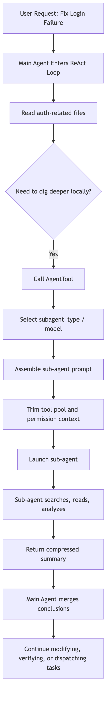
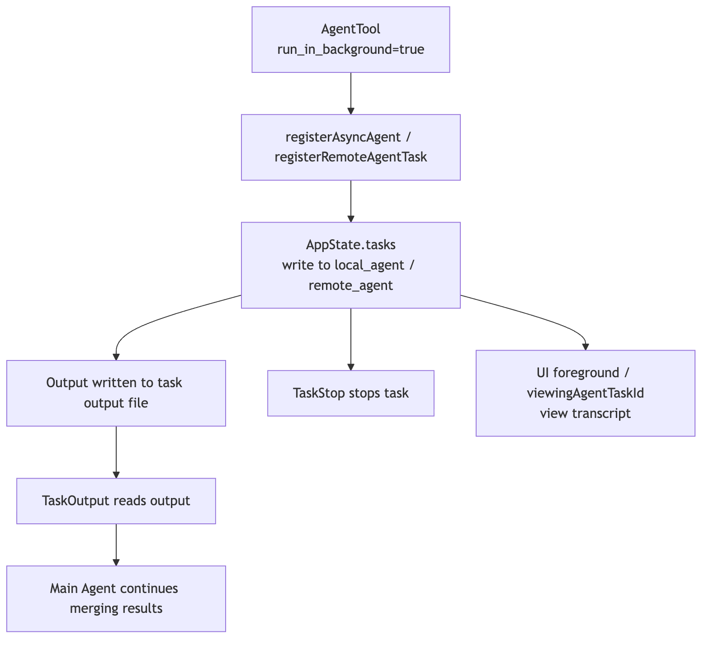
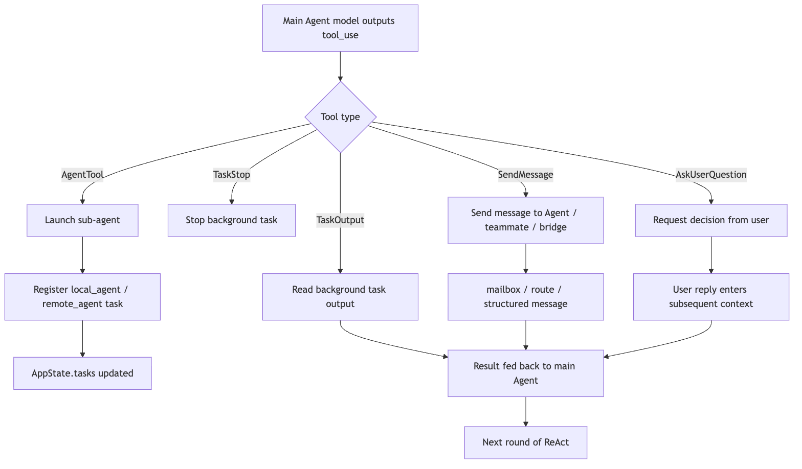

# Agent Collaboration in Claude Code

Claude Code already knows how to reason through a task, build prompts, manage context, use tools, and pull in outside capabilities.

But one question still remains:

> When a task gets large enough, why is one main agent no longer enough?

Suppose the user says:

```text
Refactor this authentication flow, add tests, confirm API compatibility, and check for security risk while you're in there.
```

A single main agent now has to do many different kinds of work at once:

- Read the auth code.
- Trace API callers.
- Understand the test setup.
- Change the implementation.
- Run tests.
- Evaluate the security boundary.
- Summarize the final risk.

If all of that happens inside one context, three practical problems appear very quickly.

First, the main context gets polluted. Search results, failed hypotheses, logs, and temporary detours begin to crowd out the design judgments that actually matter.

Second, much of the work is naturally parallel. Tracing API callers, inspecting the test harness, and reviewing the security surface do not need to happen in one serial stream.

Third, not every decision belongs to a child worker. Questions such as whether to break compatibility, remove an old entry point, or approve a risky command still need to bubble back to the main agent or to the user.

So agent collaboration in Claude Code is not just "spin up a few more model instances." It is a runtime system for organizing, isolating, parallelizing, communicating, stopping, and governing complex work:

```text
Main agent understands the goal and integrates results
-> child agents handle focused exploration, implementation, or verification
-> the task system tracks long-running execution units
-> SendMessage coordinates communication between agents
-> AskUserQuestion pulls the user back into high-risk decisions
-> the permission system ensures children do not bypass governance
```

To keep the article concrete, use one running example:

```text
The user asks Claude Code to fix a login failure bug.

The main agent narrows the problem to the auth module.
It sends one child agent to trace callers,
another to inspect tests and reproduction steps,
and keeps the main line of judgment for itself.
If one child wants to change database schema or remove compatibility logic,
permission and user confirmation still have to bubble back up.
```

The core question is:

> In Claude Code's source, what objects make agent collaboration possible, and what problem does each one solve?

## 1. Follow the Problem Chain

Multi-agent systems are easy to describe as a pile of terms: subagent, fork, coordinator, team, swarm, message, task.

But if you follow Claude Code's runtime evolution, the chain is more natural:

```text
A single agent can handle a small task
-> larger tasks pollute the main context with search noise and trial-and-error
-> child agents are introduced to isolate local exploration and execution
-> task types diversify, so different roles and tool boundaries are needed
-> subagent types, built-in subtypes, and custom agents appear
-> some child tasks should inherit parent context instead of starting from zero
-> fork is introduced so children can share a parent prefix and benefit from prompt cache
-> children may run in the background, so the main thread cannot lose control of them
-> LocalAgentTask / RemoteAgentTask plus TaskOutput / TaskStop appear
-> multiple agents need to notify and reply to one another
-> SendMessageTool plus mailbox / bridge routing appear
-> larger jobs need organization, not ad hoc delegation
-> Coordinator / Team / Teammate enter the picture
-> some choices belong to user preference or risk ownership
-> AskUserQuestion pulls the human back into the decision loop
```

That chain points to one key idea.

**Agent collaboration is not about "having more brains." It is about how complex work gets organized, isolated, parallelized, communicated, stopped, and governed.**

## 2. Agent Definitions: Role First, Execution Instance Second

In Claude Code, an agent is not just a line of prompt text.

At minimum, the architecture has two layers:

```text
Static definition: who this agent is, what it is good at, which tools it can use, which model it prefers
Runtime instance: once started for a particular task, what its state, output, context, and lifecycle look like
```

A static definition is a declarative role description. Like Skills, it can be expressed through frontmatter:

```md
---
name: security-reviewer
description: Review auth, permission, data exposure, and secret handling risks.
tools: Read Grep Bash
model: opus
---

You are a security-focused reviewer.
Prioritize exploitable bugs over style issues.
```

That definition answers questions such as:

- When should this agent be selected?
- What is its responsibility boundary?
- Is it allowed to edit files?
- Is it allowed to run commands?
- Which model should it use?
- What output style or token budget should apply?

So an agent definition is not just "give the model a role." It turns an execution role into a discoverable, filterable, governable runtime object.

In the current source, agent definitions can influence far more than `description`, `tools`, `prompt`, and `model`. They can also carry runtime controls such as:

```text
disallowedTools
effort
permissionMode
mcpServers
hooks
maxTurns
skills
initialPrompt
memory
background
isolation
```

That means an agent definition is not merely a role-playing prompt. It is runtime configuration that can shape the tool pool, permission mode, model choice, reasoning effort, MCP availability, preloaded Skills, background behavior, and isolation strategy.

Active agents are not loaded from one directory and left alone, either. Claude Code merges definitions from built-in sources, plugins, user settings, project settings, flags, and policy settings. Later sources can override earlier ones under the same name, which means policy, project, and user layers all help govern what an agent can become.

Without that layer, the main agent would be stuck issuing fragile natural-language instructions such as:

```text
Go look at the security risk here, and try not to change anything.
```

That is too soft. The model may misread what counts as "security risk," or it may casually edit files anyway.

With agent definitions, Claude Code can push role constraints down into the runtime:

```text
Security-review agent
-> read-only tool pool
-> stronger model
-> tighter system prompt
-> dedicated output style
```

That is the point of built-in subtypes and custom agents:

> Move role boundaries out of one-off prompt wording and into the joint control of tools, permissions, models, and context strategy.

## 3. `AgentTool`: The Entry Point for Multi-Agent Work

In Claude Code, multi-agent collaboration does not happen because the model privately decides to imagine a coworker. It happens explicitly through the tool system.

The most important entry point is `AgentTool`.

Its input can be abstracted roughly like this:

```ts
const inputSchema = z.object({
  description: z.string(),
  prompt: z.string(),
  subagent_type: z.string().optional(),
  model: z.enum(["sonnet", "opus", "haiku"]).optional(),
  run_in_background: z.boolean().optional(),
})
```

Those fields reveal a lot:

| Field | Meaning |
| --- | --- |
| `description` | A short title for the child task, useful for the UI and task layer |
| `prompt` | The actual work instruction handed to the child |
| `subagent_type` | Which specialized agent role to use |
| `model` | Optional override for the default model |
| `run_in_background` | Whether the agent should run as a background execution unit |

`AgentTool` is not an ordinary tool. It is a controlled dispatcher:

```text
Main agent
-> calls AgentTool
-> selects a child-agent type
-> assembles the child prompt
-> trims tools and permissions
-> launches a local or remote agent
-> registers the runtime instance in the task system
-> returns either a result or a task ID
```

The word that matters most there is controlled.

If Claude Code simply issued a second model request, the child would become an uncontrolled clone. The runtime has to handle much more:

- The child's system prompt cannot be merged blindly with the parent's.
- The child's tool pool cannot default to unlimited access.
- The child's output must be routable back to the main agent.
- A background child must be observable and stoppable.
- High-risk tool use cannot bypass the permission system just because it comes from a child.

So `AgentTool` is not just a fancy prompt template. It is where tools, prompt assembly, context policy, task lifecycle, and permissions intersect.

There is also an important split early in the control flow. The runtime may first decide whether this is a normal subagent spawn or a teammate spawn inside a team context. That detail matters because team mode is not just "subagents with labels." It is a collaboration topology with a roster, mailbox, team context, and lifecycle constraints.

## 4. What Happens During One Child-Agent Call

Use the login-bug example and walk it through.

The main agent reads enough code to suspect the issue lives near `auth/session`. But it does not want to fill the main context with every search result, so it delegates a focused trace:

```text
description: "Trace auth callers"
prompt: "Find all call sites that create or validate sessions. Summarize the call chain and highlight suspicious branches. Do not edit files."
subagent_type: "explore"
run_in_background: false
```

The runtime path is roughly:

```text
Main agent calls AgentTool
-> runtime selects the child-agent definition
-> child prompt, tool pool, and permission context are assembled
-> child agent runs the focused task
-> child produces a compressed summary
-> main agent receives the result and decides what to do next
```



The phrase "compressed summary" matters a lot here.

A child can read many files, search many keywords, and follow several dead ends. The main agent does not need all of that intermediate noise. What it really needs is:

```text
What areas were checked
What key facts were found
Which paths can now be ruled out
What direction is most worth pursuing next
```

That is the main value of a child agent to the parent context.

> It turns high-noise exploration into low-noise conclusions.

## 5. General-Purpose, Built-In Subtype, and Custom Agent

Claude Code's collaboration model becomes easier to understand if you sort agents by how explicit their role is.

The simplest case is the general-purpose subagent. It fits ordinary focused tasks:

```text
Go trace how these files relate.
Summarize the call chain in this module.
Look for similar implementations elsewhere in the repo.
```

Its strength is flexibility. Its weakness is that the boundary is not very specialized.

One step further is the built-in subtype. Some categories of child work naturally want clearer tool and responsibility boundaries:

| Type | Best used for | Key boundary |
| --- | --- | --- |
| Explore | Search, read, find facts | Usually read-only; should not casually edit code |
| Plan | Break down work, compare options, assess risk | Produces plans; does not directly take destructive action |
| Verification | Independently validate a change | Should not inherit the implementer's assumptions |
| Review | Inspect a diff and surface risk | Reports findings first; does not own the big rewrite |

Above that sits the custom agent. A team can encode its own review rules, testing strategy, or architecture conventions into an agent definition and let Claude Code select that role in the right situations.

These three layers do not replace one another. They solve different scopes:

```text
Temporary small task -> general-purpose
Frequent specialized action -> built-in subtype
Stable team workflow -> custom agent
```

One source-level detail is worth emphasizing: these roles are not trusted merely because the model sees their names. They are pushed all the way down into runtime choice, prompt assembly, tool filtering, and task lifecycle.

A normal subagent's tools are not inherited wholesale from the parent session. Once Claude Code selects an agent definition, it builds a worker-specific permission context. If the definition declares a `permissionMode`, that can become the worker's default. If not, the runtime falls back to the broader policy. Then it rebuilds the tool pool against that worker context. This is how child agents get their own boundaries instead of quietly carrying over overly broad authorization from the parent.

If an agent definition requires specific MCP servers, Claude Code can also check that those servers are actually available before launch. For servers that are still pending, the runtime may wait a bit rather than instantly treating the agent as unusable.

## 6. Fork Agents: Not Every Child Should Start from Scratch

Ordinary child agents are usually isolated. The main agent hands them a task description, and they go work it out.

But sometimes that isolation wastes effort.

Imagine the main agent has already spent several turns understanding the project:

- It already knows the user request.
- It already knows the relevant files.
- It has already seen the error.
- It already understands the repo's conventions.
- It has already ruled out several bad hypotheses.

Now it wants to explore three plausible causes in parallel:

```text
Direction A: is the session-expiry check wrong?
Direction B: is the cookie-domain configuration wrong?
Direction C: do the tests mock the environment differently from production?
```

If three child agents all start from zero, the system has to feed them the same heavy context repeatedly.

Fork agents solve that problem:

```text
Parent's current context
-> fork multiple children
-> each child inherits the same prefix
-> each child adds only its own short directive
-> they explore different directions in parallel
-> the results come back for the parent to synthesize
```

This brings two benefits.

First, it is cognitively continuous. The child does not need to rebuild understanding from scratch.

Second, it is more cache-friendly. Multiple forked children share the same prompt prefix, which makes prompt-cache reuse more likely. In practice, cache hits depend not just on similar wording, but on the stability of the tool list, system prompt, and context prefix. That is why the fork path tries hard to keep the shared portion stable and push the difference down into the child-specific directive.

The simplest way to remember the distinction is:

```text
Ordinary subagent: outsource a local task; isolation matters most
Fork agent: branch from the current worksite; inheritance and parallelism matter most
```

This is one of the easiest distinctions to blur in source-code writeups. Not every child agent is a fork, and not every child inherits the full parent session. Fork is a specialized context strategy inside the broader collaboration model.

At the implementation level, the difference is sharp. Ordinary subagents resolve their own tool set from the agent definition's `tools` and `disallowedTools`. The fork path, by contrast, passes in the parent's tool array and parent system prompt, sets `useExactTools: true`, and constructs the child from the parent's message prefix. The implementation goal is clear: keep the forked child's API-request prefix as cache-identical to the parent as possible.

So fork is not "a more advanced agent type." It is a context-copy strategy. Use it when you want to branch from a fully established worksite. Use ordinary subagents when you want a different role and a different boundary.

## 7. The Task System: Child Agents Cannot Run in Secret

Once agents can run in the background, the runtime has to answer several questions:

- Is that child still running?
- What has it output so far?
- Has it failed?
- Can the user foreground it?
- Can the main agent wait for it?
- Can it be stopped if necessary?

That is where the task system enters.

At this point it helps to separate two notions of Task that are easy to confuse:

```text
Task-list tasks: TaskCreate / TaskGet / TaskUpdate / TaskList
Runtime tasks: TaskOutput / TaskStop over background execution objects in AppState.tasks
```

Agent collaboration is tied much more strongly to the second kind.

The runtime task layer includes several kinds of execution objects, for example:

| Type | Meaning |
| --- | --- |
| `local_bash` | Local background shell |
| `local_agent` | Local child agent |
| `remote_agent` | Remote child agent |
| `in_process_teammate` | In-process teammate |
| `local_workflow` | Local workflow |
| `monitor_mcp` | MCP monitoring task |
| `dream` | A more experimental background-task shape |

When `AgentTool` launches a background child, the agent does not float outside the system. It is registered as a runtime task.

More specifically, the detached path registers an async agent task and runs the child through a background lifecycle. What comes back to the main model is not the final answer. It is trackable metadata such as `agentId`, `status: async_launched`, `description`, `prompt`, `outputFile`, and `canReadOutputFile`. Later, the main model can inspect the output file or use task tools to read and stop the task.

That creates a complete chain:



This design matters a lot.

Claude Code does not treat a child agent as a plain function call. It treats it as a real runtime object with an ID, a status, an output channel, and a lifecycle.

That is part of what separates an engineering runtime from a chat assistant:

> A chat assistant can say "I'll go check that." Claude Code's runtime actually knows which agent is checking, where its output lives, and how to stop it if necessary.

## 8. `AppState`: Multi-Agent Work Needs a State Backbone

Once multiple agents exist, the state layer grows fields that a single-agent system does not need.

At the state layer, you can think in terms of signals such as:

```ts
tasks: { [taskId: string]: TaskState }
agentNameRegistry: Map<string, AgentId>
foregroundedTaskId?: string
viewingAgentTaskId?: string
```

Each one solves a different problem:

| State | What problem it solves |
| --- | --- |
| `tasks` | Which background execution units currently exist, and what state each one is in |
| `agentNameRegistry` | How names resolve to concrete agent IDs |
| `foregroundedTaskId` | Which task is currently foregrounded in the UI |
| `viewingAgentTaskId` | Which agent transcript the user is actively reading |

Without these structures, multi-agent collaboration collapses into a set of invisible async requests.

One child might say "I'm running tests," but the runtime would not know which task that corresponds to. Another agent might want to send it a message but have no stable target. The user might want to inspect its output but have no durable handle.

So collaboration inevitably has to be grounded in `AppState`. It is not an isolated button at the tool layer.

For background local agents, the state held by `LocalAgentTask` can also include items such as `abortController`, `progress`, `messages`, `pendingMessages`, `isBackgrounded`, `retain`, `diskLoaded`, and `evictAfter`. Once a task completes or fails, it emits a structured task notification back into the main message queue, including the task ID, output file, status, summary, result, usage, and sometimes worktree information. In other words, child-agent output is not merely displayed through a side UI. It re-enters the system through the task-notification path.

## 9. `SendMessageTool`: Agents Cannot Coordinate by Shouting into the Air

Plain conversation text is not automatically shared across every agent.

That is a good thing. Each agent has its own context. If every message were broadcast to every participant, isolation would disappear and context budgets would explode.

So Claude Code provides an explicit communication tool: `SendMessageTool`.

Its input can be abstracted like this:

```ts
const inputSchema = z.object({
  to: z.string(),
  summary: z.string().optional(),
  message: z.union([z.string(), StructuredMessage()]),
})
```

Those fields are straightforward:

| Field | Meaning |
| --- | --- |
| `to` | The target, whether a concrete agent or a broadcast/bridge route |
| `summary` | A short synopsis that helps the receiver understand the message quickly |
| `message` | The payload, either plain text or a structured message |

The presence of `StructuredMessage` is especially important. It tells you that `SendMessageTool` is not just chat. It is protocol-level communication. It can represent things like:

```text
shutdown_request
shutdown_response
plan_approval_response
```

Those are not casual conversational meanings. They are control messages inside a collaboration system.

In team mode, `SendMessageTool` behaves even more like a mailbox. It resolves the sender from the team context, then writes an object such as `{ from, text, summary, timestamp, color }` into the target teammate's mailbox. The target may be one specific teammate or a broadcast route. Each teammate still keeps its own execution context; coordination happens through explicit message passing rather than one shared global chat log.

For example:

```text
A testing agent discovers that the current change breaks an older API.
It should not just leave "I found a failure" inside its own context.
It should send a routed message to the main agent or the API-focused agent:

to: "api-reviewer"
summary: "Legacy login API regression"
message: "The new session validation rejects clients that omit device_id. Is this intentional?"
```

Only then does the receiving side get a message that is explicit, routable, and trackable inside its own context.

So the real role of `SendMessageTool` is:

> Turn inter-agent communication into a formal protocol instead of hoping free-form text will reach the right place.

## 10. Coordinator Mode: The Main Agent Does Not Need to Do All the Work

As tasks grow larger, the key question is no longer just "can the system spawn subagents?" It becomes "who is responsible for organizing them?"

If the main agent is simultaneously writing code, dispatching tasks, reviewing results, and deciding next steps, it can lose the global view.

Coordinator mode addresses that problem:

```text
The coordinator does not perform all of the concrete execution itself
-> it breaks work apart
-> assigns it to different workers
-> gathers structured results
-> decides whether to continue dispatching, ask for rework, or merge results
```

It looks more like a technical lead on a small project than a single engineer personally doing every action.

From the source-code perspective, coordinator behavior does not have to live in one mysterious module. It is a runtime style assembled from several pieces:

- Use `TaskCreate` and `TaskUpdate` to externalize the plan.
- Use `AgentTool` to dispatch focused workers.
- Use `TaskOutput` to inspect background results.
- Use `SendMessage` to coordinate with teammates.
- Use permissions and user confirmation to handle high-risk actions.
- Let the main agent integrate evidence and make final decisions.

The key is not the label coordinator. It is the shift in responsibility:

```text
From: I personally execute every step
To: I maintain the task graph, dispatch work, merge evidence, and control risk
```

That is also why multi-agent work and the task system have to be read together. Without task state, a coordinator has only natural-language intentions. With task state, it has a real organizational structure.

## 11. Team / Swarm: Longer Collaboration Needs a More Stable Protocol

If you are only dispatching a few one-off child agents, `AgentTool` is usually enough.

But more complex situations demand longer-running collaboration:

```text
Frontend agent updates the UI
Backend agent updates the API
Test agent keeps running regression checks
Review agent monitors the diff
Team lead coordinates the whole job
```

Now the system starts to look less like "the main agent called a tool a few times" and more like a small team:

- Each agent has its own long-lived context.
- Each agent has its own tasks and output.
- Agents need message routing.
- A lead needs to know who is doing what.
- Some tasks unlock later tasks when they finish.

The implementation signals in this direction include `TeamCreateTool`, `TeamDeleteTool`, `in_process_teammate`, `agentNameRegistry`, and mailbox / bridge routing.

But there is an important boundary here:

Team or swarm mode does not mean "the more autonomous, the better."

The more autonomy you introduce, the more governance the system needs:

- Prevent endless circular discussion.
- Prevent duplicate task claiming.
- Prevent stale information from bouncing between agents.
- Prevent a child from bypassing permissions.
- Prevent context from expanding without bound.

So Claude Code's team model should not be read merely as a flashy product feature. Underneath it sit classic distributed-systems questions:

```text
Identity: who is who?
State: who is doing what?
Communication: how are messages routed?
Recovery: what happens when one agent fails?
Permissions: who may take risky actions?
Ownership: who is finally responsible for the result?
```

That is why it is a mistake to summarize this layer as "multi-agent is cool." The more useful lesson is that Claude Code treats multi-agent collaboration as a runtime engineering problem, not a prompt trick.

## 12. `AskUserQuestion`: The User Is Part of the Collaboration System Too

There is another participant in a multi-agent system that is easy to overlook: the user.

Claude Code cannot assume every question should be decided automatically by AI. For example:

- Should the system delete an older API?
- Should it migrate the database?
- Should it accept a compatibility-breaking refactor?
- Should it send a sensitive file to a remote service?
- If two implementations are both viable, which tradeoff does the user prefer?

None of those problems are solved by spawning more child agents.

`AskUserQuestion` is not just a UI convenience. It is part of the collaboration governance model.

It says:

```text
When the system reaches a choice it should not safely guess
-> pause autonomous progress
-> structure the question for the user
-> resume coordination after the user decides
```

It is related to the permission system, but the two solve different questions:

| Mechanism | Main question |
| --- | --- |
| Permission system | Is this action allowed to execute? |
| AskUserQuestion | Who should decide this choice? |

Suppose a child agent discovers two viable fixes:

```text
Option A: keep the old API compatible, but make the implementation more complex
Option B: remove the compatibility branch, keep the code cleaner, but risk breaking old clients
```

That is not purely a technical judgment. It touches product compatibility policy.

So the child should not decide on its own. The choice has to go back to the user.

That is where `AskUserQuestion` fits inside agent collaboration:

> It brings the boundary of human decision-making into the runtime protocol.

## 13. Permission Bubbling: A Child Agent Cannot Escape the Main Safety System

The most dangerous misunderstanding in multi-agent design sounds like this:

```text
If the main agent is not allowed to do something, maybe it can send a child to do it.
```

That is obviously unacceptable.

Claude Code keeps tool execution on one unified permission path. When a child agent calls `Bash`, `Edit`, an MCP tool, or any other high-risk tool, it still has to pass through:

- allow / deny rules
- permission prompts
- hooks
- sandbox constraints
- user confirmation
- project or enterprise policy

That is what permission bubbling means.

The simplest way to phrase it is:

```text
A child agent may have its own context boundary,
but it does not get its own escape hatch from responsibility.
```

If a child working on the login bug wants to run:

```bash
rm -rf migrations/
```

the runtime cannot silently allow it just because the request originated from a child. The same unified permission checks still apply, and any action that needs user confirmation has to bubble back through the main governance path.

That is one of the most important design choices in Claude Code's collaboration model:

> Collaboration expands capability. It must not expand the space of unauthorized action.

## 14. Put Agent Collaboration Back into the Tool Flow

Now the whole system can be placed back inside Claude Code's broader tool architecture:



One observation matters most in that diagram:

`AgentTool`, `SendMessageTool`, and `AskUserQuestion` are all tools.

That means they enter the same unified machinery as `Read`, `Edit`, and `Bash`:

- schema validation
- permission checks
- `tool_use` / `tool_result` messaging
- `AppState` updates
- UI presentation
- context reinjection

Multi-agent collaboration is not a side channel that bypasses the main loop. It is a higher-order set of tools that the main loop can call.

## 15. Where to Read the Source

If you want to study the code directly, do not start by searching for "swarm" and getting lost in every experimental feature.

A more stable reading order is:

```text
1. Agent-definition loading
-> See how metadata, frontmatter, tools, and model selection are parsed

2. AgentTool
-> See how the input schema, subagent_type, model, and run_in_background affect execution

3. runAgent / forkedAgent paths
-> See how child prompts, context, and tool pools are assembled

4. LocalAgentTask / RemoteAgentTask
-> See how child agents are registered as runtime tasks

5. TaskOutput / TaskStop
-> See how background output and stopping behavior work

6. AppStateStore
-> See tasks, agentNameRegistry, foregroundedTaskId, and viewingAgentTaskId

7. SendMessageTool
-> See to, summary, StructuredMessage, and broadcast / bridge routing

8. Team / Teammate modules
-> See longer-running coordination, mailbox handling, task claiming, and teammate lifecycle

9. Permission / hooks
-> See how child-agent tool calls stay on the unified permission path
```

That route works because it follows the lifecycle of one child agent: how it is defined, launched, observed, messaged, stopped, and governed.

## 16. Common Misunderstandings

### Misunderstanding 1: Multi-Agent Just Means Concurrency

Concurrency is only one result.

What matters more is context isolation, role boundaries, task lifecycle, and permission governance.

If a system merely issues several model calls in parallel, but has no task state, no message routing, no output merge, and no stop mechanism, it is parallel invocation, not a mature collaboration system.

### Misunderstanding 2: Fork Agent Means Ordinary Child Agent

It does not.

Ordinary child agents emphasize isolation and usually receive a focused task brief.

Fork agents emphasize inheritance. They branch from an already established context and are best for exploring multiple directions in parallel once the parent already understands the situation.

### Misunderstanding 3: `SendMessage` Is Just Chat

It is not.

`SendMessageTool` is a collaboration protocol. It carries target identity, summaries, structured message types, and routing semantics.

Chat text is content. `SendMessage` is the transport-and-control layer.

### Misunderstanding 4: `AskUserQuestion` Is Just a UI Dialog

It is not that either.

It is the mechanism that brings human decision-making into the collaboration loop. It says the issue here is not missing information. It is that decision ownership should not belong to the AI.

### Misunderstanding 5: Child Agents Can Have Their Own Safety Regime

Children can have their own context boundaries and tool trimming.

They cannot bypass the global permission system.

If child agents were allowed to silently exceed the main safety boundary, multi-agent capability would collapse into a security vulnerability.

## 17. What a Minimal Reimplementation Should Look Like

If you want to recreate Claude Code's collaboration model in your own agent harness, do not begin with Team or Swarm.

The minimal useful version can be built in four steps.

First, implement an `AgentTool`:

```ts
type AgentToolInput = {
  description: string
  prompt: string
  agentType?: string
  runInBackground?: boolean
}
```

At first, it only needs to launch an isolated child agent and return a final summary to the main agent.

Second, introduce runtime tasks:

```ts
type RuntimeTask = {
  id: string
  type: "local_agent"
  status: "pending" | "running" | "completed" | "failed" | "killed"
  outputPath: string
  createdAt: number
}
```

That gives background agents a state, an output channel, and a stop mechanism.

Third, add message routing:

```ts
type AgentMessage = {
  to: string
  from: string
  summary?: string
  message: string | StructuredMessage
}
```

Start by supporting direct messages to one target, then add broadcast and bridge routing later.

Fourth, connect tool use to permission bubbling:

```text
Any agent tries to call a tool
-> it goes through one unified canUseTool check
-> high-risk actions bubble back to user confirmation
-> child agents do not get a secret fast path around permissions
```

Those four steps matter more than jumping straight to a complex team model.

The deeper lesson from Claude Code is not "more agents is always better." It is this:

> Every time you add another execution unit, you also need observability, stoppability, a messaging protocol, and permission governance.

## 18. The Short Version

You can compress Claude Code's collaboration model into a few lines:

`AgentTool` dispatches work. Agent definitions set role boundaries. Fork carries inherited context into parallel branches. The task system owns lifecycle. `SendMessage` owns communication. Coordinators and teams own longer-running organization. `AskUserQuestion` and the permission system pull risky decisions back toward human and governance control.

Or compress it one step further:

```text
Multi-agent = context isolation + role division + task lifecycle + message protocol + permission governance
```

Once you see the system that way, the interesting question is no longer "how does Claude Code launch more models?"

It is this:

```text
How does it make multiple execution units still behave like one controllable system?
```
