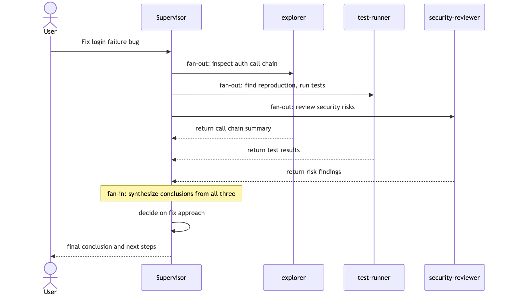
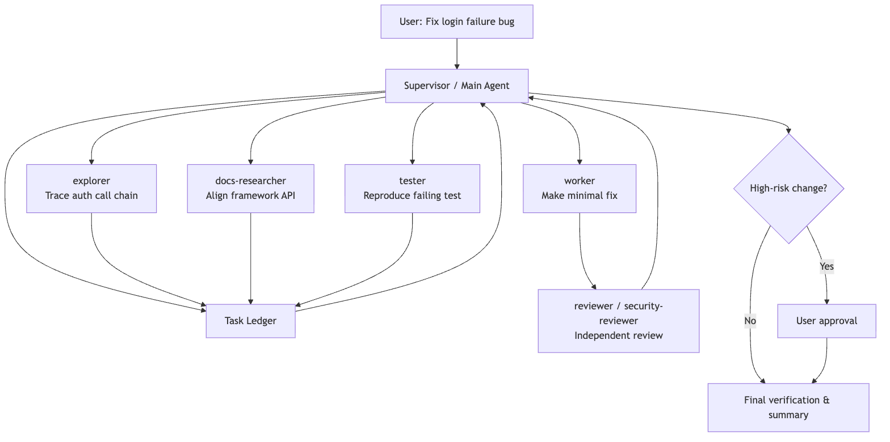

# Industry Patterns for Agent Collaboration

Claude Code is only one example of a broader design problem.

The larger question is:

> Outside Claude Code, how do other systems actually design multi-agent collaboration?

This topic is easy to turn into a pile of product names:

- Gemini / ADK has `SequentialAgent`, `ParallelAgent`, and `LoopAgent`.
- Claude Code has subagents and agent teams.
- Codex has subagents, custom agents, sandboxes, and approvals.
- OpenAI Agents SDK has handoffs and `Agent.as_tool()`.
- Deep Agents has supervisors, sync subagents, async subagents, memory, and sandboxing.

But memorizing names does not actually make the design clearer.

The hard part of multi-agent work is not whether the system can launch several model instances. It is this:

```text
How is the task split?
Who dispatches the work?
How much context does each child receive?
May that child edit files?
How do results come back?
Can the task be stopped if it gets stuck?
What happens when multiple agents write to the same surface?
Who approves high-risk actions?
```

So instead of walking vendor by vendor, this article follows the problem chain.

Keep using the same running example:

```text
The user asks the system to fix a login-failure bug.

The bug may involve auth code, cookie configuration, database-backed sessions,
the frontend login page, test mocks, legacy API compatibility, and security boundaries.

One agent can do the work, but it will likely be slow and messy.
Multiple agents can do the work too, but without collaboration design,
it just becomes a faster way to create chaos.
```

The core question is:

> How do multi-agent systems turn multiple model-based workers into controlled engineering collaboration instead of a group of agents that constantly contaminate one another's context?

---

## 1. Start by Following the Pressure Chain

Multi-agent systems usually do not appear because the model is "not smart enough." They appear because engineering work creates four recurring pressures.

**First, there is too much information.**

When you are fixing a login bug, the main agent may need to read dozens of files, run tests, inspect logs, and trace callers. If all of that intermediate work lives in one context, the main line of reasoning gets buried under search noise.

**Second, much of the work is naturally parallel.**

Tracing callers, running tests, inspecting frontend state, and reviewing the security surface can often happen at the same time.

**Third, the roles are different.**

An explorer should mostly read. An implementer should focus on a minimal change. A reviewer should doubt the implementer's assumptions. A security reviewer should prioritize exploitability. Stuffing all of that into one prompt often makes the roles fight each other.

**Fourth, risk still has to converge somewhere.**

A child agent cannot delete compatibility logic, change database schema, pull dependencies from the network, or run dangerous commands just because it happens to be a background worker. Those actions still need a unified approval and responsibility path.

That is why industry designs tend to evolve along a similar chain:

```text
A single agent can handle a simple task
-> larger tasks dirty the main context
-> child agents appear for context isolation
-> subtasks can run in parallel
-> supervisor / worker fan-out and fan-in patterns emerge
-> different task types need specialized agents and permission boundaries
-> some tasks require real transfer of control
-> handoff appears
-> some work spans systems or teams
-> protocolized interoperability such as A2A appears
-> some work is long-running and cannot finish in one burst
-> durable execution, memory, sandboxing, and task lifecycle appear
```

So the core equation is not:

```text
more agents = more intelligence
```

It is:

```text
more agents = more coordination problems
```

Every mature design is really answering the same question:

> How do you add parallelism without losing context, state, permissions, and accountability?

---

## 2. Pattern One: Central Orchestration

The safest multi-agent pattern is central orchestration.

You start with a central coordinator:

```text
User request
-> main coordinator understands the goal
-> breaks it into subtasks
-> dispatches those tasks to specialists
-> waits for the results
-> integrates the outcome and decides what happens next
```

This is the classic fan-out / fan-in shape: work spreads out from one center and then converges back into that center for synthesis.

In sequence form:



Applied to the login bug:

```text
The coordinator:
  - sends a code-mapper to trace auth callers
  - sends a test-runner to reproduce the issue and run relevant tests
  - sends a security-reviewer to inspect the risk boundary
  - keeps final fix selection and merge judgment for itself
```

The main virtue of this pattern is clarity. Each child does local work. One central node remains responsible for the global interpretation. Child agents do not need to know everything, and they should not make the final call on their own.

OpenAI Agents SDK's `Agent.as_tool()` is a clean example of this design. The coordinating agent treats a specialist as a tool invocation, so control never leaves the center. Many Claude Code and Codex subagent scenarios feel similar: the parent dispatches, the child returns a result, and the parent decides what to do with it.

This solves the first core problem:

> In a multi-agent system, someone still has to be responsible for telling the final story.

Otherwise, each agent returns a local truth:

```text
The testing agent says the suite is red.
The security agent says there is risk.
The implementation agent says the fix is done.
The frontend agent says the UI looks normal.
```

But the user actually needs:

```text
What is the root cause?
What changed?
Why is this fix safe?
Which tests show old behavior still works?
What risk remains?
```

That synthesis has to happen somewhere.

The limitation is equally clear. If every interaction must flow through the center, the center can become the bottleneck. Long jobs, many subtasks, or heavy peer-to-peer coordination can leave the controller spending more time relaying information than making decisions.

That is why many systems move to the next pattern: turning work into explicit task objects.

---

## 3. Pattern Two: Make Tasks First-Class Objects

Multi-agent systems break down quickly when work is assigned only through vague natural language.

Imagine the main agent says:

```text
Go look into the login problem.
```

That instruction is too loose. The child still does not know:

- whether it is allowed to edit code or should stay read-only
- whether it is expected to return evidence or a solution
- what to do if it gets stuck
- what counts as done
- whether other agents are allowed to consume its output

More mature systems turn tasks into explicit objects.

A task should usually have fields such as:

```text
id
description
owner / assignee
status
dependencies
allowed tools
artifacts
logs
result summary
cancel / resume capability
```

Google's A2A protocol treats `Task` as a foundational unit with a lifecycle. Claude Code teams use shared task tables and locking. Codex imposes thread limits, nesting limits, and runtime limits around subagent work. Deep Agents returns task IDs for async children so the supervisor can later check, update, cancel, or list them.

The shared principle is simple:

> A child agent is not just a temporary model call. It is an execution unit with a lifecycle.

For the login bug, that might look like:

```text
task: trace-auth-callers
owner: explorer
status: running
mode: read-only
output:
  - key call chain
  - suspicious branches
  - eliminated paths
  - next-step recommendation
```

Now the coordinator does not need to stare at every message the child produces. It can inspect task state and consume the summary at the right moment.

Turning tasks into first-class objects also solves a hidden but critical problem: recovery.

If a long job dies halfway through, the runtime needs to know:

```text
Which tasks completed?
Which failed?
Which are still running?
Which results were already materialized as artifacts?
Which conclusions were only intermediate guesses?
```

Without task objects, recovery becomes "read the entire transcript and guess." Anyone who has dealt with a real production incident at 3 a.m. knows that this is exactly what you do not want.

That is why serious agent runtimes increasingly look like a combination of task system, tool system, and state system rather than a thin prompt wrapper.

---

## 4. Pattern Three: Isolate Context, Return Summaries

The earliest multi-agent win is often not parallelism. It is context hygiene.

Claude Code subagents, Codex explorers, and Deep Agents subagents all converge on the same idea:

```text
The child may search deeply and wander through false starts
-> the parent should receive only a compressed result
```

That is crucial.

An exploration agent debugging a login failure might:

```text
search for session
search for cookie
search for login
read old tests
rule out unrelated modules
inspect a failed log
make one wrong guess
correct it
```

That process is useful to the child. It is not what the main agent should inherit verbatim.

What the parent really needs is:

```text
Which paths were checked
Which ones can be ruled out
Which two or three locations still look suspicious
Where the evidence lives
What should be validated next
```

The child should return a summary, not a transcript.

The analogy to a real team is helpful: you do not ask a coworker to recite every search query from the afternoon. You want them to say, "I checked it. The problem is probably in session refresh. I have two pieces of evidence, and the cookie branch can be ruled out."

That is the value of context isolation.

But isolation has a cost. If the child sees too little context, it may repeat work, misunderstand the task, or diverge from the main line.

So industry systems usually switch between two strategies:

| Strategy | Best used for | Main risk |
| --- | --- | --- |
| Clean context | Independent subtasks, noisy exploration | The child has to rebuild background understanding |
| Forked / inherited context | Parallel validation of multiple hypotheses when the parent context is valuable | Higher cost, and inherited context can also inherit bad assumptions |

Claude Code's fork path belongs to the second family: multiple children share the parent's current prefix and then branch into separate hypotheses.

So context design is not "the more isolated, the better." The right question is:

> Does this child need the parent's full worksite, or does it benefit more from a clean slate?

---

## 5. Pattern Four: Specialize Roles and Bind Tools to Them

Multi-agent systems are not three copies of the same general-purpose agent.

If every agent can read, write, delete, run commands, access the network, and change configuration, you do not have specialization. You have several unstable full-access replicas.

The more mature pattern is role-based capability shaping.

Codex documents built-in roles such as `default`, `worker`, and `explorer`. `explorer` is explicitly read-heavy. Custom agents can also set model, reasoning effort, sandbox, and MCP configuration. Claude Code lets subagents be defined with Markdown frontmatter such as `name`, `description`, and `tools`, so different subagents have different context and tool boundaries. Deep Agents uses similar fields such as `name`, `description`, `system_prompt`, `tools`, `model`, and `permissions`.

The principle underneath all of this is straightforward:

```text
Explorer: read more, change less, ideally stay read-only
Implementer: change code, but only inside a bounded scope
Reviewer: read the diff and the context, prioritize risk
Docs researcher: access official documentation, not business code
Security reviewer: keep permissions tighter and outputs stricter
```

For the login bug, that might mean:

| Agent | Job | Tool boundary |
| --- | --- | --- |
| Explorer | Trace auth callers | Read-only files and search |
| Worker | Change session refresh logic | Workspace write permission, but within a bounded scope |
| Test runner | Run login-related tests | Test command execution, but no casual implementation edits |
| Security reviewer | Inspect cookie, token, and permission risk | Read-only, structured findings |
| Docs researcher | Validate framework API behavior | Documentation access, no code edits |

Role specialization answers "who should do what."

Tool boundaries answer "who must not do what."

**The second question matters even more.**

Models make mistakes. Robust systems cannot rely only on a prompt saying "please do not change too much." The boundary has to exist at the tool, sandbox, and approval layers as well.

---

## 6. Pattern Five: Handoff vs. Specialist-as-Tool

In a centrally orchestrated design, the child often behaves like a tool: it completes a local job and returns control.

But not every case fits that model.

Suppose the user expands the original request:

```text
Also help me design a new SSO integration strategy.
```

Now the conversation may no longer be a local branch of the original login bug. It may have shifted into a different expert domain entirely. In that case, a real handoff can make more sense:

```text
The current agent recognizes a domain shift
-> transfers the conversation to an SSO specialist
-> that specialist handles the next turns
-> until it finishes or hands control back again
```

OpenAI Agents SDK expresses this distinction especially clearly:

| Pattern | Who keeps control? | Best used for |
| --- | --- | --- |
| Agent as tool | The orchestrator keeps control | Local expert questions, reviews, retrieval, supporting analysis |
| Handoff | Control moves to the downstream agent | The user's intent has genuinely shifted to another domain and needs continued interaction |

One sentence is enough to separate them:

```text
Agent as tool: I ask a specialist to answer a sub-question.
Handoff: from this point on, the specialist owns the conversation.
```

Engineering systems should be careful with handoff. If every side branch triggers a handoff, the user experiences constant speaker changes and the main line of work becomes hard to track.

So the safer default is usually specialist-as-tool or subagent dispatch. Let the specialist handle a local branch, then bring the result back to the orchestrator. Reserve handoff for cases where the subject of the conversation has truly changed.

---

## 7. Pattern Six: Protocolized Interoperability

So far, most of the patterns above live inside one runtime: Claude Code dispatches a subagent, Codex launches an explorer, Deep Agents invokes a supervisor-child pattern, OpenAI Runner performs a handoff.

But industry systems also face a larger question:

> What happens when two agents come from different frameworks, vendors, or teams?

That is where A2A enters.

A2A treats a remote agent as something discoverable, invocable, and trackable. The caller does not need to know how the remote side is implemented internally. Both sides only need to speak a shared object model:

```text
Agent Card: who the remote agent is, what it can do, how it authenticates
Message: one unit of communication
Task: a stateful unit of work
Artifact: the output of that task
Streaming / Push: progress and long-task notification
```

This resembles MCP in spirit, but it solves a different layer:

```text
MCP is mainly about how an agent calls tools and resources.
A2A is mainly about how one agent calls another agent.
```

In the login-bug example, imagine the company already runs a security-review agent service outside the current Claude Code or Codex process. The orchestrator can discover that service through A2A, submit a review task, and subscribe to its status and artifacts.

This solves a different class of problem: cross-organization and cross-runtime collaboration.

- Different teams can own their own specialist agents.
- Callers do not need to know the callee's internal prompt or toolchain.
- Long tasks can be tracked through a task state machine.
- Results can be returned as standardized artifacts.
- Authentication and capability declarations live in the agent card.

But protocolized collaboration also introduces a new layer of complexity:

```text
authentication
authorization
timeouts
retries
version compatibility
task cancellation
output trust
sensitive data boundaries
```

So A2A is not "let agents chat freely." It is a way to expose remote agents as services with explicit tasks, state, and artifacts.

That is one reason the Gemini / ADK ecosystem is especially notable here: it does not just provide workflow agents. It also pushes agent-to-agent interoperability up to the protocol layer.

---

## 8. Pattern Seven: Long-Running Agent Harnesses

Once a task stretches from minutes to hours or even multiple days, multi-agent collaboration hits another layer of difficulty.

For example:

```text
Fix the login bug
-> discover the auth library must be upgraded
-> migrate old sessions
-> run a full regression suite
-> wait for user confirmation on compatibility policy
-> generate migration docs
```

That is not something one model call can absorb.

Long tasks need a harness:

```text
short-term state: what the current thread is doing right now
long-term memory: facts and preferences that survive across sessions
task state: what completed, failed, or was cancelled
artifacts: where intermediate outputs live
sandbox: how execution environments stay isolated
approval: how risky actions pause for human review
tracing: how failures can be traced back to the step that caused them
```

Deep Agents makes this direction especially visible. It describes itself as an agent harness built on LangGraph runtime, combining planning, subagents, filesystem context, long-term memory, sandboxing, and human-in-the-loop control. Its async subagents let a supervisor launch background work, get back a task ID, keep talking to the user, and later check, update, or cancel the task.

Codex moves in a similar direction, though its expression is more coding-runtime-centric:

- subagents have concurrency limits
- nesting depth is bounded
- sandbox and approval policy shape the execution boundary
- app, CLI, and cloud share the same execution model
- approval review is scoped to actions that actually require approval

The underlying judgment is the same:

> Once an agent can run for a long time, it has to behave like a governable workflow, not like a single chat reply.

Without tracing, you cannot tell which agent failed.

Without sandboxing, more capability means more danger.

Without memory boundaries, errors become durable too.

Without approvals, risky actions disappear into the background.

Without task lifecycle, pause and resume exist only in a human's head.

The challenge of long-running agents is not whether the model can keep going. It is whether the surrounding system can safely support that persistence.

---

## 9. Put the Systems on One Map

Now the major design families can be compared on one page:

| System / framework | What it feels like | Collaboration core | Strength | Main boundary |
| --- | --- | --- | --- | --- |
| Gemini / ADK / A2A | Enterprise orchestration and interoperability platform | Workflow agents + A2A task / agent card model | Protocolized collaboration, task state, cross-system integration | Internal scheduling details remain opaque, and engineering complexity is high |
| Claude Code | Collaborative terminal workbench | Subagents + context isolation + teams / mailbox | Strong local engineering workflow, context hygiene, team-like coordination | Recovery, conflict convergence, and protocolization are comparatively lighter |
| Codex | Strong central coding-execution kernel | Parent fan-out / fan-in + custom agents + sandbox / approvals | Approval model, safety boundaries, configurable concurrency, coding workflow | More centered on controlled orchestration than free-form swarm behavior |
| OpenAI Agents SDK | Programmable orchestration API | Handoffs + agents as tools + runner tracing | Clear control-transfer semantics, good fit for product integration | Developers must design task objects and permission policy themselves |
| Deep Agents | Long-running agent harness | Supervisor + sync / async subagents + memory / sandbox | Long tasks, persistence, pluggable backend orientation | Preview-style features and distributed governance still require more custom work |

This table is not about ranking winners. It is about seeing that different systems are solving different layers of the same problem space.

- If you mainly want to split a large coding job into several read-heavy explorations, Claude Code or Codex subagents may be enough.
- If you need to orchestrate several specialists inside a product backend, OpenAI Agents SDK may be the more direct fit.
- If you care about cross-team, cross-system agent interoperability, A2A-like protocols matter more.
- If you need work that lasts hours, pauses, resumes, and accumulates memory and artifacts, a harness-oriented design such as Deep Agents is closer to the target shape.

---

## 10. Industry-Wide Design Consensus

Looking across these systems, several practical design rules show up again and again.

### 1. Split the Task Boundary Before You Split the Agents

Do not start by asking:

```text
How many agents should I create?
```

Start by asking:

```text
Which work can be completed independently?
Which work needs shared context?
Which work is read-only?
Which work has side effects?
Which results still need final synthesis by a coordinator?
```

Once the task boundaries are clear, the number of agents usually becomes obvious.

### 2. Parallelize Reads First, Converge Writes

The best candidates for parallel work are:

- code search
- documentation lookup
- log inspection
- independent test execution
- candidate-solution analysis
- independent review

The worst candidates for free-form parallelism are:

- multiple agents editing the same file at once
- multiple agents migrating schema simultaneously
- multiple agents updating shared memory at the same time
- multiple agents deciding release strategy independently

One line captures the principle:

```text
Reads can fan out. Writes should converge.
```

### 3. Child Agents Should Return Conclusions, Not Process Noise

The best child-agent deliverables often look like this:

```text
What was done
What was found
Where the evidence lives
What was ruled out
What should happen next
What remains uncertain
```

Do not dump every tool call, every search result, and every failed path back into the main context.

### 4. Permissions Should Be Bound to Roles, Not to Model Confidence

A model saying "I'm confident" is not a valid permission system.

The stronger pattern is:

```text
explorer defaults to read-only
reviewer defaults to read-only
worker gets bounded workspace write access
network is off by default
dangerous commands require approval
escaping the sandbox requires approval
```

That is where Codex sandboxing and approvals, Claude Code subagent tools, Deep Agents permissions, and Gemini-style platform governance all begin to converge.

### 5. Humans Are Not a Low-Level Fallback

Multi-agent systems should not treat the user as the person to ask only when the model is confused.

The user is better understood as the approver at key risk boundaries:

```text
Should compatibility be broken?
Should the old path be removed?
Should the system access external resources?
Should a migration be executed?
Should a long-term memory item be saved?
```

The more agents you add, the more important it becomes to define when the human is brought back in.

### 6. Tracing Is Not Optional

If a single-agent system fails, you can often reconstruct the problem from one transcript.

In a multi-agent system without tracing, failure becomes:

```text
You do not know which agent reasoned incorrectly
You do not know which handoff lost context
You do not know which tool call polluted the state
You do not know which child wrote a bad artifact
```

That is why mature systems elevate tracing, usage, task status, artifacts, and approval records into first-class runtime objects.

---

## 11. A Practical Design Template

If you were designing an engineering-focused multi-agent system yourself, a useful starting template would look like this:

```text
Supervisor
  - understands the user goal
  - maintains the task ledger
  - dispatches subtasks
  - collects results
  - makes final decisions

Task ledger
  - id
  - status
  - owner
  - dependencies
  - artifacts
  - cancel / resume

Specialized agents
  - explorer: read-heavy exploration
  - worker: bounded implementation
  - reviewer: independent review
  - tester: validation and reproduction
  - docs researcher: external-document calibration

Context policy
  - clean context for noisy exploration
  - forked context for parallel hypothesis testing
  - summary-only return to supervisor

Permission policy
  - read-only by default
  - workspace-write for bounded implementation
  - network / external write / destructive commands require approval

Observability
  - trace every tool call
  - record every handoff
  - record task state
  - store artifacts separately from chat history
```

Applied to the login bug, the flow looks like this:



The most important thing in that diagram is not the number of agents. It is the boundaries:

- read tasks fan out in parallel
- write tasks converge
- review stays independent
- high-risk actions go back to a human
- the supervisor integrates the final result

---

## 12. What This Clarifies About Claude Code

Seen through this industry lens, Claude Code's objects become easier to interpret.

`AgentTool` is not "a model calling another model." It is a controlled dispatch point.

Subagents are not "another chat window." They are context-isolation units.

Fork is not "copy the session and see what happens." It is a strategy for inheriting parent context and testing several hypotheses in parallel.

The task system is not just a background job list. It is lifecycle management for multiple execution units.

`SendMessageTool` is not casual chat between agents. It is a protocolized communication surface.

Coordinator and team modes are not multi-agent theatrics. They are upgrades in task organization.

`AskUserQuestion` and permission bubbling are not awkward interruptions. They are the mechanisms that route risky decisions back to the proper decision-maker.

From that angle, Claude Code is not an isolated oddity. It is converging toward the same general shape as Gemini, Codex, OpenAI Agents SDK, and Deep Agents:

```text
Wrap model capability inside a system that is organizable, traceable, recoverable, approvable, and isolatable
```

The difference is emphasis.

Claude Code leans harder into local engineering collaboration. Codex leans harder into central execution and approvals. Gemini leans harder into platform protocols. OpenAI Agents SDK leans harder into programmable orchestration. Deep Agents leans harder into the long-running harness.

---

## 13. A Final Test

Multi-agent systems are not there to make a product look more "intelligent."

They exist to solve this problem:

```text
When a task becomes too large, too noisy, too long, or too risky,
how do you split it into execution units that are isolatable, parallelizable,
communicative, stoppable, and reviewable?
```

So if you want to judge whether a multi-agent design is any good, do not start by counting how many agents it has. Start with six questions:

```text
Who makes the final decision?
Where does task state live?
How is context isolated?
How do permissions converge?
How do results come back?
How does failure recover?
```

If those questions are fuzzy, multi-agent design only parallelizes confusion.

If those questions are clear, multi-agent design starts to become an engineering collaboration system rather than a collection of chat windows.
