# A New Context Manager Paradigm: The Agent's Attention Operating System

If the previous [Context Policy](/blog/AI/build-harness/00-15-context-policy-model-input) answered:

> What should the model see in this turn?

Then this chapter answers a more fundamental question:

> How does the entire Agent save, project, compress, branch, and restore its working state?

Here is the core point up front:

> **An Agent Context Manager is not a chat history manager. It is an attention governance layer that compiles event facts, current state, long-term memory, external evidence, tool environments, and system policies into the minimal sufficient context required for the next action.**

In other words, it does not simply manage `messages[]`, nor does it merely "summarize things" once the context is full. It is more like the Agent's **Attention Operating System**: responsible for deciding what the Agent should know at this moment, why it knows it, where that knowledge comes from, whether it is trustworthy, whether it is stale, whether it should be exposed to the model, whether it should be written into long-term memory, and how to preserve reasoning continuity under a limited budget.

## 1. Defining Context from First Principles

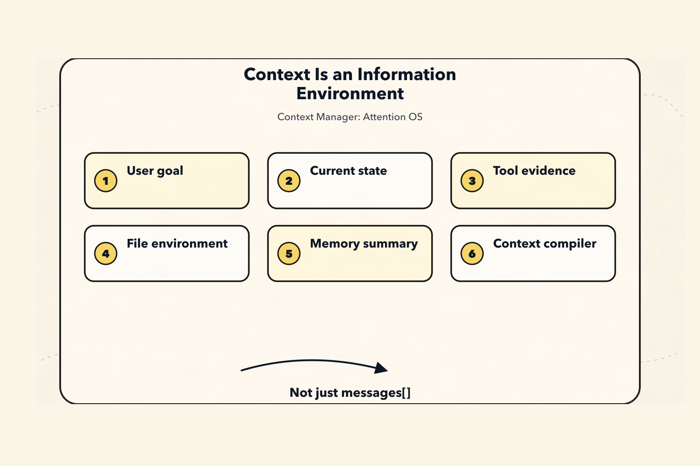

Many Agent demos understand context as an ever-growing `messages[]`:

```text
user message
-> assistant message
-> tool result
-> assistant message
-> tool result
-> ...
```

This model can run a minimal demo, but it cannot support a mature Agent.

A mature Agent's context is not just a chat transcript. It also includes the user's goal, current task state, historical decisions, evidence from tool calls, file and environment state, long-term memory, compressed summaries, branched sessions, budget controls, permission boundaries, and validation results.

`messages[]` is only one layer, and usually not the most reliable one.

A more stable definition is:

```text
Context_t = f(
  Intent,
  State,
  Evidence,
  Memory,
  Policy,
  Tools,
  Environment,
  Recent Interaction,
  Budget
)
```

In other words:

> **The context at a given moment is the information environment an Agent needs in order to make its next judgment, take its next action, and produce its next response.**

This introduces an important shift:

```text
Do not ask: how do we fit the message history into the model?
Ask instead: what information does the next action require?
```

A Context Manager needs to continuously answer these questions:

```text
What is the Agent's current goal?
How far has the current task progressed?
Which facts have been verified?
Which ones are only guesses?
Which tool results are key evidence?
Which user constraints must not be lost?
Which old information is no longer relevant?
Which information is old but must still be preserved for the future?
Which information can be compressed?
Which information must be kept verbatim?
Which information can enter the model?
Which information must remain internal to the system?
```

This abstraction is relatively durable. Even if model context windows keep getting larger in the future, Agents will still need to deal with attention noise, evidence traceability, permission isolation, memory contamination, state recovery, branch exploration, cost budgets, and explainability.

The new framing for this chapter can first be condensed into one sentence:

**Do not design the Context Manager as a `messages[]` concatenator. Design it as a runtime system for event sourcing, state projection, context compilation, and auditable compression.**

In other words:

```text
The Context Manager's responsibility is not to save the conversation.
Its responsibility is to reconstruct, at any moment, the minimal sufficient context the Agent needs to take its next action.
```

We will continue using the example from earlier: a CLI Agent is fixing a failing test. It reads files, runs tests, changes code, and validates again. Once the task gets longer, context management turns from "assembling a prompt" into "managing the runtime scene."

## 2. First, Why the Old Model Is Not Enough

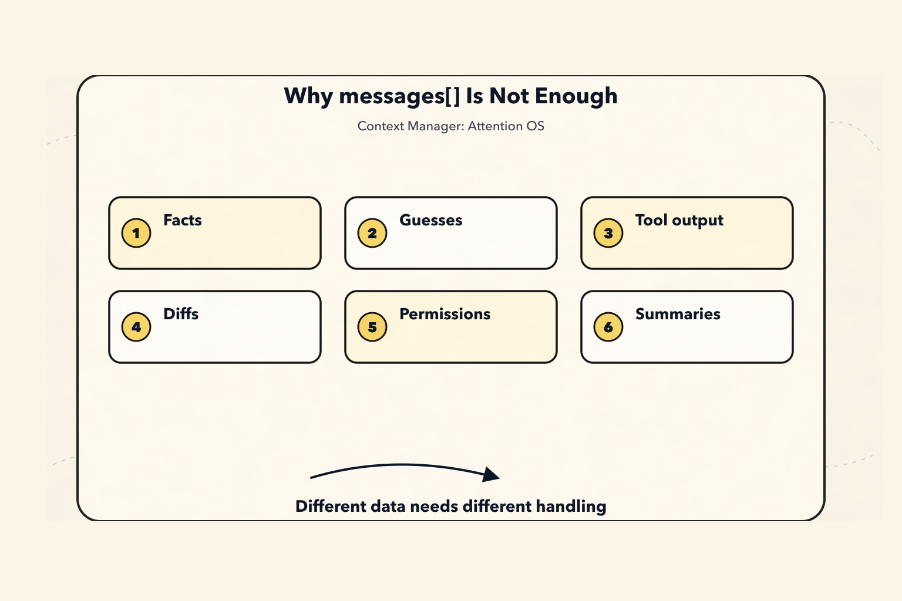

The simplest implementation usually looks like this:

```ts
const messages = [
  { role: "system", content: systemPrompt },
  { role: "user", content: userGoal },
];

while (true) {
  const response = await model.chat({ messages, tools });
  messages.push(response.message);

  if (response.toolCall) {
    const result = await runTool(response.toolCall);
    messages.push({
      role: "tool",
      content: result.text,
    });
    continue;
  }

  break;
}
```

The biggest advantage of this code is that it is easy to understand.

Its biggest drawback is also that it is too easy to understand: it treats everything as the same kind of message.

In a task that fixes tests, `messages[]` will quickly get mixed with content like this:

```text
User goal
System rules
Project rules
Model guesses
Tool call arguments
Test logs
grep output
File snippets
Old file content
New file diff
Permission denial
Compressed summary
Long-term memory
Verification results
```

These pieces of content are fundamentally different in nature.

Some are facts; some are guesses.

Some are high-priority instructions; some are untrusted tool output.

Some are already stale; some must be kept forever.

Some should enter the model input; some should only be kept for auditing and replay.

If the system has only one `messages[]`, it becomes hard to answer questions like these:

```text
Which piece of information is the source of truth?
Where does the current state come from?
Which events did the compressed summary summarize?
Was the tool output truncated?
What exactly did the model see in this turn?
What is the relationship between this branch and the mainline?
During recovery, should side effects be replayed, or should only state be rebuilt?
```

So it is not that `messages[]` cannot exist.

It just cannot be the source of truth for the entire context system.

## 3. A New Paradigm: Context Is a Compiled Artifact, Not the Source of Truth

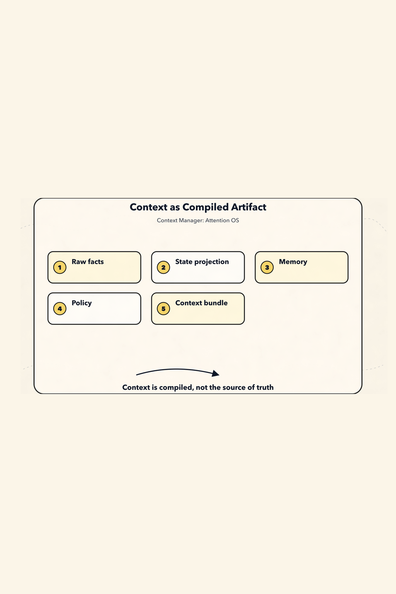

The wrong paradigm is:

```text
messages are the context.
summary can replace history.
Whatever the model sees is all the system stores.
```

This design is fast early on, but later it runs into a pile of problems:

```text
Cannot recover.
Cannot audit.
Cannot replay.
Cannot branch.
Cannot explain.
Cannot know what the summary lost.
Cannot distinguish facts, speculation, and user preferences.
Cannot manage permissions and privacy.
```

A more robust layering looks like this:

```text
Raw Event Log
  append-only, as immutable as possible, records what actually happened
        ↓
State Projection
  projects the current goals, plan, facts, decisions, files, and tool state from the event stream
        ↓
Context Builder
  compiles model input based on token budget, priority, relevance, and trust boundaries
        ↓
Model Request
  the final context snapshot sent to the model
```

Of these four layers, only the last one is actually sent to the model.

The first three layers all belong to the harness’s runtime control plane.

You can pin down the boundaries with a table:

| Layer | Question answered | Source of truth? | Can it be compressed? |
| --- | --- | --- | --- |
| Raw Event Log | What actually happened? | Yes | Should not be overwritten by a summary |
| State Projection | What is the current situation? | No, it is a projection | Can be rebuilt |
| Context Builder | What should the model see this round? | No, it is a compiler | Recomputed every round |
| Model Request | What did the model actually receive? | No, it is a snapshot | References can be saved |

This is the most important step in the new paradigm:

**LLM context is a runtime compiled artifact, not the system’s source of truth.**

More completely:

```text
Raw Events / Raw Messages / Tool Results / Artifacts are the sources of truth.
State / Summary / Memory / Trace are semantic projections.
ContextBundle / Prompt is a one-off compiled artifact.
```

It can be drawn like this:

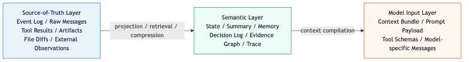

So **the context sent to the model is only a temporary view**. It can be compressed, trimmed, reordered, redacted, and adapted to different model protocols, but it cannot become the system’s only source of truth.

In one sentence:

> **Context is a compiled artifact, not a database.**

Once you accept this, many design choices become naturally clear.

Try not to lose raw history.

Model context can be discarded, compressed, and rebuilt.

A summary is a derived artifact, not source data.

The reasoning path stores auditable evidence instead of relying on hidden chain-of-thought.

A conversation is a tree, not just a linear array.

Context budget is resource allocation, not simple truncation.

## 4. Context Manager Modules and Planes

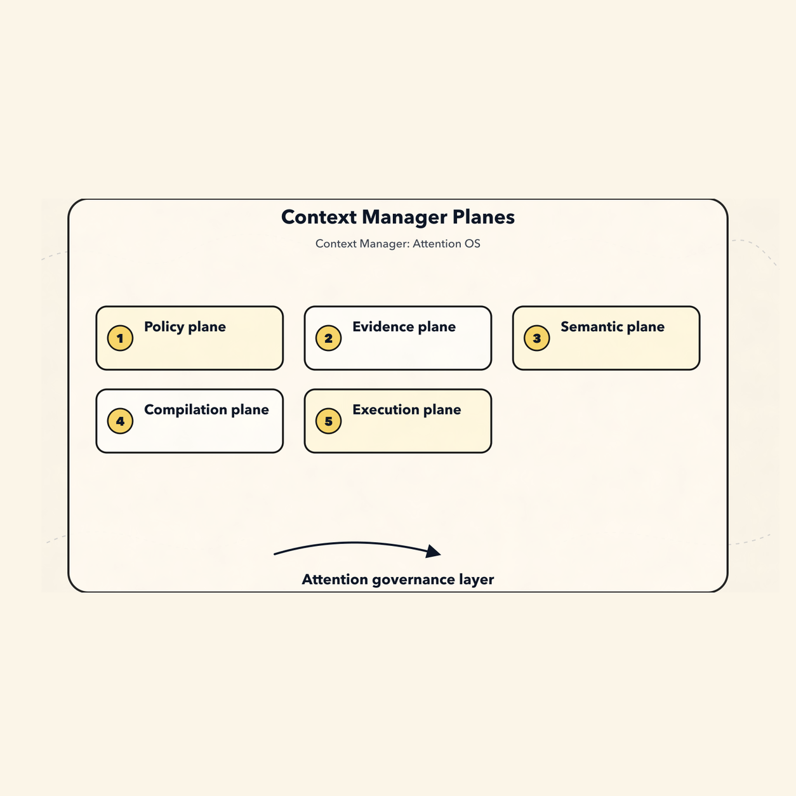

A more mature Context Manager should not consist of just one `buildMessages()`.

At a minimum, it will grow into a module diagram like this:

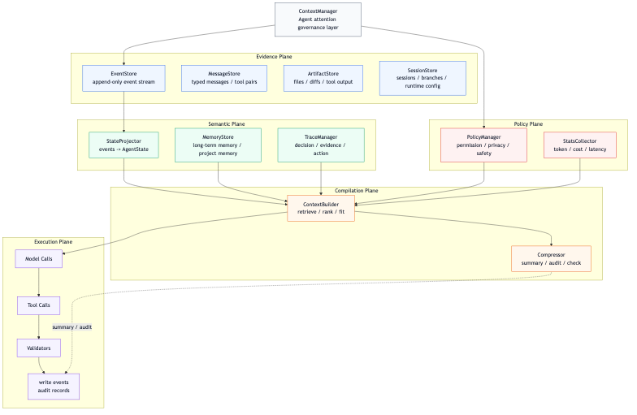

You can also look at it through five planes:

```text
Policy Plane
  permission / privacy / safety / budget

Semantic Plane
  state / memory / summary / trace

Evidence Plane
  events / messages / artifacts / tools

Compilation Plane
  retrieve / rank / compress / redact / fit

Execution Plane
  model calls / tool calls / validators
```

You do not need to implement all of these modules from the start.

But they make an excellent checklist of boundaries, because each module answers a different question.

`EventStore` asks: what facts actually happened?

`StateProjector` asks: what task situation are we in right now?

`ContextBuilder` asks: what material should the model see in this turn?

`Compressor` asks: which old information can be replaced by a summary? Does the summary preserve its sources?

`TraceManager` asks: at exactly which causal node did this failure break?

If all of these questions are stuffed into a single `messages` array, the system becomes very hard to change later.

This section can be distilled directly into twelve long-term, stable design principles:

```text
1. Context is not history; it is the information environment needed for action.
2. Sources of truth and derived artifacts must be separated.
3. All lossy transformations must be auditable.
4. State is a projection, not a chat log.
5. Context is a compilation result, not a database.
6. Memory is governed knowledge, not a cache.
7. Tool calls are causal events, not ordinary text.
8. The reasoning path should preserve an explainable skeleton, not a hidden chain of thought.
9. Context must have scope.
10. Context management is budget allocation, not just token truncation.
11. Branching and rollback are native requirements.
12. The internal model should be stable; external protocols should be replaceable.
```

The last point is especially important. Do not bind core data structures to a specific model vendor’s message format, tool-calling format, tokenizer, or prompt template. A more stable approach is:

```text
Canonical Internal Model
  ↓ adapter
Provider-specific Payload
```

## 5. A Stable Context Ontology

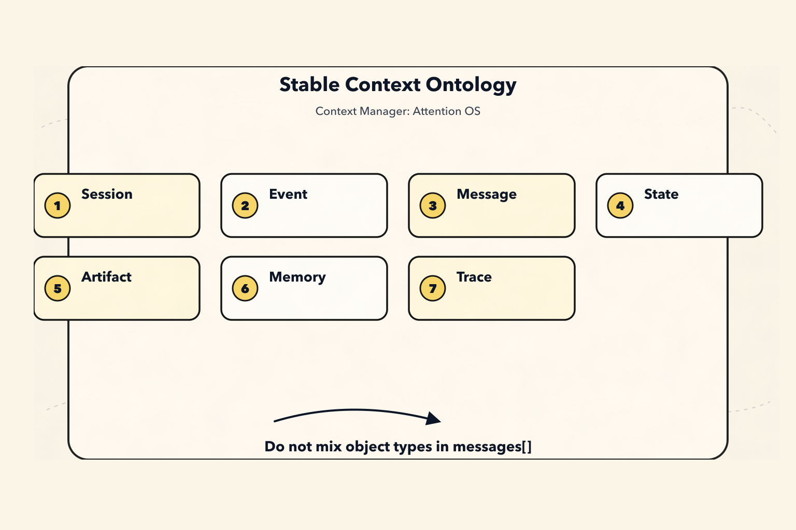

A mature Agent context system should distinguish at least these objects:

```text
Session        Work container
Event          Facts that have occurred
Message        Communication records among the user, model, and tools
State          Projection of the current task state
Stats          Metrics such as tokens, cost, latency, and compression ratio
Memory         Knowledge reusable across time
Artifact       Large objects, files, diffs, logs, screenshots, tool outputs
Trace          Explainable chain of decisions and actions
Policy         Permissions, security, privacy, budget, and tool boundaries
ContextBundle  Compiled context result for a single model call
```

They have different responsibilities and should not be mixed into a single `messages[]`.

### Session: Work Identity and Lifecycle

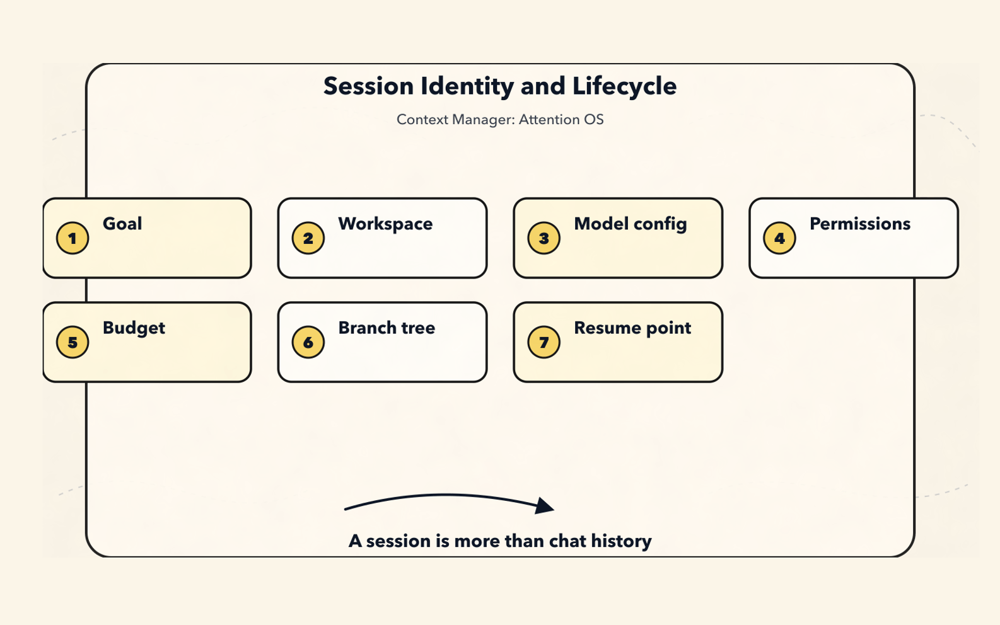

`session` manages the identity, boundaries, and branch relationships of this Agent run.

A minimal set of fields can start like this:

```ts
type AgentSession = {
  sessionId: string;
  rootSessionId?: string;
  parentSessionId?: string;
  branchId?: string;
  leafEventId?: string;

  status: "active" | "paused" | "completed" | "failed" | "archived";
  cwd?: string;
  repoRoot?: string;

  modelConfig: {
    provider: string;
    model: string;
    maxOutputTokens?: number;
  };

  contextConfig: {
    contextWindowTokens: number;
    reservedOutputTokens: number;
    maxRecentTokens: number;
    compressionPolicyId: string;
  };

  permissionConfig: {
    sandboxMode?: "read_only" | "workspace_write" | "danger_full_access";
    approvalPolicy?: "never" | "on_request" | "on_failure" | "always";
  };

  createdAt: string;
  updatedAt: string;
};
```

The point here is not the number of fields.

The point is that `session_id` does not merely represent "a chat." It also anchors the working directory, model configuration, permission configuration, context budget, branch relationships, and restore position.

Without this information, so-called resume can only restore a chat, not a working scene.

### Event: The Source of Facts

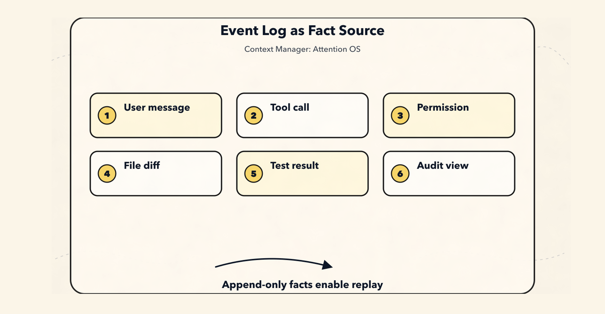

`event` is the object most easily underestimated.

A mature Agent should not only store a message log. It should store an append-only event log.

```ts
type AgentEvent = {
  eventId: string;
  sessionId: string;
  runId?: string;
  parentEventId?: string;
  seq: number;
  timestamp: string;

  type:
    | "SessionStarted"
    | "UserPromptSubmitted"
    | "ContextBuilt"
    | "ModelRequestStarted"
    | "ModelResponseReceived"
    | "ToolCallRequested"
    | "ToolCallStarted"
    | "ToolCallFinished"
    | "ToolCallFailed"
    | "ApprovalRequested"
    | "ApprovalGranted"
    | "ApprovalDenied"
    | "FileRead"
    | "FileWritten"
    | "DiffApplied"
    | "StateUpdated"
    | "CompactionStarted"
    | "CompactionCompleted"
    | "VerifierFinished";

  actor: "user" | "agent" | "model" | "tool" | "system" | "subagent";
  payload: Record<string, unknown>;

  causality: {
    messageId?: string;
    toolCallId?: string;
    artifactId?: string;
    compactionId?: string;
  };
};
```

Why is event more fundamental than message?

Because many key facts are not messages at all.

Which fragments were selected during context construction is not a message.

Which tool call was rejected by permissions is not necessarily a message.

A file being modified, a diff being applied, a verification failing, or compaction being triggered should all be events.

If they do not enter the event log, replay, trace, eval, and audit later lose their factual foundation.

### Message: Model Interaction Records

`message` is still important.

But it should be typed message blocks, not a pass-through array in the provider's raw format.

```ts
type Message = {
  messageId: string;
  sessionId: string;
  runId?: string;
  role: "system" | "developer" | "user" | "assistant" | "tool" | "summary" | "custom";
  content: MessageBlock[];

  toolCall?: {
    toolCallId: string;
    toolName: string;
    args: unknown;
    status: "pending" | "running" | "success" | "error";
  };

  toolResult?: {
    toolCallId: string;
    outputRef?: string;
    outputPreview?: string;
    truncated: boolean;
  };

  provenance: {
    source: "user" | "model" | "tool" | "memory" | "summary" | "system";
    sourceRefs?: string[];
  };

  contextPolicy: {
    includeInContext: boolean;
    priority: number;
    maxTokens?: number;
  };
};

type MessageBlock =
  | { type: "text"; text: string }
  | { type: "file_ref"; uri: string; summary?: string }
  | { type: "tool_call"; toolCallId: string; name: string; args: unknown }
  | { type: "tool_result"; toolCallId: string; outputRef?: string; preview?: string }
  | { type: "summary"; summaryId: string; text: string };
```

There are several hard invariants here:

```text
Tool calls and tool results must be preserved in pairs.
An unfinished tool call must not be truncated halfway.
Large tool outputs should go into ArtifactStore; the message should contain only a preview + ref.
A summary message must know which messages/events it summarized.
Custom/internal messages must distinguish whether they enter the LLM context.
```

### State: The Current Scene

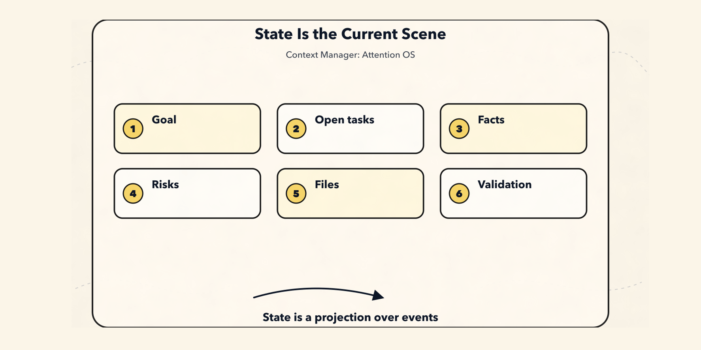

`state` is the current working state projected from the event log.

It is not the same as historical messages.

```ts
type AgentState = {
  sessionId: string;
  sourceEventId: string;
  version: number;

  goal: {
    userGoal: string;
    currentTask?: string;
    acceptanceCriteria?: string[];
  };

  plan: {
    steps: PlanStep[];
    currentStepId?: string;
    status: "planning" | "executing" | "blocked" | "verifying" | "done";
  };

  constraints: {
    hard: string[];
    soft: string[];
    userPreferences: string[];
  };

  facts: Array<{
    factId: string;
    content: string;
    confidence: number;
    sourceRefs: string[];
  }>;

  decisions: Array<{
    decisionId: string;
    decision: string;
    rationaleSummary: string;
    evidenceRefs: string[];
  }>;

  artifacts: Array<{
    artifactId: string;
    kind: "file" | "diff" | "command_output" | "url" | "image";
    pathOrUri: string;
    summary?: string;
  }>;

  openQuestions: string[];
  lastCompactionId?: string;
};
```

`state` is the core that allows work to continue after compression.

Even if earlier natural-language conversation is compressed into a summary, the following things must not become vague:

```text
The user's final goal
Which step is currently being executed
Decisions already made
Facts already verified
Files already read and modified
Unfinished items
Tool failures and retry strategies
User preferences and hard constraints
```

If these are only hidden in old messages, the Agent will lose memory after compaction.

If they enter the state projection, context can be rebuilt at any time.

### Stats: Observability Metrics, Not State

`Stats` manages runtime metrics, not task semantics:

```ts
type AgentStats = {
  sessionId: string;
  runId?: string;

  tokenUsage: {
    inputTokens: number;
    outputTokens: number;
    cachedInputTokens?: number;
    reasoningTokens?: number;
    contextWindowTokens: number;
    contextUsedTokens: number;
    reservedOutputTokens: number;
  };

  latencyMs: {
    contextBuild?: number;
    retrieval?: number;
    modelCall?: number;
    toolExecution?: number;
    endToEnd?: number;
  };

  compression: {
    compactionCount: number;
    tokensBeforeLastCompaction?: number;
    tokensAfterLastCompaction?: number;
    compressionRatio?: number;
  };

  toolMetrics: {
    toolCallCount: number;
    failedToolCallCount: number;
    approvalRequestedCount: number;
    approvalDeniedCount: number;
  };

  qualityMetrics?: {
    verifierPassed?: boolean;
    contextMissingRisk?: "low" | "medium" | "high";
    hallucinationRisk?: "low" | "medium" | "high";
  };
};
```

Without stats, it is hard to answer:

```text
Why do certain types of tasks always fail after compaction?
Which tool output consumes the most tokens?
Which memories are often recalled but not useful?
Which context builder strategy is more cost-efficient?
```

### Memory: Governed Knowledge, Not a Cache

`Memory` answers which knowledge is worth reusing in the future. It is not “dump every summary into a vector database.”

```ts
type Memory = {
  memoryId: string;
  scope: "user" | "project" | "workspace" | "session" | "global";
  kind: "preference" | "fact" | "instruction" | "skill" | "artifact_summary" | "decision";

  content: string;
  sourceRefs: string[];
  confidence: number;

  createdAt: string;
  updatedAt: string;
  expiresAt?: string;

  accessPolicy: {
    sensitive: boolean;
    readableByAgents: string[];
    redactionPolicy?: string;
  };

  retrieval: {
    embeddingId?: string;
    keywords?: string[];
    priority: number;
  };
};
```

The biggest risk in memory design is contamination. A more robust principle is:

```text
Long-term memory must have scope, source, confidence, TTL, sensitivity, priority, and usage records.
```

Guesses from the current task should not contaminate long-term user memory. The test command for one project should not contaminate another project either.

### Artifact: Large Objects and Evidence Entities

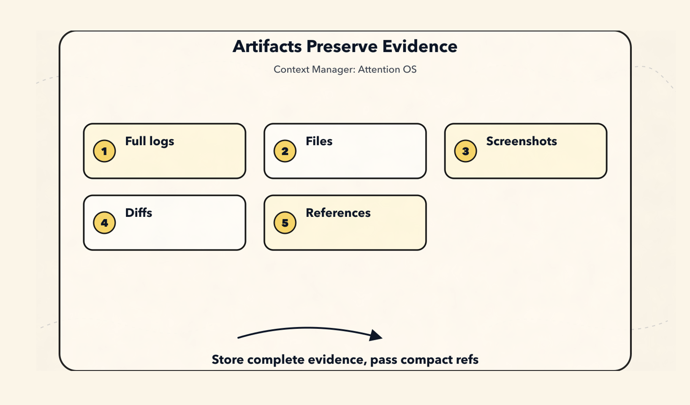

`Artifact` stores complete evidence instead of stuffing everything into the prompt.

```ts
type Artifact = {
  artifactId: string;
  sessionId: string;

  kind:
    | "file"
    | "diff"
    | "tool_output"
    | "command_log"
    | "screenshot"
    | "dataset"
    | "url_snapshot";

  uri: string;
  summary?: string;
  contentHash?: string;

  sourceEventId: string;
  createdAt: string;

  accessPolicy?: {
    sensitive: boolean;
    allowedScopes: string[];
  };
};
```

The correct pattern is:

```text
Put summaries, references, and key snippets in the context.
Put complete evidence in the artifact store.
```

This is especially important for coding agents. Full file contents, test logs, command output, screenshots, and diffs can all be large and should not enter message history directly.

### Trace: An Explainable Path, Not Hidden Chain of Thought

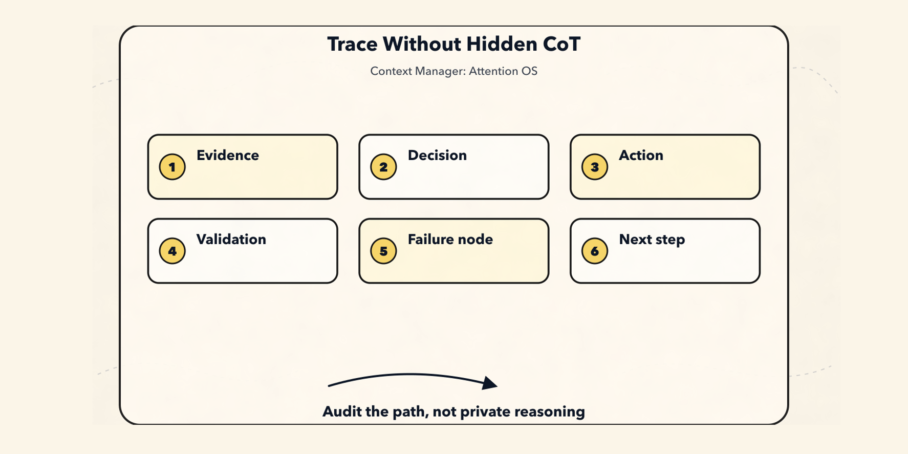

`Trace` answers why the agent acted this way, what it was based on, what it verified, and what comes next.

Do not interpret “preserving the reasoning path” as saving the model’s hidden chain-of-thought. A more robust engineering approach is to preserve a public, auditable, replayable **Accountable Reasoning Trace**:

```text
Goal
Assumptions
Evidence
Decisions
Actions
Observations
Validation
Next Steps
```

This is more robust and safer than preserving natural-language CoT, and it is also better suited for auditing and recovery.

## 6. Context Builder: the Real Model Input Compiler

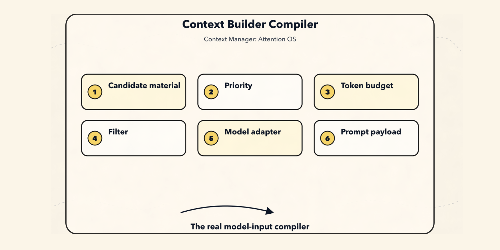

Only after we have sessions, events, messages, and state does Context Builder enter the picture.

The input to Context Builder is not one massive `messages[]`.

Its input is a set of materials with sources, priorities, and trust levels:

```ts
type ContextBundle = {
  system: PromptSegment[];
  developerInstructions: PromptSegment[];
  projectInstructions: PromptSegment[];

  currentRequest: {
    userMessageId: string;
    text: string;
    acceptanceCriteria?: string[];
  };

  sessionState: AgentState;
  summaries: SummaryBlock[];
  recentMessages: Message[];
  retrievedMemories: RetrievedMemory[];
  retrievedArtifacts: RetrievedArtifact[];

  toolContext: {
    availableTools: ToolSpec[];
    pendingToolPairs: Message[];
    recentToolResults: Message[];
  };

  traceContext: {
    runId: string;
    recentDecisions: string[];
    evidenceRefs: string[];
  };

  budget: {
    maxContextTokens: number;
    reservedOutputTokens: number;
    usedTokens: number;
  };
};
```

This compilation pipeline can be drawn as:

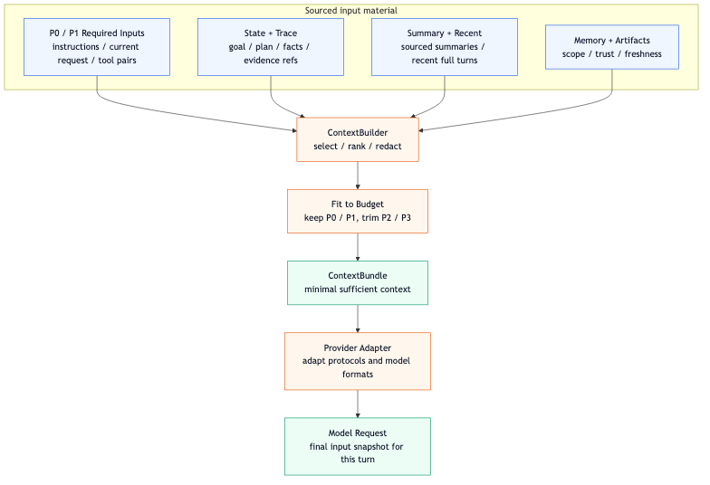

Then it trims by priority:

| Priority | Content | Can Be Dropped |
| --- | --- | --- |
| P0 | system / developer / safety / required tool schema | No |
| P0 | Current user request | No |
| P0 | Incomplete tool call / tool result pair | No |
| P1 | Current goal, acceptance criteria, plan, open questions | Mostly no |
| P1 | Current working files, diff, test results, error messages | Can be summarized |
| P1 | Full conversation from the most recent N turns | Can be trimmed, but must not break turns |
| P2 | Historical decisions, key facts, user preferences | Can be summarized |
| P2 | Retrieved memory / artifact | Can be trimmed |
| P3 | Old small talk, repeated explanations, verbose tool output | Drop or summarize first |

The pseudocode looks roughly like this:

```ts
async function buildContext(
  sessionId: string,
  userMessageId: string
): Promise<ContextBundle> {
  const session = await sessionStore.get(sessionId);
  const state = await stateProjector.project(sessionId);
  const latestSummary = await compressor.getLatestSummary(sessionId);

  const recentMessages = await messageStore.selectRecentCoherentTurns({
    sessionId,
    maxTokens: session.contextConfig.maxRecentTokens,
    preserveToolPairs: true,
  });

  const memories = await memoryStore.retrieve({
    query: state.goal.currentTask ?? state.goal.userGoal,
    session,
    state,
  });

  const artifacts = await artifactStore.retrieveRelevant({
    sessionId,
    state,
  });

  const bundle = assembleByPriority({
    session,
    state,
    latestSummary,
    recentMessages,
    memories,
    artifacts,
    currentUserMessage: await messageStore.get(userMessageId),
  });

  return fitToBudget(bundle, {
    preserve: ["system", "current_request", "pending_tool_pairs", "state.goal"],
    evictionOrder: [
      "verbose_tool_outputs",
      "low_relevance_artifacts",
      "old_assistant_chatter",
      "old_user_messages",
      "retrieved_memories",
    ],
  });
}
```

This is where [00-15](https://github.com/LienJack/build-harness/blob/main/docs/zh/00-15-context-policy-model-input.md) fits in.

00-15 is about Context Builder's internal selection, ordering, compression, isolation, budgeting, and decision records.

This chapter is about the fact sources, state projection, compression ledger, session tree, and recovery mechanism that exist upstream of Context Builder.

## VII. Compaction: Semantic Distillation, Not Text Shortening

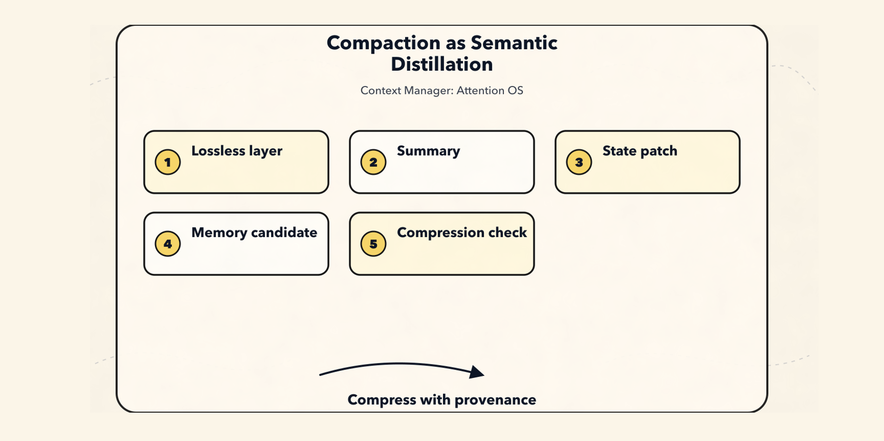

Long-running tasks will inevitably hit the context window.

Compression is not:

```text
Please summarize the conversation above.
```

Compression should be:

```text
Extract from the old context the information still needed for future action, and preserve its source relationships.
```

A good compaction should produce at least three kinds of output:

```text
1. Summary
   Compressed context for the model

2. State Patch
   Updates to the Agent's current state

3. Memory Candidate
   Candidate long-term memory, written to memory only after review
```

Do not mix these three into one blob of natural-language summary.

The most dangerous compression design is:

```text
Summarize the old messages, then delete the old history.
```

This turns the system's source of truth from inspectable events into a lossy natural-language paragraph.

A more robust design has two layers:

```text
Lossless layer:
  raw messages / raw events / raw tool outputs / artifacts

Lossy layer:
  summaries / state snapshots / branch summaries / memory notes
```

You can also think of it as a semantic distillation chain with audit boundaries:

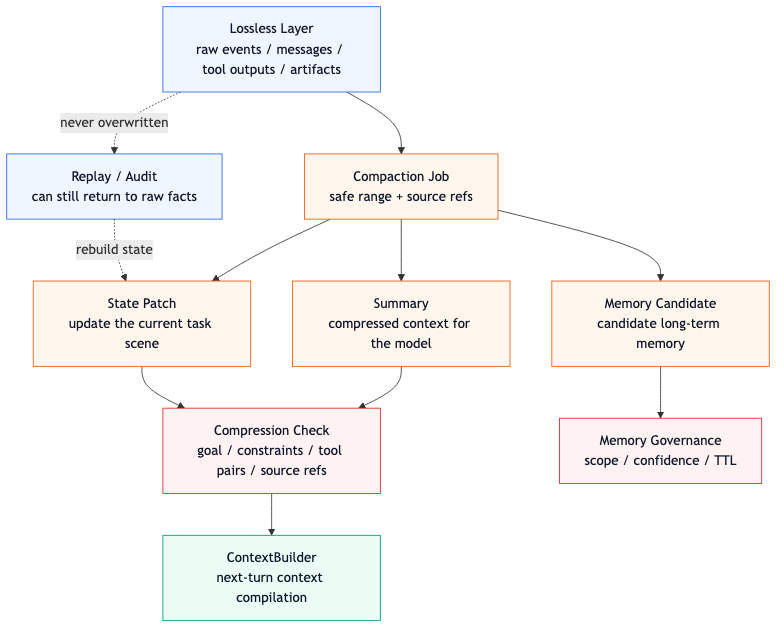

The principles are simple:

```text
Preserve raw events as much as possible.
The context sent to the model can be compressed.
A summary must have provenance.
A summary must not overwrite the raw transcript.
A summary must not split tool pairs.
After summarization, the task must still be executable.
```

A qualified compaction record should include at least these fields:

```yaml
compaction_id: cmp_123
session_id: sess_456
summarized_range:
  from_message_id: msg_001
  to_message_id: msg_120
first_kept_message_id: msg_121
tokens_before: 82000
tokens_after: 18000

goal:
  user_goal: "Fix the failing test and verify it."
  current_task: "Locate the failing assertion in serializer.test.ts."

constraints:
  hard:
    - "Do not modify the public API."
    - "Run the relevant tests after the change."

progress:
  done:
    - "The parser tests are already passing."
  in_progress:
    - "The serializer test is still failing."

files:
  read:
    - path: "src/parser.ts"
  modified:
    - path: "src/parser.ts"
      change_summary: "Fixed whitespace token handling."

tools:
  important_results:
    - tool_call_id: "tool_123"
      summary: "pnpm test --filter parser passed."
      artifact_ref: "artifact_789"

open_questions:
  - "Does serializer need to preserve spaces around the plus sign?"

next_steps:
  - "Read src/serializer.ts and the failing test."

provenance:
  source_event_ids: ["event_1", "event_2"]
  source_message_ids: ["msg_001", "msg_120"]
  summary_prompt_version: "v3"
```

After compression, you should also run a lightweight check:

```ts
type CompressionCheck = {
  preservesGoal: boolean;
  preservesConstraints: boolean;
  preservesCurrentPlan: boolean;
  preservesOpenToolPairs: boolean;
  preservesFileState: boolean;
  hasSourceRefs: boolean;
  estimatedInformationLoss: "low" | "medium" | "high";
};
```

Several hard rules can be written directly as tests:

```text
If the summary has no current_task, compression fails.
If the summary has no next_steps, compression fails.
If the compressed range includes a file write but the summary has no modified files, compression fails.
If the compressed range includes a tool error but the summary has no errors/retries, compression fails.
If a tool call/result pair is split, compression fails.
```

The goal of Compaction is not to "make the context shorter."

Its goal is to make the context shorter while the Agent still knows who it is, what it is doing, what it has already done, and where to go next.

## 8. Reasoning Trail: Store Evidence, Not Hidden CoT

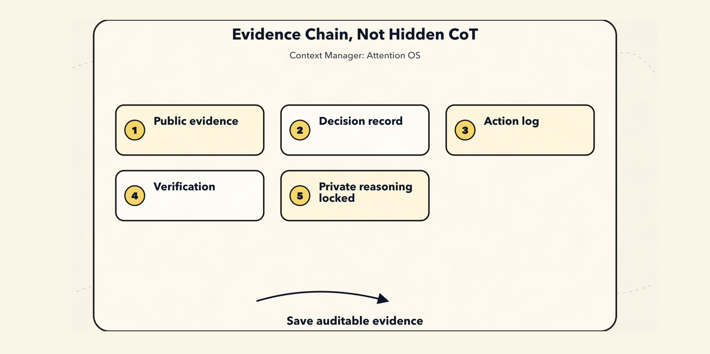

When we say “preserve the reasoning trail,” we need to avoid a misconception:

```text
Do not try to store the model’s hidden chain-of-thought.
```

What engineering actually needs to store is an auditable reasoning trace:

```ts
type ReasoningTrace = {
  traceId: string;
  sessionId: string;
  runId: string;

  userGoal: string;

  assumptions: Array<{
    assumption: string;
    sourceRefs?: string[];
    confidence: number;
  }>;

  decisionLog: Array<{
    decisionId: string;
    decision: string;
    rationaleSummary: string;
    alternatives?: string[];
    evidenceRefs: string[];
  }>;

  evidenceLog: Array<{
    evidenceId: string;
    kind: "tool_result" | "file" | "user_message" | "memory" | "test" | "observation";
    ref: string;
    summary: string;
  }>;

  actionLog: Array<{
    actionId: string;
    actionType: "message" | "tool_call" | "file_edit" | "memory_write" | "branch" | "compact";
    eventId: string;
    resultEventId?: string;
  }>;

  validationLog: Array<{
    check: string;
    result: "pass" | "fail" | "skipped";
    evidenceRefs?: string[];
  }>;
};
```

This lets you answer questions like:

```text
Why did the Agent call this tool?
Which file did this conclusion come from?
What was lost after which compaction?
Which branch introduced the error?
Which user constraint was violated?
Was the final answer backed by validation evidence?
```

These questions do not require hidden CoT.

They require events, evidence, decision summaries, operation records, and validation results.

## 9. Branches, Memory, Retrieval, and Subagents Cannot Bypass the Context Manager

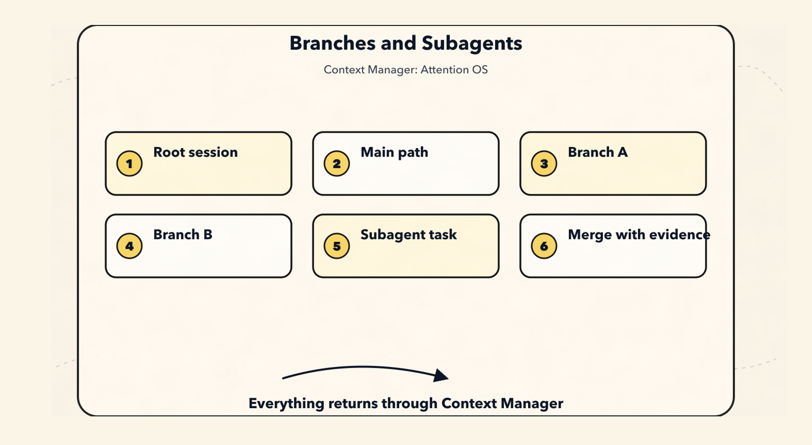

Many context systems spiral out of control later because external capabilities bypass the Context Manager.

Once long-term memory can enter the prompt directly, unverified experience becomes current fact.

Once retrieval results can enter the prompt directly, similar text becomes evidence.

Once a subagent can stuff a long report back into the main context, it recontaminates the isolated context.

So all three kinds of capabilities should enter model input through the same path:

```text
Memory / Retrieval / Subagent output
-> source refs
-> scope / trust / freshness check
-> artifact or state update
-> Context Builder
-> Model Input
```

Memory needs scope, confidence, TTL, and source refs.

Retrieval needs a query plan, citations, permission boundaries, and an audit snapshot.

A subagent should return a summary, evidence refs, artifacts, risks, and next steps, rather than just a line saying “I’m done.”

This is why the earlier topics of Memory Governance, Scoped Retrieval, and Delegation Runtime are not separate add-ons, but the surrounding vasculature of the Context Manager.

They ultimately all return to the same question:

```text
Can these materials enter the model context for this turn?
If so, with what priority, trust level, and budget?
If not, should they be saved as an artifact or audit event?
```

Complex tasks are also naturally nonlinear. Agents often need to:

```text
Try plan A
Fail
Roll back
Try plan B
Open a subagent to do research
Fork from an old state
Compare two results
```

So a session should natively support a tree structure:

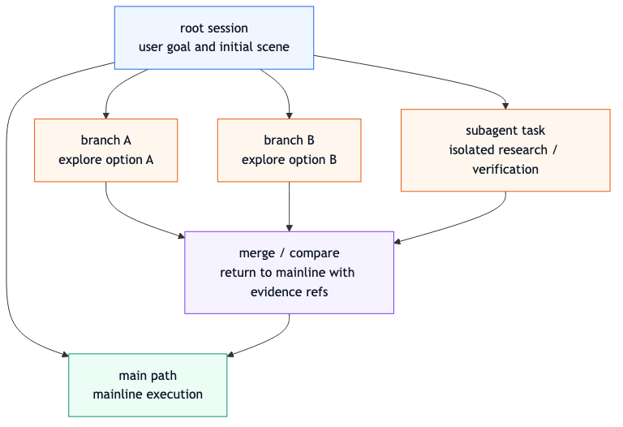

Recommended abstraction:

```ts
type SessionNode = {
  nodeId: string;
  sessionId: string;
  parentNodeId?: string;

  eventId: string;
  messageId?: string;

  branchType: "main" | "fork" | "subagent" | "what_if";
  branchSummary?: string;

  createdAt: string;
};
```

In one sentence:

> **Branches isolate exploration; subagents isolate context.**

## 10. Full Lifecycle: How a Request Flows Through the Context Manager

Putting these layers together, the lifecycle of a single request looks roughly like this:

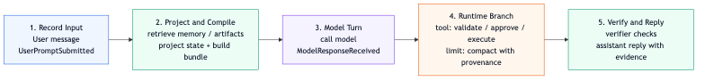

In this flow, the model is only one node.

It is not the sole state manager.

Nor is it the sole recorder of decisions.

The harness is responsible for placing the model's judgments back into an engineering system that is recoverable, auditable, and verifiable.

## 11. What the MVP Should Build First

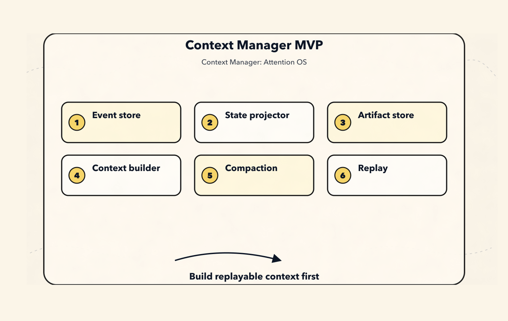

Do not try to build every module upfront.

An MVP for a local CLI Agent can start with:

```text
sessions
messages
events
state_snapshots
artifacts
compactions
```

You can leave these out for now:

```text
complex vector memory
multi-agent collaboration
automatic branch pruning
advanced evals
cross-project long-term memory
```

But the MVP should ideally preserve a few capabilities from the beginning:

```text
Write every user input to message + event.
Write every tool call to event.
Write large tool outputs as artifacts; keep only summaries and references in messages.
Build a ContextBundle before every model call.
Generate a structured summary once the token threshold is exceeded.
Ensure tool call/result pairs are not truncated.
Support resume.
Support JSONL export.
Support /context to inspect the current context composition.
Support /compact for manual compaction.
```

This keeps the system’s boundaries correct even while it is still small.

The first version of `ContextManager` can expose only this interface:

```ts
interface ContextManager {
  appendEvent(event: AgentEvent): Promise<void>;
  projectState(sessionId: string): Promise<AgentState>;
  buildContext(sessionId: string, input: BuildContextInput): Promise<ContextBundle>;
  compact(sessionId: string, policy?: CompressionPolicy): Promise<CompactionResult>;
  resume(sessionId: string, branchId?: string): Promise<AgentSession>;
}
```

The complexity can be hidden inside three pipelines:

```text
Event Pipeline:
  input / tool / model / system events -> append-only log

Projection Pipeline:
  events / messages / artifacts -> state snapshot

Context Pipeline:
  instructions + state + summary + recent messages + retrieval -> model context
```

This is already enough to support an evolvable Harness.

## 12. Key Engineering Invariants

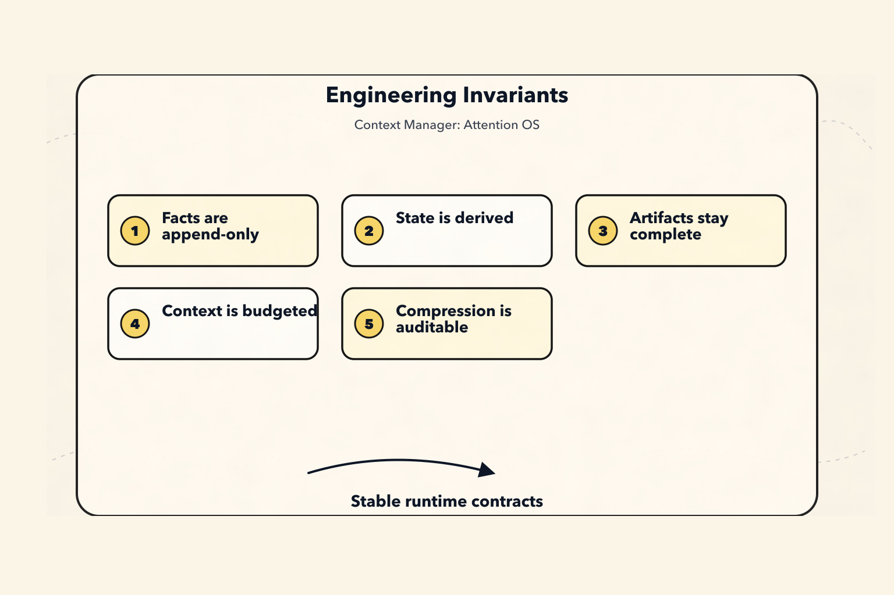

This paradigm ultimately has to land in tests.

The following invariants should be written directly into unit tests or a replay verifier:

```text
Invariant 1:
  Every tool_result must have a preceding tool_call.

Invariant 2:
  No pending tool_call can be removed by compaction.

Invariant 3:
  Every compaction summary must include source message range.

Invariant 4:
  Every file write event must be represented in state.artifacts or summary.files.modified.

Invariant 5:
  Current user request, active goal, and open questions must always be included in context.

Invariant 6:
  ContextBuilder output must be deterministic given same session state and retrieval result.

Invariant 7:
  Raw event log is append-only.

Invariant 8:
  Summary cannot overwrite raw transcript.

Invariant 9:
  Branch must not mutate ancestor branch.

Invariant 10:
  Memory writes require source refs.

Invariant 11:
  Long-term memory must have scope and expiry/update policy.

Invariant 12:
  ContextBundle must be explainable: every included segment should have reason and source.
```

These rules matter more than “writing a better prompt.”

Because they pull agent reliability back from model intuition into engineering constraints.

## 13. Common Anti-Patterns

### Anti-Pattern 1: `messages[]` Is the World

```text
All history lives in messages.
```

The problem is that it is hard to recover, compress, audit, branch, explain, and also hard to enforce permissions.

### Anti-Pattern 2: Summary Replaces History

```text
After compression, only the summary is kept; the original records are not.
```

The problem is that you cannot replay, correct, verify, or know what the summary dropped.

### Anti-Pattern 3: Memory Has No Scope

```text
All memories go into one vector database.
```

The problem is project contamination, user contamination, temporary facts becoming permanent, outdated knowledge being misused, and sensitive information spreading.

### Anti-Pattern 4: Tool Results Are Dumped Directly into Context

```text
Command output, full file contents, and logs are all stuffed into the prompt.
```

The problem is token explosion, too much noise, lost focus, and increased security risk.

### Anti-Pattern 5: Compression Is Only Natural-Language Summarization

```text
“Please summarize the conversation above.”
```

The problem is that goals, constraints, file state, errors, decisions, and next steps may all get compressed away.

### Anti-Pattern 6: Treating the Prompt as Policy

```text
Only saying in the system prompt not to do dangerous things.
```

The problem is that it is not verifiable, enforceable, auditable, or testable. Deterministic rules should live in policy, permissions, hooks, and validators, not just in the prompt.

## 14. Relationship to the Previous Chapters

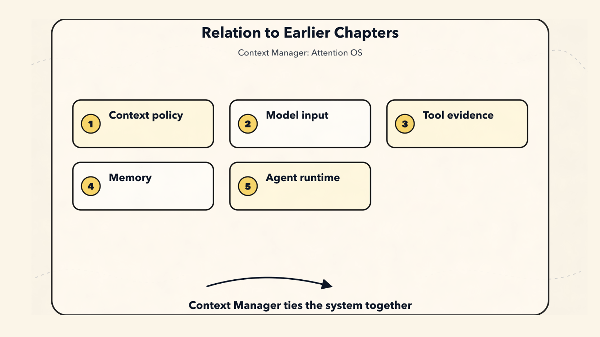

This chapter does not overturn the earlier ones. It places them back into a larger picture:

| Chapter | Role in the New Paradigm |
| --- | --- |
| 00-13 Tool Runtime | The producer of tool side effects and observations |
| 00-15 Context Policy | The projection strategy inside the Context Builder |
| 00-16 Session Replay | The recovery mechanism for the Event Log and State Projection |
| 00-19 Trace Analysis | A diagnostic view projected from the Event Log |
| 00-20 Memory Governance | Write governance before Memory enters the Context Builder |
| 00-21 Scoped Retrieval | Evidence governance before Retrieval enters the Context Builder |
| 00-23 Hosted Harness | Places sessions, events, artifacts, and sandboxes into a durable runtime |

So the new main thread can be remembered like this:

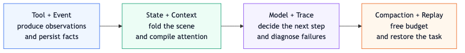

At this point, the Context Manager is no longer a prompt utility function.

It becomes the runtime hub of the Agent Harness.

To close the chapter in one sentence:

**The Context Manager is not a chat history manager. It is the operating system for an Agent’s attention, memory, and action boundaries.**

Once this boundary is established, long-running Agents finally have a foundation.

---

GitHub: [01-context-manager-attention-os.md](https://github.com/LienJack/learn-agent/blob/main/src/content/blog/en/AI/agent-design-paradigms/01-context-manager-attention-os.md)
