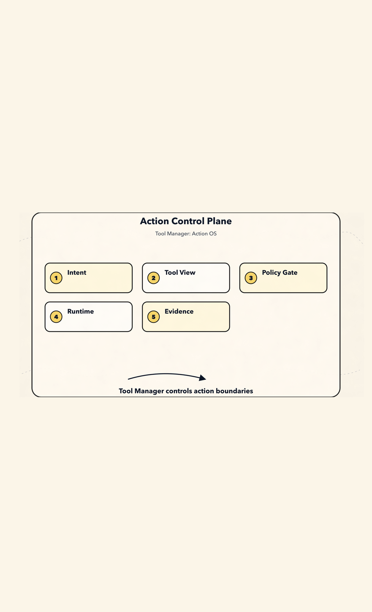
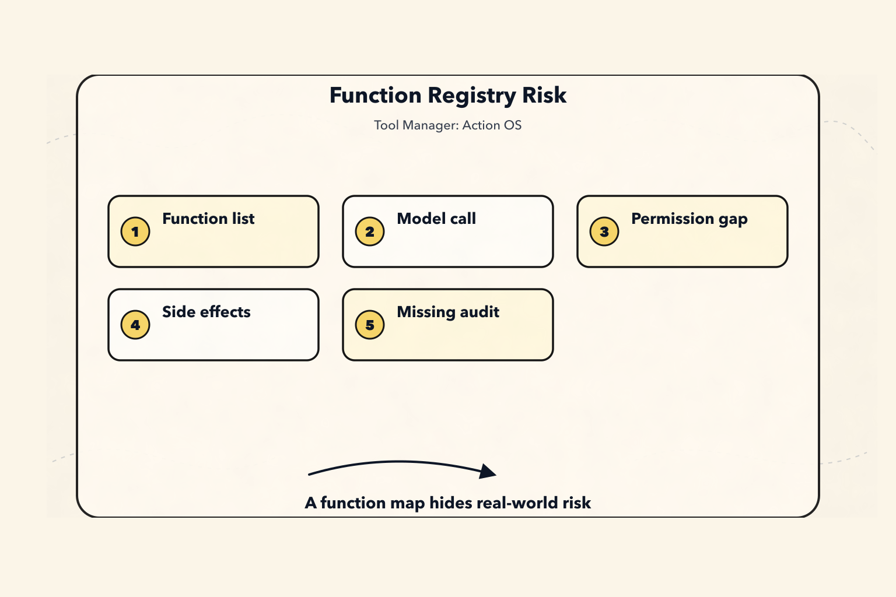
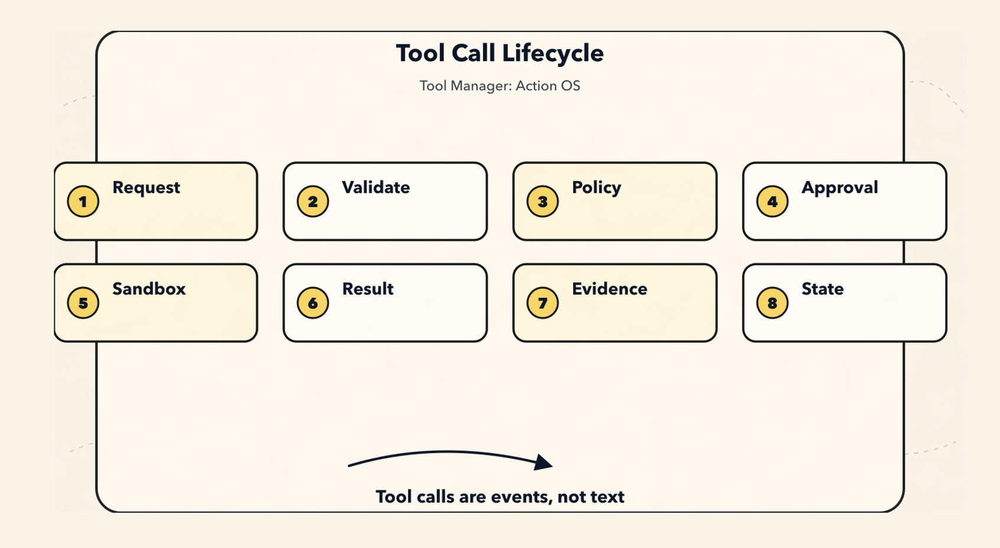
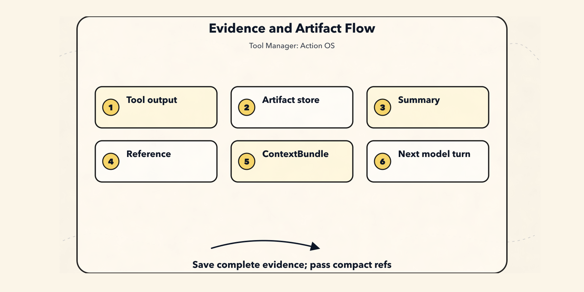
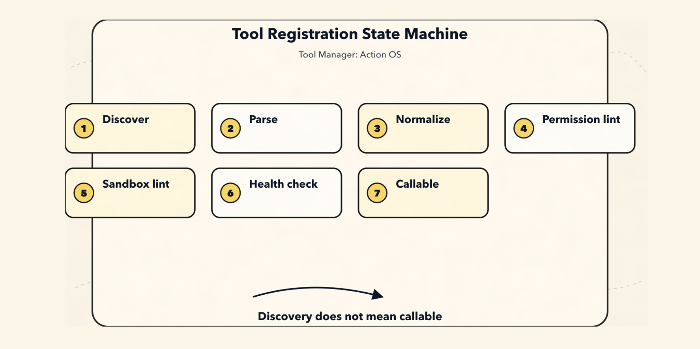
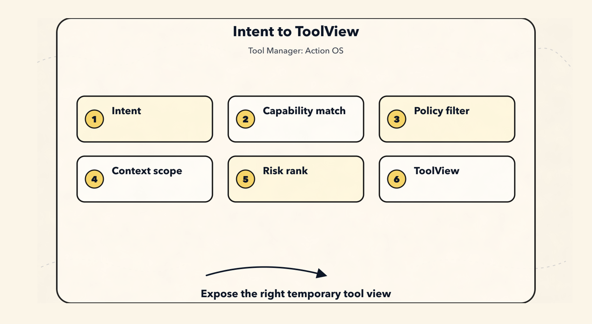
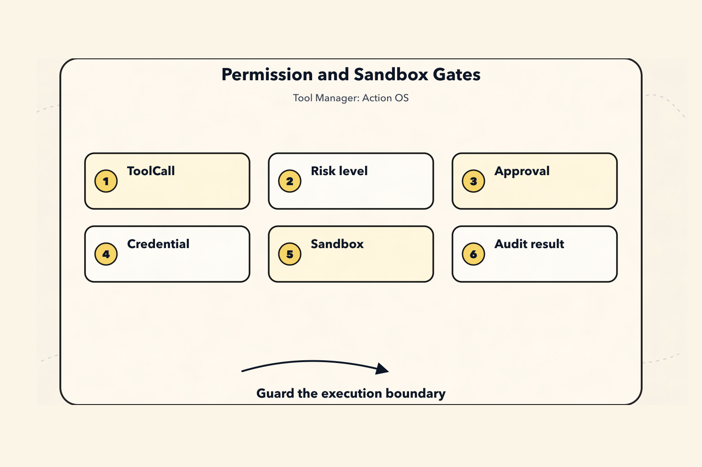
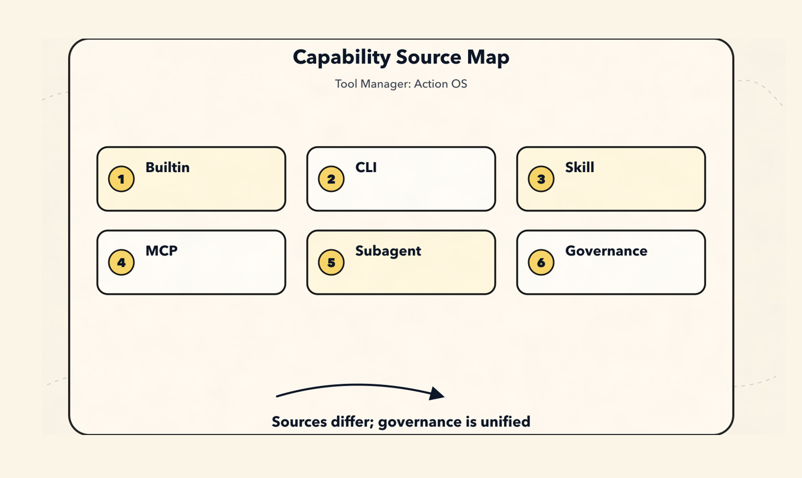
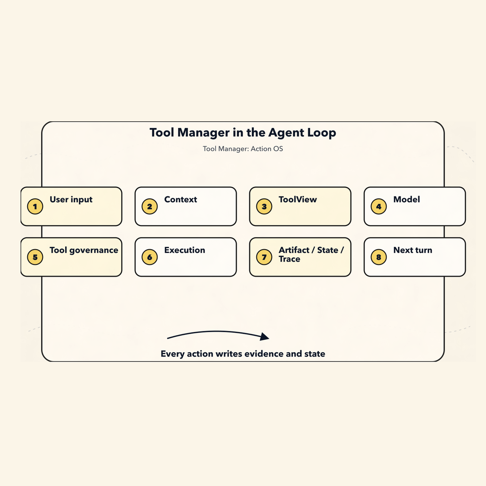
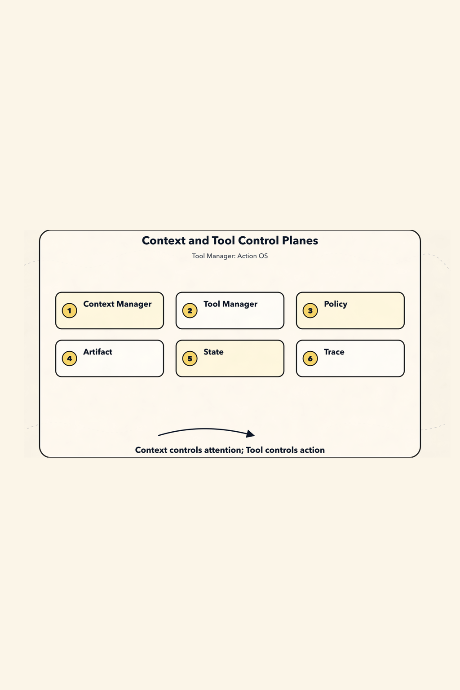

# Tool Manager as a New Paradigm: The Agent’s Action Operating System

If Chapter 1, [Context Manager](/blog/AI/agent-design-paradigms/01-context-manager-attention-os), answered:

> What should the Agent know in this turn?

And Chapter 2, [Long-Term Memory and Self-Optimization](/blog/AI/agent-design-paradigms/02-agent-long-term-memory-self-upgrade), answered:

> How does an Agent distill experience into memory, skills, and evaluable upgrades?

Then Chapter 3 answers another equally fundamental question:

> When an Agent wants to act, how does the system turn that intent into real actions that are controllable, auditable, and recoverable?

Here is the core point up front:

> **An Agent Tool Manager is not a function registry, but an action governance layer built around capability, intent, permissions, environment, credentials, execution, side effects, and auditability.**

In other words, what the Tool Manager manages is not:

```text
What functions are available to call?
```

But rather:

```text
Given the Agent's current intent, permissions, environment, budget, and risk,
what capabilities can it use?
Why should it use them?
Under whose identity?
In which sandbox?
Which resources will be affected?
Whose approval is required?
How will the result be verified?
What evidence will be produced?
Should state, memory, or context be updated afterward?
```

A more stable definition is:

```text
ToolCall_t = f(
  Intent,
  Capability,
  Policy,
  Principal,
  Credentials,
  Environment,
  State,
  Sandbox,
  Budget,
  Approval,
  Evidence
)
```

So the Tool Manager is not a “tool list”; it is the Agent’s **Action Operating System**.



We will continue using the example from this series: a CLI Agent is fixing a test failure. It needs to read files, search code, run tests, modify code, and validate again. Once these actions start touching real files, real commands, real networks, and real accounts, the Tool Manager can no longer be just `name + schema + handler`.

First, establish a boundary:

```text
The Agent does not directly own tools.
In a given turn, for a given intent and permission scope,
the Agent receives only a temporary view of available capabilities.
```

The model can propose actions.

The Planner can organize intent.

Only the Tool Manager is responsible for translating “wanting to act” into “being allowed to act in a particular way.”

If these three responsibilities are mixed together, the system quickly degrades into:

```text
Whatever the model wants to do, find a tool and do it.
```

The new paradigm instead says:

```text
The model can only propose calls within the compiled capability lease.
Real execution must pass through deterministic runtime boundaries.
```

## 1. Defining Tools from First Principles

Many Agent demos understand a tool as:

```text
name + description + JSON schema + function handler
```

That is enough to run a demo, but not enough to support complex tasks.

Once things become truly complex, a tool becomes a set of capabilities with side effects, permissions, runtime environments, and audit requirements.

A more stable definition is:

```text
Tool = Capability Contract + Invocation Protocol + Execution Boundary + Evidence Producer
```

In other words:

```text
A Tool is an external capability contract invoked by an Agent.
It describes:
  what it can do
  when it should be used
  what the input is
  what the output is
  what it reads and writes
  whether it has side effects
  what permissions it requires
  where it executes
  how to verify the result
  how to audit and replay it
```

This carries forward the most important principle from the previous chapter:

> **The context sent to the model is only a temporary compiled view; it cannot become the source of truth.**

Likewise, the tool schema sent to the model is only a “capability view” for a single model call, not the complete tool truth in the system.

Internally, the system should keep the canonical registry, permissions, credentials, run records, artifacts, and traces, then dynamically compile them for the model based on the current task.

In one sentence:

> **A Tool Schema is a compiled artifact, not the Tool itself.**

## 2. First, Why the Old Model Is Not Enough

The most naive tool system usually looks like this:

```ts
const tools = {
  read_file,
  write_file,
  bash,
  search_web,
  call_api,
};
```

Then every round passes all these tools to the model:

```ts
const response = await model.call({
  messages,
  tools,
});

if (response.toolCall) {
  const result = await tools[response.toolCall.name](response.toolCall.args);
  messages.push(result);
}
```

This code is easy to understand.

That is also exactly where the problem lies: it treats tool invocation as an ordinary function call.



In a “fix the failing tests” task, tool invocations might include:

```text
Read files
Search code
Run tests
Modify files
Generate diffs
Access the network
Read environment variables
Execute shell commands
Call an MCP server
Delegate to a subagent
Submit a PR
Create an issue
Send messages
Deploy a service
Delete resources
```

These actions carry completely different levels of risk.

Both `read_file` and `rm -rf` may appear through the shell.

Both `github.search_issue` and `github.create_issue` may come from the same GitHub client.

A script inside a `skill` may read and write local files, or it may access the network.

If the system only sees them as functions, it becomes difficult to answer these questions:

```text
Why call this tool?
Why not another tool?
Does this call exceed the user's intent?
Have the parameters been validated?
Which resources will it read?
Which resources will it write?
Could it send user data externally?
Which identity and scope does it use?
Does it require user approval?
Which sandbox does it run in?
Where is the full result stored?
How does this call affect state, memory, and context?
```

So the first boundary of a Tool Manager is:

```text
Do not design tools as a function map.
Design tools as a governance protocol before actions enter the real world.
```

## 3. New Paradigm: The Tool Manager Is the Action Control Plane

The wrong paradigm is:

```text
The model sees all tools.
The model decides which tool to call.
The runtime executes the function.
The result becomes the next message.
```

This design is fast early on, but later it runs into a pile of problems:

```text
Permissions rely on prompts and cannot be enforced.
Tools are too coarse, and intent is unclear.
Side effects are invisible.
Credentials are scattered across environment variables.
Tool results directly pollute the context.
There is no way to audit why a call was made.
There is no way to know the state difference before and after a call.
There is no way to support dry-run, approval, or rollback.
There is no way to distinguish read, write, external_write, and destructive.
There is no way to adapt to multiple sources such as CLI, Skill, MCP, API, and subagent.
```

A more stable layering looks like this:

```text
Source-of-truth layer
  Tool Registry
  Tool Versions
  Permission Grants
  Credential Bindings
  Runtime Config
  Tool Events
  Tool Artifacts

        ↓ resolve / filter / redact / compile

Model-visible layer
  Tool Names
  Tool Descriptions
  JSON Schemas
  Intent Hints
  Policy Hints
  Risk Hints
  Required Approval Hints
  Output Projection Rules
  Short Output Preview

        ↓ model proposes call

Execution control layer
  Arg Validation
  Policy Check
  Approval
  Sandbox
  Credential Broker
  Runtime Adapter
  Verifier

        ↓ result projection

State semantics layer
  State Patch
  Evidence
  Trace
  Memory Candidate
  Context Update
```

Of these layers, only the “model-visible layer” is sent to the model.

Everything else belongs to the Harness runtime control plane.

So:

> **The essence of a Tool Manager is turning the model’s “I want to do something” into real action that is validated, authorized, isolated, and auditable.**

This is very similar to the layering of a Context Manager:

```text
Tool Registry / Events / Artifacts are the source of truth.
Tool Candidate / Tool View are semantic projections.
Tool Schema / Provider Payload are one-time compiled artifacts.
```

In one sentence:

> **The tool list sent to the model is only a temporary view, not the actual boundary of system capabilities.**

More precisely, ToolView is like a short-term capability lease:

```text
For this model call, at this stage of the task,
which tools it can see,
why it can see them,
what constraints must be satisfied when calling them,
and how much of the result may return to the context.
```

It is neither permanent authorization nor full permission.

After the next round changes state, permissions, budget, risk, or user intent, the ToolView should be resolved and compiled again.

## IV. Twelve Long-Term Stable Principles for Tool Manager

This section can be condensed directly into twelve engineering principles.

### Principle 1: A Tool Is a Capability Contract, Not a Function

A function only explains how to execute.

A Tool must also explain:

```text
Purpose
Boundaries
Permissions
Risks
Side effects
Inputs and outputs
Retryability
Idempotency
Resource access
Execution environment
Result validation method
```

Without these fields, a so-called tool is just a function calling wrapper.

### Principle 2: Intent and Tool Implementation Must Be Separated

The user says:

```text
Help me fix this bug.
```

This does not mean the system should immediately call:

```text
bash("npm test")
edit_file(...)
git commit
```

There should be explicit intent layering in between:

```text
UserIntent
  What the user wants to achieve

TaskIntent
  What the current task is

ActionIntent
  What category the next action belongs to

ToolIntent
  Why a specific tool is needed

ToolCall
  Which tool is actually called, and with what arguments
```

This allows the system to answer:

```text
Why call this tool?
Why not use another tool?
Does this tool call exceed the user's intent?
Should it read first, then write?
Is approval required?
```

### Principle 3: A Tool Call Is a Causal Event, Not Ordinary Text

A tool call may read or write files, access the network, spend money, send messages, deploy services, delete resources, or expose private data.

So it must enter the event log and trace, rather than existing only as an attached field on an assistant message.

A more robust path is:

```text
ToolCallRequested
  -> ToolArgsValidated
    -> ToolPolicyChecked
      -> ApprovalRequested?
        -> ApprovalGranted?
          -> ToolCallStarted
            -> ToolCallFinished
              -> ToolResultValidated
                -> ArtifactPersisted
                  -> StateUpdated
                    -> TraceUpdated
```

This path can later be used for auditing, replay, recovery, retrospectives, and evals.



### Principle 4: Permissions, Sandboxes, Hooks, and Validators Are Deterministic Boundaries

Do not only write this in the system prompt:

```text
Do not execute dangerous commands.
Do not leak secrets.
Do not delete files.
```

That is not enough.

There should be:

```text
Policy Engine
Permission Grant
Sandbox Runtime
Credential Broker
PreToolUse Hook
PostToolUse Hook
Verifier
Audit Log
```

A prompt can express expectations.

The runtime must be responsible for enforcement.

### Principle 5: Tool Results Are Evidence, Not a Context Dumpster

Large outputs should not be shoved directly into the prompt:

```text
Full logs
Full web pages
Full files
Full SQL query results
Full test output
Full diff
Full screenshot OCR
```

The correct pattern is:

```text
Full output -> Artifact Store
Key facts -> Tool Result Preview
Citable snippets -> Evidence Ref
Information needed right now -> ContextBundle
```

Context Manager controls what the model should see in the next turn.

Tool Manager controls how tool results become evidence.

Artifact Manager controls where full outputs are stored.

The three must not be mixed into a single `messages[]`.



### Principle 6: Tool Registry Is the Source of Truth, Tool View Is a Compiled Artifact

Internally, there should be a stable canonical tool model:

```text
Canonical Tool Descriptor
  ↓ adapter
OpenAI tool schema
Anthropic tool schema
MCP tool schema
CLI command schema
Skill activation schema
Internal function call
```

Do not bind the core structure to a specific model vendor's function calling format.

A more robust approach is:

```text
Canonical Internal Model
  ↓ adapter
Provider-specific Payload
```

### Principle 7: Read, Write, External Side Effect, and Destructive Must Be Separated

Do not design catch-all tools like these:

```text
github_api(method, path, body)
database_query(sql)
shell(command)
browser(action, selector)
```

A more robust design is:

```text
github.search_issues       read
github.create_issue        external_write
github.close_issue         destructive-ish

db.select                  read
db.update                  write
db.drop_table              destructive

file.read                  read
file.write                 workspace_write
file.delete                destructive
```

Different risks require different approvals, different audit trails, and different tool descriptions.

### Principle 8: Credentials Are Not Context and Must Be Managed by a Credential Broker

The model should not see:

```text
API token
OAuth refresh token
SSH key
database password
cookie
session secret
```

The model should only see:

```text
which principal this tool can act on behalf of, and what it can do.
what scopes are currently available.
whether reauthorization is required.
```

Credentials go into the runtime.

Credential references go into the tool call.

Plaintext credentials must not enter prompts, messages, tool results, or artifact previews.

### Principle 9: Tool Metadata Needs Evals

Tool names, descriptions, and parameter explanations directly affect when the model chooses a tool and how it fills in arguments.

So each tool should include:

```text
golden prompts
negative prompts
expected tool choice
expected args
precision / recall
argument validity
unsafe call rate
approval trigger rate
```

A tool description is not copywriting. It is the control surface for model tool selection.

### Principle 10: CLI, Skill, and MCP Are Different Layers and Should Not Be Collapsed into One Category

They are not the same thing:

```text
CLI    is an execution form / runtime adapter
Skill  is a procedural knowledge package / workflow package
MCP    is an interoperability protocol for tools and context capabilities
```

They can all enter the Tool Manager, but they enter at different points:

```text
CLI enters the Execution Adapter.
Skill enters Intent / Procedure / Context Activation.
MCP enters Capability Discovery / Protocol Adapter.
```

### Principle 11: Subagent / Handoff Is Also a Tool-Like Capability

When an Agent hands a task to another Agent, it is essentially also a controlled invocation:

```text
input schema
output schema
allowed context
allowed tools
budget
timeout
permission
summary result
trace
```

A good subagent call should look like this:

```text
The main Agent provides the goal, constraints, and evidence references.
The Subagent works in an isolated context.
The Subagent returns only the summary, result, artifacts, and risks.
The main Agent does not inherit all intermediate noise.
```

### Principle 12: The Tool Manager Must Be Replayable, Explainable, and Reversible

The system should be able to answer:

```text
Why did the Agent call this tool?
Which tools did the model see before the call?
Which tools were filtered out by policy?
Who generated this parameter?
Was it approved by the user?
Which identity and scope were used?
Which sandbox did it run in?
Which resources were read and written?
Where is the complete output?
Was the result accepted by the verifier?
How did this call affect state / memory / artifact?
```

If these questions cannot be answered, the Agent’s actions have not yet been truly engineered.

## 5. A Stable Tool Ontology

A mature Tool Manager should at least distinguish between these objects:

```text
ToolSource        Tool source: builtin / cli / skill / mcp / http / subagent
ToolDescriptor    Tool capability contract
ToolRegistration  Tool registration state
ToolVersion       Tool version
ToolIntent        Tool usage intent
ToolCandidate     Candidate tool
ToolView          Tool view compiled for the model
ToolCall          A single tool call
ToolResult        Tool result
ToolArtifact      Complete output and evidence
ToolPolicy        Permissions, risk, budget, and safety rules
PermissionGrant   Authorization record
CredentialBinding Credential binding
SandboxPolicy     Execution isolation policy
ToolTrace         Auditable trace
ToolEval          Evaluation of tool selection and execution quality
```

These objects have different responsibilities and must not all be mixed into a single:

```ts
const tools = [];
```

array.

## 6. ToolDescriptor: Capability Contract

`ToolDescriptor` is the most central object in the Tool Manager.

It is not the final schema shown to the model, but the system's internal canonical descriptor.

A minimal set of fields can be designed like this first:

```ts
type ToolDescriptor = {
  toolId: string;
  canonicalName: string;
  displayName: string;
  version: string;

  source: {
    type: "builtin" | "cli" | "skill" | "mcp" | "http" | "subagent";
    sourceId: string;
    packageName?: string;
    serverId?: string;
    command?: string;
    uri?: string;
  };

  lifecycle: {
    status: "discovered" | "verified" | "enabled" | "disabled" | "deprecated" | "blocked";
    registeredAt: string;
    updatedAt: string;
    owner?: string;
  };

  description: {
    summary: string;
    useWhen: string[];
    doNotUseWhen: string[];
    examples?: Array<{
      userRequest: string;
      expectedArgs: unknown;
    }>;
  };

  intent: {
    actionTypes: ActionType[];
    domains: string[];
    requiredUserIntent?: string[];
    negativeIntentHints?: string[];
  };

  schemas: {
    inputSchema: JSONSchema;
    outputSchema?: JSONSchema;
    errorSchema?: JSONSchema;
  };

  effects: {
    reads: ResourcePattern[];
    writes: ResourcePattern[];
    deletes?: ResourcePattern[];
    externalCalls: boolean;
    sendsUserData: boolean;
    mutatesState: boolean;
    idempotent: boolean;
    reversible: boolean;
    dryRunSupported: boolean;
  };

  risk: {
    level: "low" | "medium" | "high" | "critical";
    destructive: boolean;
    openWorld: boolean;
    financialCost?: "none" | "low" | "metered" | "unknown";
    privacyRisk?: "none" | "low" | "medium" | "high";
  };

  permissions: {
    approvalPolicy: "never" | "on_request" | "on_risk" | "always";
    requiredScopes: string[];
    allowedPrincipals?: string[];
    blockedPrincipals?: string[];
    tenantBoundary?: "user" | "org" | "workspace" | "project";
  };

  sandbox: {
    mode:
      | "none"
      | "read_only"
      | "workspace_write"
      | "network_restricted"
      | "container"
      | "vm"
      | "remote_api";
    filesystem?: {
      readRoots: string[];
      writeRoots: string[];
      blockedPaths: string[];
    };
    network?: {
      allowDomains: string[];
      denyDomains: string[];
      egressPolicy: "none" | "allowlist" | "open";
    };
    limits?: {
      timeoutMs: number;
      maxMemoryMb?: number;
      maxOutputBytes?: number;
      maxCostUsd?: number;
    };
  };

  credentials: {
    strategy: "none" | "system" | "user_oauth" | "service_account" | "delegated";
    requiredSecrets?: string[];
    tokenAudience?: string;
    scopeCheckRequired: boolean;
  };

  contextPolicy: {
    exposeToModel: boolean;
    exposeOutputToModel: "none" | "preview" | "structured" | "full";
    maxOutputPreviewTokens: number;
    redactionPolicy?: string;
  };

  execution: {
    adapter: string;
    timeoutMs: number;
    retryPolicy: {
      maxRetries: number;
      retryOn: string[];
      backoffMs?: number;
    };
  };

  hooks: {
    preCall?: string[];
    postCall?: string[];
    verifier?: string[];
    onError?: string[];
  };

  observability: {
    logArgs: boolean;
    logResultPreview: boolean;
    auditLevel: "none" | "basic" | "full";
  };

  provenance: {
    manifestHash?: string;
    signature?: string;
    sourceRefs?: string[];
    trustLevel: "first_party" | "workspace" | "third_party" | "untrusted";
  };
};
```

The most important fields here are:

```text
effects
risk
permissions
sandbox
credentials
contextPolicy
```

Without these fields, the Tool Manager degrades into a registry for utility functions.

## 7. ActionType: Unified Action Classification

`ActionType` directly affects permissions and approvals.

Start with a stable enum:

```ts
type ActionType =
  | "read"
  | "search"
  | "inspect"
  | "compute"
  | "transform"
  | "generate"
  | "write"
  | "patch"
  | "execute"
  | "deploy"
  | "external_send"
  | "purchase"
  | "delete"
  | "admin"
  | "auth"
  | "memory_read"
  | "memory_write"
  | "subagent_delegate";
```

A rough layering could look like this:

```text
read / search / inspect
  Usually low risk and can be executed automatically.

compute / transform / generate
  Low to medium risk, depending on whether they read/write files and whether they access the network.

write / patch
  Requires workspace permissions, and important diffs must be visible.

external_send
  Sends information to an external system, so it should require user confirmation by default.

delete / admin / purchase / deploy
  High risk, with strong approval required by default.

auth
  Never let the model handle secrets directly.
```

The value of this step is that it gives the system a stable language of risk beyond the tool name.

## 8. ToolIntent: Why Use a Tool

`ToolIntent` stores the public reason for a tool call.

It is not a hidden chain of thought, but an auditable summary of action.

```ts
type ToolIntent = {
  intentId: string;
  sessionId: string;
  runId: string;

  userGoal: string;
  currentTask: string;

  actionType: ActionType;
  target?: {
    kind: "file" | "repo" | "url" | "api" | "database" | "calendar" | "email" | "memory" | "agent";
    ref: string;
  };

  expectedEffect: {
    read?: string[];
    write?: string[];
    externalSideEffect?: boolean;
    userVisibleSideEffect?: boolean;
  };

  constraints: {
    mustNot?: string[];
    requireConfirmation?: boolean;
    maxCostUsd?: number;
    deadlineMs?: number;
  };

  rationaleSummary: string;
  evidenceRefs: string[];
  confidence: number;

  createdAt: string;
};
```

For example:

```yaml
userGoal: "Fix the failing test and verify it"
currentTask: "Confirm why serializer.test.ts is failing"
actionType: "execute"
target:
  kind: "repo"
  ref: "workspace"
expectedEffect:
  read:
    - "workspace.files"
  write:
    - "coverage or temp outputs"
rationaleSummary: "Run the relevant test to confirm whether the current failure is reproducible and collect the error output"
```

With `ToolIntent`, the Tool Manager can turn “the model wants to run tests” into “which test command is allowed under the current permissions, which workspace it should run in, and how the output should be saved.”

## 9. ToolCall and ToolResult Cannot Be Just Strings

A real tool call should at least look like this:

```ts
type ToolCall = {
  toolCallId: string;
  sessionId: string;
  runId: string;
  parentEventId?: string;

  intentId?: string;
  toolId: string;
  toolVersion: string;

  proposedBy: "model" | "planner" | "user" | "system" | "subagent";
  args: unknown;
  resolvedArgs?: unknown;

  prediction: {
    expectedReads: ResourceRef[];
    expectedWrites: ResourceRef[];
    expectedExternalCalls: string[];
    expectedCostUsd?: number;
  };

  authorization: {
    status: "not_required" | "pending" | "granted" | "denied" | "expired";
    grantId?: string;
    approvalPrompt?: string;
    approvedBy?: string;
    approvedAt?: string;
  };

  runtime: {
    adapter: string;
    sandboxId?: string;
    credentialBindingId?: string;
    timeoutMs: number;
    idempotencyKey?: string;
  };

  status:
    | "draft"
    | "validated"
    | "blocked"
    | "approved"
    | "running"
    | "success"
    | "failed"
    | "cancelled";

  createdAt: string;
  startedAt?: string;
  finishedAt?: string;
};
```

The corresponding `ToolResult` also should not be just a piece of `content`:

```ts
type ToolResult = {
  toolCallId: string;
  status: "success" | "error" | "partial" | "cancelled";

  structuredOutput?: unknown;
  outputPreview?: string;

  artifacts: Array<{
    artifactId: string;
    kind: "tool_output" | "file" | "diff" | "screenshot" | "log" | "dataset";
    uri: string;
    contentHash?: string;
    summary?: string;
  }>;

  effectsObserved: {
    reads: ResourceRef[];
    writes: ResourceRef[];
    deletes?: ResourceRef[];
    externalCalls: string[];
    costUsd?: number;
  };

  verifier?: {
    status: "passed" | "failed" | "skipped";
    checks: Array<{
      name: string;
      result: "pass" | "fail" | "warn";
      message?: string;
    }>;
  };

  error?: {
    code: string;
    message: string;
    retryable: boolean;
    safeToShowUser: boolean;
  };

  usage?: {
    latencyMs: number;
    outputBytes?: number;
    tokensAddedToContext?: number;
  };

  provenance: {
    eventId: string;
    artifactRefs: string[];
  };
};
```

The point here is not having more fields.

The point is that `ToolResult` expresses three things at once:

```text
What was the result of the tool execution?
What side effects occurred in the real world?
What evidence should go into the artifact, state, trace, and next-round context?
```

## 10. Tool Registration Is Not `registerTool(fn)`

Registration is not as simple as:

```ts
registerTool("bash", bashHandler);
```

A more robust flow is:

```text
Discover
  -> Parse Manifest
    -> Validate Schema
      -> Normalize to Canonical Descriptor
        -> Permission Lint
          -> Sandbox Lint
            -> Security Review
              -> Dry Run / Health Check
                -> Golden Prompt Eval
                  -> Enable
```

Recommended registration state machine:

```text
discovered
  -> parsed
    -> normalized
      -> verified
        -> enabled
          -> granted
            -> callable
```

Failure states should also be explicit:

```text
invalid_schema
permission_lint_failed
sandbox_lint_failed
security_review_required
health_check_failed
blocked
deprecated
```

MCP servers, third-party Skills, and local CLI commands in particular should not be “discovered and immediately callable.”

Discovery only means the tool has been seen.

Only after validation is it enabled.

Only after authorization is it callable.



## 11. Resolving Intent to Tools

Do not expose every tool to the model.

On each turn, the model should see only a small set of tools that are relevant to the current task, allowed by the current permissions, executable in the current environment, affordable within the current budget, and acceptable in terms of risk.

Recommended resolution chain:

```text
Intent
  -> Capability Match
    -> Policy Filter
      -> Context Filter
        -> Risk Ranking
          -> Tool Candidate Set
            -> Tool View
```

Pseudocode:

```ts
async function resolveTools(intent: ActionIntent, state: AgentState) {
  const capabilities = await registry.findByActionType(intent.actionType);

  const policyAllowed = capabilities.filter((tool) =>
    policy.canExpose(tool, {
      user: state.user,
      workspace: state.workspace,
      task: state.currentTask,
    })
  );

  const relevant = ranker.rank(policyAllowed, {
    intent,
    state,
    recentFailures: state.toolFailures,
    availableCredentials: state.credentials,
  });

  return relevant.slice(0, state.toolBudget.maxToolsVisible);
}
```

There is a very important boundary here:

```text
The model is not freely choosing from the entire tool library.
The model proposes actions within the ToolView compiled by the Tool Manager.
```



## 12. Permission Model: Approval Is Not a Popup, but a Contract

Permissions can first be divided into six levels:

```text
L0: pure_read
  Read-only, with no external side effects.
  Examples: read_file, list_dir, inspect_state.

L1: local_compute
  Local computation that does not write to the workspace.
  Examples: parse_json, run_formatter_check, calculate.

L2: workspace_write
  Modifies the current workspace.
  Examples: write_file, apply_patch.

L3: external_read
  Reads external services or user data.
  Examples: read_github_issue, fetch_calendar.

L4: external_write
  Produces visible side effects in external systems.
  Examples: send_email, create_issue, post_message.

L5: destructive_or_admin
  Deletion, deployment, purchases, permission changes, data migrations.
  Examples: delete_bucket, deploy_prod, rotate_secret, charge_card.
```

Default policy:

```text
L0 can be executed automatically.
L1 can be executed automatically, but is constrained by the sandbox.
L2 requires workspace_write permission, and important diffs must be confirmed.
L3 requires a scope, and sensitive data must be redacted.
L4 requires user confirmation by default.
L5 requires strong confirmation, dry-run, and secondary verification by default.
```

A single approval should not be just an “allow or deny” popup.

It should be a contract:

```ts
type ApprovalRequest = {
  approvalId: string;
  toolCallId: string;

  summary: string;
  rationaleSummary: string;

  tool: {
    name: string;
    version: string;
  };

  argsPreview: unknown;

  effectsPreview: {
    reads: ResourceRef[];
    writes: ResourceRef[];
    externalCalls: string[];
    userVisibleSideEffect: boolean;
  };

  credentialPreview: {
    principal: string;
    scopes: string[];
  };

  risk: {
    level: "low" | "medium" | "high" | "critical";
    reasons: string[];
  };

  options: {
    allowOnce: boolean;
    allowForSession: boolean;
    alwaysAllowThisTool?: boolean;
    deny: boolean;
  };

  expiresAt: string;
};
```

Several invariants should be hard-coded directly:

```text
The parameters shown in approval must match the parameters actually executed.
Execution cannot continue after approval expires.
Approval becomes invalid when the scope changes.
Approval becomes invalid when the risk level changes.
```

Otherwise, approval is just psychological comfort.



## 13. Sandbox Model: Limit Execution, Not Language

A sandbox is not just about “whether commands can be executed.”

It includes at least:

```text
filesystem
network
environment variables
credentials
process
resource limits
output limits
time limits
egress policy
audit log
```

Recommended fields:

```ts
type SandboxPolicy = {
  sandboxId: string;
  mode:
    | "read_only"
    | "workspace_write"
    | "network_restricted"
    | "container"
    | "vm"
    | "remote_api";

  filesystem: {
    cwd: string;
    readRoots: string[];
    writeRoots: string[];
    blockedPaths: string[];
    tempDir: string;
    persistOutputs: boolean;
  };

  network: {
    egress: "none" | "allowlist" | "open";
    allowDomains: string[];
    denyPrivateNetworks: boolean;
  };

  environment: {
    inheritedEnv: string[];
    injectedEnv: string[];
    secretEnvAllowed: boolean;
  };

  process: {
    timeoutMs: number;
    maxMemoryMb: number;
    maxStdoutBytes: number;
    maxStderrBytes: number;
  };

  audit: {
    recordCommand: boolean;
    recordFileAccess: boolean;
    recordNetworkAccess: boolean;
  };
};
```

Be especially careful with local CLIs and local MCP servers.

Because they are not just “tool calls”; they are local code execution or proxies for local capabilities.

In one sentence:

> **Prompt is responsible for expressing boundaries; Sandbox is responsible for enforcing them.**

## 14. Where CLI, Skills, MCP, and Subagents Fit

These categories are often conflated.

A more robust breakdown is:

| Form | Essence | Position in the Tool Manager | Best suited for | Key risks |
| --- | --- | --- | --- | --- |
| Builtin Tool | Runtime built-in function | native adapter | Reading/writing state, basic file operations, internal retrieval | Permission bypass |
| CLI Tool | Local command execution form | execution adapter | Compilation, testing, linting, git, scripts | Shell injection, unauthorized file access, unauthorized network access |
| Skill | Procedural knowledge package / workflow package | intent + context activation + optional scripts | Teaching the Agent how to complete a class of tasks | Treating instructions as permissions |
| MCP | Interoperability protocol for tools, resources, and prompts | capability discovery + protocol adapter | Integrating external systems, tool services, data sources | Blindly trusting servers, confused scope |
| Subagent / Handoff | Delegation to a specialized Agent | tool-like delegation adapter | Isolated research, code review, long-running tasks | Context leakage, overly broad permission inheritance |



### CLI: Do Not Expose the Shell as a Universal Tool

The wrong approach:

```ts
tool("bash", { command: "string" });
```

This is effectively handing the entire computer to the model and then hoping the prompt can constrain it.

A more robust approach is:

```text
CLI command
  -> manifest
    -> args schema
      -> sandbox
        -> parser
          -> structured result
            -> artifact
```

For a coding agent, you can keep a general-purpose shell, but it must be paired with:

```text
命令审计
工作区限制
网络限制
敏感路径阻断
输出截断
危险命令 denylist
用户 approval
```

### Skill: A Skill Is Procedural Knowledge, Not Tool Permission

A Skill is more like a dynamically loadable SOP:

```text
my-skill/
  SKILL.md
  scripts/
  references/
  assets/
```

It can tell the Agent:

```text
什么时候使用这个 workflow。
应该按什么步骤做。
有哪些参考资料。
有哪些脚本可以辅助。
```

But it cannot grant the Agent permissions.

Key principle:

> **A Skill can teach an Agent how to do something, but it cannot authorize the Agent to do it.**

Scripts bundled with a Skill must also be registered as tools and go through the same policy, sandbox, artifact, and trace pipeline.

### MCP: MCP Is a Protocol Adapter Layer, Not a Security Boundary

MCP is well suited for capability discovery and protocol interoperability.

But do not design it like this:

```text
MCP server 暴露什么，Agent 就能直接调什么。
```

A more robust integration is:

```text
MCP Server
  -> MCP Client Adapter
    -> Tool Discovery
      -> Canonical ToolDescriptor
        -> Local Policy Filter
          -> Local Permission / Credential Binding
            -> ToolView for Model
              -> MCP Invocation
                -> ToolResult / Artifact / Trace
```

MCP handles interoperability.

The Tool Manager handles governance.

The Policy Engine handles authorization.

The Credential Broker handles identity.

The Sandbox or Gateway handles isolation.

Trace handles auditing.

### Subagent: Treat the Agent as a Controlled Delegation Capability

Subagent calls should have their own descriptor:

```ts
type SubagentToolDescriptor = ToolDescriptor & {
  subagent: {
    agentId: string;
    inputSchema: JSONSchema;
    outputSchema: JSONSchema;
    allowedTools: string[];
    contextPolicy: {
      inheritParentContext: "none" | "summary" | "selected_refs";
      returnTranscript: boolean;
      returnSummary: boolean;
    };
    budget: {
      maxTurns: number;
      maxTokens: number;
      timeoutMs: number;
    };
  };
};
```

A subagent can be invoked like a tool, but it should not be reduced to an ordinary tool.

An ordinary tool’s boundary is usually one input, one execution, and one output.

A subagent’s boundary is more like a controlled delegation:

```text
What is the objective?
What evidence is it allowed to inspect?
Which tools is it allowed to use?
What is the budget?
How should it return when it fails or is uncertain?
Is it allowed to return the full transcript?
```

The main Agent should not blindly hand the full context to a subagent, nor should it blindly pull back the subagent’s full transcript.

A more robust approach is to pass the objective, constraints, and evidence references, then collect the result, risks, and artifacts.

## 15. The Tool Manager’s Position in the Agent Loop

Placed inside a complete Agent Loop, the Tool Manager roughly looks like this:

```text
User Input
  -> State Manager projects current state
  -> Planner extracts ActionIntent
  -> Tool Manager resolves / compiles ToolView
  -> Context Manager builds ContextBundle with ToolView
  -> Model proposes message or tool_call
  -> Tool Manager validates / authorizes / executes
  -> Artifact Manager stores full result
  -> State Manager projects state patch
  -> Trace Manager records accountable action
  -> Context Manager compiles next turn
```



Simplified pseudocode:

```ts
async function agentTurn(input: UserInput) {
  await events.append({ type: "UserPromptSubmitted", payload: input });

  const state = await stateManager.project(input.sessionId);

  const intent = await planner.extractIntent(input, state);

  const toolCandidates = await toolManager.resolve(intent, state);

  const toolView = await toolManager.compileView({
    candidates: toolCandidates,
    model: state.modelConfig,
    policy: state.policy,
    budget: state.toolBudget,
  });

  const context = await contextManager.compile({
    input,
    state,
    tools: toolView,
  });

  const modelOutput = await model.call(context);

  if (modelOutput.toolCall) {
    const validated = await toolManager.validateArgs(modelOutput.toolCall);
    const auth = await toolManager.authorize(validated);

    if (auth.status === "requires_approval") {
      return approvalUI.render(auth.request);
    }

    const prepared = await toolManager.prepareRuntime(auth.call);
    const result = await toolManager.execute(prepared);
    const verification = await toolManager.verify(result);

    const artifacts = await artifactManager.persist(result.artifacts);
    const statePatch = await stateManager.projectToolResult({
      result,
      verification,
      artifacts,
    });
    await stateManager.apply(statePatch);
    await traceManager.recordToolCall({
      result,
      verification,
      artifacts,
      statePatch,
    });

    return agentTurn({
      type: "tool_result",
      result: result.outputPreview,
      evidenceRefs: artifacts.map((artifact) => artifact.artifactId),
    });
  }

  return modelOutput.message;
}
```

Note the order here:

```text
Parameter validation happens before the policy check.
The policy check happens before execution.
Approval happens before high-risk execution.
Sandboxing and credential binding happen before the real call.
Artifacts, state, and traces are written after the result is returned.
The full result goes into the artifact; the next round of context only takes the preview, structured output, and evidence refs.
```

This is what separates a Tool Manager from an ordinary function call.

## 16. MVP for a Local CLI Agent

If you start with a local CLI Agent, do not make it too complex at the beginning.

You can start with these:

```text
1. Canonical ToolDescriptor
2. Tool Registry + Version
3. ToolCall / ToolResult / ToolArtifact
4. Policy Engine
5. Permission Grant
6. Sandbox Runner for CLI
7. Credential Broker
8. Tool Event Log
9. ToolView Compiler
10. MCP Adapter
11. Skill Loader
12. Golden Prompt Eval
```

Do not rush into these yet:

```text
complex marketplace
automatic installation of third-party tools
complex multi-tenant billing
general-purpose browser automation
cross-agent tool trading
automatic permission learning
```

The MVP must include:

```text
Register tools.
Retrieve tools by intent.
Filter tools by policy.
Compile ToolView for the model.
Validate parameters.
Approve high-risk calls.
Execute CLI in a sandbox.
Call MCP tools.
Load Skill instructions.
Save artifacts.
Record events / traces.
Support /tools to view current tools.
Support /tool-call to view call details.
```

The local file structure can start like this:

```text
~/.agent/
  tools/
    registry.jsonl
    descriptors/
      file.read.yaml
      file.write.yaml
      npm.test.yaml
    grants.jsonl
    evals.jsonl

  tool-runs/
    run_abc.jsonl
    run_def.jsonl

  artifacts/
    tool_output_123.txt
    command_456.log
    diff_789.patch

  sandboxes/
    sbx_001/
    sbx_002/

  credentials/
    bindings.jsonl

  skills/
    spreadsheet/
      SKILL.md
      scripts/
      references/

  mcp/
    servers.json
    discovered_tools.jsonl
```

A single CLI tool run JSONL can look like this:

```jsonl
{"type":"ToolCallRequested","toolCallId":"tc_1","toolId":"npm.test","args":{"testName":"auth"}}
{"type":"ToolArgsValidated","toolCallId":"tc_1","status":"passed"}
{"type":"ToolPolicyChecked","toolCallId":"tc_1","decision":"allow","reason":"workspace command without network"}
{"type":"ToolSandboxPrepared","toolCallId":"tc_1","sandboxId":"sbx_1"}
{"type":"ToolCallStarted","toolCallId":"tc_1","command":"npm test auth"}
{"type":"ToolCallFinished","toolCallId":"tc_1","status":"failed","artifactId":"art_log_1"}
{"type":"ToolResultValidated","toolCallId":"tc_1","status":"passed","summary":"3 tests failed in auth middleware"}
```

This is already enough to support auditing, recovery, and issue diagnosis.

## 17. The ToolManager Interface

A first version of the interface could be designed like this:

```ts
interface ToolManager {
  discover(source: ToolSource): Promise<ToolDescriptor[]>;

  register(
    descriptor: ToolDescriptor,
    options?: RegisterOptions
  ): Promise<ToolRegistration>;

  enable(
    toolId: string,
    scope: EnablementScope
  ): Promise<void>;

  resolve(
    intent: ToolIntent,
    state: AgentState
  ): Promise<ToolCandidate[]>;

  compileView(input: {
    candidates: ToolCandidate[];
    model: ModelConfig;
    policy: PolicyContext;
    budget: ToolBudget;
  }): Promise<ToolView[]>;

  validateArgs(
    draft: ToolCallDraft
  ): Promise<ValidatedToolCall>;

  authorize(
    call: ValidatedToolCall
  ): Promise<AuthorizationDecision>;

  prepareRuntime(
    call: AuthorizedToolCall
  ): Promise<PreparedToolCall>;

  execute(
    call: PreparedToolCall
  ): Promise<ToolResult>;

  verify(
    result: ToolResult
  ): Promise<VerificationResult>;

  observe(
    event: ToolEvent
  ): Promise<void>;

  explain(
    toolCallId: string
  ): Promise<ToolTrace>;

  revoke(
    grantId: string
  ): Promise<void>;
}
```

Avoid stopping at:

```ts
registerTool(name, schema, handler)
callTool(name, args)
```

The former is building an Agent runtime.

The latter is just wrapping function calling.

## Eighteen, Engineering Invariants: Write Them Directly as Tests

These rules are more important than fields:

```text
Invariant 1:
  Every tool_call must reference a registered tool version.

Invariant 2:
  Every tool_result must reference exactly one tool_call.

Invariant 3:
  Tool args must be schema-validated before policy check.

Invariant 4:
  Policy check must happen before execution.

Invariant 5:
  Any external_write / destructive action must have explicit authorization unless policy says otherwise.

Invariant 6:
  Approval preview args must match executed args, or approval becomes invalid.

Invariant 7:
  Credentials must never be exposed to model context.

Invariant 8:
  Tool output above threshold must be stored as artifact, not injected fully into context.

Invariant 9:
  Every artifact must reference source tool_call_id and event_id.

Invariant 10:
  Sandbox policy must be resolved before local CLI execution.

Invariant 11:
  MCP-discovered tools must be normalized and policy-filtered before model exposure.

Invariant 12:
  Skill scripts must be registered as tools before execution.

Invariant 13:
  Read/write/destructive effects must be declared in descriptor.

Invariant 14:
  Destructive tools must support dry-run or require stronger confirmation.

Invariant 15:
  ToolView must be explainable: every exposed tool has a reason and policy decision.

Invariant 16:
  Tool selection quality must be regression-tested with golden prompts.
```

These invariants move an agent’s action reliability back from “the model should understand” to “the system must guarantee it.”

## 19. Common Anti-Patterns

### Anti-Pattern 1: Tool Registry = Function Map

```ts
tools[name] = handler;
```

Problems:

```text
No permissions.
No risk.
No source.
No version.
No side effects.
No sandbox.
No audit.
```

### Anti-Pattern 2: One Universal Shell

```text
bash(command)
```

Problems:

```text
Unclear intent.
Arguments cannot be validated.
Permissions cannot be split granularly.
Dangerous commands are hard to block.
Output is hard to structure.
Audit granularity is too coarse.
```

### Anti-Pattern 3: Treating tool description as policy

```text
description: "Do not use this for destructive actions."
```

Problems:

```text
The model may ignore it.
It cannot be tested.
It cannot be enforced.
It cannot be audited.
```

Policy must move into the runtime.

### Anti-Pattern 4: Passing OAuth tokens to the model

```text
tool_args = { token: "..." }
```

Problems:

```text
Huge leakage risk.
Transcript contamination.
Tool result contamination.
Cannot perform scope enforcement.
```

The correct approach is a Credential Broker.

### Anti-Pattern 5: Mixing read/write in one tool

```text
database(sql)
github(method, path, body)
filesystem(action, path, content)
```

Problems:

```text
Permissions cannot be separated.
Approvals cannot be separated.
Risk cannot be separated.
Tool selection gets worse.
```

### Anti-Pattern 6: Letting the Agent call whatever an MCP server exposes

Problems:

```text
Server metadata may not be trustworthy.
Scope may not match the current user.
Local execution may be dangerous.
Token audience may be wrong.
The user may not have consented.
```

MCP is a protocol, not your security boundary.

### Anti-Pattern 7: Executing scripts in Skills directly

Problems:

```text
Bypasses the registry.
Bypasses permissions.
Bypasses the sandbox.
Bypasses audit.
```

Scripts in Skills should be registered as tools.

## 20. Relationship with the Context Manager

This chapter does not replace the previous one. It completes the other half of the runtime boundary.

You can think of it this way:

| Module | Question it answers |
| --- | --- |
| Context Manager | What should the Agent know in this turn? |
| Tool Manager | What can the Agent do in this turn? |
| Policy Engine | Is this action allowed? |
| Credential Broker | Whose identity is this action executed under? |
| Sandbox Runtime | Where is this action executed, and under what constraints? |
| Artifact Manager | Where are the complete results and evidence stored? |
| State Manager | After this action, how does the current situation change? |
| Trace Manager | Why did this action happen, and how is the result verified? |

The Context Manager governs attention.

The Tool Manager governs action.

The interface between them is:

```text
ToolView enters the ContextBundle.
ToolResult enters Artifact / Evidence / State.
State then affects the next ContextBundle.
```



So the main line of a mature Agent Harness can be remembered like this:

```text
Context determines what the model sees.
Tool determines what the model can do.
Policy determines what is allowed to happen.
Artifact determines how evidence is preserved.
State determines how the task continues.
Trace determines how the system explains and recovers.
```

## 21. The Final Paradigm: Ten Sentences

The final paradigm of the Agent Tool Manager can be summarized in ten sentences:

```text
1. A Tool is a capability contract, not a function.

2. The Tool Manager is the Agent's action control plane, not a tool registry.

3. The Tool Schema is a temporary view before model invocation, not the system's source of truth.

4. Intent, Capability, Policy, and Runtime must be modeled separately.

5. A Tool Call is a causal event and must be auditable, replayable, and explainable.

6. Permissions, sandboxes, credentials, hooks, and validators are deterministic boundaries; they cannot rely on prompts alone.

7. Tool results are evidence entry points. Large outputs should go into the Artifact Store, while context should contain only summaries, snippets, and references.

8. The CLI is an execution adapter, a Skill is a package of procedural knowledge, MCP is an interoperability protocol, and a Subagent is a delegated capability.

9. Read, Write, External Side Effect, and Destructive Action must be governed by level.

10. A mature Tool Manager should manage registration, selection, authorization, execution, validation, tracing, evaluation, and revocation at the same time.
```

Condensed into one sentence:

**The Tool Manager is not a wrapper around function calling; it is the operating system for the Agent's capabilities, permissions, and action boundaries.**

As long as Agents still need to act under limited permissions, limited budgets, and real-world side effects, the Tool Manager must solve the same problems: what the Agent can do, why it does it, whose identity it acts under, where it acts, who approves before action, and how the result is proven afterward.

Once this boundary is established, an Agent is no longer merely able to call tools; it begins to possess governable action capabilities.

---

GitHub address: [03-tool-manager-action-os.md](https://github.com/LienJack/learn-agent/blob/main/src/content/blog/en/AI/agent-design-paradigms/03-tool-manager-action-os.md)
