# Agent Team Task Assignment and Communication Protocol

The previous articles broke down several low-level operating systems inside an Agent:

- [Context Manager](/blog/AI/agent-design-paradigms/01-context-manager-attention-os) governs what the model should see.
- [Long-Term Memory and Self-Optimization](/blog/AI/agent-design-paradigms/02-agent-long-term-memory-self-upgrade) turns experience into memory, skills, and measurable upgrades.
- [Tool Manager](/blog/AI/agent-design-paradigms/03-tool-manager-action-os) turns action intent into real actions that are controllable, auditable, and recoverable.

But once an Agent system enters complex tasks, it runs into another problem:

> When multiple agents work together, how should tasks be divided? Who can communicate with whom? How do communication results enter the mainline state?

If an Agent Team only defines topology, such as star, bus, or hierarchical structures, but does not define task assignment and communication protocols, it is still just an organizational sketch.

A real Agent Team must answer these questions:

```text
How are tasks divided?
Who divides them?
By what rules are they divided?
How do the main agent and subagents communicate?
Can subagents communicate with each other?
How is communication content constrained?
How do communication results enter state?
How are conflicts handled?
```

The core point upfront:

> **Task assignment determines who does what, communication protocols determine who can say what to whom, and verification mechanisms determine which results can enter the mainline.**

This article is about the **Assignment + Communication Layer** of an Agent Team.

## 0. The Minimal Operating Loop of an Agent Team

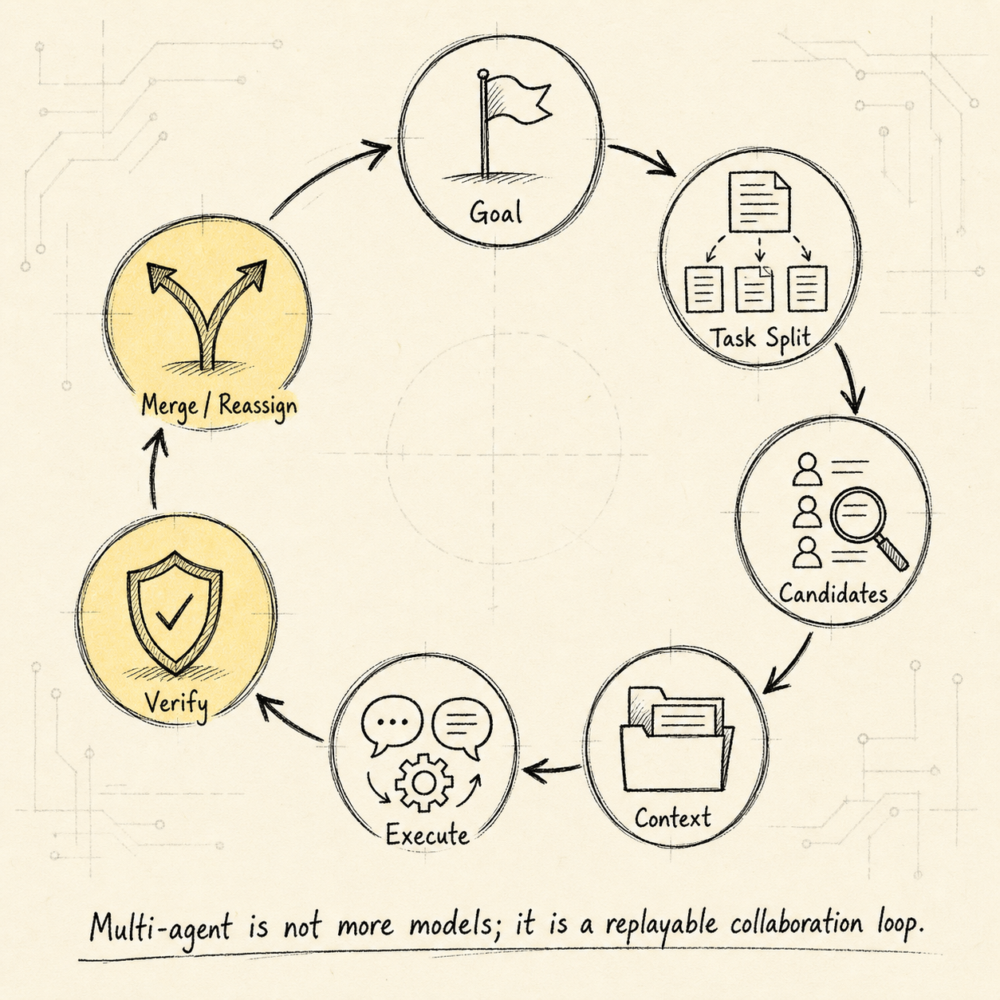


An Agent Team is not simply "multiple agents working together." At minimum, it must solve two problems:

```text
Assignment: How are tasks assigned to the right agent?
Communication: How do agents exchange information in a controlled, traceable, and verifiable way?
```

Without a task assignment mechanism, multi-agent work can easily become:

```text
The Lead assigns tasks to whoever comes to mind
agents do not know whether they are authorized to act
multiple agents duplicate work
no one picks up failed tasks
high-risk tasks receive no review
```

Without a communication protocol, multi-agent work can also become:

```text
agent group chat
context contamination
message explosion
unclear responsibility
conclusions cannot be traced
subagents pass incorrect information to each other
```

A stable Agent Team should at least form the following loop:

```text
Goal
  ↓
Task Decomposition
  ↓
Task Classification
  ↓
Candidate Selection
  ↓
Assignment Decision
  ↓
Context Compilation
  ↓
Agent Execution
  ↓
Agent Communication
  ↓
Report Submission
  ↓
Verification
  ↓
Merge / Reassign / Escalate
```

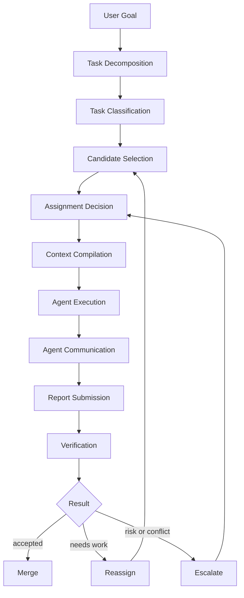

The key here is not "adding a few more model instances," but turning a complex task into a collaborative runtime that is assignable, executable, verifiable, and replayable.

## 1. Core Objects in Task Assignment

Task assignment cannot rely on just one line in a prompt:

```text
Please ask ResearchAgent to look this up for me.
```

That is not an engineering system; it is just a verbal delegation.

Real assignment should include at least these objects:

```text
TaskSpec
AssignmentDecision
TaskLease
DelegationBrief
AgentReport
VerificationResult
```

The most central ones are:

```text
TaskSpec: the task contract
AssignmentDecision: why this task is assigned to this agent
TaskLease: task occupancy rights and timeout mechanism
DelegationBrief: the context package sent to the agent
AgentReport: the structured result returned by the agent
```

### 1.1 TaskSpec: The Task Contract

`TaskSpec` is the smallest contract for task assignment. Delegation without a `TaskSpec` is just a prompt; delegation with a `TaskSpec` is runtime.

```ts
type TaskSpec = {
	task_id: string;
	team_session_id: string;

	title: string;
	goal: string;
	non_goals: string[];

	task_type:
		| "research"
		| "planning"
		| "implementation"
		| "review"
		| "verification"
		| "debugging"
		| "summarization"
		| "decision"
		| "handoff";

	status:
		| "draft"
		| "ready"
		| "candidate_selected"
		| "assigned"
		| "claimed"
		| "running"
		| "blocked"
		| "report_submitted"
		| "verifying"
		| "accepted"
		| "rejected"
		| "reassigned"
		| "merged"
		| "cancelled";

	priority: "low" | "medium" | "high" | "critical";
	risk_level: "low" | "medium" | "high";

	dependencies: string[];
	required_capabilities: string[];
	required_tools: string[];

	scope: {
		allowed_paths?: string[];
		forbidden_paths?: string[];
		allowed_domains?: string[];
		data_classification?: "public" | "internal" | "confidential" | "restricted";
		write_scope?: "none" | "patch_only" | "workspace_write" | "production_write";
	};

	assignment: {
		mode:
			| "lead_push"
			| "capability_matching"
			| "claim_with_lease"
			| "recursive_delegation"
			| "redundant_assignment"
			| "human_assignment";
		owner_agent_id?: string;
		candidate_agent_ids?: string[];
		reviewer_agent_id?: string;
		verifier_agent_id?: string;
		lease_id?: string;
		parent_task_id?: string;
		domain_scope?: string;
	};

	input_refs: Array<{
		kind: "message" | "artifact" | "file" | "memory" | "url" | "task" | "decision";
		ref: string;
		reason: string;
	}>;

	output_contract: {
		format:
			| "agent_report"
			| "patch"
			| "plan"
			| "research_brief"
			| "review"
			| "test_result"
			| "decision_record";
		must_include_evidence: boolean;
		must_include_confidence: boolean;
		schema_ref?: string;
	};

	success_criteria: string[];

	budget: {
		max_tokens?: number;
		max_tool_calls?: number;
		max_runtime_ms?: number;
		max_cost_usd?: number;
	};

	communication_policy: {
		can_message_lead: boolean;
		can_message_subagents: boolean;
		allowed_message_types: string[];
		broadcast_allowed: boolean;
		max_messages?: number;
	};

	created_by_agent_id: string;
	created_at: string;
	updated_at: string;
};
```

`TaskSpec` turns a task from a “natural-language request” into a runtime object with goals, boundaries, outputs, and acceptance criteria.

### 1.2 AssignmentDecision: Assignment Decision

Every task assignment should leave behind a decision record.

```ts
type AssignmentDecision = {
	decision_id: string;
	team_session_id: string;
	task_id: string;

	topology_type: "star" | "controlled_bus" | "hierarchical";

	allocation_mode:
		| "lead_push"
		| "capability_matching"
		| "claim_with_lease"
		| "recursive_delegation"
		| "redundant_assignment"
		| "human_assignment";

	selected_agents: Array<{
		agent_id: string;
		role: "primary" | "backup" | "reviewer" | "verifier" | "domain_lead";
		lease_id?: string;
	}>;

	rejected_agents: Array<{
		agent_id: string;
		reason: string;
	}>;

	rationale: string;
	risk_flags: string[];
	required_approvals: Array<"lead" | "verifier" | "human">;

	created_by: "lead_agent" | "scheduler" | "domain_lead" | "human";
	created_at: string;
};
```

It answers:

```text
Why this agent?
Why not the other agents?
Does this task need a reviewer?
Does this task need a verifier?
Does this task need human approval?
```

If the system cannot answer these questions, task assignment is just the Lead’s on-the-spot judgment, making it hard to audit and optimize.

### 1.3 TaskLease: Task Lease

In a controlled bus architecture, tasks should not be permanently assigned to an agent. They should use leases instead.

```ts
type TaskLease = {
	lease_id: string;
	task_id: string;
	agent_id: string;

	status: "active" | "expired" | "released" | "completed" | "revoked";

	granted_at: string;
	expires_at: string;
	heartbeat_at?: string;

	retry_count: number;
	progress_summary?: string;
};
```

Task assignment is not a one-time assignment. It is a revocable, timeout-bound, retryable right of occupancy.

A lease can handle these situations:

```text
The agent gets stuck
The agent times out
A tool fails
Task risk escalates
A better-suited agent appears
The user changes the goal
```

## 2. Task Assignment Flow

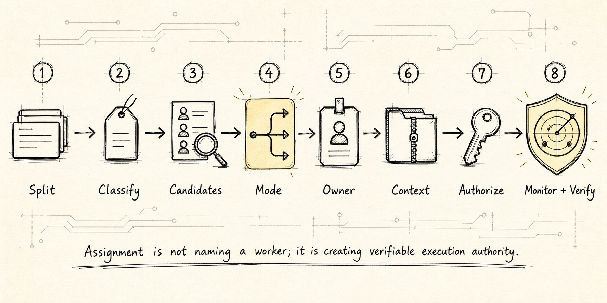


A stable task assignment flow can be divided into eight steps:

```text
1. Decompose
   Break the user goal into a TaskGraph / TaskSpec

2. Classify
   Determine the task type, risk level, read/write nature, and required capabilities

3. Select Candidates
   Select candidate agents based on capability, tool access, context scope, and load

4. Decide Allocation Mode
   Decide whether to use lead_push, capability_matching, claim_with_lease,
   recursive_delegation, or redundant_assignment

5. Assign Owner
   Determine the primary owner, reviewer, and verifier

6. Compile Context
   Compile the minimal sufficient context for the selected agent

7. Grant Execution
   Send a DelegationBrief or authorize a TaskLease

8. Monitor / Verify / Reassign
   Handle completion or failure through heartbeat, report, verifier, and lease
```

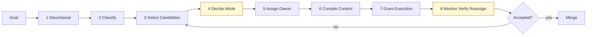

The pseudocode is as follows:

```ts
async function assignTask(task: TaskSpec, team: TeamSession) {
	const classifiedTask = classifyTask(task);

	const candidates = selectCandidates({
		required_capabilities: classifiedTask.required_capabilities,
		required_tools: classifiedTask.required_tools,
		scope: classifiedTask.scope,
		risk_level: classifiedTask.risk_level,
		team_agents: team.member_agents,
	});

	const eligibleCandidates = candidates.filter(agent =>
		agent.has_required_tools &&
		agent.has_scope_permission &&
		agent.current_load < agent.max_parallel_tasks
	);

	const allocationMode = chooseAllocationMode({
		topology: team.topology.type,
		task_type: classifiedTask.task_type,
		risk_level: classifiedTask.risk_level,
		write_scope: classifiedTask.scope.write_scope,
	});

	const decision = makeAssignmentDecision({
		task: classifiedTask,
		candidates: eligibleCandidates,
		allocationMode,
	});

	const contextBundle = await ContextGateway.compileForAgent({
		task_id: task.task_id,
		agent_id: decision.selected_agents[0].agent_id,
	});

	const leaseOrDelegation = await grantExecution({
		task,
		decision,
		contextBundle,
	});

	return {
		decision,
		contextBundle,
		leaseOrDelegation,
	};
}
```

## 3. Five Mainstream Assignment Strategies

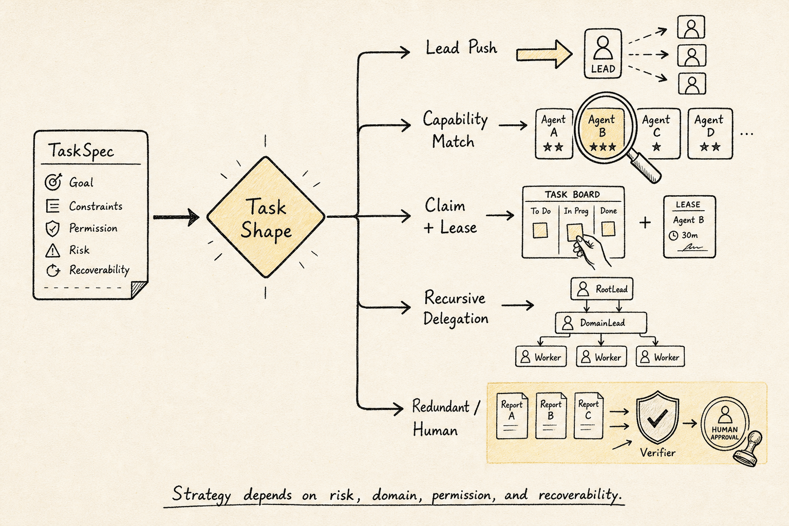


The three topologies solve organizational structure; assignment strategies solve how tasks land on specific agents.

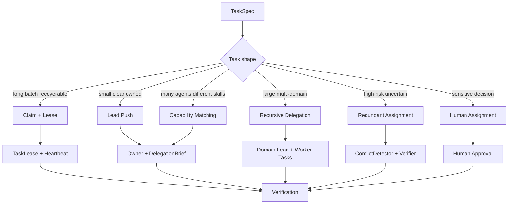

### 3.1 Lead Push: Direct Assignment by the Lead Agent

```text
LeadAgent → TaskSpec → Subagent
```

Suitable for:

```text
Star architecture
Small teams
Short tasks
Very clear responsibilities
Cases where the lead agent needs strong control
```

Example:

```text
ResearchAgent, you are responsible for investigating why recent tests in the payment module are failing.
Read only logs and tests; do not modify code.
Return the failure patterns, evidence, and recommended next steps.
```

The advantages are simplicity, controllability, low latency, and easy debugging. The drawbacks are that it depends on the lead’s judgment, the lead can easily become a bottleneck, and it does not fit large volumes of tasks.

### 3.2 Capability Matching

```text
TaskSpec → CandidateSelector → Best Agent
```

The system selects an agent based on dimensions such as:

```text
required_capabilities
required_tools
context_scope
risk_level
current_load
historical_success_rate
cost
latency
permission boundary
```

A scoring function might look like this:

```text
score(agent, task) =
  0.30 * capability_match
+ 0.20 * tool_permission_fit
+ 0.15 * context_scope_fit
+ 0.10 * availability
+ 0.10 * historical_success_rate
+ 0.05 * cost_efficiency
+ 0.05 * latency_fit
- 0.15 * risk_penalty
```

It fits controlled bus-style systems where agent capabilities are heterogeneous, task types are varied, and tool permissions differ significantly.

### 3.3 Claim + Lease

```text
TaskBoard publishes task
  ↓
eligible agents see task
  ↓
agent claims task
  ↓
scheduler grants lease
  ↓
agent heartbeats
  ↓
report submitted / lease expires
```

Suitable for:

```text
Controlled bus style
Long-running tasks
Batch tasks
Concurrent tasks
Cases that require failure recovery
```

Task lifecycle:

```text
ready
  ↓
announced
  ↓
claimed
  ↓
lease_granted
  ↓
running
  ↓
heartbeat
  ↓
report_submitted
  ↓
verifying
  ↓
accepted / rejected / reassigned
```

Key rules:

```text
claim does not mean owning the task
execution is allowed only after lease_granted
lease timeout automatically releases the task
after repeated failures, escalate to lead / human
```

### 3.4 Recursive Delegation

```text
Root Lead
  ↓
Domain Lead
  ↓
Worker Agent
```

Suitable for hierarchical tasks, large-scale tasks, multi-domain tasks, and scenarios with many agents.

Example:

```text
RootLead:
  "BackendLead, you are responsible for refactoring the payment module."

BackendLead:
  "APIAgent, you are responsible for the adapter interface.
   DBAgent, you are responsible for schema compatibility analysis.
   TestAgent, you are responsible for the payment test suite."
```

Core rules:

```text
Root Lead does not directly manage all workers
Domain Lead has the authority to break down tasks within the domain
Worker only executes concrete tasks
Cross-domain dependencies must be synchronized through Domain Lead or a controlled bus
```

### 3.5 Redundant Assignment

```text
Same Task
  ├── Agent A
  ├── Agent B
  └── Agent C
       ↓
ConflictDetector
       ↓
Judge / Verifier
```

It is suitable for high-risk decisions, security reviews, architecture reviews, critical code reviews, and problems with high uncertainty.

Do not use redundant assignment by default, because it is costly, high-latency, complex to merge, and may produce mutually contradictory conclusions.

Recommended only when these conditions apply:

```text
risk_level = high
production_write = true
security_sensitive = true
confidence_below_threshold = true
```

## 4. Task Assignment Methods Across Three Topologies

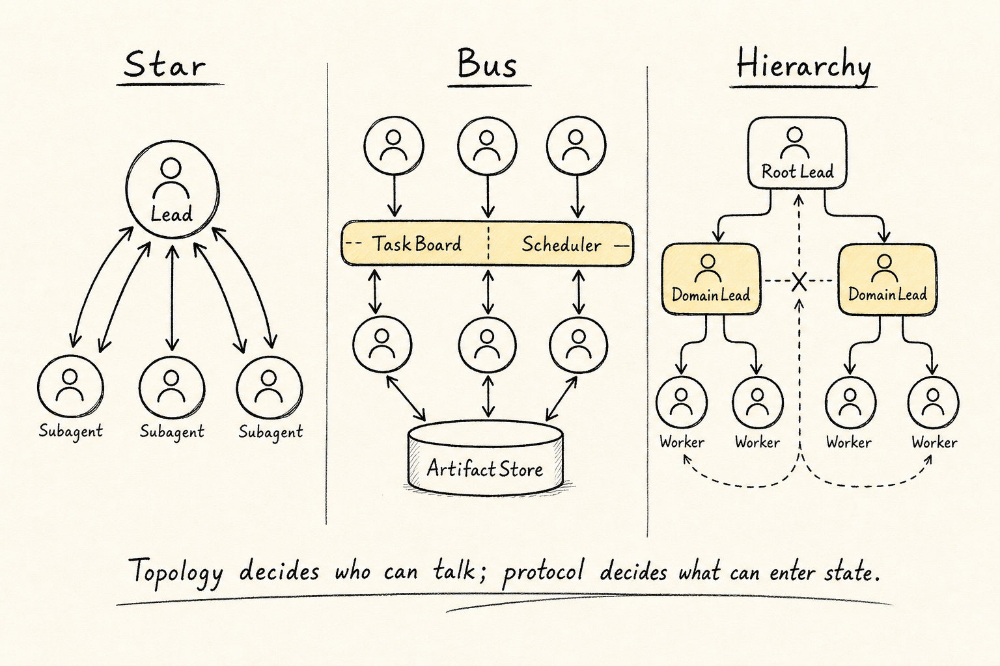


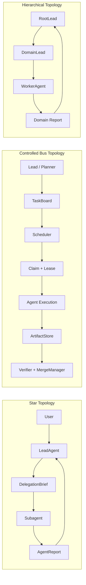

### 4.1 Star: Lead Assigns, Subagent Executes

```text
User
  ↓
LeadAgent
  ↓
TaskSpec
  ↓
DelegationBrief
  ↓
Subagent
  ↓
AgentReport
  ↓
LeadAgent
```

In a star architecture, task assignment usually works as follows:

```text
Lead Push
Capability Matching
Redundant Assignment for high-risk review
```

Typical flow:

```text
1. Lead parses the user's goal
2. Lead determines whether a subagent is needed
3. Lead creates a TaskSpec
4. Lead selects a suitable subagent
5. Lead compiles a DelegationBrief
6. Subagent executes the task
7. Subagent returns an AgentReport
8. Verifier checks the report
9. Lead merges the result
```

In a star topology, subagents do not communicate directly by default. If a ResearchAgent needs to ask a CodingAgent, the more stable flow is:

```text
ResearchAgent → LeadAgent → CodingAgent
```

Rather than:

```text
ResearchAgent → CodingAgent
```

This lets the Lead retain global ownership and context control.

### 4.2 Controlled Bus: TaskBoard Assigns, Agents Claim

```text
Lead / Planner
  ↓
TaskBoard
  ↓
Scheduler
  ↓
Agent Claim + Lease
  ↓
Execution
  ↓
ArtifactStore + AgentReport
  ↓
Verifier + MergeManager
```

In a controlled bus topology, task assignment usually works as follows:

```text
Capability Matching
Claim + Lease
Redundant Assignment for high-risk tasks
Human Assignment for sensitive tasks
```

Typical flow:

```text
1. Planner / Lead creates a TaskGraph
2. TaskGraphManager finds ready tasks
3. TaskBoard publishes tasks
4. CandidateSelector marks eligible agents
5. Agent can claim a task
6. Scheduler grants a lease
7. ContextGateway compiles context
8. Agent executes and sends heartbeats
9. Agent produces artifacts and a report
10. Verifier checks them
11. MergeManager merges
12. On failure, the lease is released and the task is reassigned
```

The key is:

```text
TaskBoard manages task state
EventBus manages state changes
Mailbox manages directed communication
ArtifactStore manages artifacts
Verifier manages trustworthiness
MergeManager manages entry into the mainline
```

### 4.3 Hierarchical: Root Lead Splits by Domain, Domain Leads Delegate Further

```text
RootLead
  ↓
DomainLead
  ↓
WorkerAgent
```

In a hierarchical model, task assignment usually works like this:

```text
Recursive Delegation
Capability Matching within domain
Lead Push within domain
Redundant Assignment for domain-level review
```

A typical flow:

```text
1. Root Lead breaks the work into domain-level tasks
2. Root Lead assigns them to Domain Leads
3. Domain Lead further decomposes tasks within the domain
4. Domain Lead selects worker agents
5. Worker performs the concrete task
6. Worker returns an AgentReport
7. Domain Lead aggregates the domain report
8. Root Lead merges the domain reports
9. Verifier checks overall consistency
```

The key to a hierarchical model is not letting the Root Lead see more, but letting it see less and more accurate information:

```text
Root Lead sees domain summaries
Domain Lead sees domain context
Worker sees concrete task context
```

## 5. Communication Protocol Between the Main Agent and Subagents

Communication between the main agent and subagents should be contract-based, not casual natural-language chat.

It has six core message types:

```text
TaskAssigned
ClarificationRequested
ProgressReported
BlockerRaised
ReportSubmitted
RevisionRequested
```

### 5.1 TaskAssigned: Task Delegation

What the main agent sends to a subagent is not a single sentence, but a `DelegationBrief`.

```ts
type DelegationBrief = {
	delegation_id: string;
	task_id: string;

	from_agent_id: string;
	to_agent_id: string;

	objective: string;
	why_this_matters: string;
	non_goals: string[];
	context_summary: string;

	input_refs: Array<{
		kind: "file" | "artifact" | "message" | "memory" | "url" | "task";
		ref: string;
		reason: string;
	}>;

	constraints: string[];
	allowed_tools: string[];
	forbidden_tools: string[];

	scope: {
		allowed_paths?: string[];
		forbidden_paths?: string[];
		allowed_domains?: string[];
		write_scope?: "none" | "patch_only" | "workspace_write";
	};

	success_criteria: string[];

	output_contract: {
		format: "agent_report" | "patch" | "review" | "research_brief" | "test_result";
		must_include_evidence: boolean;
		must_include_confidence: boolean;
	};

	communication_policy: {
		can_ask_clarifying_questions: boolean;
		can_contact_other_subagents: boolean;
		must_report_progress: boolean;
		progress_interval?: "on_blocker" | "periodic" | "on_completion";
	};

	budget: {
		max_tokens?: number;
		max_tool_calls?: number;
		max_runtime_ms?: number;
	};
};
```

A good delegation can look like this:

```yaml
task_id: task_auth_log_triage

objective: >
  Analyze the most likely cause of the 401s in auth-refresh-failure.log.

why_this_matters: >
  The lead is deciding whether the token refresh logic needs to be changed.

non_goals:
  - Do not modify code
  - Do not refactor the auth module
  - Do not access production

context_summary: >
  The user reported intermittent 401s after token refresh.
  The current suspicion is a race condition in refresh token rotation or the session cache.

input_refs:
  - kind: file
    ref: logs/auth-refresh-failure.log
    reason: "Contains logs for failed requests"
  - kind: file
    ref: src/auth/refresh.ts
    reason: "Refresh token logic"

allowed_tools:
  - read_file
  - grep
  - run_tests_readonly

forbidden_tools:
  - write_file
  - deploy
  - database_write

success_criteria:
  - Find at least 1 verifiable hypothesis
  - Every conclusion must include an evidence ref
  - State confidence level
  - Recommend next validation steps

output_contract:
  format: agent_report
  must_include_evidence: true
  must_include_confidence: true

communication_policy:
  can_ask_clarifying_questions: true
  can_contact_other_subagents: false
  must_report_progress: true
  progress_interval: on_blocker
```

### 5.2 ClarificationRequested: Clarification Questions

A subagent should ask questions only when execution is blocked.

Incorrect:

```text
I need more context. Can you say a bit more?
```

Correct:

```yaml
type: ClarificationRequested
task_id: task_auth_log_triage
from_agent_id: log_triage_agent
to_agent_id: lead_agent
blocking: true
question: >
  I need to confirm whether auth-refresh-failure.log comes from the same version of src/auth/refresh.ts.
  If the versions differ, the logs and code cannot be correlated.
options:
  - "Confirm same version"
  - "Provide the corresponding commit hash"
  - "Allow me to do a preliminary log-only analysis"
needed_by: "before root-cause conclusion"
```

Principles:

```text
The question must be specific
The question must explain why it is blocking
The question should preferably provide options
The question must not ask the lead agent to dump the entire context
```

### 5.3 ProgressReported: Progress Reports

Progress reports should be deltas, not activity logs.

```yaml
type: ProgressReported
task_id: task_auth_log_triage
from_agent_id: log_triage_agent
to_agent_id: lead_agent
progress_summary: >
  Located that 401s are concentrated in the next API call after a successful refresh.
current_hypothesis:
  - "session cache is not updating the access token in time"
evidence_refs:
  - "logs/auth-refresh-failure.log#L120-L188"
next_step: >
  Check the cache write order in refresh.ts.
```

Do not do this:

```text
I opened file A, then read lines 1 through 200, then opened file B...
```

### 5.4 BlockerRaised: Raising Blockers

```yaml
type: BlockerRaised
task_id: task_payment_adapter
from_agent_id: backend_agent
to_agent_id: lead_agent
blocker: >
  The current task requires modifying src/payments/schema.ts, but my write_scope only allows src/payments/adapter.ts.
needs: "lead"
suggested_resolution:
  - "Create a new schema_migration_task"
  - "Instead submit only a patch proposal"
risk: "medium"
```

Principles:

```text
A blocker must state who needs to handle it
A blocker must provide resolution options
A blocker must not bypass permissions and solve itself
```

### 5.5 ReportSubmitted: Submitting Results

The content a subagent returns to the lead agent must be a structured report.

```ts
type AgentReport = {
	report_id: string;
	task_id: string;
	agent_id: string;

	summary: string;

	findings: Array<{
		claim: string;
		confidence: number;
		evidence_refs: string[];
		risk?: "low" | "medium" | "high";
	}>;

	actions_taken: Array<{
		action: string;
		artifact_refs?: string[];
		tool_call_ids?: string[];
	}>;

	artifacts_created: Array<{
		artifact_id: string;
		kind: "file" | "diff" | "log" | "research_note" | "test_result";
		summary: string;
	}>;

	open_questions: string[];

	blockers: Array<{
		blocker: string;
		needs: "user" | "manager" | "tool" | "another_agent";
	}>;

	verification: {
		checks_run: string[];
		checks_passed: string[];
		checks_failed: string[];
		not_verified: string[];
	};

	recommendations: string[];
	next_steps: string[];
};
```

Core principle:

> **A subagent does not replay its exploration process back into the main thread; it brings back only conclusions, evidence, risks, artifacts, and next steps.**

### 5.6 RevisionRequested: Rework Request

The main agent or verifier can ask a subagent to rework something, but the rework request must also be structured.

```yaml
type: RevisionRequested
task_id: task_auth_log_triage
from_agent_id: lead_agent
to_agent_id: log_triage_agent
reason: >
  Your finding 2 is missing an evidence ref, so it cannot be included in the final report.
required_changes:
  - "Add log line references for finding 2"
  - "Indicate whether this conclusion is only speculative"
  - "Add one validation suggestion"
deadline_policy: "same_lease"
```

## 6. Subagent-to-Subagent Communication Protocol

Whether subagents are allowed to communicate depends on the topology.

Default principle:

> **By default, subagents do not communicate directly; subagent-to-subagent communication is allowed only when the topology, task dependencies, and communication_policy explicitly permit it.**

The risks of direct communication are:

```text
Increasing context pollution
Bypassing the Lead's global control
Causing misinformation to spread laterally
Creating implicit task transfers
Blurring responsibility boundaries
```

But in controlled bus and hierarchical topologies, subagent-to-subagent communication is necessary. The key is that it must be structured, directed, traceable, and limited.

### 6.1 Communication Rules Across Three Topologies

| Topology | Can subagents communicate directly? | Recommended approach |
| --- | ---: | --- |
| Star | No by default | Relay through the Lead |
| Controlled bus | Yes, but it must be controlled | Through Mailbox / TaskBoard / Artifact refs |
| Hierarchical | Limited communication within the same domain; cross-domain communication must be escalated | Through Domain Lead or Cross-domain Mailbox |

### 6.2 Subagent Communication in a Star Topology

The most stable communication path in a star topology is:

```text
Subagent A
  ↓
LeadAgent
  ↓
Subagent B
```

For example, if ResearchAgent discovers that TestAgent needs to run a test, ResearchAgent should not directly instruct TestAgent. Instead, it should submit a request to the Lead. The Lead decides whether to create a new `TaskSpec` for TestAgent.

```yaml
type: SubtaskRequest
from_agent_id: research_agent
to_agent_id: lead_agent
related_task_id: task_research_auth
requested_task:
  title: "Run auth refresh regression tests"
  reason: "Research finding 1 requires test validation"
  suggested_agent: test_agent
  required_tools:
    - run_tests
  expected_output: "test_result"
```

Core principle:

> **In a star topology, a subagent may suggest new tasks, but it cannot assign tasks directly to other subagents.**

### 6.3 Subagent Communication in a Controlled Bus Topology

A controlled bus topology allows subagents to communicate directly, but they must use controlled channels.

```text
Subagent A → Mailbox → Subagent B
Subagent A → TaskBoard → Creates dependency
Subagent A → ArtifactStore → Shares artifact ref
Subagent A → EventBus → Emits structured event
```

There are seven main allowed communication types:

```text
DependencyQuestion
ArtifactHandoff
ReviewRequest
ReviewResult
BlockerSupportRequest
InterfaceContractProposal
ConflictNotice
```

**DependencyQuestion: Dependency question**

```yaml
type: DependencyQuestion
from_agent_id: frontend_agent
to_agent_id: backend_agent
task_id: task_checkout_ui
related_task_id: task_payment_api
blocking: true
question: >
  checkout UI needs to confirm whether createPaymentIntent return fields include client_secret.
context_refs:
  - artifact://frontend_checkout_plan
expected_answer_format:
  fields:
    - "return_schema"
    - "stability"
    - "evidence_refs"
```

It may only ask questions related to task dependencies, and it must state whether the issue is blocking.

**ArtifactHandoff: Artifact handoff**

```yaml
type: ArtifactHandoff
from_agent_id: backend_agent
to_agent_id: frontend_agent
task_id: task_payment_adapter
artifact_id: artifact_payment_api_schema
summary: >
  payment adapter 的返回 schema 已确定，frontend 可以基于此更新 checkout flow。
important_fields:
  - "client_secret"
  - "payment_status"
  - "retry_after"
evidence_refs:
  - "src/payments/adapter.ts#L40-L88"
```

Hand off the artifact ref, not the full context.

**ReviewRequest: Requesting Review**

```yaml
type: ReviewRequest
from_agent_id: implementer_agent
to_agent_id: reviewer_agent
task_id: task_payment_adapter
artifact_id: patch://payment-adapter-v1
checklist_ref: checklist://backend-api-review
focus:
  - "public API compatibility"
  - "error handling"
  - "idempotency"
blocking: true
```

A review request must include an artifact_id, and it must also include either a checklist or review focus.

**ReviewResult: Review Result**

```yaml
type: ReviewResult
from_agent_id: reviewer_agent
to_agent_id: implementer_agent
task_id: task_payment_adapter
artifact_id: patch://payment-adapter-v1
status: "changes_requested"
blocking_issues:
  - issue: "adapter 在 timeout 时没有保持 idempotency key"
    evidence_refs:
      - "src/payments/adapter.ts#L72-L91"
    suggested_fix: "在 retry branch 中复用原始 idempotency key"
non_blocking_comments:
  - "命名可以更清晰，但不阻塞 merge"
```

**BlockerSupportRequest: Requesting Help to Unblock**

```yaml
type: BlockerSupportRequest
from_agent_id: test_agent
to_agent_id: backend_agent
task_id: task_payment_tests
blocking: true
blocker: >
  payment test suite 缺少 mock response schema。
needed_artifact:
  - "mock schema for PaymentIntent success"
  - "mock schema for PaymentIntent failure"
```

Requesting help is not the same as transferring task ownership. The original task owner remains responsible for their own task.

**InterfaceContractProposal: Interface Contract Proposal**

```yaml
type: InterfaceContractProposal
from_agent_id: backend_agent
to_agent_id: frontend_agent
task_id: task_payment_refactor
contract:
  endpoint: "POST /api/payments/intent"
  request_schema_ref: artifact://payment_intent_request_schema
  response_schema_ref: artifact://payment_intent_response_schema
compatibility: "backward_compatible"
requires_ack: true
```

Frontend agents, backend agents, API agents, and DB agents cannot rely on natural language to guess interfaces. They must align through contract artifacts.

**ConflictNotice: Conflict notification**

```yaml
type: ConflictNotice
from_agent_id: reviewer_agent
to_agent_id: lead_agent
task_id: task_payment_refactor
conflict:
  description: >
    frontend_agent assumes payment_status includes "requires_action",
    but backend_agent's response schema does not define that state.
  involved_artifacts:
    - artifact://frontend_checkout_plan
    - artifact://payment_intent_response_schema
risk: "high"
suggested_resolution:
  - "Have backend_agent update the schema"
  - "Have frontend_agent remove handling for that state"
  - "Have the lead decide the compatibility strategy"
```

Conflicts must be reported explicitly. Agents must not privately negotiate and then directly modify the main state. High-risk conflicts must enter the `DecisionLog`.

### 6.4 Subagent communication in a hierarchical model

Hierarchical communication follows these rules:

```text
Same layer, same domain: limited communication is allowed
Cross-domain communication: through the Domain Lead
Cross-layer communication: follow the hierarchy for reporting
```

Recommended paths:

```text
Worker → DomainLead → RootLead
Worker → DomainLead → OtherDomainLead → OtherWorker
```

Not recommended:

```text
FrontendWorker → DatabaseWorker
```

Unless the system explicitly allows a cross-domain mailbox.

The most important point in a hierarchy is to prevent workers from bypassing the domain owner.

Incorrect approach:

```text
UIAgent directly asks DBAgent to change the schema
```

Correct approach:

```text
UIAgent → FrontendLead
FrontendLead → RootLead / BackendLead
BackendLead → DBAgent
```

This prevents cross-domain tasks from spinning out of control, permission boundaries from being bypassed, domain decisions from having no accountable owner, and global state from being corrupted by a local agent.

## 7. Communication Channel Design

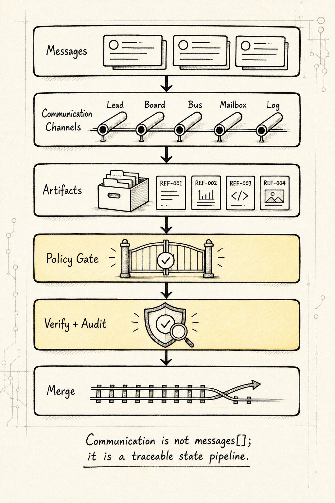


An Agent Team should not have only a single `messages[]`. At minimum, it should distinguish between these channels:

```text
Lead Channel
TaskBoard
EventBus
Mailbox
ArtifactStore
DecisionLog
ReviewQueue
Escalation Channel
```

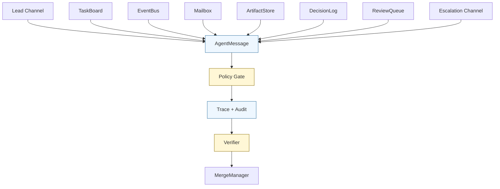

### 7.1 Lead Channel

Used for:

```text
User ↔ Lead
Lead ↔ Subagent
DomainLead ↔ Worker
```

Carries:

```text
TaskAssigned
ClarificationRequested
BlockerRaised
ReportSubmitted
RevisionRequested
```

It provides strong control and strong ownership, making it suitable for star-shaped and hierarchical structures.

### 7.2 TaskBoard

The TaskBoard is used to record task state, not for long-form chat.

```yaml
task_id: task_payment_adapter
status: running
owner_agent_id: backend_agent
dependencies:
  - task_payment_schema_review
lease_id: lease_123
updated_at: "..."
```

What belongs in the TaskBoard is state, not conversation.

### 7.3 EventBus

The EventBus is used to record state-change events.

```jsonl
{"type":"TaskCreated","task_id":"task_1","created_by":"lead"}
{"type":"TaskClaimed","task_id":"task_1","agent_id":"backend_agent"}
{"type":"LeaseGranted","task_id":"task_1","lease_id":"lease_1"}
{"type":"ArtifactProduced","task_id":"task_1","artifact_id":"patch_1"}
{"type":"VerificationCompleted","task_id":"task_1","status":"pass"}
```

The EventBus is the foundation for auditing and replay.

### 7.4 Mailbox

The Mailbox is used for targeted agent-to-agent communication.

```ts
type MailboxMessage = {
	message_id: string;
	thread_id: string;

	from_agent_id: string;
	to_agent_id: string;

	task_id: string;
	related_task_ids: string[];

	kind:
		| "dependency_question"
		| "artifact_handoff"
		| "review_request"
		| "review_result"
		| "blocker_support_request"
		| "interface_contract_proposal"
		| "conflict_notice";

	priority: "low" | "medium" | "high" | "critical";
	blocking: boolean;
	content_summary: string;

	payload: Record<string, unknown>;

	context_refs: string[];
	artifact_refs: string[];

	expected_response?: {
		required: boolean;
		format: string;
		deadline_ms?: number;
	};

	visibility: {
		visible_to_lead: boolean;
		visible_to_task_owner: boolean;
		visible_to_verifier: boolean;
	};

	created_at: string;
};
```

Mailbox is directed messaging, not group chat.

### 7.5 ArtifactStore

ArtifactStore is used to share artifacts, not full context.

```text
artifact://research_report_auth_refresh
artifact://patch_payment_adapter_v1
artifact://test_log_payment_suite
artifact://api_contract_checkout_payment
```

When agents communicate, they should pass:

```text
artifact ref
summary
evidence refs
why relevant
```

Instead of passing:

```text
full logs
full file contents
full exploration process
```

### 7.6 DecisionLog

All important decisions must go into `DecisionLog`.

```yaml
decision_id: decision_payment_status_schema
made_by: lead_agent
related_tasks:
  - task_backend_payment_schema
  - task_frontend_checkout_flow
decision: >
  payment_status keeps the requires_action state to remain compatible with the 3DS flow.
rationale: >
  frontend already depends on this state; removing it would break the existing checkout flow.
evidence_refs:
  - artifact://frontend_checkout_plan
  - artifact://backend_schema_review
status: accepted
```

A decision made in chat does not count as a decision. Only decisions entered into `DecisionLog` count as system state.

## 8. Unified Structure for Communication Messages

All agent communication can be abstracted into a unified message object.

```ts
type AgentMessage = {
	message_id: string;
	team_session_id: string;
	thread_id: string;

	from_agent_id: string;
	to_agent_id?: string;

	channel:
		| "lead_channel"
		| "taskboard"
		| "eventbus"
		| "mailbox"
		| "review_queue"
		| "escalation";

	kind:
		| "task_assigned"
		| "clarification_requested"
		| "progress_reported"
		| "blocker_raised"
		| "report_submitted"
		| "revision_requested"
		| "dependency_question"
		| "artifact_handoff"
		| "review_requested"
		| "review_result"
		| "interface_contract_proposal"
		| "conflict_notice"
		| "decision_proposed"
		| "handoff_requested"
		| "handoff_accepted";

	task_id?: string;
	related_task_ids?: string[];

	priority: "low" | "medium" | "high" | "critical";
	blocking: boolean;

	content_summary: string;
	payload: Record<string, unknown>;

	context_refs: string[];
	artifact_refs: string[];
	evidence_refs: string[];

	expected_response?: {
		required: boolean;
		format: string;
		deadline_ms?: number;
	};

	policy: {
		max_visibility: "lead_only" | "task_participants" | "team" | "verifier" | "human";
		can_create_task: boolean;
		can_modify_task_state: boolean;
		can_transfer_ownership: boolean;
	};

	status: "sent" | "delivered" | "acknowledged" | "resolved" | "expired";
	created_at: string;
};
```

A message is not a context dump, but a structured collaboration unit with `task_id`, `artifact_refs`, `evidence_refs`, and `expected_response`.

## 9. Core Principles for Communication

### Principle 1: Contract over Chat

Agent communication is first a contract, not a chat.

Incorrect:

```text
Take a look at this issue.
```

Correct:

```text
Here is the task_id, here is the objective, here is the input, here are the tools you can use, here is the output format, and here are the acceptance criteria.
```

### Principle 2: Default No Direct Subagent Communication

By default, subagents do not communicate directly. It is allowed only when all of the following conditions are met:

```text
topology allows it
communication_policy allows it
the message type is in the allowlist
there is a dependency between tasks
the message includes task_id
the message includes artifact/context refs
the message will be traced
```

### Principle 3: Least Context, Maximum Reference

Pass the minimum context during communication, and pass references whenever possible.

Recommended:

```text
summary + artifact_ref + evidence_ref
```

Not recommended:

```text
full logs + full files + full conversation history
```

### Principle 4: All Facts Must Carry Evidence

Any factual claim should include:

```text
evidence_refs
confidence
risk
```

Content without evidence can only be a hypothesis, opinion, or suggestion. It must not directly enter the main conclusion.

### Principle 5: State Changes Must Not Rely on Natural Language

Incorrect:

```text
I think this task is done.
```

Correct:

```json
{"type":"TaskCompleted","task_id":"task_1","report_id":"rep_1"}
```

Task state must be changed through structured events.

### Principle 6: Owner Decides, Non-owner Advises

Non-owners may advise, but they cannot directly change task ownership, merge state, or make final decisions.

```text
task owner is responsible for completing the task
lead owner is responsible for the final output
verifier owner is responsible for acceptance
human owner is responsible for high-risk approvals
```

### Principle 7: Broadcast Is Exceptional

Use directed messages by default. Broadcasts are only for:

```text
mission update
global constraint change
critical blocker
major decision
security warning
```

Broadcasts must be short, structured, and traceable.

### Principle 8: Progress Report by Delta

Progress reports should only report changes:

```text
new findings
new blockers
new artifacts
new risks
next step
```

Do not repeat task background, and do not repeat known information.

### Principle 9: No Hidden State Transfer

Subagents must not secretly transfer task ownership through private chats.

Incorrect:

```text
BackendAgent privately asks TestAgent to help complete its testing task.
```

Correct:

```text
BackendAgent creates a SubtaskRequest
Lead / Scheduler creates a new TaskSpec
TestAgent receives a formal lease
```

### Principle 10: No Raw Chain-of-Thought Transfer

Agents should not pass hidden reasoning processes to one another.

Allowed:

```text
reasoning summary
evidence
hypotheses
decision rationale
open questions
```

Not allowed:

```text
full internal chain of thought
unstructured exploration process
model-private scratchpad
```

### Principle 11: Communication Must Be Budgeted

Communication also has a cost. Each task can limit:

```text
max_messages
max_clarification_rounds
max_review_rounds
max_broadcasts
max_wait_time
```

Otherwise, an agent team can easily fall into a state of asking each other questions, reviewing each other, adding more details, and never converging.

### Principle 12: Conflicts Must Become First-class Objects

Conflicts must not be hidden inside conversations. They should be created explicitly:

```text
ConflictNotice
DecisionRequest
ResolutionDecision
```

A conflict object should include at least:

```text
conflict description
related tasks
related artifact
risk level
candidate solutions
decision owner
final ruling
```

### Principle 13: Communication Should Not Replace Verification

Agent B saying that Agent A's conclusion is correct does not mean verification has passed.

Verification must rely on:

```text
test
schema check
evidence check
policy check
diff review
human approval
```

## 10. Communication Compression: Four Layers of Information Flowback

To avoid context pollution, information flowing back between agents should be layered.

```text
L0 Raw Trace
  Raw tool output, complete logs, complete file snippets
  By default, kept only in private trace / artifact

L1 Evidence Slice
  Key evidence snippets, log lines, code lines, screenshot regions
  Can be referenced as evidence refs

L2 Finding Summary
  Structured findings: claim + confidence + evidence_refs

L3 Decision Summary
  Decisions, conclusions, risks, and next steps that can enter the main thread
```

By default, the main agent / root lead should only receive:

```text
L2 Finding Summary
L3 Decision Summary
artifact refs
```

The verifier can pull as needed:

```text
L1 Evidence Slice
L0 Raw Trace
```

The main thread should not consume the entire exploration process. It should absorb only compressed, evidence-backed, verifiable information.

## 11. State Machine for Task Assignment and Communication

The task state machine should be built into the runtime.

```text
draft
  ↓
ready
  ↓
candidate_selected
  ↓
assigned / announced
  ↓
claimed
  ↓
lease_granted
  ↓
running
  ├── progress_reported
  ├── clarification_requested
  ├── blocker_raised
  ├── dependency_question
  └── artifact_produced
  ↓
report_submitted
  ↓
verifying
  ├── accepted
  ├── revision_requested
  ├── rejected
  └── reassigned
  ↓
merged
```

Key invariants:

```text
A task without an owner must not be allowed to enter running
A task without an output_contract must not be allowed to be assigned
A task without evidence must not be allowed to be accepted
A task whose verifier fails must not be allowed to be merged
A task whose lease has expired must be reassigned or cancelled
```

## 12. Topology and Assignment Matrix

### 12.1 Communication Matrix

| Communication Relationship | Star | Controlled Bus | Hierarchical |
| --- | --- | --- | --- |
| User ↔ Lead | Allowed | Allowed | Allowed |
| Lead ↔ Subagent | Allowed | Allowed | Allowed |
| Subagent ↔ Lead | Allowed | Allowed | Allowed |
| Subagent ↔ Subagent | Prohibited by default | Allowed, but through Mailbox / TaskBoard | Limited allowance within the same domain; cross-domain communication goes through the Domain Lead |
| Worker ↔ Domain Lead | Not applicable | Optional | Allowed |
| Domain Lead ↔ Root Lead | Not applicable | Optional | Allowed |
| Broadcast to all agents | Not recommended | Major events only | Only Root / Domain Lead may send |
| Artifact sharing | Through Lead | Through ArtifactStore | Through DomainLead / ArtifactStore |
| Task ownership transfer | Decided by Lead | Decided by Scheduler / Lead | Decided by the higher-level Lead |
| Conflict resolution | Lead | MergeManager / Lead / Verifier | DomainLead / RootLead |
| Final merge | Lead | MergeManager + Verifier | RootLead + Verifier |

### 12.2 Assignment Matrix

| Assignment Strategy | Star | Controlled Bus | Hierarchical |
| --- | ---: | ---: | ---: |
| Lead Push | Most common | Available | Common |
| Capability Matching | Available | Most common | Common within domains |
| Claim + Lease | Uncommon | Most common | Can be used within a domain |
| Recursive Delegation | Not applicable | Optional | Most common |
| Redundant Assignment | Used for high-risk reviews | Used for high-risk tasks | Used for domain reviews |
| Human Assignment | Used when risk is high | Used when risk is high | Used when risk is high |

## 13. A Complete Example: Refactoring the Payment Module

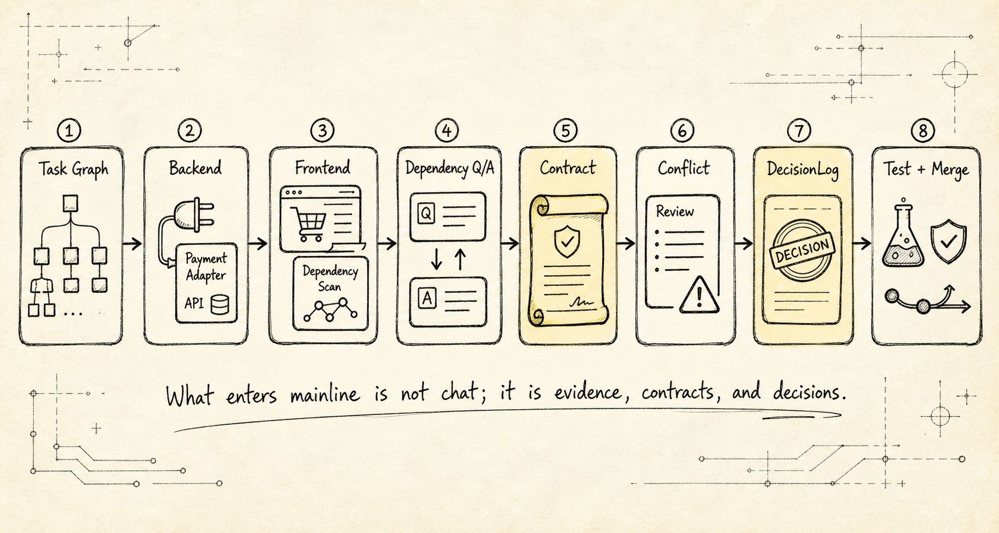


Assume the user's goal is:

```text
Refactor the payment module while maintaining compatibility with the checkout UI and historical orders.
```

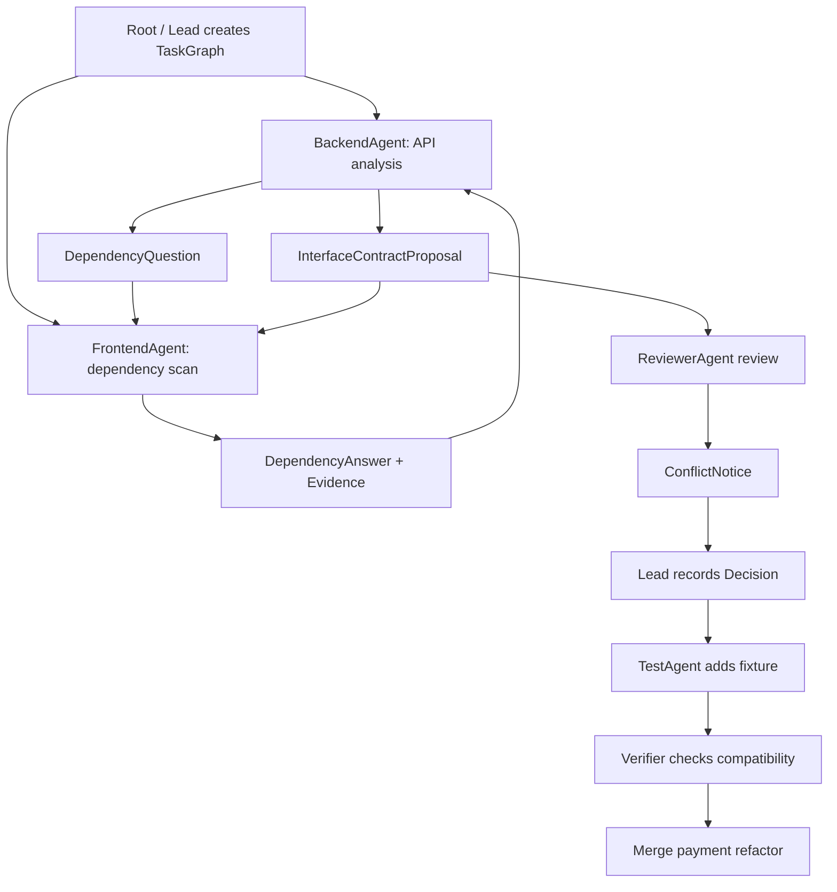

### Step 1: Root / Lead Creates the Task Graph

```yaml
root_goal: "Refactor the payment module while maintaining compatibility with the checkout UI and historical orders"

tasks:
  - task_id: task_payment_api_analysis
    type: research
    owner: backend_agent
    output: research_brief

  - task_id: task_checkout_dependency_scan
    type: research
    owner: frontend_agent
    output: research_brief

  - task_id: task_payment_adapter_impl
    type: implementation
    owner: backend_agent
    dependencies:
      - task_payment_api_analysis
    output: patch

  - task_id: task_payment_contract_review
    type: review
    owner: reviewer_agent
    dependencies:
      - task_payment_adapter_impl
      - task_checkout_dependency_scan
    output: review

  - task_id: task_payment_test_verification
    type: verification
    owner: test_agent
    dependencies:
      - task_payment_adapter_impl
    output: test_result
```

### Step 2: BackendAgent Sends FrontendAgent a Dependency Question

```yaml
type: DependencyQuestion
from_agent_id: backend_agent
to_agent_id: frontend_agent
task_id: task_payment_adapter_impl
related_task_id: task_checkout_dependency_scan
blocking: true
question: >
  Does the checkout UI depend on payment_status = "requires_action"?
context_refs:
  - artifact://payment_response_schema_v0
expected_response:
  required: true
  format: "schema_dependency_summary"
```

### Step 3: FrontendAgent Answers

```yaml
type: DependencyAnswer
from_agent_id: frontend_agent
to_agent_id: backend_agent
task_id: task_checkout_dependency_scan
related_task_id: task_payment_adapter_impl
answer: >
  Yes. The checkout UI depends on requires_action in the 3DS flow.
evidence_refs:
  - "src/checkout/payment-status.ts#L44-L68"
artifact_refs:
  - artifact://checkout_payment_dependency_scan
confidence: 0.91
```

### Step 4: BackendAgent Submits the Interface Contract

```yaml
type: InterfaceContractProposal
from_agent_id: backend_agent
to_agent_id: frontend_agent
task_id: task_payment_adapter_impl
contract:
  response_schema_ref: artifact://payment_intent_response_schema_v1
compatibility: "backward_compatible"
requires_ack: true
```

### Step 5: ReviewerAgent Sends a Conflict Notice

```yaml
type: ConflictNotice
from_agent_id: reviewer_agent
to_agent_id: lead_agent
task_id: task_payment_contract_review
conflict:
  description: >
    The backend schema preserves requires_action, but the test fixture does not cover that state.
  involved_artifacts:
    - artifact://payment_intent_response_schema_v1
    - artifact://payment_test_fixture_v1
risk: "medium"
suggested_resolution:
  - "Have TestAgent add a requires_action fixture"
  - "Have BackendAgent mark this state as legacy-only"
```

### Step 6: Lead Records the Decision

```yaml
type: DecisionRecorded
decision_id: decision_requires_action_compat
made_by: lead_agent
decision: >
  Preserve requires_action as a compatibility state and require TestAgent to add a fixture.
evidence_refs:
  - "src/checkout/payment-status.ts#L44-L68"
  - artifact://payment_intent_response_schema_v1
affected_tasks:
  - task_payment_adapter_impl
  - task_payment_test_verification
```

This is a stable Agent Team collaboration loop:

```text
Task assignment
Dependency communication
Interface alignment
Conflict reporting
Decision persistence
Verification and merge
```

## 14. Summary

The key to an Agent Team is not just defining multiple agents, nor merely choosing a star, bus, or hierarchical topology. It is about going further and defining how tasks are assigned, how agents communicate, how communication is persisted into state, and how results are verified.

For task assignment, the system should generate a `TaskGraph` and `TaskSpec` from the user's goal, then select agents based on task type, risk level, required capabilities, tool permissions, context scope, and current load. Simple scenarios can be assigned directly by the Lead. Production-grade systems should support `capability_matching`, `claim_with_lease`, `recursive_delegation`, and `redundant_assignment`.

For communication, the main agent and subagents should use contract-based communication: the Lead sends a `DelegationBrief`; the subagent requests clarification only when blocked; during execution, it reports status through `ProgressReported` or `BlockerRaised`; and in the end, it returns conclusions, evidence, risks, and artifacts through an `AgentReport`.

By default, subagents should not communicate directly with other subagents. Only in controlled bus-style or hierarchical systems should directed communication be allowed through `Mailbox`, `TaskBoard`, `ArtifactStore`, and structured messages. Allowed message types should be limited to dependency questions, artifact handoffs, review requests, review results, blocker assistance, interface contract proposals, conflict notifications, and similar cases.

All communication must follow several principles: contracts take precedence over chatter; minimal context takes precedence over context dumping; references take precedence over copying; facts must come with evidence; state changes must be eventized; non-owners can only suggest, not decide; broadcasts must be exceptional; conflicts must be explicitly modeled as objects; and communication cannot replace verification.

This is what makes an Agent Team not an LLM group chat system, but a truly engineerable collaborative runtime: tasks can be assigned, communication can be traced, permissions can be controlled, artifacts can be verified, failures can be retried, and decisions can be replayed.

---

GitHub URL: [04-agent-team-assignment-communication.md](https://github.com/LienJack/learn-agent/blob/main/src/content/blog/en/AI/agent-design-paradigms/04-agent-team-assignment-communication.md)
