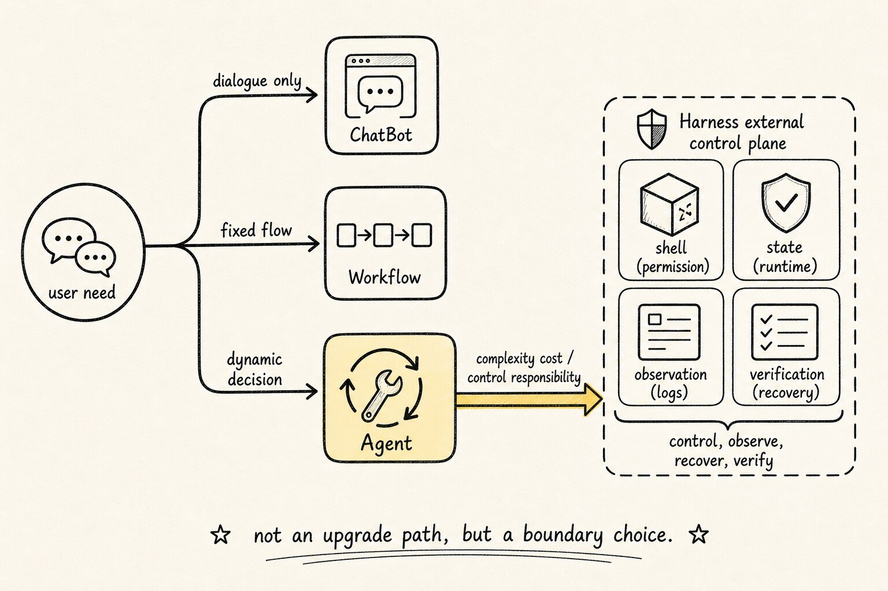
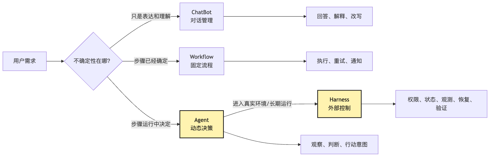
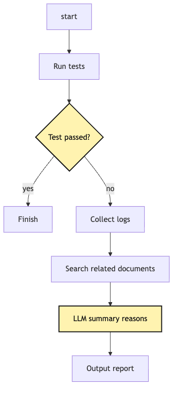
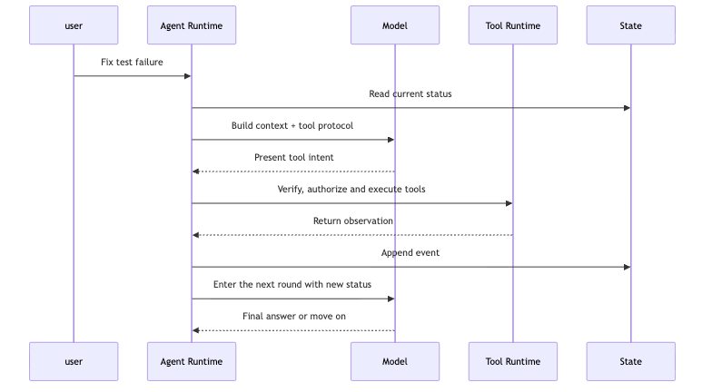
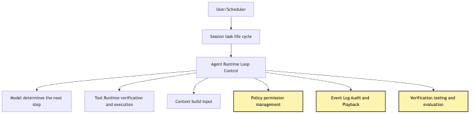
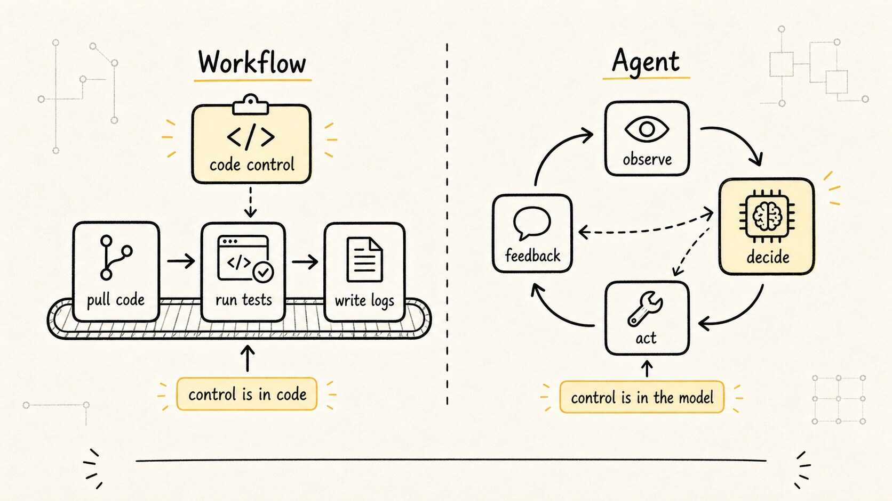
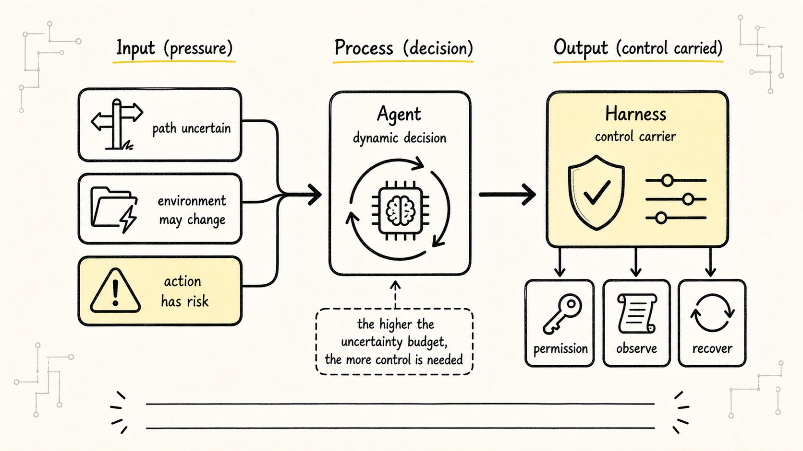

# System Boundaries: The Difference Between ChatBot, Workflow, Agent, and Harness

When people first build Agent systems, they often naturally read them as an upgrade path:

```text
ChatBot is too simple
-> Workflow is more engineered
-> Agent is smarter
-> Harness is more advanced
```

This line is smooth, but it misleads engineering judgment.

`Agent` is not the more advanced default choice.

In real projects, many problems are fully solved by ChatBot; many automations are more reliable as Workflow; only when the task path cannot be written in advance and the system must judge the next step from new evidence at runtime is Agent worth introducing. As for Harness, it is not "one more cool architecture wrapper"; it is the model-external control system that becomes necessary when an Agent enters a real environment and must be stably hosted, permissioned, stateful, logged, recoverable, verifiable, and governed.

We keep using the example from the first two articles:

```text
Help me figure out why this project's tests are failing, and fix it.
```

This sentence looks like an Agent task, but it can be split into four completely different system forms.

If the user only asks:

```text
What usually causes Jest to report Cannot find module?
```

that may be ChatBot Q&A.

If the team has already fixed the diagnosis steps:

```text
pull code -> install dependencies -> run tests -> collect logs -> send to Slack
```

that is more like Workflow.

If the system does not know where the failure comes from and must decide which file to read, which command to run, where to edit, and how to verify, it enters Agent territory.

If that Agent must run for the team every day, recover interruptions, limit permissions, record audits, measure success rate, and replay failed sessions, it starts to need Harness.

So this article does not ask "which concept is more advanced." It asks:

> When should you use ChatBot, when should you use Workflow, when do you need Agent, and when must you build Harness?

Here is the guiding sentence:

**ChatBot solves conversation problems, Workflow solves deterministic process problems, Agent solves dynamic decision problems, and Harness solves stable hosting problems.**

These four are not luxury versions on one line. They are engineering choices for different uncertainty levels and risk boundaries. In real products they can also coexist: one system may have a ChatBot entry, Workflow pipelines, Agent loops, and a Harness that gradually thickens.

## Problem Chain



The problem sequence:

```text
The user only needs understanding and expression
-> ChatBot message management is enough
-> The task steps are already determined and only need execution
-> Workflow is more reliable, cheaper, and easier to test
-> The task path is uncertain and the next step must be judged at runtime
-> Introduce Agent so the model participates in dynamic decisions
-> Once Agent enters a real environment, tools, permissions, state, side effects, and verification appear
-> Model-proposed action cannot directly equal system execution
-> Harness is needed to carry model-external engineering control
```

The most important judgment is:

```text
Agent is not the more advanced default option.
Agent is complexity paid for uncertain tasks.
```

If there is no uncertainty, Agent often adds unnecessary variance. If a task only needs conversation but is built as Agent, the system becomes harder to test, control, and explain. If a process is fully determined but Agent is asked to re-judge every step, you trade reliability that could be encoded for unstable model output.

First, anchor the four boundaries:



The key in this diagram is not the four names, but the central question: `Where is the uncertainty?`

If uncertainty is only in "how the user asks and how the model answers," ChatBot is enough. If uncertainty has already been digested by humans into a flowchart, Workflow is better. If uncertainty must be handled from runtime evidence, Agent has value. If Agent is no longer a one-off script but must run stably, recover, audit, and verify, Harness becomes unavoidable.

Harness is not exactly the fourth, more advanced peer of ChatBot, Workflow, and Agent. More accurately, ChatBot, Workflow, and Agent are task-processing forms; Harness is the engineering system that provides execution boundaries and a control plane when Agent's dynamic process enters a real environment.

## 1. ChatBot: When the Problem Mainly Lives in Conversation

Start with ChatBot.

ChatBot is the easiest layer to underestimate. Many developers hear ChatBot and think "just chatting," not engineered enough. But if the user's real need is understanding, explanation, summarization, rewriting, or Q&A, ChatBot is the lightest, most stable, and cheapest system form.

For example:

```text
What does this Cannot find module error mean?
```

or:

```text
Help me explain the scripts field in package.json.
```

The core is not "execute an action"; it is "make existing information clear." The system usually does:

```text
receive user input
-> organize message history
-> call model
-> return natural language answer
```

Even with product features such as session management, source citations, formatted output, and user preferences, it has not entered "autonomous task execution."

A minimal ChatBot:

```ts
type ChatMessage = {
  role: "system" | "user" | "assistant";
  content: string;
};

async function chat(messages: ChatMessage[]) {
  return model.generate({
    messages,
    temperature: 0.3,
  });
}
```

There is no loop, tool runtime, state machine, or permission system here. That is not a flaw; it is a clear boundary.

ChatBot engineering focuses on:

- how message history is pruned
- how system prompt remains stable
- how reply format is constrained
- how multi-turn conversation preserves context
- how user input is filtered safely
- how model failure degrades

If these solve the problem, do not rush to upgrade it into an Agent.

Once Agent is introduced, many costs appear: the model may choose the wrong tool, tools may fail, state may pollute the next judgment, permissions must be governed, results must be verified, and every step needs retry and replay thinking.

Back to the CLI assistant:

```text
How should I usually debug this test error?
```

ChatBot can provide a debugging approach, even explain pasted logs. But it should not pretend it inspected the project or say "I fixed it."

It did not read files, modify code, or run tests.

The honest boundary of ChatBot is:

```text
I can reason from the information you gave me.
But I have not actively observed the external environment.
```

Many unreliable "looks like Agent" systems cross this boundary. They have no tools and no runtime state, but language makes them sound as if they have acted. Users think the system is doing work; the system is generating descriptions.

The first engineering discipline of ChatBot is:

**Do not treat generated action descriptions as actions that have happened.**

If a system can only chat, make it a good chat system. If it must act, it enters the next boundary.

## 2. Workflow: When Steps Are Determined, Do Not Let the Model Reinvent the Process

Workflow is not about "whether the model can think." It is about "humans already know the process; can the system execute it reliably?"

For example, the team needs a daily CI failure summary:

```text
pull latest code
-> install dependencies
-> run tests
-> collect failure logs
-> generate report
-> send to Slack
```

This chain does not need the model to re-judge every step. It needs stable step order, retry on failure, timeout interruption, per-step logs, traceable results, and similar outputs from similar inputs.

That is Workflow territory.

In this CLI Agent tutorial, suppose we do not yet do "automatic test repair" and only build a fixed diagnosis flow:

```text
1. run npm test
2. if it fails, save logs
3. search failed test name
4. print related file paths
5. let the model summarize possible causes from logs
```

This can be a Workflow. The model only participates in the final summary, not the process decision.

Pseudocode:

```ts
async function diagnoseTestFailureWorkflow(repo: Repo) {
  await repo.install();

  const testResult = await repo.run("npm test");

  if (testResult.ok) {
    return { status: "passed" };
  }

  const symbols = extractFailedSymbols(testResult.output);
  const files = await repo.search(symbols);

  const summary = await model.generate({
    messages: [
      system("You are a test failure analysis assistant."),
      user(renderFailureContext(testResult.output, files)),
    ],
  });

  return {
    status: "failed",
    log: testResult.output,
    relatedFiles: files,
    summary,
  };
}
```

This is not Agent.

The model does not decide what happens next. The process author wrote the path into the program; the model is only a capability inside one node.

Forcing this into Agent form can make it worse:

```text
Should we run tests next?
Should we search files?
Should we generate a report?
Should we notify Slack?
```

These decisions do not need dynamic judgment. Encoding them as Workflow is clearer, cheaper, and more testable.

Workflow's advantage comes precisely from "giving the model less freedom." In deterministic processes, freedom is usually not capability; it is risk. If something should be done the same way every time, write it as process. Do not ask the model to improvise each time.

Typical Workflow forms include:

- CI/CD pipeline
- scheduled task
- data processing pipeline
- approval process
- alert distribution
- fixed report generation
- multi-system synchronization

These systems may call an LLM, but that does not make them Agents. A "Workflow with LLM nodes" is still Workflow.

The key question:

```text
Who decides the next step?
```

If the next step is decided by a flowchart, it is Workflow. If it is decided dynamically by the model from the current task state, it starts approaching Agent.

Diagram:



`LLM summarizes cause` is only a node. It does not take over control. Workflow controls progress.

The first boundary between Workflow and Agent is:

```text
LLM appearing in a process does not turn the process into Agent.
Only when the LLM decides the next process step does the system enter Agent boundary.
```

If Workflow is missing, teams often hand fixed automation to Agent. The result: a path that should be deterministic changes every run; a task that should fail fast wanders around; something testable by unit tests becomes something humans must watch; fixed permissions become an open action space.

These systems demo as "intelligent" and maintain like "uncontrolled scripts."

Workflow's first engineering discipline:

**If the process can be determined, write it as process before giving it to Agent judgment.**

## 3. Agent: When the Task Path Must Be Decided at Runtime

Now we enter Agent.

Agent appears not because "we want the system to be more human," but because some tasks cannot be written as a fixed process.

The task:

```text
Help me figure out why this project's tests are failing, and fix it.
```

has many possible paths: dependency version mismatch, missing environment variable, outdated snapshot, type definition error, business logic regression, bad mock configuration, build script change, filesystem case mismatch, and more.

You can write a giant Workflow covering every case, but it quickly becomes an unmaintainable decision tree. Each new error needs a new branch, and each branch must know which file to read, which command to run, and how to judge the result.

This is where Agent has value:

```text
Let the model choose the next action each round from the current task state.
```

The minimal Agent runtime:

```text
look at current state
-> judge next step
-> propose tool intent
-> system executes under control
-> write result back into state
-> continue judging
```

The key shift:

```text
Part of control moves from a fixed process to the model.
```

Only part.

The model should not own real-world control directly. It only proposes action intent, or tool intent / action proposal. The outer runtime decides whether and how that intent executes, and how execution is recorded.

Minimal Agent loop:

```ts
async function runAgent(task: string, state: AgentState) {
  while (!state.done) {
    const modelOutput = await model.generate({
      messages: buildContext(task, state),
      tools: toolRegistry.schemas(),
    });

    if (modelOutput.type === "final") {
      state.done = true;
      return modelOutput.content;
    }

    const intent = parseToolIntent(modelOutput);
    const observation = await toolRuntime.handle(intent, state);

    state.events.push({
      type: "tool_observation",
      intent,
      observation,
    });
  }
}
```

This pseudocode has fewer fixed steps than Workflow. It does not hard-code that step 1 must run tests, step 2 must search files, step 3 must read files, step 4 must edit. It only fixes the runtime boundary:

```text
the model may judge next step
but the next step must be expressed as intent through the tool protocol
intent must be executed by the system under control
execution result must be written back into state
the loop must be able to stop
```

That is the engineering core of Agent.

Agent is not "the model doing whatever it wants."

Agent is "the model choosing the next step inside a controlled loop."

Sequence diagram:



Two boundaries matter.

The first is between `Model -> Agent Runtime`. The model outputs intent, not an action that already happened.

The second is between `Agent Runtime -> Tool Runtime`. Runtime must validate, execute, and record tool intent, not pass model text directly to the system.

Without these boundaries, Agent degenerates into:

```text
model outputs shell
-> program executes directly
-> failures and side effects cannot be governed
```

That is not mature Agent; it is the common dangerous shortcut of demos.

Agent's benefits are clear: it can face open problems, adjust its path from new evidence, string search, read, modify, and verify into a dynamic process, and build situational understanding in unknown projects.

Agent's costs are equally clear: output instability, non-fixed paths, harder testing, more complex state, necessary permission governance, harder error recovery, and evaluation that is no longer just asserting one function return value.

Agent's first engineering discipline:

**Only let the model participate in next-step decisions when the task path must be decided at runtime.**

Agent is not a default upgrade.

```text
Agent is uncertainty budget.
```

Introducing Agent means admitting part of the path cannot be determined in advance. You must also pay the engineering cost for that freedom. If you do not, Agent becomes "unstable behavior every time," not "dynamic problem solving."

## 4. Harness: When Agent Must Be Stably Hosted

Agent is dynamic decision-making. But a system that can dynamically decide has only just entered the real world.

The real world keeps asking:

```text
Does this tool intent have permission?
Where does this step execute?
Can this task recover after interruption?
Why did the model choose this step?
Which files changed?
Did tests really run?
Can failed sessions be replayed?
Can outputs from different models be compared?
Where is the user approval record?
How is success rate observed in production?
```

These questions belong neither to the model nor to a single tool. They belong to the engineering control system outside Agent.

This is Harness.

Harness is not another Agent.

Harness is not a larger prompt.

Harness is the control plane outside the model. It hosts Agent in a controllable environment.

The CLI Agent may start with a single `runAgent()`. Once a team uses it, these parts grow:

- session id
- event log
- tool registry
- permission policy
- sandbox
- context builder
- checkpoint
- retry policy
- cancellation
- telemetry
- eval runner
- audit trail

These are not architectural neatness. They are survival conditions when Agent enters a real engineering environment.

Remember Harness through ETCLOVG:

```text
Execution: where do commands run? sandbox, timeout, cwd, resource limits?
Tools: how are tools described, discovered, called, and returned as observation?
Context: what should the model see this turn?
Lifecycle: how does a task start, interrupt, resume, and end?
Observability: does every step have event log, trace, replayable evidence?
Verification: how does the system know the task is truly complete?
Governance: who controls permission, approval, audit, and safety boundary?
```

These are model-external engineering responsibilities.

A Harness layer can be simplified as:



The model is only one node. The surrounding control capabilities make the system usable, especially `Policy`, `Event Log`, and `Verification`.

Without permission governance, Agent may take high-risk actions. Without event log, failures cannot be explained or replayed. Without verification, the system can only trust the model saying "I fixed it."

Boundary:

```text
Agent dynamically chooses the next task step.
Harness makes that dynamic process executable, auditable, recoverable, verifiable, and governable.
```

More sharply:

```text
Agent judges the next task step.
Harness judges whether that step can land, where it lands, how it is recorded, and how it is verified.
```

A toy local CLI may not need a complete Harness immediately. But if any of these appear, start building Harness:

- tasks run many turns
- tools create real side effects
- high-risk actions need user confirmation
- sessions must recover after interruption
- results must be tested or evaluated
- multiple users share the system
- Agent runs on a schedule
- the team analyzes failure causes
- different prompts, models, and tool policies must be compared

Harness is not "making Agent heavier." Its goal is to put uncertainty into governable boundaries.

Agent brings freedom.

Harness adds guardrails, dashboards, and black-box recorders around that freedom, without turning the freedom itself into determinism.

Harness does not magically make Agent reliable. More accurately, Harness lowers the complexity of connecting Agent to real engineering flows; reliability still depends on task design, tool boundaries, context policy, permission control, failure recovery, and evaluation.

Without Harness, many Agent failures are not "the model is not smart enough," but missing intermediate state, missing tool output, no read/write distinction, verification outside the loop, context too long, no recovery point, no permission approval, no eval baseline.

These are not solved completely by a stronger model because they happen outside the model.

Harness's first engineering discipline:

**Do not expect the model to carry responsibilities that belong to the runtime system.**

The model judges. Harness hosts the environment where judgment happens.

## 5. Comparison: Not Ability Levels, But Control Boundaries



Comparison table:

| System / Control Form | Core Question | Who Decides Next Step | External Environment | Main Risk | Good For |
| --- | --- | --- | --- | --- | --- |
| ChatBot | How to answer and explain | user-model conversation | usually no active contact | hallucination, context misunderstanding | Q&A, summary, explanation, rewrite |
| Workflow | How to execute a deterministic process stably | predefined process | can contact, but path is fixed | missing branches, external system failure | CI, approval, reporting, sync |
| Agent | How to progress in uncertain tasks | model dynamic judgment | controlled through tools | unstable path, complex permission and state | debugging, code modification, research, open tasks |
| Harness | How to host Agent stably | Agent judges task step; Harness controls execution boundary | controlled contact | missing audit, recovery, evaluation, governance | team-level Agent, automation, long tasks |

The table is about engineering selection, not definitions to memorize.

The key is not "does it have an LLM," but "how much decision freedom and engineering control does it need?"

ChatBot's freedom is in conversation.

Workflow's freedom is narrowed by process.

Agent gives part of next-step selection to the model.

Harness places Agent freedom inside a larger control system.

So do not ask:

```text
Does it look intelligent?
```

Ask:

```text
Who decides the next step?
Who executes external actions?
Who records state?
Who carries risk?
Who explains failure?
Who verifies completion?
```

These questions are more reliable than concept labels.

A system may have Agent but weak Harness. These systems usually demo well and run painfully.

A system may have strong Workflow and strong Harness but almost no Agent. A highly standardized CI platform does not need the model to decide the next step, but needs strong scheduling, logs, permission, and recovery.

The four are boundaries, not ranks.

When the boundary is chosen wrong, all later technical choices bend out of shape.

### Pattern Is Not Identity; Control Is Identity

Another subtle misunderstanding: using many "Agentic Design Patterns" does not make a system an Agent.

Prompt Chaining can look like Agent. It breaks a large task into multiple steps:

```text
user input
-> step 1 extracts structured information
-> step 2 adds context
-> step 3 generates answer
-> step 4 checks format
```

There are multiple model calls and intermediate state, so it looks "intelligent." But if each step is prewritten by the program and the model is only the executor inside each node, it is still closer to Workflow. Key control lies in the flowchart, not the model.

Routing is similar. The system may first ask the model which category the user request belongs to:

```text
bug diagnosis -> diagnostic flow
document summary -> summary flow
code explanation -> explanation flow
small talk -> ChatBot
```

This is more flexible than one path. But if candidate paths are predefined and the model only classifies, it is still a dynamic branch in Workflow. The Agent boundary is entered when the model keeps choosing the next step from new observations during execution, and the next-step set is not a fixed small menu but must be determined from the goal, tool results, state, and budget.

Parallelization is also not Agent. Calling many models, tools, or analyzers in parallel only says the execution structure is fan-out / fan-in. The key remains:

```text
Who decides what to parallelize?
Who decides how results merge?
Who decides the next step after failure?
Who saves state and evidence?
```

If these are decided by program flow, it is a complex Workflow. If the model continues rewriting tasks, choosing tools, and updating plans from observations, it begins entering Agent.

The professional boundary question is not:

```text
Does it have LLM?
Does it have multiple steps?
Does it have tools?
Does it have parallelism?
```

It is:

```text
Where is next-step control?
Who constrains external side effects?
Who saves factual state?
Who judges completion evidence?
```

That is why some systems look like Agents but are Workflows when you read the code; and some systems look like CLI tools, but because the model owns runtime next-step choice, they already need Agent Runtime control mechanisms.

### Uncertainty Budget: When It Is Worth Letting the Model Decide Next Step



Once Workflow and Agent are separated, a practical design principle appears:

**Agent is uncertainty budget.**

You do not use Agent because it is "more advanced." You use it because the task truly has uncertainty that cannot be written into a process in advance.

In "fix failing tests," if the failure type is always fixed, such as only checking whether `moduleNameMapper` lacks a path alias, Workflow is enough:

```text
run tests
match Cannot find module
read tsconfig
read test config
generate fix suggestion
```

But if failures may come from dependency versions, async races, database state, mock config, time boundaries, platform differences, test order pollution, cache issues, or inconsistent type output, the fixed process quickly expands into an endless troubleshooting manual.

That is where Agent is useful. It does not replace all process; it handles judgments that cannot be enumerated in advance:

```text
Which file should be read next?
Which signal matters in this log?
Should the hypothesis be verified first, or should code be changed first?
After the fix fails, should we roll back or change direction?
Is this failure caused by model judgment or incomplete tool result?
```

Uncertainty is not free. Giving next-step choice to the model costs:

```text
state cost: record why it did this
permission cost: limit what it can do
verification cost: do not trust it saying done
observability cost: know where failure happened
evaluation cost: know whether prompt, tool, or model changes regressed
```

Good Agent design does not "give the model more freedom." It leaves only necessary uncertainty to the model and pulls deterministic parts back into Workflow, Tool Runtime, Policy, and Verification.

In one sentence:

```text
Workflow digests uncertainty into process in advance.
Agent leaves part of uncertainty for runtime handling.
Harness puts runtime uncertainty inside governable boundaries.
```

## 6. Boundary Judgment in the Same CLI Scenario

Use the same "fix failing tests" scenario in four engineering forms.

User pastes a log:

```text
FAIL src/user.test.ts
Cannot find module '@/lib/db'
```

If the system answers "this usually means the test runner does not recognize path aliases; check `tsconfig paths`, `jest moduleNameMapper`, or `vitest alias`," it is ChatBot. Its input is user-provided text; its output is explanation and advice; side effects are zero. It is useful, but cannot say "I fixed it."

If the system runs a fixed process:

```text
npm test
-> save failure log
-> parse failed filename
-> grep moduleNameMapper
-> give logs and search results to model for summary
```

it is Workflow. It really touches the project, but next step is decided by the process. When the failure is within the process coverage, it is very stable. When the failure is outside, it stops with a bounded report. That is not a flaw; it is the Workflow boundary.

If the system runs tests first, then searches config, reads `vitest.config.ts`, edits alias, reruns tests, and if failure continues adjusts from new logs, it is Agent. These steps are not prewritten; the model chooses from current evidence. Therefore it must have tool protocol, permission, state, and verification, or it may edit the wrong file or interpret a failure as success.

Repeat the boundary: "read config," "modify alias," and "rerun tests" are only action intents. Tool Runtime and Execution actually read files, modify files, and run commands. Without this separation, model description is easily mistaken for fact.

If this Agent must automatically check multiple repositories every day for a team, it enters Harness. The system must create a session for every run, checkout the repo in a sandbox, restrict tools, record model output and tool intent, route high-risk writes through confirmation or policy, run verification after modifications, save diff, logs, and final state, support replay on failure, and measure success rate and failure types.

Full evolution:

```text
ChatBot: explains logs, but does not execute.
Workflow: follows a fixed diagnostic flow, but does not dynamically decide.
Agent: chooses next step from evidence, but every step must pass runtime constraints.
Harness: hosts Agent and makes the dynamic process controllable, auditable, recoverable, and verifiable.
```

Engineering decision tree:

```text
1. Does the user only need explanation, summary, rewriting, or Q&A?
   yes -> ChatBot

2. Can execution steps be written as a stable process in advance?
   yes -> Workflow

3. Must next step be decided from new runtime observations?
   yes -> Agent

4. Will this Agent run long-term, create side effects, serve multiple users, need recovery and audit?
   yes -> Harness
```

This tree intentionally puts Workflow before Agent, because many systems do not lack Agent; they lack a good Workflow.

For example, "automatic daily report" is primarily Workflow if data source, format, and delivery channel are fixed. The LLM may write natural language, but it should not decide today whether to query the database, send email, or skip a department.

"PR check" is also Workflow if rules are clear:

```text
run tests
run lint
check changelog
check security scan
generate summary
```

Agent becomes valuable when the system must decide from diff content which files to read, what context to ask for, which targeted tests to run, and how to locate complex regressions.

Bad smells of premature Agentization:

```text
prompt contains many fixed steps but still lets the model decide every round.
there is only one universal shell tool, with no structured protocol.
after the model outputs a tool call, the system executes directly.
there is no clear stop condition.
tool results are not written as an event stream.
suggestions and executed actions are not distinguished.
there is no verification step, but the model may declare completion.
after failure, only the final answer is visible; the process cannot be replayed.
```

Common root:

```text
the system gives engineering control to model language.
```

Model language is excellent at expression and reasoning, not runtime responsibility. So when designing Agent systems, the first question should not be "how to make it more autonomous," but:

```text
Which degrees of freedom are truly necessary?
Which should be pulled back into process, protocol, and policy?
```

That is the start of Harness thinking.

## 7. Load-Bearing Chain: From One Request to Hostable Execution

Compress the article into one load-bearing chain. The user says:

```text
Help me fix the failing tests in this project.
```

The system can handle it in four ways:

```text
ChatBot:
user input -> message history -> Model -> natural language advice

Workflow:
user input -> fixed process -> command/read/LLM nodes -> report

Agent:
user input -> Agent Runtime -> Model decision -> Tool Intent -> Tool Runtime -> Observation -> State -> next turn

Harness:
user input / schedule -> Session -> Agent Runtime -> Policy/Tools/Execution/Context/Event Log/Verification -> recoverable result
```

These chains decide capability and cost. If you only need the first but build the fourth, the system is overcomplicated. If you need the fourth but build only the first, the system manufactures hallucinations. If you need the third but miss parts of the fourth, the system can run but will not be stable.

That is why this tutorial advances gradually. We will not start with a full Harness. We start from the minimal Agent loop:

```text
Model -> Loop -> Tools -> State
```

Then we add Provider Runtime, Tool Runtime, Context Engineering, Memory, Permission, Session, Observability, Verification, Multi-Agent, and Hosted Harness. Each layer is added not for architecture aesthetics, but because the previous layer exposes a new real-task failure mode.

This article's job is to pin down boundaries. Later, when discussing Tool Runtime, remember: tools are not ChatBot decoration; they are the protocol boundary through which Agent interacts with the real world. When discussing Context Engineering, remember: more context is not automatically better; context is the task-state projection needed for this Agent turn. When discussing Harness, remember: Harness is not a smarter Agent; it is the external system that keeps Agent execution under control.

## Summary: Choose the Boundary Before the Technology

Four sentences:

```text
ChatBot: conversation problem; use the model to generate answers.
Workflow: deterministic process; use program flow for stable execution.
Agent: uncertain task; let the model dynamically decide inside a loop.
Harness: hosted Agent; use external systems to govern execution, state, permission, observability, and verification.
```

Shorter:

```text
Being able to chat does not mean being able to execute.
Being able to execute does not mean needing dynamic decisions.
Being able to decide dynamically does not mean being stably hostable.
Stable hosting needs Harness to carry model-external responsibility.
```

When facing a new requirement, do not rush to say "let's build an Agent." First ask: where exactly is the uncertainty?

If uncertainty is in expression, use ChatBot. If it has been digested into process, use Workflow. If it must be handled at runtime, use Agent. If that Agent enters real use, use Harness.

The next article asks a deeper question: what exactly is Harness? Why is it not a framework name, and not a bigger Agent? What model-external responsibilities does it own? We will split Harness into Execution, Tools, Context, Lifecycle, Observability, Verification, and Governance, drawing the control-system map for the rest of the tutorial.

## Teaching Harness Landing Point

The teaching project can expose two entries to show this boundary: `POST /api/prompt` as a simple debugging path, and `/api/runs` plus event streaming as the Harness-like run path. Deterministic workflow belongs in the API or tests; the model enters the loop only when the next step depends on observations. This teaches that not every automation needs an Agent. You need an Agent Loop when the next action depends on what the system just observed.

---

GitHub source: [00-03-chatbot-workflow-agent-harness.md](https://github.com/LienJack/build-harness/blob/main/docs/en/00-03-chatbot-workflow-agent-harness.md)
