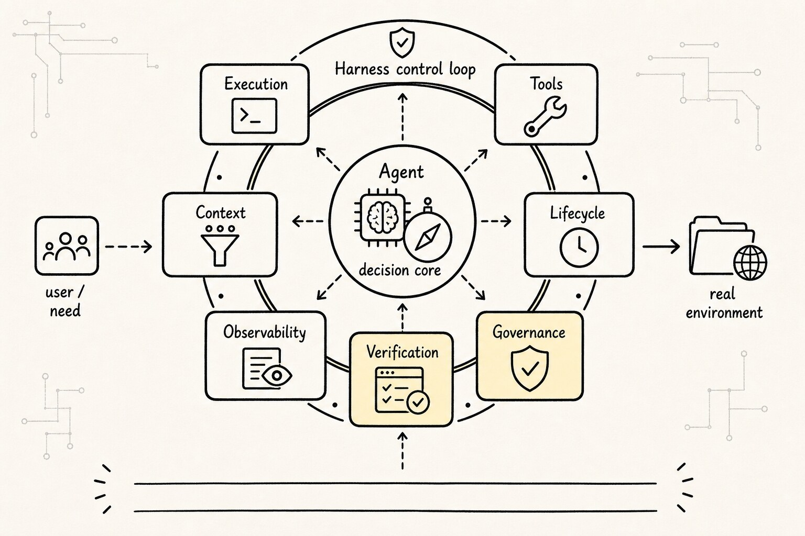
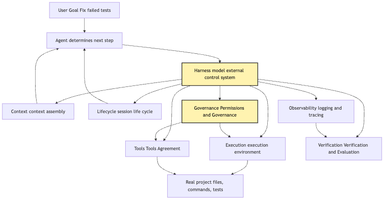
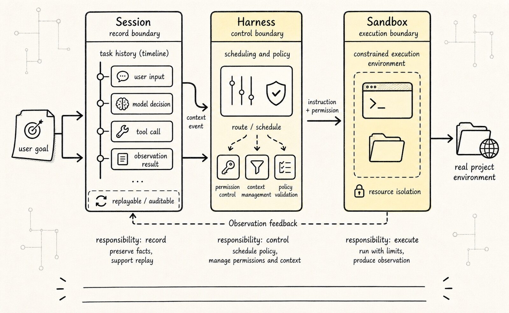
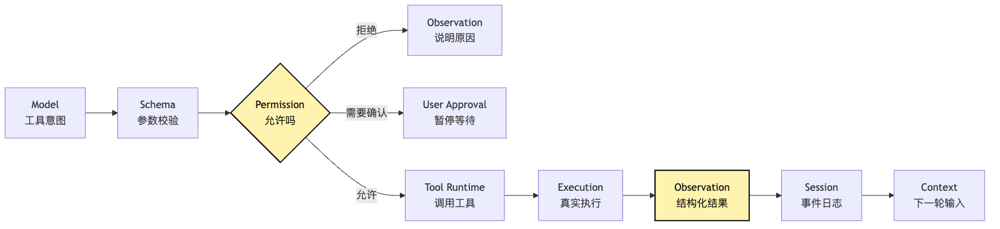
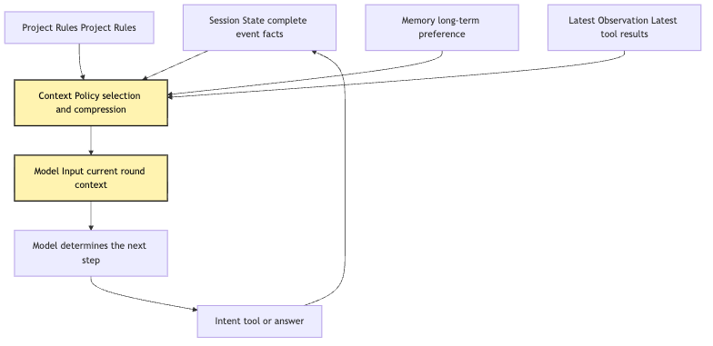
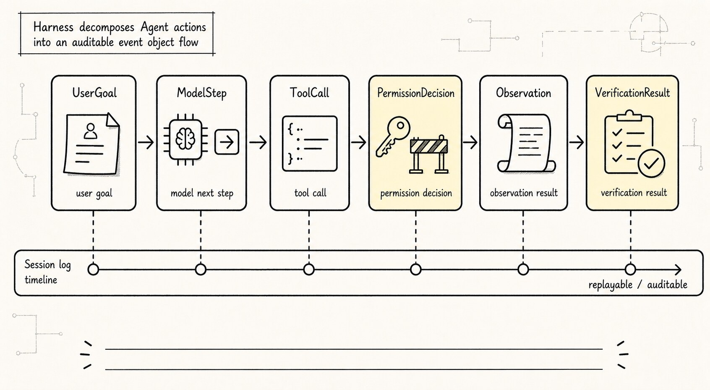

# Harness Base Definition: The Control System Outside the Model

Previously, we split Agent into several minimal parts:

```text
Model: judge the next step
Loop: keep the process moving
Tools: interact with the real world
State: keep the task connected
```

At this point, a natural question appears:

**If Agent already has model, loop, tools, and state, why talk about Harness?**

An even easier confusion is:

```text
Is Harness a higher-level, smarter Agent that manages other Agents?
```

That sounds plausible, but it bends the architecture in the wrong direction. Harness is not another Agent. It is not a larger prompt, and it is not a framework name. It is the control system outside the model. Continue with the same small CLI Agent:

```text
User says: help me figure out why this project's tests are failing, and fix it.
```

If this CLI Agent is only a demo, it can be simple:

```text
send user input to model
model says read file
program reads file
put result back into prompt
model says edit file
program edits file
model says run tests
program runs tests
```

This chain can work once and already look like an Agent. But as soon as someone else really uses it, questions appear. What if the model wants to execute `rm -rf`? What if it wants to read private files under the user's home directory? If it runs for ten minutes and the user interrupts, how is the working state saved? After a tool error, should the next model turn see the full log or only a summary? If the same task continues tomorrow, where does the session resume from? If a modification looks successful but no test verified it, how does the system know it is done? If a user says the Agent damaged a file, how do we reconstruct what happened?

These questions do not belong to the model itself. They should not be left for the model to decide. The model only generates the next-step judgment from the current context. Permission, execution environment, session lifecycle, observability logs, verification criteria, and governance policy are engineering responsibilities outside the model. Together, those responsibilities are Harness.

One sentence:

**Agent judges the next step in a task; Harness makes each step executable, constrained, observable, recoverable, verifiable, and governable in the real environment.**

Frameworks may provide parts of Harness, but Harness is more a set of model-external engineering responsibilities than a package name or product name.

This article does not turn Harness into a giant terminology box. It answers one core question:

> What is the relationship between Harness and Agent? Why is Harness not another Agent?

## Problem Chain



The problem sequence:

```text
Once Agent can call tools
-> it must distinguish "model proposal" from "system execution"
-> system execution needs permission, sandbox, budget, and error handling
-> once the task becomes long
-> it needs session, lifecycle, interrupt, and recovery
-> once the product is used by others
-> it needs trace, eval, regression, and governance
-> these model-external responsibilities together
-> are Harness
```

Harness does not appear to make architecture look advanced. It is the control plane forced out by reality when Agent enters a real engineering environment. A seven-layer map can be remembered as:

```text
ETCLOVG

Execution
Tools
Context
Lifecycle
Observability
Verification
Governance
```

Diagram:



The key is not the seven names. The key is the responsibility boundary:

```text
Agent proposes next step
Harness decides whether that step can execute, how it executes, how it is recorded, and how it is verified
```

The model remains the reasoning core. It understands the user goal, reads context, and proposes next action. But it does not directly own the filesystem, shell, permissions, or long-term memory and audit records. Those belong to Harness.

## 1. Why Harness Appears as Soon as Tools Appear

A minimal chat app does not need Harness. It only needs to manage messages:

```text
user input
-> model answer
-> show result
```

Here model output is only text. If text is wrong, the user ignores it. If incomplete, they ask again. Text has no side effects.

Agent is different. When it can call tools, model output is no longer only "answer"; it becomes "action proposal." For example:

```json
{
  "tool": "bash",
  "input": {
    "cmd": "npm test"
  }
}
```

This is not ordinary text. It is an application to enter the real environment. The system must answer:

```text
Does this tool exist?
Are arguments valid?
Does this session allow shell?
Will this command modify files?
Does it require user confirmation?
Which working directory should it run in?
What is the timeout?
How is long output truncated?
How is failure fed back to the model?
```

Without Harness, these questions get collapsed into:

```text
Whatever the model wants, we help it do.
```

That is the danger of many Agent demos. They treat the model's action intent as a system command. In short tasks this may be fine. Once connected to a real codebase, it becomes an incident entry point.

In our CLI Agent, the model may propose:

```text
read package.json
search failed test name
open related source file
modify implementation
run tests
```

All sound reasonable, but their risks differ. Reading files differs from writing files. Running `npm test` differs from running arbitrary shell. Modifying the current repo differs from modifying the user's home directory. Running local commands differs from network access.

Harness's first value is turning "the model said so" into "the system reviewed and executed it." This difference is crucial. In implementation, model output should be seen as intent. Harness receives intent and turns it into action, a controlled action. Minimal pseudocode:

```ts
while (!session.done) {
  const modelInput = harness.context.build(session);
  const intent = await model.next(modelInput);

  const decision = await harness.policy.review(intent, session);

  if (decision.type === "deny") {
    session.appendObservation(decision.reason);
    continue;
  }

  if (decision.type === "ask_user") {
    session.pauseForApproval(decision.prompt);
    continue;
  }

  const observation = await harness.execution.run(decision.action);
  session.appendObservation(observation);
}
```

The model is not calling tools here. It produces `intent`. Harness places `intent` into policy, execution, session, and observation boundaries.

That is the first reason Harness is not another Agent:

**Harness does not think of the next step for the model; it places the model's next step inside engineering constraints.**

## 2. Where Is the Boundary Between Agent and Harness?

Draw a runtime boundary. For "fix failing tests," one full turn looks like:


The `Model -->> Harness` arrow matters. The model returns tool intent, not tool result. `Tool Runtime` and `Execution` touch the project environment. `Session Store` saves factual process. The policy layer inside Harness decides whether execution is allowed.

When this boundary blurs, three common problems appear.

First: Agent becomes "model plus naked executor":

```ts
while (true) {
  const output = await model(prompt);
  if (output.includes("bash")) {
    const result = await exec(output.command);
    prompt += result;
  }
}
```

This code is short, but hides all key issues: no permission, no structured tool protocol, no interruption recovery, no audit, no verification, no context policy. It only proves "the model can drive one external action," not "the system can host a real task."

Second: Harness is imagined as "another Agent supervising the Agent." For example, using an outer model to decide whether the inner model may execute a command. This can be part of policy in some scenarios, but it is not the essence of Harness. Harness's key capability is not "reason again"; it is deterministic engineering control:

```text
paths must be inside workspace
file writes must go through patch
shell commands must have timeouts
dangerous commands must ask the user
every tool call must land in the event log
test verification must bind to final completion state
```

These rules should not be entirely left to another model's free judgment. They should be system policy, type constraints, runtime checks, and audit records.

Third: Harness is treated as an optional "product layer." That is also wrong. Harness is not only UI, deployment, account, or billing. It exists from the minimal CLI stage. Once you distinguish:

```text
model proposal
system execution
execution result written back to state
next-turn context assembled again
```

you are already writing Harness. Early Harness is only thin. It thickens as Agent faces real tasks.

### Harness Is Not a Wrapper, But a Control Loop

If Harness is understood only as a "wrapper around Agent," one layer is still missing.

A wrapper feels like thin adapter code: receive input, call Agent, return output. Real Harness is more like a control loop. Before model action, it provides feedforward constraints. After action, it collects feedback signals. Then it uses those signals to adjust the next model input, tool visibility, permission policy, budget, and verification requirements.

In a CLI Agent run:

```text
Feedforward constraints:
system instruction, visible tools, working directory, budget, permission mode, project rules

Model judgment:
generate text or tool intent

Execution feedback:
tool result, error type, file changes, cost, latency, user approval result

State update:
session event, context projection, trace, verification evidence

Next-turn constraints:
reduce visible tools, compact context, require verification first, pause for user, end task
```

Harness is not "one more model outside the model." Its value is placing dynamic model judgment in an engineering system with sensors, constraints, feedback, and state.

Without this control loop, the system may still run:

```text
model -> tool -> model -> tool -> final
```

But it does not know whether tool choices are getting worse, why cost rises, whether a failure was permission rejection, tool error, context pollution, or model misjudgment, or what should change next turn.

Boundary sentence:

```text
Agent produces action intent; Harness regulates action conditions.
```

"Regulates" matters. Harness not only executes; it constrains, senses, and feeds back.

### Session, Harness, Sandbox: Do Not Collapse Them Into One Object



Mature Agent systems often split three things:

```text
Session: source of truth, records what happened in this task.
Harness: control loop, decides how the next step runs.
Sandbox: execution hand, actually touches files, commands, network, and external systems.
```

If these are collapsed into one process object, early writing is fast and later maintenance is painful.

In a minimal demo, an in-process variable may hold:

```text
messages
cwd
tool results
current plan
permission state
temporary files
running process handles
final answer
```

This works for one run. But if the process crashes, all facts vanish. If the sandbox is cleaned, the session disappears. If the user wants to continue tomorrow, the system can only guess from a compressed summary.

Separating responsibilities helps.

Session is not messages. Messages are only the projection visible to the next model turn. Session should record a fuller event ledger:

```text
UserMessage
ModelIntent
ToolValidated
PolicyReviewed
ApprovalRequested
ApprovalGranted
ToolStarted
ToolFinished
ObservationAppended
ContextCompacted
VerificationRun
TaskCompleted
TaskBlocked
```

Harness can resume around session. Even if the control process crashes, reading the session log reveals the user goal, executed tools, permission decisions, file changes, verification results, and unfinished work.

Sandbox is replaceable execution. It may be a local working directory, temporary git worktree, container, remote VM, browser environment, or hosted execution pool. Sandbox crash should not equal task disappearance. It should become a recorded execution failure, then Harness decides retry, environment change, rollback, or asking the user.

This three-way split avoids a common mistake: treating "the process currently running the Agent" as the system source of truth. Processes die. The source of truth should be session. The execution hand can be replaced. The control loop can restart.

## 3. Execution: The Model Cannot Stand Directly on the Operating System

The first ETCLOVG layer is Execution. It asks:

```text
Where, as whom, and under which limits does the model-proposed action run?
```

In the CLI Agent, Execution must know:

```text
current working directory
accessible file range
available environment variables
command timeout
maximum output length
whether network is allowed
whether file writes are allowed
whether background processes are allowed
```

Without an Execution layer, tool calls run directly against the operating system. For a personal demo this may be tolerable. For an Agent used by others, it is dangerous. If the user only expects the Agent to fix the current repository, and the model proposes:

```text
/Users/alice/.ssh/id_rsa
```

do not expect the model to realize "this should not be read." Harness must stop it in Execution.

Likewise:

```bash
npm test
```

looks safe, but the test script may start services, write cache, access network, or run for a long time. Execution must provide timeout, output truncation, process cleanup, and working-directory isolation, or ordinary tests can hang the Agent.

A minimal Execution interface:

```ts
type ExecutionRequest = {
  kind: "read_file" | "write_file" | "shell";
  cwd: string;
  args: unknown;
  timeoutMs: number;
  allowedPaths: string[];
  sessionId: string;
};

type ExecutionResult = {
  ok: boolean;
  stdout?: string;
  stderr?: string;
  changedFiles?: string[];
  exitCode?: number;
  truncated?: boolean;
};
```

The point is that "execution" becomes a governable object. The model cannot bypass it. Tools should not bypass it privately. UI should not bypass it directly. Every action that interacts with the real environment passes through Execution. This is Harness's first gate to reality.

## 4. Tools: Not Functions, But Protocol Entrypoints

The second layer is Tools. Execution is closer to the OS. Tools are closer to the model. They ask:

```text
Which capabilities can the model see?
In what structure should it submit them?
How does the system turn tool results into observation?
```

Many minimal Agents define tools as functions:

```ts
async function readFile(path: string) {
  return fs.readFile(path, "utf8");
}
```

The function is fine. But if exposed to Agent, it also needs protocol:

```text
tool name
input schema
read-only or write
whether confirmation is needed
whether it can run concurrently
how errors are expressed
how results are trimmed
whether results enter context
```

Otherwise the model and system can only guess through natural language. Tool protocol turns "I want to read a file" into a structured request. Tool runtime turns the structured request into controlled execution. A full tool pipeline:



`Observation` is easily missed. Tool result cannot be only stdout. It must tell the system:

```text
whether this call succeeded
whether output was truncated
which files were read
which files were modified
whether a recoverable error occurred
what the next model turn should see
what the UI should show
what the audit log should save
```

Returning only strings is convenient short-term, but it makes all later mechanisms harder. Context does not know what to retain. Lifecycle does not know how to recover. Observability cannot investigate. Verification cannot know what to verify. Governance cannot know whether a boundary was crossed.

So Tools is not "more capabilities is better." Its real work is protocolizing capability entrypoints. For a small CLI Agent, four tools may be enough:

```text
read_file
search
apply_patch
run_command
```

But all four should go through the same protocol. Tool count can be small. Tool boundaries cannot be vague.

## 5. Context: Harness Assembles What the Model Sees Each Turn

The third layer is Context. It asks:

```text
What exactly should the model see this turn?
```

This looks like prompt concatenation, but in Agent it is much more complex. Long tasks accumulate:

```text
original user goal
project rules
files read
search results
test logs
modification records
permission refusals
user approvals
model's own plan
previous tool result
```

Putting everything into prompt creates three problems: token explosion, old and new information polluting each other, and irrelevant detail distracting the model. Context is not "save all state." It projects the workbench the model needs this turn from state:

```text
State is the fact store.
Context is this turn's view.
Memory is cross-session experience.
Prompt is the final input format.
```

Harness must separate these. In the CLI Agent, Session Store may save the full test log, but the next model turn may only need:

```text
test command: npm test
failed file: src/parser.test.ts
error summary: expected 3 but received 2
recent modification: near line 42 of src/parser.ts
constraint: only modify current workspace
```

Context prepares a clean, relevant, constrained decision context. It does not think for the model.

Diagram:



`Context Policy` is key. Many Agent failures are not because the model cannot reason, but because Harness shows it a messy context: obsolete logs from 30 minutes ago placed before latest observation, a user-rejected plan kept in high-priority context, or dependency install logs crowding out relevant code.

Context's goal is not "more information." It is:

```text
complete enough
fresh enough
relevant enough
explainable enough
```

Without Context, Agent gradually goes blind in long tasks. With Context, each model turn returns to an organized workbench.

## 6. Lifecycle: Long Tasks Are Not One Endless while true

The fourth layer is Lifecycle. It asks:

```text
Which states does an Agent task go through from start to finish?
```

Minimal demos often write:

```ts
while (true) {
  const intent = await model.next(context);
  const result = await run(intent);
  context.push(result);
}
```

This can run. But real tasks are not endless `while true`. They can be interrupted by users, wait for approval, enter recovery after tool failure, pause after budget exhaustion, complete after tests pass, block due to insufficient permission, or require re-judgment after network, file conflict, or concurrent modification.

Harness must model task lifecycle explicitly. The point is not pretty state names; it is admitting tasks break. An Agent for real users cannot assume the user sits there until one run finishes, that every tool succeeds, or that every model turn goes in the right direction.

Lifecycle saves process boundaries:

```text
when the task started
where it is stuck
why it paused
what the user approved
which actions already executed
which actions can be retried
which actions cannot be retried
what the completion condition is
```

This naturally leads to Session. Session is not chat history. It is the long-task source of truth. It should save events, not only prompts:

```text
UserMessage
ModelIntent
PolicyDecision
ToolStarted
ToolFinished
FileChanged
ApprovalRequested
ApprovalGranted
VerificationPassed
TaskCompleted
```

With these events, the system can replay. Replay enables debugging. Debugging enables improvement. Recovery enables hosting long tasks. Without Lifecycle, every Agent run is a gamble: successful runs look magical; failed runs are hard to review.

## 7. Observability: No Fact Log, No Improving Agent

The fifth layer is Observability. It asks:

```text
When Agent makes a mistake, how do we know where it went wrong?
```

For normal programs, logs, metrics, and traces are common sense. Many Agent demos ironically lack this foundation. They only save the final conversation. When a user says "it changed my files incorrectly," developers can only inspect a vague transcript. That is not enough.

Agent failures can happen at many layers:

```text
the model misunderstood the user goal
Context included stale information
tool schema was too loose
permission policy allowed a dangerous action
shell timed out but was not marked
tool output was truncated without telling the model
tests failed but the final answer said done
an action the user rejected was executed again
```

Without Observability, all these collapse into:

```text
the model is unstable.
```

That sentence has almost no engineering value. Harness observability must split a task into inspectable event chains. At minimum, it should answer:

```text
what was the original user goal
what did the model see each turn
what did the model propose each turn
what did the system allow or reject
what did tools actually execute
what did tools return
which outputs were truncated
which files changed
what was the verification command
where did final completion judgment come from
```

That is the value of trace. It is not for a pretty dashboard; it lets failures be attributed to the right layer. If tests are not fixed, causes may differ completely:

```text
the model did not read the right file
search did not find the test name
Context trimmed the key log
apply_patch modified the wrong place
run_command ran the wrong test command
Verification did not treat failing exit code as failure
```

Each cause has a different fix. Without observability, you blindly tune prompt. With observability, you can tune Context, Tool, Execution, Verification, or model instruction appropriately.

Observability is Harness's basis for long-term improvement. It returns Agent from mystical tuning to engineering diagnosis.

## 8. Verification: Completion Is Not Decided by the Model

The sixth layer is Verification. It asks:

```text
Why should the system believe the task is complete?
```

In chat apps, if the model says "I have explained it," that is usually enough. In programming Agents, it is not. The user asks the CLI Agent to fix failing tests. The model's final answer:

```text
I have fixed the issue.
```

is not completion evidence. Real evidence should come from external verification:

```text
relevant tests pass
no new failures introduced
modification scope is expected
key files were actually updated
user constraints were not violated
```

Verification changes "model claims done" into "system verified done." Minimal implementation:

```ts
type VerificationPlan = {
  commands: string[];
  expectedFiles?: string[];
  successCriteria: string[];
};

async function verifyFix(plan: VerificationPlan) {
  for (const command of plan.commands) {
    const result = await execution.run({
      kind: "shell",
      args: { command },
      timeoutMs: 120_000,
    });

    if (!result.ok) {
      return { ok: false, reason: result.stderr ?? result.stdout };
    }
  }

  return { ok: true };
}
```

Verification is not always running tests. Different tasks need different evidence:

```text
documentation task: check links, headings, format
refactor task: run unit tests, typecheck, lint
data task: validate row count, schema, samples
deployment task: check health probe, logs, rollback point
research task: preserve source, time, citation chain
```

Principle:

```text
completion state cannot come only from model language.
completion state must bind to external evidence.
```

Without Verification, Agent easily hallucinates completion. It may edit one file but not run tests, run tests but the wrong command, ignore failure in the summary, or fix only the first error while marking the task complete. Harness must stop these cases.

Verification often sits next to Observability. Observability says what happened. Verification says whether it met the bar. Together they move Agent from "can do work" to "can finish work."

## 9. Governance: The Stronger the Agent, the More It Needs Boundaries

The seventh layer is Governance. It asks:

```text
Under which rules, and for whom, does this Agent work?
```

If Execution is low-level runtime restriction and Tools are capability entry protocols, Governance is higher-level policy. It cares not only whether one command may run, but also:

```text
different users have different permissions
different workspaces have different policies
which tools are read-only by default
which actions require second confirmation
which data cannot enter model context
which logs need redaction
which memory may be saved long-term
which external services may be called
which tasks need human acceptance
```

For a personal CLI, Governance can be thin:

```text
only access current repository
file writes must go through auditable patch
dangerous shell commands must ask the user
```

In a team environment, governance quickly grows. Projects have different rules. Some repositories cannot upload code snippets. Some commands cannot run outside CI. Some files contain secrets. Some users can read but not write. Some tasks must leave audit records.

The model cannot reliably follow these by self-discipline. Harness must turn them into policy.

A simple policy check:

```ts
function reviewAction(action: Action, session: Session): PolicyDecision {
  if (!isInsideWorkspace(action.path, session.workspace)) {
    return { type: "deny", reason: "path outside workspace" };
  }

  if (action.kind === "shell" && isDestructive(action.command)) {
    return { type: "ask_user", prompt: "Dangerous command requires confirmation" };
  }

  if (action.kind === "write_file" && session.mode === "read_only") {
    return { type: "deny", reason: "session is read-only" };
  }

  return { type: "allow" };
}
```

This code is ordinary, and that is exactly the point. Harness does not solve problems by being "smarter"; it solves them by making boundaries clear. This is the fundamental difference between Harness and Agent. Agent's value comes from judgment under uncertain tasks. Harness's value comes from control under clear boundaries. They are not intelligence layers above and below each other. They are different responsibility layers.

## 10. Applying ETCLOVG to a Small CLI Agent

Return to the example. A small Claude Code-style CLI Agent that helps the user fix failing tests can start with a minimal Harness like this:

```text
src/
  agent/
    loop.ts
    model-client.ts
  harness/
    execution.ts
    tools.ts
    context.ts
    lifecycle.ts
    trace.ts
    verification.ts
    policy.ts
  session/
    event-log.ts
    store.ts
  cli/
    main.ts
```

These are not recommended fixed directory names. They emphasize that responsibilities should not be mixed.

`agent/loop.ts` advances model turns. It should not directly `exec` shell.

`harness/execution.ts` runs commands and file actions. It should not decide how the model thinks next.

`harness/tools.ts` handles tool protocol and observation. It should not secretly bypass permission.

`harness/context.ts` projects this turn's input from session. It should not dump full history into the model.

`harness/lifecycle.ts` handles pause, resume, completion, and failure states. It should not express the world only as `while true`.

`harness/trace.ts` records events and debug information. It should not save only the final answer.

`harness/verification.ts` confirms task completion with external evidence. It should not trust the model saying "it is fixed."

`harness/policy.ts` handles permissions, scope, and governance. It should not leave high-risk actions to model self-control.

Together they produce a load-bearing chain:

```text
user input
-> Lifecycle creates session
-> Context assembles this turn's input
-> Model returns next-step intent
-> Tools validate intent structure
-> Governance decides whether it is allowed
-> Execution runs the action
-> Observability records events
-> Context generates next-turn input
-> Verification decides whether complete
```

This chain is the Harness skeleton. It does not steal reasoning from the model. It does not pretend to be another Agent. It does one thing:

```text
host the model's dynamic judgment inside a stable engineering control system.
```

For a minimal demo, Harness can be thin. But do not make boundaries messy at the start. Even with only local file tools, distinguish:

```text
tool intent
policy decision
execution result
session event
model context
verification evidence
```

These objects feel verbose at first, but they save you when tasks grow, tools multiply, and users increase.

## 11. Event Objects: Harness Professionalism Lives in Small Objects



If Harness is only understood through seven layers, it remains abstract. In real code, Harness professionalism often appears in a small, stable set of events and objects.

For example, model output should not be called a "command" directly. A better name is:

```text
Intent: the action intent proposed by the model.
```

Intent has not been approved or executed. It is only the model's next step from current context. Calling it Intent forces the system to keep asking:

```text
Is this intent structurally valid?
Which tool does it map to?
What is its risk level?
Is it allowed in the current session?
```

After permission, it becomes:

```text
ExecutionRequest: the action request ready for the execution environment.
```

After execution, it becomes:

```text
ExecutionResult: the factual result returned by the execution environment.
```

But ExecutionResult should not be stuffed into the model unchanged. It must be organized into:

```text
Observation: the observation the next model turn can understand.
```

Observation should include more than stdout:

```text
success or failure
exit code
whether truncated
changed files
error category
whether retryable
whether permission or security event was triggered
whether verification evidence was produced
```

These names may look pedantic, but they solve review and recovery. If the user asks "why did it change this file," you cannot show only a final answer. You need:

```text
ModelIntent: why the model proposed this change
PolicyDecision: why the system allowed execution
ExecutionResult: what actually happened
Observation: what the model saw next
VerificationEvidence: basis for completion
AuditRecord: who approved what
```

Without these objects, Harness can only guess from transcript. Transcript is narrative for people, not a source of truth for system recovery and evaluation.

A fuller event flow:


The point is where facts come from. The model saying "I need to run tests" is only `ModelIntent`. Only after tests actually finish is there `ExecutionResult`. Only after failure logs, exit code, and truncation state are organized is there `Observation`. Whether the task can be called complete depends on `VerificationEvidence`.

That is why messages cannot equal session. Messages are context visible to the model; session event log is the system source of truth. The former may be compacted, reordered, and projected. The latter should stay auditable, replayable, and attributable as much as possible.

Event modeling also affects eval. Many Agent evaluations that only inspect final answers miss the real issue. An Agent may answer correctly while using a dangerous tool. It may fail, but because the test environment lacks dependencies, not because model judgment was wrong. Only a clear event chain can attribute failure to:

```text
model judgment?
tool schema too vague?
permission policy too broad?
context projection missed key file?
sandbox environment inconsistent?
verification command wrong?
```

Without event objects, there is no professional failure attribution. Without failure attribution, Harness improvement is guesswork.

## Closing: The Model Judges; Harness Hosts Judgment

Compress the article into three sentences. First, Agent is not the model doing things by itself; it is the model proposing next steps inside a loop. Second, once the next step enters a real environment, it needs Execution, Tools, Context, Lifecycle, Observability, Verification, and Governance. Third, these model-external control responsibilities together are Harness.

So Harness is not another Agent, not a longer system prompt, not a supervising model, not a tool collection, not a framework name, and not product UI. It is the control system that lets Agent safely enter the real world.

The next article continues along the natural evolution path:

```text
Chat Agent
-> Tool Agent
-> Runtime Agent
-> Managed Agent
```

Then you will see that Harness is not a huge architecture designed up front. It is an engineering boundary forced to grow every time Agent operates on a little more of the real world.

## Teaching Harness Landing Point

In the teaching project, the Harness does not need to be thick at first, but responsibilities must stay separate: Express API orchestrates requests, `runAgentLoop()` handles state transitions, `ToolRegistry` owns tool execution boundaries, `JsonlSessionStore` records facts, and React UI projects messages and events. If these objects do not swallow each other, permissions, traces, and resume can be added later without rewriting core.

---

GitHub source: [00-04-harness-control-system.md](https://github.com/LienJack/build-harness/blob/main/docs/en/00-04-harness-control-system.md)
