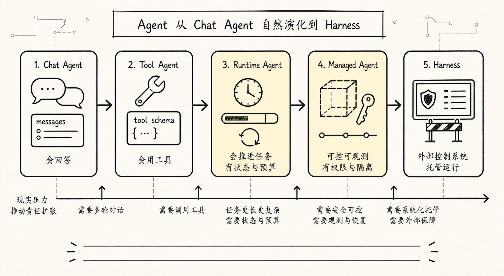
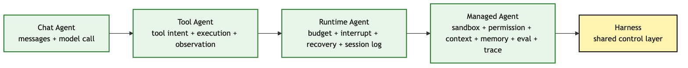
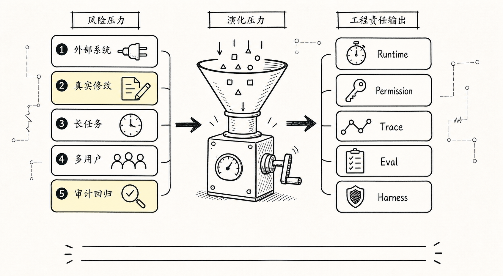
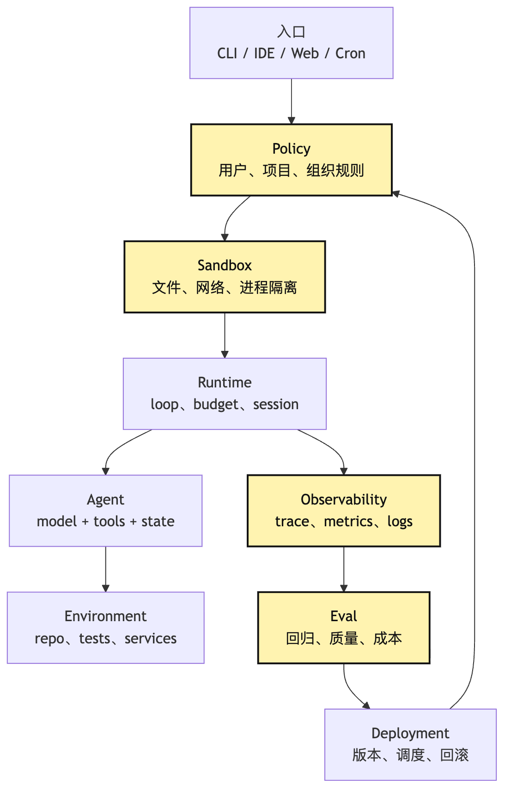

# Agent Evolution Path: Chat Agent -> Tool Agent -> Runtime Agent -> Managed Agent

When people first look at Agent architecture diagrams, a natural confusion appears: **why does a "model that can chat" eventually become a whole Harness?** At first we only wanted a CLI assistant. The user types one sentence, the model answers one sentence. If that works, we add a few tools. Later, how did Runtime, Session, Permission, Sandbox, Trace, Eval, and Deployment suddenly appear?

They can look like a big diagram drawn by an architect in advance. But reality is usually different. Real evolution is more like a project being pushed forward by tasks:

```text
first let it answer
-> then let it act
-> then let it act stably
-> then let other people use it safely
-> finally you discover that a set of Harness responsibilities has grown around the model
```

The core question of this article:

> How does Agent naturally grow into Harness?

We keep using the same example. We are building a small CLI Agent, and the user enters in a project directory:

```text
Help me figure out why this project's tests are failing, and fix it.
```

If the system can only chat, it explains possible causes. If it can call tools, it reads files, runs tests, and edits code. If it runs for a long time, it must manage budget, errors, interruption, and recovery. If real users use it, it must manage sandbox, permission, context policy, evaluation, and deployment. That is the road from Chat Agent to Managed Agent. They are not four parallel names; they are the path where engineering pressure becomes visible layer by layer.

## Problem Chain



The problem chain:

```text
Chat Agent only manages messages and model calls
-> users start asking it to "do things," so Tool Agent is needed
-> tools make the system touch the real environment, bringing failures, cost, and long tasks
-> Runtime Agent is needed for budget, interruption, error recovery, and session log
-> once the system serves multiple people, projects, and environments
-> Managed Agent is needed for sandbox, permission, context policy, memory, eval, trace, and deployment scheduling
-> these control layers together are the beginning of Harness
```

Overview:



The important part is not the stage names, but the new system responsibilities each stage adds. Chat Agent has narrow responsibilities: maintain messages, call the model, output text. Tool Agent steps out of the language world: the model proposes action intent, the system executes tools, and results feed back. Runtime Agent admits that actions fail, tasks are long, budgets run out, users interrupt, and processes crash. Managed Agent admits that real users do not only run demos on your laptop; they put Agent into different repositories, permission settings, and organizational workflows.

Harness is not a "big architecture" designed from nowhere. It is the control layer forced to grow every time Agent is placed in a more real environment.

These four stages are not a maturity ranking.

Chat Agent is not low-level and Managed Agent high-level by default. A Chat Agent that only helps an author rewrite blog titles can be an excellent system if its boundary is clear, output stable, and experience smooth. A platform calling itself Managed Agent can be dangerous if it has superuser permissions, no audit, no verification, and no recovery points.

So this evolution path is better understood as a risk pressure model, not an upgrade route every Agent must finish.

To decide where an Agent should stop, do not look at its name. Look at what real risks it touches:

```text
Does it touch external systems?
Does it modify real state?
Does it run many turns?
Does it continue across sessions?
Does it serve multiple users?
Does it touch credentials and permissions?
Does it need audit and regression?
```

The more "yes" answers, the more responsibility must move from prompt and model to Harness.

Evolution pressure can be drawn as four axes:


This explains an important phenomenon: the same product can contain Agents at different levels.

A small Claude Code may have a Chat Agent path when the user asks "explain this error." It may have a Tool Agent path when the user asks it to read files and summarize. It may have a Runtime Agent path when the user asks it to fix tests and continuously verify. Only when it supports scheduled tasks, remote sandboxes, multi-user permission, and regression evaluation does it enter Managed Agent / Harness boundary.

Do not read the path as "every system must upgrade to the end." Read it as:

```text
Each task path chooses its control-layer thickness from its risk pressure.
```

## 1. Chat Agent: First Let the System Answer



The story starts from the simplest form. A Chat Agent is usually:

```text
user input
-> messages.append(user)
-> call model
-> messages.append(assistant)
-> output answer
```

This is already one step beyond a naked LLM call because it manages conversation history. The user can ask follow-ups:

```text
What does this error mean?

Which file should I inspect first?

If it is a dependency version issue, how should I debug it?
```

Chat Agent carries previous context into the next round. It is no longer strictly one question, one answer. It has a minimal session. But its world is still entirely textual.

In our CLI Agent example, the user says:

```text
Help me figure out why this project's tests are failing, and fix it.
```

Chat Agent may answer:

```text
You can first run the test command and inspect the failure log.
Then locate related files from the stack trace.
If it is an assertion failure, compare expected and actual values.
```

This answer is not necessarily wrong. The problem is that it did not do anything. It did not read the repository, run tests, see the real error, open files, or verify whether the fix passed.

That is the boundary of Chat Agent: **it can manage conversation, but cannot touch the real environment.**

If the task is concept explanation, drafting, or text summarization, this boundary is fine. Once the user says "fix it for me," Chat Agent exposes problems. It may present advice as progress. It may say "I will inspect the test logs," but the system did not inspect. It may invent facts from imagination. Without project structure, the model may guess React, Node, Python, or Rails. It cannot close the loop with verification. It can say "run tests after editing," but it cannot know tests passed.

Chat Agent's engineering value:

```text
It establishes the basic messages + model call loop.
```

Its core remaining problem:

```text
The model can say what the next step should be, but cannot make the next step happen.
```

This leads to Tool Agent. A minimal Chat Agent:

```ts
type Message = {
  role: "user" | "assistant"
  content: string
}

async function chat(input: string) {
  messages.push({ role: "user", content: input })

  const answer = await model.complete({ messages })

  messages.push({ role: "assistant", content: answer })

  return answer
}
```

The boundary is clear: it manages messages, calls the model, returns text. It has no tool protocol, execution layer, permission, or recovery. If at this stage we force the model to "pretend it ran tests," the system becomes dangerous: users see confident narration with no verifiable action behind it.

The first evolution layer is not "make the prompt stronger." It is changing model output from "answer text" into "action intent."

## 2. Tool Agent: Turning Model Intent Into Controlled Action

Tool Agent appears because users are not satisfied with "tell me how to do it." They want:

```text
You do it for me.
```

For the CLI Agent, this means the system must at least:

```text
read files
search code
run commands
edit files
return execution results to the model
```

Now model output can no longer be only natural language. It must express structured action intent. The model should not only say:

```text
I need to inspect package.json.
```

It should output:

```json
{
  "tool": "read_file",
  "args": {
    "path": "package.json"
  }
}
```

This step is crucial. From here, the Agent core loop becomes:

```text
model judges next step
-> outputs tool intent
-> Runtime validates tool and args
-> Tool Executor executes action
-> Observation writes back into message flow
-> model continues judging from result
```

Runtime process:


The key boundary is between `Model -> Loop` and `Loop -> Tools`. The model only proposes intent. Loop and Tool Runtime decide whether it can execute, how it executes, and how the result is written back.

Without this boundary, Tool Agent degrades into "model emits shell, system obeys." That creates problems.

First, parameters are uncontrolled. The model may output a partial command, wrong path, misspelled tool name, or natural language inside arguments. Every tool needs schema:

```ts
type ToolCall = {
  name: string
  args: unknown
}

type Tool = {
  name: string
  description: string
  inputSchema: JsonSchema
  execute(args: unknown, ctx: ToolContext): Promise<ToolResult>
}
```

Second, permissions are uncontrolled. `npm test` and `rm -rf .` are not the same risk level. Reading source and modifying config are not the same. Tool Agent cannot only ask "was a tool called?" It must ask:

```text
does this tool exist?
are arguments legal?
does the current session allow this tool?
does this action require user confirmation?
should execution result be truncated?
how should failure be expressed to the model?
```

Third, state is uncontrolled. After a tool runs, its result cannot only print in the terminal. It must become observation visible to the next model turn. Otherwise the model will not know what actually happened.

In "fix failing tests," the first tool call may be:

```text
run_tests -> returns failure log
```

The next model turn sees the log and may judge:

```text
Need to read src/auth/session.ts.
```

After reading that file, it may judge:

```text
Need to modify the boundary check for token expiry.
```

Tool Agent adds:

```text
not only messages, but also tool schema, tool execution, observation feedback.
```

It also adds an underestimated control point: tool visibility.

Security is not only deciding after the model calls a tool whether it can execute. An earlier gate is:

```text
Which tools should the model see this turn?
```

If the model never sees a tool, it will not plan around that tool. In read-only mode, `edit_file`, `write_file`, and `run_destructive_command` should not be exposed. If the user only asks "explain this failure log," the model does not need to see every MCP tool, browser tool, deployment tool, or database tool.

The tool list is not a capability showcase. It is the model's action space for this turn.

This affects security, cost, and quality.

Security: dangerous tools that are always visible may enter the model's plan. Even if execution later rejects them, turns are wasted and users may be nudged to approve actions that should not appear.

Cost: tool schemas occupy context. More tools means more action space, more tokens, and harder choice.

Quality: too many tools widen planning branches. The model may search when it should read, call irrelevant tools when it should run tests, or keep exploring when it should stop.

The maturity signal of Tool Agent is not registering more tools, but dynamically pruning them:

```text
by task stage
by permission mode
by working directory
by user confirmation state
by context budget
by tool history and performance
```

This is why Tool Agent grows toward Runtime Agent. Once tools increase, the system must manage visibility, budget, failure modes, and history. Otherwise tools shift from "let Agent act" to "make Agent easier to lose."

Tool Agent is not the endpoint. Once tools touch the real world, new problems arrive: test commands hang, files do not exist, the model calls the same tool repeatedly, output is too long, token budget burns out, the user hits Ctrl-C, the process crashes after half a modification. These are not solved by adding another tool. They belong to Runtime.

## 3. Runtime Agent: Making Long Tasks Controllable, Recoverable, and Reviewable

Tool Agent solves "can it act?" Runtime Agent solves: **can the action process continue stably?**

Demo loops often look like:

```ts
while (true) {
  const event = await model.next(state)

  if (event.type === "final") break

  if (event.type === "tool_call") {
    const result = await tools.execute(event)
    state.messages.push(result)
  }
}
```

This is easy to understand and easy to break. What if the model never outputs final? What if a tool hangs? What if one output fills context? What if tests run for five minutes? What if the user interrupts and wants to continue later? What if the system crashes and needs to review what files changed?

These are Runtime responsibilities. Runtime Agent adds:

```text
turn limit: maximum turns
token budget: context and generation budget
time budget: tool and task timeout
error policy: which errors retry, which stop
interrupt: user cancellation control
session log: persistent event record
replay: recovery and review from logs
compaction: context compression
```

The loop becomes a controlled state machine:


The key is not the number of states; it is that Agent now has lifecycle. Chat Agent has input and output. Tool Agent has tool calls and tool results. Runtime Agent has start, pause, resume, fail, finish.

Budget is one example. If the user asks the CLI Agent to fix a large project, the model may read many files, run many commands, and attempt many patches. Without budget control, it may consume unlimited token and time. Runtime checks before each turn:

```ts
function canContinue(session: SessionState) {
  if (session.turns >= session.maxTurns) return false
  if (session.tokensUsed >= session.tokenBudget) return false
  if (Date.now() > session.deadline) return false
  if (session.interrupted) return false
  return true
}
```

This is not about limiting model creativity. It makes the task boundary predictable.

Error recovery is another example. Tool failure does not always mean task failure. `read_file` failure may mean wrong path. `run_tests` failure may be the problem to solve. `edit_file` failure may mean concurrent file modification. `bash` timeout may need a narrower command. Runtime must classify errors. It cannot throw every error to the model, and it cannot silently retry everything.

Structured events:

```ts
type RuntimeEvent =
  | { type: "model_started"; turn: number }
  | { type: "tool_requested"; call: ToolCall }
  | { type: "tool_succeeded"; result: ToolResult }
  | { type: "tool_failed"; error: ToolError; recoverable: boolean }
  | { type: "budget_exceeded"; kind: "turn" | "token" | "time" }
  | { type: "interrupted"; reason: string }
  | { type: "final"; content: string }
```

Events create the basis for session log and replay. If an Agent modifies code and fails, the user should not only see:

```text
Sorry, I could not complete it.
```

They need to know:

```text
Which files did it read?
Which commands did it run?
Which locations did it edit?
Where did it fail?
Can the failure recover?
What is the current workspace state?
```

Runtime Agent's key change: **Agent not only generates next steps; it leaves a reviewable runtime trace.**

In systems like Claude Code, this matters because code changes are not one-shot text generation. They happen in the filesystem, Git workspace, tests, and user confirmations. Without session log, the field is cut off after a crash. Without replay, developers cannot tell whether the bug came from model judgment, tool execution, or Runtime feedback. Without interrupt, users watch helplessly. Without compaction, long tasks are swallowed by the context window.

Runtime Agent naturally appears after Tool Agent enters long tasks. It solves:

```text
can act, but action process is uncontrolled
```

It leaves a new problem:

```text
If this Runtime must serve different users, projects, and permission environments, who manages external boundaries?
```

That leads to Managed Agent.

## 4. Managed Agent: Letting Agent Enter Real Organizations and Environments

Runtime Agent can run long tasks. But it often assumes:

```text
Agent runs in a trusted, local, single-user, temporary environment.
```

Real usage quickly breaks this. A CLI Agent may be placed in company codebases, CI, Web, IDE, Slack, Cron, internal docs, issue systems, deployment platforms, or secret management systems. It may run untrusted commands inside sandboxes. It may send execution trace to a platform for evaluation.

Now the question is no longer "how does this turn run?" It becomes:

```text
Who is allowed to run it?
Where does it run?
Which files and networks can it access?
Which secrets can it use?
Can it modify code?
Where does memory come from?
Who defines context policy?
How is performance evaluated?
Who gets notified on failure?
Can it be deployed and upgraded in batches?
```

Together, these are Managed Agent scope. Managed Agent is not "a smarter Agent." It is an Agent hosted, governed, observed, and deployed by a platform. If Runtime Agent manages the lifecycle of one task, Managed Agent manages Agent as a system capability.

Layer diagram:



Managed Agent places Agent inside a governable shell. Entry decides where it is triggered from. Policy decides what it can do. Sandbox decides where it does it. Runtime decides how it continues. Observability and Eval decide how well it did. Deployment decides how it is released, upgraded, and rolled back.

Sandbox is easy to misunderstand. It is a safety mechanism, but not only safety. Sandbox also provides repeatable execution environment. If Agent runs freely on user machines, node versions, dependency cache, environment variables, and file permissions all vary. The same task may pass today on your machine and fail tomorrow in CI. Managed Agent needs to narrow these differences. That is why sandbox, container, workspace, permission, and secret scope appear together.

Permission also grows. Tool Agent already has tool permission. Managed Agent asks a wider set of questions:

```text
Can this user trigger this Agent in this project?
Can this Agent access this repository?
Can this session write files?
Does this command need human confirmation?
Can this task use network?
Can this secret be injected into the sandbox?
```

Without this layer, Agent becomes a vague super-permission entrance in organizations. It looks like the model is working, but all boundaries are smeared under the word "intelligence." Engineering cannot accept that.

Eval is another example. A one-off CLI demo can be judged by human eyes. Managed Agent needs continuous iteration. Models change, prompts change, tool strategy changes, context policy changes, sandbox image updates. Each change may affect results. Without eval, the system cannot know:

```text
is it better than the previous version?
does it more often edit files incorrectly?
is it more expensive?
does it regress on a type of repository?
does it request dangerous permissions more often?
```

This is why Managed Agent must connect trace and evaluation. Trace is not for "looking professional." It splits one Agent run into inspectable event chains. Eval turns many event chains into comparable quality signals. Once Agent moves from personal tool to platform capability, these become non-optional.

## 5. Harness: Not Another Agent, But the Control System Outside the Model

Now we can look back at Harness. If we start by saying:

```text
Harness is the control system outside the model, responsible for Execution, Tools, Context, Lifecycle, Observability, Verification, Governance.
```

the sentence is accurate, but abstract. Along the evolution path, it becomes easier.

Chat Agent needs messages. Tool Agent needs tool protocol and execution pipeline. Runtime Agent needs budget, errors, interrupt, session log, replay. Managed Agent needs sandbox, permission, context policy, memory, eval, trace, deployment.

These are not parts of the model. The model does not naturally manage them. They should not be stuffed into prompt either, because prompt only influences how the model judges this turn. Harness manages reality outside the model.

Load-bearing chain:

```text
user goal
-> Managed Policy decides whether launch is allowed
-> Sandbox prepares execution environment
-> Runtime creates session
-> Context Builder organizes model input
-> Model outputs next-step intent
-> Tool Runtime validates and executes
-> Observation writes into session log
-> Runtime decides continue, pause, recover, or finish
-> Trace / Eval records quality signals
```

Diagram:


Harness is not another "commander model" beside the model. It is a set of deterministic engineering control layers. The model judges the next step from given context. Harness makes that next step:

```text
executable
constrained
recorded
recoverable
evaluable
deployable
```

The more real the environment and the greater the permissions, the more Harness matters. If Agent can only chat, Harness can be thin. If it can read files, modify code, and run commands, Harness must carry tool risk. If it can run autonomously for a long time, Harness must carry lifecycle risk. If it serves multiple users, projects, and entrypoints, Harness must carry governance risk.

Harness is not architecture neatness. It is the skeleton an Agent grows to survive outside a toy environment.

## 6. Failure Shapes of the Four Stages

To understand the evolution path, look not only at added capabilities, but also at how each missing layer fails.

Chat Agent's typical failure is saying "suggestion" as "completion." It outputs well-organized debugging steps, but the real project is unchanged. Users without engineering experience may believe it has inspected the project. Boundary:

```text
It can answer, but that does not mean it can execute.
```

Tool Agent's typical failure is tool loss of control. The model outputs a dangerous command and the system lacks permission checks. The model supplies wrong parameters and the tool executes with defaults. Tool output contains tens of thousands of lines and is pushed into context. A tool fails and the model sees no structured error, so it guesses. Boundary:

```text
Tools are not extensions of the model's hands and feet; they are protocolized capabilities managed by Runtime.
```

Runtime Agent's typical failure is process loss of control. Loops run too long. Retries have no upper bound. Users cannot interrupt. Context becomes dirty. After session crash, nothing can recover. No one can say which files changed. Boundary:

```text
Long tasks are not while true; they are a lifecycle that can pause, recover, and be reviewed.
```

Managed Agent's typical failure is platform-boundary loss of control. Agent gets excessive permission. Sandbox and real environment are mixed. Different users share memory they should not share. Model upgrade regresses quality without detection. Missing trace prevents diagnosis. Deployment and rollback lack policy. Boundary:

```text
Agent is not a process released to act freely; it is a platform capability under governance, observation, and evaluation.
```

These failure modes show that added mechanisms are not decoration. Each layer solves failures exposed by the previous one.

## 7. Engineering Implementation: Do Not Build the Big Platform All at Once

Since Harness eventually grows out, should we design as a Managed Agent platform from the start? Not necessarily. This article emphasizes "naturally grow," not "pile everything on day one."

For a small CLI Agent, a steadier path is to add control layers in stages.

Stage 1: only Chat Agent. The goal is to get provider contract, messages, and streaming output working. Do not rush into complex tools. First confirm:

```text
is the model input/output boundary clear?
is message history controllable?
are errors understandable to users?
```

Stage 2: add Tool Agent. Start with read-only tools such as `read_file`, `list_files`, `search`. After observation feedback is stable, add write tools and shell tools. The focus is tool protocol:

```text
is schema strict?
are permissions tiered?
are tool results structured?
are outputs truncated and summarized?
```

Stage 3: add Runtime Agent. First add turn limit, timeout, interrupt to the loop. Then write events into session log. Finally consider replay, compaction, recovery, and finer error policy. The focus is lifecycle:

```text
why does the task continue?
why does it stop?
where did it fail?
can the user interrupt?
after crash, can we know what happened?
```

Stage 4: add Managed Agent. When others start using the system or it connects to real organizational resources, add the managed layer. The focus is governance and operations:

```text
how does sandbox isolate?
how does permission approve?
how is memory scoped?
how is trace collected?
how does eval regress?
how does deployment do gradual rollout and rollback?
```

A conservative implementation shape:

```ts
interface AgentHarness {
  provider: ModelProvider
  tools: ToolRegistry
  runtime: RuntimeController
  sessionStore: SessionStore
  policy?: PolicyEngine
  sandbox?: SandboxManager
  telemetry?: TraceSink
  evals?: EvalRunner
}
```

Many fields are optional. Not because they are unimportant, but because they should be introduced as task reality grows. If your Agent only helps you organize text locally, managed layer can be thin. If it automatically opens PRs in a company codebase, managed layer cannot be skipped.

The decision criterion is not "is the architecture diagram pretty," but:

```text
which real risks does this Agent currently touch?
which risks can no longer be handled by a human watching?
which risks must be caught by system mechanisms?
```

This is the benefit of deriving architecture from evolution pressure. You do not pile components for conceptual completeness, and you do not pretend prompt can solve everything after risk has appeared.

## 8. One Layer Deeper: Recoverable, Evaluable, Delegable


If we only look at Chat, Tool, Runtime, and Managed stages, evolution may look like "more features." One layer deeper, three engineering properties gradually appear:

```text
recoverable
evaluable
delegable
```

### Session log Is Not Ordinary Log

One key object in Runtime Agent is session log.

It is not debug output or terminal transcript. It is the Agent's event ledger. At minimum, it records:

```text
user input
model intent
tool call
tool result
permission decision
budget event
context compaction
verification result
final state
```

Without session log, "recoverable" is only a slogan. After a crash, the system cannot know which facts the model saw, which tools executed, which files changed, which actions the user rejected, or where the last stable state was.

Session log also gives eval and audit a common factual base.

If only messages are saved, many facts disappear. Messages are the context projection shown to the model; they may be truncated, compacted, or reordered. Session log should preserve event causality:

```text
ModelIntent -> PolicyDecision -> ToolExecution -> Observation -> Verification
```

The clearer this causal chain, the better the system can answer "which layer did this failure happen in?"

### Sandbox Is Both Cage and License

Another easily misunderstood Managed Agent object is sandbox.

Sandbox is security isolation: it limits file scope, environment variables, network, processes, credentials, and side-effect radius. But it also provides repeatability.

If every task runs in a clean, describable, rebuildable environment, verification results become meaningful. Otherwise a model passes on your local machine today and fails on another machine tomorrow, and the system cannot tell whether it is code, dependency, or environment.

Sandbox also provides liveness.

Without sandbox, a safety-conscious system must constantly ask:

```text
May I read this file?
May I run this command?
May I write this cache directory?
May I access this port?
```

Too many questions exhaust users. They either reject everything or approve mechanically. Both are unsafe.

With clear sandbox boundaries, the system can be more autonomous inside the boundary:

```text
Read-only operations inside this directory are allowed automatically.
Test commands inside this temporary worktree are allowed automatically.
Network access outside this policy is denied.
Before writing the real repository, generate a diff and ask for confirmation.
```

Sandbox is both cage and license. It confines Agent to a controlled area while allowing it to act with fewer interruptions inside that area.

### Eval Flywheel: Not Scores, But Harness Improvement

Managed Agent evaluation should not be only final scores.

The more valuable loop:

```text
trace captures trajectory
-> judge result and path
-> attribute to model, tool, context, sandbox, permission, or verifier
-> generate regression cases
-> modify Harness
-> rerun the same task set
```

This is the eval flywheel.

The point is not proving the model "smart" or "not smart." It gives Harness improvement a handle. For example, a failed task has a wrong final answer, but trace shows the model's first judgment was fine; failure came from tool output truncation losing a key error. The fix should be Tool Result Policy, not the model prompt.

Another failure: tool results are complete, but the model reads the same file three times. That suggests loop state does not record repeated behavior, or context projection does not show the model what was already read. Fix Runtime Guardrail or Context Policy.

Another failure: the model gives the right modification but declares completion without running the relevant tests. That is a Verification Gate issue.

Only trajectory-level evaluation can split failures into repairable engineering problems. Otherwise the conclusion is:

```text
This Agent did not do well.
```

That conclusion barely helps improvement.

### Sub-Agent Handoff Is Not Calling More Models

Finally, delegation.

Managed Agent often introduces sub-agents, but sub-agent is not "call more models to role-play." A real handoff should pass engineering objects:

```text
task intent
known facts
constraints
available tools
permission boundary
budget
risk
intermediate artifacts
open questions
return format
```

Sub-agents can isolate context, but not responsibility. Their tool permissions should inherit or narrow from the main Agent's boundary. Their output should not be just a summary; it should include evidence, actions, risks, and next-step recommendations.

This is why multi-Agent pushes the system toward Harness. Once a task is delegated, the system must answer:

```text
who approved delegation?
what can the sub-agent see?
which tools can it call?
how does its result enter the main session?
if it fails, how does responsibility return to the main flow?
```

Without these answers, multi-Agent only copies one Agent's uncertainty into many.

## 9. Compress the Four Stages Into One Sentence

Chat Agent solves:

```text
how to let the model keep conversing.
```

Tool Agent solves:

```text
how to turn the model's next-step intent into controlled action.
```

Runtime Agent solves:

```text
how to make multi-step action run stably under budget, errors, interruption, and recovery.
```

Managed Agent solves:

```text
how to host Agent inside real users, real projects, real permissions, and real evaluation systems.
```

Harness is the combination of those control responsibilities:

```text
The model judges the next step; Harness makes the next step happen in the real world in a more controlled, auditable, recoverable, and verifiable way.
```

Agent is not designed as a complex system from the start. It grows from Chat to Tool, from Tool to Runtime, from Runtime to Managed, as it repeatedly encounters real environments. This is the most important background for the later ETCLOVG Harness layers. Execution, Tools, Context, Lifecycle, Observability, Verification, and Governance are not seven abstract categories. They are engineering responsibilities forced out by real tasks along this evolution path.

## Image Plan

### Diagram Type

Hand-drawn technical architecture evolution diagram. From left to right, show four stages: Chat Agent, Tool Agent, Runtime Agent, Managed Agent. Under each stage, draw the newly added control layer, and finally merge into an external Harness shell. The overall style should resemble an engineering whiteboard explanation, not a corporate promo poster.

### Visual Element List

- Left: simple chat bubble labeled `messages / model call`
- Second segment: toolbox, file, terminal, labeled `tool schema / execution / observation`
- Third segment: timer, breakpoint, logbook, recovery arrow, labeled `budget / interrupt / session log / replay`
- Fourth segment: sandbox box, permission gate, trace panel, eval dashboard, labeled `sandbox / permission / trace / eval`
- Far right: translucent Harness shell wrapping Runtime, Tools, Context, Policy
- Main color: black-and-white linework plus pale-yellow highlights for key layers

### Positive Image Prompt

A horizontal hand-drawn engineering whiteboard diagram showing Agent evolving from Chat Agent to Tool Agent, Runtime Agent, Managed Agent, and finally naturally growing into Harness. Include chat bubble, toolbox, terminal window, logbook, recovery arrow, sandbox box, permission gate, trace panel, and eval dashboard. Use clear arrows to show newly added system responsibilities at each stage. Style: technical tutorial illustration, clean, restrained, structurally clear, black-and-white linework with pale-yellow key highlights, suitable for Chinese technical blog cover and in-article image.

### Negative Prompt

No cyberpunk style, no complex 3D rendering, no sci-fi robot, no excessive glow, no abstract gradient background, no dense tiny text, do not draw Agent as a humanoid assistant, no corporate promo poster texture, no dark blurry background, no random code rain.

---

GitHub source: [00-05-agent-evolution-path.md](https://github.com/LienJack/build-harness/blob/main/docs/en/00-05-agent-evolution-path.md)
