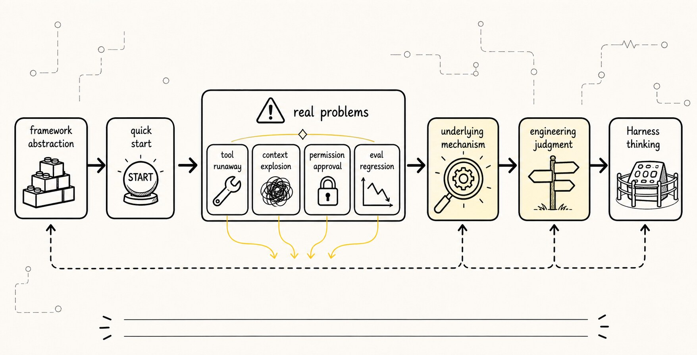
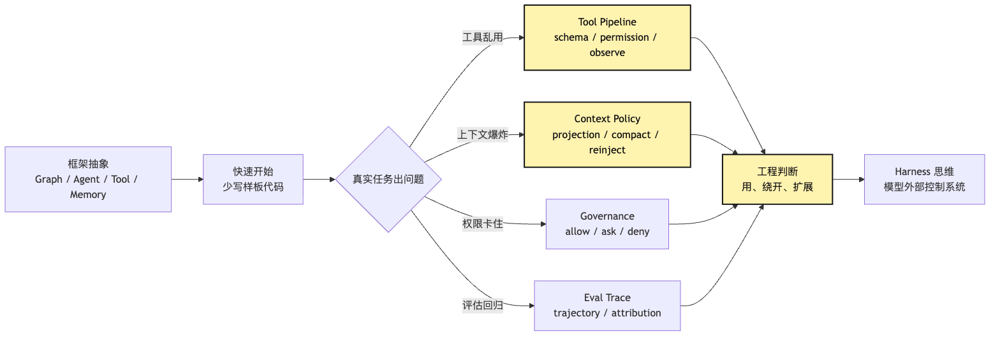
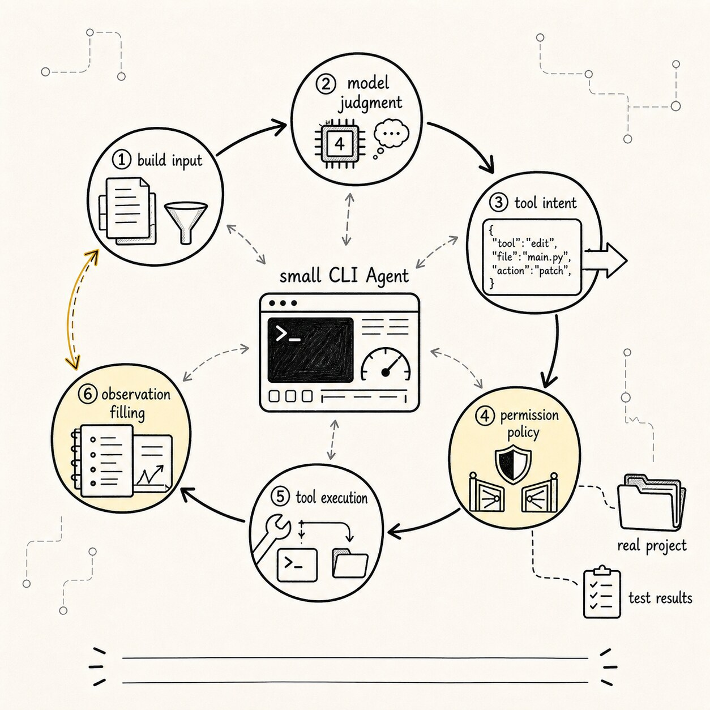
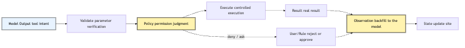
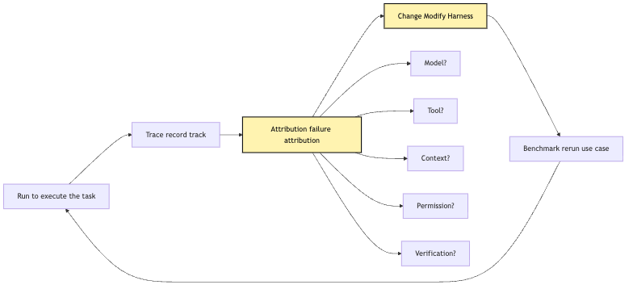
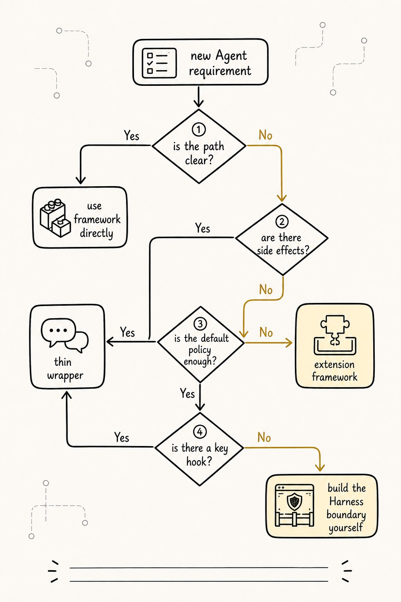

# Why Write an Agent by Hand: Understanding the Minimal Mechanisms Behind Framework Abstractions

Across the previous five posts, we've been doing one thing: pulling Agents back from "magical model capabilities" to "explainable runtime systems."

By now, we have a few basic conclusions:

```text
An Agent is not just a longer Prompt.
An Agent consists of at least Model, Loop, Tools, and State.
ChatBot, Workflow, Agent, and Harness are not capability tiers — they are boundary choices.
A Harness is the control system that wraps the model.
An Agent grows a Harness along the pressure path of Chat -> Tool -> Runtime -> Managed.
```

If all of this holds, the next natural question is:

**Given that LangGraph, CrewAI, ADK, and a host of Agent SDKs already exist, why bother writing an Agent by hand?**

This is a very practical question.

If your goal is just to ship a quick demo, using a framework is obviously faster. The framework already prepares nodes, edges, tool bindings, memory interfaces, state graphs, multi-Agent orchestration, visual traces, and deployment entry points. You don't need to start from a `while` loop, define a `ToolIntent` yourself, or hand-write the message history and tool-result write-back.

So this article isn't trying to talk you out of using frameworks.

Quite the opposite — mature projects should usually end up using frameworks, platforms, or existing runtimes to absorb the repetitive engineering work. The problem is:

```text
If you've never hand-written the minimal mechanisms,
it's hard to tell whether the framework is saving you from repetitive labor
or hiding critical boundaries from you.
```

That is the real point of writing an Agent by hand.

It's not about replacing frameworks, nor about proving that "wheels you build from scratch are purer." It's about acquiring a kind of engineering judgment:

```text
When can I confidently use the framework?
When should I bypass the framework's default abstractions?
When should I extend the framework with my own Harness layer?
When is the problem not the framework at all, but the fact that I haven't modeled the underlying mechanism?
```

We'll continue with the same running example:

```text
Help me figure out why this project's tests are failing, and fix it.
```

This time, instead of rushing to write the full code, we'll first answer a more upstream question:

> To truly read an Agent framework, what is the minimum set of mechanisms we should hand-implement?

## The Question Chain



Let's first pin down the question chain for this post:

```text
Frameworks let you start fast
-> But they hide loop, tool, state, context, and permission inside abstractions
-> When the demo goes well, those abstractions feel comfortable
-> Once you hit tool runaway, context explosion, permission approvals, or eval regressions
-> You must know what's actually happening underneath
-> Hand-writing a minimal Agent is how you see those abstraction boundaries
-> Once you can see the boundaries, you can judge when to use, bypass, or extend a framework
```

The most important parts of this chain are the last two lines.

Hand-writing isn't the goal. Judgment is.

Let's draw the relationship first:



What frameworks do best is shorten common paths.

What hand-writing minimal systems does best is reveal hidden boundaries.

The two goals don't conflict. The truly dangerous thing is collapsing them into one sentence:

```text
The framework already wraps everything, so I don't need to understand the internals.
```

That sentence sometimes works in ordinary CRUD frameworks. You can write business features with an ORM without knowing the inner workings of database connection pools. But in Agent systems, underlying mechanisms keep surfacing into business code. Because the model output is not a deterministic program, tool execution changes the outside world, the context shifts every round, and permissions and evaluation directly affect product risk.

So an Agent framework is not a magic box, nor is it the entire Harness.

It's more like an engineering grammar that helps you organize uncertainty.

Grammar can help you write faster, but it can't decide for you which uncertainties belong to the model and which should be reclaimed by code, policy, tests, and the Harness. A framework may provide part of the Harness's capabilities, but it won't make those boundary choices for you automatically.

## 1. What Does Using a Framework Actually Solve?

Let's be fair first.

Frameworks have value because Agent systems do contain a lot of repetitive labor.

If you build a CLI Agent from scratch, even a minimal one, you'll immediately run into all this work:

```text
Wrap the model API
Maintain messages
Implement the loop
Define tool schemas
Parse tool calls
Execute tools
Feed results back to the model
Handle streaming output
Handle error retries
Record state
Cap maximum rounds
Request user confirmation before certain actions
```

These tasks are tedious.

A framework saves you a lot of boilerplate.

For example, when writing a minimal "fix tests" Agent on a framework, you'd probably think along these lines:

```text
Create an Agent
Register the read_file / grep / bash / edit tools
Give it a task
Let the framework handle the loop and tool calls
Get the final answer
```

This is natural.

The framework frees you from many low-level details so you can first focus on whether the task even works. For early team exploration, this matters a lot. Because you don't necessarily know where the task boundary is from day one, nor what the user actually wants.

If you're building a one-off internal demo:

```text
Take an issue as input
Have the Agent read a few files
Generate a fix suggestion
```

A framework may be a great fit.

If you're building a fixed research pipeline:

```text
Search for sources
Summarize
Cross-check
Generate a report
```

A framework also saves a lot of orchestration work.

If you're building multi-step business automation:

```text
Read from CRM
Compose an email
Wait for approval
Send
Log
```

The graph, node, edge, tool, and checkpoint abstractions in frameworks are quite useful too.

So the question isn't "are frameworks valuable."

The question is:

**Once the framework gets you running fast, can you still see which decisions it made on your behalf?**

These decisions include:

```text
Which messages does the model see each round?
How are tool schemas exposed to the model?
Are tool results fed back verbatim or summarized?
Does a tool failure count as an observation?
Can the same tool be called repeatedly?
How is the context compacted when it overflows?
Who decides whether something is the final answer?
Is permission enforced before the call, or at execution time?
Can the trace reconstruct every step?
When evaluation fails, can you attribute the failure?
```

If you can't see these decisions, the framework turns from a tool into a black box.

Black boxes are comfortable on the happy path.

But Agent system problems usually happen on the unhappy path.

## 2. Four Pits Between a Smooth Demo and a Real Task

We'll keep using the "fix failing tests" CLI Agent.

A smooth demo usually looks like this:

```text
User: Help me fix the tests
Agent: read package.json
Agent: run npm test
Agent: read failed file
Agent: modify code
Agent: run tests again
Agent: tests pass, done
```

This process looks an awful lot like a reliable system.

But in real projects, the first failure is usually not "the model can't write code" — it's the more engineering-flavored problems below.

### 1. Tool Runaway: The Model Reads "Can Call" as "Should Call"

Once you hand the model many tools, it starts treating tool space as action space.

That's not wrong in itself. The point of an Agent is that the model can pick tools based on the situation.

The problem is that without boundaries on the tool space, the model easily produces several kinds of runaway behavior:

```text
Reading the same file over and over
Searching too broadly
Running heavy commands
Editing files without evidence
Treating bash as an all-purpose tool
Bypassing dedicated tools to run dangerous shell
```

For example, to find the test command, it might do all of this in a row:

```text
read_file(package.json)
grep("test")
bash("find . -name package.json")
bash("cat package.json")
read_file(package.json)
```

Looking only at the final result, it may still have found the test command.

But from a system perspective, this trajectory has a smell.

It tells you the Agent isn't stably remembering "what I've already read," or the context isn't projecting that fact to the model, or the tool menu is too wide so the model turned a simple task into exploratory action.

If you only look at the final answer, you'll think it's fine.

If you look at the trace, you'll find the Harness is leaking.

### 2. Context Explosion: Tool Results Fill the Window Faster Than Reasoning Does

Fixing tests produces a lot of context:

```text
Project structure
package.json
Test failure logs
Relevant source code
Test files
Historical edit diffs
Output from re-running tests
Error stack traces
```

If the framework's default is to stuff every tool result back into messages verbatim, short tasks may hold, but long tasks fall apart fast.

The model's next round sees a jumble of mixed material:

```text
Old error logs
New error logs
Truncated search results
File fragments that no longer matter
The model's own long explanation from the previous round
Repeated content returned by tools
```

At this point the model isn't "less smart" — the situation has been polluted.

It may forget which failure it's actually fixing right now, or keep modifying issues it has already fixed based on stale logs.

Context explosion isn't just a token problem.

Fundamentally, it's a "situation management" problem:

```text
Which facts does the current task still need?
Which observations are now stale?
Which results should be compressed into state?
Which raw evidence must remain in the session log?
Which content belongs only in the UI and shouldn't enter the model input?
```

If you've never hand-written a minimal context builder, it's easy to reduce every problem to:

```text
The model's context window isn't big enough.
```

But in an Agent, a bigger context isn't necessarily better.

A messy large context is often more dangerous than a clear small one.

### 3. Permission Approval: Asking the User More Doesn't Mean Safer

Many people, the first time they add permissions, turn it into a popup:

```text
The Agent wants to run npm test, allow?
The Agent wants to read src/foo.ts, allow?
The Agent wants to edit src/foo.ts, allow?
The Agent wants to run npm test, allow?
```

This is safer than no approvals at all, but it quickly becomes a different kind of problem.

Users get fatigued.

Once fatigued, they click "allow" through everything.

At that point, the approval system exists in name only.

Worse, if the system doesn't distinguish risk levels — reading files, running tests, writing files, deleting files, network access all use the same confirmation experience — users can't tell which action is genuinely dangerous.

So the permission system isn't "more popups."

At a minimum, it has to answer:

```text
Does this action belong to read-only, write, execute, network, credentials, or delete?
Is it within the current working directory boundary?
Has it already been allowed or denied by project rules?
Does it need user confirmation?
What evidence should the confirmation display?
After the user denies it, what observation should the model see next round?
```

If your framework's permission abstraction is just a `confirmToolCall()`, you have to know when it's enough and when it needs to be extended into your own policy layer.

That is the point of hand-writing a minimal permission gate.

Not so you'll always be writing your own approval UI later.

But so you'll know where in the runtime path approval should hang.

### 4. Eval Regression: A Correct Final Answer Doesn't Mean the Harness Isn't Broken

Agent evaluation gets watered down very easily.

Many teams write a test like:

```text
Input: a failing project
Expected: final output contains "tests pass"
```

That's useful, but nowhere near enough.

Because the same final result can come from completely different processes:

```text
Path A: read logs -> locate file -> small change -> run tests -> pass
Path B: search the whole repo -> read tons of irrelevant files -> guess-and-edit -> tests happen to pass
Path C: skip tests -> directly claim done
Path D: run dangerous commands -> modify files that shouldn't be modified -> the result also passes
```

If evaluation only looks at the final answer, A, B, C, and D look about the same.

But from the Harness perspective, only A is a healthy trajectory.

So mature evaluation looks at trajectory:

```text
Which tools were used?
Was the tool order reasonable?
Was the necessary evidence read?
Were privileges exceeded?
Were there repeated, useless actions?
Was the result verified?
On failure, can you attribute it to the model, the tool, the context, the permission, or the environment?
```

A framework may provide a trace.

But whether that trace can answer these questions depends on the granularity of events it records.

If you've never personally designed an event stream, it's easy to confuse "having logs" with "being evaluable."

It isn't the same.

Logs are raw material; evaluation needs attributable event objects.

## 3. Hand-Writing a Minimal Agent Is Not Hand-Writing a Full Framework



At this point it's easy to swing to the other extreme:

```text
If frameworks hide boundaries, should I implement a full Agent framework from scratch?
```

No.

At least during the learning stage, the goal of writing a minimal Agent by hand isn't completeness — it's making things visible.

What you want to hand-write are the minimal mechanisms that, when hidden, would impair your judgment.

For the "fix failing tests" CLI Agent, the first version of the minimal system can be tiny:

```text
A model invocation interface
A while loop
A tool registry
Three tools: read_file, grep, run_command
A messages list
An event log
A maximum number of rounds
A simple permission gate
A final-decision check
```

It can even skip real edits at first.

First make the Agent able to:

```text
Read package.json
Run the test command
Read the files mentioned in the failure logs
Propose a fix
```

The next step is adding `edit_file`.

The step after that adds diff, approval, re-running tests, and context compaction.

The value of writing a minimal system by hand is that with each layer you add, you see firsthand why the previous layer wasn't enough.

For instance, without an event log, you'll find that debugging means printing the final messages.

With an event log, you'll naturally distinguish:

```text
What the model said
What the tool actually executed
What the tool returned
What the model saw next round
```

Without tool schemas, you'll find that the model's natural language is hard to parse reliably.

With schemas, you'll naturally understand:

```text
A tool call isn't tool execution — it's only a tool intent.
```

Without a permission gate, you'll find that once the model can run shell, you have to push every risk into the prompt.

With a permission gate, you'll naturally understand:

```text
Safety isn't model self-discipline — it's a runtime constraint.
```

Without a context builder, you'll find messages quickly become a junk pile.

With a context builder, you'll naturally understand:

```text
Context isn't a history log — it's a per-round projection.
```

That is the boundary of "by hand."

Not so you write everything to production grade, but so you personally touch a few load-bearing points.

## 4. Minimal Mechanism #1: Treat Model Output as Intent, Not Action

If I could only hand-write one mechanism, I'd write this first:

```text
The model emits tool intent; the system performs the tool action.
```

This is the first dividing line in Agent engineering.

In a minimal CLI Agent, the model can emit:

```json
{
  "type": "tool_intent",
  "tool": "run_command",
  "args": {
    "cmd": "npm test"
  }
}
```

But this does not mean `npm test` has been executed.

Before actual execution, the system has to at least:

```text
Check that the tool exists
Validate args against the schema
Decide whether the command is allowed
Decide the working directory and timeout
Execute the command
Record stdout / stderr / exit code
Shape the result into an observation
```

This chain can be drawn as:



Once this picture is in your head, you'll look at frameworks completely differently.

You'll start asking:

```text
Where is the tool call object inside the framework?
Does the framework do validation, or do I?
Does the permission hook fire before or after execution?
Are the raw tool result and the observation given to the model kept separate?
Do failed results enter the state?
```

These questions decide whether the system can safely enter real projects.

A minimal type design might look like:

```ts
type ToolIntent = {
  type: "tool_intent";
  id: string;
  tool: string;
  args: unknown;
};

type PolicyDecision =
  | { type: "allow"; reason: string }
  | { type: "ask"; prompt: string }
  | { type: "deny"; reason: string };

type Observation = {
  intentId: string;
  ok: boolean;
  summary: string;
  data?: unknown;
  truncated?: boolean;
};
```

Notice that model output, permission decision, and tool result are not stuffed into one object.

This isn't type cleanliness for its own sake.

It's so that failures can be attributed.

If `npm test` didn't run, the reason might be:

```text
The model didn't propose a test intent
The model proposed the wrong command
Argument validation failed
Permission denied
Command timed out
The test itself failed
The result was truncated, causing the model to misread it
```

These failures correspond to completely different fixes.

When the objects are split apart, attribution has somewhere to land.

## 5. Minimal Mechanism #2: The Loop Isn't `while true` — It's a State Machine

Many tutorials write the Agent loop as:

```ts
while (true) {
  const response = await model(messages);
  if (response.final) break;
  const result = await runTool(response.tool);
  messages.push(result);
}
```

This code expresses the core intuition, but it can't express the real boundaries.

A CLI Agent that can fix tests needs a loop that knows, at minimum:

```text
What round we're on
Whether we've been interrupted
How much budget is left
Which tool was used last round
Whether failures are repeating
Whether the context needs to be compacted
Whether we already have verification evidence
```

Otherwise it easily spins on a failure path.

For example, when the tests keep failing and the model says every round:

```text
Let me run npm test again to take a look.
```

Without loop state, the system can only oblige.

With loop state, the system can notice:

```text
The same command has failed three times in a row
With no code change in between
The next round shouldn't keep running the same command
This observation should be fed back to the model
```

So the minimal loop shouldn't just be a loop construct — it should be a state transition:


Each node in this picture can start out very simple.

The first version of `CheckBudget` can just be a max-round counter.

The first version of `Compact` can do nothing — just record "needs compaction but unimplemented."

The first version of `Permission` can just allow `read_file`, ask for `run_command`, and forbid `edit_file`.

The point isn't to write it all at once.

The point is to acknowledge from day one that these states exist.

The same applies when you use a framework.

You don't have to manage every state yourself, but you must know where the framework's state machine lives, and whether you can hook into the key nodes.

If the framework only exposes a "run agent, get result" interface and doesn't let you observe inside the loop, it might be fine for demos — but it isn't fit for high-risk engineering tasks.

## 6. Minimal Mechanism #3: Tools Aren't a List of Functions — They're a Protocol Boundary

In a minimal Agent demo, tools are typically written as:

```ts
const tools = {
  read_file: async ({ path }) => fs.readFile(path, "utf8"),
  run_command: async ({ cmd }) => exec(cmd),
};
```

This runs, of course.

But it omits the most important parts of a tool.

A tool isn't just a function. A tool is the protocol boundary the model crosses to act on the real world.

A tool needs to declare, at minimum:

```text
name: how the model refers to it
description: when the model should use it
schema: the parameter structure
risk: read, write, execute, network, delete
visibility: whether the model can see it this round
permission: whether approval is needed before invocation
execute: how to run it
serialize: how to turn the result into an observation
```

If these things aren't made explicit, they don't disappear — they get scattered across the prompt, business code, and framework defaults.

Take `run_command`.

If it's just a function, the model may try to do everything through it:

```text
cat package.json
grep -R "foo" .
python - <<EOF ...
sed -i ...
rm ...
curl ...
```

The system has a hard time understanding the meaning of each shell call.

But if you also provide dedicated tools:

```text
read_file
search_text
run_test
edit_file
```

and restrict `run_command`'s visibility and permission, the model is steered into a more controllable action space.

That's the key to tool design:

```text
The tool menu is not "the more powerful, the better" — it's "the closer to task semantics, the better."
```

In the "fix tests" task, `run_test` is usually more worth exposing first than a generic `bash`.

Because `run_test` naturally records:

```text
The test command
The exit code
The names of failed tests
Log truncation status
Run duration
Whether verification evidence was produced
```

Whereas `bash("npm test")` is just a command and a pile of stdout.

Both can run tests.

But the former plugs into a Harness more easily.

This is a point that's often overlooked in framework abstractions: tools aren't "the more capable, the better" — tools are "the clearer the semantic boundary, the better."

## 7. Minimal Mechanism #4: Don't Conflate State, Context, Memory, and Session into messages

When hand-writing an Agent, the easiest place to take a shortcut is messages.

Initially, you'll stuff everything into it:

```text
User input
Model replies
Tool calls
Tool results
Errors
File contents
Test logs
Compaction summaries
Plans
```

It's convenient.

But you'll quickly find that messages is doing too many jobs at once:

```text
It's the context the model sees
It's the debug log
It's the source of event facts
It's state storage
It's the UI transcript
It's the evaluation input
```

That causes problems.

Because these have different requirements:

```text
The session log should faithfully record what happened.
State should represent the current task situation.
Context should select what the model should see this round.
Memory should preserve reusable experience across tasks.
The UI transcript should be readable for humans.
The eval trace should be attributable for machines.
```

If you stuff them all into messages, you'll face a goal that can't be satisfied at the same time:

```text
Be complete and short.
Be for humans and for the model.
Preserve raw evidence and compress summaries.
Be recoverable and freely trimmable.
```

A more stable split is:


The first version doesn't have to be this complete.

But you should at least be clear in your head:

```text
messages is not the source of facts.
messages is the projection given to the model this round.
```

For example.

After running `npm test`, the tool returns 2000 lines of logs.

The session event log can record the raw output file path, exit code, truncation policy, summary, and duration.

State can record:

```text
The current test is failing.
The failing test is "should parse empty input".
The error is "expected [] to equal null".
The relevant file is probably parser.ts.
```

The context builder can give the model only:

```text
The test command failed; the failing case is "should parse empty input".
Key error: expected [] to equal null.
Full logs are saved; only the relevant snippet is shown right now.
```

The UI can show a friendlier collapsible log.

The eval trace can record that this verification failure is "test ran successfully but assertion failed."

The same tool result has different shapes at different layers.

If you've hand-written this once, when you later look at any framework's memory / state / checkpoint / context API, you'll know what to ask.

You won't be fooled again by a unified `messages` parameter.

## 8. Minimal Mechanism #5: Evaluation Is Not the Final Answer — It's Failure Attribution

The last mechanism a hand-written Agent needs is minimal evaluation.

This isn't a complex benchmark.

The first version only needs to be able to answer:

```text
Why did this Agent fail?
```

For example, prepare three small local projects:

```text
case-1: missing dependency for the test command — the Agent should report the environment problem first.
case-2: a clear assertion failure — the Agent should read the source and propose a small fix.
case-3: very long test logs — the Agent should truncate and keep the key error.
```

Then record each run's trajectory.

You don't just look at the final answer; you look at these facts:

```text
Did it run the tests?
Did it read package.json?
Did it read the file pointed to by the failure logs?
Did it gather enough evidence before modifying?
Did it re-verify after modifying?
Did it run repeated, meaningless commands?
Did it access unrelated directories beyond its scope?
```

This kind of evaluation forces you to design the trace clearly.

Because if the trace doesn't contain `ToolStarted`, `ToolFinished`, `PolicyDecision`, `Observation`, `VerificationEvidence`, you can't answer these questions.

So minimal eval isn't extra work.

It in turn shapes your Harness.

You can think of it as a closed loop:



This picture also explains why "freezing the model and only changing the Harness" sometimes lifts Agent performance significantly.

Because many failures aren't model capability problems — they're the system handing the wrong situation to the model, the tool boundary being too wide, the result feedback being too messy, or the verification gate being too thin.

Without traces and attribution, you instinctively swap models.

With traces and attribution, you may discover that what really needs fixing is:

```text
The output truncation policy of run_command
The cached projection of read_file
The guardrail against repeated tool calls
The diff approval before edit_file
The verification gate before the final answer
```

That is the value of hand-writing minimal eval.

It stops you from blaming everything on the model.

## 9. When Looking at a Framework, Look at What It Abstracts and What It Exposes

Once you have these minimal mechanisms in hand, you'll look at frameworks more calmly.

You won't only ask:

```text
Does this framework support tool calling?
Does it support memory?
Does it support multi-agent?
```

You'll ask sharper questions:

```text
Who controls the loop?
Can I intervene in each round's model input?
Are tool intent and execution result kept separate?
Are tool visibility and execution permission kept separate?
When does context compaction happen?
Does the checkpoint store messages, or an event log?
Can the trace support trajectory-level evaluation?
Is human approval a callback, or a full policy layer?
Do sub-agents inherit permissions and budgets?
```

These questions decide whether a framework can carry real tasks.

For instance, a graph framework is great for expressing deterministic flows:

```text
run tests -> if fail -> inspect -> patch -> verify
```

But if each node is itself a free-roaming Agent inside, you still have to manage tool permissions, context feedback, and stop conditions.

For another example, a multi-agent framework makes it easy to spawn multiple roles:

```text
planner
coder
reviewer
tester
```

But without a session log, artifacts, permission inheritance, return formats, and failure attribution, multi-agent just spreads uncertainty across more places.

Or a memory framework that provides a long-term memory interface.

You still have to ask:

```text
What content is allowed to write to memory?
Who approves the write?
Does the memory have provenance and confidence?
How are expiration and conflicts handled?
Will sensitive information be saved?
```

None of these can be answered by "does the framework have feature X."

They are Harness questions.

A framework can give you hooks; it can't make engineering judgments for you.

## 10. When to Use, Bypass, or Extend a Framework



Now we can return to the opening question.

Since we're not opposed to frameworks and not romanticizing hand-writing, how should we choose?

A simple decision table helps.


Let's be more direct.

### Scenarios where using the framework directly is fine

If a task meets these conditions, using the framework directly is usually reasonable:

```text
Clear flow boundaries
Low-risk tools
Short state lifecycle
Acceptable failure cost
Modest context size
No complex permissions needed
Evaluation only needs to look at the final output
```

For example, internal knowledge Q&A, lightweight research summaries, fixed-flow report generation, low-risk data tidying.

In these cases, hand-writing the underlying mechanisms might just slow you down.

### Scenarios where extending the framework is appropriate

If the task starts touching real engineering environments but the framework exposes enough hooks, you can extend on top:

```text
Custom tool permissions
Custom context projection
Custom trace events
Custom checkpoint
Custom evaluation
Custom human approval
```

For example, internal coding assistants, restricted-repo fixers, small-scale automated dev tasks.

Here the framework handles common orchestration; you handle the key Harness boundaries.

### Scenarios where bypassing local abstractions makes sense

If the task is high-risk, long-running, or heavily audited, and the framework's default abstractions block the critical control points, you should bypass local abstractions.

Note: "locally bypass," not "wholesale rewrite."

For instance:

```text
The framework's tool result feedback is uncontrollable — you can build your own tool runtime.
The framework's memory writes are too permissive — you can disable the default memory.
The framework's checkpoint only saves messages — you can build your own session event log.
The framework's approval is too thin — you can wrap a policy harness around it.
```

The framework can still be used for model adaptation, graph orchestration, UI, or deployment.

But the core safety boundary and source of facts must be in your own hands.

### Scenarios where writing the minimal system fully by hand is appropriate

The learning stage, the architecture-validation stage, and the framework-selection stage all suit fully hand-written minimal systems.

Because what you're really producing isn't a production framework — it's a judgment map:

```text
Which few points does this task most need to control?
Do the framework's default abstractions cover those points?
Where must we have our own protocol?
Where can we hand things to the framework?
```

That's also what this tutorial will start doing in Part 7.

We'll first write a minimal CLI Agent — not because it beats a framework, but because it's small enough that every load-bearing point can be seen.

## 11. A Minimal Hand-Writing Roadmap

To keep "writing an Agent by hand" from sounding too big, we'll compress the path into a few small increments.

### Step 1: The Provider Is Just a Model Adaptation Layer

Make one real model call first.

The goal isn't to build an Agent — it's to lock the model-vendor details inside the provider:

```text
input: messages
output: model event
```

Don't let the provider execute tools yet.

The provider only adapts the external API into a unified event.

### Step 2: The Loop Only Handles `final` and Tool Intent

Then add a minimal loop:

```text
Build the input
Call the model
If final, stop
If tool intent, hand it to the runtime
Record the observation
Continue the next round
```

The first version doesn't try to be smart.

It only has to prove that "model judgment -> system execution -> observation feedback -> continue judgment" closes the loop.

### Step 3: Tool Runtime Wires Up Only Three Tools

Wire only:

```text
read_file
search_text
run_test
```

Deliberately don't expose a generic shell up front.

This forces you to design a more semantic tool protocol.

### Step 4: Fold State Out of the Event Log

Write events at every step:

```text
UserMessage
ModelEvent
ToolIntent
PolicyDecision
ToolResult
Observation
VerificationEvidence
```

Then fold the current state out of the events.

The first reducer can be very plain — only record files already read, the most recent failure, and the last verification result.

But this structure naturally leads to replay and eval later.

### Step 5: Context Builder ≠ messages

Before each model call, build the input explicitly:

```text
System rules
User goal
Current state summary
Recent observations
Available tools
Necessary evidence snippets
```

Don't dump the full log in by default.

This step is what really teaches you Context Engineering.

### Step 6: Permission Starts with Three Tiers

The first version only needs:

```text
read: allow
run_test: ask
edit: deny or ask
```

Add a working-directory boundary.

That's already enough to show you where the permission system should hang.

### Step 7: A Verification Gate Forbids the Model from Declaring Success Empty-Handed

Finally, add this rule:

```text
Without verification evidence, "fix complete" cannot be claimed.
```

For the "fix tests" task, verification evidence can be:

```text
The test command exits with code 0
Or the user explicitly accepts an unverified result
```

This rule turns the Agent from "good at writing summaries" into "respects real evidence."

## 12. After Hand-Writing, Frameworks Feel Steadier

Once you've actually hand-written these mechanisms, your mindset shifts when you go back to frameworks.

You stop treating the framework as autopilot.

You start treating it as a set of composable engineering parts.

You'll know which areas you can confidently delegate:

```text
Model API adaptation
Node orchestration
Tool schema generation
Streaming output
Basic checkpoint
Visual trace
Deployment workers
```

And which areas you must keep an eye on yourself:

```text
Tool risk classification
Permission policy
Context projection
Raw event log
Eval attribution
Final verification gate
Long-term memory governance
```

That's what "understanding the minimal mechanisms behind framework abstractions" means.

It isn't so you'll never use a framework again.

It's so that when you do, you don't hand your system's fate over to defaults you can't see.

In Agent engineering, defaults matter.

But once the real task gets longer, more expensive, or more dangerous, defaults must be reviewed explicitly.

Hand-writing a minimal system is a process of pulling those defaults apart to look at them.

## 13. The Engineering Boundaries This Post Leaves Behind

Let's compress this post into a few sentences.

First, frameworks solve the efficiency problem of common paths.

Second, hand-writing solves the comprehension problem of hidden boundaries.

Third, real Agent failures are often not "the model can't reason" but the external mechanisms — tools, context, permissions, state, verification, evaluation — being insufficiently modeled.

Fourth, hand-writing a minimal Agent isn't to replace the framework — it's to know:

```text
Where does the framework's abstraction end?
Where should my Harness begin?
```

The next post will formally take the first step into code:

```text
LLM Provider Integration: getting the CLI to make its first model call
```

That post will deliberately do only one small thing: hook a real model up to the CLI.

We won't jump straight into tools and the loop.

Because the Provider's first boundary is:

```text
It is responsible only for model invocation — not for executing tools, not for managing the task world.
```

Take this one line away from the post:

> Hand-writing an Agent isn't about avoiding frameworks — it's about seeing which engineering responsibilities the framework hides from you.

## Teaching Harness Landing Point

The hand-written target can be very concrete: `protocol.ts`, `message.ts`, `model.ts`, `mockModel.ts`, `loop.ts`, `tools.ts`, and `sessionStore.ts`. These files do not need to be complete. They should expose the decisions frameworks usually hide: how messages are modeled, how tool calls are fed back, whether errors become observations, and where session recovery starts.

---

GitHub source: [00-06-handwrite-agent-meaning.md](https://github.com/LienJack/build-harness/blob/main/docs/en/00-06-handwrite-agent-meaning.md)
