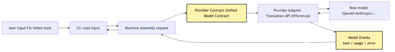
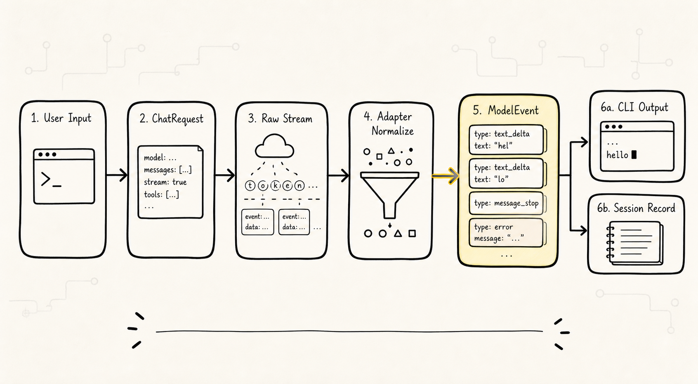
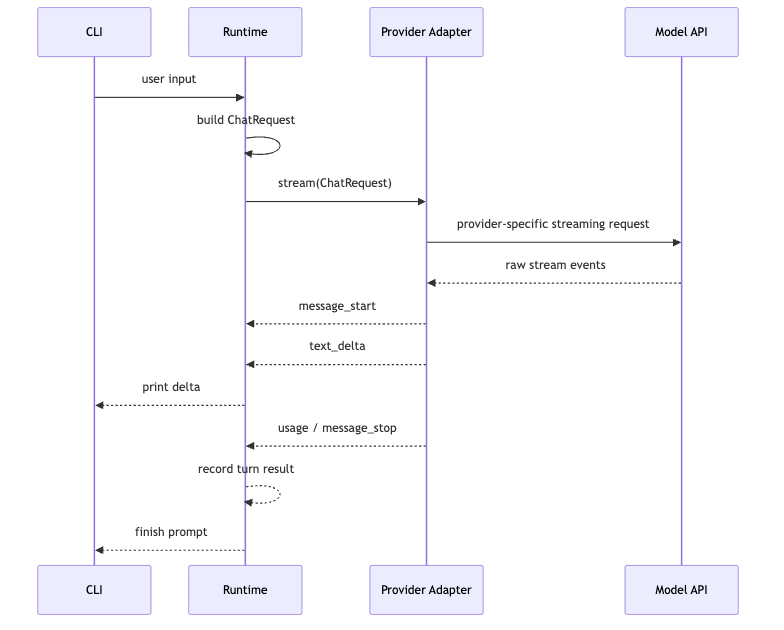
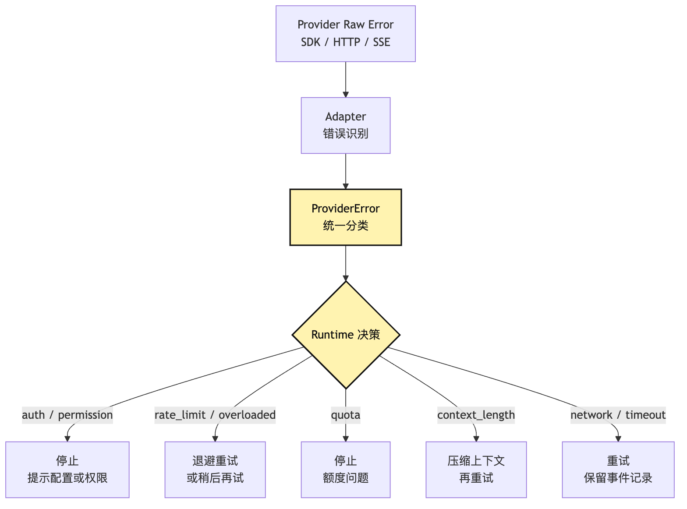
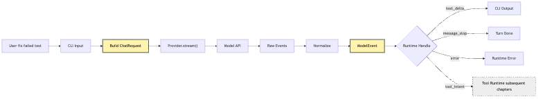

# LLM Provider Integration: Let the CLI Make Its First Model Call

The previous chapters have all been about the boundary between the Agent and the Harness.

Now we are finally going to write the first piece of code that actually moves: making a small CLI talk to a real large model.

This step looks deceptively simple.

Many people's first reaction is:

```text
npm install openai
write a client.responses.create()
send the user input over
print the text
```

If you only want to build a demo, this is indeed the fastest path.

The user types into the terminal:

```text
Take a look at why the tests are failing in this project, and fix it.
```

The program sends this sentence to the model, and the model produces a piece of analysis. Once the first round works end to end, we feel a real sense of accomplishment: we have a CLI, we have a model, and the terminal is starting to spit out tokens.

But hidden in here is the very first architectural fork of the entire Agent Harness.

Are we writing "a script that calls a particular vendor's API," or are we writing "a system that will eventually grow an Agent Loop, a Tool Runtime, Context, Session, Permissions, and Eval"?

On day one, these two things look almost identical.

The only difference is one boundary line:

**The provider is a model-capability adaptation layer, not the Agent core.**

If this boundary is not drawn, every bit of complexity that follows will pour back into the core:

```text
OpenAI's messages format
Anthropic's content blocks
some provider's streaming events
another provider's tool call deltas
HTTP 429, 529, timeout, quota exceeded
proprietary exception classes thrown by SDKs
model names, baseURL, headers, api version
```

All of these will gradually drill their way into the Agent Loop.

By that point, the core is no longer "a runtime that drives tasks forward" but a tangle of provider if-else.

So the question this chapter answers is not:

> How do I call a particular model API?

It is:

> How do I integrate a real large model into a minimal CLI without letting provider details pollute the Agent architecture that follows?

We will continue with the same example: a small CLI Agent whose ultimate goal is to help the user fix failing tests.

But in this chapter, we won't yet let it read files, execute commands, or actually modify code.

The first version only does three things:

```text
chat: send user input to the model and get the full reply
stream: print model output to the terminal as an event stream
error mapping: translate provider-specific errors into errors the runtime can understand
```

This is already important enough.

Because every later capability of the Agent has to start from "what exactly happened during this round of model calls."

## The Problem Chain


This article does not compare specific vendor capabilities, nor does it chase the latest naming of any one API; the actual interface fields in real code should follow the official documentation at the time of implementation. Here we are defining the system boundary first.

The line of reasoning in this chapter is:

```text
calling a particular vendor's API directly is fastest
-> but different providers have different formats for messages, streaming, errors, and tool calls
-> if those differences are written into the core, the Agent Loop will be polluted by provider details
-> so we define a unified provider contract first
-> the provider adapter is responsible for translating the unified request into a particular vendor's API
-> and translating that vendor's response back into unified model events
-> the first version only delivers chat, stream, and error mapping
-> tool intent and the event contract only reserve extension slots; the provider does not execute tools
```

Drawn as a diagram, it looks like this:



The most important thing in this diagram is not "we wrapped one extra adapter layer."

The most important thing is the two translations:

```text
unified request -> provider-specific API
provider-specific response -> unified model events
```

As long as these two translations stay stable, the Agent Loop that comes later does not need to know which model vendor is actually being called underneath.

It only needs to know:

```text
This round of the model has started.
The model produced a chunk of text.
The model has finished.
The model encountered a retryable error.
The model encountered an authentication error.
The model may, in the future, propose a tool intent.
```

This is the value of the provider contract.

It is not there to show off our abstraction skills.

It is there so that the system that comes later does not have to run while carrying API details on its back.

## 1. Why the First Model Call Should Not Go Directly into the Core

Let's start from the version that is easiest to write.

Suppose we want to make a CLI.

The most direct pseudocode is:

```ts
const input = await readLine("> ")

const response = await openai.responses.create({
  model: "some-model",
  input: [
    { role: "user", content: input }
  ]
})

console.log(response.output_text)
```

There is nothing wrong with this code.

It should even serve as the first sanity check: is the API key working, is the network reachable, can the model reply, does the terminal output look right.

But it cannot be the shape of the core.

Why?

Because the questions the core has to answer later are not "how do I call OpenAI," but rather:

```text
What is the user's goal in this round?
What has already happened in the current session?
What context is the model allowed to see this round?
How does each event from the model output enter the event log?
If streaming is interrupted, how do we wind up the state?
If the provider returns an error, should the runtime retry, fall back, or push the user to fix configuration?
If the model proposes a tool call, who validates, approves, executes, and feeds it back?
```

None of these questions have anything to do with a specific provider.

They belong to the Agent Runtime.

If we put provider SDK calls inside the core, the core will quickly start to look like this:

```ts
if (provider === "openai") {
  // OpenAI message format
  // OpenAI stream event format
  // OpenAI error classes
} else if (provider === "anthropic") {
  // Anthropic content blocks
  // Anthropic stream events
  // Anthropic error types
} else if (provider === "local") {
  // local server schema
}
```

In the beginning it's only three or five lines.

Once you add streaming, retries, usage accounting, function calling, reasoning blocks, response ids, rate-limit headers, and model fallback, the core turns into a "museum of provider details."

This is not abstraction obsession.

It is the question of whether future extension will fall apart.

The ultimate goal of our small CLI Agent is to fix failing tests.

It will go through these stages:

```text
first model call
-> multi-turn Agent Loop
-> tool intent
-> file reading
-> command execution
-> observation feedback on errors
-> context compaction
-> session replay
-> permission
-> eval
```

If the very first step lets the provider bleed through into the core, every step after that will be dragged down.

So the first version of the code should hold one very plain discipline:

```text
The core only knows about this project's own model contract.
The provider adapter is what knows about a specific vendor's API.
```

## 2. The Provider Is Not the Model, and Not the Agent Core

A lot of naming pulls people in the wrong direction.

We often say "integrate the model," and so a `Model` class might appear in the code.

But in an Agent system, it's better to first separate three concepts:

```text
Model: remote or local inference capability
Provider: the adaptation layer for accessing a class of model capabilities
Agent Core: the runtime that drives tasks forward around model events
```

`Model` is the source of capability.

It can be OpenAI, Anthropic, Google, DeepSeek, Ollama, a local vLLM, or some company's internal model gateway.

`Provider` is the engineering interface for accessing that capability.

It knows about base URLs, headers, SDKs, request formats, stream events, error formats, and model name mappings.

`Agent Core` is the task-driving system.

It knows about messages, sessions, context, the loop, tool intents, tool execution, permissions, events, and budgets.

The boundaries between these three must not be muddled.

This can be drawn as a layered diagram:


What this diagram is trying to express is a very hard boundary:

```text
The adapter is allowed to depend on provider APIs.
The core is only allowed to depend on the provider contract.
```

This means the core cannot directly say things like:

```text
If Anthropic returns content_block_delta...
If OpenAI returns response.output_text.delta...
If some SDK throws RateLimitError...
```

What the core should be saying is:

```text
If a text_delta is received, append it to the CLI output.
If a message_stop is received, end this round.
If a transient_error is received, retry per the runtime's policy.
If an auth_error is received, prompt the user to check their config.
If a tool_intent is received, hand it off to the Tool Runtime later.
```

In other words, the provider contract is not "writing one more layer of interface."

It is decoupling all subsequent runtime decisions from provider details.

## 3. What Should the Minimal Provider Contract Look Like?

Don't be greedy in the first version.

We don't have an Agent Loop yet, no tool system, no context compaction.

So the provider contract only needs to carry the minimal facts of a single model call:

```text
Input: this round's messages, model parameters, abort signal, trace metadata
Output: a stream of model events
Errors: a unified error type
```

We can sketch the interface like this:

```ts
type Role = "system" | "user" | "assistant"

interface ChatMessage {
  role: Role
  content: string
}

interface ChatRequest {
  model: string
  messages: ChatMessage[]
  temperature?: number
  maxOutputTokens?: number
  abortSignal?: AbortSignal
  metadata?: {
    sessionId?: string
    turnId?: string
  }
}

type ModelEvent =
  | { type: "message_start"; provider: string; model: string }
  | { type: "text_delta"; text: string }
  | { type: "message_stop"; usage?: TokenUsage; stopReason?: string }
  | { type: "tool_intent"; name: string; argumentsText: string; id?: string }
  | { type: "error"; error: ProviderError }

interface TokenUsage {
  inputTokens?: number
  outputTokens?: number
  totalTokens?: number
}

interface ProviderError {
  kind:
    | "auth"
    | "permission"
    | "rate_limit"
    | "quota"
    | "invalid_request"
    | "context_length"
    | "timeout"
    | "network"
    | "overloaded"
    | "server"
    | "unknown"
  retryable: boolean
  message: string
  provider: string
  requestId?: string
  statusCode?: number
  cause?: unknown
}

interface LlmProvider {
  name: string
  chat(request: ChatRequest): Promise<ChatResult>
  stream(request: ChatRequest): AsyncIterable<ModelEvent>
}

interface ChatResult {
  text: string
  usage?: TokenUsage
  stopReason?: string
  raw?: unknown
}
```

This interface is not the final answer.

It is just a starting point.

But there are several important choices baked into it.

First, `messages` is our own message format.

It is not OpenAI's `input`, nor Anthropic's `messages + system`, nor some local service's `prompt` string.

The provider adapter is responsible for the translation.

Second, `stream()` returns `ModelEvent`.

The CLI should not parse SSE directly.

Nor should the runtime make decisions based on a provider's raw stream chunks.

Third, `tool_intent` is included in the event types, but the first version does not execute tools.

This is an extension point.

Because later on, models may emit function call / tool use / structured action, but the provider's responsibility ends at "translating the model's proposed intent into a unified event."

Executing the tool is the Tool Runtime's job.

Fourth, errors are not thrown directly to the upper layer.

Or rather, the adapter can internally catch SDK / HTTP / SSE errors and map them into `ProviderError`.

What the runtime cares about is not some SDK class name, but:

```text
Is this an auth error?
Is this a permission error?
Is this rate limiting?
Is this context too long?
Is this a retryable transient error?
```

That is the information the runtime can act on.

## 4. Messages: Why a Unified Message Format Cannot Just Copy a Vendor's API

The easiest pitfall of the first call is treating a particular provider's messages format as the system's internal format.

For instance, some APIs use:

```json
[
  { "role": "system", "content": "..." },
  { "role": "user", "content": "..." }
]
```

Other APIs put the system instruction in a separate field.

Yet other APIs have `content` not as a string but as content blocks:

```json
[
  { "type": "text", "text": "..." },
  { "type": "image", "source": "..." }
]
```

These are just the most surface-level differences.

Once you enter Agent territory, messages will carry even more:

```text
the assistant's natural-language reply
the assistant's tool intent
tool results / observations
compaction summaries
system event summaries
user interrupt notes
continuation messages after recovery
```

If the internal message format is bound to one specific provider, two problems show up later.

First, switching providers becomes painful.

It's not just swapping an adapter; the entire runtime has to understand a different message structure.

Second, system facts get hijacked by the provider's expression.

For example, one provider may represent a tool call as a content block within an assistant message.

That does not mean your system, internally, must also treat tool intent as "one block of an assistant's content."

In the Harness, tool intent is better treated as an event:

```text
model emitted tool intent
runtime validated intent
permission approved or denied
tool executed
observation appended
```

This chain will later be used by trace, replay, audit, and eval.

It cannot just be a blob of raw provider JSON.

So in the first version, internal messages should stay plain.

For a CLI that has not yet integrated tools, a sufficient structure is just:

```ts
interface ChatMessage {
  role: "system" | "user" | "assistant"
  content: string
}
```

When extension is needed later, introduce your own content parts:

```ts
type MessagePart =
  | { type: "text"; text: string }
  | { type: "tool_intent"; intentId: string; name: string; arguments: unknown }
  | { type: "tool_result"; intentId: string; content: string; isError?: boolean }
```

But this step doesn't need to happen yet.

The first hands-on chapter only needs to hold one principle:

```text
The internal message format is the runtime's expression of facts.
The provider message format is just the adapter's transport expression.
```

## 5. Streaming: The Terminal Wants a Streaming Experience; the Runtime Wants an Event Stream



When the CLI calls the model for the first time, it quickly runs into the second question: should we stream?

If we don't stream, the code is simplest.

The user types one sentence, the terminal hangs for a few or several dozen seconds, and then prints the entire answer at once.

For short Q&A, this is acceptable.

But for our example:

```text
Take a look at why the tests are failing in this project, and fix it.
```

Even though this chapter has no tools yet, the model may produce a fairly long analysis.

If the terminal gives no feedback the whole time, the user will suspect the program is stuck.

So the CLI needs streaming output.

But here is another easy place to go wrong:

```text
Streaming is not just printing the provider's raw events directly.
Streaming is the provider adapter translating raw events into runtime events, and the CLI deciding how to display them.
```

Different providers vary widely in their streaming.

Some emit text deltas as stream events.

Some send a message start first, then content block start, content block delta, content block stop, message stop.

In some, tool call arguments come out as fragments of a JSON string.

Some streams have ping events mixed in.

In some, errors appear as stream events instead of as a normal HTTP response.

If the CLI eats these raw events directly, the system immediately loses its abstraction boundary.

A better chain is:



The most important thing in this diagram is `Runtime-->>CLI: print delta`.

The CLI is responsible for display.

The provider is responsible for translation.

The runtime is responsible for recording and decisions.

These three responsibilities should not get muddled.

Streaming output is not just a UI micro-optimization.

It will affect the event design of the entire system later.

Because once the Agent can call tools, the stream will not only contain text, but may also contain:

```text
the model has started generating
the model produced visible text
the model proposed a tool intent
tool arguments are still being generated incrementally
the model stopped
the provider returned usage
the provider's connection was interrupted
```

If the first version designs the stream as a unified `ModelEvent`, adding tools later will be much smoother.

If the first version is just `process.stdout.write(rawChunk)`, you'll need a major rewrite later.

## 6. Error Mapping: Errors Are Not Strings, They Are Inputs to Runtime Decisions


When the first model call fails, the most common code looks like this:

```ts
try {
  await provider.chat(request)
} catch (error) {
  console.error(error)
}
```

This is useful for debugging, but not enough for an Agent Runtime.

Because when the runtime sees an error string, it can't make a decision.

It doesn't know:

```text
Is this a misconfigured API key, so the user should fix their config?
Is this a permission issue, so it should stop?
Is this a 429, so it should back off and retry?
Is this a quota exhaustion, so retrying is pointless?
Is this an over-long request, so it should trigger compaction?
Is this a network timeout, so it should retry?
Is this provider overload, so it should retry later or switch providers?
```

These judgments must be structured.

Error mapping is not about "wrapping errors prettier."

It is the first brick of Runtime Guardrails.

We can start with a small error taxonomy:

```text
auth: authentication failed; usually not retryable; tell the user to check their key
permission: account or model permission insufficient; usually not retryable
rate_limit: requests too fast; can back off and retry
quota: balance or quota exhausted; should not blindly retry
invalid_request: malformed request; this is a code or context-assembly issue
context_length: context too long; should trigger compaction later
timeout / network: transient network problems; can retry
overloaded / server: provider-side pressure or service errors; can retry or fall back
unknown: handle conservatively; record raw cause
```

After mapping, the runtime can write a much clearer policy:

```ts
function decideProviderFailure(error: ProviderError): RuntimeDecision {
  if (error.kind === "auth" || error.kind === "permission") {
    return { action: "stop", userMessage: "Please check the model credentials or model permissions." }
  }

  if (error.kind === "quota") {
    return { action: "stop", userMessage: "Model quota exhausted; retrying will not help." }
  }

  if (error.kind === "context_length") {
    return { action: "compact_and_retry" }
  }

  if (error.retryable) {
    return { action: "retry_with_backoff" }
  }

  return { action: "stop", userMessage: "Model call failed; please check the logs." }
}
```

Note that we have not yet implemented full retry logic.

This chapter only needs to lay the groundwork for error mapping.

The next chapter, on the Agent Loop and Runtime Guardrails, is when retry, backoff, budgets, and interrupts will really enter the system.

But without this step, the next chapter would only have strings to make decisions on.

That's far too brittle.

Drawing the error flow:



The most important point in this diagram is:

```text
The provider's raw error does not directly determine runtime behavior.
The unified ProviderError is what feeds runtime decisions.
```

For a small CLI, this may seem like overkill.

But once it starts helping you fix failing tests, this is exactly why "it doesn't keep retrying like crazy and burn money during rate limits."

## 7. Tool Intent: Reserve the Interface, Don't Let the Provider Execute Tools

This article is titled "the first model call."

Strictly speaking, we haven't reached tools yet.

But the provider contract must reserve a slot in advance: `tool_intent`.

The reason is simple.

Modern model APIs already widely support tool use / function calling / structured output.

Different providers express tool intent differently:

```text
some call it function_call
some call it tool_use
some use a content block
some use a response item
some build up the arguments incrementally inside streaming deltas
```

If we wait until the tool chapter to refactor provider events, the cost will be much higher.

But reserving an interface is not the same as executing tools.

This point is critical:

```text
The provider may detect that the model proposed a tool intent.
The provider must not execute the tool.
```

Why?

Because tool execution requires an entire Harness pipeline:

```text
intent
-> schema validation
-> permission
-> sandbox / working directory
-> execution
-> truncation
-> observation
-> event log
-> context reinjection
```

None of this belongs to the provider.

The provider only handles model-capability adaptation.

It should not know whether some `read_file` tool is allowed to read the user's home directory.

It should not know whether `bash` requires manual confirmation.

It should not stuff tool results directly back into the next round of messages.

So the first-version contract can reserve the slot like this:

```ts
type ModelEvent =
  | { type: "text_delta"; text: string }
  | { type: "tool_intent"; id?: string; name: string; argumentsText: string }
  | { type: "message_stop"; stopReason?: string }
  | { type: "error"; error: ProviderError }
```

But the first-version Runtime only handles `text_delta` and `message_stop`.

If a `tool_intent` shows up, it can be logged and explicitly reported as unsupported:

```ts
if (event.type === "tool_intent") {
  throw new RuntimeError(
    "Tool intent was emitted, but Tool Runtime is not enabled in this milestone."
  )
}
```

This may look unfinished.

It is actually clear-bordered.

The goal of this chapter is:

```text
The model can answer.
The model can stream output.
The model's errors can be understood by the runtime.
When the model later proposes a tool intent, the contract has a place to put it.
```

But the right to execute tools still belongs to the next layer.

This discipline will keep showing up:

**The model proposes; the system executes.**

The provider is a model-capability adaptation layer, so the most it can do is translate "model proposes."

It is not the execution system.

## 8. How Should the First Version of the CLI Be Laid Out?

Now let's compress all the boundaries above into a minimal file structure.

There's no rush to build a big framework.

The first version can be very small:

```text
src/
  cli.ts
  runtime/
    run-chat-turn.ts
  providers/
    contract.ts
    openai-provider.ts
    anthropic-provider.ts
    errors.ts
  config/
    load-provider-config.ts
```

Its call chain can look like this:

```text
cli.ts
-> read user input
-> load provider config
-> create provider adapter
-> runChatTurn()
-> provider.stream()
-> Runtime receives ModelEvent
-> CLI prints text_delta
```

Pseudocode:

```ts
async function main() {
  const input = await readUserInput()
  const config = loadProviderConfig(process.env)
  const provider = createProvider(config)

  await runChatTurn({
    provider,
    messages: [
      {
        role: "system",
        content: "You are a careful CLI coding assistant. Analyze first; do not pretend you have already executed commands."
      },
      {
        role: "user",
        content: input
      }
    ],
    onTextDelta(delta) {
      process.stdout.write(delta)
    }
  })
}
```

`runChatTurn()`, in turn, only knows about the contract:

```ts
async function runChatTurn(args: {
  provider: LlmProvider
  messages: ChatMessage[]
  onTextDelta: (text: string) => void
}) {
  const request: ChatRequest = {
    model: "default",
    messages: args.messages,
    metadata: {
      turnId: crypto.randomUUID()
    }
  }

  for await (const event of args.provider.stream(request)) {
    switch (event.type) {
      case "message_start":
        break

      case "text_delta":
        args.onTextDelta(event.text)
        break

      case "message_stop":
        return

      case "tool_intent":
        throw new Error("Tool Runtime is not enabled yet.")

      case "error":
        throw mapProviderErrorToRuntimeError(event.error)
    }
  }
}
```

Note that this code does not contain any provider-specific fields.

No `content_block_delta`.

No `response.output_text.delta`.

No SDK-specific error class from any vendor.

All of those are sealed inside the adapter.

This is the most important engineering result of the first version.

It is not "it can answer one sentence."

It is "it can answer one sentence, and there is still room for an Agent to grow afterwards."

## 9. What Does the Provider Adapter Actually Do?

The adapter's responsibilities can be compressed into four verbs:

```text
normalize request
call provider
normalize stream
normalize error
```

On the outside, it implements the same interface:

```ts
class OpenAIProvider implements LlmProvider {
  name = "openai"

  async chat(request: ChatRequest): Promise<ChatResult> {
    // translate request
    // call OpenAI
    // translate result
  }

  async *stream(request: ChatRequest): AsyncIterable<ModelEvent> {
    // translate request
    // call OpenAI streaming API
    // yield unified ModelEvent
  }
}
```

On the inside, it is allowed to know all the provider's details.

For example:

```text
Which field should the system message go into?
How does a user message become a content block?
Which stream events are visible text?
Which events are just ping / keepalive?
In which event does usage appear?
Do tool call arguments need to be accumulated as partial JSON?
Is the request id in the response header or the body?
Which HTTP status should map to which ProviderError.kind?
```

The adapter is not "thinner is always better."

It should be thin in "business judgments" and thick in "protocol translation."

In other words:

```text
It does not decide how the task progresses.
It does not decide whether tools are allowed to execute.
It does not decide how many times an error should be retried.

But it must seriously digest provider API differences.
```

Many systems make the opposite mistake:

```text
the adapter is just a thin wrapper around the SDK
it dumps the raw response straight to the runtime
the runtime then judges provider-specific fields all over the place
```

That means the adapter is not bearing its translation responsibility.

It is just moving the import path from one place to another.

A proper provider adapter should make the runtime unable to hear the provider's accent.

## 10. Configuration and Credentials: Don't Let API Keys Enter Messages or Logs

The first model call has another very practical question: where does the API key go?

For a small CLI, environment variables are the simplest choice:

```text
OPENAI_API_KEY
ANTHROPIC_API_KEY
LLM_PROVIDER
LLM_MODEL
LLM_BASE_URL
```

A few small disciplines need to hold here.

First, credentials only go into the provider config, not into messages.

Don't stuff keys, base URLs, organization ids, or header info into the prompt just to "let the model know the current configuration."

The model does not need to know any of that.

Second, error logs must not print full request headers.

While debugging the provider, it's tempting to dump the raw request / raw response.

If those contain Authorization headers, the session log, traces, and bug reports that follow will be polluted.

Third, the user-visible errors of the CLI must be separate from the internal log.

The user needs to know:

```text
Authentication failed; please check OPENAI_API_KEY.
Model quota insufficient; please check billing or switch providers.
Request too long; later versions will trigger context compaction.
```

The internal log needs to know:

```text
provider
statusCode
requestId
error kind
retryable
turnId
```

But not have sensitive headers printed.

This may not sound like provider-contract material.

It's actually an engineering habit that the first model call must establish.

Because Agent logs will pile up over time.

If you don't impose discipline early, cleaning up secret leaks later will be very painful.

## 11. Testing: Don't Rely on the Real API to Judge Whether the Core Is Correct

Once the first real-model integration works, many people get excited and keep manually testing:

```text
ask "hello"
ask it to explain an error
ask it to fix a failing test
see if the output looks smooth
```

Manual testing is of course needed.

But the correctness of the core cannot depend on the real API.

The reasons are simple:

```text
the real API is slow
the real API costs money
the real API output is unstable
the real API will rate-limit you
the real API may fail due to network issues
the real API's model versions will change
```

So as soon as the provider contract is in place, a fake provider should come with it:

```ts
class FakeStreamingProvider implements LlmProvider {
  name = "fake"

  async chat(): Promise<ChatResult> {
    return { text: "fake answer" }
  }

  async *stream(): AsyncIterable<ModelEvent> {
    yield { type: "message_start", provider: "fake", model: "fake-model" }
    yield { type: "text_delta", text: "The test " }
    yield { type: "text_delta", text: "is failing; " }
    yield { type: "text_delta", text: "we need to gather logs first." }
    yield {
      type: "message_stop",
      stopReason: "end_turn",
      usage: { inputTokens: 10, outputTokens: 8 }
    }
  }
}
```

Use it to test the runtime:

```text
runChatTurn prints all text_delta
ends after message_stop
explicitly rejects tool_intent
maps ProviderError to RuntimeError
stops when AbortSignal fires
```

Then write a small number of integration or fixture tests for the real adapter:

```text
raw stream event -> ModelEvent
raw error body -> ProviderError
messages -> provider request
usage -> TokenUsage
```

This way, the real provider can change while the core's behavior stays stable.

This is also an early manifestation of the Harness mindset:

```text
Wrap the uncontrollable external system behind a testable contract.
```

## 12. Common Failure Modes at This Step

This chapter has little code, but plenty of failure modes.

The first failure is "treating the SDK as the architecture."

The code imports a particular SDK everywhere.

In the short term, it runs fast.

Later, switching providers means changing every file.

The second failure is "treating streaming as an stdout trick."

Whatever chunk arrives, you print whatever chunk.

Then when you need to record usage, handle stream errors, distinguish tool intents, or trace, you find there are no unified events.

The third failure is "keeping only the message string from errors."

The user sees a wall of English stack trace.

The runtime also doesn't know whether to retry.

Rate limits, quota, auth, and over-long contexts all blur together, and the guardrails downstream have no data to work with.

The fourth failure is "the provider quietly executing tools."

Some provider SDKs or examples make tool use very ergonomic, so it's tempting for developers to register and execute functions directly at the provider layer.

That may be convenient for ordinary chat applications.

But it is dangerous for an Agent Harness.

Because tool execution must go through permissions, sandbox, audit, and the event log.

The fifth failure is "treating the raw response as the session fact."

The raw response can be saved to a debug log, but it should not be the runtime's primary source of truth.

Later, the Agent will need to do replay and eval, and that requires stable system events:

```text
model_started
model_text_delta
model_stopped
provider_error
tool_intent_emitted
```

Not each provider's own JSON tree.

Behind all these failure modes is really one sentence:

```text
The first model call is not the destination; it is the entry point to all the runtime responsibilities that follow.
```

## 13. The Load-Bearing Path: From User Input to Model Events

If we compress the whole article into a chain, it looks like this:

```text
user input
-> CLI reads it
-> Runtime creates a ChatRequest
-> the provider contract pins down inputs and outputs
-> the adapter translates to the provider API
-> the real model generates
-> the adapter translates back to ModelEvents
-> the Runtime processes events
-> the CLI displays text
-> the Session will record events in the future
```

Drawn as a diagram:



This diagram has a future node: `Tool Runtime`.

It is greyed out for now.

That is exactly the boundary of this chapter.

Chapter 7 only lets the CLI complete the first model call.

Chapter 8 will let it enter a minimal Agent Loop.

By Chapter 10, when we discuss Intent / Execution separation, this grey node will become the entire tool-execution pipeline.

## 14. What Does This Chapter Actually Deliver?

After reading this chapter, four things should be delivered at the code level.

First, a runnable CLI.

The user can type a sentence in the terminal, and the model can stream a reply back.

Second, a provider contract.

The core only depends on `LlmProvider`, `ChatRequest`, `ModelEvent`, and `ProviderError`.

Third, at least one real provider adapter.

It is responsible for translating internal requests into a particular vendor's API and translating responses back into unified events.

Fourth, a fake provider.

It lets runtime tests run without depending on a real model.

What is out of scope must also be explicit:

```text
No Agent Loop.
No tool execution.
No context compaction.
No automatic retry policy.
No provider fallback.
No session replay.
```

These are not unimportant.

They just need to be built on top of the provider contract.

If the very first hands-on chapter crammed everything in, the reader would not see why each layer exists.

What we want is a clean evolution line:

```text
first model call
-> minimal Agent Loop
-> Intent / Execution separation
-> Tool Runtime
-> Context Engineering
-> Session / Replay
-> Permission / Eval / Harness
```

## Conclusion: The First Call Should Work, and Should Leave a Boundary Behind

The first model call is easy to underestimate.

It looks like just:

```text
user input
-> call API
-> print output
```

But in an Agent Harness, it is actually shaping the system that follows.

If the first step just writes a particular SDK into the core, the core will quickly grow into a swamp of provider details.

If the first step defines a provider contract, then there is a stable load-bearing surface afterwards:

```text
Model providers can be swapped.
Streaming can be unified.
Errors can be acted on.
Tool intent can extend into the Tool Runtime.
The core can focus on driving tasks forward.
```

So the takeaway of this chapter compresses into one sentence:

**The provider is not the Agent core; the provider is only responsible for translating model capabilities into unified events, and does not own the right to execute tools or the source of session truth.**

In the next chapter, we will wrap this model call in the smallest possible Agent Loop.

That is, we will move from:

```text
ask once, answer once
```

toward:

```text
judge, act, observe, judge again
```

By then, the first model call will become a single step inside a loop, rather than the whole system.

## Teaching Harness Landing Point

The reference project reinforces an important order: connect a real provider adapter only after the internal protocol is stable. First make `TeachingModel.complete()` return an internal `AssistantMessage`; then map OpenAI-compatible `content`, `tool_calls`, and `finish_reason` into that shape. API keys, base URLs, and headers belong to configuration and adapter logs, never to messages, event logs, or model context.

---

GitHub source: [00-07-llm-provider-cli-first-call.md](https://github.com/LienJack/build-harness/blob/main/docs/en/00-07-llm-provider-cli-first-call.md)
