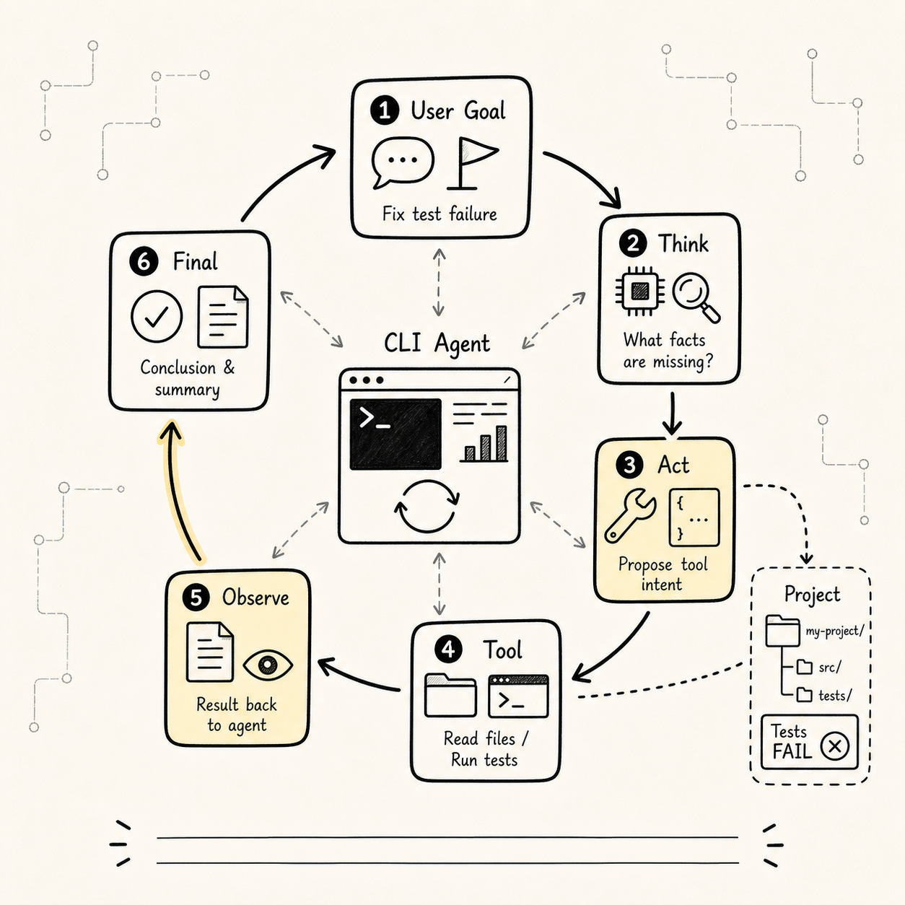
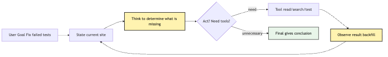
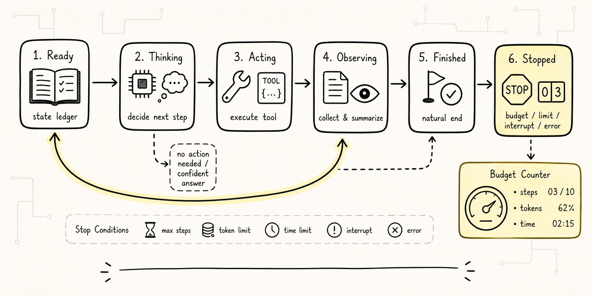
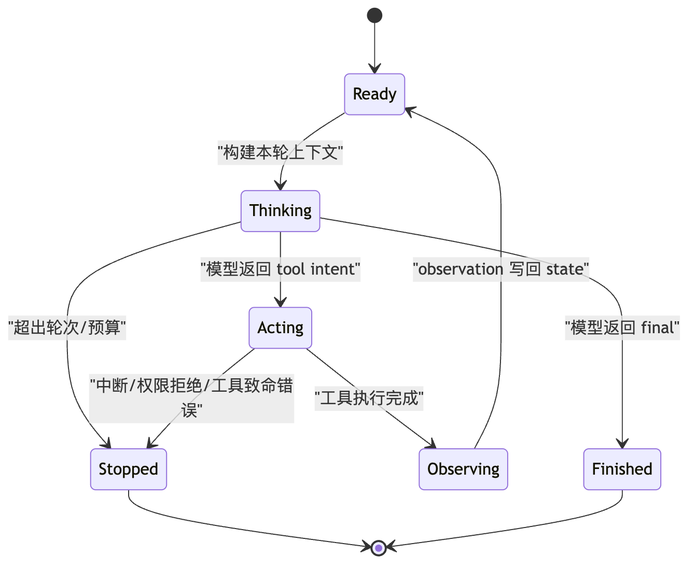
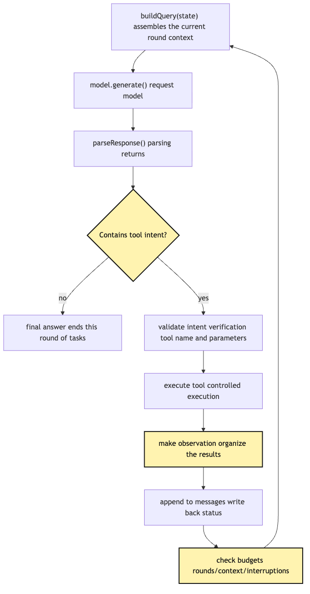
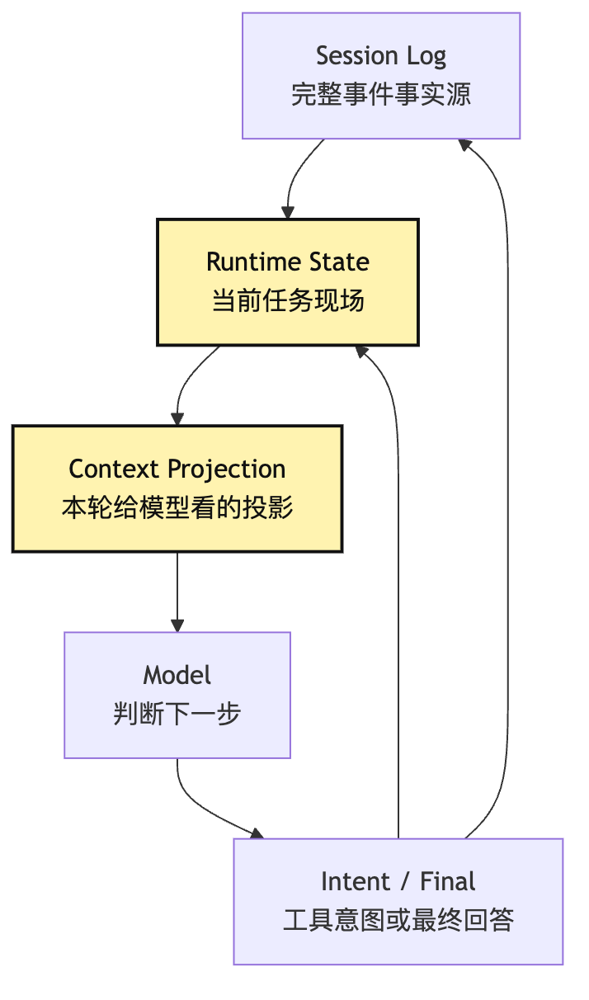
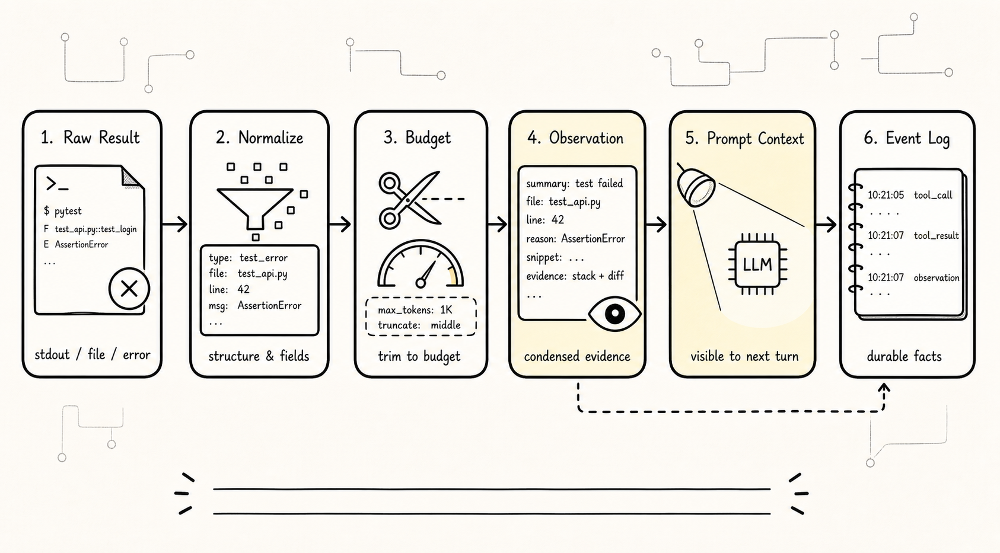
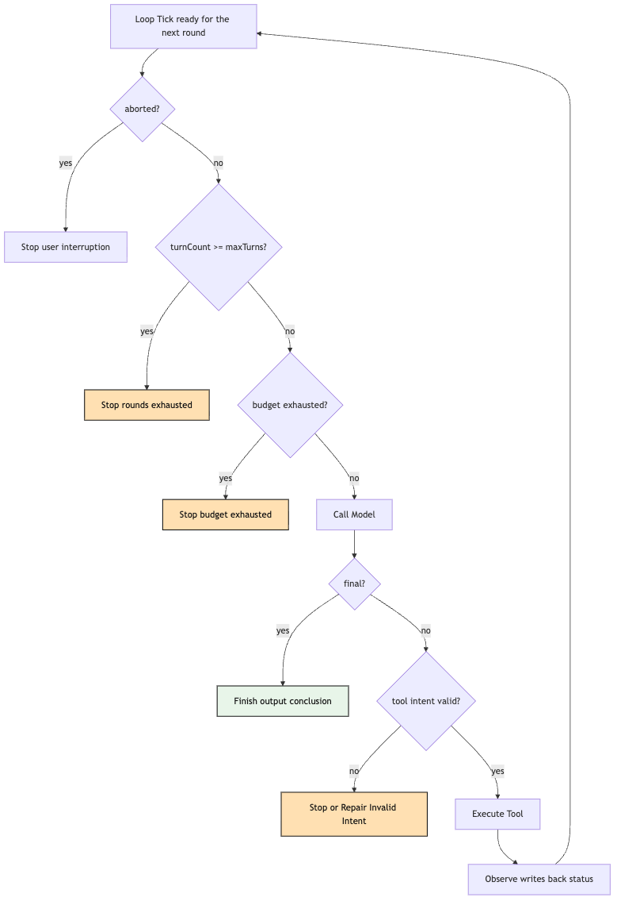

# Minimal Agent Loop: From One-Off Answers to Multi-Step Action

In the previous chapters we kept circling around a single question: an Agent isn't a single Prompt, nor is it a chattier model — it's a running system that can keep pushing a task forward inside a controlled process.

By this point a naive but crucial question naturally arises:

**How exactly does this "keep pushing forward" actually happen?**

If you only look at the surface, the answer sounds like a tautology:

```text
Write a while loop.
```

But anyone who has actually built an Agent knows the danger lies right here.

A `while true` can let the model call tools repeatedly, or it can let the system spin in circles forever; it can let the model keep judging based on new observations, or it can let the model snowball old mistakes; it can turn a ChatBot into something that takes action, or — without a budget, a stopping condition, or any state record — it can turn it into an inscrutable black box.

So this article is not about "how to write a loop syntax." It's about:

> Why does a minimal Agent Loop turn a system from one-off answers into multi-step action? What are the minimum engineering responsibilities such a loop must shoulder?

We'll keep using the same fixed example as before:

```text
The user, inside a project directory, types:
Help me figure out why this project's tests are failing, and fix them.
```

If the system only calls the LLM once, the model can only generate a guess based on that single user sentence. It might say "check your dependency versions," "could be a test environment issue," or "try running npm test." These suggestions aren't necessarily wrong, but they never inspect or affect the real project, and they don't keep evolving based on observations.

What the Agent Loop fills in is exactly that gap:

```text
The model decides the next step
-> The system executes a controlled action
-> Real observations are written back into state
-> The model judges again based on the new observations
-> Until it can give a final conclusion, or a stop condition triggers
```

This is the skeleton of the minimal ReAct loop. Treat ReAct here first as an engineering mechanism: let judgment, action, and observation form a closed loop, rather than requiring the model to emit long-winded private "thoughts."

Pin one sentence first:

**A one-off answer just generates text in the current context; an Agent Loop lets the model keep pushing a task forward inside a state machine of "judge, act, observe, judge again," where the action is still executed by the system under control.**

## The Question Chain



The question chain in this chapter is short, but every step carries weight:

```text
A one-off answer can't keep advancing based on real observations
-> A loop lets the model repeatedly propose the next step
-> Tools turn the next step into an executable action
-> Observations feed execution results back to the model
-> State records turns, messages, budgets, errors, and tool results
-> Stop conditions prevent the loop from spinning in place
-> The minimal Agent Loop is what turns "able to suggest" into "able to advance"
```

Drawn as a minimal closed loop, it looks like this:



The most important thing in this diagram is the path `Observe -> State -> Think`.

Many demos only implement `Think -> Act` — that is, they let the model emit a tool call. On the surface that already looks like an Agent. But if the tool result isn't packaged into an observation, isn't written back into state, and doesn't become the next round's input to the model, then it's just "the model called out 'I want to read a file' and the program obligingly read one." The task is not actually continuous.

The value of an Agent Loop is not "the model can call tools."

Its value is:

```text
Tool results change the next round's judgment.
```

As soon as that sentence holds, the system starts crossing from the world of ChatBots into the world of Agents.

## 1. Why a One-Off Answer Can't Reach "Tests Fixed"

Let's deliberately start from the weakest possible system.

We write a CLI:

```text
$ mini-agent "Help me figure out why this project's tests are failing, and fix them."
```

The first version has only a single model call:

```text
user input -> provider.chat() -> model reply -> print result
```

At this point the model might answer:

```text
You can first run the test command and look at the failure logs;
then locate the failing assertion;
then modify the relevant code;
finally rerun the tests.
```

As suggestions, this is fine. The problem is that the user didn't ask for suggestions — they asked you to "fix it."

In a real project, fixing a test failure requires at least these classes of facts:

```text
What package manager does the project use?
What's the test command called?
Which test is failing?
What's in the error log?
Where is the relevant source code?
After modifying, does it actually pass?
```

These facts aren't in the user's single sentence, and they aren't in the model's parameters. They're in the current working directory, the file system, the terminal output, the test framework, and the project's conventions.

The problem with a one-off answer isn't "not smart enough." It's that it never gets a chance to grab those facts.

It can only give suggestions in a fact-starved state.

The first thing the Agent Loop does is acknowledge that the model doesn't know the answer in round one.

This matters. An Agent that can act doesn't pretend to know on every round; it allows itself to say:

```text
I need to observe first.
```

For "fix the failing tests," round one's reasonable judgment is usually not "the answer is bug X," but rather:

```text
I need to know the project structure and the test command.
```

So the model proposes an action intent, e.g.:

```json
{
  "tool": "read_file",
  "input": {
    "path": "package.json"
  }
}
```

Notice the protagonist has changed.

In a one-off ChatBot, the protagonist is the final text; in the Agent Loop, the protagonist is the next action.

The model doesn't lead with an answer to "how to fix it" — it leads with "what I need to look at." The system executes that action, gets the observation, and then lets the model keep judging.

That's the first step from answer to action.

## 2. A Loop Isn't a Longer Context — It's a State Machine



A lot of people picture a multi-step Agent as "stuff all the history back into the model."

That's only half right.

The history does need to be fed back, but more accurately, an Agent Loop is a state machine.

On every round, it has to make the same set of judgments:

```text
What is the current state?
What should the model see this round?
Did the model return a final or a tool intent?
Is the tool intent valid?
What was the execution result?
How does the result become an observation?
Should we continue to the next round?
Did we hit a budget, an interrupt, or a stop?
```

A chat log can't naturally answer all of that.

A chat log only answers "what did we say earlier." A state machine has to answer "what execution stage is the system in right now, and where should the next transition go?"

A minimal Agent Loop can be drawn first as four states:



This diagram unpacks a common misunderstanding:

```text
The Agent Loop is not "the model keeps talking."
The Agent Loop is "the system transitions in a controlled way between multiple states."
```

Why insist on the state machine framing?

Because what each state is allowed to do is different.

In `Thinking`, the system calls the model, but should not directly trigger external side effects.

In `Acting`, the system executes tools, but should not let the model freely rewrite runtime facts.

In `Observing`, the system packages tool results into observations the model can read, but should not blindly stuff every raw log line into the prompt.

In `Finished`, the system can output the final answer, but should also record the basis on which this run completed.

In `Stopped`, the system has to explain why it stopped, rather than pretend the task is done.

Once you look at the Agent Loop as a state machine, many engineering boundaries fall out for free.

For example:

```text
A tool call failure is not the same as a loop crash.
A permission denial is not a license for the model to keep guessing.
Exceeding max turns is not the same as task success.
The model saying "final" is not the same as the system being obliged to believe it's done.
```

These are all things later Harness chapters will keep extending. But even in the minimal Agent Loop, the hooks need to be in place.

## 3. Minimal ReAct: Think, Act, Observe, Final

Now back to ReAct.

To keep the terminology from overshadowing the mechanism, let's not unfold the English term yet — just remember the four actions:

```text
Think: based on the current state, the model judges the next step.
Act: the model proposes a structured action intent.
Observe: the system executes the action and writes the result back into the model-visible context.
Final: the model decides no further action is needed and gives a final conclusion.
```

A minimal ReAct loop is not about making the model emit long "chains of thought." `Think` here is more like a "judgment phase" in the system's state. The model can return text, or it can return a tool intent. What matters is that the outer runtime can tell the two kinds of returns apart and handle them differently.

You can compress one round of the loop into the following pipeline:



This diagram has several key actions beyond a "while loop":

1. `buildQuery(state)`: re-organize the context every round.
2. `parseResponse()`: distinguish final from tool intent.
3. `validate intent`: a model proposal can't just be executed directly.
4. `make observation`: tool results have to become facts usable next round.
5. `check budgets`: the loop has to know when to stop.

If you strip those actions and only leave:

```text
while true:
  ask model
  run whatever it says
```

That's not an Agent Loop — that's a high-risk model remote control.

A real minimal ReAct loop has one piece of discipline:

**The model proposes the next step, the system executes the next step under control, the state records the next step, and the stop condition constrains the next step.**

These four responsibilities are non-negotiable.

## 4. Running It Through "Fix the Failing Tests"

Now drop this loop back into a small CLI Agent.

User input:

```text
Help me figure out why this project's tests are failing, and fix them.
```

In round 1, state might only contain:

```text
user_goal: fix the failing tests
messages: [original user request]
turn_count: 0
tool_results: []
budget: max_turns=8
```

In round 1, the model shouldn't immediately fabricate an answer. A more reasonable output is a tool intent:

```json
{
  "tool": "read_file",
  "input": {
    "path": "package.json"
  },
  "reason": "Need to confirm the test command and project type"
}
```

The system runs `read_file` and gets `package.json`. But it can't just print the result to the terminal and call it done. It has to turn the result into an observation:

```text
Observation:
- read_file(package.json) succeeded
- scripts.test = "vitest run"
- the project uses pnpm
- relevant dependencies include vitest, typescript
```

Once that observation is written back into messages or state, in round 2 the model knows the next step is to run:

```json
{
  "tool": "run_command",
  "input": {
    "command": "pnpm test"
  },
  "reason": "Need to reproduce the failure log"
}
```

The system runs the tests and gets the failure log:

```text
Observation:
- pnpm test exit code 1
- failing test: sum.test.ts
- error: expected 4, received 3
- relevant files might be src/sum.ts or tests/sum.test.ts
```

In round 3, based on the observation, the model decides to read the source:

```json
{
  "tool": "read_file",
  "input": {
    "path": "src/sum.ts"
  },
  "reason": "The failing assertion is related to the sum implementation"
}
```

In round 4, the model proposes an edit intent.

In round 5, the system reruns the tests.

In round 6, the model sees the tests pass and returns final:

```text
The failing tests are fixed. The bug was in sum.ts mishandling the negative-number branch;
I adjusted the implementation and reran pnpm test — everything passes.
```

Across this whole path, the model didn't "suddenly become smarter" on any round. It just saw more facts.

The job of the Agent Loop is to bring the facts back.

More precisely:

```text
Round 1 isn't there to answer — it's there to gather evidence.
Round 2 doesn't start from zero — it builds on the evidence.
Round 3 isn't free improvisation — it's constrained by the observation.
The final round isn't storytelling — it wraps up based on verification results.
```

This is the mental model of the minimal Agent Loop.

## 5. State: So Each Round Doesn't Start From Zero

If you only remember one implementation object from this chapter, I hope it's `state`.

Because the core of the minimal Agent Loop is not `while`, but how state is updated each round.

A minimal state can be quite simple:

```ts
type AgentState = {
  messages: Message[]
  turnCount: number
  maxTurns: number
  aborted: boolean
  lastObservation?: Observation
  toolResults: ToolResult[]
  finalAnswer?: string
}
```

This isn't a recommendation for a final code structure — it's just to illustrate the minimum responsibilities.

`messages` holds the conversation and tool results the model needs to see next round.

`turnCount` records how many rounds the loop has run.

`maxTurns` is a hard boundary against infinite loops.

`aborted` lets the outside safely interrupt.

`lastObservation` keeps the facts the real world returned in the previous round.

`toolResults` leaves a record for later debugging and auditing.

`finalAnswer` marks whether the task ended with a final answer.

Notice not everything is stuffed into messages.

This is an important boundary:

```text
messages is the model-visible context.
state is the runtime fact set.
session log is the more complete event-source of truth.
```

In the minimal-implementation phase, the three can be very close. But from day one you should know they aren't the same concept.

Otherwise, you'll definitely run into this kind of mess later:

```text
To make the model aware, all tool logs got stuffed into messages.
To recover a task, what happened got reverse-engineered out of messages.
To compress context, messages got summarized.
And the session source of truth got summarized away with it.
```

That road is dangerous.

The minimal Agent Loop can be temporarily simple, but don't get the boundaries wrong.

You can use one diagram to remember where state sits:



This diagram lays a bit of road for what's coming.

Chapter 8 is only about the minimal loop, but you can already see where Context, Session Replay, and Tool Runtime will grow from.

When tool results get larger, `Context Projection` needs governance.

When tasks need recovery, `Session Log` can no longer be just messages.

When tools start having side effects, `Intent` must go through validation and permission.

But in the minimal version, do one thing first:

**At the end of every round, state must be able to explain why the next round starts the way it does.**

## 6. Act: Verify the Mechanism with Fake Tools First

Chapter 8's deliverable is the minimal Agent Loop, so it's tempting to immediately wire up real file tools, a real shell, a real editor.

But I'd suggest the first version use fake tools or echo tools.

The reason isn't laziness — it's risk separation.

What the minimal loop needs to verify first is these things:

```text
Can the model output a structured tool intent?
Can the system distinguish final from tool intent?
Can the tool intent be picked up by the executor?
Can tool results turn into observations?
Can observations flow into the model's input next round?
Can the loop stop on final or budget exhaustion?
```

These mechanics aren't the same thing as "really reading a file."

If you wire up a real file system in the first version, when something breaks it's hard to tell:

```text
Did the model fail to follow the schema?
Did the tool argument parsing go wrong?
Was it a path permission issue?
Was the file content too long?
Did the observation fail to feed back?
Or did the stop condition not fire?
```

The value of fake tools is making the loop itself verifiable first.

For example, we can define an extremely boring `echo` tool:

```text
tool: echo
input: { "text": "run tests" }
output: "echo: run tests"
```

Or define a `fake_test` tool that returns fixed results:

```text
First call: returns test failure, error in sum.test.ts
Second call: returns tests passing
```

This way we can verify the loop walks the path below, without actually changing files:

```text
user goal
-> model requests fake_test
-> system returns failure observation
-> model requests echo/read/edit-style mock actions
-> system returns action-completed observation
-> model requests fake_test again
-> system returns passing observation
-> model final
```

This step isn't to fool yourself that "the Agent can already fix projects."

It's to verify the minimal control flow:

```text
Does Act actually trigger Observe?
Does Observe actually influence the next Think?
Does Final actually let the loop stop?
```

Once that mechanism is stable, swapping fake tools for a real Tool Runtime makes problems much clearer.

The first principle of a minimal Agent isn't "more capabilities is better" — it's "for every capability you add, you know which state transition it hangs off of."

## 7. Observe: Tool Results Are Not Logs — They're Next Round's Facts



The second common problem in many Agent demos is shoving tool output straight back into the prompt.

For example, after running tests, the system gets a big chunk of stdout:

```text
...hundreds of log lines...
FAIL tests/sum.test.ts
expected 4, received 3
...more stack traces...
```

The crudest approach is:

```text
Append the entire raw stdout to messages.
```

Short term this works. Long term you hit three problems.

First, the log is too long; the context inflates fast.

Second, the model gets distracted by irrelevant output.

Third, the system has a hard time later figuring out what this tool result actually meant.

So even in the minimal loop, it's worth introducing the concept of `Observation`.

Observation is not a copy of the raw log. It's "a model-readable summary of the tool execution result, plus the necessary evidence."

You can design it like this:

```ts
type Observation = {
  toolName: string
  ok: boolean
  summary: string
  evidence?: string
  errorType?: string
  retryable?: boolean
}
```

For a test failure, it could be:

```text
toolName: run_command
ok: false
summary: pnpm test failed; failing case is tests/sum.test.ts
evidence: expected 4, received 3
errorType: test_failure
retryable: true
```

This is far more useful than a wall of logs.

Because what the model actually needs next round is:

```text
The tests really did fail.
Where they failed.
What the key error is.
Whether the failure is worth digging into further.
```

Of course, don't over-design the minimal version. Observations can start out very plain. But hold onto one awareness:

**Observe isn't dumping tool output to the model — it's organizing the real world into the facts the next round of judgment needs.**

You can draw the path from tool result to observation like this:


This diagram has two outlets:

```text
Observation flows into Prompt Context, so the model can keep judging.
Observation flows into Event Log, so the system can replay later.
```

The minimal implementation doesn't need a complete event log yet, but don't treat observation as just prompt text. It will become the basis for trace, eval, and replay later.

## 8. Stop Conditions: The Loop Has to Know When Not to Continue


The most underestimated part of an Agent Loop is its stop conditions.

Many people, writing a loop for the first time, only write:

```text
If the model has no tool call, end.
```

That is indeed a stop condition, but nowhere near enough.

A minimal Agent Loop needs at least five categories of stops:

```text
1. Model returns final: task ends naturally.
2. Max turns exceeded: prevents infinite loops.
3. Budget exceeded: tokens, time, cost, or tool-call count exhausted.
4. External interrupt: user cancels, or the process receives an abort.
5. Fatal error: tool unavailable, permission denied, schema invalid in a row.
```

Drawing it as a decision path makes it clearer:



This diagram reminds us: stopping isn't only about successful completion.

A professional Agent Loop has to distinguish:

```text
Completed: model returned final, with sufficient supporting evidence.
Cancelled: user or system requested a stop.
Failed: tool, permission, budget, or model output made the task unable to continue.
Degraded: hit a limit, output what's known so far plus suggested next steps.
```

For "fix the failing tests," if turn 8 still hasn't passed the tests, the system shouldn't keep gambling.

It should stop and explain clearly:

```text
What I completed:
- Read package.json and confirmed the test command is pnpm test
- Reproduced the failure; failing case is tests/sum.test.ts
- Read src/sum.ts and tried one modification
- Reran tests, still failing

Why I stopped:
- Reached maxTurns=8

The most likely next step:
- Need to inspect the test intent of tests/sum.test.ts
- Or widen the search to src/math/*
```

This isn't a perfect outcome — but it's a controlled one.

An uncontrolled Agent will keep circling until tokens run out or the user loses trust.

A controlled Agent will admit its boundary and hand the working context back to the user.

## 9. Minimal Pseudocode: Look at Responsibilities, Not Syntax

Now let's write a piece of pseudocode. But this pseudocode isn't the focus of the tutorial — it's just a way to tie the responsibilities together.

```ts
async function runAgent(userGoal: string, tools: ToolRegistry) {
  let state = initialState(userGoal)

  while (!state.aborted) {
    if (state.turnCount >= state.maxTurns) {
      return stopWithReason(state, "max_turns_exceeded")
    }

    const query = buildQueryFromState(state)
    const response = await model.generate(query)
    const decision = parseModelDecision(response)

    if (decision.type === "final") {
      return finish(state, decision.answer)
    }

    const validation = validateToolIntent(decision.toolIntent, tools)
    if (!validation.ok) {
      state = appendObservation(state, validation.asObservation())
      state.turnCount += 1
      continue
    }

    const result = await executeTool(validation.intent)
    const observation = makeObservation(result)

    state = appendObservation(state, observation)
    state = updateBudgets(state)
    state.turnCount += 1
  }

  return stopWithReason(state, "aborted")
}
```

This code has several deliberate dividing lines.

`buildQueryFromState` makes clear that the model's input is a projection of state, not a string slapped together on the fly.

`parseModelDecision` makes clear that the model's output has to be interpreted into a system object, not directly executed as text.

`validateToolIntent` makes clear that a model proposal must first cross the protocol boundary.

`executeTool` makes clear that execution is the system's responsibility, not the model's.

`makeObservation` makes clear that tool results are organized before being fed back.

`updateBudgets` makes clear that costs and boundaries are updated every round.

`stopWithReason` makes clear that stopping is itself a result, not exception escape.

If the pseudocode of the minimal Agent Loop draws these responsibilities cleanly, then even with only an `echo` as a tool, it's already more solid than many flashy demos.

## 10. Why Not Turn the Loop into a Tool Tutorial

This chapter deliberately doesn't focus on "how to implement read_file, run_command, edit_file."

That's the topic of the Tool Runtime.

Chapter 8 only needs to answer:

```text
Why is a tool called?
How do call results enter the next round?
How does the loop decide whether to continue or stop?
```

If we wrote the article as a code tutorial right now, it's easy to lead the reader into rabbit holes:

```text
How do you read a file?
How do you handle Windows paths?
How do you capture subprocess stdout?
How do you write a diff?
```

These all matter, but they obscure the core of the Agent Loop.

The core of the loop is state transition:

```text
Think produces Intent or Final.
Intent enters the Tool Runtime.
Tool Runtime produces Result.
Result is organized into Observation.
Observation changes State.
State produces the next round's Context.
```

As long as this chain is clear, no matter how complex the tools get later, you'll know where to hang them.

Conversely, if the loop boundary is muddy, more tools just mean more chaos.

You'll see code smells like this:

```text
If the model output contains "npm test", run the command.
If it contains "read file", read a file.
If a tool fails, stuff the error string back into the prompt.
If the model didn't say DONE, keep going.
```

That's not a minimal Agent Loop — that's a flow stitched together out of string-based secret signals.

It can make a demo work. It will not last.

## 11. Three Common Code Smells in Loops

To help the minimal loop land more easily, here are three smells to watch out for early.

### 1. Only Act, No Observe

The system can execute tools, but the model can't see structured results next round.

The symptom is the model repeatedly requesting the same file, repeatedly running the same command, repeatedly asking about facts it already knows.

The root cause is usually:

```text
Tool results were only printed to the UI, not pushed into messages.
Tool results entered messages but weren't clearly labeled with which tool produced them.
Tool results were too long and got truncated past the key facts.
```

The fix isn't "make the model smarter" — it's getting observation feedback right.

### 2. Only Continue, No Stop

The system continues as long as it sees a tool call, with no max turns, no budget, no interrupt, no failure exit.

The symptom is the Agent endlessly trying the same modifications on a failing test, or repeatedly asking the model to fix invalid tool arguments.

The root cause is usually that the loop didn't treat stop conditions as first-class objects.

Even the minimal version needs:

```text
maxTurns
maxToolCalls
timeout
abort signal
invalidIntentLimit
```

You don't need to implement all of them in full from day one, but each should have a slot in state.

### 3. Only Messages, No State

The system stuffs every fact into messages; runtime has no separate state.

The symptom is that debugging is painful: you don't know which tool was used in which turn, which tool failed, why the budget ran out, or whether the final was based on verification.

The root cause is mixing "the context shown to the model" with "the system's own source of truth."

The minimal version can keep state in memory, but get the fields straight:

```text
messages is for the model.
state is for runtime decisions.
event log is for later replay.
```

The earlier these three are separated, the easier life gets.

## 12. From the Minimal Loop to Later Chapters

Chapter 8 is a watershed.

The earlier chapters were more about building the mental model: an Agent isn't a Prompt, an Agent has Model, Loop, Tools, State, and an Agent has boundaries against ChatBot, Workflow, and Harness.

From this chapter on, we genuinely enter the "hand-rolled Agent" track.

But note: the minimal Agent Loop is not the destination.

It only pushes the system from a single answer to multi-step action. The next step quickly exposes new problems.

### 1. Provider Can't Take Over Core

In the minimal loop we call `model.generate()`, which looks simple.

But once you wire up real LLMs, different providers have different message schemas, tool-calling formats, streaming events, and error types.

If you let the provider directly control the loop, the core gets polluted by provider details.

So later we need M0 Core Kernel: the provider only supplies model events and tool intents, while the system still owns state, tool execution, and stop conditions.

### 2. Intent and Execution Must Be Separated

This chapter has stressed it many times: the model proposing a tool intent is not the same as the tool having executed.

Later we'll thicken this discipline:

```text
intent -> validate -> permission -> execute -> observe
```

This is the foundation of Tool Runtime, Permission, Audit, and Replay.

### 3. Context Will Start Bloating

As soon as the loop runs, messages get longer.

Reading files, running tests, searching code — all of these constantly produce tool results.

The minimal version can simply append, but soon you need a Context Policy:

```text
Which observations enter the model?
Which only enter the event log?
How do you truncate big logs?
How do you compress old history?
How do you keep the current task state unbroken?
```

### 4. Verification Becomes the Completion Standard

The model returning final doesn't necessarily mean the task is actually done.

For "fix the failing tests," the most reliable evidence of completion is:

```text
Rerunning the target tests passes.
```

So later we need Verification: the system doesn't just listen to the model say "fixed" — it records verification evidence.

### 5. Harness Catches the Longer Lifecycle

The minimal loop can run start-to-finish in one process.

But real tasks get interrupted, resumed, delegated, audited, replayed, evaluated.

None of those are things the model can handle on its own.

The Agent Loop is the heartbeat.

The Harness is the external control system that keeps that heartbeat stable in a real environment over the long term.

## 13. The Engineering Boundaries of This Chapter

Finally, compress the boundaries of the minimal Agent Loop into a few sentences.

First, the Loop is not for letting the model say more rounds — it's for letting observations change the next round's judgment.

Second, the minimal ReAct loop contains at least `Think / Act / Observe / Final`, where `Observe` and the stop conditions are the most easily underestimated.

Third, a tool call is not execution itself. The model only proposes intent; the system handles validation, execution, recording, and feedback.

Fourth, state is not a chat log. messages is the model-visible context, state is the runtime state, and the event log is the more complete source of truth.

Fifth, an Agent that can stop is more trustworthy than an Agent that can only continue.

One sentence to remember this chapter:

> The essence of the Agent Loop is to let the model repeatedly correct its next step using real observations inside a controlled state machine — not to let the model endlessly extend its own answer.

The next chapter continues along the same line: when a real LLM is wired into the system, how should the core retain control? That is, we want to wire the model into the loop, not let the model take over the loop.

## Teaching Harness Landing Point

The code landing point for this chapter is `runAgentLoop()`: it receives `systemPrompt`, `messages`, `tools`, `model`, and `toolRegistry`, then returns only this run’s `newMessages` and `events`. The loop should not know about HTTP, React, or session files. It only performs the `assistant -> toolResult -> assistant` state transition within `maxTurns` and emits events at the important points.

---

GitHub source: [00-08-minimal-agent-loop.md](https://github.com/LienJack/build-harness/blob/main/docs/en/00-08-minimal-agent-loop.md)
