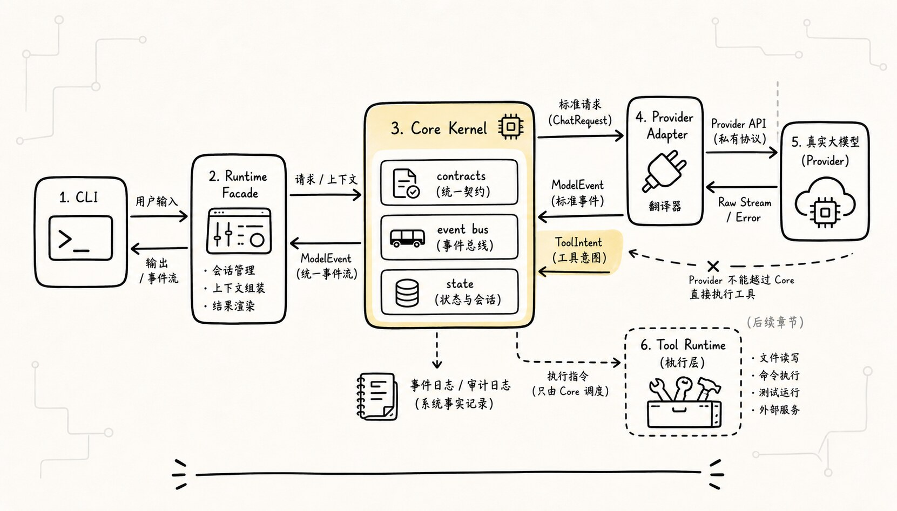
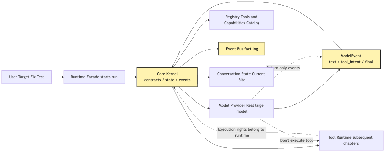
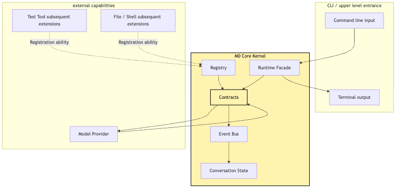
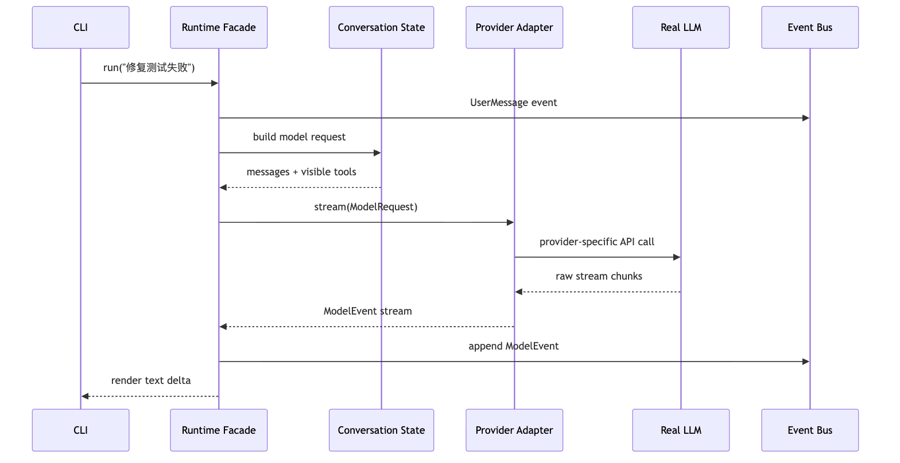
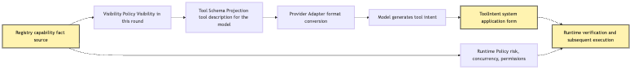
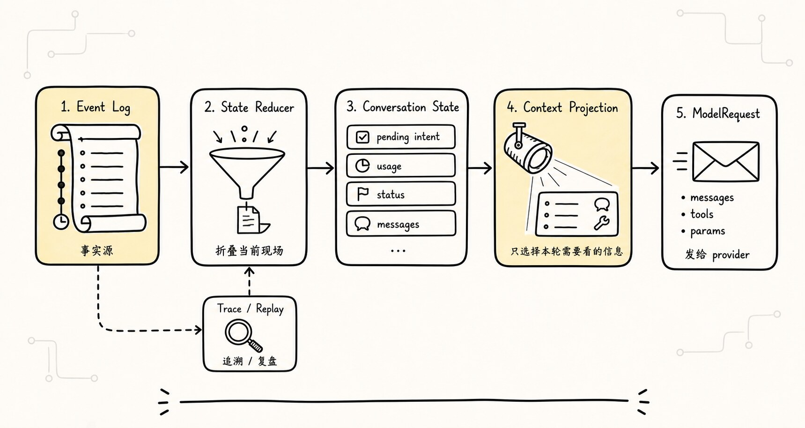
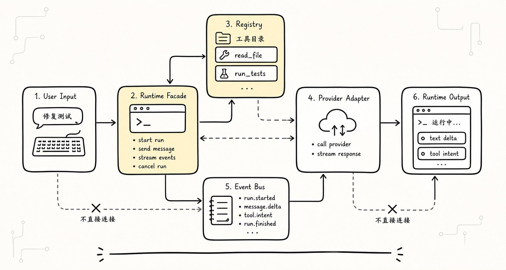

# M0 Core Kernel: Wire Real LLMs into the System, Don't Let Them Take Over

The previous articles have laid out the mental model for Agent and Harness.

We know that an Agent is not a single prompt — it is a running system composed of `Model + Loop + Tools + State`. We also know that the Harness is not just another, smarter Agent, but a control system that sits outside the model. Going one step further, readers usually run into the first real engineering fork:

```text
It's time to plug a real LLM in.
Should we first write a provider call, or first write core contracts?
```

Many projects pick the former.

They start by getting the API of OpenAI, Anthropic, Gemini, or any other provider working. Streaming output works. Tool calls can be parsed. Answers print to the terminal. While they're at it, they wire in tool execution too.

This produces a demo that looks like it runs, very quickly:

```text
User input: help me fix the failing tests
-> provider sends a request to the LLM
-> the model returns a tool call
-> the program executes a shell command
-> the result is folded back into the next turn
```

This path feels great in the short term.

But it has a hidden problem: the center of gravity of the system easily slides from `runtime` to `provider`.

At first, the provider just returns a chunk of text. Then the provider returns tool calls. Then the shape of the provider's response starts to determine what tool objects look like. Then error handling, streaming, messages, tool results, and the structure of context all become bound to the provider. In the end, you find that your entire Agent core is no longer revolving around its own contracts — it's revolving around the response format of one specific model API.

This is exactly the problem M0 Core Kernel sets out to solve.

M0 here is the name of the smallest milestone in this article — it's not an industry-standard maturity level. It is not about making the architecture bigger. Quite the opposite — M0 is about shrinking the system down to a minimal but stable kernel:

```text
Real models can be plugged in.
But real models cannot take over the system boundary.
The provider is an entry point for capability; the Core Kernel is what holds the system boundary.
```

We continue with the same example used throughout this whole tutorial:

```text
Take a look at why this project's tests are failing, and fix them.
```

In article 7, we let the CLI complete its first model call. In article 8, we push that single answer into a minimum Agent Loop. By article 9, the question becomes:

> When the real LLM starts returning text, streaming events, and tool intents, how does the core catch them — instead of being dragged along by them?

This article is not in a hurry to write a full Tool Runtime, nor a permissions system. Those are later chapters.

This article only does the boundary design of the M0 Core Kernel:

```text
contracts
registry
event bus
conversation state
runtime facade
```

These five words sound like an architecture directory listing, but they are not decorations. Each of them catches one real problem:

```text
contracts: provider and runtime speak the same internal language
registry: capabilities must be registered first, not wired in on the fly
event bus: whatever happened must turn into a stream of facts
conversation state: what the model sees is a projection of state, not the entire fact stream
runtime facade: external CLI calls runtime, not the provider directly
```

A one-liner to anchor it:

**The job of the M0 Core Kernel is to translate the output of a real model into internal system events, and to keep execution, state, and logging under the runtime's control.**

## Problem chain



The line of reasoning in this chapter is:

```text
A mock provider can verify the loop, but cannot expose the complexity of integrating a real model
-> A real provider brings streaming, tool calls, errors, usage, and format differences
-> If the core depends directly on the provider's response format, the system boundary gets pierced by the model API
-> So we must first define stable contracts that normalize provider output into ModelEvent and ToolIntent
-> ToolIntent is only a proposed action; execution, state updates, and event logging stay under the runtime's control
-> The runtime manages capabilities through the registry, records facts through the event bus, and derives the current state through the state reducer
-> The CLI and any future upper-layer product calls only the runtime facade, never touching the provider or tool details directly
```

Drawn as the first overview diagram:



The most important thing in this diagram is not the number of modules — it's the two boundaries.

First, the provider can only return `ModelEvent`. It can tell the system "the model produced a piece of text," "the model proposed a tool intent," "the model thinks it can finalize." But it should not directly modify state, nor directly execute tools.

Second, the runtime owns the fact log. Model output, tool intent, tool results, state changes, errors, usage — all of these should enter the event bus. The downstream state and context are folded or projected from these events.

If these two boundaries hold, integrating a real model becomes simply a matter of swapping the provider adapter — not rewriting the core.

## 1. Why M0 is not "get the API working first"

From a coding-impulse standpoint, writing the provider first feels very natural.

You might start with:

```ts
async function callModel(prompt: string) {
  const response = await client.messages.create({
    model: "some-model",
    messages: [{ role: "user", content: prompt }],
  });

  return response.text;
}
```

And the CLI can already answer questions.

Next step, add streaming:

```ts
for await (const chunk of stream) {
  process.stdout.write(chunk.text);
}
```

Step after that, add tool calls:

```ts
if (chunk.tool_call) {
  await runTool(chunk.tool_call.name, chunk.tool_call.args);
}
```

By this point, the demo already feels Agent-flavored.

But this is where the danger starts.

Because this snippet of code is mixing three categories of responsibility:

```text
provider protocol: how to call a particular model API
agent semantics: what does the model output actually mean
runtime authority: who has the right to execute tools, update state, and record facts
```

In a small demo, mixing the three doesn't matter. Because you only have one provider, one tool, one task, one output format.

The moment you enter real engineering, it instantly becomes liability.

For example, when you integrate the second provider, you'll discover:

```text
Some providers put the tool call in the message content block
Some providers put the tool call in a function_call field
Some providers, while streaming, give the id first and then send args in chunks
Some providers split errors into rate limit, overloaded, bad request, context length
Some providers send usage only at the very end
Some providers support parallel tool calls, others default to a different sequencing
```

If the core consumes the raw provider structure directly, those differences will seep into the entire system:

```text
The loop has to recognize each provider's tool format
The tool runtime has to know each provider's tool id rules
State holds provider-private fields
The event log mixes vendor response objects in
The context builder has to assemble messages in vendor-specific historical formats
Tests have to mock the return shape of every provider
```

At that point, the provider is no longer an adapter layer.

It has become the center of the system.

That is exactly what M0 is meant to prevent.

It's not that we don't connect the real model. On the contrary, M0 must connect a real model. Without a real model, all the talk about streaming, tool intent, error mapping, usage, and context pressure is just paper theory.

But the way you connect it is reversed:

```text
Don't make the core adapt to the provider.
Make the provider adapt to the core.
```

In other words, the core defines its own internal language first. The provider adapter translates the external API into that internal language.

This is the meaning of contracts.

## 2. What exactly is the "core" in Core Kernel

The word `Kernel` makes people think of an OS kernel. We can borrow a little of that analogy here, but don't over-mythologize it.

In our tutorial, the Core Kernel is not a complete OS, nor a complex framework. It is just the smallest set of stable responsibilities inside the Agent Harness:

```text
1. Define internal system events and objects
2. Receive provider output and normalize it into internal events
3. Receive user input and write it to the event stream
4. Fold the event stream into a conversation state
5. Read available capabilities from the registry
6. Expose a runtime facade to the CLI and other upper layers
```

What does it not take responsibility for?

```text
Not responsible for implementing every tool
Not responsible for complex permission approval
Not responsible for long-term memory
Not responsible for multi-agent collaboration
Not responsible for remote sandboxes
Not responsible for production-grade evals
```

These are all important, but they don't belong to M0.

The goal of M0 is not "to do it all in one step" — it's to provide a steady foundation for every subsequent layer.

Think of M0 as a very small control plane:



In this diagram, `Contracts` is the hard boundary right in the middle. The provider does not stuff its responses directly into State. The CLI does not call the provider directly. Tools do not bypass the event log to write messages.

That is also the difference between M0 and a simple demo.

The center of a simple demo is usually a `while`:

```text
while true:
  call model
  if tool call: run tool
  else: print answer
```

The center of M0 is a set of contracts:

```text
UserInputEvent
ModelEvent
ToolIntent
Observation
StateDelta
RuntimeEvent
```

Not because the interface names look pretty, but because permissions, replay, compaction, and evals later all hang off these objects.

If M0 doesn't have these objects, every additional layer down the line will patch in another temporary structure. Patch after patch, the system runs on the surface, but has no source of facts inside.

## 3. Contracts: model output must first become a system object

Let's start with the most important contracts.

A real model returns many things:

```text
text tokens
thinking or reasoning fragments
tool call id
tool name
tool args
stop reason
usage
error
provider request id
stream done signal
```

These things cannot be laid into the runtime as-is.

The core needs a more stable layer:

```ts
type ModelEvent =
  | ModelTextDelta
  | ModelToolIntent
  | ModelUsage
  | ModelFinal
  | ModelError;

type ModelTextDelta = {
  type: "model.text.delta";
  runId: string;
  text: string;
};

type ModelToolIntent = {
  type: "model.tool.intent";
  runId: string;
  intentId: string;
  toolName: string;
  input: unknown;
  providerRef?: {
    provider: string;
    rawId?: string;
  };
};

type ModelFinal = {
  type: "model.final";
  runId: string;
  reason: "stop" | "tool_intent" | "length" | "error";
};
```

The point of this pseudo-code is not whether the fields are complete, but the direction:

```text
provider raw response
-> provider adapter
-> core ModelEvent
```

Once it enters the core, the runtime only recognizes `ModelEvent`.

This brings several benefits.

First, the loop doesn't care about provider details.

If one provider calls a tool call `tool_use` and another calls it `function_call`, only the adapter is affected. The loop still sees `model.tool.intent`.

Second, tool execution is not bound to the provider.

`intentId` is the core's tool intent ID. `providerRef.rawId` can preserve the original id for write-back convenience, but the execution layer cannot rely on it as the system's source of truth.

Third, the event log can stay stable.

Switch the model today, upgrade the SDK tomorrow, change the streaming format the day after — as long as the adapter still emits the same `ModelEvent`, the historical events do not all become invalid.

Fourth, testing becomes simpler.

M0 core tests don't need to mock the full response of any real API. They can feed `ModelEvent` directly:

```ts
const events: ModelEvent[] = [
  { type: "model.text.delta", runId, text: "I need to run the tests first." },
  {
    type: "model.tool.intent",
    runId,
    intentId: "intent_1",
    toolName: "run_tests",
    input: { command: "npm test" },
  },
  { type: "model.final", runId, reason: "tool_intent" },
];
```

This is the value of a contract: it pulls core semantics out of the provider SDK.

One boundary needs special emphasis here:

**ToolIntent is not ToolExecution.**

The model proposes:

```json
{
  "toolName": "run_tests",
  "input": {
    "command": "npm test"
  }
}
```

This only means the model thinks the next step should be running the tests.

It does not mean the tests have already been run.

Nor does it mean this command is necessarily allowed to execute.

And it certainly does not mean the provider gets to decide on its own how the tool result is written back.

A ToolIntent is just a request slip inside the system.

Article 10 will be devoted to the `Intent / Execution` separation. This article first lays the foundation: the M0 contracts must keep the two distinct at the type level.

If they aren't separated at this step, retrofitting permissions later will be very awkward. Because the system will already be full of mixed objects that are partly "the model said to execute" and partly "the system has already executed."

## 4. Provider: it is a translation layer, not the system center

The responsibility of a real provider should be very narrow:

```text
Receive a ModelRequest from the core
Call the external model API
Translate the external response into a ModelEvent stream
Map provider errors into core errors
Return usage, latency, and request id as events or metadata
```

It should not do these things:

```text
Decide which tools actually execute
Modify conversation state directly
Append directly to the session event log
Decide permissions
Decide whether the task is complete
Expose the provider's private messages format to upper layers
```

The provider's interface can be flattened to this:

```ts
type ModelProvider = {
  name: string;
  capabilities: ProviderCapabilities;

  stream(request: ModelRequest): AsyncIterable<ModelEvent>;
};

type ModelRequest = {
  runId: string;
  messages: ModelMessage[];
  tools: ModelToolSchema[];
  signal?: AbortSignal;
  metadata?: Record<string, string>;
};
```

There is one key point in this interface:

```text
Both the provider's input and output are core types.
```

`ModelMessage` is not the `MessageParam` of any particular SDK. `ModelToolSchema` is also not any provider's raw tool definition. They are intermediate forms defined by the core.

The adapter can transform internally:

```text
core ModelRequest
-> provider-specific request
-> provider-specific stream
-> core ModelEvent
```

But the transformation cannot leak outside the core.

This design is a bit like a gateway. A gateway must of course understand the external protocol, but the systems behind the gateway should not have the external protocol scattered all over.

It is even clearer in a sequence diagram:



The most important thing in this diagram is the return from `Provider Adapter -> Runtime Facade`.

What it returns is a `ModelEvent stream` — not "results that have already been processed by the tool."

If the model returns text, the runtime can render the text deltas to the CLI while writing them into the event stream.

If the model returns a tool intent, the runtime should write the intent into the event stream and hand it over to a downstream Tool Runtime to decide what happens next.

If the model returns an error, the runtime should turn the error into an attributable event — not let an exception blow straight through the entire loop.

That is the first concrete step in "wiring a real LLM into the system, not letting it take over the system."

The provider is powerful, but it is just an external capability adapter.

## 5. Registry: capabilities must be registered first, you can't guess on the fly

For a real model to produce a tool intent, it has to know which tools are available.

Many minimal Agent demos write tools as a map:

```ts
const tools = {
  read_file,
  run_command,
  edit_file,
};
```

And then splice the tool descriptions into the prompt.

That isn't enough for M0.

The core needs a registry — not for the sake of looking formal, but to give "capabilities" a stable identity inside the system.

A tool needs at least this much information:

```ts
type ToolDefinition = {
  name: string;
  description: string;
  inputSchema: JsonSchema;
  risk: "read" | "write" | "execute" | "network";
  isReadOnly: boolean;
  isConcurrencySafe: boolean;
  visibility: ToolVisibilityPolicy;
};
```

M0 doesn't necessarily need to implement the full permission system, but it must give these fields a place to live.

Because the later Tool Runtime, Permission, and Context Policy will all ask:

```text
What is this tool called?
What is its input schema?
Can it be shown to the model?
Is it an observation action or a mutation action?
Can it run concurrently?
How should its results be folded back?
Does it need user confirmation?
```

If M0 doesn't have a registry, these questions later end up scattered everywhere.

The provider also needs to read tool schemas from the registry, but note the direction:

```text
The registry defines tool capabilities
The context builder selects the tools visible this turn
The provider adapter converts the visible tool schemas into the provider format
The model proposes intents only based on the visible tools
```

Not:

```text
Whatever tools the provider wants to support
The core just contorts itself to match
```

A diagram nails this down:



There is one easily overlooked point in this diagram:

```text
What the model sees as tool schemas is just a projection of the registry.
```

The registry can hold many tools. The current turn does not necessarily expose them all to the model. M0 may register only a `run_tests` or `echo` tool to validate the loop, and then gradually add `read_file`, `grep`, `edit_file`, `bash` later.

Tool visibility is itself part of the control system.

Tools that should not be executed are best kept off the model's menu from the start.

This is not "distrust of the model" — it's a normal engineering boundary. The model cannot call a capability it can't see, so the system is also free of one whole category of pointless refusals and prompt-injection risks.

## 6. Event Bus: facts must happen in the log first

Once a real model is plugged in, the system starts producing many intermediate states:

```text
What the user typed
The runtime started a run
The provider began the request
The model produced some text
The model proposed a tool intent
The provider returned usage
A tool intent was accepted or rejected
A tool started executing
A tool finished executing
The conversation state changed
The run completed or was interrupted
```

If these things only live in scattered in-memory variables, the system can run in the short term.

But it cannot be replayed, audited, evaluated, or recovered, and is hard to debug.

So M0 needs to set up a tiny event bus.

The event bus here is not necessarily a complex message queue. In M0 it can simply be a synchronous append-only log:

```ts
type RuntimeEvent =
  | UserMessageEvent
  | RunStartedEvent
  | ModelEvent
  | ToolIntentRegisteredEvent
  | StateUpdatedEvent
  | RunFinishedEvent;

type EventBus = {
  append(event: RuntimeEvent): void;
  subscribe(handler: (event: RuntimeEvent) => void): () => void;
  snapshot(): RuntimeEvent[];
};
```

The point is not the technical implementation, but the route of facts:

```text
All important facts enter the event stream first.
State is folded out of the event stream.
The UI is rendered from the event stream.
Trace and eval also read from the event stream.
```

This route is very different from "modify state directly."

Code that modifies state directly usually looks like this:

```ts
state.messages.push(modelMessage);
state.lastToolCall = toolCall;
state.status = "running_tool";
```

It's convenient in the short term, but the problem is:

```text
Who changed it?
Why did they change it?
What was it before the change?
Did the change come from the model, the tool, or the user?
If we want to replay, what is the order?
If something goes wrong, can you locate which step is wrong?
```

The event-stream version of the code is a bit more verbose:

```ts
eventBus.append({
  type: "model.tool.intent",
  runId,
  intentId,
  toolName: "run_tests",
  input: { command: "npm test" },
});

state = reduceConversationState(eventBus.snapshot());
```

It looks like an extra step in M0, but it pays off later — sometimes in a life-saving way.

Because Agent failures rarely happen only at the final answer.

They can happen at any intermediate link:

```text
The provider streamed tool args together incorrectly
The adapter mapped the stop reason wrong
The registry showed the model a tool it shouldn't see
The runtime treated a tool intent as already executed
The state reducer missed an observation
The context builder treated old error logs as current facts
```

Without an event stream, the system can only guess from the final transcript.

With an event stream, you can attribute it to a specific layer.

## 7. Conversation State: state is a projection of facts, not the facts themselves



Another key boundary in M0 is `conversation state`.

Many minimal implementations treat messages as the entire state:

```ts
const messages = [
  { role: "user", content: "help me fix the tests" },
  { role: "assistant", content: "I need to run the tests" },
  { role: "tool", content: "test failure log..." },
];
```

Of course, that is part of the state.

But it is not all the state.

A real CLI Agent must, at minimum, also know:

```text
The current runId
The current turn
The current budget
Visible tools
Tool intents proposed but not yet executed
The latest usage
The current task status
Whether it has been interrupted
Which events have already been projected to the model
Which tool results were truncated
Which information stays only in the runtime and isn't given to the model
```

So M0's state is more like a running task state folded from the event stream:

```ts
type ConversationState = {
  conversationId: string;
  status: "idle" | "running" | "waiting_for_tool" | "completed" | "failed";
  turn: number;
  messages: ModelMessage[];
  pendingToolIntents: ToolIntent[];
  visibleTools: ModelToolSchema[];
  usage: UsageSummary;
  lastError?: RuntimeError;
};

function reduceConversationState(events: RuntimeEvent[]): ConversationState {
  return events.reduce(applyEvent, initialState());
}
```

The most important thing here is:

```text
State can be rebuilt.
The event log is the source of truth.
```

State exists to let the runtime decide quickly.

Context exists to let the model see what it needs this turn.

The event log exists to record what actually happened.

The three cannot be mashed together into one "big messages array."

Drawn out, it looks like this:


This diagram is very important for later chapters.

Because when we get to Context Engineering, we will return repeatedly to this chain:

```text
Event Log is what happened.
State is the current task state.
Context is what the model should see this turn.
```

If M0 separates these three from the start, compaction, retrieval, memory, and replay later all have a place to live.

If M0 jams them together inside messages, every later feature turns into "let's figure something out in the prompt."

This is also why so many Agent demos can never grow up.

## 8. Runtime Facade: the CLI just kicks off a run, it doesn't take over the internals



With contracts, registry, event bus, and state in place, we still need an outward-facing entry point.

That entry point is the runtime facade.

The goal of the facade is not to hide the internals as a black box, but to keep the upper-layer caller from having to operate the provider, event bus, state reducer, and registry directly.

The minimum interface can be very plain:

```ts
type AgentRuntime = {
  send(input: UserInput): AsyncIterable<RuntimeOutput>;
  getState(): ConversationState;
  getEvents(): RuntimeEvent[];
};

type RuntimeOutput =
  | { type: "text.delta"; text: string }
  | { type: "tool.intent"; intent: ToolIntent }
  | { type: "status"; status: ConversationState["status"] }
  | { type: "error"; error: RuntimeError };
```

The CLI only needs:

```ts
for await (const output of runtime.send({ text: userText })) {
  render(output);
}
```

It should not:

```text
Call provider.stream() directly
Assemble provider messages directly
Execute tool intents directly
Modify conversation state directly
Write to the internal fields of the event log directly
```

This is not architectural neatness for its own sake.

It's so the same core can serve more entry points later:

```text
CLI
test scripts
local TUI
remote API
automation tasks
multi-agent schedulers
```

If the CLI calls the provider directly from day one, then every additional entry point later requires duplicating the provider-call, event-handling, and state-update logic.

With a runtime facade, the entry point is responsible only for user interaction. The core is responsible for the running semantics.

This is also why the M0 "core" needs to be done first.

It lets every later product form ride on the same execution chain.

## 9. Running "fix the tests" through M0

Now let's put these concepts back into our running example.

The user types in the CLI:

```text
Take a look at why this project's tests are failing, and fix them.
```

M0 doesn't yet have a complete file tool, nor a real edit tool. It might only register a test tool or an echo tool to verify the closed loop.

But the real model is already plugged in.

A run on M0 can unfold like this:

```text
1. CLI calls runtime.send(user input)
2. runtime appends UserMessageEvent
3. The state reducer produces the current ConversationState
4. Context projection builds a ModelRequest
5. The provider adapter calls the real model
6. The model streams text deltas back
7. runtime appends model.text.delta and renders it to the CLI
8. The model returns a tool intent: run_tests
9. runtime appends model.tool.intent
10. State enters waiting_for_tool
11. runtime emits the tool.intent to the upper layer or the downstream Tool Runtime
```

At this point, M0's goal has been reached.

Note — it has not actually run the tests.

That is not a defect.

That is a deliberate boundary.

What M0 is meant to prove is not "the Agent can already fix the tests," but:

```text
A real model is already integrated into the core.
Model output has been normalized into system events.
Tool intents have not pierced through the runtime to be executed directly.
Conversation state can be derived from the event stream.
The CLI sees streaming output and tool intents through the facade.
```

This is the prerequisite for the next article continuing into the `Intent / Execution` separation.

If M0 directly executed `run_tests`, the demo would look more complete in the short term, but article 10 would have no clean entry point. Worse, the system would, from day one, mash "the model proposed an intent" and "the system executed an action" into the same layer.

M0 should rather move one step slower, but stand the boundary up firmly.

A load-bearing chain diagram closes this off:


The last node in this diagram is critical: M0's end state is not "the tool has been executed" but "the system has stably caught the tool intent."

This is the boundary between articles 9 and 10.

## 10. What an M0 minimal directory might look like

So this article doesn't stop at concepts only, let's lay M0 out in a minimal imagined directory.

You don't have to copy a large project's layout from the start. You can keep it very small:

```text
src/
  contracts/
    events.ts
    model.ts
    tools.ts
    state.ts
  providers/
    provider.ts
    openai.ts
    anthropic.ts
    mock.ts
  registry/
    tool-registry.ts
    provider-registry.ts
  runtime/
    event-bus.ts
    state-reducer.ts
    context-projection.ts
    agent-runtime.ts
  cli/
    main.ts
```

A few trade-offs here.

First, `contracts` lives on its own.

Because it is the internal language all layers depend on. Provider, runtime, registry, and CLI can all reference contracts. But contracts must not depend back on the provider SDK, the file system, or terminal UI.

Second, `providers` only does adapters.

`openai.ts` or `anthropic.ts` can be quite complex — handling streaming, retries, error mapping, tool-call chunking. But their output must be core `ModelEvent`s.

Third, `runtime` is the control-flow center.

It is responsible for kicking off a run, appending events, reducing state, building context, calling the provider, and writing provider events back into the event bus.

Fourth, `registry` is the capability catalog.

Even if M0 has only one test tool, it goes through the registry. That way, when local tools, MCP, Skills, or sub-agents are added later, the tool exposure pipeline doesn't have to be torn down.

Fifth, `cli` stays thin.

The CLI should not know the provider's private formats, nor maintain its own messages. It only takes user input, calls the runtime, and renders runtime output.

The minimal core pseudo-code for M0 can be written like this:

```ts
async function* send(input: UserInput): AsyncIterable<RuntimeOutput> {
  const runId = ids.run();

  eventBus.append({
    type: "user.message",
    runId,
    text: input.text,
  });

  eventBus.append({
    type: "run.started",
    runId,
  });

  const state = reduceConversationState(eventBus.snapshot());
  const request = buildModelRequest(state, registry.visibleTools(state));

  for await (const event of provider.stream(request)) {
    eventBus.append(event);

    if (event.type === "model.text.delta") {
      yield { type: "text.delta", text: event.text };
    }

    if (event.type === "model.tool.intent") {
      yield {
        type: "tool.intent",
        intent: toToolIntent(event),
      };
    }
  }

  eventBus.append({
    type: "run.finished",
    runId,
  });
}
```

This snippet is still rough, but it captures the direction:

```text
User input becomes events.
State comes from events.
The request comes from a state projection.
The provider returns events.
Events enter the event bus.
runtime output is rendered by the CLI.
```

There's no provider executing tools here.

And no CLI modifying state.

That is the minimum discipline of M0.

## 11. What M0 should test

The focus of M0's tests is not "is the model smart." Real model output is probabilistic and can't serve as the main basis for core unit tests.

What M0 should test is contracts and control authority.

For example:

```text
The provider adapter can map raw streaming chunks into ModelEvents
The runtime writes user input into a UserMessageEvent
A model text delta enters the event bus and is also output to the CLI
A model tool intent enters pendingToolIntents instead of being executed directly
The state reducer can rebuild the current state from the event stream
The runtime facade does not expose provider-private response objects
The registry only projects visible tools into the provider request
A provider error becomes a RuntimeEvent rather than an uncaught exception
```

These can be written as test cases:

```ts
it("records tool intent without executing it", async () => {
  const provider = new FakeProvider([
    {
      type: "model.tool.intent",
      runId: "run_1",
      intentId: "intent_1",
      toolName: "run_tests",
      input: { command: "npm test" },
    },
  ]);

  const runtime = createRuntime({ provider, tools: [runTestsTool] });
  const outputs = await collect(runtime.send({ text: "fix the tests" }));

  expect(outputs).toContainEqual({
    type: "tool.intent",
    intent: expect.objectContaining({ toolName: "run_tests" }),
  });

  expect(runTestsTool.execute).not.toHaveBeenCalled();
  expect(runtime.getState().pendingToolIntents).toHaveLength(1);
});
```

This test looks a bit counterintuitive.

Aren't we supposed to make tools execute?

Yes — but not by sneaking execution in inside M0.

M0's tests should guarantee that the boundary needed by article 10 exists:

```text
The model can propose.
The system has not yet executed.
Execution must go through the next layer of runtime discipline.
```

If this test fails, it means M0 has already been pierced by the provider or by the rush of a satisfying demo.

Another state test:

```ts
it("rebuilds conversation state from events", () => {
  const events: RuntimeEvent[] = [
    { type: "user.message", runId: "r1", text: "fix the tests" },
    { type: "run.started", runId: "r1" },
    { type: "model.text.delta", runId: "r1", text: "I'll run the tests first." },
    {
      type: "model.tool.intent",
      runId: "r1",
      intentId: "i1",
      toolName: "run_tests",
      input: { command: "npm test" },
    },
  ];

  const state = reduceConversationState(events);

  expect(state.status).toBe("waiting_for_tool");
  expect(state.pendingToolIntents[0].toolName).toBe("run_tests");
});
```

What this test proves is:

```text
State isn't something poked into shape on the fly.
State can be rebuilt from the fact stream.
```

When you do replay, debug, eval, and resume later, this property becomes more and more important.

## 12. A few common failure shapes

To thicken the boundary, let's look specifically at a few anti-examples.

### 1. The provider returns the final answer plus side effects directly

The bad smell is:

```text
The provider returned an answer.
Internally, tools were already executed.
The runtime only sees the final text.
```

It saves the most effort, but the system completely loses control authority.

The runtime doesn't know why the model executed a tool, doesn't know what the tool args were, doesn't know whether permission was needed, doesn't know whether the result was truncated, and doesn't know where the failure happened.

This kind of system is very hard to audit.

### 2. The tool call ID becomes the system's source of truth directly

Some providers give a tool call an id.

That id can be saved, but it cannot become the core's only source of truth.

The core should generate its own `intentId`; the provider id is just a `providerRef`.

Otherwise, when you switch providers, replay history, or merge output from multiple providers, the system's identity will get confused.

### 3. Messages take on log, state, and context all at once

The most common demo-style code uses a single `messages` array for everything.

User messages, model messages, tool results, system state, errors, and debug info — all stuffed in.

It's convenient for short tasks.

In long tasks, it becomes a triple problem:

```text
The log is not auditable
State is not rebuildable
Context is not trimmable
```

M0 must, at minimum, separate event log, state, and context projection.

### 4. No registry; tool descriptions scattered around in the prompt

If tool descriptions are just text in the prompt, the system has a hard time knowing what capabilities are actually available right now.

The model may be looking at outdated tool descriptions.

The runtime may execute a tool that doesn't exist in the registry.

The permission layer also has no stable object to make decisions on.

So tool descriptions can be projected into the prompt — but the source has to be the registry.

### 5. The CLI bypasses the runtime

For quick development, the CLI calls the provider directly.

This makes the first version run very quickly, but every additional entry point later has to reimplement the running semantics.

Worse, tests end up testing CLI behavior, not core behavior.

M0 should keep the CLI thin enough to be replaceable. Today it's a terminal, tomorrow a TUI, the day after an HTTP API — the core run semantics stay the same.

## 13. M0's relationship to surrounding chapters

Putting M0 back into the whole tutorial, its position is clear.

The previous articles answered the mental questions:

```text
Agent is not a prompt.
Agent has Model, Loop, Tools, and State.
Harness is a control system outside the model.
Agents naturally grow into a Harness.
```

Article 7 enters practice:

```text
First, let the CLI call a real model.
```

Article 8 makes it move:

```text
From a single answer to a minimum loop.
```

Article 9 — this article — turns "real model integration" into "a core that can keep evolving":

```text
Provider output has been normalized into system events.
Tool intents are caught but not executed.
State comes from the event log.
The runtime facade becomes the only entry point.
```

Article 10 then naturally follows:

```text
Since M0 can already catch ToolIntent,
the next step is to separate Intent from Execution.
```

This path cannot be reversed.

If you write a do-it-all tool executor first and then come back to add contracts, you'll find many objects already mixed together.

If you let the provider take over tool calls first and then come back to fill in the runtime, you'll find that execution authority has already been defined by the provider's response format.

So M0 looks like a step slower, but it's actually accelerating the rest.

It lets every layer know what it takes in, what it hands off, and what it doesn't touch.

## 14. Summary: real models are capability, not the center

This article can be compressed into a few sentences.

First, a real LLM must be plugged in, because a mock provider cannot expose streaming, tool intent, error mapping, usage, and provider differences.

Second, a real LLM cannot take over the system, because execution, state, the event log, and the capability registry should all belong to the runtime.

Third, the provider's responsibility is to translate external model responses into core `ModelEvent`s, not to execute tools or modify state directly.

Fourth, the load-bearing points of the M0 Core Kernel are `contracts / registry / event bus / conversation state / runtime facade`.

Fifth, the completion state of M0 is not "tools have been executed," but "the system has stably caught model events and tool intents, and execution authority remains in the runtime."

One sentence to remember this article by:

> The provider brings model capability into the system; the Core Kernel keeps the system boundary in its own hands.

In the next article we'll continue along this boundary:

```text
The model proposes; the system executes.
Intent / Execution must be separated.
```

Only by drawing this line clearly do the later Tool Runtime, Permission, Sandbox, Audit, and Replay stop being patches and become engineering layers that grow out naturally.

## Teaching Harness Landing Point

The teaching M0 Kernel can be thin: shared protocol, event types, loop contract, tool contract, and session contract. The principle is that the model enters the system but does not own it. `MockModel` and real providers are only implementations of `TeachingModel`; they cannot bypass `ToolRegistry`, write session state directly, or decide how the UI renders events.

GitHub source: [00-09-m0-core-kernel.md](https://github.com/LienJack/build-harness/blob/main/docs/en/00-09-m0-core-kernel.md)
