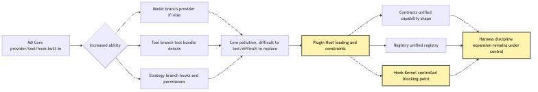
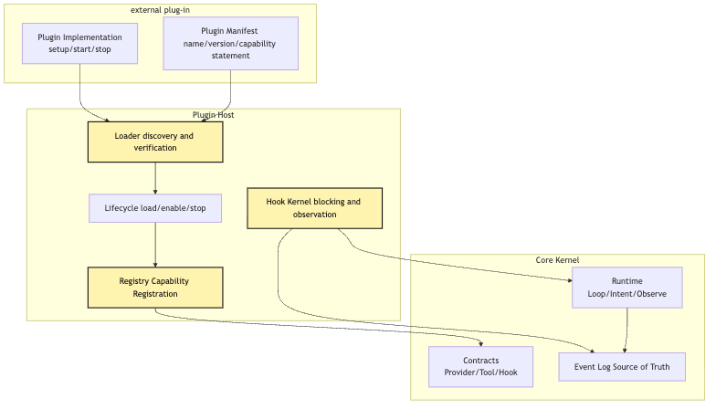
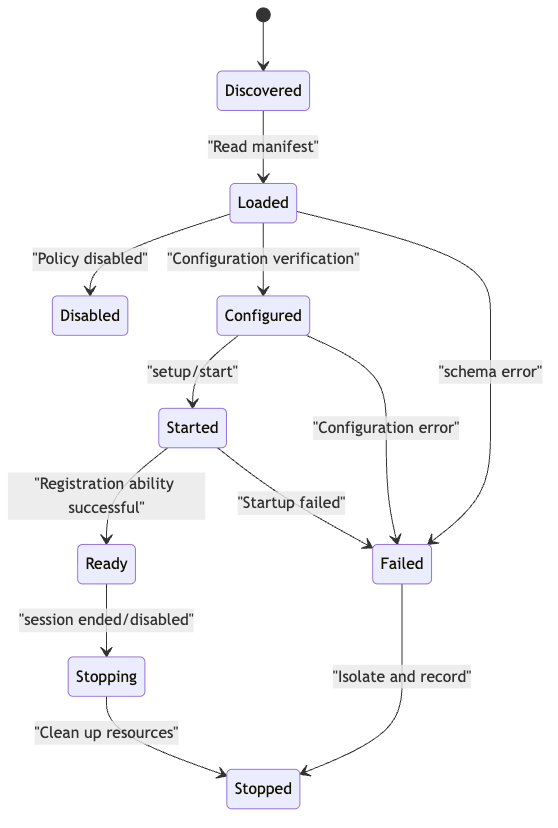

# Plugin Host: Why Must Core Learn to Be Extended?

In Article 10, we defined an important boundary:

```text
The model only proposes Intent.
The system is responsible for Validate, Approve, Execute, and Observe.
```

This boundary keeps a small CLI Agent from being like, "What the model says, the system does."

But when you really keep writing, another problem will happen soon.

At first, our core can hard-code everything:

```text
one provider adapter
a few local tools
one permission decision function
one event log
one loop
```

It makes sense in M0.

Because the goal of M0 is not to build a complete platform, but to prove:

```text
A real model can be connected to the system, but it will not take over the system.
```

But by M1, things have changed.

You will want to add a second provider.

You want to break the file tools, the search tools, the terminal tools to stand alone.

You'd want the project to register yourself for some hook.

You'll want the team to connect in-house systems, code specifications, review processes, deployment portals.

You will want different capabilities enabled in different workspaces.

And then core starts to swell.

It started with just a few more`if`.

Soon it becomes:

```text
If the provider is openai, go here.
If the provider is anthropic, go there.
If the tool comes from a local bundle, use the local permission policy.
If the tool comes from MCP, check the server scope first.
If the hook is preToolUse, it must be able to block.
If the hook is postToolUse, it can only observe.
If the plugin is disabled, do not expose its tools.
If the plugin fails to start, do not bring down the whole agent.
```

At this point, you'll find:

```text
core is no longer just core.
core has become the dumping ground for every concrete capability.
```

The central question to be answered in this article is:

> Why must the core of an Agent Harness learn to be extended? And why does "extensible" not mean loosening boundaries, but bringing external capabilities into the same Harness discipline?

Here is the boundary:

```text
core learning to be extended does not mean core lets go.
Plugin Host does not let external capabilities enter the system freely.
Plugin Host makes external capabilities line up to enter the same Harness discipline.
```

We continue using the example that runs through the whole series:

```text
The user enters this at the project root:
Help me figure out why this project's tests are failing, and fix them.
```

This time, the Agent already has the M0 core kernel.

It can call models.

It can receive tool intent.

It knows that intent and execution must be separated.

But now we want it to grow new capabilities:

```text
A provider plugin that provides different model vendors.
A local-tools plugin that provides read/search/shell/edit.
A test-runner plugin that provides detection strategies for npm test / pytest.
A policy plugin that provides project-level permission hooks.
```

The question is:

These capabilities come from outside the core.

How can core receive them without being polluted by them?

That's why Plugin Host appeared.

## Problem chain

This chapter follows this problem sequence:

```text
M0 core can directly build in provider, tool, and hook
-> as capabilities grow, core becomes polluted by specific models, tools, and policies
-> polluted core is hard to test, replace, and govern
-> external capabilities need to enter the system as plugins
-> plugins cannot directly modify core; they can only declare capabilities and lifecycle
-> Plugin Host loads, validates, registers, starts, and stops plugins
-> Registry converts external capabilities into unified internal contracts
-> Hook Kernel turns extension points into controlled blocking points
-> extension does not bypass the Harness; it enters the same Harness discipline
```

The most important element of this chain is not “plug-in to make the system more flexible”.

Flexibility is only a superficial gain.

The real gains are:

```text
core no longer needs to know every concrete capability.
core only needs to know how external capabilities must enter the system.
```

As a diagram, it looks roughly like this:



The most critical boundary in this picture is that between`Core Pollution`and`Plugin Host`.

Without Plugin Host, core will know every provider, every tool, every hook.

When there's Plugin Host, core knows only a few stable types:

```text
PluginManifest
ProviderContribution
ToolContribution
HookContribution
LifecycleContribution
```

Plugins can be a lot.

Contracts must remain few.

The plugin can be from different sources.

The capability shape after entering the system must be uniform.

That's the main line of the story.

## I. Why M0 Core Should Start with Built-In Capabilities

Do not rush to criticize "built-in" capabilities.

In the M0 phase, it is reasonable to write provider, tool, hook directly into core.

Because at that point we do not yet have enough facts to prove which boundaries are stable.

If you design a complete plugin system from day one, it is easy to create a hollow architecture:

```text
There is a plugin interface, but no real plugin.
There is lifecycle, but no real state.
There is a hook bus, but no real blocking point.
There is a registry, but no real capability to register.
```

This early abstraction is:

It looks engineered, but it has not been stressed by real tasks.

So the M0 strategy should be:

```text
First get the core path working.
Then observe where things start to swell.
Finally refine the swelling points into extension boundaries.
```

For example, in the example of "small CLI Agent repair test failure", M0 may have only three tools:

```text
read_file
search_text
run_command
```

Only one.

Hook may be just a simple permission function:

```text
run_command Is user confirmation required?
Is edit_file allowed to modify the current workspace?
```

At this point, forcing in a plugin system only increases cognitive load.

Readers are forced to understand plugin loading, dependency order, start/stop state, hook order, and naming conflicts before they even understand intent/execution separation.

So M0's simplification is not a mistake.

It deliberately narrows the variables.

But M0 is not the end.

After M0, the real problem will come out.

That is also the stance of this article:

```text
Do not make it extensible for extensibility's sake.
Only when concrete capabilities begin polluting core should the swelling points be refined into a Plugin Host.
```

## II. How Core Gets Polluted as Capabilities Grow

Let us move on.

User says:

```text
Help me figure out why this project's tests are failing, and fix them.
```

Agent needs to be smarter now.

It doesn't just run a fixed order.

It needs to be able to judge whether this is a Node project or a Python project.

It has to be able to read package manager.

It needs to be able to switch between models.

It needs to enable the project to provide its own security strategy.

It must be able to record the trace before and after the order is executed.

If there are no plug-in boundaries, the code is likely to grow this way:

```ts
async function runAgent(input: string, cwd: string) {
  const provider = config.provider === "anthropic"
    ? new AnthropicProvider(config.anthropic)
    : config.provider === "openai"
      ? new OpenAIProvider(config.openai)
      : new LocalProvider(config.local);

  const tools = [
    createReadTool(cwd),
    createSearchTool(cwd),
    createShellTool(cwd),
  ];

  if (isNodeProject(cwd)) {
    tools.push(createNpmTestTool(cwd));
  }

  if (isPythonProject(cwd)) {
    tools.push(createPytestTool(cwd));
  }

  if (config.enableGithub) {
    tools.push(createGithubTool(config.githubToken));
  }

  const preHooks = [];
  if (config.askBeforeShell) preHooks.push(confirmShellHook);
  if (config.projectPolicy) preHooks.push(projectPolicyHook);
  if (config.enterprisePolicy) preHooks.push(enterprisePolicyHook);

  // ...
}
```

The problem with this code is not that it can't run.

It probably runs well.

The problem is that it combines four types of change:

```text
model vendor changes
tool capability changes
project policy changes
runtime lifecycle changes
```

When all four types of changes enter`runAgent()`, core is no longer a stable control system.

It's turned into a bunch of assembly scripts with specific capabilities.

And then even the tests get painful.

You want to measure core's loop, but you have to handle the provider configuration.

You wanted to measure the intent, but GitHub token.

You want to test permissions, hook, and start a bunch of unrelated tools.

You want to change a test runner and change the core file.

That's core pollution.

Pollution is not a long code.

Pollution is the deterioration of the responsible boundary.

Plugin Host is not going to solve "How to open a directory."

It addresses:

```text
how concrete capabilities enter the system,
without letting changes in those concrete capabilities infect core.
```

## III. Plugin Host Is Not a Plugin Marketplace, but a Controlled Entry Point

When many people hear of Plugin Host, they think of the “plug-in market”.

For example, many plugins can be installed by users, and the system's capability is expanded indefinitely.

It is not wrong, but it is not the first priority for an Agent Harness.

The Plugin Host in Agent Harness is not the markt place.

It's a controlled entrance first.

The question it answered was:

```text
What steps must an external capability go through if it wants to enter core?
```

The smallest answer should be:

```text
discover plugins
read declarations
validate contracts
create instances
register capabilities
start lifecycle
connect to hook gates
isolate errors when they occur
clean up resources on stop
```

There's nothing here:

```text
give plugins direct access to the core object and let them modify it freely.
```

It's crucial.

The real Plugin Host should not expose core to a large object that can be operated at will:

```ts
plugin.activate(core);
```

If`core`can touch anything in it, the Plugin Boundary is nothing.

Plugin may change the status directly.

Plugin may be used to replace the tool secretly.

Plugin may bypass permissions.

The plugin may include a secret in the log.

The plugin may perform an external action in a book without going through an event log.

So the more stable approach is:

```text
Plugins only submit contributions.
The host is responsible for registering those contributions into the system.
```

That is:

```ts
type PluginContribution = {
  providers?: ProviderContribution[];
  tools?: ToolContribution[];
  hooks?: HookContribution[];
  commands?: CommandContribution[];
};

type Plugin = {
  manifest: PluginManifest;
  setup(ctx: PluginSetupContext): Promise<PluginContribution>;
};
```

`PluginSetupContext`here must also be restricted.

It provides a logger.

It provides configuration reading.

It provides information on the workspace.

It provides registration aids.

It should not, however, provide an entry point for “free tools”.

Even less, you should provide a "direct modification state" portal.

The first principle of Plugin Host is:

```text
Plugins can declare capabilities, but they cannot bypass the host and take over capabilities themselves.
```

In other words, the plugin contributes to the capability to stand for election, not the right to enforce.

A tool is contributed by a plugin, which only represents its capability catalogue to enter the system.

It's going to go through:

```text
registry normalization
visibility / context projection
permission / hook gate
tool runtime execution
observation / event log
```

So here's three words:

```text
registered does not mean visible.
visible does not mean executable.
executable also does not mean it can bypass audit.
```

This is the most important connection between Plugin Host and Harness.

## IV. Five core components for Plugin Host

In order to keep this mechanism alive, we have to break Plugin Host into five parts:

```text
Manifest
Loader
Registry
Lifecycle
Hook Kernel
```

The relationship between these five components can be drawn into a stratification:



`External plugins`is not directly connected to`Core Kernel`.

It must go through`Plugin Host`first.

This is the boundary of responsibility.

`Manifest`allows the plugin to self-describe first.

`Loader`is responsible for reading the instructions and judging whether it is eligible to enter the system.

`Lifecycle`handles the process of processing plugins from " found" to " running" to "stop".

`Registry`is responsible for making the plugin contribution a uniform object that you can understand.

`Hook Kernel`is responsible for turning some extension points into controlled breakpoints.

These five parts combined are Plugin Host.

If only manifest, without lifecycle, the plugin is unmanageable.

If only registry, without hook kernel, the plugin can only expand capability and cannot safely access the process.

If only there was a hook, no registry, the hook would turn out to be all over the echoes.

If loader just plugs the plugin into the core, it's just a catalogue scanner.

So the difficulty of Plugin Host is not to load a file.

It's hard:

```text
Once external capabilities enter the system, they still obey core's contracts, events, permissions, and lifecycle.
```

## V. Manifest: The Plugin Must Declare Who It Is

The first thing before the plugin goes into the system is not running the code.

The first thing is to read manifest.

The minimal commitment of the plugin to host.

It should at least answer:

```text
What is the plugin called?
What version is it?
Which capabilities does it want to contribute?
Which configuration does it need?
Which permissions does it need?
Is it enabled by default?
Which host capabilities does it depend on?
Is it allowed in the current workspace?
```

A smallest manifest can be this long:

```ts
type PluginManifest = {
  id: string;
  name: string;
  version: string;
  description?: string;
  contributes?: {
    providers?: string[];
    tools?: string[];
    hooks?: HookPoint[];
  };
  requires?: {
    hostVersion?: string;
    capabilities?: string[];
  };
  permissions?: PluginPermission[];
  defaultEnabled?: boolean;
};
```

Attention`permissions`.

Many plug-in systems defer permission issues until the tool is called.

But Agent Harness can't read permission only at the last minute.

This is because it is possible to read configurations, open connections, find tools, subscribe events at the setup stage.

So a static statement is needed in the climate:

```text
what capabilities this plugin is likely to touch.
```

For example:

```text
The local-tools plugin needs filesystem and shell.
The github plugin needs network and repo metadata.
The provider plugin needs a model API key.
The policy plugin needs to read project policy files.
```

It's not the final authorization.

It's more like an admission application.

When a specific tol intent is actually executed, the validate, approve, execute is still to be followed.

But without the best, host doesn't even know what this plugin is going to bring into the system.

This will turn the plugin into a black box.

The second principle of Plugin Host is:

```text
Plugins must declare before they run; capabilities must register before they are exposed.
```

Here's an engineering boundary:

```text
manifest is a static declaration.
setup is constrained initialization.
tool execution still belongs to Tool Runtime.
```

Do not give the plugin the power to run the code in the setup, either by giving it the execution tool or by modifying the session.

## VI. Loader: Loading Plugins Is Not Just `require`

If only internal demo, loader can be simple:

```ts
const plugin = await import(pluginPath);
```

But that's not all of Plugin Host.

The real loader has to deal with at least a few things:

```text
find plugin sources
read manifest
validate schema
check version compatibility
check enablement policy
check permission declarations
isolate load errors
record load events
```

Nor should there be a single source.

In the future there may be:

```text
built-in plugins
project plugins
user plugins
enterprise-managed plugins
plugins temporarily enabled from the command line
fake plugins in test environments
```

Levels of trust vary from one source to another.

Internal plugins can be enabled by default.

The project plugin may require user confirmation.

User plugins may be enabled across items.

Enterprise plugins may override local settings.

Test make plugin should only appear in the test runtime.

If loader does not record the source, then the rest of the registry, permission, audit loses context.

For example, it is also a`run_tests`tool:

```text
from the built-in local-tools bundle
from project plugins
from an enterprise plugin
from a third-party plugin
```

They may look like running tests on UIs.

But there is no parity in system governance.

Loader should bring the source into the plugin log:

```ts
type LoadedPlugin = {
  id: string;
  source: "builtin" | "project" | "user" | "managed" | "test";
  manifest: PluginManifest;
  module: PluginModule;
  state: "loaded" | "disabled" | "failed";
};
```

So, every capability in the back that enters registry knows where it comes from.

It's not extra metadata.

This is the basis of audit and authority.

Here is a question that needs to be decided at an early stage:

```text
Are project plugins trusted by default?
```

If the project plugin comes from the current workspace, it may not be as fully credible as the code repository.

M1 can support only the biltin and test make plugins first.

If you want to support project / user plugins, you need to re-engineer an allowlist, signature, Sandbox or visible confirmation policy.

This is recommended for subsequent confirmation by the author.

## VII. Registry: External Capabilities Must Be Internalized

Plugin Host is really connected to the extension, is registry.

Plugin cannot insert a tool function directly into the model.

The plugin cannot expose provider SDK directly to loop.

The plugin cannot hang the Hook function directly to any location.

It has to give the power to registry.

And registry has consolidated them into a contraction of core.

For example:

```ts
type ProviderContribution = {
  id: string;
  displayName: string;
  createProvider(config: ProviderConfig): ProviderAdapter;
};
```

tool contribution：

```ts
type ToolContribution = {
  name: string;
  description: string;
  inputSchema: JsonSchema;
  risk: "read" | "write" | "execute" | "network";
  createHandler(ctx: ToolRuntimeContext): ToolHandler;
};
```

hook contribution：

```ts
type HookContribution = {
  point: HookPoint;
  id: string;
  order?: number;
  blocking: boolean;
  run(input: HookInput): Promise<HookDecision>;
};
```

These three contributions have in common:

```text
None of them is a direct execution result.
They are all capability descriptions that can be registered, validated, and audited.
```

What's going to happen is:

```text
check name conflicts
record plugin source
save capability schema
mark risk level
handle enable/disable
expose query APIs
generate an available-capabilities view for runtime
```

This makes the rest of the core not need to know which plug comes from.

Runtime only asks:

```text
Which providers are available in the current session?
Which tools can the current model see?
Which hooks exist at the current hook point?
```

It doesn't ask:

```text
Which file imported this tool?
Which npm package does this provider use?
Was this hook written by the user or by the project?
```

Of course, audit needs to know the source.

Permission may also need to know the source.

But this information is transmitted through registry metadata rather than allowing core to write plugin branches everywhere.

This is the value of registry:

```text
It turns "many external capabilities" into "stable internal capability shapes."
```

There's one thing that can be confused:

```text
Registry records which capabilities the system has.
Capability Discovery / Context Policy decides which capabilities the model sees in this turn.
Tool Runtime decides whether a given intent can become execution.
```

These three levels cannot be merged.

If the registration tool is directly exposed to the model, the system will quickly lose control.

A more stable link should be:

```text
Plugin Contribution
-> Registry
-> Capability / Context Projection
-> Visible Tool Schema
-> Model Tool Intent
-> Tool Runtime
```

## VIII. Lifecycle: Plugins Are Live, Not Static

A lot of tutorials will stop at registry.

As if the plugins were a number of capability declarations.

But in Agent Harness, the plugs are often live.

The provider plugin may want to initialize SDK.

MCP type plugins may start a sub-process or connect to remote server.

The test plugin may have to scan the project structure.

The policy plugin may read configurations and listen to changes.

The telemetry plugin may open the output channel.

So Plugin Host must have lifecycle.

The minimal-state machine may be:

```text
discovered
-> loaded
-> configured
-> started
-> ready
-> stopping
-> stopped
-> failed
```

Image:



This is not about status names.

The focus should not be on the “yes” and “no” status only.

A plugin may have been found, but the strategy is disabled.

A plugin may be loaded successfully, but the configuration is missing.

A plug-in may fail to start, but should not drag the whole core.

A plugin may be ready, but some tool handler execution failed.

These states must be visible.

Otherwise, you can only guess when the user says, "Why can't this Agent see run tests tools."

With a lifecycle, the system can clearly answer:

```text
The test-runner plugin has been discovered.
The manifest is valid.
The configuration phase failed.
The reason is that no package manager was found.
Therefore, the run_tests tool was not registered.
```

That's why Harness needs lifecycle.

It's not about writing complex structures.

It's to make failure explain.

Here's the details:

```text
Capability registration should preferably be rollbackable.
```

If the plugin has failed to start halfway, host should not leave semi-register provider, semi-register tool, semi-register hook.

Otherwise the list of capabilities that runtime asks becomes dirty.

So lifecycle and registry should design:

```text
start failure -> revoke this contribution
disabled plugin -> hide or revoke plugin capabilities
stopped plugin -> clean up resources and record an event
```

## IX. Hook Kernel: A Hook Is Not an Ordinary Event

Plugin Host is the easiest place to be written bad, is hook.

There's a lot of system hooks that just bugged events:

```text
beforeRun
afterRun
onError
```

The listening device does something extra after the incident.

For example, logs are recorded, text messages are sent, print tips are sent.

This kind of hook is useful, but it's not the most critical hook in Agent Harness.

Agent Harness needed more than that.

This is the control point that can block, rewrite, request confirmation or reject certain actions.

For example:

```text
The model proposes run_command: npm test
-> preToolUse hook checks that this is a read-like test command
-> allow
-> tool runtime executes
```

And for example:

```text
The model proposes run_command: rm -rf node_modules
-> preToolUse hook classifies it as destructive shell
-> ask or deny
-> if the user rejects it, execution does not happen
```

It's completely different from the normal event provider.

Normal listner is "Tell you when it happens."

Look gate is "must have me before it happened."

Read it more clearly:


The most important line of responsibility in this diagram is`Hook Kernel`between`Runtime`and`Tool Runtime`.

It's not tool handler's internal callback.

It's not even an observer after an event log.

It stands before intent becomes execution.

This means that the return value of the Hook must be a decision-making object that Runtime understands, rather than simply printing a line log.

For example:

```ts
type HookDecision =
  | { type: "allow"; reason?: string }
  | { type: "deny"; reason: string }
  | { type: "ask"; question: string; risk: RiskLevel }
  | { type: "amend"; intent: ToolIntent; reason: string };
```

`amend`has to be very careful.

Because rewriting an intent is the equivalent of changing the actions proposed by the model.

If you are allowed to rewrite anything you want, you have to write the original intent, the rewritten intent, and the reason for the rewrite in the event log.

Otherwise, the follow-up replay and audit will be distorted.

The M1 phase can even start without`amend`.

Let's take the following three steps:

```text
allow
ask
deny
```

When you're more mature, then you think about opening up.

So Hook Kernel's principles are:

```text
Hooks that can block must return structured decisions.
Hooks that can amend must leave a diff.
Hooks that can only observe must not pretend to be gates.
```

Note that Hook Kernel is not a substitute for Mission Runtime.

More precisely:

```text
Hook Kernel provides extension points.
Policy / Permission provides governance decisions.
Runtime decides whether to continue execution based on HookDecision.
```

## X. How Plugin Host Handles the "Small CLI Agent Fixes Tests" Scenario

Now put these concepts back into the running example.

User input:

```text
Help me figure out why this project's tests are failing, and fix them.
```

Without Plugin Host, core may make all his own judgments:

```text
identify the project type
decide the test command
decide whether shell can run
execute the command
record logs
feed the result back to the model
```

With Plugin Host, this link becomes:

```text
core is responsible for the loop and intent/execution discipline
the provider plugin provides the model adapter
the local-tools plugin provides read/search/shell/edit
the test-runner plugin provides a project-aware run_tests tool
the policy plugin provides a preToolUse hook
the trace plugin provides a postToolUse observer hook
```

But none of these plugs can be bypassed by core.

The model still sees a tool from the reflection of registry.

The tool implementation is still going through intent, Validate, Approve, execute, observe.

Hook block still writes an event log.

program still returns only model event and tool intent.

A complete link can be drawn like this:


In this picture, the plugins contribute to capability.

But the main line is still Harness.

`Provider plugin`does not have a direct execution tool.

`test-runner plugin`did not just shove output into prompt.

`policy plugin`did not directly modify the session state.

Everything goes through core contract back to the unified pipeline.

That's what "extension into discipline" means.

You can compress to one more sentence:

```text
Plugins extend system capabilities, not the model's direct power.
```

## XI. Fewer Extension Points, but Heavier Ones

Writing for Plugin Host can easily make a mistake:

```text
Add a hook wherever someone wants to insert logic.
```

It'll make the system a hook jungle soon.

Every step is before/after.

Every object has on Change.

Every mistake has on Error.

Finally, no one knows what plugs an action triggers.

Agent Harness should have fewer extension points, but each needs to be weighed.

For example, the M1 phase allows for several categories to be retained:

```text
provider registration point
tool registration point
preToolUse gate
postToolUse observer
contextProject hook
sessionStart/sessionEnd lifecycle
```

The most important thing is`preToolUse`.

Because it's between intent and evaluation.

It can block changes in the outside world.

`postToolUse`is also important, but it can only observe what has happened.

`contextProject`is strong, but dangerous, because it affects what models see.

So context hook must be stricter than ordinary observer.

It can't just stuff a bunch of text into prompt.

It has to return to structured contact condition:

```ts
type ContextContribution = {
  id: string;
  sourcePluginId: string;
  priority: number;
  tokensEstimate: number;
  content: ContextBlock;
};
```

Otherwise, the plug-in will punch the context policy through.

And when each plugin thinks "my message is important," the context of the model expands rapidly.

That's why Hook Kernel had to stay away from Context Policy:

```text
A hook may propose a context contribution.
Context Policy decides whether it actually enters this turn.
```

The plugin is not a free feeder for prompt.

It is only a candidate for the context.

So the extension point design is based on a small principle:

```text
Plugins may propose candidates.
The Harness decides whether to accept them.
```

This is the same discipline as Tool intent.

The model proposes intent, which is not equivalent to execution.

Plugin is not intended to enter the context or the world of execution.

## XII. Namespace: Capabilities Need Human-Readable Names Without Conflicts

Plugin Host also has an engineering but important question:

Named Conflict.

Both plugins can contribute`run_tests`.

Both providers may be called`default`.

Both hooks could be called`policy`.

If you just use a nudist name, there's chaos.

The simplest rules are:

```text
External sources use plugin namespaces.
Internal projections may provide short aliases.
```

For example:

```text
local-tools.read_file
local-tools.search_text
local-tools.run_command
test-runner.run_tests
github.open_issue
```

The model does not have to see the full name.

UI can also display friendly names.

But registry, audit, permission must be preserved.

Otherwise, only:

```text
tool: run_tests
```

You don't know which plug it came from.

A better event record is:

```json
{
  "tool": "test-runner.run_tests",
  "displayName": "Run Tests",
  "sourcePlugin": "test-runner",
  "sourceKind": "project",
  "intentId": "intent_123"
}
```

It's not a hobby.

This is the basic condition for replay, audit and debug.

When Agent is wrong, ask:

```text
Did the model choose the wrong tool?
Or did the registry expose the wrong tool?
Or does the plugin's tool behavior fail to match the schema?
Or did a hook incorrectly allow a dangerous action?
```

Without a namespace, these problems are all mixed.

So registry should at least be saved:

```text
full capability id
human display name
source plugin
source type
plugin version
capability version
risk level
lifecycle state
```

It doesn't have to go into prompt.

But they should go into events log and adit.

## XIII. Error Isolation: Plugin Failure Must Not Equal System Failure

Plugin Host allows the system to expand and introduces new risks.

The more external capability, the more sources of failure.

Plugin may be miswritten.

Plugin may not start.

The plugin may have registered illegal schema.

Plugin may tool handler throw abnormalities.

Plugin may hook up.

Plugin may result in an illegal event.

If these mistakes go straight to core, Agent will become very fragile.

So Plugin Host has to do the wrong quarantine.

The minimal rules are:

```text
Load failure: the plugin enters failed and does not register capabilities.
Start failure: the plugin enters failed and already registered capabilities are revoked.
Single-tool failure: return a tool observation error without killing the loop.
Hook timeout: decide fail closed or fail open based on hook type.
Provider error: map it to a runtime error without leaking the provider's raw error.
```

Of which Hook's timeout is most worth talking about alone.

If a normal observer hook, such as telemetry, fails to write, the user 's task should not normally be blocked.

That'll work.

```text
Record the hook error and let the main flow continue.
```

But if it's preToolUse policy hook, it's different.

It's the safe door.

The security door cannot be set aside by default.

More rationally:

```text
Block execution, generate an observation, and tell the model and user: the permission check did not complete.
```

This rule reflects the key judgment of Hook Kernel:

```text
Not all hooks have the same failure policy.
Failure of a blocking hook is itself a blocking fact.
Failure of an observational hook can be a side fact.
```

The objective of the erroneous isolation is not “absorption of the error”.

Rather, it turns the error into a state where the system can be explained, recorded and restored.

When the plugin fails, the user should see:

```text
Which plugin failed?
At which phase did it fail: load / configure / start / hook / tool handler?
Does it affect the current visible tool set?
Does it block the current tool intent?
Can the task continue?
```

That's Plugin Host from Harness.

Not to make sure the plug is never bad.

It's when the plug breaks, not to let the core blind.

## XIV. Relationship Between Plugin Host, MCP, and Skill

This one says Plugin Host, but you might think of two similar concepts:

```text
MCP
Skill
```

They are indeed all related to expansion.

But the boundaries are different.

MCP mainly addresses:

```text
how external systems expose tools, resources, and prompts as a protocol.
```

Skill's the main solution:

```text
how the methodology, process constraints, scripts, and background material for a class of tasks are loaded on demand.
```

Plugin Host mainly addresses:

```text
how core receives external capabilities and brings them under unified contracts, registry, lifecycle, and hook gates.
```

So they're not substitutes for each other.

More like three different entrances:

```text
Plugin Host is the hosting mechanism.
MCP can contribute external tools and resources as a plugin.
Skill can contribute task methodology as a plugin or capability package.
```

The project model of Claude Code is also here to inspire us:

Capacity expansion is not a path.

Some extensions are tool protocols.

Some of the extensions were mission experience.

Some of the extensions are provider extension.

Some of the extensions are hook and policy.

But a truly mature Harness will bind them into the same set of operational discipline:

```text
Discover
Declare
Validate
Register
Project
Execute
Observe
Audit
```

If a MCP tool can bypass access after entering the system, it is not an extension, it is a bypass.

If a Skill enters the system to pollute the context indefinitely, then it's not a power pack, it's prompt flood vent.

If a plugin can change the core state directly, then it's not a plugin, it's an uncontrolled code injection.

That is the boundary.

Here, too, you can bury section 17 earlier:

```text
Plugin Host solves how capabilities enter the system.
Capability Discovery solves which capabilities the model should see in this turn.
Tool Runtime solves how capabilities are executed under control.
```

The three are linked, but cannot replace each other.

## XV. What Is the Minimum?

Now put M1 on the code layer.

We do not need to do a complete eco-portfolio at the outset.

M1 targets can be very restrained:

```text
Support built-in plugins and fake plugins for tests.
Support three contribution types: provider/tool/hook.
Support manifest validation.
Support registry queries.
Support preToolUse hook gates.
Support lifecycle state and event recording.
```

A minimal directory can be organized as follows:

```text
src/
  core/
    contracts.ts
    runtime.ts
    events.ts
    registry.ts
  plugins/
    host.ts
    manifest.ts
    lifecycle.ts
    hook-kernel.ts
    builtin/
      provider-openai.ts
      local-tools.ts
      test-runner.ts
```

Minimal host pseudocode:

```ts
export class PluginHost {
  constructor(
    private registry: CapabilityRegistry,
    private hooks: HookKernel,
    private events: EventSink,
  ) {}

  async load(pluginModule: PluginModule, source: PluginSource) {
    const manifest = parseAndValidateManifest(pluginModule.manifest);

    this.events.append({
      type: "plugin.loaded",
      pluginId: manifest.id,
      source,
    });

    const ctx = createSetupContext({ manifest, source });
    const contribution = await pluginModule.setup(ctx);

    for (const provider of contribution.providers ?? []) {
      this.registry.registerProvider(manifest.id, source, provider);
    }

    for (const tool of contribution.tools ?? []) {
      this.registry.registerTool(manifest.id, source, tool);
    }

    for (const hook of contribution.hooks ?? []) {
      this.hooks.register(manifest.id, source, hook);
    }

    this.events.append({
      type: "plugin.ready",
      pluginId: manifest.id,
    });
  }
}
```

The code intentionally failed to get the plugin to`runtime`.

No direct change of plugin to`state`.

The plugin can do that by handing over the decision to host.

Most decides how to register.

In reality, there are errors and rollbacks.

For example:

```text
setup failure -> plugin.failed, do not register contributions
failure during registration -> revoke already registered contributions
plugin disabled -> remove it from visible/query results
```

Look at the smallest shape of the Hook Kernel:

```ts
export class HookKernel {
  private hooks = new Map<HookPoint, RegisteredHook[]>();

  async runPreToolUse(intent: ToolIntent): Promise<HookDecision> {
    const hooks = this.hooks.get("preToolUse") ?? [];

    for (const hook of sortByOrder(hooks)) {
      const decision = await withTimeout(
        hook.run({ intent }),
        hook.timeoutMs ?? 1000,
      );

      if (decision.type === "deny" || decision.type === "ask") {
        return decision;
      }

      if (decision.type === "amend") {
        return decision;
      }
    }

    return { type: "allow" };
  }
}
```

Real systems will be more complicated.

But the smallest version already reflects the key boundary:

```text
hooks are not fired arbitrarily.
hooks have points.
hooks have order.
hooks have timeouts.
hooks return structured decisions.
runtime continues or stops based on the decision.
```

That's enough to hold M1.

## XVI. What Should M1 Measure?

Plugin Host does not need to test "can we load plugins?"

That's just the entrance.

What really needs testing is the boundary.

Type one test: validation of the manifest.

```text
missing id should fail.
invalid version should fail.
declaring an unknown hook point should fail.
declaring dangerous permissions should result in disabled when policy does not allow them.
```

Type two: registry quarantine.

```text
when two plugins register tools with the same name, full ids do not conflict.
after a plugin is disabled, its contributed tools are not visible.
when plugin startup fails, no half-registered capabilities remain.
runtime queries return unified ToolDescriptor objects.
```

The third type of test: hook date.

```text
when preToolUse allows, Tool Runtime continues execution.
when preToolUse denies, execution does not happen.
when preToolUse asks, the session pauses for confirmation.
when preToolUse times out, the policy hook fails closed.
when postToolUse times out, the observer hook fails open.
```

Type IV: Event log.

```text
plugin.loaded is recorded.
plugin.ready is recorded.
plugin.failed is recorded.
hook decision is recorded.
blocked execution is recorded.
tool observation preserves sourcePlugin.
```

Category V: Cross-routing.

```text
the fake provider proposes a run_tests intent.
the fake test-runner plugin provides run_tests.
fake policy hook allow npm test。
tool runtime Execute fake command。
observation returns to the next model input.
```

Such tests would prove that:

```text
After plugins enter the system, they still go through the same Harness pipeline.
```

If the test only proves that the Plugin function has been called, that is not enough.

What we have to prove is:

```text
The plugin did not bypass core.
```

## XVII. A Few Common Bad Patterns

Write here to summarize some of the bad tastes of Plugin Host.

First bad smell:

```text
plugin.activate(core)
```

If a plugin receives the entire core object, it almost certainly crosses the boundary.

More steady is the return of the plugin.

Second bad smell:

```text
hook is just EventEmitter
```

Interception of events is useful, but is not a substitute for Gate.

As mentioned in Article 10, there must be an approve before an execution.

Hook Kernel is the extension point carrier around Approve.

The third bad smell:

```text
show tools directly to the model after registration
```

Tools go first through registry, policy, context protection or Capability disclosure.

Not all registration tools should be exposed to models in each round.

The fourth bad smell:

```text
throw plugin failures directly into the main loop
```

Plugin failure should become interpretable and observation.

Unless it destroys core invariants, the whole session should not collapse.

The fifth bad smell:

```text
hooks can secretly modify the prompt
```

Contact condition must be managed by Context Policy.

The plugin cannot insert its own words directly into the context of the model.

The sixth bad smell:

```text
the event log records only tool names, not plugin sources
```

It'll make debug and replay lose the truth.

Toolnames, human display names, integrity capabilities id, plugin sources should all enter the event.

The seventh bad smell:

```text
run initialization actions while contributing plugin capabilities.
```

Like running shell, reading sensitive documents, writing session state.

This will turn the plugin into a hidden execution.

The M1 phase should keep the setup as limited as possible, with real side effects still entering Tool Runtime or Lifecycle event.

The eighth bad smell:

```text
treat Plugin Host as a replacement for MCP / Skill.
```

Plugin Host is the host mechanism.

MCP is an external capability agreement.

Skill is mission experience.

They can be connected, but they cannot swallow each other.

## XVIII. What This Article Delivered

And here it is, 11, the middle of M1:

```text
core no longer directly builds in every capability.
core learns to receive external capabilities through Plugin Host.
```

But be careful, it's not to weaken the core.

On the contrary.

Plugin Host makes core stronger.

Because core is no longer towed by specific provider, specific tools, specific book details.

It bound control to a few stable disciplines:

```text
Plugins must declare.
Declarations must be validated.
Capabilities must be registered.
Registration must include source.
Hooks must make structured decisions.
Execution must go through runtime.
Facts must enter the event log.
Context must be projected by policy.
```

That's what "core learns to be expanded."

Not core let go.

It's more like core learning to use smaller, more stable command to control more external capabilities.

If you remember this in one sentence:

> Plugin Host does not open the boundary; it queues external capabilities into the same Harness discipline.

The next one will continue down along the provider.

A new problem arises when provider becomes one of the capabilities contributed by plugins:

```text
Why can a provider only return tool intent instead of executing tools itself?
```

This will take us to Provider Runtime.

This is the more detailed boundary between model providers, streaming events, tool calls, error mapping, and the system runtime.

## Teaching Harness Landing Point

A minimal Plugin Host does not need a marketplace. It only needs replaceable points: providers implement `TeachingModel`, tools enter through `registry.register()`, permission policy attaches through `beforeToolCall`, and the UI reads only tool definitions. Core stays stable, and extension happens at boundaries instead of spreading `if/else` across the codebase.

---

GitHub source: [00-11-plugin-host-core-extension.md](https://github.com/LienJack/build-harness/blob/main/docs/en/00-11-plugin-host-core-extension.md)
