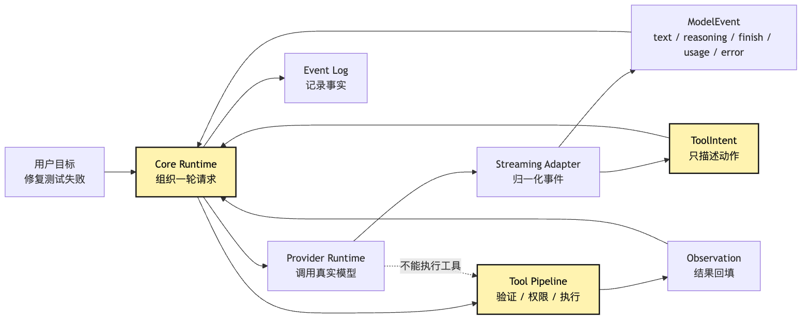
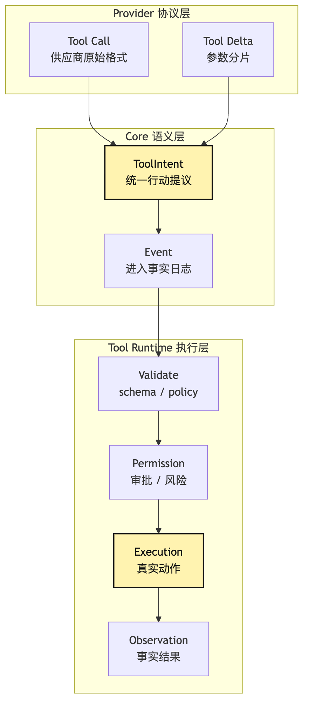
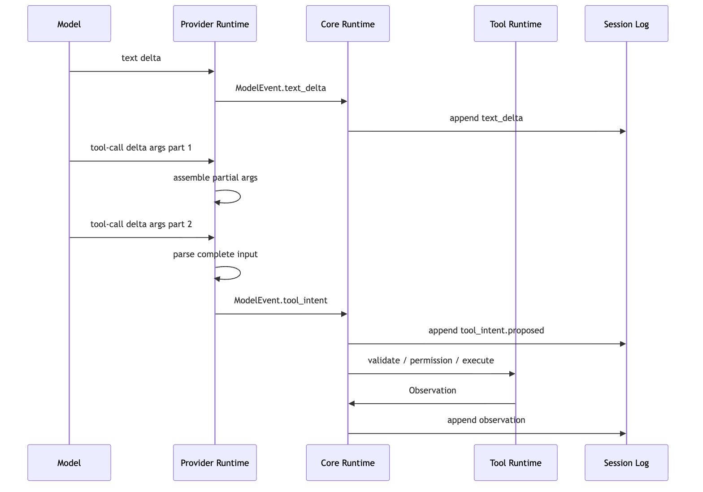
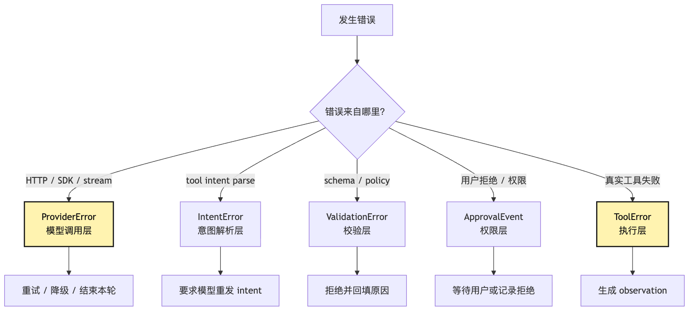
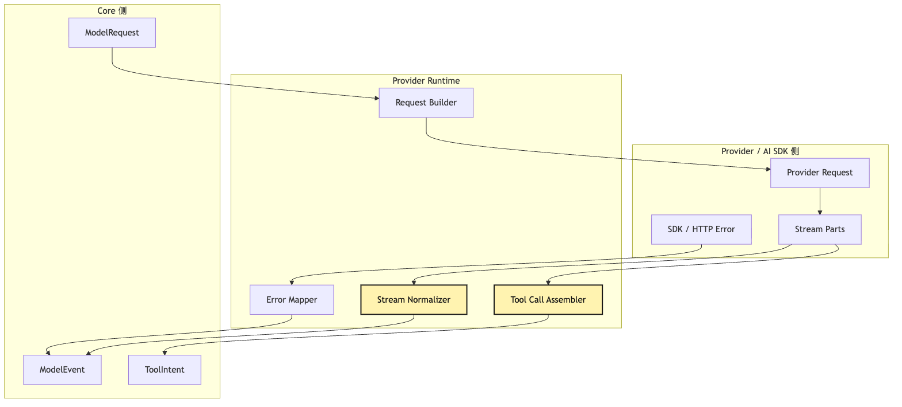

# Provider Runtime: why can a provider only return tool intent?

In the previous group of articles, we pinned down a low-level discipline:

```text
The model proposes; the system executes.
```

Article 7 covered the first provider integration.

Article 9 covered the M0 Core Kernel.

Article 10 focused on the `Intent / Execution` split.

Article 11 then narrowed the entry point for external capabilities into the system down to the Plugin Host.

Now take one step forward, and the problem becomes much more real:

```text
We are no longer calling just one provider.
We need real models, real streaming, real function calling, and real incremental tool arguments.
```

At this point, many people will naturally write an implementation that feels very convenient.

For example, suppose we connect an AI SDK inside a small CLI Agent.

The user enters:

```text
Help me figure out why this project's tests are failing and fix it.
```

The model returns a tool call in the stream:

```json
{
  "toolName": "bash",
  "input": {
    "command": "npm test"
  }
}
```

The SDK appears to have wrapped tool calling for us.

Some SDKs even let us write an `execute` function directly inside the tool definition.

So the code becomes extremely tempting:

```ts
const result = await streamText({
  model,
  messages,
  tools: {
    bash: tool({
      description: "Run a shell command",
      inputSchema: z.object({
        command: z.string(),
      }),
      execute: async ({ command }) => runShell(command),
    }),
  },
});
```

This code feels great when it runs.

The model proposes `bash`.

The SDK calls `execute`.

The command runs.

The result goes back to the model.

The terminal starts to show an Agent that can "fix tests."

But this is also the trap that Article 12 needs to pull apart.

**Once provider runtime is responsible for executing tools, it is no longer provider runtime. Half an Agent has grown inside the system.**

It bypasses core.

It bypasses state.

It bypasses permission.

It bypasses audit.

It bypasses retry.

It bypasses replay.

In the end, the whole Harness turns into two loops:

```text
One loop lives in core.
Another loop secretly lives inside provider runtime.
```

The core question of this article is:

> After a provider is connected to a real model, why can it only normalize streaming, errors, and tool-call deltas into model events and tool intent, rather than executing tools itself?

"Can only return tool intent" does not mean Provider Runtime can return only one kind of event.

Of course it will also return text, reasoning deltas, finish events, usage, and provider errors.

The real point is this:

```text
Provider Runtime may return model events.
But tool-related output must stop at ToolIntent.
It must not cross Core and become ToolExecution directly.
```

Here is the conclusion first:

```text
Provider Runtime is the model protocol adapter layer.
Tool Runtime is the execution layer.
Core Kernel is the source of truth for state, permissions, events, and replay.
```

This is not abstraction for abstraction's sake.

It is what lets a small CLI Agent still know, once it starts truly fixing tests, who proposed each step, who approved it, who executed it, who recorded it, and who can replay it.

## Problem Chain

The problem chain in this article is:

```text
A real provider returns text, reasoning, tool-call deltas, finish, usage, and errors
-> AI SDK / provider SDK often provides a convenient tool execution entry point
-> If provider runtime executes tools directly, it becomes a hidden Agent loop
-> The hidden loop bypasses core state, permission, audit, retry, and replay
-> Therefore provider runtime must only normalize protocols
-> Model output is translated into ModelEvent and ToolIntent
-> ToolIntent enters core's event log and tool pipeline
-> Tool Runtime then handles validate, permission, execute, observe
-> The provider can be replaced; execution semantics must not be replaced
```

As an overview diagram:



The most important thing in this diagram is not the number of modules.

It is this broken edge:

```text
Provider Runtime -X-> Tool Execution
```

provider runtime can see model output.

It also has to understand the tool-call format inside model output.

But it cannot turn a tool call directly into an external action.

It can only translate the tool call into an internal `ToolIntent`.

Real execution must return to core's tool pipeline.

The cost is writing one more adapter layer.

But the payoff is large:

```text
The model provider can change.
The AI SDK can change.
The streaming format can change.
Tool execution, permission audit, and state replay still do not change.
```

That is where Provider Runtime belongs.

## 1. Provider Is the Easiest Place to Grow "Half an Agent"

Start with a very common development path.

We already have a CLI Agent.

It can read user input.

It can call a model.

It has a minimal loop.

Now we want it to support tool calls.

So we pass tools to the model:

```ts
const tools = {
  readFile: {
    description: "Read a file from the workspace",
    inputSchema: z.object({
      path: z.string(),
    }),
  },
  bash: {
    description: "Run a shell command",
    inputSchema: z.object({
      command: z.string(),
    }),
  },
};
```

After seeing the tool definitions, the model returns tool calls when appropriate.

For a "fix the failing tests" task, the first round is very likely:

```json
{
  "toolName": "bash",
  "input": {
    "command": "npm test"
  }
}
```

So far, everything is normal.

The model has only proposed the next step.

The real fork happens on the next line of code.

Do we execute directly inside provider runtime:

```ts
if (part.type === "tool-call") {
  const result = await tools[part.toolName].execute(part.input);
  providerMessages.push(toToolResult(part, result));
}
```

Or do we hand it to core:

```ts
if (part.type === "tool-call") {
  emit({
    type: "tool_intent",
    intent: normalizeToolIntent(part),
  });
}
```

The difference between these two snippets looks small.

The first is more convenient.

The second is more verbose.

But they represent two completely different systems.

The first turns provider runtime into an executor.

The second keeps provider runtime as an adapter layer.

If we choose the first one, provider runtime will quickly keep expanding.

It needs to know the tool registry.

It needs to know which tools are read-only.

It needs to know the risk level of `bash`.

It needs to know whether the user allows automatic execution.

It needs to know command timeout.

It needs to truncate stdout.

It needs to translate tool results back into the provider's private message format.

It needs to handle tool failure.

It needs to decide whether to continue into the next model call.

At this point, it is no longer just provider runtime.

It has already written a hidden ReAct loop inside the provider adapter.

### The Danger of a Hidden Loop

The most troublesome part of a hidden loop is not "duplicated code."

It is that authority has moved.

The original system design is:

```text
Core Runtime decides how a task round advances.
Provider Runtime only communicates with the model.
Tool Runtime only performs controlled execution.
Event Log records what happened.
```

Once provider runtime executes tools by itself, the chain becomes:

```text
Provider Runtime receives a model event
-> directly executes a tool
-> directly inserts the result back into provider messages
-> continues calling the model
-> finally hands only the final answer to core
```

Core sees only that "the model call finished."

It cannot see what happened in the middle.

For example, if the user asks:

```text
Why did you just modify src/parser.ts?
```

core may not be able to answer.

The real execution happened inside provider runtime.

Or suppose provider runtime automatically ran `npm install` after a test failure.

core may only have recorded "provider request succeeded."

But it did not record:

```text
The model proposed npm install
Whether the system validated the command
Whether permission asked the user
What cwd execution used
Whether stdout was truncated
What the exit code was
How long it took
Whether the lockfile changed
```

For a demo, this is not fatal.

For a Harness, it is fatal.

Because the value of a Harness is precisely that it can answer:

```text
What happened?
Why was it allowed?
Where did it fail?
Can it recover?
Can it replay?
Can it be evaluated?
```

As soon as provider runtime bypasses core, these questions no longer have a unified source of truth.

## 2. Tool Call, Tool Intent, and Tool Execution Are Three Different Things

To hold the boundary, first separate three terms.

Many framework docs group all of them under tool calling.

But in a Harness, they are better modeled as three objects:

```text
Tool Call: the raw tool-call fragment returned by the provider or SDK.
Tool Intent: an action proposal that core can process internally.
Tool Execution: the external action actually performed by runtime.
```

They live at different layers.



The important part of this diagram is the translation between layers.

`Tool Call` is the provider's language.

It might look like this:

```json
{
  "id": "call_abc",
  "type": "function",
  "function": {
    "name": "read_file",
    "arguments": "{\"path\":\"package.json\"}"
  }
}
```

Or like this:

```json
{
  "type": "tool_use",
  "id": "toolu_123",
  "name": "read_file",
  "input": {
    "path": "package.json"
  }
}
```

Or, in streaming, it may first arrive as a small fragment:

```json
{
  "type": "tool-call-delta",
  "toolCallId": "call_abc",
  "toolName": "bash",
  "argsTextDelta": "{\"command\":\"npm"
}
```

Then another fragment:

```json
{
  "type": "tool-call-delta",
  "toolCallId": "call_abc",
  "argsTextDelta": " test\"}"
}
```

These are provider events.

They are not yet the system's internal action objects.

Provider Runtime's job is to narrow them into a stable `ToolIntent`:

```ts
type ToolIntent = {
  id: string;
  providerCallId?: string;
  toolName: string;
  input: unknown;
  rawInputText?: string;
  source: {
    provider: string;
    model: string;
    requestId?: string;
    streamIndex?: number;
  };
  status: "proposed";
};
```

This object has several key points.

First, it is called `Intent`, not `Execution`.

It only means the model proposed an action request.

Second, it preserves `providerCallId`, but does not turn the provider's raw format into core's primary data structure.

core can trace the source without depending on the source format.

Third, it can preserve `rawInputText`.

That matters for streaming.

Some providers send tool arguments as string deltas.

Before the JSON is closed, runtime must not rush to execute.

Fourth, it only enters the `proposed` state.

The later `validated`, `approved`, `executed`, and `observed` states should not be set by provider runtime.

### Names Matter

Many architecture bugs begin with vague names.

If we call the provider's return value `ToolInvocation`, we easily mislead ourselves:

```text
If it is an invocation, has it already been invoked?
```

If we call it `ToolCall`, it is also easy to mix it with provider-private formats.

`ToolIntent` deliberately keeps some distance:

```text
This is only the model's action intent.
```

For our small CLI Agent, that distance is very practical.

When the model proposes:

```json
{
  "toolName": "bash",
  "input": {
    "command": "rm -rf node_modules && npm install"
  }
}
```

The system should not execute just because the JSON is valid.

It should first record:

```text
The model proposed a high-risk bash intent.
```

Then hand it to the later validation, permission, and approval steps.

## 3. AI SDK Bridge: Borrow the Bridge, Do Not Hand It Control

This article title mentions both Provider Runtime and AI SDK Bridge.

Why talk about Bridge separately?

Because modern SDKs already do many useful things.

They usually provide:

```text
Unified provider integration
High-level APIs such as generateText / streamText
Streaming parts
Tool calls and tool-call deltas
Finish reason
Usage
Error parts
Telemetry
Even multi-step tool calling
```

These capabilities are very useful to us.

They remove a lot of duplicated provider adapter work.

But this boundary must stay clear:

```text
AI SDK can serve as a provider bridge.
It cannot become the Harness execution core.
```

In other words, we can use it for protocol normalization.

But we cannot hand tool execution authority to it.

AI SDK Bridge can be one implementation of Provider Runtime.

It is not a new Core.

It is not a new Tool Runtime.

And it is not a new Harness control plane.

### Two Integration Styles

The first style is "SDK-managed tool execution."

The pseudocode looks like this:

```ts
await streamText({
  model,
  messages,
  tools: {
    readFile: tool({
      inputSchema: readFileSchema,
      execute: async (input) => fileSystem.read(input.path),
    }),
    bash: tool({
      inputSchema: bashSchema,
      execute: async (input) => shell.run(input.command),
    }),
  },
  stopWhen: isStepCount(5),
});
```

This is convenient for ordinary applications.

For example, in a weather chatbot, the model calls `getWeather`, the SDK executes the function, and the weather is returned.

But for the Harness in this tutorial, this wiring is too broad.

Once `execute` is attached to the SDK tool, the tool execution lifecycle is wrapped by the SDK.

Of course we can manually add logging, permissions, and auditing inside `execute`.

But that pushes the Harness's core control point back into the provider bridge.

Eventually every provider bridge must duplicate tool runtime.

The second style is "SDK only outputs tool intent."

The pseudocode looks like this:

```ts
const result = streamText({
  model,
  messages,
  tools: describeToolsForModel(toolRegistry),
});

for await (const part of result.fullStream) {
  switch (part.type) {
    case "text":
      yield modelTextDelta(part);
      break;

    case "tool-call-delta":
      toolCallAssembler.push(part);
      break;

    case "tool-call":
      yield toolIntentEvent(normalizeToolCall(part));
      break;

    case "finish":
      yield modelFinish(part);
      break;

    case "error":
      yield providerError(part);
      break;
  }
}
```

Here the SDK still helps with provider abstraction.

But it does not execute tools.

It only makes it easier for us to obtain standardized stream parts.

Then our Provider Runtime further translates those parts into this tutorial's own `ModelEvent` and `ToolIntent`.

The SDK can provide stream parts.

But event ownership must return to Core.

That is the proper position of Bridge:

```text
Bridge is a translator, not an agent.
```

### Why Not Directly Trust the SDK's Multi-Step Tool Execution?

Not because the SDK is bad.

Quite the opposite: many SDK tool-execution designs are mature.

For application developers, handing tool functions to the SDK can quickly complete the loop from tool call to tool result.

The issue is that we are building a Harness.

The Harness's job is not "get an answer as quickly as possible."

Its job is to break long tasks into a controllable, observable, recoverable chain of facts.

For a task like "fix the failing tests," one tool execution is not an ordinary function call.

It may:

```text
Read sensitive files in the user's project
Execute a local shell
Modify the workspace
Install dependencies
Take a long time
Produce a lot of output
Trigger permission confirmation
Change later context
Affect tests and replay
```

These actions should not be hidden inside a provider SDK generation step.

They must pass through the Harness's shared execution pipeline.

That is how we can later add:

```text
permission policy
hook gate
sandbox
audit ledger
result budget
observation truncation
retry classifier
session replay
eval trace
```

These are not nice-to-haves.

They are the core of whether an Agent can be hosted.

## 4. Streaming Runtime: Events May Flow, Execution Must Not Race Ahead

The most complex part of provider runtime is usually not ordinary text.

Text is easy:

```text
The model emits token deltas
The CLI prints token deltas
The event log records text_delta
```

The real trouble is streaming tool calls.

Many providers or SDKs split a tool call into multiple streaming fragments.

For example, the model wants to run:

```bash
npm test -- --runInBand
```

The stream may not provide the full JSON in one piece.

It may look like this:

```text
tool-call-start: id=call_1 name=bash
tool-call-delta: {"command":"npm
tool-call-delta:  test
tool-call-delta:  -- --runInBand"}
tool-call-end
```

At this point, provider runtime must do three things.

First, store the deltas.

Second, wait until the arguments are complete.

Third, produce `ToolIntentProposed`.

It cannot execute when it sees the first delta.

The arguments are not complete.

It also cannot execute the moment the JSON happens to parse.

The model may still have more deltas.

It certainly cannot hand a half argument to the shell while streaming.

This sounds like common sense.

But many urges to "execute while streaming" arise exactly here.

We need to resist that urge.



The most important part of this sequence diagram is provider runtime's two acts of restraint in the middle.

It can cache partial args.

It can parse complete input.

But it only sends the result to core.

Execution must happen in Tool Runtime.

### Why Should Streaming Deltas Enter the Event Model?

There is a detail here.

Should every tool-call delta be written into the event log?

The answer depends on the system stage.

At M2, we may choose not to store every delta as a long-term fact.

But provider runtime at least needs to turn them into internal temporary state, and when a complete intent appears, record enough source information.

For example:

```ts
type ToolIntentProposedEvent = {
  type: "tool_intent.proposed";
  intent: ToolIntent;
  assembledFrom?: {
    eventCount: number;
    firstOffset: number;
    lastOffset: number;
    hadRepair?: boolean;
  };
};
```

Then, when debugging later, we can know:

```text
Whether this intent came from one complete tool-call event.
Or whether it was assembled from multiple deltas.
Whether JSON repair happened during assembly.
Whether the provider stream was interrupted.
```

That matters for failure attribution.

For example, the model returned half a JSON object, then the connection dropped.

That is not tool execution failure.

It is not permission denial either.

It is provider stream incomplete.

Without standard event classification, eval will only see "task failed."

But the real fix direction is completely different.

So whether `tool_intent.delta` enters the long-term event log can be decided in a later stage.

What matters more in M2 is:

```text
Complete intent must be traceable.
Delta assembly must not become a black box.
Half arguments must not trigger execution.
```

## 5. Error Mapping: Provider Error Is Not Tool Error

Another place provider runtime easily expands is error handling.

After connecting a real provider, we will see many errors:

```text
authentication failure
insufficient balance
rate limit
overloaded
timeout
context length exceeded
bad request
model unavailable
stream interrupted
tool call JSON malformed
unsupported tool schema
```

Some of these errors belong to the provider.

Some belong to request construction.

Some belong to model output.

Some belong to tool intent parsing.

But none of them are tool execution errors.

For example, `rate_limit`.

It means the model call was limited.

It does not mean the `bash` tool failed.

Or `tool_call_json_malformed`.

It means the model or provider returned unparsable tool arguments.

It does not mean `readFile` failed to execute.

If provider runtime executes tools by itself, these errors are easy to mix together:

```text
The model did not return complete tool arguments
-> tool execution failed
-> Agent keeps asking the model to fix it
```

The correct classification should be:

```text
provider stream incomplete
-> runtime decides whether to retry the model call, ask the model to re-emit the intent, or end the round
```

So Provider Runtime needs an error taxonomy.

For M2, a simplified design can start like this:

```ts
type ProviderErrorKind =
  | "auth"
  | "rate_limit"
  | "quota"
  | "timeout"
  | "overloaded"
  | "bad_request"
  | "context_length"
  | "stream_interrupted"
  | "unsupported_feature"
  | "malformed_tool_call"
  | "unknown";
```

Then map it into a unified event:

```ts
type ProviderErrorEvent = {
  type: "provider.error";
  kind: ProviderErrorKind;
  retryable: boolean;
  provider: string;
  model: string;
  requestId?: string;
  message: string;
  raw?: unknown;
};
```

The key is not how complete the enum is.

The key is that error ownership must stay correct.



The most important part of this diagram is the branch on the left.

Many things are called "failures," but failures at different layers require completely different system actions.

provider error may require retry or fallback.

intent parse error may require asking the model to re-emit the tool intent.

tool error should return to the model as an observation.

permission deny should be recorded as a governance event.

validation error should prevent execution.

If all of these are folded into one catch block inside provider runtime, there is no reliable Harness later.

Error classification is not for aesthetics.

It gives later decisions clear grounds:

```text
retry
fallback
compact
ask user
fail run
```

### Fallback Must Not Secretly Execute Tools Either

M2 Provider Runtime will also encounter fallback.

For example, the primary provider is rate limited, so we switch to a backup provider.

Or the current model does not support a certain tool schema, so we downgrade to another model.

This also invites a bad design:

```text
Since fallback is near provider runtime,
let's close the tool execution loop here too.
```

No.

fallback only affects the model call path.

It does not affect tool execution ownership.

Whether the model comes from provider A or provider B, the output should be the same kind of `ModelEvent` and `ToolIntent`.

Then it goes through the same tool pipeline.

More precisely:

```text
Provider Runtime ensures outputs from different providers flow into unified events.
Provider Resolver / Runtime Policy decides which provider to choose for this round.
Tool Runtime still independently owns execution.
```

That is how a later product CLI can choose models by profile, capability, cost, latency, and fallback policy without letting provider-private formats leak into Core.

This is also the value of provider runtime:

```text
Keep provider differences outside.
Do not bring provider differences into the execution system.
```

## 6. Core Needs to See the Whole Load-Bearing Chain

Now stitch the whole chain together.

Our CLI Agent receives the user's request:

```text
Help me figure out why this project's tests are failing and fix it.
```

After M2, one run should look like this:

```text
CLI receives the user goal
-> Core Runtime creates a run
-> Context Projection assembles this round's model input
-> Provider Runtime calls the real model
-> Provider Runtime normalizes streaming events
-> The model proposes ToolIntent: bash npm test
-> Core records tool_intent.proposed
-> Tool Runtime validates the command
-> Permission Runtime decides whether it is allowed
-> Bash Executor runs in a controlled cwd
-> Observation records exit code, stdout, stderr, truncation
-> Core projects Observation into the next round's messages
-> Provider Runtime calls the model again
```

The chain is a little long.

But it is long for a reason.

Each segment answers an audit question.

```text
Who proposed it? The model.
Who translated it? Provider Runtime.
Who recorded it? Core Event Log.
Who approved it? Permission Runtime.
Who executed it? Tool Runtime.
Who observed it? Observation Builder.
Who fed it back? Core Context Projection.
```

As a diagram:


The most important part of this diagram is where the loop closes.

The loop closes in Core.

Not in the provider.

The model call is only one step in the loop.

Tool execution is also only one step in the loop.

State projection, event logging, permissions, and observations connect them.

If provider runtime loops over model calls and tools by itself, Core becomes only a shell.

That is not a Harness.

That is only a provider agent wearing the name core.

### Why Must Core Record Intent First?

Someone may ask:

```text
Why not wait until the tool finishes and record one tool_result?
Is that intermediate tool_intent.proposed really necessary?
```

Yes, it is necessary.

Intent is evidence of model behavior.

execution is evidence of system behavior.

observation is evidence returned by the external world.

The three cannot be merged.

For example, the model proposes:

```text
Run npm test
```

The system actually executes:

```text
pnpm test
```

This may be reasonable.

The project package manager may be pnpm, and runtime normalized the command.

But that must be visible.

Or the model proposes:

```text
git reset --hard
```

The system refuses.

That is not tool failure.

It is permission denial.

If we only record the final result:

```text
Not executed.
```

Then we have lost the evidence that the model once proposed a dangerous action.

Later trace analysis, policy tuning, and eval datasets all depend on these intermediate facts.

## 7. The Minimal Provider Runtime Interface

At this point, we can bring the boundary down to code.

M2 does not need a huge provider framework.

It only needs to narrow Provider Runtime's responsibilities into a few interfaces.

First define the input:

```ts
type ModelRequest = {
  runId: string;
  turnId: string;
  model: string;
  messages: ModelMessage[];
  tools: ModelToolDescription[];
  options: {
    temperature?: number;
    maxOutputTokens?: number;
    abortSignal?: AbortSignal;
  };
};
```

Here, `tools` is only the model-visible tool description.

It does not include execution functions.

It should look like this:

```ts
type ModelToolDescription = {
  name: string;
  description: string;
  inputSchema: JsonSchema;
};
```

Not this:

```ts
type WrongModelToolDescription = {
  name: string;
  description: string;
  inputSchema: JsonSchema;
  execute: (input: unknown) => Promise<unknown>;
};
```

This boundary is small, but it is critical.

The tool description passed to the provider only tells the model "which actions it may propose."

It does not hand "how the action executes" to the provider.

Then define the output:

```ts
type ModelEvent =
  | ModelStarted
  | ModelTextDelta
  | ModelReasoningDelta
  | ToolIntentDelta
  | ToolIntentProposed
  | ModelFinished
  | ProviderError;
```

`ToolIntentProposed` is the core:

```ts
type ToolIntentProposed = {
  type: "tool_intent.proposed";
  id: string;
  turnId: string;
  intent: {
    toolName: string;
    input: unknown;
    providerCallId?: string;
  };
  provider: {
    name: string;
    model: string;
    requestId?: string;
  };
};
```

Provider Runtime's main interface can look like this:

```ts
interface ProviderRuntime {
  stream(request: ModelRequest): AsyncIterable<ModelEvent>;
}
```

Notice what this interface does not have:

```text
executeTool()
runLoop()
continueUntilDone()
approveTool()
appendToolResult()
```

Not because these are unimportant.

They belong to other layers.

provider runtime should not know whether the user allows `bash`.

It should not know how tool results are truncated.

It should not decide whether the task is finished.

It only needs to honestly translate model events.

### How Does a Tool Result Return to the Provider?

This raises a practical question.

If provider runtime does not execute tools, how does the tool result eventually get back to the model?

The answer is:

```text
Core projects Observation into the next round's ModelMessage.
Provider Runtime only sends those messages.
```

In other words, provider runtime may translate internal `ModelMessage` into whatever message format the provider requires.

Some providers need:

```json
{
  "role": "tool",
  "tool_call_id": "call_abc",
  "content": "test failed..."
}
```

Other providers need a content block:

```json
{
  "type": "tool_result",
  "tool_use_id": "toolu_123",
  "content": "test failed..."
}
```

That translation is provider runtime's responsibility.

But note carefully: it translates an `Observation` that Core has already accepted.

It did not obtain the result by executing a tool itself.

So message projection can be layered like this:

```ts
const messages = contextProjection.buildModelMessages({
  sessionEvents,
  currentState,
  providerCapabilities,
});

for await (const event of providerRuntime.stream({
  messages,
  tools: describeToolsForModel(toolRegistry),
})) {
  await core.handleModelEvent(event);
}
```

The route for tool results to return to the model still exists.

Ownership simply returns to Core.

## 8. From Provider-Private Format to Internal Events

Now look specifically at the Provider Runtime adapter.

It usually contains four small components:

```text
Request Builder: translates internal ModelRequest into provider requests
Stream Normalizer: translates provider chunks into ModelEvent
Tool Call Assembler: assembles tool-call deltas
Error Mapper: translates SDK / HTTP errors into ProviderError
```

As a layered diagram:



The most important part of this diagram is Provider Runtime's middle position.

It needs to understand a little on both sides.

On the left, it understands Core's internal events.

On the right, it understands provider or AI SDK streaming fragments.

But it owns no external action.

### Request Builder

Request Builder translates the system's internal request into a provider request.

It handles:

```text
message format
system / developer / user / assistant / tool message projection
tool schema expression
model options
provider-specific headers or options
capability flags
```

But it should not decide:

```text
Whether bash can be used in this round
Which files can be read
Whether a tool result is trustworthy
How much history should go into context
```

Those should be decided by Core, Context Policy, and Tool Visibility before entering Provider Runtime.

Request Builder only translates already-decided input into a format a provider can understand.

### Stream Normalizer

Stream Normalizer translates the provider stream into internal events.

For example:

```text
text delta -> model.text_delta
reasoning delta -> model.reasoning_delta
finish reason -> model.finished
usage -> model.usage
tool-call delta -> tool_intent.delta or assembler input
tool-call complete -> tool_intent.proposed
error part -> provider.error
```

This component is easy to write as one large switch.

That is acceptable early on.

But its output must be stable internal events.

Do not leak raw provider chunks all the way into Core.

You can save raw chunks as debug attachments.

But Core's business decisions should rely only on internal events.

There is also a boundary that the author needs to confirm later:

```text
If the provider returns a reasoning summary, it can be treated as a displayable event.
But do not treat non-displayable model internal reasoning as Core's source of truth.
```

### Tool Call Assembler

Tool Call Assembler is the part of Provider Runtime that most resembles "state."

It needs to collect deltas by provider call id.

For example:

```ts
class ToolCallAssembler {
  private calls = new Map<string, PartialToolCall>();

  push(delta: ProviderToolCallDelta): ToolIntentDelta | ToolIntentProposed {
    const current = this.merge(delta);

    if (!current.isComplete) {
      return {
        type: "tool_intent.delta",
        providerCallId: current.id,
        toolName: current.toolName,
        rawInputText: current.rawArgs,
      };
    }

    return {
      type: "tool_intent.proposed",
      id: createIntentId(),
      intent: {
        toolName: current.toolName,
        input: parseJson(current.rawArgs),
        providerCallId: current.id,
      },
      provider: current.provider,
    };
  }
}
```

This state is temporary parsing state.

It is not session state.

It is not conversation state.

It is not tool execution state.

So it may live inside Provider Runtime.

But it serves only one purpose:

```text
Assemble provider deltas into complete intent.
```

### Error Mapper

Error Mapper normalizes errors from different providers.

For example:

```text
HTTP 401 -> auth / retryable false
HTTP 429 -> rate_limit / retryable true
HTTP 529 -> overloaded / retryable true
context window exceeded -> context_length / retryable false until compacted
SDK abort -> aborted / retryable depends on caller
malformed tool args -> malformed_tool_call / retryable maybe
```

This lets Core make unified decisions:

```text
retry
fallback
compact context
ask user for config
end run
record failure
```

If provider runtime simply throws these errors outward, Core is forced to recognize every SDK's exception types.

That brings us back to the provider pollution discussed in Article 7.

During implementation, `malformed_tool_call` can be split further:

```text
provider_stream_incomplete
intent_parse_failed
malformed_tool_call
```

All of them differ from tool execution failure.

## 9. Why Provider Must Not Own State

It is not enough for Provider Runtime to avoid executing tools.

It also must not own long-term state.

State here means:

```text
session event log
conversation state
tool result history
permission decisions
budget usage
retry history
context compaction decision
```

All of these belong to Core or a higher-level Runtime.

Provider Runtime may own some temporary state:

```text
tool-call delta buffer for the current stream
provider request id for the current request
usage accumulator for the current response
```

But that state should end when one provider request ends.

Do not turn it into:

```ts
class ProviderRuntime {
  private messages: Message[] = [];
  private toolResults: ToolResult[] = [];
  private permissions: PermissionDecision[] = [];
  private turnCount = 0;
}
```

That is another Agent growing inside the provider.

The correct shape is closer to:

```ts
class AiSdkProviderRuntime implements ProviderRuntime {
  async *stream(request: ModelRequest): AsyncIterable<ModelEvent> {
    const providerRequest = this.buildRequest(request);
    const stream = this.aiSdk.stream(providerRequest);

    for await (const part of stream) {
      yield* this.normalize(part);
    }
  }
}
```

Provider Runtime is stateless, or at least request-scoped.

It should not know "this is already the third round of fixing tests."

It only knows "what the input and output of this model request are."

### Why Session State Cannot Live in Provider

Because session state is cross-provider.

Today we use provider A.

In the next round, rate limiting falls back to provider B.

If session state lives inside the provider A adapter, switching becomes hard.

More realistically:

```text
Round 1 uses model A to read the failure log
Round 2 uses model B to decide the fix direction
Round 3 uses model A to generate the patch
```

No matter how providers change, the session should remain continuous.

The only source of continuity can be Core's event log and state reducer.

It cannot be provider runtime's internal messages array.

## 10. Replay: Why Old Intent Must Not Execute Again

There is another important reason Provider Runtime may only return intent: replay.

Long-task systems inevitably need replay.

Not for show.

Because we need to debug:

```text
Why did this test-fix run fail?
Did the model choose the wrong tool?
Was permission too strict?
Did the provider interrupt?
Was tool output truncated too aggressively?
Did context miss a key fact?
```

If provider runtime executes tools by itself, replay becomes awkward.

We have a session like:

```text
provider call
internally executed bash
internally executed readFile
internally executed edit
finally returned answer
```

But the event log does not contain each intent, permission, execution, and observation.

We cannot reconstruct the scene.

More dangerously, some replay paths might trigger tools again.

For example, an old session contains:

```text
Model proposed: delete temporary files
provider runtime executed: rm -rf tmp/cache
```

If replay simply reruns the provider loop, it may delete again.

That is clearly unacceptable.

The correct replay semantics should be:

```text
Replay events; do not rerun the external world.
```

Old `ToolIntent` can be replayed.

Old `PermissionDecision` can be replayed.

Old `ToolExecutionStarted` can be replayed.

Old `Observation` can be replayed.

But replay should not execute a tool again just because it sees an old intent.

This requires intent, execution, and observation to be separate events from the beginning.

provider runtime only returning intent is exactly what makes this event chain separable, auditable, and replayable.

## 11. A Complete Test-Fixing Round

Now walk through the running example.

The user enters in the CLI:

```text
Help me figure out why this project's tests are failing and fix it.
```

Core creates a run:

```json
{
  "type": "run.started",
  "runId": "run_001",
  "goal": "Fix the failing tests"
}
```

Context Projection constructs the model input.

Provider Runtime calls the model.

The model first outputs a short text:

```text
I will run the tests first to see the current failure.
```

Provider Runtime emits:

```json
{
  "type": "model.text_delta",
  "text": "I will run the tests first to see the current failure."
}
```

Then the model proposes a tool call.

The provider's raw stream may be:

```json
{
  "type": "tool-call",
  "id": "call_1",
  "toolName": "bash",
  "input": {
    "command": "npm test"
  }
}
```

Provider Runtime does not execute.

It only emits:

```json
{
  "type": "tool_intent.proposed",
  "intent": {
    "toolName": "bash",
    "input": {
      "command": "npm test"
    },
    "providerCallId": "call_1"
  }
}
```

Core writes it to the event log.

Tool Runtime performs schema validation.

Permission Runtime decides:

```text
npm test is a read/execution command.
The working directory is inside the project.
It does not modify files.
It can be auto-allowed.
```

Then Bash Executor runs it.

Observation Builder collects:

```json
{
  "exitCode": 1,
  "stdout": "...",
  "stderr": "Expected 4, received 5",
  "truncated": false
}
```

Core writes:

```json
{
  "type": "tool.observed",
  "toolName": "bash",
  "exitCode": 1
}
```

In the next round's model input, Provider Runtime will see an already-projected tool result message.

It only translates that message into the provider format.

It does not care how the result was produced.

The model then proposes:

```text
Read tests/sum.test.ts and src/sum.ts.
```

Provider Runtime continues producing two `ToolIntent` objects.

Core decides whether parallel reads are allowed.

Tool Runtime executes the two reads.

Observation enters the log.

The model proposes an edit intent based on file contents.

At that point, Permission Runtime may require user confirmation.

None of this needs provider runtime to know anything.

It carries one responsibility:

```text
Faithfully translate model output into system events.
```

## 12. Common Bad Smells

When writing Provider Runtime, stop when any of these bad smells appear.

### Bad Smell 1: `execute` Appears in the Provider Adapter

If the provider adapter starts to contain:

```ts
await tool.execute(input)
```

the boundary is probably broken.

Unless this `execute` only performs an internal provider SDK network request, do not call tools inside provider runtime.

Tool execution belongs in Tool Runtime.

### Bad Smell 2: The Provider Adapter Holds `messages`

If provider runtime has its own long-lived `messages` array and pushes tool results into it after each tool call, be careful.

This means session state is being absorbed by the provider.

Provider Runtime may accept `messages` as input.

It must not become the source of truth for messages.

### Bad Smell 3: The Provider Adapter Decides Whether to Continue the Loop

If provider runtime contains:

```ts
while (step < maxSteps) {
  callModel();
  executeTools();
}
```

then it is no longer provider runtime.

It is Agent Runtime.

Loop control belongs in Core.

provider runtime handles one model request, or one stream explicitly started by Core.

### Bad Smell 4: Storing Provider Raw Chunks as Core Events

Keeping raw chunks for debugging is fine.

But if the main events in the event log are provider raw objects, later work becomes painful.

When the provider changes, old sessions and new sessions have different event shapes.

eval and replay become tied to vendor formats.

### Bad Smell 5: Tool Result Truncation Happens in Provider Runtime

Tool result truncation may look like "adapting to model input."

But it actually belongs to Observation Policy and Context Projection.

provider runtime can do the final format conversion based on provider capabilities.

But "how much stdout to keep," "how to summarize error logs," and "whether a second read is needed" should not be decided by the provider adapter.

### Bad Smell 6: Fallback Loses Evidence of Provider Selection

If fallback happens, the system should be able to explain:

```text
Why did it switch from provider A to provider B?
Was it because of rate limit?
Was it because of context length?
Was it because a required capability was missing?
Which model was used after fallback?
Did this switch enter the trace?
```

If all of this is hidden inside the provider adapter, later trace and eval cannot see model path changes.

fallback can change the model call path.

But it should not change event semantics.

### Bad Smell 7: Provider Capability Directly Pollutes Profile / CLI

provider capability is useful.

For example, whether a model supports tool calls, JSON schema, reasoning summaries, vision input, or parallel tool calls.

But these capabilities should first be normalized by Provider Runtime into internal capability.

profile, CLI, and resolver should not directly depend on a provider's private fields.

## 13. What Minimal Tests Should Cover

Tests for this M2 layer should not only check that "the model can answer."

They need to test the boundary.

First category: provider tool call is normalized into intent.

```ts
it("normalizes provider tool calls into tool intent events", async () => {
  const provider = fakeProvider([
    providerToolCall({
      id: "call_1",
      name: "bash",
      input: { command: "npm test" },
    }),
  ]);

  const events = await collect(providerRuntime.stream(request));

  expect(events).toContainEqual({
    type: "tool_intent.proposed",
    intent: {
      toolName: "bash",
      input: { command: "npm test" },
      providerCallId: "call_1",
    },
  });
});
```

Second category: provider runtime does not execute tools.

```ts
it("does not execute tools inside provider runtime", async () => {
  const toolExecutor = vi.fn();

  await collect(providerRuntime.stream({
    ...request,
    tools: describeToolsForModel(registry),
  }));

  expect(toolExecutor).not.toHaveBeenCalled();
});
```

This kind of test is important.

It is not testing a feature.

It is testing architectural discipline.

Third category: tool-call deltas must wait until complete before a proposed intent is produced.

```ts
it("assembles streamed tool call deltas before proposing intent", async () => {
  const events = await collect(providerRuntime.stream(deltaRequest));

  expect(events.map((event) => event.type)).toEqual([
    "model.started",
    "tool_intent.delta",
    "tool_intent.delta",
    "tool_intent.proposed",
    "model.finished",
  ]);
});
```

Fourth category: provider error and tool error must not be mixed.

```ts
it("maps provider errors without creating tool observations", async () => {
  const events = await collect(providerRuntime.stream(rateLimitedRequest));

  expect(events).toContainEqual(
    expect.objectContaining({
      type: "provider.error",
      kind: "rate_limit",
      retryable: true,
    })
  );

  expect(events.some((event) => event.type === "tool.observed")).toBe(false);
});
```

Fifth category: provider runtime does not hold session state.

```ts
it("keeps provider runtime request-scoped", async () => {
  const first = await collect(providerRuntime.stream(firstRequest));
  const second = await collect(providerRuntime.stream(secondRequest));

  expect(first).not.toDependOn(second);
  expect(providerRuntime).not.toExposeSessionMessages();
});
```

Sixth category: tool result is projected by Core before being handed to provider.

```ts
it("sends projected observations as model messages without executing tools", async () => {
  const messages = contextProjection.buildModelMessages({
    sessionEvents: [
      toolObservedEvent({
        providerCallId: "call_1",
        content: "npm test failed with exit code 1",
      }),
    ],
  });

  const providerRequest = requestBuilder.build({
    ...request,
    messages,
  });

  expect(providerRequest).toContainProviderToolResultMessage();
  expect(toolExecutor).not.toHaveBeenCalled();
});
```

These tests force the code to stay clear-headed.

As soon as someone tries to push tool execution into provider runtime, the tests become awkward.

That is exactly the value of good tests.

## 14. What This Article Actually Delivers

This article does not deliver a full Tool Runtime.

It does not deliver a full Permission Runtime either.

It delivers the boundary of M2 Provider Runtime:

```text
Provider Runtime may:
- call real models
- adapt AI SDK or provider SDK
- send model-visible tool schema
- normalize text / reasoning / finish / usage
- assemble tool-call deltas
- produce ToolIntent
- map provider errors
- keep fallback output flowing into unified ModelEvent

Provider Runtime must not:
- execute tools
- hold session state
- decide whether the loop continues
- perform permission approval
- truncate tool results
- write final observations
- treat provider raw objects as core events
- let provider-private formats leak into Core
```

The problem it solves is:

```text
Real providers can be connected to the system.
But providers cannot take over the system.
```

The new complexity it introduces is:

```text
We need standard ModelEvent, ToolIntent, ProviderError, and stream assembler.
```

It naturally leads to the next article:

```text
If provider only returns tool intent,
how does Tool Runtime turn intent into observation?
```

The next article enters the hard part of Chapter 3:

```text
Tool Runtime: from tool intent to observation.
```

At that point, we will truly expand `validate -> permission -> execute -> observe`.

The memory hook for this article is simple:

**provider is the model's translator, not the tool's executor.**

## Image Plan

The image prompts for this article have been placed in the adjacent assets workspace for later image generation and multilingual localization workflows.

```text
docs/en/assets/00-12-provider-runtime-tool-intent/image-prompts.json
```

This stage only writes prompts and does not generate images.

---

GitHub source: [00-12-provider-runtime-tool-intent.md](https://github.com/LienJack/build-harness/blob/main/docs/en/00-12-provider-runtime-tool-intent.md)
