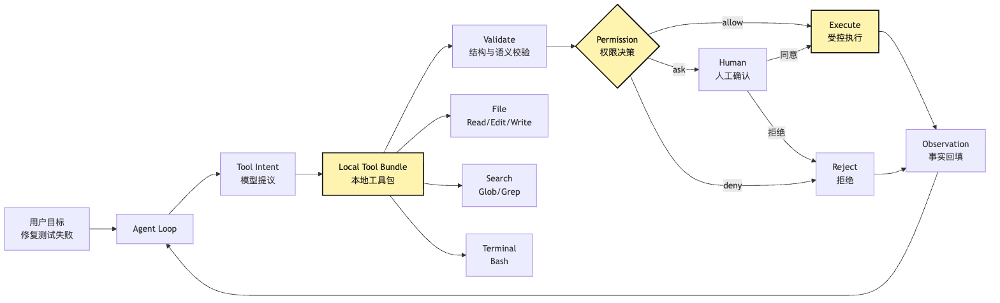
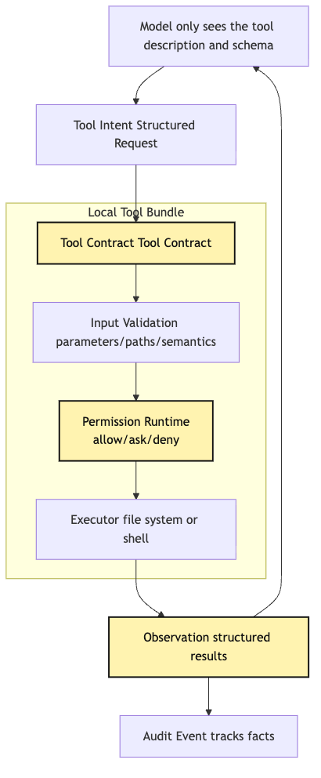
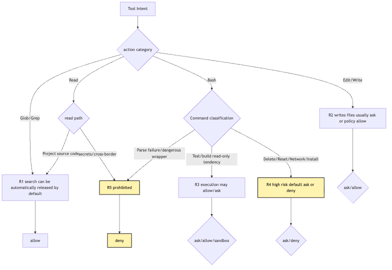
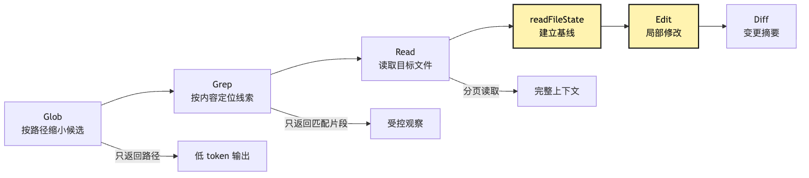
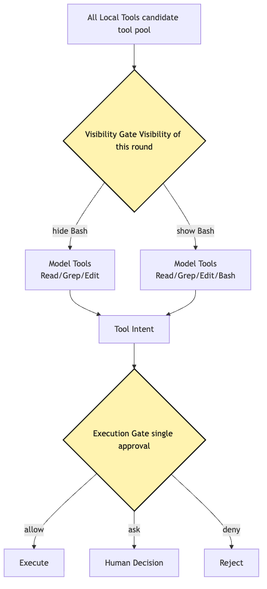

# Local Tool Bundle: files, search, terminal, and permission runtime

At this point, many people are tempted to model an Agent's local capabilities as a very intuitive set of functions.

```text
read(path)
write(path, content)
edit(path, old, new)
search(pattern)
bash(command)
```

This looks completely reasonable.

Our small CLI Agent needs to fix failing tests.

Of course it needs to read files.

Of course it needs to search code.

Of course it needs to edit files.

Of course it needs to run tests.

Without these capabilities, it is only a talking code advisor.

Once it has them, it starts to look like a development assistant that can actually work.

But this is also where the danger appears.

Files, search, and terminal are the first capabilities a local Agent needs.

They are also the easiest entry points for damaging real files, leaking private information, running commands by mistake, and polluting context.

An unbounded `read` may bring `.env`, SSH keys, or private configuration into model context.

A `write` without a baseline may overwrite a file the user just edited manually.

An overly broad `search` may stuff every log, build artifact, and dependency directory into context.

A naked `bash` may slide from `npm test` to `curl | bash`, then to `git reset --hard`.

So the core question of this article is not:

> Which local tools does an Agent need?

It is:

> Why is Local Tool Bundle not a set of convenience functions, but a set of controlled capabilities with risk levels, workspace boundaries, permission policy, output budgets, and audit events?

We continue using the same example as the rest of the series.

The user says to the CLI Agent at the project root:

```text
Help me figure out why this project's tests are failing and fix it.
```

If the Agent really finishes this task, it will probably walk through an action chain like this:

```text
Search for files related to the test failure
-> read package.json, test files, and source code
-> run tests to get the failure log
-> edit a source file
-> run tests again
-> inspect git diff and git status
-> summarize the change for the user
```

This chain looks like ordinary development.

But inside an Agent Harness, it cannot remain ordinary development.

It must become a governable runtime pipeline.

Every step may expose the model to a real project.

Every step may also change the real project.

## Problem Chain

First, let us pin down the problem sequence for this chapter:

```text
A local Agent first needs read / write / edit / search / bash
-> these tools are also entry points for file damage and information leakage
-> they cannot be implemented as naked functions
-> every tool must declare action semantics, risk level, workspace boundary, and output budget
-> the model only submits structured intent
-> Tool Runtime handles schema, semantics, paths, permissions, budgets, and audit
-> different tools follow different risk policies: read, search, write, and execute cannot be mixed together
-> observation returned to the model must be a factual summary, not infinite logs
-> Local Tool Bundle can then become the Harness's controlled hands
```

As an overview, this article discusses the local capability layer inside the tool execution pipeline from Article 10:



The easiest thing to underestimate here is the middle `Local Tool Bundle`.

It is not a tool list.

It is the protocol layer through which local capabilities enter the Agent loop.

The protocol layer must know:

```text
What does this action read?
What does this action write?
Will it start a child process?
Could it touch the network?
Is it inside the current working directory?
How large is its output?
Can it run concurrently?
How does failure become observation?
Does it require human confirmation?
Which audit events should be written before and after execution?
```

If these questions are not answered at the tool layer, later Permission, Audit, Replay, and Evaluation become empty words.

## 1. Why Local Tools Cannot Be Naked Functions

Start with the easiest version to write:

```ts
const tools = {
  read: async ({ path }) => fs.readFile(path, "utf8"),
  write: async ({ path, content }) => fs.writeFile(path, content),
  search: async ({ query }) => exec(`rg ${query}`),
  bash: async ({ command }) => exec(command),
}
```

The advantages are obvious.

Small.

Fast.

It runs.

For a demo, it is enough to let the model read files, search code, and run tests.

But as soon as the task moves into a real repository, its problems appear quickly.

### 1. Naked Functions Have No Action Semantics

Does `write(path, content)` create a new file, or overwrite an existing one?

Does `bash(command)` run tests, or delete a directory?

Does `search(query)` search project source, or the whole home directory?

These are not implementation details.

They determine whether a tool can be auto-allowed.

They determine whether it can run concurrently.

They determine whether a diff should be shown.

They determine what audit logs should record.

Naked functions tell the system only "how to do it."

They do not tell the system "what action this is."

An Agent Harness does not need a pile of functions; it needs semantic action objects.

### 2. Naked Functions Have No Working Directory Boundary

The user asked the Agent to fix failing tests in the current project.

That means its default world should be the current workspace.

But if `read` accepts arbitrary paths, the model may read:

```text
/Users/me/.ssh/id_rsa
/Users/me/.env
/Users/me/Library/Application Support/...
/private/tmp/...
```

Sometimes this is not model malice.

It may have simply seen an absolute path in an error log and tried to read it.

For the system, the result is just as dangerous.

So Local Tool Bundle must have boundary concepts such as `cwd`, `workspaceRoots`, `allowedRoots`, and `deniedPaths`.

Path is not a string.

Path is a permission object.

### 3. Naked Functions Have No Output Budget

The model asks:

```text
Read package-lock.json
```

If the tool returns the full content, hundreds of thousands of lockfile lines enter context.

The model asks:

```text
Search error
```

If the tool returns every match, logs, build artifacts, and dependency directories drown the real clue.

The model runs:

```text
npm test
```

If the output is too long, the failure point may be truncated in the wrong place.

Tool output is not better just because it is complete.

It must be budgeted, and it must tell the model:

```text
Are you seeing the full output, or a preview?
How many total lines are there?
Was anything truncated?
How should you continue reading?
```

Otherwise the model treats incomplete observations as complete facts.

Silent truncation is deadly in Agent systems.

### 4. Naked Functions Have No Audit Events

If the user asks:

```text
Which files did you just change?
```

Naked functions can only rely on model memory.

If the user asks:

```text
Why did you run this command?
```

Naked functions have no record of the model's raw intent, permission decision, actual command, exit code, or output summary.

If we want session replay tomorrow, naked functions also do not know which actions can be replayed and which actions can only replay their old observations.

That is why local tools must write events.

Not to make logs look nice.

But to make Agent actions explainable, recoverable, evaluable, and accountable.

## 2. What Local Tool Bundle Should Look Like

Local Tool Bundle contains at least three foundational capability groups:

```text
File tools: Read / Edit / Write
Search tools: Glob / Grep
Terminal tools: Bash
```

Some systems add:

```text
List / Tree
Patch
Delete
Move
Open
TaskOutput
```

`Patch` should not be understood as a shortcut that bypasses file tools.

It is better treated as the batch form of `Edit`: it is still a write tool, still based on already-observed file state, still needs to produce a diff, and still enters permission, audit, and replay.

For our small CLI Agent, it is enough to get `Read / Edit / Write / Glob / Grep / Bash` right first.

Quantity is not the key.

The key is that every tool must have a unified contract.

A local tool definition should answer at least:

```ts
type LocalToolDefinition = {
  name: string
  description: string
  inputSchema: JsonSchema
  outputSchema?: JsonSchema
  category: "file" | "search" | "terminal"
  risk: "read" | "search" | "write" | "execute"
  isReadOnly: boolean
  isConcurrencySafe: boolean
  requiresWorkspace: boolean
  validateInput(input: unknown, context: ToolContext): Promise<ValidationResult>
  checkPermission(input: unknown, context: ToolContext): Promise<PermissionDecision>
  call(input: unknown, context: ToolContext): Promise<ToolObservation>
}
```

This definition is much heavier than a naked function.

But every field becomes load-bearing later.

`name` and `description` are exposed to the model.

`inputSchema` narrows model output into structured intent.

`category` and `risk` enter permission and scheduling.

`isReadOnly` decides whether auto-allow and concurrency are possible.

`requiresWorkspace` decides whether execution must happen inside a project root.

`validateInput` performs path, argument, and semantic validation.

`checkPermission` performs policy decisions and human confirmation.

`call` is the only place that actually touches the filesystem or terminal.

In other words:

```text
The function is only the final step.
The tool definition is the full capability.
```

Local Tool Bundle is not there to give the model a universal shell.

It does the opposite: it extracts high-semantic actions from Bash so permissions, audit, and recovery have handles.

As a layered diagram:



In this diagram, the model does not touch the filesystem directly.

The model touches tool contracts.

Only `Executor` touches the filesystem.

Before `Executor`, there is schema, validation, permission, and budget.

That is Article 10's discipline landed on local tools:

```text
The model proposes.
The system executes.
Tool runtime owns all boundaries in between.
```

## 3. Risk Is Not a Switch; It Is Layered by Action Semantics

The most common mistake with local tools is making permission one global switch:

```text
allow tools
deny tools
```

This is too coarse.

Tools differ wildly in risk.

`Glob("**/*.ts")` and `Write("src/auth.ts")` are not the same level.

`Read("src/sum.ts")` and `Read(".env")` are not the same level either.

`Bash("npm test")` and `Bash("rm -rf dist")` are further apart.

Local Tool Bundle should at least split risk into layers:

```text
R0: pure metadata actions, such as inspecting the tool list or session state
R1: project-local read-only actions, such as Glob, Grep, and reading ordinary source
R2: project-local write actions, such as Edit and Write
R3: local execution actions, such as Bash running tests, builds, and scripts
R4: high-risk execution actions, such as delete, reset, install, network, privilege escalation, and config writes
R5: forbidden actions, such as reading secrets, out-of-bound paths, and dangerous shell wrappers
```

Real systems can be finer.

But at minimum, they need categories like read, search, write, execute, dangerous execute, and forbidden.

This is not to make permissions complicated.

It lets the Agent avoid interrupting the user at every step.

If every tool requires confirmation, the Agent becomes annoying.

If every tool is auto-allowed, the Agent becomes dangerous.

Risk classification makes common low-risk actions smooth, and makes high-risk actions stop clearly.



Two points are easy to confuse.

First, risk level is not determined by tool name alone.

`Read` is usually low risk, but reading `.env` is high risk.

`Bash` is usually high risk, but `git status` may be close to read-only.

`Grep` is usually low risk, but an out-of-bound search should still be denied.

Second, risk level is not the final decision.

Risk level is only input.

The final decision also combines:

```text
current permission mode
user rules
project rules
command-line arguments
workspace boundary
whether sandbox is enabled
whether automatic mode is active
whether there is a session-level temporary grant
```

So Permission Runtime should not be:

```ts
if (tool.risk === "write") ask()
```

It should be:

```text
static tool risk
-> runtime input risk
-> path and command semantics
-> current policy
-> user confirmation or denial
-> audit event
```

That is why Local Tool Bundle must be designed together with Permission Runtime.

Tools without permission run naked.

Permissions without tool semantics are blind.

## 4. File Tools: Read / Edit / Write Are Not cat / sed / echo

Start with file tools.

For an Agent fixing failing tests, file tools are the most basic hands.

It needs to read `package.json`.

It needs to read the failing test.

It needs to read source code.

It needs to modify one or two lines of logic.

It may need to create a new test file.

The easiest implementation is to let the model compose shell:

```bash
cat src/sum.ts
sed -i 's/old/new/g' src/sum.ts
cat <<'EOF' > src/sum.ts
...
EOF
```

But that bypasses the most important governance chain of file tools.

In an Agent Harness, file tools should be split into three semantics:

```text
Read: establish an observation baseline
Edit: perform local replacement based on a previously read baseline
Write: create a new file or fully rewrite a file
```

These names look ordinary.

But behind them are three completely different risk models.

### 1. The Key to Read Is Not Reading Content, but Establishing a Baseline

`Read` looks like `cat` on the surface.

But inside an Agent it must at least:

```text
normalize path
check workspace boundary
check read deny rules
identify file type
control file size and token limit
support offset / limit
return line-numbered content to the model
record readFileState
write audit event
```

The key is `readFileState`.

It records:

```text
which file was read
what content was read
mtime at read time
read range
whether the file was fully read
```

Why does this matter?

Because later `Edit` and `Write` must be based on a file version that has actually been observed.

If the model has not read `src/sum.ts`, but directly says:

```json
{
  "tool": "Edit",
  "input": {
    "file_path": "src/sum.ts",
    "old_string": "return a - b",
    "new_string": "return a + b"
  }
}
```

The system should not trust it.

It may be guessing.

It may remember incorrectly.

It may confuse another file's contents with this one.

A reliable file tool should require:

```text
Read first and establish a baseline.
Then Edit based on that baseline.
```

### 2. The Key to Edit Is Not Being Able to Modify, but Modifying Precisely

`Edit` should not accept "change line 42."

Line numbers are fragile.

The file may have been formatted.

The user may have just inserted a line.

A previous edit may have changed later line numbers.

A more stable shape is:

```json
{
  "file_path": "src/sum.ts",
  "old_string": "export function sum(a: number, b: number) {\n  return a - b\n}\n",
  "new_string": "export function sum(a: number, b: number) {\n  return a + b\n}\n"
}
```

That is, `old_string -> new_string`.

This forces the model to express:

```text
Exactly which current file content do I want to replace?
```

Before execution, the tool should check:

```text
whether the target file is inside the workspace
whether the file has been Read
whether the file changed after Read
whether old_string exists
whether old_string is unique
whether new_string is actually different
whether writing requires permission confirmation
```

If `old_string` appears multiple times, the default should be rejection.

Unless the model explicitly declares `replace_all`.

Otherwise, replacing the first match at random is random code modification.

### 3. The Key to Write Is Not Convenience, but High Risk

`Write` is easy to abuse.

The model reads a file, decides local modification is annoying, regenerates the whole file, and overwrites it.

This looks convenient.

But the risk is high:

```text
comments may be lost
whitespace style may be lost
import order may break
user edits made during the task may be overwritten
a huge diff may be created
```

So `Write` should be narrow:

```text
create a new file
fully rewrite only when it is clearer than local modification
the user explicitly asks for a complete generated file
```

If the target file already exists, it still must be `Read` first.

It still must check readFileState.

It still must generate a diff.

It still must enter write permission.

`Write` is not a fast path.

It is a high-risk file tool.

### 4. The Complete File Tool Chain

Inside the "fix failing tests" task, a healthy file-tool chain should look like:


Each step in this chain answers a concrete risk.

Path checks prevent boundary crossing.

Read budgets prevent context explosion.

readFileState prevents blind writes and dirty writes.

Unique string matching prevents accidental edits.

Diff summary lets both user and model know what actually changed.

Audit events allow later review.

If file tools only do `fs.readFile` and `fs.writeFile`, all of this disappears.

## 5. Search Tools: Glob / Grep Are Not "Faster Read"

Search tools look safer than file writes.

After all, they do not change files.

But search tools still cannot be opened without limits.

Search decides what the Agent "sees."

It shapes the next model round's judgment.

A bad search result can lead the model astray.

An oversized search result can drown context.

An out-of-bound search can bring content into the model that should never enter.

So the risks of search are not file destruction, but:

```text
leakage
noise
context pollution
uncontrolled search scope
```

### 1. Glob Answers "Which Files Might Matter?"

When fixing failing tests, the model often first asks:

```text
Which test files exist?
Which files are related to sum?
Is there vitest / jest configuration?
```

`Glob` is more suitable than `bash ls` or `find`.

Its semantics are narrow:

```json
{
  "pattern": "**/*sum*.ts"
}
```

The system clearly knows:

```text
This searches candidate files by filename and path pattern.
It does not read file content.
It should be constrained inside the workspace.
It should ignore node_modules, dist, .git, and coverage by default.
It should limit the number of returned results.
```

`Glob` observation should be a candidate list, not full content.

The candidate list also needs a budget.

If there are too many hits, it should prompt the model to narrow the pattern.

It should not dump thousands of paths back.

### 2. Grep Answers "Which Files Contain Clues?"

`Grep` reads file content, but it is not ordinary `Read`.

Its output should be matching fragments.

For example:

```json
{
  "pattern": "sum\\(",
  "path": "src"
}
```

Returns:

```text
src/sum.ts:12:export function sum(...)
tests/sum.test.ts:3:import { sum } from "../src/sum"
tests/sum.test.ts:8:expect(sum(1, 2)).toBe(3)
```

This is much safer than directly reading the whole repository.

But `Grep` must also control:

```text
search root
include/exclude patterns
maximum matches
context lines per match
binary file skipping
hidden directory policy
secrets path denial
```

Otherwise the model can easily sweep up a large amount of irrelevant content with a broad keyword.

### 3. Search Permission Focuses on Scope and Budget

Search can usually be treated as read-only.

But read-only does not mean risk-free.

`Grep("OPENAI_API_KEY", "/Users/me")` is read-only.

But it clearly should not be auto-allowed.

So search permission should look at two things:

```text
Where are you searching?
What are you searching for?
```

Searching project source is usually low risk.

Searching `.env`, key files, whole-disk paths, and highly sensitive directories should be denied or ask for confirmation.

Searching ordinary business keywords is usually low risk.

Searching obvious secret patterns such as `AKIA`, `PRIVATE KEY`, and `password=` should also trigger sensitive policy.

This is how search differs from file tools:

```text
File tool risk focuses on single paths and writes.
Search tool risk focuses on scope expansion and result leakage.
```

### 4. Search Should Guide Read, Not Replace Read

Search results only say "this may be relevant."

They cannot replace reading the file.

If `Grep` returns:

```text
src/sum.ts:12:return a - b
```

The model must not call `Edit` directly from that single line.

It does not have full context.

It has not established readFileState.

A healthy chain is:

```text
Grep finds candidates
-> Read the specific file
-> Edit based on the read baseline
```

This discipline greatly reduces accidental edits.



Search tools are not for helping the model "guess" faster.

They are for helping the model read fewer wrong things.

## 6. Terminal Tool: Bash Is the Most Useful and Most Dangerous Local Capability

If many people could give a code Agent only one local tool, they would choose Bash.

Bash is too powerful.

It can:

```text
run tests
build the project
inspect git status
start a dev server
call package managers
run scripts
read files
search text
modify files
download over the network
delete directories
commit code
publish packages
```

That is also Bash's biggest problem.

`Read` risk can be governed around paths.

`Edit` risk can be governed around file baselines.

`Grep` risk can be governed around search scope.

But `Bash` input is a shell string.

The string may contain pipes, redirections, variables, subcommands, logical operators, script interpreters, environment variables, and download-then-execute.

So Bash should not be treated as a "universal tool."

It should be treated as a small execution runtime.

### 1. Bash Input Is More Than command

A healthy Bash tool input should not only be:

```json
{
  "command": "npm test"
}
```

It should also include:

```json
{
  "command": "npm test -- --runInBand",
  "description": "Run the test suite",
  "timeoutMs": 120000,
  "runInBackground": false,
  "cwd": "."
}
```

`description` is used by permission prompts, logs, UI, and audit.

`timeoutMs` prevents commands from hanging forever.

`runInBackground` lets dev servers, watchers, and long builds avoid blocking the main loop.

`cwd` makes the execution working directory explicit.

These fields are not decoration.

They turn a shell command from a string into a governable execution unit.

### 2. Bash Permission Cannot Only Inspect the First Word

Many dangerous commands do not reveal themselves in the first word.

For example:

```bash
cat package.json | sh
```

The first word is `cat`.

But later it executes `sh`.

Another example:

```bash
ls && git reset --hard
```

The first half is harmless `ls`.

The second half resets the workspace.

Another:

```bash
rg deprecated src > report.txt
```

It looks like search.

But it has output redirection and writes a file.

So Bash permission must at least:

```text
try to parse the shell string
split compound commands
recognize pipes and redirections
recognize script interpreters
recognize dangerous subcommands
recognize read-only commands and read-only arguments
fail safe when parsing fails
```

This parsing can only be a risk heuristic, not "full shell understanding."

Complex shell is itself a risk signal.

The baseline is:

```text
The less understandable the shell string is, the less it can be trusted automatically.
```

If the parser does not understand it, it should not pretend it is safe.

It should enter a more conservative ask or deny path.

### 3. Bash Read-Only Judgment Is Only Approximate

We can treat some commands as approximately read-only:

```text
ls
pwd
git status
git diff
rg
cat
head
tail
wc
```

But this must be combined with arguments and command structure.

`rg "foo" src` is usually read.

`rg "foo" src --files-with-matches | xargs rm` is not.

`git diff` is usually read.

`git checkout -- file` writes.

`python -c "print(1)"` looks harmless.

But `python script.py` may do anything.

So Bash read-only judgment can only provide part of the signal.

It cannot replace permission.

It certainly cannot replace sandbox.

### 4. Sandbox Is Not a Permission Substitute

For terminal tools, permission and sandbox are two different guardrails.

Permission answers:

```text
Should this command execute?
```

Sandbox answers:

```text
After this command executes, what is the maximum it can touch?
```

They cannot replace each other.

If the command is obviously dangerous:

```bash
rm -rf /
```

it should not be auto-allowed just because sandbox is enabled.

If the command looks normal:

```bash
npm test
```

it still should not run without isolation just because permission allowed it.

Test scripts can execute arbitrary code.

They may write temporary files.

They may read environment variables.

They may start network requests.

They may trigger project postinstall or custom scripts.

A healthy mental model for terminal tools is:

```text
First decide whether it should execute.
Then use runtime boundaries to limit what it can affect.
```


### 5. Bash Output Must Become Observation, Not a Full Log

Test output easily becomes long.

Build output also easily becomes long.

If Bash puts stdout and stderr directly into model context, the Agent is quickly drowned in logs.

So Bash observation should include:

```text
command
cwd
exitCode
duration
stdoutPreview
stderrPreview
truncated
fullOutputPath
summaryHint
```

If output is not truncated, tell the model it was not truncated.

If output was truncated, tell the model:

```text
This is only a preview.
Where the full output is stored.
How the key section can be read next.
```

The model's worst failure is not knowing what it does not know.

If it sees a silently cut error log, it may reason around the wrong fragment.

Output budget is not just about saving tokens.

It makes the truthfulness of observation visible.

## 7. Risk Differences Across Files, Search, and Terminal

Now compare the three tool groups side by side.

They are all local tools.

But their risk shapes are completely different.

| Tool category | Typical actions | Main risk | Core controls |
| --- | --- | --- | --- |
| File read | Read | Out-of-bound read, secrets leakage, context explosion | Path boundary, deny rules, size budget, pagination |
| File modification | Edit / Write | Overwriting user changes, editing the wrong location, huge diff | readFileState, unique match, write permission, diff |
| Search | Glob / Grep | Scope expansion, result noise, sensitive match leakage | workspace root, ignore rules, result limits, sensitive-term policy |
| Terminal | Bash | Arbitrary execution, network, deletion, long process, output explosion | shell parsing, permission confirmation, sandbox, timeout, background task, output persistence |

The point of this table is:

```text
Do not govern every tool with one permission logic.
```

File read is not file modification.

File modification is not terminal execution.

Search is not reading full files.

Terminal is not "a more general file tool."

If everything is pushed into Bash, the system loses these semantics.

If everything is allowed by tool name, the system also loses these differences.

Local Tool Bundle encodes these differences into the tool protocol.

## 8. Workspace Boundary: Path Is Not a String, but a Permission Object

Local tool runtime must have a clear workspace concept.

At minimum:

```ts
type WorkspaceScope = {
  cwd: string
  roots: string[]
  allowedPaths: string[]
  deniedPaths: string[]
  ignoreGlobs: string[]
}
```

Paths cannot be used directly when they enter tools.

They must first:

```text
expand ~ and relative paths
normalize paths
resolve symlink policy
check whether the path is inside an allowed root
check whether it hits a denied path
check whether it is a special file or device file
check whether it is a secret or sensitive config path
```

Many safety issues hide in path handling.

For example:

```text
../../.ssh/id_rsa
src/../.env
symlink points outside workspace
absolute path points to user home
network path triggers credential leakage
```

An ordinary `fs.readFile` will not answer these questions for you.

Local Tool Runtime must answer them.

For our CLI Agent, the default policy can be simple:

```text
Only allow read/write/search inside the current project root.
Ignore .git, node_modules, dist, and coverage by default.
Deny reads of obvious secrets paths.
Ask before writing config, lockfiles, and hidden directories.
Deny access outside workspace unless the user explicitly grants it.
```

This is not perfect.

But it is much stronger than handing path strings to `fs`.

## 9. Permission Is Not a Popup; It Is a Decision Record

Many people understand a permission system as a popup.

The model wants to execute a dangerous action, so a popup asks:

```text
Allow Bash("npm install")?
```

The popup is only one UI result of the permission system.

The real Permission Runtime should produce a decision object.

```ts
type PermissionDecision =
  | {
      type: "allow"
      reason: string
      source: "policy" | "session" | "user" | "default"
    }
  | {
      type: "ask"
      reason: string
      prompt: string
      suggestedRule?: string
    }
  | {
      type: "deny"
      reason: string
    }
```

This object should be written into audit events.

Because later you need to know:

```text
Why was this action allowed?
Was it default read-only allow?
Project policy allow?
Temporary user consent?
Did the user save a rule?
Or did the system misclassify?
```

The output of the permission system is not "passed" or "failed."

It is an explainable decision.

### 1. Tool Visibility and Execution Approval Are Two Gates

Permission also has an important layering:

```text
Can the model see this tool?
When the model proposes this tool intent, may this specific intent execute?
```

These are different gates.

If the current mode forbids Bash, ideally the model should not see Bash at all.

Because once the model sees Bash, it plans around Bash.

Rejecting after it finishes planning wastes turns and can cause the model to route around the limit.

If the model sees `Read`, that does not mean every path can be read.

Each execution still checks path and policy.

So permission runtime has at least two layers:

```text
Tool Visibility Gate: which tools are exposed this round
Tool Execution Gate: whether this intent may execute
```



That is what "permission is not the final popup" means.

Tool exposure itself is permission.

Single-execution approval is only the second layer.

### 2. deny Must Carry More Weight Than allow

The most dangerous situation in permission rules is when multiple sources override each other.

For example:

```text
User globally allows Bash(npm test)
Project policy denies Bash(npm publish)
Session temporarily allows Bash(npm *)
```

If allow can freely override deny, broad rules wash away safety boundaries.

So a conservative principle is:

```text
More specific deny has priority over allow.
Policy-level deny has priority over temporary user allow.
When parsing fails, do not take the allow path.
```

This is not about fighting the user.

It avoids a broad grant opening too large a capability surface.

Especially for Bash.

Rules like these are very dangerous:

```text
Bash(*)
Bash(sh:*)
Bash(bash:*)
Bash(curl:*)
```

They look convenient.

In practice, they punch holes through the permission system.

## 10. Output Budget: Observation Must Be Honest With the Model

Local tool output has two readers.

One is the model.

It needs enough facts to continue reasoning.

The other is the user.

The user needs to know what the Agent did, what the result was, and where the risk is.

These outputs are not necessarily the same.

For example, `Read` reads a file.

The model may need concrete code lines.

The UI only needs to show "read src/sum.ts."

For example, `Bash` runs tests.

The model needs the key fragment of the failure stack.

The user may only need the command, exit code, and pass/fail status.

So observation should not be raw output.

It should be structured facts:

```ts
type ToolObservation = {
  tool: string
  status: "ok" | "error" | "denied"
  summary: string
  data?: unknown
  preview?: string
  truncated?: boolean
  fullOutputRef?: string
  auditId: string
}
```

Every field matters.

`summary` gives the model a quick understanding.

`data` carries structured information.

`preview` carries bounded text.

`truncated` tells the model whether it saw the full content.

`fullOutputRef` gives a later read path.

`auditId` connects the observation to the audit chain.

Tool failures should also become observations.

Do not let exceptions directly explode the main loop.

For example:

```text
Edit failed: old_string was found 3 times.
```

This is not a system crash.

It is a fact the next model round can correct.

The model can read again and provide a longer `old_string`.

That is the value of Tool Runtime: even failure must be consumable.

## 11. Audit Events: Record the Difference Between "Proposed," "Decided," and "Actually Happened"

Audit events are not log obsession.

They solve the most basic factual questions in an Agent system:

```text
What did the model propose?
What did the system decide?
What actually executed?
What was the result?
Are these things consistent with each other?
```

A local tool call can write at least three event types:

```text
tool_intent.created
permission.decided
tool_execution.completed
```

It can also be finer:

```text
tool.validation.failed
tool.permission.requested
tool.permission.denied
tool.execution.started
tool.execution.progress
tool.execution.completed
tool.output.truncated
file.diff.created
```

For a test-fixing task, an audit chain may be:

```json
{
  "event": "tool_intent.created",
  "tool": "Edit",
  "input": {
    "file_path": "src/sum.ts",
    "old_string_hash": "sha256:...",
    "new_string_hash": "sha256:..."
  }
}
```

```json
{
  "event": "permission.decided",
  "tool": "Edit",
  "decision": "ask",
  "reason": "write source file in workspace"
}
```

```json
{
  "event": "tool_execution.completed",
  "tool": "Edit",
  "status": "ok",
  "diff_stat": {
    "files": 1,
    "insertions": 1,
    "deletions": 1
  }
}
```

Notice that we do not necessarily write the full `old_string` and `new_string` into every log.

Audit must also consider sensitive information.

It can record hashes, paths, diff stats, and summaries.

When full content is needed, it should have controlled storage and access policy.

Audit is not dumping everything.

Audit makes key facts traceable.

## 12. How Local Tool Bundle Works in the Same Test-Fixing Task

Now stitch everything together.

The user says:

```text
Help me figure out why this project's tests are failing and fix it.
```

A healthy Local Tool Bundle lets the Agent follow this chain.

### 1. Search First; Do Not Read Blindly

The model proposes:

```json
{
  "tool": "Glob",
  "input": {
    "pattern": "**/*test*.ts"
  }
}
```

Tool Runtime does:

```text
schema validation
workspace root restriction
ignore node_modules/dist/coverage
result count budget
read-only auto-allow
write audit
```

Returns:

```text
Found tests/sum.test.ts and paths related to src/sum.ts.
```

### 2. Then Read Key Files and Establish Baselines

The model proposes:

```json
{
  "tool": "Read",
  "input": {
    "file_path": "tests/sum.test.ts"
  }
}
```

Runtime checks path, size, and permission.

After reading, it writes `readFileState`.

The model then reads `src/sum.ts`.

At this point, it is not guessing from grep fragments. It has full context for the target files.

### 3. Run Tests and Get the Real Failure

The model proposes:

```json
{
  "tool": "Bash",
  "input": {
    "command": "npm test -- --runInBand",
    "description": "Run the test suite"
  }
}
```

Runtime does:

```text
parse command
identify npm test as project script execution
ask or allow according to policy
set timeout
possibly enter sandbox
capture stdout/stderr
persist overly long output and return preview
```

The model sees:

```text
Tests failed: expected 3, received -1.
```

### 4. Edit File, Based on the Read Version

The model proposes:

```json
{
  "tool": "Edit",
  "input": {
    "file_path": "src/sum.ts",
    "old_string": "return a - b",
    "new_string": "return a + b"
  }
}
```

Runtime does not write directly.

It checks:

```text
whether src/sum.ts is inside the workspace
whether it has been Read
whether it changed after Read
whether old_string is unique
whether write permission needs confirmation
```

Only after passing does it write.

After writing, it returns a diff summary.

### 5. Verify Again; Do Not Trust Only "Edit Succeeded"

The model runs tests again.

If they pass, it inspects git diff.

Finally it summarizes for the user:

```text
The failure was caused by the sum function subtracting instead of adding.
I changed the return expression in src/sum.ts.
Tests now pass.
```

The point of this chain is not the number of tool calls.

The point is that every step leaves facts behind.


This is what Local Tool Bundle looks like as a controlled capability layer.

## 13. Minimal Implementation: Stabilize the Contract First

This article is not an implementation chapter.

But we can write the minimal landing point.

First define unified intent:

```ts
type ToolIntent = {
  id: string
  tool: string
  input: unknown
  createdAt: string
  modelMessageId: string
}
```

Then define runtime context:

```ts
type ToolContext = {
  cwd: string
  workspaceRoots: string[]
  permissionMode: "default" | "acceptEdits" | "plan" | "bypass"
  readFileState: Map<string, ReadFileSnapshot>
  outputBudget: {
    maxChars: number
    maxLines: number
  }
  audit: AuditWriter
}
```

Then define the execution pipeline:

```ts
async function runLocalTool(intent: ToolIntent, context: ToolContext) {
  const tool = registry.get(intent.tool)

  if (!tool) {
    return observationError(intent, "Unknown tool")
  }

  const validation = await tool.validateInput(intent.input, context)

  if (!validation.ok) {
    await context.audit.write("tool.validation.failed", {
      intentId: intent.id,
      reason: validation.reason,
    })

    return observationError(intent, validation.reason)
  }

  const decision = await tool.checkPermission(validation.input, context)

  await context.audit.write("permission.decided", {
    intentId: intent.id,
    tool: tool.name,
    decision: decision.type,
    reason: decision.reason,
  })

  if (decision.type === "deny") {
    return observationDenied(intent, decision.reason)
  }

  if (decision.type === "ask") {
    return observationNeedsApproval(intent, decision)
  }

  try {
    await context.audit.write("tool.execution.started", {
      intentId: intent.id,
      tool: tool.name,
    })

    const observation = await tool.call(validation.input, context)

    await context.audit.write("tool.execution.completed", {
      intentId: intent.id,
      tool: tool.name,
      status: observation.status,
      truncated: observation.truncated ?? false,
    })

    return observation
  } catch (error) {
    await context.audit.write("tool.execution.failed", {
      intentId: intent.id,
      tool: tool.name,
      message: String(error),
    })

    return observationError(intent, String(error))
  }
}
```

This function is not doing anything magical.

It only hardens the Article 10 discipline:

```text
intent
-> validate
-> permission
-> execute
-> observe
-> audit
```

Every tool in Local Tool Bundle walks this pipeline.

Differences between tools live in `validateInput`, `checkPermission`, and `call`.

Uniformity and difference are separated this way.

## 14. Common Bad Smells

Several bad smells are very common when writing local tools.

### 1. Letting Bash Replace Every Tool

The classic pattern is:

```text
read files with cat
search with rg
edit with sed
write with echo >
```

This bypasses file baselines, diffs, read/write permissions, and output budgets.

Bash should be reserved for tests, builds, project scripts, git status, and service startup.

Prefer specialized tools for narrow actions.

### 2. Edit Does Not Require Read First

If the model can edit a file without reading it, the system is encouraging guessing.

When it guesses right, it looks smart.

When it guesses wrong, it directly damages files.

### 3. Search Results Have No Limit

If search tools return too many results, the model is drowned in noise.

Worse, if the output budget truncates silently, the model may not know many results were unseen.

Search observation must have:

```text
matchedCount
returnedCount
truncated
nextSuggestion
```

### 4. Bash Parsing Failure Still Auto-Allows

When shell string parsing fails, do not be optimistic.

Be conservative.

If you cannot understand it, ask or deny.

### 5. Permission Popup Does Not Record reason

The user clicked allow.

But the system did not record why it asked, what scope the user agreed to, or whether a rule was saved.

Later audit only has "the user clicked."

That is not enough.

Permission decisions must be structured.

### 6. Tool Failure Interrupts the Agent Directly

Tool failure should usually become observation.

For example:

```text
file does not exist
old_string is not unique
command timed out
output too long
permission denied
```

The next model round can handle these.

Only runtime inconsistency, data corruption, or unrecoverable errors should interrupt.

## 15. How This Article Relates to Later Chapters

Local Tool Bundle is the first group of real capabilities in Tool Runtime.

It connects backward to:

```text
Article 10: The model proposes; the system executes.
```

It lands that discipline on local files, search, and terminal.

It supports later:

```text
Permission / Safety
Context Engineering
Audit / Replay
Evaluation
MCP / Skill / Plugin
Multi-Agent Delegation
```

Why?

Because every later advanced capability eventually meets the same question:

```text
A model or sub-Agent wants to interact with the real world.
How does the system govern that contact?
```

Local tools are the earliest, smallest, most concrete answer.

If local tools have no boundaries, connecting MCP only expands risk to remote systems.

If Bash has no audit, Multi-Agent only makes responsibility harder to trace.

If Read/Edit have no baseline, long-task recovery is more likely to overwrite user modifications.

So this article looks like it is about files, search, and terminal.

Essentially, it is about how the Agent Harness should hold the Agent's "hands."

## 16. One-Sentence Memory

This article can be compressed into one sentence:

> Local Tool Bundle is not a function collection of read/write/search/bash, but the controlled capability layer through which an Agent touches the local machine: every action must pass through schema, path boundaries, risk classification, permission decisions, output budgets, and audit events, then return to the model as observation.

Even shorter:

```text
Read establishes baseline.
Search narrows scope.
Edit changes carefully.
Write sparingly.
Bash needs approval, isolation, timeout, truncation, and audit.
```

At this point, our small CLI Agent has truly moved from "can propose tool intent" toward "can safely use local capabilities."

Next, the system can connect these local tools into more complete Permission, Hook, Context, and Replay mechanisms.

## Teaching Harness Landing Point

The reference project’s three tools are enough for the first version: `list_files`, `read_file`, and `write_note`. The focus is path boundaries: every path goes through `resolveInsideWorkspace()`, writes are limited to controlled directories, and failures return readable observations. Only after this works should higher-risk shell, edit, or search tools be added.

---

GitHub source: [00-14-local-tool-bundle-permission-runtime.md](https://github.com/LienJack/build-harness/blob/main/docs/en/00-14-local-tool-bundle-permission-runtime.md)
