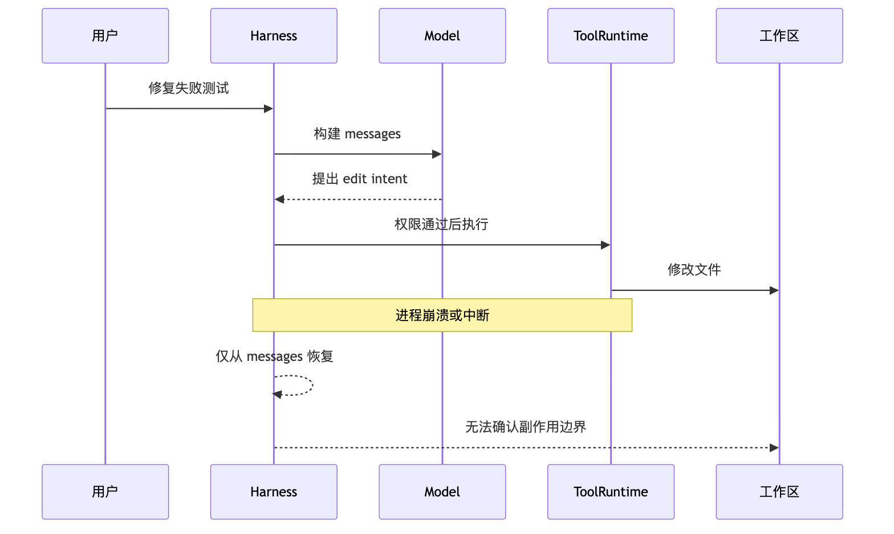
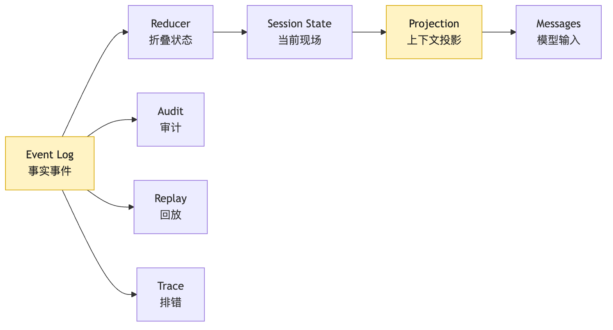
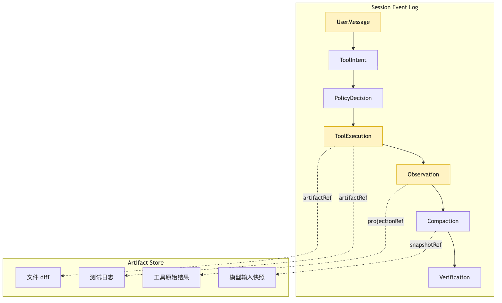
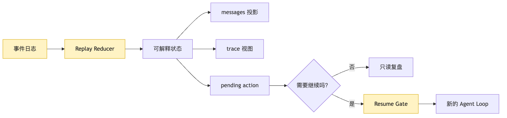
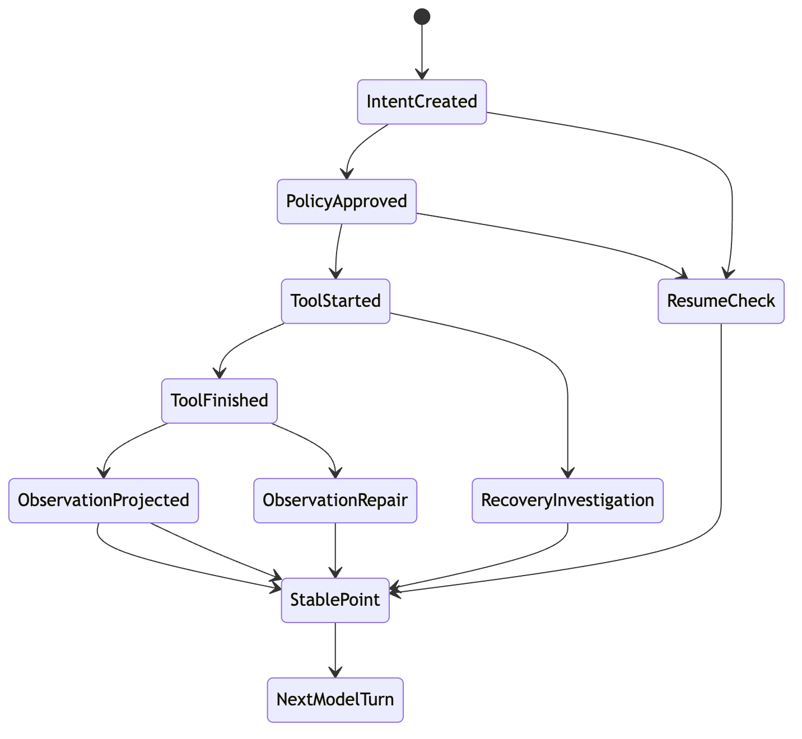
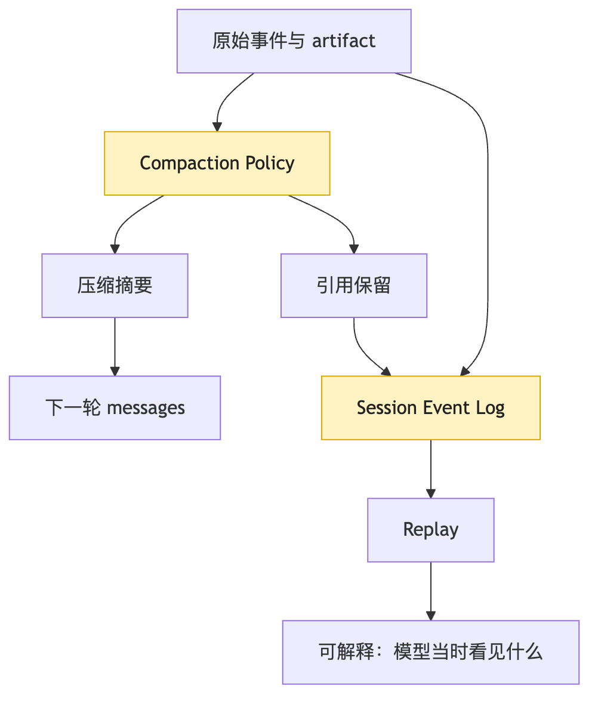

# Session Replay: why is the event log the source of truth for long tasks?

When many people add persistence to an Agent for the first time, they naturally save `messages`.

That seems reasonable.

The model sees messages every round.

User input is in messages.

Model answers are in messages.

Tool results are also pushed back into messages.

So it is easy to write a minimal version:

```ts
await fs.writeFile(
  "session.json",
  JSON.stringify({ messages }, null, 2)
);
```

Then you feel relieved.

There is a session file.

There is history.

The process can crash and still continue.

But after running real long tasks, that confidence breaks quickly.

We keep using the same example from earlier articles:

```text
User says: this project's tests are failing; help me find the cause and fix it.
```

The CLI Agent starts working.

It reads the project structure.

It runs tests.

It sees the failure log.

It searches related code.

It modifies files.

It runs tests again.

Then a very ordinary accident happens:

The process crashes.

Or the user interrupts.

Or the terminal disconnects.

Or a tool command times out.

Or the context is nearly full and the system performs compression.

Now you want to resume the task.

The question is:

Where should the system resume from?

If only messages are saved, there appears to be history.

But it may not be able to answer:

```text
What intent did the model propose in the previous round?
Did that intent pass permission approval?
Did the tool actually start executing?
Did the tool fail halfway, or finish but fail to write back?
Has the file already been modified?
Has the test command already run?
Which action did the user reject?
Which original facts were lost during context compression?
Where is the last stable checkpoint?
Will continuing repeat real-world modifications?
```

This is the problem Article 16 solves.

Long tasks cannot rely only on in-memory messages.

They also cannot rely only on "saving the chat transcript."

Once an Agent enters a real engineering environment, its source of truth must take a different shape.

The core sentence of this article is:

```text
Session log is the source of truth; messages are only projection.
Replay does not rerun the real world; it restores explainable state from events.
Resume is not bravely continuing; it is conservatively checking whether continuing is safe.
```

This sentence looks heavy.

Let's unpack it slowly.

First separate three storage objects that will appear repeatedly:

| Object | What it saves | What it does not save |
| --- | --- | --- |
| Session Store | session metadata, state snapshots, resume gate results | full large logs |
| Event Log | key factual events: intent, permission, execution, observation, verification | arbitrary chat transcript |
| Artifact Store | full stdout, stderr, diff, model input snapshots, large evidence | decisions about whether to continue |

Replay's goal is not to let the task automatically continue.

It first turns "whether it is safe to continue" into a state that can be judged.

## Problem Chain

First fix the problem chain:

```text
Long tasks cannot save only in-memory messages
-> messages are model input projection, not source of truth
-> after crash, interruption, compression, or half-executed tools, messages alone cannot determine side-effect boundaries
-> append-only event log must record intent, permission, execution, observation, and verification
-> Replay restores state from events instead of re-executing the real world
-> Resume must pass a gate before continuing
-> Artifact Store saves long logs, diffs, model input snapshots, and large evidence
-> this factual chain later supports trace, eval, and durable execution
```

## 1. The Scariest Part of Long Tasks Is Not Failure, but Not Knowing What Happened After Failure

Start with a minimal Agent Loop.

Earlier we expanded a single model call into a ReAct loop:

```text
Think
-> Act
-> Observe
-> Think
-> ...
-> Final
```

For a demo, the system may look like this:

```ts
let messages = [userMessage];

while (true) {
  const response = await provider.chat({ messages });

  if (response.type === "final") {
    messages.push(response.message);
    break;
  }

  const result = await toolRuntime.execute(response.toolCall);

  messages.push(response.message);
  messages.push(toToolMessage(result));
}
```

This code can run.

It is enough to explain the basic shape of an Agent Loop.

But it has one fatal assumption:

```text
The whole task will finish smoothly inside one process.
```

Real tasks never cooperate like this.

For example, our CLI Agent is fixing tests.

In the first round it runs:

```text
pnpm test auth
```

The test fails.

The model sees the log and decides it should read:

```text
src/auth/session.ts
```

Then it proposes an edit intent.

The system passes permission.

The tool starts modifying the file.

At that moment, the process crashes.

When resuming, if you only inspect messages, you may see:

```text
assistant: I will modify src/auth/session.ts
tool: modification succeeded
```

Or only:

```text
assistant: I will modify src/auth/session.ts
```

Or, after compression, only:

```text
Previously checked auth tests and prepared to fix session logic.
```

These three cases require completely different resume strategies.

In the first, you must verify that the file really changed.

In the second, you must determine whether the tool started executing.

In the third, even the structured intent may be gone.

If the system cannot say what happened, it can only guess.

And guessing is the most dangerous thing during Agent recovery.



The important part of this diagram is not that "processes crash."

Crashes are ordinary.

The real problem is that a crash cuts two things.

The first is in-memory state.

For example, `turnCount`, budget, current pending intent, and running tool.

The second is the explanation chain.

That is how the system knows:

```text
what the model said
what the system allowed
what the tool did
how the real world changed
what the next model round should see
```

`messages` can save part of the explanation chain.

But it is not designed for recovery.

It is designed as next-round model input.

These goals differ.

Next-round model input optimizes for "enough for now."

Recovery source of truth optimizes for "what happened at the time."

The former can be compressed.

The latter must remain traceable.

The former can be reordered.

The latter must preserve causal order.

The former can give only summaries.

The latter must explain which events a summary came from.

So starting in this article, we establish:

```text
Session is not messages.
Session is the event ledger of a long task.
```

## 2. Messages Are Projection, Not Source of Truth

To understand Session Replay, first separate three terms.

```text
Event Log
State
Messages
```

They are often mixed.

But mixing them in a long-task Agent causes accidents.

`Event Log` is the source of truth.

It records events that happened.

For example:

```text
the user submitted the goal
the model proposed a tool intent
the system made a permission decision
the tool started executing
the tool returned an observation
context was compacted
budget triggered a pause
verification command passed
the task was marked complete
```

`State` is the current state folded from events.

For example:

```text
current turn number
budget used
whether the task is running / paused / failed / completed
pending intents
latest tool result
modified files
verification commands that have passed
```

`Messages` is the context projected from state and events for the model to see.

For example:

```text
user goal
recent dialogue
key tool result summaries
current task progress
next-step constraints
necessary code snippets
```

The relationship should be:

```text
Event Log -> State -> Messages
```

Not:

```text
Messages -> State -> Event Log
```

If messages are the source of truth, the system becomes hostage to the model input format.

Model input may be truncated to save tokens.

It may be summarized to reduce noise.

It may be reorganized to improve quality.

It may filter some tool output to prevent pollution.

It may hide internal policy for safety.

These operations are reasonable for a model call.

But they are not factual records for recovery and audit.

A raw tool output may be 3000 lines.

messages may keep only 10 key lines.

The next model round may only need those 10 lines.

But if tests later fail, a developer may need to know:

```text
what the original command was
what the exit code was
whether full stderr was truncated
what the truncation threshold was
how the summary was generated
whether the model saw summary or raw text
```

This information should not depend on messages.

It should be in the event log.



This diagram has a critical responsibility boundary.

`Messages` sits on the far right.

It is not the center.

It is only one projection among many.

The same Event Log can be projected into messages.

It can also be projected into a trace panel.

It can also be projected into an audit report.

It can also be projected into an eval sample.

It can also be projected into a resume checkpoint.

If we only have messages, all other views degrade into "guessing from the chat transcript."

A mature Harness must avoid that degradation.

So a more accurate definition of Session Store is:

```text
Session Store saves events.
Context Builder generates messages.
Replay Runner rebuilds state from events.
```

These roles cannot replace each other.

Session Store should not care what phrasing the model prefers.

Context Builder should not forge facts.

Replay Runner should not re-execute real side effects.

This is the most important engineering discipline in the article.

## 3. What Should the Event Log Record?

"Record events" is easy to say.

The hard part in code is event granularity.

Record too coarsely, and recovery cannot explain.

Record too finely, and the log grows, read/write complexity rises, and privacy and cost become heavier.

Use the CLI Agent test-fixing path to see a minimal event chain:

```text
UserMessage
SessionStarted
ModelRequested
ModelResponded
ToolIntentCreated
PolicyDecided
ToolStarted
ToolFinished
ObservationProjected
ContextCompacted
VerificationStarted
VerificationFinished
SessionPaused
SessionResumed
SessionCompleted
```

These names are not the standard answer.

But they express a principle:

```text
Any boundary that affects recovery, audit, budget, permission, context, or verification should become an event.
```

For model calls, you do not necessarily need to save the full prompt forever.

It may contain privacy, secrets, or too much code.

But at minimum, save:

```text
model name
request id
input token estimate
output token count
context snapshot id
visible tool list hash
start time
end time
status
error taxonomy
```

Then during recovery or debugging, the system knows which context and tool visibility the model used to judge.

For tool calls, the tool event should not save only one string.

It should answer:

```text
what the tool name was
what the arguments were
whether argument validation passed
what the permission decision was
what the execution environment was
whether side effects happened
whether output was truncated
what observation returned to the model
where the raw result is stored
```

A minimal event object can look like:

```ts
type SessionEvent =
  | UserMessageEvent
  | ModelRequestEvent
  | ModelResponseEvent
  | ToolIntentEvent
  | PolicyDecisionEvent
  | ToolExecutionEvent
  | ObservationEvent
  | ContextCompactionEvent
  | VerificationEvent
  | LifecycleEvent;

type BaseEvent = {
  id: string;
  sessionId: string;
  seq: number;
  ts: string;
  type: string;
  causationId?: string;
  correlationId?: string;
};

type ToolExecutionEvent = BaseEvent & {
  type: "tool.finished";
  toolCallId: string;
  toolName: string;
  status: "ok" | "error" | "timeout" | "cancelled";
  exitCode?: number;
  artifactRefs: string[];
  observationRef: string;
  sideEffect: "none" | "workspace" | "network" | "external";
};
```

Several fields are critical.

`seq` is order.

It lets replay rebuild state by occurrence order.

`causationId` is cause.

It says which event triggered this event.

For example, `tool.started` is caused by `tool.intent.created`.

`correlationId` links one action group.

For example, one model intent, permission decision, tool execution, and observation all belong to the same tool call.

`artifactRefs` are references to external artifacts.

The event log does not need to contain complete large files, large logs, or diffs.

It can save stable references:

```text
artifact://session/abc/test-output-003.txt
artifact://session/abc/patch-004.diff
artifact://session/abc/model-input-007.json
```

This connects the event log to the artifact store.

The event log records "what happened."

The artifact store preserves "the evidence material from then."

Together, they form the factual foundation of long tasks.



One easily missed point:

`Observation` is also an event.

The raw tool result and the observation the model sees are not the same thing.

The raw result may be long, messy, and contain information that should not enter context.

Observation is the version projected to the model after Harness cleanup, truncation, summary, and risk labeling.

If this step is not recorded, replay cannot answer:

```text
What exactly did the model see at that time?
```

That question is the starting point of almost every Agent failure analysis.

## 4. Replay Does Not Rerun the World

Now the easiest part to misunderstand.

When many people hear Replay, they think:

```text
Run every step from that time again.
```

For ordinary pure functions, maybe.

For Agents, this is usually dangerous.

Many Agent steps have side effects.

Reading files may be fine.

Writing files is not.

Executing commands is not.

Calling external APIs is definitely not.

If replay really re-executes:

```text
edit_file
run_shell
send_email
create_ticket
deploy_service
```

then it is not replay.

It is changing the world again.

That causes many problems.

Files may be modified twice.

Tests may run in a different dependency state.

External APIs may receive duplicate requests.

Actions the user rejected may be triggered again.

Old dangerous commands may run again.

So inside an Agent Harness, Replay should mean something more conservative by default:

```text
Rebuild explainable state in event order.
Do not re-execute real side effects that already happened.
```

In other words, Replay input is event log.

Replay output is state, trace, message projection, and diagnostic views.

Not new tool side effects.

```ts
function replay(events: SessionEvent[]): ReplayedSession {
  let state = initialSessionState();

  for (const event of events.sort(bySeq)) {
    state = reduceSessionEvent(state, event);
  }

  return {
    state,
    messages: projectMessages(state),
    trace: projectTrace(state),
    pendingActions: derivePendingActions(state),
  };
}
```

There is no `executeTool` in this pseudocode.

That is the point.

Replay is not running tools.

Replay folds historical events back into state.

If a tool executed at the time, replay reads its `tool.finished` event and artifact.

If a model returned an intent at the time, replay reads the `model.responded` event.

If context compaction happened, replay reads the compaction event, summary, and references to replaced content.

It should not silently request the model again.

It should not silently run a shell again.

That is the difference between Session Replay and Agent Loop.



The most important part of the diagram is `Resume Gate`.

There must be a gate between Replay and Resume.

Replay only rebuilds state.

Resume continues action.

If the two are mixed, the system automatically moves forward during recovery.

That is dangerous.

Recovery is not "continue the previous while loop."

Recovery is a new decision point.

The system must first confirm:

```text
Does the workspace still match the previous record?
Is the pending intent still valid?
Is user permission still valid?
Is there budget left?
Could the external world have changed?
Is the state after context compression sufficient to continue?
```

Only after these conditions are checked can a new Agent Loop begin.

That is why we say:

```text
Replay rebuilds explanation.
Resume continues conservatively.
```

## 5. Resume Must Be Conservative: Find the Last Stable Point Before Continuing

A common mistake is writing Resume as:

```ts
const { messages } = await loadSession(sessionId);
runAgentLoop({ messages });
```

This feels natural.

But it skips the most important question:

```text
At which boundary did the previous run stop?
```

In long tasks, not every position is safe to continue.

A safe continuation point should be stable.

Stable points usually satisfy:

```text
no tool half-executing
no unpersisted events
no unconfirmed permission decision
workspace side effects have been recorded
observation needed by the next model round has been generated
session state can be fully rebuilt from events
```

Consider this chain:

```text
ToolIntentCreated
-> PolicyApproved
-> ToolStarted
-> ToolFinished
-> ObservationProjected
```

If the system stopped after `ToolIntentCreated`, the tool has not executed.

Recovery can redo permission checks.

If it stopped after `PolicyApproved`, the tool has not started.

Recovery must check whether the approval is still valid, especially whether user authorization has expired.

If it stopped after `ToolStarted`, this is the hardest case.

The tool may already have modified files, but the event was not fully written.

Recovery must not rerun directly.

It must first inspect the workspace and artifacts.

If it stopped after `ToolFinished`, but before generating observation.

Recovery can regenerate observation from the tool result artifact.

If it stopped after `ObservationProjected`.

This is usually a good continuation point.

The real-world side effect has happened, and the observation the next model round should see has been recorded.



This state diagram does not require implementing a complex workflow engine on day one.

It reminds us of one thing:

Recovery must know which event boundary it stopped at.

If it does not know the boundary, it cannot pretend continuation is safe.

In our CLI Agent, a conservative resume flow can be:

```ts
async function resumeSession(sessionId: string) {
  const events = await sessionStore.readEvents(sessionId);
  const replayed = replay(events);

  const gate = await evaluateResumeGate({
    state: replayed.state,
    workspace: await inspectWorkspace(),
    policy: await loadCurrentPolicy(),
    artifacts: await artifactStore.checkRefs(replayed.state.artifactRefs),
  });

  if (!gate.ok) {
    return pauseForUser(gate.reason, gate.recoveryOptions);
  }

  return runAgentLoop({
    sessionId,
    initialState: replayed.state,
    initialMessages: replayed.messages,
  });
}
```

`evaluateResumeGate` is the key.

It is not model judgment.

It is Harness judgment.

Resume risk is not only "what should we do next."

It is "will continuing repeat side effects, violate permissions, or act on stale facts?"

That belongs to Harness lifecycle responsibility.

The model can help explain.

But it cannot decide alone.

## 6. Context Compression Makes Messages Even Less Suitable as Source of Truth

As discussed in Context management, long tasks constantly create token pressure.

Reading files, running tests, searching, modifying, and verifying all add context.

So mature Agents must compress.

They may:

```text
truncate long tool results
replace old file contents with summaries
compress many rounds of history into task progress
fold repeated search results into references
store full logs as artifacts and show the model only key fragments
```

All of this helps the model call.

But it makes messages even less suitable as source of truth.

Compression brings three problems.

First, compression is lossy.

Details that the next model round does not need may be removed.

But those details may be exactly what debugging later needs.

Second, compression is interpretive.

Summary is not raw fact.

It is the system or model re-expressing facts.

Third, compression changes event shape.

A `tool_result` may be replaced by:

```text
Tests still fail; key error is TypeError: user.id should be string.
```

This is enough for continuing the fix.

But not enough for audit.

So compression itself must become an event.

```text
ContextCompactionStarted
ContextCompactionFinished
CompactionInputRefs
CompactionOutputSummary
CompactionPolicy
ReplacedMessageRange
```

Then during replay, the system can know:

```text
which original content was compressed
what the compression result was
whether the model later saw summary or raw text
which artifacts the summary corresponds to
```



The most important part is the dual-write boundary.

The compressed summary enters messages.

The compaction event and references enter event log.

If only the summary remains, the system "looks continuous" but becomes distorted.

If only raw text remains without summary, the system collapses under tokens.

The correct approach is not choosing one.

It is:

```text
Show the model a usable projection.
Keep the factual chain for the system.
```

This is the interface between Session Replay and Context Engineering.

Context ensures the model sees appropriate information in this round.

Session ensures the system knows where that information came from.

## 7. Artifacts Keep Context Honest

The event log should not grow without bound.

If every tool output, file snapshot, model input, and command log is stuffed into JSONL, the system quickly becomes slow and fragile.

So Session Store usually needs an Artifact Store.

Simply:

```text
event log saves indexes, causality, and state boundaries.
artifact saves large evidence material.
```

In the CLI Agent test-fixing example, artifacts can include:

```text
full stdout / stderr of test commands
file read snapshots
raw search results
patch diffs
model input snapshots
message fragments before compression
summary after compression
verification reports
```

Event log saves references:

```json
{
  "type": "tool.finished",
  "toolName": "run_tests",
  "status": "error",
  "exitCode": 1,
  "artifactRefs": [
    "artifact://session/s1/tool-003-stdout.txt",
    "artifact://session/s1/tool-003-stderr.txt"
  ],
  "observationRef": "artifact://session/s1/observation-003.md"
}
```

The benefit is not elegance.

It keeps context honest.

When the model sees a summary:

```text
Tests failed; key error is a user.id type mismatch.
```

The system can trace:

```text
which command produced this summary
which working directory the command ran in
what the exit code was
where the full log is
whether the summary was truncated
whether a later test superseded this fact
```

Without artifacts, summaries easily become floating "I heard that" facts inside context.

With artifacts, summaries are traceable projections.

That is the core of context honesty.

The model does not need to see full evidence every round.

But the system must know where the evidence is.

## 8. Failure, Interruption, Approval, and Budget Should All Be Events

Many first versions of session logs record only the successful path.

This makes recovery dangerous.

In long tasks, the most important parts are often the parts that did not go smoothly.

Tool failure should be recorded.

User interruption should be recorded.

Permission denial should be recorded.

Budget exhaustion should be recorded.

Context compaction failure should be recorded.

Invalid model structure should be recorded.

Verification failure should be recorded.

If these do not become events, the system treats them as if they never happened during recovery.

For example, the user rejected a command:

```text
rm -rf dist && pnpm build
```

If the rejection event is not saved, after recovery the model may propose a similar command again.

The system may also not know this is repeated annoyance.

The correct event chain should contain:

```text
ToolIntentCreated
PolicyDecisionRequested
UserApprovalRequested
UserApprovalDenied
IntentRejected
ObservationProjected
```

Then the next model round can see:

```text
The user rejected cleaning dist; find a non-destructive approach.
```

The audit layer also sees:

```text
The system did not execute the rejected action.
```

Budget exhaustion is another example.

If the loop simply stops, the user sees "the Agent is doing nothing."

If the budget event is clear, the system can explain:

```text
Read, search, one fix, and two verifications are complete.
The current token budget reached its limit.
Before continuing, compress context or ask the user to approve more budget.
```

Failure events are not noise.

They are part of the long-task lifecycle.

Agent reliability is not making failure disappear.

It is making failure bounded, explainable, and recoverable.

## 9. Non-Replayable Side Effects Must Be Marked Explicitly

Replay does not re-execute the real world.

But after Resume, the system may perform new actions.

So the event log must distinguish side-effect types.

Tools can be roughly divided into:

```text
pure: pure computation, no external side effect
read: reads environment, does not modify
workspace-write: modifies current workspace
external-write: writes external systems
network: accesses network
process: starts a process
```

Different side effects need different recovery strategies.

Pure computation can be recomputed.

Read-only operations can be rerun when needed, but the world may have changed.

Workspace writes must check diff, file hash, and Git status.

External writes usually cannot be retried automatically.

Network requests depend on idempotency.

Process execution must check whether the command is still running and whether it already produced output.

This is not over-design.

It is basic accounting once tools touch the real world.

If the system does not know whether a tool has side effects, it cannot recover safely.

Tool protocol can add:

```ts
type ToolRisk = {
  sideEffect:
    | "none"
    | "read"
    | "workspace-write"
    | "external-write";
  idempotency: "safe" | "conditional" | "unsafe";
  resumePolicy:
    | "replay-from-event"
    | "rerun-after-check"
    | "require-user-confirmation"
    | "never-rerun";
};
```

These fields directly affect Session Replay.

If `resumePolicy` is `replay-from-event`, recovery only reads existing events.

If it is `rerun-after-check`, recovery must verify the environment first.

If it is `require-user-confirmation`, recovery must ask the user.

If it is `never-rerun`, the system can only show history and cannot repeat automatically.

In our CLI Agent, `read_file` can usually be reread.

`grep` can rerun, but results may change.

`edit_file` must not repeat blindly.

`bash` depends on the command.

`git diff` is relatively safe.

`pnpm test` can run again, but it must be recorded as a new verification, not historical replay.

This boundary is crucial:

```text
Replaying historical events is not repeating historical actions.
```

## 10. Minimal Session Store Can Be Plain

At this point, Session Replay may sound like a heavy system.

The first version does not need a database, distributed workflow engine, or complex UI.

A small CLI Agent can start plainly:

```text
.agent/
  sessions/
    s_2026_05_28_001/
      events.jsonl
      artifacts/
        tool-001-stdout.txt
        tool-001-stderr.txt
        patch-002.diff
        observation-002.md
      snapshots/
        state-010.json
```

`events.jsonl` is append-only.

One event per line.

Events have increasing `seq`.

Large content goes to artifacts.

Every so often, write a state snapshot.

Recovery can:

```text
read the latest snapshot
read events after the snapshot
reduce again
check artifact references
generate message projection
enter resume gate
```

Pseudocode:

```ts
async function appendEvent(event: SessionEvent) {
  const line = JSON.stringify(event) + "\n";
  await fs.appendFile(sessionEventsPath(event.sessionId), line);
}

async function loadForReplay(sessionId: string) {
  const snapshot = await loadLatestSnapshot(sessionId);
  const events = await readEventsAfter(sessionId, snapshot?.seq ?? 0);
  const state = replayFrom(snapshot?.state ?? initialState(), events);

  return {
    state,
    events,
    messages: projectMessages(state),
  };
}
```

Several implementation details matter.

First, append-only writes are safer than overwrites.

If a process crashes while overwriting a session file, it may leave half a JSON document.

JSONL append is easier to recover.

Second, events need sequence numbers.

Timestamps alone are not enough.

Multiple events may happen in the same millisecond.

Third, snapshot is an optimization, not the source of truth.

If snapshot conflicts with event log, trust event log.

Fourth, artifacts should be checked for existence and hash.

Otherwise replay may reference evidence that was lost or modified.

Fifth, projection must be rebuildable.

messages should not be the only saved version.

They can be cached, but must be regenerable from events and state.

That is the minimal Session Store.

It is not fancy.

But it is enough to move an Agent from "one-shot process" toward "recoverable long task."

## 11. Relationship Between Session Replay and Durable Execution

The roadmap places this area near Harness Architecture and Durable Execution.

The reason is simple:

Once long tasks need to continue across processes, time, or workers, the execution process cannot live only in memory.

Durable Execution asks:

```text
Can every step be recorded reliably?
After failure, can we know which step was reached?
Can retryable steps be retried?
Can non-retryable steps be skipped or handled manually?
Can execution continue after recovery?
```

Agent Harness is special because its steps include model judgment.

Model judgment is not an ordinary function.

Tool execution is not an ordinary function either.

Context projection changes the world visible to the model.

So a durable Agent loop must at least split into:

```text
checkpoint context
-> call model
-> persist model event
-> validate intent
-> persist policy decision
-> execute tool
-> persist tool result
-> project observation
-> persist observation
-> decide next lifecycle state
```

Every arrow is a possible crash point.

Every crash point must answer:

```text
Was the previous step already complete?
Where is the evidence of completion?
Can it retry?
Will retry repeat side effects?
Does recovery need human confirmation?
```

That is why Session Replay is the foundation of a Durable Agent Loop.

Without event logs, durable execution is only "hope it can continue next time."

With event logs, the system can talk about retry, recovery, audit, and remote workers responsibly.

## 12. Replay Also Becomes the Factual Base for Eval and Trace

Session Replay's direct use is recovery.

But its long-term value goes beyond recovery.

It also becomes the factual base for Trace Analysis and Eval.

When an Agent fails, the hardest question is not "did it fail?"

It is:

```text
At which layer did failure happen?
```

Was model judgment wrong?

Was tool schema too loose?

Did permission policy allow a dangerous action?

Did Context cut the key log?

Did a compressed summary mislead the model?

Did tool execution fail but observation say success?

Did the verification command run in the wrong directory?

Did the system continue incorrectly after user interruption?

These questions require an event chain.

If there is only the final answer, eval can only judge "good/bad."

With session event log, eval can attribute failure to a specific layer:

```text
provider
context
tool validation
permission
execution
observation
verification
lifecycle
```

This changes how improvements happen.

Previously, after failure, you may think:

```text
Maybe the prompt is not good enough?
```

With event logs, you may discover:

```text
The model actually proposed the correct intent.
The permission layer rejected it incorrectly.
```

Or:

```text
Tool execution succeeded.
But observation truncated away the key error.
```

Or:

```text
The model already asked to run tests.
But the verification layer did not pass the failing exit code back.
```

In those cases, fixing the prompt is not the right answer.

You should fix the Harness.

So Session Replay is not a peripheral feature.

It gradually becomes the factual base of the whole Agent system.

Recovery depends on it.

Debugging depends on it.

Audit depends on it.

Evaluation depends on it.

Multi-Agent handoff will also depend on it.

Because if a sub-Agent's result cannot be written back into the main session's event chain, it is only a text summary.

Text summaries help humans read.

But they cannot become the system source of truth.

## 13. Common Misconceptions: Saving Chat History Is Enough

Finally, clear several misconceptions.

First misconception:

```text
Saving messages is saving session.
```

No.

messages are model input projection.

session is the factual event chain.

They can reference each other, but cannot replace each other.

Second misconception:

```text
Replay means running tools again.
```

No.

Replay is read-only state reconstruction by default.

Rerunning tools is a new action after Resume, and must pass gate, permission, and side-effect checks.

Third misconception:

```text
If we have Git, we do not need session log.
```

Not enough.

Git can tell you file diffs.

It cannot tell you why the model wanted a change, how permission passed, what tool output was, which action the user rejected, what context was compressed, or how the verification command was produced.

Git is one part of workspace facts.

It is not the whole Agent runtime fact.

Fourth misconception:

```text
The more complete the log, the better.
```

Also no.

The event log should completely record causality and boundaries.

But large content should go to artifacts.

Sensitive content should be redacted, referenced, or access-controlled.

Source of truth does not mean "put everything in."

It means "key facts are traceable."

Fifth misconception:

```text
During recovery, let the model read full history and decide.
```

That is dangerous.

The model can participate in explanation.

But the recovery gate must be controlled by the Harness.

Recovery involves side effects, permissions, budget, and state consistency.

These are system control problems, not language judgment problems.

## 14. Compressing the Article Into One Load-Bearing Chain

Compress the whole article into one chain:

```text
real task produces events
-> events append to Session Log
-> large evidence enters Artifact Store
-> Reducer folds State from events
-> Projection generates Messages from State
-> Replay rebuilds explanation from events
-> Resume Gate decides whether continuing is safe
-> new Agent Loop continues only from a safe boundary
```

This chain connects the previous articles.

Intent / Execution separation tells us:

```text
The model proposes; the system executes.
```

Context Policy tells us:

```text
The model should see only appropriate information in each round.
```

Lifecycle tells us:

```text
Long tasks pause, fail, interrupt, and resume.
```

Session Replay combines these into one engineering discipline:

```text
Every boundary that affects recovery and explanation must become an event.
```

With this discipline, an Agent can move from a local one-shot process toward hosted long tasks.

The next article expands outward.

Once session can recover, the question becomes:

```text
Where do Agent capabilities come from?
How do Skills, MCP, plugins, and dynamic tool exposure enter the same controlled pipeline?
```

That is Capability Discovery.

Capabilities can be discovered dynamically.

But control boundaries must not dynamically disappear.

## Image Plan

This article does not generate images directly.

Image prompts live outside the article and will be read, translated, and generated by later image pipelines.

Prompt manifest:

```text
docs/en/assets/00-16-session-replay-event-log/image-prompts.json
```

Planned body images:

1. `photo-01-messages-vs-event-log`: after `## 2. Messages Are Projection, Not Source of Truth`, explaining the source-of-truth relationship among Event Log, State, and Messages.
2. `photo-02-replay-not-rerun-world`: after `## 4. Replay Does Not Rerun the World`, explaining the boundary between replay and real side effects.
3. `photo-03-resume-stable-point-gate`: after `## 5. Resume Must Be Conservative: Find the Last Stable Point Before Continuing`, explaining stable points and Resume Gate.
4. `photo-04-artifact-honest-context`: after `## 7. Artifacts Keep Context Honest`, explaining the relationship between event log, artifact, and context projection.

---

GitHub source: [00-16-session-replay-event-log.md](https://github.com/LienJack/build-harness/blob/main/docs/en/00-16-session-replay-event-log.md)
