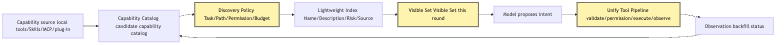
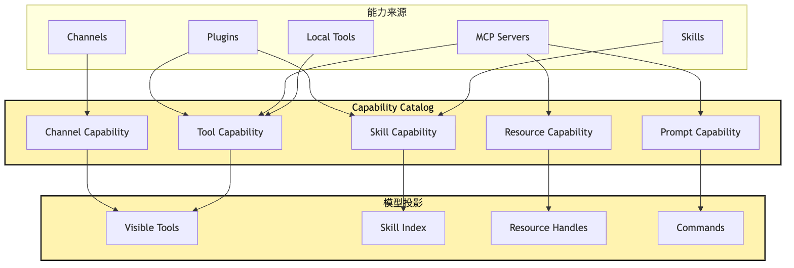
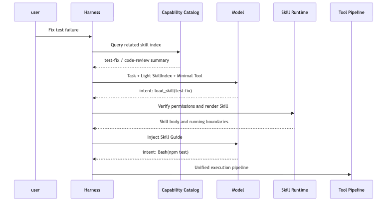
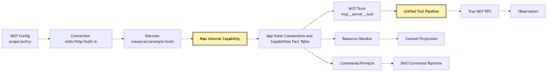
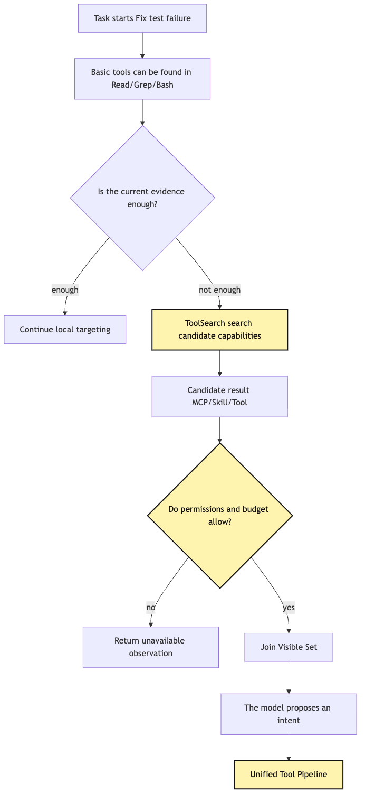
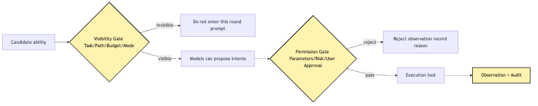
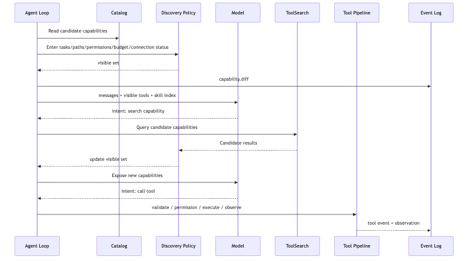

# Capability Discovery: Skills, MCP, and dynamic tool exposure

By Article 17, our small CLI Agent is no longer the original chat-only program.

It has provider runtime.

It has tool runtime.

It has a local tool bundle.

It has context policy.

It also has session replay.

If we keep adding features along the previous implementation path, a natural urge appears:

```text
Since the tool system already exists, let's register every tool.
```

Read files.

Edit files.

Search code.

Run commands.

Query GitHub.

Query Slack.

Query databases.

Read designs.

Control a browser.

Load team guidelines.

Run a review skill.

Run a writing skill.

Run a deployment skill.

Each capability is reasonable by itself.

But if all of them enter the model's view, the system immediately becomes unreasonable.

The model does not need to know every tool in this round.

It only needs to know the small set of capabilities that are relevant to the current task, allowed by current permissions, fit within the current context budget, and executable in the current runtime state.

That is where Capability Discovery appears.

It does not solve "how to give the Agent more capabilities."

It solves:

> As candidate capabilities grow, how does the system first discover them, then dynamically expose the smallest usable set for the task, while ensuring every external capability still returns to the unified tool pipeline?

We keep using the running example:

```text
The user enters at the project root:
Help me figure out why this project's tests are failing and fix it.
```

In early chapters, this task may only need local tools:

```text
Read
Grep
Bash
Edit
```

But in real projects, it may need more:

```text
GitHub MCP: read recent PR discussion.
Issue MCP: check whether the test failure is already recorded.
CI MCP: fetch remote build logs.
code-review skill: review the final diff using team style.
frontend skill: load component guidelines when frontend components change.
test-runner skill: choose the test command by project type.
```

All of these capabilities should exist.

But they should not all be exposed to the model at the beginning.

The more capabilities there are, the more places the system can lose control.

This article makes that boundary explicit.

## Problem Chain

First pin down the problem sequence:

```text
Tool Runtime lets the model propose structured tool calls
-> Plugin Host lets external capabilities enter the system
-> capability sources grow: local tools, Skills, MCP, plugins, channel capabilities
-> if all are exposed to the model, context, choice, and safety lose control together
-> first build a Capability Catalog that records candidate capabilities
-> then Discovery filters by task, path, permission, budget, and runtime state
-> ToolSearch / Deferred Loading lets the model see a lightweight index first, then load details after a hit
-> Skills are loaded on demand as experience packs, not kept fully resident in context
-> MCP bridges external capabilities by discovering resources/prompts/tools, then mapping them into internal capabilities
-> finally, every executable action still enters the unified tool pipeline
```

The most important word in this chain is not `Skill`.

It is not `MCP` either.

It is `Visibility`.

Visibility.

A capability can exist in the system.

Existence does not mean visibility.

Visibility does not mean executability.

Executability also does not mean it can bypass audit.

As an overview:



The most important part of this diagram is not the number of nodes.

It is the two boundaries.

The first boundary is between `Capability Catalog` and `Visible Set`.

The system may have many candidate capabilities.

The model can only see the filtered visible set for this round.

This also connects Article 11's Plugin Host to this article's Catalog:

```text
Plugin Host lets external capabilities enter the system.
Registry records the internal capability facts that have been registered.
Capability Catalog is an extended Registry view that records tool / skill / resource / prompt / channel uniformly.
Discovery Policy selects this round's Visible Set from the Catalog.
Context Policy assembles the Visible Set and other context material into Model Input.
Tool Runtime only decides whether one concrete ToolIntent can execute.
```

The second boundary is between `Model` and `Tool Pipeline`.

After the model sees a capability, it may still only propose intent.

Real execution is still handled by the tool pipeline.

If these two boundaries are removed, the system becomes dangerous:

```text
An external MCP server connects, and all tools enter the prompt.
A project Skill is detected, and its full text is put into the system prompt.
The model sees a hundred tools and guesses which name looks closest.
Only during execution does the system discover permission is not allowed.
The error result goes back into context, and the next round continues in confusion.
```

That is not the Agent becoming stronger.

That is the Harness going blind.

Capability Discovery's goal is to keep the Harness clear-headed when "there are many capabilities."

## 1. Why More Tools Can Make the Agent Less Intelligent

When people first build tool-using Agents, they often have an illusion:

```text
The more tools I give the model, the more it becomes an all-purpose assistant.
```

The illusion is understandable.

When humans use software, a richer menu seems like greater capability.

But the model is not a human user.

The model is not slowly browsing a visual menu.

The model reads a limited-context block of tool descriptions, then generates the next structured call for the current task.

More tools create three kinds of pressure at once.

First: context pressure.

Every tool needs a name, description, parameter schema, usage limits, and permission hints.

With dozens of tools, they consume many tokens.

Worse, those tokens are often not task information.

They are only a menu that "might be useful."

Second: choice pressure.

The more tools the model sees, the more similar descriptions can interfere.

For example, it may see:

```text
grep_code
search_files
github_search
mcp__repo__search
mcp__docs__search
skill__code_review
```

All of these names contain `search`.

But their semantics are completely different.

Some search local files.

Some search remote repositories.

Some search documentation.

Some only load a review method.

Once the model picks the wrong one, later reasoning drifts.

Third: safety pressure.

If the model can see high-risk capabilities, it may plan around them.

Even if execution is later refused, the system has already let the model build a plan on an unavailable premise.

That creates a subtle failure:

```text
The model does not lack a plan.
It planned from the wrong available capability set.
```

So tool visibility itself is part of the control system.

It is not UI optimization.

It is not prompt compression.

It is a shared entry point for permissions, context, and planning quality.

In our CLI Agent, if the user only says "fix local failing tests," the first round usually should not expose Slack, Figma, database writes, or deployment tools.

More reasonable is:

```text
Read
Grep
Glob
Bash(test-only)
Maybe SkillIndex
Maybe ToolSearch
```

After the model discovers that the failure involves a GitHub issue or CI log, discovery can add the corresponding MCP capability.

Capabilities should not be dumped into the model all at once.

They should gradually become visible as task evidence justifies them.

## 2. Capability Is Not Tool: Split the Concepts First

To implement dynamic exposure, first stop calling everything a tool.

`Tool` is an executable action.

`Capability` is something the system knows it may be able to do.

They are different.

For example, a Skill:

```text
code-review skill
```

It is not necessarily an external action.

It is more like a task experience pack:

```text
how to review a diff
what to inspect first
what the output format is
which risks to prioritize
which tools can be pre-approved
```

Another example, an MCP resource:

```text
mcp://github/pull/123
```

It is not an action either.

It is more like an external context object.

But it may enter context through List / Read resource tools.

Another example, an MCP prompt:

```text
triage_failed_ci
```

It is not an ordinary function.

It may become a slash command or task template.

So Capability Catalog cannot record only "tool function list."

It must express at least:

```text
Tool Capability: an executable action.
Skill Capability: a loadable methodology.
Resource Capability: an external context object that can be referenced.
Prompt Capability: a reusable workflow template.
Channel Capability: input/output capability supported by the current entry point.
```

If everything is forced into tools, the system becomes awkward.

You are forced to make the model express everything through "tool intent."

But loading a Skill, reading a resource, searching the capability directory, and refreshing an MCP server are not the same semantics.

A sturdier approach is:

```text
Put all candidate capabilities into Capability Catalog first.
Then decide how each capability type projects into model view.
```

As a layered diagram:



The key separation is `Catalog` versus `Projection`.

Catalog records system facts.

Projection decides what the model sees this round.

This is the same idea as Context Policy:

```text
Not every fact should enter the prompt.
Not every capability should enter the tool list.
```

Capability Discovery is context engineering on the capability side.

## 3. Skills: Experience Packs Are Not Resident Prompt

Start with Skills.

In our CLI Agent, a Skill may look like:

```text
.agent/skills/test-fix/SKILL.md
.agent/skills/code-review/SKILL.md
.agent/skills/frontend-component/SKILL.md
.agent/skills/release-note/SKILL.md
```

Each Skill contains a `SKILL.md`.

It has frontmatter.

It has a description.

It has allowed tools.

It may have scripts.

It may have templates.

It may also have reference materials.

The problem it solves is not "the system lacks a function."

It solves:

```text
When a task belongs to a category, what experiential workflow should the model use to combine existing tools?
```

For "fix failing tests," the tool layer only tells the model:

```text
You can read files.
You can search.
You can run tests.
You can edit.
```

But a test-fix skill tells the model:

```text
Reproduce the failure first.
Do not start with broad code changes.
Prefer reading the failing test and module under test.
After each change, run the smallest related test.
Run full tests at the end.
If failure output is too long, preserve error type, file, line, and assertion diff.
```

This is not a tool.

It is experience.

If experience is written into the global system prompt, it bloats.

If it relies on the user saying it every time, it is not reusable.

If it is hardcoded into core, it cannot evolve by project.

So the core Skill mechanism is progressive loading:

```text
First expose a lightweight index.
After a hit, load the body.
Only then read scripts or reference materials if necessary.
```

This fits capability discovery well.

The first model round does not need to see every Skill in full.

It only needs a lightweight directory:

```text
test-fix: fix local test failures by reproducing, localizing, making minimal changes, and regression verifying.
code-review: review diff for correctness, safety, and test gaps; output findings first.
frontend-component: when modifying frontend components, follow design system, state, and accessibility constraints.
```

The model decides the current task needs `test-fix`.

Then the Harness injects the full content into the current task through Skill loading.

As a chain:



One easily missed point:

Loading a Skill should itself be a controlled action.

It must not bypass permissions just because "it is only documentation."

The reason is simple.

A Skill may declare allowed tools.

A Skill may contain dynamic commands.

A Skill may load project guidelines, templates, and scripts into context.

A Skill may also come from the project repository, and the project repository is not automatically fully trusted.

So Skill Runtime must at least:

```text
parse frontmatter.
validate source and policy.
use only the lightweight index for discovery.
after a hit, render the body and record an event.
```

A minimal Skill capability can be represented as:

```ts
type SkillCapability = {
  kind: "skill";
  name: string;
  description: string;
  source: "managed" | "user" | "project" | "plugin" | "mcp";
  path?: string;
  match?: {
    paths?: string[];
    taskKeywords?: string[];
  };
  execution?: {
    mode: "inline" | "fork";
    allowedTools?: string[];
  };
  risk: "low" | "medium" | "high";
};
```

The important fields are `description`, `source`, `match`, and `execution`.

`description` lets the model decide from a lightweight index whether it needs the Skill.

`source` determines the trust boundary.

`match` enables path-related or task-related dynamic visibility.

`execution` decides whether it is injected inline into the current session or forked into a sub-Agent.

This is the role of Skills in Capability Discovery:

```text
Skill is not more tools.
Skill is a discoverable, loadable, governable task experience pack.
```

## 4. MCP: External Capability Bridge, Not a Tool Bypass

Now look at MCP.

If Skills solve "how experience is loaded on demand," MCP solves:

```text
How external systems connect to Agent Harness through a unified protocol.
```

Real development tasks rarely stay only in the local repository.

A test failure may relate to remote CI.

The cause may be in GitHub PR discussion.

Requirement background may live in a documentation system.

Design changes may be in Figma.

Production errors may be in monitoring.

If core gets one built-in tool for every connected system, core becomes polluted again.

MCP's value is letting these external systems expose capabilities through a unified protocol.

But that does not mean that once an MCP server connects, the model can directly send RPC.

This is crucial.

In a mature Harness, MCP should pass through six stages:

```text
configuration merge
-> connection and authentication
-> capability discovery
-> internal mapping
-> state synchronization
-> unified execution
```

MCP servers may expose more than tools.

They may expose:

```text
tools: executable actions.
resources: readable context.
prompts: reusable workflow templates.
```

For our CLI Agent, GitHub MCP may provide:

```text
tool: search_issues
tool: get_pull_request
resource: repo://build-harness/pr/42
prompt: summarize_failed_ci
```

After these four things enter the system, they should not all become the same kind of naked function.

A better mapping is:

```text
MCP tool -> Internal Tool Capability -> Visible Tool -> Tool Pipeline
MCP resource -> Resource Handle -> Context read tool or Context source
MCP prompt -> Command / Skill-like workflow template
```

As a diagram:



The key step is `Map`.

External MCP tools must be wrapped into internal Tools that the Harness understands.

They need internal tool names.

They need schemas.

They need read-only or write semantics.

They need permission namespaces.

They need error mapping.

They need observation formats.

Only then is MCP not a bypass RPC.

If the model proposes a tool intent for `mcp__github__get_pull_request`, in the Harness it is still an ordinary tool call:

```text
validate input
-> check visibility
-> check permission
-> run hooks
-> execute
-> truncate result
-> write observation
-> append audit event
```

The actual MCP RPC should happen only much later inside the execution pipeline.

This is consistent with Intent / Execution separation.

The model proposes:

```json
{
  "tool": "mcp__github__get_pull_request",
  "input": {
    "number": 42
  }
}
```

The system executes:

```text
internal tool call -> MCP adapter -> server.callTool("get_pull_request")
```

Between the two is full Harness discipline.

This article's judgment on MCP can be compressed into one sentence:

```text
MCP connects the external world, but must not let the external world bypass the Harness.
```

## 5. ToolSearch: Let the Model Search Capabilities Instead of Memorizing All of Them

When capabilities grow, merely pre-filtering a visible set is not enough.

Some capabilities are rarely used.

Some are needed only for specific tasks.

Some have long descriptions that are not worth putting into prompt directly.

This is where ToolSearch helps.

The idea is simple:

```text
The model does not need to see every tool detail at the beginning.
It can first see a search entry point.
When it realizes extra capability is needed, it searches the capability directory.
```

This is like human development: we do not memorize every command manual.

We know:

```text
If I need GitHub capability, search the tool directory.
If I need project guidelines, search the Skill directory.
If I need external resources, search MCP resource.
```

ToolSearch does not let the model "freely find tools by itself."

It is still controlled by the Harness.

Search results must be permission-filtered.

Returned results must be budget-limited.

High-risk capabilities do not become executable just because they matched.

A hit also does not mean full text is loaded.

It only pushes candidate capabilities into the next visibility decision.

So ToolSearch can be a low-risk discovery tool.

But it returns candidate capabilities, not direct additions to visible set, and certainly not execution authorization.

In our CLI Agent, the first round can expose only:

```text
Read
Grep
Bash(test commands)
SkillSearch
ToolSearch
```

The model runs tests.

The failure shows:

```text
CI-only snapshot mismatch, see PR #42
```

In the next round, the model can propose:

```text
I need to query GitHub PR or CI log related capabilities.
```

So it calls ToolSearch:

```json
{
  "query": "GitHub PR CI logs failed checks"
}
```

The Harness returns a small candidate set:

```text
mcp__github__get_pull_request
mcp__github__list_check_runs
mcp__ci__get_job_log
skill__ci-failure-triage
```

Discovery Policy then decides which can enter the current visible set.

As a decision path:



The most important part is that after `ToolSearch`, there is still `permission and budget`.

Searching capability is not authorization.

Finding capability is not executing capability.

That is the difference between ToolSearch and an ordinary search box.

An ordinary search box cares only about recall.

ToolSearch inside an Agent Harness also cares about governance.

It should return a "candidate capability view," not an entrance that bypasses the system.

## 6. Deferred Loading: Capability Descriptions Should Also Load Late

ToolSearch solves "how to find capability."

Deferred Loading solves "when capability details enter context."

This is most obvious in Skills.

A `code-review` Skill body may be hundreds of lines.

It may contain checklists.

Output formats.

Examples.

Script instructions.

If the full text enters every round, the prompt quickly becomes a storage room.

But if the model sees only the name, it cannot judge accurately.

So the best structure has three layers:

```text
directory layer: name + one-line description.
summary layer: task-adapted short card.
full layer: render full Skill only during execution.
```

MCP has a similar issue.

An MCP server may expose dozens of tools.

Every tool has a schema.

Every schema may be long.

If everything is sent to the model at the beginning, context is eaten by tool menus.

So MCP tools can also be projected in layers:

```text
server summary: GitHub MCP can query PRs, issues, and check runs.
tool index: short descriptions of get_pull_request / list_check_runs, etc.
full schema: only tools entering the visible set inject full schema.
```

This is Deferred Loading.

It is not laziness.

It acknowledges:

```text
Capability descriptions themselves are part of the context budget.
```

A minimal implementation can be:

```ts
type CapabilityDescriptor = {
  id: string;
  kind: "tool" | "skill" | "resource" | "prompt";
  title: string;
  summary: string;
  source: string;
  risk: "low" | "medium" | "high";
  tokens: {
    index: number;
    full: number;
  };
  load: () => Promise<LoadedCapability>;
};

type LoadedCapability = {
  descriptor: CapabilityDescriptor;
  modelProjection: string;
  toolSchema?: unknown;
  runtimeBinding?: unknown;
};
```

Notice `load()`.

Capability Catalog does not need to load all details upfront.

It can save descriptors first.

After Discovery Policy decides a capability may be relevant, it loads a fuller projection.

This lets the system manage startup speed, context budget, and capability scale separately.

Without Deferred Loading, several bad smells appear.

The first is prompt bloat.

Every round carries tool descriptions unrelated to the current task.

The second is tool-description pollution.

The model only needs to fix a test, but the prompt contains deployment, database, Slack, Figma, and other capabilities, so it starts planning irrelevant paths.

The third is blurred permission semantics.

The model sees a tool's details, but execution is later refused.

It interprets this as execution failure, not "this capability should not have entered the current plan."

Deferred Loading avoids exactly this mismatch.

## 7. Discovery Policy: Expose the Smallest Usable Set by Task

With Catalog, Skill index, MCP mapping, ToolSearch, and Deferred Loading, one core piece is still missing:

```text
Discovery Policy
```

It answers:

```text
In this round, which capabilities should enter the model's view?
```

The model cannot decide this alone.

Before deciding, the model must already see some capabilities.

And "which capabilities it sees first" is the Harness's responsibility.

Discovery Policy should consider at least seven signals.

First, task intent.

"Fix failing tests" and "help me write a weekly report" need completely different capabilities.

Second, current working directory and project type.

A Node project may need `npm test`.

A Python project may need `pytest`.

A project with `.github/workflows` is more likely to need CI-related capability.

Third, touched paths.

If the model is editing `packages/frontend`, a frontend Skill becomes more relevant.

If the model reads database migration files, a database review Skill may need to appear.

Fourth, permission mode.

In read-only mode, write-file tools should not be exposed.

In automatic mode, high-risk external write tools should not be exposed either.

Fifth, context budget.

When context is close to the limit, the system should expose tool details more conservatively.

Sixth, session state.

If an MCP server disconnects, its tools should not remain in the visible set.

If a Skill was already loaded, after compression it may only need to keep a summary and reload entry point.

Seventh, failure history.

If the model calls the same invalid tool three times in a row, Discovery Policy should lower its priority or guide the model to another path.

These signals can form a scoring model.

It does not need to be complex at first.

An MVP can be plain:

```ts
type DiscoveryInput = {
  userGoal: string;
  cwd: string;
  touchedPaths: string[];
  permissionMode: "read-only" | "ask" | "auto";
  contextBudgetRemaining: number;
  connectedServers: string[];
  recentFailures: string[];
};

function selectVisibleCapabilities(
  catalog: CapabilityDescriptor[],
  input: DiscoveryInput
) {
  return catalog
    .filter((cap) => sourceIsAvailable(cap, input))
    .filter((cap) => permissionAllowsVisibility(cap, input))
    .map((cap) => ({
      cap,
      score: relevanceScore(cap, input) - riskPenalty(cap, input),
    }))
    .filter((item) => item.score > 0)
    .sort((a, b) => b.score - a.score)
    .slice(0, visibleLimit(input))
    .map((item) => item.cap);
}
```

Do not read this as a recommendation algorithm.

It expresses an engineering boundary:

```text
The visible capability set should be computed by the Harness.
Do not hand the raw catalog to the model.
```

For our CLI Agent, the first Discovery Policy can be very restrained:

```text
By default, expose only base local read-only tools, test commands, and ToolSearch.
When the task includes "fix tests", expose the test-fix skill index.
When error logs mention PR, issue, CI, or similar evidence, allow searching corresponding MCP capability.
When permission mode is ask, file-write tools may be visible but must still require approval before execution.
When permission mode is read-only, Edit / Write are invisible.
```

This already solves many problems.

Not all intelligence comes from the model.

Some intelligence comes from runtime removing wrong options before the model sees them.

## 8. Visibility and Permission Are Two Gates

Emphasize this:

```text
Visibility is not a substitute for Permission.
Permission is not a substitute for Visibility.
```

They are two gates.

The first gate decides:

```text
Can the model see this capability in this round?
```

The second gate decides:

```text
Can this specific invocation execute?
```

If there is only the first gate, unauthorized execution appears.

The model sees a tool and the system executes by default. Dangerous.

If there is only the second gate, wrong planning appears.

The model sees a high-risk tool, plans around it, then execution is refused and task progress breaks.

So both gates are necessary.

As a diagram:



The easiest part to misunderstand is `invisible`.

Invisible does not mean "not installed."

Invisible only means "should not appear in the model's view this round."

For example, the current mode is read-only analysis.

`Edit` may exist in the system.

But it should not enter the visible set.

After the user switches to fix mode, it can reappear.

Or GitHub MCP may already be connected.

But the local test failure has no remote evidence yet.

GitHub tools can remain hidden first, leaving only the ToolSearch entry point.

When the model sees a PR number in the error, it can discover them through search.

This is steadier than exposing all GitHub tools at the beginning.

The visibility gate controls planning space.

The permission gate controls execution space.

A mature Harness must control both spaces.

## 9. Every External Capability Must Eventually Return to the Unified Tool Pipeline

Capability Discovery is easiest to ruin by opening bypasses for each capability type.

For example:

```text
Skill has its own execution path.
MCP has its own execution path.
Local tools have their own execution path.
Plugin tools have their own execution path.
Channel commands have their own execution path.
```

This is fastest in the short term.

Long term, the system loses control.

Every path must answer the same questions again:

```text
How are arguments validated?
How is permission checked?
How do hooks run?
How are results truncated?
How are errors written back?
How is trace recorded?
How is replay restored?
How does the user approve?
```

If every capability type answers these separately, behavior will diverge.

So this tutorial's design principle is:

```text
Capability sources may differ.
Before execution, they must unify.
```

That is:

```text
Local Tool -> Internal Tool
MCP Tool -> Internal Tool
Plugin Tool -> Internal Tool
Skill Load -> Controlled Tool or Command
Resource Read -> Controlled Tool or Context Source
```

Eventually everything passes through the same execution pipeline.

We have already written that pipeline:

```text
intent
-> validate
-> visibility check
-> permission
-> hooks
-> execute
-> observe
-> audit
```

Only adapters differ.

The local file tool adapter calls the filesystem.

The MCP tool adapter calls the MCP server.

The Skill adapter renders `SKILL.md` and injects the result into the session.

The Resource adapter reads external context and hands it to context projection.

But the main path does not change.

This gives three benefits.

First, audit is consistent.

No matter where capability comes from, trace sees unified events.

Second, permission is consistent.

There is no hole where built-in tools require approval but MCP tools execute directly.

Third, replay is consistent.

Session Replay can treat all external capability calls as events, rather than understanding every capability's private history format.

This is why after Article 16 discusses event logs, Article 17 discusses Capability Discovery.

After capabilities become dynamic, the event log must record not only "what the model proposed" and "what the system executed."

It must also record:

```text
which capabilities the system discovered at the time
which capabilities were visible to the model
why a capability was loaded
why a capability was refused
```

Otherwise, during replay, you may see a tool intent without knowing why it was present at the time.

## 10. Capability Changes Must Be Diffable

Dynamic capabilities introduce a new problem:

```text
The capability set changes.
```

An MCP server may disconnect.

An MCP server may add a tool.

The project may add a Skill.

The user may switch permission mode.

The current path may move from backend to frontend.

A plugin may be disabled.

All of these changes affect visible set.

If the system only updates silently in memory, debugging is painful.

Why did the model see `mcp__github__list_check_runs` in this round?

Why not in the previous round?

Why did the `frontend-component` skill suddenly activate?

Why did `Bash` move from visible to invisible?

These should all have events.

So Capability Discovery needs capability diff records.

An event can look like:

```ts
type CapabilityDiffEvent = {
  type: "capability.diff";
  turnId: string;
  added: string[];
  removed: string[];
  changed: Array<{
    id: string;
    before: string;
    after: string;
    reason: string;
  }>;
  policyInputs: {
    permissionMode: string;
    touchedPaths: string[];
    connectedServers: string[];
    contextBudgetRemaining: number;
  };
};
```

This is not for pretty logs.

It is for attribution.

When an Agent fails, we need to distinguish:

```text
The model chose the wrong tool.
The tool execution failed.
The tool should not have been visible.
The needed tool was not discovered.
The Skill description was too weak for the model to trigger it.
The MCP server disconnected, but stale tools remained.
The visible set did not refresh after permission mode changed.
```

These errors all look like "the Agent is not smart."

But their fixes are completely different.

If the model picked the wrong tool, change the tool description.

If the tool should not have been visible, change Discovery Policy.

If the needed tool was not discovered, change the ToolSearch index.

If MCP disconnect left stale tools, change connection state synchronization.

If a Skill did not trigger, change its description or path conditions.

Capability diff turns these from feelings into evidence.

## 11. Landing This Mechanism in Our Small CLI Agent

Now compress the mechanism into a minimal implementation.

We do not need a full ecosystem at first.

For Article 17's M6 capability, implement only:

```text
CapabilityDescriptor
CapabilityCatalog
SkillLoader
MCPDiscoveryAdapter
ToolSearch
VisibleSetBuilder
CapabilityDiffEvent
```

Directory organization can be:

```text
src/capabilities/
  descriptor.ts
  catalog.ts
  discovery-policy.ts
  visible-set.ts
  diff.ts

src/skills/
  loader.ts
  renderer.ts
  skill-tool.ts

src/mcp/
  config.ts
  connections.ts
  discover.ts
  map-tools.ts

src/tools/
  tool-search.ts
  pipeline.ts
```

At startup, Harness collects candidate capabilities:

```text
register base local tools.
scan project and user Skills.
read MCP config and connect servers.
discover MCP tools/resources/prompts.
write all results into Capability Catalog.
```

Before each loop round, Harness builds the visible set:

```text
read current task and session state.
read current permission mode.
read touched paths.
read MCP connection state.
read context budget.
call Discovery Policy to compute this round's visible capabilities.
project visible set into model tool list, SkillIndex, ResourceHandles.
record capability diff.
```

The model can only act from this projection.

If it needs more capability, it can call ToolSearch or SkillSearch.

Search results still return to Discovery Policy.

Finally, any executable action still enters the tool pipeline.

As a sequence diagram:



The model participates twice in this diagram.

First, based on the existing visible set, it decides "I need more capability."

Second, based on the updated visible set, it proposes the actual tool call.

The search, filtering, and exposure in between are managed by the Harness.

That is the core of dynamic tool exposure.

It does not let the model freely explore an infinite menu.

It lets the model request expanded visibility through a controlled entry point.

## 12. A Complete Test-Fixing Chain

Walk through the story.

The user enters:

```text
Help me figure out why this project's tests are failing and fix it.
```

In the first round, Discovery Policy exposes:

```text
Read
Grep
Glob
Bash(test-only)
ToolSearch
SkillSearch
SkillIndex: test-fix
```

The model loads `test-fix`.

Harness records:

```text
capability.loaded: skill__test-fix
```

The Skill tells the model to reproduce the failure first.

The model proposes tool intent:

```text
Bash: npm test
```

Tool Pipeline validates this is a test-only command.

Permission passes.

After execution, observation shows:

```text
Snapshot mismatch in packages/ui/Button.test.ts
Related PR: #128
```

In the second round, the model realizes PR context is needed.

It calls ToolSearch:

```json
{
  "query": "GitHub pull request 128 snapshot mismatch"
}
```

ToolSearch returns candidates:

```text
mcp__github__get_pull_request
mcp__github__list_pull_request_comments
skill__frontend-component
```

Discovery Policy checks:

```text
GitHub MCP is connected.
Current permission allows read-only external queries.
Context budget is enough to load two tool schemas.
Current touched path is packages/ui, so frontend-component skill is relevant.
```

So this round adds:

```text
mcp__github__get_pull_request
mcp__github__list_pull_request_comments
frontend-component skill index
```

The event log records the diff:

```text
added:
  - mcp__github__get_pull_request
  - mcp__github__list_pull_request_comments
  - skill__frontend-component
reason:
  - observation mentioned PR #128
  - touched path packages/ui
```

The model reads the PR.

PR discussion shows the component snapshot failed because aria-label changed.

The model reads the relevant component and test.

It loads the `frontend-component` Skill.

The Skill constrains it:

```text
Do not only update the snapshot.
First confirm whether the accessibility semantics are correct.
If the aria-label change is expected, update the test.
```

The model modifies the test.

It runs the smallest test.

Then it runs full tests.

Finally it outputs the result.

Throughout the process, the capability set changes.

But every change has a reason.

Every external query goes through the tool pipeline.

Every Skill load records an event.

That is the behavior we want.

## 13. Common Bad Smells

Several bad smells are especially common when writing Capability Discovery.

First bad smell:

```text
Put every tool into the model all at once.
```

This usually comes from the demo stage.

With only three or four tools, it is fine.

With thirty or forty, the model is slowed down by the menu itself.

Second bad smell:

```text
Keep full Skill text as resident system prompt.
```

This removes the point of on-demand Skill loading.

The more Skills there are, the more the main prompt becomes an unmaintained manual.

Third bad smell:

```text
MCP tool jumps directly from model output to server.callTool.
```

That bypasses local permissions, hooks, audit, and result policy.

MCP may be a standard protocol, but it can still access real external systems.

Fourth bad smell:

```text
ToolSearch results are not permission-filtered.
```

Search results themselves affect the model's plan.

Do not let the model see capabilities it should not plan around in the current mode.

Fifth bad smell:

```text
Capability changes have no events.
```

This makes failure attribution hard.

You know the model proposed the wrong tool intent.

But you do not know why it saw that tool.

Sixth bad smell:

```text
Use tool name as capability identity.
```

The name `search` may come from local files, GitHub, a documentation system, a database, or a browser.

Permissions and audit must use full capability identity.

For example:

```text
local__grep
mcp__github__search_issues
mcp__docs__search_pages
skill__code-review
```

Seventh bad smell:

```text
Treat resources as ordinary tool results and freely push them into context.
```

External resources may be large.

They may also contain untrusted content.

They should enter Context Policy, not directly pollute the next prompt.

## 14. Minimal Tests

This mechanism looks architectural, but it is testable.

First category: Skill is not fully preloaded.

```text
Given catalog contains test-fix and code-review.
When task is fixing failing tests.
Model input contains only SkillIndex summaries.
It does not contain full SKILL.md text.
When the model requests load_skill(test-fix).
Only then does the system inject the test-fix body.
```

Second category: read-only mode hides write tools.

```text
permissionMode = read-only.
Catalog contains Edit / Write.
Visible set does not contain Edit / Write.
ToolSearch also does not return write tool details.
```

Third category: MCP disconnect removes tools.

```text
GitHub MCP is initially connected.
Visible set contains mcp__github__get_pull_request.
After disconnect and catalog refresh.
capability.diff records removed.
Next visible set no longer contains that tool.
```

Fourth category: search is not authorization.

```text
ToolSearch hits mcp__slack__send_message.
Current permission forbids external write operations.
Search result does not add send_message to visible set.
If the model still tries to call it, permission gate returns denial observation.
```

Fifth category: capability changes are replayable.

```text
Run one test-fixing task.
Event log contains capability.diff.
Replay can restore every round's visible set.
Model input and tool visible set stay consistent for the same round.
```

These tests do not prove the model will always pick the right tool.

They prove:

```text
The Harness has verifiable control over capability exposure.
```

That matters more than "the model happened not to choose badly this time."

## 15. New Complexity Introduced by Capability Discovery

This layer solves tool explosion.

But it also introduces new complexity.

First, the capability directory itself must be maintained.

Tools, Skills, MCP, plugins, and channel capabilities all need unified descriptions.

If descriptions are too vague, the model cannot find them.

If descriptions are too long, the index bloats.

Second, visibility policy can be wrong.

Expose too little, and the model lacks hands and feet.

Expose too much, and the model's choices become confused.

This needs continuous calibration through trace and eval.

Third, dynamic changes affect replay.

If replay does not record the visible set at the time, it cannot reproduce why the model acted that way.

Fourth, Skills and MCP both introduce trust issues.

Project Skills can change model behavior.

MCP servers can touch external systems.

So Skill loading must also pass source and policy validation.

A Skill inside the project should not be fully trusted just because it is "in the repo."

Capability Discovery must work together with Permission Runtime, Hook Kernel, and Session Replay.

Fifth, ToolSearch can become a new entrance.

If search results are not governed, it becomes a hidden door around visible set.

So ToolSearch must be treated as part of the tool system, not an ordinary helper function.

This is the conclusion repeated throughout the article:

```text
Dynamic exposure is not looser control.
Dynamic exposure is finer control.
```

## 16. Relationship to Earlier and Later Chapters

Article 11 covered Plugin Host.

It answered:

```text
How does core accept external extensions without being polluted by them?
```

Articles 13 and 14 covered Tool Runtime and Local Tool Bundle.

They answered:

```text
After the model proposes tool intent, how does the system execute under control?
```

Article 15 covered Context Policy.

It answered:

```text
What information should the model see in this round?
```

Article 16 covered Session Replay.

It answered:

```text
What is the source of truth in long tasks, and how does the system recover?
```

This article covers Capability Discovery.

It answers:

```text
What capabilities should the model see in this round?
```

Notice the symmetry between "information" and "capability."

Context Policy governs content.

Capability Discovery governs action space.

Both do the same thing:

```text
Do not put everything in front of the model.
```

In the next article, Delegation Runtime raises this problem again.

When tasks can be delegated to sub-Agents, capability exposure is no longer only "what the main model sees this round."

It also includes:

```text
Which capabilities does the sub-Agent inherit?
Can the sub-Agent search for new capabilities?
Does sub-Agent MCP use require main-Agent approval?
How does the sub-Agent return capability diff with its result?
```

So Capability Discovery is a prerequisite for Delegation.

If the main Agent's capability exposure is not controlled, Multi-Agent only amplifies the lack of control.

## 17. Closing

Compress this article into one sentence:

```text
Capability Discovery is not adding more tools to the Agent; it lets the Harness discover capabilities first, expose the smallest usable set by task as tools, Skills, MCP, and plugins grow, and ensure every external capability eventually returns to the unified tool pipeline.
```

Skills let experience load on demand.

MCP lets external systems connect in a standardized way.

ToolSearch lets the model request expanded visibility.

Deferred Loading keeps capability details from living in context permanently.

Discovery Policy makes visible set a Harness-computed result.

Capability diff makes dynamic changes auditable and replayable.

Together, these mechanisms solve one engineering pain:

```text
The more capabilities there are, the less we can hand all of them to the model to digest by itself.
```

The model judges the next step.

The Harness decides which actionable next steps it can see in this round.

That is the real meaning of dynamic tool exposure.

## Teaching Harness Landing Point

The teaching project can start with minimal capability discovery: the UI shows `toolRegistry.definitions()`, and model input contains only the tool schemas exposed by the current registry. The next step is to prune the registry by task type, profile, or permission state. This teaches that capability discovery is not dumping every tool into the model; it is maintaining the current visible capability set.

---

GitHub source: [00-17-capability-discovery-skills-mcp.md](https://github.com/LienJack/build-harness/blob/main/docs/en/00-17-capability-discovery-skills-mcp.md)
