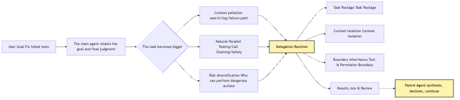
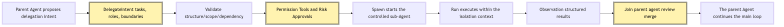
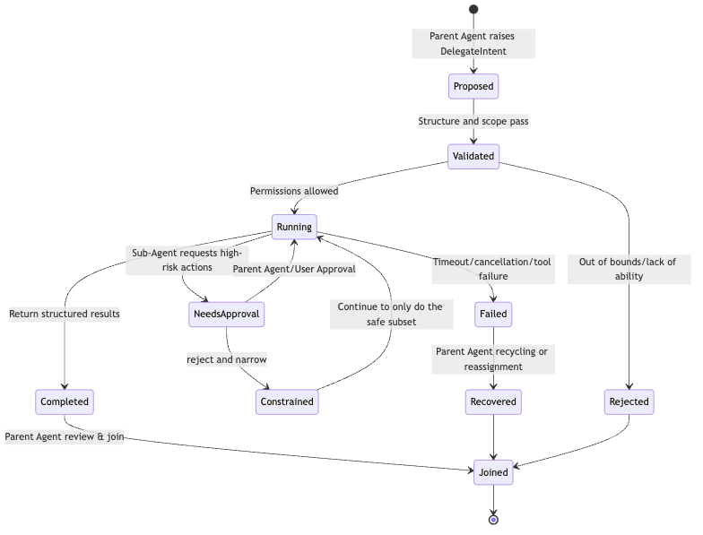
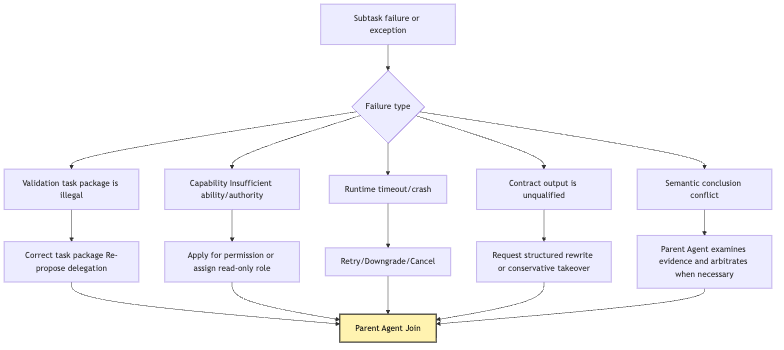

# Delegation Runtime: delegate work without losing control

At this point, our small CLI Agent is no longer just a chat-shaped model wrapper.

It can connect to providers.

It can split model output into intents.

It has a tool runtime.

It has permissions.

It can record an event log.

It knows that messages are not the source of truth.

It also knows that session replay is not rerunning the real world, but restoring explainable state from events.

Now the user gives it a slightly more realistic task:

```text
This project's tests are failing. Help me find the cause and fix it.
Also check whether any old APIs are affected.
If the change touches permission logic, run a security review too.
```

One Agent can certainly do the whole thing from beginning to end.

It can run tests first.

It can read the failure logs.

It can search the call chain.

It can edit code.

It can run tests again.

It can inspect the old API.

It can check security risks.

But three problems will show up very quickly.

The first problem is context.

Test logs, call chains, old APIs, permission logic, security checks, failure paths, and excluded paths all get stuffed into the main context. The main Agent's attention becomes more and more scattered.

It should have been deciding, "What is the smallest fix?"

Instead, the context is full of "which files did I search earlier", "which test log got truncated", and "why some unrelated module was not the root cause".

The second problem is parallelism.

Checking old API compatibility, reproducing the failing test, and inspecting permission risk do not necessarily have to happen in sequence.

If every step has to be done personally by the main Agent, the task gets slow.

Slow is not even the worst part.

Worse, in order to move faster, the main Agent may skip things that should have been independently verified.

The third problem is control.

If you hand the task to several sub-agents, it looks clever:

```text
One checks tests.
One checks the call chain.
One checks security.
One handles edits.
```

But if this only means "call a few more models", the system changes from one controllable Agent into several uncontrollable copies.

Who can edit files?

Who can run commands?

Who can access the network to read documentation?

Who can request user approval?

Who can decide the final plan?

Who is responsible for merging results back into the main line?

Which child Agent should be retried after failure, and which one should be abandoned?

If two child Agents return conflicting conclusions, which one do we believe?

If a child Agent executes a dangerous command in the background, does the parent Agent even know?

This is the problem Chapter 18 solves.

This article is not about "multi-Agent is cool".

It is not about designing a group of role-playing experts either.

It answers this question:

```text
When a task gets bigger, how do we delegate local work
while still letting the parent Agent keep control, the chain of responsibility,
and the final judgment?
```

We give this mechanism a name:

```text
Delegation Runtime
```

Its core sentence is:

```text
delegation is a kind of tool call.
a sub-agent is a controlled executor.
the parent Agent delegates local work, not final control.
```

"Control" here needs to be concrete:

```text
The parent Agent keeps final decision authority.
The parent Agent keeps the power to grant write permission and accept changes.
The parent Agent keeps join authority.
The child Agent only has the local exploration rights granted by the task package.
```

That sentence sounds a little rigid.

Let's unpack it slowly.

## Problem Chain

First, fix the problem chain for this chapter:

```text
A single Agent can complete small tasks
-> after the task grows, the main context gets polluted by exploration noise
-> some local tasks are naturally parallelizable or independently verifiable
-> directly calling more models loses tool boundaries, permission boundaries, trace boundaries, and result contracts
-> delegation must be modeled as a special tool intent
-> the parent Agent specifies the goal, context, tools, permissions, budget, and output format through a task package
-> the child Agent is a controlled executor and only returns structured observations and evidence
-> the parent Agent handles join / review and keeps final judgment and merge control
```

## 1. When tasks get bigger, the first thing a single Agent loses is the main line

Start with the example we have been using all along.

The user types this at the project root:

```text
This project's tests are failing. Help me find the cause and fix it.
```

A minimal Agent Loop will run like this:

```text
Think
-> run tests
-> observe failure
-> read file
-> search callers
-> edit file
-> run tests again
-> final
```

This flow is great for small tasks.

If the failure only lives in one file, the main Agent can finish it by itself.

But test failures in real projects are often not like this.

For example, the failure log points to:

```text
auth/session.test.ts
```

After reading it, the main Agent realizes the issue may involve three directions:

```text
session refresh logic
legacy login API compatibility
cookie / token permission boundaries
```

All three directions need investigation.

They are not even the same kind of investigation.

Checking `session refresh` is more like implementation localization.

Checking `legacy login API` is more like a compatibility audit.

Checking `cookie / token` is more like a security review.

If the main Agent does all of this personally, the main context becomes:

```text
user goal
test failure log
session.ts code
login.ts code
old API route
frontend callers
test mocks
security checklist
a pile of search results
a pile of unrelated files
several wrong assumptions
several truncated tool outputs
```

On the surface, it has more information.

In reality, its judgment space is dirtier.

Every model call has to rediscover the important parts inside this pile.

The longer the context gets, the more likely the model is to do two things:

First, forget the original user goal.

Second, mistake a local finding for a global fact.

This is a common phenomenon in complex tasks:

```text
The Agent did not fail because it did nothing.
It did too many local things and lost the main line.
```

The first layer of value in multi-Agent systems is not parallelism.

It is noise isolation.

A child Agent can go deep in one direction, search, try things, and exclude paths.

The parent Agent does not need to inherit the entire intermediate process.

The parent Agent only needs a structured conclusion:

```text
What I checked.
What I found.
Where the evidence is.
What I ruled out.
What is still uncertain.
What I recommend next.
```

This is very similar to a real team.

You do not ask a colleague to recite every `rg` command they ran in the afternoon and every failed guess.

You want them to say:

```text
I finished checking the call chain.
The old API only has two entry points.
One of them still depends on the old session shape.
The evidence is in routes/legacy-login.ts:42.
If we change session refresh, we need to preserve this field.
```

That is effective delegation.

It is not "copying brainpower outward".

It is "compressing high-noise exploration into low-noise evidence".

As a problem chain, it looks roughly like this:



Pay attention to the direction in the diagram.

The task goes out from the parent Agent.

The result returns to the parent Agent.

Control never leaves the parent Agent.

That is the main line of this article.

## 2. Treating a sub-agent as a model copy is the first multi-Agent trap

Many systems implement sub-agents very directly at first.

The pseudocode looks something like this:

```ts
async function delegate(prompt: string) {
  return provider.chat({
    messages: [
      { role: "system", content: "You are a helpful sub-agent." },
      { role: "user", content: prompt },
    ],
  });
}
```

This code looks like it works.

The parent Agent can generate a prompt:

```text
Please check whether the legacy login API is affected.
```

Then the system calls the model again.

The model returns an analysis.

The parent Agent puts that analysis back into context.

The demo feels smooth.

But this is not Delegation Runtime.

It is only a nested LLM call.

It lacks several key things.

First, it lacks a task object.

What is this delegation called?

What problem does it need to solve?

What is the completion criterion?

What is the result format?

On failure, how do we decide whether to retry, degrade, or return to the main Agent?

Second, it lacks a context policy.

Does the child Agent start from blank context, or inherit the parent context?

Which file summaries does it get?

Which event log entries does it get?

Which user constraints does it get?

Which things must it not get?

Third, it lacks tool boundaries.

Can it read files?

Can it run tests?

Can it edit files?

Can it access the network?

Can it delegate again to another sub-agent?

Fourth, it lacks permission inheritance.

Does the child Agent automatically inherit permissions already granted to the parent Agent?

If the parent Agent is in a planning phase with read-only permission, can the child Agent write files?

If the user only approved running `pnpm test auth`, can the child Agent run `rm -rf dist`?

Fifth, it lacks a result contract.

If the child Agent returns a long natural-language essay, how can the parent Agent merge it reliably?

Does it have evidence?

Does it have confidence?

Does it have suggested changes?

Does it state risks?

Does it honestly say "I did not find this"?

Sixth, it lacks trace merging.

Which files did the child Agent read?

Which commands did it run?

Which errors did it encounter?

Which parent task do its tool calls belong to?

Can the final trace show "which subtask produced this conclusion"?

Seventh, it lacks failure recovery.

What if the child Agent times out?

What if the user cancels it?

What if the result format is invalid?

What if it conflicts with another child Agent?

What if the process crashes halfway through?

If these questions are unanswered, sub-agents only look like collaboration.

When something actually goes wrong, they make the system harder to debug.

So the first principle of Delegation Runtime is:

```text
Do not treat a sub-agent as another model call.
Treat it as a kind of tool execution.
```

In other words, the `delegate` action itself still goes through the Tool Runtime's validation, permission, audit, and observation flow.

The only difference is that its executor is a controlled agent runtime.

This has very concrete implications.

Normal tool calls have intents.

Delegation must have intents too.

Normal tool calls must be validated.

Delegation must be validated too.

Normal tool calls need permissions.

Delegation needs permissions too.

Normal tool calls execute.

Delegation executes too.

Normal tool calls produce observations.

Delegation produces observations too.

Normal tool calls enter the event log.

Delegation enters the event log too.

The only difference is:

```text
The executor of a normal tool is a function, command, or MCP server.
The executor of delegation is another controlled Agent runtime.
```

As a pipeline:



This diagram intentionally looks like the Tool Invocation Pipeline.

That is the design intent.

Delegation is not a shortcut outside the tool system.

It is a special but still controlled tool inside the tool system.

## 3. Task package: the parent Agent does not send just one sentence

If delegation is a tool call, its input cannot be only a natural-language string.

It needs a task package.

The task package is not ceremony.

It exists so that the parent Agent, child Agent, permission system, event log, and reviewer all know the same thing:

```text
What exactly this delegation must accomplish,
within which boundaries,
in what format it must return,
and who is responsible for merging it.
```

A minimal task package can look like this:

```ts
type DelegationIntent = {
  id: string;
  title: string;
  parentSessionId: string;
  parentTurnId: string;
  role: "explorer" | "worker" | "reviewer" | "tester" | "security";
  objective: string;
  scope: {
    files?: string[];
    directories?: string[];
    symbols?: string[];
    commands?: string[];
  };
  contextPolicy: {
    mode: "clean" | "summary" | "fork";
    includeEvents: string[];
    includeArtifacts: string[];
    excludeSecrets: boolean;
  };
  toolPolicy: {
    allowedTools: string[];
    disallowedTools: string[];
    permissionMode: "readonly" | "default" | "ask";
  };
  outputContract: {
    format: "finding-report" | "patch-proposal" | "test-report";
    requiredFields: string[];
  };
  budgets: {
    maxTurns: number;
    maxToolCalls: number;
    timeoutMs: number;
  };
};
```

This is not a final API.

It simply writes down the questions delegation must answer.

Back to the test-fixing example.

The parent Agent wants to check old API compatibility.

If it only writes a prompt, it may look like this:

```text
Check whether the old API is affected.
```

That sentence is too loose.

A better task package should look like this:

```json
{
  "id": "check-legacy-login-compat",
  "title": "Check legacy login API compatibility",
  "role": "explorer",
  "objective": "Confirm whether the session refresh fix will break the legacy login API",
  "scope": {
    "directories": ["src/routes", "src/auth", "tests/auth"],
    "symbols": ["legacyLogin", "createSession", "refreshSession"]
  },
  "contextPolicy": {
    "mode": "summary",
    "includeEvents": ["failed-test-observation", "candidate-root-cause"],
    "includeArtifacts": ["auth-test-log"],
    "excludeSecrets": true
  },
  "toolPolicy": {
    "allowedTools": ["read_file", "search_text"],
    "disallowedTools": ["edit_file", "run_command", "network_fetch"],
    "permissionMode": "readonly"
  },
  "outputContract": {
    "format": "finding-report",
    "requiredFields": [
      "checked_paths",
      "evidence",
      "compatibility_risk",
      "recommendation",
      "unknowns"
    ]
  },
  "budgets": {
    "maxTurns": 6,
    "maxToolCalls": 20,
    "timeoutMs": 180000
  }
}
```

This task package makes several things clear.

It is not asking the child Agent to "just take a look".

It only asks the child Agent to do compatibility exploration.

It does not grant write permission.

It does not grant command-running permission.

It requires evidence in the result.

It limits the tool-call budget.

It preserves unknowns.

Unknowns matter.

Many child Agent outputs pretend to be complete.

But what the parent Agent really needs to know is:

```text
Which paths were checked.
Which paths were not checked.
Which conclusions have evidence.
Which conclusions are only guesses.
```

This is the value of the task package.

It turns "go take a look" into a verifiable unit of work.

If the child Agent returns a result without `checked_paths`, the runtime can mark the output invalid.

If the child Agent tries to call `edit_file`, permission can reject it directly.

If the child Agent exceeds `maxToolCalls`, the runtime can stop it.

If the child Agent needs to expand scope, it must send that need back to the parent Agent instead of crossing the boundary by itself.

This is the first layer of evidence that control still belongs to the parent Agent:

```text
The child Agent can only work inside the boundaries defined by the task package.
```

## 4. Context isolation: do not copy the parent Agent's whole brain

The second key issue in delegation is context.

When people think about sub-agents, they often ask:

```text
Should the child Agent see the parent Agent's full context?
```

There is no fixed answer.

The context strategy depends on the task.

There are roughly three modes.

The first is clean context.

The child Agent starts from a clean context and only receives the task package plus a small number of necessary facts.

This mode suits read-only exploration, independent review, and documentation research.

Its advantage is low noise.

It does not inherit the parent Agent's wrong assumptions.

Its disadvantage is that it may repeat investigation.

The second is summary context.

The parent Agent folds the current session into a summary aimed at the child task.

The child Agent does not see the full transcript. It only sees relevant facts, excluded paths, key files, and current assumptions.

This mode suits most engineering delegation.

It saves more repeated work than clean context.

And it is more restrained than a full fork.

The third is fork context.

The child Agent inherits the current context prefix of the parent session, then appends its own task instruction.

This mode suits parallel verification of several directions.

For example, the parent Agent already fully understands the failing test, relevant files, and candidate root causes.

It wants to verify three fix directions at the same time:

```text
Direction A: the session refresh condition is wrong.
Direction B: the test mock does not match real behavior.
Direction C: the legacy login API depends on an old field.
```

In this case, fork can reduce repeated explanation.

But fork is also riskier.

It inherits the parent Agent's bias.

If the parent Agent's candidate root cause is wrong from the start, all three forks may explore along the wrong premise.

So Delegation Runtime should not copy the full parent context by default.

It should explicitly choose a context policy.

A simple decision rule is:

```text
The child task needs an independent perspective -> clean
The child task needs the current main-line facts -> summary
The child task needs the full working scene -> fork
```

For our CLI Agent, summary is the better default.

It fits the core Harness tradeoff:

```text
Provide enough necessary facts.
Isolate intermediate noise.
Preserve the parent Agent's final synthesis authority.
```

Context isolation is closely related to session replay from Chapter 16.

If the source of truth is messages, it is hard for the parent Agent to project a clean context for the child Agent.

Because messages mix together:

```text
user messages
model reasoning traces
tool results
compressed summaries
temporary guesses
withdrawn judgments
```

If the source of truth is the event log, the runtime can project a better delegated context:

```text
relevant user goals
relevant tool observations
relevant artifacts
approved plans
current candidate root cause
risk boundaries
```

In other words:

```text
Session log is the context material library for delegation.
Delegation Runtime is one projection consumer of the session log.
```

It can be drawn like this:


There is one easy trap here.

The child Agent's full transcript should not be inserted into the parent Agent by default.

The parent Agent needs an observation.

It does not need every intermediate chat message.

If the child Agent searched 50 files, the parent Agent does not need to see the contents of 50 files.

It needs:

```text
checked_paths
evidence
excluded_paths
finding
confidence
next_step
```

The full transcript can be kept in the trace.

But the main context should only receive structured results and necessary evidence.

That is the real benefit of context isolation.

## 5. Tool inheritance: a child Agent should not automatically have all parent capabilities

The most dangerous part of delegation is not that the child Agent thinks incorrectly.

It is that the child Agent may have capabilities it should not have.

If the parent Agent is in a relatively broad permission mode, it may already be able to:

```text
read files
search code
run tests
edit files
execute shell
access MCP
```

Now it delegates a security review to a child Agent.

A security review should be read-only.

If the child Agent automatically inherits all parent tools, it may casually edit code while reviewing.

That breaks two boundaries.

First, the role boundary.

A reviewer should not become a worker.

Second, the responsibility boundary.

The parent Agent thought it was only collecting opinions, but the child Agent has already changed the workspace.

So Delegation Runtime needs explicit tool inheritance policies.

There are three common policies:

```text
intersection: child Agent tools = parent tools ∩ role-allowed tools
subset: parent Agent explicitly grants a subset of tools
isolated: child Agent uses its own fixed tool set and does not inherit parent tools
```

The safest default is intersection.

Because it satisfies two things at once:

```text
The child Agent cannot exceed the parent Agent's current permissions.
The child Agent also cannot exceed the role-defined permissions.
```

For example, the parent Agent can currently read, search, run tests, and edit.

But the `security-reviewer` role only allows reading and searching.

Then the effective tool set is:

```text
read_file
search_text
```

If the parent Agent is currently in plan mode and only allows read-only exploration:

Even if the `worker` role can usually edit, it still cannot edit now.

Because the phase the parent Agent is in does not allow side effects.

This rule is very important:

```text
The child Agent's permission ceiling cannot be higher than the parent Agent's current control plane.
```

Otherwise, delegation becomes a backdoor around permissions.

The parent Agent cannot write files during the planning phase.

So it delegates to a worker to write.

That should obviously not happen.

Similarly, if the parent Agent's network access is disabled, the child Agent cannot quietly use its own MCP server to access the network.

If the parent Agent was only approved to run `pnpm test auth`, the child Agent cannot expand that into `pnpm test -- --runInBand --updateSnapshot`.

Tool inheritance also has to handle required capabilities.

Suppose the parent Agent wants to delegate to a `test-runner`.

That role needs `run_command`.

But the current permission mode is readonly.

The runtime should not silently degrade and let the test-runner pretend it completed the task.

It should return an explainable delegation error:

```text
Cannot start test-runner:
this role requires run_command,
but the current parent session permission is readonly.
Available actions:
1. Reassign to an explorer for read-only test configuration analysis;
2. Ask the user for permission to run tests;
3. Delegate to test-runner after entering the execution phase.
```

This kind of error is not a bad thing.

It protects the system's control boundary.

## 6. Permission boundary: high-risk actions must bubble back to the parent Agent

Delegation permissions are not only about "which tools are granted".

There is a finer question:

```text
When a child Agent triggers a high-risk action, who approves it?
```

The most conservative answer is:

```text
All high-risk actions must bubble back to the parent Agent or the user.
```

The child Agent may request.

It may not approve itself.

For example, a `worker` child Agent is fixing a test and discovers that it may need to modify the database schema.

Its task package was originally only:

```text
Fix the session refresh bug in auth/session.ts.
```

Changing the schema is clearly out of scope.

The child Agent should not do it directly.

It should return a permission escalation:

```json
{
  "type": "permission_escalation",
  "reason": "The current fix may require modifying the session table structure",
  "requested_action": "edit_file: prisma/schema.prisma",
  "risk": "May affect database migrations and compatibility with old environments",
  "options": [
    "Stay within the current scope and look for a fix that does not change the schema",
    "Pause and ask the user to confirm the schema change",
    "Let the parent Agent re-plan"
  ]
}
```

Only after the parent Agent receives this does it decide:

```text
Reject the scope expansion.
Delegate a new task.
Enter planning.
Ask the user.
```

This follows the same pattern as ordinary tool permission.

The model proposes an intent.

The system checks the intent.

High-risk actions enter approval.

Execution produces an observation.

Delegation only changes "which executor proposed the intent" to the child Agent.

The permission system must not stop working because of that.

As a state machine:



In this diagram, `NeedsApproval` is crucial.

It says the child Agent is not an independent sovereign body.

It cannot approve risk inside its own little world.

Its high-risk actions must return to the main control plane.

This is the second layer of evidence that "the parent Agent does not lose control".

## 7. Result contract: the child Agent does not return an essay

One of the most common delegation failure modes is that the child Agent writes a natural-language paragraph that looks diligent but is not usable.

For example:

```text
I checked the relevant code. Overall it looks fine.
The legacy login API probably will not be affected.
I recommend continuing with the session refresh fix.
```

This paragraph has no evidence.

It does not say which paths were checked.

It does not explain the basis for "looks fine".

It does not separate facts from judgment.

If the parent Agent trusts it directly, the system becomes brittle.

So the child Agent's output must have a contract.

Different roles can have different contracts.

An `explorer` can output a finding report:

```ts
type FindingReport = {
  taskId: string;
  status: "completed" | "partial" | "blocked";
  checkedPaths: string[];
  findings: Array<{
    claim: string;
    evidence: Array<{
      file: string;
      line?: number;
      snippet?: string;
    }>;
    confidence: "low" | "medium" | "high";
  }>;
  excludedPaths: Array<{
    path: string;
    reason: string;
  }>;
  risks: string[];
  unknowns: string[];
  recommendation: string;
};
```

A `tester` can output a test report:

```ts
type TestReport = {
  taskId: string;
  command: string;
  exitCode: number;
  passed: boolean;
  failingTests: string[];
  relevantOutput: string;
  environmentNotes: string[];
};
```

A `reviewer` can output review findings:

```ts
type ReviewReport = {
  taskId: string;
  verdict: "pass" | "needs_changes" | "blocked";
  findings: Array<{
    severity: "low" | "medium" | "high";
    title: string;
    file?: string;
    line?: number;
    body: string;
  }>;
  residualRisk: string[];
};
```

These structures are not here to make the article look engineered.

They are the precondition for join.

When merging results, the parent Agent should not only ask:

```text
What did the child Agent say?
```

It should ask:

```text
What is its status?
What did it check?
Where is its evidence?
How confident is its conclusion?
Does it have unknowns?
Does it have out-of-scope requests?
Does its recommendation conflict with other results?
```

That is the meaning of the result contract.

It lets the parent Agent review instead of blindly trust.

## 8. Join / Review: the parent Agent merges evidence, not votes

Multi-Agent systems are easily misunderstood as "several Agents vote".

For example, three child Agents return:

```text
Test Agent: the fix works.
Compatibility Agent: old APIs are fine.
Security Agent: no obvious risk.
```

So the parent Agent summarizes:

```text
All three sides agree. The task is complete.
```

This is dangerous.

Agents are not a truly independent expert committee.

They may share the same wrong assumption.

They may all miss the same file.

They may also have incomplete inspection scope because the task package was poorly written.

So join is not voting.

Join is evidence merge.

The parent Agent must:

```text
Map every child result back to the user goal.
Check whether evidence covers key risks.
Check whether unknowns affect the conclusion.
Check whether results conflict with one another.
Decide whether to continue, re-delegate, ask the user, or finish.
```

Back to the test-fixing example.

Suppose three child tasks return:

```text
test-runner:
  auth tests passed
  full suite not run

legacy-api-explorer:
  checked src/routes/legacy-login.ts and tests/legacy-login.test.ts
  found one old field dependency
  recommends preserving session.legacyId

security-reviewer:
  checked token refresh and cookie flags
  unknown: did not inspect production proxy config
```

The parent Agent cannot simply say the task is complete.

It should reason:

```text
The local auth tests passed.
The old API has one compatibility constraint, so the fix must not remove legacyId.
The security review did not find direct risk, but production proxy config was not covered.
Next steps should be:
1. preserve legacyId;
2. run legacy login tests;
3. state in the final answer that proxy config was not inspected, or delegate one more read-only task to check deployment config.
```

The result of join may be another delegation.

It may be narrowing the change.

It may be asking the user a question.

It may be deciding that the evidence is sufficient.

This step must be done by the parent Agent.

Because the parent Agent holds the full user goal, current plan, permission context, and final output responsibility.

This is also the difference between Delegation Runtime and handoff.

`delegation` means:

```text
The parent Agent calls a child Agent to complete a local task.
The child Agent returns a result.
The parent Agent remains responsible for the main line.
```

`handoff` means:

```text
The subject of the current task changes.
Control is handed to another Agent.
It is responsible for subsequent turns.
```

This article is about delegation.

Not handoff.

If the user only asked us to fix tests, and halfway through we discover that we need to design an entire SSO system, that may be a handoff.

But checking old APIs, running tests, and reviewing security are better suited to delegation.

Because the main line is still:

```text
Fix the failing tests in the current project.
```

## 9. Trace merge: the child Agent's trail must return to the parent task

Chapter 16 said that the source of truth for long tasks should be the event log.

Delegation Runtime must write to the event log too.

Otherwise, the moment multi-Agent appears, the trace breaks apart.

The parent Agent's trace would only show:

```text
delegated to security-reviewer
security-reviewer says OK
```

That is not enough.

A real trace should at least answer:

```text
Why did the parent Agent delegate this task?
What was the task package?
Which context projection did the child Agent receive?
Which tools did it use?
Which tools were rejected?
What structured result did it return?
How did the parent Agent join it?
Which child results did the final decision cite?
```

So the event log can contain events like this:

```ts
type DelegationEvent =
  | { type: "delegation.proposed"; intent: DelegationIntent }
  | { type: "delegation.validated"; taskId: string }
  | { type: "delegation.started"; taskId: string; agentId: string }
  | { type: "delegation.tool_event"; taskId: string; eventId: string }
  | { type: "delegation.permission_escalated"; taskId: string; request: unknown }
  | { type: "delegation.completed"; taskId: string; result: unknown }
  | { type: "delegation.failed"; taskId: string; error: unknown }
  | { type: "delegation.joined"; taskId: string; decision: unknown };
```

Notice `delegation.tool_event`.

The child Agent's tool events should not be lost.

But they also should not all pollute the parent Agent messages.

They should enter the trace and be projected into the parent context through observations.

This is the division of labor between trace and context:

```text
trace stores complete auditable facts.
context only projects the facts needed for the current decision.
```

If something goes wrong later, such as the user asking:

```text
Why did you say the old API was not affected?
```

The system should be able to return to the trace and find:

```text
Which files legacy-api-explorer checked.
What its evidence was.
Whether it had unknowns.
Whether the parent Agent ignored those unknowns during join.
```

If the answer is:

```text
The child Agent did not check a certain path because the task package scope missed it.
```

Then that is a task package design problem.

If the answer is:

```text
The child Agent found a risk, but the parent Agent did not adopt it during join.
```

Then that is a join/review problem.

If the answer is:

```text
The child Agent requested out-of-scope permission, and permission approved it incorrectly.
```

Then that is a permission governance problem.

Without trace merge, all these problems collapse into:

```text
The model judged incorrectly.
```

That is too coarse.

The goal of a Harness is to make failures attributable.

Delegation Runtime must keep the same discipline.

## 10. Failure recovery: child Agent failure is not parent task failure

In real delegation, child Agents fail often.

They may time out.

They may hit the budget limit.

They may return an invalid format.

They may encounter permission denial.

They may find no evidence.

They may conflict with another child Agent.

They may be canceled halfway through execution.

These failures should not automatically crash the main task.

Delegation Runtime needs to classify failures.

The common classes can be grouped into five types.

The first is validation failure.

The task package is invalid.

For example, the role does not exist, scope is empty, or the output contract is missing fields.

This failure should be blocked before startup.

The second is capability failure.

The tools required by the role are currently unavailable.

For example, test-runner needs `run_command`, but the current mode is readonly.

This failure should return to the parent Agent so it can reassign, request permission, or postpone.

The third is runtime failure.

The child Agent times out, crashes, or hits a model error during execution.

This failure can be retried, or degraded into a partial result.

The fourth is contract failure.

The child Agent returns natural language but does not satisfy the output contract.

This failure can ask it to correct the output, or hand the transcript to the parent Agent for conservative handling.

The fifth is semantic conflict.

Multiple child results conflict.

For example, legacy-api-explorer says the old API is fine, while reviewer says the old API has compatibility risk.

This is not a technical error.

It requires the parent Agent to re-review evidence and, if necessary, delegate an arbitration task.

The key point of failure recovery is:

```text
The main task state cannot simply equal the sum of child task states.
```

One child task can fail while the main task continues.

One child task can succeed while the main task is still incomplete.

The parent Agent chooses the next action based on failure type.

A decision path can be drawn like this:



The most important part here is `Parent Agent Join`.

Whether the child task succeeds or fails, control returns to the parent Agent's main loop.

The parent Agent decides the next step.

The child Agent does not decide the fate of the main task by itself.

## 11. Minimum implementation: make delegation a special tool

Now compress the previous mechanisms into a minimal implementation.

We will not build a complete multi-Agent platform.

We will not build teams, mailboxes, remote agents, or A2A.

We only build a minimal Delegation Runtime:

```text
The parent Agent can call delegate_task.
delegate_task receives a structured task package.
runtime validates the task package and permissions.
runtime creates an isolated child context.
the child Agent executes within a restricted tool set.
the result returns according to the contract.
the parent Agent reviews and continues the loop.
all events enter the session log.
```

The tool definition can look like this:

```ts
const delegateTaskTool = defineTool({
  name: "delegate_task",
  description: "Run a bounded sub-agent task and return a structured result.",
  inputSchema: DelegationIntentSchema,
  async execute(intent, runtime) {
    const validated = validateDelegationIntent(intent, runtime.state);
    const permission = await checkDelegationPermission(validated, runtime.permission);

    if (!permission.allowed) {
      return delegationObservation({
        status: "rejected",
        reason: permission.reason,
        suggestedActions: permission.suggestedActions,
      });
    }

    const childContext = buildChildContext({
      parentLog: runtime.eventLog,
      policy: validated.contextPolicy,
      intent: validated,
    });

    const childTools = resolveChildTools({
      parentTools: runtime.tools,
      role: validated.role,
      toolPolicy: validated.toolPolicy,
      permissionMode: permission.childPermissionMode,
    });

    const childRun = await runtime.subAgentRunner.run({
      intent: validated,
      context: childContext,
      tools: childTools,
      outputContract: validated.outputContract,
      budgets: validated.budgets,
    });

    return normalizeDelegationResult(childRun, validated.outputContract);
  },
});
```

Several details in this pseudocode are important.

`validateDelegationIntent` catches errors before startup.

Do not wait until the child Agent is running to discover that the task package lacks scope.

`checkDelegationPermission` brings delegation into the permission system.

It is not an ordinary internal call.

It may start a new model, read files, and execute tools, so it must be approved.

`buildChildContext` projects context from the event log.

It does not copy messages directly.

`resolveChildTools` handles tool inheritance and role pruning.

The child Agent receives a restricted tool set.

`subAgentRunner.run` is the controlled executor.

It must have budgets, abort, trace, and lifecycle management.

`normalizeDelegationResult` turns the result into an observation.

The parent Agent sees structured results, not a raw transcript.

If we plug this structure back into the Agent Loop, the flow looks roughly like this:

```ts
while (!state.done) {
  const modelEvent = await provider.next(projectContext(state));

  if (modelEvent.type === "delegate_intent") {
    const observation = await toolRuntime.execute({
      toolName: "delegate_task",
      input: modelEvent.intent,
    });

    state = appendObservation(state, observation);
    continue;
  }

  if (modelEvent.type === "tool_intent") {
    const observation = await toolRuntime.execute(modelEvent.intent);
    state = appendObservation(state, observation);
    continue;
  }

  if (modelEvent.type === "final") {
    state.done = true;
  }
}
```

Do you see it?

`delegate_intent` and `tool_intent` look very similar inside the loop.

That is what this chapter has been emphasizing:

```text
delegation is a kind of tool call.
```

## 12. A complete test-fix chain: how the parent Agent delegates work while keeping control

Finally, connect everything with a complete example.

The user enters:

```text
This project's tests are failing. Help me find the cause and fix it.
Also confirm that old APIs and permission logic are not broken.
```

The parent Agent does not rush to delegate a worker in the first turn.

It first runs the smallest test:

```text
pnpm test auth
```

The observation says:

```text
auth/session.test.ts fails:
expected refresh token to keep legacy session id
received undefined
```

The parent Agent reads `src/auth/session.ts` and forms a candidate root cause:

```text
Recent session refresh rebuilds the session object,
but does not preserve legacyId.
```

At this point it could keep investigating by itself.

But the task has already split into three directions:

```text
Confirm whether the legacy API depends on legacyId.
Confirm which fields the smallest fix should preserve.
Confirm whether permission and token security boundaries are affected.
```

The parent Agent proposes three delegation intents.

The first:

```text
legacy-api-explorer
read-only search over src/routes and tests/auth
output checked_paths, evidence, compatibility_risk
```

The second:

```text
patch-planner
read-only analysis of the smallest session refresh fix point
output a patch proposal, without editing files directly
```

The third:

```text
security-reviewer
read-only check of cookie flags, token reuse, and permission boundaries
output review findings and unknowns
```

The runtime validates three things:

```text
Whether the current phase allows delegation.
Whether each role's tool set stays inside parent permissions.
Whether the context projection excludes secrets.
```

The three child Agents run.

The parent Agent is not disconnected while waiting.

It knows the task ids:

```text
task-legacy-api
task-patch-plan
task-security-review
```

It can see statuses:

```text
running
completed
blocked
```

After results return, the parent Agent joins them.

legacy-api-explorer returns:

```text
legacy login still reads session.legacyId.
Evidence: src/routes/legacy-login.ts
Recommendation: refreshSession should preserve legacyId.
```

patch-planner returns:

```text
The smallest change is to spread preservedFields in rebuildSession.
Do not rewrite createSession.
```

security-reviewer returns:

```text
No new token reuse risk found.
unknown: production proxy cookie rewrite was not inspected.
```

After merging, the parent Agent makes an execution decision:

```text
Modify refreshSession and preserve legacyId.
Do not change the schema.
Do not change token generation logic.
After editing, run auth and legacy-login tests.
State in the final answer that proxy rewrite was outside this check.
```

Then the parent Agent proposes the edit intent itself.

Tool Runtime validates, checks permission, executes, and observes.

After tests pass, the parent Agent can delegate one more reviewer:

```text
review whether the diff only touches session refresh,
and whether it satisfies the legacyId preservation goal.
```

The reviewer reads the diff only.

It returns pass or findings.

The parent Agent finally reports:

```text
What was fixed.
Why it was changed this way.
Which tests passed.
Which risks were checked.
Which scopes were not covered.
```

In this chain, child Agents did a lot of work.

But control always stayed with the parent Agent.

The parent Agent decided what to delegate.

The parent Agent decided how much context to provide.

The parent Agent decided which tools to grant.

The parent Agent reviewed results.

The parent Agent merged evidence.

The parent Agent executed the final modification.

The parent Agent remained responsible to the user.

That is the full flavor of Delegation Runtime.

## 13. Common bad smells: when these appear, control is leaking

When writing a Delegation Runtime, several bad smells are obvious.

The first is that the child Agent can freely choose tools.

If the task package says "check security risk", but the child Agent decides by itself whether to edit, run shell, or access the network, that is not delegation.

That is handing over permissions.

The second is that the child Agent transcript is inserted directly into the main context.

This looks transparent, but it pollutes the main line.

The full transcript should go into trace.

The main context should receive a structured observation.

The third is that the parent Agent does not join and only relays the child Agent's conclusion.

This turns the parent Agent into a message forwarder.

A real parent Agent reviews evidence, handles conflicts, and decides the next step.

The fourth is that the child Agent can recursively delegate without limit.

Recursive delegation quickly goes out of control without depth, budget, and permission inheritance.

By default, child Agents should not spawn more Agents.

If allowed, there must be a clear depth limit and parent approval.

The fifth is that all child Agents are workers.

If explorer, reviewer, tester, and security can all write files, they are only full-permission copies with different names.

Roles are meaningless unless they map to tool boundaries.

The sixth is that failure is wrapped as success.

The child Agent cannot find evidence, so it writes "no issue found".

That is dangerous.

"Not found" is not the same as "does not exist".

The output contract must allow:

```text
partial
blocked
unknown
out_of_scope
```

The seventh is no trace merge.

When something goes wrong, the only thing visible is "some child Agent said this".

That means delegation has not truly entered the Harness.

It is only a UI feature.

## 14. Boundaries: when not to use delegation

Delegation Runtime is useful.

But not every task should be split out.

Do not delegate very small tasks.

For example, if a test fails and the root cause is in one assertion.

Delegating to three child Agents only adds overhead.

Do not freely parallelize highly coupled write tasks.

For example, several Agents editing the same file at the same time.

Unless the runtime has strong conflict management, it is better for the parent Agent to execute serially.

Do not delegate tasks that lack a result contract.

If you cannot say what the child Agent should return, do not delegate yet.

It will probably return unverifiable natural language.

Do not delegate tasks with unclear permission boundaries.

If you do not know whether the child Agent can write, run commands, or access the network, define the role and tool boundaries first.

Tasks that require continuous multi-turn ownership of the user's intent are not necessarily delegation.

They may be handoff.

For example, the user switches from "fix tests" to "help me design a unified company SSO integration plan".

At that point it is better to admit that the task subject has changed.

Do not keep pretending everything is a subproblem of the current test-fixing task.

The boundary of Delegation Runtime can be compressed into one sentence:

```text
Use delegation when the task still belongs to the current goal, but local exploration, verification, or review can be isolated.
Only consider handoff when the subject of the task changes and another Agent needs to own it continuously.
```

## 15. Relationship to previous and next chapters

Chapter 16 covered Session Replay.

It solves:

```text
Where is the source of truth for long tasks?
How do we recover after failure?
Why are messages only projections?
```

Delegation Runtime directly depends on it.

Because subtasks, child contexts, child traces, and child results must all be written back to the event log.

Without an event log, delegation is hard to recover and hard to attribute.

If Chapter 17 covers Capability Discovery / Skills / MCP, it solves:

```text
What capabilities does the system have?
Which capabilities come from skills?
Which capabilities come from MCP?
How are these capabilities discovered, declared, and constrained?
```

Delegation Runtime consumes these capabilities.

Because the roles and tool boundaries of child Agents eventually have to land on the capability registry.

Whether a `security-reviewer` can use a certain MCP security scanner should not be guessed from a prompt.

It should come from capability declarations, permission policies, and task package scope.

Chapter 18 itself solves:

```text
How tasks are delegated,
how context is isolated,
how permissions are inherited,
how results are merged,
and how failures are recovered.
```

After this, the system will grow more production-oriented mechanisms.

For example, trace analysis.

Because as soon as multi-Agent appears, failure attribution becomes more complex.

You need to answer:

```text
Did the parent Agent split the task incorrectly?
Did the child Agent inspect the wrong evidence?
Was the permission policy too broad?
Did join ignore unknowns?
Was the output contract too loose?
```

Memory governance will also appear.

Because not every finding from a child Agent should enter long-term memory.

Some are temporary facts for this task.

Some are reusable project knowledge across sessions.

Delegation Runtime is not the end.

It is the beginning of upgrading an Agent from "single-threaded work" to "organizing controlled local work".

## 16. Minimum memory point

Multi-Agent is not more models.

Multi-Agent is more coordination problems.

Delegation Runtime does not solve:

```text
How do we make several Agents chat together?
```

It solves:

```text
How do we hand local tasks to controlled executors,
while the parent Agent keeps the goal, permissions, state, evidence merge, and final responsibility?
```

If you only remember one sentence, remember this:

```text
delegation is a kind of tool call;
the parent Agent delegates work, not control.
```

When you understand delegation this way, many design choices naturally fall into place:

```text
The task package is not prompt decoration, but an execution contract.
Context isolation is not token saving, but main-line protection.
Tool inheritance is not default copying, but a permission intersection.
The result contract is not format obsession, but the prerequisite for join.
Trace merge is not log showmanship, but the foundation of failure attribution.
Failure recovery is not an optional resilience feature, but a basic duty of long-task runtime.
```

At this point, our small CLI Agent can delegate work.

But it has not truly entered production yet.

Because once tasks are delegated, extended, recovered, and reviewed, another question becomes increasingly obvious:

```text
When the system fails, how do we locate which mechanism broke from the fact log?
```

This takes us to the next group of articles:

```text
Trace Analysis.
```

That is how the Harness becomes not only capable of running, but capable of explaining why it ran wrong.

---

GitHub source: [00-18-delegation-runtime-control.md](https://github.com/LienJack/build-harness/blob/main/docs/en/00-18-delegation-runtime-control.md)
