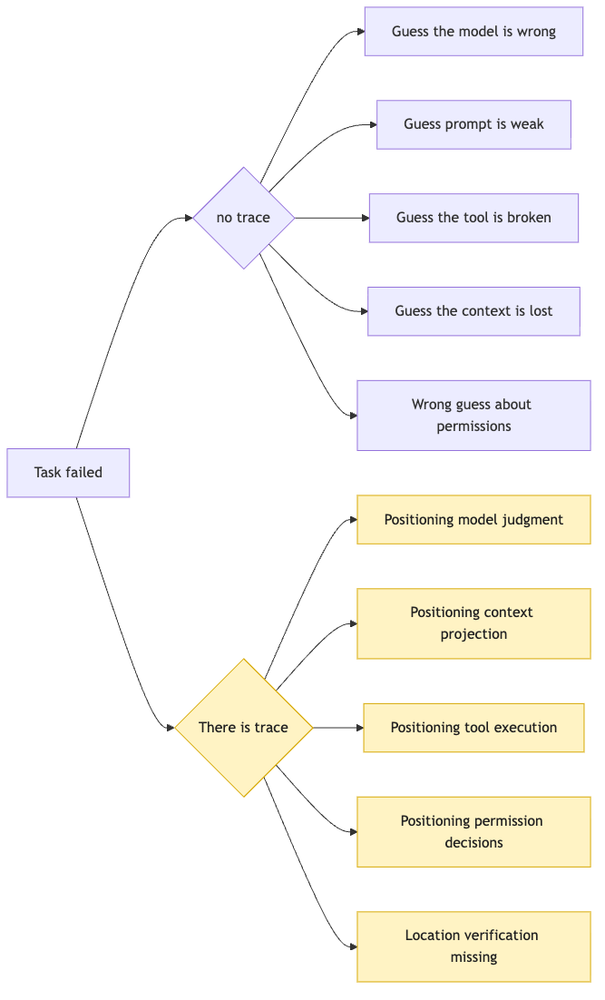
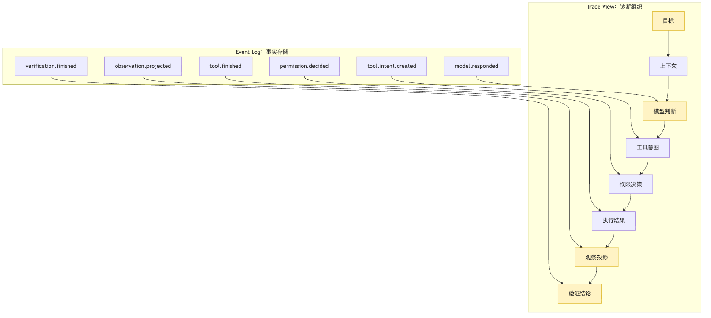
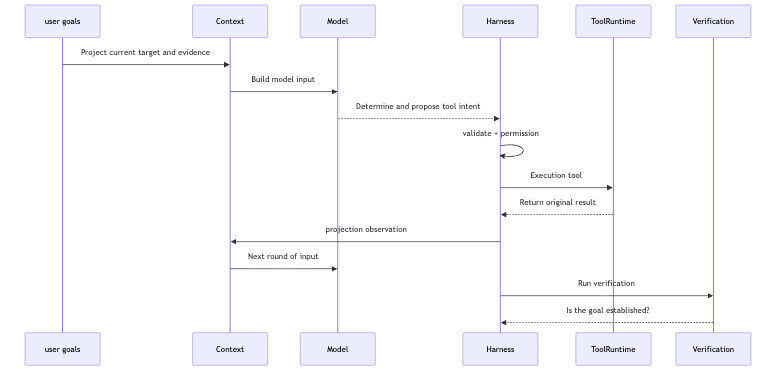
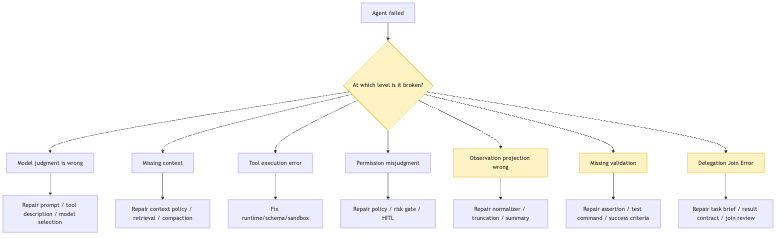
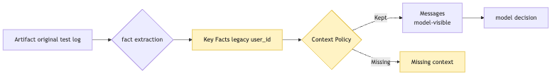

# Trace Analysis: locating Agent failures with fact logs

The previous chapters gradually pushed a small CLI Agent into a more realistic position.

It is no longer just a single model call.

It has a provider.

It has a loop.

It has a core kernel.

It separates intent from execution.

It has a tool runtime.

It has permissions.

It knows that messages are not the source of truth.

It can persist a session event log.

It can also delegate local tasks to sub-agents and merge child traces back into the parent task.

This already sounds a lot like a working system.

But once you put it into a real project, you will quickly run into a new problem.

The user says:

```text
This project's tests are failing. Help me find the cause and fix it.
```

The Agent runs for a while.

It reads files.

It runs tests.

It edits code.

It runs tests again.

Finally it says:

```text
I have fixed the failing tests.
```

But the user reruns the tests, and they still fail.

Now you need to investigate.

Without trace, you can only guess:

```text
Did the model judge incorrectly?
Did the tool fail to execute?
Was a key log missing from context?
Did permission block the wrong thing?
Was the observation written incorrectly?
Did the test command run in the wrong directory?
Was a sub-agent conclusion merged incorrectly?
```

Any of these guesses may be right.

Any of them may also be wrong.

The worst part is that you often collapse all failures into one sentence:

```text
The model is not smart enough.
```

That sentence is convenient.

But it has almost no engineering value.

Because if the real problem is in permissions, tool runtime, context projection, verification, or delegation join, changing the model will not fix the system at the root.

Chapter 16 already said:

```text
Session log is the source of truth.
Messages are only projections.
Replay is not rerunning the real world, but restoring explainable state.
```

Chapter 18 went one step further:

```text
Child Agent traces must merge back into the parent task.
The parent Agent delegates local work, not control.
```

This chapter solves the next layer of the problem:

```text
Once we have fact logs, how do we organize them into traces that can locate failures?
```

Notice the two words in that question.

One is "fact".

The other is "locate".

A fact log only guarantees that the system has not completely lost its memory.

Trace Analysis arranges facts into a diagnosable causal chain.

It is not making logs prettier.

It is not adding a few lines of `console.log` to every function.

It answers:

```text
When this Agent failed, exactly which layer broke?
```

The core sentence of this chapter is:

```text
Event log records what happened.
Trace organizes why it happened this way.
Trace Analysis attributes failures to model, context, tool, permission, observation, verification, or delegation boundaries.
```

If you only remember one distinction, remember this:

```text
Logs tell you "what happened".
Trace tells you "which chain of responsibility broke".
```

We will use the same CLI Agent example of fixing failing tests.

This time, we no longer only care whether it can finish.

We care about:

```text
When it goes wrong, can the system explain the error clearly?
```

## Problem Chain

First, let us pin down the problem sequence for this chapter:

```text
After an Agent fails, looking only at the final transcript compresses the problem into "the model was wrong"
-> session log records facts, but it is not yet a diagnostic view
-> trace links goal, context, model decision, intent, permission, execution, observation, and verification into a causal chain
-> Trace Analysis attributes failure to model, context, tool, permission, observation, verification, or delegation boundaries based on evidence
-> failure classes must point to repair routes, not just labels
-> before attribution, first confirm whether the model saw the key fact at the time
-> diagnostic reports should preserve evidence references, impact analysis, and repair suggestions
-> these failure samples eventually enter eval and regression tests
```

## 1. Without trace, failure gets compressed into "the model was wrong"

Start with a very common failure context.

The user gives the CLI Agent a task:

```text
This project's tests are failing. Help me find the cause and fix it.
```

The Agent runs tests in the first round.

The test output contains a key error:

```text
TypeError: expected user.id to be string, received number
```

After seeing the log, the model judges that the problem is in `src/auth/session.ts`.

It reads the file.

It modifies `normalizeUser`.

It runs the test again.

The test still fails.

But the failure reason has changed:

```text
legacy login should preserve numeric user_id for v1 API
```

The Agent does not notice the change.

It keeps editing around the `user.id` type.

Finally it outputs:

```text
Fixed auth session tests.
```

But the tests did not pass.

Now we need to analyze.

If you only have the final transcript, you may see:

```text
The model read session.ts.
The model edited normalizeUser.
The model said the tests were fixed.
```

That information is far too coarse.

It cannot answer:

```text
Did the model see the second test failure?
Was the second test failure truncated?
Did verification correctly read the exit code?
Did the model merge two different failures into one?
Did tool execution actually succeed?
What was the modification diff?
Did any sub-agent discover legacy API risk?
Did the parent Agent ignore this unknown during join?
```

Without trace, debugging becomes mind reading.

You can only look at the final output and imagine what happened inside the model.

But the engineering goal of an Agent Harness is not mind reading.

Its goal is to leave evidence at every important boundary.



The most important part of this diagram is not that there are more nodes on the right.

The truly important part is that the branching style changes.

Without trace, failure analysis works backward from conclusion to cause.

With trace, failure analysis follows the fact chain and looks for the broken point.

These are completely different working modes.

The former depends on experience.

The latter depends on evidence.

Experience is valuable, of course.

But a production-grade Harness cannot require someone familiar with the system to guess correctly during every incident.

It should organize failure contexts into traces that can be replayed, compared, and turned into evals.

Then when the same kind of failure appears again, the system has not merely "failed one more time".

It has gained another learnable sample.

## 2. Session log is the source of truth, but it is not yet a diagnostic view

Chapter 16 already laid the foundation for the source of truth.

Long tasks cannot only save messages.

They need to save an event log.

A test-fixing task might contain events like:

```text
session.started
user.message.created
model.requested
model.responded
tool.intent.created
permission.decided
tool.started
tool.finished
observation.projected
context.projected
verification.started
verification.finished
session.completed
```

This is already much stronger than a chat transcript.

But when you open an event log, you will find that it is still not the same thing as trace analysis.

The reason is simple.

Event log is for preserving facts.

Trace is for diagnostic reading.

Fact preservation asks:

```text
Are events complete?
Is the ordering stable?
Are artifacts traceable?
Are side effects recorded?
Can state be reconstructed during recovery?
```

Diagnostic reading asks:

```text
What was the goal?
What context did the model base its judgment on?
What intent did it propose?
Why did the system allow or deny it?
What did the tool actually do?
Did the observation faithfully represent the result?
What did the model see on the next round?
Did verification actually verify the goal?
Which layer ultimately owns the failure?
```

These two concerns depend on each other, but they are not the same thing.

An event log can be complete and still hard to read.

For example, it may record thousands of events in time order.

Every event has `id`, `seq`, `ts`, and `payload`.

But when debugging a failure, you do not want to read from the first line to the last.

You first want to see one responsibility chain:

```text
Goal
-> Context Snapshot
-> Model Judgement
-> Tool Intent
-> Permission Decision
-> Execution Result
-> Observation
-> Next Context Projection
-> Verification
-> Outcome
```

That is the first purpose of trace.

It organizes low-level events into a chain of "how one decision led to one action, and how one action led to the next judgment".



There is one key boundary in this diagram:

```text
event log is the input.
trace view is a projection.
```

Just as messages are a projection for the model.

Trace is a projection for diagnostic systems and developers.

The same event log can generate many trace views.

For example:

```text
trace aggregated by tool call.
trace aggregated by model turn.
trace aggregated by permission decision.
trace aggregated by delegation task.
trace aggregated by verification assertion.
trace aggregated by failure taxonomy.
```

That is why trace analysis should not be hard-coded into the log-writing layer.

The session store is responsible for storing facts.

The trace projector is responsible for organizing diagnostic views.

The trace analyzer is responsible for attribution and suggestions.

Once these three layers are separated, the system becomes more stable.

Because later, if you want to change the trace UI, add failure classes, or generate eval samples, you do not need to change the fact log format.

As long as the underlying events are complete enough, new diagnostic views can keep growing.

## 3. A diagnosable trace must connect at least eight boundaries

Do not start with a complex UI.

Look only at the minimal data structure.

To locate Agent failures, a trace must at least connect eight boundaries:

```text
goal
model judgment
tool intent
permission
execution
observation
context projection
verification
```

These eight boundaries are not arbitrary.

They correspond to the full load-bearing chain from "wanting to act" to "acting and verifying".

If the user goal is missing, the system does not know what success means.

If model judgment is missing, the system does not know why a certain action was proposed.

If tool intent is missing, the system does not know what the model wanted to do.

If the permission decision is missing, the system does not know why the action was allowed or denied.

If the execution result is missing, the system does not know what happened in the real world.

If observation is missing, the system does not know what the model saw on the next round.

If context projection is missing, the system does not know whether key facts entered context.

If verification is missing, the system does not know whether final success was proven.

So a trace span is not "randomly recording a duration".

It should carry a responsibility boundary.

A simplified trace object can be designed like this:

```ts
type TraceRun = {
  runId: string;
  sessionId: string;
  goal: GoalSnapshot;
  turns: TraceTurn[];
  outcome: TraceOutcome;
};

type TraceTurn = {
  turnId: string;
  contextSnapshotId: string;
  visibleToolsHash: string;
  modelDecision: ModelDecisionTrace;
  actions: ActionTrace[];
  verification?: VerificationTrace;
};

type ActionTrace = {
  intent: ToolIntentTrace;
  permission: PermissionTrace;
  execution: ExecutionTrace;
  observation: ObservationTrace;
  causation: {
    modelResponseEventId: string;
    toolIntentEventId: string;
    toolFinishedEventId?: string;
  };
};
```

This structure is not a standard answer.

It only expresses one thing:

```text
trace should be organized around decision chains, not around the fields of some logging library.
```

Many systems initially implement trace as:

```text
span name
start time
end time
status
attributes
```

These fields are useful, of course.

They help you inspect latency, errors, cost, and call relationships.

But Agent failure analysis needs more semantics.

For example, a tool call returning successfully does not mean the Agent's decision was correct.

A model call without an exception does not mean the model judgment was valid.

A verification command executing successfully does not mean it verified the user goal.

So trace must preserve "what responsibility this step carried in task semantics".

Otherwise it can only tell you where the system was slow.

It cannot tell you where the system was wrong.



This diagram can serve as the backbone of Trace Analysis.

Whenever an Agent fails, we ask along this chain:

```text
Was the goal preserved correctly?
Did the context give the model the necessary facts?
Was the model judgment consistent with the facts?
Was the intent structured and executable?
Did permission make the right decision?
Did the tool execution actually complete?
Did the observation faithfully project the result?
Did verification prove the user goal?
```

After these eight questions are asked, many conclusions of "the model is bad" get split apart.

It may indeed be a model judgment error.

But it may also be a more specific Harness problem.

That is the value of trace analysis.

It is not trying to prove the model innocent.

It is rejecting sloppy attribution.

## 4. What a trace for fixing failing tests should look like

Now bring the abstract chain back to our CLI Agent.

The user goal is:

```text
Fix the failing tests in the current project.
```

A simplified but diagnosable trace may unfold like this:

```text
Run 00-19-auth-test-fix

Goal:
  Fix the failing test in auth/session.test.ts and confirm related regressions pass.

Turn 1:
  Context:
    project root, package scripts, user goal
  Model:
    need to run tests first to obtain facts
  Intent:
    bash: pnpm test auth/session.test.ts
  Permission:
    allow read/process, no external side effect
  Execution:
    exitCode=1, stderr artifact=test-output-001.txt
  Observation:
    TypeError: expected user.id to be string, received number

Turn 2:
  Context:
    failure log summary, candidate related files
  Model:
    read session normalizer
  Intent:
    read: src/auth/session.ts
  Permission:
    allow read
  Execution:
    ok, artifact=session-ts-002.txt
  Observation:
    normalizeUser preserves numeric id

Turn 3:
  Context:
    session.ts snippet, test failure summary
  Model:
    modify normalizeUser to convert id into string
  Intent:
    edit: src/auth/session.ts
  Permission:
    allow workspace edit
  Execution:
    ok, artifact=patch-003.diff
  Observation:
    edit complete

Turn 4:
  Context:
    patch summary, original failure summary
  Model:
    rerun tests
  Intent:
    bash: pnpm test auth/session.test.ts
  Permission:
    allow
  Execution:
    exitCode=1, artifact=test-output-004.txt
  Observation:
    legacy login should preserve numeric user_id for v1 API

Turn 5:
  Context:
    second failure summary
  Model:
    incorrectly judges that this is still the user.id string problem
  Intent:
    edit: src/auth/session.ts
  Permission:
    allow
  Execution:
    ok
  Observation:
    edit complete

Verification:
  command: pnpm test auth/session.test.ts
  exitCode: 1
  outcome: failed
```

This trace already reveals an important fact:

```text
The error type changed on the second failure.
```

If observation and context projection are both correct, the model should realize that the root cause has entered another branch:

```text
numeric user_id for old API compatibility
```

But Turn 5 still edits around the old direction.

This may be a model judgment error.

It may also be that context projection did not emphasize "the error changed".

It may also be that the observation summary made the second failure look too similar to the first.

The trace analyzer cannot immediately decide by intuition.

It must inspect more events:

```text
What was the raw log in test-output-004.txt?
What did observation.projected write?
What did the context.projected messages contain?
What was in the model.responded reasoning summary or decision note?
Did verification.finished preserve exitCode=1?
```

This is where trace becomes valuable.

Debugging no longer means "read the whole chat transcript".

It means narrowing scope layer by layer along responsibility boundaries.

## 5. Failure Taxonomy: failure classes are repair routes, not labels

Trace Analysis needs failure classes.

Otherwise it can only generate a pile of natural-language summaries.

The goal of failure classification is not to put a pretty label on an incident.

Its goal is to decide where to repair next.

For an Agent Harness, at least seven common failure classes are needed:

```text
model_judgement_error: model judged incorrectly
context_missing: context was missing
tool_execution_error: tool execution was wrong
permission_misclassification: permission was misclassified
observation_projection_error: observation projection was wrong
verification_missing: verification was missing
delegation_join_error: delegation join was wrong
```

These seven classes cover the core boundaries we have built so far.

They also correspond to different repair methods.

If the model judged incorrectly, you may need to change prompts, tool descriptions, few-shots, model selection, or task decomposition.

If context was missing, you may need to change context policy, retrieval, compaction, or artifact projection.

If tool execution was wrong, you may need to change the tool runtime, sandbox, cwd, timeout, or parameter schema.

If permission was misclassified, you may need to change policy, risk classification, or human-in-the-loop.

If observation projection was wrong, you may need to change the result normalizer, truncation strategy, summary template, or error fidelity.

If verification was missing, you may need to change the verification plan, assertions, test commands, or success criteria.

If delegation join was wrong, you may need to change the task brief, result contract, join policy, or review gate.



The most important part of this diagram is the repair route on the right.

If a class cannot guide repair, it is log decoration.

For example, if a failure is classified as:

```text
model_reasoning_error
```

The system should be able to provide evidence:

```text
The model saw the full failure log.
The log clearly showed a legacy API constraint.
The tool description did not mislead it.
The context was not truncated.
The model still chose a change that contradicted the evidence.
```

Only then does it deserve to say the model judged incorrectly.

If the evidence chain is incomplete, it should conservatively output:

```text
unknown or mixed failure
```

In engineering, conservative attribution is more important than confident misclassification.

Wrong attribution sends optimization in the wrong direction.

For example, verification did not run, but the system says the model is bad.

The team may spend days tuning prompts.

The real bug was that the test command kept running in the wrong directory.

The mission of Trace Analysis is to reduce this kind of waste.

## 6. Model judgment error: first prove the model saw enough facts

"The model judged incorrectly" is the easiest class to say out loud.

But it should be one of the last classes to confirm.

Because model judgment depends on input.

If the input is incomplete, the wrong judgment is not entirely the model's responsibility.

Back to the test-fixing example.

After the second test failure, the raw log contains:

```text
legacy login should preserve numeric user_id for v1 API
```

If the model saw this sentence on the next turn and still insisted on converting all ids into strings, then it probably judged incorrectly.

But if context projection only gave it:

```text
auth session test still failing
```

Then the model never had a chance to make the right judgment.

So before classifying a model error, the trace analyzer must at least check:

```text
Did the key fact exist in an artifact?
Did the key fact enter the observation?
Did the key fact enter context projection?
Did the model response cite or ignore the key fact?
Did the proposed intent contradict visible facts?
```

A plain attribution function can express this:

```ts
function classifyModelError(trace: TraceTurn): FailureFinding | null {
  const facts = trace.verification?.failureFacts ?? [];
  const visible = trace.context.visibleFacts;
  const decision = trace.modelDecision;

  const missingFacts = facts.filter((fact) => !visible.includes(fact.id));

  if (missingFacts.length > 0) {
    return null;
  }

  if (contradicts(decision.intent, facts)) {
    return {
      type: "model_judgement_error",
      evidence: [
        decision.eventId,
        ...facts.map((fact) => fact.artifactRef),
      ],
      confidence: "medium",
    };
  }

  return null;
}
```

The key point in this code is not how `contradicts` is implemented.

The key point is the order of checks:

```text
First confirm that the model saw the facts.
Then judge whether the model contradicted the facts.
```

Many Agent incidents fail at the first step.

The model did not fail because it does not know how to fix the issue.

It simply did not see the information needed to fix it.

That is the difference between Trace Analysis and ordinary chat review.

Ordinary review asks:

```text
Why did the model think this?
```

Trace Analysis first asks:

```text
What exactly did the system let the model see?
```

That question is more engineered.

And more repairable.

## 7. Context missing fact: the most dangerous case is "the fact is in the log, but not in front of the model"

Missing context is a very hidden failure in Agent systems.

Because when you inspect the logs after the fact, you may find that the key fact clearly exists.

Then you wonder:

```text
How did the model not see such an obvious error?
```

The answer may be:

```text
It really did not see it.
```

A fact existing in the event log does not mean it entered context projection.

A fact existing in an artifact does not mean it entered messages.

A fact existing in some sub-agent transcript does not mean the parent Agent inherited it during join.

Chapter 16 said:

```text
Messages are only projections.
```

Trace Analysis has to put that sentence to work.

It should record three states for every key fact:

```text
discovered: whether the system ever discovered this fact.
projected: whether the fact was projected to the model.
used: whether the model decision used this fact.
```

For example:

```text
fact: legacy API requires numeric user_id
discovered: yes, test-output-004.txt
projected: no
used: no
```

This is a typical context projection failure.

It is not a model judgment error.

It is not a tool execution error.

It is the failure to place a key fact into the next decision input.



This diagram explains a common illusion:

```text
In the log does not mean seen by the model.
```

Missing context often happens in several places.

First, tool output truncation.

The test log is too long, and the key error at the end gets cut off.

Second, summary loses facts.

To save tokens, the observation rewrites a concrete assertion into "the test still failed".

Third, compaction confuses old and new states.

The first failure and second failure get compressed into the same description.

Fourth, retrieval misses a relevant file.

The model only sees `session.ts`, not `legacy-login.ts`.

Fifth, delegation results do not enter the parent context.

A child Agent found old API risk, but the parent Agent only received "looks fine".

The trace analyzer must split these cases out of "the model did not notice".

It can generate a finding like this:

```json
{
  "type": "context_projection_missing_fact",
  "fact": "legacy login requires numeric user_id",
  "discovered_at": "tool.finished:test-output-004",
  "missing_from": "context.projected:turn-5",
  "impact": "model continued editing the wrong normalization path"
}
```

The repair route for this finding is clear.

Do not replace the model.

Fix the context policy.

For example:

```text
The new error type from verification failure must be forced into the next context.
When the same command fails before and after, the difference must be explicitly labeled.
Sub-agent unknowns must enter the join summary.
```

This is how trace analysis becomes engineering improvement.

## 8. Tool execution error: a tool does not have to throw to fail

Tool Runtime failures are also often misclassified.

Many people think tool execution failure means:

```text
tool.status = error
```

But in real systems, tool failure is more complex.

A tool can return `ok` and still fail semantically.

For example, a test command:

```text
pnpm test auth/session.test.ts
```

If the shell tool only checks that "the command started successfully", it may return:

```text
status: ok
```

But the actual process exit code is:

```text
exitCode: 1
```

That is not execution success.

That is a tool protocol design bug.

Another example is a read tool.

The model wants to read:

```text
src/auth/session.ts
```

But the current working directory is wrong, so it reads a same-named file in another package.

The tool returns file content.

The status is also `ok`.

But the action semantics are wrong.

Another example is an edit tool.

The patch applied.

But it applied to a generated file instead of the source file.

The tool may still return `ok`.

But the task did not move forward.

So trace cannot only store:

```text
toolName
status
duration
```

It must also store:

```text
cwd
resolved path
exit code
stdout/stderr artifact
side effect summary
diff artifact
expected semantic outcome
normalization rule
```

For a CLI Agent, tool execution errors include at least:

```text
command ran in the wrong directory.
command arguments were wrong.
tool schema was too loose.
path resolution was wrong.
timeout was wrapped as success.
stderr was dropped.
patch applied to the wrong place.
sandbox and real workspace diverged.
tool result normalization was wrong.
```

The trace analyzer must separate tool-layer errors from model-layer errors.

For example, the model proposes:

```json
{
  "tool": "bash",
  "args": {
    "cmd": "pnpm test auth/session.test.ts",
    "cwd": "/repo"
  }
}
```

This is a reasonable intent.

But during actual execution, the tool runtime changes cwd to:

```text
/repo/packages/docs
```

Then attribution should land on the tool runtime.

Not the model.

A minimal check can be:

```ts
function classifyExecutionMismatch(action: ActionTrace): FailureFinding | null {
  const expected = action.intent.normalizedInput;
  const actual = action.execution.resolvedInput;

  if (expected.cwd !== actual.cwd) {
    return {
      type: "tool_execution_mismatch",
      evidence: [action.intent.eventId, action.execution.eventId],
      message: "Tool executed in a different directory than the intent requested",
    };
  }

  if (action.execution.exitCode && action.observation.status === "success") {
    return {
      type: "tool_result_misclassified",
      evidence: [action.execution.eventId, action.observation.eventId],
      message: "A non-zero exit code was projected as success",
    };
  }

  return null;
}
```

The second branch also connects to the next class:

Observation projection error.

But it first reminds us:

```text
Tool execution is not a function returning.
Tool execution is a contract between intent and real-world side effects.
```

Trace Analysis must check whether this contract was broken.

## 9. Permission misclassification: both allow and deny can be wrong

Permission system failures are often simplified as:

```text
A dangerous action was allowed.
```

That is certainly serious.

But in an Agent Harness, permission misclassification has two directions.

The first is an incorrect allow.

For example, the model proposes:

```text
rm -rf dist && pnpm build
```

The system fails to recognize the risk of `rm -rf` and executes it directly.

This causes real side effects.

The second is an incorrect deny.

For example, the model proposes:

```text
read package.json
```

This is a low-risk read-only action.

But the system rejects it because of a broken path policy.

The Agent loses key information and starts guessing.

The task eventually fails.

This is also permission misclassification.

The goal of permissions is not to be conservative in every case.

It is to classify risk accurately.

Trace should preserve at least:

```text
intent risk classification
policy input
policy decision
decision rationale
user approval state
effective permission set
escalation path
```

Otherwise it is hard to judge afterward whether the permission layer behaved correctly.

For example, one tool intent:

```json
{
  "tool": "edit",
  "path": "src/auth/session.ts",
  "operation": "patch",
  "risk": "workspace_write"
}
```

Permission decision:

```json
{
  "decision": "allow",
  "reason": "within workspace, user requested code fix",
  "requiresApproval": false
}
```

If current policy allows this, fine.

But if the file is:

```text
scripts/deploy-prod.sh
```

The same allow is dangerous.

The trace analyzer can find:

```text
High-risk path did not trigger human confirmation.
Write operation was not tied to the user goal.
Out-of-scope request from a child Agent was auto-approved by the parent Agent.
Permission denial did not project the reason to the model, causing repeated requests for the same action.
```

Permission errors especially need trace.

Because users often only see the final behavior.

They do not see whether the system made risk judgments in the middle.

Trace should make every allow / deny explainable.

This is not for pretty audits.

It lets the permission policy iterate.

## 10. Observation projection error: the worst bug is writing failure as success

After Tool Runtime returns a raw result, the Harness usually does not stuff all content into the model unchanged.

It performs observation projection.

This step is necessary.

Because raw output may be too long, too messy, too repetitive, or contain sensitive information.

But it is also a high-risk boundary.

If the observation is wrong, the model's next judgment is built on a false reality.

The most common problem is projecting failure as success.

For example, shell execution returns:

```text
exitCode: 1
stderr: legacy login should preserve numeric user_id for v1 API
```

But the observation says:

```text
Test run completed.
```

This sentence is not false.

But it is badly insufficient.

The model may think the tests passed.

More subtly, the summary can mislead.

For example, the raw log says:

```text
expected string user.id in new session shape
legacy login should preserve numeric user_id for v1 API
```

Observation summary:

```text
Tests still fail around user.id type.
```

This sentence merges two constraints into one.

The model is likely to keep making a one-direction fix.

The trace analyzer must compare three things:

```text
raw result
observation
context projection
```

It should ask:

```text
Did observation preserve status?
Did it preserve exitCode?
Did it preserve the difference between new and old errors?
Did it mark truncation?
Did it write out unknowns?
Did it over-filter high-risk information?
```

The danger of observation projection errors is:

```text
The model will reason seriously from false facts.
```

This makes the failure look very much like a model problem.

But the broken layer is fact projection.

So in trace view, it is best to show raw result and projected result side by side:

```text
Raw:
  exitCode=1
  stderr includes "legacy login should preserve numeric user_id"

Observation:
  "Test run completed, auth session still has failures"

Diagnosis:
  Missing concrete assertion, missing delta between old and new failures, missing explicit exitCode.
```

This kind of finding is well suited for regression tests.

From then on, whenever shell exitCode is non-zero, observation must include failed status.

Whenever the same command fails before and after with changed failure information, observation must label the delta.

Trace Analysis can push the observation runtime to become more reliable in this way.

## 11. Missing verification: without verification, final success is only a claim

In code-fixing tasks, final answers from Agents often look like this:

```text
I have fixed it.
```

But an engineering system cannot treat that sentence as success.

Success must be proven by verification.

For example, the user goal is:

```text
Fix the failing tests.
```

Then minimal verification should at least answer:

```text
Which test command was run?
In which directory was it run?
What was the exit code?
What was the failure log?
Did it cover the original failing case?
Were additional regressions checked?
```

If the trace has no verification, the task result can only be:

```text
unverified
```

Not success.

This rule matters.

Because many Agents look "smart" because they can write a confident summary.

The Harness needs to be colder than that.

Without verification, do not upgrade the summary into fact.

Missing verification commonly appears in several forms:

```text
The model forgot to run tests.
The tool budget ran out and the system ended early.
The test command failed, but the final message still claimed success.
A related but non-equivalent command was run.
Only the unit test was run, with no affected regression.
Verification result did not enter the final decision.
```

The trace analyzer can perform a hard check:

```ts
function classifyMissingVerification(run: TraceRun): FailureFinding | null {
  if (run.outcome.claimedSuccess && !run.outcome.verification) {
    return {
      type: "missing_verification",
      message: "Agent claimed success, but no verification event exists in the trace",
      evidence: [run.outcome.finalMessageEventId],
    };
  }

  if (run.outcome.verification?.status === "failed" && run.outcome.claimedSuccess) {
    return {
      type: "verification_contradicted_final",
      message: "Verification failed, but the final answer claimed task success",
      evidence: [
        run.outcome.verification.eventId,
        run.outcome.finalMessageEventId,
      ],
    };
  }

  return null;
}
```

This kind of rule does not need LLM-as-Judge.

Structured trace can determine it directly.

This also reminds us:

```text
Not every eval needs another model.
```

In Agent failure analysis, many low-level but high-value problems can be caught directly with events and assertions.

LLM-as-Judge is more suitable for judging semantic quality, planning reasonableness, or whether the result explanation is sufficient.

But exitCode, missing verification, contradictory permission state, and misclassified tool result should be handled with deterministic rules first.

That makes eval cheaper, more stable, and easier to run in CI.

## 12. Delegation Join error: a child Agent finding something does not mean the parent used it correctly

Chapter 18 said:

```text
delegation is a kind of tool call.
the parent Agent delegates work, not control.
```

In trace analysis, that sentence becomes a more specific question:

```text
How did the child Agent's findings affect the parent Agent's final decision?
```

In multi-Agent tasks, failure attribution becomes more complex than in single-Agent tasks.

For example, the parent Agent delegates two subtasks while fixing tests:

```text
test-investigator: reproduce and locate the failing test.
legacy-api-reviewer: check whether old APIs are affected.
```

`legacy-api-reviewer` returns:

```text
Found that v1 login API depends on numeric user_id.
If normalizeUser converts everything to string, it will break the old API.
Evidence: src/routes/legacy-login.ts:42.
unknown: old mobile clients were not checked.
```

But during join, the parent Agent writes:

```text
No risk found in the old API.
```

Then it continues converting all ids into strings.

This is not because the child Agent did nothing.

It is not because the tool failed.

It is a join error.

Trace needs to show:

```text
Why the parent Agent delegated the task.
The task brief the child Agent received.
The child Agent's result contract.
The child Agent's evidence and unknowns.
What the parent Agent adopted during join.
What the parent Agent ignored.
Which evidence the final decision cited.
```


The important part of this diagram is Join / Review.

Multi-Agent is not voting.

The parent Agent cannot only look at who sounded more confident.

It has to merge evidence.

So delegation join failure classes should include at least:

```text
task_brief_missing_scope: the task package omitted a critical scope.
subagent_context_missing_fact: the child Agent did not receive necessary context.
subagent_result_contract_invalid: the result format lacked evidence or unknowns.
join_ignored_evidence: the parent Agent ignored returned evidence.
join_ignored_unknowns: the parent Agent treated unknown as safe.
join_conflict_unresolved: conflicting child results did not trigger review.
permission_escalation_lost: the child Agent's permission request did not bubble up.
```

All these classes require trace.

If you only look at the parent Agent's final messages, you may only see:

```text
I checked the old API.
```

But real diagnosis must return to the child task trace.

That is also why Chapter 18 emphasized trace merge.

Without merging, when a parent task fails, you cannot know where a conclusion came from.

You also cannot judge whether it was checked incorrectly, transmitted incorrectly, merged incorrectly, or ignored.

## 13. Trace Analyzer pipeline: structure first, then judge, then generate repair suggestions

At this point, we can turn Trace Analysis into a pipeline.

It should not directly throw thousands of log lines into a model and ask:

```text
Where do you think it went wrong?
```

That can be an auxiliary tool, of course.

But if the system relies entirely on this method, it returns to "letting the model guess".

A more stable approach is:

```text
Event Log
-> Trace Projection
-> Fact Extraction
-> Rule Checks
-> Failure Classification
-> Human-readable Report
-> Eval Case Candidate
```

The first step is trace projection.

It organizes low-level events into turns, actions, delegation tasks, verification, and artifacts.

The second step is fact extraction.

It extracts key facts from tool results, test logs, diffs, and child task results.

The third step is rule checks.

Use deterministic rules to catch obvious problems:

```text
final success without verification
non-zero exit code projected as success
permission allow without required approval
sub-agent result missing evidence
context missing discovered critical fact
```

Only the fourth step is failure classification.

This can combine rules and LLMs.

Rules handle structured contradictions.

LLMs read complex text, judge semantic relationships, and generate explanations.

The fifth step generates a report.

The report should provide repair routes instead of emotional summaries.

The sixth step turns high-value failures into eval candidates.

This leads into later Evaluation chapters.


The engineering judgment behind this pipeline is:

```text
If structured rules can decide it, do not ask an LLM to guess.
Only introduce an LLM when semantic explanation is needed.
```

For example:

```text
exitCode=1 but final claimed success
```

That is a rule.

For example:

```text
Does the model's fix plan actually satisfy the legacy API constraint?
```

That may require an LLM or domain rules.

Trace Analyzer also does not have to run only after failure.

It can run lightweight checks while the task is in progress.

For example, if it detects:

```text
The same test failed for two consecutive rounds, but the error summary did not label any change.
```

The system can remind the Agent:

```text
Compare this failure with the previous failure before deciding the next step.
```

This is not thinking for the model.

It is the Harness maintaining factual discipline.

The longer the Agent task, the more it needs this external discipline.

## 14. Diagnostic reports should read like incident reviews, not chat summaries

The output of Trace Analysis should not only be:

```text
This failure may be because the context was insufficient.
```

That sentence is too loose.

A useful diagnostic report should contain at least:

```text
failure conclusion
failure class
evidence chain
impact scope
repair suggestion
whether it can become an eval
confidence and unknowns
```

More engineering-oriented, Trace Analysis should output a set of findings rather than one summary paragraph:

```ts
type TraceFinding = {
  category: FailureCategory;
  claim: string;
  evidenceRefs: string[];
  confidence: "low" | "medium" | "high";
  suggestedFixArea: string;
  unknowns: string[];
};
```

For example:

```text
Conclusion:
  Agent claimed it fixed the auth session test, but final verification still failed.

Classification:
  observation_projection_error + model_judgement_error

Evidence:
  test-output-004 shows the new error was legacy numeric user_id.
  observation-004 only said "auth session still failed" and did not preserve the delta between old and new failures.
  turn-5 model decision continued editing string normalization.
  verification-006 exitCode=1, but final message claimed success.

Impact:
  After the second failure, the Agent continued editing in the wrong direction and incorrectly reported success.

Repair suggestions:
  verification failure observation must preserve exitCode and the key assertion.
  context projection must label delta when the same test command fails consecutively.
  final success must depend on verification.status=passed.

Eval candidate:
  Yes. Can construct a regression sample for "second failure reason changes".

Unknowns:
  No complete model reasoning is available, so judgment is based only on visible context and intent.
```

This report has several traits.

First, it does not push all responsibility onto the model.

Second, it cites trace evidence.

Third, it gives actionable repairs.

Fourth, it preserves unknowns.

Fifth, it turns the failure into an eval candidate.

That is the tone of production-grade trace analysis.

Calm.

Specific.

Reproducible.

Not eager to blame.

## 15. Relationship between Trace Analysis and Eval: failure samples must regress

Trace Analysis is not the end.

Its next step is usually Eval.

Because if a failure cannot become a regression sample, it can easily happen again.

For example, we discover:

```text
The same test command failed a second time with a changed reason, but the Agent did not recognize the delta.
```

This can become an eval case:

```json
{
  "name": "auth_test_failure_delta_should_change_plan",
  "goal": "Fix auth session test",
  "events": [
    "first_test_failure_user_id_string",
    "edit_normalize_user",
    "second_test_failure_legacy_numeric_id"
  ],
  "assertions": [
    {
      "type": "context_contains_fact",
      "fact": "legacy numeric user_id constraint"
    },
    {
      "type": "agent_should_not_repeat_same_fix"
    },
    {
      "type": "final_success_requires_verification_passed"
    }
  ]
}
```

This eval is not simply asking whether the final answer is good.

It evaluates the trajectory.

That is, whether the Agent advanced through reasonable steps.

This differs from traditional unit tests.

Traditional function tests usually care about:

```text
input -> output
```

Agent eval also cares about:

```text
input -> trajectory -> tool use -> observation -> verification -> output
```

Trace Analysis provides exactly this trajectory.

So Chapter 19 is connected to the Eval / Memory Governance topics after Chapter 20.

Trace explains failures clearly.

Eval turns the explanation into regression constraints.

Memory Governance decides which failure experience should be preserved as long-term knowledge, and which only belongs to this session.

Without trace, eval easily becomes a few subjective scores.

With trace, eval can check:

```text
Was the tool sequence reasonable?
Were key facts observed?
Were permissions handled correctly?
Did verification cover the goal?
Were child task results joined correctly?
```

This turns Agent optimization from "it feels better" into "this class of failure decreased".

That is the entry point to Harness Optimization.

## 16. Minimum implementation: do not start with a big platform, start with a local trace report

Trace Analysis is easy to overbuild into a big platform.

Beautiful UI.

Search.

Timelines.

Metric dashboards.

Distributed trace.

All of these can exist later.

But the minimum implementation does not need to be heavy at the beginning.

For our CLI Agent, version one can be very plain:

```text
.harness/
  sessions/
    <session-id>.jsonl
  artifacts/
    <session-id>/
      test-output-001.txt
      patch-003.diff
  traces/
    <session-id>.trace.json
    <session-id>.report.md
```

After one task finishes, provide a command:

```bash
harness trace analyze .harness/sessions/auth-fix.jsonl
```

It does a few things:

```text
Read event log.
Assemble trace by causation/correlation.
Extract tool intent, permission, execution, observation, and verification.
Run basic rules.
Output a Markdown report.
Optionally generate an eval candidate.
```

Pseudocode can look like this:

```ts
async function analyzeTrace(sessionLogPath: string): Promise<TraceReport> {
  const events = await readJsonl<SessionEvent>(sessionLogPath);
  const trace = projectTrace(events);

  const findings = [
    ...checkVerification(trace),
    ...checkObservationProjection(trace),
    ...checkContextMissingFacts(trace),
    ...checkPermissionDecisions(trace),
    ...checkDelegationJoin(trace),
    ...checkToolExecution(trace),
  ];

  const classified = classifyFindings(findings);

  return {
    sessionId: trace.sessionId,
    outcome: deriveOutcome(trace),
    findings: classified,
    evalCandidates: proposeEvalCases(trace, classified),
  };
}
```

This code has one important property:

```text
analyzeTrace does not execute tools.
It does not request the model again.
It does not modify the workspace.
```

It only reads the fact log and artifacts.

That is the safety boundary of trace analysis.

If analysis needs an LLM to help read complex logs, it should be a separate analysis tool intent, with its own input and output recorded.

The analysis phase must not quietly change session facts.

The first version of the report can support only a few rules:

```text
Final answer claimed success but verification failed.
Non-zero tool exit code was projected as success.
A critical error was discovered but missing from next context.
Permission allow lacked a risk rationale.
Sub-agent result lacked evidence or unknowns.
Join decision ignored child task unknowns.
```

This is already enough to catch many real problems.

Do not wait for a complete observability platform before starting trace analysis.

As long as the event log exists, the first local report can run.

## 17. Common bad smells: when these appear, trace still cannot diagnose failures

Trace systems themselves can have bad smells.

The first is only recording text transcripts.

It looks like history exists.

But there is no structured intent, permission, execution, or observation.

That is not enough.

The second is only recording success paths.

Failures, cancellations, denials, timeouts, truncations, and compactions are not recorded.

Then trace can only tell stories, not investigate incidents.

The third is no causation id.

You know many events happened.

But you do not know which model response triggered which tool intent.

That turns trace into scattered points.

The fourth is that observation does not keep raw artifact references.

After the fact, you can only see the summary.

You cannot judge whether the summary preserved fidelity.

The fifth is that verification is not a first-class event.

Final success becomes a model claim.

That is fatal for a code-fixing Agent.

The sixth is that sub-agent traces are not merged.

The parent task only sees child task conclusions.

It cannot see evidence, unknowns, or permission boundaries.

The seventh is that the trace report has no repair suggestions.

It only says "may have failed".

It does not say which layer to repair.

The eighth is that every failure is summarized by an LLM.

Structured contradictions do not go through rules.

This makes analysis unstable and hard to regress.

The ninth is that secrets leak into trace.

Model inputs, tool outputs, environment variables, and request headers have no redaction policy.

Trace is a diagnostic tool. It should not become a leak warehouse.

The tenth is treating trace as a UI feature.

There is a timeline page, but event semantics are thin.

It looks professional, but debugging still requires guessing.

Behind these smells is the same problem:

```text
trace was not designed around responsibility boundaries.
```

Return to the eight boundaries, and many design choices become clear:

```text
goal.
model judgment.
tool intent.
permission.
execution.
observation.
context projection.
verification.
```

Whichever layer lacks evidence cannot be attributed.

## 18. Trace Analysis leads to Memory Governance

At this point, we can explain one failure clearly.

But there is another question.

After failure analysis, what should the system remember?

For example, from this test-fixing task, we may get several types of knowledge:

```text
This project's legacy login API depends on numeric user_id.
The auth/session.test.ts failure was once caused by normalizeUser.
When the same test command fails a second time with a different reason, compare the delta.
Final success must depend on verification passed.
A tool's cwd policy once failed.
```

These pieces of knowledge should not all enter long-term memory.

Some are project facts.

Some are facts only for this task.

Some are Harness rules.

Some are one-off tool bugs.

Some should enter eval.

Some should enter a memory candidate ledger.

Some should only stay in trace for audit.

This leads to the next chapter: Memory Governance.

Trace Analysis answers:

```text
Why did this fail?
```

Memory Governance continues by asking:

```text
Which findings from this failure are worth automatically using in the future?
```

The two cannot be mixed together.

If trace findings automatically become long-term memory, the system will quickly pollute itself.

For example, a temporary failure:

```text
Today pnpm test timed out because the network was slow.
```

This should not become permanent project knowledge.

But a stable fact:

```text
legacy login API needs numeric user_id.
```

May deserve to enter project memory and be retrievable when auth is changed in the future.

So Chapter 19 naturally hands the problem to the next layer:

```text
How should diagnosed facts be governed?
```

That is Memory Governance.

## 19. Compress this chapter into one load-bearing chain

Finally, compress Trace Analysis back into one chain.

Chapter 16 said:

```text
Event log is the source of truth.
```

Chapter 18 said:

```text
Sub-agent traces must be merged.
```

Chapter 19 says:

```text
Trace Analysis organizes facts into failure attribution.
```

The full chain is:

```text
user goal
-> model judgment
-> tool intent
-> permission decision
-> tool execution
-> observation projection
-> context projection
-> verification
-> trace report
-> eval candidate
-> memory governance candidate
```

Every segment in this chain can break.

The job of Trace Analysis is not to make failures disappear.

It is to make failures locatable.

It turns "the model was wrong" into more specific problems:

```text
The model saw the facts and still judged incorrectly.
The key fact did not enter context.
Tool execution did not match intent.
Permission classification was wrong.
Observation dropped the failure signal.
Verification did not verify the user goal.
The parent Agent ignored child task unknowns during join.
```

These statements are all more useful than "the model is bad".

Because they point to modifications.

If you only remember one sentence, remember this:

```text
Trace is not a decoration layer on logs, but the Harness layer for failure attribution.
```

At this point, our small CLI Agent can not only act, recover, and delegate.

It begins to explain why it failed.

But after explaining failure, the system still has to decide:

```text
Which failure experiences should enter long-term memory?
Which are temporary facts for this task?
Which should become eval regressions?
Which should be distilled only after human review?
```

This takes us to the next chapter:

```text
Memory Governance.
```

That is the journey from candidate ledger to governance store: how an Agent should preserve experience without turning its own memory into a new source of pollution.

## Teaching Harness Landing Point

The teaching UI’s Event Timeline is the first version of trace analysis. On failure, do not inspect only the final answer. Replay `turn_start`, `message_update`, `tool_execution_start`, `tool_execution_end`, and `turn_end`. This helps locate whether the issue is model judgment, tool arguments, tool result, context projection, or persistence order.

---

GitHub source: [00-19-trace-analysis-agent-failures.md](https://github.com/LienJack/build-harness/blob/main/docs/en/00-19-trace-analysis-agent-failures.md)
