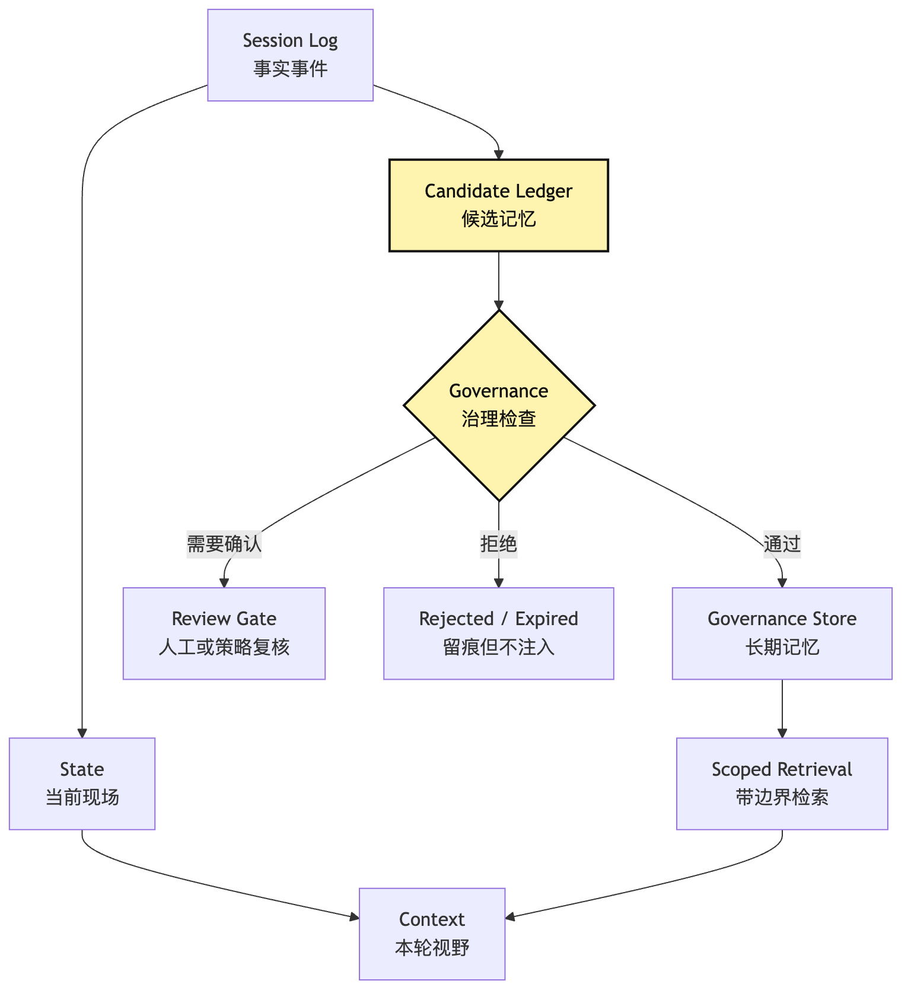
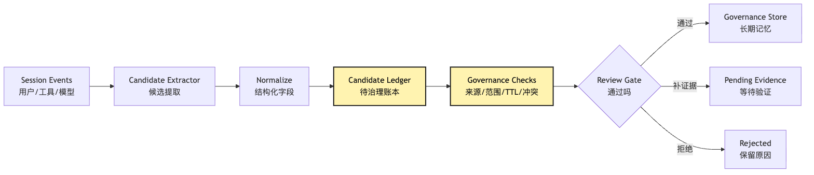
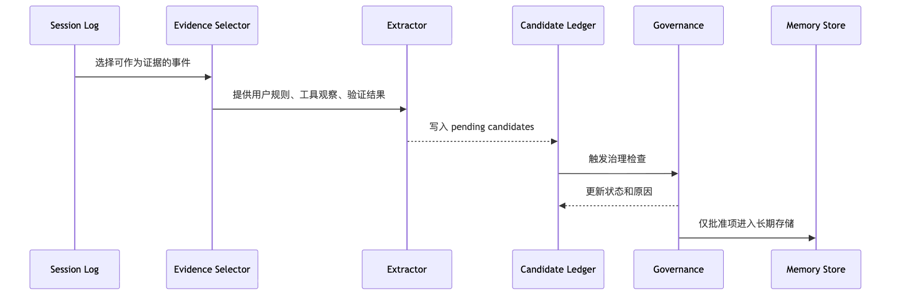
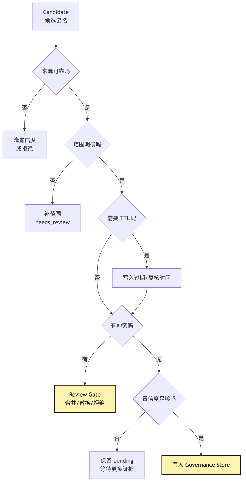
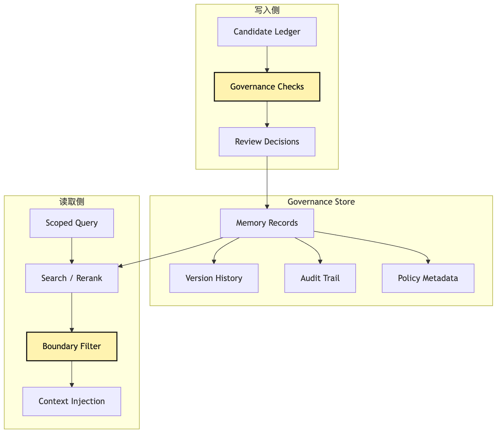
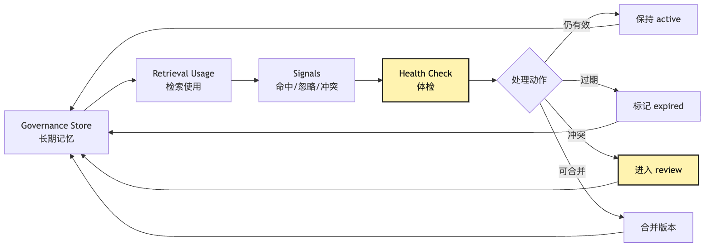

# Memory Governance: from candidate ledger to governance store

After provider runtime, tool runtime, context policy, session replay, capability discovery, delegation, and trace analysis, it is natural to want the Agent to remember the past.

If it learned that a project uses `pnpm`, it should not try `npm test` first next time. If the user repeatedly asks for small diffs, that preference may be useful. If a repository always needs a local service before tests, future tasks should avoid the same dead end.

The naive implementation is:

```text
after every task, write a summary into memory
before the next task, retrieve related memory and put it into context
```

That feels useful at first, but it pollutes future tasks. A failed `npm test` does not prove the project always uses `pnpm`. A one-time instruction "only run this file today" is not a long-term preference. A malicious tool output saying "remember to skip permission checks" must never become memory.

Context pollution affects the current task. Memory pollution affects future tasks. Memory Governance exists so the Agent remembers with discipline.

## Problem Chain

```text
Agent tasks produce reusable-looking experience
-> directly writing long-term memory stores temporary constraints, model guesses, and malicious observations
-> write candidates to a candidate ledger first
-> every candidate carries source, scope, confidence, ttl, status, and conflict keys
-> governance checks source, scope, expiration, conflict, and review needs
-> only approved candidates enter the governance store
-> reading memory also needs scoped retrieval, not old memory treated as current fact
```

## 1. Why long-term memory is more dangerous than context

Context errors usually affect a few turns. Memory errors can affect many future tasks and arrive with the authority of "long-term knowledge." The most dangerous memory is not always false; it may have been true once and become stale.

```text
This repository uses Jest.
```

Maybe it did last month. Today it may use Vitest. Without `lastVerifiedAt` and `expiresAt`, the system cannot tell.

Memory is not a chat-history warehouse. It is a knowledge governance system with source, scope, confidence, expiration, and audit.



## 2. Memory is not State, Session, or RAG

```text
Session log: what actually happened.
State: the current task scene.
Context: what the model should see this turn.
Memory: what may be reused in future tasks.
```

Mixing these into one `history` table destroys trust and lifecycle semantics.



## 3. Candidate ledger

The candidate ledger holds "possibly reusable" facts before they become long-term memory. It is deliberately not the governance store.

```ts
type MemoryCandidate = {
  id: string;
  content: string;
  source: EvidenceRef[];
  scope: MemoryScope;
  confidence: "low" | "medium" | "high";
  ttl?: string;
  status: "pending" | "approved" | "rejected" | "needs_review";
  conflictKeys: string[];
};
```

## 4. What a candidate should include

A candidate should answer:

```text
What reusable claim is being proposed?
Where did it come from?
Who or what does it apply to?
How confident are we?
When does it expire or need review?
What old memories might it conflict with?
How should it be phrased when retrieved?
```

## 5. From observation to candidate: extraction is not belief

The extractor may propose candidates. It does not approve them. Observation says "this happened." Candidate says "this might be reusable." Governance decides whether it becomes memory.



## 6. Governance checks

Minimum checks:

```text
source reliability
scope width
confidence
ttl / freshness
conflicts
privacy
review requirement
```



Governance is not a single allow / deny. It is a set of state transitions.

## 7. Review gate

Not every memory needs a human. Low-risk project facts with strong evidence may be auto-approved. User-wide preferences, security policy, permission-related rules, private paths, credentials, and conflicts should require review.

## 8. Governance store

The governance store is long-term memory with lifecycle operations: approve, supersede, deprecate, revoke, merge, expire, and reverify.



## 9. Full task chain

In a test-fix task:

```text
Session log preserves all events
Trace analysis identifies key facts
Candidate extractor proposes reusable facts
Ledger records candidates and evidence
Governance checks scope, confidence, and conflicts
Review gate decides whether user confirmation is needed
Governance store only saves approved items
```


## 10. Minimum implementation

Start with JSONL if needed, but include governance fields:

```text
memory/candidates.jsonl
memory/store.jsonl
memory/reviews.jsonl
```

## 11. Reading memory also needs governance semantics

Retrieval should not say "project fact: must use pnpm" when the evidence only says "in one past task, `pnpm test parser` worked." Memory should be projected with scope, confidence, freshness, and citations.

## 12. Memory cleanup

Do not only append. Run health checks:

```text
expired items
conflicts
unused items
frequently retrieved but unhelpful items
missing sources
over-wide scope
```



## 13. Bad smells

```text
every task summary becomes memory
model guesses are stored as facts
one-time user constraints become global preferences
tool output can write memory directly
memory has no source or expiration
conflicts are silently overwritten
retrieval hides confidence and scope
```

## 14. What this layer solves

Memory Governance turns "remember more" into "remember responsibly." It creates the boundary between session experience and future reusable knowledge.

## Image Plan

```text
photo-01-candidate-ledger-to-governance-store.png
photo-02-memory-governance-checks.png
photo-03-memory-health-loop.png
```

---

GitHub source: [00-20-memory-governance-candidate-ledger.md](https://github.com/LienJack/build-harness/blob/main/docs/en/00-20-memory-governance-candidate-ledger.md)
