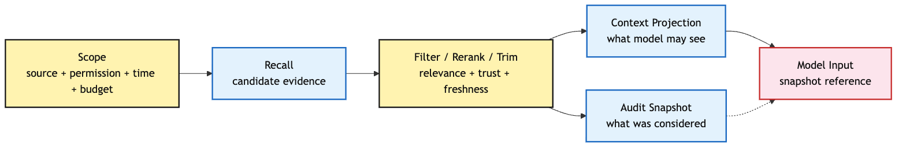
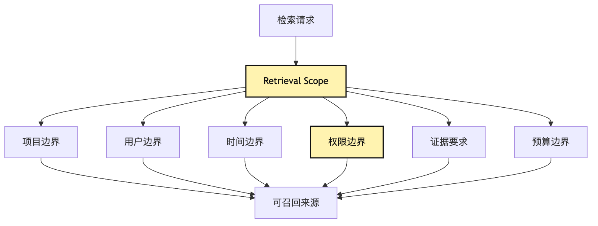
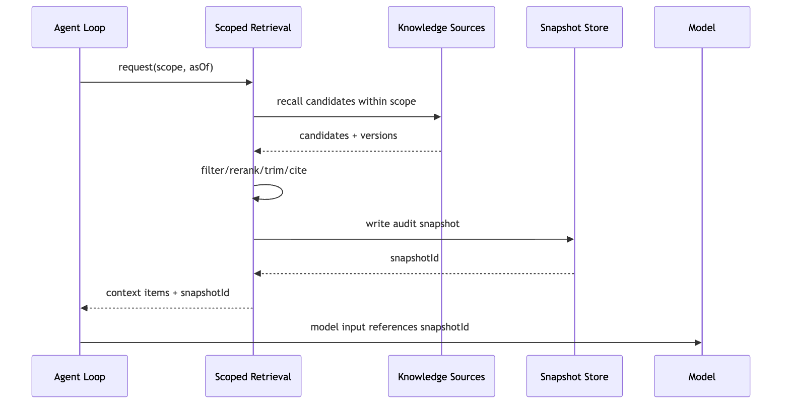
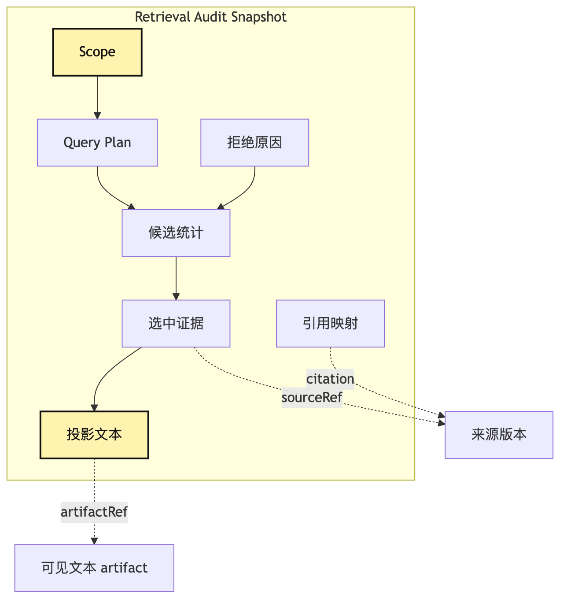
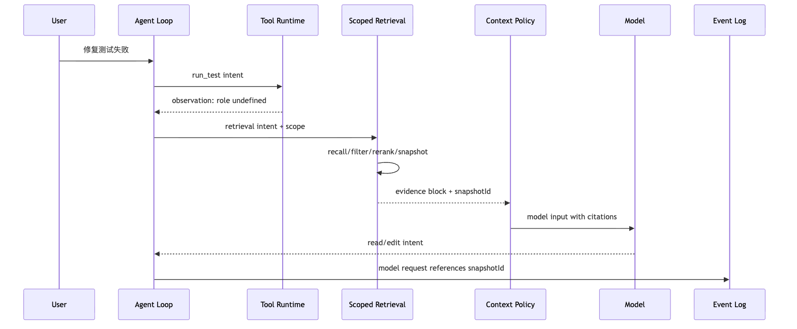

# Scoped Retrieval: from bounded retrieval to audit snapshots

The first version of retrieval in many Agent systems is very simple:

```text
search(query) -> topK chunks -> append to prompt
```

That is enough for a Q&A demo. It is not enough for an Agent Harness that can read code, run tests, edit files, request permissions, keep memory, and replay sessions.

In this series' running example, the user asks a small CLI Agent to fix failing tests. By now the Agent already has provider runtime, tool runtime, intent / execution separation, event log, replay, context policy, and memory governance. Adding retrieval seems natural: when the model lacks project conventions, historical decisions, API behavior, or similar failure cases, it should look in local knowledge bases, past sessions, project docs, or the memory store.

But direct semantic retrieval punches through the boundaries established earlier. It can ignore permissions, time, context budget, memory freshness, and evidence provenance. Worse, after the task ends, you may not be able to answer:

```text
What retrieval results did the model actually see?
Where did they come from?
Why were they selected?
Were they trimmed, reranked, summarized, or filtered?
Did they cross user, project, or permission boundaries?
```

Scoped Retrieval puts retrieval back under the Harness control plane. It starts by defining the boundary, then records the final visible evidence as an audit snapshot.

## Problem Chain

```text
An Agent needs external knowledge
-> direct semantic retrieval recalls similar but irrelevant material
-> real tasks must define scope first
-> scope determines sources, permissions, time boundary, evidence type, and budget
-> candidates are filtered, reranked, cited, trimmed, and projected
-> the final result is written as an audit snapshot
-> replay can know exactly what the model saw at that time
```



## 1. Why "similar" is not "relevant"

Vector search answers: which text is close to the query in semantic space?

An Agent usually needs a different answer: which evidence helps the current task make the next decision?

If the failing test says `expected user role to be admin, received undefined`, semantic search may recall old admin failures, docs about roles, an unrelated module with a `role` field, a memory about an admin demo, and a README section about permissions. These are similar, but not necessarily relevant.

Retrieval relevance also asks whether the material belongs to the current repository, branch, test suite, file neighborhood, trust boundary, time boundary, permission boundary, and action need.

| Dimension | Semantic Similarity | Retrieval Relevance |
| --- | --- | --- |
| Core question | Does the text look similar? | Does it help this task decide? |
| Inputs | query, chunk embedding | query, task state, scope, permissions, time, evidence need |
| Output | ranked similar chunks | citable, explainable, budgeted evidence |
| Common failure | broad recall, stale material | boundary leaks or task bias |
| Harness responsibility | candidate discovery | filtering, reranking, citation, snapshot, audit |

Semantic retrieval is useful as candidate discovery. It should not decide what the model is allowed to see.



## 2. Scope is not a filter; it is a retrieval contract

A scope is more than `repo = currentRepo` and `topK = 5`. In a Harness, scope describes why retrieval is allowed, from which sources, under which policies, and what kind of evidence may be handed to the model.

```ts
type RetrievalScope = {
  sessionId: string;
  userId: string;
  projectId: string;
  workspaceRoot: string;
  branch?: string;
  taskId: string;
  purpose: "fix-test" | "explain-code" | "review-risk" | "answer-question";
  allowedSources: RetrievalSource[];
  deniedSources: RetrievalSource[];
  permissionContext: PermissionContext;
  timeBoundary: TimeBoundary;
  evidencePolicy: EvidencePolicy;
  budget: RetrievalBudget;
};
```

The important point is that retrieval becomes an auditable runtime operation, not a hidden prompt-building trick.

## 3. The full Scoped Retrieval pipeline


The minimum pipeline is:

```text
build scope
-> plan queries
-> recall candidates
-> filter by boundary
-> rerank by task relevance
-> trim to budget
-> produce citations
-> write audit snapshot
-> project into model context
```

Each step should leave enough evidence for replay and trace analysis.

## 4. Query Planning: decide how to ask before deciding what to search

One user task may need several retrieval intents. Fixing a test may need a query for current failure logs, project rules, similar past sessions, memory candidates, and API behavior. Query planning turns one vague need into bounded subqueries.

```ts
type QueryPlan = {
  purpose: RetrievalScope["purpose"];
  queries: PlannedQuery[];
  requiredEvidence: EvidenceRequirement[];
  maxCandidates: number;
};
```

## 5. Permission boundary: retrieved results are not automatically visible

Reading a source and showing it to the model are different permissions. A Harness may be allowed to read a secret-backed artifact for validation while still being forbidden to place its raw content in model context.


```text
can read source
does not imply
can expose source to model
```

The visibility gate should run before projection.

## 6. Time boundary: retrieval must answer "as of when?"

Replay must not silently re-retrieve today's documents for yesterday's decision. A retrieval scope needs an `asOf` boundary, and the audit snapshot must record source versions, timestamps, and candidate ids.



## 7. Audit Snapshot: not a cache, but an evidence package

An audit snapshot records the retrieval operation as a durable fact:

```ts
type RetrievalAuditSnapshot = {
  id: string;
  scope: RetrievalScope;
  queryPlan: QueryPlan;
  selected: SelectedEvidence[];
  rejected: RejectedCandidate[];
  projection: VisibleProjection;
  citationMap: CitationMap;
  createdAt: string;
};
```

A cache exists for speed. A snapshot exists for truth.



## 8. Context Projection: retrieval results should not be dumped raw into the prompt

Projection decides what the model sees. It can include summaries, excerpts, citations, confidence, freshness, and warnings. It should preserve references to the full evidence instead of stuffing every byte into the prompt.

## 9. The running CLI Agent example

When fixing a failing test, the Agent might retrieve:

```text
project rules about test commands
verified memory about the package manager
past sessions with similar failure messages
API compatibility notes
security-review conventions
```

Scoped Retrieval keeps these materials bounded, cited, and replayable.



## 10. Failure modes

Common retrieval failures include stale memory treated as current truth, cross-project leakage, semantic similarity overriding task relevance, hidden prompt stuffing, missing citations, and replay that retrieves different evidence than the original run.

## 11. Minimum implementation

Start by making retrieval a runtime tool:

```ts
type ScopedRetrievalIntent = {
  purpose: RetrievalScope["purpose"];
  query: string;
  requestedSources?: RetrievalSource[];
  maxVisibleTokens?: number;
};
```

The tool should produce an observation for the model and an audit snapshot for replay.

## 12. Task-aware rerank

A practical reranker should consider source authority, current task state, file proximity, timestamp, confidence, permission class, and actionability. Similarity can remain a signal; it must not be the whole decision.

## 13. Citation is not decoration

Citations let the model, user, trace analyzer, and replay system point back to the same evidence. Without citations, retrieval becomes unaccountable prompt stuffing.

## 14. Relationship to Context Policy

Retrieval is a source. Context is a projection. The retrieval system discovers and packages evidence; context policy decides how much of it enters the current model input.


## 15. Relationship to Memory Governance

Not every memory is eligible for recall. Scoped Retrieval must honor memory status, scope, confidence, expiration, conflicts, privacy, and review state.

## 16. Relationship to Session Replay

Replay reads the snapshot. It should not rerun retrieval against a changed world.

## 17. Minimum tests

Do not only test `topK`. Test scope filtering, permission visibility, time boundaries, snapshot stability, citation integrity, budget trimming, and replay determinism.

## 18. Minimum file structure

```text
retrieval/
  scope.ts
  query-plan.ts
  recall.ts
  rerank.ts
  projection.ts
  audit-snapshot.ts
  retrieval-tool.ts
```

## 19. What this layer solves

Scoped Retrieval turns RAG from "more text in the prompt" into a bounded, inspectable, replayable evidence flow. It also introduces more policy work: source authority, visibility, freshness, and citation discipline.

## 20. Why the next article moves toward Productized CLI

Once retrieval, memory, tools, profiles, providers, and capabilities all have policy, the CLI entry point can no longer be a handful of flags. The next layer is productization.

## One-sentence Summary

```text
Retrieve within a scope, project with citations, and preserve the exact evidence as an audit snapshot.
```

## Image Plan

```text
photo-01-scope-to-snapshot.png
photo-02-similarity-vs-relevance.png
photo-03-permission-time-gates.png
photo-04-audit-snapshot-evidence-pack.png
```

---

GitHub source: [00-21-scoped-retrieval-audit-snapshot.md](https://github.com/LienJack/build-harness/blob/main/docs/en/00-21-scoped-retrieval-audit-snapshot.md)
