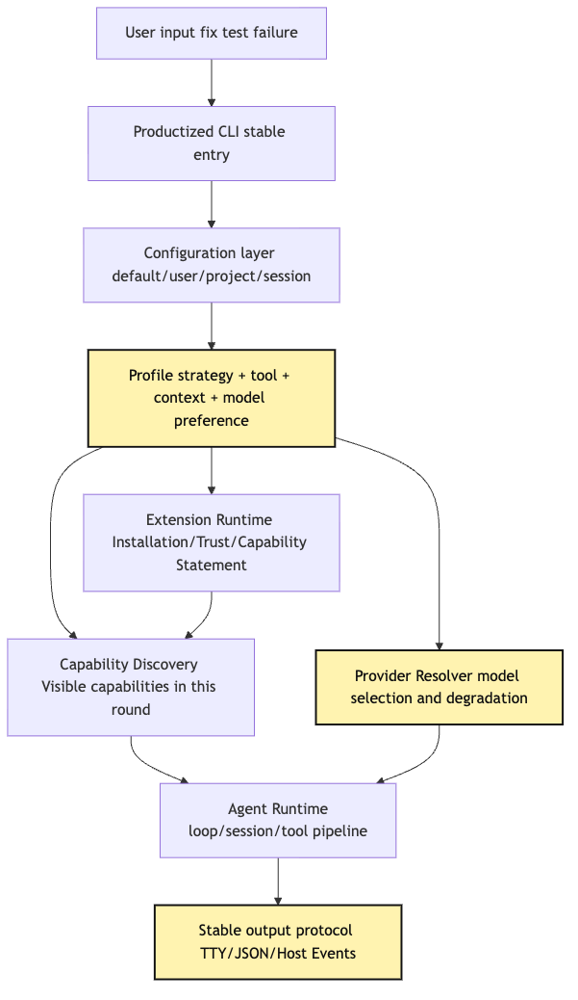
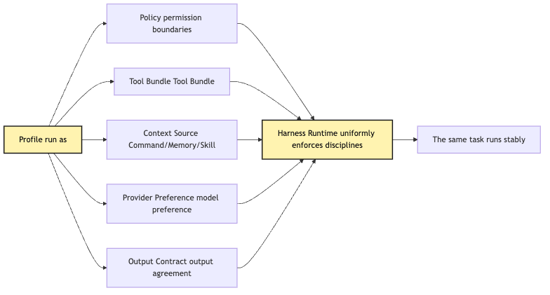
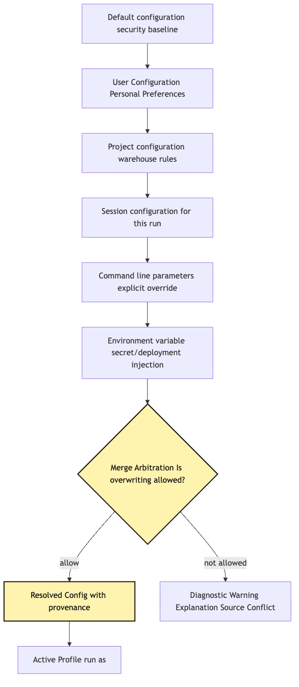
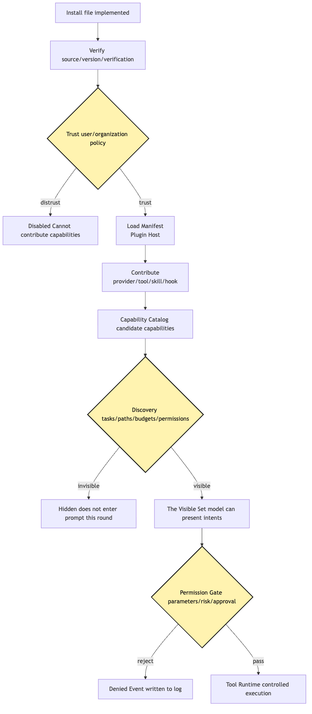
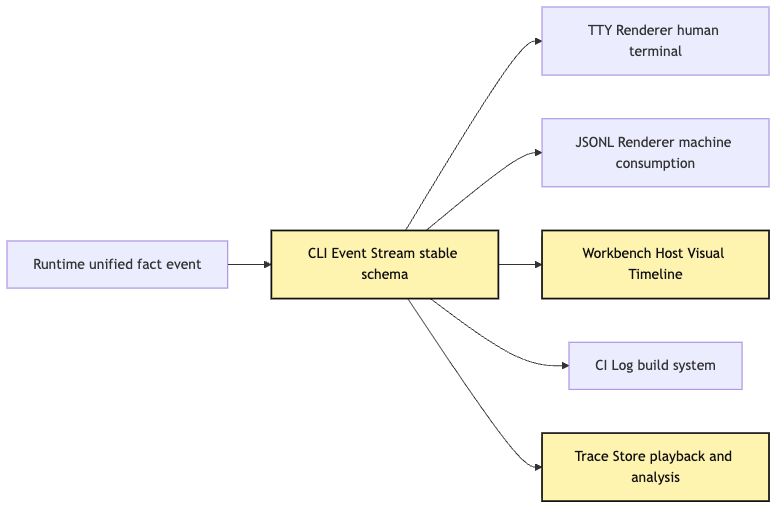
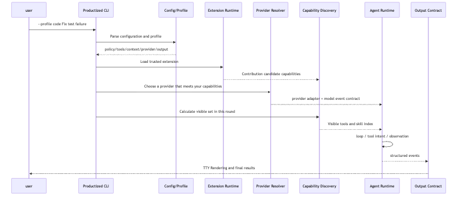

# Productized CLI: profile, extension, multi-provider

At this point, our small CLI Agent is no longer the early demo that could only run once.

It has a provider runtime.

It has a tool runtime.

It has a plugin host.

It has capability discovery.

It has session replay.

It knows the model can only propose intent.

It knows tools must go through validate, permission, execute, and observe.

It also knows external capabilities cannot bypass the unified tool pipeline.

If you are only building an experimental tool for yourself on your own machine, this is already pretty good.

You can type:

```text
Help me understand why this project is failing tests, and fix it.
```

The Agent can run tests, read files, search errors, edit code, and run tests again.

It looks like a small prototype of Claude Code.

But once you want other people to use it, the questions suddenly change category.

They will not only ask:

```text
Can this Agent run once?
```

They will ask:

```text
How do I use it across different projects?
```

They will ask:

```text
Can company projects and personal projects have different permissions?
```

They will ask:

```text
Which model do I use by default?
```

They will ask:

```text
Can I install a team extension?
```

They will ask:

```text
Why did tool behavior, output format, and error messages all change after I switched provider?
```

That is the question this twenty-second article answers.

> A demo CLI only has to run once. A productized CLI must put profile, configuration layers, provider switching, extension installation, capability discovery, project instructions, runtime checks, and stable output protocols under the same Harness discipline.

We will keep using the running example from the whole series:

```text
The user types at the project root:
Help me understand why this project is failing tests, and fix it.
```

In the demo stage, that sentence only needs to trigger a loop.

In the productized stage, the same sentence has to answer many more invisible questions.

Which profile is currently active?

Does this profile allow file edits?

Does this project have its own instructions?

Has the project registered a test-fix skill?

Has the user installed the GitHub MCP extension?

Does the current provider support tool calling?

Can the fallback provider accept the same tool intent?

Is the output meant for a human TTY, or an event stream parsed by an IDE, Workbench, or CI host?

If the system does not answer these questions explicitly, the productized CLI collapses back into an accidental mixture of command-line flags and environment variables.

It may work today.

But it will be hard for other people to use reliably.

Here is the core conclusion of this article up front:

```text
A Productized CLI is not a demo wrapped as an npm package.
A Productized CLI projects runtime capabilities into a product entry point that is configurable, extensible, inspectable, replaceable, and consumable by hosts.
```

The most important word here is `profile`.

But a profile is not a theme skin.

It is not just a default model name.

And it is definitely not a handful of prompts casually glued together.

In an Agent Harness, a profile should represent a governable runtime intent:

```text
policy + tool bundle + context source + provider preference + output contract
```

In other words, a profile does not answer "what does the interface look like?"

It answers:

```text
Under what identity, with what permissions, capabilities, context, and model preferences is this CLI running right now?
```

That is the dividing line between a demo CLI and a productized CLI.

## Problem Chain

First, fix the problem chain for this article.

```text
demo CLI only needs to send one user input into the agent loop
-> as capabilities grow, startup flags, environment variables, provider config, extensions, and project instructions begin to scatter
-> scattered configuration makes the same command behave differently across machines, projects, and providers
-> an explicit Profile is needed to combine policy, tool bundle, context source, and provider preference
-> Profile must not bypass Plugin Host, Provider Runtime, Capability Discovery, or Tool Runtime
-> configuration layers must be mergeable, explainable, and auditable, not simply "last writer wins"
-> multi-provider must work through a provider resolver and a unified model event contract
-> extension installation must flow through manifest, trust, capability catalog, and discovery policy
-> productized CLI also needs doctor/status, stable event output, and host/workbench protocols
-> the user ultimately sees a stable CLI, while the inside is still governed by the same Harness control system
```

The easiest thing to underestimate in this chain is "stable."

Many demos fail not because the model is unintelligent.

They fail because the environment is unstable.

The same command is writable by default in project A, but read-only by default in project B.

The same command can fix tests when the primary provider is available, but the tool call format changes under the fallback provider.

The same extension made tools automatically visible after installation yesterday, but today a path change stops the skill from triggering.

The same output looks nice in the terminal, but an IDE host cannot parse progress and tool events.

These are the problems a productized CLI has to solve.

They are not model problems.

They are Harness entry-layer problems.

As an overall diagram, it looks roughly like this:



The most important thing in this diagram is not the number of modules.

The truly important part is that the CLI no longer starts the loop directly.

It first resolves configuration.

Then it determines the profile.

Then it resolves provider preference.

Then it loads extensions.

Then it computes the visible capability set.

Only then does it hand the task to the Agent Runtime.

In other words:

```text
The entry point of a productized CLI is not model.call().
The entry point of a productized CLI is runtime identity resolution.
```

## 1. Why demo CLIs become harder to share as they grow

Start with the simplest demo.

The earliest CLI may have only this shape:

```bash
agent "Help me understand why this project is failing tests, and fix it"
```

The internal code is also very direct:

```ts
const provider = new OpenAIProvider({ apiKey: process.env.OPENAI_API_KEY });
const tools = createLocalTools(process.cwd());
const agent = new Agent({ provider, tools });

await agent.run(process.argv.slice(2).join(" "));
```

The problem with this code is not on day one.

On day one, it is clear.

Its goal is to prove:

```text
The model can connect to tools.
Tool results can return to the model.
The loop can continue advancing.
```

But on day two, you add `--model`.

On day three, you add `--dangerously-auto-approve`.

On day four, you add `--project-rules`.

On day five, you add `--provider anthropic`.

On day six, you add `--load-skill code-review`.

On day seven, you add `--json`.

On day eight, you add `--mcp-config`.

On day nine, you add `--profile code`.

Then the CLI entry point starts to look like this:

```bash
agent \
  --provider openai \
  --model gpt-x \
  --fallback-provider anthropic \
  --allow-tool read,grep,bash,edit \
  --deny-command "rm -rf" \
  --project-rules .agent/rules.md \
  --skill test-fix \
  --mcp-config .agent/mcp.json \
  --json \
  "Help me understand why this project is failing tests, and fix it"
```

Of course this can run.

But it is no longer a product.

It is a temporary run script.

The user has to know too many internal details.

The user has to know provider names.

The user has to know which tools should be enabled.

The user has to know which skills should be loaded.

The user has to know where the project rules file lives.

The user has to know who will consume the output.

This creates a very practical problem:

```text
For the same task, the user has to redesign the runtime at the CLI argument layer.
```

That conflicts with the goal of the Harness.

The Harness exists to engineer the runtime boundaries.

If the final entry point hands all those boundaries back to the user, the complexity has only moved elsewhere.

So the first step toward a productized CLI is not to add more flags.

It is to collapse the runtime intent behind those flags into profiles.

## 2. Profile is runtime identity, not a theme

In many products, a profile is just preference configuration.

Theme color.

Language.

Default font size.

Those can certainly be called profiles.

But in an Agent CLI, if profile only means that, it wastes the concept.

The thing that is genuinely risky, genuinely different, and genuinely needs stable reuse in an Agent CLI is not interface preference.

It is runtime identity.

For example, the same user may need three profiles:

```text
chat: read-only Q&A, no file edits, no command execution.
code: read/write the current workspace, run low-risk test commands, require confirmation for high-risk commands.
review: read only diffs and files, prohibit writes, output findings first.
```

These three profiles may use the same binary.

They may even use the same provider.

But they are not the same Agent.

Because their runtime identities differ.

The task of the `chat` profile is to answer.

The task of the `code` profile is to fix.

The task of the `review` profile is to review.

They see different tool sets.

They load different project instructions.

They have different permission policies.

Their output formats may also differ.

Therefore a profile should contain at least five categories:

```text
policy: what is allowed, what is forbidden, and what requires confirmation.
tool bundle: which local tools, MCP tools, and extension tools are enabled by default.
context source: which user rules, project rules, skills, memory, and retrieval sources are loaded.
provider preference: preferred providers, models, capability requirements, and fallback strategy.
output contract: stable output protocol for TTY, JSON, IDE host, or CI.
```

As a type, it might look like this:

```ts
type AgentProfile = {
  id: string;
  description: string;
  policy: PolicyRef;
  toolBundles: ToolBundleRef[];
  contextSources: ContextSourceRef[];
  providerPreference: ProviderPreference;
  outputContract: OutputContractRef;
  extensionAllowlist: ExtensionRef[];
};
```

The important part of this type is not the exact field names.

It is that the type does not directly contain provider SDK objects.

It also does not directly contain tool execution functions.

A profile describes "runtime intent."

Loading the actual provider belongs to the Provider Runtime.

Loading the actual tool belongs to the Plugin Host and Tool Runtime.

Deciding the visible capabilities belongs to Capability Discovery.

The profile does not take over those layers.

It only combines the choices across these layers into a reusable identity.

As a diagram:



The point of this diagram is:

```text
Profile is not a new runtime layer.
Profile is a composition declaration over the existing runtime.
```

Put another way, profile selects the runtime identity.

It does not execute that identity.

If a profile directly executes tools, it has become the tool runtime.

If a profile directly calls the model, it has become the provider runtime.

If a profile directly decides tool visibility for every turn, it has swallowed capability discovery.

None of that is what we want.

What we want is:

```text
Profile selects identity.
Runtime executes identity.
Trace proves how identity took effect.
```

Return to the "fix failing tests" example.

When the user runs:

```bash
harness --profile code "Help me understand why this project is failing tests, and fix it"
```

The system should not treat `code` as a string switch.

It should resolve:

```text
The current run may read and write the workspace.
The current run may execute test-related commands.
Destructive shell commands currently require confirmation.
The test-fix skill and local-tool bundle are loaded first.
The provider should prefer a model that supports tool calling and streaming.
Output is shown as a TTY event stream, while structured events are retained internally.
```

That is the value of profile.

It turns "I want a coding Agent" from a user's casual phrase into a runtime identity the Harness can execute, audit, and reuse.

## 3. Configuration layers: the first fact source of a productized CLI

Profile solves composition.

But where does the profile itself come from?

That brings us to configuration layers.

A demo CLI usually reads only environment variables.

For example:

```text
OPENAI_API_KEY
ANTHROPIC_API_KEY
AGENT_MODEL
```

A productized CLI cannot rely only on environment variables.

Environment variables are too flat.

They are suitable for secrets.

They are also suitable for temporary overrides.

But they are not suitable for expressing complex policy.

For example:

```text
This project uses the code profile by default.
This project forbids automatically running deployment commands.
This team allows read-only GitHub MCP access.
This session temporarily switches to the review profile.
CI mode must output JSONL and must not use interactive approval.
```

These are not isolated variables.

They have sources.

They have precedence.

They have merge rules.

They have conflict explanations.

A productized CLI should distinguish at least these configuration layers:

```text
built-in default layer: the system's safe defaults.
user layer: global user preferences, provider credential references, common profiles.
project layer: repository instructions, allowed extensions, project tool policy.
session layer: temporary mode, output target, permission switches for this run.
command-line layer: explicit one-off overrides passed by the user.
environment layer: secrets and deployment environment injection.
```

The point is not that more layers are always better.

The point is that every final configuration value can answer:

```text
Where did it come from?
Why is this the value?
Who overrode whom?
Was this override allowed?
```

So configuration merging should not simply be:

```ts
const config = {
  ...defaults,
  ...userConfig,
  ...projectConfig,
  ...envConfig,
  ...cliFlags,
};
```

This code looks concise.

But it cannot explain itself.

When the user asks:

```text
Why can't this project automatically edit files?
```

The system can only say:

```text
That is the final result.
```

That is not enough.

A productized CLI needs configuration provenance.

That means recording the source of every value.

It can be abstracted like this:

```ts
type ConfigValue<T> = {
  value: T;
  source: "default" | "user" | "project" | "session" | "flag" | "env";
  path: string;
  reason?: string;
};

type ResolvedConfig = {
  activeProfile: ConfigValue<string>;
  permissionMode: ConfigValue<PermissionMode>;
  providerPreference: ConfigValue<ProviderPreference>;
  enabledExtensions: ConfigValue<string[]>;
  outputMode: ConfigValue<OutputMode>;
};
```

This allows `harness doctor` to explain the situation.

For example:

```text
activeProfile = code
  source: project
  path: .harness/config.yaml

permissionMode = ask
  source: user
  path: ~/.harness/config.yaml
  reason: project cannot escalate permission mode above user default
```

There is an important governance point here:

```text
Not every higher-priority layer may override every lower-priority layer.
```

For example, project configuration should not force a user's read-only mode into automatic edit mode.

Command-line flags should not necessarily bypass organization policy.

Environment variables should not enable high-risk tools merely because a name happens to exist.

If an organization or hosted-side governance policy exists, it should participate as an upper bound in arbitration.

User, project, and flag layers can tighten boundaries, and they can choose runtime behavior within the allowed space, but they cannot expand privileges beyond governance policy.

So the configuration layer must not only "merge."

It must also "arbitrate."

As a decision path:



The most important node in this diagram is `merge arbitration`.

It says the configuration layer is not a simple priority stack.

It is the first fact source of the productized CLI.

If the configuration layer has no provenance, the later profile, provider, and extension layers become hard to diagnose.

You do not know why an extension was loaded.

You do not know why the model switched to a fallback provider.

You do not know why a tool was not visible in the current turn.

In the end, users will attribute all behavior to "model instability."

But the thing that is actually unstable is the entry configuration.

## 4. Multi-provider: provider details must not leak into the user experience

Article 12 already established:

```text
The provider can only return model events and tool intent.
The provider cannot execute tools.
The provider cannot own session state.
The provider cannot decide whether the loop continues.
```

In a productized CLI, this discipline extends one layer outward.

Not only should the runtime internals avoid provider pollution.

The user experience should avoid provider pollution too.

In other words, users should not have to relearn the whole CLI simply because they switch providers.

These experiences are all bad:

```text
Under provider A, the tool is called read_file; under provider B, it is called file_read.
Provider A emits token events; provider B emits raw chunks.
Provider A gives understandable rate-limit errors; provider B throws raw SDK errors.
Provider A supports tool streaming; provider B does not, so CLI progress display disappears.
The review profile works under provider A, but profile fields stop working under provider B.
```

These are all cases of provider details leaking through.

The goal of multi-provider is not "connect to many models."

The real goal is:

```text
When switching among providers, the Harness control semantics do not change.
```

This requires a Provider Resolver.

A Provider Resolver is not an adapter.

An adapter translates one provider's requests and responses into the internal contract.

A resolver chooses which provider to call for this turn based on profile, task, capability needs, cost, availability, and fallback strategy.

Think of it this way:

```text
Profile says: I need a provider suitable for code tasks.
Runtime says: this turn needs streaming, tool calling, and a large context.
Config says: the user prefers provider A and falls back to provider B under rate limits.
Resolver says: choose provider A for this turn; if it fails, switch by explainable rules.
```

In types:

```ts
type ProviderPreference = {
  primary: ProviderSelector;
  fallbacks: ProviderSelector[];
  requiredCapabilities: ProviderCapability[];
  costCeiling?: CostPolicy;
  latencyPreference?: "low" | "balanced" | "quality";
};

type ProviderCapability =
  | "streaming"
  | "tool-intent"
  | "structured-output"
  | "large-context"
  | "vision";

type ProviderResolution = {
  selectedProvider: string;
  selectedModel: string;
  reason: string;
  missingCapabilities: ProviderCapability[];
  fallbackChain: string[];
};
```

There is a key boundary here:

```text
ProviderCapability is internal capability semantics.
It is not a private field from a provider SDK.
```

Do not write a profile like this:

```yaml
openai:
  response_format: json_schema
anthropic:
  tool_choice: auto
```

That makes the profile directly depend on provider details.

A better expression is:

```yaml
profile: code
provider:
  require:
    - streaming
    - tool-intent
    - structured-output
  prefer:
    quality: high
    latency: balanced
```

How a specific provider expresses structured output is the provider adapter's job.

The CLI layer only expresses runtime needs.

This matches the principle from Article 12:

```text
Provider-private formats stop at the provider runtime.
Profile and CLI only see internal capabilities.
```

Another important part of multi-provider is fallback.

Fallback is not simply catching an error and switching models.

If the primary provider fails because of rate limits, switching to a backup provider may seem reasonable.

But it creates a chain of questions.

Does the backup provider support the current tool schema?

Does the backup provider support the same streaming events?

Can the backup provider accept the current context length?

Is the backup provider's safety policy consistent?

How does the event log record the fallback?

Should the user-facing output show that a switch happened?

If these questions do not have unified answers, fallback creates new instability.

As a flow:


The most important thing in this diagram is that both providers finally flow into `ModelEvent`.

They do not flow into provider raw chunks.

They do not flow into SDK-private objects.

They do not flow into a pile of if/else branches.

As soon as provider details leak into Core, multi-provider tears the system apart.

As soon as provider details leak into CLI user experience, multi-provider trains users to become configuration engineers.

A productized CLI should do the opposite:

```text
Unified contract internally.
Unified experience externally.
Provider adapters and resolver absorb the differences in between.
```

## 5. Extension: installed is not enabled, enabled is not visible, visible is not executable

In Article 11, when discussing Plugin Host, we clarified one boundary:

```text
Extensions do not open up core.
Extensions let external capabilities enter the same Harness discipline.
```

In a productized CLI, this boundary becomes more concrete.

Because users will really install extensions.

For example:

```bash
harness extension install github
harness extension install playwright
harness extension install team-code-style
```

This looks like an ordinary plugin system.

But Agent CLI extensions are more sensitive than ordinary CLI plugins.

Because an extension may introduce:

```text
new tools.
new MCP servers.
new Skills.
new Hooks.
new project instructions.
new provider adapters.
new permission presets.
new output renderers.
```

Any of these capability categories may affect model behavior.

So an extension lifecycle cannot be only install / uninstall.

It should be split into at least these stages:

```text
discover: find installable extensions.
install: install into local or project scope.
verify: verify source, version, signature, or checksum.
trust: user or organization policy decides whether to trust it.
load: Plugin Host parses the manifest.
contribute: declare provider/tool/hook/skill/context/output capabilities.
catalog: enter the Capability Catalog.
visible: become visible this turn after Discovery Policy.
execute: execute through Tool Runtime and the permission gate.
audit: enter the session log and trace.
```

The three most important sentences are:

```text
Installed is not enabled.
Enabled is not visible.
Visible is not executable.
```

Installed only means files exist.

Enabled means the system allows it to contribute capabilities.

Visible means the model can see some of those capabilities this turn.

Executable means a concrete intent passed permission, argument, risk, and user-approval checks.

If these stages are mixed together, extensions become a security hole.

For example, a project includes an extension.

After the user clones the project, the CLI loads it automatically.

The extension declares a `deploy_production` tool.

The model sees it while fixing tests.

The tool parameters do not require permission confirmation.

At that point, the extension system is not extending capability.

It is opening a bypass for the model.

A productized CLI must avoid this.

An extension manifest should only declare.

It should not execute.

For example:

```ts
type ExtensionManifest = {
  id: string;
  version: string;
  source: "builtin" | "user" | "project" | "organization";
  contributes: {
    providers?: ProviderContribution[];
    tools?: ToolContribution[];
    skills?: SkillContribution[];
    hooks?: HookContribution[];
    contextSources?: ContextSourceContribution[];
    outputRenderers?: OutputRendererContribution[];
  };
  trust: TrustRequirement;
  permissions: PermissionDeclaration[];
};
```

This manifest enters the Plugin Host.

The Plugin Host validates the shape.

The Capability Catalog records candidate capabilities.

Discovery Policy decides the visible capabilities for this turn.

Tool Runtime executes.

Audit records.

The extension itself should not bypass these layers.

As a lifecycle:



This diagram connects Article 11 and Article 17.

Plugin Host solves how extensions enter the system.

Capability Discovery solves when extension capabilities enter the model's field of view.

Tool Runtime solves how extension tools execute.

Profile decides which kinds of extensions are allowed to participate in the current runtime identity by default.

For example, the `code` profile may allow:

```text
local-tools
test-runner
project-skills
github-readonly
```

But not:

```text
deploy-production
database-write
cloud-admin
```

The `review` profile may allow read-only GitHub.

But not Edit.

The `research` profile may allow Web and citation tools.

But not workspace modifications.

This is the relationship between profile and extension:

```text
extension provides candidate capabilities.
profile defines the default boundary of the runtime identity.
discovery decides the visible set for this turn.
permission decides whether a concrete call may land.
```

All four layers are necessary.

Therefore `extensionAllowlist` is only a prerequisite for trust / enable.

It is not the visible set for this turn, and it is not permission allow for a concrete tool intent.

## 6. Project instructions: do not dump all repository rules into the system prompt

A productized CLI will also run into a very practical need:

```text
Every project has its own rules.
```

For example:

```text
This repository uses pnpm.
The test command is pnpm test.
Do not modify generated files.
React components must use the project's design system.
API errors must use the shape { code, message }.
Run typecheck before committing.
```

The easiest thing for a demo CLI to do is read a project rules file at startup and concatenate it into the system prompt.

That is acceptable early on.

But it breaks down after productization.

First, project rules may be long.

Stuffing all of them into the system prompt squeezes out task context.

Second, some project rules only apply to certain paths.

Frontend component rules should not affect backend migration files.

Third, project rules may conflict with the profile.

The project says "automatic fixing is allowed," but the user is currently using the `review` profile.

Fourth, project rules may be untrusted.

Repository files themselves may contain prompt injection.

So project instructions should be treated as a context source.

Not as an unconditional system prompt.

A context source needs source, scope, trust level, and activation conditions.

For example:

```ts
type ContextSource = {
  id: string;
  source: "builtin" | "user" | "project" | "extension";
  trust: "trusted" | "workspace" | "untrusted";
  appliesTo?: PathPattern[];
  profileScope?: string[];
  loader: ContextLoader;
  projection: "summary" | "full" | "handle";
};
```

The `projection` field is critical.

Some project instructions can be summarized and kept resident.

Some should only provide a handle so the model can read them when needed.

Some should enter context only after a path match.

This is the same idea as progressive disclosure for Skills.

Do not keep all experience resident.

Let it appear at the right moment.

In the "fix failing tests" example, the CLI can first load a lightweight project-instruction summary:

```text
The project uses pnpm.
Prefer pnpm test for tests.
Read relevant tests before editing.
Do not edit dist/ or generated/.
```

When the Agent reads a component file under `packages/frontend`, activate frontend rules.

When the Agent reads a database migration, activate database rules.

When the Agent prepares to edit a file, hand forbidden-path policy to the permission gate.

This is much more stable than "put the full project rules into the prompt."

Because the model sees rules relevant to the current task.

The Harness stores rule source and scope.

The permission system enforces the hard boundaries inside the rules.

Project instructions are no longer one huge prompt.

They become runtime inputs jointly managed by profile and context policy.

## 7. Runtime checks: `doctor` is the self-diagnostic entry point of a productized CLI

When a CLI enters the productized stage, many problems should not wait until the user task fails.

For example:

```text
provider credentials are missing.
the default profile does not exist.
an extension is installed but not trusted.
the MCP server config path is wrong.
the project rules file fails to parse.
permission mode conflicts with profile.
the current provider does not support tool-intent.
JSON output mode has interactive approval enabled.
```

If these problems surface only inside the Agent loop, the experience is poor.

The user will think the model did something silly again.

But the real issue is that the startup environment does not satisfy the runtime requirements.

So a productized CLI needs `doctor` or `status`.

They are not decorative commands.

They are preflight checks.

`doctor` should check whether the Harness can run correctly under the current profile.

For example:

```bash
harness doctor --profile code
```

The output should not merely be:

```text
OK
```

It should report by layer:

```text
Config: OK
Profile: code resolved from project
Provider: primary available, fallback configured
Extensions: github-readonly trusted, playwright disabled
Capabilities: Read/Grep/Bash/Edit visible under ask mode
Context: project instructions loaded, frontend skill conditional
Output: tty interactive, json events disabled
Warnings:
  - CI MCP is configured but not reachable
```

This lets the user understand system state before the run.

More importantly, it lets the host understand system state too.

Because Article 22 is not only about the CLI running by itself.

It also prepares for the CLI Host + Workbench in M7/M11.

A Workbench cannot understand Agent state by reading human-friendly terminal text.

It needs a stable protocol.

So `doctor` should ideally support structured output too:

```bash
harness doctor --profile code --json
```

The return value should not be a pile of logs.

It should be a stable schema.

That schema can be consumed by IDEs, Workbenches, CI, and remote hosts.

For example:

```ts
type DoctorReport = {
  ok: boolean;
  profile: {
    id: string;
    source: string;
    warnings: Diagnostic[];
  };
  providers: ProviderDiagnostic[];
  extensions: ExtensionDiagnostic[];
  capabilities: CapabilityDiagnostic[];
  output: OutputDiagnostic;
};
```

Behind this is a productization principle:

```text
The human interface can be beautiful.
The machine interface must be stable.
```

If the CLI only has TTY text, the Workbench can only parse strings.

That is fragile.

If the CLI has a stable event protocol, the Workbench can turn the Agent run into a visual workspace.

## 8. Stable output protocol: terminal rendering is only one projection of output

A demo CLI usually outputs something like this:

```text
Assistant: I will check the tests.
Running: npm test
...
The failure is...
```

That is enough for humans.

But a productized CLI has multiple consumers.

Humans watch in the terminal.

IDEs watch in sidebars.

Workbenches watch in task timelines.

CI watches in log systems.

Remote hosts watch in web UIs.

If the CLI only outputs free-form text, these consumers can only guess.

So a productized CLI should split output into two layers:

```text
Event Stream: stable structured events, the factual output.
Renderer: renders events into TTY, JSONL, Workbench UI, or CI logs.
```

This matches the idea of Session Replay.

The fact source is events.

The interface is only a projection.

A minimal event protocol can include:

```ts
type CliEvent =
  | { type: "session.started"; sessionId: string; profile: string }
  | { type: "provider.selected"; provider: string; model: string; reason: string }
  | { type: "assistant.delta"; text: string }
  | { type: "tool.intent"; tool: string; intentId: string }
  | { type: "tool.approval.requested"; intentId: string; risk: string }
  | { type: "tool.started"; intentId: string }
  | { type: "tool.finished"; intentId: string; exitCode?: number }
  | { type: "capability.visible_set.changed"; added: string[]; removed: string[] }
  | { type: "diagnostic.warning"; message: string }
  | { type: "session.finished"; outcome: "completed" | "failed" | "needs-user" };
```

Do not rush to make this exhaustive.

The key is to separate facts from rendering first.

The terminal UI can render `tool.started` as a spinner.

The Workbench can render it as a timeline node.

CI can render it as grouped logs.

JSONL can output it unchanged, one event per line.

But the event itself remains stable.

As a diagram:



The most important point in this diagram is that `Runtime` should not directly output pretty text.

Runtime outputs factual events.

Renderer handles presentation.

This also has another benefit:

```text
multi-provider does not affect the output protocol.
extensions cannot privately print and break JSON.
profile can choose the output contract.
hosts can parse Agent state reliably.
```

If an extension needs to output progress, it should submit structured events.

It should not directly `console.log`.

Otherwise it will break machine output.

That is the difference between a productized CLI and a demo CLI.

A demo CLI tries to "look like it runs."

A productized CLI tries to "be understandable by every consumer."

## 9. How the same task flows through a productized CLI

Now connect all layers back to the running "fix failing tests" example.

The user types:

```bash
harness --profile code "Help me understand why this project is failing tests, and fix it"
```

The first step of the productized CLI is not to call the model.

It resolves configuration first.

It discovers that the project config also defaults to the `code` profile.

The command line explicitly specifies `code`, and there is no conflict.

The user's global policy requires confirmation for high-risk commands.

Project rules forbid modifying `generated/`.

The extension configuration enables `test-runner` and `github-readonly`.

Provider preference requires streaming and tool-intent.

The output target is an interactive TTY, while an internal JSON event stream is retained.

Second, Provider Resolver chooses the provider.

It finds the primary provider available.

The primary provider supports tool-intent, streaming, and the current context length.

It records a `provider.selected` event.

Third, Extension Runtime loads trusted extensions.

`test-runner` contributes a project-aware test command skill.

`github-readonly` contributes read-only MCP tools.

They enter the Capability Catalog.

But not all of them are visible to the model yet.

Fourth, Capability Discovery computes the visible set for this turn.

The "fix failing tests" task exposes by default:

```text
Read
Grep
Bash(test commands with approval)
Edit(with workspace policy)
SkillSearch
ToolSearch
```

GitHub MCP does not enter the visible set yet.

There is no evidence yet that remote PR or CI information is needed.

Fifth, Agent Runtime starts the loop.

The model proposes a tool intent to run tests.

Tool Runtime validates the command.

Permission Gate determines that `pnpm test` is a low-risk test command.

After execution, the observation is written back.

Sixth, the model searches relevant code based on the failure log.

It reads files.

It discovers the failing test is in a frontend component.

The path matches frontend project instructions.

Capability Discovery adds the frontend component skill to the visible set.

Seventh, the model proposes an edit intent.

The permission check confirms the target is not under `generated/`.

The edit executes.

Events enter the session log.

Eighth, the model runs tests again.

The tests pass.

Renderer outputs a human-readable summary.

The event stream emits `session.finished`.

The whole process can be drawn as a sequence diagram:



The most important point in this diagram is:

```text
profile resolution happens before the loop.
extension contribution happens before discovery.
provider selection happens before the model request.
output protocol starts from runtime events, not from a final string concatenation.
```

Once the order is reversed, the system becomes brittle.

For example, if you start the loop first and then discover extensions on the fly, the model cannot see the right capabilities on the first turn.

If you call the provider first and only then discover it does not support tool-intent, the system can only fail midway.

If you output free-form text first and later try to make Workbench parse it, you are left with fragile log parsing.

The stability of a productized CLI comes from these upfront resolutions.

## 10. Minimum landing path: do not build the whole platform at once

At this point, it is easy to imagine Productized CLI as a huge system.

But we should keep the principle of this series:

```text
Each article advances one minimal verifiable increment.
```

The minimum landing path for Article 22 does not need a plugin marketplace.

It does not need an account system.

It does not need cloud sync.

It does not need a full Workbench.

It only needs to upgrade the demo CLI into a local product with a stable entry protocol.

A minimal file boundary could be:

```text
src/cli/
  main.ts
  args.ts
  output.ts
  doctor.ts

src/config/
  defaults.ts
  loader.ts
  merge.ts
  provenance.ts

src/profile/
  profile.ts
  resolver.ts
  builtin-profiles.ts

src/provider/
  resolver.ts
  capabilities.ts

src/extensions/
  manifest.ts
  loader.ts
  trust.ts

src/events/
  cli-events.ts
  renderers/
    tty.ts
    jsonl.ts
```

First, create built-in profiles.

For example:

```ts
const builtinProfiles: AgentProfile[] = [
  {
    id: "chat",
    description: "Read-only Q&A, no external actions",
    policy: "readonly",
    toolBundles: ["read-only"],
    contextSources: ["user", "project-summary"],
    providerPreference: {
      primary: { family: "general" },
      fallbacks: [],
      requiredCapabilities: ["streaming"],
    },
    outputContract: "tty-interactive",
    extensionAllowlist: [],
  },
  {
    id: "code",
    description: "Fix code, run tests, and modify the workspace under control",
    policy: "workspace-edit-ask",
    toolBundles: ["local-code-tools"],
    contextSources: ["user", "project", "conditional-skills"],
    providerPreference: {
      primary: { family: "code" },
      fallbacks: [{ family: "general" }],
      requiredCapabilities: ["streaming", "tool-intent"],
    },
    outputContract: "tty-events",
    extensionAllowlist: ["test-runner", "github-readonly"],
  },
];
```

Second, implement configuration resolution and provenance.

For example:

```ts
const resolved = resolveConfig({
  defaults: loadDefaultConfig(),
  user: await loadUserConfig(),
  project: await loadProjectConfig(cwd),
  session: sessionOverrides,
  flags: parsedFlags,
  env: process.env,
});

const profile = resolveProfile(resolved.activeProfile.value, {
  builtinProfiles,
  userProfiles: resolved.userProfiles.value,
  projectProfiles: resolved.projectProfiles.value,
});
```

Third, implement the provider resolver.

For example:

```ts
const providerResolution = await resolveProvider({
  preference: profile.providerPreference,
  availableProviders: providerRegistry.list(),
  required: profile.providerPreference.requiredCapabilities,
  diagnostics: true,
});
```

Fourth, implement the extension manifest loader.

Support only local directories first.

Support only manifest reading first.

Support only trust state first.

Do not rush into remote installation.

For example:

```ts
const extensions = await loadEnabledExtensions({
  config: resolved.enabledExtensions.value,
  trustStore,
  cwd,
});

for (const extension of extensions) {
  pluginHost.register(extension.manifest.contributes);
}
```

Fifth, implement the CLI event stream.

Emit events for all key steps.

For example:

```ts
events.emit({
  type: "profile.resolved",
  profile: profile.id,
  source: resolved.activeProfile.source,
});

events.emit({
  type: "provider.selected",
  provider: providerResolution.selectedProvider,
  model: providerResolution.selectedModel,
  reason: providerResolution.reason,
});
```

Sixth, implement `doctor`.

It reuses the same resolver chain.

It simply does not start the agent loop.

This is important.

`doctor` should not have a separate configuration logic.

If doctor and run use two parsers, the worst case appears:

```text
doctor says everything is fine.
run still fails.
```

So the minimal implementation's load-bearing chain should be:

```text
args -> config resolver -> profile resolver -> extension loader -> provider resolver -> capability bootstrap -> event output -> agent runtime
```

And doctor only stops early on that same chain.

## 11. Productized CLI smells

The easiest part of this kind of system to break is not the model call.

It is the entry layer slowly growing bypasses.

### Smell 1: profile is only a model alias

If the `code` profile is only:

```yaml
model: some-code-model
```

Then it does not express permissions.

It does not express tool sets.

It does not express context sources.

It does not express output protocol.

That is not an Agent profile.

It is only a model alias.

Model aliases are useful.

But do not call one a profile.

Otherwise every production capability will get shoved into model config.

Provider configuration will become the new junk drawer.

### Smell 2: project configuration can elevate user permissions

Project configuration should be able to tighten boundaries.

It should not silently loosen user boundaries.

If the user's global mode is read-only, project configuration must not automatically enable writes.

If organization policy disables a class of extensions, the project must not re-enable them.

Otherwise, when a user clones a repository, repository configuration can change Agent behavior.

That is very dangerous in an Agent CLI.

### Smell 3: an extension enters the prompt automatically after installation

Installation only means files exist.

Enablement means contribution is allowed.

Visibility still goes through discovery.

Executability still goes through permission.

If all tools from an extension are handed to the model immediately after install, Capability Discovery has been bypassed.

That recreates the tool overload problem from Article 17.

### Smell 4: provider fallback silently changes output semantics

Fallback may happen.

But it must be recorded.

It must also preserve output event semantics.

If `tool.intent` no longer appears after fallback, or if tool calls become provider raw chunks, the host loses its ability to parse the run.

Fallback should not turn the user experience into a different product.

### Smell 5: JSON mode contains pretty logs

This is especially common in CLI products.

During development, someone writes this inside an extension or adapter:

```ts
console.log("starting provider...");
```

That is fine under TTY.

It is disastrous under JSONL.

Machine consumers read an invalid line.

So a productized CLI needs a unified event bus.

All output goes through renderers.

### Smell 6: doctor and run do not share the resolver chain

If `doctor` is just a handwritten list of checks, it will quickly go stale.

A truly reliable doctor should call the same config/profile/provider/extension resolvers.

Then it renders the result as a diagnostic report.

Otherwise doctor is only a placebo.

## 12. How to test this layer

The testing focus for Article 22 is not model quality.

It is determinism at the entry layer.

First kind of test: profile resolution.

```text
Given multiple configuration layers: default/user/project/flag.
When the user selects the code profile.
The system should resolve the correct policy, tool bundle, context source, provider preference, and output contract.
```

Second kind of test: configuration provenance.

```text
When project config attempts to elevate permission from read-only to auto-edit.
The system should reject the elevation and explain the source in diagnostics.
```

Third kind of test: provider resolver.

```text
When the primary provider lacks the tool-intent capability.
The system should choose a fallback that satisfies requirements.
If no fallback exists, it should fail at doctor time and not enter the loop.
```

Fourth kind of test: extension trust.

```text
An installed but untrusted extension must not contribute capabilities.
A trusted extension may enter the catalog.
But its tools must still go through discovery and permission.
```

Fifth kind of test: JSONL output purity.

```text
In --json mode, every stdout line is valid CliEvent JSON.
Human-friendly logs may go to stderr or the TTY renderer, but must not mix into JSONL.
```

Sixth kind of test: doctor and run consistency.

```text
The resolved profile, provider resolution, and extension diagnostics used by doctor
must match the results used before run starts.
```

Seventh kind of test: stable semantics across providers for the same task.

```text
Fake provider A and fake provider B return different raw formats.
Provider Runtime should normalize them into the same ModelEvent and ToolIntent.
CLI output events should keep the same schema.
```

These tests are less exciting than "the model fixed the tests."

But they are closer to the real risks of a productized CLI.

Users do not encounter complex reasoning failures every day.

They do encounter configuration, provider, extension, output protocol, and environment differences every day.

Stabilize those areas, and the Agent starts to feel like a product.

## 13. What this layer solves, and what it introduces

Let us wrap this article up.

Productized CLI does not solve "whether the Agent can think."

The previous articles have already addressed model, loop, tool, context, session, capability, and delegation.

This article solves:

```text
How these runtime capabilities are exposed to real users and hosts through a stable product entry point.
```

It collapses scattered CLI flags into profile.

It collapses provider switching into resolver.

It collapses extension installation into manifest, trust, catalog, discovery, and permission.

It collapses project instructions into context source.

It collapses terminal output into event stream and renderer.

It collapses runtime environment problems into doctor.

It also introduces new complexity.

First, the configuration system itself becomes more complex.

So it needs provenance and diagnostics.

Second, profile may be abused as a grab bag.

So profile only expresses runtime identity; it does not execute capabilities.

Third, multi-provider introduces capability differences.

So provider capability must be expressed in internal semantics.

Fourth, extensions introduce trust problems.

So installation, enablement, visibility, and executability must stay separate.

Fifth, host/workbench needs a stable protocol.

So Runtime events and Renderer must stay separate.

This leads directly to the next article.

Once the CLI can run as a product entry point, the next step is not to keep piling capabilities into the local CLI.

The next step is to put the Harness into a more distant environment:

```text
Sandbox, Cron, durable execution, and remote deployment.
```

That is Hosted Harness.

At that point, profile becomes the runtime identity of remote tasks.

Extension trust becomes a deployment boundary.

Provider resolver becomes a scheduling strategy.

Event stream becomes a remote observability protocol.

And this Productized CLI is the final local entry discipline before entering Hosted Harness.

Remember this article in one sentence:

```text
A productized CLI does not merely wrap an Agent as a command. It turns the Agent's runtime identity, capability boundary, model preference, extension source, and output protocol into an explainable Harness entry point.
```

---

GitHub source: [00-22-productized-cli-profile-extension.md](https://github.com/LienJack/build-harness/blob/main/docs/en/00-22-productized-cli-profile-extension.md)
