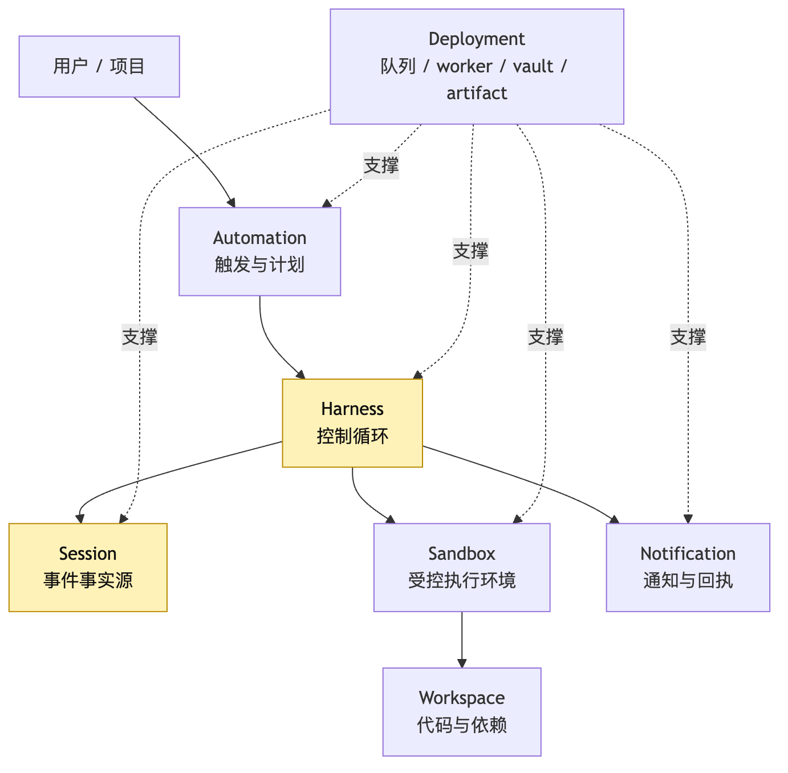
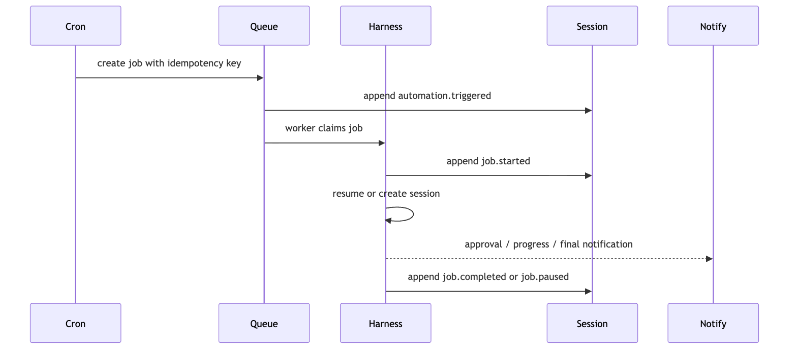
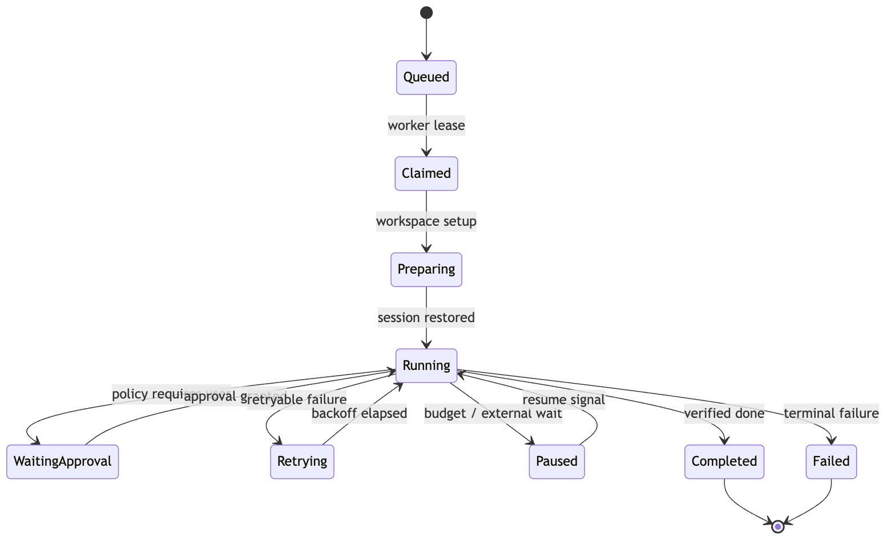
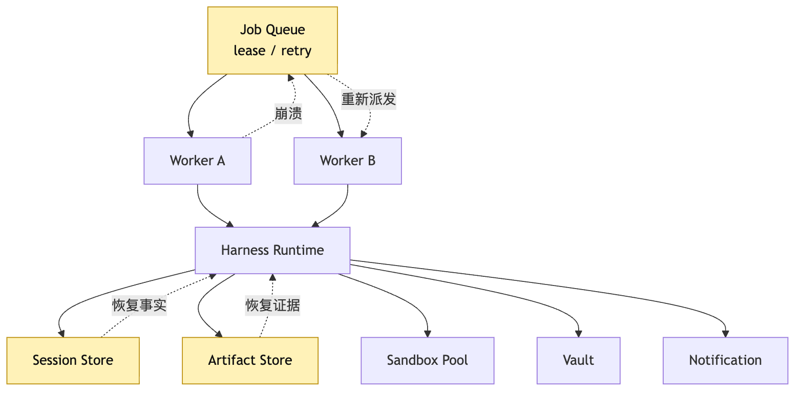
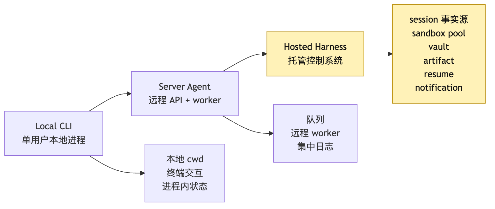

# Hosted Harness: Sandbox, Cron, Durable Execution, and remote deployment

Putting a local CLI Agent on a server is not the same thing as building a Hosted Harness. Local CLI proves mechanisms. Hosted Harness proves that long-running Agent tasks can be resumed, audited, governed, and completed across time, workers, and sandboxes.

The boundary is:

```text
Session / Harness / Sandbox
Automation / Cron
Durable Execution
Workspace Setup
Secret Boundary
Artifact Store
Resume / Retry
Notification
Deployment Topology
```

Hosted Harness is a control system for the Agent task lifecycle.

## 1. Why local CLI proves mechanism, not hosting

Local CLI assumes a live terminal, current working directory, current environment variables, current process memory, and an online user. A hosted automation may start in the future, clone code remotely, run in a worker, need server-side secrets, pause for approval, retry after preemption, and notify the user through another channel.

The hidden questions become:

```text
who triggered the task
which user / project / profile owns it
how workspace is prepared
how sandbox is selected
how secrets are injected without leaking
where event log and artifacts live
where to resume after worker crash
how approvals work when the user is offline
how completion and failure are reported
```

## 2. The five boundaries of Hosted Harness

```text
Automation
Harness
Session
Sandbox
Deployment
```

Automation creates a recorded trigger. Harness advances the control loop. Session stores facts. Sandbox executes actions. Deployment runs queue, workers, vault, artifact store, and sandbox pool.



## 3. Cron creates recoverable jobs, not timed commands

Cron should not directly run `npm test`. It should create a durable job intent with schedule, identity, idempotency key, and handoff target.

```ts
type JobIntent = {
  scheduleId: string;
  windowId: string;
  userId: string;
  projectId: string;
  profileId: string;
  task: string;
  idempotencyKey: string;
};
```



## 4. Remote Sandbox is both cage and license

Sandbox isolates execution, but it also grants a controlled license to act. A hosted sandbox must define file-system boundary, network boundary, command policy, resource limits, lifetime, workspace mount, and secret access path.


## 5. Workspace Setup

Remote tasks do not magically have project state. Workspace setup must record repository URL, commit, branch, checkout path, dependency cache, setup commands, project instructions, and artifact links.

```json
{
  "repo": "example/repo",
  "ref": "main",
  "commit": "abc123",
  "workspaceId": "ws_01",
  "setupStatus": "ready"
}
```

## 6. Secret Boundary

Secrets are capabilities, not context. The model should request an intent; Harness policy decides whether Tool Runtime may temporarily use a secret-backed capability. Raw secrets should not enter model input, sandbox logs, or observations.


## 7. Durable Execution

A long Agent task cannot rely on one worker staying alive. Durable execution records every boundary:

```ts
type DurableStep = {
  sessionId: string;
  stepId: string;
  status: "pending" | "running" | "paused" | "completed" | "failed";
  inputEventIds: string[];
  outputEventIds: string[];
  artifactIds: string[];
};
```



### Retry is not rerunning everything

Retry should resume from facts, artifacts, and checkpoints. Repeating world-changing tool actions without idempotency is a bug.

## 8. Artifact Store

Remote task evidence cannot live only in logs. Store full test logs, patches, model input snapshots, trace reports, screenshots, generated files, approval records, and final reports as artifacts referenced by events.


## 9. Notification is a lifecycle event

Notification is not the final answer. It is an event that can ask for approval, report progress, deliver artifacts, or announce completion. The session should record what was sent and what response was received.

## 10. Remote Worker is replaceable

Worker is an executor, not the task fact source. If Worker A crashes, Worker B should lease the job, replay the session, verify artifacts, rebuild sandbox state, and continue.



## 11. Deployment Topology

Local CLI, server wrapper, and Hosted Harness are different:

```text
Local CLI: one process, nearby user, local workspace
Server wrapper: remote process, weak lifecycle model
Hosted Harness: durable job, session facts, sandbox pool, artifact store, notification loop
```



### Do not jump to the final platform

Start with one queue, one worker, one session store, one artifact store, and one approval path.

## 12. How a hosted test-fix task runs

### 1. Cron creates a task

It writes `JobIntent` and idempotency metadata.

### 2. Worker leases the job

The worker is temporary and replaceable.

### 3. Workspace setup prepares the scene

Checkout, dependency setup, project instructions, and cache identity are recorded.

### 4. Sandbox executes controlled tools

Every tool execution is validated, authorized, recorded, and projected.

### 5. Model advances from observations

The model sees controlled projections, not raw hidden state.

### 6. Durable loop records every boundary

Provider calls, tool intents, approvals, artifacts, and verification are facts.

### 7. Approval pauses the task

Pause is a state, not a crash.

### 8. Completion is not one sentence

Completion requires verification evidence, artifacts, trace, and notification.

## 13. Minimum hosted interface sketch

```ts
interface HostedHarness {
  createJob(intent: JobIntent): Promise<Job>;
  leaseJob(workerId: string): Promise<JobLease | null>;
  resumeSession(jobId: string): Promise<SessionHandle>;
  appendEvent(event: AuditEvent): Promise<void>;
  putArtifact(artifact: Artifact): Promise<ArtifactRef>;
  notify(event: NotificationEvent): Promise<void>;
}
```

## 14. Common smells

```text
cron directly runs shell commands
worker memory is the source of truth
secrets are passed as environment text without policy
logs are the only artifact
retry reruns side effects
approval happens outside the session
notification cannot be replayed
```

## 15. How this article closes the previous path

Hosted Harness combines session, replay, trace, delegation, memory, retrieval, profile, provider, extension, and output contracts into a hosted lifecycle.

## Closing: hosted is not about cloud; it is about manageable lifecycle

```text
The worker may die.
The sandbox may be rebuilt.
The user may be offline.
The job must still have facts, checkpoints, artifacts, and a path to continue.
```

## Image Plan

```text
photo-01-hosted-harness-layers.png
photo-02-cron-to-durable-job.png
photo-03-sandbox-secret-boundary.png
photo-04-worker-retry-resume.png
```

---

GitHub source: [00-23-hosted-harness-durable-execution.md](https://github.com/LienJack/build-harness/blob/main/docs/en/00-23-hosted-harness-durable-execution.md)
