# Context Manager の新しいパラダイム：Agent の注意力オペレーティングシステム

前の [Context Policy](/blog/AI/build-harness/00-15-context-policy-model-input) が答えていたのが：

> このターンでモデルは何を見るべきか？

だとすれば、この章が答えるのは、より低レイヤーの問いです：

> Agent 全体は、どのように作業コンテキストを保存し、投影し、圧縮し、分岐し、復元するのか？

まず中心となる見方を先に示します：

> **Agent Context Manager はチャット履歴マネージャーではなく、イベント事実、現在状態、長期記憶、外部証拠、ツール環境、システムポリシーを、次の行動に必要な最小十分なコンテキストへコンパイルする注意力ガバナンス層である。**

言い換えると、これは単に `messages[]` をマネジメントするものではなく、コンテキストがいっぱいになったあとで「要約する」だけのものでもありません。むしろ Agent の **Attention Operating System** に近いものです。Agent がこの瞬間に何を知るべきか、なぜ知るのか、情報源は何か、信頼できるのか、期限切れではないか、モデルに公開すべきか、長期記憶に書き込むべきか、そして限られた予算の中で推論の連続性をどう保つかを決定します。

## 一、第一原理から Context を定義する

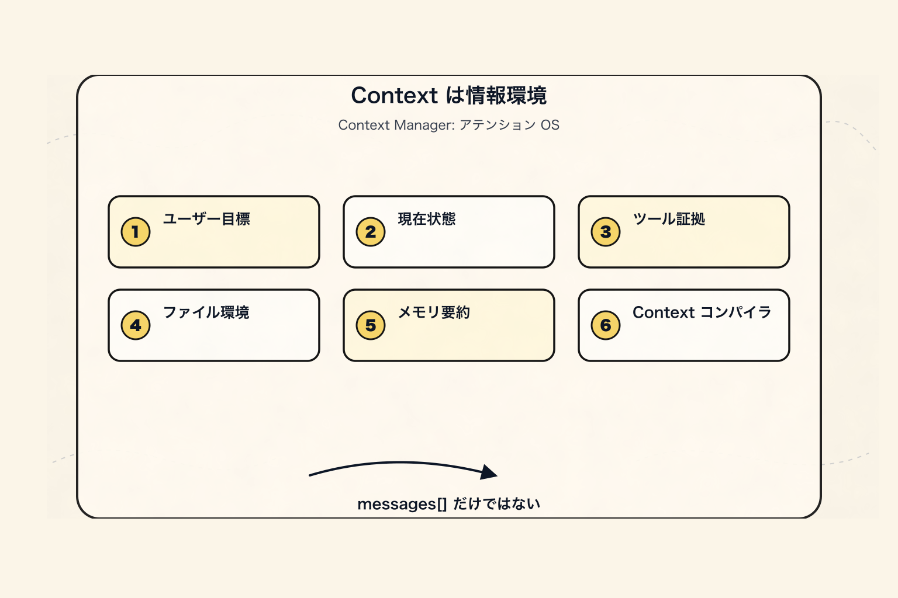

多くの Agent demo では、コンテキストを継続的に追記される `messages[]` として捉えている：

```text
user message
-> assistant message
-> tool result
-> assistant message
-> tool result
-> ...
```

このモデルでも最小限の demo は動くが、成熟した Agent を支えるには足りない。

なぜなら、成熟した Agent のコンテキストは単なるチャット履歴ではないからだ。そこには、ユーザーの目標、現在のタスク状態、過去の意思決定、ツール呼び出しの証拠、ファイルと環境の状態、長期記憶、圧縮された要約、分岐セッション、予算マネジメント、権限境界、検証結果も含まれる。

`messages[]` はそのうちの一層にすぎず、しかも通常は最も信頼できる層ではない。

より安定した定義は次のようになる：

```text
Context_t = f(
  Intent,
  State,
  Evidence,
  Memory,
  Policy,
  Tools,
  Environment,
  Recent Interaction,
  Budget
)
```

つまり：

> **ある時点のコンテキストとは、Agent が次の判断、行動、表現を行うために必要な情報環境である。**

これにより、重要な転換が生まれる：

```text
問うべきではない：履歴メッセージをどうモデルに詰め込むか？
問うべきことは：次の行動にはどの情報が必要か？
```

Context Manager は、これらの問いに継続的に答えなければならない：

```text
Agent の現在の目標は何か？
現在のタスクはどこまで完了しているか？
どの事実はすでに検証済みか？
どれは単なる推測か？
どのツール結果が重要な証拠か？
どのユーザー制約は失ってはいけないか？
どの古い情報はすでに無関係か？
どの情報は古いが、将来も保持し続ける必要があるか？
どの情報は圧縮できるか？
どの情報は原文のまま保持しなければならないか？
どの情報はモデルに入れてよいか？
どの情報はシステム内部にのみ留めるべきか？
```

この抽象はかなり耐久性がある。将来、モデルのコンテキストウィンドウがますます大きくなったとしても、Agent は依然として、注意力ノイズ、証拠の追跡、権限分離、記憶汚染、状態復元、分岐探索、コスト予算、説明可能性の問題を扱う必要がある。

この章の新しい見方は、まず一文に圧縮できる：

**Context Manager を `messages[]` の連結器として設計してはいけない。そうではなく、「イベントソーシング + 状態投影 + コンテキストコンパイル + 監査可能な圧縮」を行うランタイムシステムとして設計するべきだ。**

言い換えると：

```text
Context Manager の責務は会話を保存することではない。
その責務は、任意の時点で Agent が次の行動を決めるために必要な最小十分コンテキストを再構築することだ。
```

引き続き前文の例を使う。ある CLI Agent がテスト失敗を修正している。ファイルを読み、テストを実行し、コードを変更し、再度検証する。タスクが長くなると、context マネジメントは「prompt をつなぎ合わせる」ことから、「ランタイムの現場をマネジメントする」ことへと変わる。

## 二、まず旧モデルがなぜ不十分なのかを見る

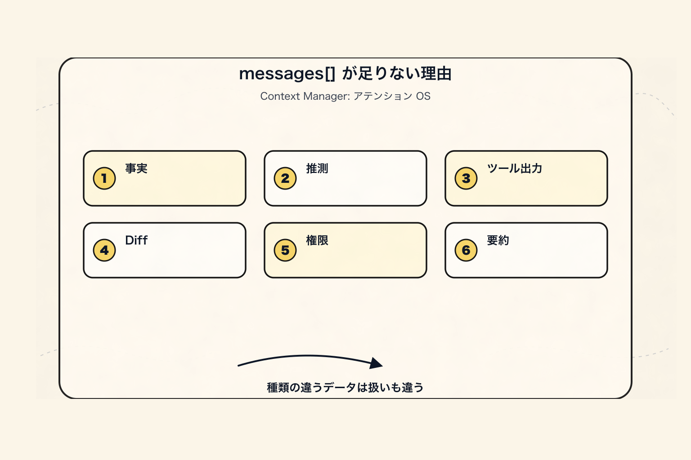

もっとも素朴な実装は、たいてい次のようになります。

```ts
const messages = [
  { role: "system", content: systemPrompt },
  { role: "user", content: userGoal },
];

while (true) {
  const response = await model.chat({ messages, tools });
  messages.push(response.message);

  if (response.toolCall) {
    const result = await runTool(response.toolCall);
    messages.push({
      role: "tool",
      content: result.text,
    });
    continue;
  }

  break;
}
```

このコードの最大の利点は、理解しやすいことです。

そして最大の欠点も、理解しやすすぎることです。つまり、あらゆるものを同じ種類のメッセージとして扱ってしまいます。

テスト修正のタスクでは、`messages[]` にすぐ次のような内容が混ざり込みます。

```text
ユーザー目標
システムルール
プロジェクトルール
モデルの推測
ツール呼び出しパラメータ
テストログ
grep 出力
ファイル断片
旧ファイル内容
新ファイル diff
権限拒否
圧縮サマリー
長期記憶
検証結果
```

これらの内容は性質がまったく異なります。

事実もあれば、推測もあります。

高優先度の指示もあれば、信頼できないツール出力もあります。

すでに期限切れのものもあれば、永遠に保持しなければならないものもあります。

モデル入力に入れるべきものもあれば、監査とリプレイのためだけに残すべきものもあります。

システムに `messages[]` しかない場合、次のような問いに答えるのは非常に難しくなります。

```text
どの情報が事実ソースなのか？
現在の state はどこから来たのか？
圧縮サマリーはどのイベントを要約したのか？
ツール出力は切り詰められていないか？
モデルはこのラウンドで実際に何を見たのか？
このブランチとメインラインはどのような関係なのか？
復元時には副作用をリプレイすべきか、それとも状態だけを再構築すべきか？
```

したがって、`messages[]` を持ってはいけないわけではありません。

ただし、それを context システム全体の事実ソースにしてはいけません。

## 三、新しいパラダイム：Context はコンパイル成果物であり、事実の源泉ではない

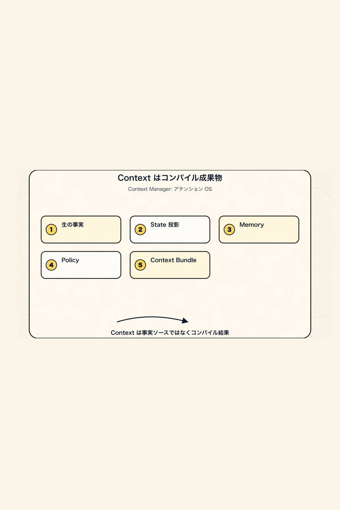

誤ったパラダイムはこうです。

```text
messages がそのままコンテキストである。
summary は履歴を置き換えられる。
モデルが見たものだけを、システムも保存すればよい。
```

この設計は初期には速いですが、後半で多くの問題にぶつかります。

```text
復元できない。
監査できない。
再生できない。
分岐できない。
説明できない。
summary が何を失ったのか分からない。
事実、推測、ユーザーの好みを区別できない。
権限とプライバシーのガバナンスができない。
```

より安定したレイヤー分けは次のようになります。

```text
Raw Event Log
  append-only、できるだけ不変にし、実際に何が起きたかを記録する
        ↓
State Projection
  イベントストリームから現在の目標、計画、事実、意思決定、ファイル、ツール状態を投影する
        ↓
Context Builder
  token budget、優先度、関連性、信頼境界に基づいてモデル入力をコンパイルする
        ↓
Model Request
  モデルへ送る最終的なコンテキストスナップショット
```

この4層のうち、実際にモデルへ送信されるのは最後の1層だけです。

前の3層はすべて Harness のランタイム制御面に属します。

境界は表で固定できます。

| 層 | 答える問い | 事実の源泉か | 圧縮できるか |
| --- | --- | --- | --- |
| Raw Event Log | 実際に何が起きたか？ | はい | summary で上書きすべきではない |
| State Projection | 現在の現場はどうなっているか？ | いいえ、投影である | 再構築できる |
| Context Builder | このターンでモデルは何を見るべきか？ | いいえ、コンパイラである | 毎ターン再計算する |
| Model Request | モデルが実際に受け取ったものは何か？ | いいえ、スナップショットである | 参照を保存できる |

これが新しいパラダイムで最も重要な一歩です。

**LLM context はランタイムのコンパイル成果物であり、システムの事実の源泉ではありません。**

より正確に言うと、次のようになります。

```text
Raw Events / Raw Messages / Tool Results / Artifacts が事実の源泉である。
State / Summary / Memory / Trace は意味的な投影である。
ContextBundle / Prompt は一回限りのコンパイル成果物である。
```

図にするとこうです。

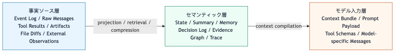

つまり、**モデルへ送るコンテキストは一時的なビューにすぎません**。圧縮、切り詰め、並べ替え、脱機微化、異なるモデルプロトコルへの適配はできますが、システム唯一の事実の源泉にしてはいけません。

一言で言えば、

> **Context はコンパイル成果物であり、データベースではない。**

これを受け入れるだけで、多くの設計は自然と明確になります。

元の履歴はできるだけ失わない。

モデルコンテキストは捨ててもよく、圧縮してもよく、再構築してもよい。

summary は派生物であり、ソースデータではない。

推論の経路には監査可能な証拠を保存し、隠れた chain-of-thought には依存しない。

セッションは木であり、単なる線形配列ではない。

Context budget はリソース配分であり、単純な切り詰めではない。

## 四、Context Manager のモジュールとプレーン

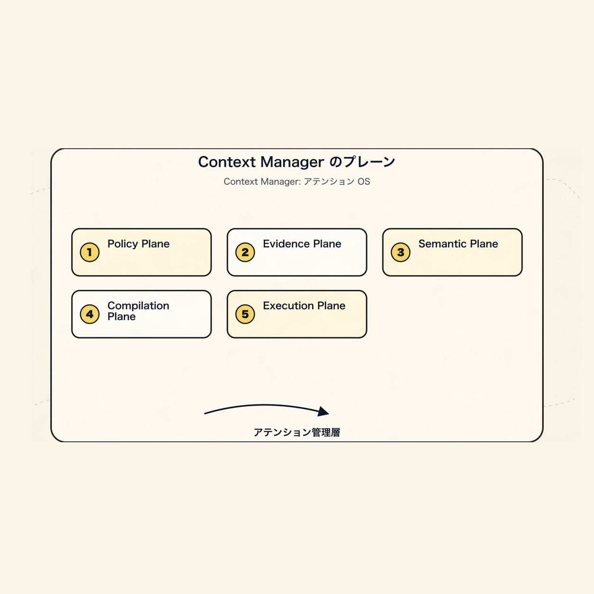

ある程度成熟した Context Manager は、`buildMessages()` だけで終わるべきではない。

少なくとも、次のようなモジュール図へと発展していく：

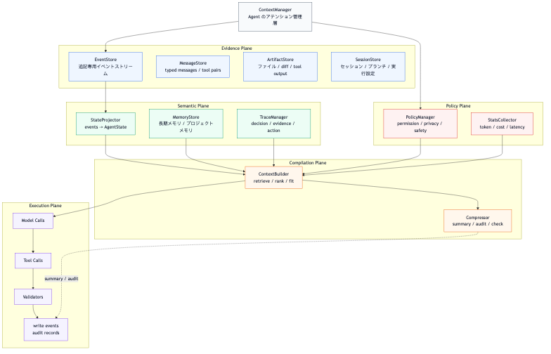

5つのプレーンから見ることもできる：

```text
Policy Plane
  permission / privacy / safety / budget

Semantic Plane
  state / memory / summary / trace

Evidence Plane
  events / messages / artifacts / tools

Compilation Plane
  retrieve / rank / compress / redact / fit

Execution Plane
  model calls / tool calls / validators
```

これらのモジュールを最初からすべて実装する必要はない。

しかし、境界を切るための非常によいチェックリストになる。なぜなら、各モジュールはそれぞれ異なる問いに答えているからだ。

`EventStore` が問うのは、どんな事実が発生したのか？

`StateProjector` が問うのは、現在どのタスク現場にいるのか？

`ContextBuilder` が問うのは、このラウンドのモデルにどの材料を見せるべきか？

`Compressor` が問うのは、どの古い情報を要約で置き換えられるか？その要約は出典を保持しているか？

`TraceManager` が問うのは、今回の失敗はどの因果ノードで切れたのか？

これらの問いをすべて1つの `messages` 配列に詰め込むと、後から非常に変更しづらくなる。

この部分は、そのまま長期的に安定する12個の設計原則として抽出できる：

```text
1. コンテキストは履歴ではなく、行動に必要な情報環境である。
2. 事実ソースと派生物は分離しなければならない。
3. すべての損失を伴う変換は監査可能でなければならない。
4. State は投影であり、チャット履歴ではない。
5. Context はコンパイル結果であり、データベースではない。
6. Memory はガバナンスされた知識であり、キャッシュではない。
7. ツール呼び出しは因果イベントであり、通常のテキストではない。
8. 推論経路として保存するのは説明可能な骨格であり、隠れた思考連鎖ではない。
9. コンテキストにはスコープが必要である。
10. コンテキストマネジメントは予算配分であり、単なる token の切り詰めではない。
11. 分岐とロールバックはネイティブな要件である。
12. 内部モデルは安定させ、外部プロトコルは交換可能にする。
```

最後の1つは特に重要だ。コアデータ構造を、特定のモデルベンダーの message 形式、tool calling 形式、tokenizer、prompt テンプレートに結びつけてはいけない。より安定しているのは、次の形だ：

```text
Canonical Internal Model
  ↓ adapter
Provider-specific Payload
```

## 五、安定した Context Ontology

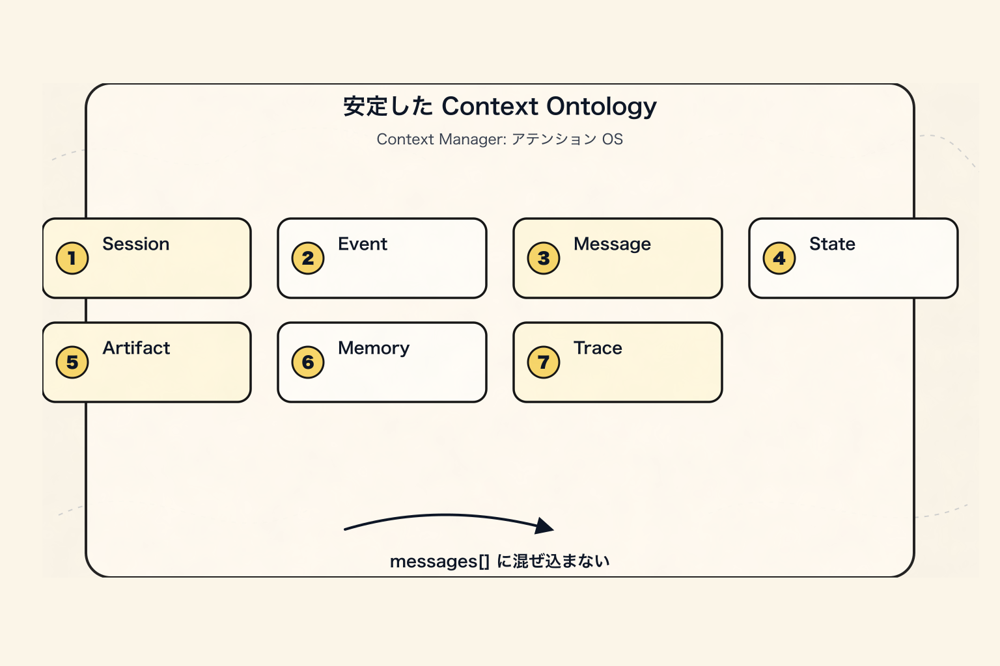

成熟した Agent のコンテキストシステムでは、少なくとも以下のオブジェクトを区別すべきです：

```text
Session        工作容器
Event          发生过的事实
Message        用户、模型、ツール之间的通信记录
State          当前タスク状态投影
Stats          token、成本、延迟、压缩率等指标
Memory         可跨时间复用的知识
Artifact       大对象、ファイル、diff、日志、截图、ツール输出
Trace          可解释的决策与行动链路
Policy         权限、安全、隐私、预算、ツール边界
ContextBundle  一次模型调用的コンテキスト编译结果
```

それぞれ責務が異なるため、1つの `messages[]` に混在させてはいけません。

### Session：作業上のアイデンティティとライフサイクル

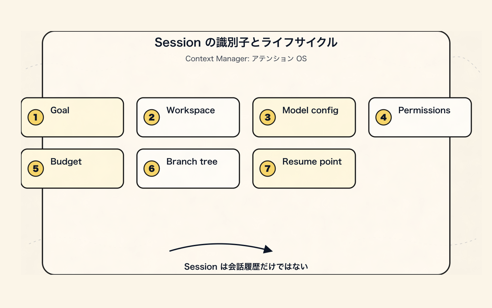

`session` がマネジメントするのは、今回の Agent 作業におけるアイデンティティ、境界、分岐関係です。

最小限のフィールドは、まず次のように設計できます：

```ts
type AgentSession = {
  sessionId: string;
  rootSessionId?: string;
  parentSessionId?: string;
  branchId?: string;
  leafEventId?: string;

  status: "active" | "paused" | "completed" | "failed" | "archived";
  cwd?: string;
  repoRoot?: string;

  modelConfig: {
    provider: string;
    model: string;
    maxOutputTokens?: number;
  };

  contextConfig: {
    contextWindowTokens: number;
    reservedOutputTokens: number;
    maxRecentTokens: number;
    compressionPolicyId: string;
  };

  permissionConfig: {
    sandboxMode?: "read_only" | "workspace_write" | "danger_full_access";
    approvalPolicy?: "never" | "on_request" | "on_failure" | "always";
  };

  createdAt: string;
  updatedAt: string;
};
```

ここで重要なのは、フィールド数の多さではありません。

重要なのは、`session_id` が単に「一連のチャット」を表すだけではないという点です。それは作業ディレクトリ、モデル設定、権限設定、context budget、branch 関係、復元位置も保持します。

これらの情報がなければ、いわゆる resume は一連のチャットを復元できるだけで、作業現場そのものを復元することはできません。

### Event：事実のソース

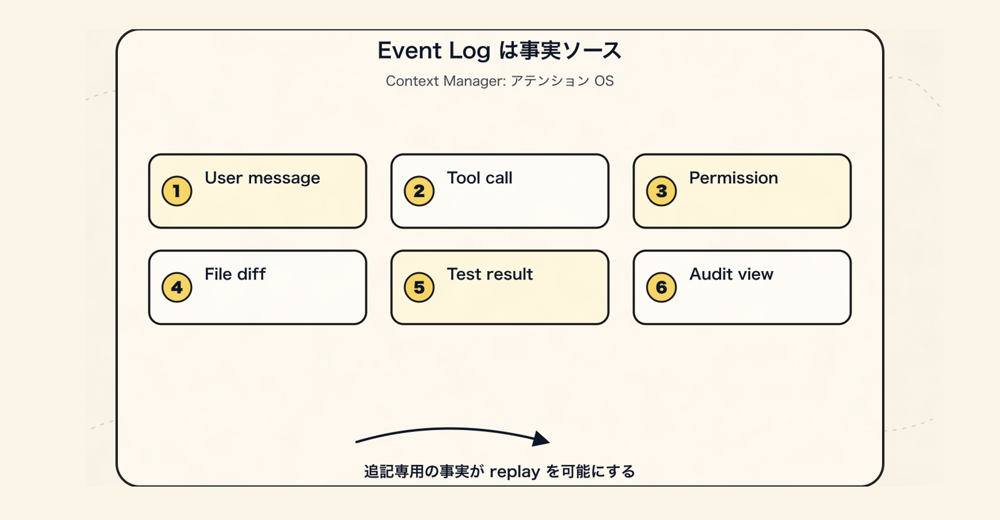

`event` は、最も過小評価されがちなオブジェクトです。

成熟した Agent は message log だけを保存するのではなく、append-only event log を保存すべきです。

```ts
type AgentEvent = {
  eventId: string;
  sessionId: string;
  runId?: string;
  parentEventId?: string;
  seq: number;
  timestamp: string;

  type:
    | "SessionStarted"
    | "UserPromptSubmitted"
    | "ContextBuilt"
    | "ModelRequestStarted"
    | "ModelResponseReceived"
    | "ToolCallRequested"
    | "ToolCallStarted"
    | "ToolCallFinished"
    | "ToolCallFailed"
    | "ApprovalRequested"
    | "ApprovalGranted"
    | "ApprovalDenied"
    | "FileRead"
    | "FileWritten"
    | "DiffApplied"
    | "StateUpdated"
    | "CompactionStarted"
    | "CompactionCompleted"
    | "VerifierFinished";

  actor: "user" | "agent" | "model" | "tool" | "system" | "subagent";
  payload: Record<string, unknown>;

  causality: {
    messageId?: string;
    toolCallId?: string;
    artifactId?: string;
    compactionId?: string;
  };
};
```

なぜ event は message よりも低レイヤーなのか？

多くの重要な事実は、そもそも message ではないからだ。

コンテキスト構築時にどの断片を選んだかは、message ではない。

どのツール呼び出しが権限で拒否されたかは、必ずしも message ではない。

あるファイルが変更された、ある diff が適用された、ある検証が失敗した、ある圧縮がトリガーされた。これらはすべてイベントであるべきだ。

それらが event log に入らなければ、後続の replay、trace、eval、audit は事実の基盤を失う。

### Message：モデルとのインタラクション記録

`message` は依然として重要だ。

ただし、それは provider の生フォーマットをそのまま透過する配列ではなく、typed message blocks であるべきだ。

```ts
type Message = {
  messageId: string;
  sessionId: string;
  runId?: string;
  role: "system" | "developer" | "user" | "assistant" | "tool" | "summary" | "custom";
  content: MessageBlock[];

  toolCall?: {
    toolCallId: string;
    toolName: string;
    args: unknown;
    status: "pending" | "running" | "success" | "error";
  };

  toolResult?: {
    toolCallId: string;
    outputRef?: string;
    outputPreview?: string;
    truncated: boolean;
  };

  provenance: {
    source: "user" | "model" | "tool" | "memory" | "summary" | "system";
    sourceRefs?: string[];
  };

  contextPolicy: {
    includeInContext: boolean;
    priority: number;
    maxTokens?: number;
  };
};

type MessageBlock =
  | { type: "text"; text: string }
  | { type: "file_ref"; uri: string; summary?: string }
  | { type: "tool_call"; toolCallId: string; name: string; args: unknown }
  | { type: "tool_result"; toolCallId: string; outputRef?: string; preview?: string }
  | { type: "summary"; summaryId: string; text: string };
```

ここにはいくつかの強い不変条件がある：

```text
tool call と tool result は必ずペアで保持する。
未完了の tool call を途中で切り詰めてはいけない。
大きな tool output は ArtifactStore に入れ、message には preview + ref だけを置くべきだ。
summary message は、自分がどの message/event を要約したのかを把握していなければならない。
custom/internal message は、LLM context に入るかどうかを区別する必要がある。
```

### State：現在の現場

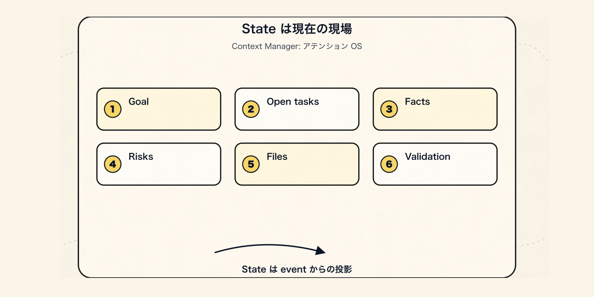

`state` は event log から投影された現在の作業状態だ。

これは履歴メッセージと同じではない。

```ts
type AgentState = {
  sessionId: string;
  sourceEventId: string;
  version: number;

  goal: {
    userGoal: string;
    currentTask?: string;
    acceptanceCriteria?: string[];
  };

  plan: {
    steps: PlanStep[];
    currentStepId?: string;
    status: "planning" | "executing" | "blocked" | "verifying" | "done";
  };

  constraints: {
    hard: string[];
    soft: string[];
    userPreferences: string[];
  };

  facts: Array<{
    factId: string;
    content: string;
    confidence: number;
    sourceRefs: string[];
  }>;

  decisions: Array<{
    decisionId: string;
    decision: string;
    rationaleSummary: string;
    evidenceRefs: string[];
  }>;

  artifacts: Array<{
    artifactId: string;
    kind: "file" | "diff" | "command_output" | "url" | "image";
    pathOrUri: string;
    summary?: string;
  }>;

  openQuestions: string[];
  lastCompactionId?: string;
};
```

`state` は、圧縮後もなお作業を継続できるための中核である。

初期の自然言語での対話が summary に圧縮されたとしても、次のようなものは曖昧にしてはいけない。

```text
ユーザーの最終目標
現在どのステップまで実行済みか
すでに下した決定
検証済みの事実
読んだファイルと変更したファイル
未完了事項
ツールの失敗とリトライ戦略
ユーザーの好みとハード制約
```

これらが古い messages の中に隠れているだけなら、compaction 後に Agent は記憶を失う。

それらが state projection に入っていれば、context はいつでも再構築できる。

### Stats：観測指標であり、State と混ぜてはいけない

`Stats` が扱うのは実行指標であり、タスクの意味論ではない。

```ts
type AgentStats = {
  sessionId: string;
  runId?: string;

  tokenUsage: {
    inputTokens: number;
    outputTokens: number;
    cachedInputTokens?: number;
    reasoningTokens?: number;
    contextWindowTokens: number;
    contextUsedTokens: number;
    reservedOutputTokens: number;
  };

  latencyMs: {
    contextBuild?: number;
    retrieval?: number;
    modelCall?: number;
    toolExecution?: number;
    endToEnd?: number;
  };

  compression: {
    compactionCount: number;
    tokensBeforeLastCompaction?: number;
    tokensAfterLastCompaction?: number;
    compressionRatio?: number;
  };

  toolMetrics: {
    toolCallCount: number;
    failedToolCallCount: number;
    approvalRequestedCount: number;
    approvalDeniedCount: number;
  };

  qualityMetrics?: {
    verifierPassed?: boolean;
    contextMissingRisk?: "low" | "medium" | "high";
    hallucinationRisk?: "low" | "medium" | "high";
  };
};
```

stats がなければ、次のような問いに答えるのは難しい。

```text
なぜ特定の種類のタスクは compaction 後にいつも失敗するのか？
どの tool output が最も多く token を消費しているのか？
どの memory が頻繁に呼び出されるが役に立っていないのか？
context builder の異なる戦略のうち、どれがより低コストなのか？
```

### Memory：ガバナンスされた知識であり、キャッシュではない

`Memory` が答えるのは、どの知識が将来再利用する価値を持つかである。これは「すべての summary をベクトルデータベースに放り込む」ことではない。

```ts
type Memory = {
  memoryId: string;
  scope: "user" | "project" | "workspace" | "session" | "global";
  kind: "preference" | "fact" | "instruction" | "skill" | "artifact_summary" | "decision";

  content: string;
  sourceRefs: string[];
  confidence: number;

  createdAt: string;
  updatedAt: string;
  expiresAt?: string;

  accessPolicy: {
    sensitive: boolean;
    readableByAgents: string[];
    redactionPolicy?: string;
  };

  retrieval: {
    embeddingId?: string;
    keywords?: string[];
    priority: number;
  };
};
```

Memory 設計で最も避けるべきなのは汚染である。より堅実な原則は次のとおりだ。

```text
長期記憶には必ず scope、source、confidence、ttl、sensitivity、priority、usage 記録を持たせる。
```

現在のタスク内の推測が、長期的なユーザー記憶を汚染してはいけない。あるプロジェクトのテストコマンドが、別のプロジェクトを汚染するべきでもない。

### Artifact：大きなオブジェクトと証拠エンティティ

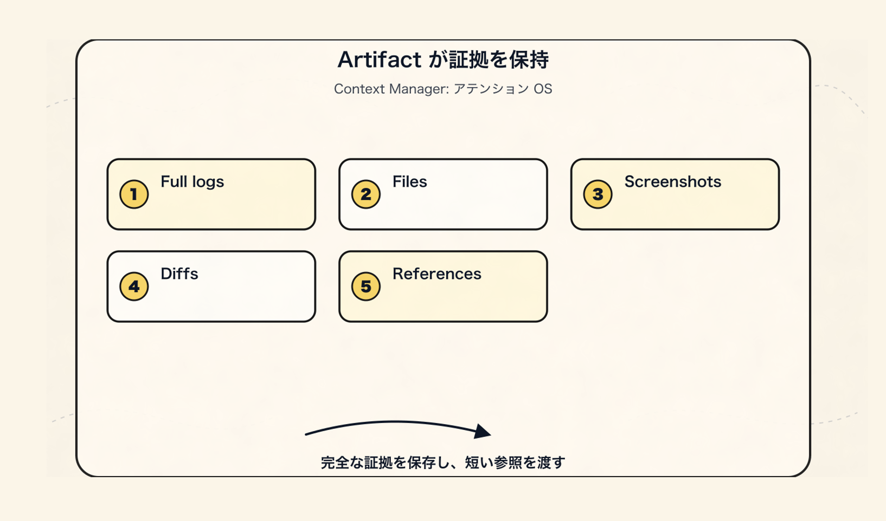

`Artifact` は完全な証拠を保存するものであり、すべてを prompt に詰め込むためのものではない。

```ts
type Artifact = {
  artifactId: string;
  sessionId: string;

  kind:
    | "file"
    | "diff"
    | "tool_output"
    | "command_log"
    | "screenshot"
    | "dataset"
    | "url_snapshot";

  uri: string;
  summary?: string;
  contentHash?: string;

  sourceEventId: string;
  createdAt: string;

  accessPolicy?: {
    sensitive: boolean;
    allowedScopes: string[];
  };
};
```

正しいパターンは次のとおりだ：

```text
context には要約、参照、重要な断片を置く。
artifact store には完全な証拠を置く。
```

これは coding agent にとって特に重要だ。ファイル全文、テストログ、コマンド出力、スクリーンショット、diff はいずれも大きくなり得るため、そのまま message history に入れるべきではない。

### Trace：説明可能な経路であり、隠れた思考連鎖ではない

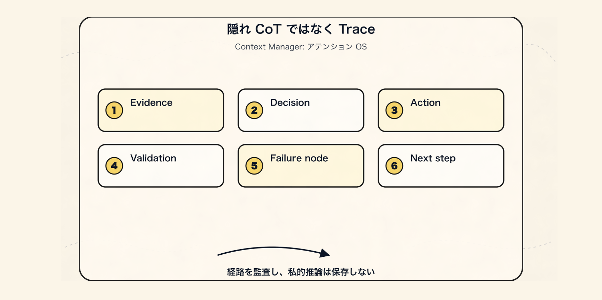

`Trace` が答えるのは、Agent がなぜそうしたのか、根拠は何か、何を検証したのか、次に何をするのか、という問いだ。

「推論の経路を保持する」ことを、モデルの隠れた chain-of-thought を保存することだと理解してはいけない。エンジニアリング上より堅牢なやり方は、公開可能で、監査可能で、再生可能な **Accountable Reasoning Trace** を保存することだ：

```text
Goal
Assumptions
Evidence
Decisions
Actions
Observations
Validation
Next Steps
```

これは自然言語の CoT を保存するより堅牢で安全であり、監査や復元にもより適している。

## 六、Context Builder：真のモデル入力コンパイラ

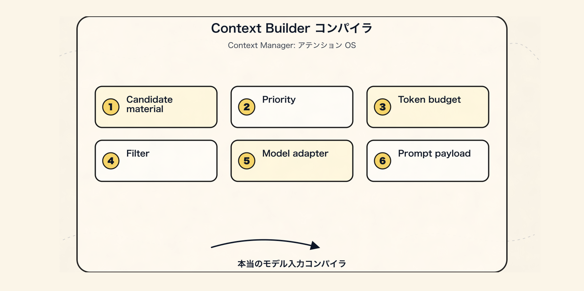

session、event、message、state がそろって、ようやく Context Builder の出番になる。

Context Builder の入力は、巨大な `messages[]` ではない。

その入力は、出所、優先度、信頼レベルを持つ素材の集合である。

```ts
type ContextBundle = {
  system: PromptSegment[];
  developerInstructions: PromptSegment[];
  projectInstructions: PromptSegment[];

  currentRequest: {
    userMessageId: string;
    text: string;
    acceptanceCriteria?: string[];
  };

  sessionState: AgentState;
  summaries: SummaryBlock[];
  recentMessages: Message[];
  retrievedMemories: RetrievedMemory[];
  retrievedArtifacts: RetrievedArtifact[];

  toolContext: {
    availableTools: ToolSpec[];
    pendingToolPairs: Message[];
    recentToolResults: Message[];
  };

  traceContext: {
    runId: string;
    recentDecisions: string[];
    evidenceRefs: string[];
  };

  budget: {
    maxContextTokens: number;
    reservedOutputTokens: number;
    usedTokens: number;
  };
};
```

このコンパイル経路は次のように描ける。

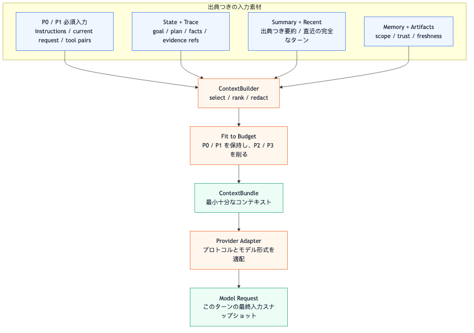

その後、優先度に従って切り詰める。

| 優先度 | 内容 | 破棄可能か |
| --- | --- | --- |
| P0 | system / developer / safety / 必須 tool schema | 破棄不可 |
| P0 | 現在のユーザーリクエスト | 破棄不可 |
| P0 | 未完了の tool call / tool result pair | 破棄不可 |
| P1 | 現在の goal、acceptance criteria、plan、open questions | 基本的に破棄不可 |
| P1 | 現在の作業ファイル、diff、テスト結果、エラー情報 | 要約可能 |
| P1 | 直近 N ターンの完全な対話 | 切り詰め可能だが turn を壊してはいけない |
| P2 | 過去の意思決定、重要な事実、ユーザーの好み | 要約可能 |
| P2 | 検索された memory / artifact | 切り詰め可能 |
| P3 | 古い雑談、重複した説明、冗長なツール出力 | 優先的に破棄または要約 |

疑似コードはおおよそ次のようになる。

```ts
async function buildContext(
  sessionId: string,
  userMessageId: string
): Promise<ContextBundle> {
  const session = await sessionStore.get(sessionId);
  const state = await stateProjector.project(sessionId);
  const latestSummary = await compressor.getLatestSummary(sessionId);

  const recentMessages = await messageStore.selectRecentCoherentTurns({
    sessionId,
    maxTokens: session.contextConfig.maxRecentTokens,
    preserveToolPairs: true,
  });

  const memories = await memoryStore.retrieve({
    query: state.goal.currentTask ?? state.goal.userGoal,
    session,
    state,
  });

  const artifacts = await artifactStore.retrieveRelevant({
    sessionId,
    state,
  });

  const bundle = assembleByPriority({
    session,
    state,
    latestSummary,
    recentMessages,
    memories,
    artifacts,
    currentUserMessage: await messageStore.get(userMessageId),
  });

  return fitToBudget(bundle, {
    preserve: ["system", "current_request", "pending_tool_pairs", "state.goal"],
    evictionOrder: [
      "verbose_tool_outputs",
      "low_relevance_artifacts",
      "old_assistant_chatter",
      "old_user_messages",
      "retrieved_memories",
    ],
  });
}
```

これが [00-15](https://github.com/LienJack/build-harness/blob/main/docs/zh/00-15-context-policy-model-input.md) という記事の位置づけです。

00-15 が扱っているのは、Context Builder 内部における選択、並び替え、圧縮、隔離、予算、DecisionLogです。

本章で扱うのは、Context Builder の上流にさらに存在する、事実ソース、状態投影、圧縮台帳、セッションツリー、復元メカニズムです。

## 七、Compaction：意味の蒸留であり、テキストの短縮ではない

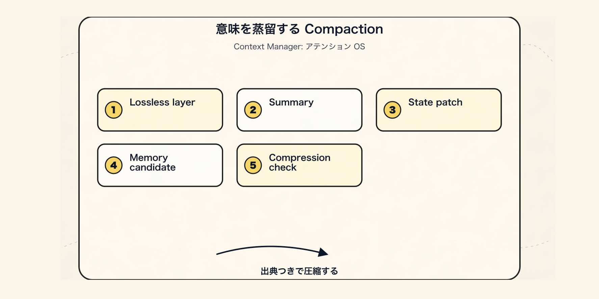

長いタスクでは必ずコンテキストウィンドウにぶつかる。

圧縮とは、次のようなものではない。

```text
上の会話を要約してください。
```

圧縮はこうあるべきだ。

```text
古いコンテキストから、将来の行動にまだ必要な情報を抽出し、その出所関係を保持する。
```

よい compaction は、少なくとも三種類のものを生成するべきだ。

```text
1. Summary
   モデルに渡す圧縮済みコンテキスト

2. State Patch
   Agent の現在状態を更新するもの

3. Memory Candidate
   長期記憶の候補。レビュー後に初めて memory に書き込む
```

この三つを一塊の自然言語 summary に混ぜてはいけない。

最も危険な圧縮設計はこうだ。

```text
古い messages を要約してから、古い履歴を削除する。
```

これは、システムの事実ソースを検査可能なイベントから lossy な自然言語の一段落へ変えてしまう。

より安定した設計では、二層に分ける必要がある。

```text
Lossless layer:
  raw messages / raw events / raw tool outputs / artifacts

Lossy layer:
  summaries / state snapshots / branch summaries / memory notes
```

監査境界を持つ意味蒸留チェーンとして理解してもよい。

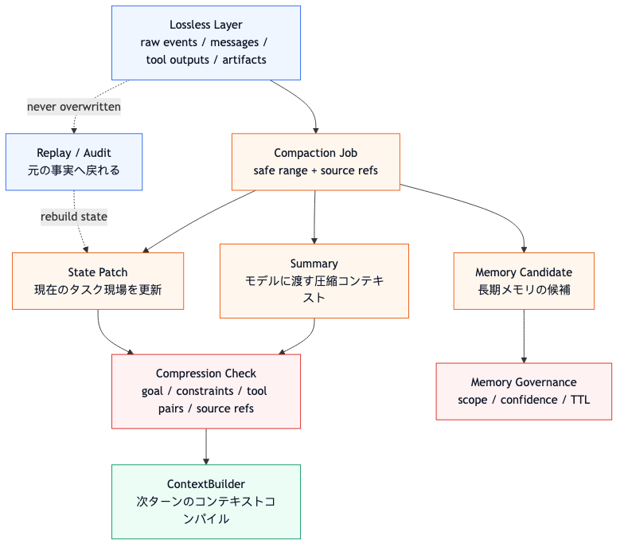

原則はとてもシンプルだ。

```text
元のイベントはできるだけ保持する。
モデルに渡すコンテキストは圧縮してよい。
summary には必ず provenance が必要。
summary は raw transcript を上書きしてはいけない。
summary は tool pair を分断してはいけない。
summary の後もタスクを継続実行できなければならない。
```

適切な compaction record には、少なくとも次のフィールドがあるべきだ。

```yaml
compaction_id: cmp_123
session_id: sess_456
summarized_range:
  from_message_id: msg_001
  to_message_id: msg_120
first_kept_message_id: msg_121
tokens_before: 82000
tokens_after: 18000

goal:
  user_goal: "失敗しているテストを修正し、検証する。"
  current_task: "serializer.test.ts の失敗しているアサーションを特定する。"

constraints:
  hard:
    - "public API を変更しない。"
    - "変更後に関連テストを必ず実行する。"

progress:
  done:
    - "parser テストはすでに通過した。"
  in_progress:
    - "serializer テストはまだ失敗している。"

files:
  read:
    - path: "src/parser.ts"
  modified:
    - path: "src/parser.ts"
      change_summary: "空白 token の処理を修正した。"

tools:
  important_results:
    - tool_call_id: "tool_123"
      summary: "pnpm test --filter parser は通過した。"
      artifact_ref: "artifact_789"

open_questions:
  - "serializer はプラス記号の両側の空白を保持する必要があるか？"

next_steps:
  - "src/serializer.ts と失敗しているテストを読む。"

provenance:
  source_event_ids: ["event_1", "event_2"]
  source_message_ids: ["msg_001", "msg_120"]
  summary_prompt_version: "v3"
```

圧縮後には、軽量なチェックも実行するべきだ。

```ts
type CompressionCheck = {
  preservesGoal: boolean;
  preservesConstraints: boolean;
  preservesCurrentPlan: boolean;
  preservesOpenToolPairs: boolean;
  preservesFileState: boolean;
  hasSourceRefs: boolean;
  estimatedInformationLoss: "low" | "medium" | "high";
};
```

いくつかの厳格なルールは、そのままテストとして書けます。

```text
summary に current_task がなければ、圧縮は失敗。
summary に next_steps がなければ、圧縮は失敗。
圧縮範囲に file write があるのに、summary に modified files がなければ、圧縮は失敗。
圧縮範囲に tool error があるのに、summary に errors/retries がなければ、圧縮は失敗。
tool call/result pair が分割されていたら、圧縮は失敗。
```

Compaction の目的は「コンテキストを短くすること」ではありません。

その目的は、コンテキストが短くなった後でも、Agent が自分は何者で、何をしていて、何をしてきて、次にどこへ進むべきかを把握している状態を保つことです。

## 八、推論経路：証拠を保存し、隠れた CoT は保存しない

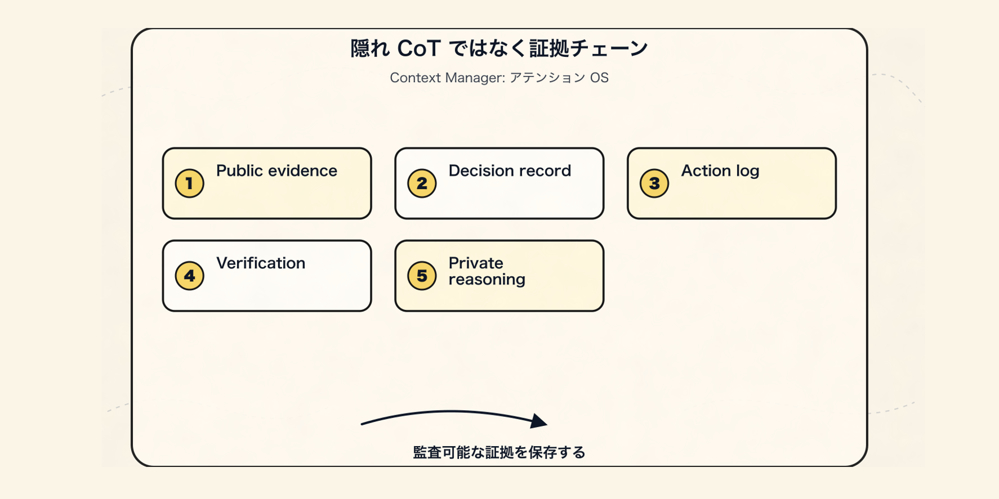

「推論経路を保持する」と言うとき、避けるべき誤解がある：

```text
不要试图保存模型隐藏 chain-of-thought。
```

エンジニアリング上、本当に保存すべきなのは監査可能な reasoning trace である：

```ts
type ReasoningTrace = {
  traceId: string;
  sessionId: string;
  runId: string;

  userGoal: string;

  assumptions: Array<{
    assumption: string;
    sourceRefs?: string[];
    confidence: number;
  }>;

  decisionLog: Array<{
    decisionId: string;
    decision: string;
    rationaleSummary: string;
    alternatives?: string[];
    evidenceRefs: string[];
  }>;

  evidenceLog: Array<{
    evidenceId: string;
    kind: "tool_result" | "file" | "user_message" | "memory" | "test" | "observation";
    ref: string;
    summary: string;
  }>;

  actionLog: Array<{
    actionId: string;
    actionType: "message" | "tool_call" | "file_edit" | "memory_write" | "branch" | "compact";
    eventId: string;
    resultEventId?: string;
  }>;

  validationLog: Array<{
    check: string;
    result: "pass" | "fail" | "skipped";
    evidenceRefs?: string[];
  }>;
};
```

これによって答えられるのは、次のような問いだ：

```text
Agent 为何调用这个ツール？
这个结论来自哪个ファイル？
哪次压缩后丢了何？
哪个分支引入了错误？
哪个用户约束被违反了？
最终回答有没有验证证据？
```

これらの問いに hidden CoT は必要ない。

必要なのは、イベント、証拠、意思決定の要約、操作記録、検証結果である。

## 九、Branch、Memory、Retrieval、Subagent はいずれも Context Manager を迂回できない

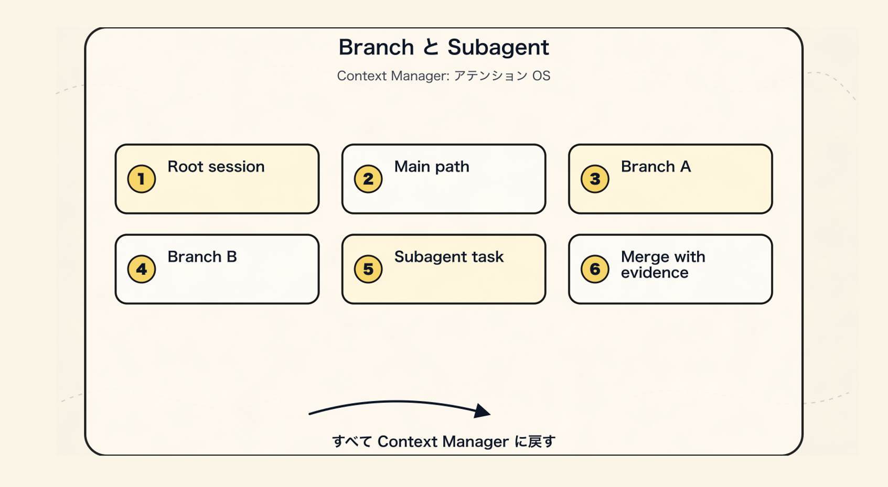

多くのコンテキストシステムが後期に制御不能になるのは、外部能力が Context Manager を迂回するためだ。

長期記憶が直接 prompt に入れるようになると、未検証の経験を現在の事実に変えてしまう。

検索結果が直接 prompt に入れるようになると、類似したテキストを証拠に変えてしまう。

子 Agent が長いレポートを直接メインコンテキストへ詰め戻せるようになると、隔離されていたコンテキストを再び汚染してしまう。

したがって、この三種類の能力はいずれも同じ経路でモデル入力に入るべきだ。

```text
Memory / Retrieval / Subagent output
-> source refs
-> scope / trust / freshness check
-> artifact or state update
-> Context Builder
-> Model Input
```

Memory には scope、confidence、TTL、source refs が必要だ。

Retrieval には query plan、citation、permission boundary、audit snapshot が必要だ。

Subagent は、単に「完了した」という一文を返すのではなく、summary、evidence refs、artifacts、risks、next steps を返すべきだ。

これが、前述した Memory Governance、Scoped Retrieval、Delegation Runtime が追加のトピックではなく、Context Manager の周辺血管である理由だ。

それらは最終的に、すべて同じ問いに戻ってくる。

```text
这些材料能不能进入本轮模型コンテキスト？
如果能，以何优先级、何信任等级、何预算进入？
如果不能，是否保存为 artifact 或 audit event？
```

複雑なタスクも、本質的に線形ではない。Agent はしばしば次のように動く。

```text
尝试方案 A
失败
回退
尝试方案 B
开 subagent 做研究
从旧状态 fork
比较两个结果
```

そのため session は、本来的にツリー構造をサポートすべきだ。

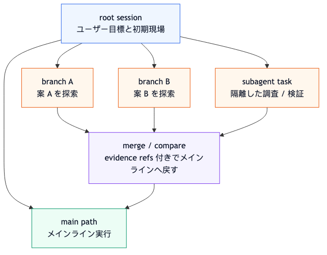

推奨する抽象は次のとおりだ。

```ts
type SessionNode = {
  nodeId: string;
  sessionId: string;
  parentNodeId?: string;

  eventId: string;
  messageId?: string;

  branchType: "main" | "fork" | "subagent" | "what_if";
  branchSummary?: string;

  createdAt: string;
};
```

一言で言えば：

> **分岐は探索の隔離であり、subagent はコンテキストの隔離である。**

## 十、完全なライフサイクル：1つのリクエストは Context Manager をどう流れるか

これらの層を組み合わせると、1つのリクエストのライフサイクルはおおよそ次のようになる。

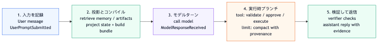

このフローの中で、モデルは1つのノードにすぎない。

それは唯一の状態マネジメント者ではない。

それは唯一のDecisionLog者でもない。

Harness は、モデルの判断を、復元可能で、監査可能で、検証可能なエンジニアリングシステムへ戻す役割を担う。

## 十一、MVP では何を先に作るべきか

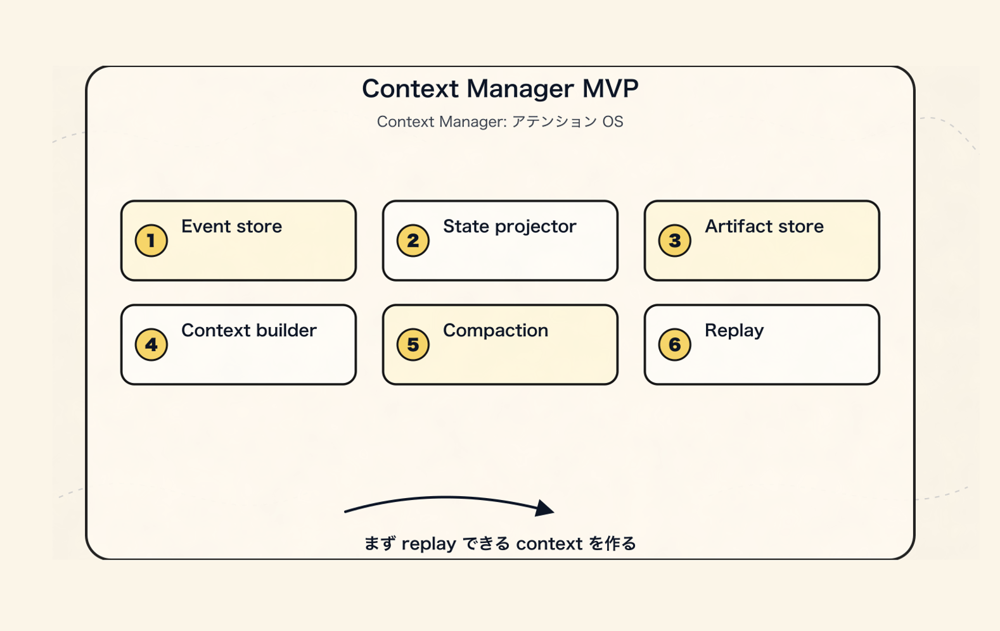

最初からすべてのモジュールを作り切ろうとしない。

ローカル CLI Agent の MVP では、まず次のものを作ればよい。

```text
sessions
messages
events
state_snapshots
artifacts
compactions
```

当面は作らなくてもよいもの：

```text
复杂向量 memory
多 agent 協調
自动 branch pruning
高级 eval
跨项目长期记忆
```

ただし MVP でも、最初からいくつかの能力は残しておくのが望ましい。

```text
每次用户输入写入 message + event。
每次ツール调用写入 event。
大型ツール输出写 artifact，message 只放摘要和引用。
每次模型调用前构建 ContextBundle。
超过 token 阈值时生成 structured summary。
保证 tool call/result pair 不被截断。
支持 resume。
支持导出 JSONL。
支持 /context 查看当前コンテキスト构成。
支持 /compact 手动压缩。
```

こうしておけば、システムがまだ小さくても、境界を誤ることはない。

初版の `ContextManager` は、次のインターフェースだけでもよい。

```ts
interface ContextManager {
  appendEvent(event: AgentEvent): Promise<void>;
  projectState(sessionId: string): Promise<AgentState>;
  buildContext(sessionId: string, input: BuildContextInput): Promise<ContextBundle>;
  compact(sessionId: string, policy?: CompressionPolicy): Promise<CompactionResult>;
  resume(sessionId: string, branchId?: string): Promise<AgentSession>;
}
```

複雑さは 3 つの pipeline に隠す。

```text
Event Pipeline:
  input / tool / model / system events -> append-only log

Projection Pipeline:
  events / messages / artifacts -> state snapshot

Context Pipeline:
  instructions + state + summary + recent messages + retrieval -> model context
```

これだけで、進化可能な Harness を支えるには十分だ。

## 十二、重要なエンジニアリング不変条件

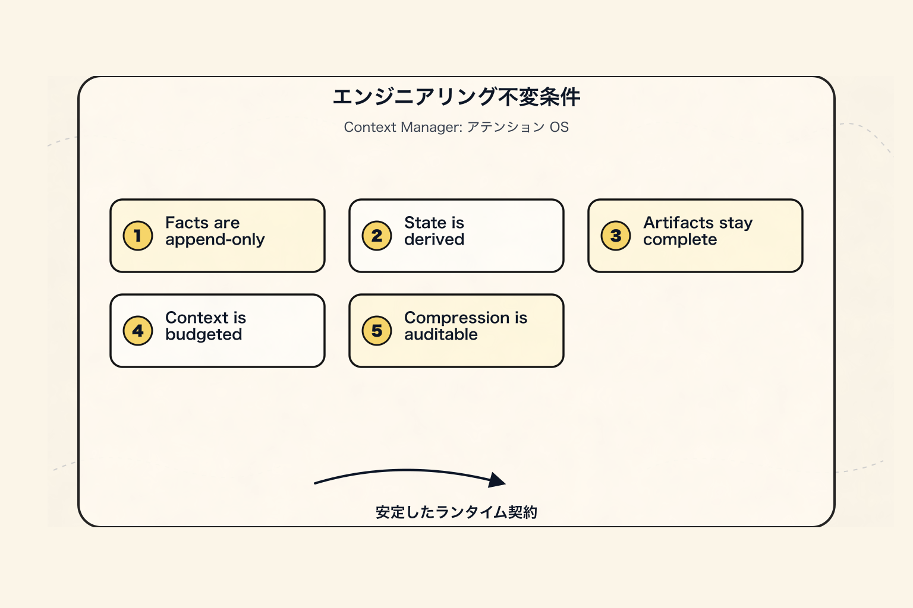

このパラダイムは、最終的にはテストに落とし込む必要がある。

以下の不変条件は、単体テストまたは replay verifier に直接組み込むべきだ。

```text
Invariant 1:
  Every tool_result must have a preceding tool_call.

Invariant 2:
  No pending tool_call can be removed by compaction.

Invariant 3:
  Every compaction summary must include source message range.

Invariant 4:
  Every file write event must be represented in state.artifacts or summary.files.modified.

Invariant 5:
  Current user request, active goal, and open questions must always be included in context.

Invariant 6:
  ContextBuilder output must be deterministic given same session state and retrieval result.

Invariant 7:
  Raw event log is append-only.

Invariant 8:
  Summary cannot overwrite raw transcript.

Invariant 9:
  Branch must not mutate ancestor branch.

Invariant 10:
  Memory writes require source refs.

Invariant 11:
  Long-term memory must have scope and expiry/update policy.

Invariant 12:
  ContextBundle must be explainable: every included segment should have reason and source.
```

これらのルールは、「prompt を少しうまく書く」ことよりも重要だ。

なぜなら、Agent の信頼性をモデルの感覚から、エンジニアリング上の制約へと引き戻すからだ。

## 十三、よくあるアンチパターン

### アンチパターン一：`messages[]` が世界そのもの

```text
すべての履歴が messages の中にある。
```

問題は、復元しにくく、圧縮しにくく、監査しにくく、分岐しにくく、説明しにくいことです。権限制御も非常に難しくなります。

### アンチパターン二：summary が履歴を上書きする

```text
圧縮後は summary だけを残し、元の記録を残さない。
```

問題は、再生できず、訂正できず、検証できず、summary が何を失ったのかも分からないことです。

### アンチパターン三：memory にスコープがない

```text
すべての記憶を 1 つのベクトルデータベースに入れる。
```

問題は、プロジェクト間の汚染、ユーザー間の汚染、一時的な事実の長期化、古い知識の誤用、機密情報の拡散です。

### アンチパターン四：ツール結果をそのままコンテキストに詰め込む

```text
コマンド出力、ファイル全文、ログをすべて prompt に詰め込む。
```

問題は、token の爆発、ノイズの増加、重要点の喪失です。セキュリティリスクも上がります。

### アンチパターン五：圧縮を自然言語の要約だけで行う

```text
「上の会話を要約してください。」
```

問題は、目的、制約、ファイル状態、エラー、意思決定、次のステップがすべて圧縮で失われる可能性があることです。

### アンチパターン六：prompt を policy と見なす

```text
危険なことをしないように system prompt に書くだけ。
```

問題は、検証できず、強制できず、監査できず、テストできないことです。決定的なルールは policy、permission、hook、validator に入るべきであり、prompt だけに置くべきではありません。

## 十四、前章までとの関係

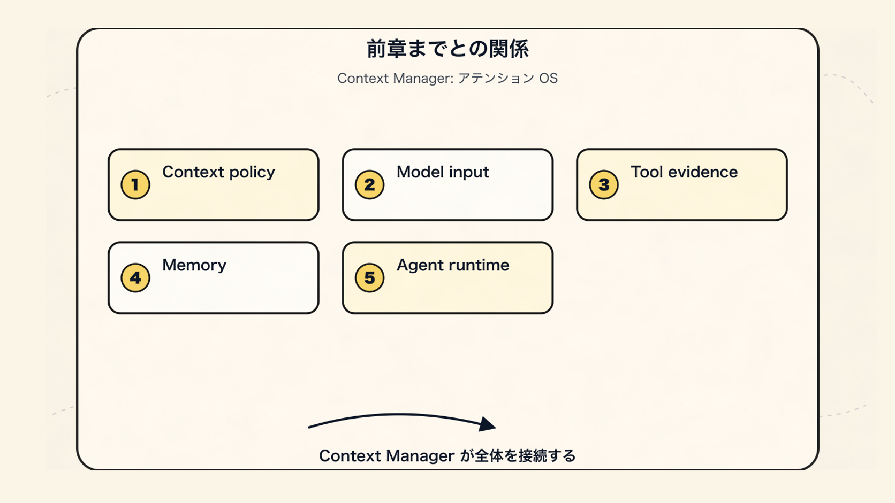

この章は前文を否定するものではなく、前文をより大きな図の中に置き直すものです。

| 章 | 新しいパラダイムにおける位置づけ |
| --- | --- |
| 00-13 Tool Runtime | ツールの副作用と observation の生成者 |
| 00-15 Context Policy | Context Builder 内部の投影戦略 |
| 00-16 Session Replay | Event Log と State Projection の復元メカニズム |
| 00-19 Trace Analysis | Event Log から投影される診断ビュー |
| 00-20 Memory Governance | Memory が Context Builder に入る前の書き込みガバナンス |
| 00-21 Scoped Retrieval | Retrieval が Context Builder に入る前の証拠ガバナンス |
| 00-23 Hosted Harness | session、event、artifact、sandbox を durable runtime に入れる |

したがって、新しい主線は次のように覚えられます。

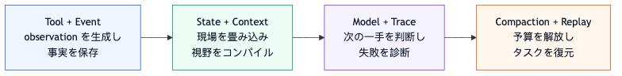

ここまで来ると、Context Manager はもはや prompt のユーティリティ関数ではありません。

それは Agent Harness のランタイム中枢になります。

最後に、この章を一文にまとめるとこうなります。

**Context Manager はチャット履歴マネージャーではなく、Agent の注意力、記憶、行動境界のオペレーティングシステムです。**

この境界が確立されてはじめて、Agent の長期実行には土台ができます。

---

GitHub アドレス: [01-context-manager-attention-os.md](https://github.com/LienJack/learn-agent/blob/main/src/content/blog/ja/AI/agent-design-paradigms/01-context-manager-attention-os.md)
