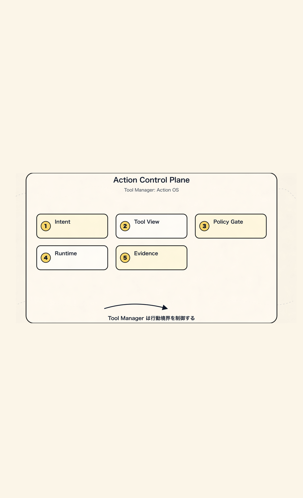
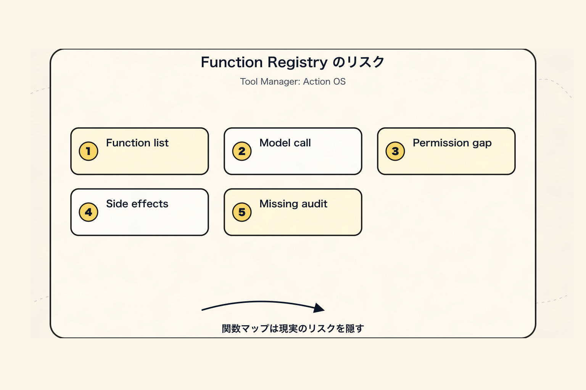
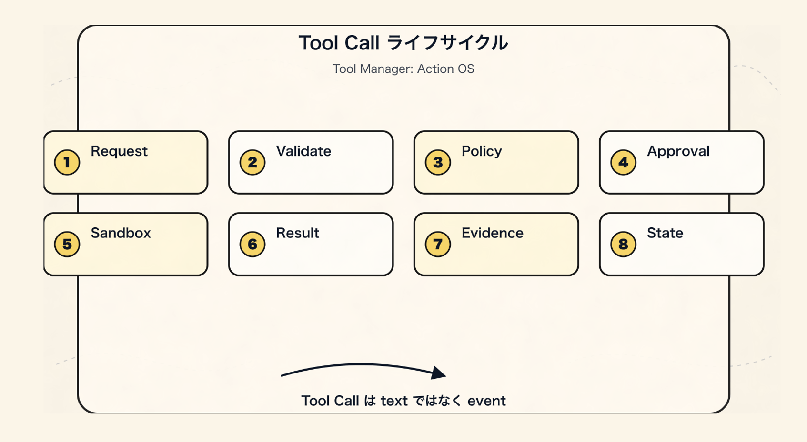
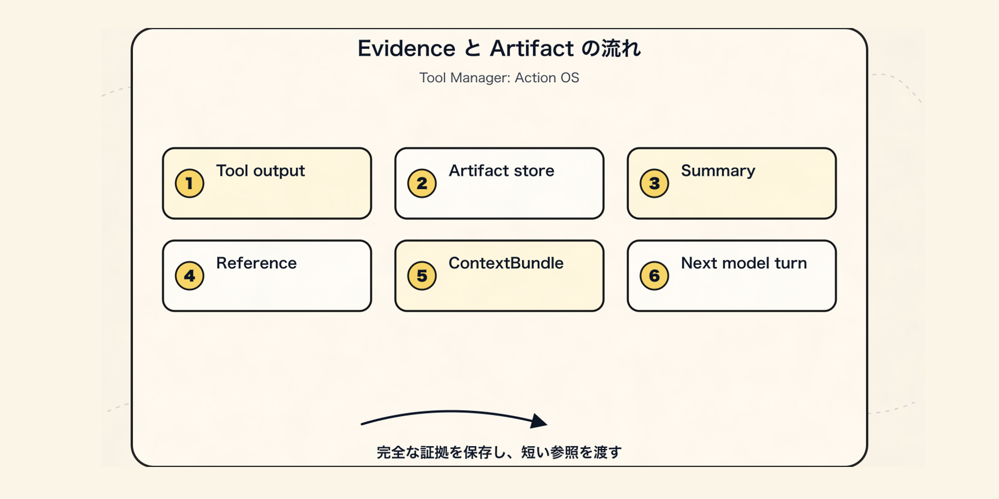
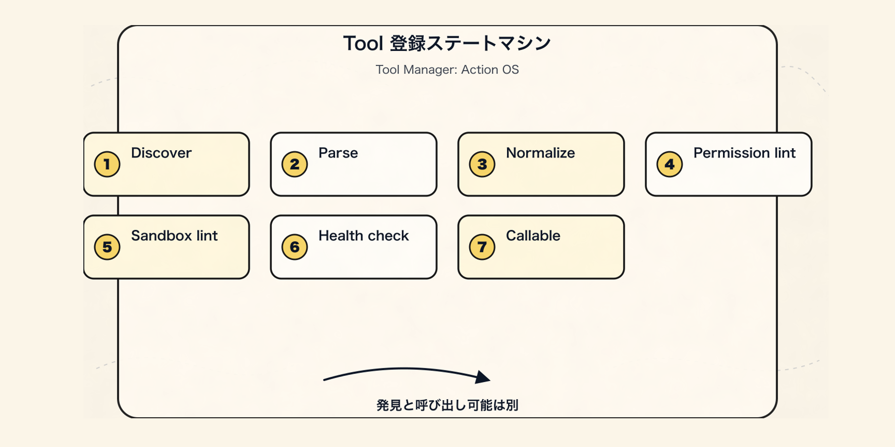
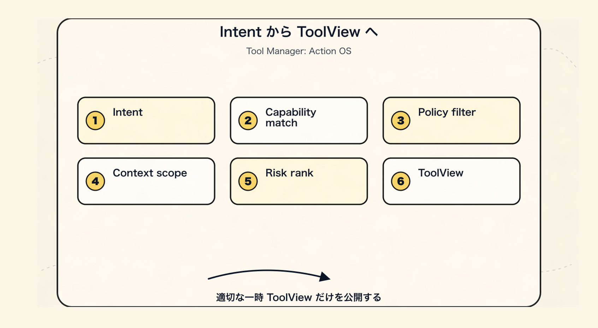
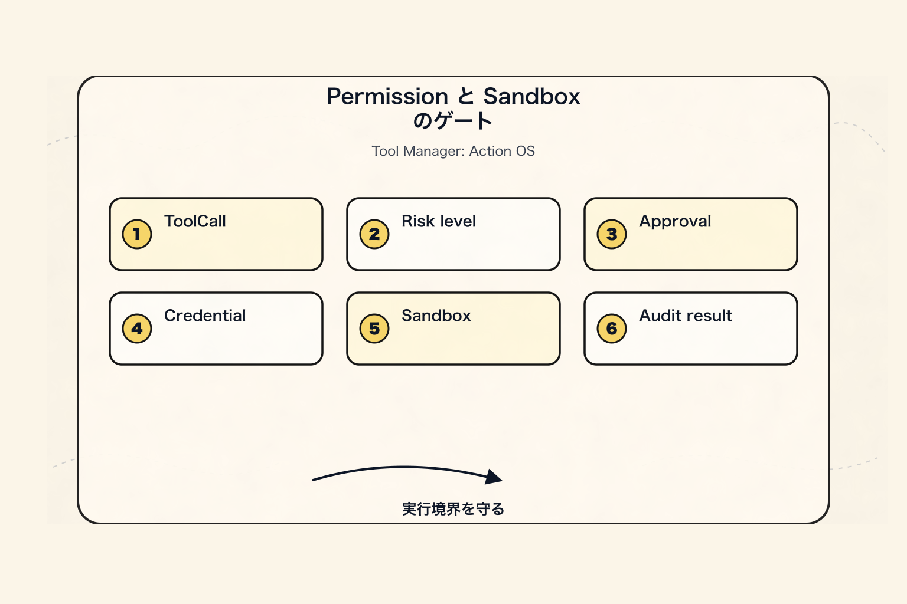
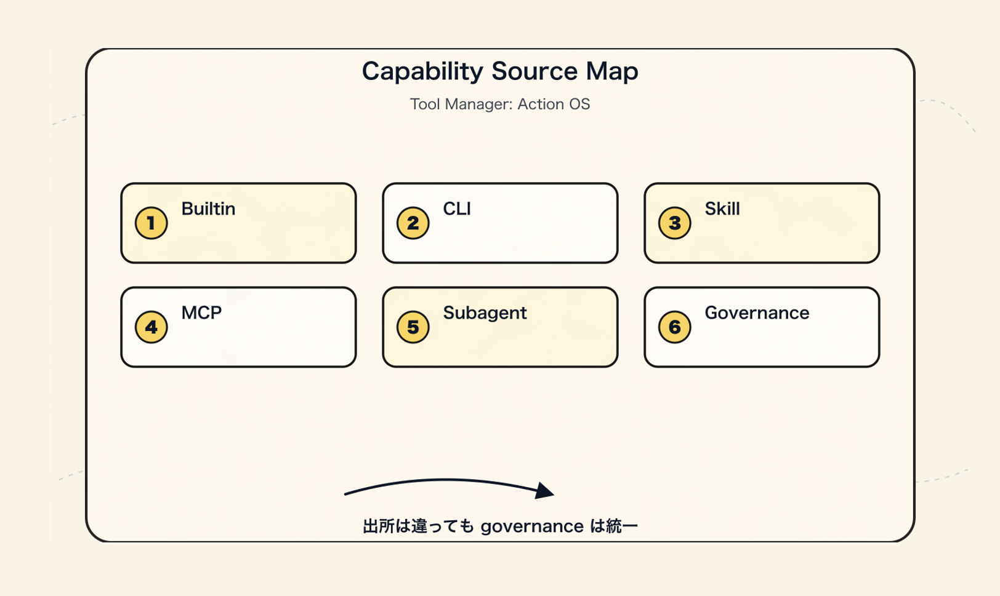
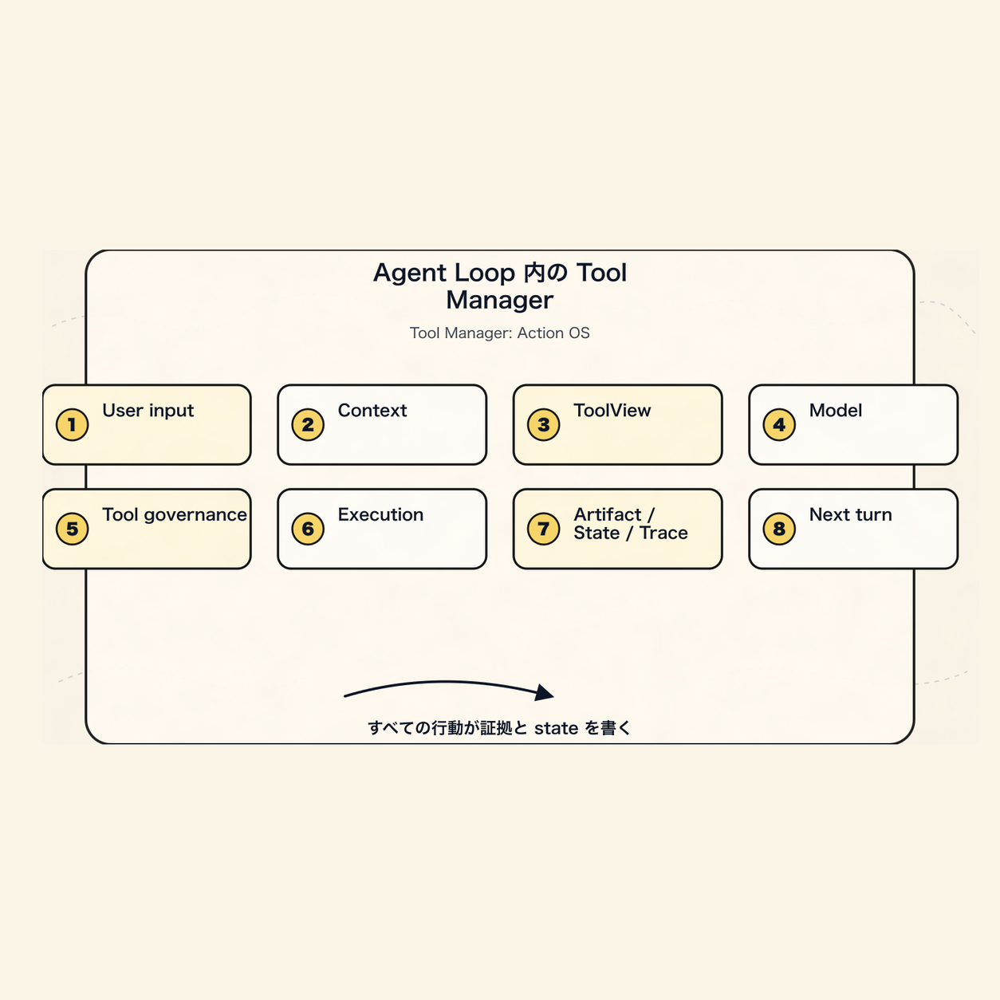
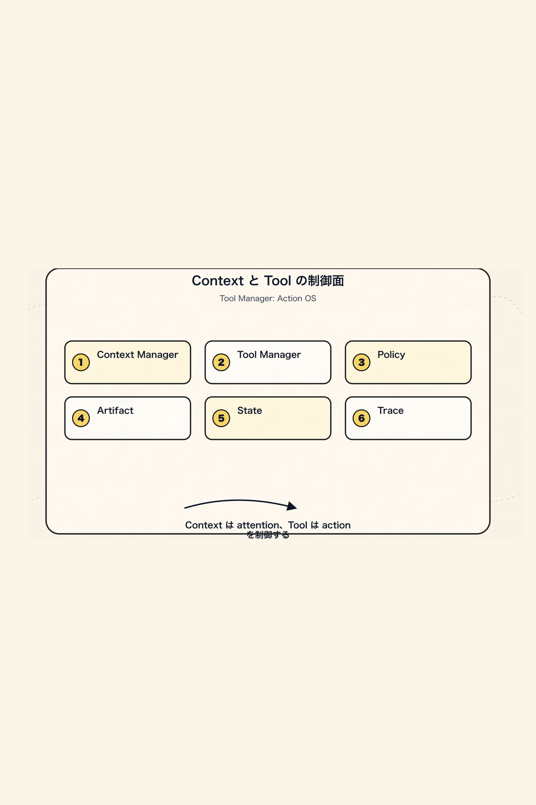

# Tool Manager の新しいパラダイム：Agent の行動オペレーティングシステム

第1章の [Context Manager](/blog/AI/agent-design-paradigms/01-context-manager-attention-os) が答えたのは、

> Agent はこのターンで何を知っているべきか？

第2章の [長期記憶と自己最適化](/blog/AI/agent-design-paradigms/02-agent-long-term-memory-self-upgrade) が答えたのは、

> Agent は経験をどのように記憶、スキル、評価可能なアップグレードへと蓄積するのか？

だとすると、第3章が答えるのは、同じく基盤的なもう一つの問いです。

> Agent が行動したいとき、システムはその意図をどのように、制御可能で、監査可能で、復旧可能な実際のアクションへ変換するのか？

中心となる主張を先に置いておきます。

> **Agent Tool Manager は function registry ではなく、能力、意図、権限、環境、認証情報、実行、副作用、監査を中心にした行動ガバナンス層である。**

言い換えると、Tool Manager がマネジメントするのは、

```text
有哪些函数可以调用？
```

ではありません。

そうではなく、

```text
Agent 在当前意图、权限、环境、预算和风险下，
可以使用哪些能力？
为何使用？
以何身份使用？
在哪个沙盒里使用？
会影响哪些资源？
需要谁批准？
结果如何验证？
产生了哪些证据？
之后是否すべき更新状态、记忆或コンテキスト？
```

です。

より安定した定義は次のようになります。

```text
ToolCall_t = f(
  Intent,
  Capability,
  Policy,
  Principal,
  Credentials,
  Environment,
  State,
  Sandbox,
  Budget,
  Approval,
  Evidence
)
```

したがって Tool Manager は「ツール一覧」ではなく、Agent の **Action Operating System** です。



この連載では引き続き同じ例を使います。ある CLI Agent がテスト失敗を修正しているとします。ファイルを読み、コードを検索し、テストを実行し、コードを変更し、再度検証する必要があります。これらのアクションが実ファイル、実コマンド、実ネットワーク、実アカウントに触れ始めた瞬間、Tool Manager は単なる `name + schema + handler` ではいられません。

まず、ここで一つ境界を明確にしておきます。

```text
Agent 不直接拥有ツール。
Agent 只在某一轮、某个意图、某个权限范围内，获得一组临时能力视图。
```

モデルは行動を提案できます。

Planner は意図を整理できます。

しかし、「行動したい」を「どのような方法で行動を許可するか」へ翻訳する責任を持つのは Tool Manager です。

この三つを混ぜてしまうと、システムはすぐに次のような状態へ劣化します。

```text
模型想做何，就找个ツール去做。
```

新しいパラダイムが表現したいのは、次のことです。

```text
模型只能在被编译出来的能力租约里提出调用。
真实执行必须经过 runtime 的确定性边界。
```

## 一、第一原理から Tool を定義する

多くの Agent demo では、tool を次のように理解しています。

```text
name + description + JSON schema + function handler
```

これは demo を動かすには十分ですが、複雑なタスクを支えるには足りません。

本当に複雑になると、tool は副作用、権限、実行環境、監査要件を持つ能力の集合になります。

より堅牢な定義は次のとおりです。

```text
Tool = Capability Contract + Invocation Protocol + Execution Boundary + Evidence Producer
```

つまり：

```text
Tool 是一种被 Agent 调用的外部能力契约。
它描述：
  能做何
  何时候该用
  输入是何
  输出是何
  会读写何
  是否有副作用
  需要何权限
  在哪里执行
  如何验证结果
  如何审计和回放
```

ここでは、前章で最も重要だった原則を引き継ぐ必要があります。

> **モデルに渡すコンテキストは一時的なコンパイル済みビューにすぎず、事実の源泉にしてはならない。**

同様に、モデルに渡す tool schema も、1 回のモデル呼び出し前における「能力ビュー」にすぎず、システム内の完全な tool truth ではありません。

システム内部では、canonical registry、権限、認証情報、実行記録、artifact、trace を保持し、そのうえで現在のタスクに応じて動的にコンパイルしてモデルへ渡すべきです。

一言でいうと：

> **Tool Schema はコンパイル成果物であり、Tool そのものではない。**

## 二、まず旧モデルではなぜ不十分なのかを見る

もっとも素朴なツールシステムは、たいてい次のような形になります。

```ts
const tools = {
  read_file,
  write_file,
  bash,
  search_web,
  call_api,
};
```

そして各ターンで、これらのツールをすべてモデルに渡します。

```ts
const response = await model.call({
  messages,
  tools,
});

if (response.toolCall) {
  const result = await tools[response.toolCall.name](response.toolCall.args);
  messages.push(result);
}
```

このコードはとても理解しやすいです。

問題もまさにそこにあります。ツール呼び出しを、単なる通常の関数呼び出しとして扱っているからです。



「失敗しているテストを修正する」タスクでは、ツール呼び出しには次のようなものが含まれ得ます。

```text
ファイルを読む
コードを検索する
テストを実行する
ファイルを変更する
diff を生成する
ネットワークへアクセスする
環境変数を読む
shell を実行する
MCP server を呼び出す
subagent に委譲する
PR を提出する
issue を作成する
メッセージを送信する
サービスをデプロイする
リソースを削除する
```

これらのアクションのリスクはまったく異なります。

`read_file` も `rm -rf` も、どちらも shell 経由で現れ得ます。

`github.search_issue` と `github.create_issue` は、どちらも同じ GitHub client から来るかもしれません。

`skill` 内のスクリプトはローカルファイルを読み書きするかもしれませんし、ネットワークへアクセスするかもしれません。

システムがそれらを単なる関数としてしか見ていない場合、次のような問いに答えるのは難しくなります。

```text
なぜこのツールを呼び出すのか？
なぜ別のツールではないのか？
この呼び出しはユーザーの意図を超えていないか？
引数は検証済みか？
どのリソースを読むのか？
どのリソースに書き込むのか？
ユーザーデータを外部へ送信しないか？
どの identity と scope を使うのか？
ユーザー承認が必要か？
どのサンドボックスで実行するのか？
完全な結果はどこに保存されるのか？
今回の呼び出しは state、memory、context にどう影響するのか？
```

したがって、Tool Manager の第一の境界は次のとおりです。

```text
tool を関数 map として設計してはいけない。
tool は、行動が現実世界へ入る前のガバナンスプロトコルとして設計すべきである。
```

## 三、新しいパラダイム：Tool Manager はアクション制御面

誤ったパラダイムは次のようなものです。

```text
モデルがすべてのツールを見る。
モデルがどのツールを呼び出すかを決める。
runtime が関数の実行を担当する。
結果が次の message になる。
```

この設計は初期には速いものの、後半になると多くの問題にぶつかります。

```text
権限が prompt 依存で、強制できない。
ツールが粗すぎて、intent が不明確。
副作用が見えない。
認証情報が環境変数に散らばる。
ツール結果がコンテキストを直接汚染する。
なぜ呼び出したのかを監査できない。
呼び出し前後の状態差分がわからない。
dry-run、approval、rollback ができない。
read、write、external_write、destructive を区別できない。
CLI、Skill、MCP、API、subagent など複数のソースに適応できない。
```

より安定したレイヤリングは次のようになります。

```text
事実ソース層
  Tool Registry
  Tool Versions
  Permission Grants
  Credential Bindings
  Runtime Config
  Tool Events
  Tool Artifacts

        ↓ resolve / filter / redact / compile

モデル可視層
  Tool Names
  Tool Descriptions
  JSON Schemas
  Intent Hints
  Policy Hints
  Risk Hints
  Required Approval Hints
  Output Projection Rules
  Short Output Preview

        ↓ model proposes call

実行制御層
  Arg Validation
  Policy Check
  Approval
  Sandbox
  Credential Broker
  Runtime Adapter
  Verifier

        ↓ result projection

状態セマンティクス層
  State Patch
  Evidence
  Trace
  Memory Candidate
  Context Update
```

これらのレイヤーのうち、モデルに送られるのは「モデル可視層」だけです。

それ以外はすべて Harness のランタイム制御面に属します。

つまり：

> **Tool Manager の本質は、モデルが提示した「何かをしたい」という意図を、検証済み・認可済み・隔離済み・監査可能な実際のアクションに変換することです。**

これは Context Manager のレイヤリングと非常によく似ています。

```text
Tool Registry / Events / Artifacts は事実ソース。
Tool Candidate / Tool View はセマンティックな投影。
Tool Schema / Provider Payload は一回限りのコンパイル成果物。
```

一言で言えば：

> **モデルに渡すツール一覧は一時的なビューにすぎず、システム能力の境界そのものではありません。**

より正確に言うと、ToolView は短期的な能力リース（capability lease）のようなものです。

```text
このモデル呼び出しが、このタスク段階で、
どのツールを見られるのか、
なぜ見られるのか、
呼び出し時にどの制約を満たす必要があるのか、
結果が最大どのようにコンテキストへ戻るのか。
```

これは恒久的な認可ではなく、完全な権限でもありません。

次のラウンドで状態、権限、予算、リスク、またはユーザー意図が変化したら、ToolView は再解析され、再コンパイルされるべきです。

## 4. Tool Manager の長期的に安定した 12 の原則

この部分は、そのまま 12 個のエンジニアリング原則に圧縮できる。

### 原則 1：Tool は能力契約であり、関数ではない

関数が説明するのは、どう実行するかだけだ。

Tool はさらに、次のことも説明しなければならない。

```text
用途
境界
権限
リスク
副作用
入力出力
リトライ可能性
冪等性
リソースアクセス
実行環境
結果の検証方法
```

これらのフィールドがなければ、いわゆる tool はただの function calling wrapper にすぎない。

### 原則 2：Intent と Tool Implementation は分離しなければならない

ユーザーがこう言ったとする。

```text
この bug をちょっと直して。
```

これは、システムがただちに次を呼び出すべきだ、という意味ではない。

```text
bash("npm test")
edit_file(...)
git commit
```

その間には、明示的な intent の階層があるべきだ。

```text
UserIntent
  ユーザーが達成したいこと

TaskIntent
  現在のタスクが何か

ActionIntent
  次のアクション種別が何か

ToolIntent
  なぜ特定のツールが必要なのか

ToolCall
  実際にどのツールを呼び出し、引数は何か
```

こうして初めて、システムは次の問いに答えられる。

```text
なぜこのツールを呼び出すのか？
なぜ別のツールを使わないのか？
このツール呼び出しはユーザー意図を超えていないか？
先に read してから write すべきか？
承認が必要か？
```

### 原則 3：Tool Call は因果イベントであり、通常のテキストではない

ツール呼び出しは、ファイルを読み書きし、ネットワークにアクセスし、コストを発生させ、メッセージを送り、サービスをデプロイし、リソースを削除し、プライバシーを露出させる可能性がある。

そのため、単なる assistant message の付属フィールドとしてではなく、event log と trace に入らなければならない。

より堅牢な流れは次のようになる。

```text
ToolCallRequested
  -> ToolArgsValidated
    -> ToolPolicyChecked
      -> ApprovalRequested?
        -> ApprovalGranted?
          -> ToolCallStarted
            -> ToolCallFinished
              -> ToolResultValidated
                -> ArtifactPersisted
                  -> StateUpdated
                    -> TraceUpdated
```

この流れは将来、監査、リプレイ、復旧、振り返り、eval に使える。



### 原則 4：権限、サンドボックス、hook、validator は決定的な境界である

system prompt にこう書くだけではいけない。

```text
危険なコマンドを実行しない。
secret を漏らさない。
ファイルを削除しない。
```

それだけでは不十分だ。

次のものが必要になる。

```text
Policy Engine
Permission Grant
Sandbox Runtime
Credential Broker
PreToolUse Hook
PostToolUse Hook
Verifier
Audit Log
```

Prompt は期待を表現できる。

Runtime は強制を担わなければならない。

### 原則 5：ツール結果は証拠であり、コンテキストのゴミ箱ではない

大きな出力をそのまま prompt に詰め込むべきではない。

```text
完全なログ
完全な Web ページ
完全なファイル
完全な SQL クエリ結果
完全なテスト出力
完全な diff
完全なスクリーンショット OCR
```

正しいパターンは次のとおりだ。

```text
完全な出力 -> Artifact Store
重要な事実 -> Tool Result Preview
引用可能な断片 -> Evidence Ref
現在必要な情報 -> ContextBundle
```

Context Manager は、次のターンでモデルが何を見るべきかをマネジメントする。

Tool Manager は、ツール結果をどのように証拠へ変換するかをマネジメントする。

Artifact Manager は、完全な出力をどこに保存するかをマネジメントする。

この 3 つを 1 つの `messages[]` に混ぜてはいけない。



### 原則 6：Tool Registry は事実のソースであり、Tool View はコンパイル成果物である

内部には、安定した canonical tool model があるべきだ。

```text
Canonical Tool Descriptor
  ↓ adapter
OpenAI tool schema
Anthropic tool schema
MCP tool schema
CLI command schema
Skill activation schema
Internal function call
```

コア構造を、特定モデルベンダーの function calling 形式に結びつけてはいけない。

より安定しているのは次の形だ。

```text
Canonical Internal Model
  ↓ adapter
Provider-specific Payload
```

### 原則 7：Read、Write、External Side Effect、Destructive は必ず分離する

このような万能ツールを設計してはいけない。

```text
github_api(method, path, body)
database_query(sql)
shell(command)
browser(action, selector)
```

より安定しているのは次の形だ。

```text
github.search_issues       read
github.create_issue        external_write
github.close_issue         destructive-ish

db.select                  read
db.update                  write
db.drop_table              destructive

file.read                  read
file.write                 workspace_write
file.delete                destructive
```

リスクが異なれば、承認も異なり、監査も異なる。ツールの説明も異なるべきだ。

### 原則 8：認証情報はコンテキストではなく、Credential Broker がマネジメントする

モデルが以下を見るべきではない。

```text
API token
OAuth refresh token
SSH key
数据库密码
cookie
session secret
```

モデルが見るべきなのは、以下だけだ。

```text
这个ツール可以代表哪个 principal 做何。
当前有哪些 scope。
是否需要重新授权。
```

認証情報は runtime に入る。

認証情報の参照は tool call に入る。

認証情報の平文は prompt、message、tool result、artifact preview に入らない。

### 原則 9：Tool Metadata は eval する

ツール名、説明、パラメータ説明は、モデルがいつそれを選ぶか、どう引数を埋めるかに直接影響する。

そのため、各 tool には以下を設定すべきだ。

```text
golden prompts
negative prompts
expected tool choice
expected args
precision / recall
argument validity
unsafe call rate
approval trigger rate
```

Tool description は文案ではなく、モデルがツールを選ぶための制御面だ。

### 原則 10：CLI、Skill、MCP は異なるレイヤーであり、同じ種類として混ぜてはいけない

これらは同じものではない。

```text
CLI    是执行形态 / runtime adapter
Skill  是程序性知识包 / workflow package
MCP    是ツール和コンテキスト能力的互操作协议
```

いずれも Tool Manager に入ることはできるが、入る位置が異なる。

```text
CLI 进入 Execution Adapter。
Skill 进入 Intent / Procedure / Context Activation。
MCP 进入 Capability Discovery / Protocol Adapter。
```

### 原則 11：Subagent / Handoff も tool-like capability の一種である

Agent がタスクを別の Agent に渡すとき、それは本質的には制御された呼び出しでもある。

```text
input schema
output schema
allowed context
allowed tools
budget
timeout
permission
summary result
trace
```

良い subagent 呼び出しは次のようなものだ。

```text
主 Agent 给目标、约束、证据引用。
Subagent 在隔离 context 中工作。
Subagent 只返回 summary、result、artifacts 和 risk。
主 Agent 不继承完整中间噪声。
```

### 原則 12：Tool Manager は再生可能・説明可能・取り消し可能でなければならない

システムは次の問いに答えられるべきです。

```text
Agent はなぜこのツールを呼び出したのか？
呼び出し前にモデルにはどのツールが見えていたのか？
どのツールが policy によってフィルタリングされたのか？
このパラメータは誰が生成したのか？
ユーザー承認を経たのか？
どの identity と scope を使ったのか？
どの sandbox で実行されたのか？
どのリソースを読み書きしたのか？
完全な出力はどこにあるのか？
結果は verifier に受け入れられたのか？
この呼び出しは state / memory / artifact にどう影響したのか？
```

これらの問いに答えられないなら、Agent の行動はまだ本当の意味でエンジニアリングされていません。

## 五、安定した Tool Ontology

成熟した Tool Manager は、少なくともこれらのオブジェクトを区別すべきです。

```text
ToolSource        ツールの出所：builtin / cli / skill / mcp / http / subagent
ToolDescriptor    ツール能力の契約
ToolRegistration  ツール登録状態
ToolVersion       ツールバージョン
ToolIntent        ツール利用意図
ToolCandidate     候補ツール
ToolView          モデルに見せるためにコンパイルされたツールビュー
ToolCall          1 回のツール呼び出し
ToolResult        ツール結果
ToolArtifact      完全な出力と証拠
ToolPolicy        権限、リスク、予算、セキュリティルール
PermissionGrant   認可記録
CredentialBinding 認証情報のバインディング
SandboxPolicy     実行分離ポリシー
ToolTrace         監査可能な経路
ToolEval          ツール選択と実行品質の評価
```

これらのオブジェクトは責務が異なるため、すべてを 1 つの

```ts
const tools = [];
```

の中に混ぜ込むべきではありません。

## 六、ToolDescriptor：能力契約

`ToolDescriptor` は Tool Manager の中核となるオブジェクトです。

これはモデルに見せる最終的な schema ではなく、システム内部の canonical descriptor です。

最小限のフィールドは、まず次のように設計できます。

```ts
type ToolDescriptor = {
  toolId: string;
  canonicalName: string;
  displayName: string;
  version: string;

  source: {
    type: "builtin" | "cli" | "skill" | "mcp" | "http" | "subagent";
    sourceId: string;
    packageName?: string;
    serverId?: string;
    command?: string;
    uri?: string;
  };

  lifecycle: {
    status: "discovered" | "verified" | "enabled" | "disabled" | "deprecated" | "blocked";
    registeredAt: string;
    updatedAt: string;
    owner?: string;
  };

  description: {
    summary: string;
    useWhen: string[];
    doNotUseWhen: string[];
    examples?: Array<{
      userRequest: string;
      expectedArgs: unknown;
    }>;
  };

  intent: {
    actionTypes: ActionType[];
    domains: string[];
    requiredUserIntent?: string[];
    negativeIntentHints?: string[];
  };

  schemas: {
    inputSchema: JSONSchema;
    outputSchema?: JSONSchema;
    errorSchema?: JSONSchema;
  };

  effects: {
    reads: ResourcePattern[];
    writes: ResourcePattern[];
    deletes?: ResourcePattern[];
    externalCalls: boolean;
    sendsUserData: boolean;
    mutatesState: boolean;
    idempotent: boolean;
    reversible: boolean;
    dryRunSupported: boolean;
  };

  risk: {
    level: "low" | "medium" | "high" | "critical";
    destructive: boolean;
    openWorld: boolean;
    financialCost?: "none" | "low" | "metered" | "unknown";
    privacyRisk?: "none" | "low" | "medium" | "high";
  };

  permissions: {
    approvalPolicy: "never" | "on_request" | "on_risk" | "always";
    requiredScopes: string[];
    allowedPrincipals?: string[];
    blockedPrincipals?: string[];
    tenantBoundary?: "user" | "org" | "workspace" | "project";
  };

  sandbox: {
    mode:
      | "none"
      | "read_only"
      | "workspace_write"
      | "network_restricted"
      | "container"
      | "vm"
      | "remote_api";
    filesystem?: {
      readRoots: string[];
      writeRoots: string[];
      blockedPaths: string[];
    };
    network?: {
      allowDomains: string[];
      denyDomains: string[];
      egressPolicy: "none" | "allowlist" | "open";
    };
    limits?: {
      timeoutMs: number;
      maxMemoryMb?: number;
      maxOutputBytes?: number;
      maxCostUsd?: number;
    };
  };

  credentials: {
    strategy: "none" | "system" | "user_oauth" | "service_account" | "delegated";
    requiredSecrets?: string[];
    tokenAudience?: string;
    scopeCheckRequired: boolean;
  };

  contextPolicy: {
    exposeToModel: boolean;
    exposeOutputToModel: "none" | "preview" | "structured" | "full";
    maxOutputPreviewTokens: number;
    redactionPolicy?: string;
  };

  execution: {
    adapter: string;
    timeoutMs: number;
    retryPolicy: {
      maxRetries: number;
      retryOn: string[];
      backoffMs?: number;
    };
  };

  hooks: {
    preCall?: string[];
    postCall?: string[];
    verifier?: string[];
    onError?: string[];
  };

  observability: {
    logArgs: boolean;
    logResultPreview: boolean;
    auditLevel: "none" | "basic" | "full";
  };

  provenance: {
    manifestHash?: string;
    signature?: string;
    sourceRefs?: string[];
    trustLevel: "first_party" | "workspace" | "third_party" | "untrusted";
  };
};
```

ここで最も重要なのは次の点です：

```text
effects
risk
permissions
sandbox
credentials
contextPolicy
```

これらのフィールドがなければ、Tool Manager はツール関数のレジストリへと退化してしまいます。

## 七、ActionType：統一されたアクション分類

`ActionType` は権限と承認に直接影響する。

まずは安定した enum のセットを使うのがおすすめ：

```ts
type ActionType =
  | "read"
  | "search"
  | "inspect"
  | "compute"
  | "transform"
  | "generate"
  | "write"
  | "patch"
  | "execute"
  | "deploy"
  | "external_send"
  | "purchase"
  | "delete"
  | "admin"
  | "auth"
  | "memory_read"
  | "memory_write"
  | "subagent_delegate";
```

おおよそ次のように階層化できる：

```text
read / search / inspect
  通常は低リスクで、自動実行できる。

compute / transform / generate
  低〜中リスク。ファイルの読み書きやネットワークアクセスの有無に依存する。

write / patch
  workspace 権限が必要で、重要な diff は可視化される必要がある。

external_send
  情報を外部システムへ送信するため、デフォルトではユーザー確認が必要。

delete / admin / purchase / deploy
  高リスクで、デフォルトでは強い承認が必要。

auth
  モデルに secret を直接扱わせてはいけない。
```

このステップの価値は、システムが tool name とは別に、安定したリスク言語を持てるようになることにある。

## 八、ToolIntent：なぜツールを使うのか

`ToolIntent` が保持するのは、ツール呼び出しの公開された理由です。

これは隠れた思考チェーンではなく、監査可能な行動サマリーです。

```ts
type ToolIntent = {
  intentId: string;
  sessionId: string;
  runId: string;

  userGoal: string;
  currentTask: string;

  actionType: ActionType;
  target?: {
    kind: "file" | "repo" | "url" | "api" | "database" | "calendar" | "email" | "memory" | "agent";
    ref: string;
  };

  expectedEffect: {
    read?: string[];
    write?: string[];
    externalSideEffect?: boolean;
    userVisibleSideEffect?: boolean;
  };

  constraints: {
    mustNot?: string[];
    requireConfirmation?: boolean;
    maxCostUsd?: number;
    deadlineMs?: number;
  };

  rationaleSummary: string;
  evidenceRefs: string[];
  confidence: number;

  createdAt: string;
};
```

例えば：

```yaml
userGoal: "修复测试失败，并验证"
currentTask: "确认 serializer.test.ts 的失败原因"
actionType: "execute"
target:
  kind: "repo"
  ref: "workspace"
expectedEffect:
  read:
    - "workspace.files"
  write:
    - "coverage or temp outputs"
rationaleSummary: "运行相关测试，确认当前失败是否可复现，并收集错误输出"
```

`ToolIntent` があって初めて、Tool Manager は「モデルがテストを実行したい」という意図を、「現在の権限でどのテストコマンドの実行を許可するか、どのワークスペースで実行するか、出力をどのように保存するか」へ変換できます。

## 九、ToolCall と ToolResult は単なる文字列であってはならない

実際のツール呼び出しは、少なくとも次のような形であるべきです。

```ts
type ToolCall = {
  toolCallId: string;
  sessionId: string;
  runId: string;
  parentEventId?: string;

  intentId?: string;
  toolId: string;
  toolVersion: string;

  proposedBy: "model" | "planner" | "user" | "system" | "subagent";
  args: unknown;
  resolvedArgs?: unknown;

  prediction: {
    expectedReads: ResourceRef[];
    expectedWrites: ResourceRef[];
    expectedExternalCalls: string[];
    expectedCostUsd?: number;
  };

  authorization: {
    status: "not_required" | "pending" | "granted" | "denied" | "expired";
    grantId?: string;
    approvalPrompt?: string;
    approvedBy?: string;
    approvedAt?: string;
  };

  runtime: {
    adapter: string;
    sandboxId?: string;
    credentialBindingId?: string;
    timeoutMs: number;
    idempotencyKey?: string;
  };

  status:
    | "draft"
    | "validated"
    | "blocked"
    | "approved"
    | "running"
    | "success"
    | "failed"
    | "cancelled";

  createdAt: string;
  startedAt?: string;
  finishedAt?: string;
};
```

対応する `ToolResult` も、単なる `content` であってはなりません。

```ts
type ToolResult = {
  toolCallId: string;
  status: "success" | "error" | "partial" | "cancelled";

  structuredOutput?: unknown;
  outputPreview?: string;

  artifacts: Array<{
    artifactId: string;
    kind: "tool_output" | "file" | "diff" | "screenshot" | "log" | "dataset";
    uri: string;
    contentHash?: string;
    summary?: string;
  }>;

  effectsObserved: {
    reads: ResourceRef[];
    writes: ResourceRef[];
    deletes?: ResourceRef[];
    externalCalls: string[];
    costUsd?: number;
  };

  verifier?: {
    status: "passed" | "failed" | "skipped";
    checks: Array<{
      name: string;
      result: "pass" | "fail" | "warn";
      message?: string;
    }>;
  };

  error?: {
    code: string;
    message: string;
    retryable: boolean;
    safeToShowUser: boolean;
  };

  usage?: {
    latencyMs: number;
    outputBytes?: number;
    tokensAddedToContext?: number;
  };

  provenance: {
    eventId: string;
    artifactRefs: string[];
  };
};
```

ここで重要なのは、フィールドが多いことではない。

重要なのは、`ToolResult` が同時に 3 つのことを表現している点だ。

```text
ツールの実行結果は何か？
現実世界ではどのような副作用が発生したのか？
どの証拠を artifact、state、trace、そして次のラウンドの context に入れるべきか？
```

## 十、ツール登録は registerTool(fn) ではない

登録は単純に次のようなものではありません。

```ts
registerTool("bash", bashHandler);
```

より堅牢な流れは次のとおりです。

```text
Discover
  -> Parse Manifest
    -> Validate Schema
      -> Normalize to Canonical Descriptor
        -> Permission Lint
          -> Sandbox Lint
            -> Security Review
              -> Dry Run / Health Check
                -> Golden Prompt Eval
                  -> Enable
```

推奨する登録ステートマシンは次のとおりです。

```text
discovered
  -> parsed
    -> normalized
      -> verified
        -> enabled
          -> granted
            -> callable
```

失敗状態も明示的に扱う必要があります。

```text
invalid_schema
permission_lint_failed
sandbox_lint_failed
security_review_required
health_check_failed
blocked
deprecated
```

特に MCP server、サードパーティの Skill、ローカル CLI command は、「発見したら即呼び出す」べきではありません。

発見とは、見えたというだけです。

検証して初めて有効化されます。

認可されて初めて呼び出し可能になります。



## 十一、Intent から Tool への解決

すべてのツールをモデルに公開してはいけない。

モデルが毎回見るべきなのは、現在のタスクに関連し、現在の権限で許可され、現在の環境で実行可能で、現在の予算で許容でき、リスクも受け入れられる少数のツール群である。

推奨する解決フロー：

```text
Intent
  -> Capability Match
    -> Policy Filter
      -> Context Filter
        -> Risk Ranking
          -> Tool Candidate Set
            -> Tool View
```

擬似コード：

```ts
async function resolveTools(intent: ActionIntent, state: AgentState) {
  const capabilities = await registry.findByActionType(intent.actionType);

  const policyAllowed = capabilities.filter((tool) =>
    policy.canExpose(tool, {
      user: state.user,
      workspace: state.workspace,
      task: state.currentTask,
    })
  );

  const relevant = ranker.rank(policyAllowed, {
    intent,
    state,
    recentFailures: state.toolFailures,
    availableCredentials: state.credentials,
  });

  return relevant.slice(0, state.toolBudget.maxToolsVisible);
}
```

ここには非常に重要な境界がある：

```text
モデルは全量のツールライブラリから自由に選んでいるわけではない。
モデルは Tool Manager がコンパイルした ToolView の中でアクションを提案している。
```



## 十二、権限モデル：Approval はポップアップではなく、契約である

権限はまず 6 段階に分けられる：

```text
L0: pure_read
  読み取り専用で、外部への副作用はない。
  例：read_file、list_dir、inspect_state。

L1: local_compute
  ローカル計算で、workspace には書き込まない。
  例：parse_json、run_formatter_check、calculate。

L2: workspace_write
  現在の workspace を変更する。
  例：write_file、apply_patch。

L3: external_read
  外部サービスまたはユーザーデータを読み取る。
  例：read_github_issue、fetch_calendar。

L4: external_write
  外部システムに可視の副作用を発生させる。
  例：send_email、create_issue、post_message。

L5: destructive_or_admin
  削除、デプロイ、購入、権限変更、データ移行。
  例：delete_bucket、deploy_prod、rotate_secret、charge_card。
```

デフォルトポリシー：

```text
L0 は自動実行できる。
L1 は自動実行できるが、サンドボックスの制約を受ける。
L2 には workspace_write 権限が必要で、重要な diff は確認が必要。
L3 には scope が必要で、機密データはマスキングする必要がある。
L4 はデフォルトでユーザー確認が必要。
L5 はデフォルトで強い確認、dry-run、二次検証が必要。
```

1 回の approval は、単なる「許可するかどうか」のポップアップであってはならない。

それは契約であるべきだ：

```ts
type ApprovalRequest = {
  approvalId: string;
  toolCallId: string;

  summary: string;
  rationaleSummary: string;

  tool: {
    name: string;
    version: string;
  };

  argsPreview: unknown;

  effectsPreview: {
    reads: ResourceRef[];
    writes: ResourceRef[];
    externalCalls: string[];
    userVisibleSideEffect: boolean;
  };

  credentialPreview: {
    principal: string;
    scopes: string[];
  };

  risk: {
    level: "low" | "medium" | "high" | "critical";
    reasons: string[];
  };

  options: {
    allowOnce: boolean;
    allowForSession: boolean;
    alwaysAllowThisTool?: boolean;
    deny: boolean;
  };

  expiresAt: string;
};
```

いくつかの不変条件は直接固定しておく必要がある：

```text
approval に表示されたパラメータは、実際に実行されるパラメータと一致しなければならない。
approval の期限切れ後は実行を継続できない。
scope が変わったら approval は無効になる。
リスクレベルが変わったら approval は無効になる。
```

そうでなければ、approval はただの気休めにすぎない。



## 十三、サンドボックスモデル：実行を制限するのであって、言語を制限するのではない

サンドボックスは「コマンドを実行できるかどうか」だけではない。

少なくとも次のものを含む：

```text
filesystem
network
environment variables
credentials
process
resource limits
output limits
time limits
egress policy
audit log
```

推奨フィールド：

```ts
type SandboxPolicy = {
  sandboxId: string;
  mode:
    | "read_only"
    | "workspace_write"
    | "network_restricted"
    | "container"
    | "vm"
    | "remote_api";

  filesystem: {
    cwd: string;
    readRoots: string[];
    writeRoots: string[];
    blockedPaths: string[];
    tempDir: string;
    persistOutputs: boolean;
  };

  network: {
    egress: "none" | "allowlist" | "open";
    allowDomains: string[];
    denyPrivateNetworks: boolean;
  };

  environment: {
    inheritedEnv: string[];
    injectedEnv: string[];
    secretEnvAllowed: boolean;
  };

  process: {
    timeoutMs: number;
    maxMemoryMb: number;
    maxStdoutBytes: number;
    maxStderrBytes: number;
  };

  audit: {
    recordCommand: boolean;
    recordFileAccess: boolean;
    recordNetworkAccess: boolean;
  };
};
```

ローカル CLI とローカル MCP server には、とくに慎重であるべきだ。

なぜなら、それらは単なる「ツール呼び出し」ではなく、ローカルコードの実行、またはローカル能力の代理だからだ。

一言で言えば：

> **Prompt は境界を表現する責任を持ち、Sandbox は境界を実行する責任を持つ。**

## 十四、CLI、Skill、MCP、Subagent の位置

これらのカテゴリは、しばしば混同されます。

より安定した分け方は次のとおりです。

| 形態 | 本質 | Tool Manager における位置 | 何に適しているか | 主要なリスク |
| --- | --- | --- | --- | --- |
| Builtin Tool | runtime 組み込み関数 | native adapter | 状態の読み書き、基本的なファイル操作、内部検索 | 権限バイパス |
| CLI Tool | ローカルコマンド実行の形態 | execution adapter | コンパイル、テスト、lint、git、スクリプト | shell インジェクション、ファイル権限逸脱、ネットワーク権限逸脱 |
| Skill | 手続き的知識パッケージ / workflow package | intent + context activation + optional scripts | Agent に特定カテゴリのタスク完了方法を教える | 説明を権限として扱う |
| MCP | ツール、リソース、プロンプトの相互運用プロトコル | capability discovery + protocol adapter | 外部システム、ツールサービス、データソースへの接続 | server の盲信、scope の混乱 |
| Subagent / Handoff | 専門 Agent への委任 | tool-like delegation adapter | 調査、コードレビュー、長時間タスクの分離 | コンテキスト漏洩、権限継承が広すぎる |



### CLI：shell を万能ツールとして公開しない

誤ったやり方：

```ts
tool("bash", { command: "string" });
```

これは、コンピュータ全体をモデルに渡したうえで、prompt によって制約できることを期待するのと同じです。

より安定した形は次のとおりです。

```text
CLI command
  -> manifest
    -> args schema
      -> sandbox
        -> parser
          -> structured result
            -> artifact
```

coding agent では汎用 shell を残すこともできますが、必ず次を組み合わせる必要があります。

```text
コマンド監査
ワークスペース制限
ネットワーク制限
機密パスのブロック
出力の切り詰め
危険コマンド denylist
ユーザー approval
```

### Skill：Skill はツール権限ではなく、手続き的知識である

Skill は、動的に読み込める SOP に近いものです。

```text
my-skill/
  SKILL.md
  scripts/
  references/
  assets/
```

それは Agent に次のことを伝えられます。

```text
この workflow をいつ使うべきか。
どの手順で進めるべきか。
どの参考資料があるか。
どのスクリプトで補助できるか。
```

しかし、Agent に権限を付与することはできません。

重要な原則：

> **Skill は Agent に作業方法を教えられるが、Agent に作業権限を与えることはできない。**

Skill に含まれる script も tool として登録し、同じ policy、sandbox、artifact、trace を通す必要があります。

### MCP：MCP はプロトコル適配層であり、セキュリティ境界ではない

MCP は能力発見とプロトコル相互運用に適しています。

ただし、次のように設計してはいけません。

```text
MCP server が公開したものを、Agent がそのまま直接呼べる。
```

より安定した接続方法は次のとおりです。

```text
MCP Server
  -> MCP Client Adapter
    -> Tool Discovery
      -> Canonical ToolDescriptor
        -> Local Policy Filter
          -> Local Permission / Credential Binding
            -> ToolView for Model
              -> MCP Invocation
                -> ToolResult / Artifact / Trace
```

MCP は相互運用を担います。

Tool Manager はガバナンスを担います。

Policy Engine は認可を担います。

Credential Broker はアイデンティティを担います。

Sandbox または Gateway は分離を担います。

Trace は監査を担います。

### Subagent：Agent を制御された委任能力として扱う

Subagent 呼び出しには、独自の descriptor を持たせるべきです。

```ts
type SubagentToolDescriptor = ToolDescriptor & {
  subagent: {
    agentId: string;
    inputSchema: JSONSchema;
    outputSchema: JSONSchema;
    allowedTools: string[];
    contextPolicy: {
      inheritParentContext: "none" | "summary" | "selected_refs";
      returnTranscript: boolean;
      returnSummary: boolean;
    };
    budget: {
      maxTurns: number;
      maxTokens: number;
      timeoutMs: number;
    };
  };
};
```

Subagent は tool のように呼び出せますが、通常の tool に単純化されるべきではありません。

通常の tool の境界は、多くの場合、1 回の入力、1 回の実行、1 回の出力です。

Subagent の境界は、制御された委任により近いものです。

```text
目的は何か？
どの証拠を見ることを許可するか？
どのツールの使用を許可するか？
予算はいくらか？
失敗または不確実な場合、どのように返すか？
完全な transcript の返却を許可するか？
```

メイン Agent は、完全なコンテキストを何も考えずに subagent へ渡すべきではありません。また、subagent の完全な transcript を何も考えずに受け取るべきでもありません。

より堅牢なのは、目的、制約、証拠参照を渡し、結果、リスク、artifact を回収することです。

## 十五、Agent Loop における Tool Manager の位置

Tool Manager を完全な Agent Loop に組み込むと、おおよそ次のようになる。

```text
User Input
  -> State Manager projects current state
  -> Planner extracts ActionIntent
  -> Tool Manager resolves / compiles ToolView
  -> Context Manager builds ContextBundle with ToolView
  -> Model proposes message or tool_call
  -> Tool Manager validates / authorizes / executes
  -> Artifact Manager stores full result
  -> State Manager projects state patch
  -> Trace Manager records accountable action
  -> Context Manager compiles next turn
```



簡略化した擬似コード：

```ts
async function agentTurn(input: UserInput) {
  await events.append({ type: "UserPromptSubmitted", payload: input });

  const state = await stateManager.project(input.sessionId);

  const intent = await planner.extractIntent(input, state);

  const toolCandidates = await toolManager.resolve(intent, state);

  const toolView = await toolManager.compileView({
    candidates: toolCandidates,
    model: state.modelConfig,
    policy: state.policy,
    budget: state.toolBudget,
  });

  const context = await contextManager.compile({
    input,
    state,
    tools: toolView,
  });

  const modelOutput = await model.call(context);

  if (modelOutput.toolCall) {
    const validated = await toolManager.validateArgs(modelOutput.toolCall);
    const auth = await toolManager.authorize(validated);

    if (auth.status === "requires_approval") {
      return approvalUI.render(auth.request);
    }

    const prepared = await toolManager.prepareRuntime(auth.call);
    const result = await toolManager.execute(prepared);
    const verification = await toolManager.verify(result);

    const artifacts = await artifactManager.persist(result.artifacts);
    const statePatch = await stateManager.projectToolResult({
      result,
      verification,
      artifacts,
    });
    await stateManager.apply(statePatch);
    await traceManager.recordToolCall({
      result,
      verification,
      artifacts,
      statePatch,
    });

    return agentTurn({
      type: "tool_result",
      result: result.outputPreview,
      evidenceRefs: artifacts.map((artifact) => artifact.artifactId),
    });
  }

  return modelOutput.message;
}
```

ここでの順序に注意してください。

```text
パラメータ検証は policy check の前。
policy check は実行の前。
approval は高リスクな実行の前。
sandbox と credential binding は実際の呼び出しの前。
artifact、state、trace は結果返却の後。
完全な結果は artifact に入り、次のラウンドの context は preview、structured output、evidence refs だけを取得する。
```

これが Tool Manager と通常の関数呼び出しの違いです。

## 十六、ローカル CLI Agent の MVP

ローカル CLI Agent から先に作るなら、最初から複雑にしすぎないほうがよい。

まずはこれらから始められる：

```text
1. Canonical ToolDescriptor
2. Tool Registry + Version
3. ToolCall / ToolResult / ToolArtifact
4. Policy Engine
5. Permission Grant
6. Sandbox Runner for CLI
7. Credential Broker
8. Tool Event Log
9. ToolView Compiler
10. MCP Adapter
11. Skill Loader
12. Golden Prompt Eval
```

先に急いで作る必要がないもの：

```text
复杂 marketplace
自动安装第三方 tool
复杂多租户 billing
通用浏览器 automation
跨 agent tool trading
自动权限学习
```

MVP には必ず必要なもの：

```text
注册ツール。
按 intent 检索ツール。
按 policy 过滤ツール。
编译给模型 ToolView。
校验参数。
审批高风险调用。
沙盒执行 CLI。
调用 MCP ツール。
加载 Skill 指令。
保存 artifact。
记录 event / trace。
支持 /tools 查看当前ツール。
支持 /tool-call 查看调用详情。
```

ローカルのファイル構造は、まず次のようにできる：

```text
~/.agent/
  tools/
    registry.jsonl
    descriptors/
      file.read.yaml
      file.write.yaml
      npm.test.yaml
    grants.jsonl
    evals.jsonl

  tool-runs/
    run_abc.jsonl
    run_def.jsonl

  artifacts/
    tool_output_123.txt
    command_456.log
    diff_789.patch

  sandboxes/
    sbx_001/
    sbx_002/

  credentials/
    bindings.jsonl

  skills/
    spreadsheet/
      SKILL.md
      scripts/
      references/

  mcp/
    servers.json
    discovered_tools.jsonl
```

1 回の CLI tool run の JSONL は次のようにできる：

```jsonl
{"type":"ToolCallRequested","toolCallId":"tc_1","toolId":"npm.test","args":{"testName":"auth"}}
{"type":"ToolArgsValidated","toolCallId":"tc_1","status":"passed"}
{"type":"ToolPolicyChecked","toolCallId":"tc_1","decision":"allow","reason":"workspace command without network"}
{"type":"ToolSandboxPrepared","toolCallId":"tc_1","sandboxId":"sbx_1"}
{"type":"ToolCallStarted","toolCallId":"tc_1","command":"npm test auth"}
{"type":"ToolCallFinished","toolCallId":"tc_1","status":"failed","artifactId":"art_log_1"}
{"type":"ToolResultValidated","toolCallId":"tc_1","status":"passed","summary":"3 tests failed in auth middleware"}
```

これだけで、監査、復旧、問題特定を支えるには十分である。

## 十七、ToolManager インターフェース

最初のバージョンのインターフェースは、まず次のように設計できる。

```ts
interface ToolManager {
  discover(source: ToolSource): Promise<ToolDescriptor[]>;

  register(
    descriptor: ToolDescriptor,
    options?: RegisterOptions
  ): Promise<ToolRegistration>;

  enable(
    toolId: string,
    scope: EnablementScope
  ): Promise<void>;

  resolve(
    intent: ToolIntent,
    state: AgentState
  ): Promise<ToolCandidate[]>;

  compileView(input: {
    candidates: ToolCandidate[];
    model: ModelConfig;
    policy: PolicyContext;
    budget: ToolBudget;
  }): Promise<ToolView[]>;

  validateArgs(
    draft: ToolCallDraft
  ): Promise<ValidatedToolCall>;

  authorize(
    call: ValidatedToolCall
  ): Promise<AuthorizationDecision>;

  prepareRuntime(
    call: AuthorizedToolCall
  ): Promise<PreparedToolCall>;

  execute(
    call: PreparedToolCall
  ): Promise<ToolResult>;

  verify(
    result: ToolResult
  ): Promise<VerificationResult>;

  observe(
    event: ToolEvent
  ): Promise<void>;

  explain(
    toolCallId: string
  ): Promise<ToolTrace>;

  revoke(
    grantId: string
  ): Promise<void>;
}
```

次のような形だけで済ませるのは避ける。

```ts
registerTool(name, schema, handler)
callTool(name, args)
```

前者は Agent runtime を構築している。

後者は function calling をラップしているだけだ。

## 十八、エンジニアリング上の不変条件：そのままテストに書く

これらのルールはフィールドよりも重要です。

```text
Invariant 1:
  Every tool_call must reference a registered tool version.

Invariant 2:
  Every tool_result must reference exactly one tool_call.

Invariant 3:
  Tool args must be schema-validated before policy check.

Invariant 4:
  Policy check must happen before execution.

Invariant 5:
  Any external_write / destructive action must have explicit authorization unless policy says otherwise.

Invariant 6:
  Approval preview args must match executed args, or approval becomes invalid.

Invariant 7:
  Credentials must never be exposed to model context.

Invariant 8:
  Tool output above threshold must be stored as artifact, not injected fully into context.

Invariant 9:
  Every artifact must reference source tool_call_id and event_id.

Invariant 10:
  Sandbox policy must be resolved before local CLI execution.

Invariant 11:
  MCP-discovered tools must be normalized and policy-filtered before model exposure.

Invariant 12:
  Skill scripts must be registered as tools before execution.

Invariant 13:
  Read/write/destructive effects must be declared in descriptor.

Invariant 14:
  Destructive tools must support dry-run or require stronger confirmation.

Invariant 15:
  ToolView must be explainable: every exposed tool has a reason and policy decision.

Invariant 16:
  Tool selection quality must be regression-tested with golden prompts.
```

これらの不変条件によって、Agent の行動の信頼性を「モデルなら理解しているはず」から「システムが必ず保証するもの」へと引き戻せます。

## 十九、よくあるアンチパターン

### アンチパターン一：Tool Registry = 関数 map

```ts
tools[name] = handler;
```

問題：

```text
権限がない。
リスクがない。
出所がない。
バージョンがない。
副作用がない。
サンドボックスがない。
監査がない。
```

### アンチパターン二：万能 shell

```text
bash(command)
```

問題：

```text
意図が不明確。
引数を検証できない。
権限を細かく分けられない。
危険なコマンドを止めにくい。
出力を構造化しにくい。
監査の粒度が粗すぎる。
```

### アンチパターン三：tool description を policy として扱う

```text
description: "Do not use this for destructive actions."
```

問題：

```text
モデルが無視する可能性がある。
テストできない。
強制できない。
監査できない。
```

Policy は必ず runtime に入れる必要がある。

### アンチパターン四：OAuth token をモデルに渡す

```text
tool_args = { token: "..." }
```

問題：

```text
漏えいリスクが非常に大きい。
transcript を汚染する。
tool result を汚染する。
scope enforcement ができない。
```

正しいやり方は Credential Broker である。

### アンチパターン五：read/write を1つのツールに混在させる

```text
database(sql)
github(method, path, body)
filesystem(action, path, content)
```

問題：

```text
権限を分離できない。
承認を分離できない。
リスクを分離できない。
tool selection が悪化する。
```

### アンチパターン六：MCP server が公開したものをそのまま Agent に呼ばせる

問題：

```text
server metadata は必ずしも信頼できない。
scope は必ずしも現在のユーザーに合っていない。
ローカル実行は危険な可能性がある。
token audience が誤っている可能性がある。
ユーザーが consent しているとは限らない。
```

MCP はプロトコルであり、あなたのセキュリティ境界ではない。

### アンチパターン七：Skill 内の script を直接実行する

問題：

```text
registry を迂回する。
permission を迂回する。
sandbox を迂回する。
audit を迂回する。
```

Skill 内の script は tool として登録すべきである。

## 二十、Context Manager との関係

この記事は前章を置き換えるものではなく、ランタイム境界のもう半分を補うものです。

次のように捉えられます。

| モジュール | 答える問い |
| --- | --- |
| Context Manager | Agent はこのターンで何を知っているべきか？ |
| Tool Manager | Agent はこのターンで何ができるか？ |
| Policy Engine | このアクションは許可されているか？ |
| Credential Broker | このアクションは誰の権限で実行されるか？ |
| Sandbox Runtime | このアクションはどこで実行され、どのような制約を受けるか？ |
| Artifact Manager | 完全な結果と証拠はどこに保存されるか？ |
| State Manager | このアクションの後、現在の現場はどう変化するか？ |
| Trace Manager | このアクションはなぜ発生し、結果はどう検証されるか？ |

Context Manager は注意をマネジメントします。

Tool Manager は行動をマネジメントします。

両者のインターフェースは次のとおりです。

```text
ToolView 进入 ContextBundle。
ToolResult 进入 Artifact / Evidence / State。
State 再影响下一轮 ContextBundle。
```



したがって、成熟した Agent Harness の主軸は次のように覚えられます。

```text
Context 决定模型看见何。
Tool 决定模型能做何。
Policy 决定何可以发生。
Artifact 决定证据如何保留。
State 决定タスク如何继续。
Trace 决定系统如何解释和恢复。
```

## 二十一、最終パラダイム：十の文

Agent Tool Manager の最終パラダイムは、十の文でまとめられる：

```text
1. Tool は能力契約であり、関数ではない。

2. Tool Manager は Agent の行動制御面であり、ツール登録表ではない。

3. Tool Schema はモデル呼び出し前の一時的なビューであり、システムの事実源ではない。

4. Intent、Capability、Policy、Runtime は必ず分離してモデリングしなければならない。

5. Tool Call は因果イベントであり、監査可能、再生可能、説明可能でなければならない。

6. 権限、サンドボックス、認証情報、hook、validator は決定的な境界であり、prompt だけに頼ってはならない。

7. ツール結果は証拠の入口であり、大きな出力は Artifact Store に入れ、context には要約、断片、参照だけを置くべきである。

8. CLI は実行アダプタ、Skill は手続き的知識パッケージ、MCP は相互運用プロトコル、Subagent は委譲型能力である。

9. Read、Write、External Side Effect、Destructive Action は必ず段階的にガバナンスしなければならない。

10. 成熟した Tool Manager は、登録、選択、認可、実行、検証、追跡、評価、取り消しを同時にマネジメントすべきである。
```

最後に一文へ収束させる：

**Tool Manager は function calling のラッパー層ではなく、Agent の能力、権限、行動境界のオペレーティングシステムである。**

Agent がなお、限られた権限、限られた予算、そして現実世界への副作用のもとで行動する必要がある限り、Tool Manager は同じ問題を解決しなければならない：Agent は何ができるのか、なぜそれを行うのか、誰の身元で行うのか、どこで行うのか、行う前に誰が承認するのか、行った後にどう証明するのか。

この境界が確立されて初めて、Agent は単にツールを呼び出せるだけではなく、ガバナンス可能な行動能力を持ち始める。

---

GitHub アドレス: [03-tool-manager-action-os.md](https://github.com/LienJack/learn-agent/blob/main/src/content/blog/ja/AI/agent-design-paradigms/03-tool-manager-action-os.md)
