# Agent Team のタスク割り当てと通信プロトコル

これまでの記事では、Agent のいくつかの基盤となるオペレーティングシステムを分解してきました。

- [Context Manager](/blog/AI/agent-design-paradigms/01-context-manager-attention-os) は、モデルが何を見るべきかを制御する。
- [長期記憶と自己最適化](/blog/AI/agent-design-paradigms/02-agent-long-term-memory-self-upgrade) は、経験を記憶、スキル、評価可能なアップグレードとして蓄積する。
- [Tool Manager](/blog/AI/agent-design-paradigms/03-tool-manager-action-os) は、行動意図を制御可能で、監査可能で、復旧可能な実際のアクションへ変換する。

しかし、Agent システムが複雑なタスクに入ると、さらに別の問題に直面します。

> 複数の agent が一緒に作業するとき、タスクをどう分けるのか？誰が誰と通信できるのか？通信結果はどのようにメインラインの状態に取り込まれるのか？

Agent Team が星型、バス型、階層型といったトポロジーだけを定義し、タスク割り当てと通信プロトコルを定義していないなら、それは依然として組織構造のラフスケッチにすぎません。

本当の Agent Team は、次の問いに答えなければなりません。

```text
タスクをどう分けるのか？
誰が分けるのか？
どのルールに従って分けるのか？
main agent と subagent はどう通信するのか？
subagent と subagent は通信できるのか？
通信内容をどう制約するのか？
通信結果はどのように状態へ取り込まれるのか？
衝突をどう処理するのか？
```

先に中心となる考えを述べます。

> **タスク割り当ては誰が何をするかを決め、通信プロトコルは誰が誰に何を言えるかを決め、検証メカニズムはどの結果がメインラインに入れるかを決める。**

この記事で扱うのは、Agent Team の **Assignment + Communication Layer** です。

## 0. Agent Team の最小実行ループ

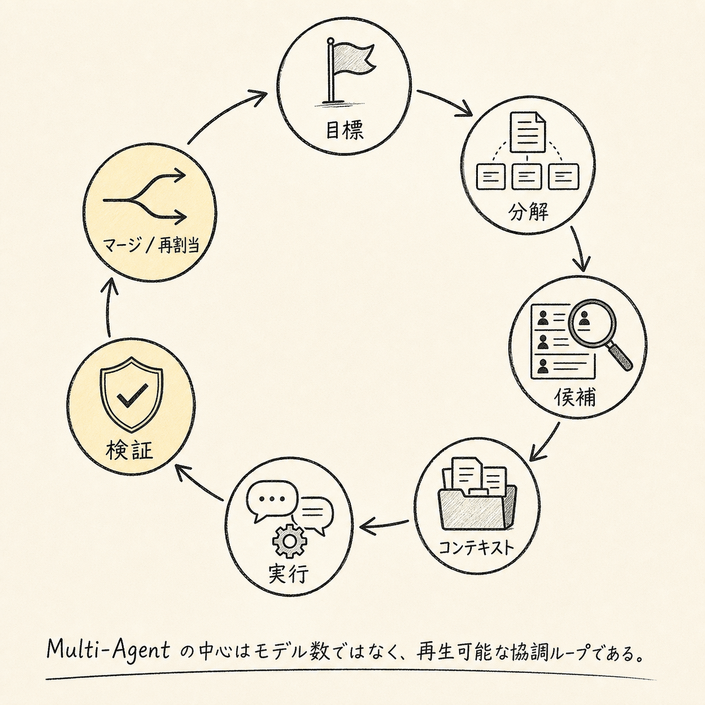


Agent Team は「複数の agent が一緒に作業する」だけのものではない。少なくとも次の 2 つの問題を解く必要がある。

```text
Assignment：タスクをどのように適切な agent に割り当てるか？
Communication：agent 同士がどのように制御可能・追跡可能・検証可能な形で情報を交換するか？
```

タスク割り当ての仕組みがないと、multi-agent は簡単に次のような状態になる。

```text
Lead が思いついた相手に割り振る
agent が自分に実行権限があるか分からない
複数の agent が重複して作業する
タスク失敗後に誰も引き継がない
高リスクなタスクがレビューされない
```

通信プロトコルがないと、multi-agent はまた次のような状態になる。

```text
agent のグループチャット
コンテキスト汚染
メッセージ爆発
責任が不明確
結論を追跡できない
subagent 同士が誤った情報を伝達する
```

安定した Agent Team は、少なくとも次のような閉ループを形成するべきだ。

```text
Goal
  ↓
Task Decomposition
  ↓
Task Classification
  ↓
Candidate Selection
  ↓
Assignment Decision
  ↓
Context Compilation
  ↓
Agent Execution
  ↓
Agent Communication
  ↓
Report Submission
  ↓
Verification
  ↓
Merge / Reassign / Escalate
```

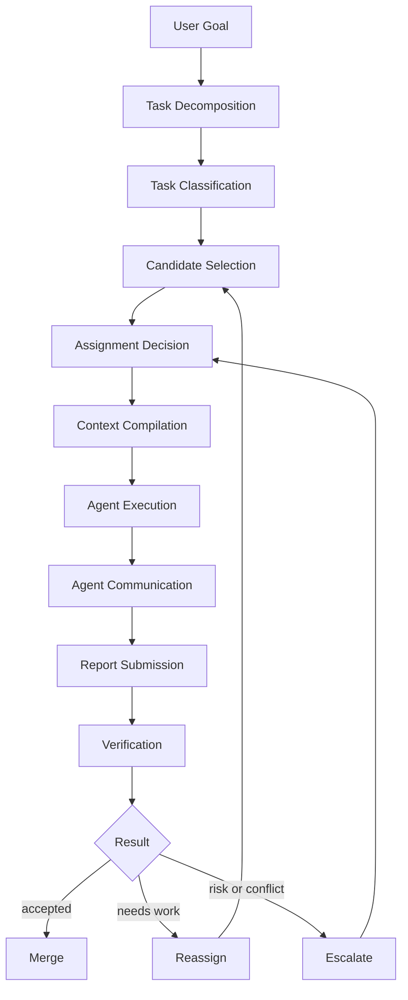

ここで重要なのは「モデルインスタンスをいくつか増やすこと」ではなく、複雑なタスクを、割り当て可能・実行可能・検証可能・再生可能な協調ランタイムへと変えることです。

## 1. タスク割り当ての中核オブジェクト

タスク割り当ては、prompt に一言こう書くだけでは成り立たない。

```text
请 ResearchAgent 帮我查一下。
```

これはエンジニアリングシステムではなく、単なる口頭での委任にすぎない。

本当の割り当てには、少なくとも次のオブジェクトが含まれるべきだ。

```text
TaskSpec
AssignmentDecision
TaskLease
DelegationBrief
AgentReport
VerificationResult
```

その中でも特に中核となるのは次のとおり。

```text
TaskSpec：タスク合同
AssignmentDecision：为何分给这个 agent
TaskLease：タスク占用权和超时メカニズム
DelegationBrief：发给 agent 的コンテキスト包
AgentReport：agent 返回的结构化结果
```

### 1.1 TaskSpec：タスク契約

`TaskSpec` は、タスク割り当てにおける最小の契約である。`TaskSpec` のない委任は単なる prompt だが、`TaskSpec` のある委任は runtime になる。

```ts
type TaskSpec = {
	task_id: string;
	team_session_id: string;

	title: string;
	goal: string;
	non_goals: string[];

	task_type:
		| "research"
		| "planning"
		| "implementation"
		| "review"
		| "verification"
		| "debugging"
		| "summarization"
		| "decision"
		| "handoff";

	status:
		| "draft"
		| "ready"
		| "candidate_selected"
		| "assigned"
		| "claimed"
		| "running"
		| "blocked"
		| "report_submitted"
		| "verifying"
		| "accepted"
		| "rejected"
		| "reassigned"
		| "merged"
		| "cancelled";

	priority: "low" | "medium" | "high" | "critical";
	risk_level: "low" | "medium" | "high";

	dependencies: string[];
	required_capabilities: string[];
	required_tools: string[];

	scope: {
		allowed_paths?: string[];
		forbidden_paths?: string[];
		allowed_domains?: string[];
		data_classification?: "public" | "internal" | "confidential" | "restricted";
		write_scope?: "none" | "patch_only" | "workspace_write" | "production_write";
	};

	assignment: {
		mode:
			| "lead_push"
			| "capability_matching"
			| "claim_with_lease"
			| "recursive_delegation"
			| "redundant_assignment"
			| "human_assignment";
		owner_agent_id?: string;
		candidate_agent_ids?: string[];
		reviewer_agent_id?: string;
		verifier_agent_id?: string;
		lease_id?: string;
		parent_task_id?: string;
		domain_scope?: string;
	};

	input_refs: Array<{
		kind: "message" | "artifact" | "file" | "memory" | "url" | "task" | "decision";
		ref: string;
		reason: string;
	}>;

	output_contract: {
		format:
			| "agent_report"
			| "patch"
			| "plan"
			| "research_brief"
			| "review"
			| "test_result"
			| "decision_record";
		must_include_evidence: boolean;
		must_include_confidence: boolean;
		schema_ref?: string;
	};

	success_criteria: string[];

	budget: {
		max_tokens?: number;
		max_tool_calls?: number;
		max_runtime_ms?: number;
		max_cost_usd?: number;
	};

	communication_policy: {
		can_message_lead: boolean;
		can_message_subagents: boolean;
		allowed_message_types: string[];
		broadcast_allowed: boolean;
		max_messages?: number;
	};

	created_by_agent_id: string;
	created_at: string;
	updated_at: string;
};
```

`TaskSpec` は、タスクを「自然言語のリクエスト」から、目標、境界、出力、受け入れ基準を持つランタイムオブジェクトへと変換する。

### 1.2 AssignmentDecision：割り当て決定

タスクを割り当てるたびに、決定記録を残すべきである。

```ts
type AssignmentDecision = {
	decision_id: string;
	team_session_id: string;
	task_id: string;

	topology_type: "star" | "controlled_bus" | "hierarchical";

	allocation_mode:
		| "lead_push"
		| "capability_matching"
		| "claim_with_lease"
		| "recursive_delegation"
		| "redundant_assignment"
		| "human_assignment";

	selected_agents: Array<{
		agent_id: string;
		role: "primary" | "backup" | "reviewer" | "verifier" | "domain_lead";
		lease_id?: string;
	}>;

	rejected_agents: Array<{
		agent_id: string;
		reason: string;
	}>;

	rationale: string;
	risk_flags: string[];
	required_approvals: Array<"lead" | "verifier" | "human">;

	created_by: "lead_agent" | "scheduler" | "domain_lead" | "human";
	created_at: string;
};
```

これは次の問いに答えるものである。

```text
なぜこの agent なのか？
なぜ他の agent ではないのか？
このタスクに reviewer は必要か？
このタスクに verifier は必要か？
このタスクに human approval は必要か？
```

システムがこれらの問いに答えられないなら、タスク割り当ては Lead のその場の判断にすぎず、監査や最適化が難しくなる。

### 1.3 TaskLease：タスクリース

制御されたバス型アーキテクチャでは、タスクを特定の agent に恒久的に割り当てるべきではなく、lease を使うべきです。

```ts
type TaskLease = {
	lease_id: string;
	task_id: string;
	agent_id: string;

	status: "active" | "expired" | "released" | "completed" | "revoked";

	granted_at: string;
	expires_at: string;
	heartbeat_at?: string;

	retry_count: number;
	progress_summary?: string;
};
```

タスク割り当ては一度きりの代入ではなく、取り消し可能で、タイムアウト可能で、再試行可能な占有権です。

lease は次のような状況を扱えます。

```text
agent が固まる
agent がタイムアウトする
ツールが失敗する
タスクのリスクがエスカレーションする
より適した agent が現れる
ユーザーが目標を変更する
```

## 2. タスク割り当てフロー

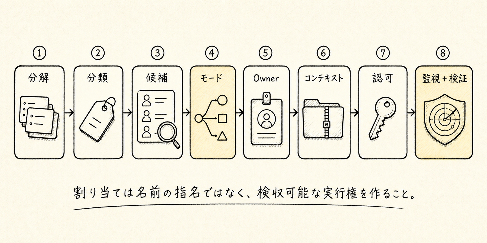


安定したタスク割り当てフローは、8 つのステップに分けられます。

```text
1. Decompose
   ユーザーの目標を TaskGraph / TaskSpec に分解する

2. Classify
   タスクの種類、リスクレベル、読み書きの性質、必要な能力を判定する

3. Select Candidates
   capability、tool access、context scope、load に基づいて候補 agent を選ぶ

4. Decide Allocation Mode
   lead_push、capability_matching、claim_with_lease、
   recursive_delegation、redundant_assignment のどれを使うかを決める

5. Assign Owner
   primary owner、reviewer、verifier を決定する

6. Compile Context
   選ばれた agent 向けに、必要十分な最小コンテキストを編成する

7. Grant Execution
   DelegationBrief を送信するか、TaskLease を付与する

8. Monitor / Verify / Reassign
   heartbeat、report、verifier、lease を通じて、完了または失敗を処理する
```

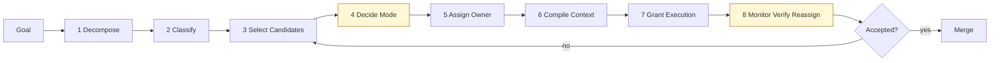

擬似コードは次のとおりです。

```ts
async function assignTask(task: TaskSpec, team: TeamSession) {
	const classifiedTask = classifyTask(task);

	const candidates = selectCandidates({
		required_capabilities: classifiedTask.required_capabilities,
		required_tools: classifiedTask.required_tools,
		scope: classifiedTask.scope,
		risk_level: classifiedTask.risk_level,
		team_agents: team.member_agents,
	});

	const eligibleCandidates = candidates.filter(agent =>
		agent.has_required_tools &&
		agent.has_scope_permission &&
		agent.current_load < agent.max_parallel_tasks
	);

	const allocationMode = chooseAllocationMode({
		topology: team.topology.type,
		task_type: classifiedTask.task_type,
		risk_level: classifiedTask.risk_level,
		write_scope: classifiedTask.scope.write_scope,
	});

	const decision = makeAssignmentDecision({
		task: classifiedTask,
		candidates: eligibleCandidates,
		allocationMode,
	});

	const contextBundle = await ContextGateway.compileForAgent({
		task_id: task.task_id,
		agent_id: decision.selected_agents[0].agent_id,
	});

	const leaseOrDelegation = await grantExecution({
		task,
		decision,
		contextBundle,
	});

	return {
		decision,
		contextBundle,
		leaseOrDelegation,
	};
}
```

## 3. 5つの主要な割り当て戦略

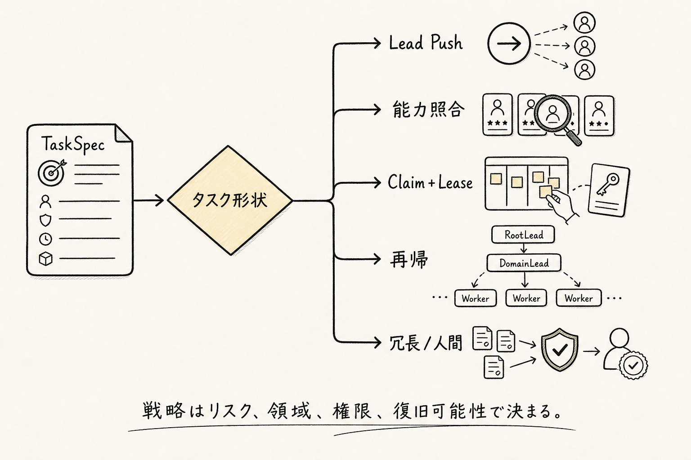


3つのトポロジーが解決するのは組織構造であり、割り当て戦略が解決するのは、タスクを具体的にどの agent に落とし込むかである。

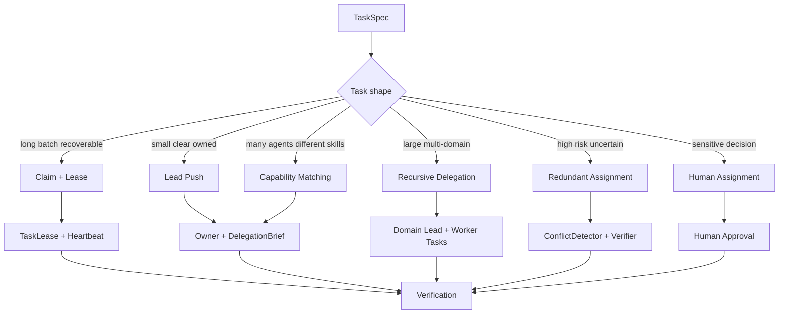

### 3.1 Lead Push：主 agent による直接割り当て

```text
LeadAgent → TaskSpec → Subagent
```

適しているケース：

```text
スター型アーキテクチャ
小規模チーム
短いタスク
責務が非常に明確
主 agent による強い制御が必要
```

例：

```text
ResearchAgent、あなたは支払いモジュールで最近失敗しているテストの原因調査を担当してください。
logs と tests のみを読み取り、コードは変更しないでください。
失敗パターン、証拠、次の推奨アクションを返してください。
```

利点は、シンプルで制御しやすく、レイテンシが低く、debug しやすいこと。欠点は Lead の判断に依存するため、Lead がボトルネックになりやすく、大量のタスクには向かないこと。

### 3.2 Capability Matching：能力マッチング

```text
TaskSpec → CandidateSelector → Best Agent
```

システムは以下の観点に基づいて agent を選択する：

```text
required_capabilities
required_tools
context_scope
risk_level
current_load
historical_success_rate
cost
latency
permission boundary
```

スコアリング関数は次のようになる：

```text
score(agent, task) =
  0.30 * capability_match
+ 0.20 * tool_permission_fit
+ 0.15 * context_scope_fit
+ 0.10 * availability
+ 0.10 * historical_success_rate
+ 0.05 * cost_efficiency
+ 0.05 * latency_fit
- 0.15 * risk_penalty
```

これは、制御されたバス型で、agent の能力が異質で、タスク種別が多く、ツール権限の差が大きいシステムに適している。

### 3.3 Claim + Lease：クレーム + リース

```text
TaskBoard publishes task
  ↓
eligible agents see task
  ↓
agent claims task
  ↓
scheduler grants lease
  ↓
agent heartbeats
  ↓
report submitted / lease expires
```

適しているケース：

```text
制御されたバス型
長時間タスク
バッチタスク
並行可能なタスク
失敗時のリカバリが必要
```

タスクのライフサイクル：

```text
ready
  ↓
announced
  ↓
claimed
  ↓
lease_granted
  ↓
running
  ↓
heartbeat
  ↓
report_submitted
  ↓
verifying
  ↓
accepted / rejected / reassigned
```

重要なルール：

```text
claim はタスクの所有を意味しない
lease_granted になって初めて実行できる
lease がタイムアウトすると自動的に解放される
失敗が繰り返されたら lead / human にエスカレーションする
```

### 3.4 Recursive Delegation：再帰型委譲

```text
Root Lead
  ↓
Domain Lead
  ↓
Worker Agent
```

階層型のタスク、大規模タスク、複数ドメインにまたがるタスク、agent の数が多い場面に適している。

例：

```text
RootLead:
  "BackendLead、あなたは決済モジュールのリファクタリングを担当してください。"

BackendLead:
  "APIAgent、あなたは adapter インターフェースを担当してください。
   DBAgent、あなたは schema の互換性分析を担当してください。
   TestAgent、あなたは payment test suite を担当してください。"
```

中核となるルール：

```text
Root Lead はすべての worker を直接マネジメントしない
Domain Lead はドメイン内のタスク分解権限を持つ
Worker は具体的なタスクだけを実行する
ドメイン横断の依存関係は、Domain Lead または制御されたバスを通じて同期する必要がある
```

### 3.5 Redundant Assignment：冗長割り当て

```text
Same Task
  ├── Agent A
  ├── Agent B
  └── Agent C
       ↓
ConflictDetector
       ↓
Judge / Verifier
```

これは、高リスクな意思決定、セキュリティレビュー、アーキテクチャレビュー、重要なコード review、不確実性が非常に高い問題に適している。

冗長割り当てをデフォルトで使ってはいけない。コストが高く、レイテンシも大きく、マージが複雑で、互いに矛盾する結論が生まれる可能性もあるためだ。

次の条件を満たす場合にのみ有効化することを推奨する：

```text
risk_level = high
production_write = true
security_sensitive = true
confidence_below_threshold = true
```

## 4. 3種類のトポロジーにおけるタスク割り当て方式

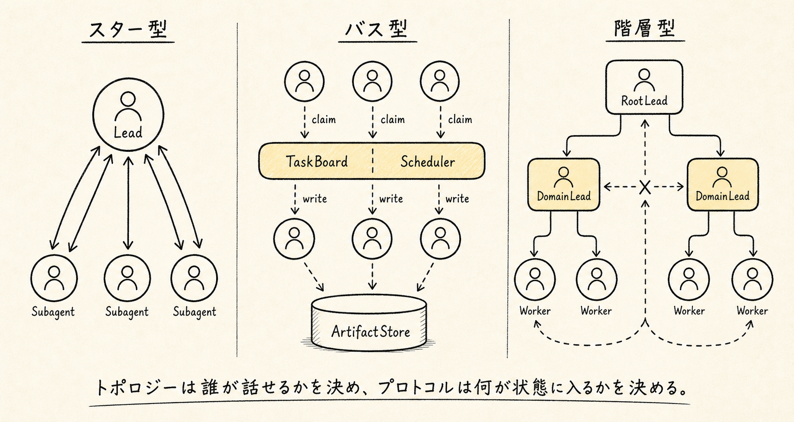


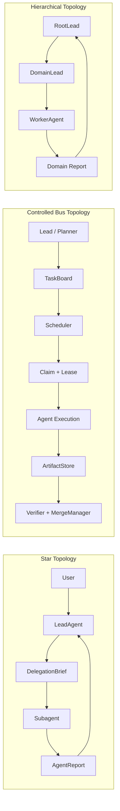

### 4.1 スター型：Lead が割り当て、Subagent が実行する

```text
User
  ↓
LeadAgent
  ↓
TaskSpec
  ↓
DelegationBrief
  ↓
Subagent
  ↓
AgentReport
  ↓
LeadAgent
```

スター型アーキテクチャでは、タスク割り当て方式は通常次のようになる。

```text
Lead Push
Capability Matching
Redundant Assignment for high-risk review
```

典型的な流れ：

```text
1. Lead がユーザーの目標を解析する
2. Lead が subagent が必要かを判断する
3. Lead が TaskSpec を作成する
4. Lead が適切な subagent を選択する
5. Lead が DelegationBrief をまとめる
6. Subagent がタスクを実行する
7. Subagent が AgentReport を返す
8. Verifier がレポートをチェックする
9. Lead が結果をマージする
```

スター型では、subagent はデフォルトでは直接通信しません。ResearchAgent が CodingAgent に質問する必要がある場合、より安定したフローは次のとおりです。

```text
ResearchAgent → LeadAgent → CodingAgent
```

次の形ではありません。

```text
ResearchAgent → CodingAgent
```

こうすることで、Lead は全体のオーナーシップとコンテキスト制御を維持できます。

### 4.2 制御付きバス型：TaskBoard による割り当て、Agent による引き受け

```text
Lead / Planner
  ↓
TaskBoard
  ↓
Scheduler
  ↓
Agent Claim + Lease
  ↓
Execution
  ↓
ArtifactStore + AgentReport
  ↓
Verifier + MergeManager
```

制御付きバス型では、タスク割り当て方式は通常次のようになります。

```text
Capability Matching
Claim + Lease
Redundant Assignment for high-risk tasks
Human Assignment for sensitive tasks
```

典型的なフロー：

```text
1. Planner / Lead 创建 TaskGraph
2. TaskGraphManager 找到 ready tasks
3. TaskBoard 发布タスク
4. CandidateSelector 标记 eligible agents
5. Agent 可 claim タスク
6. Scheduler 授权 lease
7. ContextGateway 编译コンテキスト
8. Agent 执行并 heartbeat
9. Agent 产出 artifact 和 report
10. Verifier 检查
11. MergeManager 合并
12. 失败则释放 lease 并重新分配
```

重要なのは次の点です。

```text
TaskBoard 管タスク状态
EventBus 管状态变化
Mailbox 管定向通信
ArtifactStore 管产物
Verifier 管可信度
MergeManager 管进入主线
```

### 4.3 階層型：Root Lead がドメインを分け、Domain Lead がさらに割り当てる

```text
RootLead
  ↓
DomainLead
  ↓
WorkerAgent
```

階層型では、タスク割り当て方式は通常次のようになります。

```text
Recursive Delegation
Capability Matching within domain
Lead Push within domain
Redundant Assignment for domain-level review
```

典型的なフロー：

```text
1. Root Lead 拆出领域级タスク
2. Root Lead 分配给 Domain Lead
3. Domain Lead 在领域内继续拆タスク
4. Domain Lead 选择 worker agent
5. Worker 执行具体タスク
6. Worker 返回 AgentReport
7. Domain Lead 汇总领域报告
8. Root Lead 合并领域报告
9. Verifier 检查整体一致性
```

階層型の要点は、Root Lead により多くを見せることではなく、より少ないがより正確な情報を見せることです。

```text
Root Lead 看领域摘要
Domain Lead 看领域コンテキスト
Worker 看具体タスクコンテキスト
```

## 5. メイン Agent と Subagent の通信プロトコル

メイン agent と subagent の通信は、自然な雑談ではなく、契約ベースの通信であるべきです。

中核となるメッセージは 6 種類あります。

```text
TaskAssigned
ClarificationRequested
ProgressReported
BlockerRaised
ReportSubmitted
RevisionRequested
```

### 5.1 TaskAssigned：タスク委任

メイン agent が subagent に送るのは一文ではなく、`DelegationBrief` です。

```ts
type DelegationBrief = {
	delegation_id: string;
	task_id: string;

	from_agent_id: string;
	to_agent_id: string;

	objective: string;
	why_this_matters: string;
	non_goals: string[];
	context_summary: string;

	input_refs: Array<{
		kind: "file" | "artifact" | "message" | "memory" | "url" | "task";
		ref: string;
		reason: string;
	}>;

	constraints: string[];
	allowed_tools: string[];
	forbidden_tools: string[];

	scope: {
		allowed_paths?: string[];
		forbidden_paths?: string[];
		allowed_domains?: string[];
		write_scope?: "none" | "patch_only" | "workspace_write";
	};

	success_criteria: string[];

	output_contract: {
		format: "agent_report" | "patch" | "review" | "research_brief" | "test_result";
		must_include_evidence: boolean;
		must_include_confidence: boolean;
	};

	communication_policy: {
		can_ask_clarifying_questions: boolean;
		can_contact_other_subagents: boolean;
		must_report_progress: boolean;
		progress_interval?: "on_blocker" | "periodic" | "on_completion";
	};

	budget: {
		max_tokens?: number;
		max_tool_calls?: number;
		max_runtime_ms?: number;
	};
};
```

良い委任は、次のような形になります：

```yaml
task_id: task_auth_log_triage

objective: >
  分析 auth-refresh-failure.log 中 401 的最可能原因。

why_this_matters: >
  Lead 正在判断是否需要修改 token refresh 逻辑。

non_goals:
  - 不要修改代码
  - 不要重构 auth 模块
  - 不要访问生产环境

context_summary: >
  用户报告 token refresh 后偶发 401。
  当前怀疑 refresh token rotation 或 session cache 存在竞态。

input_refs:
  - kind: file
    ref: logs/auth-refresh-failure.log
    reason: "包含失败请求日志"
  - kind: file
    ref: src/auth/refresh.ts
    reason: "refresh token 逻辑"

allowed_tools:
  - read_file
  - grep
  - run_tests_readonly

forbidden_tools:
  - write_file
  - deploy
  - database_write

success_criteria:
  - 找到至少 1 个可验证假设
  - 每个结论必须有 evidence ref
  - 标明置信度
  - 给出下一步验证建议

output_contract:
  format: agent_report
  must_include_evidence: true
  must_include_confidence: true

communication_policy:
  can_ask_clarifying_questions: true
  can_contact_other_subagents: false
  must_report_progress: true
  progress_interval: on_blocker
```

### 5.2 ClarificationRequested：確認質問

subagent は、実行がブロックされたときにだけ質問すべきです。

誤った方法：

```text
もう少しコンテキストが必要です。詳しく説明してもらえますか？
```

正しい方法：

```yaml
type: ClarificationRequested
task_id: task_auth_log_triage
from_agent_id: log_triage_agent
to_agent_id: lead_agent
blocking: true
question: >
  auth-refresh-failure.log が同じバージョンの src/auth/refresh.ts から来たものか確認する必要があります。
  バージョンが一致しない場合、ログとコードを対応付けられません。
options:
  - "同じバージョンであることを確認"
  - "対応する commit hash を提供"
  - "ログのみに基づく初期分析を許可"
needed_by: "root cause の結論を出す前"
```

原則：

```text
質問は具体的でなければならない
質問はなぜブロックしているのかを説明しなければならない
質問には選択肢を付けるのが望ましい
質問で main agent にコンテキスト全体の吐き出しを求めてはならない
```

### 5.3 ProgressReported：進捗報告

進捗報告は delta であるべきで、作業ログの羅列ではない。

```yaml
type: ProgressReported
task_id: task_auth_log_triage
from_agent_id: log_triage_agent
to_agent_id: lead_agent
progress_summary: >
  401 は refresh 成功後の次の API 呼び出しに集中して発生していることを特定済み。
current_hypothesis:
  - "session cache が access token を適時に更新していない"
evidence_refs:
  - "logs/auth-refresh-failure.log#L120-L188"
next_step: >
  refresh.ts における cache 書き込み順序を確認する。
```

こうすべきではない：

```text
いまファイル A を開いて、1 行目から 200 行目まで見て、それからファイル B も開いて……
```

### 5.4 BlockerRaised：ブロッカーの報告

```yaml
type: BlockerRaised
task_id: task_payment_adapter
from_agent_id: backend_agent
to_agent_id: lead_agent
blocker: >
  現在のタスクでは src/payments/schema.ts の変更が必要ですが、私の write_scope では src/payments/adapter.ts しか許可されていません。
needs: "lead"
suggested_resolution:
  - "schema_migration_task を新規作成する"
  - "patch proposal の提出のみに切り替える"
risk: "medium"
```

原則：

```text
blocker 必須說明需要誰處理
blocker 必須給解決選項
blocker 不能繞過權限自己解決
```

### 5.5 ReportSubmitted：結果の提出

subagent がメイン agent に返す内容は、必ず structured report でなければなりません。

```ts
type AgentReport = {
	report_id: string;
	task_id: string;
	agent_id: string;

	summary: string;

	findings: Array<{
		claim: string;
		confidence: number;
		evidence_refs: string[];
		risk?: "low" | "medium" | "high";
	}>;

	actions_taken: Array<{
		action: string;
		artifact_refs?: string[];
		tool_call_ids?: string[];
	}>;

	artifacts_created: Array<{
		artifact_id: string;
		kind: "file" | "diff" | "log" | "research_note" | "test_result";
		summary: string;
	}>;

	open_questions: string[];

	blockers: Array<{
		blocker: string;
		needs: "user" | "manager" | "tool" | "another_agent";
	}>;

	verification: {
		checks_run: string[];
		checks_passed: string[];
		checks_failed: string[];
		not_verified: string[];
	};

	recommendations: string[];
	next_steps: string[];
};
```

中核原則：

> **subagent は探索プロセスをメインラインへ戻さず、結論、証拠、リスク、成果物、次のステップだけをメインラインへ持ち帰る。**

### 5.6 RevisionRequested：手戻りリクエスト

主 agent または verifier は subagent に手戻りを要求できるが、その手戻り要求も構造化されていなければならない。

```yaml
type: RevisionRequested
task_id: task_auth_log_triage
from_agent_id: lead_agent
to_agent_id: log_triage_agent
reason: >
  あなたの finding 2 には evidence ref が欠けているため、最終レポートに入れられません。
required_changes:
  - "finding 2 にログ行の参照を追加する"
  - "その結論が単なる推測かどうかを明記する"
  - "検証の提案を1つ補足する"
deadline_policy: "same_lease"
```

## 6. Subagent と Subagent の通信プロトコル

subagent 間の通信を許可するかどうかは、トポロジーによって決まる。

デフォルト原則：

> **subagent はデフォルトでは直接通信しない。トポロジー、タスク依存関係、communication_policy が明示的に許可している場合にのみ、subagent-to-subagent 通信を許可する。**

直接通信のリスクは次のとおり：

```text
コンテキスト汚染が増える
Lead のグローバル制御を迂回する
誤情報が横方向に伝播する
暗黙的なタスク移譲が発生する
責任境界が曖昧になる
```

ただし、制御されたバス型と階層型では、subagent-to-subagent 通信が必要になることもある。重要なのは、構造化され、方向性があり、追跡可能で、制限可能であることだ。

### 6.1 3 つのトポロジーにおける通信ルール

| トポロジー | subagent は直接通信できるか | 推奨方式 |
| --- | ---: | --- |
| スター型 | デフォルトでは不可 | Lead 経由で転送 |
| 制御されたバス型 | 可能。ただし制御が必須 | Mailbox / TaskBoard / Artifact refs 経由 |
| 階層型 | 同一領域内では限定的に通信可。領域をまたぐ場合は上申が必要 | Domain Lead または Cross-domain Mailbox 経由 |

### 6.2 スター型における subagent 通信

スター型で最も安定した通信経路は次のとおり：

```text
Subagent A
  ↓
LeadAgent
  ↓
Subagent B
```

たとえば ResearchAgent が TestAgent にテストを実行してもらう必要を見つけた場合、ResearchAgent は TestAgent に直接指示すべきではない。Lead にリクエストを出すべきである。Lead が TestAgent 向けに新しい `TaskSpec` を作成するかどうかを判断する。

```yaml
type: SubtaskRequest
from_agent_id: research_agent
to_agent_id: lead_agent
related_task_id: task_research_auth
requested_task:
  title: "Run auth refresh regression tests"
  reason: "Research finding 1 需要测试验证"
  suggested_agent: test_agent
  required_tools:
    - run_tests
  expected_output: "test_result"
```

基本原則：

> **スター型では、subagent は新しいタスクを提案できるが、他の subagent に直接タスクを割り当ててはならない。**

### 6.3 制御されたバス型における subagent 通信

制御されたバス型では subagent 同士の直接通信を許可するが、必ず制御されたチャネルを通す必要がある。

```text
Subagent A → Mailbox → Subagent B
Subagent A → TaskBoard → Creates dependency
Subagent A → ArtifactStore → Shares artifact ref
Subagent A → EventBus → Emits structured event
```

許可される通信タイプは主に七つある：

```text
DependencyQuestion
ArtifactHandoff
ReviewRequest
ReviewResult
BlockerSupportRequest
InterfaceContractProposal
ConflictNotice
```

**DependencyQuestion：依存関係に関する質問**

```yaml
type: DependencyQuestion
from_agent_id: frontend_agent
to_agent_id: backend_agent
task_id: task_checkout_ui
related_task_id: task_payment_api
blocking: true
question: >
  checkout UI 需要确认 createPaymentIntent 返回字段是否包含 client_secret。
context_refs:
  - artifact://frontend_checkout_plan
expected_answer_format:
  fields:
    - "return_schema"
    - "stability"
    - "evidence_refs"
```

タスクの依存関係に関する質問だけが許可され、かつ blocking かどうかを必ず明示しなければならない。

**ArtifactHandoff：成果物の引き渡し**

```yaml
type: ArtifactHandoff
from_agent_id: backend_agent
to_agent_id: frontend_agent
task_id: task_payment_adapter
artifact_id: artifact_payment_api_schema
summary: >
  payment adapter 的返回 schema 已确定，frontend 可以基于此更新 checkout flow。
important_fields:
  - "client_secret"
  - "payment_status"
  - "retry_after"
evidence_refs:
  - "src/payments/adapter.ts#L40-L88"
```

artifact ref を引き継ぎ、完全なコンテキストは引き継がない。

**ReviewRequest：レビュー依頼**

```yaml
type: ReviewRequest
from_agent_id: implementer_agent
to_agent_id: reviewer_agent
task_id: task_payment_adapter
artifact_id: patch://payment-adapter-v1
checklist_ref: checklist://backend-api-review
focus:
  - "public API compatibility"
  - "error handling"
  - "idempotency"
blocking: true
```

review request には artifact_id が必須であり、checklist または review focus も必須である。

**ReviewResult：レビュー結果**

```yaml
type: ReviewResult
from_agent_id: reviewer_agent
to_agent_id: implementer_agent
task_id: task_payment_adapter
artifact_id: patch://payment-adapter-v1
status: "changes_requested"
blocking_issues:
  - issue: "adapter 在 timeout 时没有保持 idempotency key"
    evidence_refs:
      - "src/payments/adapter.ts#L72-L91"
    suggested_fix: "在 retry branch 中复用原始 idempotency key"
non_blocking_comments:
  - "命名可以更清晰，但不阻塞 merge"
```

**BlockerSupportRequest：ブロッカー解除支援の依頼**

```yaml
type: BlockerSupportRequest
from_agent_id: test_agent
to_agent_id: backend_agent
task_id: task_payment_tests
blocking: true
blocker: >
  payment test suite 缺少 mock response schema。
needed_artifact:
  - "mock schema for PaymentIntent success"
  - "mock schema for PaymentIntent failure"
```

支援を依頼することは、タスクの所有権を移すことではない。元の task owner は、引き続き自分の task に責任を持つ。

**InterfaceContractProposal：インターフェース契約の提案**

```yaml
type: InterfaceContractProposal
from_agent_id: backend_agent
to_agent_id: frontend_agent
task_id: task_payment_refactor
contract:
  endpoint: "POST /api/payments/intent"
  request_schema_ref: artifact://payment_intent_request_schema
  response_schema_ref: artifact://payment_intent_response_schema
compatibility: "backward_compatible"
requires_ack: true
```

フロントエンド agent、バックエンド agent、API agent、DB agent の間では、自然言語による推測でインターフェースを合わせてはならない。必ず contract artifact を通じて整合させる必要がある。

**ConflictNotice：衝突通知**

```yaml
type: ConflictNotice
from_agent_id: reviewer_agent
to_agent_id: lead_agent
task_id: task_payment_refactor
conflict:
  description: >
    frontend_agent 假设 payment_status 包含 "requires_action"，
    但 backend_agent 的 response schema 没有该状态。
  involved_artifacts:
    - artifact://frontend_checkout_plan
    - artifact://payment_intent_response_schema
risk: "high"
suggested_resolution:
  - "让 backend_agent 更新 schema"
  - "让 frontend_agent 移除该状态处理"
  - "由 lead 决定兼容策略"
```

衝突は必ず明示的に報告しなければならず、agent 同士が裏で調整して主状態を直接変更してはならない。高リスクの衝突は必ず `DecisionLog` に入れる。

### 6.4 階層型における subagent 通信

階層型の通信は次に従う。

```text
同階層・同ドメイン：限定的な通信は可能
ドメイン横断通信：Domain Lead を経由
階層横断通信：階層的な報告ルールに従う
```

推奨される経路：

```text
Worker → DomainLead → RootLead
Worker → DomainLead → OtherDomainLead → OtherWorker
```

非推奨：

```text
FrontendWorker → DatabaseWorker
```

システムが cross-domain mailbox を明確に許可している場合を除く。

階層型で最も重要なのは、worker が domain owner を迂回するのを防ぐことだ。

誤った方法：

```text
UIAgent が DBAgent に schema の変更を直接要求する
```

正しい方法：

```text
UIAgent → FrontendLead
FrontendLead → RootLead / BackendLead
BackendLead → DBAgent
```

これにより、ドメイン横断タスクの制御不能化、権限境界の迂回、ドメイン判断の責任者不在、そしてグローバル状態が局所的な agent によって壊されることを避けられる。

## 7. 通信チャネル設計

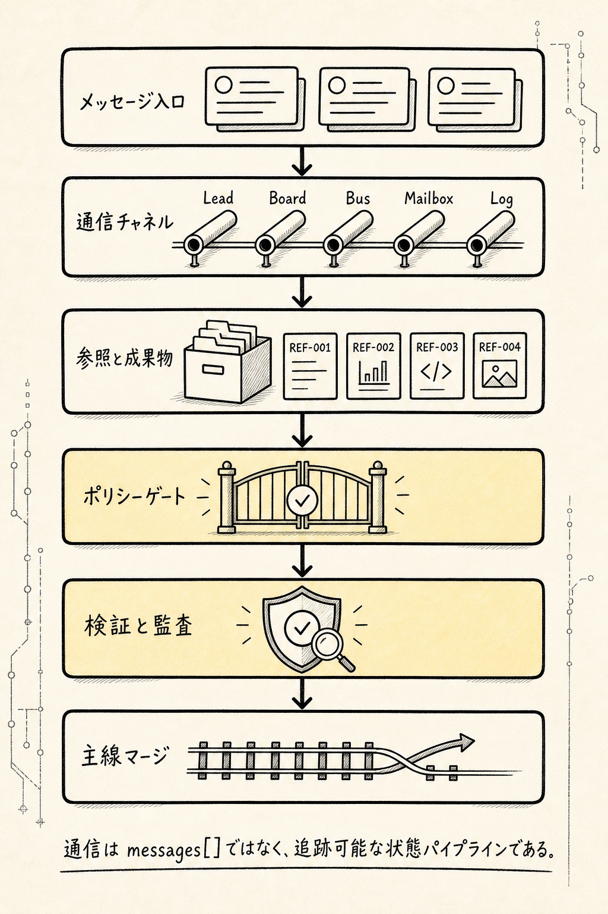


Agent Team は単一の `messages[]` だけにすべきではない。少なくとも次のチャネルを区別すべきである。

```text
Lead Channel
TaskBoard
EventBus
Mailbox
ArtifactStore
DecisionLog
ReviewQueue
Escalation Channel
```

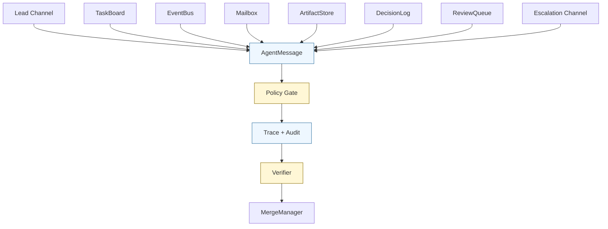

### 7.1 Lead Channel

用途:

```text
ユーザー ↔ Lead
Lead ↔ Subagent
DomainLead ↔ Worker
```

担うもの:

```text
TaskAssigned
ClarificationRequested
BlockerRaised
ReportSubmitted
RevisionRequested
```

これは強い制御と強い所有権を持ち、スター型および階層型に適している。

### 7.2 TaskBoard

TaskBoard はタスク状態を記録するために使い、長文チャットには使わない。

```yaml
task_id: task_payment_adapter
status: running
owner_agent_id: backend_agent
dependencies:
  - task_payment_schema_review
lease_id: lease_123
updated_at: "..."
```

TaskBoard に置かれるのは状態であり、会話ではない。

### 7.3 EventBus

EventBus は状態変化イベントを記録するために使う。

```jsonl
{"type":"TaskCreated","task_id":"task_1","created_by":"lead"}
{"type":"TaskClaimed","task_id":"task_1","agent_id":"backend_agent"}
{"type":"LeaseGranted","task_id":"task_1","lease_id":"lease_1"}
{"type":"ArtifactProduced","task_id":"task_1","artifact_id":"patch_1"}
{"type":"VerificationCompleted","task_id":"task_1","status":"pass"}
```

EventBus は監査とリプレイの基盤である。

### 7.4 Mailbox

Mailbox は agent-to-agent の指向性通信に使う。

```ts
type MailboxMessage = {
	message_id: string;
	thread_id: string;

	from_agent_id: string;
	to_agent_id: string;

	task_id: string;
	related_task_ids: string[];

	kind:
		| "dependency_question"
		| "artifact_handoff"
		| "review_request"
		| "review_result"
		| "blocker_support_request"
		| "interface_contract_proposal"
		| "conflict_notice";

	priority: "low" | "medium" | "high" | "critical";
	blocking: boolean;
	content_summary: string;

	payload: Record<string, unknown>;

	context_refs: string[];
	artifact_refs: string[];

	expected_response?: {
		required: boolean;
		format: string;
		deadline_ms?: number;
	};

	visibility: {
		visible_to_lead: boolean;
		visible_to_task_owner: boolean;
		visible_to_verifier: boolean;
	};

	created_at: string;
};
```

Mailbox は指向性のあるメッセージであり、グループチャットではありません。

### 7.5 ArtifactStore

ArtifactStore は成果物を共有するためのものであり、完全なコンテキストを共有するためのものではありません。

```text
artifact://research_report_auth_refresh
artifact://patch_payment_adapter_v1
artifact://test_log_payment_suite
artifact://api_contract_checkout_payment
```

agent が通信するときに渡すべきものは次のとおりです。

```text
artifact ref
summary
evidence refs
why relevant
```

次のようなものを渡すべきではありません。

```text
完整日志
完整ファイル全文
完整探索过程
```

### 7.6 DecisionLog

重要な意思決定はすべて `DecisionLog` に記録する必要があります。

```yaml
decision_id: decision_payment_status_schema
made_by: lead_agent
related_tasks:
  - task_backend_payment_schema
  - task_frontend_checkout_flow
decision: >
  payment_status 保留 requires_action 状态，以兼容 3DS flow。
rationale: >
  frontend 已依赖该状态，删除会破坏现有 checkout flow。
evidence_refs:
  - artifact://frontend_checkout_plan
  - artifact://backend_schema_review
status: accepted
```

チャット内での決定は、決定とは見なされません。`DecisionLog` に記録された決定だけが、システム状態として扱われます。

## 8. 通信メッセージの統一構造

すべての agent 間通信は、統一されたメッセージオブジェクトとして抽象化できる。

```ts
type AgentMessage = {
	message_id: string;
	team_session_id: string;
	thread_id: string;

	from_agent_id: string;
	to_agent_id?: string;

	channel:
		| "lead_channel"
		| "taskboard"
		| "eventbus"
		| "mailbox"
		| "review_queue"
		| "escalation";

	kind:
		| "task_assigned"
		| "clarification_requested"
		| "progress_reported"
		| "blocker_raised"
		| "report_submitted"
		| "revision_requested"
		| "dependency_question"
		| "artifact_handoff"
		| "review_requested"
		| "review_result"
		| "interface_contract_proposal"
		| "conflict_notice"
		| "decision_proposed"
		| "handoff_requested"
		| "handoff_accepted";

	task_id?: string;
	related_task_ids?: string[];

	priority: "low" | "medium" | "high" | "critical";
	blocking: boolean;

	content_summary: string;
	payload: Record<string, unknown>;

	context_refs: string[];
	artifact_refs: string[];
	evidence_refs: string[];

	expected_response?: {
		required: boolean;
		format: string;
		deadline_ms?: number;
	};

	policy: {
		max_visibility: "lead_only" | "task_participants" | "team" | "verifier" | "human";
		can_create_task: boolean;
		can_modify_task_state: boolean;
		can_transfer_ownership: boolean;
	};

	status: "sent" | "delivered" | "acknowledged" | "resolved" | "expired";
	created_at: string;
};
```

メッセージはコンテキスト dump ではなく、`task_id`、`artifact_refs`、`evidence_refs`、`expected_response` を備えた構造化された協調作業の単位である。

## 9. 通信時のコア原則

### 原則 1：Contract over Chat

Agent の通信は、まず契約であり、チャットではありません。

誤り：

```text
この問題をちょっと見てください。
```

正しい：

```text
これは task_id、これは目標、これは入力、これは利用可能なツール、これは出力形式、これは受け入れ基準です。
```

### 原則 2：Default No Direct Subagent Communication

subagent はデフォルトでは直接通信しません。次の条件を満たす場合にのみ許可されます。

```text
topology が許可している
communication_policy が許可している
メッセージタイプが allowlist 内にある
タスク間に依存関係がある
メッセージに task_id が付いている
メッセージに artifact/context refs が付いている
メッセージが trace される
```

### 原則 3：Least Context, Maximum Reference

通信時には最小限のコンテキストを渡し、できるだけ参照を渡します。

推奨：

```text
summary + artifact_ref + evidence_ref
```

非推奨：

```text
完全なログ + 完全なファイル + 完全な会話履歴
```

### 原則 4：すべての事実には Evidence が必要

factual claim には、必ず次を付けるべきです。

```text
evidence_refs
confidence
risk
```

evidence のない内容は hypothesis、opinion、または suggestion にとどめるべきであり、主線の結論に直接入れてはいけません。

### 原則 5：状態変更を自然言語に頼ってはいけない

誤り：

```text
このタスクは完了したと思います。
```

正しい：

```json
{"type":"TaskCompleted","task_id":"task_1","report_id":"rep_1"}
```

タスク状態は、構造化イベントを通じて変更しなければなりません。

### 原則 6：Owner Decides, Non-owner Advises

owner でない者は提案できますが、タスク所有権、マージ状態、最終決定を直接変更することはできません。

```text
task owner はタスクの完了に責任を持つ
lead owner は最終出力に責任を持つ
verifier owner は受け入れ確認に責任を持つ
human owner は高リスク承認に責任を持つ
```

### 原則 7：Broadcast Is Exceptional

デフォルトでは指向性メッセージを使う。ブロードキャストは次の場合にのみ使う：

```text
ミッション更新
グローバル制約の変更
重大なブロッカー
重要な意思決定
セキュリティ警告
```

ブロードキャストは短く、構造化され、追跡可能でなければならない。

### 原則 8：Progress Report by Delta

進捗報告では変化のみを報告する：

```text
新しい発見
新しいブロッカー
新しい成果物
新しいリスク
次のステップ
```

タスクの背景を繰り返さない。既知の情報を繰り返さない。

### 原則 9：No Hidden State Transfer

subagent はプライベートチャットでこっそりタスク所有権を移転してはならない。

誤り：

```text
BackendAgent が非公開で TestAgent に自分のテストタスクを手伝わせる。
```

正しい：

```text
BackendAgent が SubtaskRequest を作成する
Lead / Scheduler が新しい TaskSpec を作成する
TestAgent が正式な lease を取得する
```

### 原則 10：No Raw Chain-of-Thought Transfer

agent 間で隠れた推論過程を渡すべきではない。

渡してよいもの：

```text
reasoning summary
evidence
hypotheses
decision rationale
open questions
```

渡さないもの：

```text
完全な内部思考チェーン
構造化されていない探索過程
モデル専用の scratchpad
```

### 原則 11：Communication Must Be Budgeted

通信にもコストがある。各 task には次のような制限を設けられる：

```text
max_messages
max_clarification_rounds
max_review_rounds
max_broadcasts
max_wait_time
```

そうしないと、agent team は互いに質問し合い、review し合い、補足し合い、いつまでも収束しない状態に陥りやすい。

### 原則 12：Conflicts Must Become First-class Objects

衝突を会話の中に隠してはならない。明示的に次を作成するべきである：

```text
ConflictNotice
DecisionRequest
ResolutionDecision
```

競合オブジェクトには少なくとも以下を含める：

```text
冲突描述
涉及タスク
涉及 artifact
风险等级
候选解决方案
决策 owner
最终裁决
```

### 原則 13：Communication Should Not Replace Verification

agent B が agent A の結論は正しいと言っても、それは検証が通ったことを意味しない。

検証は必ず以下に依拠しなければならない：

```text
test
schema check
evidence check
policy check
diff review
human approval
```

## 10. 通信の圧縮：4 層の情報フィードバック

コンテキスト汚染を避けるために、agent 間の情報フィードバックは階層化する必要がある。

```text
L0 Raw Trace
  生のツール出力、完全なログ、完全なファイル断片
  デフォルトでは private trace / artifact にのみ残す

L1 Evidence Slice
  重要な証拠断片、ログ行、コード行、スクリーンショット領域
  evidence ref として参照できる

L2 Finding Summary
  構造化された発見：claim + confidence + evidence_refs

L3 Decision Summary
  メインラインに入れられる意思決定、結論、リスク、次のステップ
```

主 agent / root lead がデフォルトで受け取るのは次のみ：

```text
L2 Finding Summary
L3 Decision Summary
artifact refs
```

Verifier は必要に応じて取得できる：

```text
L1 Evidence Slice
L0 Raw Trace
```

メインラインがすべての探索プロセスを飲み込むべきではない。メインラインが吸収するのは、圧縮済みで、証拠があり、検証可能な情報だけである。

## 11. タスク割り当てと通信のステートマシン

タスクのステートマシンは runtime に組み込むべきです。

```text
draft
  ↓
ready
  ↓
candidate_selected
  ↓
assigned / announced
  ↓
claimed
  ↓
lease_granted
  ↓
running
  ├── progress_reported
  ├── clarification_requested
  ├── blocker_raised
  ├── dependency_question
  └── artifact_produced
  ↓
report_submitted
  ↓
verifying
  ├── accepted
  ├── revision_requested
  ├── rejected
  └── reassigned
  ↓
merged
```

重要な不変条件：

```text
タスクに owner がない場合、running は許可しない
タスクに output_contract がない場合、assigned は許可しない
タスクに evidence がない場合、accepted は許可しない
タスクの verifier が fail の場合、merged は許可しない
タスクの lease が期限切れになった場合、必ず reassigned または cancelled にする
```

## 12. トポロジーと割り当てマトリクス

### 12.1 通信マトリクス

| 通信関係 | スター型 | 制御付きバス型 | 階層型 |
| --- | --- | --- | --- |
| User ↔ Lead | 許可 | 許可 | 許可 |
| Lead ↔ Subagent | 許可 | 許可 | 許可 |
| Subagent ↔ Lead | 許可 | 許可 | 許可 |
| Subagent ↔ Subagent | デフォルトでは禁止 | 許可。ただし Mailbox / TaskBoard 経由 | 同一ドメイン内では限定的に許可、ドメイン横断は Domain Lead 経由 |
| Worker ↔ Domain Lead | 該当なし | 任意 | 許可 |
| Domain Lead ↔ Root Lead | 該当なし | 任意 | 許可 |
| Broadcast to all agents | 非推奨 | 重大イベントのみ | Root / Domain Lead のみ送信可 |
| Artifact sharing | Lead 経由 | ArtifactStore 経由 | DomainLead / ArtifactStore 経由 |
| Task ownership transfer | Lead が決定 | Scheduler / Lead が決定 | 上位 Lead が決定 |
| Conflict resolution | Lead | MergeManager / Lead / Verifier | DomainLead / RootLead |
| Final merge | Lead | MergeManager + Verifier | RootLead + Verifier |

### 12.2 割り当てマトリクス

| 割り当て戦略 | スター型 | 制御付きバス型 | 階層型 |
| --- | ---: | ---: | ---: |
| Lead Push | 最も一般的 | 利用可 | 一般的 |
| Capability Matching | 利用可 | 最も一般的 | ドメイン内で一般的 |
| Claim + Lease | あまり使われない | 最も一般的 | ドメイン内部で利用可 |
| Recursive Delegation | 該当なし | 任意 | 最も一般的 |
| Redundant Assignment | 高リスクレビュー時に使用 | 高リスクタスク時に使用 | ドメイン review 時に使用 |
| Human Assignment | 高リスク時に使用 | 高リスク時に使用 | 高リスク時に使用 |

## 13. 完全な例：決済モジュールのリファクタリング

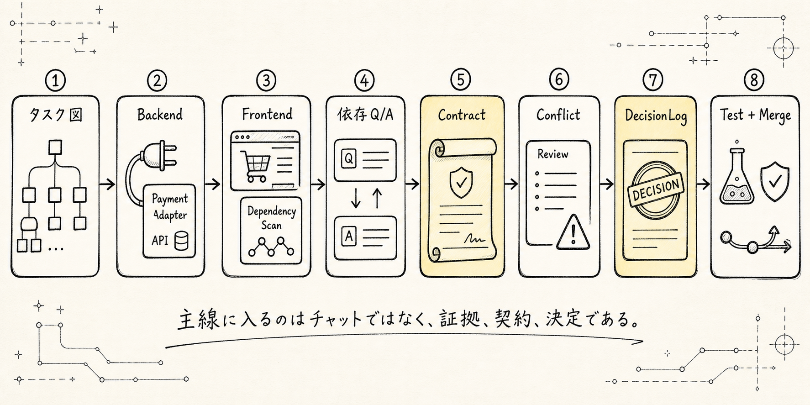


ユーザーの目標が次のようなものだとします：

```text
決済モジュールをリファクタリングし、checkout UI と過去の注文との互換性を保つ。
```

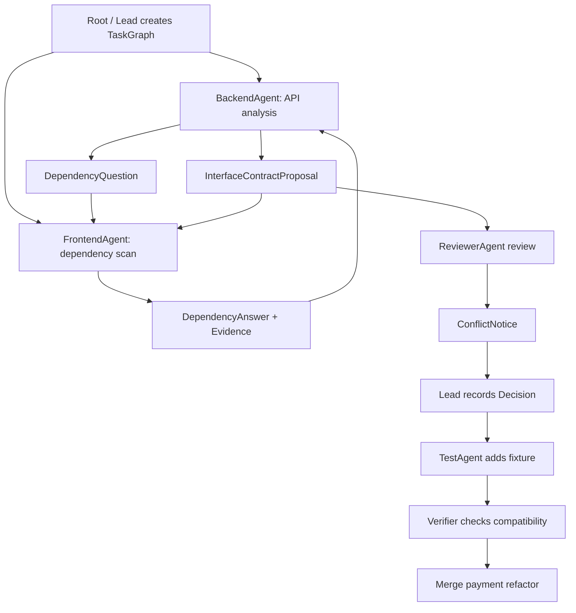

### Step 1：Root / Lead がタスクグラフを作成

```yaml
root_goal: "決済モジュールをリファクタリングし、checkout UI と過去の注文との互換性を保つ"

tasks:
  - task_id: task_payment_api_analysis
    type: research
    owner: backend_agent
    output: research_brief

  - task_id: task_checkout_dependency_scan
    type: research
    owner: frontend_agent
    output: research_brief

  - task_id: task_payment_adapter_impl
    type: implementation
    owner: backend_agent
    dependencies:
      - task_payment_api_analysis
    output: patch

  - task_id: task_payment_contract_review
    type: review
    owner: reviewer_agent
    dependencies:
      - task_payment_adapter_impl
      - task_checkout_dependency_scan
    output: review

  - task_id: task_payment_test_verification
    type: verification
    owner: test_agent
    dependencies:
      - task_payment_adapter_impl
    output: test_result
```

### Step 2：BackendAgent が FrontendAgent に依存関係の質問を送る

```yaml
type: DependencyQuestion
from_agent_id: backend_agent
to_agent_id: frontend_agent
task_id: task_payment_adapter_impl
related_task_id: task_checkout_dependency_scan
blocking: true
question: >
  checkout UI は payment_status = "requires_action" に依存していますか？
context_refs:
  - artifact://payment_response_schema_v0
expected_response:
  required: true
  format: "schema_dependency_summary"
```

### Step 3：FrontendAgent が回答する

```yaml
type: DependencyAnswer
from_agent_id: frontend_agent
to_agent_id: backend_agent
task_id: task_checkout_dependency_scan
related_task_id: task_payment_adapter_impl
answer: >
  はい。checkout UI は 3DS flow で requires_action に依存しています。
evidence_refs:
  - "src/checkout/payment-status.ts#L44-L68"
artifact_refs:
  - artifact://checkout_payment_dependency_scan
confidence: 0.91
```

### Step 4：BackendAgent がインターフェース契約を提出する

```yaml
type: InterfaceContractProposal
from_agent_id: backend_agent
to_agent_id: frontend_agent
task_id: task_payment_adapter_impl
contract:
  response_schema_ref: artifact://payment_intent_response_schema_v1
compatibility: "backward_compatible"
requires_ack: true
```

### Step 5：ReviewerAgent が競合通知を送信

```yaml
type: ConflictNotice
from_agent_id: reviewer_agent
to_agent_id: lead_agent
task_id: task_payment_contract_review
conflict:
  description: >
    backend schema は requires_action を保持しているが、test fixture はこの状態をカバーしていない。
  involved_artifacts:
    - artifact://payment_intent_response_schema_v1
    - artifact://payment_test_fixture_v1
risk: "medium"
suggested_resolution:
  - "TestAgent に requires_action fixture を追加させる"
  - "BackendAgent にこの状態を legacy-only として注記させる"
```

### Step 6：Lead が決定を記録

```yaml
type: DecisionRecorded
decision_id: decision_requires_action_compat
made_by: lead_agent
decision: >
  requires_action を互換性のための状態として保持し、TestAgent に fixture の追加を要求する。
evidence_refs:
  - "src/checkout/payment-status.ts#L44-L68"
  - artifact://payment_intent_response_schema_v1
affected_tasks:
  - task_payment_adapter_impl
  - task_payment_test_verification
```

これが、安定した Agent Team 協作のクローズドループです。

```text
タスク割り当て
依存関係のコミュニケーション
インターフェースの整合
競合の報告
決定の記録
検証とマージ
```

## 14. まとめ

Agent Team の要点は、複数の agent を定義することだけでも、スター型・バス型・階層型トポロジーを選ぶことだけでもない。さらに、タスクをどのように割り当てるか、agent がどのように通信するか、通信をどのように状態として記録するか、結果をどのように検証するかを定義することにある。

タスク割り当てでは、システムはユーザー目標から `TaskGraph` と `TaskSpec` を生成し、さらにタスク種別、リスクレベル、必要な能力、ツール権限、コンテキスト範囲、現在の負荷に基づいて agent を選択すべきである。単純な場面では Lead が直接割り当ててもよいが、本番レベルのシステムでは `capability_matching`、`claim_with_lease`、`recursive_delegation`、`redundant_assignment` をサポートすべきである。

通信では、主 agent と subagent の間で契約型の通信を用いるべきである。Lead は `DelegationBrief` を送り、subagent はブロックされたときだけ明確化を求め、実行中は `ProgressReported` または `BlockerRaised` によって状態を報告し、最終的に `AgentReport` で結論、証拠、リスク、成果物を返す。

subagent 同士は、デフォルトでは直接通信しない。制御されたバス型または階層型の場合に限り、`Mailbox`、`TaskBoard`、`ArtifactStore`、構造化メッセージを通じた指向性のある通信を許可する。許可されるメッセージは、依存関係の問題、成果物の引き渡し、レビュー依頼、レビュー結果、ブロック時の支援、インターフェース契約の提案、衝突通知などの種類に限定すべきである。

すべての通信は、いくつかの原則に従わなければならない。雑談より契約を優先すること、コンテキストの丸投げより最小コンテキストを優先すること、コピーより参照を優先すること、事実には必ず証拠を付けること、状態変更はイベント化すること、owner でない者は提案のみ可能で意思決定はできないこと、ブロードキャストは例外扱いにすること、衝突は明示的なオブジェクトとして扱うこと、通信は検証の代替にはならないこと。

こうして初めて、Agent Team は単なる LLM のグループチャットシステムではなく、真にエンジニアリング可能な協調実行ランタイムになる。タスクは割り当て可能で、通信は追跡可能で、権限は制御可能で、成果物は検証可能で、失敗はリトライ可能で、意思決定は再生可能になる。

---

GitHub アドレス: [04-agent-team-assignment-communication.md](https://github.com/LienJack/learn-agent/blob/main/src/content/blog/ja/AI/agent-design-paradigms/04-agent-team-assignment-communication.md)
