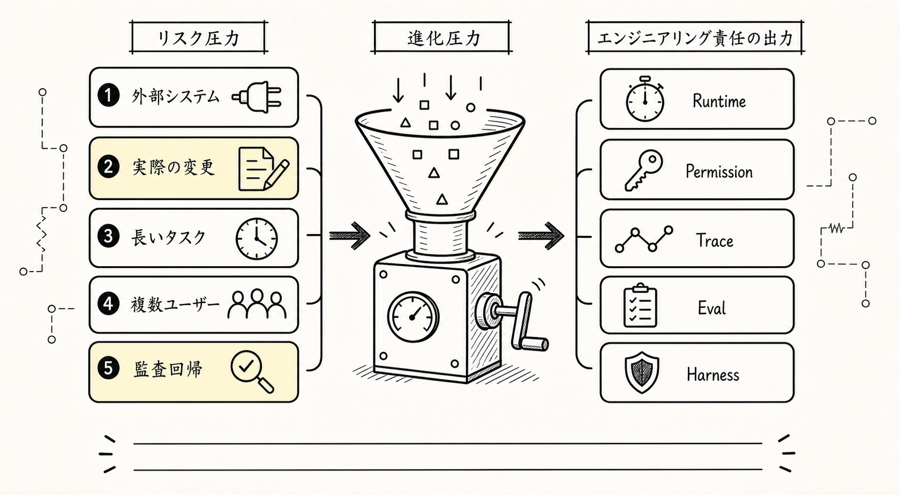
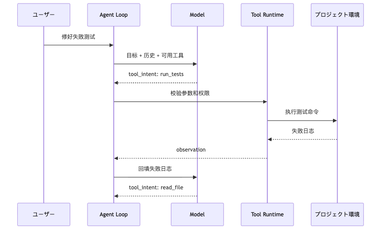
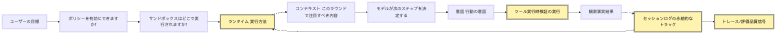
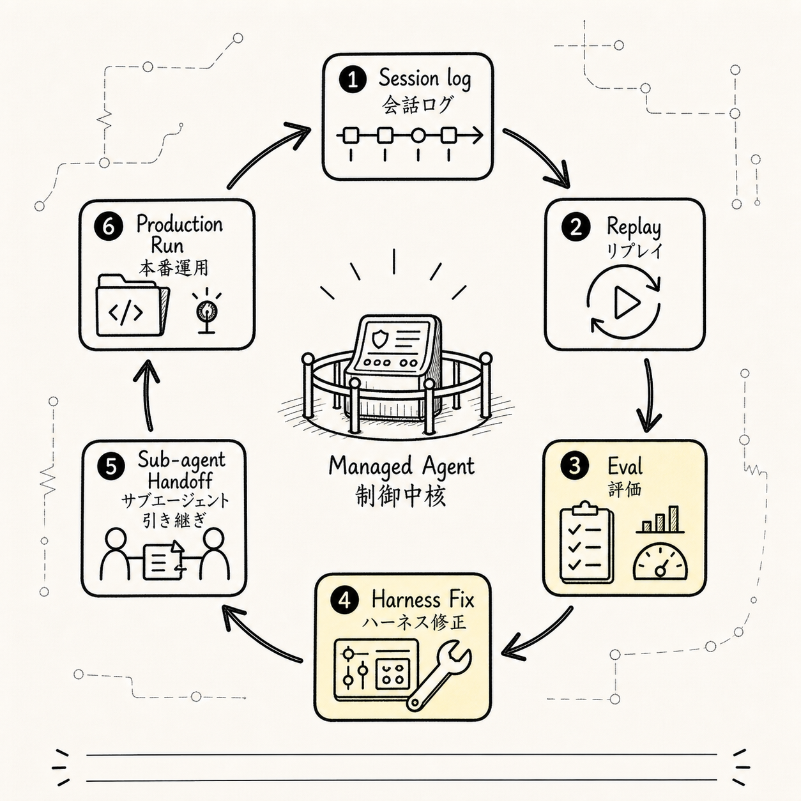

# Agent の進化経路：Chat Agent -> Tool Agent -> Runtime Agent -> Managed Agent

Agent は Chat から Tool、Runtime、Managed へ進むにつれて、現実のリスクを受け止める制御層を増やしていく。重要なのは能力の序列ではなく、どの現実リスクに触れているかで Harness の厚みを決めることだ。

```text
Agent は Chat から Tool、Runtime、Managed へ進むにつれて、現実のリスクを受け止める制御層を増やしていく。重要なのは能力の序列ではなく、どの現実リスクに触れているかで Harness の厚みを決めることだ。
-> 必要な事実を記録する
-> 次の判断へ渡す
```
Agent は Chat から Tool、Runtime、Managed へ進むにつれて、現実のリスクを受け止める制御層を増やしていく。重要なのは能力の序列ではなく、どの現実リスクに触れているかで Harness の厚みを決めることだ。

> Agent は Chat から Tool、Runtime、Managed へ進むにつれて、現実のリスクを受け止める制御層を増やしていく。重要なのは能力の序列ではなく、どの現実リスクに触れているかで Harness の厚みを決めることだ。

Agent は Chat から Tool、Runtime、Managed へ進むにつれて、現実のリスクを受け止める制御層を増やしていく。重要なのは能力の序列ではなく、どの現実リスクに触れているかで Harness の厚みを決めることだ。

```text
Agent は Chat から Tool、Runtime、Managed へ進むにつれて、現実のリスクを受け止める制御層を増やしていく。重要なのは能力の序列ではなく、どの現実リスクに触れているかで Harness の厚みを決めることだ。
```
Agent は Chat から Tool、Runtime、Managed へ進むにつれて、現実のリスクを受け止める制御層を増やしていく。重要なのは能力の序列ではなく、どの現実リスクに触れているかで Harness の厚みを決めることだ。

## 問題の連鎖


Agent は Chat から Tool、Runtime、Managed へ進むにつれて、現実のリスクを受け止める制御層を増やしていく。重要なのは能力の序列ではなく、どの現実リスクに触れているかで Harness の厚みを決めることだ。

```text
Agent は Chat から Tool、Runtime、Managed へ進むにつれて、現実のリスクを受け止める制御層を増やしていく。重要なのは能力の序列ではなく、どの現実リスクに触れているかで Harness の厚みを決めることだ。
-> 必要な事実を記録する
-> 次の判断へ渡す
```
Agent は Chat から Tool、Runtime、Managed へ進むにつれて、現実のリスクを受け止める制御層を増やしていく。重要なのは能力の序列ではなく、どの現実リスクに触れているかで Harness の厚みを決めることだ。


Agent は Chat から Tool、Runtime、Managed へ進むにつれて、現実のリスクを受け止める制御層を増やしていく。重要なのは能力の序列ではなく、どの現実リスクに触れているかで Harness の厚みを決めることだ。

Agent は Chat から Tool、Runtime、Managed へ進むにつれて、現実のリスクを受け止める制御層を増やしていく。重要なのは能力の序列ではなく、どの現実リスクに触れているかで Harness の厚みを決めることだ。

Agent は Chat から Tool、Runtime、Managed へ進むにつれて、現実のリスクを受け止める制御層を増やしていく。重要なのは能力の序列ではなく、どの現実リスクに触れているかで Harness の厚みを決めることだ。

Agent は Chat から Tool、Runtime、Managed へ進むにつれて、現実のリスクを受け止める制御層を増やしていく。重要なのは能力の序列ではなく、どの現実リスクに触れているかで Harness の厚みを決めることだ。

Agent は Chat から Tool、Runtime、Managed へ進むにつれて、現実のリスクを受け止める制御層を増やしていく。重要なのは能力の序列ではなく、どの現実リスクに触れているかで Harness の厚みを決めることだ。

```text
Agent は Chat から Tool、Runtime、Managed へ進むにつれて、現実のリスクを受け止める制御層を増やしていく。重要なのは能力の序列ではなく、どの現実リスクに触れているかで Harness の厚みを決めることだ。
-> 必要な事実を記録する
-> 次の判断へ渡す
```

Agent は Chat から Tool、Runtime、Managed へ進むにつれて、現実のリスクを受け止める制御層を増やしていく。重要なのは能力の序列ではなく、どの現実リスクに触れているかで Harness の厚みを決めることだ。

Agent は Chat から Tool、Runtime、Managed へ進むにつれて、現実のリスクを受け止める制御層を増やしていく。重要なのは能力の序列ではなく、どの現実リスクに触れているかで Harness の厚みを決めることだ。


Agent は Chat から Tool、Runtime、Managed へ進むにつれて、現実のリスクを受け止める制御層を増やしていく。重要なのは能力の序列ではなく、どの現実リスクに触れているかで Harness の厚みを決めることだ。

Agent は Chat から Tool、Runtime、Managed へ進むにつれて、現実のリスクを受け止める制御層を増やしていく。重要なのは能力の序列ではなく、どの現実リスクに触れているかで Harness の厚みを決めることだ。

Agent は Chat から Tool、Runtime、Managed へ進むにつれて、現実のリスクを受け止める制御層を増やしていく。重要なのは能力の序列ではなく、どの現実リスクに触れているかで Harness の厚みを決めることだ。

```text
Agent は Chat から Tool、Runtime、Managed へ進むにつれて、現実のリスクを受け止める制御層を増やしていく。重要なのは能力の序列ではなく、どの現実リスクに触れているかで Harness の厚みを決めることだ。
```

## 1. Chat Agent：まず回答できるようにする



Agent は Chat から Tool、Runtime、Managed へ進むにつれて、現実のリスクを受け止める制御層を増やしていく。重要なのは能力の序列ではなく、どの現実リスクに触れているかで Harness の厚みを決めることだ。

```text
Agent は Chat から Tool、Runtime、Managed へ進むにつれて、現実のリスクを受け止める制御層を増やしていく。重要なのは能力の序列ではなく、どの現実リスクに触れているかで Harness の厚みを決めることだ。
-> 必要な事実を記録する
-> 次の判断へ渡す
```
Agent は Chat から Tool、Runtime、Managed へ進むにつれて、現実のリスクを受け止める制御層を増やしていく。重要なのは能力の序列ではなく、どの現実リスクに触れているかで Harness の厚みを決めることだ。

```text
Agent は Chat から Tool、Runtime、Managed へ進むにつれて、現実のリスクを受け止める制御層を増やしていく。重要なのは能力の序列ではなく、どの現実リスクに触れているかで Harness の厚みを決めることだ。
-> 必要な事実を記録する
-> 次の判断へ渡す
```
Agent は Chat から Tool、Runtime、Managed へ進むにつれて、現実のリスクを受け止める制御層を増やしていく。重要なのは能力の序列ではなく、どの現実リスクに触れているかで Harness の厚みを決めることだ。

```text
Agent は Chat から Tool、Runtime、Managed へ進むにつれて、現実のリスクを受け止める制御層を増やしていく。重要なのは能力の序列ではなく、どの現実リスクに触れているかで Harness の厚みを決めることだ。
```
Agent は Chat から Tool、Runtime、Managed へ進むにつれて、現実のリスクを受け止める制御層を増やしていく。重要なのは能力の序列ではなく、どの現実リスクに触れているかで Harness の厚みを決めることだ。

```text
Agent は Chat から Tool、Runtime、Managed へ進むにつれて、現実のリスクを受け止める制御層を増やしていく。重要なのは能力の序列ではなく、どの現実リスクに触れているかで Harness の厚みを決めることだ。
-> 必要な事実を記録する
-> 次の判断へ渡す
```
Agent は Chat から Tool、Runtime、Managed へ進むにつれて、現実のリスクを受け止める制御層を増やしていく。重要なのは能力の序列ではなく、どの現実リスクに触れているかで Harness の厚みを決めることだ。

```text
Agent は Chat から Tool、Runtime、Managed へ進むにつれて、現実のリスクを受け止める制御層を増やしていく。重要なのは能力の序列ではなく、どの現実リスクに触れているかで Harness の厚みを決めることだ。
```
Agent は Chat から Tool、Runtime、Managed へ進むにつれて、現実のリスクを受け止める制御層を増やしていく。重要なのは能力の序列ではなく、どの現実リスクに触れているかで Harness の厚みを決めることだ。

```text
Agent は Chat から Tool、Runtime、Managed へ進むにつれて、現実のリスクを受け止める制御層を増やしていく。重要なのは能力の序列ではなく、どの現実リスクに触れているかで Harness の厚みを決めることだ。
```
Agent は Chat から Tool、Runtime、Managed へ進むにつれて、現実のリスクを受け止める制御層を増やしていく。重要なのは能力の序列ではなく、どの現実リスクに触れているかで Harness の厚みを決めることだ。

```ts
type Message = {
  role: "user" | "assistant"
  content: string
}

async function chat(input: string) {
  messages.push({ role: "user", content: input })

  const answer = await model.complete({ messages })

  messages.push({ role: "assistant", content: answer })

  return answer
}
```
Agent は Chat から Tool、Runtime、Managed へ進むにつれて、現実のリスクを受け止める制御層を増やしていく。重要なのは能力の序列ではなく、どの現実リスクに触れているかで Harness の厚みを決めることだ。

## 2. Tool Agent：モデルの意図を制御された行動へ変える

Agent は Chat から Tool、Runtime、Managed へ進むにつれて、現実のリスクを受け止める制御層を増やしていく。重要なのは能力の序列ではなく、どの現実リスクに触れているかで Harness の厚みを決めることだ。

```text
Agent は Chat から Tool、Runtime、Managed へ進むにつれて、現実のリスクを受け止める制御層を増やしていく。重要なのは能力の序列ではなく、どの現実リスクに触れているかで Harness の厚みを決めることだ。
```
Agent は Chat から Tool、Runtime、Managed へ進むにつれて、現実のリスクを受け止める制御層を増やしていく。重要なのは能力の序列ではなく、どの現実リスクに触れているかで Harness の厚みを決めることだ。

```text
Agent は Chat から Tool、Runtime、Managed へ進むにつれて、現実のリスクを受け止める制御層を増やしていく。重要なのは能力の序列ではなく、どの現実リスクに触れているかで Harness の厚みを決めることだ。
-> 必要な事実を記録する
-> 次の判断へ渡す
```
Agent は Chat から Tool、Runtime、Managed へ進むにつれて、現実のリスクを受け止める制御層を増やしていく。重要なのは能力の序列ではなく、どの現実リスクに触れているかで Harness の厚みを決めることだ。

```text
Agent は Chat から Tool、Runtime、Managed へ進むにつれて、現実のリスクを受け止める制御層を増やしていく。重要なのは能力の序列ではなく、どの現実リスクに触れているかで Harness の厚みを決めることだ。
```
Agent は Chat から Tool、Runtime、Managed へ進むにつれて、現実のリスクを受け止める制御層を増やしていく。重要なのは能力の序列ではなく、どの現実リスクに触れているかで Harness の厚みを決めることだ。

```json
{
  "tool": "read_file",
  "args": {
    "path": "package.json"
  }
}
```
Agent は Chat から Tool、Runtime、Managed へ進むにつれて、現実のリスクを受け止める制御層を増やしていく。重要なのは能力の序列ではなく、どの現実リスクに触れているかで Harness の厚みを決めることだ。

```text
Agent は Chat から Tool、Runtime、Managed へ進むにつれて、現実のリスクを受け止める制御層を増やしていく。重要なのは能力の序列ではなく、どの現実リスクに触れているかで Harness の厚みを決めることだ。
-> 必要な事実を記録する
-> 次の判断へ渡す
```
Agent は Chat から Tool、Runtime、Managed へ進むにつれて、現実のリスクを受け止める制御層を増やしていく。重要なのは能力の序列ではなく、どの現実リスクに触れているかで Harness の厚みを決めることだ。


Agent は Chat から Tool、Runtime、Managed へ進むにつれて、現実のリスクを受け止める制御層を増やしていく。重要なのは能力の序列ではなく、どの現実リスクに触れているかで Harness の厚みを決めることだ。

```ts
type ToolCall = {
  name: string
  args: unknown
}

type Tool = {
  name: string
  description: string
  inputSchema: JsonSchema
  execute(args: unknown, ctx: ToolContext): Promise<ToolResult>
}
```
Agent は Chat から Tool、Runtime、Managed へ進むにつれて、現実のリスクを受け止める制御層を増やしていく。重要なのは能力の序列ではなく、どの現実リスクに触れているかで Harness の厚みを決めることだ。

```text
Agent は Chat から Tool、Runtime、Managed へ進むにつれて、現実のリスクを受け止める制御層を増やしていく。重要なのは能力の序列ではなく、どの現実リスクに触れているかで Harness の厚みを決めることだ。
-> 必要な事実を記録する
-> 次の判断へ渡す
```
Agent は Chat から Tool、Runtime、Managed へ進むにつれて、現実のリスクを受け止める制御層を増やしていく。重要なのは能力の序列ではなく、どの現実リスクに触れているかで Harness の厚みを決めることだ。

```text
Agent は Chat から Tool、Runtime、Managed へ進むにつれて、現実のリスクを受け止める制御層を増やしていく。重要なのは能力の序列ではなく、どの現実リスクに触れているかで Harness の厚みを決めることだ。
```
Agent は Chat から Tool、Runtime、Managed へ進むにつれて、現実のリスクを受け止める制御層を増やしていく。重要なのは能力の序列ではなく、どの現実リスクに触れているかで Harness の厚みを決めることだ。

```text
Agent は Chat から Tool、Runtime、Managed へ進むにつれて、現実のリスクを受け止める制御層を増やしていく。重要なのは能力の序列ではなく、どの現実リスクに触れているかで Harness の厚みを決めることだ。
```
Agent は Chat から Tool、Runtime、Managed へ進むにつれて、現実のリスクを受け止める制御層を増やしていく。重要なのは能力の序列ではなく、どの現実リスクに触れているかで Harness の厚みを決めることだ。

```text
Agent は Chat から Tool、Runtime、Managed へ進むにつれて、現実のリスクを受け止める制御層を増やしていく。重要なのは能力の序列ではなく、どの現実リスクに触れているかで Harness の厚みを決めることだ。
```
Agent は Chat から Tool、Runtime、Managed へ進むにつれて、現実のリスクを受け止める制御層を増やしていく。重要なのは能力の序列ではなく、どの現実リスクに触れているかで Harness の厚みを決めることだ。

```text
Agent は Chat から Tool、Runtime、Managed へ進むにつれて、現実のリスクを受け止める制御層を増やしていく。重要なのは能力の序列ではなく、どの現実リスクに触れているかで Harness の厚みを決めることだ。
```

Agent は Chat から Tool、Runtime、Managed へ進むにつれて、現実のリスクを受け止める制御層を増やしていく。重要なのは能力の序列ではなく、どの現実リスクに触れているかで Harness の厚みを決めることだ。

Agent は Chat から Tool、Runtime、Managed へ進むにつれて、現実のリスクを受け止める制御層を増やしていく。重要なのは能力の序列ではなく、どの現実リスクに触れているかで Harness の厚みを決めることだ。

```text
Agent は Chat から Tool、Runtime、Managed へ進むにつれて、現実のリスクを受け止める制御層を増やしていく。重要なのは能力の序列ではなく、どの現実リスクに触れているかで Harness の厚みを決めることだ。
```

Agent は Chat から Tool、Runtime、Managed へ進むにつれて、現実のリスクを受け止める制御層を増やしていく。重要なのは能力の序列ではなく、どの現実リスクに触れているかで Harness の厚みを決めることだ。

Agent は Chat から Tool、Runtime、Managed へ進むにつれて、現実のリスクを受け止める制御層を増やしていく。重要なのは能力の序列ではなく、どの現実リスクに触れているかで Harness の厚みを決めることだ。

Agent は Chat から Tool、Runtime、Managed へ進むにつれて、現実のリスクを受け止める制御層を増やしていく。重要なのは能力の序列ではなく、どの現実リスクに触れているかで Harness の厚みを決めることだ。

Agent は Chat から Tool、Runtime、Managed へ進むにつれて、現実のリスクを受け止める制御層を増やしていく。重要なのは能力の序列ではなく、どの現実リスクに触れているかで Harness の厚みを決めることだ。

Agent は Chat から Tool、Runtime、Managed へ進むにつれて、現実のリスクを受け止める制御層を増やしていく。重要なのは能力の序列ではなく、どの現実リスクに触れているかで Harness の厚みを決めることだ。

Agent は Chat から Tool、Runtime、Managed へ進むにつれて、現実のリスクを受け止める制御層を増やしていく。重要なのは能力の序列ではなく、どの現実リスクに触れているかで Harness の厚みを決めることだ。

Agent は Chat から Tool、Runtime、Managed へ進むにつれて、現実のリスクを受け止める制御層を増やしていく。重要なのは能力の序列ではなく、どの現実リスクに触れているかで Harness の厚みを決めることだ。

```text
Agent は Chat から Tool、Runtime、Managed へ進むにつれて、現実のリスクを受け止める制御層を増やしていく。重要なのは能力の序列ではなく、どの現実リスクに触れているかで Harness の厚みを決めることだ。
-> 必要な事実を記録する
-> 次の判断へ渡す
```

Agent は Chat から Tool、Runtime、Managed へ進むにつれて、現実のリスクを受け止める制御層を増やしていく。重要なのは能力の序列ではなく、どの現実リスクに触れているかで Harness の厚みを決めることだ。

Agent は Chat から Tool、Runtime、Managed へ進むにつれて、現実のリスクを受け止める制御層を増やしていく。重要なのは能力の序列ではなく、どの現実リスクに触れているかで Harness の厚みを決めることだ。

## 3. Runtime Agent：長いタスクを制御・復旧・検証できるようにする

Agent は Chat から Tool、Runtime、Managed へ進むにつれて、現実のリスクを受け止める制御層を増やしていく。重要なのは能力の序列ではなく、どの現実リスクに触れているかで Harness の厚みを決めることだ。

```ts
while (true) {
  const event = await model.next(state)

  if (event.type === "final") break

  if (event.type === "tool_call") {
    const result = await tools.execute(event)
    state.messages.push(result)
  }
}
```
Agent は Chat から Tool、Runtime、Managed へ進むにつれて、現実のリスクを受け止める制御層を増やしていく。重要なのは能力の序列ではなく、どの現実リスクに触れているかで Harness の厚みを決めることだ。

```text
Agent は Chat から Tool、Runtime、Managed へ進むにつれて、現実のリスクを受け止める制御層を増やしていく。重要なのは能力の序列ではなく、どの現実リスクに触れているかで Harness の厚みを決めることだ。
-> 必要な事実を記録する
-> 次の判断へ渡す
```
Agent は Chat から Tool、Runtime、Managed へ進むにつれて、現実のリスクを受け止める制御層を増やしていく。重要なのは能力の序列ではなく、どの現実リスクに触れているかで Harness の厚みを決めることだ。


Agent は Chat から Tool、Runtime、Managed へ進むにつれて、現実のリスクを受け止める制御層を増やしていく。重要なのは能力の序列ではなく、どの現実リスクに触れているかで Harness の厚みを決めることだ。

```ts
function canContinue(session: SessionState) {
  if (session.turns >= session.maxTurns) return false
  if (session.tokensUsed >= session.tokenBudget) return false
  if (Date.now() > session.deadline) return false
  if (session.interrupted) return false
  return true
}
```
Agent は Chat から Tool、Runtime、Managed へ進むにつれて、現実のリスクを受け止める制御層を増やしていく。重要なのは能力の序列ではなく、どの現実リスクに触れているかで Harness の厚みを決めることだ。

```ts
type RuntimeEvent =
  | { type: "model_started"; turn: number }
  | { type: "tool_requested"; call: ToolCall }
  | { type: "tool_succeeded"; result: ToolResult }
  | { type: "tool_failed"; error: ToolError; recoverable: boolean }
  | { type: "budget_exceeded"; kind: "turn" | "token" | "time" }
  | { type: "interrupted"; reason: string }
  | { type: "final"; content: string }
```
Agent は Chat から Tool、Runtime、Managed へ進むにつれて、現実のリスクを受け止める制御層を増やしていく。重要なのは能力の序列ではなく、どの現実リスクに触れているかで Harness の厚みを決めることだ。

```text
Agent は Chat から Tool、Runtime、Managed へ進むにつれて、現実のリスクを受け止める制御層を増やしていく。重要なのは能力の序列ではなく、どの現実リスクに触れているかで Harness の厚みを決めることだ。
```
Agent は Chat から Tool、Runtime、Managed へ進むにつれて、現実のリスクを受け止める制御層を増やしていく。重要なのは能力の序列ではなく、どの現実リスクに触れているかで Harness の厚みを決めることだ。

```text
Agent は Chat から Tool、Runtime、Managed へ進むにつれて、現実のリスクを受け止める制御層を増やしていく。重要なのは能力の序列ではなく、どの現実リスクに触れているかで Harness の厚みを決めることだ。
-> 必要な事実を記録する
-> 次の判断へ渡す
```
Agent は Chat から Tool、Runtime、Managed へ進むにつれて、現実のリスクを受け止める制御層を増やしていく。重要なのは能力の序列ではなく、どの現実リスクに触れているかで Harness の厚みを決めることだ。

```text
Agent は Chat から Tool、Runtime、Managed へ進むにつれて、現実のリスクを受け止める制御層を増やしていく。重要なのは能力の序列ではなく、どの現実リスクに触れているかで Harness の厚みを決めることだ。
```
Agent は Chat から Tool、Runtime、Managed へ進むにつれて、現実のリスクを受け止める制御層を増やしていく。重要なのは能力の序列ではなく、どの現実リスクに触れているかで Harness の厚みを決めることだ。

```text
Agent は Chat から Tool、Runtime、Managed へ進むにつれて、現実のリスクを受け止める制御層を増やしていく。重要なのは能力の序列ではなく、どの現実リスクに触れているかで Harness の厚みを決めることだ。
```
Agent は Chat から Tool、Runtime、Managed へ進むにつれて、現実のリスクを受け止める制御層を増やしていく。重要なのは能力の序列ではなく、どの現実リスクに触れているかで Harness の厚みを決めることだ。

## 4. Managed Agent：Agent を実組織と実環境へ入れる

Agent は Chat から Tool、Runtime、Managed へ進むにつれて、現実のリスクを受け止める制御層を増やしていく。重要なのは能力の序列ではなく、どの現実リスクに触れているかで Harness の厚みを決めることだ。

```text
Agent は Chat から Tool、Runtime、Managed へ進むにつれて、現実のリスクを受け止める制御層を増やしていく。重要なのは能力の序列ではなく、どの現実リスクに触れているかで Harness の厚みを決めることだ。
```
Agent は Chat から Tool、Runtime、Managed へ進むにつれて、現実のリスクを受け止める制御層を増やしていく。重要なのは能力の序列ではなく、どの現実リスクに触れているかで Harness の厚みを決めることだ。

```text
Agent は Chat から Tool、Runtime、Managed へ進むにつれて、現実のリスクを受け止める制御層を増やしていく。重要なのは能力の序列ではなく、どの現実リスクに触れているかで Harness の厚みを決めることだ。
-> 必要な事実を記録する
-> 次の判断へ渡す
```
Agent は Chat から Tool、Runtime、Managed へ進むにつれて、現実のリスクを受け止める制御層を増やしていく。重要なのは能力の序列ではなく、どの現実リスクに触れているかで Harness の厚みを決めることだ。


Agent は Chat から Tool、Runtime、Managed へ進むにつれて、現実のリスクを受け止める制御層を増やしていく。重要なのは能力の序列ではなく、どの現実リスクに触れているかで Harness の厚みを決めることだ。

```text
Agent は Chat から Tool、Runtime、Managed へ進むにつれて、現実のリスクを受け止める制御層を増やしていく。重要なのは能力の序列ではなく、どの現実リスクに触れているかで Harness の厚みを決めることだ。
```
Agent は Chat から Tool、Runtime、Managed へ進むにつれて、現実のリスクを受け止める制御層を増やしていく。重要なのは能力の序列ではなく、どの現実リスクに触れているかで Harness の厚みを決めることだ。

```text
Agent は Chat から Tool、Runtime、Managed へ進むにつれて、現実のリスクを受け止める制御層を増やしていく。重要なのは能力の序列ではなく、どの現実リスクに触れているかで Harness の厚みを決めることだ。
-> 必要な事実を記録する
-> 次の判断へ渡す
```
Agent は Chat から Tool、Runtime、Managed へ進むにつれて、現実のリスクを受け止める制御層を増やしていく。重要なのは能力の序列ではなく、どの現実リスクに触れているかで Harness の厚みを決めることだ。

```text
Agent は Chat から Tool、Runtime、Managed へ進むにつれて、現実のリスクを受け止める制御層を増やしていく。重要なのは能力の序列ではなく、どの現実リスクに触れているかで Harness の厚みを決めることだ。
-> 必要な事実を記録する
-> 次の判断へ渡す
```
Agent は Chat から Tool、Runtime、Managed へ進むにつれて、現実のリスクを受け止める制御層を増やしていく。重要なのは能力の序列ではなく、どの現実リスクに触れているかで Harness の厚みを決めることだ。

## 5. Harness：別の Agent ではなく、モデル外側の制御システム

Agent は Chat から Tool、Runtime、Managed へ進むにつれて、現実のリスクを受け止める制御層を増やしていく。重要なのは能力の序列ではなく、どの現実リスクに触れているかで Harness の厚みを決めることだ。

```text
Agent は Chat から Tool、Runtime、Managed へ進むにつれて、現実のリスクを受け止める制御層を増やしていく。重要なのは能力の序列ではなく、どの現実リスクに触れているかで Harness の厚みを決めることだ。
```
Agent は Chat から Tool、Runtime、Managed へ進むにつれて、現実のリスクを受け止める制御層を増やしていく。重要なのは能力の序列ではなく、どの現実リスクに触れているかで Harness の厚みを決めることだ。

```text
Agent は Chat から Tool、Runtime、Managed へ進むにつれて、現実のリスクを受け止める制御層を増やしていく。重要なのは能力の序列ではなく、どの現実リスクに触れているかで Harness の厚みを決めることだ。
-> 必要な事実を記録する
-> 次の判断へ渡す
```
Agent は Chat から Tool、Runtime、Managed へ進むにつれて、現実のリスクを受け止める制御層を増やしていく。重要なのは能力の序列ではなく、どの現実リスクに触れているかで Harness の厚みを決めることだ。


Agent は Chat から Tool、Runtime、Managed へ進むにつれて、現実のリスクを受け止める制御層を増やしていく。重要なのは能力の序列ではなく、どの現実リスクに触れているかで Harness の厚みを決めることだ。

```text
Agent は Chat から Tool、Runtime、Managed へ進むにつれて、現実のリスクを受け止める制御層を増やしていく。重要なのは能力の序列ではなく、どの現実リスクに触れているかで Harness の厚みを決めることだ。
-> 必要な事実を記録する
-> 次の判断へ渡す
```
Agent は Chat から Tool、Runtime、Managed へ進むにつれて、現実のリスクを受け止める制御層を増やしていく。重要なのは能力の序列ではなく、どの現実リスクに触れているかで Harness の厚みを決めることだ。

## 6. 4 段階それぞれの失敗パターン

Agent は Chat から Tool、Runtime、Managed へ進むにつれて、現実のリスクを受け止める制御層を増やしていく。重要なのは能力の序列ではなく、どの現実リスクに触れているかで Harness の厚みを決めることだ。

```text
Agent は Chat から Tool、Runtime、Managed へ進むにつれて、現実のリスクを受け止める制御層を増やしていく。重要なのは能力の序列ではなく、どの現実リスクに触れているかで Harness の厚みを決めることだ。
```
Agent は Chat から Tool、Runtime、Managed へ進むにつれて、現実のリスクを受け止める制御層を増やしていく。重要なのは能力の序列ではなく、どの現実リスクに触れているかで Harness の厚みを決めることだ。

```text
Agent は Chat から Tool、Runtime、Managed へ進むにつれて、現実のリスクを受け止める制御層を増やしていく。重要なのは能力の序列ではなく、どの現実リスクに触れているかで Harness の厚みを決めることだ。
```
Agent は Chat から Tool、Runtime、Managed へ進むにつれて、現実のリスクを受け止める制御層を増やしていく。重要なのは能力の序列ではなく、どの現実リスクに触れているかで Harness の厚みを決めることだ。

```text
Agent は Chat から Tool、Runtime、Managed へ進むにつれて、現実のリスクを受け止める制御層を増やしていく。重要なのは能力の序列ではなく、どの現実リスクに触れているかで Harness の厚みを決めることだ。
```
Agent は Chat から Tool、Runtime、Managed へ進むにつれて、現実のリスクを受け止める制御層を増やしていく。重要なのは能力の序列ではなく、どの現実リスクに触れているかで Harness の厚みを決めることだ。

```text
Agent は Chat から Tool、Runtime、Managed へ進むにつれて、現実のリスクを受け止める制御層を増やしていく。重要なのは能力の序列ではなく、どの現実リスクに触れているかで Harness の厚みを決めることだ。
```
Agent は Chat から Tool、Runtime、Managed へ進むにつれて、現実のリスクを受け止める制御層を増やしていく。重要なのは能力の序列ではなく、どの現実リスクに触れているかで Harness の厚みを決めることだ。

## 7. 実装への落とし込み：最初から大きな平台にしない

Agent は Chat から Tool、Runtime、Managed へ進むにつれて、現実のリスクを受け止める制御層を増やしていく。重要なのは能力の序列ではなく、どの現実リスクに触れているかで Harness の厚みを決めることだ。

```text
Agent は Chat から Tool、Runtime、Managed へ進むにつれて、現実のリスクを受け止める制御層を増やしていく。重要なのは能力の序列ではなく、どの現実リスクに触れているかで Harness の厚みを決めることだ。
-> 必要な事実を記録する
-> 次の判断へ渡す
```
Agent は Chat から Tool、Runtime、Managed へ進むにつれて、現実のリスクを受け止める制御層を増やしていく。重要なのは能力の序列ではなく、どの現実リスクに触れているかで Harness の厚みを決めることだ。

```text
Agent は Chat から Tool、Runtime、Managed へ進むにつれて、現実のリスクを受け止める制御層を増やしていく。重要なのは能力の序列ではなく、どの現実リスクに触れているかで Harness の厚みを決めることだ。
-> 必要な事実を記録する
-> 次の判断へ渡す
```
Agent は Chat から Tool、Runtime、Managed へ進むにつれて、現実のリスクを受け止める制御層を増やしていく。重要なのは能力の序列ではなく、どの現実リスクに触れているかで Harness の厚みを決めることだ。

```text
Agent は Chat から Tool、Runtime、Managed へ進むにつれて、現実のリスクを受け止める制御層を増やしていく。重要なのは能力の序列ではなく、どの現実リスクに触れているかで Harness の厚みを決めることだ。
-> 必要な事実を記録する
-> 次の判断へ渡す
```
Agent は Chat から Tool、Runtime、Managed へ進むにつれて、現実のリスクを受け止める制御層を増やしていく。重要なのは能力の序列ではなく、どの現実リスクに触れているかで Harness の厚みを決めることだ。

```text
Agent は Chat から Tool、Runtime、Managed へ進むにつれて、現実のリスクを受け止める制御層を増やしていく。重要なのは能力の序列ではなく、どの現実リスクに触れているかで Harness の厚みを決めることだ。
-> 必要な事実を記録する
-> 次の判断へ渡す
```
Agent は Chat から Tool、Runtime、Managed へ進むにつれて、現実のリスクを受け止める制御層を増やしていく。重要なのは能力の序列ではなく、どの現実リスクに触れているかで Harness の厚みを決めることだ。

```ts
interface AgentHarness {
  provider: ModelProvider
  tools: ToolRegistry
  runtime: RuntimeController
  sessionStore: SessionStore
  policy?: PolicyEngine
  sandbox?: SandboxManager
  telemetry?: TraceSink
  evals?: EvalRunner
}
```
Agent は Chat から Tool、Runtime、Managed へ進むにつれて、現実のリスクを受け止める制御層を増やしていく。重要なのは能力の序列ではなく、どの現実リスクに触れているかで Harness の厚みを決めることだ。

```text
Agent は Chat から Tool、Runtime、Managed へ進むにつれて、現実のリスクを受け止める制御層を増やしていく。重要なのは能力の序列ではなく、どの現実リスクに触れているかで Harness の厚みを決めることだ。
-> 必要な事実を記録する
-> 次の判断へ渡す
```
Agent は Chat から Tool、Runtime、Managed へ進むにつれて、現実のリスクを受け止める制御層を増やしていく。重要なのは能力の序列ではなく、どの現実リスクに触れているかで Harness の厚みを決めることだ。

## 8. もう一段深く見る：復旧可能、評価可能、委譲可能



Agent は Chat から Tool、Runtime、Managed へ進むにつれて、現実のリスクを受け止める制御層を増やしていく。重要なのは能力の序列ではなく、どの現実リスクに触れているかで Harness の厚みを決めることだ。

```text
Agent は Chat から Tool、Runtime、Managed へ進むにつれて、現実のリスクを受け止める制御層を増やしていく。重要なのは能力の序列ではなく、どの現実リスクに触れているかで Harness の厚みを決めることだ。
-> 必要な事実を記録する
-> 次の判断へ渡す
```

### Session log は普通のログではない

Agent は Chat から Tool、Runtime、Managed へ進むにつれて、現実のリスクを受け止める制御層を増やしていく。重要なのは能力の序列ではなく、どの現実リスクに触れているかで Harness の厚みを決めることだ。

Agent は Chat から Tool、Runtime、Managed へ進むにつれて、現実のリスクを受け止める制御層を増やしていく。重要なのは能力の序列ではなく、どの現実リスクに触れているかで Harness の厚みを決めることだ。

```text
Agent は Chat から Tool、Runtime、Managed へ進むにつれて、現実のリスクを受け止める制御層を増やしていく。重要なのは能力の序列ではなく、どの現実リスクに触れているかで Harness の厚みを決めることだ。
-> 必要な事実を記録する
-> 次の判断へ渡す
```

Agent は Chat から Tool、Runtime、Managed へ進むにつれて、現実のリスクを受け止める制御層を増やしていく。重要なのは能力の序列ではなく、どの現実リスクに触れているかで Harness の厚みを決めることだ。

Agent は Chat から Tool、Runtime、Managed へ進むにつれて、現実のリスクを受け止める制御層を増やしていく。重要なのは能力の序列ではなく、どの現実リスクに触れているかで Harness の厚みを決めることだ。

Agent は Chat から Tool、Runtime、Managed へ進むにつれて、現実のリスクを受け止める制御層を増やしていく。重要なのは能力の序列ではなく、どの現実リスクに触れているかで Harness の厚みを決めることだ。

```text
Agent は Chat から Tool、Runtime、Managed へ進むにつれて、現実のリスクを受け止める制御層を増やしていく。重要なのは能力の序列ではなく、どの現実リスクに触れているかで Harness の厚みを決めることだ。
```

Agent は Chat から Tool、Runtime、Managed へ進むにつれて、現実のリスクを受け止める制御層を増やしていく。重要なのは能力の序列ではなく、どの現実リスクに触れているかで Harness の厚みを決めることだ。

### Sandbox は檻であり、同時にライセンスでもある

Agent は Chat から Tool、Runtime、Managed へ進むにつれて、現実のリスクを受け止める制御層を増やしていく。重要なのは能力の序列ではなく、どの現実リスクに触れているかで Harness の厚みを決めることだ。

Agent は Chat から Tool、Runtime、Managed へ進むにつれて、現実のリスクを受け止める制御層を増やしていく。重要なのは能力の序列ではなく、どの現実リスクに触れているかで Harness の厚みを決めることだ。

Agent は Chat から Tool、Runtime、Managed へ進むにつれて、現実のリスクを受け止める制御層を増やしていく。重要なのは能力の序列ではなく、どの現実リスクに触れているかで Harness の厚みを決めることだ。

Agent は Chat から Tool、Runtime、Managed へ進むにつれて、現実のリスクを受け止める制御層を増やしていく。重要なのは能力の序列ではなく、どの現実リスクに触れているかで Harness の厚みを決めることだ。

Agent は Chat から Tool、Runtime、Managed へ進むにつれて、現実のリスクを受け止める制御層を増やしていく。重要なのは能力の序列ではなく、どの現実リスクに触れているかで Harness の厚みを決めることだ。

```text
Agent は Chat から Tool、Runtime、Managed へ進むにつれて、現実のリスクを受け止める制御層を増やしていく。重要なのは能力の序列ではなく、どの現実リスクに触れているかで Harness の厚みを決めることだ。
-> 必要な事実を記録する
-> 次の判断へ渡す
```

Agent は Chat から Tool、Runtime、Managed へ進むにつれて、現実のリスクを受け止める制御層を増やしていく。重要なのは能力の序列ではなく、どの現実リスクに触れているかで Harness の厚みを決めることだ。

Agent は Chat から Tool、Runtime、Managed へ進むにつれて、現実のリスクを受け止める制御層を増やしていく。重要なのは能力の序列ではなく、どの現実リスクに触れているかで Harness の厚みを決めることだ。

```text
Agent は Chat から Tool、Runtime、Managed へ進むにつれて、現実のリスクを受け止める制御層を増やしていく。重要なのは能力の序列ではなく、どの現実リスクに触れているかで Harness の厚みを決めることだ。
-> 必要な事実を記録する
-> 次の判断へ渡す
```

Agent は Chat から Tool、Runtime、Managed へ進むにつれて、現実のリスクを受け止める制御層を増やしていく。重要なのは能力の序列ではなく、どの現実リスクに触れているかで Harness の厚みを決めることだ。

### Eval flywheel：点数付けではなく Harness を改善する

Agent は Chat から Tool、Runtime、Managed へ進むにつれて、現実のリスクを受け止める制御層を増やしていく。重要なのは能力の序列ではなく、どの現実リスクに触れているかで Harness の厚みを決めることだ。

Agent は Chat から Tool、Runtime、Managed へ進むにつれて、現実のリスクを受け止める制御層を増やしていく。重要なのは能力の序列ではなく、どの現実リスクに触れているかで Harness の厚みを決めることだ。

```text
Agent は Chat から Tool、Runtime、Managed へ進むにつれて、現実のリスクを受け止める制御層を増やしていく。重要なのは能力の序列ではなく、どの現実リスクに触れているかで Harness の厚みを決めることだ。
-> 必要な事実を記録する
-> 次の判断へ渡す
```

Agent は Chat から Tool、Runtime、Managed へ進むにつれて、現実のリスクを受け止める制御層を増やしていく。重要なのは能力の序列ではなく、どの現実リスクに触れているかで Harness の厚みを決めることだ。

Agent は Chat から Tool、Runtime、Managed へ進むにつれて、現実のリスクを受け止める制御層を増やしていく。重要なのは能力の序列ではなく、どの現実リスクに触れているかで Harness の厚みを決めることだ。

Agent は Chat から Tool、Runtime、Managed へ進むにつれて、現実のリスクを受け止める制御層を増やしていく。重要なのは能力の序列ではなく、どの現実リスクに触れているかで Harness の厚みを決めることだ。

Agent は Chat から Tool、Runtime、Managed へ進むにつれて、現実のリスクを受け止める制御層を増やしていく。重要なのは能力の序列ではなく、どの現実リスクに触れているかで Harness の厚みを決めることだ。

Agent は Chat から Tool、Runtime、Managed へ進むにつれて、現実のリスクを受け止める制御層を増やしていく。重要なのは能力の序列ではなく、どの現実リスクに触れているかで Harness の厚みを決めることだ。

```text
Agent は Chat から Tool、Runtime、Managed へ進むにつれて、現実のリスクを受け止める制御層を増やしていく。重要なのは能力の序列ではなく、どの現実リスクに触れているかで Harness の厚みを決めることだ。
```

Agent は Chat から Tool、Runtime、Managed へ進むにつれて、現実のリスクを受け止める制御層を増やしていく。重要なのは能力の序列ではなく、どの現実リスクに触れているかで Harness の厚みを決めることだ。

### Sub-agent handoff はモデルを増やすだけではない

Agent は Chat から Tool、Runtime、Managed へ進むにつれて、現実のリスクを受け止める制御層を増やしていく。重要なのは能力の序列ではなく、どの現実リスクに触れているかで Harness の厚みを決めることだ。

Agent は Chat から Tool、Runtime、Managed へ進むにつれて、現実のリスクを受け止める制御層を増やしていく。重要なのは能力の序列ではなく、どの現実リスクに触れているかで Harness の厚みを決めることだ。

```text
Agent は Chat から Tool、Runtime、Managed へ進むにつれて、現実のリスクを受け止める制御層を増やしていく。重要なのは能力の序列ではなく、どの現実リスクに触れているかで Harness の厚みを決めることだ。
-> 必要な事実を記録する
-> 次の判断へ渡す
```

Agent は Chat から Tool、Runtime、Managed へ進むにつれて、現実のリスクを受け止める制御層を増やしていく。重要なのは能力の序列ではなく、どの現実リスクに触れているかで Harness の厚みを決めることだ。

Agent は Chat から Tool、Runtime、Managed へ進むにつれて、現実のリスクを受け止める制御層を増やしていく。重要なのは能力の序列ではなく、どの現実リスクに触れているかで Harness の厚みを決めることだ。

```text
Agent は Chat から Tool、Runtime、Managed へ進むにつれて、現実のリスクを受け止める制御層を増やしていく。重要なのは能力の序列ではなく、どの現実リスクに触れているかで Harness の厚みを決めることだ。
-> 必要な事実を記録する
-> 次の判断へ渡す
```

Agent は Chat から Tool、Runtime、Managed へ進むにつれて、現実のリスクを受け止める制御層を増やしていく。重要なのは能力の序列ではなく、どの現実リスクに触れているかで Harness の厚みを決めることだ。

## 9. 4 段階を一文に圧縮する

Agent は Chat から Tool、Runtime、Managed へ進むにつれて、現実のリスクを受け止める制御層を増やしていく。重要なのは能力の序列ではなく、どの現実リスクに触れているかで Harness の厚みを決めることだ。

```text
Agent は Chat から Tool、Runtime、Managed へ進むにつれて、現実のリスクを受け止める制御層を増やしていく。重要なのは能力の序列ではなく、どの現実リスクに触れているかで Harness の厚みを決めることだ。
```
Agent は Chat から Tool、Runtime、Managed へ進むにつれて、現実のリスクを受け止める制御層を増やしていく。重要なのは能力の序列ではなく、どの現実リスクに触れているかで Harness の厚みを決めることだ。

```text
Agent は Chat から Tool、Runtime、Managed へ進むにつれて、現実のリスクを受け止める制御層を増やしていく。重要なのは能力の序列ではなく、どの現実リスクに触れているかで Harness の厚みを決めることだ。
```
Agent は Chat から Tool、Runtime、Managed へ進むにつれて、現実のリスクを受け止める制御層を増やしていく。重要なのは能力の序列ではなく、どの現実リスクに触れているかで Harness の厚みを決めることだ。

```text
Agent は Chat から Tool、Runtime、Managed へ進むにつれて、現実のリスクを受け止める制御層を増やしていく。重要なのは能力の序列ではなく、どの現実リスクに触れているかで Harness の厚みを決めることだ。
```
Agent は Chat から Tool、Runtime、Managed へ進むにつれて、現実のリスクを受け止める制御層を増やしていく。重要なのは能力の序列ではなく、どの現実リスクに触れているかで Harness の厚みを決めることだ。

```text
Agent は Chat から Tool、Runtime、Managed へ進むにつれて、現実のリスクを受け止める制御層を増やしていく。重要なのは能力の序列ではなく、どの現実リスクに触れているかで Harness の厚みを決めることだ。
```
Agent は Chat から Tool、Runtime、Managed へ進むにつれて、現実のリスクを受け止める制御層を増やしていく。重要なのは能力の序列ではなく、どの現実リスクに触れているかで Harness の厚みを決めることだ。

```text
Agent は Chat から Tool、Runtime、Managed へ進むにつれて、現実のリスクを受け止める制御層を増やしていく。重要なのは能力の序列ではなく、どの現実リスクに触れているかで Harness の厚みを決めることだ。
```
Agent は Chat から Tool、Runtime、Managed へ進むにつれて、現実のリスクを受け止める制御層を増やしていく。重要なのは能力の序列ではなく、どの現実リスクに触れているかで Harness の厚みを決めることだ。

## 図版計画

### 図解タイプ

Agent は Chat から Tool、Runtime、Managed へ進むにつれて、現実のリスクを受け止める制御層を増やしていく。重要なのは能力の序列ではなく、どの現実リスクに触れているかで Harness の厚みを決めることだ。

### 画面要素リスト

- Agent は Chat から Tool、Runtime、Managed へ進むにつれて、現実のリスクを受け止める制御層を増やしていく。重要なのは能力の序列ではなく、どの現実リスクに触れているかで Harness の厚みを決めることだ。
- Agent は Chat から Tool、Runtime、Managed へ進むにつれて、現実のリスクを受け止める制御層を増やしていく。重要なのは能力の序列ではなく、どの現実リスクに触れているかで Harness の厚みを決めることだ。
- Agent は Chat から Tool、Runtime、Managed へ進むにつれて、現実のリスクを受け止める制御層を増やしていく。重要なのは能力の序列ではなく、どの現実リスクに触れているかで Harness の厚みを決めることだ。
- Agent は Chat から Tool、Runtime、Managed へ進むにつれて、現実のリスクを受け止める制御層を増やしていく。重要なのは能力の序列ではなく、どの現実リスクに触れているかで Harness の厚みを決めることだ。
- Agent は Chat から Tool、Runtime、Managed へ進むにつれて、現実のリスクを受け止める制御層を増やしていく。重要なのは能力の序列ではなく、どの現実リスクに触れているかで Harness の厚みを決めることだ。
- Agent は Chat から Tool、Runtime、Managed へ進むにつれて、現実のリスクを受け止める制御層を増やしていく。重要なのは能力の序列ではなく、どの現実リスクに触れているかで Harness の厚みを決めることだ。

### 正方向の画像プロンプト

Agent は Chat から Tool、Runtime、Managed へ進むにつれて、現実のリスクを受け止める制御層を増やしていく。重要なのは能力の序列ではなく、どの現実リスクに触れているかで Harness の厚みを決めることだ。

### 負方向のプロンプト

Agent は Chat から Tool、Runtime、Managed へ進むにつれて、現実のリスクを受け止める制御層を増やしていく。重要なのは能力の序列ではなく、どの現実リスクに触れているかで Harness の厚みを決めることだ。

---

GitHub ソース: [00-05-agent-evolution-path.md](https://github.com/LienJack/build-harness/blob/main/docs/ja/00-05-agent-evolution-path.md)
