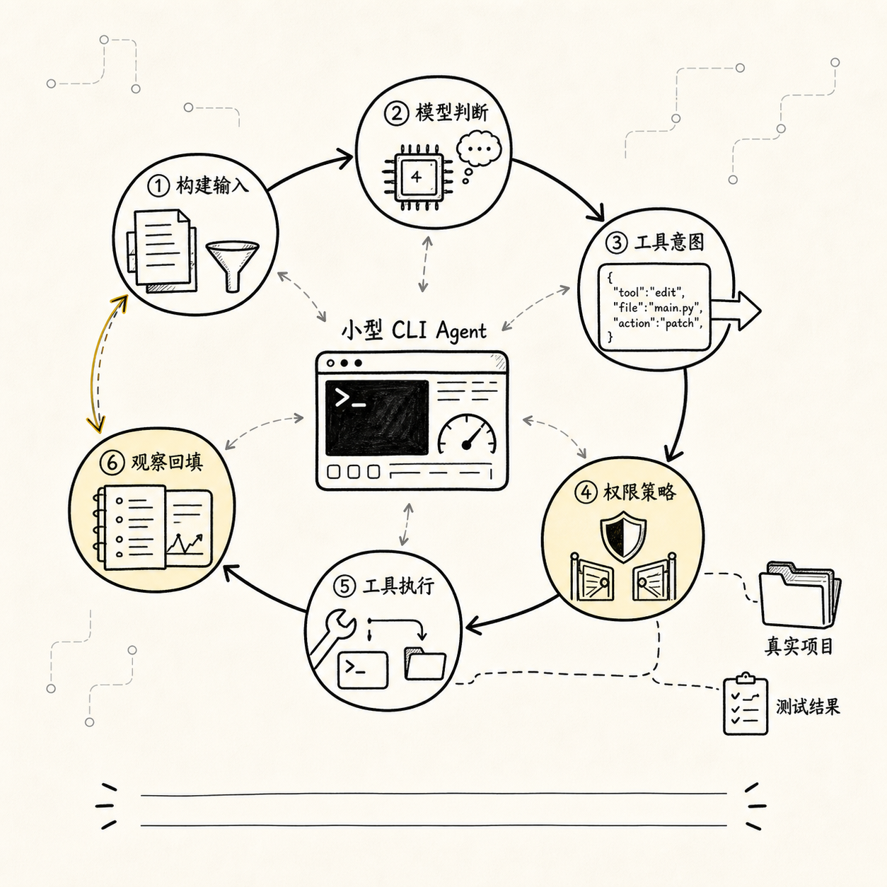
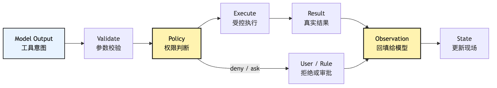
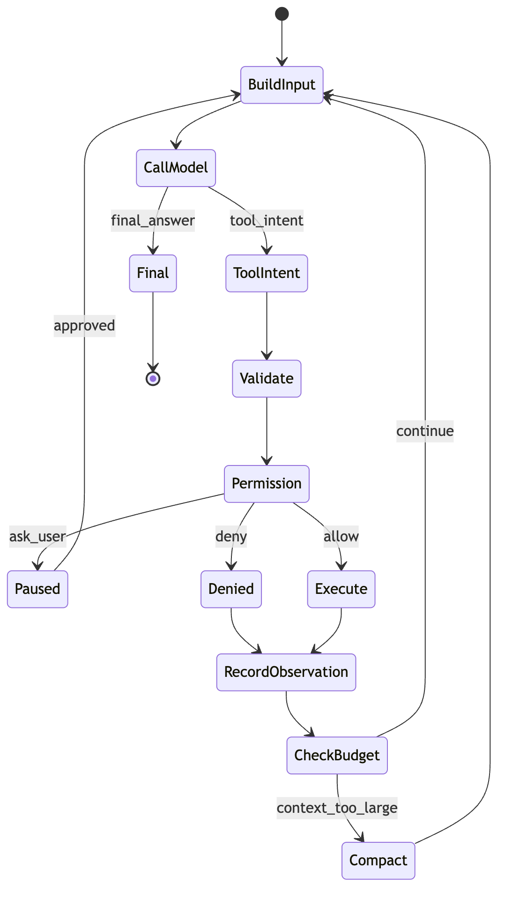
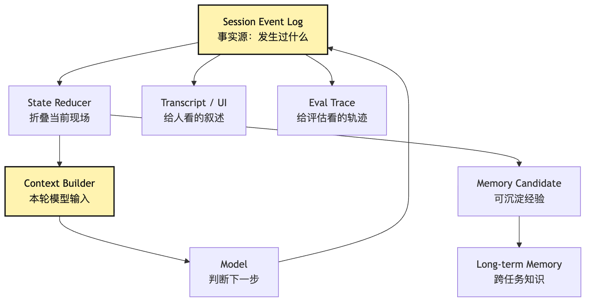
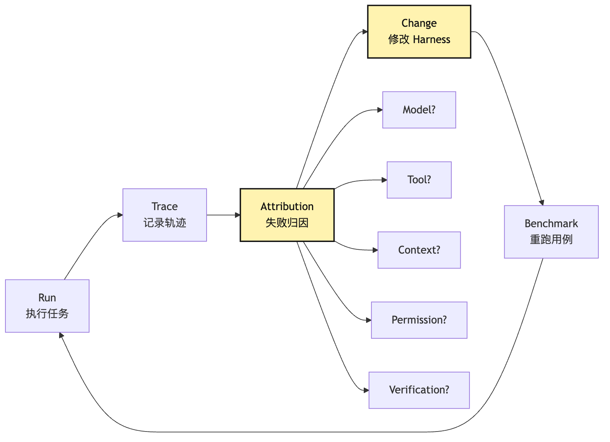
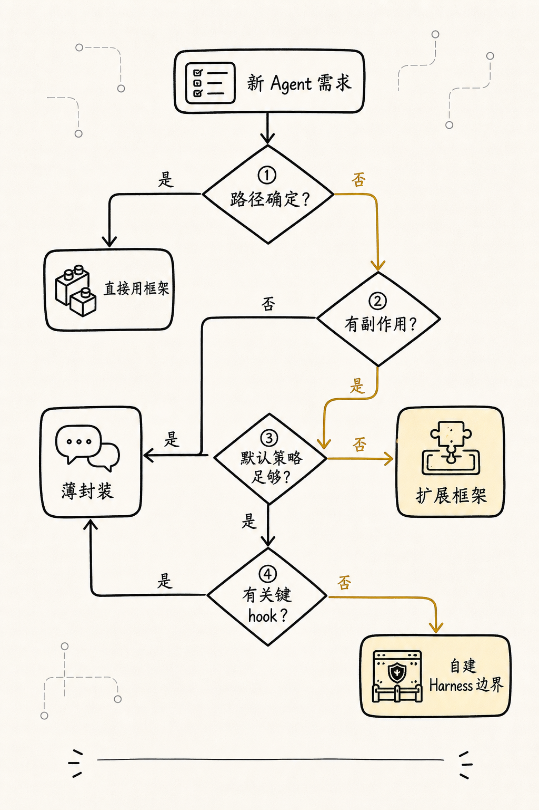

# Agent を手書きする意味：フレームワーク抽象の背後にある最小メカニズムを理解する

手書きの目的はフレームワークを置き換えることではなく、Loop、Tool、State、Context、Permission、Trace の境界を自分の目で見ることだ。境界を理解してから使うフレームワークは、黒箱ではなく組み合わせ可能な部品になる。

手書きの目的はフレームワークを置き換えることではなく、Loop、Tool、State、Context、Permission、Trace の境界を自分の目で見ることだ。境界を理解してから使うフレームワークは、黒箱ではなく組み合わせ可能な部品になる。

```text
手書きの目的はフレームワークを置き換えることではなく、Loop、Tool、State、Context、Permission、Trace の境界を自分の目で見ることだ。境界を理解してから使うフレームワークは、黒箱ではなく組み合わせ可能な部品になる。
-> 必要な事実を記録する
-> 次の判断へ渡す
```

手書きの目的はフレームワークを置き換えることではなく、Loop、Tool、State、Context、Permission、Trace の境界を自分の目で見ることだ。境界を理解してから使うフレームワークは、黒箱ではなく組み合わせ可能な部品になる。

手書きの目的はフレームワークを置き換えることではなく、Loop、Tool、State、Context、Permission、Trace の境界を自分の目で見ることだ。境界を理解してから使うフレームワークは、黒箱ではなく組み合わせ可能な部品になる。

手書きの目的はフレームワークを置き換えることではなく、Loop、Tool、State、Context、Permission、Trace の境界を自分の目で見ることだ。境界を理解してから使うフレームワークは、黒箱ではなく組み合わせ可能な部品になる。

手書きの目的はフレームワークを置き換えることではなく、Loop、Tool、State、Context、Permission、Trace の境界を自分の目で見ることだ。境界を理解してから使うフレームワークは、黒箱ではなく組み合わせ可能な部品になる。

手書きの目的はフレームワークを置き換えることではなく、Loop、Tool、State、Context、Permission、Trace の境界を自分の目で見ることだ。境界を理解してから使うフレームワークは、黒箱ではなく組み合わせ可能な部品になる。

手書きの目的はフレームワークを置き換えることではなく、Loop、Tool、State、Context、Permission、Trace の境界を自分の目で見ることだ。境界を理解してから使うフレームワークは、黒箱ではなく組み合わせ可能な部品になる。

```text
手書きの目的はフレームワークを置き換えることではなく、Loop、Tool、State、Context、Permission、Trace の境界を自分の目で見ることだ。境界を理解してから使うフレームワークは、黒箱ではなく組み合わせ可能な部品になる。
-> 必要な事実を記録する
-> 次の判断へ渡す
```

手書きの目的はフレームワークを置き換えることではなく、Loop、Tool、State、Context、Permission、Trace の境界を自分の目で見ることだ。境界を理解してから使うフレームワークは、黒箱ではなく組み合わせ可能な部品になる。

手書きの目的はフレームワークを置き換えることではなく、Loop、Tool、State、Context、Permission、Trace の境界を自分の目で見ることだ。境界を理解してから使うフレームワークは、黒箱ではなく組み合わせ可能な部品になる。

```text
手書きの目的はフレームワークを置き換えることではなく、Loop、Tool、State、Context、Permission、Trace の境界を自分の目で見ることだ。境界を理解してから使うフレームワークは、黒箱ではなく組み合わせ可能な部品になる。
-> 必要な事実を記録する
-> 次の判断へ渡す
```

手書きの目的はフレームワークを置き換えることではなく、Loop、Tool、State、Context、Permission、Trace の境界を自分の目で見ることだ。境界を理解してから使うフレームワークは、黒箱ではなく組み合わせ可能な部品になる。

```text
手書きの目的はフレームワークを置き換えることではなく、Loop、Tool、State、Context、Permission、Trace の境界を自分の目で見ることだ。境界を理解してから使うフレームワークは、黒箱ではなく組み合わせ可能な部品になる。
```

手書きの目的はフレームワークを置き換えることではなく、Loop、Tool、State、Context、Permission、Trace の境界を自分の目で見ることだ。境界を理解してから使うフレームワークは、黒箱ではなく組み合わせ可能な部品になる。

> 手書きの目的はフレームワークを置き換えることではなく、Loop、Tool、State、Context、Permission、Trace の境界を自分の目で見ることだ。境界を理解してから使うフレームワークは、黒箱ではなく組み合わせ可能な部品になる。

## 問題の連鎖


手書きの目的はフレームワークを置き換えることではなく、Loop、Tool、State、Context、Permission、Trace の境界を自分の目で見ることだ。境界を理解してから使うフレームワークは、黒箱ではなく組み合わせ可能な部品になる。

```text
手書きの目的はフレームワークを置き換えることではなく、Loop、Tool、State、Context、Permission、Trace の境界を自分の目で見ることだ。境界を理解してから使うフレームワークは、黒箱ではなく組み合わせ可能な部品になる。
-> 必要な事実を記録する
-> 次の判断へ渡す
```

手書きの目的はフレームワークを置き換えることではなく、Loop、Tool、State、Context、Permission、Trace の境界を自分の目で見ることだ。境界を理解してから使うフレームワークは、黒箱ではなく組み合わせ可能な部品になる。

手書きの目的はフレームワークを置き換えることではなく、Loop、Tool、State、Context、Permission、Trace の境界を自分の目で見ることだ。境界を理解してから使うフレームワークは、黒箱ではなく組み合わせ可能な部品になる。

手書きの目的はフレームワークを置き換えることではなく、Loop、Tool、State、Context、Permission、Trace の境界を自分の目で見ることだ。境界を理解してから使うフレームワークは、黒箱ではなく組み合わせ可能な部品になる。


手書きの目的はフレームワークを置き換えることではなく、Loop、Tool、State、Context、Permission、Trace の境界を自分の目で見ることだ。境界を理解してから使うフレームワークは、黒箱ではなく組み合わせ可能な部品になる。

手書きの目的はフレームワークを置き換えることではなく、Loop、Tool、State、Context、Permission、Trace の境界を自分の目で見ることだ。境界を理解してから使うフレームワークは、黒箱ではなく組み合わせ可能な部品になる。

手書きの目的はフレームワークを置き換えることではなく、Loop、Tool、State、Context、Permission、Trace の境界を自分の目で見ることだ。境界を理解してから使うフレームワークは、黒箱ではなく組み合わせ可能な部品になる。

```text
手書きの目的はフレームワークを置き換えることではなく、Loop、Tool、State、Context、Permission、Trace の境界を自分の目で見ることだ。境界を理解してから使うフレームワークは、黒箱ではなく組み合わせ可能な部品になる。
```

手書きの目的はフレームワークを置き換えることではなく、Loop、Tool、State、Context、Permission、Trace の境界を自分の目で見ることだ。境界を理解してから使うフレームワークは、黒箱ではなく組み合わせ可能な部品になる。

手書きの目的はフレームワークを置き換えることではなく、Loop、Tool、State、Context、Permission、Trace の境界を自分の目で見ることだ。境界を理解してから使うフレームワークは、黒箱ではなく組み合わせ可能な部品になる。

手書きの目的はフレームワークを置き換えることではなく、Loop、Tool、State、Context、Permission、Trace の境界を自分の目で見ることだ。境界を理解してから使うフレームワークは、黒箱ではなく組み合わせ可能な部品になる。

手書きの目的はフレームワークを置き換えることではなく、Loop、Tool、State、Context、Permission、Trace の境界を自分の目で見ることだ。境界を理解してから使うフレームワークは、黒箱ではなく組み合わせ可能な部品になる。

## 1. フレームワークを直接使うと何が解決されるのか

手書きの目的はフレームワークを置き換えることではなく、Loop、Tool、State、Context、Permission、Trace の境界を自分の目で見ることだ。境界を理解してから使うフレームワークは、黒箱ではなく組み合わせ可能な部品になる。

手書きの目的はフレームワークを置き換えることではなく、Loop、Tool、State、Context、Permission、Trace の境界を自分の目で見ることだ。境界を理解してから使うフレームワークは、黒箱ではなく組み合わせ可能な部品になる。

手書きの目的はフレームワークを置き換えることではなく、Loop、Tool、State、Context、Permission、Trace の境界を自分の目で見ることだ。境界を理解してから使うフレームワークは、黒箱ではなく組み合わせ可能な部品になる。

```text
手書きの目的はフレームワークを置き換えることではなく、Loop、Tool、State、Context、Permission、Trace の境界を自分の目で見ることだ。境界を理解してから使うフレームワークは、黒箱ではなく組み合わせ可能な部品になる。
-> 必要な事実を記録する
-> 次の判断へ渡す
```

手書きの目的はフレームワークを置き換えることではなく、Loop、Tool、State、Context、Permission、Trace の境界を自分の目で見ることだ。境界を理解してから使うフレームワークは、黒箱ではなく組み合わせ可能な部品になる。

手書きの目的はフレームワークを置き換えることではなく、Loop、Tool、State、Context、Permission、Trace の境界を自分の目で見ることだ。境界を理解してから使うフレームワークは、黒箱ではなく組み合わせ可能な部品になる。

手書きの目的はフレームワークを置き換えることではなく、Loop、Tool、State、Context、Permission、Trace の境界を自分の目で見ることだ。境界を理解してから使うフレームワークは、黒箱ではなく組み合わせ可能な部品になる。

```text
手書きの目的はフレームワークを置き換えることではなく、Loop、Tool、State、Context、Permission、Trace の境界を自分の目で見ることだ。境界を理解してから使うフレームワークは、黒箱ではなく組み合わせ可能な部品になる。
-> 必要な事実を記録する
-> 次の判断へ渡す
```

手書きの目的はフレームワークを置き換えることではなく、Loop、Tool、State、Context、Permission、Trace の境界を自分の目で見ることだ。境界を理解してから使うフレームワークは、黒箱ではなく組み合わせ可能な部品になる。

手書きの目的はフレームワークを置き換えることではなく、Loop、Tool、State、Context、Permission、Trace の境界を自分の目で見ることだ。境界を理解してから使うフレームワークは、黒箱ではなく組み合わせ可能な部品になる。

手書きの目的はフレームワークを置き換えることではなく、Loop、Tool、State、Context、Permission、Trace の境界を自分の目で見ることだ。境界を理解してから使うフレームワークは、黒箱ではなく組み合わせ可能な部品になる。

```text
手書きの目的はフレームワークを置き換えることではなく、Loop、Tool、State、Context、Permission、Trace の境界を自分の目で見ることだ。境界を理解してから使うフレームワークは、黒箱ではなく組み合わせ可能な部品になる。
-> 必要な事実を記録する
-> 次の判断へ渡す
```

手書きの目的はフレームワークを置き換えることではなく、Loop、Tool、State、Context、Permission、Trace の境界を自分の目で見ることだ。境界を理解してから使うフレームワークは、黒箱ではなく組み合わせ可能な部品になる。

手書きの目的はフレームワークを置き換えることではなく、Loop、Tool、State、Context、Permission、Trace の境界を自分の目で見ることだ。境界を理解してから使うフレームワークは、黒箱ではなく組み合わせ可能な部品になる。

```text
手書きの目的はフレームワークを置き換えることではなく、Loop、Tool、State、Context、Permission、Trace の境界を自分の目で見ることだ。境界を理解してから使うフレームワークは、黒箱ではなく組み合わせ可能な部品になる。
-> 必要な事実を記録する
-> 次の判断へ渡す
```

手書きの目的はフレームワークを置き換えることではなく、Loop、Tool、State、Context、Permission、Trace の境界を自分の目で見ることだ。境界を理解してから使うフレームワークは、黒箱ではなく組み合わせ可能な部品になる。

手書きの目的はフレームワークを置き換えることではなく、Loop、Tool、State、Context、Permission、Trace の境界を自分の目で見ることだ。境界を理解してから使うフレームワークは、黒箱ではなく組み合わせ可能な部品になる。

```text
手書きの目的はフレームワークを置き換えることではなく、Loop、Tool、State、Context、Permission、Trace の境界を自分の目で見ることだ。境界を理解してから使うフレームワークは、黒箱ではなく組み合わせ可能な部品になる。
-> 必要な事実を記録する
-> 次の判断へ渡す
```

手書きの目的はフレームワークを置き換えることではなく、Loop、Tool、State、Context、Permission、Trace の境界を自分の目で見ることだ。境界を理解してから使うフレームワークは、黒箱ではなく組み合わせ可能な部品になる。

手書きの目的はフレームワークを置き換えることではなく、Loop、Tool、State、Context、Permission、Trace の境界を自分の目で見ることだ。境界を理解してから使うフレームワークは、黒箱ではなく組み合わせ可能な部品になる。

手書きの目的はフレームワークを置き換えることではなく、Loop、Tool、State、Context、Permission、Trace の境界を自分の目で見ることだ。境界を理解してから使うフレームワークは、黒箱ではなく組み合わせ可能な部品になる。

手書きの目的はフレームワークを置き換えることではなく、Loop、Tool、State、Context、Permission、Trace の境界を自分の目で見ることだ。境界を理解してから使うフレームワークは、黒箱ではなく組み合わせ可能な部品になる。

手書きの目的はフレームワークを置き換えることではなく、Loop、Tool、State、Context、Permission、Trace の境界を自分の目で見ることだ。境界を理解してから使うフレームワークは、黒箱ではなく組み合わせ可能な部品になる。

```text
手書きの目的はフレームワークを置き換えることではなく、Loop、Tool、State、Context、Permission、Trace の境界を自分の目で見ることだ。境界を理解してから使うフレームワークは、黒箱ではなく組み合わせ可能な部品になる。
-> 必要な事実を記録する
-> 次の判断へ渡す
```

手書きの目的はフレームワークを置き換えることではなく、Loop、Tool、State、Context、Permission、Trace の境界を自分の目で見ることだ。境界を理解してから使うフレームワークは、黒箱ではなく組み合わせ可能な部品になる。

手書きの目的はフレームワークを置き換えることではなく、Loop、Tool、State、Context、Permission、Trace の境界を自分の目で見ることだ。境界を理解してから使うフレームワークは、黒箱ではなく組み合わせ可能な部品になる。

手書きの目的はフレームワークを置き換えることではなく、Loop、Tool、State、Context、Permission、Trace の境界を自分の目で見ることだ。境界を理解してから使うフレームワークは、黒箱ではなく組み合わせ可能な部品になる。

## 2. 順調な demo と本物のタスクの間にある 4 つの落とし穴

手書きの目的はフレームワークを置き換えることではなく、Loop、Tool、State、Context、Permission、Trace の境界を自分の目で見ることだ。境界を理解してから使うフレームワークは、黒箱ではなく組み合わせ可能な部品になる。

手書きの目的はフレームワークを置き換えることではなく、Loop、Tool、State、Context、Permission、Trace の境界を自分の目で見ることだ。境界を理解してから使うフレームワークは、黒箱ではなく組み合わせ可能な部品になる。

```text
手書きの目的はフレームワークを置き換えることではなく、Loop、Tool、State、Context、Permission、Trace の境界を自分の目で見ることだ。境界を理解してから使うフレームワークは、黒箱ではなく組み合わせ可能な部品になる。
-> 必要な事実を記録する
-> 次の判断へ渡す
```

手書きの目的はフレームワークを置き換えることではなく、Loop、Tool、State、Context、Permission、Trace の境界を自分の目で見ることだ。境界を理解してから使うフレームワークは、黒箱ではなく組み合わせ可能な部品になる。

手書きの目的はフレームワークを置き換えることではなく、Loop、Tool、State、Context、Permission、Trace の境界を自分の目で見ることだ。境界を理解してから使うフレームワークは、黒箱ではなく組み合わせ可能な部品になる。

### 1. Tool の暴走：モデルが「呼べる」を「呼ぶべき」と解釈する

手書きの目的はフレームワークを置き換えることではなく、Loop、Tool、State、Context、Permission、Trace の境界を自分の目で見ることだ。境界を理解してから使うフレームワークは、黒箱ではなく組み合わせ可能な部品になる。

手書きの目的はフレームワークを置き換えることではなく、Loop、Tool、State、Context、Permission、Trace の境界を自分の目で見ることだ。境界を理解してから使うフレームワークは、黒箱ではなく組み合わせ可能な部品になる。

手書きの目的はフレームワークを置き換えることではなく、Loop、Tool、State、Context、Permission、Trace の境界を自分の目で見ることだ。境界を理解してから使うフレームワークは、黒箱ではなく組み合わせ可能な部品になる。

```text
手書きの目的はフレームワークを置き換えることではなく、Loop、Tool、State、Context、Permission、Trace の境界を自分の目で見ることだ。境界を理解してから使うフレームワークは、黒箱ではなく組み合わせ可能な部品になる。
-> 必要な事実を記録する
-> 次の判断へ渡す
```

手書きの目的はフレームワークを置き換えることではなく、Loop、Tool、State、Context、Permission、Trace の境界を自分の目で見ることだ。境界を理解してから使うフレームワークは、黒箱ではなく組み合わせ可能な部品になる。

```text
手書きの目的はフレームワークを置き換えることではなく、Loop、Tool、State、Context、Permission、Trace の境界を自分の目で見ることだ。境界を理解してから使うフレームワークは、黒箱ではなく組み合わせ可能な部品になる。
-> 必要な事実を記録する
-> 次の判断へ渡す
```

手書きの目的はフレームワークを置き換えることではなく、Loop、Tool、State、Context、Permission、Trace の境界を自分の目で見ることだ。境界を理解してから使うフレームワークは、黒箱ではなく組み合わせ可能な部品になる。

手書きの目的はフレームワークを置き換えることではなく、Loop、Tool、State、Context、Permission、Trace の境界を自分の目で見ることだ。境界を理解してから使うフレームワークは、黒箱ではなく組み合わせ可能な部品になる。

手書きの目的はフレームワークを置き換えることではなく、Loop、Tool、State、Context、Permission、Trace の境界を自分の目で見ることだ。境界を理解してから使うフレームワークは、黒箱ではなく組み合わせ可能な部品になる。

手書きの目的はフレームワークを置き換えることではなく、Loop、Tool、State、Context、Permission、Trace の境界を自分の目で見ることだ。境界を理解してから使うフレームワークは、黒箱ではなく組み合わせ可能な部品になる。

手書きの目的はフレームワークを置き換えることではなく、Loop、Tool、State、Context、Permission、Trace の境界を自分の目で見ることだ。境界を理解してから使うフレームワークは、黒箱ではなく組み合わせ可能な部品になる。

### 2. Context 爆発：Tool 結果が推論より速く窓を埋める

手書きの目的はフレームワークを置き換えることではなく、Loop、Tool、State、Context、Permission、Trace の境界を自分の目で見ることだ。境界を理解してから使うフレームワークは、黒箱ではなく組み合わせ可能な部品になる。

```text
手書きの目的はフレームワークを置き換えることではなく、Loop、Tool、State、Context、Permission、Trace の境界を自分の目で見ることだ。境界を理解してから使うフレームワークは、黒箱ではなく組み合わせ可能な部品になる。
-> 必要な事実を記録する
-> 次の判断へ渡す
```

手書きの目的はフレームワークを置き換えることではなく、Loop、Tool、State、Context、Permission、Trace の境界を自分の目で見ることだ。境界を理解してから使うフレームワークは、黒箱ではなく組み合わせ可能な部品になる。

手書きの目的はフレームワークを置き換えることではなく、Loop、Tool、State、Context、Permission、Trace の境界を自分の目で見ることだ。境界を理解してから使うフレームワークは、黒箱ではなく組み合わせ可能な部品になる。

```text
手書きの目的はフレームワークを置き換えることではなく、Loop、Tool、State、Context、Permission、Trace の境界を自分の目で見ることだ。境界を理解してから使うフレームワークは、黒箱ではなく組み合わせ可能な部品になる。
-> 必要な事実を記録する
-> 次の判断へ渡す
```

手書きの目的はフレームワークを置き換えることではなく、Loop、Tool、State、Context、Permission、Trace の境界を自分の目で見ることだ。境界を理解してから使うフレームワークは、黒箱ではなく組み合わせ可能な部品になる。

手書きの目的はフレームワークを置き換えることではなく、Loop、Tool、State、Context、Permission、Trace の境界を自分の目で見ることだ。境界を理解してから使うフレームワークは、黒箱ではなく組み合わせ可能な部品になる。

手書きの目的はフレームワークを置き換えることではなく、Loop、Tool、State、Context、Permission、Trace の境界を自分の目で見ることだ。境界を理解してから使うフレームワークは、黒箱ではなく組み合わせ可能な部品になる。

手書きの目的はフレームワークを置き換えることではなく、Loop、Tool、State、Context、Permission、Trace の境界を自分の目で見ることだ。境界を理解してから使うフレームワークは、黒箱ではなく組み合わせ可能な部品になる。

```text
手書きの目的はフレームワークを置き換えることではなく、Loop、Tool、State、Context、Permission、Trace の境界を自分の目で見ることだ。境界を理解してから使うフレームワークは、黒箱ではなく組み合わせ可能な部品になる。
-> 必要な事実を記録する
-> 次の判断へ渡す
```

手書きの目的はフレームワークを置き換えることではなく、Loop、Tool、State、Context、Permission、Trace の境界を自分の目で見ることだ。境界を理解してから使うフレームワークは、黒箱ではなく組み合わせ可能な部品になる。

```text
手書きの目的はフレームワークを置き換えることではなく、Loop、Tool、State、Context、Permission、Trace の境界を自分の目で見ることだ。境界を理解してから使うフレームワークは、黒箱ではなく組み合わせ可能な部品になる。
```

手書きの目的はフレームワークを置き換えることではなく、Loop、Tool、State、Context、Permission、Trace の境界を自分の目で見ることだ。境界を理解してから使うフレームワークは、黒箱ではなく組み合わせ可能な部品になる。

手書きの目的はフレームワークを置き換えることではなく、Loop、Tool、State、Context、Permission、Trace の境界を自分の目で見ることだ。境界を理解してから使うフレームワークは、黒箱ではなく組み合わせ可能な部品になる。

### 3. Permission 承認：多く聞けば安全になるわけではない

手書きの目的はフレームワークを置き換えることではなく、Loop、Tool、State、Context、Permission、Trace の境界を自分の目で見ることだ。境界を理解してから使うフレームワークは、黒箱ではなく組み合わせ可能な部品になる。

```text
手書きの目的はフレームワークを置き換えることではなく、Loop、Tool、State、Context、Permission、Trace の境界を自分の目で見ることだ。境界を理解してから使うフレームワークは、黒箱ではなく組み合わせ可能な部品になる。
-> 必要な事実を記録する
-> 次の判断へ渡す
```

手書きの目的はフレームワークを置き換えることではなく、Loop、Tool、State、Context、Permission、Trace の境界を自分の目で見ることだ。境界を理解してから使うフレームワークは、黒箱ではなく組み合わせ可能な部品になる。

手書きの目的はフレームワークを置き換えることではなく、Loop、Tool、State、Context、Permission、Trace の境界を自分の目で見ることだ。境界を理解してから使うフレームワークは、黒箱ではなく組み合わせ可能な部品になる。

手書きの目的はフレームワークを置き換えることではなく、Loop、Tool、State、Context、Permission、Trace の境界を自分の目で見ることだ。境界を理解してから使うフレームワークは、黒箱ではなく組み合わせ可能な部品になる。

手書きの目的はフレームワークを置き換えることではなく、Loop、Tool、State、Context、Permission、Trace の境界を自分の目で見ることだ。境界を理解してから使うフレームワークは、黒箱ではなく組み合わせ可能な部品になる。

手書きの目的はフレームワークを置き換えることではなく、Loop、Tool、State、Context、Permission、Trace の境界を自分の目で見ることだ。境界を理解してから使うフレームワークは、黒箱ではなく組み合わせ可能な部品になる。

手書きの目的はフレームワークを置き換えることではなく、Loop、Tool、State、Context、Permission、Trace の境界を自分の目で見ることだ。境界を理解してから使うフレームワークは、黒箱ではなく組み合わせ可能な部品になる。

手書きの目的はフレームワークを置き換えることではなく、Loop、Tool、State、Context、Permission、Trace の境界を自分の目で見ることだ。境界を理解してから使うフレームワークは、黒箱ではなく組み合わせ可能な部品になる。

```text
手書きの目的はフレームワークを置き換えることではなく、Loop、Tool、State、Context、Permission、Trace の境界を自分の目で見ることだ。境界を理解してから使うフレームワークは、黒箱ではなく組み合わせ可能な部品になる。
-> 必要な事実を記録する
-> 次の判断へ渡す
```

手書きの目的はフレームワークを置き換えることではなく、Loop、Tool、State、Context、Permission、Trace の境界を自分の目で見ることだ。境界を理解してから使うフレームワークは、黒箱ではなく組み合わせ可能な部品になる。

手書きの目的はフレームワークを置き換えることではなく、Loop、Tool、State、Context、Permission、Trace の境界を自分の目で見ることだ。境界を理解してから使うフレームワークは、黒箱ではなく組み合わせ可能な部品になる。

手書きの目的はフレームワークを置き換えることではなく、Loop、Tool、State、Context、Permission、Trace の境界を自分の目で見ることだ。境界を理解してから使うフレームワークは、黒箱ではなく組み合わせ可能な部品になる。

手書きの目的はフレームワークを置き換えることではなく、Loop、Tool、State、Context、Permission、Trace の境界を自分の目で見ることだ。境界を理解してから使うフレームワークは、黒箱ではなく組み合わせ可能な部品になる。

### 4. 評価回帰：最終回答が正しくても Harness が健全とは限らない

手書きの目的はフレームワークを置き換えることではなく、Loop、Tool、State、Context、Permission、Trace の境界を自分の目で見ることだ。境界を理解してから使うフレームワークは、黒箱ではなく組み合わせ可能な部品になる。

手書きの目的はフレームワークを置き換えることではなく、Loop、Tool、State、Context、Permission、Trace の境界を自分の目で見ることだ。境界を理解してから使うフレームワークは、黒箱ではなく組み合わせ可能な部品になる。

```text
手書きの目的はフレームワークを置き換えることではなく、Loop、Tool、State、Context、Permission、Trace の境界を自分の目で見ることだ。境界を理解してから使うフレームワークは、黒箱ではなく組み合わせ可能な部品になる。
```

手書きの目的はフレームワークを置き換えることではなく、Loop、Tool、State、Context、Permission、Trace の境界を自分の目で見ることだ。境界を理解してから使うフレームワークは、黒箱ではなく組み合わせ可能な部品になる。

手書きの目的はフレームワークを置き換えることではなく、Loop、Tool、State、Context、Permission、Trace の境界を自分の目で見ることだ。境界を理解してから使うフレームワークは、黒箱ではなく組み合わせ可能な部品になる。

```text
手書きの目的はフレームワークを置き換えることではなく、Loop、Tool、State、Context、Permission、Trace の境界を自分の目で見ることだ。境界を理解してから使うフレームワークは、黒箱ではなく組み合わせ可能な部品になる。
-> 必要な事実を記録する
-> 次の判断へ渡す
```

手書きの目的はフレームワークを置き換えることではなく、Loop、Tool、State、Context、Permission、Trace の境界を自分の目で見ることだ。境界を理解してから使うフレームワークは、黒箱ではなく組み合わせ可能な部品になる。

手書きの目的はフレームワークを置き換えることではなく、Loop、Tool、State、Context、Permission、Trace の境界を自分の目で見ることだ。境界を理解してから使うフレームワークは、黒箱ではなく組み合わせ可能な部品になる。

手書きの目的はフレームワークを置き換えることではなく、Loop、Tool、State、Context、Permission、Trace の境界を自分の目で見ることだ。境界を理解してから使うフレームワークは、黒箱ではなく組み合わせ可能な部品になる。

```text
手書きの目的はフレームワークを置き換えることではなく、Loop、Tool、State、Context、Permission、Trace の境界を自分の目で見ることだ。境界を理解してから使うフレームワークは、黒箱ではなく組み合わせ可能な部品になる。
-> 必要な事実を記録する
-> 次の判断へ渡す
```

手書きの目的はフレームワークを置き換えることではなく、Loop、Tool、State、Context、Permission、Trace の境界を自分の目で見ることだ。境界を理解してから使うフレームワークは、黒箱ではなく組み合わせ可能な部品になる。

手書きの目的はフレームワークを置き換えることではなく、Loop、Tool、State、Context、Permission、Trace の境界を自分の目で見ることだ。境界を理解してから使うフレームワークは、黒箱ではなく組み合わせ可能な部品になる。

手書きの目的はフレームワークを置き換えることではなく、Loop、Tool、State、Context、Permission、Trace の境界を自分の目で見ることだ。境界を理解してから使うフレームワークは、黒箱ではなく組み合わせ可能な部品になる。

手書きの目的はフレームワークを置き換えることではなく、Loop、Tool、State、Context、Permission、Trace の境界を自分の目で見ることだ。境界を理解してから使うフレームワークは、黒箱ではなく組み合わせ可能な部品になる。

手書きの目的はフレームワークを置き換えることではなく、Loop、Tool、State、Context、Permission、Trace の境界を自分の目で見ることだ。境界を理解してから使うフレームワークは、黒箱ではなく組み合わせ可能な部品になる。

## 3. 最小 Agent を手書きするのであって、完全なフレームワークを書くのではない



手書きの目的はフレームワークを置き換えることではなく、Loop、Tool、State、Context、Permission、Trace の境界を自分の目で見ることだ。境界を理解してから使うフレームワークは、黒箱ではなく組み合わせ可能な部品になる。

```text
手書きの目的はフレームワークを置き換えることではなく、Loop、Tool、State、Context、Permission、Trace の境界を自分の目で見ることだ。境界を理解してから使うフレームワークは、黒箱ではなく組み合わせ可能な部品になる。
```

手書きの目的はフレームワークを置き換えることではなく、Loop、Tool、State、Context、Permission、Trace の境界を自分の目で見ることだ。境界を理解してから使うフレームワークは、黒箱ではなく組み合わせ可能な部品になる。

手書きの目的はフレームワークを置き換えることではなく、Loop、Tool、State、Context、Permission、Trace の境界を自分の目で見ることだ。境界を理解してから使うフレームワークは、黒箱ではなく組み合わせ可能な部品になる。

手書きの目的はフレームワークを置き換えることではなく、Loop、Tool、State、Context、Permission、Trace の境界を自分の目で見ることだ。境界を理解してから使うフレームワークは、黒箱ではなく組み合わせ可能な部品になる。

手書きの目的はフレームワークを置き換えることではなく、Loop、Tool、State、Context、Permission、Trace の境界を自分の目で見ることだ。境界を理解してから使うフレームワークは、黒箱ではなく組み合わせ可能な部品になる。

```text
手書きの目的はフレームワークを置き換えることではなく、Loop、Tool、State、Context、Permission、Trace の境界を自分の目で見ることだ。境界を理解してから使うフレームワークは、黒箱ではなく組み合わせ可能な部品になる。
-> 必要な事実を記録する
-> 次の判断へ渡す
```

手書きの目的はフレームワークを置き換えることではなく、Loop、Tool、State、Context、Permission、Trace の境界を自分の目で見ることだ。境界を理解してから使うフレームワークは、黒箱ではなく組み合わせ可能な部品になる。

手書きの目的はフレームワークを置き換えることではなく、Loop、Tool、State、Context、Permission、Trace の境界を自分の目で見ることだ。境界を理解してから使うフレームワークは、黒箱ではなく組み合わせ可能な部品になる。

```text
手書きの目的はフレームワークを置き換えることではなく、Loop、Tool、State、Context、Permission、Trace の境界を自分の目で見ることだ。境界を理解してから使うフレームワークは、黒箱ではなく組み合わせ可能な部品になる。
-> 必要な事実を記録する
-> 次の判断へ渡す
```

手書きの目的はフレームワークを置き換えることではなく、Loop、Tool、State、Context、Permission、Trace の境界を自分の目で見ることだ。境界を理解してから使うフレームワークは、黒箱ではなく組み合わせ可能な部品になる。

手書きの目的はフレームワークを置き換えることではなく、Loop、Tool、State、Context、Permission、Trace の境界を自分の目で見ることだ。境界を理解してから使うフレームワークは、黒箱ではなく組み合わせ可能な部品になる。

手書きの目的はフレームワークを置き換えることではなく、Loop、Tool、State、Context、Permission、Trace の境界を自分の目で見ることだ。境界を理解してから使うフレームワークは、黒箱ではなく組み合わせ可能な部品になる。

手書きの目的はフレームワークを置き換えることではなく、Loop、Tool、State、Context、Permission、Trace の境界を自分の目で見ることだ。境界を理解してから使うフレームワークは、黒箱ではなく組み合わせ可能な部品になる。

手書きの目的はフレームワークを置き換えることではなく、Loop、Tool、State、Context、Permission、Trace の境界を自分の目で見ることだ。境界を理解してから使うフレームワークは、黒箱ではなく組み合わせ可能な部品になる。

```text
手書きの目的はフレームワークを置き換えることではなく、Loop、Tool、State、Context、Permission、Trace の境界を自分の目で見ることだ。境界を理解してから使うフレームワークは、黒箱ではなく組み合わせ可能な部品になる。
-> 必要な事実を記録する
-> 次の判断へ渡す
```

手書きの目的はフレームワークを置き換えることではなく、Loop、Tool、State、Context、Permission、Trace の境界を自分の目で見ることだ。境界を理解してから使うフレームワークは、黒箱ではなく組み合わせ可能な部品になる。

手書きの目的はフレームワークを置き換えることではなく、Loop、Tool、State、Context、Permission、Trace の境界を自分の目で見ることだ。境界を理解してから使うフレームワークは、黒箱ではなく組み合わせ可能な部品になる。

```text
手書きの目的はフレームワークを置き換えることではなく、Loop、Tool、State、Context、Permission、Trace の境界を自分の目で見ることだ。境界を理解してから使うフレームワークは、黒箱ではなく組み合わせ可能な部品になる。
```

手書きの目的はフレームワークを置き換えることではなく、Loop、Tool、State、Context、Permission、Trace の境界を自分の目で見ることだ。境界を理解してから使うフレームワークは、黒箱ではなく組み合わせ可能な部品になる。

手書きの目的はフレームワークを置き換えることではなく、Loop、Tool、State、Context、Permission、Trace の境界を自分の目で見ることだ。境界を理解してから使うフレームワークは、黒箱ではなく組み合わせ可能な部品になる。

```text
手書きの目的はフレームワークを置き換えることではなく、Loop、Tool、State、Context、Permission、Trace の境界を自分の目で見ることだ。境界を理解してから使うフレームワークは、黒箱ではなく組み合わせ可能な部品になる。
```

手書きの目的はフレームワークを置き換えることではなく、Loop、Tool、State、Context、Permission、Trace の境界を自分の目で見ることだ。境界を理解してから使うフレームワークは、黒箱ではなく組み合わせ可能な部品になる。

手書きの目的はフレームワークを置き換えることではなく、Loop、Tool、State、Context、Permission、Trace の境界を自分の目で見ることだ。境界を理解してから使うフレームワークは、黒箱ではなく組み合わせ可能な部品になる。

```text
手書きの目的はフレームワークを置き換えることではなく、Loop、Tool、State、Context、Permission、Trace の境界を自分の目で見ることだ。境界を理解してから使うフレームワークは、黒箱ではなく組み合わせ可能な部品になる。
```

手書きの目的はフレームワークを置き換えることではなく、Loop、Tool、State、Context、Permission、Trace の境界を自分の目で見ることだ。境界を理解してから使うフレームワークは、黒箱ではなく組み合わせ可能な部品になる。

手書きの目的はフレームワークを置き換えることではなく、Loop、Tool、State、Context、Permission、Trace の境界を自分の目で見ることだ。境界を理解してから使うフレームワークは、黒箱ではなく組み合わせ可能な部品になる。

## 4. 最小メカニズム 1：モデル出力を action ではなく intent として扱う

手書きの目的はフレームワークを置き換えることではなく、Loop、Tool、State、Context、Permission、Trace の境界を自分の目で見ることだ。境界を理解してから使うフレームワークは、黒箱ではなく組み合わせ可能な部品になる。

```text
手書きの目的はフレームワークを置き換えることではなく、Loop、Tool、State、Context、Permission、Trace の境界を自分の目で見ることだ。境界を理解してから使うフレームワークは、黒箱ではなく組み合わせ可能な部品になる。
```

手書きの目的はフレームワークを置き換えることではなく、Loop、Tool、State、Context、Permission、Trace の境界を自分の目で見ることだ。境界を理解してから使うフレームワークは、黒箱ではなく組み合わせ可能な部品になる。

手書きの目的はフレームワークを置き換えることではなく、Loop、Tool、State、Context、Permission、Trace の境界を自分の目で見ることだ。境界を理解してから使うフレームワークは、黒箱ではなく組み合わせ可能な部品になる。

```json
{
  "type": "tool_intent",
  "tool": "run_command",
  "args": {
    "cmd": "npm test"
  }
}
```

手書きの目的はフレームワークを置き換えることではなく、Loop、Tool、State、Context、Permission、Trace の境界を自分の目で見ることだ。境界を理解してから使うフレームワークは、黒箱ではなく組み合わせ可能な部品になる。

手書きの目的はフレームワークを置き換えることではなく、Loop、Tool、State、Context、Permission、Trace の境界を自分の目で見ることだ。境界を理解してから使うフレームワークは、黒箱ではなく組み合わせ可能な部品になる。

```text
手書きの目的はフレームワークを置き換えることではなく、Loop、Tool、State、Context、Permission、Trace の境界を自分の目で見ることだ。境界を理解してから使うフレームワークは、黒箱ではなく組み合わせ可能な部品になる。
-> 必要な事実を記録する
-> 次の判断へ渡す
```

手書きの目的はフレームワークを置き換えることではなく、Loop、Tool、State、Context、Permission、Trace の境界を自分の目で見ることだ。境界を理解してから使うフレームワークは、黒箱ではなく組み合わせ可能な部品になる。



手書きの目的はフレームワークを置き換えることではなく、Loop、Tool、State、Context、Permission、Trace の境界を自分の目で見ることだ。境界を理解してから使うフレームワークは、黒箱ではなく組み合わせ可能な部品になる。

手書きの目的はフレームワークを置き換えることではなく、Loop、Tool、State、Context、Permission、Trace の境界を自分の目で見ることだ。境界を理解してから使うフレームワークは、黒箱ではなく組み合わせ可能な部品になる。

```text
手書きの目的はフレームワークを置き換えることではなく、Loop、Tool、State、Context、Permission、Trace の境界を自分の目で見ることだ。境界を理解してから使うフレームワークは、黒箱ではなく組み合わせ可能な部品になる。
-> 必要な事実を記録する
-> 次の判断へ渡す
```

手書きの目的はフレームワークを置き換えることではなく、Loop、Tool、State、Context、Permission、Trace の境界を自分の目で見ることだ。境界を理解してから使うフレームワークは、黒箱ではなく組み合わせ可能な部品になる。

手書きの目的はフレームワークを置き換えることではなく、Loop、Tool、State、Context、Permission、Trace の境界を自分の目で見ることだ。境界を理解してから使うフレームワークは、黒箱ではなく組み合わせ可能な部品になる。

```ts
type ToolIntent = {
  type: "tool_intent";
  id: string;
  tool: string;
  args: unknown;
};

type PolicyDecision =
  | { type: "allow"; reason: string }
  | { type: "ask"; prompt: string }
  | { type: "deny"; reason: string };

type Observation = {
  intentId: string;
  ok: boolean;
  summary: string;
  data?: unknown;
  truncated?: boolean;
};
```

手書きの目的はフレームワークを置き換えることではなく、Loop、Tool、State、Context、Permission、Trace の境界を自分の目で見ることだ。境界を理解してから使うフレームワークは、黒箱ではなく組み合わせ可能な部品になる。

手書きの目的はフレームワークを置き換えることではなく、Loop、Tool、State、Context、Permission、Trace の境界を自分の目で見ることだ。境界を理解してから使うフレームワークは、黒箱ではなく組み合わせ可能な部品になる。

手書きの目的はフレームワークを置き換えることではなく、Loop、Tool、State、Context、Permission、Trace の境界を自分の目で見ることだ。境界を理解してから使うフレームワークは、黒箱ではなく組み合わせ可能な部品になる。

手書きの目的はフレームワークを置き換えることではなく、Loop、Tool、State、Context、Permission、Trace の境界を自分の目で見ることだ。境界を理解してから使うフレームワークは、黒箱ではなく組み合わせ可能な部品になる。

```text
手書きの目的はフレームワークを置き換えることではなく、Loop、Tool、State、Context、Permission、Trace の境界を自分の目で見ることだ。境界を理解してから使うフレームワークは、黒箱ではなく組み合わせ可能な部品になる。
-> 必要な事実を記録する
-> 次の判断へ渡す
```

手書きの目的はフレームワークを置き換えることではなく、Loop、Tool、State、Context、Permission、Trace の境界を自分の目で見ることだ。境界を理解してから使うフレームワークは、黒箱ではなく組み合わせ可能な部品になる。

手書きの目的はフレームワークを置き換えることではなく、Loop、Tool、State、Context、Permission、Trace の境界を自分の目で見ることだ。境界を理解してから使うフレームワークは、黒箱ではなく組み合わせ可能な部品になる。

## 5. 最小メカニズム 2：Loop は while true ではなく状態機械である

手書きの目的はフレームワークを置き換えることではなく、Loop、Tool、State、Context、Permission、Trace の境界を自分の目で見ることだ。境界を理解してから使うフレームワークは、黒箱ではなく組み合わせ可能な部品になる。

```ts
while (true) {
  const response = await model(messages);
  if (response.final) break;
  const result = await runTool(response.tool);
  messages.push(result);
}
```

手書きの目的はフレームワークを置き換えることではなく、Loop、Tool、State、Context、Permission、Trace の境界を自分の目で見ることだ。境界を理解してから使うフレームワークは、黒箱ではなく組み合わせ可能な部品になる。

手書きの目的はフレームワークを置き換えることではなく、Loop、Tool、State、Context、Permission、Trace の境界を自分の目で見ることだ。境界を理解してから使うフレームワークは、黒箱ではなく組み合わせ可能な部品になる。

```text
手書きの目的はフレームワークを置き換えることではなく、Loop、Tool、State、Context、Permission、Trace の境界を自分の目で見ることだ。境界を理解してから使うフレームワークは、黒箱ではなく組み合わせ可能な部品になる。
-> 必要な事実を記録する
-> 次の判断へ渡す
```

手書きの目的はフレームワークを置き換えることではなく、Loop、Tool、State、Context、Permission、Trace の境界を自分の目で見ることだ。境界を理解してから使うフレームワークは、黒箱ではなく組み合わせ可能な部品になる。

手書きの目的はフレームワークを置き換えることではなく、Loop、Tool、State、Context、Permission、Trace の境界を自分の目で見ることだ。境界を理解してから使うフレームワークは、黒箱ではなく組み合わせ可能な部品になる。

```text
手書きの目的はフレームワークを置き換えることではなく、Loop、Tool、State、Context、Permission、Trace の境界を自分の目で見ることだ。境界を理解してから使うフレームワークは、黒箱ではなく組み合わせ可能な部品になる。
```

手書きの目的はフレームワークを置き換えることではなく、Loop、Tool、State、Context、Permission、Trace の境界を自分の目で見ることだ。境界を理解してから使うフレームワークは、黒箱ではなく組み合わせ可能な部品になる。

手書きの目的はフレームワークを置き換えることではなく、Loop、Tool、State、Context、Permission、Trace の境界を自分の目で見ることだ。境界を理解してから使うフレームワークは、黒箱ではなく組み合わせ可能な部品になる。

```text
手書きの目的はフレームワークを置き換えることではなく、Loop、Tool、State、Context、Permission、Trace の境界を自分の目で見ることだ。境界を理解してから使うフレームワークは、黒箱ではなく組み合わせ可能な部品になる。
-> 必要な事実を記録する
-> 次の判断へ渡す
```

手書きの目的はフレームワークを置き換えることではなく、Loop、Tool、State、Context、Permission、Trace の境界を自分の目で見ることだ。境界を理解してから使うフレームワークは、黒箱ではなく組み合わせ可能な部品になる。



手書きの目的はフレームワークを置き換えることではなく、Loop、Tool、State、Context、Permission、Trace の境界を自分の目で見ることだ。境界を理解してから使うフレームワークは、黒箱ではなく組み合わせ可能な部品になる。

手書きの目的はフレームワークを置き換えることではなく、Loop、Tool、State、Context、Permission、Trace の境界を自分の目で見ることだ。境界を理解してから使うフレームワークは、黒箱ではなく組み合わせ可能な部品になる。

手書きの目的はフレームワークを置き換えることではなく、Loop、Tool、State、Context、Permission、Trace の境界を自分の目で見ることだ。境界を理解してから使うフレームワークは、黒箱ではなく組み合わせ可能な部品になる。

手書きの目的はフレームワークを置き換えることではなく、Loop、Tool、State、Context、Permission、Trace の境界を自分の目で見ることだ。境界を理解してから使うフレームワークは、黒箱ではなく組み合わせ可能な部品になる。

手書きの目的はフレームワークを置き換えることではなく、Loop、Tool、State、Context、Permission、Trace の境界を自分の目で見ることだ。境界を理解してから使うフレームワークは、黒箱ではなく組み合わせ可能な部品になる。

手書きの目的はフレームワークを置き換えることではなく、Loop、Tool、State、Context、Permission、Trace の境界を自分の目で見ることだ。境界を理解してから使うフレームワークは、黒箱ではなく組み合わせ可能な部品になる。

手書きの目的はフレームワークを置き換えることではなく、Loop、Tool、State、Context、Permission、Trace の境界を自分の目で見ることだ。境界を理解してから使うフレームワークは、黒箱ではなく組み合わせ可能な部品になる。

手書きの目的はフレームワークを置き換えることではなく、Loop、Tool、State、Context、Permission、Trace の境界を自分の目で見ることだ。境界を理解してから使うフレームワークは、黒箱ではなく組み合わせ可能な部品になる。

手書きの目的はフレームワークを置き換えることではなく、Loop、Tool、State、Context、Permission、Trace の境界を自分の目で見ることだ。境界を理解してから使うフレームワークは、黒箱ではなく組み合わせ可能な部品になる。

## 6. 最小メカニズム 3：Tools は関数リストではなくプロトコル境界である

手書きの目的はフレームワークを置き換えることではなく、Loop、Tool、State、Context、Permission、Trace の境界を自分の目で見ることだ。境界を理解してから使うフレームワークは、黒箱ではなく組み合わせ可能な部品になる。

```ts
const tools = {
  read_file: async ({ path }) => fs.readFile(path, "utf8"),
  run_command: async ({ cmd }) => exec(cmd),
};
```

手書きの目的はフレームワークを置き換えることではなく、Loop、Tool、State、Context、Permission、Trace の境界を自分の目で見ることだ。境界を理解してから使うフレームワークは、黒箱ではなく組み合わせ可能な部品になる。

手書きの目的はフレームワークを置き換えることではなく、Loop、Tool、State、Context、Permission、Trace の境界を自分の目で見ることだ。境界を理解してから使うフレームワークは、黒箱ではなく組み合わせ可能な部品になる。

手書きの目的はフレームワークを置き換えることではなく、Loop、Tool、State、Context、Permission、Trace の境界を自分の目で見ることだ。境界を理解してから使うフレームワークは、黒箱ではなく組み合わせ可能な部品になる。

手書きの目的はフレームワークを置き換えることではなく、Loop、Tool、State、Context、Permission、Trace の境界を自分の目で見ることだ。境界を理解してから使うフレームワークは、黒箱ではなく組み合わせ可能な部品になる。

```text
手書きの目的はフレームワークを置き換えることではなく、Loop、Tool、State、Context、Permission、Trace の境界を自分の目で見ることだ。境界を理解してから使うフレームワークは、黒箱ではなく組み合わせ可能な部品になる。
-> 必要な事実を記録する
-> 次の判断へ渡す
```

手書きの目的はフレームワークを置き換えることではなく、Loop、Tool、State、Context、Permission、Trace の境界を自分の目で見ることだ。境界を理解してから使うフレームワークは、黒箱ではなく組み合わせ可能な部品になる。

手書きの目的はフレームワークを置き換えることではなく、Loop、Tool、State、Context、Permission、Trace の境界を自分の目で見ることだ。境界を理解してから使うフレームワークは、黒箱ではなく組み合わせ可能な部品になる。

手書きの目的はフレームワークを置き換えることではなく、Loop、Tool、State、Context、Permission、Trace の境界を自分の目で見ることだ。境界を理解してから使うフレームワークは、黒箱ではなく組み合わせ可能な部品になる。

```text
手書きの目的はフレームワークを置き換えることではなく、Loop、Tool、State、Context、Permission、Trace の境界を自分の目で見ることだ。境界を理解してから使うフレームワークは、黒箱ではなく組み合わせ可能な部品になる。
-> 必要な事実を記録する
-> 次の判断へ渡す
```

手書きの目的はフレームワークを置き換えることではなく、Loop、Tool、State、Context、Permission、Trace の境界を自分の目で見ることだ。境界を理解してから使うフレームワークは、黒箱ではなく組み合わせ可能な部品になる。

手書きの目的はフレームワークを置き換えることではなく、Loop、Tool、State、Context、Permission、Trace の境界を自分の目で見ることだ。境界を理解してから使うフレームワークは、黒箱ではなく組み合わせ可能な部品になる。

```text
手書きの目的はフレームワークを置き換えることではなく、Loop、Tool、State、Context、Permission、Trace の境界を自分の目で見ることだ。境界を理解してから使うフレームワークは、黒箱ではなく組み合わせ可能な部品になる。
-> 必要な事実を記録する
-> 次の判断へ渡す
```

手書きの目的はフレームワークを置き換えることではなく、Loop、Tool、State、Context、Permission、Trace の境界を自分の目で見ることだ。境界を理解してから使うフレームワークは、黒箱ではなく組み合わせ可能な部品になる。

手書きの目的はフレームワークを置き換えることではなく、Loop、Tool、State、Context、Permission、Trace の境界を自分の目で見ることだ。境界を理解してから使うフレームワークは、黒箱ではなく組み合わせ可能な部品になる。

```text
手書きの目的はフレームワークを置き換えることではなく、Loop、Tool、State、Context、Permission、Trace の境界を自分の目で見ることだ。境界を理解してから使うフレームワークは、黒箱ではなく組み合わせ可能な部品になる。
```

手書きの目的はフレームワークを置き換えることではなく、Loop、Tool、State、Context、Permission、Trace の境界を自分の目で見ることだ。境界を理解してから使うフレームワークは、黒箱ではなく組み合わせ可能な部品になる。

手書きの目的はフレームワークを置き換えることではなく、Loop、Tool、State、Context、Permission、Trace の境界を自分の目で見ることだ。境界を理解してから使うフレームワークは、黒箱ではなく組み合わせ可能な部品になる。

```text
手書きの目的はフレームワークを置き換えることではなく、Loop、Tool、State、Context、Permission、Trace の境界を自分の目で見ることだ。境界を理解してから使うフレームワークは、黒箱ではなく組み合わせ可能な部品になる。
-> 必要な事実を記録する
-> 次の判断へ渡す
```

手書きの目的はフレームワークを置き換えることではなく、Loop、Tool、State、Context、Permission、Trace の境界を自分の目で見ることだ。境界を理解してから使うフレームワークは、黒箱ではなく組み合わせ可能な部品になる。

手書きの目的はフレームワークを置き換えることではなく、Loop、Tool、State、Context、Permission、Trace の境界を自分の目で見ることだ。境界を理解してから使うフレームワークは、黒箱ではなく組み合わせ可能な部品になる。

手書きの目的はフレームワークを置き換えることではなく、Loop、Tool、State、Context、Permission、Trace の境界を自分の目で見ることだ。境界を理解してから使うフレームワークは、黒箱ではなく組み合わせ可能な部品になる。

手書きの目的はフレームワークを置き換えることではなく、Loop、Tool、State、Context、Permission、Trace の境界を自分の目で見ることだ。境界を理解してから使うフレームワークは、黒箱ではなく組み合わせ可能な部品になる。

## 7. 最小メカニズム 4：State、Context、Memory、Session を messages に混ぜない

手書きの目的はフレームワークを置き換えることではなく、Loop、Tool、State、Context、Permission、Trace の境界を自分の目で見ることだ。境界を理解してから使うフレームワークは、黒箱ではなく組み合わせ可能な部品になる。

手書きの目的はフレームワークを置き換えることではなく、Loop、Tool、State、Context、Permission、Trace の境界を自分の目で見ることだ。境界を理解してから使うフレームワークは、黒箱ではなく組み合わせ可能な部品になる。

```text
手書きの目的はフレームワークを置き換えることではなく、Loop、Tool、State、Context、Permission、Trace の境界を自分の目で見ることだ。境界を理解してから使うフレームワークは、黒箱ではなく組み合わせ可能な部品になる。
-> 必要な事実を記録する
-> 次の判断へ渡す
```

手書きの目的はフレームワークを置き換えることではなく、Loop、Tool、State、Context、Permission、Trace の境界を自分の目で見ることだ。境界を理解してから使うフレームワークは、黒箱ではなく組み合わせ可能な部品になる。

手書きの目的はフレームワークを置き換えることではなく、Loop、Tool、State、Context、Permission、Trace の境界を自分の目で見ることだ。境界を理解してから使うフレームワークは、黒箱ではなく組み合わせ可能な部品になる。

```text
手書きの目的はフレームワークを置き換えることではなく、Loop、Tool、State、Context、Permission、Trace の境界を自分の目で見ることだ。境界を理解してから使うフレームワークは、黒箱ではなく組み合わせ可能な部品になる。
-> 必要な事実を記録する
-> 次の判断へ渡す
```

手書きの目的はフレームワークを置き換えることではなく、Loop、Tool、State、Context、Permission、Trace の境界を自分の目で見ることだ。境界を理解してから使うフレームワークは、黒箱ではなく組み合わせ可能な部品になる。

手書きの目的はフレームワークを置き換えることではなく、Loop、Tool、State、Context、Permission、Trace の境界を自分の目で見ることだ。境界を理解してから使うフレームワークは、黒箱ではなく組み合わせ可能な部品になる。

```text
手書きの目的はフレームワークを置き換えることではなく、Loop、Tool、State、Context、Permission、Trace の境界を自分の目で見ることだ。境界を理解してから使うフレームワークは、黒箱ではなく組み合わせ可能な部品になる。
-> 必要な事実を記録する
-> 次の判断へ渡す
```

手書きの目的はフレームワークを置き換えることではなく、Loop、Tool、State、Context、Permission、Trace の境界を自分の目で見ることだ。境界を理解してから使うフレームワークは、黒箱ではなく組み合わせ可能な部品になる。

```text
手書きの目的はフレームワークを置き換えることではなく、Loop、Tool、State、Context、Permission、Trace の境界を自分の目で見ることだ。境界を理解してから使うフレームワークは、黒箱ではなく組み合わせ可能な部品になる。
-> 必要な事実を記録する
-> 次の判断へ渡す
```

手書きの目的はフレームワークを置き換えることではなく、Loop、Tool、State、Context、Permission、Trace の境界を自分の目で見ることだ。境界を理解してから使うフレームワークは、黒箱ではなく組み合わせ可能な部品になる。



手書きの目的はフレームワークを置き換えることではなく、Loop、Tool、State、Context、Permission、Trace の境界を自分の目で見ることだ。境界を理解してから使うフレームワークは、黒箱ではなく組み合わせ可能な部品になる。

手書きの目的はフレームワークを置き換えることではなく、Loop、Tool、State、Context、Permission、Trace の境界を自分の目で見ることだ。境界を理解してから使うフレームワークは、黒箱ではなく組み合わせ可能な部品になる。

```text
手書きの目的はフレームワークを置き換えることではなく、Loop、Tool、State、Context、Permission、Trace の境界を自分の目で見ることだ。境界を理解してから使うフレームワークは、黒箱ではなく組み合わせ可能な部品になる。
```

手書きの目的はフレームワークを置き換えることではなく、Loop、Tool、State、Context、Permission、Trace の境界を自分の目で見ることだ。境界を理解してから使うフレームワークは、黒箱ではなく組み合わせ可能な部品になる。

手書きの目的はフレームワークを置き換えることではなく、Loop、Tool、State、Context、Permission、Trace の境界を自分の目で見ることだ。境界を理解してから使うフレームワークは、黒箱ではなく組み合わせ可能な部品になる。

手書きの目的はフレームワークを置き換えることではなく、Loop、Tool、State、Context、Permission、Trace の境界を自分の目で見ることだ。境界を理解してから使うフレームワークは、黒箱ではなく組み合わせ可能な部品になる。

手書きの目的はフレームワークを置き換えることではなく、Loop、Tool、State、Context、Permission、Trace の境界を自分の目で見ることだ。境界を理解してから使うフレームワークは、黒箱ではなく組み合わせ可能な部品になる。

```text
手書きの目的はフレームワークを置き換えることではなく、Loop、Tool、State、Context、Permission、Trace の境界を自分の目で見ることだ。境界を理解してから使うフレームワークは、黒箱ではなく組み合わせ可能な部品になる。
-> 必要な事実を記録する
-> 次の判断へ渡す
```

手書きの目的はフレームワークを置き換えることではなく、Loop、Tool、State、Context、Permission、Trace の境界を自分の目で見ることだ。境界を理解してから使うフレームワークは、黒箱ではなく組み合わせ可能な部品になる。

```text
手書きの目的はフレームワークを置き換えることではなく、Loop、Tool、State、Context、Permission、Trace の境界を自分の目で見ることだ。境界を理解してから使うフレームワークは、黒箱ではなく組み合わせ可能な部品になる。
-> 必要な事実を記録する
-> 次の判断へ渡す
```

手書きの目的はフレームワークを置き換えることではなく、Loop、Tool、State、Context、Permission、Trace の境界を自分の目で見ることだ。境界を理解してから使うフレームワークは、黒箱ではなく組み合わせ可能な部品になる。

手書きの目的はフレームワークを置き換えることではなく、Loop、Tool、State、Context、Permission、Trace の境界を自分の目で見ることだ。境界を理解してから使うフレームワークは、黒箱ではなく組み合わせ可能な部品になる。

手書きの目的はフレームワークを置き換えることではなく、Loop、Tool、State、Context、Permission、Trace の境界を自分の目で見ることだ。境界を理解してから使うフレームワークは、黒箱ではなく組み合わせ可能な部品になる。

手書きの目的はフレームワークを置き換えることではなく、Loop、Tool、State、Context、Permission、Trace の境界を自分の目で見ることだ。境界を理解してから使うフレームワークは、黒箱ではなく組み合わせ可能な部品になる。

手書きの目的はフレームワークを置き換えることではなく、Loop、Tool、State、Context、Permission、Trace の境界を自分の目で見ることだ。境界を理解してから使うフレームワークは、黒箱ではなく組み合わせ可能な部品になる。

## 8. 最小メカニズム 5：評価は最終回答ではなく失敗の帰因である

手書きの目的はフレームワークを置き換えることではなく、Loop、Tool、State、Context、Permission、Trace の境界を自分の目で見ることだ。境界を理解してから使うフレームワークは、黒箱ではなく組み合わせ可能な部品になる。

手書きの目的はフレームワークを置き換えることではなく、Loop、Tool、State、Context、Permission、Trace の境界を自分の目で見ることだ。境界を理解してから使うフレームワークは、黒箱ではなく組み合わせ可能な部品になる。

手書きの目的はフレームワークを置き換えることではなく、Loop、Tool、State、Context、Permission、Trace の境界を自分の目で見ることだ。境界を理解してから使うフレームワークは、黒箱ではなく組み合わせ可能な部品になる。

```text
手書きの目的はフレームワークを置き換えることではなく、Loop、Tool、State、Context、Permission、Trace の境界を自分の目で見ることだ。境界を理解してから使うフレームワークは、黒箱ではなく組み合わせ可能な部品になる。
```

手書きの目的はフレームワークを置き換えることではなく、Loop、Tool、State、Context、Permission、Trace の境界を自分の目で見ることだ。境界を理解してから使うフレームワークは、黒箱ではなく組み合わせ可能な部品になる。

```text
手書きの目的はフレームワークを置き換えることではなく、Loop、Tool、State、Context、Permission、Trace の境界を自分の目で見ることだ。境界を理解してから使うフレームワークは、黒箱ではなく組み合わせ可能な部品になる。
-> 必要な事実を記録する
-> 次の判断へ渡す
```

手書きの目的はフレームワークを置き換えることではなく、Loop、Tool、State、Context、Permission、Trace の境界を自分の目で見ることだ。境界を理解してから使うフレームワークは、黒箱ではなく組み合わせ可能な部品になる。

手書きの目的はフレームワークを置き換えることではなく、Loop、Tool、State、Context、Permission、Trace の境界を自分の目で見ることだ。境界を理解してから使うフレームワークは、黒箱ではなく組み合わせ可能な部品になる。

```text
手書きの目的はフレームワークを置き換えることではなく、Loop、Tool、State、Context、Permission、Trace の境界を自分の目で見ることだ。境界を理解してから使うフレームワークは、黒箱ではなく組み合わせ可能な部品になる。
-> 必要な事実を記録する
-> 次の判断へ渡す
```

手書きの目的はフレームワークを置き換えることではなく、Loop、Tool、State、Context、Permission、Trace の境界を自分の目で見ることだ。境界を理解してから使うフレームワークは、黒箱ではなく組み合わせ可能な部品になる。

手書きの目的はフレームワークを置き換えることではなく、Loop、Tool、State、Context、Permission、Trace の境界を自分の目で見ることだ。境界を理解してから使うフレームワークは、黒箱ではなく組み合わせ可能な部品になる。

手書きの目的はフレームワークを置き換えることではなく、Loop、Tool、State、Context、Permission、Trace の境界を自分の目で見ることだ。境界を理解してから使うフレームワークは、黒箱ではなく組み合わせ可能な部品になる。

手書きの目的はフレームワークを置き換えることではなく、Loop、Tool、State、Context、Permission、Trace の境界を自分の目で見ることだ。境界を理解してから使うフレームワークは、黒箱ではなく組み合わせ可能な部品になる。

手書きの目的はフレームワークを置き換えることではなく、Loop、Tool、State、Context、Permission、Trace の境界を自分の目で見ることだ。境界を理解してから使うフレームワークは、黒箱ではなく組み合わせ可能な部品になる。



手書きの目的はフレームワークを置き換えることではなく、Loop、Tool、State、Context、Permission、Trace の境界を自分の目で見ることだ。境界を理解してから使うフレームワークは、黒箱ではなく組み合わせ可能な部品になる。

手書きの目的はフレームワークを置き換えることではなく、Loop、Tool、State、Context、Permission、Trace の境界を自分の目で見ることだ。境界を理解してから使うフレームワークは、黒箱ではなく組み合わせ可能な部品になる。

手書きの目的はフレームワークを置き換えることではなく、Loop、Tool、State、Context、Permission、Trace の境界を自分の目で見ることだ。境界を理解してから使うフレームワークは、黒箱ではなく組み合わせ可能な部品になる。

手書きの目的はフレームワークを置き換えることではなく、Loop、Tool、State、Context、Permission、Trace の境界を自分の目で見ることだ。境界を理解してから使うフレームワークは、黒箱ではなく組み合わせ可能な部品になる。

```text
手書きの目的はフレームワークを置き換えることではなく、Loop、Tool、State、Context、Permission、Trace の境界を自分の目で見ることだ。境界を理解してから使うフレームワークは、黒箱ではなく組み合わせ可能な部品になる。
-> 必要な事実を記録する
-> 次の判断へ渡す
```

手書きの目的はフレームワークを置き換えることではなく、Loop、Tool、State、Context、Permission、Trace の境界を自分の目で見ることだ。境界を理解してから使うフレームワークは、黒箱ではなく組み合わせ可能な部品になる。

手書きの目的はフレームワークを置き換えることではなく、Loop、Tool、State、Context、Permission、Trace の境界を自分の目で見ることだ。境界を理解してから使うフレームワークは、黒箱ではなく組み合わせ可能な部品になる。

## 9. フレームワークを見るときは、何を抽象化し何を露出するかを見る

手書きの目的はフレームワークを置き換えることではなく、Loop、Tool、State、Context、Permission、Trace の境界を自分の目で見ることだ。境界を理解してから使うフレームワークは、黒箱ではなく組み合わせ可能な部品になる。

手書きの目的はフレームワークを置き換えることではなく、Loop、Tool、State、Context、Permission、Trace の境界を自分の目で見ることだ。境界を理解してから使うフレームワークは、黒箱ではなく組み合わせ可能な部品になる。

```text
手書きの目的はフレームワークを置き換えることではなく、Loop、Tool、State、Context、Permission、Trace の境界を自分の目で見ることだ。境界を理解してから使うフレームワークは、黒箱ではなく組み合わせ可能な部品になる。
-> 必要な事実を記録する
-> 次の判断へ渡す
```

手書きの目的はフレームワークを置き換えることではなく、Loop、Tool、State、Context、Permission、Trace の境界を自分の目で見ることだ。境界を理解してから使うフレームワークは、黒箱ではなく組み合わせ可能な部品になる。

```text
手書きの目的はフレームワークを置き換えることではなく、Loop、Tool、State、Context、Permission、Trace の境界を自分の目で見ることだ。境界を理解してから使うフレームワークは、黒箱ではなく組み合わせ可能な部品になる。
-> 必要な事実を記録する
-> 次の判断へ渡す
```

手書きの目的はフレームワークを置き換えることではなく、Loop、Tool、State、Context、Permission、Trace の境界を自分の目で見ることだ。境界を理解してから使うフレームワークは、黒箱ではなく組み合わせ可能な部品になる。

手書きの目的はフレームワークを置き換えることではなく、Loop、Tool、State、Context、Permission、Trace の境界を自分の目で見ることだ。境界を理解してから使うフレームワークは、黒箱ではなく組み合わせ可能な部品になる。

```text
手書きの目的はフレームワークを置き換えることではなく、Loop、Tool、State、Context、Permission、Trace の境界を自分の目で見ることだ。境界を理解してから使うフレームワークは、黒箱ではなく組み合わせ可能な部品になる。
```

手書きの目的はフレームワークを置き換えることではなく、Loop、Tool、State、Context、Permission、Trace の境界を自分の目で見ることだ。境界を理解してから使うフレームワークは、黒箱ではなく組み合わせ可能な部品になる。

手書きの目的はフレームワークを置き換えることではなく、Loop、Tool、State、Context、Permission、Trace の境界を自分の目で見ることだ。境界を理解してから使うフレームワークは、黒箱ではなく組み合わせ可能な部品になる。

```text
手書きの目的はフレームワークを置き換えることではなく、Loop、Tool、State、Context、Permission、Trace の境界を自分の目で見ることだ。境界を理解してから使うフレームワークは、黒箱ではなく組み合わせ可能な部品になる。
-> 必要な事実を記録する
-> 次の判断へ渡す
```

手書きの目的はフレームワークを置き換えることではなく、Loop、Tool、State、Context、Permission、Trace の境界を自分の目で見ることだ。境界を理解してから使うフレームワークは、黒箱ではなく組み合わせ可能な部品になる。

手書きの目的はフレームワークを置き換えることではなく、Loop、Tool、State、Context、Permission、Trace の境界を自分の目で見ることだ。境界を理解してから使うフレームワークは、黒箱ではなく組み合わせ可能な部品になる。

手書きの目的はフレームワークを置き換えることではなく、Loop、Tool、State、Context、Permission、Trace の境界を自分の目で見ることだ。境界を理解してから使うフレームワークは、黒箱ではなく組み合わせ可能な部品になる。

```text
手書きの目的はフレームワークを置き換えることではなく、Loop、Tool、State、Context、Permission、Trace の境界を自分の目で見ることだ。境界を理解してから使うフレームワークは、黒箱ではなく組み合わせ可能な部品になる。
-> 必要な事実を記録する
-> 次の判断へ渡す
```

手書きの目的はフレームワークを置き換えることではなく、Loop、Tool、State、Context、Permission、Trace の境界を自分の目で見ることだ。境界を理解してから使うフレームワークは、黒箱ではなく組み合わせ可能な部品になる。

手書きの目的はフレームワークを置き換えることではなく、Loop、Tool、State、Context、Permission、Trace の境界を自分の目で見ることだ。境界を理解してから使うフレームワークは、黒箱ではなく組み合わせ可能な部品になる。

手書きの目的はフレームワークを置き換えることではなく、Loop、Tool、State、Context、Permission、Trace の境界を自分の目で見ることだ。境界を理解してから使うフレームワークは、黒箱ではなく組み合わせ可能な部品になる。

## 10. いつフレームワークを使い、拡張し、局所的に迂回するか



手書きの目的はフレームワークを置き換えることではなく、Loop、Tool、State、Context、Permission、Trace の境界を自分の目で見ることだ。境界を理解してから使うフレームワークは、黒箱ではなく組み合わせ可能な部品になる。

手書きの目的はフレームワークを置き換えることではなく、Loop、Tool、State、Context、Permission、Trace の境界を自分の目で見ることだ。境界を理解してから使うフレームワークは、黒箱ではなく組み合わせ可能な部品になる。

手書きの目的はフレームワークを置き換えることではなく、Loop、Tool、State、Context、Permission、Trace の境界を自分の目で見ることだ。境界を理解してから使うフレームワークは、黒箱ではなく組み合わせ可能な部品になる。


手書きの目的はフレームワークを置き換えることではなく、Loop、Tool、State、Context、Permission、Trace の境界を自分の目で見ることだ。境界を理解してから使うフレームワークは、黒箱ではなく組み合わせ可能な部品になる。

### 直接フレームワークを使うのに向く場面

手書きの目的はフレームワークを置き換えることではなく、Loop、Tool、State、Context、Permission、Trace の境界を自分の目で見ることだ。境界を理解してから使うフレームワークは、黒箱ではなく組み合わせ可能な部品になる。

```text
手書きの目的はフレームワークを置き換えることではなく、Loop、Tool、State、Context、Permission、Trace の境界を自分の目で見ることだ。境界を理解してから使うフレームワークは、黒箱ではなく組み合わせ可能な部品になる。
-> 必要な事実を記録する
-> 次の判断へ渡す
```

手書きの目的はフレームワークを置き換えることではなく、Loop、Tool、State、Context、Permission、Trace の境界を自分の目で見ることだ。境界を理解してから使うフレームワークは、黒箱ではなく組み合わせ可能な部品になる。

手書きの目的はフレームワークを置き換えることではなく、Loop、Tool、State、Context、Permission、Trace の境界を自分の目で見ることだ。境界を理解してから使うフレームワークは、黒箱ではなく組み合わせ可能な部品になる。

### フレームワークを拡張するのに向く場面

手書きの目的はフレームワークを置き換えることではなく、Loop、Tool、State、Context、Permission、Trace の境界を自分の目で見ることだ。境界を理解してから使うフレームワークは、黒箱ではなく組み合わせ可能な部品になる。

```text
手書きの目的はフレームワークを置き換えることではなく、Loop、Tool、State、Context、Permission、Trace の境界を自分の目で見ることだ。境界を理解してから使うフレームワークは、黒箱ではなく組み合わせ可能な部品になる。
-> 必要な事実を記録する
-> 次の判断へ渡す
```

手書きの目的はフレームワークを置き換えることではなく、Loop、Tool、State、Context、Permission、Trace の境界を自分の目で見ることだ。境界を理解してから使うフレームワークは、黒箱ではなく組み合わせ可能な部品になる。

手書きの目的はフレームワークを置き換えることではなく、Loop、Tool、State、Context、Permission、Trace の境界を自分の目で見ることだ。境界を理解してから使うフレームワークは、黒箱ではなく組み合わせ可能な部品になる。

### 局所抽象を迂回するのに向く場面

手書きの目的はフレームワークを置き換えることではなく、Loop、Tool、State、Context、Permission、Trace の境界を自分の目で見ることだ。境界を理解してから使うフレームワークは、黒箱ではなく組み合わせ可能な部品になる。

手書きの目的はフレームワークを置き換えることではなく、Loop、Tool、State、Context、Permission、Trace の境界を自分の目で見ることだ。境界を理解してから使うフレームワークは、黒箱ではなく組み合わせ可能な部品になる。

手書きの目的はフレームワークを置き換えることではなく、Loop、Tool、State、Context、Permission、Trace の境界を自分の目で見ることだ。境界を理解してから使うフレームワークは、黒箱ではなく組み合わせ可能な部品になる。

```text
手書きの目的はフレームワークを置き換えることではなく、Loop、Tool、State、Context、Permission、Trace の境界を自分の目で見ることだ。境界を理解してから使うフレームワークは、黒箱ではなく組み合わせ可能な部品になる。
-> 必要な事実を記録する
-> 次の判断へ渡す
```

手書きの目的はフレームワークを置き換えることではなく、Loop、Tool、State、Context、Permission、Trace の境界を自分の目で見ることだ。境界を理解してから使うフレームワークは、黒箱ではなく組み合わせ可能な部品になる。

手書きの目的はフレームワークを置き換えることではなく、Loop、Tool、State、Context、Permission、Trace の境界を自分の目で見ることだ。境界を理解してから使うフレームワークは、黒箱ではなく組み合わせ可能な部品になる。

### 最小システムを完全に手書きするのに向く場面

手書きの目的はフレームワークを置き換えることではなく、Loop、Tool、State、Context、Permission、Trace の境界を自分の目で見ることだ。境界を理解してから使うフレームワークは、黒箱ではなく組み合わせ可能な部品になる。

手書きの目的はフレームワークを置き換えることではなく、Loop、Tool、State、Context、Permission、Trace の境界を自分の目で見ることだ。境界を理解してから使うフレームワークは、黒箱ではなく組み合わせ可能な部品になる。

```text
手書きの目的はフレームワークを置き換えることではなく、Loop、Tool、State、Context、Permission、Trace の境界を自分の目で見ることだ。境界を理解してから使うフレームワークは、黒箱ではなく組み合わせ可能な部品になる。
-> 必要な事実を記録する
-> 次の判断へ渡す
```

手書きの目的はフレームワークを置き換えることではなく、Loop、Tool、State、Context、Permission、Trace の境界を自分の目で見ることだ。境界を理解してから使うフレームワークは、黒箱ではなく組み合わせ可能な部品になる。

手書きの目的はフレームワークを置き換えることではなく、Loop、Tool、State、Context、Permission、Trace の境界を自分の目で見ることだ。境界を理解してから使うフレームワークは、黒箱ではなく組み合わせ可能な部品になる。

## 11. 最小手書きロードマップ

手書きの目的はフレームワークを置き換えることではなく、Loop、Tool、State、Context、Permission、Trace の境界を自分の目で見ることだ。境界を理解してから使うフレームワークは、黒箱ではなく組み合わせ可能な部品になる。

### Step 1：Provider はモデル適配層にとどめる

手書きの目的はフレームワークを置き換えることではなく、Loop、Tool、State、Context、Permission、Trace の境界を自分の目で見ることだ。境界を理解してから使うフレームワークは、黒箱ではなく組み合わせ可能な部品になる。

手書きの目的はフレームワークを置き換えることではなく、Loop、Tool、State、Context、Permission、Trace の境界を自分の目で見ることだ。境界を理解してから使うフレームワークは、黒箱ではなく組み合わせ可能な部品になる。

```text
手書きの目的はフレームワークを置き換えることではなく、Loop、Tool、State、Context、Permission、Trace の境界を自分の目で見ることだ。境界を理解してから使うフレームワークは、黒箱ではなく組み合わせ可能な部品になる。
```

手書きの目的はフレームワークを置き換えることではなく、Loop、Tool、State、Context、Permission、Trace の境界を自分の目で見ることだ。境界を理解してから使うフレームワークは、黒箱ではなく組み合わせ可能な部品になる。

手書きの目的はフレームワークを置き換えることではなく、Loop、Tool、State、Context、Permission、Trace の境界を自分の目で見ることだ。境界を理解してから使うフレームワークは、黒箱ではなく組み合わせ可能な部品になる。

### Step 2：Loop は final と tool intent だけを扱う

手書きの目的はフレームワークを置き換えることではなく、Loop、Tool、State、Context、Permission、Trace の境界を自分の目で見ることだ。境界を理解してから使うフレームワークは、黒箱ではなく組み合わせ可能な部品になる。

```text
手書きの目的はフレームワークを置き換えることではなく、Loop、Tool、State、Context、Permission、Trace の境界を自分の目で見ることだ。境界を理解してから使うフレームワークは、黒箱ではなく組み合わせ可能な部品になる。
-> 必要な事実を記録する
-> 次の判断へ渡す
```

手書きの目的はフレームワークを置き換えることではなく、Loop、Tool、State、Context、Permission、Trace の境界を自分の目で見ることだ。境界を理解してから使うフレームワークは、黒箱ではなく組み合わせ可能な部品になる。

手書きの目的はフレームワークを置き換えることではなく、Loop、Tool、State、Context、Permission、Trace の境界を自分の目で見ることだ。境界を理解してから使うフレームワークは、黒箱ではなく組み合わせ可能な部品になる。

### Step 3：Tool Runtime は 3 つの Tool だけを接続する

手書きの目的はフレームワークを置き換えることではなく、Loop、Tool、State、Context、Permission、Trace の境界を自分の目で見ることだ。境界を理解してから使うフレームワークは、黒箱ではなく組み合わせ可能な部品になる。

```text
手書きの目的はフレームワークを置き換えることではなく、Loop、Tool、State、Context、Permission、Trace の境界を自分の目で見ることだ。境界を理解してから使うフレームワークは、黒箱ではなく組み合わせ可能な部品になる。
-> 必要な事実を記録する
-> 次の判断へ渡す
```

手書きの目的はフレームワークを置き換えることではなく、Loop、Tool、State、Context、Permission、Trace の境界を自分の目で見ることだ。境界を理解してから使うフレームワークは、黒箱ではなく組み合わせ可能な部品になる。

手書きの目的はフレームワークを置き換えることではなく、Loop、Tool、State、Context、Permission、Trace の境界を自分の目で見ることだ。境界を理解してから使うフレームワークは、黒箱ではなく組み合わせ可能な部品になる。

### Step 4：State は event log から畳み込む

手書きの目的はフレームワークを置き換えることではなく、Loop、Tool、State、Context、Permission、Trace の境界を自分の目で見ることだ。境界を理解してから使うフレームワークは、黒箱ではなく組み合わせ可能な部品になる。

```text
手書きの目的はフレームワークを置き換えることではなく、Loop、Tool、State、Context、Permission、Trace の境界を自分の目で見ることだ。境界を理解してから使うフレームワークは、黒箱ではなく組み合わせ可能な部品になる。
-> 必要な事実を記録する
-> 次の判断へ渡す
```

手書きの目的はフレームワークを置き換えることではなく、Loop、Tool、State、Context、Permission、Trace の境界を自分の目で見ることだ。境界を理解してから使うフレームワークは、黒箱ではなく組み合わせ可能な部品になる。

手書きの目的はフレームワークを置き換えることではなく、Loop、Tool、State、Context、Permission、Trace の境界を自分の目で見ることだ。境界を理解してから使うフレームワークは、黒箱ではなく組み合わせ可能な部品になる。

手書きの目的はフレームワークを置き換えることではなく、Loop、Tool、State、Context、Permission、Trace の境界を自分の目で見ることだ。境界を理解してから使うフレームワークは、黒箱ではなく組み合わせ可能な部品になる。

### Step 5：Context Builder は messages そのものではない

手書きの目的はフレームワークを置き換えることではなく、Loop、Tool、State、Context、Permission、Trace の境界を自分の目で見ることだ。境界を理解してから使うフレームワークは、黒箱ではなく組み合わせ可能な部品になる。

```text
手書きの目的はフレームワークを置き換えることではなく、Loop、Tool、State、Context、Permission、Trace の境界を自分の目で見ることだ。境界を理解してから使うフレームワークは、黒箱ではなく組み合わせ可能な部品になる。
-> 必要な事実を記録する
-> 次の判断へ渡す
```

手書きの目的はフレームワークを置き換えることではなく、Loop、Tool、State、Context、Permission、Trace の境界を自分の目で見ることだ。境界を理解してから使うフレームワークは、黒箱ではなく組み合わせ可能な部品になる。

手書きの目的はフレームワークを置き換えることではなく、Loop、Tool、State、Context、Permission、Trace の境界を自分の目で見ることだ。境界を理解してから使うフレームワークは、黒箱ではなく組み合わせ可能な部品になる。

### Step 6：Permission はまず 3 段階にする

手書きの目的はフレームワークを置き換えることではなく、Loop、Tool、State、Context、Permission、Trace の境界を自分の目で見ることだ。境界を理解してから使うフレームワークは、黒箱ではなく組み合わせ可能な部品になる。

```text
手書きの目的はフレームワークを置き換えることではなく、Loop、Tool、State、Context、Permission、Trace の境界を自分の目で見ることだ。境界を理解してから使うフレームワークは、黒箱ではなく組み合わせ可能な部品になる。
-> 必要な事実を記録する
-> 次の判断へ渡す
```

手書きの目的はフレームワークを置き換えることではなく、Loop、Tool、State、Context、Permission、Trace の境界を自分の目で見ることだ。境界を理解してから使うフレームワークは、黒箱ではなく組み合わせ可能な部品になる。

手書きの目的はフレームワークを置き換えることではなく、Loop、Tool、State、Context、Permission、Trace の境界を自分の目で見ることだ。境界を理解してから使うフレームワークは、黒箱ではなく組み合わせ可能な部品になる。

### Step 7：Verification Gate で根拠のない完了宣言を禁止する

手書きの目的はフレームワークを置き換えることではなく、Loop、Tool、State、Context、Permission、Trace の境界を自分の目で見ることだ。境界を理解してから使うフレームワークは、黒箱ではなく組み合わせ可能な部品になる。

```text
手書きの目的はフレームワークを置き換えることではなく、Loop、Tool、State、Context、Permission、Trace の境界を自分の目で見ることだ。境界を理解してから使うフレームワークは、黒箱ではなく組み合わせ可能な部品になる。
```

手書きの目的はフレームワークを置き換えることではなく、Loop、Tool、State、Context、Permission、Trace の境界を自分の目で見ることだ。境界を理解してから使うフレームワークは、黒箱ではなく組み合わせ可能な部品になる。

```text
手書きの目的はフレームワークを置き換えることではなく、Loop、Tool、State、Context、Permission、Trace の境界を自分の目で見ることだ。境界を理解してから使うフレームワークは、黒箱ではなく組み合わせ可能な部品になる。
```

手書きの目的はフレームワークを置き換えることではなく、Loop、Tool、State、Context、Permission、Trace の境界を自分の目で見ることだ。境界を理解してから使うフレームワークは、黒箱ではなく組み合わせ可能な部品になる。

## 12. 手書きした後に使うフレームワークは安定する

手書きの目的はフレームワークを置き換えることではなく、Loop、Tool、State、Context、Permission、Trace の境界を自分の目で見ることだ。境界を理解してから使うフレームワークは、黒箱ではなく組み合わせ可能な部品になる。

手書きの目的はフレームワークを置き換えることではなく、Loop、Tool、State、Context、Permission、Trace の境界を自分の目で見ることだ。境界を理解してから使うフレームワークは、黒箱ではなく組み合わせ可能な部品になる。

手書きの目的はフレームワークを置き換えることではなく、Loop、Tool、State、Context、Permission、Trace の境界を自分の目で見ることだ。境界を理解してから使うフレームワークは、黒箱ではなく組み合わせ可能な部品になる。

手書きの目的はフレームワークを置き換えることではなく、Loop、Tool、State、Context、Permission、Trace の境界を自分の目で見ることだ。境界を理解してから使うフレームワークは、黒箱ではなく組み合わせ可能な部品になる。

```text
手書きの目的はフレームワークを置き換えることではなく、Loop、Tool、State、Context、Permission、Trace の境界を自分の目で見ることだ。境界を理解してから使うフレームワークは、黒箱ではなく組み合わせ可能な部品になる。
-> 必要な事実を記録する
-> 次の判断へ渡す
```

手書きの目的はフレームワークを置き換えることではなく、Loop、Tool、State、Context、Permission、Trace の境界を自分の目で見ることだ。境界を理解してから使うフレームワークは、黒箱ではなく組み合わせ可能な部品になる。

```text
手書きの目的はフレームワークを置き換えることではなく、Loop、Tool、State、Context、Permission、Trace の境界を自分の目で見ることだ。境界を理解してから使うフレームワークは、黒箱ではなく組み合わせ可能な部品になる。
-> 必要な事実を記録する
-> 次の判断へ渡す
```

手書きの目的はフレームワークを置き換えることではなく、Loop、Tool、State、Context、Permission、Trace の境界を自分の目で見ることだ。境界を理解してから使うフレームワークは、黒箱ではなく組み合わせ可能な部品になる。

手書きの目的はフレームワークを置き換えることではなく、Loop、Tool、State、Context、Permission、Trace の境界を自分の目で見ることだ。境界を理解してから使うフレームワークは、黒箱ではなく組み合わせ可能な部品になる。

手書きの目的はフレームワークを置き換えることではなく、Loop、Tool、State、Context、Permission、Trace の境界を自分の目で見ることだ。境界を理解してから使うフレームワークは、黒箱ではなく組み合わせ可能な部品になる。

手書きの目的はフレームワークを置き換えることではなく、Loop、Tool、State、Context、Permission、Trace の境界を自分の目で見ることだ。境界を理解してから使うフレームワークは、黒箱ではなく組み合わせ可能な部品になる。

手書きの目的はフレームワークを置き換えることではなく、Loop、Tool、State、Context、Permission、Trace の境界を自分の目で見ることだ。境界を理解してから使うフレームワークは、黒箱ではなく組み合わせ可能な部品になる。

手書きの目的はフレームワークを置き換えることではなく、Loop、Tool、State、Context、Permission、Trace の境界を自分の目で見ることだ。境界を理解してから使うフレームワークは、黒箱ではなく組み合わせ可能な部品になる。

## 13. この章で残す工学的境界

手書きの目的はフレームワークを置き換えることではなく、Loop、Tool、State、Context、Permission、Trace の境界を自分の目で見ることだ。境界を理解してから使うフレームワークは、黒箱ではなく組み合わせ可能な部品になる。

手書きの目的はフレームワークを置き換えることではなく、Loop、Tool、State、Context、Permission、Trace の境界を自分の目で見ることだ。境界を理解してから使うフレームワークは、黒箱ではなく組み合わせ可能な部品になる。

手書きの目的はフレームワークを置き換えることではなく、Loop、Tool、State、Context、Permission、Trace の境界を自分の目で見ることだ。境界を理解してから使うフレームワークは、黒箱ではなく組み合わせ可能な部品になる。

手書きの目的はフレームワークを置き換えることではなく、Loop、Tool、State、Context、Permission、Trace の境界を自分の目で見ることだ。境界を理解してから使うフレームワークは、黒箱ではなく組み合わせ可能な部品になる。

手書きの目的はフレームワークを置き換えることではなく、Loop、Tool、State、Context、Permission、Trace の境界を自分の目で見ることだ。境界を理解してから使うフレームワークは、黒箱ではなく組み合わせ可能な部品になる。

```text
手書きの目的はフレームワークを置き換えることではなく、Loop、Tool、State、Context、Permission、Trace の境界を自分の目で見ることだ。境界を理解してから使うフレームワークは、黒箱ではなく組み合わせ可能な部品になる。
```

手書きの目的はフレームワークを置き換えることではなく、Loop、Tool、State、Context、Permission、Trace の境界を自分の目で見ることだ。境界を理解してから使うフレームワークは、黒箱ではなく組み合わせ可能な部品になる。

```text
手書きの目的はフレームワークを置き換えることではなく、Loop、Tool、State、Context、Permission、Trace の境界を自分の目で見ることだ。境界を理解してから使うフレームワークは、黒箱ではなく組み合わせ可能な部品になる。
```

手書きの目的はフレームワークを置き換えることではなく、Loop、Tool、State、Context、Permission、Trace の境界を自分の目で見ることだ。境界を理解してから使うフレームワークは、黒箱ではなく組み合わせ可能な部品になる。

手書きの目的はフレームワークを置き換えることではなく、Loop、Tool、State、Context、Permission、Trace の境界を自分の目で見ることだ。境界を理解してから使うフレームワークは、黒箱ではなく組み合わせ可能な部品になる。

手書きの目的はフレームワークを置き換えることではなく、Loop、Tool、State、Context、Permission、Trace の境界を自分の目で見ることだ。境界を理解してから使うフレームワークは、黒箱ではなく組み合わせ可能な部品になる。

```text
手書きの目的はフレームワークを置き換えることではなく、Loop、Tool、State、Context、Permission、Trace の境界を自分の目で見ることだ。境界を理解してから使うフレームワークは、黒箱ではなく組み合わせ可能な部品になる。
```

手書きの目的はフレームワークを置き換えることではなく、Loop、Tool、State、Context、Permission、Trace の境界を自分の目で見ることだ。境界を理解してから使うフレームワークは、黒箱ではなく組み合わせ可能な部品になる。

> 手書きの目的はフレームワークを置き換えることではなく、Loop、Tool、State、Context、Permission、Trace の境界を自分の目で見ることだ。境界を理解してから使うフレームワークは、黒箱ではなく組み合わせ可能な部品になる。

---

GitHub ソース: [00-06-handwrite-agent-meaning.md](https://github.com/LienJack/build-harness/blob/main/docs/ja/00-06-handwrite-agent-meaning.md)
