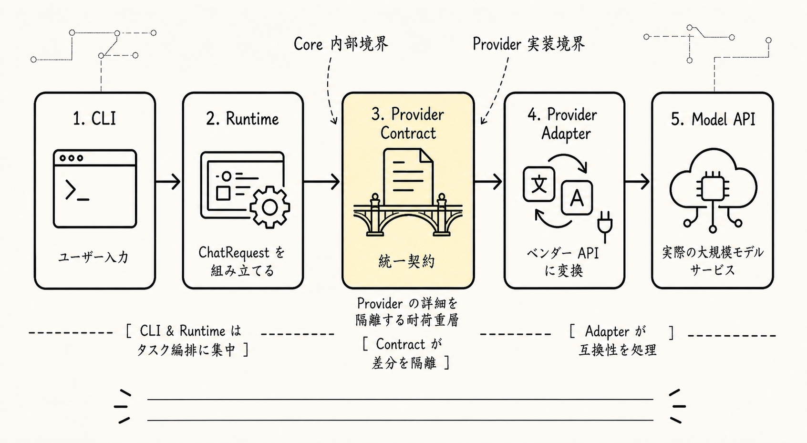
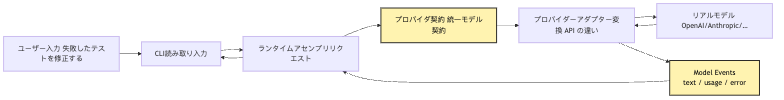
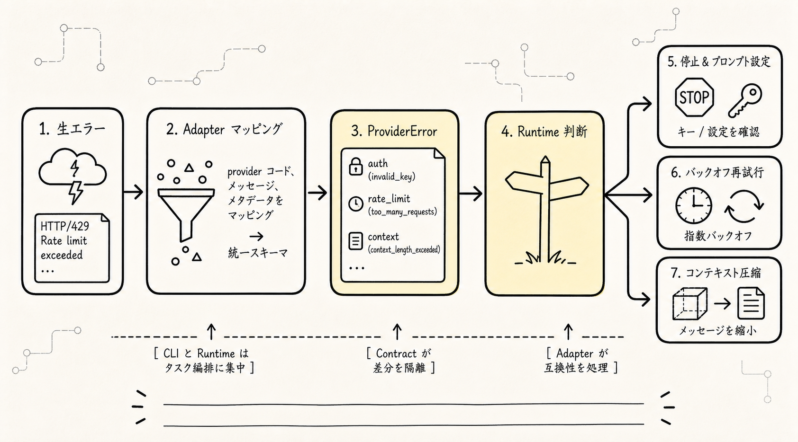
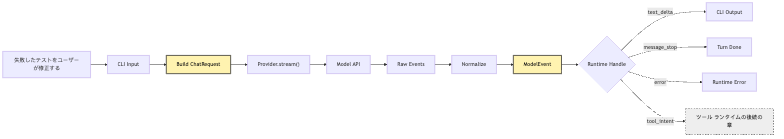

# LLM Provider 接続：CLI に最初のモデル呼び出しをさせる

最初のモデル呼び出しは単なる API 実験ではない。Provider を core の外に置き、統一された ChatRequest、ModelEvent、ProviderError に翻訳することで、後続の Agent Loop と Tool Runtime が provider の細部に汚染されない。

最初のモデル呼び出しは単なる API 実験ではない。Provider を core の外に置き、統一された ChatRequest、ModelEvent、ProviderError に翻訳することで、後続の Agent Loop と Tool Runtime が provider の細部に汚染されない。

最初のモデル呼び出しは単なる API 実験ではない。Provider を core の外に置き、統一された ChatRequest、ModelEvent、ProviderError に翻訳することで、後続の Agent Loop と Tool Runtime が provider の細部に汚染されない。

最初のモデル呼び出しは単なる API 実験ではない。Provider を core の外に置き、統一された ChatRequest、ModelEvent、ProviderError に翻訳することで、後続の Agent Loop と Tool Runtime が provider の細部に汚染されない。

```text
最初のモデル呼び出しは単なる API 実験ではない。Provider を core の外に置き、統一された ChatRequest、ModelEvent、ProviderError に翻訳することで、後続の Agent Loop と Tool Runtime が provider の細部に汚染されない。
-> 必要な事実を記録する
-> 次の判断へ渡す
```

最初のモデル呼び出しは単なる API 実験ではない。Provider を core の外に置き、統一された ChatRequest、ModelEvent、ProviderError に翻訳することで、後続の Agent Loop と Tool Runtime が provider の細部に汚染されない。

最初のモデル呼び出しは単なる API 実験ではない。Provider を core の外に置き、統一された ChatRequest、ModelEvent、ProviderError に翻訳することで、後続の Agent Loop と Tool Runtime が provider の細部に汚染されない。

```text
最初のモデル呼び出しは単なる API 実験ではない。Provider を core の外に置き、統一された ChatRequest、ModelEvent、ProviderError に翻訳することで、後続の Agent Loop と Tool Runtime が provider の細部に汚染されない。
```

最初のモデル呼び出しは単なる API 実験ではない。Provider を core の外に置き、統一された ChatRequest、ModelEvent、ProviderError に翻訳することで、後続の Agent Loop と Tool Runtime が provider の細部に汚染されない。

最初のモデル呼び出しは単なる API 実験ではない。Provider を core の外に置き、統一された ChatRequest、ModelEvent、ProviderError に翻訳することで、後続の Agent Loop と Tool Runtime が provider の細部に汚染されない。

最初のモデル呼び出しは単なる API 実験ではない。Provider を core の外に置き、統一された ChatRequest、ModelEvent、ProviderError に翻訳することで、後続の Agent Loop と Tool Runtime が provider の細部に汚染されない。

最初のモデル呼び出しは単なる API 実験ではない。Provider を core の外に置き、統一された ChatRequest、ModelEvent、ProviderError に翻訳することで、後続の Agent Loop と Tool Runtime が provider の細部に汚染されない。

最初のモデル呼び出しは単なる API 実験ではない。Provider を core の外に置き、統一された ChatRequest、ModelEvent、ProviderError に翻訳することで、後続の Agent Loop と Tool Runtime が provider の細部に汚染されない。

最初のモデル呼び出しは単なる API 実験ではない。Provider を core の外に置き、統一された ChatRequest、ModelEvent、ProviderError に翻訳することで、後続の Agent Loop と Tool Runtime が provider の細部に汚染されない。

最初のモデル呼び出しは単なる API 実験ではない。Provider を core の外に置き、統一された ChatRequest、ModelEvent、ProviderError に翻訳することで、後続の Agent Loop と Tool Runtime が provider の細部に汚染されない。

```text
最初のモデル呼び出しは単なる API 実験ではない。Provider を core の外に置き、統一された ChatRequest、ModelEvent、ProviderError に翻訳することで、後続の Agent Loop と Tool Runtime が provider の細部に汚染されない。
-> 必要な事実を記録する
-> 次の判断へ渡す
```

最初のモデル呼び出しは単なる API 実験ではない。Provider を core の外に置き、統一された ChatRequest、ModelEvent、ProviderError に翻訳することで、後続の Agent Loop と Tool Runtime が provider の細部に汚染されない。

最初のモデル呼び出しは単なる API 実験ではない。Provider を core の外に置き、統一された ChatRequest、ModelEvent、ProviderError に翻訳することで、後続の Agent Loop と Tool Runtime が provider の細部に汚染されない。

最初のモデル呼び出しは単なる API 実験ではない。Provider を core の外に置き、統一された ChatRequest、ModelEvent、ProviderError に翻訳することで、後続の Agent Loop と Tool Runtime が provider の細部に汚染されない。

> 最初のモデル呼び出しは単なる API 実験ではない。Provider を core の外に置き、統一された ChatRequest、ModelEvent、ProviderError に翻訳することで、後続の Agent Loop と Tool Runtime が provider の細部に汚染されない。

最初のモデル呼び出しは単なる API 実験ではない。Provider を core の外に置き、統一された ChatRequest、ModelEvent、ProviderError に翻訳することで、後続の Agent Loop と Tool Runtime が provider の細部に汚染されない。

> 最初のモデル呼び出しは単なる API 実験ではない。Provider を core の外に置き、統一された ChatRequest、ModelEvent、ProviderError に翻訳することで、後続の Agent Loop と Tool Runtime が provider の細部に汚染されない。

最初のモデル呼び出しは単なる API 実験ではない。Provider を core の外に置き、統一された ChatRequest、ModelEvent、ProviderError に翻訳することで、後続の Agent Loop と Tool Runtime が provider の細部に汚染されない。

最初のモデル呼び出しは単なる API 実験ではない。Provider を core の外に置き、統一された ChatRequest、ModelEvent、ProviderError に翻訳することで、後続の Agent Loop と Tool Runtime が provider の細部に汚染されない。

最初のモデル呼び出しは単なる API 実験ではない。Provider を core の外に置き、統一された ChatRequest、ModelEvent、ProviderError に翻訳することで、後続の Agent Loop と Tool Runtime が provider の細部に汚染されない。

```text
最初のモデル呼び出しは単なる API 実験ではない。Provider を core の外に置き、統一された ChatRequest、ModelEvent、ProviderError に翻訳することで、後続の Agent Loop と Tool Runtime が provider の細部に汚染されない。
-> 必要な事実を記録する
-> 次の判断へ渡す
```

最初のモデル呼び出しは単なる API 実験ではない。Provider を core の外に置き、統一された ChatRequest、ModelEvent、ProviderError に翻訳することで、後続の Agent Loop と Tool Runtime が provider の細部に汚染されない。

最初のモデル呼び出しは単なる API 実験ではない。Provider を core の外に置き、統一された ChatRequest、ModelEvent、ProviderError に翻訳することで、後続の Agent Loop と Tool Runtime が provider の細部に汚染されない。

## 問題の連鎖



最初のモデル呼び出しは単なる API 実験ではない。Provider を core の外に置き、統一された ChatRequest、ModelEvent、ProviderError に翻訳することで、後続の Agent Loop と Tool Runtime が provider の細部に汚染されない。

最初のモデル呼び出しは単なる API 実験ではない。Provider を core の外に置き、統一された ChatRequest、ModelEvent、ProviderError に翻訳することで、後続の Agent Loop と Tool Runtime が provider の細部に汚染されない。

```text
最初のモデル呼び出しは単なる API 実験ではない。Provider を core の外に置き、統一された ChatRequest、ModelEvent、ProviderError に翻訳することで、後続の Agent Loop と Tool Runtime が provider の細部に汚染されない。
-> 必要な事実を記録する
-> 次の判断へ渡す
```

最初のモデル呼び出しは単なる API 実験ではない。Provider を core の外に置き、統一された ChatRequest、ModelEvent、ProviderError に翻訳することで、後続の Agent Loop と Tool Runtime が provider の細部に汚染されない。



最初のモデル呼び出しは単なる API 実験ではない。Provider を core の外に置き、統一された ChatRequest、ModelEvent、ProviderError に翻訳することで、後続の Agent Loop と Tool Runtime が provider の細部に汚染されない。

最初のモデル呼び出しは単なる API 実験ではない。Provider を core の外に置き、統一された ChatRequest、ModelEvent、ProviderError に翻訳することで、後続の Agent Loop と Tool Runtime が provider の細部に汚染されない。

```text
最初のモデル呼び出しは単なる API 実験ではない。Provider を core の外に置き、統一された ChatRequest、ModelEvent、ProviderError に翻訳することで、後続の Agent Loop と Tool Runtime が provider の細部に汚染されない。
```

最初のモデル呼び出しは単なる API 実験ではない。Provider を core の外に置き、統一された ChatRequest、ModelEvent、ProviderError に翻訳することで、後続の Agent Loop と Tool Runtime が provider の細部に汚染されない。

最初のモデル呼び出しは単なる API 実験ではない。Provider を core の外に置き、統一された ChatRequest、ModelEvent、ProviderError に翻訳することで、後続の Agent Loop と Tool Runtime が provider の細部に汚染されない。

```text
最初のモデル呼び出しは単なる API 実験ではない。Provider を core の外に置き、統一された ChatRequest、ModelEvent、ProviderError に翻訳することで、後続の Agent Loop と Tool Runtime が provider の細部に汚染されない。
-> 必要な事実を記録する
-> 次の判断へ渡す
```

最初のモデル呼び出しは単なる API 実験ではない。Provider を core の外に置き、統一された ChatRequest、ModelEvent、ProviderError に翻訳することで、後続の Agent Loop と Tool Runtime が provider の細部に汚染されない。

最初のモデル呼び出しは単なる API 実験ではない。Provider を core の外に置き、統一された ChatRequest、ModelEvent、ProviderError に翻訳することで、後続の Agent Loop と Tool Runtime が provider の細部に汚染されない。

最初のモデル呼び出しは単なる API 実験ではない。Provider を core の外に置き、統一された ChatRequest、ModelEvent、ProviderError に翻訳することで、後続の Agent Loop と Tool Runtime が provider の細部に汚染されない。

## 1. 最初のモデル呼び出しを core に直接書かない理由

最初のモデル呼び出しは単なる API 実験ではない。Provider を core の外に置き、統一された ChatRequest、ModelEvent、ProviderError に翻訳することで、後続の Agent Loop と Tool Runtime が provider の細部に汚染されない。

最初のモデル呼び出しは単なる API 実験ではない。Provider を core の外に置き、統一された ChatRequest、ModelEvent、ProviderError に翻訳することで、後続の Agent Loop と Tool Runtime が provider の細部に汚染されない。

最初のモデル呼び出しは単なる API 実験ではない。Provider を core の外に置き、統一された ChatRequest、ModelEvent、ProviderError に翻訳することで、後続の Agent Loop と Tool Runtime が provider の細部に汚染されない。

```ts
const input = await readLine("> ")

const response = await openai.responses.create({
  model: "some-model",
  input: [
    { role: "user", content: input }
  ]
})

console.log(response.output_text)
```

最初のモデル呼び出しは単なる API 実験ではない。Provider を core の外に置き、統一された ChatRequest、ModelEvent、ProviderError に翻訳することで、後続の Agent Loop と Tool Runtime が provider の細部に汚染されない。

最初のモデル呼び出しは単なる API 実験ではない。Provider を core の外に置き、統一された ChatRequest、ModelEvent、ProviderError に翻訳することで、後続の Agent Loop と Tool Runtime が provider の細部に汚染されない。

最初のモデル呼び出しは単なる API 実験ではない。Provider を core の外に置き、統一された ChatRequest、ModelEvent、ProviderError に翻訳することで、後続の Agent Loop と Tool Runtime が provider の細部に汚染されない。

最初のモデル呼び出しは単なる API 実験ではない。Provider を core の外に置き、統一された ChatRequest、ModelEvent、ProviderError に翻訳することで、後続の Agent Loop と Tool Runtime が provider の細部に汚染されない。

最初のモデル呼び出しは単なる API 実験ではない。Provider を core の外に置き、統一された ChatRequest、ModelEvent、ProviderError に翻訳することで、後続の Agent Loop と Tool Runtime が provider の細部に汚染されない。

```text
最初のモデル呼び出しは単なる API 実験ではない。Provider を core の外に置き、統一された ChatRequest、ModelEvent、ProviderError に翻訳することで、後続の Agent Loop と Tool Runtime が provider の細部に汚染されない。
-> 必要な事実を記録する
-> 次の判断へ渡す
```

最初のモデル呼び出しは単なる API 実験ではない。Provider を core の外に置き、統一された ChatRequest、ModelEvent、ProviderError に翻訳することで、後続の Agent Loop と Tool Runtime が provider の細部に汚染されない。

最初のモデル呼び出しは単なる API 実験ではない。Provider を core の外に置き、統一された ChatRequest、ModelEvent、ProviderError に翻訳することで、後続の Agent Loop と Tool Runtime が provider の細部に汚染されない。

最初のモデル呼び出しは単なる API 実験ではない。Provider を core の外に置き、統一された ChatRequest、ModelEvent、ProviderError に翻訳することで、後続の Agent Loop と Tool Runtime が provider の細部に汚染されない。

```ts
if (provider === "openai") {
  // OpenAI message format
  // OpenAI stream event format
  // OpenAI error classes
} else if (provider === "anthropic") {
  // Anthropic content blocks
  // Anthropic stream events
  // Anthropic error types
} else if (provider === "local") {
  // local server schema
}
```

最初のモデル呼び出しは単なる API 実験ではない。Provider を core の外に置き、統一された ChatRequest、ModelEvent、ProviderError に翻訳することで、後続の Agent Loop と Tool Runtime が provider の細部に汚染されない。

最初のモデル呼び出しは単なる API 実験ではない。Provider を core の外に置き、統一された ChatRequest、ModelEvent、ProviderError に翻訳することで、後続の Agent Loop と Tool Runtime が provider の細部に汚染されない。

最初のモデル呼び出しは単なる API 実験ではない。Provider を core の外に置き、統一された ChatRequest、ModelEvent、ProviderError に翻訳することで、後続の Agent Loop と Tool Runtime が provider の細部に汚染されない。

最初のモデル呼び出しは単なる API 実験ではない。Provider を core の外に置き、統一された ChatRequest、ModelEvent、ProviderError に翻訳することで、後続の Agent Loop と Tool Runtime が provider の細部に汚染されない。

最初のモデル呼び出しは単なる API 実験ではない。Provider を core の外に置き、統一された ChatRequest、ModelEvent、ProviderError に翻訳することで、後続の Agent Loop と Tool Runtime が provider の細部に汚染されない。

最初のモデル呼び出しは単なる API 実験ではない。Provider を core の外に置き、統一された ChatRequest、ModelEvent、ProviderError に翻訳することで、後続の Agent Loop と Tool Runtime が provider の細部に汚染されない。

```text
最初のモデル呼び出しは単なる API 実験ではない。Provider を core の外に置き、統一された ChatRequest、ModelEvent、ProviderError に翻訳することで、後続の Agent Loop と Tool Runtime が provider の細部に汚染されない。
-> 必要な事実を記録する
-> 次の判断へ渡す
```

最初のモデル呼び出しは単なる API 実験ではない。Provider を core の外に置き、統一された ChatRequest、ModelEvent、ProviderError に翻訳することで、後続の Agent Loop と Tool Runtime が provider の細部に汚染されない。

最初のモデル呼び出しは単なる API 実験ではない。Provider を core の外に置き、統一された ChatRequest、ModelEvent、ProviderError に翻訳することで、後続の Agent Loop と Tool Runtime が provider の細部に汚染されない。

```text
最初のモデル呼び出しは単なる API 実験ではない。Provider を core の外に置き、統一された ChatRequest、ModelEvent、ProviderError に翻訳することで、後続の Agent Loop と Tool Runtime が provider の細部に汚染されない。
```

## 2. Provider は Model でも Agent Core でもない

最初のモデル呼び出しは単なる API 実験ではない。Provider を core の外に置き、統一された ChatRequest、ModelEvent、ProviderError に翻訳することで、後続の Agent Loop と Tool Runtime が provider の細部に汚染されない。

最初のモデル呼び出しは単なる API 実験ではない。Provider を core の外に置き、統一された ChatRequest、ModelEvent、ProviderError に翻訳することで、後続の Agent Loop と Tool Runtime が provider の細部に汚染されない。

最初のモデル呼び出しは単なる API 実験ではない。Provider を core の外に置き、統一された ChatRequest、ModelEvent、ProviderError に翻訳することで、後続の Agent Loop と Tool Runtime が provider の細部に汚染されない。

```text
最初のモデル呼び出しは単なる API 実験ではない。Provider を core の外に置き、統一された ChatRequest、ModelEvent、ProviderError に翻訳することで、後続の Agent Loop と Tool Runtime が provider の細部に汚染されない。
-> 必要な事実を記録する
-> 次の判断へ渡す
```

最初のモデル呼び出しは単なる API 実験ではない。Provider を core の外に置き、統一された ChatRequest、ModelEvent、ProviderError に翻訳することで、後続の Agent Loop と Tool Runtime が provider の細部に汚染されない。

最初のモデル呼び出しは単なる API 実験ではない。Provider を core の外に置き、統一された ChatRequest、ModelEvent、ProviderError に翻訳することで、後続の Agent Loop と Tool Runtime が provider の細部に汚染されない。

最初のモデル呼び出しは単なる API 実験ではない。Provider を core の外に置き、統一された ChatRequest、ModelEvent、ProviderError に翻訳することで、後続の Agent Loop と Tool Runtime が provider の細部に汚染されない。

最初のモデル呼び出しは単なる API 実験ではない。Provider を core の外に置き、統一された ChatRequest、ModelEvent、ProviderError に翻訳することで、後続の Agent Loop と Tool Runtime が provider の細部に汚染されない。

最初のモデル呼び出しは単なる API 実験ではない。Provider を core の外に置き、統一された ChatRequest、ModelEvent、ProviderError に翻訳することで、後続の Agent Loop と Tool Runtime が provider の細部に汚染されない。

最初のモデル呼び出しは単なる API 実験ではない。Provider を core の外に置き、統一された ChatRequest、ModelEvent、ProviderError に翻訳することで、後続の Agent Loop と Tool Runtime が provider の細部に汚染されない。

最初のモデル呼び出しは単なる API 実験ではない。Provider を core の外に置き、統一された ChatRequest、ModelEvent、ProviderError に翻訳することで、後続の Agent Loop と Tool Runtime が provider の細部に汚染されない。

最初のモデル呼び出しは単なる API 実験ではない。Provider を core の外に置き、統一された ChatRequest、ModelEvent、ProviderError に翻訳することで、後続の Agent Loop と Tool Runtime が provider の細部に汚染されない。


最初のモデル呼び出しは単なる API 実験ではない。Provider を core の外に置き、統一された ChatRequest、ModelEvent、ProviderError に翻訳することで、後続の Agent Loop と Tool Runtime が provider の細部に汚染されない。

```text
最初のモデル呼び出しは単なる API 実験ではない。Provider を core の外に置き、統一された ChatRequest、ModelEvent、ProviderError に翻訳することで、後続の Agent Loop と Tool Runtime が provider の細部に汚染されない。
```

最初のモデル呼び出しは単なる API 実験ではない。Provider を core の外に置き、統一された ChatRequest、ModelEvent、ProviderError に翻訳することで、後続の Agent Loop と Tool Runtime が provider の細部に汚染されない。

```text
最初のモデル呼び出しは単なる API 実験ではない。Provider を core の外に置き、統一された ChatRequest、ModelEvent、ProviderError に翻訳することで、後続の Agent Loop と Tool Runtime が provider の細部に汚染されない。
-> 必要な事実を記録する
-> 次の判断へ渡す
```

最初のモデル呼び出しは単なる API 実験ではない。Provider を core の外に置き、統一された ChatRequest、ModelEvent、ProviderError に翻訳することで、後続の Agent Loop と Tool Runtime が provider の細部に汚染されない。

```text
最初のモデル呼び出しは単なる API 実験ではない。Provider を core の外に置き、統一された ChatRequest、ModelEvent、ProviderError に翻訳することで、後続の Agent Loop と Tool Runtime が provider の細部に汚染されない。
-> 必要な事実を記録する
-> 次の判断へ渡す
```

最初のモデル呼び出しは単なる API 実験ではない。Provider を core の外に置き、統一された ChatRequest、ModelEvent、ProviderError に翻訳することで、後続の Agent Loop と Tool Runtime が provider の細部に汚染されない。

最初のモデル呼び出しは単なる API 実験ではない。Provider を core の外に置き、統一された ChatRequest、ModelEvent、ProviderError に翻訳することで、後続の Agent Loop と Tool Runtime が provider の細部に汚染されない。

## 3. 最小 Provider Contract はどんな形か

最初のモデル呼び出しは単なる API 実験ではない。Provider を core の外に置き、統一された ChatRequest、ModelEvent、ProviderError に翻訳することで、後続の Agent Loop と Tool Runtime が provider の細部に汚染されない。

最初のモデル呼び出しは単なる API 実験ではない。Provider を core の外に置き、統一された ChatRequest、ModelEvent、ProviderError に翻訳することで、後続の Agent Loop と Tool Runtime が provider の細部に汚染されない。

最初のモデル呼び出しは単なる API 実験ではない。Provider を core の外に置き、統一された ChatRequest、ModelEvent、ProviderError に翻訳することで、後続の Agent Loop と Tool Runtime が provider の細部に汚染されない。

```text
最初のモデル呼び出しは単なる API 実験ではない。Provider を core の外に置き、統一された ChatRequest、ModelEvent、ProviderError に翻訳することで、後続の Agent Loop と Tool Runtime が provider の細部に汚染されない。
-> 必要な事実を記録する
-> 次の判断へ渡す
```

最初のモデル呼び出しは単なる API 実験ではない。Provider を core の外に置き、統一された ChatRequest、ModelEvent、ProviderError に翻訳することで、後続の Agent Loop と Tool Runtime が provider の細部に汚染されない。

```ts
type Role = "system" | "user" | "assistant"

interface ChatMessage {
  role: Role
  content: string
}

interface ChatRequest {
  model: string
  messages: ChatMessage[]
  temperature?: number
  maxOutputTokens?: number
  abortSignal?: AbortSignal
  metadata?: {
    sessionId?: string
    turnId?: string
  }
}

type ModelEvent =
  | { type: "message_start"; provider: string; model: string }
  | { type: "text_delta"; text: string }
  | { type: "message_stop"; usage?: TokenUsage; stopReason?: string }
  | { type: "tool_intent"; name: string; argumentsText: string; id?: string }
  | { type: "error"; error: ProviderError }

interface TokenUsage {
  inputTokens?: number
  outputTokens?: number
  totalTokens?: number
}

interface ProviderError {
  kind:
    | "auth"
    | "permission"
    | "rate_limit"
    | "quota"
    | "invalid_request"
    | "context_length"
    | "timeout"
    | "network"
    | "overloaded"
    | "server"
    | "unknown"
  retryable: boolean
  message: string
  provider: string
  requestId?: string
  statusCode?: number
  cause?: unknown
}

interface LlmProvider {
  name: string
  chat(request: ChatRequest): Promise<ChatResult>
  stream(request: ChatRequest): AsyncIterable<ModelEvent>
}

interface ChatResult {
  text: string
  usage?: TokenUsage
  stopReason?: string
  raw?: unknown
}
```

最初のモデル呼び出しは単なる API 実験ではない。Provider を core の外に置き、統一された ChatRequest、ModelEvent、ProviderError に翻訳することで、後続の Agent Loop と Tool Runtime が provider の細部に汚染されない。

最初のモデル呼び出しは単なる API 実験ではない。Provider を core の外に置き、統一された ChatRequest、ModelEvent、ProviderError に翻訳することで、後続の Agent Loop と Tool Runtime が provider の細部に汚染されない。

最初のモデル呼び出しは単なる API 実験ではない。Provider を core の外に置き、統一された ChatRequest、ModelEvent、ProviderError に翻訳することで、後続の Agent Loop と Tool Runtime が provider の細部に汚染されない。

最初のモデル呼び出しは単なる API 実験ではない。Provider を core の外に置き、統一された ChatRequest、ModelEvent、ProviderError に翻訳することで、後続の Agent Loop と Tool Runtime が provider の細部に汚染されない。

最初のモデル呼び出しは単なる API 実験ではない。Provider を core の外に置き、統一された ChatRequest、ModelEvent、ProviderError に翻訳することで、後続の Agent Loop と Tool Runtime が provider の細部に汚染されない。

最初のモデル呼び出しは単なる API 実験ではない。Provider を core の外に置き、統一された ChatRequest、ModelEvent、ProviderError に翻訳することで、後続の Agent Loop と Tool Runtime が provider の細部に汚染されない。

最初のモデル呼び出しは単なる API 実験ではない。Provider を core の外に置き、統一された ChatRequest、ModelEvent、ProviderError に翻訳することで、後続の Agent Loop と Tool Runtime が provider の細部に汚染されない。

最初のモデル呼び出しは単なる API 実験ではない。Provider を core の外に置き、統一された ChatRequest、ModelEvent、ProviderError に翻訳することで、後続の Agent Loop と Tool Runtime が provider の細部に汚染されない。

最初のモデル呼び出しは単なる API 実験ではない。Provider を core の外に置き、統一された ChatRequest、ModelEvent、ProviderError に翻訳することで、後続の Agent Loop と Tool Runtime が provider の細部に汚染されない。

最初のモデル呼び出しは単なる API 実験ではない。Provider を core の外に置き、統一された ChatRequest、ModelEvent、ProviderError に翻訳することで、後続の Agent Loop と Tool Runtime が provider の細部に汚染されない。

最初のモデル呼び出しは単なる API 実験ではない。Provider を core の外に置き、統一された ChatRequest、ModelEvent、ProviderError に翻訳することで、後続の Agent Loop と Tool Runtime が provider の細部に汚染されない。

最初のモデル呼び出しは単なる API 実験ではない。Provider を core の外に置き、統一された ChatRequest、ModelEvent、ProviderError に翻訳することで、後続の Agent Loop と Tool Runtime が provider の細部に汚染されない。

最初のモデル呼び出しは単なる API 実験ではない。Provider を core の外に置き、統一された ChatRequest、ModelEvent、ProviderError に翻訳することで、後続の Agent Loop と Tool Runtime が provider の細部に汚染されない。

最初のモデル呼び出しは単なる API 実験ではない。Provider を core の外に置き、統一された ChatRequest、ModelEvent、ProviderError に翻訳することで、後続の Agent Loop と Tool Runtime が provider の細部に汚染されない。

最初のモデル呼び出しは単なる API 実験ではない。Provider を core の外に置き、統一された ChatRequest、ModelEvent、ProviderError に翻訳することで、後続の Agent Loop と Tool Runtime が provider の細部に汚染されない。

最初のモデル呼び出しは単なる API 実験ではない。Provider を core の外に置き、統一された ChatRequest、ModelEvent、ProviderError に翻訳することで、後続の Agent Loop と Tool Runtime が provider の細部に汚染されない。

```text
最初のモデル呼び出しは単なる API 実験ではない。Provider を core の外に置き、統一された ChatRequest、ModelEvent、ProviderError に翻訳することで、後続の Agent Loop と Tool Runtime が provider の細部に汚染されない。
-> 必要な事実を記録する
-> 次の判断へ渡す
```

最初のモデル呼び出しは単なる API 実験ではない。Provider を core の外に置き、統一された ChatRequest、ModelEvent、ProviderError に翻訳することで、後続の Agent Loop と Tool Runtime が provider の細部に汚染されない。

## 4. Messages：統一メッセージ形式を特定 API から写さない理由

最初のモデル呼び出しは単なる API 実験ではない。Provider を core の外に置き、統一された ChatRequest、ModelEvent、ProviderError に翻訳することで、後続の Agent Loop と Tool Runtime が provider の細部に汚染されない。

最初のモデル呼び出しは単なる API 実験ではない。Provider を core の外に置き、統一された ChatRequest、ModelEvent、ProviderError に翻訳することで、後続の Agent Loop と Tool Runtime が provider の細部に汚染されない。

```json
[
  { "role": "system", "content": "..." },
  { "role": "user", "content": "..." }
]
```

最初のモデル呼び出しは単なる API 実験ではない。Provider を core の外に置き、統一された ChatRequest、ModelEvent、ProviderError に翻訳することで、後続の Agent Loop と Tool Runtime が provider の細部に汚染されない。

最初のモデル呼び出しは単なる API 実験ではない。Provider を core の外に置き、統一された ChatRequest、ModelEvent、ProviderError に翻訳することで、後続の Agent Loop と Tool Runtime が provider の細部に汚染されない。

```json
[
  { "type": "text", "text": "..." },
  { "type": "image", "source": "..." }
]
```

最初のモデル呼び出しは単なる API 実験ではない。Provider を core の外に置き、統一された ChatRequest、ModelEvent、ProviderError に翻訳することで、後続の Agent Loop と Tool Runtime が provider の細部に汚染されない。

最初のモデル呼び出しは単なる API 実験ではない。Provider を core の外に置き、統一された ChatRequest、ModelEvent、ProviderError に翻訳することで、後続の Agent Loop と Tool Runtime が provider の細部に汚染されない。

```text
最初のモデル呼び出しは単なる API 実験ではない。Provider を core の外に置き、統一された ChatRequest、ModelEvent、ProviderError に翻訳することで、後続の Agent Loop と Tool Runtime が provider の細部に汚染されない。
-> 必要な事実を記録する
-> 次の判断へ渡す
```

最初のモデル呼び出しは単なる API 実験ではない。Provider を core の外に置き、統一された ChatRequest、ModelEvent、ProviderError に翻訳することで、後続の Agent Loop と Tool Runtime が provider の細部に汚染されない。

最初のモデル呼び出しは単なる API 実験ではない。Provider を core の外に置き、統一された ChatRequest、ModelEvent、ProviderError に翻訳することで、後続の Agent Loop と Tool Runtime が provider の細部に汚染されない。

最初のモデル呼び出しは単なる API 実験ではない。Provider を core の外に置き、統一された ChatRequest、ModelEvent、ProviderError に翻訳することで、後続の Agent Loop と Tool Runtime が provider の細部に汚染されない。

最初のモデル呼び出しは単なる API 実験ではない。Provider を core の外に置き、統一された ChatRequest、ModelEvent、ProviderError に翻訳することで、後続の Agent Loop と Tool Runtime が provider の細部に汚染されない。

最初のモデル呼び出しは単なる API 実験ではない。Provider を core の外に置き、統一された ChatRequest、ModelEvent、ProviderError に翻訳することで、後続の Agent Loop と Tool Runtime が provider の細部に汚染されない。

最初のモデル呼び出しは単なる API 実験ではない。Provider を core の外に置き、統一された ChatRequest、ModelEvent、ProviderError に翻訳することで、後続の Agent Loop と Tool Runtime が provider の細部に汚染されない。

最初のモデル呼び出しは単なる API 実験ではない。Provider を core の外に置き、統一された ChatRequest、ModelEvent、ProviderError に翻訳することで、後続の Agent Loop と Tool Runtime が provider の細部に汚染されない。

```text
最初のモデル呼び出しは単なる API 実験ではない。Provider を core の外に置き、統一された ChatRequest、ModelEvent、ProviderError に翻訳することで、後続の Agent Loop と Tool Runtime が provider の細部に汚染されない。
-> 必要な事実を記録する
-> 次の判断へ渡す
```

最初のモデル呼び出しは単なる API 実験ではない。Provider を core の外に置き、統一された ChatRequest、ModelEvent、ProviderError に翻訳することで、後続の Agent Loop と Tool Runtime が provider の細部に汚染されない。

最初のモデル呼び出しは単なる API 実験ではない。Provider を core の外に置き、統一された ChatRequest、ModelEvent、ProviderError に翻訳することで、後続の Agent Loop と Tool Runtime が provider の細部に汚染されない。

最初のモデル呼び出しは単なる API 実験ではない。Provider を core の外に置き、統一された ChatRequest、ModelEvent、ProviderError に翻訳することで、後続の Agent Loop と Tool Runtime が provider の細部に汚染されない。

最初のモデル呼び出しは単なる API 実験ではない。Provider を core の外に置き、統一された ChatRequest、ModelEvent、ProviderError に翻訳することで、後続の Agent Loop と Tool Runtime が provider の細部に汚染されない。

```ts
interface ChatMessage {
  role: "system" | "user" | "assistant"
  content: string
}
```

最初のモデル呼び出しは単なる API 実験ではない。Provider を core の外に置き、統一された ChatRequest、ModelEvent、ProviderError に翻訳することで、後続の Agent Loop と Tool Runtime が provider の細部に汚染されない。

```ts
type MessagePart =
  | { type: "text"; text: string }
  | { type: "tool_intent"; intentId: string; name: string; arguments: unknown }
  | { type: "tool_result"; intentId: string; content: string; isError?: boolean }
```

最初のモデル呼び出しは単なる API 実験ではない。Provider を core の外に置き、統一された ChatRequest、ModelEvent、ProviderError に翻訳することで、後続の Agent Loop と Tool Runtime が provider の細部に汚染されない。

最初のモデル呼び出しは単なる API 実験ではない。Provider を core の外に置き、統一された ChatRequest、ModelEvent、ProviderError に翻訳することで、後続の Agent Loop と Tool Runtime が provider の細部に汚染されない。

```text
最初のモデル呼び出しは単なる API 実験ではない。Provider を core の外に置き、統一された ChatRequest、ModelEvent、ProviderError に翻訳することで、後続の Agent Loop と Tool Runtime が provider の細部に汚染されない。
```

## 5. Streaming：端末には体験、Runtime にはイベント列が必要


最初のモデル呼び出しは単なる API 実験ではない。Provider を core の外に置き、統一された ChatRequest、ModelEvent、ProviderError に翻訳することで、後続の Agent Loop と Tool Runtime が provider の細部に汚染されない。

最初のモデル呼び出しは単なる API 実験ではない。Provider を core の外に置き、統一された ChatRequest、ModelEvent、ProviderError に翻訳することで、後続の Agent Loop と Tool Runtime が provider の細部に汚染されない。

最初のモデル呼び出しは単なる API 実験ではない。Provider を core の外に置き、統一された ChatRequest、ModelEvent、ProviderError に翻訳することで、後続の Agent Loop と Tool Runtime が provider の細部に汚染されない。

最初のモデル呼び出しは単なる API 実験ではない。Provider を core の外に置き、統一された ChatRequest、ModelEvent、ProviderError に翻訳することで、後続の Agent Loop と Tool Runtime が provider の細部に汚染されない。

最初のモデル呼び出しは単なる API 実験ではない。Provider を core の外に置き、統一された ChatRequest、ModelEvent、ProviderError に翻訳することで、後続の Agent Loop と Tool Runtime が provider の細部に汚染されない。

```text
最初のモデル呼び出しは単なる API 実験ではない。Provider を core の外に置き、統一された ChatRequest、ModelEvent、ProviderError に翻訳することで、後続の Agent Loop と Tool Runtime が provider の細部に汚染されない。
```

最初のモデル呼び出しは単なる API 実験ではない。Provider を core の外に置き、統一された ChatRequest、ModelEvent、ProviderError に翻訳することで、後続の Agent Loop と Tool Runtime が provider の細部に汚染されない。

最初のモデル呼び出しは単なる API 実験ではない。Provider を core の外に置き、統一された ChatRequest、ModelEvent、ProviderError に翻訳することで、後続の Agent Loop と Tool Runtime が provider の細部に汚染されない。

最初のモデル呼び出しは単なる API 実験ではない。Provider を core の外に置き、統一された ChatRequest、ModelEvent、ProviderError に翻訳することで、後続の Agent Loop と Tool Runtime が provider の細部に汚染されない。

最初のモデル呼び出しは単なる API 実験ではない。Provider を core の外に置き、統一された ChatRequest、ModelEvent、ProviderError に翻訳することで、後続の Agent Loop と Tool Runtime が provider の細部に汚染されない。

```text
最初のモデル呼び出しは単なる API 実験ではない。Provider を core の外に置き、統一された ChatRequest、ModelEvent、ProviderError に翻訳することで、後続の Agent Loop と Tool Runtime が provider の細部に汚染されない。
```

最初のモデル呼び出しは単なる API 実験ではない。Provider を core の外に置き、統一された ChatRequest、ModelEvent、ProviderError に翻訳することで、後続の Agent Loop と Tool Runtime が provider の細部に汚染されない。

最初のモデル呼び出しは単なる API 実験ではない。Provider を core の外に置き、統一された ChatRequest、ModelEvent、ProviderError に翻訳することで、後続の Agent Loop と Tool Runtime が provider の細部に汚染されない。

最初のモデル呼び出しは単なる API 実験ではない。Provider を core の外に置き、統一された ChatRequest、ModelEvent、ProviderError に翻訳することで、後続の Agent Loop と Tool Runtime が provider の細部に汚染されない。

最初のモデル呼び出しは単なる API 実験ではない。Provider を core の外に置き、統一された ChatRequest、ModelEvent、ProviderError に翻訳することで、後続の Agent Loop と Tool Runtime が provider の細部に汚染されない。

最初のモデル呼び出しは単なる API 実験ではない。Provider を core の外に置き、統一された ChatRequest、ModelEvent、ProviderError に翻訳することで、後続の Agent Loop と Tool Runtime が provider の細部に汚染されない。

最初のモデル呼び出しは単なる API 実験ではない。Provider を core の外に置き、統一された ChatRequest、ModelEvent、ProviderError に翻訳することで、後続の Agent Loop と Tool Runtime が provider の細部に汚染されない。

最初のモデル呼び出しは単なる API 実験ではない。Provider を core の外に置き、統一された ChatRequest、ModelEvent、ProviderError に翻訳することで、後続の Agent Loop と Tool Runtime が provider の細部に汚染されない。

最初のモデル呼び出しは単なる API 実験ではない。Provider を core の外に置き、統一された ChatRequest、ModelEvent、ProviderError に翻訳することで、後続の Agent Loop と Tool Runtime が provider の細部に汚染されない。


最初のモデル呼び出しは単なる API 実験ではない。Provider を core の外に置き、統一された ChatRequest、ModelEvent、ProviderError に翻訳することで、後続の Agent Loop と Tool Runtime が provider の細部に汚染されない。

最初のモデル呼び出しは単なる API 実験ではない。Provider を core の外に置き、統一された ChatRequest、ModelEvent、ProviderError に翻訳することで、後続の Agent Loop と Tool Runtime が provider の細部に汚染されない。

最初のモデル呼び出しは単なる API 実験ではない。Provider を core の外に置き、統一された ChatRequest、ModelEvent、ProviderError に翻訳することで、後続の Agent Loop と Tool Runtime が provider の細部に汚染されない。

最初のモデル呼び出しは単なる API 実験ではない。Provider を core の外に置き、統一された ChatRequest、ModelEvent、ProviderError に翻訳することで、後続の Agent Loop と Tool Runtime が provider の細部に汚染されない。

最初のモデル呼び出しは単なる API 実験ではない。Provider を core の外に置き、統一された ChatRequest、ModelEvent、ProviderError に翻訳することで、後続の Agent Loop と Tool Runtime が provider の細部に汚染されない。

最初のモデル呼び出しは単なる API 実験ではない。Provider を core の外に置き、統一された ChatRequest、ModelEvent、ProviderError に翻訳することで、後続の Agent Loop と Tool Runtime が provider の細部に汚染されない。

最初のモデル呼び出しは単なる API 実験ではない。Provider を core の外に置き、統一された ChatRequest、ModelEvent、ProviderError に翻訳することで、後続の Agent Loop と Tool Runtime が provider の細部に汚染されない。

最初のモデル呼び出しは単なる API 実験ではない。Provider を core の外に置き、統一された ChatRequest、ModelEvent、ProviderError に翻訳することで、後続の Agent Loop と Tool Runtime が provider の細部に汚染されない。

```text
最初のモデル呼び出しは単なる API 実験ではない。Provider を core の外に置き、統一された ChatRequest、ModelEvent、ProviderError に翻訳することで、後続の Agent Loop と Tool Runtime が provider の細部に汚染されない。
-> 必要な事実を記録する
-> 次の判断へ渡す
```

最初のモデル呼び出しは単なる API 実験ではない。Provider を core の外に置き、統一された ChatRequest、ModelEvent、ProviderError に翻訳することで、後続の Agent Loop と Tool Runtime が provider の細部に汚染されない。

最初のモデル呼び出しは単なる API 実験ではない。Provider を core の外に置き、統一された ChatRequest、ModelEvent、ProviderError に翻訳することで、後続の Agent Loop と Tool Runtime が provider の細部に汚染されない。

## 6. Error Mapping：エラーは文字列ではなく Runtime の判断材料



最初のモデル呼び出しは単なる API 実験ではない。Provider を core の外に置き、統一された ChatRequest、ModelEvent、ProviderError に翻訳することで、後続の Agent Loop と Tool Runtime が provider の細部に汚染されない。

```ts
try {
  await provider.chat(request)
} catch (error) {
  console.error(error)
}
```

最初のモデル呼び出しは単なる API 実験ではない。Provider を core の外に置き、統一された ChatRequest、ModelEvent、ProviderError に翻訳することで、後続の Agent Loop と Tool Runtime が provider の細部に汚染されない。

最初のモデル呼び出しは単なる API 実験ではない。Provider を core の外に置き、統一された ChatRequest、ModelEvent、ProviderError に翻訳することで、後続の Agent Loop と Tool Runtime が provider の細部に汚染されない。

最初のモデル呼び出しは単なる API 実験ではない。Provider を core の外に置き、統一された ChatRequest、ModelEvent、ProviderError に翻訳することで、後続の Agent Loop と Tool Runtime が provider の細部に汚染されない。

```text
最初のモデル呼び出しは単なる API 実験ではない。Provider を core の外に置き、統一された ChatRequest、ModelEvent、ProviderError に翻訳することで、後続の Agent Loop と Tool Runtime が provider の細部に汚染されない。
-> 必要な事実を記録する
-> 次の判断へ渡す
```

最初のモデル呼び出しは単なる API 実験ではない。Provider を core の外に置き、統一された ChatRequest、ModelEvent、ProviderError に翻訳することで、後続の Agent Loop と Tool Runtime が provider の細部に汚染されない。

最初のモデル呼び出しは単なる API 実験ではない。Provider を core の外に置き、統一された ChatRequest、ModelEvent、ProviderError に翻訳することで、後続の Agent Loop と Tool Runtime が provider の細部に汚染されない。

最初のモデル呼び出しは単なる API 実験ではない。Provider を core の外に置き、統一された ChatRequest、ModelEvent、ProviderError に翻訳することで、後続の Agent Loop と Tool Runtime が provider の細部に汚染されない。

最初のモデル呼び出しは単なる API 実験ではない。Provider を core の外に置き、統一された ChatRequest、ModelEvent、ProviderError に翻訳することで、後続の Agent Loop と Tool Runtime が provider の細部に汚染されない。

```text
最初のモデル呼び出しは単なる API 実験ではない。Provider を core の外に置き、統一された ChatRequest、ModelEvent、ProviderError に翻訳することで、後続の Agent Loop と Tool Runtime が provider の細部に汚染されない。
-> 必要な事実を記録する
-> 次の判断へ渡す
```

最初のモデル呼び出しは単なる API 実験ではない。Provider を core の外に置き、統一された ChatRequest、ModelEvent、ProviderError に翻訳することで、後続の Agent Loop と Tool Runtime が provider の細部に汚染されない。

```ts
function decideProviderFailure(error: ProviderError): RuntimeDecision {
  if (error.kind === "auth" || error.kind === "permission") {
    return { action: "stop", userMessage: "モデル認証情報またはモデル権限を確認してください。" }
  }

  if (error.kind === "quota") {
    return { action: "stop", userMessage: "モデルのクォータが不足しています。再試行しても解決しません。" }
  }

  if (error.kind === "context_length") {
    return { action: "compact_and_retry" }
  }

  if (error.retryable) {
    return { action: "retry_with_backoff" }
  }

  return { action: "stop", userMessage: "モデル呼び出しに失敗しました。ログを確認する必要があります。" }
}
```

最初のモデル呼び出しは単なる API 実験ではない。Provider を core の外に置き、統一された ChatRequest、ModelEvent、ProviderError に翻訳することで、後続の Agent Loop と Tool Runtime が provider の細部に汚染されない。

最初のモデル呼び出しは単なる API 実験ではない。Provider を core の外に置き、統一された ChatRequest、ModelEvent、ProviderError に翻訳することで、後続の Agent Loop と Tool Runtime が provider の細部に汚染されない。

最初のモデル呼び出しは単なる API 実験ではない。Provider を core の外に置き、統一された ChatRequest、ModelEvent、ProviderError に翻訳することで、後続の Agent Loop と Tool Runtime が provider の細部に汚染されない。

最初のモデル呼び出しは単なる API 実験ではない。Provider を core の外に置き、統一された ChatRequest、ModelEvent、ProviderError に翻訳することで、後続の Agent Loop と Tool Runtime が provider の細部に汚染されない。

最初のモデル呼び出しは単なる API 実験ではない。Provider を core の外に置き、統一された ChatRequest、ModelEvent、ProviderError に翻訳することで、後続の Agent Loop と Tool Runtime が provider の細部に汚染されない。

最初のモデル呼び出しは単なる API 実験ではない。Provider を core の外に置き、統一された ChatRequest、ModelEvent、ProviderError に翻訳することで、後続の Agent Loop と Tool Runtime が provider の細部に汚染されない。


最初のモデル呼び出しは単なる API 実験ではない。Provider を core の外に置き、統一された ChatRequest、ModelEvent、ProviderError に翻訳することで、後続の Agent Loop と Tool Runtime が provider の細部に汚染されない。

```text
最初のモデル呼び出しは単なる API 実験ではない。Provider を core の外に置き、統一された ChatRequest、ModelEvent、ProviderError に翻訳することで、後続の Agent Loop と Tool Runtime が provider の細部に汚染されない。
```

最初のモデル呼び出しは単なる API 実験ではない。Provider を core の外に置き、統一された ChatRequest、ModelEvent、ProviderError に翻訳することで、後続の Agent Loop と Tool Runtime が provider の細部に汚染されない。

最初のモデル呼び出しは単なる API 実験ではない。Provider を core の外に置き、統一された ChatRequest、ModelEvent、ProviderError に翻訳することで、後続の Agent Loop と Tool Runtime が provider の細部に汚染されない。

## 7. Tool Intent：入口だけ残し、Provider に Tool を実行させない

最初のモデル呼び出しは単なる API 実験ではない。Provider を core の外に置き、統一された ChatRequest、ModelEvent、ProviderError に翻訳することで、後続の Agent Loop と Tool Runtime が provider の細部に汚染されない。

最初のモデル呼び出しは単なる API 実験ではない。Provider を core の外に置き、統一された ChatRequest、ModelEvent、ProviderError に翻訳することで、後続の Agent Loop と Tool Runtime が provider の細部に汚染されない。

最初のモデル呼び出しは単なる API 実験ではない。Provider を core の外に置き、統一された ChatRequest、ModelEvent、ProviderError に翻訳することで、後続の Agent Loop と Tool Runtime が provider の細部に汚染されない。

最初のモデル呼び出しは単なる API 実験ではない。Provider を core の外に置き、統一された ChatRequest、ModelEvent、ProviderError に翻訳することで、後続の Agent Loop と Tool Runtime が provider の細部に汚染されない。

最初のモデル呼び出しは単なる API 実験ではない。Provider を core の外に置き、統一された ChatRequest、ModelEvent、ProviderError に翻訳することで、後続の Agent Loop と Tool Runtime が provider の細部に汚染されない。

最初のモデル呼び出しは単なる API 実験ではない。Provider を core の外に置き、統一された ChatRequest、ModelEvent、ProviderError に翻訳することで、後続の Agent Loop と Tool Runtime が provider の細部に汚染されない。

```text
最初のモデル呼び出しは単なる API 実験ではない。Provider を core の外に置き、統一された ChatRequest、ModelEvent、ProviderError に翻訳することで、後続の Agent Loop と Tool Runtime が provider の細部に汚染されない。
-> 必要な事実を記録する
-> 次の判断へ渡す
```

最初のモデル呼び出しは単なる API 実験ではない。Provider を core の外に置き、統一された ChatRequest、ModelEvent、ProviderError に翻訳することで、後続の Agent Loop と Tool Runtime が provider の細部に汚染されない。

最初のモデル呼び出しは単なる API 実験ではない。Provider を core の外に置き、統一された ChatRequest、ModelEvent、ProviderError に翻訳することで、後続の Agent Loop と Tool Runtime が provider の細部に汚染されない。

最初のモデル呼び出しは単なる API 実験ではない。Provider を core の外に置き、統一された ChatRequest、ModelEvent、ProviderError に翻訳することで、後続の Agent Loop と Tool Runtime が provider の細部に汚染されない。

```text
最初のモデル呼び出しは単なる API 実験ではない。Provider を core の外に置き、統一された ChatRequest、ModelEvent、ProviderError に翻訳することで、後続の Agent Loop と Tool Runtime が provider の細部に汚染されない。
```

最初のモデル呼び出しは単なる API 実験ではない。Provider を core の外に置き、統一された ChatRequest、ModelEvent、ProviderError に翻訳することで、後続の Agent Loop と Tool Runtime が provider の細部に汚染されない。

最初のモデル呼び出しは単なる API 実験ではない。Provider を core の外に置き、統一された ChatRequest、ModelEvent、ProviderError に翻訳することで、後続の Agent Loop と Tool Runtime が provider の細部に汚染されない。

```text
最初のモデル呼び出しは単なる API 実験ではない。Provider を core の外に置き、統一された ChatRequest、ModelEvent、ProviderError に翻訳することで、後続の Agent Loop と Tool Runtime が provider の細部に汚染されない。
-> 必要な事実を記録する
-> 次の判断へ渡す
```

最初のモデル呼び出しは単なる API 実験ではない。Provider を core の外に置き、統一された ChatRequest、ModelEvent、ProviderError に翻訳することで、後続の Agent Loop と Tool Runtime が provider の細部に汚染されない。

最初のモデル呼び出しは単なる API 実験ではない。Provider を core の外に置き、統一された ChatRequest、ModelEvent、ProviderError に翻訳することで、後続の Agent Loop と Tool Runtime が provider の細部に汚染されない。

最初のモデル呼び出しは単なる API 実験ではない。Provider を core の外に置き、統一された ChatRequest、ModelEvent、ProviderError に翻訳することで、後続の Agent Loop と Tool Runtime が provider の細部に汚染されない。

最初のモデル呼び出しは単なる API 実験ではない。Provider を core の外に置き、統一された ChatRequest、ModelEvent、ProviderError に翻訳することで、後続の Agent Loop と Tool Runtime が provider の細部に汚染されない。

最初のモデル呼び出しは単なる API 実験ではない。Provider を core の外に置き、統一された ChatRequest、ModelEvent、ProviderError に翻訳することで、後続の Agent Loop と Tool Runtime が provider の細部に汚染されない。

最初のモデル呼び出しは単なる API 実験ではない。Provider を core の外に置き、統一された ChatRequest、ModelEvent、ProviderError に翻訳することで、後続の Agent Loop と Tool Runtime が provider の細部に汚染されない。

```ts
type ModelEvent =
  | { type: "text_delta"; text: string }
  | { type: "tool_intent"; id?: string; name: string; argumentsText: string }
  | { type: "message_stop"; stopReason?: string }
  | { type: "error"; error: ProviderError }
```

最初のモデル呼び出しは単なる API 実験ではない。Provider を core の外に置き、統一された ChatRequest、ModelEvent、ProviderError に翻訳することで、後続の Agent Loop と Tool Runtime が provider の細部に汚染されない。

最初のモデル呼び出しは単なる API 実験ではない。Provider を core の外に置き、統一された ChatRequest、ModelEvent、ProviderError に翻訳することで、後続の Agent Loop と Tool Runtime が provider の細部に汚染されない。

```ts
if (event.type === "tool_intent") {
  throw new RuntimeError(
    "Tool intent was emitted, but Tool Runtime is not enabled in this milestone."
  )
}
```

最初のモデル呼び出しは単なる API 実験ではない。Provider を core の外に置き、統一された ChatRequest、ModelEvent、ProviderError に翻訳することで、後続の Agent Loop と Tool Runtime が provider の細部に汚染されない。

最初のモデル呼び出しは単なる API 実験ではない。Provider を core の外に置き、統一された ChatRequest、ModelEvent、ProviderError に翻訳することで、後続の Agent Loop と Tool Runtime が provider の細部に汚染されない。

最初のモデル呼び出しは単なる API 実験ではない。Provider を core の外に置き、統一された ChatRequest、ModelEvent、ProviderError に翻訳することで、後続の Agent Loop と Tool Runtime が provider の細部に汚染されない。

```text
最初のモデル呼び出しは単なる API 実験ではない。Provider を core の外に置き、統一された ChatRequest、ModelEvent、ProviderError に翻訳することで、後続の Agent Loop と Tool Runtime が provider の細部に汚染されない。
-> 必要な事実を記録する
-> 次の判断へ渡す
```

最初のモデル呼び出しは単なる API 実験ではない。Provider を core の外に置き、統一された ChatRequest、ModelEvent、ProviderError に翻訳することで、後続の Agent Loop と Tool Runtime が provider の細部に汚染されない。

最初のモデル呼び出しは単なる API 実験ではない。Provider を core の外に置き、統一された ChatRequest、ModelEvent、ProviderError に翻訳することで、後続の Agent Loop と Tool Runtime が provider の細部に汚染されない。

最初のモデル呼び出しは単なる API 実験ではない。Provider を core の外に置き、統一された ChatRequest、ModelEvent、ProviderError に翻訳することで、後続の Agent Loop と Tool Runtime が provider の細部に汚染されない。

最初のモデル呼び出しは単なる API 実験ではない。Provider を core の外に置き、統一された ChatRequest、ModelEvent、ProviderError に翻訳することで、後続の Agent Loop と Tool Runtime が provider の細部に汚染されない。

最初のモデル呼び出しは単なる API 実験ではない。Provider を core の外に置き、統一された ChatRequest、ModelEvent、ProviderError に翻訳することで、後続の Agent Loop と Tool Runtime が provider の細部に汚染されない。

## 8. CLI の第一版をどう落とし込むか

最初のモデル呼び出しは単なる API 実験ではない。Provider を core の外に置き、統一された ChatRequest、ModelEvent、ProviderError に翻訳することで、後続の Agent Loop と Tool Runtime が provider の細部に汚染されない。

最初のモデル呼び出しは単なる API 実験ではない。Provider を core の外に置き、統一された ChatRequest、ModelEvent、ProviderError に翻訳することで、後続の Agent Loop と Tool Runtime が provider の細部に汚染されない。

最初のモデル呼び出しは単なる API 実験ではない。Provider を core の外に置き、統一された ChatRequest、ModelEvent、ProviderError に翻訳することで、後続の Agent Loop と Tool Runtime が provider の細部に汚染されない。

```text
最初のモデル呼び出しは単なる API 実験ではない。Provider を core の外に置き、統一された ChatRequest、ModelEvent、ProviderError に翻訳することで、後続の Agent Loop と Tool Runtime が provider の細部に汚染されない。
-> 必要な事実を記録する
-> 次の判断へ渡す
```

最初のモデル呼び出しは単なる API 実験ではない。Provider を core の外に置き、統一された ChatRequest、ModelEvent、ProviderError に翻訳することで、後続の Agent Loop と Tool Runtime が provider の細部に汚染されない。

```text
最初のモデル呼び出しは単なる API 実験ではない。Provider を core の外に置き、統一された ChatRequest、ModelEvent、ProviderError に翻訳することで、後続の Agent Loop と Tool Runtime が provider の細部に汚染されない。
-> 必要な事実を記録する
-> 次の判断へ渡す
```

最初のモデル呼び出しは単なる API 実験ではない。Provider を core の外に置き、統一された ChatRequest、ModelEvent、ProviderError に翻訳することで、後続の Agent Loop と Tool Runtime が provider の細部に汚染されない。

```ts
async function main() {
  const input = await readUserInput()
  const config = loadProviderConfig(process.env)
  const provider = createProvider(config)

  await runChatTurn({
    provider,
    messages: [
      {
        role: "system",
        content: "你是一个谨慎的 CLI 编程助手。先分析，不要假装已经执行命令。"
      },
      {
        role: "user",
        content: input
      }
    ],
    onTextDelta(delta) {
      process.stdout.write(delta)
    }
  })
}
```

最初のモデル呼び出しは単なる API 実験ではない。Provider を core の外に置き、統一された ChatRequest、ModelEvent、ProviderError に翻訳することで、後続の Agent Loop と Tool Runtime が provider の細部に汚染されない。

```ts
async function runChatTurn(args: {
  provider: LlmProvider
  messages: ChatMessage[]
  onTextDelta: (text: string) => void
}) {
  const request: ChatRequest = {
    model: "default",
    messages: args.messages,
    metadata: {
      turnId: crypto.randomUUID()
    }
  }

  for await (const event of args.provider.stream(request)) {
    switch (event.type) {
      case "message_start":
        break

      case "text_delta":
        args.onTextDelta(event.text)
        break

      case "message_stop":
        return

      case "tool_intent":
        throw new Error("Tool Runtime is not enabled yet.")

      case "error":
        throw mapProviderErrorToRuntimeError(event.error)
    }
  }
}
```

最初のモデル呼び出しは単なる API 実験ではない。Provider を core の外に置き、統一された ChatRequest、ModelEvent、ProviderError に翻訳することで、後続の Agent Loop と Tool Runtime が provider の細部に汚染されない。

最初のモデル呼び出しは単なる API 実験ではない。Provider を core の外に置き、統一された ChatRequest、ModelEvent、ProviderError に翻訳することで、後続の Agent Loop と Tool Runtime が provider の細部に汚染されない。

最初のモデル呼び出しは単なる API 実験ではない。Provider を core の外に置き、統一された ChatRequest、ModelEvent、ProviderError に翻訳することで、後続の Agent Loop と Tool Runtime が provider の細部に汚染されない。

最初のモデル呼び出しは単なる API 実験ではない。Provider を core の外に置き、統一された ChatRequest、ModelEvent、ProviderError に翻訳することで、後続の Agent Loop と Tool Runtime が provider の細部に汚染されない。

最初のモデル呼び出しは単なる API 実験ではない。Provider を core の外に置き、統一された ChatRequest、ModelEvent、ProviderError に翻訳することで、後続の Agent Loop と Tool Runtime が provider の細部に汚染されない。

最初のモデル呼び出しは単なる API 実験ではない。Provider を core の外に置き、統一された ChatRequest、ModelEvent、ProviderError に翻訳することで、後続の Agent Loop と Tool Runtime が provider の細部に汚染されない。

最初のモデル呼び出しは単なる API 実験ではない。Provider を core の外に置き、統一された ChatRequest、ModelEvent、ProviderError に翻訳することで、後続の Agent Loop と Tool Runtime が provider の細部に汚染されない。

最初のモデル呼び出しは単なる API 実験ではない。Provider を core の外に置き、統一された ChatRequest、ModelEvent、ProviderError に翻訳することで、後続の Agent Loop と Tool Runtime が provider の細部に汚染されない。

## 9. Provider Adapter が本当にやるべきこと

最初のモデル呼び出しは単なる API 実験ではない。Provider を core の外に置き、統一された ChatRequest、ModelEvent、ProviderError に翻訳することで、後続の Agent Loop と Tool Runtime が provider の細部に汚染されない。

```text
最初のモデル呼び出しは単なる API 実験ではない。Provider を core の外に置き、統一された ChatRequest、ModelEvent、ProviderError に翻訳することで、後続の Agent Loop と Tool Runtime が provider の細部に汚染されない。
-> 必要な事実を記録する
-> 次の判断へ渡す
```

最初のモデル呼び出しは単なる API 実験ではない。Provider を core の外に置き、統一された ChatRequest、ModelEvent、ProviderError に翻訳することで、後続の Agent Loop と Tool Runtime が provider の細部に汚染されない。

```ts
class OpenAIProvider implements LlmProvider {
  name = "openai"

  async chat(request: ChatRequest): Promise<ChatResult> {
    // translate request
    // call OpenAI
    // translate result
  }

  async *stream(request: ChatRequest): AsyncIterable<ModelEvent> {
    // translate request
    // call OpenAI streaming API
    // yield unified ModelEvent
  }
}
```

最初のモデル呼び出しは単なる API 実験ではない。Provider を core の外に置き、統一された ChatRequest、ModelEvent、ProviderError に翻訳することで、後続の Agent Loop と Tool Runtime が provider の細部に汚染されない。

最初のモデル呼び出しは単なる API 実験ではない。Provider を core の外に置き、統一された ChatRequest、ModelEvent、ProviderError に翻訳することで、後続の Agent Loop と Tool Runtime が provider の細部に汚染されない。

```text
最初のモデル呼び出しは単なる API 実験ではない。Provider を core の外に置き、統一された ChatRequest、ModelEvent、ProviderError に翻訳することで、後続の Agent Loop と Tool Runtime が provider の細部に汚染されない。
-> 必要な事実を記録する
-> 次の判断へ渡す
```

最初のモデル呼び出しは単なる API 実験ではない。Provider を core の外に置き、統一された ChatRequest、ModelEvent、ProviderError に翻訳することで、後続の Agent Loop と Tool Runtime が provider の細部に汚染されない。

最初のモデル呼び出しは単なる API 実験ではない。Provider を core の外に置き、統一された ChatRequest、ModelEvent、ProviderError に翻訳することで、後続の Agent Loop と Tool Runtime が provider の細部に汚染されない。

最初のモデル呼び出しは単なる API 実験ではない。Provider を core の外に置き、統一された ChatRequest、ModelEvent、ProviderError に翻訳することで、後続の Agent Loop と Tool Runtime が provider の細部に汚染されない。

```text
最初のモデル呼び出しは単なる API 実験ではない。Provider を core の外に置き、統一された ChatRequest、ModelEvent、ProviderError に翻訳することで、後続の Agent Loop と Tool Runtime が provider の細部に汚染されない。
-> 必要な事実を記録する
-> 次の判断へ渡す
```

最初のモデル呼び出しは単なる API 実験ではない。Provider を core の外に置き、統一された ChatRequest、ModelEvent、ProviderError に翻訳することで、後続の Agent Loop と Tool Runtime が provider の細部に汚染されない。

```text
最初のモデル呼び出しは単なる API 実験ではない。Provider を core の外に置き、統一された ChatRequest、ModelEvent、ProviderError に翻訳することで、後続の Agent Loop と Tool Runtime が provider の細部に汚染されない。
-> 必要な事実を記録する
-> 次の判断へ渡す
```

最初のモデル呼び出しは単なる API 実験ではない。Provider を core の外に置き、統一された ChatRequest、ModelEvent、ProviderError に翻訳することで、後続の Agent Loop と Tool Runtime が provider の細部に汚染されない。

最初のモデル呼び出しは単なる API 実験ではない。Provider を core の外に置き、統一された ChatRequest、ModelEvent、ProviderError に翻訳することで、後続の Agent Loop と Tool Runtime が provider の細部に汚染されない。

最初のモデル呼び出しは単なる API 実験ではない。Provider を core の外に置き、統一された ChatRequest、ModelEvent、ProviderError に翻訳することで、後続の Agent Loop と Tool Runtime が provider の細部に汚染されない。

## 10. 設定と認証情報：API Key を messages やログに入れない

最初のモデル呼び出しは単なる API 実験ではない。Provider を core の外に置き、統一された ChatRequest、ModelEvent、ProviderError に翻訳することで、後続の Agent Loop と Tool Runtime が provider の細部に汚染されない。

最初のモデル呼び出しは単なる API 実験ではない。Provider を core の外に置き、統一された ChatRequest、ModelEvent、ProviderError に翻訳することで、後続の Agent Loop と Tool Runtime が provider の細部に汚染されない。

```text
最初のモデル呼び出しは単なる API 実験ではない。Provider を core の外に置き、統一された ChatRequest、ModelEvent、ProviderError に翻訳することで、後続の Agent Loop と Tool Runtime が provider の細部に汚染されない。
-> 必要な事実を記録する
-> 次の判断へ渡す
```

最初のモデル呼び出しは単なる API 実験ではない。Provider を core の外に置き、統一された ChatRequest、ModelEvent、ProviderError に翻訳することで、後続の Agent Loop と Tool Runtime が provider の細部に汚染されない。

最初のモデル呼び出しは単なる API 実験ではない。Provider を core の外に置き、統一された ChatRequest、ModelEvent、ProviderError に翻訳することで、後続の Agent Loop と Tool Runtime が provider の細部に汚染されない。

最初のモデル呼び出しは単なる API 実験ではない。Provider を core の外に置き、統一された ChatRequest、ModelEvent、ProviderError に翻訳することで、後続の Agent Loop と Tool Runtime が provider の細部に汚染されない。

最初のモデル呼び出しは単なる API 実験ではない。Provider を core の外に置き、統一された ChatRequest、ModelEvent、ProviderError に翻訳することで、後続の Agent Loop と Tool Runtime が provider の細部に汚染されない。

最初のモデル呼び出しは単なる API 実験ではない。Provider を core の外に置き、統一された ChatRequest、ModelEvent、ProviderError に翻訳することで、後続の Agent Loop と Tool Runtime が provider の細部に汚染されない。

最初のモデル呼び出しは単なる API 実験ではない。Provider を core の外に置き、統一された ChatRequest、ModelEvent、ProviderError に翻訳することで、後続の Agent Loop と Tool Runtime が provider の細部に汚染されない。

最初のモデル呼び出しは単なる API 実験ではない。Provider を core の外に置き、統一された ChatRequest、ModelEvent、ProviderError に翻訳することで、後続の Agent Loop と Tool Runtime が provider の細部に汚染されない。

最初のモデル呼び出しは単なる API 実験ではない。Provider を core の外に置き、統一された ChatRequest、ModelEvent、ProviderError に翻訳することで、後続の Agent Loop と Tool Runtime が provider の細部に汚染されない。

最初のモデル呼び出しは単なる API 実験ではない。Provider を core の外に置き、統一された ChatRequest、ModelEvent、ProviderError に翻訳することで、後続の Agent Loop と Tool Runtime が provider の細部に汚染されない。

```text
最初のモデル呼び出しは単なる API 実験ではない。Provider を core の外に置き、統一された ChatRequest、ModelEvent、ProviderError に翻訳することで、後続の Agent Loop と Tool Runtime が provider の細部に汚染されない。
-> 必要な事実を記録する
-> 次の判断へ渡す
```

最初のモデル呼び出しは単なる API 実験ではない。Provider を core の外に置き、統一された ChatRequest、ModelEvent、ProviderError に翻訳することで、後続の Agent Loop と Tool Runtime が provider の細部に汚染されない。

```text
最初のモデル呼び出しは単なる API 実験ではない。Provider を core の外に置き、統一された ChatRequest、ModelEvent、ProviderError に翻訳することで、後続の Agent Loop と Tool Runtime が provider の細部に汚染されない。
-> 必要な事実を記録する
-> 次の判断へ渡す
```

最初のモデル呼び出しは単なる API 実験ではない。Provider を core の外に置き、統一された ChatRequest、ModelEvent、ProviderError に翻訳することで、後続の Agent Loop と Tool Runtime が provider の細部に汚染されない。

最初のモデル呼び出しは単なる API 実験ではない。Provider を core の外に置き、統一された ChatRequest、ModelEvent、ProviderError に翻訳することで、後続の Agent Loop と Tool Runtime が provider の細部に汚染されない。

最初のモデル呼び出しは単なる API 実験ではない。Provider を core の外に置き、統一された ChatRequest、ModelEvent、ProviderError に翻訳することで、後続の Agent Loop と Tool Runtime が provider の細部に汚染されない。

最初のモデル呼び出しは単なる API 実験ではない。Provider を core の外に置き、統一された ChatRequest、ModelEvent、ProviderError に翻訳することで、後続の Agent Loop と Tool Runtime が provider の細部に汚染されない。

最初のモデル呼び出しは単なる API 実験ではない。Provider を core の外に置き、統一された ChatRequest、ModelEvent、ProviderError に翻訳することで、後続の Agent Loop と Tool Runtime が provider の細部に汚染されない。

## 11. テスト：core の正しさを実 API に依存させない

最初のモデル呼び出しは単なる API 実験ではない。Provider を core の外に置き、統一された ChatRequest、ModelEvent、ProviderError に翻訳することで、後続の Agent Loop と Tool Runtime が provider の細部に汚染されない。

```text
最初のモデル呼び出しは単なる API 実験ではない。Provider を core の外に置き、統一された ChatRequest、ModelEvent、ProviderError に翻訳することで、後続の Agent Loop と Tool Runtime が provider の細部に汚染されない。
-> 必要な事実を記録する
-> 次の判断へ渡す
```

最初のモデル呼び出しは単なる API 実験ではない。Provider を core の外に置き、統一された ChatRequest、ModelEvent、ProviderError に翻訳することで、後続の Agent Loop と Tool Runtime が provider の細部に汚染されない。

最初のモデル呼び出しは単なる API 実験ではない。Provider を core の外に置き、統一された ChatRequest、ModelEvent、ProviderError に翻訳することで、後続の Agent Loop と Tool Runtime が provider の細部に汚染されない。

最初のモデル呼び出しは単なる API 実験ではない。Provider を core の外に置き、統一された ChatRequest、ModelEvent、ProviderError に翻訳することで、後続の Agent Loop と Tool Runtime が provider の細部に汚染されない。

```text
最初のモデル呼び出しは単なる API 実験ではない。Provider を core の外に置き、統一された ChatRequest、ModelEvent、ProviderError に翻訳することで、後続の Agent Loop と Tool Runtime が provider の細部に汚染されない。
-> 必要な事実を記録する
-> 次の判断へ渡す
```

最初のモデル呼び出しは単なる API 実験ではない。Provider を core の外に置き、統一された ChatRequest、ModelEvent、ProviderError に翻訳することで、後続の Agent Loop と Tool Runtime が provider の細部に汚染されない。

```ts
class FakeStreamingProvider implements LlmProvider {
  name = "fake"

  async chat(): Promise<ChatResult> {
    return { text: "fake answer" }
  }

  async *stream(): AsyncIterable<ModelEvent> {
    yield { type: "message_start", provider: "fake", model: "fake-model" }
    yield { type: "text_delta", text: "テスト" }
    yield { type: "text_delta", text: "失敗" }
    yield { type: "text_delta", text: "まずログを収集する必要があります。" }
    yield {
      type: "message_stop",
      stopReason: "end_turn",
      usage: { inputTokens: 10, outputTokens: 8 }
    }
  }
}
```

最初のモデル呼び出しは単なる API 実験ではない。Provider を core の外に置き、統一された ChatRequest、ModelEvent、ProviderError に翻訳することで、後続の Agent Loop と Tool Runtime が provider の細部に汚染されない。

```text
最初のモデル呼び出しは単なる API 実験ではない。Provider を core の外に置き、統一された ChatRequest、ModelEvent、ProviderError に翻訳することで、後続の Agent Loop と Tool Runtime が provider の細部に汚染されない。
-> 必要な事実を記録する
-> 次の判断へ渡す
```

最初のモデル呼び出しは単なる API 実験ではない。Provider を core の外に置き、統一された ChatRequest、ModelEvent、ProviderError に翻訳することで、後続の Agent Loop と Tool Runtime が provider の細部に汚染されない。

```text
最初のモデル呼び出しは単なる API 実験ではない。Provider を core の外に置き、統一された ChatRequest、ModelEvent、ProviderError に翻訳することで、後続の Agent Loop と Tool Runtime が provider の細部に汚染されない。
-> 必要な事実を記録する
-> 次の判断へ渡す
```

最初のモデル呼び出しは単なる API 実験ではない。Provider を core の外に置き、統一された ChatRequest、ModelEvent、ProviderError に翻訳することで、後続の Agent Loop と Tool Runtime が provider の細部に汚染されない。

最初のモデル呼び出しは単なる API 実験ではない。Provider を core の外に置き、統一された ChatRequest、ModelEvent、ProviderError に翻訳することで、後続の Agent Loop と Tool Runtime が provider の細部に汚染されない。

```text
最初のモデル呼び出しは単なる API 実験ではない。Provider を core の外に置き、統一された ChatRequest、ModelEvent、ProviderError に翻訳することで、後続の Agent Loop と Tool Runtime が provider の細部に汚染されない。
```

## 12. この段階でよくある失敗形

最初のモデル呼び出しは単なる API 実験ではない。Provider を core の外に置き、統一された ChatRequest、ModelEvent、ProviderError に翻訳することで、後続の Agent Loop と Tool Runtime が provider の細部に汚染されない。

最初のモデル呼び出しは単なる API 実験ではない。Provider を core の外に置き、統一された ChatRequest、ModelEvent、ProviderError に翻訳することで、後続の Agent Loop と Tool Runtime が provider の細部に汚染されない。

最初のモデル呼び出しは単なる API 実験ではない。Provider を core の外に置き、統一された ChatRequest、ModelEvent、ProviderError に翻訳することで、後続の Agent Loop と Tool Runtime が provider の細部に汚染されない。

最初のモデル呼び出しは単なる API 実験ではない。Provider を core の外に置き、統一された ChatRequest、ModelEvent、ProviderError に翻訳することで、後続の Agent Loop と Tool Runtime が provider の細部に汚染されない。

最初のモデル呼び出しは単なる API 実験ではない。Provider を core の外に置き、統一された ChatRequest、ModelEvent、ProviderError に翻訳することで、後続の Agent Loop と Tool Runtime が provider の細部に汚染されない。

最初のモデル呼び出しは単なる API 実験ではない。Provider を core の外に置き、統一された ChatRequest、ModelEvent、ProviderError に翻訳することで、後続の Agent Loop と Tool Runtime が provider の細部に汚染されない。

最初のモデル呼び出しは単なる API 実験ではない。Provider を core の外に置き、統一された ChatRequest、ModelEvent、ProviderError に翻訳することで、後続の Agent Loop と Tool Runtime が provider の細部に汚染されない。

最初のモデル呼び出しは単なる API 実験ではない。Provider を core の外に置き、統一された ChatRequest、ModelEvent、ProviderError に翻訳することで、後続の Agent Loop と Tool Runtime が provider の細部に汚染されない。

最初のモデル呼び出しは単なる API 実験ではない。Provider を core の外に置き、統一された ChatRequest、ModelEvent、ProviderError に翻訳することで、後続の Agent Loop と Tool Runtime が provider の細部に汚染されない。

最初のモデル呼び出しは単なる API 実験ではない。Provider を core の外に置き、統一された ChatRequest、ModelEvent、ProviderError に翻訳することで、後続の Agent Loop と Tool Runtime が provider の細部に汚染されない。

最初のモデル呼び出しは単なる API 実験ではない。Provider を core の外に置き、統一された ChatRequest、ModelEvent、ProviderError に翻訳することで、後続の Agent Loop と Tool Runtime が provider の細部に汚染されない。

最初のモデル呼び出しは単なる API 実験ではない。Provider を core の外に置き、統一された ChatRequest、ModelEvent、ProviderError に翻訳することで、後続の Agent Loop と Tool Runtime が provider の細部に汚染されない。

最初のモデル呼び出しは単なる API 実験ではない。Provider を core の外に置き、統一された ChatRequest、ModelEvent、ProviderError に翻訳することで、後続の Agent Loop と Tool Runtime が provider の細部に汚染されない。

最初のモデル呼び出しは単なる API 実験ではない。Provider を core の外に置き、統一された ChatRequest、ModelEvent、ProviderError に翻訳することで、後続の Agent Loop と Tool Runtime が provider の細部に汚染されない。

最初のモデル呼び出しは単なる API 実験ではない。Provider を core の外に置き、統一された ChatRequest、ModelEvent、ProviderError に翻訳することで、後続の Agent Loop と Tool Runtime が provider の細部に汚染されない。

最初のモデル呼び出しは単なる API 実験ではない。Provider を core の外に置き、統一された ChatRequest、ModelEvent、ProviderError に翻訳することで、後続の Agent Loop と Tool Runtime が provider の細部に汚染されない。

最初のモデル呼び出しは単なる API 実験ではない。Provider を core の外に置き、統一された ChatRequest、ModelEvent、ProviderError に翻訳することで、後続の Agent Loop と Tool Runtime が provider の細部に汚染されない。

最初のモデル呼び出しは単なる API 実験ではない。Provider を core の外に置き、統一された ChatRequest、ModelEvent、ProviderError に翻訳することで、後続の Agent Loop と Tool Runtime が provider の細部に汚染されない。

最初のモデル呼び出しは単なる API 実験ではない。Provider を core の外に置き、統一された ChatRequest、ModelEvent、ProviderError に翻訳することで、後続の Agent Loop と Tool Runtime が provider の細部に汚染されない。

最初のモデル呼び出しは単なる API 実験ではない。Provider を core の外に置き、統一された ChatRequest、ModelEvent、ProviderError に翻訳することで、後続の Agent Loop と Tool Runtime が provider の細部に汚染されない。

```text
最初のモデル呼び出しは単なる API 実験ではない。Provider を core の外に置き、統一された ChatRequest、ModelEvent、ProviderError に翻訳することで、後続の Agent Loop と Tool Runtime が provider の細部に汚染されない。
-> 必要な事実を記録する
-> 次の判断へ渡す
```

最初のモデル呼び出しは単なる API 実験ではない。Provider を core の外に置き、統一された ChatRequest、ModelEvent、ProviderError に翻訳することで、後続の Agent Loop と Tool Runtime が provider の細部に汚染されない。

最初のモデル呼び出しは単なる API 実験ではない。Provider を core の外に置き、統一された ChatRequest、ModelEvent、ProviderError に翻訳することで、後続の Agent Loop と Tool Runtime が provider の細部に汚染されない。

```text
最初のモデル呼び出しは単なる API 実験ではない。Provider を core の外に置き、統一された ChatRequest、ModelEvent、ProviderError に翻訳することで、後続の Agent Loop と Tool Runtime が provider の細部に汚染されない。
```

## 13. 荷重を支える経路：ユーザー入力からモデルイベントまで

最初のモデル呼び出しは単なる API 実験ではない。Provider を core の外に置き、統一された ChatRequest、ModelEvent、ProviderError に翻訳することで、後続の Agent Loop と Tool Runtime が provider の細部に汚染されない。

```text
最初のモデル呼び出しは単なる API 実験ではない。Provider を core の外に置き、統一された ChatRequest、ModelEvent、ProviderError に翻訳することで、後続の Agent Loop と Tool Runtime が provider の細部に汚染されない。
-> 必要な事実を記録する
-> 次の判断へ渡す
```

最初のモデル呼び出しは単なる API 実験ではない。Provider を core の外に置き、統一された ChatRequest、ModelEvent、ProviderError に翻訳することで、後続の Agent Loop と Tool Runtime が provider の細部に汚染されない。



最初のモデル呼び出しは単なる API 実験ではない。Provider を core の外に置き、統一された ChatRequest、ModelEvent、ProviderError に翻訳することで、後続の Agent Loop と Tool Runtime が provider の細部に汚染されない。

最初のモデル呼び出しは単なる API 実験ではない。Provider を core の外に置き、統一された ChatRequest、ModelEvent、ProviderError に翻訳することで、後続の Agent Loop と Tool Runtime が provider の細部に汚染されない。

最初のモデル呼び出しは単なる API 実験ではない。Provider を core の外に置き、統一された ChatRequest、ModelEvent、ProviderError に翻訳することで、後続の Agent Loop と Tool Runtime が provider の細部に汚染されない。

最初のモデル呼び出しは単なる API 実験ではない。Provider を core の外に置き、統一された ChatRequest、ModelEvent、ProviderError に翻訳することで、後続の Agent Loop と Tool Runtime が provider の細部に汚染されない。

最初のモデル呼び出しは単なる API 実験ではない。Provider を core の外に置き、統一された ChatRequest、ModelEvent、ProviderError に翻訳することで、後続の Agent Loop と Tool Runtime が provider の細部に汚染されない。

最初のモデル呼び出しは単なる API 実験ではない。Provider を core の外に置き、統一された ChatRequest、ModelEvent、ProviderError に翻訳することで、後続の Agent Loop と Tool Runtime が provider の細部に汚染されない。

## 14. この章で何を届けるのか

最初のモデル呼び出しは単なる API 実験ではない。Provider を core の外に置き、統一された ChatRequest、ModelEvent、ProviderError に翻訳することで、後続の Agent Loop と Tool Runtime が provider の細部に汚染されない。

最初のモデル呼び出しは単なる API 実験ではない。Provider を core の外に置き、統一された ChatRequest、ModelEvent、ProviderError に翻訳することで、後続の Agent Loop と Tool Runtime が provider の細部に汚染されない。

最初のモデル呼び出しは単なる API 実験ではない。Provider を core の外に置き、統一された ChatRequest、ModelEvent、ProviderError に翻訳することで、後続の Agent Loop と Tool Runtime が provider の細部に汚染されない。

最初のモデル呼び出しは単なる API 実験ではない。Provider を core の外に置き、統一された ChatRequest、ModelEvent、ProviderError に翻訳することで、後続の Agent Loop と Tool Runtime が provider の細部に汚染されない。

最初のモデル呼び出しは単なる API 実験ではない。Provider を core の外に置き、統一された ChatRequest、ModelEvent、ProviderError に翻訳することで、後続の Agent Loop と Tool Runtime が provider の細部に汚染されない。

最初のモデル呼び出しは単なる API 実験ではない。Provider を core の外に置き、統一された ChatRequest、ModelEvent、ProviderError に翻訳することで、後続の Agent Loop と Tool Runtime が provider の細部に汚染されない。

最初のモデル呼び出しは単なる API 実験ではない。Provider を core の外に置き、統一された ChatRequest、ModelEvent、ProviderError に翻訳することで、後続の Agent Loop と Tool Runtime が provider の細部に汚染されない。

最初のモデル呼び出しは単なる API 実験ではない。Provider を core の外に置き、統一された ChatRequest、ModelEvent、ProviderError に翻訳することで、後続の Agent Loop と Tool Runtime が provider の細部に汚染されない。

最初のモデル呼び出しは単なる API 実験ではない。Provider を core の外に置き、統一された ChatRequest、ModelEvent、ProviderError に翻訳することで、後続の Agent Loop と Tool Runtime が provider の細部に汚染されない。

最初のモデル呼び出しは単なる API 実験ではない。Provider を core の外に置き、統一された ChatRequest、ModelEvent、ProviderError に翻訳することで、後続の Agent Loop と Tool Runtime が provider の細部に汚染されない。

```text
最初のモデル呼び出しは単なる API 実験ではない。Provider を core の外に置き、統一された ChatRequest、ModelEvent、ProviderError に翻訳することで、後続の Agent Loop と Tool Runtime が provider の細部に汚染されない。
-> 必要な事実を記録する
-> 次の判断へ渡す
```

最初のモデル呼び出しは単なる API 実験ではない。Provider を core の外に置き、統一された ChatRequest、ModelEvent、ProviderError に翻訳することで、後続の Agent Loop と Tool Runtime が provider の細部に汚染されない。

最初のモデル呼び出しは単なる API 実験ではない。Provider を core の外に置き、統一された ChatRequest、ModelEvent、ProviderError に翻訳することで、後続の Agent Loop と Tool Runtime が provider の細部に汚染されない。

最初のモデル呼び出しは単なる API 実験ではない。Provider を core の外に置き、統一された ChatRequest、ModelEvent、ProviderError に翻訳することで、後続の Agent Loop と Tool Runtime が provider の細部に汚染されない。

最初のモデル呼び出しは単なる API 実験ではない。Provider を core の外に置き、統一された ChatRequest、ModelEvent、ProviderError に翻訳することで、後続の Agent Loop と Tool Runtime が provider の細部に汚染されない。

```text
最初のモデル呼び出しは単なる API 実験ではない。Provider を core の外に置き、統一された ChatRequest、ModelEvent、ProviderError に翻訳することで、後続の Agent Loop と Tool Runtime が provider の細部に汚染されない。
-> 必要な事実を記録する
-> 次の判断へ渡す
```

## 結び：最初の呼び出しを通しつつ境界を残す

最初のモデル呼び出しは単なる API 実験ではない。Provider を core の外に置き、統一された ChatRequest、ModelEvent、ProviderError に翻訳することで、後続の Agent Loop と Tool Runtime が provider の細部に汚染されない。

最初のモデル呼び出しは単なる API 実験ではない。Provider を core の外に置き、統一された ChatRequest、ModelEvent、ProviderError に翻訳することで、後続の Agent Loop と Tool Runtime が provider の細部に汚染されない。

```text
最初のモデル呼び出しは単なる API 実験ではない。Provider を core の外に置き、統一された ChatRequest、ModelEvent、ProviderError に翻訳することで、後続の Agent Loop と Tool Runtime が provider の細部に汚染されない。
-> 必要な事実を記録する
-> 次の判断へ渡す
```

最初のモデル呼び出しは単なる API 実験ではない。Provider を core の外に置き、統一された ChatRequest、ModelEvent、ProviderError に翻訳することで、後続の Agent Loop と Tool Runtime が provider の細部に汚染されない。

最初のモデル呼び出しは単なる API 実験ではない。Provider を core の外に置き、統一された ChatRequest、ModelEvent、ProviderError に翻訳することで、後続の Agent Loop と Tool Runtime が provider の細部に汚染されない。

最初のモデル呼び出しは単なる API 実験ではない。Provider を core の外に置き、統一された ChatRequest、ModelEvent、ProviderError に翻訳することで、後続の Agent Loop と Tool Runtime が provider の細部に汚染されない。

```text
最初のモデル呼び出しは単なる API 実験ではない。Provider を core の外に置き、統一された ChatRequest、ModelEvent、ProviderError に翻訳することで、後続の Agent Loop と Tool Runtime が provider の細部に汚染されない。
-> 必要な事実を記録する
-> 次の判断へ渡す
```

最初のモデル呼び出しは単なる API 実験ではない。Provider を core の外に置き、統一された ChatRequest、ModelEvent、ProviderError に翻訳することで、後続の Agent Loop と Tool Runtime が provider の細部に汚染されない。

最初のモデル呼び出しは単なる API 実験ではない。Provider を core の外に置き、統一された ChatRequest、ModelEvent、ProviderError に翻訳することで、後続の Agent Loop と Tool Runtime が provider の細部に汚染されない。

最初のモデル呼び出しは単なる API 実験ではない。Provider を core の外に置き、統一された ChatRequest、ModelEvent、ProviderError に翻訳することで、後続の Agent Loop と Tool Runtime が provider の細部に汚染されない。

最初のモデル呼び出しは単なる API 実験ではない。Provider を core の外に置き、統一された ChatRequest、ModelEvent、ProviderError に翻訳することで、後続の Agent Loop と Tool Runtime が provider の細部に汚染されない。

```text
最初のモデル呼び出しは単なる API 実験ではない。Provider を core の外に置き、統一された ChatRequest、ModelEvent、ProviderError に翻訳することで、後続の Agent Loop と Tool Runtime が provider の細部に汚染されない。
```

最初のモデル呼び出しは単なる API 実験ではない。Provider を core の外に置き、統一された ChatRequest、ModelEvent、ProviderError に翻訳することで、後続の Agent Loop と Tool Runtime が provider の細部に汚染されない。

```text
最初のモデル呼び出しは単なる API 実験ではない。Provider を core の外に置き、統一された ChatRequest、ModelEvent、ProviderError に翻訳することで、後続の Agent Loop と Tool Runtime が provider の細部に汚染されない。
```

最初のモデル呼び出しは単なる API 実験ではない。Provider を core の外に置き、統一された ChatRequest、ModelEvent、ProviderError に翻訳することで、後続の Agent Loop と Tool Runtime が provider の細部に汚染されない。

---

GitHub ソース: [00-07-llm-provider-cli-first-call.md](https://github.com/LienJack/build-harness/blob/main/docs/ja/00-07-llm-provider-cli-first-call.md)
