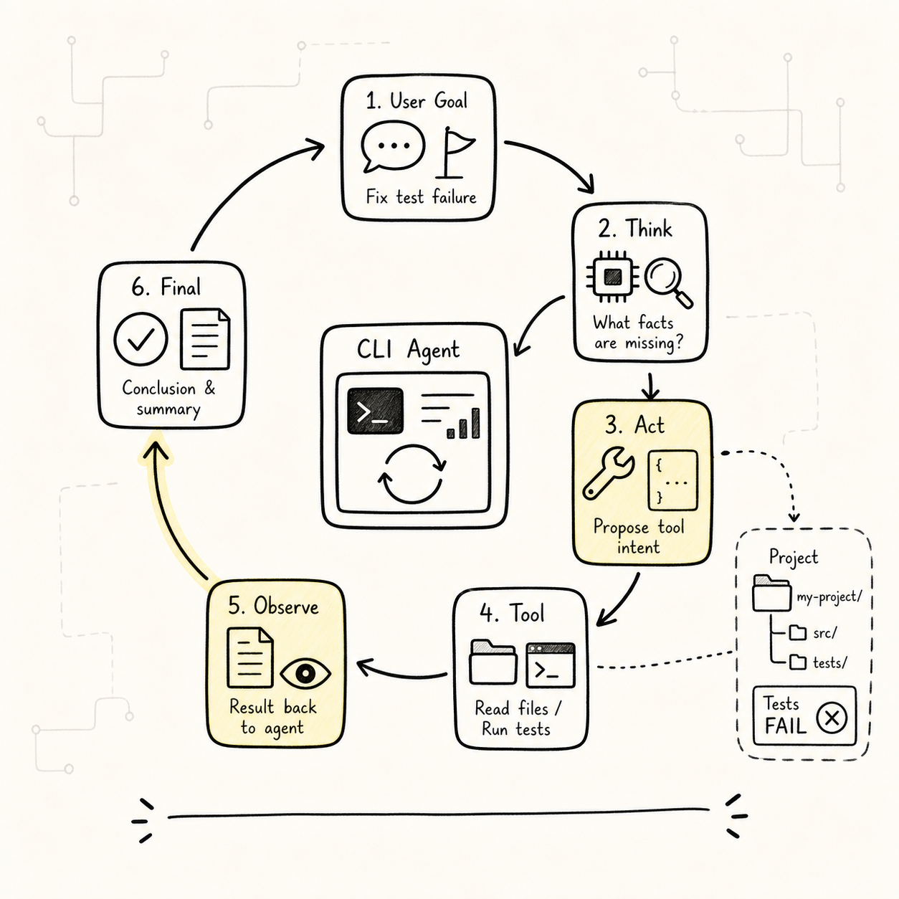
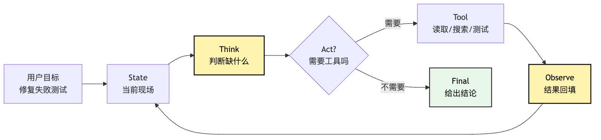
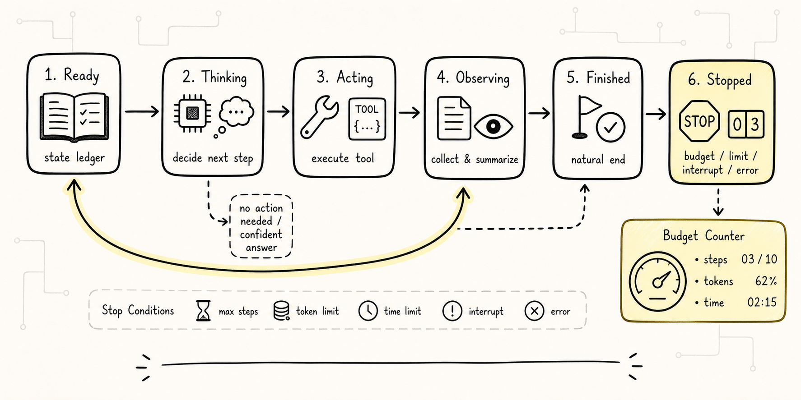
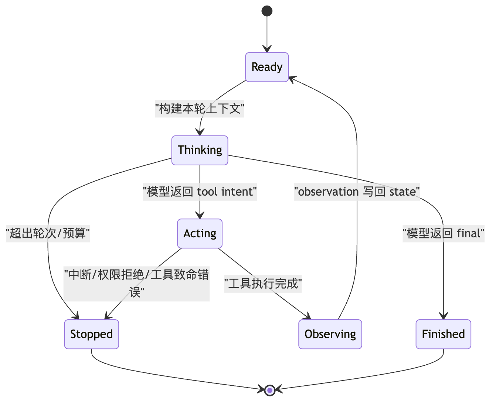
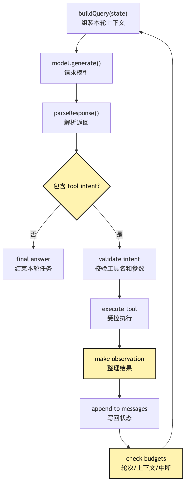
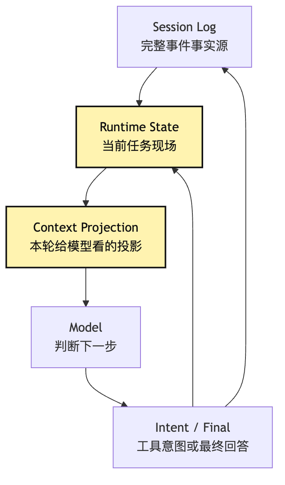
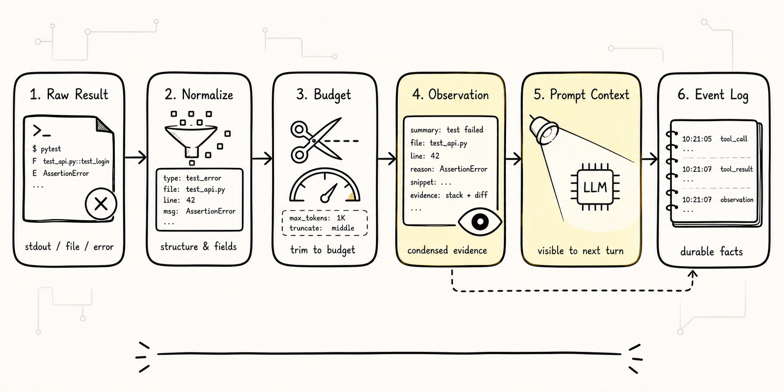
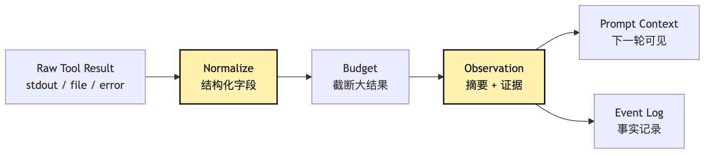
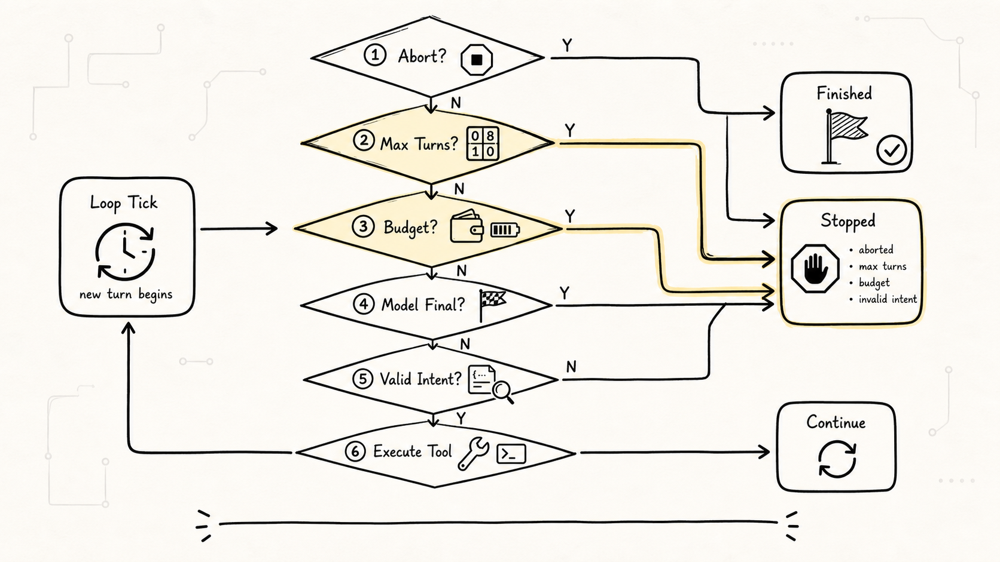
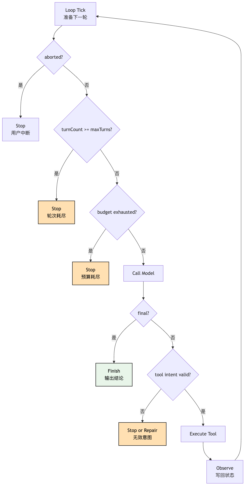

# 最小 Agent Loop：単発回答から多段行動へ

Agent Loop の本質は、モデルに無限に続きを書かせることではない。Think、Act、Observe、Final を状態機械として回し、Tool の結果を Observation として State に戻し、予算と停止条件で制御することだ。

Agent Loop の本質は、モデルに無限に続きを書かせることではない。Think、Act、Observe、Final を状態機械として回し、Tool の結果を Observation として State に戻し、予算と停止条件で制御することだ。

Agent Loop の本質は、モデルに無限に続きを書かせることではない。Think、Act、Observe、Final を状態機械として回し、Tool の結果を Observation として State に戻し、予算と停止条件で制御することだ。

Agent Loop の本質は、モデルに無限に続きを書かせることではない。Think、Act、Observe、Final を状態機械として回し、Tool の結果を Observation として State に戻し、予算と停止条件で制御することだ。

```text
Agent Loop の本質は、モデルに無限に続きを書かせることではない。Think、Act、Observe、Final を状態機械として回し、Tool の結果を Observation として State に戻し、予算と停止条件で制御することだ。
```

Agent Loop の本質は、モデルに無限に続きを書かせることではない。Think、Act、Observe、Final を状態機械として回し、Tool の結果を Observation として State に戻し、予算と停止条件で制御することだ。

Agent Loop の本質は、モデルに無限に続きを書かせることではない。Think、Act、Observe、Final を状態機械として回し、Tool の結果を Observation として State に戻し、予算と停止条件で制御することだ。

Agent Loop の本質は、モデルに無限に続きを書かせることではない。Think、Act、Observe、Final を状態機械として回し、Tool の結果を Observation として State に戻し、予算と停止条件で制御することだ。

> Agent Loop の本質は、モデルに無限に続きを書かせることではない。Think、Act、Observe、Final を状態機械として回し、Tool の結果を Observation として State に戻し、予算と停止条件で制御することだ。

Agent Loop の本質は、モデルに無限に続きを書かせることではない。Think、Act、Observe、Final を状態機械として回し、Tool の結果を Observation として State に戻し、予算と停止条件で制御することだ。

```text
Agent Loop の本質は、モデルに無限に続きを書かせることではない。Think、Act、Observe、Final を状態機械として回し、Tool の結果を Observation として State に戻し、予算と停止条件で制御することだ。
```

Agent Loop の本質は、モデルに無限に続きを書かせることではない。Think、Act、Observe、Final を状態機械として回し、Tool の結果を Observation として State に戻し、予算と停止条件で制御することだ。

Agent Loop の本質は、モデルに無限に続きを書かせることではない。Think、Act、Observe、Final を状態機械として回し、Tool の結果を Observation として State に戻し、予算と停止条件で制御することだ。

```text
Agent Loop の本質は、モデルに無限に続きを書かせることではない。Think、Act、Observe、Final を状態機械として回し、Tool の結果を Observation として State に戻し、予算と停止条件で制御することだ。
-> 必要な事実を記録する
-> 次の判断へ渡す
```

Agent Loop の本質は、モデルに無限に続きを書かせることではない。Think、Act、Observe、Final を状態機械として回し、Tool の結果を Observation として State に戻し、予算と停止条件で制御することだ。

Agent Loop の本質は、モデルに無限に続きを書かせることではない。Think、Act、Observe、Final を状態機械として回し、Tool の結果を Observation として State に戻し、予算と停止条件で制御することだ。

Agent Loop の本質は、モデルに無限に続きを書かせることではない。Think、Act、Observe、Final を状態機械として回し、Tool の結果を Observation として State に戻し、予算と停止条件で制御することだ。

## 問題の連鎖



Agent Loop の本質は、モデルに無限に続きを書かせることではない。Think、Act、Observe、Final を状態機械として回し、Tool の結果を Observation として State に戻し、予算と停止条件で制御することだ。

```text
Agent Loop の本質は、モデルに無限に続きを書かせることではない。Think、Act、Observe、Final を状態機械として回し、Tool の結果を Observation として State に戻し、予算と停止条件で制御することだ。
-> 必要な事実を記録する
-> 次の判断へ渡す
```

Agent Loop の本質は、モデルに無限に続きを書かせることではない。Think、Act、Observe、Final を状態機械として回し、Tool の結果を Observation として State に戻し、予算と停止条件で制御することだ。



Agent Loop の本質は、モデルに無限に続きを書かせることではない。Think、Act、Observe、Final を状態機械として回し、Tool の結果を Observation として State に戻し、予算と停止条件で制御することだ。

Agent Loop の本質は、モデルに無限に続きを書かせることではない。Think、Act、Observe、Final を状態機械として回し、Tool の結果を Observation として State に戻し、予算と停止条件で制御することだ。

Agent Loop の本質は、モデルに無限に続きを書かせることではない。Think、Act、Observe、Final を状態機械として回し、Tool の結果を Observation として State に戻し、予算と停止条件で制御することだ。

Agent Loop の本質は、モデルに無限に続きを書かせることではない。Think、Act、Observe、Final を状態機械として回し、Tool の結果を Observation として State に戻し、予算と停止条件で制御することだ。

```text
Agent Loop の本質は、モデルに無限に続きを書かせることではない。Think、Act、Observe、Final を状態機械として回し、Tool の結果を Observation として State に戻し、予算と停止条件で制御することだ。
```

Agent Loop の本質は、モデルに無限に続きを書かせることではない。Think、Act、Observe、Final を状態機械として回し、Tool の結果を Observation として State に戻し、予算と停止条件で制御することだ。

## 1. 単発回答では「テストを直す」まで届かない理由

Agent Loop の本質は、モデルに無限に続きを書かせることではない。Think、Act、Observe、Final を状態機械として回し、Tool の結果を Observation として State に戻し、予算と停止条件で制御することだ。

Agent Loop の本質は、モデルに無限に続きを書かせることではない。Think、Act、Observe、Final を状態機械として回し、Tool の結果を Observation として State に戻し、予算と停止条件で制御することだ。

```text
Agent Loop の本質は、モデルに無限に続きを書かせることではない。Think、Act、Observe、Final を状態機械として回し、Tool の結果を Observation として State に戻し、予算と停止条件で制御することだ。
```

Agent Loop の本質は、モデルに無限に続きを書かせることではない。Think、Act、Observe、Final を状態機械として回し、Tool の結果を Observation として State に戻し、予算と停止条件で制御することだ。

```text
Agent Loop の本質は、モデルに無限に続きを書かせることではない。Think、Act、Observe、Final を状態機械として回し、Tool の結果を Observation として State に戻し、予算と停止条件で制御することだ。
```

Agent Loop の本質は、モデルに無限に続きを書かせることではない。Think、Act、Observe、Final を状態機械として回し、Tool の結果を Observation として State に戻し、予算と停止条件で制御することだ。

```text
Agent Loop の本質は、モデルに無限に続きを書かせることではない。Think、Act、Observe、Final を状態機械として回し、Tool の結果を Observation として State に戻し、予算と停止条件で制御することだ。
-> 必要な事実を記録する
-> 次の判断へ渡す
```

Agent Loop の本質は、モデルに無限に続きを書かせることではない。Think、Act、Observe、Final を状態機械として回し、Tool の結果を Observation として State に戻し、予算と停止条件で制御することだ。

Agent Loop の本質は、モデルに無限に続きを書かせることではない。Think、Act、Observe、Final を状態機械として回し、Tool の結果を Observation として State に戻し、予算と停止条件で制御することだ。

```text
Agent Loop の本質は、モデルに無限に続きを書かせることではない。Think、Act、Observe、Final を状態機械として回し、Tool の結果を Observation として State に戻し、予算と停止条件で制御することだ。
-> 必要な事実を記録する
-> 次の判断へ渡す
```

Agent Loop の本質は、モデルに無限に続きを書かせることではない。Think、Act、Observe、Final を状態機械として回し、Tool の結果を Observation として State に戻し、予算と停止条件で制御することだ。

Agent Loop の本質は、モデルに無限に続きを書かせることではない。Think、Act、Observe、Final を状態機械として回し、Tool の結果を Observation として State に戻し、予算と停止条件で制御することだ。

Agent Loop の本質は、モデルに無限に続きを書かせることではない。Think、Act、Observe、Final を状態機械として回し、Tool の結果を Observation として State に戻し、予算と停止条件で制御することだ。

Agent Loop の本質は、モデルに無限に続きを書かせることではない。Think、Act、Observe、Final を状態機械として回し、Tool の結果を Observation として State に戻し、予算と停止条件で制御することだ。

Agent Loop の本質は、モデルに無限に続きを書かせることではない。Think、Act、Observe、Final を状態機械として回し、Tool の結果を Observation として State に戻し、予算と停止条件で制御することだ。

```text
Agent Loop の本質は、モデルに無限に続きを書かせることではない。Think、Act、Observe、Final を状態機械として回し、Tool の結果を Observation として State に戻し、予算と停止条件で制御することだ。
```

Agent Loop の本質は、モデルに無限に続きを書かせることではない。Think、Act、Observe、Final を状態機械として回し、Tool の結果を Observation として State に戻し、予算と停止条件で制御することだ。

```text
Agent Loop の本質は、モデルに無限に続きを書かせることではない。Think、Act、Observe、Final を状態機械として回し、Tool の結果を Observation として State に戻し、予算と停止条件で制御することだ。
```

Agent Loop の本質は、モデルに無限に続きを書かせることではない。Think、Act、Observe、Final を状態機械として回し、Tool の結果を Observation として State に戻し、予算と停止条件で制御することだ。

```json
{
  "tool": "read_file",
  "input": {
    "path": "package.json"
  }
}
```

Agent Loop の本質は、モデルに無限に続きを書かせることではない。Think、Act、Observe、Final を状態機械として回し、Tool の結果を Observation として State に戻し、予算と停止条件で制御することだ。

Agent Loop の本質は、モデルに無限に続きを書かせることではない。Think、Act、Observe、Final を状態機械として回し、Tool の結果を Observation として State に戻し、予算と停止条件で制御することだ。

Agent Loop の本質は、モデルに無限に続きを書かせることではない。Think、Act、Observe、Final を状態機械として回し、Tool の結果を Observation として State に戻し、予算と停止条件で制御することだ。

Agent Loop の本質は、モデルに無限に続きを書かせることではない。Think、Act、Observe、Final を状態機械として回し、Tool の結果を Observation として State に戻し、予算と停止条件で制御することだ。

## 2. Loop は長い Context ではなく状態機械である



Agent Loop の本質は、モデルに無限に続きを書かせることではない。Think、Act、Observe、Final を状態機械として回し、Tool の結果を Observation として State に戻し、予算と停止条件で制御することだ。

Agent Loop の本質は、モデルに無限に続きを書かせることではない。Think、Act、Observe、Final を状態機械として回し、Tool の結果を Observation として State に戻し、予算と停止条件で制御することだ。

Agent Loop の本質は、モデルに無限に続きを書かせることではない。Think、Act、Observe、Final を状態機械として回し、Tool の結果を Observation として State に戻し、予算と停止条件で制御することだ。

Agent Loop の本質は、モデルに無限に続きを書かせることではない。Think、Act、Observe、Final を状態機械として回し、Tool の結果を Observation として State に戻し、予算と停止条件で制御することだ。

```text
Agent Loop の本質は、モデルに無限に続きを書かせることではない。Think、Act、Observe、Final を状態機械として回し、Tool の結果を Observation として State に戻し、予算と停止条件で制御することだ。
-> 必要な事実を記録する
-> 次の判断へ渡す
```

Agent Loop の本質は、モデルに無限に続きを書かせることではない。Think、Act、Observe、Final を状態機械として回し、Tool の結果を Observation として State に戻し、予算と停止条件で制御することだ。

Agent Loop の本質は、モデルに無限に続きを書かせることではない。Think、Act、Observe、Final を状態機械として回し、Tool の結果を Observation として State に戻し、予算と停止条件で制御することだ。

Agent Loop の本質は、モデルに無限に続きを書かせることではない。Think、Act、Observe、Final を状態機械として回し、Tool の結果を Observation として State に戻し、予算と停止条件で制御することだ。



Agent Loop の本質は、モデルに無限に続きを書かせることではない。Think、Act、Observe、Final を状態機械として回し、Tool の結果を Observation として State に戻し、予算と停止条件で制御することだ。

```text
Agent Loop の本質は、モデルに無限に続きを書かせることではない。Think、Act、Observe、Final を状態機械として回し、Tool の結果を Observation として State に戻し、予算と停止条件で制御することだ。
```

Agent Loop の本質は、モデルに無限に続きを書かせることではない。Think、Act、Observe、Final を状態機械として回し、Tool の結果を Observation として State に戻し、予算と停止条件で制御することだ。

Agent Loop の本質は、モデルに無限に続きを書かせることではない。Think、Act、Observe、Final を状態機械として回し、Tool の結果を Observation として State に戻し、予算と停止条件で制御することだ。

Agent Loop の本質は、モデルに無限に続きを書かせることではない。Think、Act、Observe、Final を状態機械として回し、Tool の結果を Observation として State に戻し、予算と停止条件で制御することだ。

Agent Loop の本質は、モデルに無限に続きを書かせることではない。Think、Act、Observe、Final を状態機械として回し、Tool の結果を Observation として State に戻し、予算と停止条件で制御することだ。

Agent Loop の本質は、モデルに無限に続きを書かせることではない。Think、Act、Observe、Final を状態機械として回し、Tool の結果を Observation として State に戻し、予算と停止条件で制御することだ。

Agent Loop の本質は、モデルに無限に続きを書かせることではない。Think、Act、Observe、Final を状態機械として回し、Tool の結果を Observation として State に戻し、予算と停止条件で制御することだ。

Agent Loop の本質は、モデルに無限に続きを書かせることではない。Think、Act、Observe、Final を状態機械として回し、Tool の結果を Observation として State に戻し、予算と停止条件で制御することだ。

Agent Loop の本質は、モデルに無限に続きを書かせることではない。Think、Act、Observe、Final を状態機械として回し、Tool の結果を Observation として State に戻し、予算と停止条件で制御することだ。

Agent Loop の本質は、モデルに無限に続きを書かせることではない。Think、Act、Observe、Final を状態機械として回し、Tool の結果を Observation として State に戻し、予算と停止条件で制御することだ。

```text
Agent Loop の本質は、モデルに無限に続きを書かせることではない。Think、Act、Observe、Final を状態機械として回し、Tool の結果を Observation として State に戻し、予算と停止条件で制御することだ。
-> 必要な事実を記録する
-> 次の判断へ渡す
```

Agent Loop の本質は、モデルに無限に続きを書かせることではない。Think、Act、Observe、Final を状態機械として回し、Tool の結果を Observation として State に戻し、予算と停止条件で制御することだ。

## 3. 最小 ReAct：Think、Act、Observe、Final

Agent Loop の本質は、モデルに無限に続きを書かせることではない。Think、Act、Observe、Final を状態機械として回し、Tool の結果を Observation として State に戻し、予算と停止条件で制御することだ。

Agent Loop の本質は、モデルに無限に続きを書かせることではない。Think、Act、Observe、Final を状態機械として回し、Tool の結果を Observation として State に戻し、予算と停止条件で制御することだ。

```text
Agent Loop の本質は、モデルに無限に続きを書かせることではない。Think、Act、Observe、Final を状態機械として回し、Tool の結果を Observation として State に戻し、予算と停止条件で制御することだ。
-> 必要な事実を記録する
-> 次の判断へ渡す
```

Agent Loop の本質は、モデルに無限に続きを書かせることではない。Think、Act、Observe、Final を状態機械として回し、Tool の結果を Observation として State に戻し、予算と停止条件で制御することだ。

Agent Loop の本質は、モデルに無限に続きを書かせることではない。Think、Act、Observe、Final を状態機械として回し、Tool の結果を Observation として State に戻し、予算と停止条件で制御することだ。



Agent Loop の本質は、モデルに無限に続きを書かせることではない。Think、Act、Observe、Final を状態機械として回し、Tool の結果を Observation として State に戻し、予算と停止条件で制御することだ。

1. Agent Loop の本質は、モデルに無限に続きを書かせることではない。Think、Act、Observe、Final を状態機械として回し、Tool の結果を Observation として State に戻し、予算と停止条件で制御することだ。
2. Agent Loop の本質は、モデルに無限に続きを書かせることではない。Think、Act、Observe、Final を状態機械として回し、Tool の結果を Observation として State に戻し、予算と停止条件で制御することだ。
3. Agent Loop の本質は、モデルに無限に続きを書かせることではない。Think、Act、Observe、Final を状態機械として回し、Tool の結果を Observation として State に戻し、予算と停止条件で制御することだ。
4. Agent Loop の本質は、モデルに無限に続きを書かせることではない。Think、Act、Observe、Final を状態機械として回し、Tool の結果を Observation として State に戻し、予算と停止条件で制御することだ。
5. Agent Loop の本質は、モデルに無限に続きを書かせることではない。Think、Act、Observe、Final を状態機械として回し、Tool の結果を Observation として State に戻し、予算と停止条件で制御することだ。

Agent Loop の本質は、モデルに無限に続きを書かせることではない。Think、Act、Observe、Final を状態機械として回し、Tool の結果を Observation として State に戻し、予算と停止条件で制御することだ。

```text
Agent Loop の本質は、モデルに無限に続きを書かせることではない。Think、Act、Observe、Final を状態機械として回し、Tool の結果を Observation として State に戻し、予算と停止条件で制御することだ。
-> 必要な事実を記録する
-> 次の判断へ渡す
```

Agent Loop の本質は、モデルに無限に続きを書かせることではない。Think、Act、Observe、Final を状態機械として回し、Tool の結果を Observation として State に戻し、予算と停止条件で制御することだ。

Agent Loop の本質は、モデルに無限に続きを書かせることではない。Think、Act、Observe、Final を状態機械として回し、Tool の結果を Observation として State に戻し、予算と停止条件で制御することだ。

Agent Loop の本質は、モデルに無限に続きを書かせることではない。Think、Act、Observe、Final を状態機械として回し、Tool の結果を Observation として State に戻し、予算と停止条件で制御することだ。

Agent Loop の本質は、モデルに無限に続きを書かせることではない。Think、Act、Observe、Final を状態機械として回し、Tool の結果を Observation として State に戻し、予算と停止条件で制御することだ。

## 4. 失敗テスト修復で一周させる

Agent Loop の本質は、モデルに無限に続きを書かせることではない。Think、Act、Observe、Final を状態機械として回し、Tool の結果を Observation として State に戻し、予算と停止条件で制御することだ。

Agent Loop の本質は、モデルに無限に続きを書かせることではない。Think、Act、Observe、Final を状態機械として回し、Tool の結果を Observation として State に戻し、予算と停止条件で制御することだ。

```text
Agent Loop の本質は、モデルに無限に続きを書かせることではない。Think、Act、Observe、Final を状態機械として回し、Tool の結果を Observation として State に戻し、予算と停止条件で制御することだ。
```

Agent Loop の本質は、モデルに無限に続きを書かせることではない。Think、Act、Observe、Final を状態機械として回し、Tool の結果を Observation として State に戻し、予算と停止条件で制御することだ。

```text
Agent Loop の本質は、モデルに無限に続きを書かせることではない。Think、Act、Observe、Final を状態機械として回し、Tool の結果を Observation として State に戻し、予算と停止条件で制御することだ。
-> 必要な事実を記録する
-> 次の判断へ渡す
```

Agent Loop の本質は、モデルに無限に続きを書かせることではない。Think、Act、Observe、Final を状態機械として回し、Tool の結果を Observation として State に戻し、予算と停止条件で制御することだ。

```json
{
  "tool": "read_file",
  "input": {
    "path": "package.json"
  },
  "reason": "テストコマンドとプロジェクト種別を確認する必要がある"
}
```

Agent Loop の本質は、モデルに無限に続きを書かせることではない。Think、Act、Observe、Final を状態機械として回し、Tool の結果を Observation として State に戻し、予算と停止条件で制御することだ。

```text
Agent Loop の本質は、モデルに無限に続きを書かせることではない。Think、Act、Observe、Final を状態機械として回し、Tool の結果を Observation として State に戻し、予算と停止条件で制御することだ。
-> 必要な事実を記録する
-> 次の判断へ渡す
```

Agent Loop の本質は、モデルに無限に続きを書かせることではない。Think、Act、Observe、Final を状態機械として回し、Tool の結果を Observation として State に戻し、予算と停止条件で制御することだ。

```json
{
  "tool": "run_command",
  "input": {
    "command": "pnpm test"
  },
  "reason": "失敗ログを再現する必要がある"
}
```

Agent Loop の本質は、モデルに無限に続きを書かせることではない。Think、Act、Observe、Final を状態機械として回し、Tool の結果を Observation として State に戻し、予算と停止条件で制御することだ。

```text
Agent Loop の本質は、モデルに無限に続きを書かせることではない。Think、Act、Observe、Final を状態機械として回し、Tool の結果を Observation として State に戻し、予算と停止条件で制御することだ。
-> 必要な事実を記録する
-> 次の判断へ渡す
```

Agent Loop の本質は、モデルに無限に続きを書かせることではない。Think、Act、Observe、Final を状態機械として回し、Tool の結果を Observation として State に戻し、予算と停止条件で制御することだ。

```json
{
  "tool": "read_file",
  "input": {
    "path": "src/sum.ts"
  },
  "reason": "失敗したアサーションが sum の実装に関係している"
}
```

Agent Loop の本質は、モデルに無限に続きを書かせることではない。Think、Act、Observe、Final を状態機械として回し、Tool の結果を Observation として State に戻し、予算と停止条件で制御することだ。

Agent Loop の本質は、モデルに無限に続きを書かせることではない。Think、Act、Observe、Final を状態機械として回し、Tool の結果を Observation として State に戻し、予算と停止条件で制御することだ。

Agent Loop の本質は、モデルに無限に続きを書かせることではない。Think、Act、Observe、Final を状態機械として回し、Tool の結果を Observation として State に戻し、予算と停止条件で制御することだ。

```text
Agent Loop の本質は、モデルに無限に続きを書かせることではない。Think、Act、Observe、Final を状態機械として回し、Tool の結果を Observation として State に戻し、予算と停止条件で制御することだ。
```

Agent Loop の本質は、モデルに無限に続きを書かせることではない。Think、Act、Observe、Final を状態機械として回し、Tool の結果を Observation として State に戻し、予算と停止条件で制御することだ。

Agent Loop の本質は、モデルに無限に続きを書かせることではない。Think、Act、Observe、Final を状態機械として回し、Tool の結果を Observation として State に戻し、予算と停止条件で制御することだ。

Agent Loop の本質は、モデルに無限に続きを書かせることではない。Think、Act、Observe、Final を状態機械として回し、Tool の結果を Observation として State に戻し、予算と停止条件で制御することだ。

```text
Agent Loop の本質は、モデルに無限に続きを書かせることではない。Think、Act、Observe、Final を状態機械として回し、Tool の結果を Observation として State に戻し、予算と停止条件で制御することだ。
-> 必要な事実を記録する
-> 次の判断へ渡す
```

Agent Loop の本質は、モデルに無限に続きを書かせることではない。Think、Act、Observe、Final を状態機械として回し、Tool の結果を Observation として State に戻し、予算と停止条件で制御することだ。

## 5. State：各ターンをゼロから始めない

Agent Loop の本質は、モデルに無限に続きを書かせることではない。Think、Act、Observe、Final を状態機械として回し、Tool の結果を Observation として State に戻し、予算と停止条件で制御することだ。

Agent Loop の本質は、モデルに無限に続きを書かせることではない。Think、Act、Observe、Final を状態機械として回し、Tool の結果を Observation として State に戻し、予算と停止条件で制御することだ。

Agent Loop の本質は、モデルに無限に続きを書かせることではない。Think、Act、Observe、Final を状態機械として回し、Tool の結果を Observation として State に戻し、予算と停止条件で制御することだ。

```ts
type AgentState = {
  messages: Message[]
  turnCount: number
  maxTurns: number
  aborted: boolean
  lastObservation?: Observation
  toolResults: ToolResult[]
  finalAnswer?: string
}
```

Agent Loop の本質は、モデルに無限に続きを書かせることではない。Think、Act、Observe、Final を状態機械として回し、Tool の結果を Observation として State に戻し、予算と停止条件で制御することだ。

Agent Loop の本質は、モデルに無限に続きを書かせることではない。Think、Act、Observe、Final を状態機械として回し、Tool の結果を Observation として State に戻し、予算と停止条件で制御することだ。

Agent Loop の本質は、モデルに無限に続きを書かせることではない。Think、Act、Observe、Final を状態機械として回し、Tool の結果を Observation として State に戻し、予算と停止条件で制御することだ。

Agent Loop の本質は、モデルに無限に続きを書かせることではない。Think、Act、Observe、Final を状態機械として回し、Tool の結果を Observation として State に戻し、予算と停止条件で制御することだ。

Agent Loop の本質は、モデルに無限に続きを書かせることではない。Think、Act、Observe、Final を状態機械として回し、Tool の結果を Observation として State に戻し、予算と停止条件で制御することだ。

Agent Loop の本質は、モデルに無限に続きを書かせることではない。Think、Act、Observe、Final を状態機械として回し、Tool の結果を Observation として State に戻し、予算と停止条件で制御することだ。

Agent Loop の本質は、モデルに無限に続きを書かせることではない。Think、Act、Observe、Final を状態機械として回し、Tool の結果を Observation として State に戻し、予算と停止条件で制御することだ。

Agent Loop の本質は、モデルに無限に続きを書かせることではない。Think、Act、Observe、Final を状態機械として回し、Tool の結果を Observation として State に戻し、予算と停止条件で制御することだ。

Agent Loop の本質は、モデルに無限に続きを書かせることではない。Think、Act、Observe、Final を状態機械として回し、Tool の結果を Observation として State に戻し、予算と停止条件で制御することだ。

Agent Loop の本質は、モデルに無限に続きを書かせることではない。Think、Act、Observe、Final を状態機械として回し、Tool の結果を Observation として State に戻し、予算と停止条件で制御することだ。

```text
Agent Loop の本質は、モデルに無限に続きを書かせることではない。Think、Act、Observe、Final を状態機械として回し、Tool の結果を Observation として State に戻し、予算と停止条件で制御することだ。
-> 必要な事実を記録する
-> 次の判断へ渡す
```

Agent Loop の本質は、モデルに無限に続きを書かせることではない。Think、Act、Observe、Final を状態機械として回し、Tool の結果を Observation として State に戻し、予算と停止条件で制御することだ。

Agent Loop の本質は、モデルに無限に続きを書かせることではない。Think、Act、Observe、Final を状態機械として回し、Tool の結果を Observation として State に戻し、予算と停止条件で制御することだ。

```text
Agent Loop の本質は、モデルに無限に続きを書かせることではない。Think、Act、Observe、Final を状態機械として回し、Tool の結果を Observation として State に戻し、予算と停止条件で制御することだ。
-> 必要な事実を記録する
-> 次の判断へ渡す
```

Agent Loop の本質は、モデルに無限に続きを書かせることではない。Think、Act、Observe、Final を状態機械として回し、Tool の結果を Observation として State に戻し、予算と停止条件で制御することだ。

Agent Loop の本質は、モデルに無限に続きを書かせることではない。Think、Act、Observe、Final を状態機械として回し、Tool の結果を Observation として State に戻し、予算と停止条件で制御することだ。

Agent Loop の本質は、モデルに無限に続きを書かせることではない。Think、Act、Observe、Final を状態機械として回し、Tool の結果を Observation として State に戻し、予算と停止条件で制御することだ。



Agent Loop の本質は、モデルに無限に続きを書かせることではない。Think、Act、Observe、Final を状態機械として回し、Tool の結果を Observation として State に戻し、予算と停止条件で制御することだ。

Agent Loop の本質は、モデルに無限に続きを書かせることではない。Think、Act、Observe、Final を状態機械として回し、Tool の結果を Observation として State に戻し、予算と停止条件で制御することだ。

Agent Loop の本質は、モデルに無限に続きを書かせることではない。Think、Act、Observe、Final を状態機械として回し、Tool の結果を Observation として State に戻し、予算と停止条件で制御することだ。

Agent Loop の本質は、モデルに無限に続きを書かせることではない。Think、Act、Observe、Final を状態機械として回し、Tool の結果を Observation として State に戻し、予算と停止条件で制御することだ。

Agent Loop の本質は、モデルに無限に続きを書かせることではない。Think、Act、Observe、Final を状態機械として回し、Tool の結果を Observation として State に戻し、予算と停止条件で制御することだ。

Agent Loop の本質は、モデルに無限に続きを書かせることではない。Think、Act、Observe、Final を状態機械として回し、Tool の結果を Observation として State に戻し、予算と停止条件で制御することだ。

Agent Loop の本質は、モデルに無限に続きを書かせることではない。Think、Act、Observe、Final を状態機械として回し、Tool の結果を Observation として State に戻し、予算と停止条件で制御することだ。

## 6. Act：まず fake tool で仕組みを検証する

Agent Loop の本質は、モデルに無限に続きを書かせることではない。Think、Act、Observe、Final を状態機械として回し、Tool の結果を Observation として State に戻し、予算と停止条件で制御することだ。

Agent Loop の本質は、モデルに無限に続きを書かせることではない。Think、Act、Observe、Final を状態機械として回し、Tool の結果を Observation として State に戻し、予算と停止条件で制御することだ。

Agent Loop の本質は、モデルに無限に続きを書かせることではない。Think、Act、Observe、Final を状態機械として回し、Tool の結果を Observation として State に戻し、予算と停止条件で制御することだ。

Agent Loop の本質は、モデルに無限に続きを書かせることではない。Think、Act、Observe、Final を状態機械として回し、Tool の結果を Observation として State に戻し、予算と停止条件で制御することだ。

```text
Agent Loop の本質は、モデルに無限に続きを書かせることではない。Think、Act、Observe、Final を状態機械として回し、Tool の結果を Observation として State に戻し、予算と停止条件で制御することだ。
-> 必要な事実を記録する
-> 次の判断へ渡す
```

Agent Loop の本質は、モデルに無限に続きを書かせることではない。Think、Act、Observe、Final を状態機械として回し、Tool の結果を Observation として State に戻し、予算と停止条件で制御することだ。

Agent Loop の本質は、モデルに無限に続きを書かせることではない。Think、Act、Observe、Final を状態機械として回し、Tool の結果を Observation として State に戻し、予算と停止条件で制御することだ。

```text
Agent Loop の本質は、モデルに無限に続きを書かせることではない。Think、Act、Observe、Final を状態機械として回し、Tool の結果を Observation として State に戻し、予算と停止条件で制御することだ。
-> 必要な事実を記録する
-> 次の判断へ渡す
```

Agent Loop の本質は、モデルに無限に続きを書かせることではない。Think、Act、Observe、Final を状態機械として回し、Tool の結果を Observation として State に戻し、予算と停止条件で制御することだ。

Agent Loop の本質は、モデルに無限に続きを書かせることではない。Think、Act、Observe、Final を状態機械として回し、Tool の結果を Observation として State に戻し、予算と停止条件で制御することだ。

```text
Agent Loop の本質は、モデルに無限に続きを書かせることではない。Think、Act、Observe、Final を状態機械として回し、Tool の結果を Observation として State に戻し、予算と停止条件で制御することだ。
-> 必要な事実を記録する
-> 次の判断へ渡す
```

Agent Loop の本質は、モデルに無限に続きを書かせることではない。Think、Act、Observe、Final を状態機械として回し、Tool の結果を Observation として State に戻し、予算と停止条件で制御することだ。

```text
Agent Loop の本質は、モデルに無限に続きを書かせることではない。Think、Act、Observe、Final を状態機械として回し、Tool の結果を Observation として State に戻し、予算と停止条件で制御することだ。
```

Agent Loop の本質は、モデルに無限に続きを書かせることではない。Think、Act、Observe、Final を状態機械として回し、Tool の結果を Observation として State に戻し、予算と停止条件で制御することだ。

```text
Agent Loop の本質は、モデルに無限に続きを書かせることではない。Think、Act、Observe、Final を状態機械として回し、Tool の結果を Observation として State に戻し、予算と停止条件で制御することだ。
-> 必要な事実を記録する
-> 次の判断へ渡す
```

Agent Loop の本質は、モデルに無限に続きを書かせることではない。Think、Act、Observe、Final を状態機械として回し、Tool の結果を Observation として State に戻し、予算と停止条件で制御することだ。

Agent Loop の本質は、モデルに無限に続きを書かせることではない。Think、Act、Observe、Final を状態機械として回し、Tool の結果を Observation として State に戻し、予算と停止条件で制御することだ。

```text
Agent Loop の本質は、モデルに無限に続きを書かせることではない。Think、Act、Observe、Final を状態機械として回し、Tool の結果を Observation として State に戻し、予算と停止条件で制御することだ。
-> 必要な事実を記録する
-> 次の判断へ渡す
```

Agent Loop の本質は、モデルに無限に続きを書かせることではない。Think、Act、Observe、Final を状態機械として回し、Tool の結果を Observation として State に戻し、予算と停止条件で制御することだ。

Agent Loop の本質は、モデルに無限に続きを書かせることではない。Think、Act、Observe、Final を状態機械として回し、Tool の結果を Observation として State に戻し、予算と停止条件で制御することだ。

## 7. Observe：Tool 結果はログではなく次ターンの事実である



Agent Loop の本質は、モデルに無限に続きを書かせることではない。Think、Act、Observe、Final を状態機械として回し、Tool の結果を Observation として State に戻し、予算と停止条件で制御することだ。

Agent Loop の本質は、モデルに無限に続きを書かせることではない。Think、Act、Observe、Final を状態機械として回し、Tool の結果を Observation として State に戻し、予算と停止条件で制御することだ。

```text
Agent Loop の本質は、モデルに無限に続きを書かせることではない。Think、Act、Observe、Final を状態機械として回し、Tool の結果を Observation として State に戻し、予算と停止条件で制御することだ。
-> 必要な事実を記録する
-> 次の判断へ渡す
```

Agent Loop の本質は、モデルに無限に続きを書かせることではない。Think、Act、Observe、Final を状態機械として回し、Tool の結果を Observation として State に戻し、予算と停止条件で制御することだ。

```text
Agent Loop の本質は、モデルに無限に続きを書かせることではない。Think、Act、Observe、Final を状態機械として回し、Tool の結果を Observation として State に戻し、予算と停止条件で制御することだ。
```

Agent Loop の本質は、モデルに無限に続きを書かせることではない。Think、Act、Observe、Final を状態機械として回し、Tool の結果を Observation として State に戻し、予算と停止条件で制御することだ。

Agent Loop の本質は、モデルに無限に続きを書かせることではない。Think、Act、Observe、Final を状態機械として回し、Tool の結果を Observation として State に戻し、予算と停止条件で制御することだ。

Agent Loop の本質は、モデルに無限に続きを書かせることではない。Think、Act、Observe、Final を状態機械として回し、Tool の結果を Observation として State に戻し、予算と停止条件で制御することだ。

Agent Loop の本質は、モデルに無限に続きを書かせることではない。Think、Act、Observe、Final を状態機械として回し、Tool の結果を Observation として State に戻し、予算と停止条件で制御することだ。

Agent Loop の本質は、モデルに無限に続きを書かせることではない。Think、Act、Observe、Final を状態機械として回し、Tool の結果を Observation として State に戻し、予算と停止条件で制御することだ。

Agent Loop の本質は、モデルに無限に続きを書かせることではない。Think、Act、Observe、Final を状態機械として回し、Tool の結果を Observation として State に戻し、予算と停止条件で制御することだ。

Agent Loop の本質は、モデルに無限に続きを書かせることではない。Think、Act、Observe、Final を状態機械として回し、Tool の結果を Observation として State に戻し、予算と停止条件で制御することだ。

```ts
type Observation = {
  toolName: string
  ok: boolean
  summary: string
  evidence?: string
  errorType?: string
  retryable?: boolean
}
```

Agent Loop の本質は、モデルに無限に続きを書かせることではない。Think、Act、Observe、Final を状態機械として回し、Tool の結果を Observation として State に戻し、予算と停止条件で制御することだ。

```text
Agent Loop の本質は、モデルに無限に続きを書かせることではない。Think、Act、Observe、Final を状態機械として回し、Tool の結果を Observation として State に戻し、予算と停止条件で制御することだ。
-> 必要な事実を記録する
-> 次の判断へ渡す
```

Agent Loop の本質は、モデルに無限に続きを書かせることではない。Think、Act、Observe、Final を状態機械として回し、Tool の結果を Observation として State に戻し、予算と停止条件で制御することだ。

Agent Loop の本質は、モデルに無限に続きを書かせることではない。Think、Act、Observe、Final を状態機械として回し、Tool の結果を Observation として State に戻し、予算と停止条件で制御することだ。

```text
Agent Loop の本質は、モデルに無限に続きを書かせることではない。Think、Act、Observe、Final を状態機械として回し、Tool の結果を Observation として State に戻し、予算と停止条件で制御することだ。
-> 必要な事実を記録する
-> 次の判断へ渡す
```

Agent Loop の本質は、モデルに無限に続きを書かせることではない。Think、Act、Observe、Final を状態機械として回し、Tool の結果を Observation として State に戻し、予算と停止条件で制御することだ。

Agent Loop の本質は、モデルに無限に続きを書かせることではない。Think、Act、Observe、Final を状態機械として回し、Tool の結果を Observation として State に戻し、予算と停止条件で制御することだ。

Agent Loop の本質は、モデルに無限に続きを書かせることではない。Think、Act、Observe、Final を状態機械として回し、Tool の結果を Observation として State に戻し、予算と停止条件で制御することだ。



Agent Loop の本質は、モデルに無限に続きを書かせることではない。Think、Act、Observe、Final を状態機械として回し、Tool の結果を Observation として State に戻し、予算と停止条件で制御することだ。

```text
Agent Loop の本質は、モデルに無限に続きを書かせることではない。Think、Act、Observe、Final を状態機械として回し、Tool の結果を Observation として State に戻し、予算と停止条件で制御することだ。
```

Agent Loop の本質は、モデルに無限に続きを書かせることではない。Think、Act、Observe、Final を状態機械として回し、Tool の結果を Observation として State に戻し、予算と停止条件で制御することだ。

## 8. 停止条件：Loop は続けるべきでない時を知る必要がある



Agent Loop の本質は、モデルに無限に続きを書かせることではない。Think、Act、Observe、Final を状態機械として回し、Tool の結果を Observation として State に戻し、予算と停止条件で制御することだ。

Agent Loop の本質は、モデルに無限に続きを書かせることではない。Think、Act、Observe、Final を状態機械として回し、Tool の結果を Observation として State に戻し、予算と停止条件で制御することだ。

```text
Agent Loop の本質は、モデルに無限に続きを書かせることではない。Think、Act、Observe、Final を状態機械として回し、Tool の結果を Observation として State に戻し、予算と停止条件で制御することだ。
```

Agent Loop の本質は、モデルに無限に続きを書かせることではない。Think、Act、Observe、Final を状態機械として回し、Tool の結果を Observation として State に戻し、予算と停止条件で制御することだ。

Agent Loop の本質は、モデルに無限に続きを書かせることではない。Think、Act、Observe、Final を状態機械として回し、Tool の結果を Observation として State に戻し、予算と停止条件で制御することだ。

```text
Agent Loop の本質は、モデルに無限に続きを書かせることではない。Think、Act、Observe、Final を状態機械として回し、Tool の結果を Observation として State に戻し、予算と停止条件で制御することだ。
-> 必要な事実を記録する
-> 次の判断へ渡す
```

Agent Loop の本質は、モデルに無限に続きを書かせることではない。Think、Act、Observe、Final を状態機械として回し、Tool の結果を Observation として State に戻し、予算と停止条件で制御することだ。



Agent Loop の本質は、モデルに無限に続きを書かせることではない。Think、Act、Observe、Final を状態機械として回し、Tool の結果を Observation として State に戻し、予算と停止条件で制御することだ。

Agent Loop の本質は、モデルに無限に続きを書かせることではない。Think、Act、Observe、Final を状態機械として回し、Tool の結果を Observation として State に戻し、予算と停止条件で制御することだ。

```text
Agent Loop の本質は、モデルに無限に続きを書かせることではない。Think、Act、Observe、Final を状態機械として回し、Tool の結果を Observation として State に戻し、予算と停止条件で制御することだ。
-> 必要な事実を記録する
-> 次の判断へ渡す
```

Agent Loop の本質は、モデルに無限に続きを書かせることではない。Think、Act、Observe、Final を状態機械として回し、Tool の結果を Observation として State に戻し、予算と停止条件で制御することだ。

Agent Loop の本質は、モデルに無限に続きを書かせることではない。Think、Act、Observe、Final を状態機械として回し、Tool の結果を Observation として State に戻し、予算と停止条件で制御することだ。

```text
Agent Loop の本質は、モデルに無限に続きを書かせることではない。Think、Act、Observe、Final を状態機械として回し、Tool の結果を Observation として State に戻し、予算と停止条件で制御することだ。
-> 必要な事実を記録する
-> 次の判断へ渡す
```

Agent Loop の本質は、モデルに無限に続きを書かせることではない。Think、Act、Observe、Final を状態機械として回し、Tool の結果を Observation として State に戻し、予算と停止条件で制御することだ。

Agent Loop の本質は、モデルに無限に続きを書かせることではない。Think、Act、Observe、Final を状態機械として回し、Tool の結果を Observation として State に戻し、予算と停止条件で制御することだ。

Agent Loop の本質は、モデルに無限に続きを書かせることではない。Think、Act、Observe、Final を状態機械として回し、Tool の結果を Observation として State に戻し、予算と停止条件で制御することだ。

## 9. 最小疑似コード：構文ではなく責務を見る

Agent Loop の本質は、モデルに無限に続きを書かせることではない。Think、Act、Observe、Final を状態機械として回し、Tool の結果を Observation として State に戻し、予算と停止条件で制御することだ。

```ts
async function runAgent(userGoal: string, tools: ToolRegistry) {
  let state = initialState(userGoal)

  while (!state.aborted) {
    if (state.turnCount >= state.maxTurns) {
      return stopWithReason(state, "max_turns_exceeded")
    }

    const query = buildQueryFromState(state)
    const response = await model.generate(query)
    const decision = parseModelDecision(response)

    if (decision.type === "final") {
      return finish(state, decision.answer)
    }

    const validation = validateToolIntent(decision.toolIntent, tools)
    if (!validation.ok) {
      state = appendObservation(state, validation.asObservation())
      state.turnCount += 1
      continue
    }

    const result = await executeTool(validation.intent)
    const observation = makeObservation(result)

    state = appendObservation(state, observation)
    state = updateBudgets(state)
    state.turnCount += 1
  }

  return stopWithReason(state, "aborted")
}
```

Agent Loop の本質は、モデルに無限に続きを書かせることではない。Think、Act、Observe、Final を状態機械として回し、Tool の結果を Observation として State に戻し、予算と停止条件で制御することだ。

Agent Loop の本質は、モデルに無限に続きを書かせることではない。Think、Act、Observe、Final を状態機械として回し、Tool の結果を Observation として State に戻し、予算と停止条件で制御することだ。

Agent Loop の本質は、モデルに無限に続きを書かせることではない。Think、Act、Observe、Final を状態機械として回し、Tool の結果を Observation として State に戻し、予算と停止条件で制御することだ。

Agent Loop の本質は、モデルに無限に続きを書かせることではない。Think、Act、Observe、Final を状態機械として回し、Tool の結果を Observation として State に戻し、予算と停止条件で制御することだ。

Agent Loop の本質は、モデルに無限に続きを書かせることではない。Think、Act、Observe、Final を状態機械として回し、Tool の結果を Observation として State に戻し、予算と停止条件で制御することだ。

Agent Loop の本質は、モデルに無限に続きを書かせることではない。Think、Act、Observe、Final を状態機械として回し、Tool の結果を Observation として State に戻し、予算と停止条件で制御することだ。

Agent Loop の本質は、モデルに無限に続きを書かせることではない。Think、Act、Observe、Final を状態機械として回し、Tool の結果を Observation として State に戻し、予算と停止条件で制御することだ。

Agent Loop の本質は、モデルに無限に続きを書かせることではない。Think、Act、Observe、Final を状態機械として回し、Tool の結果を Observation として State に戻し、予算と停止条件で制御することだ。

Agent Loop の本質は、モデルに無限に続きを書かせることではない。Think、Act、Observe、Final を状態機械として回し、Tool の結果を Observation として State に戻し、予算と停止条件で制御することだ。

## 10. Loop を Tool チュートリアルにしない理由

Agent Loop の本質は、モデルに無限に続きを書かせることではない。Think、Act、Observe、Final を状態機械として回し、Tool の結果を Observation として State に戻し、予算と停止条件で制御することだ。

Agent Loop の本質は、モデルに無限に続きを書かせることではない。Think、Act、Observe、Final を状態機械として回し、Tool の結果を Observation として State に戻し、予算と停止条件で制御することだ。

Agent Loop の本質は、モデルに無限に続きを書かせることではない。Think、Act、Observe、Final を状態機械として回し、Tool の結果を Observation として State に戻し、予算と停止条件で制御することだ。

```text
Agent Loop の本質は、モデルに無限に続きを書かせることではない。Think、Act、Observe、Final を状態機械として回し、Tool の結果を Observation として State に戻し、予算と停止条件で制御することだ。
-> 必要な事実を記録する
-> 次の判断へ渡す
```

Agent Loop の本質は、モデルに無限に続きを書かせることではない。Think、Act、Observe、Final を状態機械として回し、Tool の結果を Observation として State に戻し、予算と停止条件で制御することだ。

```text
Agent Loop の本質は、モデルに無限に続きを書かせることではない。Think、Act、Observe、Final を状態機械として回し、Tool の結果を Observation として State に戻し、予算と停止条件で制御することだ。
-> 必要な事実を記録する
-> 次の判断へ渡す
```

Agent Loop の本質は、モデルに無限に続きを書かせることではない。Think、Act、Observe、Final を状態機械として回し、Tool の結果を Observation として State に戻し、予算と停止条件で制御することだ。

Agent Loop の本質は、モデルに無限に続きを書かせることではない。Think、Act、Observe、Final を状態機械として回し、Tool の結果を Observation として State に戻し、予算と停止条件で制御することだ。

```text
Agent Loop の本質は、モデルに無限に続きを書かせることではない。Think、Act、Observe、Final を状態機械として回し、Tool の結果を Observation として State に戻し、予算と停止条件で制御することだ。
-> 必要な事実を記録する
-> 次の判断へ渡す
```

Agent Loop の本質は、モデルに無限に続きを書かせることではない。Think、Act、Observe、Final を状態機械として回し、Tool の結果を Observation として State に戻し、予算と停止条件で制御することだ。

Agent Loop の本質は、モデルに無限に続きを書かせることではない。Think、Act、Observe、Final を状態機械として回し、Tool の結果を Observation として State に戻し、予算と停止条件で制御することだ。

Agent Loop の本質は、モデルに無限に続きを書かせることではない。Think、Act、Observe、Final を状態機械として回し、Tool の結果を Observation として State に戻し、予算と停止条件で制御することだ。

```text
Agent Loop の本質は、モデルに無限に続きを書かせることではない。Think、Act、Observe、Final を状態機械として回し、Tool の結果を Observation として State に戻し、予算と停止条件で制御することだ。
-> 必要な事実を記録する
-> 次の判断へ渡す
```

Agent Loop の本質は、モデルに無限に続きを書かせることではない。Think、Act、Observe、Final を状態機械として回し、Tool の結果を Observation として State に戻し、予算と停止条件で制御することだ。

Agent Loop の本質は、モデルに無限に続きを書かせることではない。Think、Act、Observe、Final を状態機械として回し、Tool の結果を Observation として State に戻し、予算と停止条件で制御することだ。

## 11. Loop によくある 3 つの悪い匂い

Agent Loop の本質は、モデルに無限に続きを書かせることではない。Think、Act、Observe、Final を状態機械として回し、Tool の結果を Observation として State に戻し、予算と停止条件で制御することだ。

### 1. Act だけがあり Observe がない

Agent Loop の本質は、モデルに無限に続きを書かせることではない。Think、Act、Observe、Final を状態機械として回し、Tool の結果を Observation として State に戻し、予算と停止条件で制御することだ。

Agent Loop の本質は、モデルに無限に続きを書かせることではない。Think、Act、Observe、Final を状態機械として回し、Tool の結果を Observation として State に戻し、予算と停止条件で制御することだ。

Agent Loop の本質は、モデルに無限に続きを書かせることではない。Think、Act、Observe、Final を状態機械として回し、Tool の結果を Observation として State に戻し、予算と停止条件で制御することだ。

```text
Agent Loop の本質は、モデルに無限に続きを書かせることではない。Think、Act、Observe、Final を状態機械として回し、Tool の結果を Observation として State に戻し、予算と停止条件で制御することだ。
-> 必要な事実を記録する
-> 次の判断へ渡す
```

Agent Loop の本質は、モデルに無限に続きを書かせることではない。Think、Act、Observe、Final を状態機械として回し、Tool の結果を Observation として State に戻し、予算と停止条件で制御することだ。

### 2. Continue だけがあり Stop がない

Agent Loop の本質は、モデルに無限に続きを書かせることではない。Think、Act、Observe、Final を状態機械として回し、Tool の結果を Observation として State に戻し、予算と停止条件で制御することだ。

Agent Loop の本質は、モデルに無限に続きを書かせることではない。Think、Act、Observe、Final を状態機械として回し、Tool の結果を Observation として State に戻し、予算と停止条件で制御することだ。

Agent Loop の本質は、モデルに無限に続きを書かせることではない。Think、Act、Observe、Final を状態機械として回し、Tool の結果を Observation として State に戻し、予算と停止条件で制御することだ。

Agent Loop の本質は、モデルに無限に続きを書かせることではない。Think、Act、Observe、Final を状態機械として回し、Tool の結果を Observation として State に戻し、予算と停止条件で制御することだ。

```text
Agent Loop の本質は、モデルに無限に続きを書かせることではない。Think、Act、Observe、Final を状態機械として回し、Tool の結果を Observation として State に戻し、予算と停止条件で制御することだ。
-> 必要な事実を記録する
-> 次の判断へ渡す
```

Agent Loop の本質は、モデルに無限に続きを書かせることではない。Think、Act、Observe、Final を状態機械として回し、Tool の結果を Observation として State に戻し、予算と停止条件で制御することだ。

### 3. Messages だけがあり State がない

Agent Loop の本質は、モデルに無限に続きを書かせることではない。Think、Act、Observe、Final を状態機械として回し、Tool の結果を Observation として State に戻し、予算と停止条件で制御することだ。

Agent Loop の本質は、モデルに無限に続きを書かせることではない。Think、Act、Observe、Final を状態機械として回し、Tool の結果を Observation として State に戻し、予算と停止条件で制御することだ。

Agent Loop の本質は、モデルに無限に続きを書かせることではない。Think、Act、Observe、Final を状態機械として回し、Tool の結果を Observation として State に戻し、予算と停止条件で制御することだ。

Agent Loop の本質は、モデルに無限に続きを書かせることではない。Think、Act、Observe、Final を状態機械として回し、Tool の結果を Observation として State に戻し、予算と停止条件で制御することだ。

```text
Agent Loop の本質は、モデルに無限に続きを書かせることではない。Think、Act、Observe、Final を状態機械として回し、Tool の結果を Observation として State に戻し、予算と停止条件で制御することだ。
-> 必要な事実を記録する
-> 次の判断へ渡す
```

Agent Loop の本質は、モデルに無限に続きを書かせることではない。Think、Act、Observe、Final を状態機械として回し、Tool の結果を Observation として State に戻し、予算と停止条件で制御することだ。

## 12. 最小 Loop から次章へ

Agent Loop の本質は、モデルに無限に続きを書かせることではない。Think、Act、Observe、Final を状態機械として回し、Tool の結果を Observation として State に戻し、予算と停止条件で制御することだ。

Agent Loop の本質は、モデルに無限に続きを書かせることではない。Think、Act、Observe、Final を状態機械として回し、Tool の結果を Observation として State に戻し、予算と停止条件で制御することだ。

Agent Loop の本質は、モデルに無限に続きを書かせることではない。Think、Act、Observe、Final を状態機械として回し、Tool の結果を Observation として State に戻し、予算と停止条件で制御することだ。

Agent Loop の本質は、モデルに無限に続きを書かせることではない。Think、Act、Observe、Final を状態機械として回し、Tool の結果を Observation として State に戻し、予算と停止条件で制御することだ。

Agent Loop の本質は、モデルに無限に続きを書かせることではない。Think、Act、Observe、Final を状態機械として回し、Tool の結果を Observation として State に戻し、予算と停止条件で制御することだ。

### 1. Provider に Core を乗っ取らせない

Agent Loop の本質は、モデルに無限に続きを書かせることではない。Think、Act、Observe、Final を状態機械として回し、Tool の結果を Observation として State に戻し、予算と停止条件で制御することだ。

Agent Loop の本質は、モデルに無限に続きを書かせることではない。Think、Act、Observe、Final を状態機械として回し、Tool の結果を Observation として State に戻し、予算と停止条件で制御することだ。

Agent Loop の本質は、モデルに無限に続きを書かせることではない。Think、Act、Observe、Final を状態機械として回し、Tool の結果を Observation として State に戻し、予算と停止条件で制御することだ。

Agent Loop の本質は、モデルに無限に続きを書かせることではない。Think、Act、Observe、Final を状態機械として回し、Tool の結果を Observation として State に戻し、予算と停止条件で制御することだ。

### 2. Intent と Execution は分離する

Agent Loop の本質は、モデルに無限に続きを書かせることではない。Think、Act、Observe、Final を状態機械として回し、Tool の結果を Observation として State に戻し、予算と停止条件で制御することだ。

Agent Loop の本質は、モデルに無限に続きを書かせることではない。Think、Act、Observe、Final を状態機械として回し、Tool の結果を Observation として State に戻し、予算と停止条件で制御することだ。

```text
Agent Loop の本質は、モデルに無限に続きを書かせることではない。Think、Act、Observe、Final を状態機械として回し、Tool の結果を Observation として State に戻し、予算と停止条件で制御することだ。
```

Agent Loop の本質は、モデルに無限に続きを書かせることではない。Think、Act、Observe、Final を状態機械として回し、Tool の結果を Observation として State に戻し、予算と停止条件で制御することだ。

### 3. Context は膨らみ始める

Agent Loop の本質は、モデルに無限に続きを書かせることではない。Think、Act、Observe、Final を状態機械として回し、Tool の結果を Observation として State に戻し、予算と停止条件で制御することだ。

Agent Loop の本質は、モデルに無限に続きを書かせることではない。Think、Act、Observe、Final を状態機械として回し、Tool の結果を Observation として State に戻し、予算と停止条件で制御することだ。

Agent Loop の本質は、モデルに無限に続きを書かせることではない。Think、Act、Observe、Final を状態機械として回し、Tool の結果を Observation として State に戻し、予算と停止条件で制御することだ。

```text
Agent Loop の本質は、モデルに無限に続きを書かせることではない。Think、Act、Observe、Final を状態機械として回し、Tool の結果を Observation として State に戻し、予算と停止条件で制御することだ。
-> 必要な事実を記録する
-> 次の判断へ渡す
```

### 4. Verification が完了基準になる

Agent Loop の本質は、モデルに無限に続きを書かせることではない。Think、Act、Observe、Final を状態機械として回し、Tool の結果を Observation として State に戻し、予算と停止条件で制御することだ。

Agent Loop の本質は、モデルに無限に続きを書かせることではない。Think、Act、Observe、Final を状態機械として回し、Tool の結果を Observation として State に戻し、予算と停止条件で制御することだ。

```text
Agent Loop の本質は、モデルに無限に続きを書かせることではない。Think、Act、Observe、Final を状態機械として回し、Tool の結果を Observation として State に戻し、予算と停止条件で制御することだ。
```

Agent Loop の本質は、モデルに無限に続きを書かせることではない。Think、Act、Observe、Final を状態機械として回し、Tool の結果を Observation として State に戻し、予算と停止条件で制御することだ。

### 5. Harness がより長いライフサイクルを受け止める

Agent Loop の本質は、モデルに無限に続きを書かせることではない。Think、Act、Observe、Final を状態機械として回し、Tool の結果を Observation として State に戻し、予算と停止条件で制御することだ。

Agent Loop の本質は、モデルに無限に続きを書かせることではない。Think、Act、Observe、Final を状態機械として回し、Tool の結果を Observation として State に戻し、予算と停止条件で制御することだ。

Agent Loop の本質は、モデルに無限に続きを書かせることではない。Think、Act、Observe、Final を状態機械として回し、Tool の結果を Observation として State に戻し、予算と停止条件で制御することだ。

Agent Loop の本質は、モデルに無限に続きを書かせることではない。Think、Act、Observe、Final を状態機械として回し、Tool の結果を Observation として State に戻し、予算と停止条件で制御することだ。

Agent Loop の本質は、モデルに無限に続きを書かせることではない。Think、Act、Observe、Final を状態機械として回し、Tool の結果を Observation として State に戻し、予算と停止条件で制御することだ。

## 13. この章の工学的境界

Agent Loop の本質は、モデルに無限に続きを書かせることではない。Think、Act、Observe、Final を状態機械として回し、Tool の結果を Observation として State に戻し、予算と停止条件で制御することだ。

Agent Loop の本質は、モデルに無限に続きを書かせることではない。Think、Act、Observe、Final を状態機械として回し、Tool の結果を Observation として State に戻し、予算と停止条件で制御することだ。

Agent Loop の本質は、モデルに無限に続きを書かせることではない。Think、Act、Observe、Final を状態機械として回し、Tool の結果を Observation として State に戻し、予算と停止条件で制御することだ。

Agent Loop の本質は、モデルに無限に続きを書かせることではない。Think、Act、Observe、Final を状態機械として回し、Tool の結果を Observation として State に戻し、予算と停止条件で制御することだ。

Agent Loop の本質は、モデルに無限に続きを書かせることではない。Think、Act、Observe、Final を状態機械として回し、Tool の結果を Observation として State に戻し、予算と停止条件で制御することだ。

Agent Loop の本質は、モデルに無限に続きを書かせることではない。Think、Act、Observe、Final を状態機械として回し、Tool の結果を Observation として State に戻し、予算と停止条件で制御することだ。

Agent Loop の本質は、モデルに無限に続きを書かせることではない。Think、Act、Observe、Final を状態機械として回し、Tool の結果を Observation として State に戻し、予算と停止条件で制御することだ。

> Agent Loop の本質は、モデルに無限に続きを書かせることではない。Think、Act、Observe、Final を状態機械として回し、Tool の結果を Observation として State に戻し、予算と停止条件で制御することだ。

Agent Loop の本質は、モデルに無限に続きを書かせることではない。Think、Act、Observe、Final を状態機械として回し、Tool の結果を Observation として State に戻し、予算と停止条件で制御することだ。

## 図版計画

> Agent Loop の本質は、モデルに無限に続きを書かせることではない。Think、Act、Observe、Final を状態機械として回し、Tool の結果を Observation として State に戻し、予算と停止条件で制御することだ。

### photo-01-react-loop-from-answer-to-action

- Agent Loop の本質は、モデルに無限に続きを書かせることではない。Think、Act、Observe、Final を状態機械として回し、Tool の結果を Observation として State に戻し、予算と停止条件で制御することだ。
- Agent Loop の本質は、モデルに無限に続きを書かせることではない。Think、Act、Observe、Final を状態機械として回し、Tool の結果を Observation として State に戻し、予算と停止条件で制御することだ。
- Agent Loop の本質は、モデルに無限に続きを書かせることではない。Think、Act、Observe、Final を状態機械として回し、Tool の結果を Observation として State に戻し、予算と停止条件で制御することだ。
- Agent Loop の本質は、モデルに無限に続きを書かせることではない。Think、Act、Observe、Final を状態機械として回し、Tool の結果を Observation として State に戻し、予算と停止条件で制御することだ。

### photo-02-state-machine-budget-stop

- Agent Loop の本質は、モデルに無限に続きを書かせることではない。Think、Act、Observe、Final を状態機械として回し、Tool の結果を Observation として State に戻し、予算と停止条件で制御することだ。
- Agent Loop の本質は、モデルに無限に続きを書かせることではない。Think、Act、Observe、Final を状態機械として回し、Tool の結果を Observation として State に戻し、予算と停止条件で制御することだ。
- Agent Loop の本質は、モデルに無限に続きを書かせることではない。Think、Act、Observe、Final を状態機械として回し、Tool の結果を Observation として State に戻し、予算と停止条件で制御することだ。
- Agent Loop の本質は、モデルに無限に続きを書かせることではない。Think、Act、Observe、Final を状態機械として回し、Tool の結果を Observation として State に戻し、予算と停止条件で制御することだ。

### photo-03-observation-feedback-pipeline

- Agent Loop の本質は、モデルに無限に続きを書かせることではない。Think、Act、Observe、Final を状態機械として回し、Tool の結果を Observation として State に戻し、予算と停止条件で制御することだ。
- Agent Loop の本質は、モデルに無限に続きを書かせることではない。Think、Act、Observe、Final を状態機械として回し、Tool の結果を Observation として State に戻し、予算と停止条件で制御することだ。
- Agent Loop の本質は、モデルに無限に続きを書かせることではない。Think、Act、Observe、Final を状態機械として回し、Tool の結果を Observation として State に戻し、予算と停止条件で制御することだ。
- Agent Loop の本質は、モデルに無限に続きを書かせることではない。Think、Act、Observe、Final を状態機械として回し、Tool の結果を Observation として State に戻し、予算と停止条件で制御することだ。

### photo-04-stop-conditions-decision-path

- Agent Loop の本質は、モデルに無限に続きを書かせることではない。Think、Act、Observe、Final を状態機械として回し、Tool の結果を Observation として State に戻し、予算と停止条件で制御することだ。
- Agent Loop の本質は、モデルに無限に続きを書かせることではない。Think、Act、Observe、Final を状態機械として回し、Tool の結果を Observation として State に戻し、予算と停止条件で制御することだ。
- Agent Loop の本質は、モデルに無限に続きを書かせることではない。Think、Act、Observe、Final を状態機械として回し、Tool の結果を Observation として State に戻し、予算と停止条件で制御することだ。
- Agent Loop の本質は、モデルに無限に続きを書かせることではない。Think、Act、Observe、Final を状態機械として回し、Tool の結果を Observation として State に戻し、予算と停止条件で制御することだ。

---

GitHub ソース: [00-08-minimal-agent-loop.md](https://github.com/LienJack/build-harness/blob/main/docs/ja/00-08-minimal-agent-loop.md)
