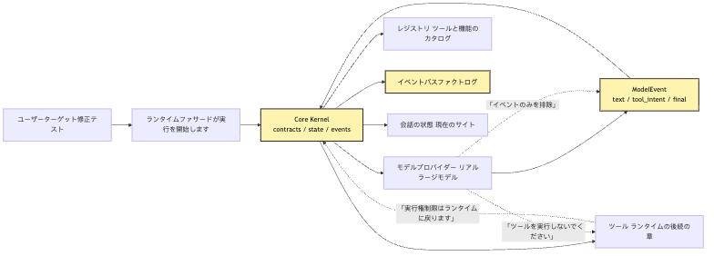
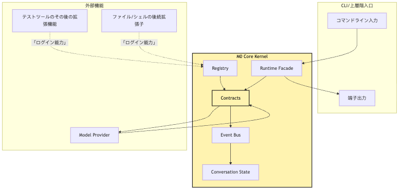
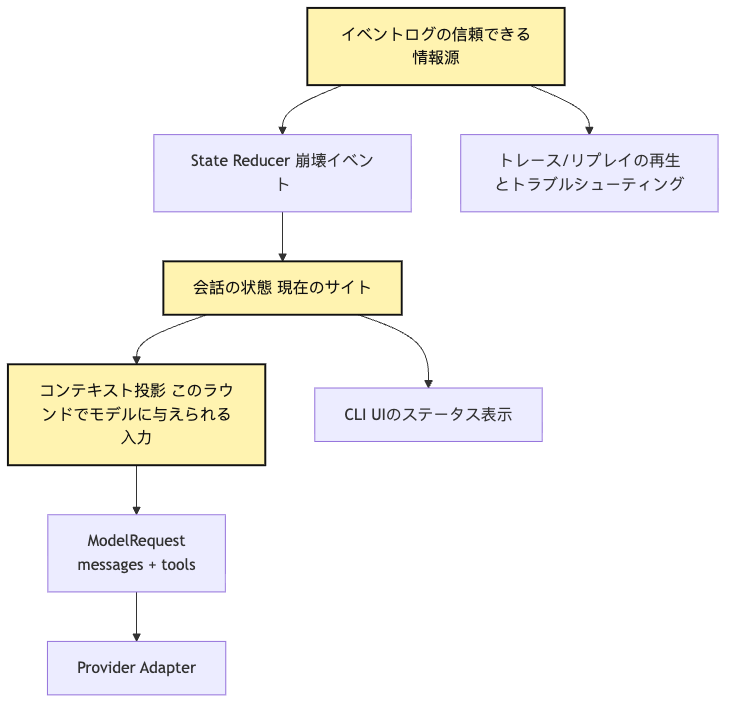
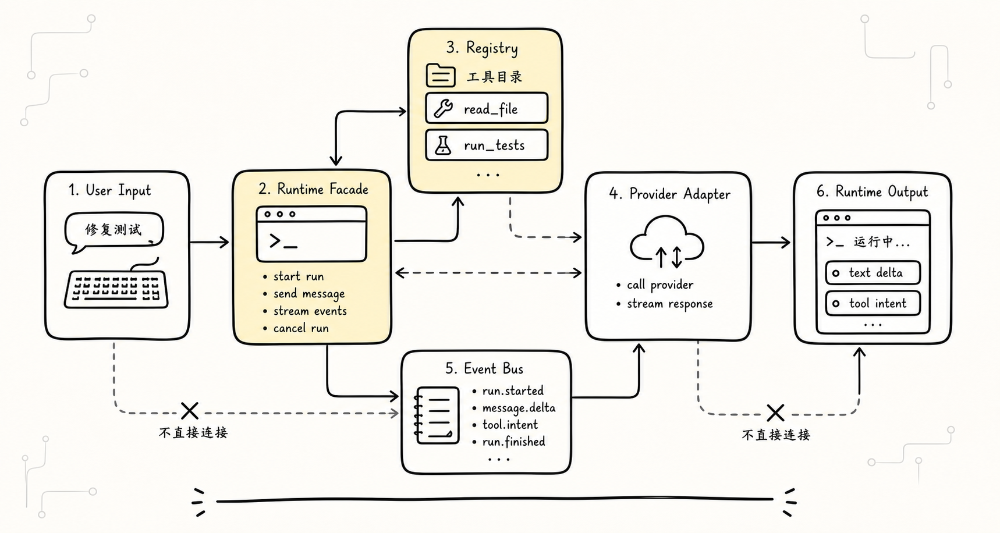
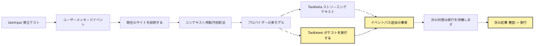

# M0 Core Kernel：本物の大規模モデルをシステムへ接続し、システムを乗っ取らせない

M0 Core Kernel は、実モデルの出力を ModelEvent と ToolIntent に正規化し、実行権、State、Event Log、Registry、Runtime Facade を core 側に残すための最小境界である。Provider は能力の入口だが、システムの中心ではない。

M0 Core Kernel は、実モデルの出力を ModelEvent と ToolIntent に正規化し、実行権、State、Event Log、Registry、Runtime Facade を core 側に残すための最小境界である。Provider は能力の入口だが、システムの中心ではない。

```text
M0 Core Kernel は、実モデルの出力を ModelEvent と ToolIntent に正規化し、実行権、State、Event Log、Registry、Runtime Facade を core 側に残すための最小境界である。Provider は能力の入口だが、システムの中心ではない。
```

M0 Core Kernel は、実モデルの出力を ModelEvent と ToolIntent に正規化し、実行権、State、Event Log、Registry、Runtime Facade を core 側に残すための最小境界である。Provider は能力の入口だが、システムの中心ではない。

M0 Core Kernel は、実モデルの出力を ModelEvent と ToolIntent に正規化し、実行権、State、Event Log、Registry、Runtime Facade を core 側に残すための最小境界である。Provider は能力の入口だが、システムの中心ではない。

M0 Core Kernel は、実モデルの出力を ModelEvent と ToolIntent に正規化し、実行権、State、Event Log、Registry、Runtime Facade を core 側に残すための最小境界である。Provider は能力の入口だが、システムの中心ではない。

```text
M0 Core Kernel は、実モデルの出力を ModelEvent と ToolIntent に正規化し、実行権、State、Event Log、Registry、Runtime Facade を core 側に残すための最小境界である。Provider は能力の入口だが、システムの中心ではない。
-> 必要な事実を記録する
-> 次の判断へ渡す
```

M0 Core Kernel は、実モデルの出力を ModelEvent と ToolIntent に正規化し、実行権、State、Event Log、Registry、Runtime Facade を core 側に残すための最小境界である。Provider は能力の入口だが、システムの中心ではない。

M0 Core Kernel は、実モデルの出力を ModelEvent と ToolIntent に正規化し、実行権、State、Event Log、Registry、Runtime Facade を core 側に残すための最小境界である。Provider は能力の入口だが、システムの中心ではない。

M0 Core Kernel は、実モデルの出力を ModelEvent と ToolIntent に正規化し、実行権、State、Event Log、Registry、Runtime Facade を core 側に残すための最小境界である。Provider は能力の入口だが、システムの中心ではない。

M0 Core Kernel は、実モデルの出力を ModelEvent と ToolIntent に正規化し、実行権、State、Event Log、Registry、Runtime Facade を core 側に残すための最小境界である。Provider は能力の入口だが、システムの中心ではない。

M0 Core Kernel は、実モデルの出力を ModelEvent と ToolIntent に正規化し、実行権、State、Event Log、Registry、Runtime Facade を core 側に残すための最小境界である。Provider は能力の入口だが、システムの中心ではない。

```text
M0 Core Kernel は、実モデルの出力を ModelEvent と ToolIntent に正規化し、実行権、State、Event Log、Registry、Runtime Facade を core 側に残すための最小境界である。Provider は能力の入口だが、システムの中心ではない。
-> 必要な事実を記録する
-> 次の判断へ渡す
```

M0 Core Kernel は、実モデルの出力を ModelEvent と ToolIntent に正規化し、実行権、State、Event Log、Registry、Runtime Facade を core 側に残すための最小境界である。Provider は能力の入口だが、システムの中心ではない。

```text
M0 Core Kernel は、実モデルの出力を ModelEvent と ToolIntent に正規化し、実行権、State、Event Log、Registry、Runtime Facade を core 側に残すための最小境界である。Provider は能力の入口だが、システムの中心ではない。
```

M0 Core Kernel は、実モデルの出力を ModelEvent と ToolIntent に正規化し、実行権、State、Event Log、Registry、Runtime Facade を core 側に残すための最小境界である。Provider は能力の入口だが、システムの中心ではない。

> M0 Core Kernel は、実モデルの出力を ModelEvent と ToolIntent に正規化し、実行権、State、Event Log、Registry、Runtime Facade を core 側に残すための最小境界である。Provider は能力の入口だが、システムの中心ではない。

M0 Core Kernel は、実モデルの出力を ModelEvent と ToolIntent に正規化し、実行権、State、Event Log、Registry、Runtime Facade を core 側に残すための最小境界である。Provider は能力の入口だが、システムの中心ではない。

M0 Core Kernel は、実モデルの出力を ModelEvent と ToolIntent に正規化し、実行権、State、Event Log、Registry、Runtime Facade を core 側に残すための最小境界である。Provider は能力の入口だが、システムの中心ではない。

```text
M0 Core Kernel は、実モデルの出力を ModelEvent と ToolIntent に正規化し、実行権、State、Event Log、Registry、Runtime Facade を core 側に残すための最小境界である。Provider は能力の入口だが、システムの中心ではない。
-> 必要な事実を記録する
-> 次の判断へ渡す
```

M0 Core Kernel は、実モデルの出力を ModelEvent と ToolIntent に正規化し、実行権、State、Event Log、Registry、Runtime Facade を core 側に残すための最小境界である。Provider は能力の入口だが、システムの中心ではない。

```text
M0 Core Kernel は、実モデルの出力を ModelEvent と ToolIntent に正規化し、実行権、State、Event Log、Registry、Runtime Facade を core 側に残すための最小境界である。Provider は能力の入口だが、システムの中心ではない。
-> 必要な事実を記録する
-> 次の判断へ渡す
```

M0 Core Kernel は、実モデルの出力を ModelEvent と ToolIntent に正規化し、実行権、State、Event Log、Registry、Runtime Facade を core 側に残すための最小境界である。Provider は能力の入口だが、システムの中心ではない。

M0 Core Kernel は、実モデルの出力を ModelEvent と ToolIntent に正規化し、実行権、State、Event Log、Registry、Runtime Facade を core 側に残すための最小境界である。Provider は能力の入口だが、システムの中心ではない。

## 問題の連鎖


M0 Core Kernel は、実モデルの出力を ModelEvent と ToolIntent に正規化し、実行権、State、Event Log、Registry、Runtime Facade を core 側に残すための最小境界である。Provider は能力の入口だが、システムの中心ではない。

```text
M0 Core Kernel は、実モデルの出力を ModelEvent と ToolIntent に正規化し、実行権、State、Event Log、Registry、Runtime Facade を core 側に残すための最小境界である。Provider は能力の入口だが、システムの中心ではない。
-> 必要な事実を記録する
-> 次の判断へ渡す
```

M0 Core Kernel は、実モデルの出力を ModelEvent と ToolIntent に正規化し、実行権、State、Event Log、Registry、Runtime Facade を core 側に残すための最小境界である。Provider は能力の入口だが、システムの中心ではない。



M0 Core Kernel は、実モデルの出力を ModelEvent と ToolIntent に正規化し、実行権、State、Event Log、Registry、Runtime Facade を core 側に残すための最小境界である。Provider は能力の入口だが、システムの中心ではない。

M0 Core Kernel は、実モデルの出力を ModelEvent と ToolIntent に正規化し、実行権、State、Event Log、Registry、Runtime Facade を core 側に残すための最小境界である。Provider は能力の入口だが、システムの中心ではない。

M0 Core Kernel は、実モデルの出力を ModelEvent と ToolIntent に正規化し、実行権、State、Event Log、Registry、Runtime Facade を core 側に残すための最小境界である。Provider は能力の入口だが、システムの中心ではない。

M0 Core Kernel は、実モデルの出力を ModelEvent と ToolIntent に正規化し、実行権、State、Event Log、Registry、Runtime Facade を core 側に残すための最小境界である。Provider は能力の入口だが、システムの中心ではない。

## 1. M0 が「まず API を通す」ではない理由

M0 Core Kernel は、実モデルの出力を ModelEvent と ToolIntent に正規化し、実行権、State、Event Log、Registry、Runtime Facade を core 側に残すための最小境界である。Provider は能力の入口だが、システムの中心ではない。

M0 Core Kernel は、実モデルの出力を ModelEvent と ToolIntent に正規化し、実行権、State、Event Log、Registry、Runtime Facade を core 側に残すための最小境界である。Provider は能力の入口だが、システムの中心ではない。

```ts
async function callModel(prompt: string) {
  const response = await client.messages.create({
    model: "some-model",
    messages: [{ role: "user", content: prompt }],
  });

  return response.text;
}
```

M0 Core Kernel は、実モデルの出力を ModelEvent と ToolIntent に正規化し、実行権、State、Event Log、Registry、Runtime Facade を core 側に残すための最小境界である。Provider は能力の入口だが、システムの中心ではない。

M0 Core Kernel は、実モデルの出力を ModelEvent と ToolIntent に正規化し、実行権、State、Event Log、Registry、Runtime Facade を core 側に残すための最小境界である。Provider は能力の入口だが、システムの中心ではない。

```ts
for await (const chunk of stream) {
  process.stdout.write(chunk.text);
}
```

M0 Core Kernel は、実モデルの出力を ModelEvent と ToolIntent に正規化し、実行権、State、Event Log、Registry、Runtime Facade を core 側に残すための最小境界である。Provider は能力の入口だが、システムの中心ではない。

```ts
if (chunk.tool_call) {
  await runTool(chunk.tool_call.name, chunk.tool_call.args);
}
```

M0 Core Kernel は、実モデルの出力を ModelEvent と ToolIntent に正規化し、実行権、State、Event Log、Registry、Runtime Facade を core 側に残すための最小境界である。Provider は能力の入口だが、システムの中心ではない。

M0 Core Kernel は、実モデルの出力を ModelEvent と ToolIntent に正規化し、実行権、State、Event Log、Registry、Runtime Facade を core 側に残すための最小境界である。Provider は能力の入口だが、システムの中心ではない。

M0 Core Kernel は、実モデルの出力を ModelEvent と ToolIntent に正規化し、実行権、State、Event Log、Registry、Runtime Facade を core 側に残すための最小境界である。Provider は能力の入口だが、システムの中心ではない。

```text
M0 Core Kernel は、実モデルの出力を ModelEvent と ToolIntent に正規化し、実行権、State、Event Log、Registry、Runtime Facade を core 側に残すための最小境界である。Provider は能力の入口だが、システムの中心ではない。
-> 必要な事実を記録する
-> 次の判断へ渡す
```

M0 Core Kernel は、実モデルの出力を ModelEvent と ToolIntent に正規化し、実行権、State、Event Log、Registry、Runtime Facade を core 側に残すための最小境界である。Provider は能力の入口だが、システムの中心ではない。

M0 Core Kernel は、実モデルの出力を ModelEvent と ToolIntent に正規化し、実行権、State、Event Log、Registry、Runtime Facade を core 側に残すための最小境界である。Provider は能力の入口だが、システムの中心ではない。

M0 Core Kernel は、実モデルの出力を ModelEvent と ToolIntent に正規化し、実行権、State、Event Log、Registry、Runtime Facade を core 側に残すための最小境界である。Provider は能力の入口だが、システムの中心ではない。

```text
M0 Core Kernel は、実モデルの出力を ModelEvent と ToolIntent に正規化し、実行権、State、Event Log、Registry、Runtime Facade を core 側に残すための最小境界である。Provider は能力の入口だが、システムの中心ではない。
-> 必要な事実を記録する
-> 次の判断へ渡す
```

M0 Core Kernel は、実モデルの出力を ModelEvent と ToolIntent に正規化し、実行権、State、Event Log、Registry、Runtime Facade を core 側に残すための最小境界である。Provider は能力の入口だが、システムの中心ではない。

```text
M0 Core Kernel は、実モデルの出力を ModelEvent と ToolIntent に正規化し、実行権、State、Event Log、Registry、Runtime Facade を core 側に残すための最小境界である。Provider は能力の入口だが、システムの中心ではない。
-> 必要な事実を記録する
-> 次の判断へ渡す
```

M0 Core Kernel は、実モデルの出力を ModelEvent と ToolIntent に正規化し、実行権、State、Event Log、Registry、Runtime Facade を core 側に残すための最小境界である。Provider は能力の入口だが、システムの中心ではない。

M0 Core Kernel は、実モデルの出力を ModelEvent と ToolIntent に正規化し、実行権、State、Event Log、Registry、Runtime Facade を core 側に残すための最小境界である。Provider は能力の入口だが、システムの中心ではない。

M0 Core Kernel は、実モデルの出力を ModelEvent と ToolIntent に正規化し、実行権、State、Event Log、Registry、Runtime Facade を core 側に残すための最小境界である。Provider は能力の入口だが、システムの中心ではない。

M0 Core Kernel は、実モデルの出力を ModelEvent と ToolIntent に正規化し、実行権、State、Event Log、Registry、Runtime Facade を core 側に残すための最小境界である。Provider は能力の入口だが、システムの中心ではない。

M0 Core Kernel は、実モデルの出力を ModelEvent と ToolIntent に正規化し、実行権、State、Event Log、Registry、Runtime Facade を core 側に残すための最小境界である。Provider は能力の入口だが、システムの中心ではない。

```text
M0 Core Kernel は、実モデルの出力を ModelEvent と ToolIntent に正規化し、実行権、State、Event Log、Registry、Runtime Facade を core 側に残すための最小境界である。Provider は能力の入口だが、システムの中心ではない。
```

M0 Core Kernel は、実モデルの出力を ModelEvent と ToolIntent に正規化し、実行権、State、Event Log、Registry、Runtime Facade を core 側に残すための最小境界である。Provider は能力の入口だが、システムの中心ではない。

M0 Core Kernel は、実モデルの出力を ModelEvent と ToolIntent に正規化し、実行権、State、Event Log、Registry、Runtime Facade を core 側に残すための最小境界である。Provider は能力の入口だが、システムの中心ではない。

## 2. Core Kernel の「核」はどこにあるのか

M0 Core Kernel は、実モデルの出力を ModelEvent と ToolIntent に正規化し、実行権、State、Event Log、Registry、Runtime Facade を core 側に残すための最小境界である。Provider は能力の入口だが、システムの中心ではない。

M0 Core Kernel は、実モデルの出力を ModelEvent と ToolIntent に正規化し、実行権、State、Event Log、Registry、Runtime Facade を core 側に残すための最小境界である。Provider は能力の入口だが、システムの中心ではない。

```text
M0 Core Kernel は、実モデルの出力を ModelEvent と ToolIntent に正規化し、実行権、State、Event Log、Registry、Runtime Facade を core 側に残すための最小境界である。Provider は能力の入口だが、システムの中心ではない。
-> 必要な事実を記録する
-> 次の判断へ渡す
```

M0 Core Kernel は、実モデルの出力を ModelEvent と ToolIntent に正規化し、実行権、State、Event Log、Registry、Runtime Facade を core 側に残すための最小境界である。Provider は能力の入口だが、システムの中心ではない。

```text
M0 Core Kernel は、実モデルの出力を ModelEvent と ToolIntent に正規化し、実行権、State、Event Log、Registry、Runtime Facade を core 側に残すための最小境界である。Provider は能力の入口だが、システムの中心ではない。
-> 必要な事実を記録する
-> 次の判断へ渡す
```

M0 Core Kernel は、実モデルの出力を ModelEvent と ToolIntent に正規化し、実行権、State、Event Log、Registry、Runtime Facade を core 側に残すための最小境界である。Provider は能力の入口だが、システムの中心ではない。

M0 Core Kernel は、実モデルの出力を ModelEvent と ToolIntent に正規化し、実行権、State、Event Log、Registry、Runtime Facade を core 側に残すための最小境界である。Provider は能力の入口だが、システムの中心ではない。

M0 Core Kernel は、実モデルの出力を ModelEvent と ToolIntent に正規化し、実行権、State、Event Log、Registry、Runtime Facade を core 側に残すための最小境界である。Provider は能力の入口だが、システムの中心ではない。



M0 Core Kernel は、実モデルの出力を ModelEvent と ToolIntent に正規化し、実行権、State、Event Log、Registry、Runtime Facade を core 側に残すための最小境界である。Provider は能力の入口だが、システムの中心ではない。

M0 Core Kernel は、実モデルの出力を ModelEvent と ToolIntent に正規化し、実行権、State、Event Log、Registry、Runtime Facade を core 側に残すための最小境界である。Provider は能力の入口だが、システムの中心ではない。

M0 Core Kernel は、実モデルの出力を ModelEvent と ToolIntent に正規化し、実行権、State、Event Log、Registry、Runtime Facade を core 側に残すための最小境界である。Provider は能力の入口だが、システムの中心ではない。

```text
M0 Core Kernel は、実モデルの出力を ModelEvent と ToolIntent に正規化し、実行権、State、Event Log、Registry、Runtime Facade を core 側に残すための最小境界である。Provider は能力の入口だが、システムの中心ではない。
-> 必要な事実を記録する
-> 次の判断へ渡す
```

M0 Core Kernel は、実モデルの出力を ModelEvent と ToolIntent に正規化し、実行権、State、Event Log、Registry、Runtime Facade を core 側に残すための最小境界である。Provider は能力の入口だが、システムの中心ではない。

```text
M0 Core Kernel は、実モデルの出力を ModelEvent と ToolIntent に正規化し、実行権、State、Event Log、Registry、Runtime Facade を core 側に残すための最小境界である。Provider は能力の入口だが、システムの中心ではない。
-> 必要な事実を記録する
-> 次の判断へ渡す
```

M0 Core Kernel は、実モデルの出力を ModelEvent と ToolIntent に正規化し、実行権、State、Event Log、Registry、Runtime Facade を core 側に残すための最小境界である。Provider は能力の入口だが、システムの中心ではない。

M0 Core Kernel は、実モデルの出力を ModelEvent と ToolIntent に正規化し、実行権、State、Event Log、Registry、Runtime Facade を core 側に残すための最小境界である。Provider は能力の入口だが、システムの中心ではない。

## 3. Contracts：モデル出力はまずシステムオブジェクトになるべき

M0 Core Kernel は、実モデルの出力を ModelEvent と ToolIntent に正規化し、実行権、State、Event Log、Registry、Runtime Facade を core 側に残すための最小境界である。Provider は能力の入口だが、システムの中心ではない。

M0 Core Kernel は、実モデルの出力を ModelEvent と ToolIntent に正規化し、実行権、State、Event Log、Registry、Runtime Facade を core 側に残すための最小境界である。Provider は能力の入口だが、システムの中心ではない。

```text
M0 Core Kernel は、実モデルの出力を ModelEvent と ToolIntent に正規化し、実行権、State、Event Log、Registry、Runtime Facade を core 側に残すための最小境界である。Provider は能力の入口だが、システムの中心ではない。
-> 必要な事実を記録する
-> 次の判断へ渡す
```

M0 Core Kernel は、実モデルの出力を ModelEvent と ToolIntent に正規化し、実行権、State、Event Log、Registry、Runtime Facade を core 側に残すための最小境界である。Provider は能力の入口だが、システムの中心ではない。

M0 Core Kernel は、実モデルの出力を ModelEvent と ToolIntent に正規化し、実行権、State、Event Log、Registry、Runtime Facade を core 側に残すための最小境界である。Provider は能力の入口だが、システムの中心ではない。

```ts
type ModelEvent =
  | ModelTextDelta
  | ModelToolIntent
  | ModelUsage
  | ModelFinal
  | ModelError;

type ModelTextDelta = {
  type: "model.text.delta";
  runId: string;
  text: string;
};

type ModelToolIntent = {
  type: "model.tool.intent";
  runId: string;
  intentId: string;
  toolName: string;
  input: unknown;
  providerRef?: {
    provider: string;
    rawId?: string;
  };
};

type ModelFinal = {
  type: "model.final";
  runId: string;
  reason: "stop" | "tool_intent" | "length" | "error";
};
```

M0 Core Kernel は、実モデルの出力を ModelEvent と ToolIntent に正規化し、実行権、State、Event Log、Registry、Runtime Facade を core 側に残すための最小境界である。Provider は能力の入口だが、システムの中心ではない。

```text
M0 Core Kernel は、実モデルの出力を ModelEvent と ToolIntent に正規化し、実行権、State、Event Log、Registry、Runtime Facade を core 側に残すための最小境界である。Provider は能力の入口だが、システムの中心ではない。
-> 必要な事実を記録する
-> 次の判断へ渡す
```

M0 Core Kernel は、実モデルの出力を ModelEvent と ToolIntent に正規化し、実行権、State、Event Log、Registry、Runtime Facade を core 側に残すための最小境界である。Provider は能力の入口だが、システムの中心ではない。

M0 Core Kernel は、実モデルの出力を ModelEvent と ToolIntent に正規化し、実行権、State、Event Log、Registry、Runtime Facade を core 側に残すための最小境界である。Provider は能力の入口だが、システムの中心ではない。

M0 Core Kernel は、実モデルの出力を ModelEvent と ToolIntent に正規化し、実行権、State、Event Log、Registry、Runtime Facade を core 側に残すための最小境界である。Provider は能力の入口だが、システムの中心ではない。

M0 Core Kernel は、実モデルの出力を ModelEvent と ToolIntent に正規化し、実行権、State、Event Log、Registry、Runtime Facade を core 側に残すための最小境界である。Provider は能力の入口だが、システムの中心ではない。

M0 Core Kernel は、実モデルの出力を ModelEvent と ToolIntent に正規化し、実行権、State、Event Log、Registry、Runtime Facade を core 側に残すための最小境界である。Provider は能力の入口だが、システムの中心ではない。

M0 Core Kernel は、実モデルの出力を ModelEvent と ToolIntent に正規化し、実行権、State、Event Log、Registry、Runtime Facade を core 側に残すための最小境界である。Provider は能力の入口だが、システムの中心ではない。

M0 Core Kernel は、実モデルの出力を ModelEvent と ToolIntent に正規化し、実行権、State、Event Log、Registry、Runtime Facade を core 側に残すための最小境界である。Provider は能力の入口だが、システムの中心ではない。

M0 Core Kernel は、実モデルの出力を ModelEvent と ToolIntent に正規化し、実行権、State、Event Log、Registry、Runtime Facade を core 側に残すための最小境界である。Provider は能力の入口だが、システムの中心ではない。

M0 Core Kernel は、実モデルの出力を ModelEvent と ToolIntent に正規化し、実行権、State、Event Log、Registry、Runtime Facade を core 側に残すための最小境界である。Provider は能力の入口だが、システムの中心ではない。

M0 Core Kernel は、実モデルの出力を ModelEvent と ToolIntent に正規化し、実行権、State、Event Log、Registry、Runtime Facade を core 側に残すための最小境界である。Provider は能力の入口だが、システムの中心ではない。

```ts
const events: ModelEvent[] = [
  { type: "model.text.delta", runId, text: "まずテストを実行する必要があります。" },
  {
    type: "model.tool.intent",
    runId,
    intentId: "intent_1",
    toolName: "run_tests",
    input: { command: "npm test" },
  },
  { type: "model.final", runId, reason: "tool_intent" },
];
```

M0 Core Kernel は、実モデルの出力を ModelEvent と ToolIntent に正規化し、実行権、State、Event Log、Registry、Runtime Facade を core 側に残すための最小境界である。Provider は能力の入口だが、システムの中心ではない。

M0 Core Kernel は、実モデルの出力を ModelEvent と ToolIntent に正規化し、実行権、State、Event Log、Registry、Runtime Facade を core 側に残すための最小境界である。Provider は能力の入口だが、システムの中心ではない。

M0 Core Kernel は、実モデルの出力を ModelEvent と ToolIntent に正規化し、実行権、State、Event Log、Registry、Runtime Facade を core 側に残すための最小境界である。Provider は能力の入口だが、システムの中心ではない。

M0 Core Kernel は、実モデルの出力を ModelEvent と ToolIntent に正規化し、実行権、State、Event Log、Registry、Runtime Facade を core 側に残すための最小境界である。Provider は能力の入口だが、システムの中心ではない。

```json
{
  "toolName": "run_tests",
  "input": {
    "command": "npm test"
  }
}
```

M0 Core Kernel は、実モデルの出力を ModelEvent と ToolIntent に正規化し、実行権、State、Event Log、Registry、Runtime Facade を core 側に残すための最小境界である。Provider は能力の入口だが、システムの中心ではない。

M0 Core Kernel は、実モデルの出力を ModelEvent と ToolIntent に正規化し、実行権、State、Event Log、Registry、Runtime Facade を core 側に残すための最小境界である。Provider は能力の入口だが、システムの中心ではない。

M0 Core Kernel は、実モデルの出力を ModelEvent と ToolIntent に正規化し、実行権、State、Event Log、Registry、Runtime Facade を core 側に残すための最小境界である。Provider は能力の入口だが、システムの中心ではない。

M0 Core Kernel は、実モデルの出力を ModelEvent と ToolIntent に正規化し、実行権、State、Event Log、Registry、Runtime Facade を core 側に残すための最小境界である。Provider は能力の入口だが、システムの中心ではない。

M0 Core Kernel は、実モデルの出力を ModelEvent と ToolIntent に正規化し、実行権、State、Event Log、Registry、Runtime Facade を core 側に残すための最小境界である。Provider は能力の入口だが、システムの中心ではない。

M0 Core Kernel は、実モデルの出力を ModelEvent と ToolIntent に正規化し、実行権、State、Event Log、Registry、Runtime Facade を core 側に残すための最小境界である。Provider は能力の入口だが、システムの中心ではない。

M0 Core Kernel は、実モデルの出力を ModelEvent と ToolIntent に正規化し、実行権、State、Event Log、Registry、Runtime Facade を core 側に残すための最小境界である。Provider は能力の入口だが、システムの中心ではない。

## 4. Provider：翻訳層であってシステム中心ではない

M0 Core Kernel は、実モデルの出力を ModelEvent と ToolIntent に正規化し、実行権、State、Event Log、Registry、Runtime Facade を core 側に残すための最小境界である。Provider は能力の入口だが、システムの中心ではない。

```text
M0 Core Kernel は、実モデルの出力を ModelEvent と ToolIntent に正規化し、実行権、State、Event Log、Registry、Runtime Facade を core 側に残すための最小境界である。Provider は能力の入口だが、システムの中心ではない。
-> 必要な事実を記録する
-> 次の判断へ渡す
```

M0 Core Kernel は、実モデルの出力を ModelEvent と ToolIntent に正規化し、実行権、State、Event Log、Registry、Runtime Facade を core 側に残すための最小境界である。Provider は能力の入口だが、システムの中心ではない。

```text
M0 Core Kernel は、実モデルの出力を ModelEvent と ToolIntent に正規化し、実行権、State、Event Log、Registry、Runtime Facade を core 側に残すための最小境界である。Provider は能力の入口だが、システムの中心ではない。
-> 必要な事実を記録する
-> 次の判断へ渡す
```

M0 Core Kernel は、実モデルの出力を ModelEvent と ToolIntent に正規化し、実行権、State、Event Log、Registry、Runtime Facade を core 側に残すための最小境界である。Provider は能力の入口だが、システムの中心ではない。

```ts
type ModelProvider = {
  name: string;
  capabilities: ProviderCapabilities;

  stream(request: ModelRequest): AsyncIterable<ModelEvent>;
};

type ModelRequest = {
  runId: string;
  messages: ModelMessage[];
  tools: ModelToolSchema[];
  signal?: AbortSignal;
  metadata?: Record<string, string>;
};
```

M0 Core Kernel は、実モデルの出力を ModelEvent と ToolIntent に正規化し、実行権、State、Event Log、Registry、Runtime Facade を core 側に残すための最小境界である。Provider は能力の入口だが、システムの中心ではない。

```text
M0 Core Kernel は、実モデルの出力を ModelEvent と ToolIntent に正規化し、実行権、State、Event Log、Registry、Runtime Facade を core 側に残すための最小境界である。Provider は能力の入口だが、システムの中心ではない。
```

M0 Core Kernel は、実モデルの出力を ModelEvent と ToolIntent に正規化し、実行権、State、Event Log、Registry、Runtime Facade を core 側に残すための最小境界である。Provider は能力の入口だが、システムの中心ではない。

M0 Core Kernel は、実モデルの出力を ModelEvent と ToolIntent に正規化し、実行権、State、Event Log、Registry、Runtime Facade を core 側に残すための最小境界である。Provider は能力の入口だが、システムの中心ではない。

```text
M0 Core Kernel は、実モデルの出力を ModelEvent と ToolIntent に正規化し、実行権、State、Event Log、Registry、Runtime Facade を core 側に残すための最小境界である。Provider は能力の入口だが、システムの中心ではない。
-> 必要な事実を記録する
-> 次の判断へ渡す
```

M0 Core Kernel は、実モデルの出力を ModelEvent と ToolIntent に正規化し、実行権、State、Event Log、Registry、Runtime Facade を core 側に残すための最小境界である。Provider は能力の入口だが、システムの中心ではない。

M0 Core Kernel は、実モデルの出力を ModelEvent と ToolIntent に正規化し、実行権、State、Event Log、Registry、Runtime Facade を core 側に残すための最小境界である。Provider は能力の入口だが、システムの中心ではない。

M0 Core Kernel は、実モデルの出力を ModelEvent と ToolIntent に正規化し、実行権、State、Event Log、Registry、Runtime Facade を core 側に残すための最小境界である。Provider は能力の入口だが、システムの中心ではない。


M0 Core Kernel は、実モデルの出力を ModelEvent と ToolIntent に正規化し、実行権、State、Event Log、Registry、Runtime Facade を core 側に残すための最小境界である。Provider は能力の入口だが、システムの中心ではない。

M0 Core Kernel は、実モデルの出力を ModelEvent と ToolIntent に正規化し、実行権、State、Event Log、Registry、Runtime Facade を core 側に残すための最小境界である。Provider は能力の入口だが、システムの中心ではない。

M0 Core Kernel は、実モデルの出力を ModelEvent と ToolIntent に正規化し、実行権、State、Event Log、Registry、Runtime Facade を core 側に残すための最小境界である。Provider は能力の入口だが、システムの中心ではない。

M0 Core Kernel は、実モデルの出力を ModelEvent と ToolIntent に正規化し、実行権、State、Event Log、Registry、Runtime Facade を core 側に残すための最小境界である。Provider は能力の入口だが、システムの中心ではない。

M0 Core Kernel は、実モデルの出力を ModelEvent と ToolIntent に正規化し、実行権、State、Event Log、Registry、Runtime Facade を core 側に残すための最小境界である。Provider は能力の入口だが、システムの中心ではない。

M0 Core Kernel は、実モデルの出力を ModelEvent と ToolIntent に正規化し、実行権、State、Event Log、Registry、Runtime Facade を core 側に残すための最小境界である。Provider は能力の入口だが、システムの中心ではない。

M0 Core Kernel は、実モデルの出力を ModelEvent と ToolIntent に正規化し、実行権、State、Event Log、Registry、Runtime Facade を core 側に残すための最小境界である。Provider は能力の入口だが、システムの中心ではない。

## 5. Registry：能力は先に登録し、実行中に推測しない

M0 Core Kernel は、実モデルの出力を ModelEvent と ToolIntent に正規化し、実行権、State、Event Log、Registry、Runtime Facade を core 側に残すための最小境界である。Provider は能力の入口だが、システムの中心ではない。

M0 Core Kernel は、実モデルの出力を ModelEvent と ToolIntent に正規化し、実行権、State、Event Log、Registry、Runtime Facade を core 側に残すための最小境界である。Provider は能力の入口だが、システムの中心ではない。

```ts
const tools = {
  read_file,
  run_command,
  edit_file,
};
```

M0 Core Kernel は、実モデルの出力を ModelEvent と ToolIntent に正規化し、実行権、State、Event Log、Registry、Runtime Facade を core 側に残すための最小境界である。Provider は能力の入口だが、システムの中心ではない。

M0 Core Kernel は、実モデルの出力を ModelEvent と ToolIntent に正規化し、実行権、State、Event Log、Registry、Runtime Facade を core 側に残すための最小境界である。Provider は能力の入口だが、システムの中心ではない。

M0 Core Kernel は、実モデルの出力を ModelEvent と ToolIntent に正規化し、実行権、State、Event Log、Registry、Runtime Facade を core 側に残すための最小境界である。Provider は能力の入口だが、システムの中心ではない。

M0 Core Kernel は、実モデルの出力を ModelEvent と ToolIntent に正規化し、実行権、State、Event Log、Registry、Runtime Facade を core 側に残すための最小境界である。Provider は能力の入口だが、システムの中心ではない。

```ts
type ToolDefinition = {
  name: string;
  description: string;
  inputSchema: JsonSchema;
  risk: "read" | "write" | "execute" | "network";
  isReadOnly: boolean;
  isConcurrencySafe: boolean;
  visibility: ToolVisibilityPolicy;
};
```

M0 Core Kernel は、実モデルの出力を ModelEvent と ToolIntent に正規化し、実行権、State、Event Log、Registry、Runtime Facade を core 側に残すための最小境界である。Provider は能力の入口だが、システムの中心ではない。

M0 Core Kernel は、実モデルの出力を ModelEvent と ToolIntent に正規化し、実行権、State、Event Log、Registry、Runtime Facade を core 側に残すための最小境界である。Provider は能力の入口だが、システムの中心ではない。

```text
M0 Core Kernel は、実モデルの出力を ModelEvent と ToolIntent に正規化し、実行権、State、Event Log、Registry、Runtime Facade を core 側に残すための最小境界である。Provider は能力の入口だが、システムの中心ではない。
-> 必要な事実を記録する
-> 次の判断へ渡す
```

M0 Core Kernel は、実モデルの出力を ModelEvent と ToolIntent に正規化し、実行権、State、Event Log、Registry、Runtime Facade を core 側に残すための最小境界である。Provider は能力の入口だが、システムの中心ではない。

M0 Core Kernel は、実モデルの出力を ModelEvent と ToolIntent に正規化し、実行権、State、Event Log、Registry、Runtime Facade を core 側に残すための最小境界である。Provider は能力の入口だが、システムの中心ではない。

```text
M0 Core Kernel は、実モデルの出力を ModelEvent と ToolIntent に正規化し、実行権、State、Event Log、Registry、Runtime Facade を core 側に残すための最小境界である。Provider は能力の入口だが、システムの中心ではない。
-> 必要な事実を記録する
-> 次の判断へ渡す
```

M0 Core Kernel は、実モデルの出力を ModelEvent と ToolIntent に正規化し、実行権、State、Event Log、Registry、Runtime Facade を core 側に残すための最小境界である。Provider は能力の入口だが、システムの中心ではない。

```text
M0 Core Kernel は、実モデルの出力を ModelEvent と ToolIntent に正規化し、実行権、State、Event Log、Registry、Runtime Facade を core 側に残すための最小境界である。Provider は能力の入口だが、システムの中心ではない。
```

M0 Core Kernel は、実モデルの出力を ModelEvent と ToolIntent に正規化し、実行権、State、Event Log、Registry、Runtime Facade を core 側に残すための最小境界である。Provider は能力の入口だが、システムの中心ではない。


M0 Core Kernel は、実モデルの出力を ModelEvent と ToolIntent に正規化し、実行権、State、Event Log、Registry、Runtime Facade を core 側に残すための最小境界である。Provider は能力の入口だが、システムの中心ではない。

```text
M0 Core Kernel は、実モデルの出力を ModelEvent と ToolIntent に正規化し、実行権、State、Event Log、Registry、Runtime Facade を core 側に残すための最小境界である。Provider は能力の入口だが、システムの中心ではない。
```

M0 Core Kernel は、実モデルの出力を ModelEvent と ToolIntent に正規化し、実行権、State、Event Log、Registry、Runtime Facade を core 側に残すための最小境界である。Provider は能力の入口だが、システムの中心ではない。

M0 Core Kernel は、実モデルの出力を ModelEvent と ToolIntent に正規化し、実行権、State、Event Log、Registry、Runtime Facade を core 側に残すための最小境界である。Provider は能力の入口だが、システムの中心ではない。

M0 Core Kernel は、実モデルの出力を ModelEvent と ToolIntent に正規化し、実行権、State、Event Log、Registry、Runtime Facade を core 側に残すための最小境界である。Provider は能力の入口だが、システムの中心ではない。

M0 Core Kernel は、実モデルの出力を ModelEvent と ToolIntent に正規化し、実行権、State、Event Log、Registry、Runtime Facade を core 側に残すための最小境界である。Provider は能力の入口だが、システムの中心ではない。

## 6. Event Bus：事実はまずログに発生させる

M0 Core Kernel は、実モデルの出力を ModelEvent と ToolIntent に正規化し、実行権、State、Event Log、Registry、Runtime Facade を core 側に残すための最小境界である。Provider は能力の入口だが、システムの中心ではない。

```text
M0 Core Kernel は、実モデルの出力を ModelEvent と ToolIntent に正規化し、実行権、State、Event Log、Registry、Runtime Facade を core 側に残すための最小境界である。Provider は能力の入口だが、システムの中心ではない。
-> 必要な事実を記録する
-> 次の判断へ渡す
```

M0 Core Kernel は、実モデルの出力を ModelEvent と ToolIntent に正規化し、実行権、State、Event Log、Registry、Runtime Facade を core 側に残すための最小境界である。Provider は能力の入口だが、システムの中心ではない。

M0 Core Kernel は、実モデルの出力を ModelEvent と ToolIntent に正規化し、実行権、State、Event Log、Registry、Runtime Facade を core 側に残すための最小境界である。Provider は能力の入口だが、システムの中心ではない。

M0 Core Kernel は、実モデルの出力を ModelEvent と ToolIntent に正規化し、実行権、State、Event Log、Registry、Runtime Facade を core 側に残すための最小境界である。Provider は能力の入口だが、システムの中心ではない。

M0 Core Kernel は、実モデルの出力を ModelEvent と ToolIntent に正規化し、実行権、State、Event Log、Registry、Runtime Facade を core 側に残すための最小境界である。Provider は能力の入口だが、システムの中心ではない。

```ts
type RuntimeEvent =
  | UserMessageEvent
  | RunStartedEvent
  | ModelEvent
  | ToolIntentRegisteredEvent
  | StateUpdatedEvent
  | RunFinishedEvent;

type EventBus = {
  append(event: RuntimeEvent): void;
  subscribe(handler: (event: RuntimeEvent) => void): () => void;
  snapshot(): RuntimeEvent[];
};
```

M0 Core Kernel は、実モデルの出力を ModelEvent と ToolIntent に正規化し、実行権、State、Event Log、Registry、Runtime Facade を core 側に残すための最小境界である。Provider は能力の入口だが、システムの中心ではない。

```text
M0 Core Kernel は、実モデルの出力を ModelEvent と ToolIntent に正規化し、実行権、State、Event Log、Registry、Runtime Facade を core 側に残すための最小境界である。Provider は能力の入口だが、システムの中心ではない。
-> 必要な事実を記録する
-> 次の判断へ渡す
```

M0 Core Kernel は、実モデルの出力を ModelEvent と ToolIntent に正規化し、実行権、State、Event Log、Registry、Runtime Facade を core 側に残すための最小境界である。Provider は能力の入口だが、システムの中心ではない。

M0 Core Kernel は、実モデルの出力を ModelEvent と ToolIntent に正規化し、実行権、State、Event Log、Registry、Runtime Facade を core 側に残すための最小境界である。Provider は能力の入口だが、システムの中心ではない。

```ts
state.messages.push(modelMessage);
state.lastToolCall = toolCall;
state.status = "running_tool";
```

M0 Core Kernel は、実モデルの出力を ModelEvent と ToolIntent に正規化し、実行権、State、Event Log、Registry、Runtime Facade を core 側に残すための最小境界である。Provider は能力の入口だが、システムの中心ではない。

```text
M0 Core Kernel は、実モデルの出力を ModelEvent と ToolIntent に正規化し、実行権、State、Event Log、Registry、Runtime Facade を core 側に残すための最小境界である。Provider は能力の入口だが、システムの中心ではない。
-> 必要な事実を記録する
-> 次の判断へ渡す
```

M0 Core Kernel は、実モデルの出力を ModelEvent と ToolIntent に正規化し、実行権、State、Event Log、Registry、Runtime Facade を core 側に残すための最小境界である。Provider は能力の入口だが、システムの中心ではない。

```ts
eventBus.append({
  type: "model.tool.intent",
  runId,
  intentId,
  toolName: "run_tests",
  input: { command: "npm test" },
});

state = reduceConversationState(eventBus.snapshot());
```

M0 Core Kernel は、実モデルの出力を ModelEvent と ToolIntent に正規化し、実行権、State、Event Log、Registry、Runtime Facade を core 側に残すための最小境界である。Provider は能力の入口だが、システムの中心ではない。

M0 Core Kernel は、実モデルの出力を ModelEvent と ToolIntent に正規化し、実行権、State、Event Log、Registry、Runtime Facade を core 側に残すための最小境界である。Provider は能力の入口だが、システムの中心ではない。

M0 Core Kernel は、実モデルの出力を ModelEvent と ToolIntent に正規化し、実行権、State、Event Log、Registry、Runtime Facade を core 側に残すための最小境界である。Provider は能力の入口だが、システムの中心ではない。

```text
M0 Core Kernel は、実モデルの出力を ModelEvent と ToolIntent に正規化し、実行権、State、Event Log、Registry、Runtime Facade を core 側に残すための最小境界である。Provider は能力の入口だが、システムの中心ではない。
-> 必要な事実を記録する
-> 次の判断へ渡す
```

M0 Core Kernel は、実モデルの出力を ModelEvent と ToolIntent に正規化し、実行権、State、Event Log、Registry、Runtime Facade を core 側に残すための最小境界である。Provider は能力の入口だが、システムの中心ではない。

M0 Core Kernel は、実モデルの出力を ModelEvent と ToolIntent に正規化し、実行権、State、Event Log、Registry、Runtime Facade を core 側に残すための最小境界である。Provider は能力の入口だが、システムの中心ではない。

## 7. Conversation State：State は事実そのものではなく投影である


M0 Core Kernel は、実モデルの出力を ModelEvent と ToolIntent に正規化し、実行権、State、Event Log、Registry、Runtime Facade を core 側に残すための最小境界である。Provider は能力の入口だが、システムの中心ではない。

M0 Core Kernel は、実モデルの出力を ModelEvent と ToolIntent に正規化し、実行権、State、Event Log、Registry、Runtime Facade を core 側に残すための最小境界である。Provider は能力の入口だが、システムの中心ではない。

```ts
const messages = [
  { role: "user", content: "テスト修復を手伝って" },
  { role: "assistant", content: "テストを実行する必要があります" },
  { role: "tool", content: "テスト失敗ログ..." },
];
```

M0 Core Kernel は、実モデルの出力を ModelEvent と ToolIntent に正規化し、実行権、State、Event Log、Registry、Runtime Facade を core 側に残すための最小境界である。Provider は能力の入口だが、システムの中心ではない。

M0 Core Kernel は、実モデルの出力を ModelEvent と ToolIntent に正規化し、実行権、State、Event Log、Registry、Runtime Facade を core 側に残すための最小境界である。Provider は能力の入口だが、システムの中心ではない。

M0 Core Kernel は、実モデルの出力を ModelEvent と ToolIntent に正規化し、実行権、State、Event Log、Registry、Runtime Facade を core 側に残すための最小境界である。Provider は能力の入口だが、システムの中心ではない。

```text
M0 Core Kernel は、実モデルの出力を ModelEvent と ToolIntent に正規化し、実行権、State、Event Log、Registry、Runtime Facade を core 側に残すための最小境界である。Provider は能力の入口だが、システムの中心ではない。
-> 必要な事実を記録する
-> 次の判断へ渡す
```

M0 Core Kernel は、実モデルの出力を ModelEvent と ToolIntent に正規化し、実行権、State、Event Log、Registry、Runtime Facade を core 側に残すための最小境界である。Provider は能力の入口だが、システムの中心ではない。

```ts
type ConversationState = {
  conversationId: string;
  status: "idle" | "running" | "waiting_for_tool" | "completed" | "failed";
  turn: number;
  messages: ModelMessage[];
  pendingToolIntents: ToolIntent[];
  visibleTools: ModelToolSchema[];
  usage: UsageSummary;
  lastError?: RuntimeError;
};

function reduceConversationState(events: RuntimeEvent[]): ConversationState {
  return events.reduce(applyEvent, initialState());
}
```

M0 Core Kernel は、実モデルの出力を ModelEvent と ToolIntent に正規化し、実行権、State、Event Log、Registry、Runtime Facade を core 側に残すための最小境界である。Provider は能力の入口だが、システムの中心ではない。

```text
M0 Core Kernel は、実モデルの出力を ModelEvent と ToolIntent に正規化し、実行権、State、Event Log、Registry、Runtime Facade を core 側に残すための最小境界である。Provider は能力の入口だが、システムの中心ではない。
```

M0 Core Kernel は、実モデルの出力を ModelEvent と ToolIntent に正規化し、実行権、State、Event Log、Registry、Runtime Facade を core 側に残すための最小境界である。Provider は能力の入口だが、システムの中心ではない。

M0 Core Kernel は、実モデルの出力を ModelEvent と ToolIntent に正規化し、実行権、State、Event Log、Registry、Runtime Facade を core 側に残すための最小境界である。Provider は能力の入口だが、システムの中心ではない。

M0 Core Kernel は、実モデルの出力を ModelEvent と ToolIntent に正規化し、実行権、State、Event Log、Registry、Runtime Facade を core 側に残すための最小境界である。Provider は能力の入口だが、システムの中心ではない。

M0 Core Kernel は、実モデルの出力を ModelEvent と ToolIntent に正規化し、実行権、State、Event Log、Registry、Runtime Facade を core 側に残すための最小境界である。Provider は能力の入口だが、システムの中心ではない。

M0 Core Kernel は、実モデルの出力を ModelEvent と ToolIntent に正規化し、実行権、State、Event Log、Registry、Runtime Facade を core 側に残すための最小境界である。Provider は能力の入口だが、システムの中心ではない。



M0 Core Kernel は、実モデルの出力を ModelEvent と ToolIntent に正規化し、実行権、State、Event Log、Registry、Runtime Facade を core 側に残すための最小境界である。Provider は能力の入口だが、システムの中心ではない。

M0 Core Kernel は、実モデルの出力を ModelEvent と ToolIntent に正規化し、実行権、State、Event Log、Registry、Runtime Facade を core 側に残すための最小境界である。Provider は能力の入口だが、システムの中心ではない。

```text
M0 Core Kernel は、実モデルの出力を ModelEvent と ToolIntent に正規化し、実行権、State、Event Log、Registry、Runtime Facade を core 側に残すための最小境界である。Provider は能力の入口だが、システムの中心ではない。
-> 必要な事実を記録する
-> 次の判断へ渡す
```

M0 Core Kernel は、実モデルの出力を ModelEvent と ToolIntent に正規化し、実行権、State、Event Log、Registry、Runtime Facade を core 側に残すための最小境界である。Provider は能力の入口だが、システムの中心ではない。

M0 Core Kernel は、実モデルの出力を ModelEvent と ToolIntent に正規化し、実行権、State、Event Log、Registry、Runtime Facade を core 側に残すための最小境界である。Provider は能力の入口だが、システムの中心ではない。

M0 Core Kernel は、実モデルの出力を ModelEvent と ToolIntent に正規化し、実行権、State、Event Log、Registry、Runtime Facade を core 側に残すための最小境界である。Provider は能力の入口だが、システムの中心ではない。

## 8. Runtime Facade：CLI は run を起動するだけで内部を支配しない



M0 Core Kernel は、実モデルの出力を ModelEvent と ToolIntent に正規化し、実行権、State、Event Log、Registry、Runtime Facade を core 側に残すための最小境界である。Provider は能力の入口だが、システムの中心ではない。

M0 Core Kernel は、実モデルの出力を ModelEvent と ToolIntent に正規化し、実行権、State、Event Log、Registry、Runtime Facade を core 側に残すための最小境界である。Provider は能力の入口だが、システムの中心ではない。

M0 Core Kernel は、実モデルの出力を ModelEvent と ToolIntent に正規化し、実行権、State、Event Log、Registry、Runtime Facade を core 側に残すための最小境界である。Provider は能力の入口だが、システムの中心ではない。

M0 Core Kernel は、実モデルの出力を ModelEvent と ToolIntent に正規化し、実行権、State、Event Log、Registry、Runtime Facade を core 側に残すための最小境界である。Provider は能力の入口だが、システムの中心ではない。

```ts
type AgentRuntime = {
  send(input: UserInput): AsyncIterable<RuntimeOutput>;
  getState(): ConversationState;
  getEvents(): RuntimeEvent[];
};

type RuntimeOutput =
  | { type: "text.delta"; text: string }
  | { type: "tool.intent"; intent: ToolIntent }
  | { type: "status"; status: ConversationState["status"] }
  | { type: "error"; error: RuntimeError };
```

M0 Core Kernel は、実モデルの出力を ModelEvent と ToolIntent に正規化し、実行権、State、Event Log、Registry、Runtime Facade を core 側に残すための最小境界である。Provider は能力の入口だが、システムの中心ではない。

```ts
for await (const output of runtime.send({ text: userText })) {
  render(output);
}
```

M0 Core Kernel は、実モデルの出力を ModelEvent と ToolIntent に正規化し、実行権、State、Event Log、Registry、Runtime Facade を core 側に残すための最小境界である。Provider は能力の入口だが、システムの中心ではない。

```text
M0 Core Kernel は、実モデルの出力を ModelEvent と ToolIntent に正規化し、実行権、State、Event Log、Registry、Runtime Facade を core 側に残すための最小境界である。Provider は能力の入口だが、システムの中心ではない。
-> 必要な事実を記録する
-> 次の判断へ渡す
```

M0 Core Kernel は、実モデルの出力を ModelEvent と ToolIntent に正規化し、実行権、State、Event Log、Registry、Runtime Facade を core 側に残すための最小境界である。Provider は能力の入口だが、システムの中心ではない。

M0 Core Kernel は、実モデルの出力を ModelEvent と ToolIntent に正規化し、実行権、State、Event Log、Registry、Runtime Facade を core 側に残すための最小境界である。Provider は能力の入口だが、システムの中心ではない。

```text
M0 Core Kernel は、実モデルの出力を ModelEvent と ToolIntent に正規化し、実行権、State、Event Log、Registry、Runtime Facade を core 側に残すための最小境界である。Provider は能力の入口だが、システムの中心ではない。
-> 必要な事実を記録する
-> 次の判断へ渡す
```

M0 Core Kernel は、実モデルの出力を ModelEvent と ToolIntent に正規化し、実行権、State、Event Log、Registry、Runtime Facade を core 側に残すための最小境界である。Provider は能力の入口だが、システムの中心ではない。

M0 Core Kernel は、実モデルの出力を ModelEvent と ToolIntent に正規化し、実行権、State、Event Log、Registry、Runtime Facade を core 側に残すための最小境界である。Provider は能力の入口だが、システムの中心ではない。

M0 Core Kernel は、実モデルの出力を ModelEvent と ToolIntent に正規化し、実行権、State、Event Log、Registry、Runtime Facade を core 側に残すための最小境界である。Provider は能力の入口だが、システムの中心ではない。

M0 Core Kernel は、実モデルの出力を ModelEvent と ToolIntent に正規化し、実行権、State、Event Log、Registry、Runtime Facade を core 側に残すための最小境界である。Provider は能力の入口だが、システムの中心ではない。

## 9. 「テスト修復」を M0 に流す

M0 Core Kernel は、実モデルの出力を ModelEvent と ToolIntent に正規化し、実行権、State、Event Log、Registry、Runtime Facade を core 側に残すための最小境界である。Provider は能力の入口だが、システムの中心ではない。

M0 Core Kernel は、実モデルの出力を ModelEvent と ToolIntent に正規化し、実行権、State、Event Log、Registry、Runtime Facade を core 側に残すための最小境界である。Provider は能力の入口だが、システムの中心ではない。

```text
M0 Core Kernel は、実モデルの出力を ModelEvent と ToolIntent に正規化し、実行権、State、Event Log、Registry、Runtime Facade を core 側に残すための最小境界である。Provider は能力の入口だが、システムの中心ではない。
```

M0 Core Kernel は、実モデルの出力を ModelEvent と ToolIntent に正規化し、実行権、State、Event Log、Registry、Runtime Facade を core 側に残すための最小境界である。Provider は能力の入口だが、システムの中心ではない。

M0 Core Kernel は、実モデルの出力を ModelEvent と ToolIntent に正規化し、実行権、State、Event Log、Registry、Runtime Facade を core 側に残すための最小境界である。Provider は能力の入口だが、システムの中心ではない。

M0 Core Kernel は、実モデルの出力を ModelEvent と ToolIntent に正規化し、実行権、State、Event Log、Registry、Runtime Facade を core 側に残すための最小境界である。Provider は能力の入口だが、システムの中心ではない。

```text
M0 Core Kernel は、実モデルの出力を ModelEvent と ToolIntent に正規化し、実行権、State、Event Log、Registry、Runtime Facade を core 側に残すための最小境界である。Provider は能力の入口だが、システムの中心ではない。
-> 必要な事実を記録する
-> 次の判断へ渡す
```

M0 Core Kernel は、実モデルの出力を ModelEvent と ToolIntent に正規化し、実行権、State、Event Log、Registry、Runtime Facade を core 側に残すための最小境界である。Provider は能力の入口だが、システムの中心ではない。

M0 Core Kernel は、実モデルの出力を ModelEvent と ToolIntent に正規化し、実行権、State、Event Log、Registry、Runtime Facade を core 側に残すための最小境界である。Provider は能力の入口だが、システムの中心ではない。

M0 Core Kernel は、実モデルの出力を ModelEvent と ToolIntent に正規化し、実行権、State、Event Log、Registry、Runtime Facade を core 側に残すための最小境界である。Provider は能力の入口だが、システムの中心ではない。

M0 Core Kernel は、実モデルの出力を ModelEvent と ToolIntent に正規化し、実行権、State、Event Log、Registry、Runtime Facade を core 側に残すための最小境界である。Provider は能力の入口だが、システムの中心ではない。

M0 Core Kernel は、実モデルの出力を ModelEvent と ToolIntent に正規化し、実行権、State、Event Log、Registry、Runtime Facade を core 側に残すための最小境界である。Provider は能力の入口だが、システムの中心ではない。

```text
M0 Core Kernel は、実モデルの出力を ModelEvent と ToolIntent に正規化し、実行権、State、Event Log、Registry、Runtime Facade を core 側に残すための最小境界である。Provider は能力の入口だが、システムの中心ではない。
-> 必要な事実を記録する
-> 次の判断へ渡す
```

M0 Core Kernel は、実モデルの出力を ModelEvent と ToolIntent に正規化し、実行権、State、Event Log、Registry、Runtime Facade を core 側に残すための最小境界である。Provider は能力の入口だが、システムの中心ではない。

M0 Core Kernel は、実モデルの出力を ModelEvent と ToolIntent に正規化し、実行権、State、Event Log、Registry、Runtime Facade を core 側に残すための最小境界である。Provider は能力の入口だが、システムの中心ではない。

M0 Core Kernel は、実モデルの出力を ModelEvent と ToolIntent に正規化し、実行権、State、Event Log、Registry、Runtime Facade を core 側に残すための最小境界である。Provider は能力の入口だが、システムの中心ではない。

M0 Core Kernel は、実モデルの出力を ModelEvent と ToolIntent に正規化し、実行権、State、Event Log、Registry、Runtime Facade を core 側に残すための最小境界である。Provider は能力の入口だが、システムの中心ではない。



M0 Core Kernel は、実モデルの出力を ModelEvent と ToolIntent に正規化し、実行権、State、Event Log、Registry、Runtime Facade を core 側に残すための最小境界である。Provider は能力の入口だが、システムの中心ではない。

M0 Core Kernel は、実モデルの出力を ModelEvent と ToolIntent に正規化し、実行権、State、Event Log、Registry、Runtime Facade を core 側に残すための最小境界である。Provider は能力の入口だが、システムの中心ではない。

## 10. M0 の最小ディレクトリはどう見えるか

M0 Core Kernel は、実モデルの出力を ModelEvent と ToolIntent に正規化し、実行権、State、Event Log、Registry、Runtime Facade を core 側に残すための最小境界である。Provider は能力の入口だが、システムの中心ではない。

M0 Core Kernel は、実モデルの出力を ModelEvent と ToolIntent に正規化し、実行権、State、Event Log、Registry、Runtime Facade を core 側に残すための最小境界である。Provider は能力の入口だが、システムの中心ではない。

```text
M0 Core Kernel は、実モデルの出力を ModelEvent と ToolIntent に正規化し、実行権、State、Event Log、Registry、Runtime Facade を core 側に残すための最小境界である。Provider は能力の入口だが、システムの中心ではない。
-> 必要な事実を記録する
-> 次の判断へ渡す
```

M0 Core Kernel は、実モデルの出力を ModelEvent と ToolIntent に正規化し、実行権、State、Event Log、Registry、Runtime Facade を core 側に残すための最小境界である。Provider は能力の入口だが、システムの中心ではない。

M0 Core Kernel は、実モデルの出力を ModelEvent と ToolIntent に正規化し、実行権、State、Event Log、Registry、Runtime Facade を core 側に残すための最小境界である。Provider は能力の入口だが、システムの中心ではない。

M0 Core Kernel は、実モデルの出力を ModelEvent と ToolIntent に正規化し、実行権、State、Event Log、Registry、Runtime Facade を core 側に残すための最小境界である。Provider は能力の入口だが、システムの中心ではない。

M0 Core Kernel は、実モデルの出力を ModelEvent と ToolIntent に正規化し、実行権、State、Event Log、Registry、Runtime Facade を core 側に残すための最小境界である。Provider は能力の入口だが、システムの中心ではない。

M0 Core Kernel は、実モデルの出力を ModelEvent と ToolIntent に正規化し、実行権、State、Event Log、Registry、Runtime Facade を core 側に残すための最小境界である。Provider は能力の入口だが、システムの中心ではない。

M0 Core Kernel は、実モデルの出力を ModelEvent と ToolIntent に正規化し、実行権、State、Event Log、Registry、Runtime Facade を core 側に残すための最小境界である。Provider は能力の入口だが、システムの中心ではない。

M0 Core Kernel は、実モデルの出力を ModelEvent と ToolIntent に正規化し、実行権、State、Event Log、Registry、Runtime Facade を core 側に残すための最小境界である。Provider は能力の入口だが、システムの中心ではない。

M0 Core Kernel は、実モデルの出力を ModelEvent と ToolIntent に正規化し、実行権、State、Event Log、Registry、Runtime Facade を core 側に残すための最小境界である。Provider は能力の入口だが、システムの中心ではない。

M0 Core Kernel は、実モデルの出力を ModelEvent と ToolIntent に正規化し、実行権、State、Event Log、Registry、Runtime Facade を core 側に残すための最小境界である。Provider は能力の入口だが、システムの中心ではない。

M0 Core Kernel は、実モデルの出力を ModelEvent と ToolIntent に正規化し、実行権、State、Event Log、Registry、Runtime Facade を core 側に残すための最小境界である。Provider は能力の入口だが、システムの中心ではない。

M0 Core Kernel は、実モデルの出力を ModelEvent と ToolIntent に正規化し、実行権、State、Event Log、Registry、Runtime Facade を core 側に残すための最小境界である。Provider は能力の入口だが、システムの中心ではない。

M0 Core Kernel は、実モデルの出力を ModelEvent と ToolIntent に正規化し、実行権、State、Event Log、Registry、Runtime Facade を core 側に残すための最小境界である。Provider は能力の入口だが、システムの中心ではない。

```ts
async function* send(input: UserInput): AsyncIterable<RuntimeOutput> {
  const runId = ids.run();

  eventBus.append({
    type: "user.message",
    runId,
    text: input.text,
  });

  eventBus.append({
    type: "run.started",
    runId,
  });

  const state = reduceConversationState(eventBus.snapshot());
  const request = buildModelRequest(state, registry.visibleTools(state));

  for await (const event of provider.stream(request)) {
    eventBus.append(event);

    if (event.type === "model.text.delta") {
      yield { type: "text.delta", text: event.text };
    }

    if (event.type === "model.tool.intent") {
      yield {
        type: "tool.intent",
        intent: toToolIntent(event),
      };
    }
  }

  eventBus.append({
    type: "run.finished",
    runId,
  });
}
```

M0 Core Kernel は、実モデルの出力を ModelEvent と ToolIntent に正規化し、実行権、State、Event Log、Registry、Runtime Facade を core 側に残すための最小境界である。Provider は能力の入口だが、システムの中心ではない。

```text
M0 Core Kernel は、実モデルの出力を ModelEvent と ToolIntent に正規化し、実行権、State、Event Log、Registry、Runtime Facade を core 側に残すための最小境界である。Provider は能力の入口だが、システムの中心ではない。
-> 必要な事実を記録する
-> 次の判断へ渡す
```

M0 Core Kernel は、実モデルの出力を ModelEvent と ToolIntent に正規化し、実行権、State、Event Log、Registry、Runtime Facade を core 側に残すための最小境界である。Provider は能力の入口だが、システムの中心ではない。

M0 Core Kernel は、実モデルの出力を ModelEvent と ToolIntent に正規化し、実行権、State、Event Log、Registry、Runtime Facade を core 側に残すための最小境界である。Provider は能力の入口だが、システムの中心ではない。

M0 Core Kernel は、実モデルの出力を ModelEvent と ToolIntent に正規化し、実行権、State、Event Log、Registry、Runtime Facade を core 側に残すための最小境界である。Provider は能力の入口だが、システムの中心ではない。

## 11. M0 で何をテストすべきか

M0 Core Kernel は、実モデルの出力を ModelEvent と ToolIntent に正規化し、実行権、State、Event Log、Registry、Runtime Facade を core 側に残すための最小境界である。Provider は能力の入口だが、システムの中心ではない。

M0 Core Kernel は、実モデルの出力を ModelEvent と ToolIntent に正規化し、実行権、State、Event Log、Registry、Runtime Facade を core 側に残すための最小境界である。Provider は能力の入口だが、システムの中心ではない。

M0 Core Kernel は、実モデルの出力を ModelEvent と ToolIntent に正規化し、実行権、State、Event Log、Registry、Runtime Facade を core 側に残すための最小境界である。Provider は能力の入口だが、システムの中心ではない。

```text
M0 Core Kernel は、実モデルの出力を ModelEvent と ToolIntent に正規化し、実行権、State、Event Log、Registry、Runtime Facade を core 側に残すための最小境界である。Provider は能力の入口だが、システムの中心ではない。
-> 必要な事実を記録する
-> 次の判断へ渡す
```

M0 Core Kernel は、実モデルの出力を ModelEvent と ToolIntent に正規化し、実行権、State、Event Log、Registry、Runtime Facade を core 側に残すための最小境界である。Provider は能力の入口だが、システムの中心ではない。

```ts
it("records tool intent without executing it", async () => {
  const provider = new FakeProvider([
    {
      type: "model.tool.intent",
      runId: "run_1",
      intentId: "intent_1",
      toolName: "run_tests",
      input: { command: "npm test" },
    },
  ]);

  const runtime = createRuntime({ provider, tools: [runTestsTool] });
  const outputs = await collect(runtime.send({ text: "テストを修復する" }));

  expect(outputs).toContainEqual({
    type: "tool.intent",
    intent: expect.objectContaining({ toolName: "run_tests" }),
  });

  expect(runTestsTool.execute).not.toHaveBeenCalled();
  expect(runtime.getState().pendingToolIntents).toHaveLength(1);
});
```

M0 Core Kernel は、実モデルの出力を ModelEvent と ToolIntent に正規化し、実行権、State、Event Log、Registry、Runtime Facade を core 側に残すための最小境界である。Provider は能力の入口だが、システムの中心ではない。

M0 Core Kernel は、実モデルの出力を ModelEvent と ToolIntent に正規化し、実行権、State、Event Log、Registry、Runtime Facade を core 側に残すための最小境界である。Provider は能力の入口だが、システムの中心ではない。

M0 Core Kernel は、実モデルの出力を ModelEvent と ToolIntent に正規化し、実行権、State、Event Log、Registry、Runtime Facade を core 側に残すための最小境界である。Provider は能力の入口だが、システムの中心ではない。

M0 Core Kernel は、実モデルの出力を ModelEvent と ToolIntent に正規化し、実行権、State、Event Log、Registry、Runtime Facade を core 側に残すための最小境界である。Provider は能力の入口だが、システムの中心ではない。

```text
M0 Core Kernel は、実モデルの出力を ModelEvent と ToolIntent に正規化し、実行権、State、Event Log、Registry、Runtime Facade を core 側に残すための最小境界である。Provider は能力の入口だが、システムの中心ではない。
-> 必要な事実を記録する
-> 次の判断へ渡す
```

M0 Core Kernel は、実モデルの出力を ModelEvent と ToolIntent に正規化し、実行権、State、Event Log、Registry、Runtime Facade を core 側に残すための最小境界である。Provider は能力の入口だが、システムの中心ではない。

M0 Core Kernel は、実モデルの出力を ModelEvent と ToolIntent に正規化し、実行権、State、Event Log、Registry、Runtime Facade を core 側に残すための最小境界である。Provider は能力の入口だが、システムの中心ではない。

```ts
it("rebuilds conversation state from events", () => {
  const events: RuntimeEvent[] = [
    { type: "user.message", runId: "r1", text: "テストを修復する" },
    { type: "run.started", runId: "r1" },
    { type: "model.text.delta", runId: "r1", text: "まずテストを実行します。" },
    {
      type: "model.tool.intent",
      runId: "r1",
      intentId: "i1",
      toolName: "run_tests",
      input: { command: "npm test" },
    },
  ];

  const state = reduceConversationState(events);

  expect(state.status).toBe("waiting_for_tool");
  expect(state.pendingToolIntents[0].toolName).toBe("run_tests");
});
```

M0 Core Kernel は、実モデルの出力を ModelEvent と ToolIntent に正規化し、実行権、State、Event Log、Registry、Runtime Facade を core 側に残すための最小境界である。Provider は能力の入口だが、システムの中心ではない。

```text
M0 Core Kernel は、実モデルの出力を ModelEvent と ToolIntent に正規化し、実行権、State、Event Log、Registry、Runtime Facade を core 側に残すための最小境界である。Provider は能力の入口だが、システムの中心ではない。
```

M0 Core Kernel は、実モデルの出力を ModelEvent と ToolIntent に正規化し、実行権、State、Event Log、Registry、Runtime Facade を core 側に残すための最小境界である。Provider は能力の入口だが、システムの中心ではない。

## 12. よくある失敗形

M0 Core Kernel は、実モデルの出力を ModelEvent と ToolIntent に正規化し、実行権、State、Event Log、Registry、Runtime Facade を core 側に残すための最小境界である。Provider は能力の入口だが、システムの中心ではない。

### 1. Provider が final answer と side effects を直接返す

M0 Core Kernel は、実モデルの出力を ModelEvent と ToolIntent に正規化し、実行権、State、Event Log、Registry、Runtime Facade を core 側に残すための最小境界である。Provider は能力の入口だが、システムの中心ではない。

```text
M0 Core Kernel は、実モデルの出力を ModelEvent と ToolIntent に正規化し、実行権、State、Event Log、Registry、Runtime Facade を core 側に残すための最小境界である。Provider は能力の入口だが、システムの中心ではない。
-> 必要な事実を記録する
-> 次の判断へ渡す
```

M0 Core Kernel は、実モデルの出力を ModelEvent と ToolIntent に正規化し、実行権、State、Event Log、Registry、Runtime Facade を core 側に残すための最小境界である。Provider は能力の入口だが、システムの中心ではない。

M0 Core Kernel は、実モデルの出力を ModelEvent と ToolIntent に正規化し、実行権、State、Event Log、Registry、Runtime Facade を core 側に残すための最小境界である。Provider は能力の入口だが、システムの中心ではない。

M0 Core Kernel は、実モデルの出力を ModelEvent と ToolIntent に正規化し、実行権、State、Event Log、Registry、Runtime Facade を core 側に残すための最小境界である。Provider は能力の入口だが、システムの中心ではない。

### 2. Tool call ID が直接システムの事実源になる

M0 Core Kernel は、実モデルの出力を ModelEvent と ToolIntent に正規化し、実行権、State、Event Log、Registry、Runtime Facade を core 側に残すための最小境界である。Provider は能力の入口だが、システムの中心ではない。

M0 Core Kernel は、実モデルの出力を ModelEvent と ToolIntent に正規化し、実行権、State、Event Log、Registry、Runtime Facade を core 側に残すための最小境界である。Provider は能力の入口だが、システムの中心ではない。

M0 Core Kernel は、実モデルの出力を ModelEvent と ToolIntent に正規化し、実行権、State、Event Log、Registry、Runtime Facade を core 側に残すための最小境界である。Provider は能力の入口だが、システムの中心ではない。

M0 Core Kernel は、実モデルの出力を ModelEvent と ToolIntent に正規化し、実行権、State、Event Log、Registry、Runtime Facade を core 側に残すための最小境界である。Provider は能力の入口だが、システムの中心ではない。

### 3. Messages がログ、状態、Context を同時に背負う

M0 Core Kernel は、実モデルの出力を ModelEvent と ToolIntent に正規化し、実行権、State、Event Log、Registry、Runtime Facade を core 側に残すための最小境界である。Provider は能力の入口だが、システムの中心ではない。

M0 Core Kernel は、実モデルの出力を ModelEvent と ToolIntent に正規化し、実行権、State、Event Log、Registry、Runtime Facade を core 側に残すための最小境界である。Provider は能力の入口だが、システムの中心ではない。

M0 Core Kernel は、実モデルの出力を ModelEvent と ToolIntent に正規化し、実行権、State、Event Log、Registry、Runtime Facade を core 側に残すための最小境界である。Provider は能力の入口だが、システムの中心ではない。

M0 Core Kernel は、実モデルの出力を ModelEvent と ToolIntent に正規化し、実行権、State、Event Log、Registry、Runtime Facade を core 側に残すための最小境界である。Provider は能力の入口だが、システムの中心ではない。

```text
M0 Core Kernel は、実モデルの出力を ModelEvent と ToolIntent に正規化し、実行権、State、Event Log、Registry、Runtime Facade を core 側に残すための最小境界である。Provider は能力の入口だが、システムの中心ではない。
-> 必要な事実を記録する
-> 次の判断へ渡す
```

M0 Core Kernel は、実モデルの出力を ModelEvent と ToolIntent に正規化し、実行権、State、Event Log、Registry、Runtime Facade を core 側に残すための最小境界である。Provider は能力の入口だが、システムの中心ではない。

### 4. Registry がなく Tool 説明が prompt に散らばる

M0 Core Kernel は、実モデルの出力を ModelEvent と ToolIntent に正規化し、実行権、State、Event Log、Registry、Runtime Facade を core 側に残すための最小境界である。Provider は能力の入口だが、システムの中心ではない。

M0 Core Kernel は、実モデルの出力を ModelEvent と ToolIntent に正規化し、実行権、State、Event Log、Registry、Runtime Facade を core 側に残すための最小境界である。Provider は能力の入口だが、システムの中心ではない。

M0 Core Kernel は、実モデルの出力を ModelEvent と ToolIntent に正規化し、実行権、State、Event Log、Registry、Runtime Facade を core 側に残すための最小境界である。Provider は能力の入口だが、システムの中心ではない。

M0 Core Kernel は、実モデルの出力を ModelEvent と ToolIntent に正規化し、実行権、State、Event Log、Registry、Runtime Facade を core 側に残すための最小境界である。Provider は能力の入口だが、システムの中心ではない。

M0 Core Kernel は、実モデルの出力を ModelEvent と ToolIntent に正規化し、実行権、State、Event Log、Registry、Runtime Facade を core 側に残すための最小境界である。Provider は能力の入口だが、システムの中心ではない。

### 5. CLI が runtime を迂回する

M0 Core Kernel は、実モデルの出力を ModelEvent と ToolIntent に正規化し、実行権、State、Event Log、Registry、Runtime Facade を core 側に残すための最小境界である。Provider は能力の入口だが、システムの中心ではない。

M0 Core Kernel は、実モデルの出力を ModelEvent と ToolIntent に正規化し、実行権、State、Event Log、Registry、Runtime Facade を core 側に残すための最小境界である。Provider は能力の入口だが、システムの中心ではない。

M0 Core Kernel は、実モデルの出力を ModelEvent と ToolIntent に正規化し、実行権、State、Event Log、Registry、Runtime Facade を core 側に残すための最小境界である。Provider は能力の入口だが、システムの中心ではない。

M0 Core Kernel は、実モデルの出力を ModelEvent と ToolIntent に正規化し、実行権、State、Event Log、Registry、Runtime Facade を core 側に残すための最小境界である。Provider は能力の入口だが、システムの中心ではない。

## 13. M0 と前後の章の関係

M0 Core Kernel は、実モデルの出力を ModelEvent と ToolIntent に正規化し、実行権、State、Event Log、Registry、Runtime Facade を core 側に残すための最小境界である。Provider は能力の入口だが、システムの中心ではない。

M0 Core Kernel は、実モデルの出力を ModelEvent と ToolIntent に正規化し、実行権、State、Event Log、Registry、Runtime Facade を core 側に残すための最小境界である。Provider は能力の入口だが、システムの中心ではない。

```text
M0 Core Kernel は、実モデルの出力を ModelEvent と ToolIntent に正規化し、実行権、State、Event Log、Registry、Runtime Facade を core 側に残すための最小境界である。Provider は能力の入口だが、システムの中心ではない。
-> 必要な事実を記録する
-> 次の判断へ渡す
```

M0 Core Kernel は、実モデルの出力を ModelEvent と ToolIntent に正規化し、実行権、State、Event Log、Registry、Runtime Facade を core 側に残すための最小境界である。Provider は能力の入口だが、システムの中心ではない。

```text
M0 Core Kernel は、実モデルの出力を ModelEvent と ToolIntent に正規化し、実行権、State、Event Log、Registry、Runtime Facade を core 側に残すための最小境界である。Provider は能力の入口だが、システムの中心ではない。
```

M0 Core Kernel は、実モデルの出力を ModelEvent と ToolIntent に正規化し、実行権、State、Event Log、Registry、Runtime Facade を core 側に残すための最小境界である。Provider は能力の入口だが、システムの中心ではない。

```text
M0 Core Kernel は、実モデルの出力を ModelEvent と ToolIntent に正規化し、実行権、State、Event Log、Registry、Runtime Facade を core 側に残すための最小境界である。Provider は能力の入口だが、システムの中心ではない。
```

M0 Core Kernel は、実モデルの出力を ModelEvent と ToolIntent に正規化し、実行権、State、Event Log、Registry、Runtime Facade を core 側に残すための最小境界である。Provider は能力の入口だが、システムの中心ではない。

```text
M0 Core Kernel は、実モデルの出力を ModelEvent と ToolIntent に正規化し、実行権、State、Event Log、Registry、Runtime Facade を core 側に残すための最小境界である。Provider は能力の入口だが、システムの中心ではない。
-> 必要な事実を記録する
-> 次の判断へ渡す
```

M0 Core Kernel は、実モデルの出力を ModelEvent と ToolIntent に正規化し、実行権、State、Event Log、Registry、Runtime Facade を core 側に残すための最小境界である。Provider は能力の入口だが、システムの中心ではない。

```text
M0 Core Kernel は、実モデルの出力を ModelEvent と ToolIntent に正規化し、実行権、State、Event Log、Registry、Runtime Facade を core 側に残すための最小境界である。Provider は能力の入口だが、システムの中心ではない。
```

M0 Core Kernel は、実モデルの出力を ModelEvent と ToolIntent に正規化し、実行権、State、Event Log、Registry、Runtime Facade を core 側に残すための最小境界である。Provider は能力の入口だが、システムの中心ではない。

M0 Core Kernel は、実モデルの出力を ModelEvent と ToolIntent に正規化し、実行権、State、Event Log、Registry、Runtime Facade を core 側に残すための最小境界である。Provider は能力の入口だが、システムの中心ではない。

M0 Core Kernel は、実モデルの出力を ModelEvent と ToolIntent に正規化し、実行権、State、Event Log、Registry、Runtime Facade を core 側に残すための最小境界である。Provider は能力の入口だが、システムの中心ではない。

M0 Core Kernel は、実モデルの出力を ModelEvent と ToolIntent に正規化し、実行権、State、Event Log、Registry、Runtime Facade を core 側に残すための最小境界である。Provider は能力の入口だが、システムの中心ではない。

M0 Core Kernel は、実モデルの出力を ModelEvent と ToolIntent に正規化し、実行権、State、Event Log、Registry、Runtime Facade を core 側に残すための最小境界である。Provider は能力の入口だが、システムの中心ではない。

## 14. まとめ：本物のモデルは能力であり中心ではない

M0 Core Kernel は、実モデルの出力を ModelEvent と ToolIntent に正規化し、実行権、State、Event Log、Registry、Runtime Facade を core 側に残すための最小境界である。Provider は能力の入口だが、システムの中心ではない。

M0 Core Kernel は、実モデルの出力を ModelEvent と ToolIntent に正規化し、実行権、State、Event Log、Registry、Runtime Facade を core 側に残すための最小境界である。Provider は能力の入口だが、システムの中心ではない。

M0 Core Kernel は、実モデルの出力を ModelEvent と ToolIntent に正規化し、実行権、State、Event Log、Registry、Runtime Facade を core 側に残すための最小境界である。Provider は能力の入口だが、システムの中心ではない。

M0 Core Kernel は、実モデルの出力を ModelEvent と ToolIntent に正規化し、実行権、State、Event Log、Registry、Runtime Facade を core 側に残すための最小境界である。Provider は能力の入口だが、システムの中心ではない。

M0 Core Kernel は、実モデルの出力を ModelEvent と ToolIntent に正規化し、実行権、State、Event Log、Registry、Runtime Facade を core 側に残すための最小境界である。Provider は能力の入口だが、システムの中心ではない。

M0 Core Kernel は、実モデルの出力を ModelEvent と ToolIntent に正規化し、実行権、State、Event Log、Registry、Runtime Facade を core 側に残すための最小境界である。Provider は能力の入口だが、システムの中心ではない。

M0 Core Kernel は、実モデルの出力を ModelEvent と ToolIntent に正規化し、実行権、State、Event Log、Registry、Runtime Facade を core 側に残すための最小境界である。Provider は能力の入口だが、システムの中心ではない。

> M0 Core Kernel は、実モデルの出力を ModelEvent と ToolIntent に正規化し、実行権、State、Event Log、Registry、Runtime Facade を core 側に残すための最小境界である。Provider は能力の入口だが、システムの中心ではない。

M0 Core Kernel は、実モデルの出力を ModelEvent と ToolIntent に正規化し、実行権、State、Event Log、Registry、Runtime Facade を core 側に残すための最小境界である。Provider は能力の入口だが、システムの中心ではない。

```text
M0 Core Kernel は、実モデルの出力を ModelEvent と ToolIntent に正規化し、実行権、State、Event Log、Registry、Runtime Facade を core 側に残すための最小境界である。Provider は能力の入口だが、システムの中心ではない。
```

M0 Core Kernel は、実モデルの出力を ModelEvent と ToolIntent に正規化し、実行権、State、Event Log、Registry、Runtime Facade を core 側に残すための最小境界である。Provider は能力の入口だが、システムの中心ではない。

---

GitHub ソース: [00-09-m0-core-kernel.md](https://github.com/LienJack/build-harness/blob/main/docs/ja/00-09-m0-core-kernel.md)
