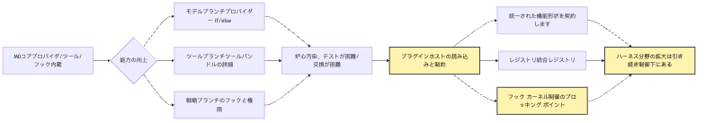
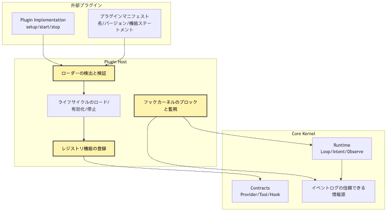
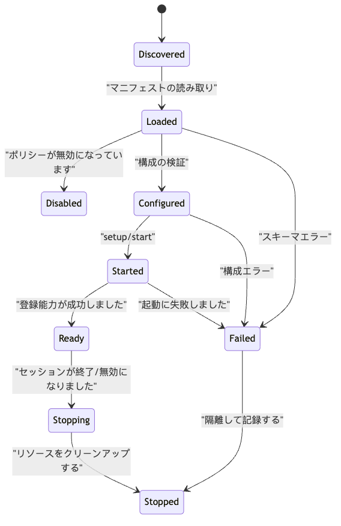
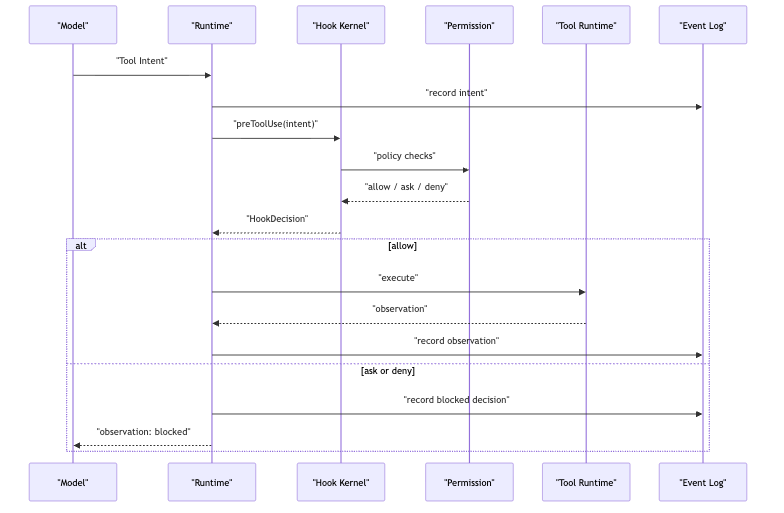

# Plugin Host：なぜ core は拡張可能であるべきか

この段落では、設計上の責任境界を明確にし、実装時に同じ判断を再現できるようにします。

```text
この部分では、Agent Harness の境界と runtime contract を工程上の観点から整理します。
この段落では、設計上の責任境界を明確にし、実装時に同じ判断を再現できるようにします。
```

この段落では、設計上の責任境界を明確にし、実装時に同じ判断を再現できるようにします。

この段落では、設計上の責任境界を明確にし、実装時に同じ判断を再現できるようにします。

この部分では、Agent Harness の境界と runtime contract を工程上の観点から整理します。

```text
この部分では、Agent Harness の境界と runtime contract を工程上の観点から整理します。
この段落では、設計上の責任境界を明確にし、実装時に同じ判断を再現できるようにします。
この段落では、設計上の責任境界を明確にし、実装時に同じ判断を再現できるようにします。
この段落では、設計上の責任境界を明確にし、実装時に同じ判断を再現できるようにします。
この段落では、設計上の責任境界を明確にし、実装時に同じ判断を再現できるようにします。
```

この段落では、設計上の責任境界を明確にし、実装時に同じ判断を再現できるようにします。

この段落では、設計上の責任境界を明確にし、実装時に同じ判断を再現できるようにします。

```text
この段落では、設計上の責任境界を明確にし、実装時に同じ判断を再現できるようにします。
```

この段落では、設計上の責任境界を明確にし、実装時に同じ判断を再現できるようにします。

この部分では、Agent Harness の境界と runtime contract を工程上の観点から整理します。

この段落では、設計上の責任境界を明確にし、実装時に同じ判断を再現できるようにします。

この段落では、設計上の責任境界を明確にし、実装時に同じ判断を再現できるようにします。

この段落では、設計上の責任境界を明確にし、実装時に同じ判断を再現できるようにします。

この段落では、設計上の責任境界を明確にし、実装時に同じ判断を再現できるようにします。

この部分では、Agent Harness の境界と runtime contract を工程上の観点から整理します。

この段落では、設計上の責任境界を明確にし、実装時に同じ判断を再現できるようにします。 `if`

この段落では、設計上の責任境界を明確にし、実装時に同じ判断を再現できるようにします。

```text
この部分では、Agent Harness の境界と runtime contract を工程上の観点から整理します。
この部分では、Agent Harness の境界と runtime contract を工程上の観点から整理します。
この段落では、設計上の責任境界を明確にし、実装時に同じ判断を再現できるようにします。
この部分では、Agent Harness の境界と runtime contract を工程上の観点から整理します。
この部分では、Agent Harness の境界と runtime contract を工程上の観点から整理します。
この部分では、Agent Harness の境界と runtime contract を工程上の観点から整理します。
この段落では、設計上の責任境界を明確にし、実装時に同じ判断を再現できるようにします。
この段落では、設計上の責任境界を明確にし、実装時に同じ判断を再現できるようにします。
```

この段落では、設計上の責任境界を明確にし、実装時に同じ判断を再現できるようにします。

```text
この部分では、Agent Harness の境界と runtime contract を工程上の観点から整理します。
この部分では、Agent Harness の境界と runtime contract を工程上の観点から整理します。
```

この段落では、設計上の責任境界を明確にし、実装時に同じ判断を再現できるようにします。

> この部分では、Agent Harness の境界と runtime contract を工程上の観点から整理します。

この段落では、設計上の責任境界を明確にし、実装時に同じ判断を再現できるようにします。

```text
この部分では、Agent Harness の境界と runtime contract を工程上の観点から整理します。
この部分では、Agent Harness の境界と runtime contract を工程上の観点から整理します。
この部分では、Agent Harness の境界と runtime contract を工程上の観点から整理します。
```

この段落では、設計上の責任境界を明確にし、実装時に同じ判断を再現できるようにします。

```text
この段落では、設計上の責任境界を明確にし、実装時に同じ判断を再現できるようにします。
この段落では、設計上の責任境界を明確にし、実装時に同じ判断を再現できるようにします。
```

この部分では、Agent Harness の境界と runtime contract を工程上の観点から整理します。

この段落では、設計上の責任境界を明確にし、実装時に同じ判断を再現できるようにします。

この部分では、Agent Harness の境界と runtime contract を工程上の観点から整理します。

この部分では、Agent Harness の境界と runtime contract を工程上の観点から整理します。

この段落では、設計上の責任境界を明確にし、実装時に同じ判断を再現できるようにします。

```text
この部分では、Agent Harness の境界と runtime contract を工程上の観点から整理します。
この部分では、Agent Harness の境界と runtime contract を工程上の観点から整理します。
この部分では、Agent Harness の境界と runtime contract を工程上の観点から整理します。
この段落では、設計上の責任境界を明確にし、実装時に同じ判断を再現できるようにします。
```

この段落では、設計上の責任境界を明確にし、実装時に同じ判断を再現できるようにします。

この部分では、Agent Harness の境界と runtime contract を工程上の観点から整理します。

この部分では、Agent Harness の境界と runtime contract を工程上の観点から整理します。

この部分では、Agent Harness の境界と runtime contract を工程上の観点から整理します。

## 問題の連鎖

この段落では、設計上の責任境界を明確にし、実装時に同じ判断を再現できるようにします。

```text
この部分では、Agent Harness の境界と runtime contract を工程上の観点から整理します。
この部分では、Agent Harness の境界と runtime contract を工程上の観点から整理します。
この部分では、Agent Harness の境界と runtime contract を工程上の観点から整理します。
この段落では、設計上の責任境界を明確にし、実装時に同じ判断を再現できるようにします。
この部分では、Agent Harness の境界と runtime contract を工程上の観点から整理します。
この部分では、Agent Harness の境界と runtime contract を工程上の観点から整理します。
この段落では、設計上の責任境界を明確にし、実装時に同じ判断を再現できるようにします。
この段落では、設計上の責任境界を明確にし、実装時に同じ判断を再現できるようにします。
この段落では、設計上の責任境界を明確にし、実装時に同じ判断を再現できるようにします。
```

この段落では、設計上の責任境界を明確にし、実装時に同じ判断を再現できるようにします。

この段落では、設計上の責任境界を明確にし、実装時に同じ判断を再現できるようにします。

この段落では、設計上の責任境界を明確にし、実装時に同じ判断を再現できるようにします。

```text
この部分では、Agent Harness の境界と runtime contract を工程上の観点から整理します。
この部分では、Agent Harness の境界と runtime contract を工程上の観点から整理します。
```

この段落では、設計上の責任境界を明確にし、実装時に同じ判断を再現できるようにします。



この部分では、Agent Harness の境界と runtime contract を工程上の観点から整理します。 `Core 污染` `Plugin Host`

この部分では、Agent Harness の境界と runtime contract を工程上の観点から整理します。

この部分では、Agent Harness の境界と runtime contract を工程上の観点から整理します。

```text
PluginManifest
ProviderContribution
ToolContribution
HookContribution
LifecycleContribution
```

この段落では、設計上の責任境界を明確にし、実装時に同じ判断を再現できるようにします。

この段落では、設計上の責任境界を明確にし、実装時に同じ判断を再現できるようにします。

この段落では、設計上の責任境界を明確にし、実装時に同じ判断を再現できるようにします。

この段落では、設計上の責任境界を明確にし、実装時に同じ判断を再現できるようにします。

この段落では、設計上の責任境界を明確にし、実装時に同じ判断を再現できるようにします。

## 一、M0 core が最初は能力を内蔵すべき理由

この段落では、設計上の責任境界を明確にし、実装時に同じ判断を再現できるようにします。

この部分では、Agent Harness の境界と runtime contract を工程上の観点から整理します。

この段落では、設計上の責任境界を明確にし、実装時に同じ判断を再現できるようにします。

この段落では、設計上の責任境界を明確にし、実装時に同じ判断を再現できるようにします。

```text
この部分では、Agent Harness の境界と runtime contract を工程上の観点から整理します。
この段落では、設計上の責任境界を明確にし、実装時に同じ判断を再現できるようにします。
この段落では、設計上の責任境界を明確にし、実装時に同じ判断を再現できるようにします。
この段落では、設計上の責任境界を明確にし、実装時に同じ判断を再現できるようにします。
```

この段落では、設計上の責任境界を明確にし、実装時に同じ判断を再現できるようにします。

この段落では、設計上の責任境界を明確にし、実装時に同じ判断を再現できるようにします。

この段落では、設計上の責任境界を明確にし、実装時に同じ判断を再現できるようにします。

```text
この段落では、設計上の責任境界を明確にし、実装時に同じ判断を再現できるようにします。
この段落では、設計上の責任境界を明確にし、実装時に同じ判断を再現できるようにします。
この段落では、設計上の責任境界を明確にし、実装時に同じ判断を再現できるようにします。
```

この段落では、設計上の責任境界を明確にし、実装時に同じ判断を再現できるようにします。

```text
read_file
search_text
run_command
```

この部分では、Agent Harness の境界と runtime contract を工程上の観点から整理します。

この段落では、設計上の責任境界を明確にし、実装時に同じ判断を再現できるようにします。

```text
この段落では、設計上の責任境界を明確にし、実装時に同じ判断を再現できるようにします。
この部分では、Agent Harness の境界と runtime contract を工程上の観点から整理します。
```

この段落では、設計上の責任境界を明確にし、実装時に同じ判断を再現できるようにします。

この部分では、Agent Harness の境界と runtime contract を工程上の観点から整理します。

この段落では、設計上の責任境界を明確にし、実装時に同じ判断を再現できるようにします。

この段落では、設計上の責任境界を明確にし、実装時に同じ判断を再現できるようにします。

この段落では、設計上の責任境界を明確にし、実装時に同じ判断を再現できるようにします。

この段落では、設計上の責任境界を明確にし、実装時に同じ判断を再現できるようにします。

この段落では、設計上の責任境界を明確にし、実装時に同じ判断を再現できるようにします。

```text
この段落では、設計上の責任境界を明確にし、実装時に同じ判断を再現できるようにします。
この部分では、Agent Harness の境界と runtime contract を工程上の観点から整理します。
```

## 二、能力が増えると core はどう汚染されるか

この段落では、設計上の責任境界を明確にし、実装時に同じ判断を再現できるようにします。

この段落では、設計上の責任境界を明確にし、実装時に同じ判断を再現できるようにします。

```text
この段落では、設計上の責任境界を明確にし、実装時に同じ判断を再現できるようにします。
```

この段落では、設計上の責任境界を明確にし、実装時に同じ判断を再現できるようにします。

この段落では、設計上の責任境界を明確にし、実装時に同じ判断を再現できるようにします。

この段落では、設計上の責任境界を明確にし、実装時に同じ判断を再現できるようにします。

この段落では、設計上の責任境界を明確にし、実装時に同じ判断を再現できるようにします。

この段落では、設計上の責任境界を明確にし、実装時に同じ判断を再現できるようにします。

この段落では、設計上の責任境界を明確にし、実装時に同じ判断を再現できるようにします。

この段落では、設計上の責任境界を明確にし、実装時に同じ判断を再現できるようにします。

この段落では、設計上の責任境界を明確にし、実装時に同じ判断を再現できるようにします。

```ts
async function runAgent(input: string, cwd: string) {
  const provider = config.provider === "anthropic"
    ? new AnthropicProvider(config.anthropic)
    : config.provider === "openai"
      ? new OpenAIProvider(config.openai)
      : new LocalProvider(config.local);

  const tools = [
    createReadTool(cwd),
    createSearchTool(cwd),
    createShellTool(cwd),
  ];

  if (isNodeProject(cwd)) {
    tools.push(createNpmTestTool(cwd));
  }

  if (isPythonProject(cwd)) {
    tools.push(createPytestTool(cwd));
  }

  if (config.enableGithub) {
    tools.push(createGithubTool(config.githubToken));
  }

  const preHooks = [];
  if (config.askBeforeShell) preHooks.push(confirmShellHook);
  if (config.projectPolicy) preHooks.push(projectPolicyHook);
  if (config.enterprisePolicy) preHooks.push(enterprisePolicyHook);

  // ...
}
```

この段落では、設計上の責任境界を明確にし、実装時に同じ判断を再現できるようにします。

この段落では、設計上の責任境界を明確にし、実装時に同じ判断を再現できるようにします。

この段落では、設計上の責任境界を明確にし、実装時に同じ判断を再現できるようにします。

```text
この段落では、設計上の責任境界を明確にし、実装時に同じ判断を再現できるようにします。
この段落では、設計上の責任境界を明確にし、実装時に同じ判断を再現できるようにします。
この段落では、設計上の責任境界を明確にし、実装時に同じ判断を再現できるようにします。
この段落では、設計上の責任境界を明確にし、実装時に同じ判断を再現できるようにします。
```

この部分では、Agent Harness の境界と runtime contract を工程上の観点から整理します。 `runAgent()`

この段落では、設計上の責任境界を明確にし、実装時に同じ判断を再現できるようにします。

この段落では、設計上の責任境界を明確にし、実装時に同じ判断を再現できるようにします。

この部分では、Agent Harness の境界と runtime contract を工程上の観点から整理します。

この部分では、Agent Harness の境界と runtime contract を工程上の観点から整理します。

この段落では、設計上の責任境界を明確にし、実装時に同じ判断を再現できるようにします。

この部分では、Agent Harness の境界と runtime contract を工程上の観点から整理します。

この部分では、Agent Harness の境界と runtime contract を工程上の観点から整理します。

この段落では、設計上の責任境界を明確にし、実装時に同じ判断を再現できるようにします。

この段落では、設計上の責任境界を明確にし、実装時に同じ判断を再現できるようにします。

この部分では、Agent Harness の境界と runtime contract を工程上の観点から整理します。

この段落では、設計上の責任境界を明確にし、実装時に同じ判断を再現できるようにします。

```text
この段落では、設計上の責任境界を明確にし、実装時に同じ判断を再現できるようにします。
この部分では、Agent Harness の境界と runtime contract を工程上の観点から整理します。
```

## 三、Plugin Host はマーケットではなく制御された入口である

この部分では、Agent Harness の境界と runtime contract を工程上の観点から整理します。

この段落では、設計上の責任境界を明確にし、実装時に同じ判断を再現できるようにします。

この段落では、設計上の責任境界を明確にし、実装時に同じ判断を再現できるようにします。

この部分では、Agent Harness の境界と runtime contract を工程上の観点から整理します。

この段落では、設計上の責任境界を明確にし、実装時に同じ判断を再現できるようにします。

この段落では、設計上の責任境界を明確にし、実装時に同じ判断を再現できるようにします。

```text
この部分では、Agent Harness の境界と runtime contract を工程上の観点から整理します。
```

この段落では、設計上の責任境界を明確にし、実装時に同じ判断を再現できるようにします。

```text
この段落では、設計上の責任境界を明確にし、実装時に同じ判断を再現できるようにします。
この段落では、設計上の責任境界を明確にし、実装時に同じ判断を再現できるようにします。
validation contract
この段落では、設計上の責任境界を明確にし、実装時に同じ判断を再現できるようにします。
registercapability
この段落では、設計上の責任境界を明確にし、実装時に同じ判断を再現できるようにします。
この段落では、設計上の責任境界を明確にし、実装時に同じ判断を再現できるようにします。
この段落では、設計上の責任境界を明確にし、実装時に同じ判断を再現できるようにします。
この段落では、設計上の責任境界を明確にし、実装時に同じ判断を再現できるようにします。
```

この段落では、設計上の責任境界を明確にし、実装時に同じ判断を再現できるようにします。

```text
この部分では、Agent Harness の境界と runtime contract を工程上の観点から整理します。
```

この段落では、設計上の責任境界を明確にし、実装時に同じ判断を再現できるようにします。

この部分では、Agent Harness の境界と runtime contract を工程上の観点から整理します。

```ts
plugin.activate(core);
```

この部分では、Agent Harness の境界と runtime contract を工程上の観点から整理します。 `core`

この段落では、設計上の責任境界を明確にし、実装時に同じ判断を再現できるようにします。

この段落では、設計上の責任境界を明確にし、実装時に同じ判断を再現できるようにします。

この段落では、設計上の責任境界を明確にし、実装時に同じ判断を再現できるようにします。

この段落では、設計上の責任境界を明確にし、実装時に同じ判断を再現できるようにします。

この段落では、設計上の責任境界を明確にし、実装時に同じ判断を再現できるようにします。

この段落では、設計上の責任境界を明確にし、実装時に同じ判断を再現できるようにします。

```text
この段落では、設計上の責任境界を明確にし、実装時に同じ判断を再現できるようにします。
この段落では、設計上の責任境界を明確にし、実装時に同じ判断を再現できるようにします。
```

この段落では、設計上の責任境界を明確にし、実装時に同じ判断を再現できるようにします。

```ts
type PluginContribution = {
  providers?: ProviderContribution[];
  tools?: ToolContribution[];
  hooks?: HookContribution[];
  commands?: CommandContribution[];
};

type Plugin = {
  manifest: PluginManifest;
  setup(ctx: PluginSetupContext): Promise<PluginContribution>;
};
```

この部分では、Agent Harness の境界と runtime contract を工程上の観点から整理します。 `PluginSetupContext`

この段落では、設計上の責任境界を明確にし、実装時に同じ判断を再現できるようにします。

この段落では、設計上の責任境界を明確にし、実装時に同じ判断を再現できるようにします。

この段落では、設計上の責任境界を明確にし、実装時に同じ判断を再現できるようにします。

この段落では、設計上の責任境界を明確にし、実装時に同じ判断を再現できるようにします。

この段落では、設計上の責任境界を明確にし、実装時に同じ判断を再現できるようにします。

この段落では、設計上の責任境界を明確にし、実装時に同じ判断を再現できるようにします。

この部分では、Agent Harness の境界と runtime contract を工程上の観点から整理します。

```text
この段落では、設計上の責任境界を明確にし、実装時に同じ判断を再現できるようにします。
```

この段落では、設計上の責任境界を明確にし、実装時に同じ判断を再現できるようにします。

この段落では、設計上の責任境界を明確にし、実装時に同じ判断を再現できるようにします。

この段落では、設計上の責任境界を明確にし、実装時に同じ判断を再現できるようにします。

```text
この段落では、設計上の責任境界を明確にし、実装時に同じ判断を再現できるようにします。
visibility / context projection
permission / hook gate
tool runtime execution
observation / event log
```

この段落では、設計上の責任境界を明確にし、実装時に同じ判断を再現できるようにします。

```text
この段落では、設計上の責任境界を明確にし、実装時に同じ判断を再現できるようにします。
この段落では、設計上の責任境界を明確にし、実装時に同じ判断を再現できるようにします。
この部分では、Agent Harness の境界と runtime contract を工程上の観点から整理します。
```

この部分では、Agent Harness の境界と runtime contract を工程上の観点から整理します。

## 四、Plugin Host の五つの中核部品

この部分では、Agent Harness の境界と runtime contract を工程上の観点から整理します。

```text
Manifest
Loader
Registry
Lifecycle
Hook Kernel
```

この段落では、設計上の責任境界を明確にし、実装時に同じ判断を再現できるようにします。



この部分では、Agent Harness の境界と runtime contract を工程上の観点から整理します。 `外部 plugin` `Core Kernel`

この部分では、Agent Harness の境界と runtime contract を工程上の観点から整理します。 `Plugin Host`

この段落では、設計上の責任境界を明確にし、実装時に同じ判断を再現できるようにします。

この段落では、設計上の責任境界を明確にし、実装時に同じ判断を再現できるようにします。 `Manifest`

この段落では、設計上の責任境界を明確にし、実装時に同じ判断を再現できるようにします。 `Loader`

この段落では、設計上の責任境界を明確にし、実装時に同じ判断を再現できるようにします。 `Lifecycle`

この部分では、Agent Harness の境界と runtime contract を工程上の観点から整理します。 `Registry`

この段落では、設計上の責任境界を明確にし、実装時に同じ判断を再現できるようにします。 `Hook Kernel`

この部分では、Agent Harness の境界と runtime contract を工程上の観点から整理します。

この段落では、設計上の責任境界を明確にし、実装時に同じ判断を再現できるようにします。

この段落では、設計上の責任境界を明確にし、実装時に同じ判断を再現できるようにします。

この段落では、設計上の責任境界を明確にし、実装時に同じ判断を再現できるようにします。

この部分では、Agent Harness の境界と runtime contract を工程上の観点から整理します。

この部分では、Agent Harness の境界と runtime contract を工程上の観点から整理します。

この段落では、設計上の責任境界を明確にし、実装時に同じ判断を再現できるようにします。

```text
この部分では、Agent Harness の境界と runtime contract を工程上の観点から整理します。
```

## 五、Manifest：plugin はまず自分が何者かを説明する

この段落では、設計上の責任境界を明確にし、実装時に同じ判断を再現できるようにします。

この段落では、設計上の責任境界を明確にし、実装時に同じ判断を再現できるようにします。

この段落では、設計上の責任境界を明確にし、実装時に同じ判断を再現できるようにします。

この段落では、設計上の責任境界を明確にし、実装時に同じ判断を再現できるようにします。

```text
この段落では、設計上の責任境界を明確にし、実装時に同じ判断を再現できるようにします。
この段落では、設計上の責任境界を明確にし、実装時に同じ判断を再現できるようにします。
この段落では、設計上の責任境界を明確にし、実装時に同じ判断を再現できるようにします。
この段落では、設計上の責任境界を明確にし、実装時に同じ判断を再現できるようにします。
この段落では、設計上の責任境界を明確にし、実装時に同じ判断を再現できるようにします。
この段落では、設計上の責任境界を明確にし、実装時に同じ判断を再現できるようにします。
この段落では、設計上の責任境界を明確にし、実装時に同じ判断を再現できるようにします。
この段落では、設計上の責任境界を明確にし、実装時に同じ判断を再現できるようにします。
```

この段落では、設計上の責任境界を明確にし、実装時に同じ判断を再現できるようにします。

```ts
type PluginManifest = {
  id: string;
  name: string;
  version: string;
  description?: string;
  contributes?: {
    providers?: string[];
    tools?: string[];
    hooks?: HookPoint[];
  };
  requires?: {
    hostVersion?: string;
    capabilities?: string[];
  };
  permissions?: PluginPermission[];
  defaultEnabled?: boolean;
};
```

この部分では、Agent Harness の境界と runtime contract を工程上の観点から整理します。 `permissions`

この段落では、設計上の責任境界を明確にし、実装時に同じ判断を再現できるようにします。

この段落では、設計上の責任境界を明確にし、実装時に同じ判断を再現できるようにします。

この段落では、設計上の責任境界を明確にし、実装時に同じ判断を再現できるようにします。

この段落では、設計上の責任境界を明確にし、実装時に同じ判断を再現できるようにします。

```text
この段落では、設計上の責任境界を明確にし、実装時に同じ判断を再現できるようにします。
```

たとえば：

```text
この部分では、Agent Harness の境界と runtime contract を工程上の観点から整理します。
この部分では、Agent Harness の境界と runtime contract を工程上の観点から整理します。
この部分では、Agent Harness の境界と runtime contract を工程上の観点から整理します。
この段落では、設計上の責任境界を明確にし、実装時に同じ判断を再現できるようにします。
```

この段落では、設計上の責任境界を明確にし、実装時に同じ判断を再現できるようにします。

この段落では、設計上の責任境界を明確にし、実装時に同じ判断を再現できるようにします。

この部分では、Agent Harness の境界と runtime contract を工程上の観点から整理します。

この段落では、設計上の責任境界を明確にし、実装時に同じ判断を再現できるようにします。

この段落では、設計上の責任境界を明確にし、実装時に同じ判断を再現できるようにします。

この部分では、Agent Harness の境界と runtime contract を工程上の観点から整理します。

```text
この段落では、設計上の責任境界を明確にし、実装時に同じ判断を再現できるようにします。
```

この段落では、設計上の責任境界を明確にし、実装時に同じ判断を再現できるようにします。

```text
この段落では、設計上の責任境界を明確にし、実装時に同じ判断を再現できるようにします。
この段落では、設計上の責任境界を明確にし、実装時に同じ判断を再現できるようにします。
この部分では、Agent Harness の境界と runtime contract を工程上の観点から整理します。
```

この段落では、設計上の責任境界を明確にし、実装時に同じ判断を再現できるようにします。

## 六、Loader：plugin の読み込みは単なる require ではない

この段落では、設計上の責任境界を明確にし、実装時に同じ判断を再現できるようにします。

```ts
const plugin = await import(pluginPath);
```

この部分では、Agent Harness の境界と runtime contract を工程上の観点から整理します。

この段落では、設計上の責任境界を明確にし、実装時に同じ判断を再現できるようにします。

```text
この段落では、設計上の責任境界を明確にし、実装時に同じ判断を再現できるようにします。
この段落では、設計上の責任境界を明確にし、実装時に同じ判断を再現できるようにします。
validation schema
この段落では、設計上の責任境界を明確にし、実装時に同じ判断を再現できるようにします。
この段落では、設計上の責任境界を明確にし、実装時に同じ判断を再現できるようにします。
この段落では、設計上の責任境界を明確にし、実装時に同じ判断を再現できるようにします。
この段落では、設計上の責任境界を明確にし、実装時に同じ判断を再現できるようにします。
recordloadevent
```

この段落では、設計上の責任境界を明確にし、実装時に同じ判断を再現できるようにします。

この段落では、設計上の責任境界を明確にし、実装時に同じ判断を再現できるようにします。

```text
この段落では、設計上の責任境界を明確にし、実装時に同じ判断を再現できるようにします。
projectplugin
ユーザーplugin
この段落では、設計上の責任境界を明確にし、実装時に同じ判断を再現できるようにします。
この段落では、設計上の責任境界を明確にし、実装時に同じ判断を再現できるようにします。
この段落では、設計上の責任境界を明確にし、実装時に同じ判断を再現できるようにします。
```

この段落では、設計上の責任境界を明確にし、実装時に同じ判断を再現できるようにします。

この段落では、設計上の責任境界を明確にし、実装時に同じ判断を再現できるようにします。

この段落では、設計上の責任境界を明確にし、実装時に同じ判断を再現できるようにします。

この段落では、設計上の責任境界を明確にし、実装時に同じ判断を再現できるようにします。

この段落では、設計上の責任境界を明確にし、実装時に同じ判断を再現できるようにします。

この部分では、Agent Harness の境界と runtime contract を工程上の観点から整理します。

この部分では、Agent Harness の境界と runtime contract を工程上の観点から整理します。

この段落では、設計上の責任境界を明確にし、実装時に同じ判断を再現できるようにします。 `run_tests`

```text
この部分では、Agent Harness の境界と runtime contract を工程上の観点から整理します。
この段落では、設計上の責任境界を明確にし、実装時に同じ判断を再現できるようにします。
この段落では、設計上の責任境界を明確にし、実装時に同じ判断を再現できるようにします。
この段落では、設計上の責任境界を明確にし、実装時に同じ判断を再現できるようにします。
```

この段落では、設計上の責任境界を明確にし、実装時に同じ判断を再現できるようにします。

この段落では、設計上の責任境界を明確にし、実装時に同じ判断を再現できるようにします。

この段落では、設計上の責任境界を明確にし、実装時に同じ判断を再現できるようにします。

```ts
type LoadedPlugin = {
  id: string;
  source: "builtin" | "project" | "user" | "managed" | "test";
  manifest: PluginManifest;
  module: PluginModule;
  state: "loaded" | "disabled" | "failed";
};
```

この段落では、設計上の責任境界を明確にし、実装時に同じ判断を再現できるようにします。

この段落では、設計上の責任境界を明確にし、実装時に同じ判断を再現できるようにします。

この段落では、設計上の責任境界を明確にし、実装時に同じ判断を再現できるようにします。

この段落では、設計上の責任境界を明確にし、実装時に同じ判断を再現できるようにします。

```text
この段落では、設計上の責任境界を明確にし、実装時に同じ判断を再現できるようにします。
```

この段落では、設計上の責任境界を明確にし、実装時に同じ判断を再現できるようにします。

この段落では、設計上の責任境界を明確にし、実装時に同じ判断を再現できるようにします。

この段落では、設計上の責任境界を明確にし、実装時に同じ判断を再現できるようにします。

この段落では、設計上の責任境界を明確にし、実装時に同じ判断を再現できるようにします。

## 七、Registry：外部能力は内部オブジェクトに変換される必要がある

この部分では、Agent Harness の境界と runtime contract を工程上の観点から整理します。

この段落では、設計上の責任境界を明確にし、実装時に同じ判断を再現できるようにします。

この部分では、Agent Harness の境界と runtime contract を工程上の観点から整理します。

この段落では、設計上の責任境界を明確にし、実装時に同じ判断を再現できるようにします。

この段落では、設計上の責任境界を明確にし、実装時に同じ判断を再現できるようにします。

この部分では、Agent Harness の境界と runtime contract を工程上の観点から整理します。

たとえば provider contribution：

```ts
type ProviderContribution = {
  id: string;
  displayName: string;
  createProvider(config: ProviderConfig): ProviderAdapter;
};
```

tool contribution：

```ts
type ToolContribution = {
  name: string;
  description: string;
  inputSchema: JsonSchema;
  risk: "read" | "write" | "execute" | "network";
  createHandler(ctx: ToolRuntimeContext): ToolHandler;
};
```

hook contribution：

```ts
type HookContribution = {
  point: HookPoint;
  id: string;
  order?: number;
  blocking: boolean;
  run(input: HookInput): Promise<HookDecision>;
};
```

この段落では、設計上の責任境界を明確にし、実装時に同じ判断を再現できるようにします。

```text
この段落では、設計上の責任境界を明確にし、実装時に同じ判断を再現できるようにします。
この段落では、設計上の責任境界を明確にし、実装時に同じ判断を再現できるようにします。
```

この段落では、設計上の責任境界を明確にし、実装時に同じ判断を再現できるようにします。

```text
この段落では、設計上の責任境界を明確にし、実装時に同じ判断を再現できるようにします。
この段落では、設計上の責任境界を明確にし、実装時に同じ判断を再現できるようにします。
この段落では、設計上の責任境界を明確にし、実装時に同じ判断を再現できるようにします。
この段落では、設計上の責任境界を明確にし、実装時に同じ判断を再現できるようにします。
この段落では、設計上の責任境界を明確にし、実装時に同じ判断を再現できるようにします。
この段落では、設計上の責任境界を明確にし、実装時に同じ判断を再現できるようにします。
この部分では、Agent Harness の境界と runtime contract を工程上の観点から整理します。
```

この部分では、Agent Harness の境界と runtime contract を工程上の観点から整理します。

この部分では、Agent Harness の境界と runtime contract を工程上の観点から整理します。

```text
この部分では、Agent Harness の境界と runtime contract を工程上の観点から整理します。
この部分では、Agent Harness の境界と runtime contract を工程上の観点から整理します。
この段落では、設計上の責任境界を明確にし、実装時に同じ判断を再現できるようにします。
```

この段落では、設計上の責任境界を明確にし、実装時に同じ判断を再現できるようにします。

```text
この段落では、設計上の責任境界を明確にし、実装時に同じ判断を再現できるようにします。
この部分では、Agent Harness の境界と runtime contract を工程上の観点から整理します。
この段落では、設計上の責任境界を明確にし、実装時に同じ判断を再現できるようにします。
```

この部分では、Agent Harness の境界と runtime contract を工程上の観点から整理します。

この部分では、Agent Harness の境界と runtime contract を工程上の観点から整理します。

この部分では、Agent Harness の境界と runtime contract を工程上の観点から整理します。

この段落では、設計上の責任境界を明確にし、実装時に同じ判断を再現できるようにします。

```text
この段落では、設計上の責任境界を明確にし、実装時に同じ判断を再現できるようにします。
```

この段落では、設計上の責任境界を明確にし、実装時に同じ判断を再現できるようにします。

```text
この段落では、設計上の責任境界を明確にし、実装時に同じ判断を再現できるようにします。
この段落では、設計上の責任境界を明確にし、実装時に同じ判断を再現できるようにします。
この部分では、Agent Harness の境界と runtime contract を工程上の観点から整理します。
```

この段落では、設計上の責任境界を明確にし、実装時に同じ判断を再現できるようにします。

この段落では、設計上の責任境界を明確にし、実装時に同じ判断を再現できるようにします。

この段落では、設計上の責任境界を明確にし、実装時に同じ判断を再現できるようにします。

```text
Plugin Contribution
-> Registry
-> Capability / Context Projection
-> Visible Tool Schema
-> Model Tool Intent
-> Tool Runtime
```

## 八、Lifecycle：plugin は静的設定ではなく生きた実体である

この段落では、設計上の責任境界を明確にし、実装時に同じ判断を再現できるようにします。

この段落では、設計上の責任境界を明確にし、実装時に同じ判断を再現できるようにします。

この段落では、設計上の責任境界を明確にし、実装時に同じ判断を再現できるようにします。

この部分では、Agent Harness の境界と runtime contract を工程上の観点から整理します。

この部分では、Agent Harness の境界と runtime contract を工程上の観点から整理します。

この段落では、設計上の責任境界を明確にし、実装時に同じ判断を再現できるようにします。

この段落では、設計上の責任境界を明確にし、実装時に同じ判断を再現できるようにします。

この段落では、設計上の責任境界を明確にし、実装時に同じ判断を再現できるようにします。

この部分では、Agent Harness の境界と runtime contract を工程上の観点から整理します。

この段落では、設計上の責任境界を明確にし、実装時に同じ判断を再現できるようにします。

```text
discovered
-> loaded
-> configured
-> started
-> ready
-> stopping
-> stopped
-> failed
```

この段落では、設計上の責任境界を明確にし、実装時に同じ判断を再現できるようにします。



この段落では、設計上の責任境界を明確にし、実装時に同じ判断を再現できるようにします。

この段落では、設計上の責任境界を明確にし、実装時に同じ判断を再現できるようにします。

この段落では、設計上の責任境界を明確にし、実装時に同じ判断を再現できるようにします。

この段落では、設計上の責任境界を明確にし、実装時に同じ判断を再現できるようにします。

この部分では、Agent Harness の境界と runtime contract を工程上の観点から整理します。

この部分では、Agent Harness の境界と runtime contract を工程上の観点から整理します。

この段落では、設計上の責任境界を明確にし、実装時に同じ判断を再現できるようにします。

この段落では、設計上の責任境界を明確にし、実装時に同じ判断を再現できるようにします。

この段落では、設計上の責任境界を明確にし、実装時に同じ判断を再現できるようにします。

```text
この段落では、設計上の責任境界を明確にし、実装時に同じ判断を再現できるようにします。
この段落では、設計上の責任境界を明確にし、実装時に同じ判断を再現できるようにします。
この段落では、設計上の責任境界を明確にし、実装時に同じ判断を再現できるようにします。
この段落では、設計上の責任境界を明確にし、実装時に同じ判断を再現できるようにします。
この段落では、設計上の責任境界を明確にし、実装時に同じ判断を再現できるようにします。
```

この段落では、設計上の責任境界を明確にし、実装時に同じ判断を再現できるようにします。

この段落では、設計上の責任境界を明確にし、実装時に同じ判断を再現できるようにします。

この段落では、設計上の責任境界を明確にし、実装時に同じ判断を再現できるようにします。

この段落では、設計上の責任境界を明確にし、実装時に同じ判断を再現できるようにします。

```text
この段落では、設計上の責任境界を明確にし、実装時に同じ判断を再現できるようにします。
```

この部分では、Agent Harness の境界と runtime contract を工程上の観点から整理します。

この部分では、Agent Harness の境界と runtime contract を工程上の観点から整理します。

この段落では、設計上の責任境界を明確にし、実装時に同じ判断を再現できるようにします。

```text
この段落では、設計上の責任境界を明確にし、実装時に同じ判断を再現できるようにします。
この段落では、設計上の責任境界を明確にし、実装時に同じ判断を再現できるようにします。
この段落では、設計上の責任境界を明確にし、実装時に同じ判断を再現できるようにします。
```

## 九、Hook Kernel：hook は普通の event listener ではない

この部分では、Agent Harness の境界と runtime contract を工程上の観点から整理します。

この段落では、設計上の責任境界を明確にし、実装時に同じ判断を再現できるようにします。

```text
beforeRun
afterRun
onError
```

この段落では、設計上の責任境界を明確にし、実装時に同じ判断を再現できるようにします。

この段落では、設計上の責任境界を明確にし、実装時に同じ判断を再現できるようにします。

この段落では、設計上の責任境界を明確にし、実装時に同じ判断を再現できるようにします。

この段落では、設計上の責任境界を明確にし、実装時に同じ判断を再現できるようにします。

この段落では、設計上の責任境界を明確にし、実装時に同じ判断を再現できるようにします。

たとえば：

```text
この部分では、Agent Harness の境界と runtime contract を工程上の観点から整理します。
この部分では、Agent Harness の境界と runtime contract を工程上の観点から整理します。
-> allow
この部分では、Agent Harness の境界と runtime contract を工程上の観点から整理します。
```

この段落では、設計上の責任境界を明確にし、実装時に同じ判断を再現できるようにします。

```text
この段落では、設計上の責任境界を明確にし、実装時に同じ判断を再現できるようにします。
この部分では、Agent Harness の境界と runtime contract を工程上の観点から整理します。
この段落では、設計上の責任境界を明確にし、実装時に同じ判断を再現できるようにします。
この部分では、Agent Harness の境界と runtime contract を工程上の観点から整理します。
```

この段落では、設計上の責任境界を明確にし、実装時に同じ判断を再現できるようにします。

この段落では、設計上の責任境界を明確にし、実装時に同じ判断を再現できるようにします。

この段落では、設計上の責任境界を明確にし、実装時に同じ判断を再現できるようにします。

この段落では、設計上の責任境界を明確にし、実装時に同じ判断を再現できるようにします。



この部分では、Agent Harness の境界と runtime contract を工程上の観点から整理します。 `Hook Kernel` `Runtime` `Tool Runtime`

この部分では、Agent Harness の境界と runtime contract を工程上の観点から整理します。

この段落では、設計上の責任境界を明確にし、実装時に同じ判断を再現できるようにします。

この部分では、Agent Harness の境界と runtime contract を工程上の観点から整理します。

この部分では、Agent Harness の境界と runtime contract を工程上の観点から整理します。

たとえば：

```ts
type HookDecision =
  | { type: "allow"; reason?: string }
  | { type: "deny"; reason: string }
  | { type: "ask"; question: string; risk: RiskLevel }
  | { type: "amend"; intent: ToolIntent; reason: string };
```

この段落では、設計上の責任境界を明確にし、実装時に同じ判断を再現できるようにします。 `amend`

この部分では、Agent Harness の境界と runtime contract を工程上の観点から整理します。

この部分では、Agent Harness の境界と runtime contract を工程上の観点から整理します。

この部分では、Agent Harness の境界と runtime contract を工程上の観点から整理します。

この段落では、設計上の責任境界を明確にし、実装時に同じ判断を再現できるようにします。 `amend`

この段落では、設計上の責任境界を明確にし、実装時に同じ判断を再現できるようにします。

```text
allow
ask
deny
```

この部分では、Agent Harness の境界と runtime contract を工程上の観点から整理します。

この段落では、設計上の責任境界を明確にし、実装時に同じ判断を再現できるようにします。

```text
この段落では、設計上の責任境界を明確にし、実装時に同じ判断を再現できるようにします。
この段落では、設計上の責任境界を明確にし、実装時に同じ判断を再現できるようにします。
この段落では、設計上の責任境界を明確にし、実装時に同じ判断を再現できるようにします。
```

この部分では、Agent Harness の境界と runtime contract を工程上の観点から整理します。

この段落では、設計上の責任境界を明確にし、実装時に同じ判断を再現できるようにします。

```text
この段落では、設計上の責任境界を明確にし、実装時に同じ判断を再現できるようにします。
この部分では、Agent Harness の境界と runtime contract を工程上の観点から整理します。
この部分では、Agent Harness の境界と runtime contract を工程上の観点から整理します。
```

## 十、小さな CLI Agent がテスト修正を行う場面を Plugin Host がどう受け止めるか

この段落では、設計上の責任境界を明確にし、実装時に同じ判断を再現できるようにします。

ユーザーinput：

```text
この段落では、設計上の責任境界を明確にし、実装時に同じ判断を再現できるようにします。
```

この部分では、Agent Harness の境界と runtime contract を工程上の観点から整理します。

```text
この段落では、設計上の責任境界を明確にし、実装時に同じ判断を再現できるようにします。
この段落では、設計上の責任境界を明確にし、実装時に同じ判断を再現できるようにします。
この段落では、設計上の責任境界を明確にし、実装時に同じ判断を再現できるようにします。
この段落では、設計上の責任境界を明確にし、実装時に同じ判断を再現できるようにします。
recordlog
この段落では、設計上の責任境界を明確にし、実装時に同じ判断を再現できるようにします。
```

この部分では、Agent Harness の境界と runtime contract を工程上の観点から整理します。

```text
この部分では、Agent Harness の境界と runtime contract を工程上の観点から整理します。
この部分では、Agent Harness の境界と runtime contract を工程上の観点から整理します。
この部分では、Agent Harness の境界と runtime contract を工程上の観点から整理します。
この段落では、設計上の責任境界を明確にし、実装時に同じ判断を再現できるようにします。
この部分では、Agent Harness の境界と runtime contract を工程上の観点から整理します。
この部分では、Agent Harness の境界と runtime contract を工程上の観点から整理します。
```

この部分では、Agent Harness の境界と runtime contract を工程上の観点から整理します。

この段落では、設計上の責任境界を明確にし、実装時に同じ判断を再現できるようにします。

この部分では、Agent Harness の境界と runtime contract を工程上の観点から整理します。

この段落では、設計上の責任境界を明確にし、実装時に同じ判断を再現できるようにします。

この部分では、Agent Harness の境界と runtime contract を工程上の観点から整理します。

この段落では、設計上の責任境界を明確にし、実装時に同じ判断を再現できるようにします。


この段落では、設計上の責任境界を明確にし、実装時に同じ判断を再現できるようにします。

この段落では、設計上の責任境界を明確にし、実装時に同じ判断を再現できるようにします。

この部分では、Agent Harness の境界と runtime contract を工程上の観点から整理します。 `Provider plugin`

この段落では、設計上の責任境界を明確にし、実装時に同じ判断を再現できるようにします。 `test-runner plugin`

この段落では、設計上の責任境界を明確にし、実装時に同じ判断を再現できるようにします。 `policy plugin`

この部分では、Agent Harness の境界と runtime contract を工程上の観点から整理します。

この段落では、設計上の責任境界を明確にし、実装時に同じ判断を再現できるようにします。

この段落では、設計上の責任境界を明確にし、実装時に同じ判断を再現できるようにします。

```text
この段落では、設計上の責任境界を明確にし、実装時に同じ判断を再現できるようにします。
```

## 十一、拡張点は少なく、しかし荷重に耐えるべきである

この部分では、Agent Harness の境界と runtime contract を工程上の観点から整理します。

```text
この段落では、設計上の責任境界を明確にし、実装時に同じ判断を再現できるようにします。
```

この段落では、設計上の責任境界を明確にし、実装時に同じ判断を再現できるようにします。

この段落では、設計上の責任境界を明確にし、実装時に同じ判断を再現できるようにします。

この段落では、設計上の責任境界を明確にし、実装時に同じ判断を再現できるようにします。

この段落では、設計上の責任境界を明確にし、実装時に同じ判断を再現できるようにします。

この段落では、設計上の責任境界を明確にし、実装時に同じ判断を再現できるようにします。

この段落では、設計上の責任境界を明確にし、実装時に同じ判断を再現できるようにします。

この段落では、設計上の責任境界を明確にし、実装時に同じ判断を再現できるようにします。

```text
この部分では、Agent Harness の境界と runtime contract を工程上の観点から整理します。
この部分では、Agent Harness の境界と runtime contract を工程上の観点から整理します。
preToolUse gate
postToolUse observer
contextProject hook
sessionStart/sessionEnd lifecycle
```

この部分では、Agent Harness の境界と runtime contract を工程上の観点から整理します。 `preToolUse`

この部分では、Agent Harness の境界と runtime contract を工程上の観点から整理します。

この段落では、設計上の責任境界を明確にし、実装時に同じ判断を再現できるようにします。

この部分では、Agent Harness の境界と runtime contract を工程上の観点から整理します。 `postToolUse`

この段落では、設計上の責任境界を明確にし、実装時に同じ判断を再現できるようにします。 `contextProject`

この段落では、設計上の責任境界を明確にし、実装時に同じ判断を再現できるようにします。

この段落では、設計上の責任境界を明確にし、実装時に同じ判断を再現できるようにします。

この段落では、設計上の責任境界を明確にし、実装時に同じ判断を再現できるようにします。

```ts
type ContextContribution = {
  id: string;
  sourcePluginId: string;
  priority: number;
  tokensEstimate: number;
  content: ContextBlock;
};
```

この段落では、設計上の責任境界を明確にし、実装時に同じ判断を再現できるようにします。

この段落では、設計上の責任境界を明確にし、実装時に同じ判断を再現できるようにします。

この段落では、設計上の責任境界を明確にし、実装時に同じ判断を再現できるようにします。

```text
この段落では、設計上の責任境界を明確にし、実装時に同じ判断を再現できるようにします。
この段落では、設計上の責任境界を明確にし、実装時に同じ判断を再現できるようにします。
```

この段落では、設計上の責任境界を明確にし、実装時に同じ判断を再現できるようにします。

この段落では、設計上の責任境界を明確にし、実装時に同じ判断を再現できるようにします。

この段落では、設計上の責任境界を明確にし、実装時に同じ判断を再現できるようにします。

```text
この段落では、設計上の責任境界を明確にし、実装時に同じ判断を再現できるようにします。
この段落では、設計上の責任境界を明確にし、実装時に同じ判断を再現できるようにします。
```

この部分では、Agent Harness の境界と runtime contract を工程上の観点から整理します。

この部分では、Agent Harness の境界と runtime contract を工程上の観点から整理します。

この段落では、設計上の責任境界を明確にし、実装時に同じ判断を再現できるようにします。

## 十二、Namespace：衝突回避を人間の記憶に頼ってはいけない

この部分では、Agent Harness の境界と runtime contract を工程上の観点から整理します。

この段落では、設計上の責任境界を明確にし、実装時に同じ判断を再現できるようにします。

この段落では、設計上の責任境界を明確にし、実装時に同じ判断を再現できるようにします。 `run_tests`

この部分では、Agent Harness の境界と runtime contract を工程上の観点から整理します。 `default`

この段落では、設計上の責任境界を明確にし、実装時に同じ判断を再現できるようにします。 `policy`

この段落では、設計上の責任境界を明確にし、実装時に同じ判断を再現できるようにします。

この段落では、設計上の責任境界を明確にし、実装時に同じ判断を再現できるようにします。

```text
この段落では、設計上の責任境界を明確にし、実装時に同じ判断を再現できるようにします。
この段落では、設計上の責任境界を明確にし、実装時に同じ判断を再現できるようにします。
```

たとえば：

```text
local-tools.read_file
local-tools.search_text
local-tools.run_command
test-runner.run_tests
github.open_issue
```

この段落では、設計上の責任境界を明確にし、実装時に同じ判断を再現できるようにします。

この段落では、設計上の責任境界を明確にし、実装時に同じ判断を再現できるようにします。

この部分では、Agent Harness の境界と runtime contract を工程上の観点から整理します。

この段落では、設計上の責任境界を明確にし、実装時に同じ判断を再現できるようにします。

```text
tool: run_tests
```

この段落では、設計上の責任境界を明確にし、実装時に同じ判断を再現できるようにします。

この段落では、設計上の責任境界を明確にし、実装時に同じ判断を再現できるようにします。

```json
{
  "tool": "test-runner.run_tests",
  "displayName": "Run Tests",
  "sourcePlugin": "test-runner",
  "sourceKind": "project",
  "intentId": "intent_123"
}
```

この段落では、設計上の責任境界を明確にし、実装時に同じ判断を再現できるようにします。

この部分では、Agent Harness の境界と runtime contract を工程上の観点から整理します。

この段落では、設計上の責任境界を明確にし、実装時に同じ判断を再現できるようにします。

```text
この段落では、設計上の責任境界を明確にし、実装時に同じ判断を再現できるようにします。
この段落では、設計上の責任境界を明確にし、実装時に同じ判断を再現できるようにします。
この段落では、設計上の責任境界を明確にし、実装時に同じ判断を再現できるようにします。
この段落では、設計上の責任境界を明確にし、実装時に同じ判断を再現できるようにします。
```

この段落では、設計上の責任境界を明確にし、実装時に同じ判断を再現できるようにします。

この段落では、設計上の責任境界を明確にし、実装時に同じ判断を再現できるようにします。

```text
この段落では、設計上の責任境界を明確にし、実装時に同じ判断を再現できるようにします。
この段落では、設計上の責任境界を明確にし、実装時に同じ判断を再現できるようにします。
この段落では、設計上の責任境界を明確にし、実装時に同じ判断を再現できるようにします。
この段落では、設計上の責任境界を明確にし、実装時に同じ判断を再現できるようにします。
この段落では、設計上の責任境界を明確にし、実装時に同じ判断を再現できるようにします。
この段落では、設計上の責任境界を明確にし、実装時に同じ判断を再現できるようにします。
この段落では、設計上の責任境界を明確にし、実装時に同じ判断を再現できるようにします。
lifecyclestate
```

この段落では、設計上の責任境界を明確にし、実装時に同じ判断を再現できるようにします。

この部分では、Agent Harness の境界と runtime contract を工程上の観点から整理します。

## 十三、Error isolation：plugin の失敗をシステム全体の失敗にしない

この部分では、Agent Harness の境界と runtime contract を工程上の観点から整理します。

この段落では、設計上の責任境界を明確にし、実装時に同じ判断を再現できるようにします。

この段落では、設計上の責任境界を明確にし、実装時に同じ判断を再現できるようにします。

この段落では、設計上の責任境界を明確にし、実装時に同じ判断を再現できるようにします。

この段落では、設計上の責任境界を明確にし、実装時に同じ判断を再現できるようにします。

この部分では、Agent Harness の境界と runtime contract を工程上の観点から整理します。

この段落では、設計上の責任境界を明確にし、実装時に同じ判断を再現できるようにします。

この部分では、Agent Harness の境界と runtime contract を工程上の観点から整理します。

この部分では、Agent Harness の境界と runtime contract を工程上の観点から整理します。

この部分では、Agent Harness の境界と runtime contract を工程上の観点から整理します。

この段落では、設計上の責任境界を明確にし、実装時に同じ判断を再現できるようにします。

```text
この段落では、設計上の責任境界を明確にし、実装時に同じ判断を再現できるようにします。
この段落では、設計上の責任境界を明確にし、実装時に同じ判断を再現できるようにします。
この部分では、Agent Harness の境界と runtime contract を工程上の観点から整理します。
この段落では、設計上の責任境界を明確にし、実装時に同じ判断を再現できるようにします。
この部分では、Agent Harness の境界と runtime contract を工程上の観点から整理します。
```

この段落では、設計上の責任境界を明確にし、実装時に同じ判断を再現できるようにします。

この段落では、設計上の責任境界を明確にし、実装時に同じ判断を再現できるようにします。

このできる fail open：

```text
この段落では、設計上の責任境界を明確にし、実装時に同じ判断を再現できるようにします。
```

この部分では、Agent Harness の境界と runtime contract を工程上の観点から整理します。

この段落では、設計上の責任境界を明確にし、実装時に同じ判断を再現できるようにします。

この段落では、設計上の責任境界を明確にし、実装時に同じ判断を再現できるようにします。

この段落では、設計上の責任境界を明確にし、実装時に同じ判断を再現できるようにします。

```text
この部分では、Agent Harness の境界と runtime contract を工程上の観点から整理します。
```

この段落では、設計上の責任境界を明確にし、実装時に同じ判断を再現できるようにします。

```text
この段落では、設計上の責任境界を明確にし、実装時に同じ判断を再現できるようにします。
この段落では、設計上の責任境界を明確にし、実装時に同じ判断を再現できるようにします。
この段落では、設計上の責任境界を明確にし、実装時に同じ判断を再現できるようにします。
```

この段落では、設計上の責任境界を明確にし、実装時に同じ判断を再現できるようにします。

この段落では、設計上の責任境界を明確にし、実装時に同じ判断を再現できるようにします。

この段落では、設計上の責任境界を明確にし、実装時に同じ判断を再現できるようにします。

```text
この段落では、設計上の責任境界を明確にし、実装時に同じ判断を再現できるようにします。
この部分では、Agent Harness の境界と runtime contract を工程上の観点から整理します。
この部分では、Agent Harness の境界と runtime contract を工程上の観点から整理します。
この部分では、Agent Harness の境界と runtime contract を工程上の観点から整理します。
この段落では、設計上の責任境界を明確にし、実装時に同じ判断を再現できるようにします。
```

この部分では、Agent Harness の境界と runtime contract を工程上の観点から整理します。

この段落では、設計上の責任境界を明確にし、実装時に同じ判断を再現できるようにします。

この部分では、Agent Harness の境界と runtime contract を工程上の観点から整理します。

## 十四、Plugin Host と MCP / Skill の関係

この部分では、Agent Harness の境界と runtime contract を工程上の観点から整理します。

```text
MCP
Skill
```

この段落では、設計上の責任境界を明確にし、実装時に同じ判断を再現できるようにします。

この段落では、設計上の責任境界を明確にし、実装時に同じ判断を再現できるようにします。

この部分では、Agent Harness の境界と runtime contract を工程上の観点から整理します。

```text
この部分では、Agent Harness の境界と runtime contract を工程上の観点から整理します。
```

この段落では、設計上の責任境界を明確にし、実装時に同じ判断を再現できるようにします。

```text
この段落では、設計上の責任境界を明確にし、実装時に同じ判断を再現できるようにします。
```

この部分では、Agent Harness の境界と runtime contract を工程上の観点から整理します。

```text
この部分では、Agent Harness の境界と runtime contract を工程上の観点から整理します。
```

この段落では、設計上の責任境界を明確にし、実装時に同じ判断を再現できるようにします。

この段落では、設計上の責任境界を明確にし、実装時に同じ判断を再現できるようにします。

```text
この部分では、Agent Harness の境界と runtime contract を工程上の観点から整理します。
この部分では、Agent Harness の境界と runtime contract を工程上の観点から整理します。
この段落では、設計上の責任境界を明確にし、実装時に同じ判断を再現できるようにします。
```

この段落では、設計上の責任境界を明確にし、実装時に同じ判断を再現できるようにします。

この段落では、設計上の責任境界を明確にし、実装時に同じ判断を再現できるようにします。

この段落では、設計上の責任境界を明確にし、実装時に同じ判断を再現できるようにします。

この段落では、設計上の責任境界を明確にし、実装時に同じ判断を再現できるようにします。

この部分では、Agent Harness の境界と runtime contract を工程上の観点から整理します。

この段落では、設計上の責任境界を明確にし、実装時に同じ判断を再現できるようにします。

この段落では、設計上の責任境界を明確にし、実装時に同じ判断を再現できるようにします。

```text
この段落では、設計上の責任境界を明確にし、実装時に同じ判断を再現できるようにします。
declare
validation
register
projection
この段落では、設計上の責任境界を明確にし、実装時に同じ判断を再現できるようにします。
observation
audit
```

この部分では、Agent Harness の境界と runtime contract を工程上の観点から整理します。

この段落では、設計上の責任境界を明確にし、実装時に同じ判断を再現できるようにします。

この部分では、Agent Harness の境界と runtime contract を工程上の観点から整理します。

この段落では、設計上の責任境界を明確にし、実装時に同じ判断を再現できるようにします。

この段落では、設計上の責任境界を明確にし、実装時に同じ判断を再現できるようにします。

```text
この部分では、Agent Harness の境界と runtime contract を工程上の観点から整理します。
この段落では、設計上の責任境界を明確にし、実装時に同じ判断を再現できるようにします。
この部分では、Agent Harness の境界と runtime contract を工程上の観点から整理します。
```

この段落では、設計上の責任境界を明確にし、実装時に同じ判断を再現できるようにします。

## 十五、最小実装はどう見えるか

この段落では、設計上の責任境界を明確にし、実装時に同じ判断を再現できるようにします。

この段落では、設計上の責任境界を明確にし、実装時に同じ判断を再現できるようにします。

この段落では、設計上の責任境界を明確にし、実装時に同じ判断を再現できるようにします。

```text
この段落では、設計上の責任境界を明確にし、実装時に同じ判断を再現できるようにします。
この部分では、Agent Harness の境界と runtime contract を工程上の観点から整理します。
この段落では、設計上の責任境界を明確にし、実装時に同じ判断を再現できるようにします。
この段落では、設計上の責任境界を明確にし、実装時に同じ判断を再現できるようにします。
この部分では、Agent Harness の境界と runtime contract を工程上の観点から整理します。
この段落では、設計上の責任境界を明確にし、実装時に同じ判断を再現できるようにします。
```

この段落では、設計上の責任境界を明確にし、実装時に同じ判断を再現できるようにします。

```text
src/
  core/
    contracts.ts
    runtime.ts
    events.ts
    registry.ts
  plugins/
    host.ts
    manifest.ts
    lifecycle.ts
    hook-kernel.ts
    builtin/
      provider-openai.ts
      local-tools.ts
      test-runner.ts
```

この段落では、設計上の責任境界を明確にし、実装時に同じ判断を再現できるようにします。

```ts
export class PluginHost {
  constructor(
    private registry: CapabilityRegistry,
    private hooks: HookKernel,
    private events: EventSink,
  ) {}

  async load(pluginModule: PluginModule, source: PluginSource) {
    const manifest = parseAndValidateManifest(pluginModule.manifest);

    this.events.append({
      type: "plugin.loaded",
      pluginId: manifest.id,
      source,
    });

    const ctx = createSetupContext({ manifest, source });
    const contribution = await pluginModule.setup(ctx);

    for (const provider of contribution.providers ?? []) {
      this.registry.registerProvider(manifest.id, source, provider);
    }

    for (const tool of contribution.tools ?? []) {
      this.registry.registerTool(manifest.id, source, tool);
    }

    for (const hook of contribution.hooks ?? []) {
      this.hooks.register(manifest.id, source, hook);
    }

    this.events.append({
      type: "plugin.ready",
      pluginId: manifest.id,
    });
  }
}
```

この部分では、Agent Harness の境界と runtime contract を工程上の観点から整理します。 `runtime`

この段落では、設計上の責任境界を明確にし、実装時に同じ判断を再現できるようにします。 `state`

この段落では、設計上の責任境界を明確にし、実装時に同じ判断を再現できるようにします。

この段落では、設計上の責任境界を明確にし、実装時に同じ判断を再現できるようにします。

この段落では、設計上の責任境界を明確にし、実装時に同じ判断を再現できるようにします。

この段落では、設計上の責任境界を明確にし、実装時に同じ判断を再現できるようにします。

```text
この部分では、Agent Harness の境界と runtime contract を工程上の観点から整理します。
この段落では、設計上の責任境界を明確にし、実装時に同じ判断を再現できるようにします。
この段落では、設計上の責任境界を明確にし、実装時に同じ判断を再現できるようにします。
```

この段落では、設計上の責任境界を明確にし、実装時に同じ判断を再現できるようにします。

```ts
export class HookKernel {
  private hooks = new Map<HookPoint, RegisteredHook[]>();

  async runPreToolUse(intent: ToolIntent): Promise<HookDecision> {
    const hooks = this.hooks.get("preToolUse") ?? [];

    for (const hook of sortByOrder(hooks)) {
      const decision = await withTimeout(
        hook.run({ intent }),
        hook.timeoutMs ?? 1000,
      );

      if (decision.type === "deny" || decision.type === "ask") {
        return decision;
      }

      if (decision.type === "amend") {
        return decision;
      }
    }

    return { type: "allow" };
  }
}
```

この段落では、設計上の責任境界を明確にし、実装時に同じ判断を再現できるようにします。

この段落では、設計上の責任境界を明確にし、実装時に同じ判断を再現できるようにします。

```text
この段落では、設計上の責任境界を明確にし、実装時に同じ判断を再現できるようにします。
この段落では、設計上の責任境界を明確にし、実装時に同じ判断を再現できるようにします。
この段落では、設計上の責任境界を明確にし、実装時に同じ判断を再現できるようにします。
この段落では、設計上の責任境界を明確にし、実装時に同じ判断を再現できるようにします。
この段落では、設計上の責任境界を明確にし、実装時に同じ判断を再現できるようにします。
この部分では、Agent Harness の境界と runtime contract を工程上の観点から整理します。
```

この段落では、設計上の責任境界を明確にし、実装時に同じ判断を再現できるようにします。

## 十六、M1 で何をテストすべきか

この部分では、Agent Harness の境界と runtime contract を工程上の観点から整理します。

この段落では、設計上の責任境界を明確にし、実装時に同じ判断を再現できるようにします。

この段落では、設計上の責任境界を明確にし、実装時に同じ判断を再現できるようにします。

この段落では、設計上の責任境界を明確にし、実装時に同じ判断を再現できるようにします。

```text
この段落では、設計上の責任境界を明確にし、実装時に同じ判断を再現できるようにします。
この段落では、設計上の責任境界を明確にし、実装時に同じ判断を再現できるようにします。
この段落では、設計上の責任境界を明確にし、実装時に同じ判断を再現できるようにします。
この段落では、設計上の責任境界を明確にし、実装時に同じ判断を再現できるようにします。
```

この段落では、設計上の責任境界を明確にし、実装時に同じ判断を再現できるようにします。

```text
この段落では、設計上の責任境界を明確にし、実装時に同じ判断を再現できるようにします。
この段落では、設計上の責任境界を明確にし、実装時に同じ判断を再現できるようにします。
この段落では、設計上の責任境界を明確にし、実装時に同じ判断を再現できるようにします。
この部分では、Agent Harness の境界と runtime contract を工程上の観点から整理します。
```

この段落では、設計上の責任境界を明確にし、実装時に同じ判断を再現できるようにします。

```text
この部分では、Agent Harness の境界と runtime contract を工程上の観点から整理します。
この部分では、Agent Harness の境界と runtime contract を工程上の観点から整理します。
この部分では、Agent Harness の境界と runtime contract を工程上の観点から整理します。
この部分では、Agent Harness の境界と runtime contract を工程上の観点から整理します。
この部分では、Agent Harness の境界と runtime contract を工程上の観点から整理します。
```

この段落では、設計上の責任境界を明確にし、実装時に同じ判断を再現できるようにします。

```text
この部分では、Agent Harness の境界と runtime contract を工程上の観点から整理します。
この部分では、Agent Harness の境界と runtime contract を工程上の観点から整理します。
この部分では、Agent Harness の境界と runtime contract を工程上の観点から整理します。
この段落では、設計上の責任境界を明確にし、実装時に同じ判断を再現できるようにします。
この部分では、Agent Harness の境界と runtime contract を工程上の観点から整理します。
この部分では、Agent Harness の境界と runtime contract を工程上の観点から整理します。
```

この段落では、設計上の責任境界を明確にし、実装時に同じ判断を再現できるようにします。

```text
この部分では、Agent Harness の境界と runtime contract を工程上の観点から整理します。
この段落では、設計上の責任境界を明確にし、実装時に同じ判断を再現できるようにします。
fake policy hook allow npm test。
この部分では、Agent Harness の境界と runtime contract を工程上の観点から整理します。
この部分では、Agent Harness の境界と runtime contract を工程上の観点から整理します。
```

この段落では、設計上の責任境界を明確にし、実装時に同じ判断を再現できるようにします。

```text
この段落では、設計上の責任境界を明確にし、実装時に同じ判断を再現できるようにします。
```

この段落では、設計上の責任境界を明確にし、実装時に同じ判断を再現できるようにします。

この段落では、設計上の責任境界を明確にし、実装時に同じ判断を再現できるようにします。

```text
この部分では、Agent Harness の境界と runtime contract を工程上の観点から整理します。
```

## 十七、よくある bad smell

この部分では、Agent Harness の境界と runtime contract を工程上の観点から整理します。

この段落では、設計上の責任境界を明確にし、実装時に同じ判断を再現できるようにします。

```text
plugin.activate(core)
```

この部分では、Agent Harness の境界と runtime contract を工程上の観点から整理します。

この段落では、設計上の責任境界を明確にし、実装時に同じ判断を再現できるようにします。

この段落では、設計上の責任境界を明確にし、実装時に同じ判断を再現できるようにします。

```text
この段落では、設計上の責任境界を明確にし、実装時に同じ判断を再現できるようにします。
```

この段落では、設計上の責任境界を明確にし、実装時に同じ判断を再現できるようにします。

この部分では、Agent Harness の境界と runtime contract を工程上の観点から整理します。

この段落では、設計上の責任境界を明確にし、実装時に同じ判断を再現できるようにします。

この段落では、設計上の責任境界を明確にし、実装時に同じ判断を再現できるようにします。

```text
この段落では、設計上の責任境界を明確にし、実装時に同じ判断を再現できるようにします。
```

この段落では、設計上の責任境界を明確にし、実装時に同じ判断を再現できるようにします。

この段落では、設計上の責任境界を明確にし、実装時に同じ判断を再現できるようにします。

この段落では、設計上の責任境界を明確にし、実装時に同じ判断を再現できるようにします。

```text
この段落では、設計上の責任境界を明確にし、実装時に同じ判断を再現できるようにします。
```

この部分では、Agent Harness の境界と runtime contract を工程上の観点から整理します。

この部分では、Agent Harness の境界と runtime contract を工程上の観点から整理します。

この段落では、設計上の責任境界を明確にし、実装時に同じ判断を再現できるようにします。

```text
この段落では、設計上の責任境界を明確にし、実装時に同じ判断を再現できるようにします。
```

この段落では、設計上の責任境界を明確にし、実装時に同じ判断を再現できるようにします。

この段落では、設計上の責任境界を明確にし、実装時に同じ判断を再現できるようにします。

この段落では、設計上の責任境界を明確にし、実装時に同じ判断を再現できるようにします。

```text
この段落では、設計上の責任境界を明確にし、実装時に同じ判断を再現できるようにします。
```

この部分では、Agent Harness の境界と runtime contract を工程上の観点から整理します。

この段落では、設計上の責任境界を明確にし、実装時に同じ判断を再現できるようにします。

この段落では、設計上の責任境界を明確にし、実装時に同じ判断を再現できるようにします。

```text
この段落では、設計上の責任境界を明確にし、実装時に同じ判断を再現できるようにします。
```

この段落では、設計上の責任境界を明確にし、実装時に同じ判断を再現できるようにします。

この段落では、設計上の責任境界を明確にし、実装時に同じ判断を再現できるようにします。

この部分では、Agent Harness の境界と runtime contract を工程上の観点から整理します。

この段落では、設計上の責任境界を明確にし、実装時に同じ判断を再現できるようにします。

```text
この部分では、Agent Harness の境界と runtime contract を工程上の観点から整理します。
```

この部分では、Agent Harness の境界と runtime contract を工程上の観点から整理します。

この部分では、Agent Harness の境界と runtime contract を工程上の観点から整理します。

この段落では、設計上の責任境界を明確にし、実装時に同じ判断を再現できるようにします。

この段落では、設計上の責任境界を明確にし、実装時に同じ判断を再現できるようにします。

## 十八、この章が届けるもの

この段落では、設計上の責任境界を明確にし、実装時に同じ判断を再現できるようにします。

```text
この部分では、Agent Harness の境界と runtime contract を工程上の観点から整理します。
この部分では、Agent Harness の境界と runtime contract を工程上の観点から整理します。
```

この部分では、Agent Harness の境界と runtime contract を工程上の観点から整理します。

この段落では、設計上の責任境界を明確にし、実装時に同じ判断を再現できるようにします。

この部分では、Agent Harness の境界と runtime contract を工程上の観点から整理します。

この部分では、Agent Harness の境界と runtime contract を工程上の観点から整理します。

この段落では、設計上の責任境界を明確にし、実装時に同じ判断を再現できるようにします。

```text
この段落では、設計上の責任境界を明確にし、実装時に同じ判断を再現できるようにします。
この段落では、設計上の責任境界を明確にし、実装時に同じ判断を再現できるようにします。
この段落では、設計上の責任境界を明確にし、実装時に同じ判断を再現できるようにします。
この段落では、設計上の責任境界を明確にし、実装時に同じ判断を再現できるようにします。
この段落では、設計上の責任境界を明確にし、実装時に同じ判断を再現できるようにします。
この部分では、Agent Harness の境界と runtime contract を工程上の観点から整理します。
この段落では、設計上の責任境界を明確にし、実装時に同じ判断を再現できるようにします。
この段落では、設計上の責任境界を明確にし、実装時に同じ判断を再現できるようにします。
```

この部分では、Agent Harness の境界と runtime contract を工程上の観点から整理します。

この部分では、Agent Harness の境界と runtime contract を工程上の観点から整理します。

この部分では、Agent Harness の境界と runtime contract を工程上の観点から整理します。

この段落では、設計上の責任境界を明確にし、実装時に同じ判断を再現できるようにします。

> この部分では、Agent Harness の境界と runtime contract を工程上の観点から整理します。

この部分では、Agent Harness の境界と runtime contract を工程上の観点から整理します。

この部分では、Agent Harness の境界と runtime contract を工程上の観点から整理します。

```text
この部分では、Agent Harness の境界と runtime contract を工程上の観点から整理します。
```

この部分では、Agent Harness の境界と runtime contract を工程上の観点から整理します。

この部分では、Agent Harness の境界と runtime contract を工程上の観点から整理します。

---

GitHub ソース: [00-11-plugin-host-core-extension.md](https://github.com/LienJack/build-harness/blob/main/docs/ja/00-11-plugin-host-core-extension.md)
