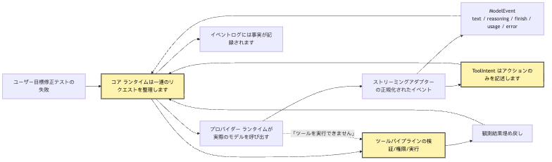
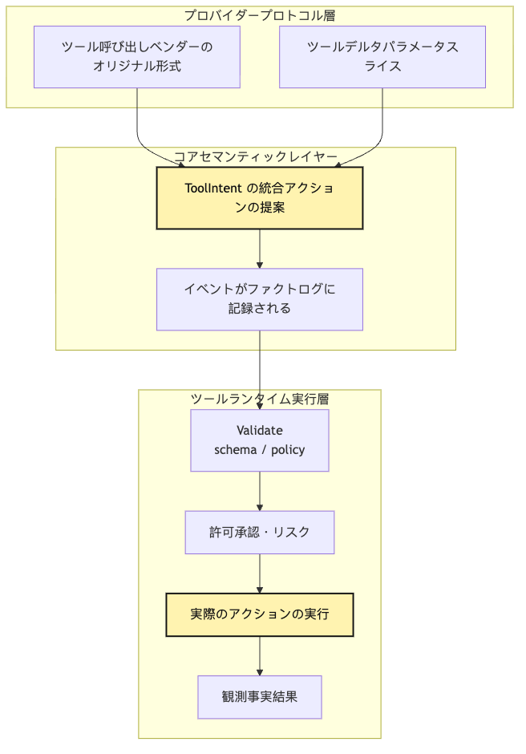
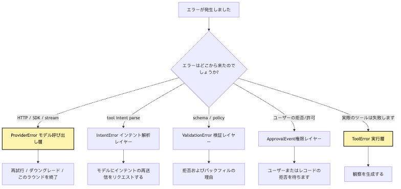
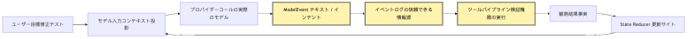

# Provider Runtime：なぜ provider は tool intent だけを返すべきか

この段落では、設計上の責任境界を明確にし、実装時に同じ判断を再現できるようにします。

```text
この段落では、設計上の責任境界を明確にし、実装時に同じ判断を再現できるようにします。
```

この部分では、Agent Harness の境界と runtime contract を工程上の観点から整理します。

この部分では、Agent Harness の境界と runtime contract を工程上の観点から整理します。

この部分では、Agent Harness の境界と runtime contract を工程上の観点から整理します。 `Intent / Execution`

この部分では、Agent Harness の境界と runtime contract を工程上の観点から整理します。

この段落では、設計上の責任境界を明確にし、実装時に同じ判断を再現できるようにします。

```text
この部分では、Agent Harness の境界と runtime contract を工程上の観点から整理します。
この段落では、設計上の責任境界を明確にし、実装時に同じ判断を再現できるようにします。
```

この段落では、設計上の責任境界を明確にし、実装時に同じ判断を再現できるようにします。

この部分では、Agent Harness の境界と runtime contract を工程上の観点から整理します。

ユーザーinput：

```text
この段落では、設計上の責任境界を明確にし、実装時に同じ判断を再現できるようにします。
```

この段落では、設計上の責任境界を明確にし、実装時に同じ判断を再現できるようにします。

```json
{
  "toolName": "bash",
  "input": {
    "command": "npm test"
  }
}
```

この部分では、Agent Harness の境界と runtime contract を工程上の観点から整理します。

この部分では、Agent Harness の境界と runtime contract を工程上の観点から整理します。 `execute`

この段落では、設計上の責任境界を明確にし、実装時に同じ判断を再現できるようにします。

```ts
const result = await streamText({
  model,
  messages,
  tools: {
    bash: tool({
      description: "Run a shell command",
      inputSchema: z.object({
        command: z.string(),
      }),
      execute: async ({ command }) => runShell(command),
    }),
  },
});
```

この段落では、設計上の責任境界を明確にし、実装時に同じ判断を再現できるようにします。

この部分では、Agent Harness の境界と runtime contract を工程上の観点から整理します。 `bash`

この部分では、Agent Harness の境界と runtime contract を工程上の観点から整理します。 `execute`

この段落では、設計上の責任境界を明確にし、実装時に同じ判断を再現できるようにします。

この段落では、設計上の責任境界を明確にし、実装時に同じ判断を再現できるようにします。

この段落では、設計上の責任境界を明確にし、実装時に同じ判断を再現できるようにします。

この段落では、設計上の責任境界を明確にし、実装時に同じ判断を再現できるようにします。

この部分では、Agent Harness の境界と runtime contract を工程上の観点から整理します。

この部分では、Agent Harness の境界と runtime contract を工程上の観点から整理します。

この段落では、設計上の責任境界を明確にし、実装時に同じ判断を再現できるようにします。

この部分では、Agent Harness の境界と runtime contract を工程上の観点から整理します。

この部分では、Agent Harness の境界と runtime contract を工程上の観点から整理します。

この段落では、設計上の責任境界を明確にし、実装時に同じ判断を再現できるようにします。

この部分では、Agent Harness の境界と runtime contract を工程上の観点から整理します。

この段落では、設計上の責任境界を明確にし、実装時に同じ判断を再現できるようにします。

```text
この部分では、Agent Harness の境界と runtime contract を工程上の観点から整理します。
この部分では、Agent Harness の境界と runtime contract を工程上の観点から整理します。
```

この段落では、設計上の責任境界を明確にし、実装時に同じ判断を再現できるようにします。

> この部分では、Agent Harness の境界と runtime contract を工程上の観点から整理します。

この部分では、Agent Harness の境界と runtime contract を工程上の観点から整理します。

この部分では、Agent Harness の境界と runtime contract を工程上の観点から整理します。

この段落では、設計上の責任境界を明確にし、実装時に同じ判断を再現できるようにします。

```text
この部分では、Agent Harness の境界と runtime contract を工程上の観点から整理します。
この部分では、Agent Harness の境界と runtime contract を工程上の観点から整理します。
この部分では、Agent Harness の境界と runtime contract を工程上の観点から整理します。
```

この段落では、設計上の責任境界を明確にし、実装時に同じ判断を再現できるようにします。

```text
この部分では、Agent Harness の境界と runtime contract を工程上の観点から整理します。
この部分では、Agent Harness の境界と runtime contract を工程上の観点から整理します。
この部分では、Agent Harness の境界と runtime contract を工程上の観点から整理します。
```

この段落では、設計上の責任境界を明確にし、実装時に同じ判断を再現できるようにします。

この段落では、設計上の責任境界を明確にし、実装時に同じ判断を再現できるようにします。

## 問題の連鎖

この段落では、設計上の責任境界を明確にし、実装時に同じ判断を再現できるようにします。

```text
この部分では、Agent Harness の境界と runtime contract を工程上の観点から整理します。
この部分では、Agent Harness の境界と runtime contract を工程上の観点から整理します。
この部分では、Agent Harness の境界と runtime contract を工程上の観点から整理します。
この部分では、Agent Harness の境界と runtime contract を工程上の観点から整理します。
この部分では、Agent Harness の境界と runtime contract を工程上の観点から整理します。
この部分では、Agent Harness の境界と runtime contract を工程上の観点から整理します。
この部分では、Agent Harness の境界と runtime contract を工程上の観点から整理します。
この部分では、Agent Harness の境界と runtime contract を工程上の観点から整理します。
この部分では、Agent Harness の境界と runtime contract を工程上の観点から整理します。
```

この段落では、設計上の責任境界を明確にし、実装時に同じ判断を再現できるようにします。



この段落では、設計上の責任境界を明確にし、実装時に同じ判断を再現できるようにします。

この段落では、設計上の責任境界を明確にし、実装時に同じ判断を再現できるようにします。

```text
Provider Runtime -X-> Tool Execution
```

この部分では、Agent Harness の境界と runtime contract を工程上の観点から整理します。

この段落では、設計上の責任境界を明確にし、実装時に同じ判断を再現できるようにします。

この段落では、設計上の責任境界を明確にし、実装時に同じ判断を再現できるようにします。

この部分では、Agent Harness の境界と runtime contract を工程上の観点から整理します。 `ToolIntent`

この部分では、Agent Harness の境界と runtime contract を工程上の観点から整理します。

この段落では、設計上の責任境界を明確にし、実装時に同じ判断を再現できるようにします。

この段落では、設計上の責任境界を明確にし、実装時に同じ判断を再現できるようにします。

```text
この段落では、設計上の責任境界を明確にし、実装時に同じ判断を再現できるようにします。
この部分では、Agent Harness の境界と runtime contract を工程上の観点から整理します。
この段落では、設計上の責任境界を明確にし、実装時に同じ判断を再現できるようにします。
この段落では、設計上の責任境界を明確にし、実装時に同じ判断を再現できるようにします。
```

この部分では、Agent Harness の境界と runtime contract を工程上の観点から整理します。

## 一、provider はもっとも簡単に「半分の Agent」へ膨張する

この段落では、設計上の責任境界を明確にし、実装時に同じ判断を再現できるようにします。

この段落では、設計上の責任境界を明確にし、実装時に同じ判断を再現できるようにします。

この段落では、設計上の責任境界を明確にし、実装時に同じ判断を再現できるようにします。

この段落では、設計上の責任境界を明確にし、実装時に同じ判断を再現できるようにします。

この段落では、設計上の責任境界を明確にし、実装時に同じ判断を再現できるようにします。

この段落では、設計上の責任境界を明確にし、実装時に同じ判断を再現できるようにします。

この部分では、Agent Harness の境界と runtime contract を工程上の観点から整理します。

```ts
const tools = {
  readFile: {
    description: "Read a file from the workspace",
    inputSchema: z.object({
      path: z.string(),
    }),
  },
  bash: {
    description: "Run a shell command",
    inputSchema: z.object({
      command: z.string(),
    }),
  },
};
```

この段落では、設計上の責任境界を明確にし、実装時に同じ判断を再現できるようにします。

この段落では、設計上の責任境界を明確にし、実装時に同じ判断を再現できるようにします。

```json
{
  "toolName": "bash",
  "input": {
    "command": "npm test"
  }
}
```

この段落では、設計上の責任境界を明確にし、実装時に同じ判断を再現できるようにします。

この段落では、設計上の責任境界を明確にし、実装時に同じ判断を再現できるようにします。

この段落では、設計上の責任境界を明確にし、実装時に同じ判断を再現できるようにします。

この部分では、Agent Harness の境界と runtime contract を工程上の観点から整理します。

```ts
if (part.type === "tool-call") {
  const result = await tools[part.toolName].execute(part.input);
  providerMessages.push(toToolResult(part, result));
}
```

この部分では、Agent Harness の境界と runtime contract を工程上の観点から整理します。

```ts
if (part.type === "tool-call") {
  emit({
    type: "tool_intent",
    intent: normalizeToolIntent(part),
  });
}
```

この段落では、設計上の責任境界を明確にし、実装時に同じ判断を再現できるようにします。

この段落では、設計上の責任境界を明確にし、実装時に同じ判断を再現できるようにします。

この段落では、設計上の責任境界を明確にし、実装時に同じ判断を再現できるようにします。

この段落では、設計上の責任境界を明確にし、実装時に同じ判断を再現できるようにします。

この部分では、Agent Harness の境界と runtime contract を工程上の観点から整理します。

この部分では、Agent Harness の境界と runtime contract を工程上の観点から整理します。

この部分では、Agent Harness の境界と runtime contract を工程上の観点から整理します。

この部分では、Agent Harness の境界と runtime contract を工程上の観点から整理します。

この段落では、設計上の責任境界を明確にし、実装時に同じ判断を再現できるようにします。

この部分では、Agent Harness の境界と runtime contract を工程上の観点から整理します。 `bash`

この段落では、設計上の責任境界を明確にし、実装時に同じ判断を再現できるようにします。

この段落では、設計上の責任境界を明確にし、実装時に同じ判断を再現できるようにします。

この段落では、設計上の責任境界を明確にし、実装時に同じ判断を再現できるようにします。

この部分では、Agent Harness の境界と runtime contract を工程上の観点から整理します。

この段落では、設計上の責任境界を明確にし、実装時に同じ判断を再現できるようにします。

この段落では、設計上の責任境界を明確にし、実装時に同じ判断を再現できるようにします。

この部分では、Agent Harness の境界と runtime contract を工程上の観点から整理します。

この部分では、Agent Harness の境界と runtime contract を工程上の観点から整理します。

### 隠れた loop の危険

この段落では、設計上の責任境界を明確にし、実装時に同じ判断を再現できるようにします。

この段落では、設計上の責任境界を明確にし、実装時に同じ判断を再現できるようにします。

この段落では、設計上の責任境界を明確にし、実装時に同じ判断を再現できるようにします。

```text
この部分では、Agent Harness の境界と runtime contract を工程上の観点から整理します。
この部分では、Agent Harness の境界と runtime contract を工程上の観点から整理します。
この部分では、Agent Harness の境界と runtime contract を工程上の観点から整理します。
この段落では、設計上の責任境界を明確にし、実装時に同じ判断を再現できるようにします。
```

この部分では、Agent Harness の境界と runtime contract を工程上の観点から整理します。

```text
この部分では、Agent Harness の境界と runtime contract を工程上の観点から整理します。
この段落では、設計上の責任境界を明確にし、実装時に同じ判断を再現できるようにします。
この部分では、Agent Harness の境界と runtime contract を工程上の観点から整理します。
この段落では、設計上の責任境界を明確にし、実装時に同じ判断を再現できるようにします。
この部分では、Agent Harness の境界と runtime contract を工程上の観点から整理します。
```

この部分では、Agent Harness の境界と runtime contract を工程上の観点から整理します。

この段落では、設計上の責任境界を明確にし、実装時に同じ判断を再現できるようにします。

この段落では、設計上の責任境界を明確にし、実装時に同じ判断を再現できるようにします。

```text
この段落では、設計上の責任境界を明確にし、実装時に同じ判断を再現できるようにします。
```

この部分では、Agent Harness の境界と runtime contract を工程上の観点から整理します。

この部分では、Agent Harness の境界と runtime contract を工程上の観点から整理します。

この部分では、Agent Harness の境界と runtime contract を工程上の観点から整理します。 `npm install`

この部分では、Agent Harness の境界と runtime contract を工程上の観点から整理します。

この段落では、設計上の責任境界を明確にし、実装時に同じ判断を再現できるようにします。

```text
この部分では、Agent Harness の境界と runtime contract を工程上の観点から整理します。
この段落では、設計上の責任境界を明確にし、実装時に同じ判断を再現できるようにします。
この段落では、設計上の責任境界を明確にし、実装時に同じ判断を再現できるようにします。
この段落では、設計上の責任境界を明確にし、実装時に同じ判断を再現できるようにします。
この段落では、設計上の責任境界を明確にし、実装時に同じ判断を再現できるようにします。
この段落では、設計上の責任境界を明確にし、実装時に同じ判断を再現できるようにします。
この段落では、設計上の責任境界を明確にし、実装時に同じ判断を再現できるようにします。
この段落では、設計上の責任境界を明確にし、実装時に同じ判断を再現できるようにします。
```

この段落では、設計上の責任境界を明確にし、実装時に同じ判断を再現できるようにします。

この段落では、設計上の責任境界を明確にし、実装時に同じ判断を再現できるようにします。

この段落では、設計上の責任境界を明確にし、実装時に同じ判断を再現できるようにします。

```text
この段落では、設計上の責任境界を明確にし、実装時に同じ判断を再現できるようにします。
この段落では、設計上の責任境界を明確にし、実装時に同じ判断を再現できるようにします。
この段落では、設計上の責任境界を明確にし、実装時に同じ判断を再現できるようにします。
この段落では、設計上の責任境界を明確にし、実装時に同じ判断を再現できるようにします。
この段落では、設計上の責任境界を明確にし、実装時に同じ判断を再現できるようにします。
この段落では、設計上の責任境界を明確にし、実装時に同じ判断を再現できるようにします。
```

この部分では、Agent Harness の境界と runtime contract を工程上の観点から整理します。

## 二、Tool Call、Tool Intent、Tool Execution は別物である

この段落では、設計上の責任境界を明確にし、実装時に同じ判断を再現できるようにします。

この部分では、Agent Harness の境界と runtime contract を工程上の観点から整理します。

この段落では、設計上の責任境界を明確にし、実装時に同じ判断を再現できるようにします。

```text
この部分では、Agent Harness の境界と runtime contract を工程上の観点から整理します。
この部分では、Agent Harness の境界と runtime contract を工程上の観点から整理します。
この部分では、Agent Harness の境界と runtime contract を工程上の観点から整理します。
```

この段落では、設計上の責任境界を明確にし、実装時に同じ判断を再現できるようにします。



この段落では、設計上の責任境界を明確にし、実装時に同じ判断を再現できるようにします。

この部分では、Agent Harness の境界と runtime contract を工程上の観点から整理します。 `Tool Call`

この段落では、設計上の責任境界を明確にし、実装時に同じ判断を再現できるようにします。

```json
{
  "id": "call_abc",
  "type": "function",
  "function": {
    "name": "read_file",
    "arguments": "{\"path\":\"package.json\"}"
  }
}
```

この段落では、設計上の責任境界を明確にし、実装時に同じ判断を再現できるようにします。

```json
{
  "type": "tool_use",
  "id": "toolu_123",
  "name": "read_file",
  "input": {
    "path": "package.json"
  }
}
```

この段落では、設計上の責任境界を明確にし、実装時に同じ判断を再現できるようにします。

```json
{
  "type": "tool-call-delta",
  "toolCallId": "call_abc",
  "toolName": "bash",
  "argsTextDelta": "{\"command\":\"npm"
}
```

この段落では、設計上の責任境界を明確にし、実装時に同じ判断を再現できるようにします。

```json
{
  "type": "tool-call-delta",
  "toolCallId": "call_abc",
  "argsTextDelta": " test\"}"
}
```

この部分では、Agent Harness の境界と runtime contract を工程上の観点から整理します。

この段落では、設計上の責任境界を明確にし、実装時に同じ判断を再現できるようにします。

この部分では、Agent Harness の境界と runtime contract を工程上の観点から整理します。 `ToolIntent`

```ts
type ToolIntent = {
  id: string;
  providerCallId?: string;
  toolName: string;
  input: unknown;
  rawInputText?: string;
  source: {
    provider: string;
    model: string;
    requestId?: string;
    streamIndex?: number;
  };
  status: "proposed";
};
```

この段落では、設計上の責任境界を明確にし、実装時に同じ判断を再現できるようにします。

この部分では、Agent Harness の境界と runtime contract を工程上の観点から整理します。 `Intent` `Execution`

この段落では、設計上の責任境界を明確にし、実装時に同じ判断を再現できるようにします。

この部分では、Agent Harness の境界と runtime contract を工程上の観点から整理します。 `providerCallId`

この部分では、Agent Harness の境界と runtime contract を工程上の観点から整理します。

この段落では、設計上の責任境界を明確にし、実装時に同じ判断を再現できるようにします。 `rawInputText`

この段落では、設計上の責任境界を明確にし、実装時に同じ判断を再現できるようにします。

この部分では、Agent Harness の境界と runtime contract を工程上の観点から整理します。

この部分では、Agent Harness の境界と runtime contract を工程上の観点から整理します。

この段落では、設計上の責任境界を明確にし、実装時に同じ判断を再現できるようにします。 `proposed`

この部分では、Agent Harness の境界と runtime contract を工程上の観点から整理します。 `validated` `approved` `executed` `observed`

### なぜ名前が重要なのか

この段落では、設計上の責任境界を明確にし、実装時に同じ判断を再現できるようにします。

この部分では、Agent Harness の境界と runtime contract を工程上の観点から整理します。 `ToolInvocation`

```text
この段落では、設計上の責任境界を明確にし、実装時に同じ判断を再現できるようにします。
```

この部分では、Agent Harness の境界と runtime contract を工程上の観点から整理します。 `ToolCall`

この部分では、Agent Harness の境界と runtime contract を工程上の観点から整理します。 `ToolIntent`

```text
この段落では、設計上の責任境界を明確にし、実装時に同じ判断を再現できるようにします。
```

この段落では、設計上の責任境界を明確にし、実装時に同じ判断を再現できるようにします。

この段落では、設計上の責任境界を明確にし、実装時に同じ判断を再現できるようにします。

```json
{
  "toolName": "bash",
  "input": {
    "command": "rm -rf node_modules && npm install"
  }
}
```

この段落では、設計上の責任境界を明確にし、実装時に同じ判断を再現できるようにします。

この段落では、設計上の責任境界を明確にし、実装時に同じ判断を再現できるようにします。

```text
この部分では、Agent Harness の境界と runtime contract を工程上の観点から整理します。
```

この段落では、設計上の責任境界を明確にし、実装時に同じ判断を再現できるようにします。

## 三、AI SDK Bridge：橋は借りても、制御権は渡さない

この部分では、Agent Harness の境界と runtime contract を工程上の観点から整理します。

この段落では、設計上の責任境界を明確にし、実装時に同じ判断を再現できるようにします。

この部分では、Agent Harness の境界と runtime contract を工程上の観点から整理します。

この段落では、設計上の責任境界を明確にし、実装時に同じ判断を再現できるようにします。

```text
この部分では、Agent Harness の境界と runtime contract を工程上の観点から整理します。
この段落では、設計上の責任境界を明確にし、実装時に同じ判断を再現できるようにします。
streaming part
この部分では、Agent Harness の境界と runtime contract を工程上の観点から整理します。
finish reason
usage
error part
telemetry
この段落では、設計上の責任境界を明確にし、実装時に同じ判断を再現できるようにします。
```

この段落では、設計上の責任境界を明確にし、実装時に同じ判断を再現できるようにします。

この部分では、Agent Harness の境界と runtime contract を工程上の観点から整理します。

この段落では、設計上の責任境界を明確にし、実装時に同じ判断を再現できるようにします。

```text
この部分では、Agent Harness の境界と runtime contract を工程上の観点から整理します。
この段落では、設計上の責任境界を明確にし、実装時に同じ判断を再現できるようにします。
```

この段落では、設計上の責任境界を明確にし、実装時に同じ判断を再現できるようにします。

この段落では、設計上の責任境界を明確にし、実装時に同じ判断を再現できるようにします。

この部分では、Agent Harness の境界と runtime contract を工程上の観点から整理します。

この部分では、Agent Harness の境界と runtime contract を工程上の観点から整理します。

この部分では、Agent Harness の境界と runtime contract を工程上の観点から整理します。

この段落では、設計上の責任境界を明確にし、実装時に同じ判断を再現できるようにします。

### 二つの接続方式

この部分では、Agent Harness の境界と runtime contract を工程上の観点から整理します。

この段落では、設計上の責任境界を明確にし、実装時に同じ判断を再現できるようにします。

```ts
await streamText({
  model,
  messages,
  tools: {
    readFile: tool({
      inputSchema: readFileSchema,
      execute: async (input) => fileSystem.read(input.path),
    }),
    bash: tool({
      inputSchema: bashSchema,
      execute: async (input) => shell.run(input.command),
    }),
  },
  stopWhen: isStepCount(5),
});
```

この段落では、設計上の責任境界を明確にし、実装時に同じ判断を再現できるようにします。

この部分では、Agent Harness の境界と runtime contract を工程上の観点から整理します。 `getWeather`

この段落では、設計上の責任境界を明確にし、実装時に同じ判断を再現できるようにします。

この部分では、Agent Harness の境界と runtime contract を工程上の観点から整理します。 `execute`

この段落では、設計上の責任境界を明確にし、実装時に同じ判断を再現できるようにします。 `execute`

この部分では、Agent Harness の境界と runtime contract を工程上の観点から整理します。

この部分では、Agent Harness の境界と runtime contract を工程上の観点から整理します。

この部分では、Agent Harness の境界と runtime contract を工程上の観点から整理します。

この段落では、設計上の責任境界を明確にし、実装時に同じ判断を再現できるようにします。

```ts
const result = streamText({
  model,
  messages,
  tools: describeToolsForModel(toolRegistry),
});

for await (const part of result.fullStream) {
  switch (part.type) {
    case "text":
      yield modelTextDelta(part);
      break;

    case "tool-call-delta":
      toolCallAssembler.push(part);
      break;

    case "tool-call":
      yield toolIntentEvent(normalizeToolCall(part));
      break;

    case "finish":
      yield modelFinish(part);
      break;

    case "error":
      yield providerError(part);
      break;
  }
}
```

この部分では、Agent Harness の境界と runtime contract を工程上の観点から整理します。

この段落では、設計上の責任境界を明確にし、実装時に同じ判断を再現できるようにします。

この段落では、設計上の責任境界を明確にし、実装時に同じ判断を再現できるようにします。

この部分では、Agent Harness の境界と runtime contract を工程上の観点から整理します。 `ModelEvent` `ToolIntent`

この部分では、Agent Harness の境界と runtime contract を工程上の観点から整理します。

この部分では、Agent Harness の境界と runtime contract を工程上の観点から整理します。

この段落では、設計上の責任境界を明確にし、実装時に同じ判断を再現できるようにします。

```text
この段落では、設計上の責任境界を明確にし、実装時に同じ判断を再現できるようにします。
```

### SDK の multi-step tool execution をそのまま信じない理由

この部分では、Agent Harness の境界と runtime contract を工程上の観点から整理します。

この部分では、Agent Harness の境界と runtime contract を工程上の観点から整理します。

この部分では、Agent Harness の境界と runtime contract を工程上の観点から整理します。

この段落では、設計上の責任境界を明確にし、実装時に同じ判断を再現できるようにします。

この段落では、設計上の責任境界を明確にし、実装時に同じ判断を再現できるようにします。

この段落では、設計上の責任境界を明確にし、実装時に同じ判断を再現できるようにします。

この段落では、設計上の責任境界を明確にし、実装時に同じ判断を再現できるようにします。

この段落では、設計上の責任境界を明確にし、実装時に同じ判断を再現できるようにします。

```text
この段落では、設計上の責任境界を明確にし、実装時に同じ判断を再現できるようにします。
この段落では、設計上の責任境界を明確にし、実装時に同じ判断を再現できるようにします。
この段落では、設計上の責任境界を明確にし、実装時に同じ判断を再現できるようにします。
この段落では、設計上の責任境界を明確にし、実装時に同じ判断を再現できるようにします。
この段落では、設計上の責任境界を明確にし、実装時に同じ判断を再現できるようにします。
この段落では、設計上の責任境界を明確にし、実装時に同じ判断を再現できるようにします。
この段落では、設計上の責任境界を明確にし、実装時に同じ判断を再現できるようにします。
この段落では、設計上の責任境界を明確にし、実装時に同じ判断を再現できるようにします。
この段落では、設計上の責任境界を明確にし、実装時に同じ判断を再現できるようにします。
```

この部分では、Agent Harness の境界と runtime contract を工程上の観点から整理します。

この段落では、設計上の責任境界を明確にし、実装時に同じ判断を再現できるようにします。

この段落では、設計上の責任境界を明確にし、実装時に同じ判断を再現できるようにします。

```text
permission policy
hook gate
sandbox
audit ledger
result budget
observation truncation
retry classifier
session replay
eval trace
```

この段落では、設計上の責任境界を明確にし、実装時に同じ判断を再現できるようにします。

この段落では、設計上の責任境界を明確にし、実装時に同じ判断を再現できるようにします。

## 四、Streaming Runtime：event は流れてよいが、execution は先走ってはいけない

この部分では、Agent Harness の境界と runtime contract を工程上の観点から整理します。

この段落では、設計上の責任境界を明確にし、実装時に同じ判断を再現できるようにします。

```text
この段落では、設計上の責任境界を明確にし、実装時に同じ判断を再現できるようにします。
この段落では、設計上の責任境界を明確にし、実装時に同じ判断を再現できるようにします。
event log record text_delta
```

この部分では、Agent Harness の境界と runtime contract を工程上の観点から整理します。

この部分では、Agent Harness の境界と runtime contract を工程上の観点から整理します。

この段落では、設計上の責任境界を明確にし、実装時に同じ判断を再現できるようにします。

```bash
npm test -- --runInBand
```

この段落では、設計上の責任境界を明確にし、実装時に同じ判断を再現できるようにします。

この段落では、設計上の責任境界を明確にし、実装時に同じ判断を再現できるようにします。

```text
tool-call-start: id=call_1 name=bash
tool-call-delta: {"command":"npm
tool-call-delta:  test
tool-call-delta:  -- --runInBand"}
tool-call-end
```

この部分では、Agent Harness の境界と runtime contract を工程上の観点から整理します。

この段落では、設計上の責任境界を明確にし、実装時に同じ判断を再現できるようにします。

この段落では、設計上の責任境界を明確にし、実装時に同じ判断を再現できるようにします。

この部分では、Agent Harness の境界と runtime contract を工程上の観点から整理します。 `ToolIntentProposed`

この段落では、設計上の責任境界を明確にし、実装時に同じ判断を再現できるようにします。

この段落では、設計上の責任境界を明確にし、実装時に同じ判断を再現できるようにします。

この段落では、設計上の責任境界を明確にし、実装時に同じ判断を再現できるようにします。

この段落では、設計上の責任境界を明確にし、実装時に同じ判断を再現できるようにします。

この段落では、設計上の責任境界を明確にし、実装時に同じ判断を再現できるようにします。

この段落では、設計上の責任境界を明確にし、実装時に同じ判断を再現できるようにします。

この段落では、設計上の責任境界を明確にし、実装時に同じ判断を再現できるようにします。

この段落では、設計上の責任境界を明確にし、実装時に同じ判断を再現できるようにします。


この部分では、Agent Harness の境界と runtime contract を工程上の観点から整理します。

この段落では、設計上の責任境界を明確にし、実装時に同じ判断を再現できるようにします。

この段落では、設計上の責任境界を明確にし、実装時に同じ判断を再現できるようにします。

この部分では、Agent Harness の境界と runtime contract を工程上の観点から整理します。

この部分では、Agent Harness の境界と runtime contract を工程上の観点から整理します。

### なぜ streaming delta を event model に入れるのか

この段落では、設計上の責任境界を明確にし、実装時に同じ判断を再現できるようにします。

この部分では、Agent Harness の境界と runtime contract を工程上の観点から整理します。

この段落では、設計上の責任境界を明確にし、実装時に同じ判断を再現できるようにします。

この段落では、設計上の責任境界を明確にし、実装時に同じ判断を再現できるようにします。

この部分では、Agent Harness の境界と runtime contract を工程上の観点から整理します。

この段落では、設計上の責任境界を明確にし、実装時に同じ判断を再現できるようにします。

```ts
type ToolIntentProposedEvent = {
  type: "tool_intent.proposed";
  intent: ToolIntent;
  assembledFrom?: {
    eventCount: number;
    firstOffset: number;
    lastOffset: number;
    hadRepair?: boolean;
  };
};
```

この段落では、設計上の責任境界を明確にし、実装時に同じ判断を再現できるようにします。

```text
この部分では、Agent Harness の境界と runtime contract を工程上の観点から整理します。
この段落では、設計上の責任境界を明確にし、実装時に同じ判断を再現できるようにします。
この段落では、設計上の責任境界を明確にし、実装時に同じ判断を再現できるようにします。
この部分では、Agent Harness の境界と runtime contract を工程上の観点から整理します。
```

この段落では、設計上の責任境界を明確にし、実装時に同じ判断を再現できるようにします。

この段落では、設計上の責任境界を明確にし、実装時に同じ判断を再現できるようにします。

この段落では、設計上の責任境界を明確にし、実装時に同じ判断を再現できるようにします。

この段落では、設計上の責任境界を明確にし、実装時に同じ判断を再現できるようにします。

この部分では、Agent Harness の境界と runtime contract を工程上の観点から整理します。

この段落では、設計上の責任境界を明確にし、実装時に同じ判断を再現できるようにします。

この段落では、設計上の責任境界を明確にし、実装時に同じ判断を再現できるようにします。

この部分では、Agent Harness の境界と runtime contract を工程上の観点から整理します。 `tool_intent.delta`

この段落では、設計上の責任境界を明確にし、実装時に同じ判断を再現できるようにします。

```text
この部分では、Agent Harness の境界と runtime contract を工程上の観点から整理します。
この段落では、設計上の責任境界を明確にし、実装時に同じ判断を再現できるようにします。
この部分では、Agent Harness の境界と runtime contract を工程上の観点から整理します。
```

## 五、Error mapping：provider error は tool error ではない

この部分では、Agent Harness の境界と runtime contract を工程上の観点から整理します。

この部分では、Agent Harness の境界と runtime contract を工程上の観点から整理します。

```text
この段落では、設計上の責任境界を明確にし、実装時に同じ判断を再現できるようにします。
この段落では、設計上の責任境界を明確にし、実装時に同じ判断を再現できるようにします。
rate limit
overloaded
timeout
context length exceeded
bad request
model unavailable
stream interrupted
tool call JSON malformed
unsupported tool schema
```

この部分では、Agent Harness の境界と runtime contract を工程上の観点から整理します。

この段落では、設計上の責任境界を明確にし、実装時に同じ判断を再現できるようにします。

この段落では、設計上の責任境界を明確にし、実装時に同じ判断を再現できるようにします。

この部分では、Agent Harness の境界と runtime contract を工程上の観点から整理します。

この部分では、Agent Harness の境界と runtime contract を工程上の観点から整理します。

この段落では、設計上の責任境界を明確にし、実装時に同じ判断を再現できるようにします。 `rate_limit`

この段落では、設計上の責任境界を明確にし、実装時に同じ判断を再現できるようにします。

この部分では、Agent Harness の境界と runtime contract を工程上の観点から整理します。 `bash`

この部分では、Agent Harness の境界と runtime contract を工程上の観点から整理します。 `tool_call_json_malformed`

この部分では、Agent Harness の境界と runtime contract を工程上の観点から整理します。

この段落では、設計上の責任境界を明確にし、実装時に同じ判断を再現できるようにします。 `readFile`

この部分では、Agent Harness の境界と runtime contract を工程上の観点から整理します。

```text
この段落では、設計上の責任境界を明確にし、実装時に同じ判断を再現できるようにします。
この段落では、設計上の責任境界を明確にし、実装時に同じ判断を再現できるようにします。
この段落では、設計上の責任境界を明確にし、実装時に同じ判断を再現できるようにします。
```

この段落では、設計上の責任境界を明確にし、実装時に同じ判断を再現できるようにします。

```text
provider stream incomplete
この部分では、Agent Harness の境界と runtime contract を工程上の観点から整理します。
```

この部分では、Agent Harness の境界と runtime contract を工程上の観点から整理します。

この段落では、設計上の責任境界を明確にし、実装時に同じ判断を再現できるようにします。

```ts
type ProviderErrorKind =
  | "auth"
  | "rate_limit"
  | "quota"
  | "timeout"
  | "overloaded"
  | "bad_request"
  | "context_length"
  | "stream_interrupted"
  | "unsupported_feature"
  | "malformed_tool_call"
  | "unknown";
```

この段落では、設計上の責任境界を明確にし、実装時に同じ判断を再現できるようにします。

```ts
type ProviderErrorEvent = {
  type: "provider.error";
  kind: ProviderErrorKind;
  retryable: boolean;
  provider: string;
  model: string;
  requestId?: string;
  message: string;
  raw?: unknown;
};
```

この段落では、設計上の責任境界を明確にし、実装時に同じ判断を再現できるようにします。

この段落では、設計上の責任境界を明確にし、実装時に同じ判断を再現できるようにします。



この段落では、設計上の責任境界を明確にし、実装時に同じ判断を再現できるようにします。

この段落では、設計上の責任境界を明確にし、実装時に同じ判断を再現できるようにします。

この部分では、Agent Harness の境界と runtime contract を工程上の観点から整理します。

この部分では、Agent Harness の境界と runtime contract を工程上の観点から整理します。

この部分では、Agent Harness の境界と runtime contract を工程上の観点から整理します。

この部分では、Agent Harness の境界と runtime contract を工程上の観点から整理します。

この段落では、設計上の責任境界を明確にし、実装時に同じ判断を再現できるようにします。

この部分では、Agent Harness の境界と runtime contract を工程上の観点から整理します。

この段落では、設計上の責任境界を明確にし、実装時に同じ判断を再現できるようにします。

この段落では、設計上の責任境界を明確にし、実装時に同じ判断を再現できるようにします。

```text
retry
fallback
compact
ask user
fail run
```

### fallback でも tool をこっそり実行してはいけない

この部分では、Agent Harness の境界と runtime contract を工程上の観点から整理します。

この部分では、Agent Harness の境界と runtime contract を工程上の観点から整理します。

この段落では、設計上の責任境界を明確にし、実装時に同じ判断を再現できるようにします。

この段落では、設計上の責任境界を明確にし、実装時に同じ判断を再現できるようにします。

```text
この部分では、Agent Harness の境界と runtime contract を工程上の観点から整理します。
この段落では、設計上の責任境界を明確にし、実装時に同じ判断を再現できるようにします。
```

してはいけない。

この段落では、設計上の責任境界を明確にし、実装時に同じ判断を再現できるようにします。

この段落では、設計上の責任境界を明確にし、実装時に同じ判断を再現できるようにします。

この部分では、Agent Harness の境界と runtime contract を工程上の観点から整理します。 `ModelEvent` `ToolIntent`

この部分では、Agent Harness の境界と runtime contract を工程上の観点から整理します。

この段落では、設計上の責任境界を明確にし、実装時に同じ判断を再現できるようにします。

```text
この部分では、Agent Harness の境界と runtime contract を工程上の観点から整理します。
この部分では、Agent Harness の境界と runtime contract を工程上の観点から整理します。
この部分では、Agent Harness の境界と runtime contract を工程上の観点から整理します。
```

この部分では、Agent Harness の境界と runtime contract を工程上の観点から整理します。

この部分では、Agent Harness の境界と runtime contract を工程上の観点から整理します。

```text
この部分では、Agent Harness の境界と runtime contract を工程上の観点から整理します。
この部分では、Agent Harness の境界と runtime contract を工程上の観点から整理します。
```

## 六、Core は荷重を支える chain 全体を見る必要がある

この段落では、設計上の責任境界を明確にし、実装時に同じ判断を再現できるようにします。

この段落では、設計上の責任境界を明確にし、実装時に同じ判断を再現できるようにします。

```text
この段落では、設計上の責任境界を明確にし、実装時に同じ判断を再現できるようにします。
```

この段落では、設計上の責任境界を明確にし、実装時に同じ判断を再現できるようにします。

```text
この段落では、設計上の責任境界を明確にし、実装時に同じ判断を再現できるようにします。
この部分では、Agent Harness の境界と runtime contract を工程上の観点から整理します。
この段落では、設計上の責任境界を明確にし、実装時に同じ判断を再現できるようにします。
この部分では、Agent Harness の境界と runtime contract を工程上の観点から整理します。
この部分では、Agent Harness の境界と runtime contract を工程上の観点から整理します。
この部分では、Agent Harness の境界と runtime contract を工程上の観点から整理します。
-> Core record tool_intent.proposed
-> Tool Runtime validation command
この部分では、Agent Harness の境界と runtime contract を工程上の観点から整理します。
この部分では、Agent Harness の境界と runtime contract を工程上の観点から整理します。
-> Observation record exit code、stdout、stderr、truncation
この部分では、Agent Harness の境界と runtime contract を工程上の観点から整理します。
この部分では、Agent Harness の境界と runtime contract を工程上の観点から整理します。
```

この段落では、設計上の責任境界を明確にし、実装時に同じ判断を再現できるようにします。

この段落では、設計上の責任境界を明確にし、実装時に同じ判断を再現できるようにします。

この段落では、設計上の責任境界を明確にし、実装時に同じ判断を再現できるようにします。

```text
この段落では、設計上の責任境界を明確にし、実装時に同じ判断を再現できるようにします。
この部分では、Agent Harness の境界と runtime contract を工程上の観点から整理します。
この部分では、Agent Harness の境界と runtime contract を工程上の観点から整理します。
この部分では、Agent Harness の境界と runtime contract を工程上の観点から整理します。
この部分では、Agent Harness の境界と runtime contract を工程上の観点から整理します。
この部分では、Agent Harness の境界と runtime contract を工程上の観点から整理します。
この部分では、Agent Harness の境界と runtime contract を工程上の観点から整理します。
```

この段落では、設計上の責任境界を明確にし、実装時に同じ判断を再現できるようにします。



この段落では、設計上の責任境界を明確にし、実装時に同じ判断を再現できるようにします。

この部分では、Agent Harness の境界と runtime contract を工程上の観点から整理します。

ではない provider。

この段落では、設計上の責任境界を明確にし、実装時に同じ判断を再現できるようにします。

この段落では、設計上の責任境界を明確にし、実装時に同じ判断を再現できるようにします。

この段落では、設計上の責任境界を明確にし、実装時に同じ判断を再現できるようにします。

この部分では、Agent Harness の境界と runtime contract を工程上の観点から整理します。

この段落では、設計上の責任境界を明確にし、実装時に同じ判断を再現できるようにします。

この部分では、Agent Harness の境界と runtime contract を工程上の観点から整理します。

### なぜ Core はまず intent を記録すべきか

この段落では、設計上の責任境界を明確にし、実装時に同じ判断を再現できるようにします。

```text
この部分では、Agent Harness の境界と runtime contract を工程上の観点から整理します。
この部分では、Agent Harness の境界と runtime contract を工程上の観点から整理します。
```

この段落では、設計上の責任境界を明確にし、実装時に同じ判断を再現できるようにします。

この部分では、Agent Harness の境界と runtime contract を工程上の観点から整理します。

この部分では、Agent Harness の境界と runtime contract を工程上の観点から整理します。

この部分では、Agent Harness の境界と runtime contract を工程上の観点から整理します。

この段落では、設計上の責任境界を明確にし、実装時に同じ判断を再現できるようにします。

この段落では、設計上の責任境界を明確にし、実装時に同じ判断を再現できるようにします。

```text
この部分では、Agent Harness の境界と runtime contract を工程上の観点から整理します。
```

この段落では、設計上の責任境界を明確にし、実装時に同じ判断を再現できるようにします。

```text
pnpm test
```

この段落では、設計上の責任境界を明確にし、実装時に同じ判断を再現できるようにします。

この部分では、Agent Harness の境界と runtime contract を工程上の観点から整理します。

この段落では、設計上の責任境界を明確にし、実装時に同じ判断を再現できるようにします。

この段落では、設計上の責任境界を明確にし、実装時に同じ判断を再現できるようにします。

```text
git reset --hard
```

この段落では、設計上の責任境界を明確にし、実装時に同じ判断を再現できるようにします。

この段落では、設計上の責任境界を明確にし、実装時に同じ判断を再現できるようにします。

この段落では、設計上の責任境界を明確にし、実装時に同じ判断を再現できるようにします。

この段落では、設計上の責任境界を明確にし、実装時に同じ判断を再現できるようにします。

```text
この段落では、設計上の責任境界を明確にし、実装時に同じ判断を再現できるようにします。
```

この段落では、設計上の責任境界を明確にし、実装時に同じ判断を再現できるようにします。

この段落では、設計上の責任境界を明確にし、実装時に同じ判断を再現できるようにします。

## 七、Provider Runtime の最小 interface

この段落では、設計上の責任境界を明確にし、実装時に同じ判断を再現できるようにします。

この部分では、Agent Harness の境界と runtime contract を工程上の観点から整理します。

この部分では、Agent Harness の境界と runtime contract を工程上の観点から整理します。

この段落では、設計上の責任境界を明確にし、実装時に同じ判断を再現できるようにします。

```ts
type ModelRequest = {
  runId: string;
  turnId: string;
  model: string;
  messages: ModelMessage[];
  tools: ModelToolDescription[];
  options: {
    temperature?: number;
    maxOutputTokens?: number;
    abortSignal?: AbortSignal;
  };
};
```

この部分では、Agent Harness の境界と runtime contract を工程上の観点から整理します。 `tools`

この段落では、設計上の責任境界を明確にし、実装時に同じ判断を再現できるようにします。

この段落では、設計上の責任境界を明確にし、実装時に同じ判断を再現できるようにします。

```ts
type ModelToolDescription = {
  name: string;
  description: string;
  inputSchema: JsonSchema;
};
```

この段落では、設計上の責任境界を明確にし、実装時に同じ判断を再現できるようにします。

```ts
type WrongModelToolDescription = {
  name: string;
  description: string;
  inputSchema: JsonSchema;
  execute: (input: unknown) => Promise<unknown>;
};
```

この段落では、設計上の責任境界を明確にし、実装時に同じ判断を再現できるようにします。

この部分では、Agent Harness の境界と runtime contract を工程上の観点から整理します。

この部分では、Agent Harness の境界と runtime contract を工程上の観点から整理します。

この段落では、設計上の責任境界を明確にし、実装時に同じ判断を再現できるようにします。

```ts
type ModelEvent =
  | ModelStarted
  | ModelTextDelta
  | ModelReasoningDelta
  | ToolIntentDelta
  | ToolIntentProposed
  | ModelFinished
  | ProviderError;
```

この部分では、Agent Harness の境界と runtime contract を工程上の観点から整理します。 `ToolIntentProposed`

```ts
type ToolIntentProposed = {
  type: "tool_intent.proposed";
  id: string;
  turnId: string;
  intent: {
    toolName: string;
    input: unknown;
    providerCallId?: string;
  };
  provider: {
    name: string;
    model: string;
    requestId?: string;
  };
};
```

この部分では、Agent Harness の境界と runtime contract を工程上の観点から整理します。

```ts
interface ProviderRuntime {
  stream(request: ModelRequest): AsyncIterable<ModelEvent>;
}
```

この段落では、設計上の責任境界を明確にし、実装時に同じ判断を再現できるようにします。

```text
executeTool()
runLoop()
continueUntilDone()
approveTool()
appendToolResult()
```

この段落では、設計上の責任境界を明確にし、実装時に同じ判断を再現できるようにします。

この段落では、設計上の責任境界を明確にし、実装時に同じ判断を再現できるようにします。

この部分では、Agent Harness の境界と runtime contract を工程上の観点から整理します。 `bash`

この段落では、設計上の責任境界を明確にし、実装時に同じ判断を再現できるようにします。

この段落では、設計上の責任境界を明確にし、実装時に同じ判断を再現できるようにします。

この段落では、設計上の責任境界を明確にし、実装時に同じ判断を再現できるようにします。

### Tool result を provider に戻す方法

この段落では、設計上の責任境界を明確にし、実装時に同じ判断を再現できるようにします。

この部分では、Agent Harness の境界と runtime contract を工程上の観点から整理します。

この段落では、設計上の責任境界を明確にし、実装時に同じ判断を再現できるようにします。

```text
この部分では、Agent Harness の境界と runtime contract を工程上の観点から整理します。
この部分では、Agent Harness の境界と runtime contract を工程上の観点から整理します。
```

この部分では、Agent Harness の境界と runtime contract を工程上の観点から整理します。 `ModelMessage`

この部分では、Agent Harness の境界と runtime contract を工程上の観点から整理します。

```json
{
  "role": "tool",
  "tool_call_id": "call_abc",
  "content": "test failed..."
}
```

この部分では、Agent Harness の境界と runtime contract を工程上の観点から整理します。

```json
{
  "type": "tool_result",
  "tool_use_id": "toolu_123",
  "content": "test failed..."
}
```

この部分では、Agent Harness の境界と runtime contract を工程上の観点から整理します。

この部分では、Agent Harness の境界と runtime contract を工程上の観点から整理します。 `Observation`

この段落では、設計上の責任境界を明確にし、実装時に同じ判断を再現できるようにします。

この段落では、設計上の責任境界を明確にし、実装時に同じ判断を再現できるようにします。

```ts
const messages = contextProjection.buildModelMessages({
  sessionEvents,
  currentState,
  providerCapabilities,
});

for await (const event of providerRuntime.stream({
  messages,
  tools: describeToolsForModel(toolRegistry),
})) {
  await core.handleModelEvent(event);
}
```

この段落では、設計上の責任境界を明確にし、実装時に同じ判断を再現できるようにします。

この部分では、Agent Harness の境界と runtime contract を工程上の観点から整理します。

## 八、provider 固有形式から内部 event へ

この部分では、Agent Harness の境界と runtime contract を工程上の観点から整理します。

この段落では、設計上の責任境界を明確にし、実装時に同じ判断を再現できるようにします。

```text
この部分では、Agent Harness の境界と runtime contract を工程上の観点から整理します。
この部分では、Agent Harness の境界と runtime contract を工程上の観点から整理します。
この部分では、Agent Harness の境界と runtime contract を工程上の観点から整理します。
この部分では、Agent Harness の境界と runtime contract を工程上の観点から整理します。
```

この段落では、設計上の責任境界を明確にし、実装時に同じ判断を再現できるようにします。


この部分では、Agent Harness の境界と runtime contract を工程上の観点から整理します。

この段落では、設計上の責任境界を明確にし、実装時に同じ判断を再現できるようにします。

この部分では、Agent Harness の境界と runtime contract を工程上の観点から整理します。

この部分では、Agent Harness の境界と runtime contract を工程上の観点から整理します。

この段落では、設計上の責任境界を明確にし、実装時に同じ判断を再現できるようにします。

### Request Builder

この部分では、Agent Harness の境界と runtime contract を工程上の観点から整理します。

この段落では、設計上の責任境界を明確にし、実装時に同じ判断を再現できるようにします。

```text
この段落では、設計上の責任境界を明確にし、実装時に同じ判断を再現できるようにします。
この部分では、Agent Harness の境界と runtime contract を工程上の観点から整理します。
この部分では、Agent Harness の境界と runtime contract を工程上の観点から整理します。
model options
この部分では、Agent Harness の境界と runtime contract を工程上の観点から整理します。
capability flags
```

この段落では、設計上の責任境界を明確にし、実装時に同じ判断を再現できるようにします。

```text
この部分では、Agent Harness の境界と runtime contract を工程上の観点から整理します。
この段落では、設計上の責任境界を明確にし、実装時に同じ判断を再現できるようにします。
この段落では、設計上の責任境界を明確にし、実装時に同じ判断を再現できるようにします。
この段落では、設計上の責任境界を明確にし、実装時に同じ判断を再現できるようにします。
```

この部分では、Agent Harness の境界と runtime contract を工程上の観点から整理します。

この部分では、Agent Harness の境界と runtime contract を工程上の観点から整理します。

### Stream Normalizer

この部分では、Agent Harness の境界と runtime contract を工程上の観点から整理します。

たとえば：

```text
text delta -> model.text_delta
reasoning delta -> model.reasoning_delta
finish reason -> model.finished
usage -> model.usage
この部分では、Agent Harness の境界と runtime contract を工程上の観点から整理します。
tool-call complete -> tool_intent.proposed
error part -> provider.error
```

この段落では、設計上の責任境界を明確にし、実装時に同じ判断を再現できるようにします。

この段落では、設計上の責任境界を明確にし、実装時に同じ判断を再現できるようにします。

この段落では、設計上の責任境界を明確にし、実装時に同じ判断を再現できるようにします。

この部分では、Agent Harness の境界と runtime contract を工程上の観点から整理します。

この段落では、設計上の責任境界を明確にし、実装時に同じ判断を再現できるようにします。

この部分では、Agent Harness の境界と runtime contract を工程上の観点から整理します。

この段落では、設計上の責任境界を明確にし、実装時に同じ判断を再現できるようにします。

```text
この部分では、Agent Harness の境界と runtime contract を工程上の観点から整理します。
この部分では、Agent Harness の境界と runtime contract を工程上の観点から整理します。
```

### Tool Call Assembler

この部分では、Agent Harness の境界と runtime contract を工程上の観点から整理します。

この部分では、Agent Harness の境界と runtime contract を工程上の観点から整理します。

たとえば：

```ts
class ToolCallAssembler {
  private calls = new Map<string, PartialToolCall>();

  push(delta: ProviderToolCallDelta): ToolIntentDelta | ToolIntentProposed {
    const current = this.merge(delta);

    if (!current.isComplete) {
      return {
        type: "tool_intent.delta",
        providerCallId: current.id,
        toolName: current.toolName,
        rawInputText: current.rawArgs,
      };
    }

    return {
      type: "tool_intent.proposed",
      id: createIntentId(),
      intent: {
        toolName: current.toolName,
        input: parseJson(current.rawArgs),
        providerCallId: current.id,
      },
      provider: current.provider,
    };
  }
}
```

この段落では、設計上の責任境界を明確にし、実装時に同じ判断を再現できるようにします。

ではない session state。

ではない conversation state。

ではない tool execution state。

この部分では、Agent Harness の境界と runtime contract を工程上の観点から整理します。

この段落では、設計上の責任境界を明確にし、実装時に同じ判断を再現できるようにします。

```text
この部分では、Agent Harness の境界と runtime contract を工程上の観点から整理します。
```

### Error Mapper

この部分では、Agent Harness の境界と runtime contract を工程上の観点から整理します。

この段落では、設計上の責任境界を明確にし、実装時に同じ判断を再現できるようにします。

```text
HTTP 401 -> auth / retryable false
HTTP 429 -> rate_limit / retryable true
HTTP 529 -> overloaded / retryable true
context window exceeded -> context_length / retryable false until compacted
SDK abort -> aborted / retryable depends on caller
malformed tool args -> malformed_tool_call / retryable maybe
```

この部分では、Agent Harness の境界と runtime contract を工程上の観点から整理します。

```text
retry
fallback
compact context
ask user for config
end run
record failure
```

この部分では、Agent Harness の境界と runtime contract を工程上の観点から整理します。

この部分では、Agent Harness の境界と runtime contract を工程上の観点から整理します。

この部分では、Agent Harness の境界と runtime contract を工程上の観点から整理します。 `malformed_tool_call`

```text
provider_stream_incomplete
intent_parse_failed
malformed_tool_call
```

この段落では、設計上の責任境界を明確にし、実装時に同じ判断を再現できるようにします。

## 九、なぜ provider は state を持つべきでないか

この部分では、Agent Harness の境界と runtime contract を工程上の観点から整理します。

この段落では、設計上の責任境界を明確にし、実装時に同じ判断を再現できるようにします。

この段落では、設計上の責任境界を明確にし、実装時に同じ判断を再現できるようにします。

```text
session event log
conversation state
tool result history
permission decisions
budget usage
retry history
context compaction decision
```

この部分では、Agent Harness の境界と runtime contract を工程上の観点から整理します。

この部分では、Agent Harness の境界と runtime contract を工程上の観点から整理します。

```text
この部分では、Agent Harness の境界と runtime contract を工程上の観点から整理します。
この部分では、Agent Harness の境界と runtime contract を工程上の観点から整理します。
この段落では、設計上の責任境界を明確にし、実装時に同じ判断を再現できるようにします。
```

この部分では、Agent Harness の境界と runtime contract を工程上の観点から整理します。

この段落では、設計上の責任境界を明確にし、実装時に同じ判断を再現できるようにします。

```ts
class ProviderRuntime {
  private messages: Message[] = [];
  private toolResults: ToolResult[] = [];
  private permissions: PermissionDecision[] = [];
  private turnCount = 0;
}
```

この部分では、Agent Harness の境界と runtime contract を工程上の観点から整理します。

この段落では、設計上の責任境界を明確にし、実装時に同じ判断を再現できるようにします。

```ts
class AiSdkProviderRuntime implements ProviderRuntime {
  async *stream(request: ModelRequest): AsyncIterable<ModelEvent> {
    const providerRequest = this.buildRequest(request);
    const stream = this.aiSdk.stream(providerRequest);

    for await (const part of stream) {
      yield* this.normalize(part);
    }
  }
}
```

この部分では、Agent Harness の境界と runtime contract を工程上の観点から整理します。

この段落では、設計上の責任境界を明確にし、実装時に同じ判断を再現できるようにします。

この段落では、設計上の責任境界を明確にし、実装時に同じ判断を再現できるようにします。

### session state を provider に置けない理由

この部分では、Agent Harness の境界と runtime contract を工程上の観点から整理します。

この部分では、Agent Harness の境界と runtime contract を工程上の観点から整理します。

この部分では、Agent Harness の境界と runtime contract を工程上の観点から整理します。

この部分では、Agent Harness の境界と runtime contract を工程上の観点から整理します。

この段落では、設計上の責任境界を明確にし、実装時に同じ判断を再現できるようにします。

```text
この段落では、設計上の責任境界を明確にし、実装時に同じ判断を再現できるようにします。
この段落では、設計上の責任境界を明確にし、実装時に同じ判断を再現できるようにします。
この段落では、設計上の責任境界を明確にし、実装時に同じ判断を再現できるようにします。
```

この部分では、Agent Harness の境界と runtime contract を工程上の観点から整理します。

この部分では、Agent Harness の境界と runtime contract を工程上の観点から整理します。

この部分では、Agent Harness の境界と runtime contract を工程上の観点から整理します。

## 十、Replay：古い intent を再実行してはいけない理由

この部分では、Agent Harness の境界と runtime contract を工程上の観点から整理します。

この部分では、Agent Harness の境界と runtime contract を工程上の観点から整理します。

この段落では、設計上の責任境界を明確にし、実装時に同じ判断を再現できるようにします。

この段落では、設計上の責任境界を明確にし、実装時に同じ判断を再現できるようにします。

```text
この段落では、設計上の責任境界を明確にし、実装時に同じ判断を再現できるようにします。
この段落では、設計上の責任境界を明確にし、実装時に同じ判断を再現できるようにします。
この段落では、設計上の責任境界を明確にし、実装時に同じ判断を再現できるようにします。
この部分では、Agent Harness の境界と runtime contract を工程上の観点から整理します。
この段落では、設計上の責任境界を明確にし、実装時に同じ判断を再現できるようにします。
この段落では、設計上の責任境界を明確にし、実装時に同じ判断を再現できるようにします。
```

この部分では、Agent Harness の境界と runtime contract を工程上の観点から整理します。

この段落では、設計上の責任境界を明確にし、実装時に同じ判断を再現できるようにします。

```text
provider call
この部分では、Agent Harness の境界と runtime contract を工程上の観点から整理します。
この段落では、設計上の責任境界を明確にし、実装時に同じ判断を再現できるようにします。
この段落では、設計上の責任境界を明確にし、実装時に同じ判断を再現できるようにします。
この段落では、設計上の責任境界を明確にし、実装時に同じ判断を再現できるようにします。
```

この部分では、Agent Harness の境界と runtime contract を工程上の観点から整理します。

この段落では、設計上の責任境界を明確にし、実装時に同じ判断を再現できるようにします。

この部分では、Agent Harness の境界と runtime contract を工程上の観点から整理します。

この段落では、設計上の責任境界を明確にし、実装時に同じ判断を再現できるようにします。

```text
この段落では、設計上の責任境界を明確にし、実装時に同じ判断を再現できるようにします。
この部分では、Agent Harness の境界と runtime contract を工程上の観点から整理します。
```

この部分では、Agent Harness の境界と runtime contract を工程上の観点から整理します。

この段落では、設計上の責任境界を明確にし、実装時に同じ判断を再現できるようにします。

この部分では、Agent Harness の境界と runtime contract を工程上の観点から整理します。

```text
この段落では、設計上の責任境界を明確にし、実装時に同じ判断を再現できるようにします。
```

この部分では、Agent Harness の境界と runtime contract を工程上の観点から整理します。 `ToolIntent`

この部分では、Agent Harness の境界と runtime contract を工程上の観点から整理します。 `PermissionDecision`

この部分では、Agent Harness の境界と runtime contract を工程上の観点から整理します。 `ToolExecutionStarted`

この部分では、Agent Harness の境界と runtime contract を工程上の観点から整理します。 `Observation`

この部分では、Agent Harness の境界と runtime contract を工程上の観点から整理します。

この部分では、Agent Harness の境界と runtime contract を工程上の観点から整理します。

この部分では、Agent Harness の境界と runtime contract を工程上の観点から整理します。

## 十一、テスト修正の一回の完全な round

この段落では、設計上の責任境界を明確にし、実装時に同じ判断を再現できるようにします。

この段落では、設計上の責任境界を明確にし、実装時に同じ判断を再現できるようにします。

```text
この段落では、設計上の責任境界を明確にし、実装時に同じ判断を再現できるようにします。
```

この部分では、Agent Harness の境界と runtime contract を工程上の観点から整理します。

```json
{
  "type": "run.started",
  "runId": "run_001",
  "goal": "失敗したテストを修正する"
}
```

この段落では、設計上の責任境界を明確にし、実装時に同じ判断を再現できるようにします。

この部分では、Agent Harness の境界と runtime contract を工程上の観点から整理します。

この段落では、設計上の責任境界を明確にし、実装時に同じ判断を再現できるようにします。

```text
この段落では、設計上の責任境界を明確にし、実装時に同じ判断を再現できるようにします。
```

この部分では、Agent Harness の境界と runtime contract を工程上の観点から整理します。

```json
{
  "type": "model.text_delta",
  "text": "まずテストを実行し、現在の失敗情報を確認します。"
}
```

この段落では、設計上の責任境界を明確にし、実装時に同じ判断を再現できるようにします。

この部分では、Agent Harness の境界と runtime contract を工程上の観点から整理します。

```json
{
  "type": "tool-call",
  "id": "call_1",
  "toolName": "bash",
  "input": {
    "command": "npm test"
  }
}
```

この部分では、Agent Harness の境界と runtime contract を工程上の観点から整理します。

この段落では、設計上の責任境界を明確にし、実装時に同じ判断を再現できるようにします。

```json
{
  "type": "tool_intent.proposed",
  "intent": {
    "toolName": "bash",
    "input": {
      "command": "npm test"
    },
    "providerCallId": "call_1"
  }
}
```

この部分では、Agent Harness の境界と runtime contract を工程上の観点から整理します。

この部分では、Agent Harness の境界と runtime contract を工程上の観点から整理します。

この部分では、Agent Harness の境界と runtime contract を工程上の観点から整理します。

```text
この部分では、Agent Harness の境界と runtime contract を工程上の観点から整理します。
この段落では、設計上の責任境界を明確にし、実装時に同じ判断を再現できるようにします。
この段落では、設計上の責任境界を明確にし、実装時に同じ判断を再現できるようにします。
この段落では、設計上の責任境界を明確にし、実装時に同じ判断を再現できるようにします。
```

この部分では、Agent Harness の境界と runtime contract を工程上の観点から整理します。

この部分では、Agent Harness の境界と runtime contract を工程上の観点から整理します。

```json
{
  "exitCode": 1,
  "stdout": "...",
  "stderr": "Expected 4, received 5",
  "truncated": false
}
```

この部分では、Agent Harness の境界と runtime contract を工程上の観点から整理します。

```json
{
  "type": "tool.observed",
  "toolName": "bash",
  "exitCode": 1
}
```

この部分では、Agent Harness の境界と runtime contract を工程上の観点から整理します。

この部分では、Agent Harness の境界と runtime contract を工程上の観点から整理します。

この段落では、設計上の責任境界を明確にし、実装時に同じ判断を再現できるようにします。

この段落では、設計上の責任境界を明確にし、実装時に同じ判断を再現できるようにします。

```text
この段落では、設計上の責任境界を明確にし、実装時に同じ判断を再現できるようにします。
```

この部分では、Agent Harness の境界と runtime contract を工程上の観点から整理します。 `ToolIntent`

この部分では、Agent Harness の境界と runtime contract を工程上の観点から整理します。

この部分では、Agent Harness の境界と runtime contract を工程上の観点から整理します。

この部分では、Agent Harness の境界と runtime contract を工程上の観点から整理します。

この部分では、Agent Harness の境界と runtime contract を工程上の観点から整理します。

この部分では、Agent Harness の境界と runtime contract を工程上の観点から整理します。

この部分では、Agent Harness の境界と runtime contract を工程上の観点から整理します。

この段落では、設計上の責任境界を明確にし、実装時に同じ判断を再現できるようにします。

```text
この段落では、設計上の責任境界を明確にし、実装時に同じ判断を再現できるようにします。
```

## 十二、よくある bad smell

この部分では、Agent Harness の境界と runtime contract を工程上の観点から整理します。

### bad smell 1：provider adapter に `execute` が出てくる

この部分では、Agent Harness の境界と runtime contract を工程上の観点から整理します。

```ts
await tool.execute(input)
```

この段落では、設計上の責任境界を明確にし、実装時に同じ判断を再現できるようにします。

この部分では、Agent Harness の境界と runtime contract を工程上の観点から整理します。

この部分では、Agent Harness の境界と runtime contract を工程上の観点から整理します。

### bad smell 2：provider adapter が `messages` を保持する

この部分では、Agent Harness の境界と runtime contract を工程上の観点から整理します。 `messages`

この部分では、Agent Harness の境界と runtime contract を工程上の観点から整理します。

この部分では、Agent Harness の境界と runtime contract を工程上の観点から整理します。 `messages`

この段落では、設計上の責任境界を明確にし、実装時に同じ判断を再現できるようにします。

### bad smell 3：provider adapter が loop 継続を決める

この部分では、Agent Harness の境界と runtime contract を工程上の観点から整理します。

```ts
while (step < maxSteps) {
  callModel();
  executeTools();
}
```

この部分では、Agent Harness の境界と runtime contract を工程上の観点から整理します。

この部分では、Agent Harness の境界と runtime contract を工程上の観点から整理します。

この部分では、Agent Harness の境界と runtime contract を工程上の観点から整理します。

この部分では、Agent Harness の境界と runtime contract を工程上の観点から整理します。

### bad smell 4：provider raw chunk を core event として保存する

この段落では、設計上の責任境界を明確にし、実装時に同じ判断を再現できるようにします。

この部分では、Agent Harness の境界と runtime contract を工程上の観点から整理します。

この部分では、Agent Harness の境界と runtime contract を工程上の観点から整理します。

この部分では、Agent Harness の境界と runtime contract を工程上の観点から整理します。

### bad smell 5：tool result の truncation が provider runtime で起きる

この段落では、設計上の責任境界を明確にし、実装時に同じ判断を再現できるようにします。

この部分では、Agent Harness の境界と runtime contract を工程上の観点から整理します。

この部分では、Agent Harness の境界と runtime contract を工程上の観点から整理します。

この部分では、Agent Harness の境界と runtime contract を工程上の観点から整理します。

### bad smell 6：fallback 後に provider 選択の証拠を失う

この段落では、設計上の責任境界を明確にし、実装時に同じ判断を再現できるようにします。

```text
この部分では、Agent Harness の境界と runtime contract を工程上の観点から整理します。
この段落では、設計上の責任境界を明確にし、実装時に同じ判断を再現できるようにします。
この段落では、設計上の責任境界を明確にし、実装時に同じ判断を再現できるようにします。
この段落では、設計上の責任境界を明確にし、実装時に同じ判断を再現できるようにします。
この段落では、設計上の責任境界を明確にし、実装時に同じ判断を再現できるようにします。
この段落では、設計上の責任境界を明確にし、実装時に同じ判断を再現できるようにします。
```

この部分では、Agent Harness の境界と runtime contract を工程上の観点から整理します。

この段落では、設計上の責任境界を明確にし、実装時に同じ判断を再現できるようにします。

この段落では、設計上の責任境界を明確にし、実装時に同じ判断を再現できるようにします。

### bad smell 7：provider capability が profile / CLI を直接汚染する

この部分では、Agent Harness の境界と runtime contract を工程上の観点から整理します。

この部分では、Agent Harness の境界と runtime contract を工程上の観点から整理します。

この部分では、Agent Harness の境界と runtime contract を工程上の観点から整理します。

この部分では、Agent Harness の境界と runtime contract を工程上の観点から整理します。

## 十三、最小テストをどう書くか

この段落では、設計上の責任境界を明確にし、実装時に同じ判断を再現できるようにします。

この段落では、設計上の責任境界を明確にし、実装時に同じ判断を再現できるようにします。

この部分では、Agent Harness の境界と runtime contract を工程上の観点から整理します。

```ts
it("normalizes provider tool calls into tool intent events", async () => {
  const provider = fakeProvider([
    providerToolCall({
      id: "call_1",
      name: "bash",
      input: { command: "npm test" },
    }),
  ]);

  const events = await collect(providerRuntime.stream(request));

  expect(events).toContainEqual({
    type: "tool_intent.proposed",
    intent: {
      toolName: "bash",
      input: { command: "npm test" },
      providerCallId: "call_1",
    },
  });
});
```

この部分では、Agent Harness の境界と runtime contract を工程上の観点から整理します。

```ts
it("does not execute tools inside provider runtime", async () => {
  const toolExecutor = vi.fn();

  await collect(providerRuntime.stream({
    ...request,
    tools: describeToolsForModel(registry),
  }));

  expect(toolExecutor).not.toHaveBeenCalled();
});
```

この段落では、設計上の責任境界を明確にし、実装時に同じ判断を再現できるようにします。

この段落では、設計上の責任境界を明確にし、実装時に同じ判断を再現できるようにします。

この段落では、設計上の責任境界を明確にし、実装時に同じ判断を再現できるようにします。

この部分では、Agent Harness の境界と runtime contract を工程上の観点から整理します。

```ts
it("assembles streamed tool call deltas before proposing intent", async () => {
  const events = await collect(providerRuntime.stream(deltaRequest));

  expect(events.map((event) => event.type)).toEqual([
    "model.started",
    "tool_intent.delta",
    "tool_intent.delta",
    "tool_intent.proposed",
    "model.finished",
  ]);
});
```

この部分では、Agent Harness の境界と runtime contract を工程上の観点から整理します。

```ts
it("maps provider errors without creating tool observations", async () => {
  const events = await collect(providerRuntime.stream(rateLimitedRequest));

  expect(events).toContainEqual(
    expect.objectContaining({
      type: "provider.error",
      kind: "rate_limit",
      retryable: true,
    })
  );

  expect(events.some((event) => event.type === "tool.observed")).toBe(false);
});
```

この部分では、Agent Harness の境界と runtime contract を工程上の観点から整理します。

```ts
it("keeps provider runtime request-scoped", async () => {
  const first = await collect(providerRuntime.stream(firstRequest));
  const second = await collect(providerRuntime.stream(secondRequest));

  expect(first).not.toDependOn(second);
  expect(providerRuntime).not.toExposeSessionMessages();
});
```

この部分では、Agent Harness の境界と runtime contract を工程上の観点から整理します。

```ts
it("sends projected observations as model messages without executing tools", async () => {
  const messages = contextProjection.buildModelMessages({
    sessionEvents: [
      toolObservedEvent({
        providerCallId: "call_1",
        content: "npm test failed with exit code 1",
      }),
    ],
  });

  const providerRequest = requestBuilder.build({
    ...request,
    messages,
  });

  expect(providerRequest).toContainProviderToolResultMessage();
  expect(toolExecutor).not.toHaveBeenCalled();
});
```

この段落では、設計上の責任境界を明確にし、実装時に同じ判断を再現できるようにします。

この部分では、Agent Harness の境界と runtime contract を工程上の観点から整理します。

この段落では、設計上の責任境界を明確にし、実装時に同じ判断を再現できるようにします。

## 十四、この章が届けるもの

この部分では、Agent Harness の境界と runtime contract を工程上の観点から整理します。

この部分では、Agent Harness の境界と runtime contract を工程上の観点から整理します。

この部分では、Agent Harness の境界と runtime contract を工程上の観点から整理します。

```text
Provider Runtime できる：
この段落では、設計上の責任境界を明確にし、実装時に同じ判断を再現できるようにします。
この部分では、Agent Harness の境界と runtime contract を工程上の観点から整理します。
この部分では、Agent Harness の境界と runtime contract を工程上の観点から整理します。
この段落では、設計上の責任境界を明確にし、実装時に同じ判断を再現できるようにします。
この部分では、Agent Harness の境界と runtime contract を工程上の観点から整理します。
この部分では、Agent Harness の境界と runtime contract を工程上の観点から整理します。
この部分では、Agent Harness の境界と runtime contract を工程上の観点から整理します。
この段落では、設計上の責任境界を明確にし、実装時に同じ判断を再現できるようにします。

この部分では、Agent Harness の境界と runtime contract を工程上の観点から整理します。
この段落では、設計上の責任境界を明確にし、実装時に同じ判断を再現できるようにします。
この段落では、設計上の責任境界を明確にし、実装時に同じ判断を再現できるようにします。
この段落では、設計上の責任境界を明確にし、実装時に同じ判断を再現できるようにします。
この段落では、設計上の責任境界を明確にし、実装時に同じ判断を再現できるようにします。
- truncationtoolresult
この部分では、Agent Harness の境界と runtime contract を工程上の観点から整理します。
この部分では、Agent Harness の境界と runtime contract を工程上の観点から整理します。
この部分では、Agent Harness の境界と runtime contract を工程上の観点から整理します。
```

この段落では、設計上の責任境界を明確にし、実装時に同じ判断を再現できるようにします。

```text
この部分では、Agent Harness の境界と runtime contract を工程上の観点から整理します。
この部分では、Agent Harness の境界と runtime contract を工程上の観点から整理します。
```

この段落では、設計上の責任境界を明確にし、実装時に同じ判断を再現できるようにします。

```text
この部分では、Agent Harness の境界と runtime contract を工程上の観点から整理します。
```

この段落では、設計上の責任境界を明確にし、実装時に同じ判断を再現できるようにします。

```text
この部分では、Agent Harness の境界と runtime contract を工程上の観点から整理します。
この部分では、Agent Harness の境界と runtime contract を工程上の観点から整理します。
```

この段落では、設計上の責任境界を明確にし、実装時に同じ判断を再現できるようにします。

```text
この部分では、Agent Harness の境界と runtime contract を工程上の観点から整理します。
```

この部分では、Agent Harness の境界と runtime contract を工程上の観点から整理します。 `validate -> permission -> execute -> observe`

この段落では、設計上の責任境界を明確にし、実装時に同じ判断を再現できるようにします。

この部分では、Agent Harness の境界と runtime contract を工程上の観点から整理します。

---

GitHub ソース: [00-12-provider-runtime-tool-intent.md](https://github.com/LienJack/build-harness/blob/main/docs/ja/00-12-provider-runtime-tool-intent.md)
