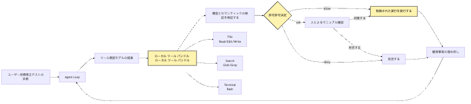
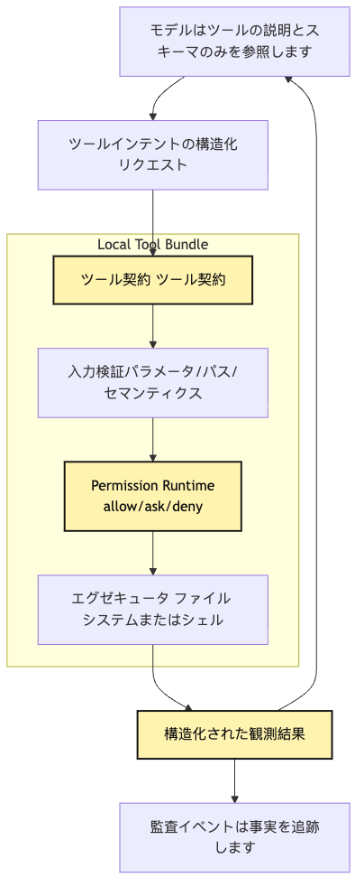
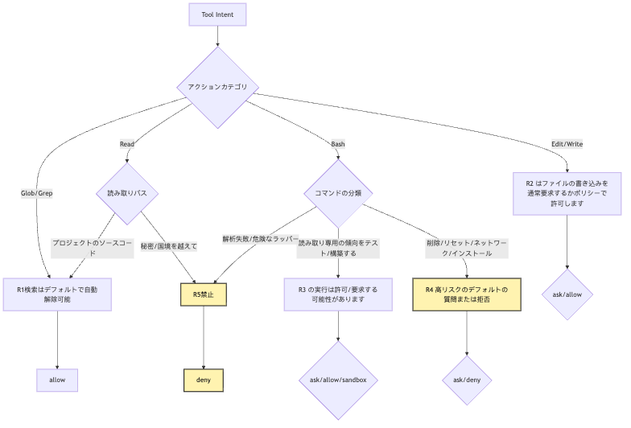
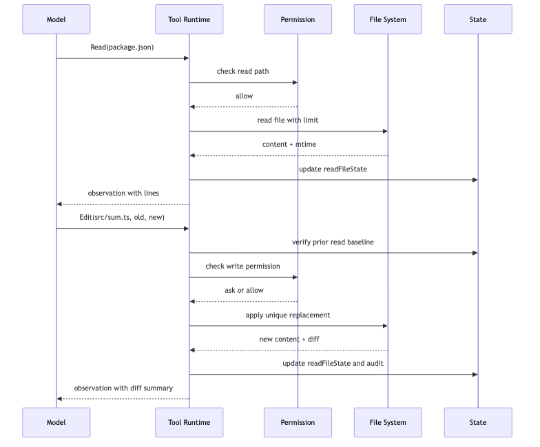
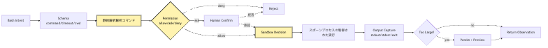
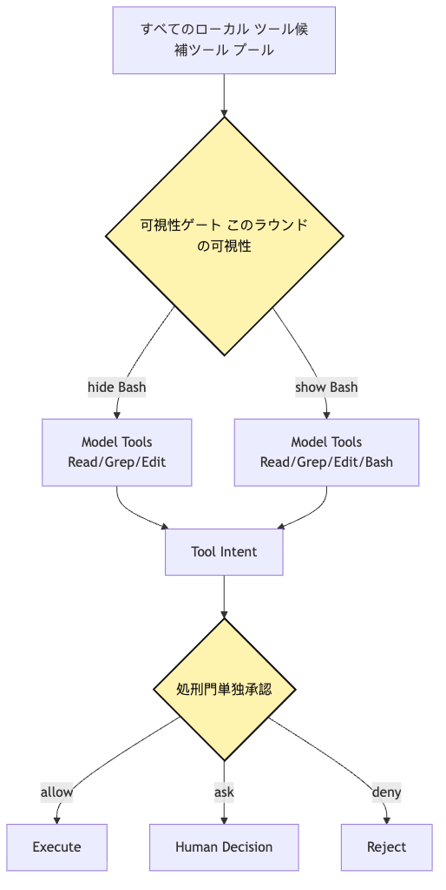

# Local Tool Bundle：ファイル、検索、ターミナルと Permission Runtime

この段落では、設計上の責任境界を明確にし、実装時に同じ判断を再現できるようにします。

```text
read(path)
write(path, content)
edit(path, old, new)
search(pattern)
bash(command)
```

この段落では、設計上の責任境界を明確にし、実装時に同じ判断を再現できるようにします。

この段落では、設計上の責任境界を明確にし、実装時に同じ判断を再現できるようにします。

この段落では、設計上の責任境界を明確にし、実装時に同じ判断を再現できるようにします。

この段落では、設計上の責任境界を明確にし、実装時に同じ判断を再現できるようにします。

この段落では、設計上の責任境界を明確にし、実装時に同じ判断を再現できるようにします。

この段落では、設計上の責任境界を明確にし、実装時に同じ判断を再現できるようにします。

この段落では、設計上の責任境界を明確にし、実装時に同じ判断を再現できるようにします。

この段落では、設計上の責任境界を明確にし、実装時に同じ判断を再現できるようにします。

この段落では、設計上の責任境界を明確にし、実装時に同じ判断を再現できるようにします。

この段落では、設計上の責任境界を明確にし、実装時に同じ判断を再現できるようにします。

この段落では、設計上の責任境界を明確にし、実装時に同じ判断を再現できるようにします。

この段落では、設計上の責任境界を明確にし、実装時に同じ判断を再現できるようにします。 `read` `.env`

この段落では、設計上の責任境界を明確にし、実装時に同じ判断を再現できるようにします。 `write`

この段落では、設計上の責任境界を明確にし、実装時に同じ判断を再現できるようにします。 `search`

この部分では、Agent Harness の境界と runtime contract を工程上の観点から整理します。 `bash` `npm test` `curl | bash` `git reset --hard`

この段落では、設計上の責任境界を明確にし、実装時に同じ判断を再現できるようにします。

> この段落では、設計上の責任境界を明確にし、実装時に同じ判断を再現できるようにします。

ではなく：

> この部分では、Agent Harness の境界と runtime contract を工程上の観点から整理します。

この段落では、設計上の責任境界を明確にし、実装時に同じ判断を再現できるようにします。

この段落では、設計上の責任境界を明確にし、実装時に同じ判断を再現できるようにします。

```text
この段落では、設計上の責任境界を明確にし、実装時に同じ判断を再現できるようにします。
```

この段落では、設計上の責任境界を明確にし、実装時に同じ判断を再現できるようにします。

```text
この段落では、設計上の責任境界を明確にし、実装時に同じ判断を再現できるようにします。
この段落では、設計上の責任境界を明確にし、実装時に同じ判断を再現できるようにします。
この段落では、設計上の責任境界を明確にし、実装時に同じ判断を再現できるようにします。
この段落では、設計上の責任境界を明確にし、実装時に同じ判断を再現できるようにします。
この段落では、設計上の責任境界を明確にし、実装時に同じ判断を再現できるようにします。
この部分では、Agent Harness の境界と runtime contract を工程上の観点から整理します。
この段落では、設計上の責任境界を明確にし、実装時に同じ判断を再現できるようにします。
```

この段落では、設計上の責任境界を明確にし、実装時に同じ判断を再現できるようにします。

この段落では、設計上の責任境界を明確にし、実装時に同じ判断を再現できるようにします。

この段落では、設計上の責任境界を明確にし、実装時に同じ判断を再現できるようにします。

この段落では、設計上の責任境界を明確にし、実装時に同じ判断を再現できるようにします。

この段落では、設計上の責任境界を明確にし、実装時に同じ判断を再現できるようにします。

## 問題の連鎖

この段落では、設計上の責任境界を明確にし、実装時に同じ判断を再現できるようにします。

```text
この部分では、Agent Harness の境界と runtime contract を工程上の観点から整理します。
この段落では、設計上の責任境界を明確にし、実装時に同じ判断を再現できるようにします。
この段落では、設計上の責任境界を明確にし、実装時に同じ判断を再現できるようにします。
この段落では、設計上の責任境界を明確にし、実装時に同じ判断を再現できるようにします。
この部分では、Agent Harness の境界と runtime contract を工程上の観点から整理します。
この部分では、Agent Harness の境界と runtime contract を工程上の観点から整理します。
この段落では、設計上の責任境界を明確にし、実装時に同じ判断を再現できるようにします。
この部分では、Agent Harness の境界と runtime contract を工程上の観点から整理します。
この部分では、Agent Harness の境界と runtime contract を工程上の観点から整理します。
```

この段落では、設計上の責任境界を明確にし、実装時に同じ判断を再現できるようにします。



この部分では、Agent Harness の境界と runtime contract を工程上の観点から整理します。 `Local Tool Bundle`

この段落では、設計上の責任境界を明確にし、実装時に同じ判断を再現できるようにします。

この段落では、設計上の責任境界を明確にし、実装時に同じ判断を再現できるようにします。

この段落では、設計上の責任境界を明確にし、実装時に同じ判断を再現できるようにします。

```text
この段落では、設計上の責任境界を明確にし、実装時に同じ判断を再現できるようにします。
この段落では、設計上の責任境界を明確にし、実装時に同じ判断を再現できるようにします。
この段落では、設計上の責任境界を明確にし、実装時に同じ判断を再現できるようにします。
この段落では、設計上の責任境界を明確にし、実装時に同じ判断を再現できるようにします。
この段落では、設計上の責任境界を明確にし、実装時に同じ判断を再現できるようにします。
この段落では、設計上の責任境界を明確にし、実装時に同じ判断を再現できるようにします。
この段落では、設計上の責任境界を明確にし、実装時に同じ判断を再現できるようにします。
この部分では、Agent Harness の境界と runtime contract を工程上の観点から整理します。
この段落では、設計上の責任境界を明確にし、実装時に同じ判断を再現できるようにします。
この段落では、設計上の責任境界を明確にし、実装時に同じ判断を再現できるようにします。
```

この部分では、Agent Harness の境界と runtime contract を工程上の観点から整理します。

## 一、なぜローカル tool を裸の関数群にしてはいけないのか

この段落では、設計上の責任境界を明確にし、実装時に同じ判断を再現できるようにします。

```ts
const tools = {
  read: async ({ path }) => fs.readFile(path, "utf8"),
  write: async ({ path, content }) => fs.writeFile(path, content),
  search: async ({ query }) => exec(`rg ${query}`),
  bash: async ({ command }) => exec(command),
}
```

この段落では、設計上の責任境界を明確にし、実装時に同じ判断を再現できるようにします。

この段落では、設計上の責任境界を明確にし、実装時に同じ判断を再現できるようにします。

この段落では、設計上の責任境界を明確にし、実装時に同じ判断を再現できるようにします。

この段落では、設計上の責任境界を明確にし、実装時に同じ判断を再現できるようにします。

この段落では、設計上の責任境界を明確にし、実装時に同じ判断を再現できるようにします。

この段落では、設計上の責任境界を明確にし、実装時に同じ判断を再現できるようにします。

### 1. 裸の関数には action semantics がない

この段落では、設計上の責任境界を明確にし、実装時に同じ判断を再現できるようにします。 `write(path, content)`

この部分では、Agent Harness の境界と runtime contract を工程上の観点から整理します。 `bash(command)`

この段落では、設計上の責任境界を明確にし、実装時に同じ判断を再現できるようにします。 `search(query)`

この段落では、設計上の責任境界を明確にし、実装時に同じ判断を再現できるようにします。

この段落では、設計上の責任境界を明確にし、実装時に同じ判断を再現できるようにします。

この段落では、設計上の責任境界を明確にし、実装時に同じ判断を再現できるようにします。

この段落では、設計上の責任境界を明確にし、実装時に同じ判断を再現できるようにします。

この段落では、設計上の責任境界を明確にし、実装時に同じ判断を再現できるようにします。

この段落では、設計上の責任境界を明確にし、実装時に同じ判断を再現できるようにします。

この段落では、設計上の責任境界を明確にし、実装時に同じ判断を再現できるようにします。

この段落では、設計上の責任境界を明確にし、実装時に同じ判断を再現できるようにします。

### 2. 裸の関数には workspace boundary がない

この段落では、設計上の責任境界を明確にし、実装時に同じ判断を再現できるようにします。

この段落では、設計上の責任境界を明確にし、実装時に同じ判断を再現できるようにします。

この段落では、設計上の責任境界を明確にし、実装時に同じ判断を再現できるようにします。 `read`

```text
/Users/me/.ssh/id_rsa
/Users/me/.env
/Users/me/Library/Application Support/...
/private/tmp/...
```

この段落では、設計上の責任境界を明確にし、実装時に同じ判断を再現できるようにします。

この段落では、設計上の責任境界を明確にし、実装時に同じ判断を再現できるようにします。

この段落では、設計上の責任境界を明確にし、実装時に同じ判断を再現できるようにします。

この部分では、Agent Harness の境界と runtime contract を工程上の観点から整理します。 `cwd` `workspaceRoots` `allowedRoots` `deniedPaths`

この段落では、設計上の責任境界を明確にし、実装時に同じ判断を再現できるようにします。

この段落では、設計上の責任境界を明確にし、実装時に同じ判断を再現できるようにします。

### 3. 裸の関数には output budget がない

この段落では、設計上の責任境界を明確にし、実装時に同じ判断を再現できるようにします。

```text
この段落では、設計上の責任境界を明確にし、実装時に同じ判断を再現できるようにします。
```

この段落では、設計上の責任境界を明確にし、実装時に同じ判断を再現できるようにします。

この段落では、設計上の責任境界を明確にし、実装時に同じ判断を再現できるようにします。

```text
この段落では、設計上の責任境界を明確にし、実装時に同じ判断を再現できるようにします。
```

この段落では、設計上の責任境界を明確にし、実装時に同じ判断を再現できるようにします。

この段落では、設計上の責任境界を明確にし、実装時に同じ判断を再現できるようにします。

```text
npm test
```

この段落では、設計上の責任境界を明確にし、実装時に同じ判断を再現できるようにします。

この段落では、設計上の責任境界を明確にし、実装時に同じ判断を再現できるようにします。

この段落では、設計上の責任境界を明確にし、実装時に同じ判断を再現できるようにします。

```text
この段落では、設計上の責任境界を明確にし、実装時に同じ判断を再現できるようにします。
この段落では、設計上の責任境界を明確にし、実装時に同じ判断を再現できるようにします。
この段落では、設計上の責任境界を明確にし、実装時に同じ判断を再現できるようにします。
この段落では、設計上の責任境界を明確にし、実装時に同じ判断を再現できるようにします。
```

この段落では、設計上の責任境界を明確にし、実装時に同じ判断を再現できるようにします。

この段落では、設計上の責任境界を明確にし、実装時に同じ判断を再現できるようにします。

### 4. 裸の関数には audit event がない

この段落では、設計上の責任境界を明確にし、実装時に同じ判断を再現できるようにします。

```text
この段落では、設計上の責任境界を明確にし、実装時に同じ判断を再現できるようにします。
```

この段落では、設計上の責任境界を明確にし、実装時に同じ判断を再現できるようにします。

この段落では、設計上の責任境界を明確にし、実装時に同じ判断を再現できるようにします。

```text
この段落では、設計上の責任境界を明確にし、実装時に同じ判断を再現できるようにします。
```

この部分では、Agent Harness の境界と runtime contract を工程上の観点から整理します。

この部分では、Agent Harness の境界と runtime contract を工程上の観点から整理します。

この段落では、設計上の責任境界を明確にし、実装時に同じ判断を再現できるようにします。

この段落では、設計上の責任境界を明確にし、実装時に同じ判断を再現できるようにします。

この段落では、設計上の責任境界を明確にし、実装時に同じ判断を再現できるようにします。

## 二、Local Tool Bundle はどうあるべきか

この部分では、Agent Harness の境界と runtime contract を工程上の観点から整理します。

```text
ファイルtool：Read / Edit / Write
この段落では、設計上の責任境界を明確にし、実装時に同じ判断を再現できるようにします。
ターミナルtool：Bash
```

この段落では、設計上の責任境界を明確にし、実装時に同じ判断を再現できるようにします。

```text
List / Tree
Patch
Delete
Move
Open
TaskOutput
```

この段落では、設計上の責任境界を明確にし、実装時に同じ判断を再現できるようにします。 `Patch`

この部分では、Agent Harness の境界と runtime contract を工程上の観点から整理します。 `Edit`

この部分では、Agent Harness の境界と runtime contract を工程上の観点から整理します。 `Read / Edit / Write / Glob / Grep / Bash`

この段落では、設計上の責任境界を明確にし、実装時に同じ判断を再現できるようにします。

この段落では、設計上の責任境界を明確にし、実装時に同じ判断を再現できるようにします。

この段落では、設計上の責任境界を明確にし、実装時に同じ判断を再現できるようにします。

```ts
type LocalToolDefinition = {
  name: string
  description: string
  inputSchema: JsonSchema
  outputSchema?: JsonSchema
  category: "file" | "search" | "terminal"
  risk: "read" | "search" | "write" | "execute"
  isReadOnly: boolean
  isConcurrencySafe: boolean
  requiresWorkspace: boolean
  validateInput(input: unknown, context: ToolContext): Promise<ValidationResult>
  checkPermission(input: unknown, context: ToolContext): Promise<PermissionDecision>
  call(input: unknown, context: ToolContext): Promise<ToolObservation>
}
```

この段落では、設計上の責任境界を明確にし、実装時に同じ判断を再現できるようにします。

この段落では、設計上の責任境界を明確にし、実装時に同じ判断を再現できるようにします。

この段落では、設計上の責任境界を明確にし、実装時に同じ判断を再現できるようにします。 `name` `description`

この部分では、Agent Harness の境界と runtime contract を工程上の観点から整理します。 `inputSchema`

この段落では、設計上の責任境界を明確にし、実装時に同じ判断を再現できるようにします。 `category` `risk`

この段落では、設計上の責任境界を明確にし、実装時に同じ判断を再現できるようにします。 `isReadOnly`

この段落では、設計上の責任境界を明確にし、実装時に同じ判断を再現できるようにします。 `requiresWorkspace`

この段落では、設計上の責任境界を明確にし、実装時に同じ判断を再現できるようにします。 `validateInput`

この部分では、Agent Harness の境界と runtime contract を工程上の観点から整理します。 `checkPermission`

この段落では、設計上の責任境界を明確にし、実装時に同じ判断を再現できるようにします。 `call`

この段落では、設計上の責任境界を明確にし、実装時に同じ判断を再現できるようにします。

```text
この段落では、設計上の責任境界を明確にし、実装時に同じ判断を再現できるようにします。
この段落では、設計上の責任境界を明確にし、実装時に同じ判断を再現できるようにします。
```

この部分では、Agent Harness の境界と runtime contract を工程上の観点から整理します。

この部分では、Agent Harness の境界と runtime contract を工程上の観点から整理します。

この段落では、設計上の責任境界を明確にし、実装時に同じ判断を再現できるようにします。



この段落では、設計上の責任境界を明確にし、実装時に同じ判断を再現できるようにします。

この段落では、設計上の責任境界を明確にし、実装時に同じ判断を再現できるようにします。

この段落では、設計上の責任境界を明確にし、実装時に同じ判断を再現できるようにします。 `Executor`

この段落では、設計上の責任境界を明確にし、実装時に同じ判断を再現できるようにします。 `Executor`

この段落では、設計上の責任境界を明確にし、実装時に同じ判断を再現できるようにします。

```text
この段落では、設計上の責任境界を明確にし、実装時に同じ判断を再現できるようにします。
この段落では、設計上の責任境界を明確にし、実装時に同じ判断を再現できるようにします。
この段落では、設計上の責任境界を明確にし、実装時に同じ判断を再現できるようにします。
```

## 三、リスクは一つのスイッチではなく action semantics ごとに層化する

この段落では、設計上の責任境界を明確にし、実装時に同じ判断を再現できるようにします。

```text
allow tools
deny tools
```

この段落では、設計上の責任境界を明確にし、実装時に同じ判断を再現できるようにします。

この段落では、設計上の責任境界を明確にし、実装時に同じ判断を再現できるようにします。

この段落では、設計上の責任境界を明確にし、実装時に同じ判断を再現できるようにします。 `Glob("**/*.ts")` `Write("src/auth.ts")`

この段落では、設計上の責任境界を明確にし、実装時に同じ判断を再現できるようにします。 `Read("src/sum.ts")` `Read(".env")`

この部分では、Agent Harness の境界と runtime contract を工程上の観点から整理します。 `Bash("npm test")` `Bash("rm -rf dist")`

この部分では、Agent Harness の境界と runtime contract を工程上の観点から整理します。

```text
この段落では、設計上の責任境界を明確にし、実装時に同じ判断を再現できるようにします。
この段落では、設計上の責任境界を明確にし、実装時に同じ判断を再現できるようにします。
この段落では、設計上の責任境界を明確にし、実装時に同じ判断を再現できるようにします。
この部分では、Agent Harness の境界と runtime contract を工程上の観点から整理します。
この段落では、設計上の責任境界を明確にし、実装時に同じ判断を再現できるようにします。
この段落では、設計上の責任境界を明確にし、実装時に同じ判断を再現できるようにします。
```

この段落では、設計上の責任境界を明確にし、実装時に同じ判断を再現できるようにします。

この段落では、設計上の責任境界を明確にし、実装時に同じ判断を再現できるようにします。

この段落では、設計上の責任境界を明確にし、実装時に同じ判断を再現できるようにします。

この段落では、設計上の責任境界を明確にし、実装時に同じ判断を再現できるようにします。

この段落では、設計上の責任境界を明確にし、実装時に同じ判断を再現できるようにします。

この段落では、設計上の責任境界を明確にし、実装時に同じ判断を再現できるようにします。

この段落では、設計上の責任境界を明確にし、実装時に同じ判断を再現できるようにします。



この段落では、設計上の責任境界を明確にし、実装時に同じ判断を再現できるようにします。

この段落では、設計上の責任境界を明確にし、実装時に同じ判断を再現できるようにします。

この段落では、設計上の責任境界を明確にし、実装時に同じ判断を再現できるようにします。 `Read` `.env`

この部分では、Agent Harness の境界と runtime contract を工程上の観点から整理します。 `Bash` `git status`

この段落では、設計上の責任境界を明確にし、実装時に同じ判断を再現できるようにします。 `Grep`

この段落では、設計上の責任境界を明確にし、実装時に同じ判断を再現できるようにします。

この段落では、設計上の責任境界を明確にし、実装時に同じ判断を再現できるようにします。

この段落では、設計上の責任境界を明確にし、実装時に同じ判断を再現できるようにします。

```text
この部分では、Agent Harness の境界と runtime contract を工程上の観点から整理します。
この段落では、設計上の責任境界を明確にし、実装時に同じ判断を再現できるようにします。
この段落では、設計上の責任境界を明確にし、実装時に同じ判断を再現できるようにします。
この段落では、設計上の責任境界を明確にし、実装時に同じ判断を再現できるようにします。
workspace boundary
この段落では、設計上の責任境界を明確にし、実装時に同じ判断を再現できるようにします。
この段落では、設計上の責任境界を明確にし、実装時に同じ判断を再現できるようにします。
この段落では、設計上の責任境界を明確にし、実装時に同じ判断を再現できるようにします。
```

この部分では、Agent Harness の境界と runtime contract を工程上の観点から整理します。

```ts
if (tool.risk === "write") ask()
```

この段落では、設計上の責任境界を明確にし、実装時に同じ判断を再現できるようにします。

```text
この段落では、設計上の責任境界を明確にし、実装時に同じ判断を再現できるようにします。
-> runtimeinputrisk
この段落では、設計上の責任境界を明確にし、実装時に同じ判断を再現できるようにします。
この段落では、設計上の責任境界を明確にし、実装時に同じ判断を再現できるようにします。
この段落では、設計上の責任境界を明確にし、実装時に同じ判断を再現できるようにします。
-> auditevent
```

この部分では、Agent Harness の境界と runtime contract を工程上の観点から整理します。

この段落では、設計上の責任境界を明確にし、実装時に同じ判断を再現できるようにします。

この段落では、設計上の責任境界を明確にし、実装時に同じ判断を再現できるようにします。

## 四、ファイル tool：Read / Edit / Write は cat / sed / echo ではない

この段落では、設計上の責任境界を明確にし、実装時に同じ判断を再現できるようにします。

この段落では、設計上の責任境界を明確にし、実装時に同じ判断を再現できるようにします。

この段落では、設計上の責任境界を明確にし、実装時に同じ判断を再現できるようにします。 `package.json`

この段落では、設計上の責任境界を明確にし、実装時に同じ判断を再現できるようにします。

この段落では、設計上の責任境界を明確にし、実装時に同じ判断を再現できるようにします。

この段落では、設計上の責任境界を明確にし、実装時に同じ判断を再現できるようにします。

この段落では、設計上の責任境界を明確にし、実装時に同じ判断を再現できるようにします。

この段落では、設計上の責任境界を明確にし、実装時に同じ判断を再現できるようにします。

```bash
cat src/sum.ts
sed -i 's/old/new/g' src/sum.ts
cat <<'EOF' > src/sum.ts
...
EOF
```

この段落では、設計上の責任境界を明確にし、実装時に同じ判断を再現できるようにします。

この段落では、設計上の責任境界を明確にし、実装時に同じ判断を再現できるようにします。

```text
この段落では、設計上の責任境界を明確にし、実装時に同じ判断を再現できるようにします。
この段落では、設計上の責任境界を明確にし、実装時に同じ判断を再現できるようにします。
この段落では、設計上の責任境界を明確にし、実装時に同じ判断を再現できるようにします。
```

この段落では、設計上の責任境界を明確にし、実装時に同じ判断を再現できるようにします。

この段落では、設計上の責任境界を明確にし、実装時に同じ判断を再現できるようにします。

### 1. Read の要点は内容取得ではなく baseline を作ること

この段落では、設計上の責任境界を明確にし、実装時に同じ判断を再現できるようにします。 `Read` `cat`

この段落では、設計上の責任境界を明確にし、実装時に同じ判断を再現できるようにします。

```text
この段落では、設計上の責任境界を明確にし、実装時に同じ判断を再現できるようにします。
この段落では、設計上の責任境界を明確にし、実装時に同じ判断を再現できるようにします。
この段落では、設計上の責任境界を明確にし、実装時に同じ判断を再現できるようにします。
この段落では、設計上の責任境界を明確にし、実装時に同じ判断を再現できるようにします。
この段落では、設計上の責任境界を明確にし、実装時に同じ判断を再現できるようにします。
この段落では、設計上の責任境界を明確にし、実装時に同じ判断を再現できるようにします。
この段落では、設計上の責任境界を明確にし、実装時に同じ判断を再現できるようにします。
record readFileState
この部分では、Agent Harness の境界と runtime contract を工程上の観点から整理します。
```

この段落では、設計上の責任境界を明確にし、実装時に同じ判断を再現できるようにします。 `readFileState`

この段落では、設計上の責任境界を明確にし、実装時に同じ判断を再現できるようにします。

```text
この段落では、設計上の責任境界を明確にし、実装時に同じ判断を再現できるようにします。
この段落では、設計上の責任境界を明確にし、実装時に同じ判断を再現できるようにします。
この段落では、設計上の責任境界を明確にし、実装時に同じ判断を再現できるようにします。
この段落では、設計上の責任境界を明確にし、実装時に同じ判断を再現できるようにします。
この段落では、設計上の責任境界を明確にし、実装時に同じ判断を再現できるようにします。
```

この段落では、設計上の責任境界を明確にし、実装時に同じ判断を再現できるようにします。

この段落では、設計上の責任境界を明確にし、実装時に同じ判断を再現できるようにします。 `Edit` `Write`

この段落では、設計上の責任境界を明確にし、実装時に同じ判断を再現できるようにします。 `src/sum.ts`

```json
{
  "tool": "Edit",
  "input": {
    "file_path": "src/sum.ts",
    "old_string": "return a - b",
    "new_string": "return a + b"
  }
}
```

この段落では、設計上の責任境界を明確にし、実装時に同じ判断を再現できるようにします。

この段落では、設計上の責任境界を明確にし、実装時に同じ判断を再現できるようにします。

この段落では、設計上の責任境界を明確にし、実装時に同じ判断を再現できるようにします。

この段落では、設計上の責任境界を明確にし、実装時に同じ判断を再現できるようにします。

この段落では、設計上の責任境界を明確にし、実装時に同じ判断を再現できるようにします。

```text
この段落では、設計上の責任境界を明確にし、実装時に同じ判断を再現できるようにします。
この段落では、設計上の責任境界を明確にし、実装時に同じ判断を再現できるようにします。
```

### 2. Edit の要点は変更できることではなく正確に変更できること

この段落では、設計上の責任境界を明確にし、実装時に同じ判断を再現できるようにします。 `Edit`

この段落では、設計上の責任境界を明確にし、実装時に同じ判断を再現できるようにします。

この段落では、設計上の責任境界を明確にし、実装時に同じ判断を再現できるようにします。

この段落では、設計上の責任境界を明確にし、実装時に同じ判断を再現できるようにします。

この段落では、設計上の責任境界を明確にし、実装時に同じ判断を再現できるようにします。

この段落では、設計上の責任境界を明確にし、実装時に同じ判断を再現できるようにします。

```json
{
  "file_path": "src/sum.ts",
  "old_string": "export function sum(a: number, b: number) {\n  return a - b\n}\n",
  "new_string": "export function sum(a: number, b: number) {\n  return a + b\n}\n"
}
```

この段落では、設計上の責任境界を明確にし、実装時に同じ判断を再現できるようにします。 `old_string -> new_string`

この段落では、設計上の責任境界を明確にし、実装時に同じ判断を再現できるようにします。

```text
この段落では、設計上の責任境界を明確にし、実装時に同じ判断を再現できるようにします。
```

この段落では、設計上の責任境界を明確にし、実装時に同じ判断を再現できるようにします。

```text
この段落では、設計上の責任境界を明確にし、実装時に同じ判断を再現できるようにします。
この段落では、設計上の責任境界を明確にし、実装時に同じ判断を再現できるようにします。
この段落では、設計上の責任境界を明確にし、実装時に同じ判断を再現できるようにします。
この段落では、設計上の責任境界を明確にし、実装時に同じ判断を再現できるようにします。
この段落では、設計上の責任境界を明確にし、実装時に同じ判断を再現できるようにします。
この段落では、設計上の責任境界を明確にし、実装時に同じ判断を再現できるようにします。
この段落では、設計上の責任境界を明確にし、実装時に同じ判断を再現できるようにします。
```

この段落では、設計上の責任境界を明確にし、実装時に同じ判断を再現できるようにします。 `old_string`

この段落では、設計上の責任境界を明確にし、実装時に同じ判断を再現できるようにします。 `replace_all`

この段落では、設計上の責任境界を明確にし、実装時に同じ判断を再現できるようにします。

### 3. Write の要点は便利さではなく高リスクであること

この段落では、設計上の責任境界を明確にし、実装時に同じ判断を再現できるようにします。 `Write`

この段落では、設計上の責任境界を明確にし、実装時に同じ判断を再現できるようにします。

この段落では、設計上の責任境界を明確にし、実装時に同じ判断を再現できるようにします。

この段落では、設計上の責任境界を明確にし、実装時に同じ判断を再現できるようにします。

```text
この段落では、設計上の責任境界を明確にし、実装時に同じ判断を再現できるようにします。
この段落では、設計上の責任境界を明確にし、実装時に同じ判断を再現できるようにします。
この段落では、設計上の責任境界を明確にし、実装時に同じ判断を再現できるようにします。
この段落では、設計上の責任境界を明確にし、実装時に同じ判断を再現できるようにします。
この段落では、設計上の責任境界を明確にし、実装時に同じ判断を再現できるようにします。
```

この段落では、設計上の責任境界を明確にし、実装時に同じ判断を再現できるようにします。 `Write`

```text
この段落では、設計上の責任境界を明確にし、実装時に同じ判断を再現できるようにします。
この段落では、設計上の責任境界を明確にし、実装時に同じ判断を再現できるようにします。
この段落では、設計上の責任境界を明確にし、実装時に同じ判断を再現できるようにします。
```

この段落では、設計上の責任境界を明確にし、実装時に同じ判断を再現できるようにします。 `Read`

この段落では、設計上の責任境界を明確にし、実装時に同じ判断を再現できるようにします。

この段落では、設計上の責任境界を明確にし、実装時に同じ判断を再現できるようにします。

この段落では、設計上の責任境界を明確にし、実装時に同じ判断を再現できるようにします。

この段落では、設計上の責任境界を明確にし、実装時に同じ判断を再現できるようにします。 `Write`

この段落では、設計上の責任境界を明確にし、実装時に同じ判断を再現できるようにします。

### 4. ファイル tool の完全な chain

この段落では、設計上の責任境界を明確にし、実装時に同じ判断を再現できるようにします。



この段落では、設計上の責任境界を明確にし、実装時に同じ判断を再現できるようにします。

この段落では、設計上の責任境界を明確にし、実装時に同じ判断を再現できるようにします。

この段落では、設計上の責任境界を明確にし、実装時に同じ判断を再現できるようにします。

この段落では、設計上の責任境界を明確にし、実装時に同じ判断を再現できるようにします。

この段落では、設計上の責任境界を明確にし、実装時に同じ判断を再現できるようにします。

この段落では、設計上の責任境界を明確にし、実装時に同じ判断を再現できるようにします。

この段落では、設計上の責任境界を明確にし、実装時に同じ判断を再現できるようにします。

この段落では、設計上の責任境界を明確にし、実装時に同じ判断を再現できるようにします。 `fs.readFile` `fs.writeFile`

## 五、検索 tool：Glob / Grep は「速い Read」ではない

この段落では、設計上の責任境界を明確にし、実装時に同じ判断を再現できるようにします。

この段落では、設計上の責任境界を明確にし、実装時に同じ判断を再現できるようにします。

この段落では、設計上の責任境界を明確にし、実装時に同じ判断を再現できるようにします。

この段落では、設計上の責任境界を明確にし、実装時に同じ判断を再現できるようにします。

この段落では、設計上の責任境界を明確にし、実装時に同じ判断を再現できるようにします。

この段落では、設計上の責任境界を明確にし、実装時に同じ判断を再現できるようにします。

この段落では、設計上の責任境界を明確にし、実装時に同じ判断を再現できるようにします。

この段落では、設計上の責任境界を明確にし、実装時に同じ判断を再現できるようにします。

この段落では、設計上の責任境界を明確にし、実装時に同じ判断を再現できるようにします。

```text
この段落では、設計上の責任境界を明確にし、実装時に同じ判断を再現できるようにします。
この段落では、設計上の責任境界を明確にし、実装時に同じ判断を再現できるようにします。
この段落では、設計上の責任境界を明確にし、実装時に同じ判断を再現できるようにします。
この段落では、設計上の責任境界を明確にし、実装時に同じ判断を再現できるようにします。
```

### 1. Glob は「どのファイルにありそうか」を解く

この段落では、設計上の責任境界を明確にし、実装時に同じ判断を再現できるようにします。

```text
この段落では、設計上の責任境界を明確にし、実装時に同じ判断を再現できるようにします。
この段落では、設計上の責任境界を明確にし、実装時に同じ判断を再現できるようにします。
この段落では、設計上の責任境界を明確にし、実装時に同じ判断を再現できるようにします。
```

この部分では、Agent Harness の境界と runtime contract を工程上の観点から整理します。 `Glob` `bash ls` `find`

この段落では、設計上の責任境界を明確にし、実装時に同じ判断を再現できるようにします。

```json
{
  "pattern": "**/*sum*.ts"
}
```

この段落では、設計上の責任境界を明確にし、実装時に同じ判断を再現できるようにします。

```text
この段落では、設計上の責任境界を明確にし、実装時に同じ判断を再現できるようにします。
この段落では、設計上の責任境界を明確にし、実装時に同じ判断を再現できるようにします。
この段落では、設計上の責任境界を明確にし、実装時に同じ判断を再現できるようにします。
この部分では、Agent Harness の境界と runtime contract を工程上の観点から整理します。
この段落では、設計上の責任境界を明確にし、実装時に同じ判断を再現できるようにします。
```

この部分では、Agent Harness の境界と runtime contract を工程上の観点から整理します。 `Glob`

この段落では、設計上の責任境界を明確にし、実装時に同じ判断を再現できるようにします。

この段落では、設計上の責任境界を明確にし、実装時に同じ判断を再現できるようにします。

この段落では、設計上の責任境界を明確にし、実装時に同じ判断を再現できるようにします。

### 2. Grep は「どのファイルが手がかりを含むか」を解く

この段落では、設計上の責任境界を明確にし、実装時に同じ判断を再現できるようにします。 `Grep` `Read`

この段落では、設計上の責任境界を明確にし、実装時に同じ判断を再現できるようにします。

この段落では、設計上の責任境界を明確にし、実装時に同じ判断を再現できるようにします。

```json
{
  "pattern": "sum\\(",
  "path": "src"
}
```

この段落では、設計上の責任境界を明確にし、実装時に同じ判断を再現できるようにします。

```text
src/sum.ts:12:export function sum(...)
tests/sum.test.ts:3:import { sum } from "../src/sum"
tests/sum.test.ts:8:expect(sum(1, 2)).toBe(3)
```

この段落では、設計上の責任境界を明確にし、実装時に同じ判断を再現できるようにします。

この段落では、設計上の責任境界を明確にし、実装時に同じ判断を再現できるようにします。 `Grep`

```text
この段落では、設計上の責任境界を明確にし、実装時に同じ判断を再現できるようにします。
この段落では、設計上の責任境界を明確にし、実装時に同じ判断を再現できるようにします。
この段落では、設計上の責任境界を明確にし、実装時に同じ判断を再現できるようにします。
この段落では、設計上の責任境界を明確にし、実装時に同じ判断を再現できるようにします。
この段落では、設計上の責任境界を明確にし、実装時に同じ判断を再現できるようにします。
この段落では、設計上の責任境界を明確にし、実装時に同じ判断を再現できるようにします。
この段落では、設計上の責任境界を明確にし、実装時に同じ判断を再現できるようにします。
```

この段落では、設計上の責任境界を明確にし、実装時に同じ判断を再現できるようにします。

### 3. 検索 tool の Permission 重点は scope と budget

この段落では、設計上の責任境界を明確にし、実装時に同じ判断を再現できるようにします。

この段落では、設計上の責任境界を明確にし、実装時に同じ判断を再現できるようにします。

この段落では、設計上の責任境界を明確にし、実装時に同じ判断を再現できるようにします。 `Grep("OPENAI_API_KEY", "/Users/me")`

この段落では、設計上の責任境界を明確にし、実装時に同じ判断を再現できるようにします。

この段落では、設計上の責任境界を明確にし、実装時に同じ判断を再現できるようにします。

```text
この段落では、設計上の責任境界を明確にし、実装時に同じ判断を再現できるようにします。
この段落では、設計上の責任境界を明確にし、実装時に同じ判断を再現できるようにします。
```

この段落では、設計上の責任境界を明確にし、実装時に同じ判断を再現できるようにします。

この段落では、設計上の責任境界を明確にし、実装時に同じ判断を再現できるようにします。 `.env`

この段落では、設計上の責任境界を明確にし、実装時に同じ判断を再現できるようにします。

この段落では、設計上の責任境界を明確にし、実装時に同じ判断を再現できるようにします。 `AKIA` `PRIVATE KEY` `password=`

この段落では、設計上の責任境界を明確にし、実装時に同じ判断を再現できるようにします。

```text
この段落では、設計上の責任境界を明確にし、実装時に同じ判断を再現できるようにします。
この段落では、設計上の責任境界を明確にし、実装時に同じ判断を再現できるようにします。
```

### 4. 検索は Read を導くもので、Read の代替ではない

この段落では、設計上の責任境界を明確にし、実装時に同じ判断を再現できるようにします。

この段落では、設計上の責任境界を明確にし、実装時に同じ判断を再現できるようにします。

この段落では、設計上の責任境界を明確にし、実装時に同じ判断を再現できるようにします。 `Grep`

```text
src/sum.ts:12:return a - b
```

この段落では、設計上の責任境界を明確にし、実装時に同じ判断を再現できるようにします。 `Edit`

この段落では、設計上の責任境界を明確にし、実装時に同じ判断を再現できるようにします。

この段落では、設計上の責任境界を明確にし、実装時に同じ判断を再現できるようにします。

この段落では、設計上の責任境界を明確にし、実装時に同じ判断を再現できるようにします。

```text
この段落では、設計上の責任境界を明確にし、実装時に同じ判断を再現できるようにします。
この段落では、設計上の責任境界を明確にし、実装時に同じ判断を再現できるようにします。
この段落では、設計上の責任境界を明確にし、実装時に同じ判断を再現できるようにします。
```

この段落では、設計上の責任境界を明確にし、実装時に同じ判断を再現できるようにします。


この段落では、設計上の責任境界を明確にし、実装時に同じ判断を再現できるようにします。

この段落では、設計上の責任境界を明確にし、実装時に同じ判断を再現できるようにします。

## 六、ターミナル tool：Bash は最も有用で最も危険なローカル能力である

この部分では、Agent Harness の境界と runtime contract を工程上の観点から整理します。

この部分では、Agent Harness の境界と runtime contract を工程上の観点から整理します。

この段落では、設計上の責任境界を明確にし、実装時に同じ判断を再現できるようにします。

```text
この段落では、設計上の責任境界を明確にし、実装時に同じ判断を再現できるようにします。
この段落では、設計上の責任境界を明確にし、実装時に同じ判断を再現できるようにします。
この部分では、Agent Harness の境界と runtime contract を工程上の観点から整理します。
この段落では、設計上の責任境界を明確にし、実装時に同じ判断を再現できるようにします。
この段落では、設計上の責任境界を明確にし、実装時に同じ判断を再現できるようにします。
この段落では、設計上の責任境界を明確にし、実装時に同じ判断を再現できるようにします。
この段落では、設計上の責任境界を明確にし、実装時に同じ判断を再現できるようにします。
この段落では、設計上の責任境界を明確にし、実装時に同じ判断を再現できるようにします。
この段落では、設計上の責任境界を明確にし、実装時に同じ判断を再現できるようにします。
この段落では、設計上の責任境界を明確にし、実装時に同じ判断を再現できるようにします。
この段落では、設計上の責任境界を明確にし、実装時に同じ判断を再現できるようにします。
この段落では、設計上の責任境界を明確にし、実装時に同じ判断を再現できるようにします。
この段落では、設計上の責任境界を明確にし、実装時に同じ判断を再現できるようにします。
```

この部分では、Agent Harness の境界と runtime contract を工程上の観点から整理します。

この段落では、設計上の責任境界を明確にし、実装時に同じ判断を再現できるようにします。

この段落では、設計上の責任境界を明確にし、実装時に同じ判断を再現できるようにします。 `Read`

この段落では、設計上の責任境界を明確にし、実装時に同じ判断を再現できるようにします。 `Edit`

この段落では、設計上の責任境界を明確にし、実装時に同じ判断を再現できるようにします。 `Grep`

この部分では、Agent Harness の境界と runtime contract を工程上の観点から整理します。 `Bash`

この段落では、設計上の責任境界を明確にし、実装時に同じ判断を再現できるようにします。

この部分では、Agent Harness の境界と runtime contract を工程上の観点から整理します。

この段落では、設計上の責任境界を明確にし、実装時に同じ判断を再現できるようにします。

### 1. Bash input は command だけではない

この部分では、Agent Harness の境界と runtime contract を工程上の観点から整理します。

```json
{
  "command": "npm test"
}
```

この段落では、設計上の責任境界を明確にし、実装時に同じ判断を再現できるようにします。

```json
{
  "command": "npm test -- --runInBand",
  "description": "Run the test suite",
  "timeoutMs": 120000,
  "runInBackground": false,
  "cwd": "."
}
```

この段落では、設計上の責任境界を明確にし、実装時に同じ判断を再現できるようにします。 `description`

この段落では、設計上の責任境界を明確にし、実装時に同じ判断を再現できるようにします。 `timeoutMs`

この段落では、設計上の責任境界を明確にし、実装時に同じ判断を再現できるようにします。 `runInBackground`

この段落では、設計上の責任境界を明確にし、実装時に同じ判断を再現できるようにします。 `cwd`

この段落では、設計上の責任境界を明確にし、実装時に同じ判断を再現できるようにします。

この段落では、設計上の責任境界を明確にし、実装時に同じ判断を再現できるようにします。

### 2. Bash Permission は先頭語だけを見てはいけない

この段落では、設計上の責任境界を明確にし、実装時に同じ判断を再現できるようにします。

この段落では、設計上の責任境界を明確にし、実装時に同じ判断を再現できるようにします。

```bash
cat package.json | sh
```

この段落では、設計上の責任境界を明確にし、実装時に同じ判断を再現できるようにします。 `cat`

この段落では、設計上の責任境界を明確にし、実装時に同じ判断を再現できるようにします。 `sh`

この段落では、設計上の責任境界を明確にし、実装時に同じ判断を再現できるようにします。

```bash
ls && git reset --hard
```

この段落では、設計上の責任境界を明確にし、実装時に同じ判断を再現できるようにします。 `ls`

この段落では、設計上の責任境界を明確にし、実装時に同じ判断を再現できるようにします。

この段落では、設計上の責任境界を明確にし、実装時に同じ判断を再現できるようにします。

```bash
rg deprecated src > report.txt
```

この段落では、設計上の責任境界を明確にし、実装時に同じ判断を再現できるようにします。

この段落では、設計上の責任境界を明確にし、実装時に同じ判断を再現できるようにします。

この部分では、Agent Harness の境界と runtime contract を工程上の観点から整理します。

```text
この段落では、設計上の責任境界を明確にし、実装時に同じ判断を再現できるようにします。
この段落では、設計上の責任境界を明確にし、実装時に同じ判断を再現できるようにします。
この段落では、設計上の責任境界を明確にし、実装時に同じ判断を再現できるようにします。
この段落では、設計上の責任境界を明確にし、実装時に同じ判断を再現できるようにします。
この段落では、設計上の責任境界を明確にし、実装時に同じ判断を再現できるようにします。
この段落では、設計上の責任境界を明確にし、実装時に同じ判断を再現できるようにします。
この段落では、設計上の責任境界を明確にし、実装時に同じ判断を再現できるようにします。
```

この段落では、設計上の責任境界を明確にし、実装時に同じ判断を再現できるようにします。

この段落では、設計上の責任境界を明確にし、実装時に同じ判断を再現できるようにします。

この段落では、設計上の責任境界を明確にし、実装時に同じ判断を再現できるようにします。

```text
この段落では、設計上の責任境界を明確にし、実装時に同じ判断を再現できるようにします。
```

この段落では、設計上の責任境界を明確にし、実装時に同じ判断を再現できるようにします。

この段落では、設計上の責任境界を明確にし、実装時に同じ判断を再現できるようにします。

### 3. Bash の read-only 判定は近似にすぎない

この段落では、設計上の責任境界を明確にし、実装時に同じ判断を再現できるようにします。

```text
ls
pwd
git status
git diff
rg
cat
head
tail
wc
```

この段落では、設計上の責任境界を明確にし、実装時に同じ判断を再現できるようにします。

この段落では、設計上の責任境界を明確にし、実装時に同じ判断を再現できるようにします。 `rg "foo" src`

この段落では、設計上の責任境界を明確にし、実装時に同じ判断を再現できるようにします。 `rg "foo" src --files-with-matches | xargs rm`

この部分では、Agent Harness の境界と runtime contract を工程上の観点から整理します。 `git diff`

この部分では、Agent Harness の境界と runtime contract を工程上の観点から整理します。 `git checkout -- file`

この段落では、設計上の責任境界を明確にし、実装時に同じ判断を再現できるようにします。 `python -c "print(1)"`

この段落では、設計上の責任境界を明確にし、実装時に同じ判断を再現できるようにします。 `python script.py`

この部分では、Agent Harness の境界と runtime contract を工程上の観点から整理します。

この段落では、設計上の責任境界を明確にし、実装時に同じ判断を再現できるようにします。

この段落では、設計上の責任境界を明確にし、実装時に同じ判断を再現できるようにします。

### 4. Sandbox は Permission の代替ではない

この段落では、設計上の責任境界を明確にし、実装時に同じ判断を再現できるようにします。

この段落では、設計上の責任境界を明確にし、実装時に同じ判断を再現できるようにします。

```text
この段落では、設計上の責任境界を明確にし、実装時に同じ判断を再現できるようにします。
```

この段落では、設計上の責任境界を明確にし、実装時に同じ判断を再現できるようにします。

```text
この段落では、設計上の責任境界を明確にし、実装時に同じ判断を再現できるようにします。
```

この段落では、設計上の責任境界を明確にし、実装時に同じ判断を再現できるようにします。

この段落では、設計上の責任境界を明確にし、実装時に同じ判断を再現できるようにします。

```bash
rm -rf /
```

この段落では、設計上の責任境界を明確にし、実装時に同じ判断を再現できるようにします。

この段落では、設計上の責任境界を明確にし、実装時に同じ判断を再現できるようにします。

```bash
npm test
```

この段落では、設計上の責任境界を明確にし、実装時に同じ判断を再現できるようにします。

この段落では、設計上の責任境界を明確にし、実装時に同じ判断を再現できるようにします。

この段落では、設計上の責任境界を明確にし、実装時に同じ判断を再現できるようにします。

この段落では、設計上の責任境界を明確にし、実装時に同じ判断を再現できるようにします。

この段落では、設計上の責任境界を明確にし、実装時に同じ判断を再現できるようにします。

この段落では、設計上の責任境界を明確にし、実装時に同じ判断を再現できるようにします。

この段落では、設計上の責任境界を明確にし、実装時に同じ判断を再現できるようにします。

```text
この段落では、設計上の責任境界を明確にし、実装時に同じ判断を再現できるようにします。
この段落では、設計上の責任境界を明確にし、実装時に同じ判断を再現できるようにします。
```



### 5. Bash output は全文 log ではなく observation になるべきである

この段落では、設計上の責任境界を明確にし、実装時に同じ判断を再現できるようにします。

この段落では、設計上の責任境界を明確にし、実装時に同じ判断を再現できるようにします。

この部分では、Agent Harness の境界と runtime contract を工程上の観点から整理します。

この部分では、Agent Harness の境界と runtime contract を工程上の観点から整理します。

```text
command
cwd
exitCode
duration
stdoutPreview
stderrPreview
truncated
fullOutputPath
summaryHint
```

この段落では、設計上の責任境界を明確にし、実装時に同じ判断を再現できるようにします。

この段落では、設計上の責任境界を明確にし、実装時に同じ判断を再現できるようにします。

```text
この段落では、設計上の責任境界を明確にし、実装時に同じ判断を再現できるようにします。
この段落では、設計上の責任境界を明確にし、実装時に同じ判断を再現できるようにします。
この段落では、設計上の責任境界を明確にし、実装時に同じ判断を再現できるようにします。
```

この段落では、設計上の責任境界を明確にし、実装時に同じ判断を再現できるようにします。

この段落では、設計上の責任境界を明確にし、実装時に同じ判断を再現できるようにします。

この段落では、設計上の責任境界を明確にし、実装時に同じ判断を再現できるようにします。

この部分では、Agent Harness の境界と runtime contract を工程上の観点から整理します。

## 七、ファイル・検索・ターミナル tool のリスク差

この段落では、設計上の責任境界を明確にし、実装時に同じ判断を再現できるようにします。

この段落では、設計上の責任境界を明確にし、実装時に同じ判断を再現できるようにします。

この段落では、設計上の責任境界を明確にし、実装時に同じ判断を再現できるようにします。

| この段落では、設計上の責任境界を明確にし、実装時に同じ判断を再現できるようにします。 | この段落では、設計上の責任境界を明確にし、実装時に同じ判断を再現できるようにします。 | この段落では、設計上の責任境界を明確にし、実装時に同じ判断を再現できるようにします。 | この段落では、設計上の責任境界を明確にし、実装時に同じ判断を再現できるようにします。 |
| --- | --- | --- | --- |
| この段落では、設計上の責任境界を明確にし、実装時に同じ判断を再現できるようにします。 | Read | この段落では、設計上の責任境界を明確にし、実装時に同じ判断を再現できるようにします。 | この段落では、設計上の責任境界を明確にし、実装時に同じ判断を再現できるようにします。 |
| この段落では、設計上の責任境界を明確にし、実装時に同じ判断を再現できるようにします。 | Edit / Write | この段落では、設計上の責任境界を明確にし、実装時に同じ判断を再現できるようにします。 | この段落では、設計上の責任境界を明確にし、実装時に同じ判断を再現できるようにします。 |
| この段落では、設計上の責任境界を明確にし、実装時に同じ判断を再現できるようにします。 | Glob / Grep | この段落では、設計上の責任境界を明確にし、実装時に同じ判断を再現できるようにします。 | この段落では、設計上の責任境界を明確にし、実装時に同じ判断を再現できるようにします。 |
| ターミナル | Bash | この段落では、設計上の責任境界を明確にし、実装時に同じ判断を再現できるようにします。 | この段落では、設計上の責任境界を明確にし、実装時に同じ判断を再現できるようにします。 |

この段落では、設計上の責任境界を明確にし、実装時に同じ判断を再現できるようにします。

```text
この段落では、設計上の責任境界を明確にし、実装時に同じ判断を再現できるようにします。
```

この段落では、設計上の責任境界を明確にし、実装時に同じ判断を再現できるようにします。

この段落では、設計上の責任境界を明確にし、実装時に同じ判断を再現できるようにします。

この段落では、設計上の責任境界を明確にし、実装時に同じ判断を再現できるようにします。

この段落では、設計上の責任境界を明確にし、実装時に同じ判断を再現できるようにします。

この部分では、Agent Harness の境界と runtime contract を工程上の観点から整理します。

この段落では、設計上の責任境界を明確にし、実装時に同じ判断を再現できるようにします。

この部分では、Agent Harness の境界と runtime contract を工程上の観点から整理します。

## 八、workspace boundary：path は文字列ではなく Permission object である

この段落では、設計上の責任境界を明確にし、実装時に同じ判断を再現できるようにします。

この段落では、設計上の責任境界を明確にし、実装時に同じ判断を再現できるようにします。

```ts
type WorkspaceScope = {
  cwd: string
  roots: string[]
  allowedPaths: string[]
  deniedPaths: string[]
  ignoreGlobs: string[]
}
```

この段落では、設計上の責任境界を明確にし、実装時に同じ判断を再現できるようにします。

この段落では、設計上の責任境界を明確にし、実装時に同じ判断を再現できるようにします。

```text
この段落では、設計上の責任境界を明確にし、実装時に同じ判断を再現できるようにします。
この段落では、設計上の責任境界を明確にし、実装時に同じ判断を再現できるようにします。
この段落では、設計上の責任境界を明確にし、実装時に同じ判断を再現できるようにします。
この段落では、設計上の責任境界を明確にし、実装時に同じ判断を再現できるようにします。
この段落では、設計上の責任境界を明確にし、実装時に同じ判断を再現できるようにします。
この段落では、設計上の責任境界を明確にし、実装時に同じ判断を再現できるようにします。
この段落では、設計上の責任境界を明確にし、実装時に同じ判断を再現できるようにします。
```

この段落では、設計上の責任境界を明確にし、実装時に同じ判断を再現できるようにします。

この段落では、設計上の責任境界を明確にし、実装時に同じ判断を再現できるようにします。

```text
../../.ssh/id_rsa
src/../.env
この段落では、設計上の責任境界を明確にし、実装時に同じ判断を再現できるようにします。
この段落では、設計上の責任境界を明確にし、実装時に同じ判断を再現できるようにします。
この段落では、設計上の責任境界を明確にし、実装時に同じ判断を再現できるようにします。
```

この段落では、設計上の責任境界を明確にし、実装時に同じ判断を再現できるようにします。 `fs.readFile`

この部分では、Agent Harness の境界と runtime contract を工程上の観点から整理します。

この段落では、設計上の責任境界を明確にし、実装時に同じ判断を再現できるようにします。

```text
この段落では、設計上の責任境界を明確にし、実装時に同じ判断を再現できるようにします。
この部分では、Agent Harness の境界と runtime contract を工程上の観点から整理します。
この段落では、設計上の責任境界を明確にし、実装時に同じ判断を再現できるようにします。
この段落では、設計上の責任境界を明確にし、実装時に同じ判断を再現できるようにします。
この段落では、設計上の責任境界を明確にし、実装時に同じ判断を再現できるようにします。
```

この段落では、設計上の責任境界を明確にし、実装時に同じ判断を再現できるようにします。

この段落では、設計上の責任境界を明確にし、実装時に同じ判断を再現できるようにします。

## 九、Permission はポップアップではなく decision record である

この段落では、設計上の責任境界を明確にし、実装時に同じ判断を再現できるようにします。

この段落では、設計上の責任境界を明確にし、実装時に同じ判断を再現できるようにします。

```text
Allow Bash("npm install")?
```

この段落では、設計上の責任境界を明確にし、実装時に同じ判断を再現できるようにします。

この部分では、Agent Harness の境界と runtime contract を工程上の観点から整理します。

```ts
type PermissionDecision =
  | {
      type: "allow"
      reason: string
      source: "policy" | "session" | "user" | "default"
    }
  | {
      type: "ask"
      reason: string
      prompt: string
      suggestedRule?: string
    }
  | {
      type: "deny"
      reason: string
    }
```

この段落では、設計上の責任境界を明確にし、実装時に同じ判断を再現できるようにします。

この段落では、設計上の責任境界を明確にし、実装時に同じ判断を再現できるようにします。

```text
この段落では、設計上の責任境界を明確にし、実装時に同じ判断を再現できるようにします。
この段落では、設計上の責任境界を明確にし、実装時に同じ判断を再現できるようにします。
この段落では、設計上の責任境界を明確にし、実装時に同じ判断を再現できるようにします。
この段落では、設計上の責任境界を明確にし、実装時に同じ判断を再現できるようにします。
この段落では、設計上の責任境界を明確にし、実装時に同じ判断を再現できるようにします。
この段落では、設計上の責任境界を明確にし、実装時に同じ判断を再現できるようにします。
```

この段落では、設計上の責任境界を明確にし、実装時に同じ判断を再現できるようにします。

この段落では、設計上の責任境界を明確にし、実装時に同じ判断を再現できるようにします。

### 1. tool visibility と execution approval は二つの門である

この段落では、設計上の責任境界を明確にし、実装時に同じ判断を再現できるようにします。

```text
この段落では、設計上の責任境界を明確にし、実装時に同じ判断を再現できるようにします。
この部分では、Agent Harness の境界と runtime contract を工程上の観点から整理します。
```

この段落では、設計上の責任境界を明確にし、実装時に同じ判断を再現できるようにします。

この部分では、Agent Harness の境界と runtime contract を工程上の観点から整理します。

この部分では、Agent Harness の境界と runtime contract を工程上の観点から整理します。

この段落では、設計上の責任境界を明確にし、実装時に同じ判断を再現できるようにします。

この段落では、設計上の責任境界を明確にし、実装時に同じ判断を再現できるようにします。 `Read`

この段落では、設計上の責任境界を明確にし、実装時に同じ判断を再現できるようにします。

この段落では、設計上の責任境界を明確にし、実装時に同じ判断を再現できるようにします。

```text
この部分では、Agent Harness の境界と runtime contract を工程上の観点から整理します。
この部分では、Agent Harness の境界と runtime contract を工程上の観点から整理します。
```



この段落では、設計上の責任境界を明確にし、実装時に同じ判断を再現できるようにします。

この段落では、設計上の責任境界を明確にし、実装時に同じ判断を再現できるようにします。

この段落では、設計上の責任境界を明確にし、実装時に同じ判断を再現できるようにします。

### 2. deny は allow より重い

この段落では、設計上の責任境界を明確にし、実装時に同じ判断を再現できるようにします。

この段落では、設計上の責任境界を明確にし、実装時に同じ判断を再現できるようにします。

```text
この部分では、Agent Harness の境界と runtime contract を工程上の観点から整理します。
この部分では、Agent Harness の境界と runtime contract を工程上の観点から整理します。
この部分では、Agent Harness の境界と runtime contract を工程上の観点から整理します。
```

この段落では、設計上の責任境界を明確にし、実装時に同じ判断を再現できるようにします。

この段落では、設計上の責任境界を明確にし、実装時に同じ判断を再現できるようにします。

```text
この段落では、設計上の責任境界を明確にし、実装時に同じ判断を再現できるようにします。
この段落では、設計上の責任境界を明確にし、実装時に同じ判断を再現できるようにします。
この段落では、設計上の責任境界を明確にし、実装時に同じ判断を再現できるようにします。
```

この段落では、設計上の責任境界を明確にし、実装時に同じ判断を再現できるようにします。

この段落では、設計上の責任境界を明確にし、実装時に同じ判断を再現できるようにします。

この部分では、Agent Harness の境界と runtime contract を工程上の観点から整理します。

この段落では、設計上の責任境界を明確にし、実装時に同じ判断を再現できるようにします。

```text
Bash(*)
Bash(sh:*)
Bash(bash:*)
Bash(curl:*)
```

この段落では、設計上の責任境界を明確にし、実装時に同じ判断を再現できるようにします。

この段落では、設計上の責任境界を明確にし、実装時に同じ判断を再現できるようにします。

## 十、output budget：Observation はモデルに正直でなければならない

この段落では、設計上の責任境界を明確にし、実装時に同じ判断を再現できるようにします。

この段落では、設計上の責任境界を明確にし、実装時に同じ判断を再現できるようにします。

この段落では、設計上の責任境界を明確にし、実装時に同じ判断を再現できるようにします。

この段落では、設計上の責任境界を明確にし、実装時に同じ判断を再現できるようにします。

この段落では、設計上の責任境界を明確にし、実装時に同じ判断を再現できるようにします。

この段落では、設計上の責任境界を明確にし、実装時に同じ判断を再現できるようにします。

この段落では、設計上の責任境界を明確にし、実装時に同じ判断を再現できるようにします。 `Read`

この段落では、設計上の責任境界を明確にし、実装時に同じ判断を再現できるようにします。

この段落では、設計上の責任境界を明確にし、実装時に同じ判断を再現できるようにします。

この部分では、Agent Harness の境界と runtime contract を工程上の観点から整理します。 `Bash`

この段落では、設計上の責任境界を明確にし、実装時に同じ判断を再現できるようにします。

この段落では、設計上の責任境界を明確にし、実装時に同じ判断を再現できるようにします。

この部分では、Agent Harness の境界と runtime contract を工程上の観点から整理します。

この段落では、設計上の責任境界を明確にし、実装時に同じ判断を再現できるようにします。

```ts
type ToolObservation = {
  tool: string
  status: "ok" | "error" | "denied"
  summary: string
  data?: unknown
  preview?: string
  truncated?: boolean
  fullOutputRef?: string
  auditId: string
}
```

この段落では、設計上の責任境界を明確にし、実装時に同じ判断を再現できるようにします。

この段落では、設計上の責任境界を明確にし、実装時に同じ判断を再現できるようにします。 `summary`

この段落では、設計上の責任境界を明確にし、実装時に同じ判断を再現できるようにします。 `data`

この段落では、設計上の責任境界を明確にし、実装時に同じ判断を再現できるようにします。 `preview`

この段落では、設計上の責任境界を明確にし、実装時に同じ判断を再現できるようにします。 `truncated`

この段落では、設計上の責任境界を明確にし、実装時に同じ判断を再現できるようにします。 `fullOutputRef`

この部分では、Agent Harness の境界と runtime contract を工程上の観点から整理します。 `auditId`

この部分では、Agent Harness の境界と runtime contract を工程上の観点から整理します。

この段落では、設計上の責任境界を明確にし、実装時に同じ判断を再現できるようにします。

たとえば：

```text
Edit failed: old_string was found 3 times.
```

この段落では、設計上の責任境界を明確にし、実装時に同じ判断を再現できるようにします。

この段落では、設計上の責任境界を明確にし、実装時に同じ判断を再現できるようにします。

この段落では、設計上の責任境界を明確にし、実装時に同じ判断を再現できるようにします。

この部分では、Agent Harness の境界と runtime contract を工程上の観点から整理します。

## 十一、audit event：「提案・決定・実際に起きたこと」の差分を記録する

この段落では、設計上の責任境界を明確にし、実装時に同じ判断を再現できるようにします。

この段落では、設計上の責任境界を明確にし、実装時に同じ判断を再現できるようにします。

```text
この段落では、設計上の責任境界を明確にし、実装時に同じ判断を再現できるようにします。
この段落では、設計上の責任境界を明確にし、実装時に同じ判断を再現できるようにします。
この段落では、設計上の責任境界を明確にし、実装時に同じ判断を再現できるようにします。
この段落では、設計上の責任境界を明確にし、実装時に同じ判断を再現できるようにします。
この段落では、設計上の責任境界を明確にし、実装時に同じ判断を再現できるようにします。
```

この段落では、設計上の責任境界を明確にし、実装時に同じ判断を再現できるようにします。

```text
tool_intent.created
permission.decided
tool_execution.completed
```

この段落では、設計上の責任境界を明確にし、実装時に同じ判断を再現できるようにします。

```text
tool.validation.failed
tool.permission.requested
tool.permission.denied
tool.execution.started
tool.execution.progress
tool.execution.completed
tool.output.truncated
file.diff.created
```

この段落では、設計上の責任境界を明確にし、実装時に同じ判断を再現できるようにします。

```json
{
  "event": "tool_intent.created",
  "tool": "Edit",
  "input": {
    "file_path": "src/sum.ts",
    "old_string_hash": "sha256:...",
    "new_string_hash": "sha256:..."
  }
}
```

```json
{
  "event": "permission.decided",
  "tool": "Edit",
  "decision": "ask",
  "reason": "write source file in workspace"
}
```

```json
{
  "event": "tool_execution.completed",
  "tool": "Edit",
  "status": "ok",
  "diff_stat": {
    "files": 1,
    "insertions": 1,
    "deletions": 1
  }
}
```

この段落では、設計上の責任境界を明確にし、実装時に同じ判断を再現できるようにします。 `old_string` `new_string`

この段落では、設計上の責任境界を明確にし、実装時に同じ判断を再現できるようにします。

できるrecord hash、path、diff stat、summary。

この段落では、設計上の責任境界を明確にし、実装時に同じ判断を再現できるようにします。

この段落では、設計上の責任境界を明確にし、実装時に同じ判断を再現できるようにします。

この段落では、設計上の責任境界を明確にし、実装時に同じ判断を再現できるようにします。

## 十二、同じテスト修正タスクで Local Tool Bundle はどう働くか

この段落では、設計上の責任境界を明確にし、実装時に同じ判断を再現できるようにします。

この段落では、設計上の責任境界を明確にし、実装時に同じ判断を再現できるようにします。

```text
この段落では、設計上の責任境界を明確にし、実装時に同じ判断を再現できるようにします。
```

この部分では、Agent Harness の境界と runtime contract を工程上の観点から整理します。

### 1. まず検索し、やみくもに読まない

この段落では、設計上の責任境界を明確にし、実装時に同じ判断を再現できるようにします。

```json
{
  "tool": "Glob",
  "input": {
    "pattern": "**/*test*.ts"
  }
}
```

この部分では、Agent Harness の境界と runtime contract を工程上の観点から整理します。

```text
schema validation
この段落では、設計上の責任境界を明確にし、実装時に同じ判断を再現できるようにします。
ignore node_modules/dist/coverage
この段落では、設計上の責任境界を明確にし、実装時に同じ判断を再現できるようにします。
この段落では、設計上の責任境界を明確にし、実装時に同じ判断を再現できるようにします。
この部分では、Agent Harness の境界と runtime contract を工程上の観点から整理します。
```

この段落では、設計上の責任境界を明確にし、実装時に同じ判断を再現できるようにします。

```text
この段落では、設計上の責任境界を明確にし、実装時に同じ判断を再現できるようにします。
```

### 2. 次に重要ファイルを読み、baseline を作る

この段落では、設計上の責任境界を明確にし、実装時に同じ判断を再現できるようにします。

```json
{
  "tool": "Read",
  "input": {
    "file_path": "tests/sum.test.ts"
  }
}
```

この部分では、Agent Harness の境界と runtime contract を工程上の観点から整理します。

この段落では、設計上の責任境界を明確にし、実装時に同じ判断を再現できるようにします。 `readFileState`

この段落では、設計上の責任境界を明確にし、実装時に同じ判断を再現できるようにします。 `src/sum.ts`

この段落では、設計上の責任境界を明確にし、実装時に同じ判断を再現できるようにします。

### 3. テストを実行し、実際の失敗を得る

この段落では、設計上の責任境界を明確にし、実装時に同じ判断を再現できるようにします。

```json
{
  "tool": "Bash",
  "input": {
    "command": "npm test -- --runInBand",
    "description": "Run the test suite"
  }
}
```

この部分では、Agent Harness の境界と runtime contract を工程上の観点から整理します。

```text
この段落では、設計上の責任境界を明確にし、実装時に同じ判断を再現できるようにします。
この部分では、Agent Harness の境界と runtime contract を工程上の観点から整理します。
この段落では、設計上の責任境界を明確にし、実装時に同じ判断を再現できるようにします。
この段落では、設計上の責任境界を明確にし、実装時に同じ判断を再現できるようにします。
この段落では、設計上の責任境界を明確にし、実装時に同じ判断を再現できるようにします。
この段落では、設計上の責任境界を明確にし、実装時に同じ判断を再現できるようにします。
この段落では、設計上の責任境界を明確にし、実装時に同じ判断を再現できるようにします。
```

この段落では、設計上の責任境界を明確にし、実装時に同じ判断を再現できるようにします。

```text
この段落では、設計上の責任境界を明確にし、実装時に同じ判断を再現できるようにします。
```

### 4. ファイル編集は既読 version に基づける

この段落では、設計上の責任境界を明確にし、実装時に同じ判断を再現できるようにします。

```json
{
  "tool": "Edit",
  "input": {
    "file_path": "src/sum.ts",
    "old_string": "return a - b",
    "new_string": "return a + b"
  }
}
```

この部分では、Agent Harness の境界と runtime contract を工程上の観点から整理します。

この段落では、設計上の責任境界を明確にし、実装時に同じ判断を再現できるようにします。

```text
この段落では、設計上の責任境界を明確にし、実装時に同じ判断を再現できるようにします。
この段落では、設計上の責任境界を明確にし、実装時に同じ判断を再現できるようにします。
この段落では、設計上の責任境界を明確にし、実装時に同じ判断を再現できるようにします。
この段落では、設計上の責任境界を明確にし、実装時に同じ判断を再現できるようにします。
この段落では、設計上の責任境界を明確にし、実装時に同じ判断を再現できるようにします。
```

この段落では、設計上の責任境界を明確にし、実装時に同じ判断を再現できるようにします。

この段落では、設計上の責任境界を明確にし、実装時に同じ判断を再現できるようにします。

### 5. 再検証し、変更成功だけを信じない

この段落では、設計上の責任境界を明確にし、実装時に同じ判断を再現できるようにします。

この部分では、Agent Harness の境界と runtime contract を工程上の観点から整理します。

この段落では、設計上の責任境界を明確にし、実装時に同じ判断を再現できるようにします。

```text
この段落では、設計上の責任境界を明確にし、実装時に同じ判断を再現できるようにします。
この段落では、設計上の責任境界を明確にし、実装時に同じ判断を再現できるようにします。
この段落では、設計上の責任境界を明確にし、実装時に同じ判断を再現できるようにします。
```

この段落では、設計上の責任境界を明確にし、実装時に同じ判断を再現できるようにします。

この段落では、設計上の責任境界を明確にし、実装時に同じ判断を再現できるようにします。


この部分では、Agent Harness の境界と runtime contract を工程上の観点から整理します。

## 十三、最小実装：まず contract を安定させる

この段落では、設計上の責任境界を明確にし、実装時に同じ判断を再現できるようにします。

この段落では、設計上の責任境界を明確にし、実装時に同じ判断を再現できるようにします。

この部分では、Agent Harness の境界と runtime contract を工程上の観点から整理します。

```ts
type ToolIntent = {
  id: string
  tool: string
  input: unknown
  createdAt: string
  modelMessageId: string
}
```

この段落では、設計上の責任境界を明確にし、実装時に同じ判断を再現できるようにします。

```ts
type ToolContext = {
  cwd: string
  workspaceRoots: string[]
  permissionMode: "default" | "acceptEdits" | "plan" | "bypass"
  readFileState: Map<string, ReadFileSnapshot>
  outputBudget: {
    maxChars: number
    maxLines: number
  }
  audit: AuditWriter
}
```

この段落では、設計上の責任境界を明確にし、実装時に同じ判断を再現できるようにします。

```ts
async function runLocalTool(intent: ToolIntent, context: ToolContext) {
  const tool = registry.get(intent.tool)

  if (!tool) {
    return observationError(intent, "Unknown tool")
  }

  const validation = await tool.validateInput(intent.input, context)

  if (!validation.ok) {
    await context.audit.write("tool.validation.failed", {
      intentId: intent.id,
      reason: validation.reason,
    })

    return observationError(intent, validation.reason)
  }

  const decision = await tool.checkPermission(validation.input, context)

  await context.audit.write("permission.decided", {
    intentId: intent.id,
    tool: tool.name,
    decision: decision.type,
    reason: decision.reason,
  })

  if (decision.type === "deny") {
    return observationDenied(intent, decision.reason)
  }

  if (decision.type === "ask") {
    return observationNeedsApproval(intent, decision)
  }

  try {
    await context.audit.write("tool.execution.started", {
      intentId: intent.id,
      tool: tool.name,
    })

    const observation = await tool.call(validation.input, context)

    await context.audit.write("tool.execution.completed", {
      intentId: intent.id,
      tool: tool.name,
      status: observation.status,
      truncated: observation.truncated ?? false,
    })

    return observation
  } catch (error) {
    await context.audit.write("tool.execution.failed", {
      intentId: intent.id,
      tool: tool.name,
      message: String(error),
    })

    return observationError(intent, String(error))
  }
}
```

この段落では、設計上の責任境界を明確にし、実装時に同じ判断を再現できるようにします。

この段落では、設計上の責任境界を明確にし、実装時に同じ判断を再現できるようにします。

```text
intent
-> validate
-> permission
-> execute
-> observe
-> audit
```

この部分では、Agent Harness の境界と runtime contract を工程上の観点から整理します。

この部分では、Agent Harness の境界と runtime contract を工程上の観点から整理します。 `validateInput` `checkPermission` `call`

この段落では、設計上の責任境界を明確にし、実装時に同じ判断を再現できるようにします。

## 十四、よくある bad smell

この段落では、設計上の責任境界を明確にし、実装時に同じ判断を再現できるようにします。

### 1. Bash にすべての tool を代替させる

この段落では、設計上の責任境界を明確にし、実装時に同じ判断を再現できるようにします。

```text
この段落では、設計上の責任境界を明確にし、実装時に同じ判断を再現できるようにします。
この段落では、設計上の責任境界を明確にし、実装時に同じ判断を再現できるようにします。
この段落では、設計上の責任境界を明確にし、実装時に同じ判断を再現できるようにします。
この段落では、設計上の責任境界を明確にし、実装時に同じ判断を再現できるようにします。
```

この段落では、設計上の責任境界を明確にし、実装時に同じ判断を再現できるようにします。

この部分では、Agent Harness の境界と runtime contract を工程上の観点から整理します。

この段落では、設計上の責任境界を明確にし、実装時に同じ判断を再現できるようにします。

### 2. Edit で事前 Read を要求しない

この段落では、設計上の責任境界を明確にし、実装時に同じ判断を再現できるようにします。

この段落では、設計上の責任境界を明確にし、実装時に同じ判断を再現できるようにします。

この段落では、設計上の責任境界を明確にし、実装時に同じ判断を再現できるようにします。

### 3. 検索結果に上限がない

この段落では、設計上の責任境界を明確にし、実装時に同じ判断を再現できるようにします。

この段落では、設計上の責任境界を明確にし、実装時に同じ判断を再現できるようにします。

この部分では、Agent Harness の境界と runtime contract を工程上の観点から整理します。

```text
matchedCount
returnedCount
truncated
nextSuggestion
```

### 4. Bash 解析失敗でも自動許可する

この段落では、設計上の責任境界を明確にし、実装時に同じ判断を再現できるようにします。

この段落では、設計上の責任境界を明確にし、実装時に同じ判断を再現できるようにします。

この段落では、設計上の責任境界を明確にし、実装時に同じ判断を再現できるようにします。

### 5. Permission prompt が reason を記録しない

この段落では、設計上の責任境界を明確にし、実装時に同じ判断を再現できるようにします。

この段落では、設計上の責任境界を明確にし、実装時に同じ判断を再現できるようにします。

この段落では、設計上の責任境界を明確にし、実装時に同じ判断を再現できるようにします。

この段落では、設計上の責任境界を明確にし、実装時に同じ判断を再現できるようにします。

この段落では、設計上の責任境界を明確にし、実装時に同じ判断を再現できるようにします。

### 6. tool failure が Agent を即座に中断する

この部分では、Agent Harness の境界と runtime contract を工程上の観点から整理します。

この段落では、設計上の責任境界を明確にし、実装時に同じ判断を再現できるようにします。

```text
この段落では、設計上の責任境界を明確にし、実装時に同じ判断を再現できるようにします。
この段落では、設計上の責任境界を明確にし、実装時に同じ判断を再現できるようにします。
コマンドtimeout
この段落では、設計上の責任境界を明確にし、実装時に同じ判断を再現できるようにします。
この段落では、設計上の責任境界を明確にし、実装時に同じ判断を再現できるようにします。
```

この段落では、設計上の責任境界を明確にし、実装時に同じ判断を再現できるようにします。

この段落では、設計上の責任境界を明確にし、実装時に同じ判断を再現できるようにします。

## 十五、この章と後続章の関係

この部分では、Agent Harness の境界と runtime contract を工程上の観点から整理します。

この段落では、設計上の責任境界を明確にし、実装時に同じ判断を再現できるようにします。

```text
この段落では、設計上の責任境界を明確にし、実装時に同じ判断を再現できるようにします。
```

この段落では、設計上の責任境界を明確にし、実装時に同じ判断を再現できるようにします。

この段落では、設計上の責任境界を明確にし、実装時に同じ判断を再現できるようにします。

```text
Permission / Safety
Context Engineering
Audit / Replay
Evaluation
MCP / Skill / Plugin
Multi-Agent Delegation
```

この段落では、設計上の責任境界を明確にし、実装時に同じ判断を再現できるようにします。

この段落では、設計上の責任境界を明確にし、実装時に同じ判断を再現できるようにします。

```text
この段落では、設計上の責任境界を明確にし、実装時に同じ判断を再現できるようにします。
この段落では、設計上の責任境界を明確にし、実装時に同じ判断を再現できるようにします。
```

この段落では、設計上の責任境界を明確にし、実装時に同じ判断を再現できるようにします。

この部分では、Agent Harness の境界と runtime contract を工程上の観点から整理します。

この部分では、Agent Harness の境界と runtime contract を工程上の観点から整理します。

この段落では、設計上の責任境界を明確にし、実装時に同じ判断を再現できるようにします。

この段落では、設計上の責任境界を明確にし、実装時に同じ判断を再現できるようにします。

この段落では、設計上の責任境界を明確にし、実装時に同じ判断を再現できるようにします。

## 十六、一文で覚える

この段落では、設計上の責任境界を明確にし、実装時に同じ判断を再現できるようにします。

> この部分では、Agent Harness の境界と runtime contract を工程上の観点から整理します。

この段落では、設計上の責任境界を明確にし、実装時に同じ判断を再現できるようにします。

```text
この段落では、設計上の責任境界を明確にし、実装時に同じ判断を再現できるようにします。
この段落では、設計上の責任境界を明確にし、実装時に同じ判断を再現できるようにします。
この段落では、設計上の責任境界を明確にし、実装時に同じ判断を再現できるようにします。
この段落では、設計上の責任境界を明確にし、実装時に同じ判断を再現できるようにします。
この部分では、Agent Harness の境界と runtime contract を工程上の観点から整理します。
```

この段落では、設計上の責任境界を明確にし、実装時に同じ判断を再現できるようにします。

この部分では、Agent Harness の境界と runtime contract を工程上の観点から整理します。

---

GitHub ソース: [00-14-local-tool-bundle-permission-runtime.md](https://github.com/LienJack/build-harness/blob/main/docs/ja/00-14-local-tool-bundle-permission-runtime.md)
