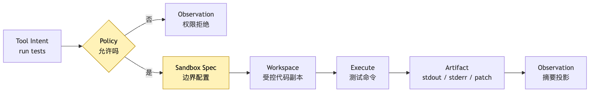
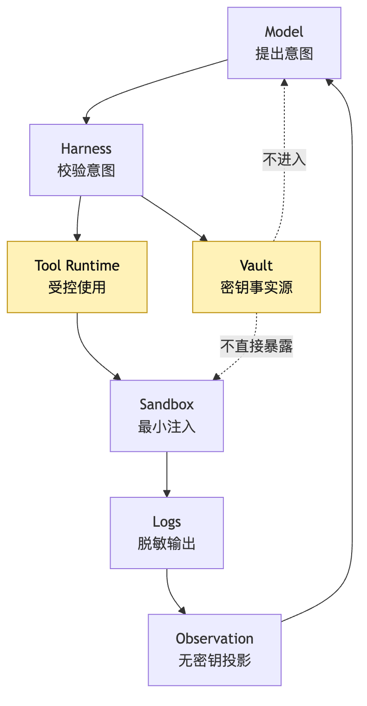
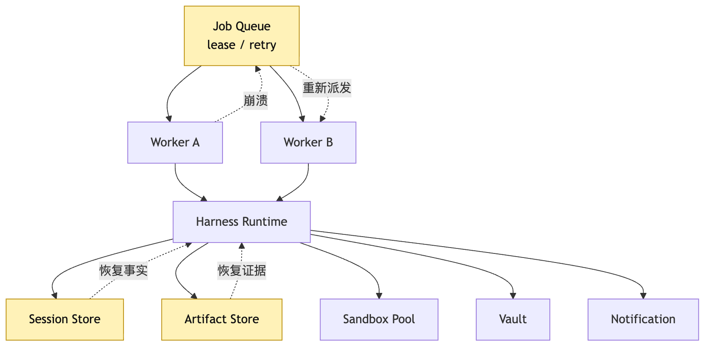

# Hosted Harness：Sandbox、Cron、Durable Execution とリモートデプロイ

要点は、プロセスが落ちても session、artifact、permission、workspace identity が残る設計にすることです。

要点は、プロセスが落ちても session、artifact、permission、workspace identity が残る設計にすることです。

要点は、プロセスが落ちても session、artifact、permission、workspace identity が残る設計にすることです。

Sandbox は Agent が安全に動ける範囲を定義し、境界内では継続的な作業を許可します。

要点は、プロセスが落ちても session、artifact、permission、workspace identity が残る設計にすることです。

要点は、プロセスが落ちても session、artifact、permission、workspace identity が残る設計にすることです。

この例では、失敗したテストを修正するタスクを使い、Hosted Harness の各境界がどう連携するかを確認します。

要点は、プロセスが落ちても session、artifact、permission、workspace identity が残る設計にすることです。

Hosted Harness は、Agent タスクのライフサイクルを worker の外側で明示的に扱うための制御境界を説明します。

Hosted Harness は、Agent タスクのライフサイクルを worker の外側で明示的に扱うための制御境界を説明します。

要点は、プロセスが落ちても session、artifact、permission、workspace identity が残る設計にすることです。

Automation と Cron はコマンドを直接実行するのではなく、idempotency を持つ job lifecycle を作成します。

要点は、プロセスが落ちても session、artifact、permission、workspace identity が残る設計にすることです。

```text
この例では、失敗したテストを修正するタスクを使い、Hosted Harness の各境界がどう連携するかを確認します。
```

要点は、プロセスが落ちても session、artifact、permission、workspace identity が残る設計にすることです。

要点は、プロセスが落ちても session、artifact、permission、workspace identity が残る設計にすることです。

要点は、プロセスが落ちても session、artifact、permission、workspace identity が残る設計にすることです。

要点は、プロセスが落ちても session、artifact、permission、workspace identity が残る設計にすることです。

Hosted Harness は、Agent タスクのライフサイクルを worker の外側で明示的に扱うための制御境界を説明します。

この層では、実行の事実、証拠、権限、復元点を永続化し、後から replay と audit ができるようにします。

Hosted Harness は、Agent タスクのライフサイクルを worker の外側で明示的に扱うための制御境界を説明します。

要点は、プロセスが落ちても session、artifact、permission、workspace identity が残る設計にすることです。

要点は、プロセスが落ちても session、artifact、permission、workspace identity が残る設計にすることです。

要点は、プロセスが落ちても session、artifact、permission、workspace identity が残る設計にすることです。

```text
Session / Harness / Sandbox
Automation / Cron
Durable Execution
Workspace Setup
Secret Boundary
Artifact Store
Resume / Retry
Notification
Deployment Topology
```

要点は、プロセスが落ちても session、artifact、permission、workspace identity が残る設計にすることです。

Hosted Harness は、Agent タスクのライフサイクルを worker の外側で明示的に扱うための制御境界を説明します。

要点は、プロセスが落ちても session、artifact、permission、workspace identity が残る設計にすることです。

Hosted Harness は、Agent タスクのライフサイクルを worker の外側で明示的に扱うための制御境界を説明します。

要点は、プロセスが落ちても session、artifact、permission、workspace identity が残る設計にすることです。

Hosted Harness は、Agent タスクのライフサイクルを worker の外側で明示的に扱うための制御境界を説明します。

## 一、ローカル CLI が証明できるのは仕組みであり、ホスティングではない

この例では、失敗したテストを修正するタスクを使い、Hosted Harness の各境界がどう連携するかを確認します。

要点は、プロセスが落ちても session、artifact、permission、workspace identity が残る設計にすることです。

```text
要点は、プロセスが落ちても session、artifact、permission、workspace identity が残る設計にすることです。
```

Sandbox は Agent が安全に動ける範囲を定義し、境界内では継続的な作業を許可します。

```text
要点は、プロセスが落ちても session、artifact、permission、workspace identity が残る設計にすることです。
この例では、失敗したテストを修正するタスクを使い、Hosted Harness の各境界がどう連携するかを確認します。
要点は、プロセスが落ちても session、artifact、permission、workspace identity が残る設計にすることです。
要点は、プロセスが落ちても session、artifact、permission、workspace identity が残る設計にすることです。
要点は、プロセスが落ちても session、artifact、permission、workspace identity が残る設計にすることです。
この例では、失敗したテストを修正するタスクを使い、Hosted Harness の各境界がどう連携するかを確認します。
要点は、プロセスが落ちても session、artifact、permission、workspace identity が残る設計にすることです。
```

要点は、プロセスが落ちても session、artifact、permission、workspace identity が残る設計にすることです。

要点は、プロセスが落ちても session、artifact、permission、workspace identity が残る設計にすることです。

要点は、プロセスが落ちても session、artifact、permission、workspace identity が残る設計にすることです。

要点は、プロセスが落ちても session、artifact、permission、workspace identity が残る設計にすることです。

要点は、プロセスが落ちても session、artifact、permission、workspace identity が残る設計にすることです。

この層では、実行の事実、証拠、権限、復元点を永続化し、後から replay と audit ができるようにします。

要点は、プロセスが落ちても session、artifact、permission、workspace identity が残る設計にすることです。

要点は、プロセスが落ちても session、artifact、permission、workspace identity が残る設計にすることです。

要点は、プロセスが落ちても session、artifact、permission、workspace identity が残る設計にすることです。

要点は、プロセスが落ちても session、artifact、permission、workspace identity が残る設計にすることです。

要点は、プロセスが落ちても session、artifact、permission、workspace identity が残る設計にすることです。

Sandbox は Agent が安全に動ける範囲を定義し、境界内では継続的な作業を許可します。

要点は、プロセスが落ちても session、artifact、permission、workspace identity が残る設計にすることです。

この例では、失敗したテストを修正するタスクを使い、Hosted Harness の各境界がどう連携するかを確認します。

Hosted Harness は、Agent タスクのライフサイクルを worker の外側で明示的に扱うための制御境界を説明します。

Automation と Cron はコマンドを直接実行するのではなく、idempotency を持つ job lifecycle を作成します。

```text
この例では、失敗したテストを修正するタスクを使い、Hosted Harness の各境界がどう連携するかを確認します。
この例では、失敗したテストを修正するタスクを使い、Hosted Harness の各境界がどう連携するかを確認します。
```

要点は、プロセスが落ちても session、artifact、permission、workspace identity が残る設計にすることです。

要点は、プロセスが落ちても session、artifact、permission、workspace identity が残る設計にすることです。

Hosted Harness は、Agent タスクのライフサイクルを worker の外側で明示的に扱うための制御境界を説明します。

要点は、プロセスが落ちても session、artifact、permission、workspace identity が残る設計にすることです。

Workspace、secret、artifact、notification はそれぞれ独立した責務として分け、Agent loop に混ぜ込まないようにします。

Workspace、secret、artifact、notification はそれぞれ独立した責務として分け、Agent loop に混ぜ込まないようにします。

要点は、プロセスが落ちても session、artifact、permission、workspace identity が残る設計にすることです。

Hosted Harness は、Agent タスクのライフサイクルを worker の外側で明示的に扱うための制御境界を説明します。

要点は、プロセスが落ちても session、artifact、permission、workspace identity が残る設計にすることです。

この例では、失敗したテストを修正するタスクを使い、Hosted Harness の各境界がどう連携するかを確認します。

Workspace、secret、artifact、notification はそれぞれ独立した責務として分け、Agent loop に混ぜ込まないようにします。

要点は、プロセスが落ちても session、artifact、permission、workspace identity が残る設計にすることです。

Hosted Harness は、Agent タスクのライフサイクルを worker の外側で明示的に扱うための制御境界を説明します。

要点は、プロセスが落ちても session、artifact、permission、workspace identity が残る設計にすることです。

```text
Automation と Cron はコマンドを直接実行するのではなく、idempotency を持つ job lifecycle を作成します。
Automation と Cron はコマンドを直接実行するのではなく、idempotency を持つ job lifecycle を作成します。
この例では、失敗したテストを修正するタスクを使い、Hosted Harness の各境界がどう連携するかを確認します。
Workspace、secret、artifact、notification はそれぞれ独立した責務として分け、Agent loop に混ぜ込まないようにします。
Sandbox は Agent が安全に動ける範囲を定義し、境界内では継続的な作業を許可します。
Workspace、secret、artifact、notification はそれぞれ独立した責務として分け、Agent loop に混ぜ込まないようにします。
要点は、プロセスが落ちても session、artifact、permission、workspace identity が残る設計にすることです。
Workspace、secret、artifact、notification はそれぞれ独立した責務として分け、Agent loop に混ぜ込まないようにします。
Hosted Harness は、Agent タスクのライフサイクルを worker の外側で明示的に扱うための制御境界を説明します。
Sandbox は Agent が安全に動ける範囲を定義し、境界内では継続的な作業を許可します。
要点は、プロセスが落ちても session、artifact、permission、workspace identity が残る設計にすることです。
Sandbox は Agent が安全に動ける範囲を定義し、境界内では継続的な作業を許可します。
要点は、プロセスが落ちても session、artifact、permission、workspace identity が残る設計にすることです。
```

要点は、プロセスが落ちても session、artifact、permission、workspace identity が残る設計にすることです。

要点は、プロセスが落ちても session、artifact、permission、workspace identity が残る設計にすることです。

要点は、プロセスが落ちても session、artifact、permission、workspace identity が残る設計にすることです。

Hosted Harness は、Agent タスクのライフサイクルを worker の外側で明示的に扱うための制御境界を説明します。

Hosted Harness は、Agent タスクのライフサイクルを worker の外側で明示的に扱うための制御境界を説明します。

Hosted Harness は、Agent タスクのライフサイクルを worker の外側で明示的に扱うための制御境界を説明します。

Hosted Harness は、Agent タスクのライフサイクルを worker の外側で明示的に扱うための制御境界を説明します。

## 二、Hosted Harness の 5 つの境界

要点は、プロセスが落ちても session、artifact、permission、workspace identity が残る設計にすることです。

```text
この層では、実行の事実、証拠、権限、復元点を永続化し、後から replay と audit ができるようにします。
要点は、プロセスが落ちても session、artifact、permission、workspace identity が残る設計にすることです。
Sandbox は Agent が安全に動ける範囲を定義し、境界内では継続的な作業を許可します。
```

Hosted Harness は、Agent タスクのライフサイクルを worker の外側で明示的に扱うための制御境界を説明します。

```text
Automation と Cron はコマンドを直接実行するのではなく、idempotency を持つ job lifecycle を作成します。
要点は、プロセスが落ちても session、artifact、permission、workspace identity が残る設計にすることです。
```

Hosted Harness は、Agent タスクのライフサイクルを worker の外側で明示的に扱うための制御境界を説明します。

```text
Automation
Harness
Session
Sandbox
Deployment
```

要点は、プロセスが落ちても session、artifact、permission、workspace identity が残る設計にすることです。

Hosted Harness は、Agent タスクのライフサイクルを worker の外側で明示的に扱うための制御境界を説明します。


要点は、プロセスが落ちても session、artifact、permission、workspace identity が残る設計にすることです。

要点は、プロセスが落ちても session、artifact、permission、workspace identity が残る設計にすることです。

Automation と Cron はコマンドを直接実行するのではなく、idempotency を持つ job lifecycle を作成します。

この層では、実行の事実、証拠、権限、復元点を永続化し、後から replay と audit ができるようにします。

Hosted Harness は、Agent タスクのライフサイクルを worker の外側で明示的に扱うための制御境界を説明します。

この層では、実行の事実、証拠、権限、復元点を永続化し、後から replay と audit ができるようにします。

この層では、実行の事実、証拠、権限、復元点を永続化し、後から replay と audit ができるようにします。

Sandbox は Agent が安全に動ける範囲を定義し、境界内では継続的な作業を許可します。

要点は、プロセスが落ちても session、artifact、permission、workspace identity が残る設計にすることです。

Hosted Harness は、Agent タスクのライフサイクルを worker の外側で明示的に扱うための制御境界を説明します。

要点は、プロセスが落ちても session、artifact、permission、workspace identity が残る設計にすることです。

```ts
cron.schedule("0 8 * * *", async () => {
  const repo = await git.clone(project.repoUrl);
  process.env.GITHUB_TOKEN = project.githubToken;

  const result = await runCliAgent({
    cwd: repo.path,
    prompt: "检查测试并修复",
  });

  await sendEmail(project.ownerEmail, result.summary);
});
```

要点は、プロセスが落ちても session、artifact、permission、workspace identity が残る設計にすることです。

要点は、プロセスが落ちても session、artifact、permission、workspace identity が残る設計にすることです。

要点は、プロセスが落ちても session、artifact、permission、workspace identity が残る設計にすることです。

この層では、実行の事実、証拠、権限、復元点を永続化し、後から replay と audit ができるようにします。

Workspace、secret、artifact、notification はそれぞれ独立した責務として分け、Agent loop に混ぜ込まないようにします。

Sandbox は Agent が安全に動ける範囲を定義し、境界内では継続的な作業を許可します。

要点は、プロセスが落ちても session、artifact、permission、workspace identity が残る設計にすることです。

この層では、実行の事実、証拠、権限、復元点を永続化し、後から replay と audit ができるようにします。

Workspace、secret、artifact、notification はそれぞれ独立した責務として分け、Agent loop に混ぜ込まないようにします。

Hosted Harness は、Agent タスクのライフサイクルを worker の外側で明示的に扱うための制御境界を説明します。

要点は、プロセスが落ちても session、artifact、permission、workspace identity が残る設計にすることです。

Hosted Harness は、Agent タスクのライフサイクルを worker の外側で明示的に扱うための制御境界を説明します。

要点は、プロセスが落ちても session、artifact、permission、workspace identity が残る設計にすることです。

```text
Automation と Cron はコマンドを直接実行するのではなく、idempotency を持つ job lifecycle を作成します。
この層では、実行の事実、証拠、権限、復元点を永続化し、後から replay と audit ができるようにします。
要点は、プロセスが落ちても session、artifact、permission、workspace identity が残る設計にすることです。
この層では、実行の事実、証拠、権限、復元点を永続化し、後から replay と audit ができるようにします。
Sandbox は Agent が安全に動ける範囲を定義し、境界内では継続的な作業を許可します。
Sandbox は Agent が安全に動ける範囲を定義し、境界内では継続的な作業を許可します。
要点は、プロセスが落ちても session、artifact、permission、workspace identity が残る設計にすることです。
この層では、実行の事実、証拠、権限、復元点を永続化し、後から replay と audit ができるようにします。
要点は、プロセスが落ちても session、artifact、permission、workspace identity が残る設計にすることです。
```

この層では、実行の事実、証拠、権限、復元点を永続化し、後から replay と audit ができるようにします。

この層では、実行の事実、証拠、権限、復元点を永続化し、後から replay と audit ができるようにします。

この層では、実行の事実、証拠、権限、復元点を永続化し、後から replay と audit ができるようにします。

## 三、Cron は定時コマンドではなく、復元可能なタスクを作る

Automation と Cron はコマンドを直接実行するのではなく、idempotency を持つ job lifecycle を作成します。

要点は、プロセスが落ちても session、artifact、permission、workspace identity が残る設計にすることです。

Automation と Cron はコマンドを直接実行するのではなく、idempotency を持つ job lifecycle を作成します。

この例では、失敗したテストを修正するタスクを使い、Hosted Harness の各境界がどう連携するかを確認します。

この例では、失敗したテストを修正するタスクを使い、Hosted Harness の各境界がどう連携するかを確認します。

要点は、プロセスが落ちても session、artifact、permission、workspace identity が残る設計にすることです。

要点は、プロセスが落ちても session、artifact、permission、workspace identity が残る設計にすることです。

要点は、プロセスが落ちても session、artifact、permission、workspace identity が残る設計にすることです。

Automation と Cron はコマンドを直接実行するのではなく、idempotency を持つ job lifecycle を作成します。

Hosted Harness は、Agent タスクのライフサイクルを worker の外側で明示的に扱うための制御境界を説明します。

```text
Automation と Cron はコマンドを直接実行するのではなく、idempotency を持つ job lifecycle を作成します。
Automation と Cron はコマンドを直接実行するのではなく、idempotency を持つ job lifecycle を作成します。
Automation と Cron はコマンドを直接実行するのではなく、idempotency を持つ job lifecycle を作成します。
Automation と Cron はコマンドを直接実行するのではなく、idempotency を持つ job lifecycle を作成します。
```

この例では、失敗したテストを修正するタスクを使い、Hosted Harness の各境界がどう連携するかを確認します。

```text
run npm test
```

要点は、プロセスが落ちても session、artifact、permission、workspace identity が残る設計にすることです。

```ts
type AutomationTrigger = {
  automationId: string;
  scheduleWindow: {
    start: string;
    end: string;
  };
  userId: string;
  projectId: string;
  profileId: string;
  goal: string;
  idempotencyKey: string;
  notificationPolicy: {
    onSuccess: "summary";
    onFailure: "summary-and-artifacts";
    onApprovalRequired: "immediate";
  };
};
```

要点は、プロセスが落ちても session、artifact、permission、workspace identity が残る設計にすることです。

要点は、プロセスが落ちても session、artifact、permission、workspace identity が残る設計にすることです。

```text
Automation と Cron はコマンドを直接実行するのではなく、idempotency を持つ job lifecycle を作成します。
Automation と Cron はコマンドを直接実行するのではなく、idempotency を持つ job lifecycle を作成します。
要点は、プロセスが落ちても session、artifact、permission、workspace identity が残る設計にすることです。
要点は、プロセスが落ちても session、artifact、permission、workspace identity が残る設計にすることです。
要点は、プロセスが落ちても session、artifact、permission、workspace identity が残る設計にすることです。
Workspace、secret、artifact、notification はそれぞれ独立した責務として分け、Agent loop に混ぜ込まないようにします。
```

Automation と Cron はコマンドを直接実行するのではなく、idempotency を持つ job lifecycle を作成します。

この層では、実行の事実、証拠、権限、復元点を永続化し、後から replay と audit ができるようにします。

```text
automation.triggered
job.created
job.enqueued
```

Hosted Harness は、Agent タスクのライフサイクルを worker の外側で明示的に扱うための制御境界を説明します。


Automation と Cron はコマンドを直接実行するのではなく、idempotency を持つ job lifecycle を作成します。

要点は、プロセスが落ちても session、artifact、permission、workspace identity が残る設計にすることです。

この層では、実行の事実、証拠、権限、復元点を永続化し、後から replay と audit ができるようにします。

Hosted Harness は、Agent タスクのライフサイクルを worker の外側で明示的に扱うための制御境界を説明します。

Automation と Cron はコマンドを直接実行するのではなく、idempotency を持つ job lifecycle を作成します。

Automation と Cron はコマンドを直接実行するのではなく、idempotency を持つ job lifecycle を作成します。

Automation と Cron はコマンドを直接実行するのではなく、idempotency を持つ job lifecycle を作成します。

要点は、プロセスが落ちても session、artifact、permission、workspace identity が残る設計にすることです。

Sandbox は Agent が安全に動ける範囲を定義し、境界内では継続的な作業を許可します。

Automation と Cron はコマンドを直接実行するのではなく、idempotency を持つ job lifecycle を作成します。

Hosted Harness は、Agent タスクのライフサイクルを worker の外側で明示的に扱うための制御境界を説明します。

要点は、プロセスが落ちても session、artifact、permission、workspace identity が残る設計にすることです。

要点は、プロセスが落ちても session、artifact、permission、workspace identity が残る設計にすることです。

この例では、失敗したテストを修正するタスクを使い、Hosted Harness の各境界がどう連携するかを確認します。

Workspace、secret、artifact、notification はそれぞれ独立した責務として分け、Agent loop に混ぜ込まないようにします。

Workspace、secret、artifact、notification はそれぞれ独立した責務として分け、Agent loop に混ぜ込まないようにします。

要点は、プロセスが落ちても session、artifact、permission、workspace identity が残る設計にすることです。

Automation と Cron はコマンドを直接実行するのではなく、idempotency を持つ job lifecycle を作成します。

Hosted Harness は、Agent タスクのライフサイクルを worker の外側で明示的に扱うための制御境界を説明します。

## 四、リモート Sandbox：檻であり、同時にライセンスでもある

Sandbox は Agent が安全に動ける範囲を定義し、境界内では継続的な作業を許可します。

要点は、プロセスが落ちても session、artifact、permission、workspace identity が残る設計にすることです。

この例では、失敗したテストを修正するタスクを使い、Hosted Harness の各境界がどう連携するかを確認します。

Hosted Harness は、Agent タスクのライフサイクルを worker の外側で明示的に扱うための制御境界を説明します。

Hosted Harness は、Agent タスクのライフサイクルを worker の外側で明示的に扱うための制御境界を説明します。

Hosted Harness は、Agent タスクのライフサイクルを worker の外側で明示的に扱うための制御境界を説明します。

この例では、失敗したテストを修正するタスクを使い、Hosted Harness の各境界がどう連携するかを確認します。

この例では、失敗したテストを修正するタスクを使い、Hosted Harness の各境界がどう連携するかを確認します。

Sandbox は Agent が安全に動ける範囲を定義し、境界内では継続的な作業を許可します。

Sandbox は Agent が安全に動ける範囲を定義し、境界内では継続的な作業を許可します。

要点は、プロセスが落ちても session、artifact、permission、workspace identity が残る設計にすることです。

要点は、プロセスが落ちても session、artifact、permission、workspace identity が残る設計にすることです。

Sandbox は Agent が安全に動ける範囲を定義し、境界内では継続的な作業を許可します。

```text
要点は、プロセスが落ちても session、artifact、permission、workspace identity が残る設計にすることです。
要点は、プロセスが落ちても session、artifact、permission、workspace identity が残る設計にすることです。
この例では、失敗したテストを修正するタスクを使い、Hosted Harness の各境界がどう連携するかを確認します。
要点は、プロセスが落ちても session、artifact、permission、workspace identity が残る設計にすることです。
要点は、プロセスが落ちても session、artifact、permission、workspace identity が残る設計にすることです。
```

要点は、プロセスが落ちても session、artifact、permission、workspace identity が残る設計にすることです。

要点は、プロセスが落ちても session、artifact、permission、workspace identity が残る設計にすることです。

要点は、プロセスが落ちても session、artifact、permission、workspace identity が残る設計にすることです。

要点は、プロセスが落ちても session、artifact、permission、workspace identity が残る設計にすることです。

Sandbox は Agent が安全に動ける範囲を定義し、境界内では継続的な作業を許可します。

Sandbox は Agent が安全に動ける範囲を定義し、境界内では継続的な作業を許可します。

要点は、プロセスが落ちても session、artifact、permission、workspace identity が残る設計にすることです。

要点は、プロセスが落ちても session、artifact、permission、workspace identity が残る設計にすることです。

Hosted Harness は、Agent タスクのライフサイクルを worker の外側で明示的に扱うための制御境界を説明します。

```text
要点は、プロセスが落ちても session、artifact、permission、workspace identity が残る設計にすることです。
要点は、プロセスが落ちても session、artifact、permission、workspace identity が残る設計にすることです。
この例では、失敗したテストを修正するタスクを使い、Hosted Harness の各境界がどう連携するかを確認します。
Sandbox は Agent が安全に動ける範囲を定義し、境界内では継続的な作業を許可します。
要点は、プロセスが落ちても session、artifact、permission、workspace identity が残る設計にすることです。
Sandbox は Agent が安全に動ける範囲を定義し、境界内では継続的な作業を許可します。
この層では、実行の事実、証拠、権限、復元点を永続化し、後から replay と audit ができるようにします。
```

Sandbox は Agent が安全に動ける範囲を定義し、境界内では継続的な作業を許可します。

Sandbox は Agent が安全に動ける範囲を定義し、境界内では継続的な作業を許可します。

要点は、プロセスが落ちても session、artifact、permission、workspace identity が残る設計にすることです。

要点は、プロセスが落ちても session、artifact、permission、workspace identity が残る設計にすることです。

Sandbox は Agent が安全に動ける範囲を定義し、境界内では継続的な作業を許可します。

Hosted Harness は、Agent タスクのライフサイクルを worker の外側で明示的に扱うための制御境界を説明します。

要点は、プロセスが落ちても session、artifact、permission、workspace identity が残る設計にすることです。

```ts
type SandboxSpec = {
  image: string;
  workspaceRef: string;
  filesystemPolicy: "repo-only" | "worktree" | "ephemeral";
  networkPolicy: {
    allowDomains: string[];
    denyAllOther: boolean;
  };
  resourceLimits: {
    cpu: number;
    memoryMb: number;
    timeoutSeconds: number;
  };
  persistence: {
    keepArtifacts: boolean;
    keepWorkspaceSnapshot: boolean;
  };
};
```

要点は、プロセスが落ちても session、artifact、permission、workspace identity が残る設計にすることです。

要点は、プロセスが落ちても session、artifact、permission、workspace identity が残る設計にすることです。

Sandbox は Agent が安全に動ける範囲を定義し、境界内では継続的な作業を許可します。

この例では、失敗したテストを修正するタスクを使い、Hosted Harness の各境界がどう連携するかを確認します。

要点は、プロセスが落ちても session、artifact、permission、workspace identity が残る設計にすることです。

Workspace、secret、artifact、notification はそれぞれ独立した責務として分け、Agent loop に混ぜ込まないようにします。

Hosted Harness は、Agent タスクのライフサイクルを worker の外側で明示的に扱うための制御境界を説明します。



Sandbox は Agent が安全に動ける範囲を定義し、境界内では継続的な作業を許可します。

Sandbox は Agent が安全に動ける範囲を定義し、境界内では継続的な作業を許可します。

Hosted Harness は、Agent タスクのライフサイクルを worker の外側で明示的に扱うための制御境界を説明します。

この例では、失敗したテストを修正するタスクを使い、Hosted Harness の各境界がどう連携するかを確認します。

Sandbox は Agent が安全に動ける範囲を定義し、境界内では継続的な作業を許可します。

要点は、プロセスが落ちても session、artifact、permission、workspace identity が残る設計にすることです。

## 五、Workspace Setup：リモートタスクは現場を自動的には持たない

要点は、プロセスが落ちても session、artifact、permission、workspace identity が残る設計にすることです。

要点は、プロセスが落ちても session、artifact、permission、workspace identity が残る設計にすることです。

Hosted Harness は、Agent タスクのライフサイクルを worker の外側で明示的に扱うための制御境界を説明します。

この例では、失敗したテストを修正するタスクを使い、Hosted Harness の各境界がどう連携するかを確認します。

```text
要点は、プロセスが落ちても session、artifact、permission、workspace identity が残る設計にすることです。
要点は、プロセスが落ちても session、artifact、permission、workspace identity が残る設計にすることです。
要点は、プロセスが落ちても session、artifact、permission、workspace identity が残る設計にすることです。
要点は、プロセスが落ちても session、artifact、permission、workspace identity が残る設計にすることです。
要点は、プロセスが落ちても session、artifact、permission、workspace identity が残る設計にすることです。
要点は、プロセスが落ちても session、artifact、permission、workspace identity が残る設計にすることです。
要点は、プロセスが落ちても session、artifact、permission、workspace identity が残る設計にすることです。
要点は、プロセスが落ちても session、artifact、permission、workspace identity が残る設計にすることです。
```

Workspace、secret、artifact、notification はそれぞれ独立した責務として分け、Agent loop に混ぜ込まないようにします。

要点は、プロセスが落ちても session、artifact、permission、workspace identity が残る設計にすることです。

Hosted Harness は、Agent タスクのライフサイクルを worker の外側で明示的に扱うための制御境界を説明します。

この例では、失敗したテストを修正するタスクを使い、Hosted Harness の各境界がどう連携するかを確認します。

```text
要点は、プロセスが落ちても session、artifact、permission、workspace identity が残る設計にすることです。
要点は、プロセスが落ちても session、artifact、permission、workspace identity が残る設計にすることです。
-> checkout main@sha
要点は、プロセスが落ちても session、artifact、permission、workspace identity が残る設計にすることです。
要点は、プロセスが落ちても session、artifact、permission、workspace identity が残る設計にすることです。
要点は、プロセスが落ちても session、artifact、permission、workspace identity が残る設計にすることです。
Workspace、secret、artifact、notification はそれぞれ独立した責務として分け、Agent loop に混ぜ込まないようにします。
この層では、実行の事実、証拠、権限、復元点を永続化し、後から replay と audit ができるようにします。
```

要点は、プロセスが落ちても session、artifact、permission、workspace identity が残る設計にすることです。

Hosted Harness は、Agent タスクのライフサイクルを worker の外側で明示的に扱うための制御境界を説明します。

この例では、失敗したテストを修正するタスクを使い、Hosted Harness の各境界がどう連携するかを確認します。

要点は、プロセスが落ちても session、artifact、permission、workspace identity が残る設計にすることです。

この層では、実行の事実、証拠、権限、復元点を永続化し、後から replay と audit ができるようにします。

```json
{
  "type": "workspace.ready",
  "workspaceId": "ws_123",
  "repo": "example/app",
  "baseRef": "main",
  "baseSha": "abc123",
  "taskBranch": "agent/fix-tests-2026-05-28",
  "sandboxId": "sbx_456",
  "rules": ["AGENTS.md", ".harness/project.md"],
  "artifactRoot": "artifact://session/s23/"
}
```

この層では、実行の事実、証拠、権限、復元点を永続化し、後から replay と audit ができるようにします。

この例では、失敗したテストを修正するタスクを使い、Hosted Harness の各境界がどう連携するかを確認します。

要点は、プロセスが落ちても session、artifact、permission、workspace identity が残る設計にすることです。

Sandbox は Agent が安全に動ける範囲を定義し、境界内では継続的な作業を許可します。

Workspace、secret、artifact、notification はそれぞれ独立した責務として分け、Agent loop に混ぜ込まないようにします。

この層では、実行の事実、証拠、権限、復元点を永続化し、後から replay と audit ができるようにします。

要点は、プロセスが落ちても session、artifact、permission、workspace identity が残る設計にすることです。

要点は、プロセスが落ちても session、artifact、permission、workspace identity が残る設計にすることです。

Hosted Harness は、Agent タスクのライフサイクルを worker の外側で明示的に扱うための制御境界を説明します。

この層では、実行の事実、証拠、権限、復元点を永続化し、後から replay と audit ができるようにします。

```text
要点は、プロセスが落ちても session、artifact、permission、workspace identity が残る設計にすることです。
要点は、プロセスが落ちても session、artifact、permission、workspace identity が残る設計にすることです。
要点は、プロセスが落ちても session、artifact、permission、workspace identity が残る設計にすることです。
要点は、プロセスが落ちても session、artifact、permission、workspace identity が残る設計にすることです。
要点は、プロセスが落ちても session、artifact、permission、workspace identity が残る設計にすることです。
この例では、失敗したテストを修正するタスクを使い、Hosted Harness の各境界がどう連携するかを確認します。
要点は、プロセスが落ちても session、artifact、permission、workspace identity が残る設計にすることです。
```

要点は、プロセスが落ちても session、artifact、permission、workspace identity が残る設計にすることです。

Hosted Harness は、Agent タスクのライフサイクルを worker の外側で明示的に扱うための制御境界を説明します。

## 六、Secret Boundary：secret は sandbox にもモデル context にも属さない

Hosted Harness は、Agent タスクのライフサイクルを worker の外側で明示的に扱うための制御境界を説明します。

要点は、プロセスが落ちても session、artifact、permission、workspace identity が残る設計にすることです。

要点は、プロセスが落ちても session、artifact、permission、workspace identity が残る設計にすることです。

要点は、プロセスが落ちても session、artifact、permission、workspace identity が残る設計にすることです。

Workspace、secret、artifact、notification はそれぞれ独立した責務として分け、Agent loop に混ぜ込まないようにします。

Hosted Harness は、Agent タスクのライフサイクルを worker の外側で明示的に扱うための制御境界を説明します。

```ts
env: {
  GITHUB_TOKEN: user.githubToken,
  NPM_TOKEN: project.npmToken,
  SLACK_WEBHOOK_URL: user.webhookUrl,
}
```

要点は、プロセスが落ちても session、artifact、permission、workspace identity が残る設計にすることです。

要点は、プロセスが落ちても session、artifact、permission、workspace identity が残る設計にすることです。

要点は、プロセスが落ちても session、artifact、permission、workspace identity が残る設計にすることです。

```bash
env
```

Sandbox は Agent が安全に動ける範囲を定義し、境界内では継続的な作業を許可します。

要点は、プロセスが落ちても session、artifact、permission、workspace identity が残る設計にすることです。

要点は、プロセスが落ちても session、artifact、permission、workspace identity が残る設計にすることです。

要点は、プロセスが落ちても session、artifact、permission、workspace identity が残る設計にすることです。

Workspace、secret、artifact、notification はそれぞれ独立した責務として分け、Agent loop に混ぜ込まないようにします。

Hosted Harness は、Agent タスクのライフサイクルを worker の外側で明示的に扱うための制御境界を説明します。

要点は、プロセスが落ちても session、artifact、permission、workspace identity が残る設計にすることです。

```text
Workspace、secret、artifact、notification はそれぞれ独立した責務として分け、Agent loop に混ぜ込まないようにします。
Workspace、secret、artifact、notification はそれぞれ独立した責務として分け、Agent loop に混ぜ込まないようにします。
Sandbox は Agent が安全に動ける範囲を定義し、境界内では継続的な作業を許可します。
Workspace、secret、artifact、notification はそれぞれ独立した責務として分け、Agent loop に混ぜ込まないようにします。
Workspace、secret、artifact、notification はそれぞれ独立した責務として分け、Agent loop に混ぜ込まないようにします。
Hosted Harness は、Agent タスクのライフサイクルを worker の外側で明示的に扱うための制御境界を説明します。
```

要点は、プロセスが落ちても session、artifact、permission、workspace identity が残る設計にすることです。

要点は、プロセスが落ちても session、artifact、permission、workspace identity が残る設計にすることです。

```text
create_pull_request
post_pr_comment
fetch_ci_status
```

要点は、プロセスが落ちても session、artifact、permission、workspace identity が残る設計にすることです。

要点は、プロセスが落ちても session、artifact、permission、workspace identity が残る設計にすることです。

要点は、プロセスが落ちても session、artifact、permission、workspace identity が残る設計にすることです。

Sandbox は Agent が安全に動ける範囲を定義し、境界内では継続的な作業を許可します。

要点は、プロセスが落ちても session、artifact、permission、workspace identity が残る設計にすることです。

Sandbox は Agent が安全に動ける範囲を定義し、境界内では継続的な作業を許可します。

Workspace、secret、artifact、notification はそれぞれ独立した責務として分け、Agent loop に混ぜ込まないようにします。

Workspace、secret、artifact、notification はそれぞれ独立した責務として分け、Agent loop に混ぜ込まないようにします。

Sandbox は Agent が安全に動ける範囲を定義し、境界内では継続的な作業を許可します。

要点は、プロセスが落ちても session、artifact、permission、workspace identity が残る設計にすることです。

要点は、プロセスが落ちても session、artifact、permission、workspace identity が残る設計にすることです。



要点は、プロセスが落ちても session、artifact、permission、workspace identity が残る設計にすることです。

要点は、プロセスが落ちても session、artifact、permission、workspace identity が残る設計にすることです。

Sandbox は Agent が安全に動ける範囲を定義し、境界内では継続的な作業を許可します。

Hosted Harness は、Agent タスクのライフサイクルを worker の外側で明示的に扱うための制御境界を説明します。

Hosted Harness は、Agent タスクのライフサイクルを worker の外側で明示的に扱うための制御境界を説明します。

要点は、プロセスが落ちても session、artifact、permission、workspace identity が残る設計にすることです。

要点は、プロセスが落ちても session、artifact、permission、workspace identity が残る設計にすることです。

Sandbox は Agent が安全に動ける範囲を定義し、境界内では継続的な作業を許可します。

## 七、Durable Execution：長いタスクは worker の生存に賭けてはいけない

要点は、プロセスが落ちても session、artifact、permission、workspace identity が残る設計にすることです。

```ts
while (!done) {
  const response = await model.call(messages);
  const intent = parseIntent(response);
  const result = await toolRuntime.execute(intent);
  messages.push(toObservation(result));
}
```

この層では、実行の事実、証拠、権限、復元点を永続化し、後から replay と audit ができるようにします。

Hosted Harness は、Agent タスクのライフサイクルを worker の外側で明示的に扱うための制御境界を説明します。

Hosted Harness は、Agent タスクのライフサイクルを worker の外側で明示的に扱うための制御境界を説明します。

Hosted Harness は、Agent タスクのライフサイクルを worker の外側で明示的に扱うための制御境界を説明します。

要点は、プロセスが落ちても session、artifact、permission、workspace identity が残る設計にすることです。

要点は、プロセスが落ちても session、artifact、permission、workspace identity が残る設計にすることです。

要点は、プロセスが落ちても session、artifact、permission、workspace identity が残る設計にすることです。

この例では、失敗したテストを修正するタスクを使い、Hosted Harness の各境界がどう連携するかを確認します。

要点は、プロセスが落ちても session、artifact、permission、workspace identity が残る設計にすることです。

この層では、実行の事実、証拠、権限、復元点を永続化し、後から replay と audit ができるようにします。

この層では、実行の事実、証拠、権限、復元点を永続化し、後から replay と audit ができるようにします。

この層では、実行の事実、証拠、権限、復元点を永続化し、後から replay と audit ができるようにします。

Hosted Harness は、Agent タスクのライフサイクルを worker の外側で明示的に扱うための制御境界を説明します。

```text
この層では、実行の事実、証拠、権限、復元点を永続化し、後から replay と audit ができるようにします。
Hosted Harness は、Agent タスクのライフサイクルを worker の外側で明示的に扱うための制御境界を説明します。
この層では、実行の事実、証拠、権限、復元点を永続化し、後から replay と audit ができるようにします。
```

要点は、プロセスが落ちても session、artifact、permission、workspace identity が残る設計にすることです。

Sandbox は Agent が安全に動ける範囲を定義し、境界内では継続的な作業を許可します。

要点は、プロセスが落ちても session、artifact、permission、workspace identity が残る設計にすることです。

Sandbox は Agent が安全に動ける範囲を定義し、境界内では継続的な作業を許可します。

要点は、プロセスが落ちても session、artifact、permission、workspace identity が残る設計にすることです。

この例では、失敗したテストを修正するタスクを使い、Hosted Harness の各境界がどう連携するかを確認します。

Hosted Harness は、Agent タスクのライフサイクルを worker の外側で明示的に扱うための制御境界を説明します。

```text
load session
-> acquire job lease
-> prepare workspace checkpoint
-> build context projection
-> persist model.requested
-> call model
-> persist model.responded
-> parse and validate intent
-> persist intent.validated
-> review policy
-> persist policy.decided
-> maybe pause for approval
-> execute in sandbox
-> persist tool.started
-> persist tool.finished
-> save artifacts
-> project observation
-> persist observation.appended
-> decide lifecycle state
-> release or renew job lease
```

要点は、プロセスが落ちても session、artifact、permission、workspace identity が残る設計にすることです。

この層では、実行の事実、証拠、権限、復元点を永続化し、後から replay と audit ができるようにします。

```text
Hosted Harness は、Agent タスクのライフサイクルを worker の外側で明示的に扱うための制御境界を説明します。
```


要点は、プロセスが落ちても session、artifact、permission、workspace identity が残る設計にすることです。

要点は、プロセスが落ちても session、artifact、permission、workspace identity が残る設計にすることです。

Hosted Harness は、Agent タスクのライフサイクルを worker の外側で明示的に扱うための制御境界を説明します。

この例では、失敗したテストを修正するタスクを使い、Hosted Harness の各境界がどう連携するかを確認します。

Hosted Harness は、Agent タスクのライフサイクルを worker の外側で明示的に扱うための制御境界を説明します。

この例では、失敗したテストを修正するタスクを使い、Hosted Harness の各境界がどう連携するかを確認します。

要点は、プロセスが落ちても session、artifact、permission、workspace identity が残る設計にすることです。

要点は、プロセスが落ちても session、artifact、permission、workspace identity が残る設計にすることです。

要点は、プロセスが落ちても session、artifact、permission、workspace identity が残る設計にすることです。

Workspace、secret、artifact、notification はそれぞれ独立した責務として分け、Agent loop に混ぜ込まないようにします。

この層では、実行の事実、証拠、権限、復元点を永続化し、後から replay と audit ができるようにします。

要点は、プロセスが落ちても session、artifact、permission、workspace identity が残る設計にすることです。

### Retry は単に最初から走り直すことではない

要点は、プロセスが落ちても session、artifact、permission、workspace identity が残る設計にすることです。

要点は、プロセスが落ちても session、artifact、permission、workspace identity が残る設計にすることです。

この層では、実行の事実、証拠、権限、復元点を永続化し、後から replay と audit ができるようにします。

Sandbox は Agent が安全に動ける範囲を定義し、境界内では継続的な作業を許可します。

Workspace、secret、artifact、notification はそれぞれ独立した責務として分け、Agent loop に混ぜ込まないようにします。

要点は、プロセスが落ちても session、artifact、permission、workspace identity が残る設計にすることです。

```text
要点は、プロセスが落ちても session、artifact、permission、workspace identity が残る設計にすることです。
この層では、実行の事実、証拠、権限、復元点を永続化し、後から replay と audit ができるようにします。
この層では、実行の事実、証拠、権限、復元点を永続化し、後から replay と audit ができるようにします。
Workspace、secret、artifact、notification はそれぞれ独立した責務として分け、Agent loop に混ぜ込まないようにします。
要点は、プロセスが落ちても session、artifact、permission、workspace identity が残る設計にすることです。
Workspace、secret、artifact、notification はそれぞれ独立した責務として分け、Agent loop に混ぜ込まないようにします。
```

要点は、プロセスが落ちても session、artifact、permission、workspace identity が残る設計にすることです。

```ts
type DurableStep = {
  id: string;
  kind:
    | "model_call"
    | "tool_execution"
    | "workspace_setup"
    | "approval_request"
    | "notification";
  idempotencyKey: string;
  retryPolicy: "safe" | "check-before-retry" | "never-auto-retry";
  beforeEvent: string;
  afterEvent: string;
  artifactRefs?: string[];
};
```

要点は、プロセスが落ちても session、artifact、permission、workspace identity が残る設計にすることです。

この例では、失敗したテストを修正するタスクを使い、Hosted Harness の各境界がどう連携するかを確認します。

この層では、実行の事実、証拠、権限、復元点を永続化し、後から replay と audit ができるようにします。

要点は、プロセスが落ちても session、artifact、permission、workspace identity が残る設計にすることです。

この層では、実行の事実、証拠、権限、復元点を永続化し、後から replay と audit ができるようにします。

要点は、プロセスが落ちても session、artifact、permission、workspace identity が残る設計にすることです。

この例では、失敗したテストを修正するタスクを使い、Hosted Harness の各境界がどう連携するかを確認します。

要点は、プロセスが落ちても session、artifact、permission、workspace identity が残る設計にすることです。

Hosted Harness は、Agent タスクのライフサイクルを worker の外側で明示的に扱うための制御境界を説明します。

## 八、Artifact Store：リモートタスクの証拠をログだけに残してはいけない

要点は、プロセスが落ちても session、artifact、permission、workspace identity が残る設計にすることです。

Hosted Harness は、Agent タスクのライフサイクルを worker の外側で明示的に扱うための制御境界を説明します。

要点は、プロセスが落ちても session、artifact、permission、workspace identity が残る設計にすることです。

Hosted Harness は、Agent タスクのライフサイクルを worker の外側で明示的に扱うための制御境界を説明します。

Sandbox は Agent が安全に動ける範囲を定義し、境界内では継続的な作業を許可します。

要点は、プロセスが落ちても session、artifact、permission、workspace identity が残る設計にすることです。

この層では、実行の事実、証拠、権限、復元点を永続化し、後から replay と audit ができるようにします。

```text
この例では、失敗したテストを修正するタスクを使い、Hosted Harness の各境界がどう連携するかを確認します。
要点は、プロセスが落ちても session、artifact、permission、workspace identity が残る設計にすることです。
要点は、プロセスが落ちても session、artifact、permission、workspace identity が残る設計にすることです。
要点は、プロセスが落ちても session、artifact、permission、workspace identity が残る設計にすることです。
workspace diff
要点は、プロセスが落ちても session、artifact、permission、workspace identity が残る設計にすることです。
要点は、プロセスが落ちても session、artifact、permission、workspace identity が残る設計にすることです。
trace
要点は、プロセスが落ちても session、artifact、permission、workspace identity が残る設計にすることです。
要点は、プロセスが落ちても session、artifact、permission、workspace identity が残る設計にすることです。
```

要点は、プロセスが落ちても session、artifact、permission、workspace identity が残る設計にすることです。

要点は、プロセスが落ちても session、artifact、permission、workspace identity が残る設計にすることです。

Workspace、secret、artifact、notification はそれぞれ独立した責務として分け、Agent loop に混ぜ込まないようにします。

この層では、実行の事実、証拠、権限、復元点を永続化し、後から replay と audit ができるようにします。

この層では、実行の事実、証拠、権限、復元点を永続化し、後から replay と audit ができるようにします。

要点は、プロセスが落ちても session、artifact、permission、workspace identity が残る設計にすることです。


要点は、プロセスが落ちても session、artifact、permission、workspace identity が残る設計にすることです。

この層では、実行の事実、証拠、権限、復元点を永続化し、後から replay と audit ができるようにします。

この層では、実行の事実、証拠、権限、復元点を永続化し、後から replay と audit ができるようにします。

この層では、実行の事実、証拠、権限、復元点を永続化し、後から replay と audit ができるようにします。

要点は、プロセスが落ちても session、artifact、permission、workspace identity が残る設計にすることです。

Hosted Harness は、Agent タスクのライフサイクルを worker の外側で明示的に扱うための制御境界を説明します。

Workspace、secret、artifact、notification はそれぞれ独立した責務として分け、Agent loop に混ぜ込まないようにします。

Hosted Harness は、Agent タスクのライフサイクルを worker の外側で明示的に扱うための制御境界を説明します。

Workspace、secret、artifact、notification はそれぞれ独立した責務として分け、Agent loop に混ぜ込まないようにします。

```text
この例では、失敗したテストを修正するタスクを使い、Hosted Harness の各境界がどう連携するかを確認します。
```

要点は、プロセスが落ちても session、artifact、permission、workspace identity が残る設計にすることです。

```text
この例では、失敗したテストを修正するタスクを使い、Hosted Harness の各境界がどう連携するかを確認します。
要点は、プロセスが落ちても session、artifact、permission、workspace identity が残る設計にすることです。
Workspace、secret、artifact、notification はそれぞれ独立した責務として分け、Agent loop に混ぜ込まないようにします。
Workspace、secret、artifact、notification はそれぞれ独立した責務として分け、Agent loop に混ぜ込まないようにします。
要点は、プロセスが落ちても session、artifact、permission、workspace identity が残る設計にすることです。
要点は、プロセスが落ちても session、artifact、permission、workspace identity が残る設計にすることです。
```

Hosted Harness は、Agent タスクのライフサイクルを worker の外側で明示的に扱うための制御境界を説明します。

要点は、プロセスが落ちても session、artifact、permission、workspace identity が残る設計にすることです。

## 九、Notification：通知は final answer ではなく lifecycle event である

要点は、プロセスが落ちても session、artifact、permission、workspace identity が残る設計にすることです。

要点は、プロセスが落ちても session、artifact、permission、workspace identity が残る設計にすることです。

```text
この例では、失敗したテストを修正するタスクを使い、Hosted Harness の各境界がどう連携するかを確認します。
```

Hosted Harness は、Agent タスクのライフサイクルを worker の外側で明示的に扱うための制御境界を説明します。

要点は、プロセスが落ちても session、artifact、permission、workspace identity が残る設計にすることです。

この例では、失敗したテストを修正するタスクを使い、Hosted Harness の各境界がどう連携するかを確認します。

要点は、プロセスが落ちても session、artifact、permission、workspace identity が残る設計にすることです。

要点は、プロセスが落ちても session、artifact、permission、workspace identity が残る設計にすることです。

要点は、プロセスが落ちても session、artifact、permission、workspace identity が残る設計にすることです。

要点は、プロセスが落ちても session、artifact、permission、workspace identity が残る設計にすることです。

要点は、プロセスが落ちても session、artifact、permission、workspace identity が残る設計にすることです。

要点は、プロセスが落ちても session、artifact、permission、workspace identity が残る設計にすることです。

Workspace、secret、artifact、notification はそれぞれ独立した責務として分け、Agent loop に混ぜ込まないようにします。

要点は、プロセスが落ちても session、artifact、permission、workspace identity が残る設計にすることです。

Workspace、secret、artifact、notification はそれぞれ独立した責務として分け、Agent loop に混ぜ込まないようにします。

Workspace、secret、artifact、notification はそれぞれ独立した責務として分け、Agent loop に混ぜ込まないようにします。

Workspace、secret、artifact、notification はそれぞれ独立した責務として分け、Agent loop に混ぜ込まないようにします。

```text
task.completed -> send summary
task.failed -> send failure report with artifacts
approval.requested -> send immediate approval link
job.paused -> send resume reason if policy requires
verification.failed -> send diagnostics
```

この層では、実行の事実、証拠、権限、復元点を永続化し、後から replay と audit ができるようにします。

Workspace、secret、artifact、notification はそれぞれ独立した責務として分け、Agent loop に混ぜ込まないようにします。

要点は、プロセスが落ちても session、artifact、permission、workspace identity が残る設計にすることです。

要点は、プロセスが落ちても session、artifact、permission、workspace identity が残る設計にすることです。

要点は、プロセスが落ちても session、artifact、permission、workspace identity が残る設計にすることです。

要点は、プロセスが落ちても session、artifact、permission、workspace identity が残る設計にすることです。

要点は、プロセスが落ちても session、artifact、permission、workspace identity が残る設計にすることです。

```text
要点は、プロセスが落ちても session、artifact、permission、workspace identity が残る設計にすることです。
この層では、実行の事実、証拠、権限、復元点を永続化し、後から replay と audit ができるようにします。
要点は、プロセスが落ちても session、artifact、permission、workspace identity が残る設計にすることです。
Workspace、secret、artifact、notification はそれぞれ独立した責務として分け、Agent loop に混ぜ込まないようにします。
```

Hosted Harness は、Agent タスクのライフサイクルを worker の外側で明示的に扱うための制御境界を説明します。

要点は、プロセスが落ちても session、artifact、permission、workspace identity が残る設計にすることです。

```text
rm -rf node_modules && npm install
```

要点は、プロセスが落ちても session、artifact、permission、workspace identity が残る設計にすることです。

```text
要点は、プロセスが落ちても session、artifact、permission、workspace identity が残る設計にすることです。
```

Hosted Harness は、Agent タスクのライフサイクルを worker の外側で明示的に扱うための制御境界を説明します。

要点は、プロセスが落ちても session、artifact、permission、workspace identity が残る設計にすることです。

```json
{
  "type": "approval.requested",
  "sessionId": "s23",
  "actionId": "act_019",
  "risk": "medium",
  "reason": "需要清理依赖后重新安装以复现 CI",
  "expiresAt": "2026-05-28T10:00:00Z",
  "notificationRef": "notification://thread/abc"
}
```

Sandbox は Agent が安全に動ける範囲を定義し、境界内では継続的な作業を許可します。

要点は、プロセスが落ちても session、artifact、permission、workspace identity が残る設計にすることです。

```text
要点は、プロセスが落ちても session、artifact、permission、workspace identity が残る設計にすることです。
Workspace、secret、artifact、notification はそれぞれ独立した責務として分け、Agent loop に混ぜ込まないようにします。
要点は、プロセスが落ちても session、artifact、permission、workspace identity が残る設計にすることです。
Sandbox は Agent が安全に動ける範囲を定義し、境界内では継続的な作業を許可します。
Hosted Harness は、Agent タスクのライフサイクルを worker の外側で明示的に扱うための制御境界を説明します。
```

要点は、プロセスが落ちても session、artifact、permission、workspace identity が残る設計にすることです。

要点は、プロセスが落ちても session、artifact、permission、workspace identity が残る設計にすることです。

要点は、プロセスが落ちても session、artifact、permission、workspace identity が残る設計にすることです。

## 十、Remote Worker：worker は交換可能な実行者であり、タスクの事実源ではない

要点は、プロセスが落ちても session、artifact、permission、workspace identity が残る設計にすることです。

Hosted Harness は、Agent タスクのライフサイクルを worker の外側で明示的に扱うための制御境界を説明します。

Hosted Harness は、Agent タスクのライフサイクルを worker の外側で明示的に扱うための制御境界を説明します。

Hosted Harness は、Agent タスクのライフサイクルを worker の外側で明示的に扱うための制御境界を説明します。

要点は、プロセスが落ちても session、artifact、permission、workspace identity が残る設計にすることです。

Hosted Harness は、Agent タスクのライフサイクルを worker の外側で明示的に扱うための制御境界を説明します。

要点は、プロセスが落ちても session、artifact、permission、workspace identity が残る設計にすることです。

この層では、実行の事実、証拠、権限、復元点を永続化し、後から replay と audit ができるようにします。

要点は、プロセスが落ちても session、artifact、permission、workspace identity が残る設計にすることです。

要点は、プロセスが落ちても session、artifact、permission、workspace identity が残る設計にすることです。

Workspace、secret、artifact、notification はそれぞれ独立した責務として分け、Agent loop に混ぜ込まないようにします。

Sandbox は Agent が安全に動ける範囲を定義し、境界内では継続的な作業を許可します。

要点は、プロセスが落ちても session、artifact、permission、workspace identity が残る設計にすることです。

要点は、プロセスが落ちても session、artifact、permission、workspace identity が残る設計にすることです。

要点は、プロセスが落ちても session、artifact、permission、workspace identity が残る設計にすることです。

この層では、実行の事実、証拠、権限、復元点を永続化し、後から replay と audit ができるようにします。

```text
Session Store
Artifact Store
Workspace Snapshot
Queue Lease
Notification Log
Trace Store
```



要点は、プロセスが落ちても session、artifact、permission、workspace identity が残る設計にすることです。

この層では、実行の事実、証拠、権限、復元点を永続化し、後から replay と audit ができるようにします。

Workspace、secret、artifact、notification はそれぞれ独立した責務として分け、Agent loop に混ぜ込まないようにします。

要点は、プロセスが落ちても session、artifact、permission、workspace identity が残る設計にすることです。

要点は、プロセスが落ちても session、artifact、permission、workspace identity が残る設計にすることです。

Workspace、secret、artifact、notification はそれぞれ独立した責務として分け、Agent loop に混ぜ込まないようにします。

この層では、実行の事実、証拠、権限、復元点を永続化し、後から replay と audit ができるようにします。

要点は、プロセスが落ちても session、artifact、permission、workspace identity が残る設計にすることです。

要点は、プロセスが落ちても session、artifact、permission、workspace identity が残る設計にすることです。

Hosted Harness は、Agent タスクのライフサイクルを worker の外側で明示的に扱うための制御境界を説明します。

要点は、プロセスが落ちても session、artifact、permission、workspace identity が残る設計にすることです。

Hosted Harness は、Agent タスクのライフサイクルを worker の外側で明示的に扱うための制御境界を説明します。

要点は、プロセスが落ちても session、artifact、permission、workspace identity が残る設計にすることです。

要点は、プロセスが落ちても session、artifact、permission、workspace identity が残る設計にすることです。

Workspace、secret、artifact、notification はそれぞれ独立した責務として分け、Agent loop に混ぜ込まないようにします。

要点は、プロセスが落ちても session、artifact、permission、workspace identity が残る設計にすることです。

Workspace、secret、artifact、notification はそれぞれ独立した責務として分け、Agent loop に混ぜ込まないようにします。

## 十一、Deployment Topology：Local CLI、Server、Hosted Harness の違い

要点は、プロセスが落ちても session、artifact、permission、workspace identity が残る設計にすることです。

要点は、プロセスが落ちても session、artifact、permission、workspace identity が残る設計にすることです。


要点は、プロセスが落ちても session、artifact、permission、workspace identity が残る設計にすることです。

要点は、プロセスが落ちても session、artifact、permission、workspace identity が残る設計にすることです。

この例では、失敗したテストを修正するタスクを使い、Hosted Harness の各境界がどう連携するかを確認します。

要点は、プロセスが落ちても session、artifact、permission、workspace identity が残る設計にすることです。

Hosted Harness は、Agent タスクのライフサイクルを worker の外側で明示的に扱うための制御境界を説明します。

Hosted Harness は、Agent タスクのライフサイクルを worker の外側で明示的に扱うための制御境界を説明します。

Hosted Harness は、Agent タスクのライフサイクルを worker の外側で明示的に扱うための制御境界を説明します。

Hosted Harness は、Agent タスクのライフサイクルを worker の外側で明示的に扱うための制御境界を説明します。

```text
この層では、実行の事実、証拠、権限、復元点を永続化し、後から replay と audit ができるようにします。
この層では、実行の事実、証拠、権限、復元点を永続化し、後から replay と audit ができるようにします。
Sandbox は Agent が安全に動ける範囲を定義し、境界内では継続的な作業を許可します。
Workspace、secret、artifact、notification はそれぞれ独立した責務として分け、Agent loop に混ぜ込まないようにします。
Workspace、secret、artifact、notification はそれぞれ独立した責務として分け、Agent loop に混ぜ込まないようにします。
Workspace、secret、artifact、notification はそれぞれ独立した責務として分け、Agent loop に混ぜ込まないようにします。
Hosted Harness は、Agent タスクのライフサイクルを worker の外側で明示的に扱うための制御境界を説明します。
要点は、プロセスが落ちても session、artifact、permission、workspace identity が残る設計にすることです。
Workspace、secret、artifact、notification はそれぞれ独立した責務として分け、Agent loop に混ぜ込まないようにします。
要点は、プロセスが落ちても session、artifact、permission、workspace identity が残る設計にすることです。
要点は、プロセスが落ちても session、artifact、permission、workspace identity が残る設計にすることです。
```

要点は、プロセスが落ちても session、artifact、permission、workspace identity が残る設計にすることです。

Hosted Harness は、Agent タスクのライフサイクルを worker の外側で明示的に扱うための制御境界を説明します。

### 最初から一気に完成形を目指さない

Hosted Harness は、Agent タスクのライフサイクルを worker の外側で明示的に扱うための制御境界を説明します。

要点は、プロセスが落ちても session、artifact、permission、workspace identity が残る設計にすることです。

Hosted Harness は、Agent タスクのライフサイクルを worker の外側で明示的に扱うための制御境界を説明します。

要点は、プロセスが落ちても session、artifact、permission、workspace identity が残る設計にすることです。

Automation と Cron はコマンドを直接実行するのではなく、idempotency を持つ job lifecycle を作成します。

Sandbox は Agent が安全に動ける範囲を定義し、境界内では継続的な作業を許可します。

Workspace、secret、artifact、notification はそれぞれ独立した責務として分け、Agent loop に混ぜ込まないようにします。

この例では、失敗したテストを修正するタスクを使い、Hosted Harness の各境界がどう連携するかを確認します。

要点は、プロセスが落ちても session、artifact、permission、workspace identity が残る設計にすることです。

```text
要点は、プロセスが落ちても session、artifact、permission、workspace identity が残る設計にすることです。
Hosted Harness は、Agent タスクのライフサイクルを worker の外側で明示的に扱うための制御境界を説明します。
Sandbox は Agent が安全に動ける範囲を定義し、境界内では継続的な作業を許可します。
要点は、プロセスが落ちても session、artifact、permission、workspace identity が残る設計にすることです。
Workspace、secret、artifact、notification はそれぞれ独立した責務として分け、Agent loop に混ぜ込まないようにします。
Workspace、secret、artifact、notification はそれぞれ独立した責務として分け、Agent loop に混ぜ込まないようにします。
```

要点は、プロセスが落ちても session、artifact、permission、workspace identity が残る設計にすることです。

要点は、プロセスが落ちても session、artifact、permission、workspace identity が残る設計にすることです。

要点は、プロセスが落ちても session、artifact、permission、workspace identity が残る設計にすることです。

## 十二、ホストされたテスト修正タスクがどう完了するか

この例では、失敗したテストを修正するタスクを使い、Hosted Harness の各境界がどう連携するかを確認します。

Automation と Cron はコマンドを直接実行するのではなく、idempotency を持つ job lifecycle を作成します。

```text
要点は、プロセスが落ちても session、artifact、permission、workspace identity が残る設計にすることです。
この例では、失敗したテストを修正するタスクを使い、Hosted Harness の各境界がどう連携するかを確認します。
Workspace、secret、artifact、notification はそれぞれ独立した責務として分け、Agent loop に混ぜ込まないようにします。
この例では、失敗したテストを修正するタスクを使い、Hosted Harness の各境界がどう連携するかを確認します。
```

Hosted Harness は、Agent タスクのライフサイクルを worker の外側で明示的に扱うための制御境界を説明します。

### 1. Cron がタスクを作成する

Automation と Cron はコマンドを直接実行するのではなく、idempotency を持つ job lifecycle を作成します。

要点は、プロセスが落ちても session、artifact、permission、workspace identity が残る設計にすることです。

Automation と Cron はコマンドを直接実行するのではなく、idempotency を持つ job lifecycle を作成します。

Automation と Cron はコマンドを直接実行するのではなく、idempotency を持つ job lifecycle を作成します。

要点は、プロセスが落ちても session、artifact、permission、workspace identity が残る設計にすることです。

要点は、プロセスが落ちても session、artifact、permission、workspace identity が残る設計にすることです。

要点は、プロセスが落ちても session、artifact、permission、workspace identity が残る設計にすることです。

```text
automation.triggered
job.created
job.enqueued
```

### 2. Worker が job を取得する

Hosted Harness は、Agent タスクのライフサイクルを worker の外側で明示的に扱うための制御境界を説明します。

この例では、失敗したテストを修正するタスクを使い、Hosted Harness の各境界がどう連携するかを確認します。

要点は、プロセスが落ちても session、artifact、permission、workspace identity が残る設計にすることです。

要点は、プロセスが落ちても session、artifact、permission、workspace identity が残る設計にすることです。

要点は、プロセスが落ちても session、artifact、permission、workspace identity が残る設計にすることです。

Automation と Cron はコマンドを直接実行するのではなく、idempotency を持つ job lifecycle を作成します。

この層では、実行の事実、証拠、権限、復元点を永続化し、後から replay と audit ができるようにします。

### 3. Workspace setup が現場を準備する

要点は、プロセスが落ちても session、artifact、permission、workspace identity が残る設計にすることです。

要点は、プロセスが落ちても session、artifact、permission、workspace identity が残る設計にすることです。

要点は、プロセスが落ちても session、artifact、permission、workspace identity が残る設計にすることです。

要点は、プロセスが落ちても session、artifact、permission、workspace identity が残る設計にすることです。

要点は、プロセスが落ちても session、artifact、permission、workspace identity が残る設計にすることです。

Workspace、secret、artifact、notification はそれぞれ独立した責務として分け、Agent loop に混ぜ込まないようにします。

Workspace、secret、artifact、notification はそれぞれ独立した責務として分け、Agent loop に混ぜ込まないようにします。

Workspace、secret、artifact、notification はそれぞれ独立した責務として分け、Agent loop に混ぜ込まないようにします。

この層では、実行の事実、証拠、権限、復元点を永続化し、後から replay と audit ができるようにします。

Workspace、secret、artifact、notification はそれぞれ独立した責務として分け、Agent loop に混ぜ込まないようにします。

### 4. Sandbox が制御された Tool を実行する

要点は、プロセスが落ちても session、artifact、permission、workspace identity が残る設計にすることです。

```text
この例では、失敗したテストを修正するタスクを使い、Hosted Harness の各境界がどう連携するかを確認します。
```

要点は、プロセスが落ちても session、artifact、permission、workspace identity が残る設計にすることです。

要点は、プロセスが落ちても session、artifact、permission、workspace identity が残る設計にすることです。

この例では、失敗したテストを修正するタスクを使い、Hosted Harness の各境界がどう連携するかを確認します。

Sandbox は Agent が安全に動ける範囲を定義し、境界内では継続的な作業を許可します。

```text
npm test
```

Workspace、secret、artifact、notification はそれぞれ独立した責務として分け、Agent loop に混ぜ込まないようにします。

要点は、プロセスが落ちても session、artifact、permission、workspace identity が残る設計にすることです。

```text
この例では、失敗したテストを修正するタスクを使い、Hosted Harness の各境界がどう連携するかを確認します。
要点は、プロセスが落ちても session、artifact、permission、workspace identity が残る設計にすることです。
Workspace、secret、artifact、notification はそれぞれ独立した責務として分け、Agent loop に混ぜ込まないようにします。
```

### 5. Model は observation に基づいて進む

要点は、プロセスが落ちても session、artifact、permission、workspace identity が残る設計にすることです。

Sandbox は Agent が安全に動ける範囲を定義し、境界内では継続的な作業を許可します。

要点は、プロセスが落ちても session、artifact、permission、workspace identity が残る設計にすることです。

要点は、プロセスが落ちても session、artifact、permission、workspace identity が残る設計にすることです。

要点は、プロセスが落ちても session、artifact、permission、workspace identity が残る設計にすることです。

要点は、プロセスが落ちても session、artifact、permission、workspace identity が残る設計にすることです。

要点は、プロセスが落ちても session、artifact、permission、workspace identity が残る設計にすることです。

Workspace、secret、artifact、notification はそれぞれ独立した責務として分け、Agent loop に混ぜ込まないようにします。

Workspace、secret、artifact、notification はそれぞれ独立した責務として分け、Agent loop に混ぜ込まないようにします。

### 6. Durable loop が各境界を記録する

要点は、プロセスが落ちても session、artifact、permission、workspace identity が残る設計にすることです。

この層では、実行の事実、証拠、権限、復元点を永続化し、後から replay と audit ができるようにします。

要点は、プロセスが落ちても session、artifact、permission、workspace identity が残る設計にすることです。

```text
model.requested
model.responded
intent.validated
policy.allowed
tool.started
tool.finished
artifact.saved
observation.appended
verification.started
verification.finished
```

Hosted Harness は、Agent タスクのライフサイクルを worker の外側で明示的に扱うための制御境界を説明します。

要点は、プロセスが落ちても session、artifact、permission、workspace identity が残る設計にすることです。

Workspace、secret、artifact、notification はそれぞれ独立した責務として分け、Agent loop に混ぜ込まないようにします。

### 7. 承認が必要なら一時停止する

要点は、プロセスが落ちても session、artifact、permission、workspace identity が残る設計にすることです。

Sandbox は Agent が安全に動ける範囲を定義し、境界内では継続的な作業を許可します。

Automation と Cron はコマンドを直接実行するのではなく、idempotency を持つ job lifecycle を作成します。

要点は、プロセスが落ちても session、artifact、permission、workspace identity が残る設計にすることです。

```text
approval.requested
notification.sent
job.paused
```

Hosted Harness は、Agent タスクのライフサイクルを worker の外側で明示的に扱うための制御境界を説明します。

要点は、プロセスが落ちても session、artifact、permission、workspace identity が残る設計にすることです。

要点は、プロセスが落ちても session、artifact、permission、workspace identity が残る設計にすることです。

```text
approval.granted
job.resumed
```

Hosted Harness は、Agent タスクのライフサイクルを worker の外側で明示的に扱うための制御境界を説明します。

要点は、プロセスが落ちても session、artifact、permission、workspace identity が残る設計にすることです。

Workspace、secret、artifact、notification はそれぞれ独立した責務として分け、Agent loop に混ぜ込まないようにします。

要点は、プロセスが落ちても session、artifact、permission、workspace identity が残る設計にすることです。

要点は、プロセスが落ちても session、artifact、permission、workspace identity が残る設計にすることです。

### 8. タスク終了は一言では終わらない

この例では、失敗したテストを修正するタスクを使い、Hosted Harness の各境界がどう連携するかを確認します。

この例では、失敗したテストを修正するタスクを使い、Hosted Harness の各境界がどう連携するかを確認します。

この例では、失敗したテストを修正するタスクを使い、Hosted Harness の各境界がどう連携するかを確認します。

Workspace、secret、artifact、notification はそれぞれ独立した責務として分け、Agent loop に混ぜ込まないようにします。

Workspace、secret、artifact、notification はそれぞれ独立した責務として分け、Agent loop に混ぜ込まないようにします。

```text
この例では、失敗したテストを修正するタスクを使い、Hosted Harness の各境界がどう連携するかを確認します。
base: main@abc123
要点は、プロセスが落ちても session、artifact、permission、workspace identity が残る設計にすることです。
要点は、プロセスが落ちても session、artifact、permission、workspace identity が残る設計にすることです。
artifact: patch / test log / trace
```

要点は、プロセスが落ちても session、artifact、permission、workspace identity が残る設計にすることです。

```text
task.completed
notification.sent
```

要点は、プロセスが落ちても session、artifact、permission、workspace identity が残る設計にすることです。

この層では、実行の事実、証拠、権限、復元点を永続化し、後から replay と audit ができるようにします。

要点は、プロセスが落ちても session、artifact、permission、workspace identity が残る設計にすることです。

要点は、プロセスが落ちても session、artifact、permission、workspace identity が残る設計にすることです。

この例では、失敗したテストを修正するタスクを使い、Hosted Harness の各境界がどう連携するかを確認します。

## 十三、Hosted Harness の最小インターフェース案

要点は、プロセスが落ちても session、artifact、permission、workspace identity が残る設計にすることです。

要点は、プロセスが落ちても session、artifact、permission、workspace identity が残る設計にすることです。

Hosted Harness は、Agent タスクのライフサイクルを worker の外側で明示的に扱うための制御境界を説明します。

```ts
type HostedHarness = {
  schedule(trigger: AutomationTrigger): Promise<JobRef>;
  claim(jobId: string): Promise<JobLease>;
  run(lease: JobLease): Promise<RunResult>;
  resume(sessionId: string): Promise<RunResult>;
};

type HostedRuntime = {
  sessionStore: SessionStore;
  artifactStore: ArtifactStore;
  workspaceManager: WorkspaceManager;
  sandboxPool: SandboxPool;
  vault: SecretVault;
  notifier: NotificationService;
  provider: ModelProvider;
  tools: ToolRuntime;
};
```

Hosted Harness は、Agent タスクのライフサイクルを worker の外側で明示的に扱うための制御境界を説明します。

要点は、プロセスが落ちても session、artifact、permission、workspace identity が残る設計にすることです。

この層では、実行の事実、証拠、権限、復元点を永続化し、後から replay と audit ができるようにします。

この層では、実行の事実、証拠、権限、復元点を永続化し、後から replay と audit ができるようにします。

要点は、プロセスが落ちても session、artifact、permission、workspace identity が残る設計にすることです。

Sandbox は Agent が安全に動ける範囲を定義し、境界内では継続的な作業を許可します。

Workspace、secret、artifact、notification はそれぞれ独立した責務として分け、Agent loop に混ぜ込まないようにします。

要点は、プロセスが落ちても session、artifact、permission、workspace identity が残る設計にすることです。

要点は、プロセスが落ちても session、artifact、permission、workspace identity が残る設計にすることです。

要点は、プロセスが落ちても session、artifact、permission、workspace identity が残る設計にすることです。

```ts
async function runHostedJob(job: JobLease, runtime: HostedRuntime) {
  const session = await runtime.sessionStore.loadOrCreate(job.sessionId);
  const replayed = replay(session.events);

  const workspace = await runtime.workspaceManager.ensure({
    projectId: job.projectId,
    baseRef: job.baseRef,
    checkpoint: replayed.state.workspaceCheckpoint,
  });

  const sandbox = await runtime.sandboxPool.allocate({
    workspaceRef: workspace.ref,
    policy: replayed.state.sandboxPolicy,
  });

  return runDurableAgentLoop({
    session,
    replayed,
    workspace,
    sandbox,
    runtime,
    lease: job,
  });
}
```

要点は、プロセスが落ちても session、artifact、permission、workspace identity が残る設計にすることです。

要点は、プロセスが落ちても session、artifact、permission、workspace identity が残る設計にすることです。

要点は、プロセスが落ちても session、artifact、permission、workspace identity が残る設計にすることです。

要点は、プロセスが落ちても session、artifact、permission、workspace identity が残る設計にすることです。

Workspace、secret、artifact、notification はそれぞれ独立した責務として分け、Agent loop に混ぜ込まないようにします。

Sandbox は Agent が安全に動ける範囲を定義し、境界内では継続的な作業を許可します。

要点は、プロセスが落ちても session、artifact、permission、workspace identity が残る設計にすることです。

要点は、プロセスが落ちても session、artifact、permission、workspace identity が残る設計にすることです。

この層では、実行の事実、証拠、権限、復元点を永続化し、後から replay と audit ができるようにします。

Hosted Harness は、Agent タスクのライフサイクルを worker の外側で明示的に扱うための制御境界を説明します。

この層では、実行の事実、証拠、権限、復元点を永続化し、後から replay と audit ができるようにします。

## 十四、よくある悪い兆候：これが見えたらまだ Hosted Harness ではない

Automation と Cron はコマンドを直接実行するのではなく、idempotency を持つ job lifecycle を作成します。

Automation と Cron はコマンドを直接実行するのではなく、idempotency を持つ job lifecycle を作成します。

Hosted Harness は、Agent タスクのライフサイクルを worker の外側で明示的に扱うための制御境界を説明します。

Hosted Harness は、Agent タスクのライフサイクルを worker の外側で明示的に扱うための制御境界を説明します。

この層では、実行の事実、証拠、権限、復元点を永続化し、後から replay と audit ができるようにします。

Sandbox は Agent が安全に動ける範囲を定義し、境界内では継続的な作業を許可します。

Sandbox は Agent が安全に動ける範囲を定義し、境界内では継続的な作業を許可します。

要点は、プロセスが落ちても session、artifact、permission、workspace identity が残る設計にすることです。

Workspace、secret、artifact、notification はそれぞれ独立した責務として分け、Agent loop に混ぜ込まないようにします。

Workspace、secret、artifact、notification はそれぞれ独立した責務として分け、Agent loop に混ぜ込まないようにします。

要点は、プロセスが落ちても session、artifact、permission、workspace identity が残る設計にすることです。

要点は、プロセスが落ちても session、artifact、permission、workspace identity が残る設計にすることです。

要点は、プロセスが落ちても session、artifact、permission、workspace identity が残る設計にすることです。

Workspace、secret、artifact、notification はそれぞれ独立した責務として分け、Agent loop に混ぜ込まないようにします。

この層では、実行の事実、証拠、権限、復元点を永続化し、後から replay と audit ができるようにします。

Hosted Harness は、Agent タスクのライフサイクルを worker の外側で明示的に扱うための制御境界を説明します。

Hosted Harness は、Agent タスクのライフサイクルを worker の外側で明示的に扱うための制御境界を説明します。

Hosted Harness は、Agent タスクのライフサイクルを worker の外側で明示的に扱うための制御境界を説明します。

Workspace、secret、artifact、notification はそれぞれ独立した責務として分け、Agent loop に混ぜ込まないようにします。

要点は、プロセスが落ちても session、artifact、permission、workspace identity が残る設計にすることです。

要点は、プロセスが落ちても session、artifact、permission、workspace identity が残る設計にすることです。

Sandbox は Agent が安全に動ける範囲を定義し、境界内では継続的な作業を許可します。

## 十五、この篇が前段の流れをどう締めるか

Hosted Harness は、Agent タスクのライフサイクルを worker の外側で明示的に扱うための制御境界を説明します。

要点は、プロセスが落ちても session、artifact、permission、workspace identity が残る設計にすることです。

要点は、プロセスが落ちても session、artifact、permission、workspace identity が残る設計にすることです。

```text
要点は、プロセスが落ちても session、artifact、permission、workspace identity が残る設計にすることです。
```

Hosted Harness は、Agent タスクのライフサイクルを worker の外側で明示的に扱うための制御境界を説明します。

要点は、プロセスが落ちても session、artifact、permission、workspace identity が残る設計にすることです。

```text
Sandbox は Agent が安全に動ける範囲を定義し、境界内では継続的な作業を許可します。
```

Sandbox は Agent が安全に動ける範囲を定義し、境界内では継続的な作業を許可します。

要点は、プロセスが落ちても session、artifact、permission、workspace identity が残る設計にすることです。

```text
要点は、プロセスが落ちても session、artifact、permission、workspace identity が残る設計にすることです。
Sandbox は Agent が安全に動ける範囲を定義し、境界内では継続的な作業を許可します。
```

Hosted Harness は、Agent タスクのライフサイクルを worker の外側で明示的に扱うための制御境界を説明します。

要点は、プロセスが落ちても session、artifact、permission、workspace identity が残る設計にすることです。

```text
この層では、実行の事実、証拠、権限、復元点を永続化し、後から replay と audit ができるようにします。
```

Hosted Harness は、Agent タスクのライフサイクルを worker の外側で明示的に扱うための制御境界を説明します。

要点は、プロセスが落ちても session、artifact、permission、workspace identity が残る設計にすることです。

```text
要点は、プロセスが落ちても session、artifact、permission、workspace identity が残る設計にすることです。
```

Hosted Harness は、Agent タスクのライフサイクルを worker の外側で明示的に扱うための制御境界を説明します。

Hosted Harness は、Agent タスクのライフサイクルを worker の外側で明示的に扱うための制御境界を説明します。

要点は、プロセスが落ちても session、artifact、permission、workspace identity が残る設計にすることです。

Hosted Harness は、Agent タスクのライフサイクルを worker の外側で明示的に扱うための制御境界を説明します。

```text
この例では、失敗したテストを修正するタスクを使い、Hosted Harness の各境界がどう連携するかを確認します。
Hosted Harness は、Agent タスクのライフサイクルを worker の外側で明示的に扱うための制御境界を説明します。
```

要点は、プロセスが落ちても session、artifact、permission、workspace identity が残る設計にすることです。

## 終わりに：Hosted の核心はクラウドではなく、ホスト可能なライフサイクルである

要点は、プロセスが落ちても session、artifact、permission、workspace identity が残る設計にすることです。

Hosted Harness は、Agent タスクのライフサイクルを worker の外側で明示的に扱うための制御境界を説明します。

Hosted Harness は、Agent タスクのライフサイクルを worker の外側で明示的に扱うための制御境界を説明します。

Hosted Harness は、Agent タスクのライフサイクルを worker の外側で明示的に扱うための制御境界を説明します。

Hosted Harness は、Agent タスクのライフサイクルを worker の外側で明示的に扱うための制御境界を説明します。

Hosted Harness は、Agent タスクのライフサイクルを worker の外側で明示的に扱うための制御境界を説明します。

Hosted Harness は、Agent タスクのライフサイクルを worker の外側で明示的に扱うための制御境界を説明します。

Hosted Harness は、Agent タスクのライフサイクルを worker の外側で明示的に扱うための制御境界を説明します。

Hosted Harness は、Agent タスクのライフサイクルを worker の外側で明示的に扱うための制御境界を説明します。

要点は、プロセスが落ちても session、artifact、permission、workspace identity が残る設計にすることです。

要点は、プロセスが落ちても session、artifact、permission、workspace identity が残る設計にすることです。

```text
この層では、実行の事実、証拠、権限、復元点を永続化し、後から replay と audit ができるようにします。
Sandbox は Agent が安全に動ける範囲を定義し、境界内では継続的な作業を許可します。
Automation と Cron はコマンドを直接実行するのではなく、idempotency を持つ job lifecycle を作成します。
Workspace、secret、artifact、notification はそれぞれ独立した責務として分け、Agent loop に混ぜ込まないようにします。
要点は、プロセスが落ちても session、artifact、permission、workspace identity が残る設計にすることです。
Workspace、secret、artifact、notification はそれぞれ独立した責務として分け、Agent loop に混ぜ込まないようにします。
この層では、実行の事実、証拠、権限、復元点を永続化し、後から replay と audit ができるようにします。
```

要点は、プロセスが落ちても session、artifact、permission、workspace identity が残る設計にすることです。

---

GitHub ソース: [00-23-hosted-harness-durable-execution.md](https://github.com/LienJack/build-harness/blob/main/docs/ja/00-23-hosted-harness-durable-execution.md)
