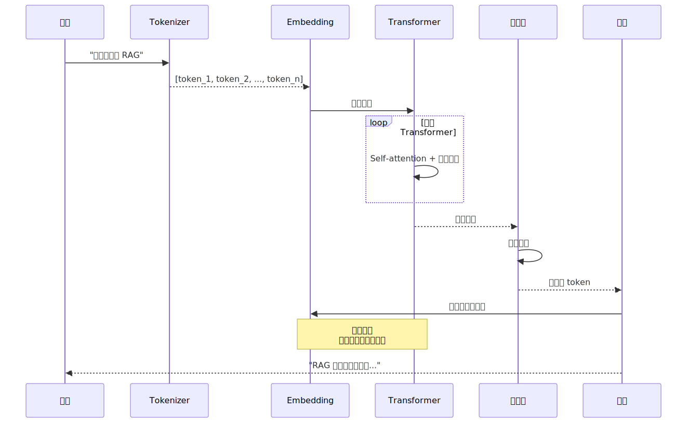

你对着 ChatGPT 输了一句话，它在几百毫秒内回了一大段。表面看像"思考"，底层其实只做了一件事：猜下一个 token。猜完一个，把结果拼回去，再猜下一个。循环往复，直到凑出一整段回复。

这个过程没有理解、没有意识，但规模大到一定程度后，效果像"懂了一样"。

为了让后面的概念更好连起来，我们先给一个贯穿全文的比喻：

**把 LLM 想成一个在厨房学做菜的学徒。**

- `token`：食材切好的小块。学徒不会直接啃整颗白菜，而是先切成丝、片、丁。

- `embedding`：每种食材在"味道地图"里的坐标。甜的靠近甜，辣的靠近辣，咸的靠近咸。学徒靠这张地图判断什么该搭什么。

- `pretrain`：让学徒看几千万次做菜过程，慢慢学会哪些食材常搭配、顺序怎样、火候怎么接。

于是最后，它虽然每次只是"下一步该放什么"，但因为见得太多，就能一步一步做出像样的整道菜。

后面我们就沿着这条线拆开：文字怎么被切成食材小块，食材怎么落到味道地图里，学徒怎么靠海量菜谱练出模式，最后又是怎么一步一步把一道菜做出来的。

---

## 一、先建立直觉：LLM 是什么

### 1.1 本质就是一个语言预测器

LLM（大语言模型，通过海量文本训练、能理解和生成自然语言的神经网络）最底层做的事很朴素：看到前面的内容后，猜下一个最可能出现的词片段。注意，不一定是完整词，有时只是一个字、半个词、一个标点。技术上这叫 token。

它不是先想完一整段再吐出来，而是"一个字一个字地往后接"。只是接得太准、太快、太像懂你，所以你觉得它在"思考"。

训练时它看过海量文本、代码、网页、书、问答、论坛、论文。看的东西足够多，它就学会了语言规律、知识关联和任务套路。于是它表现得像是会很多技能：写邮件、总结文章、解释代码、列方案、陪你对话。

换句话说，它不是"学会了这些职业"，而是在参数里压缩了这些场景的语言模式。

### 1.2 它能做什么，不能做什么

最容易误解的一点是：它"看起来懂"，不等于它"像人一样真的懂"。

它没有生活经验、情绪、自我意识，也没有一个稳定不变的"世界模型"藏在脑子里。它更像一个极其强大的语言模式压缩器（compressor，把大量文本规律压进模型参数的信息处理机制）。

正因如此，它有时会说得头头是道，却把事实说错。这就是幻觉（hallucination，LLM 编造看似合理但实际虚假的内容）。

模型的目标是"生成一个看起来合理、语言上顺滑、上下文接得住的话"，不是"像数据库那样只返回经过校验的真相"。所以当问题超出它的把握、资料缺失、或者你的提示不够清楚时，它可能"硬着头皮编一个像样的答案"。

对使用者来说，最实用的认知是这三句：

1. LLM 本质上是一个超级强的语言预测器。

2. 因为训练数据特别大，它表现得像会很多通用技能。

3. 它很强，但不可靠到可以盲信。事实、数字、最新信息、严肃决策，一律要校验。

### 1.3 LLM 是大脑，工具是手脚

今天的 AI 产品可以分两层看：

- LLM 是"大脑"，负责理解你的话、组织语言、生成答案。

- 工具、RAG（检索增强生成，让 LLM 先查外部知识库再回答，解决幻觉和知识滞后问题）、Agent（能自主决策并调用工具完成多步骤任务的 AI 系统）是"手和脚"，负责查资料、调用搜索、访问数据库、执行代码、操作软件。

单独的 LLM 更像"会说、会写、会分析"。接上工具之后，才更像"能做事"。



上图是现代 AI 系统的分层结构。用户输入先到 LLM，LLM 判断是否需要外部知识或执行能力，通过 RAG 或 Agent 调用工具，最后汇总生成回复。单独 LLM 只能"说"，接入工具后才能"做"。

---

## 二、Token：语言进入模型前的切块

先看第一步：切菜。

模型读文字时，不是按"整句话"读，也不一定按"整词"读，而是先把文本拆成一块一块的小单位。就像学徒做菜前要先把食材切成丝、片、丁，LLM 处理语言前，也要先把文字切成 token。

比如这句话：

```
我喜欢喝冰美式
```

在模型内部，可能被切成：

```
["我", "喜欢", "喝", "冰", "美式"]
```

也可能切成：

```
["我", "喜欢", "喝", "冰美", "式"]
```

英文更常见这种现象。`unbelievable` 可能不是一个 token，而是：

```
["un", "believ", "able"]
```

所以，`token != 字`，`token != 词`。它更像"模型自己的拼装颗粒"。

为什么不直接按词切？因为真实世界里词太多了。新词、缩写、拼写变化、代码变量名、多语言混杂都会爆炸。如果模型只能认完整词，那它遇到没见过的新词就很容易懵。把词拆成更小颗粒后，它就算没见过整个词，也可能见过其中的部分，于是还能拼起来理解一点。

你可以把 tokenization（将文本拆分为模型可处理的最小离散单位的过程）想成"切菜"：

- 人类看一句话，觉得这是完整意思。

- 模型先把它切成一小块一小块。

- 后面所有理解和生成，都是基于这些小块在做。

再举个程序员更容易理解的例子。这段代码：

```python
user_profile = get_user_profile(user_id)
```

模型内部不会把整行当一个东西。它会拆成很多 token，类似：

```
["user", "_profile", "=", "get", "_user", "_profile", "(", "user", "_id", ")"]
```

这样做的好处是：

- 它知道 `get` 很常见

- 它知道 `_id` 很常见

- 它知道 `user` 很常见

- 即使 `get_user_profile` 这个完整函数名没见过，它也能从局部模式猜这是"获取用户资料"的函数

token 的本质作用，不是直接表达完整语义，而是把原始文本变成模型能处理的离散单位。也就是说，它先把整道菜需要的材料切好，后面才谈得上判断怎么搭配、怎么下锅。

一句话记牢：**token 是语言进入模型前，被切出来的最小处理单元。**

---

## 三、Embedding：把 token 放进味道地图

食材切好以后，下一步不是马上下锅，而是先知道它们大概属于什么味道、适合和谁搭配。

token 是离散的编号。模型需要一种方式知道"猫"和"狗"比较像，"猫"和"汽车"差很远。

embedding 就是干这个的。它把每个 token 从"一个冷冰冰的编号"，变成"一串有含义的坐标"。

比如我们先假装 embedding 只有 3 维，维度含义非常粗暴：

- 第 1 维：像不像动物

- 第 2 维：像不像食物

- 第 3 维：像不像交通工具

那可能会有：

```
猫 -> [0.9, 0.1, 0.0]
狗 -> [0.95, 0.05, 0.0]
汉堡 -> [0.1, 0.9, 0.0]
汽车 -> [0.0, 0.0, 0.95]
```

你一看就懂：猫和狗靠得近，汉堡离猫狗远一点，汽车更远。

这就是 embedding 最核心的直觉：**embedding 是把 token 放进一个"语义空间"里，让相似的东西彼此靠近。**

当然，真实模型不是 3 维，也不是人工规定"动物/食物/交通工具"这种维度。真实 embedding 通常是几百维、上千维，而且每一维的含义不是人手工定义的，是训练自己学出来的。

这里有个特别重要的点：embedding 不是"翻译成中文解释"，而是"翻译成数字坐标"。放回厨房比喻里，它不是给食材贴一句说明书，而是把食材放到一张"味道地图"上。

你可以把它想成地图坐标：

- 北京、上海、广州都是城市，所以在某些语义关系上会接近

- 苹果（水果）和香蕉会接近

- 苹果（公司）会和微软、谷歌更接近

也就是说，embedding 的厉害之处是：它能把"语义相似"变成"空间距离接近"。

再给一个句子级例子。这两句话：

```
今天天气很热
今天真热
```

虽然字面不完全一样，但 embedding 后，向量往往会很接近。而这句：

```
我明天去银行办卡
```

向量会远很多。

这也是为什么 RAG 能做语义检索：不是靠关键词一模一样，而是靠 embedding 后的距离接近。

到这里，学徒已经有了两样东西：切好的食材，以及一张能判断食材关系的味道地图。但它还不会做菜。真正让它学会"下一步该放什么"的，是预训练。

---

## 四、Pretrain：看海量菜谱练出来的模式

如果说 token 是"切好的食材"，embedding 是"味道地图"，那 pretrain（在海量通用语料上通过无监督目标训练模型通用语言能力的阶段）就是：

**让学徒看海量菜谱和做菜过程，练到知道下一步该放什么。**

如果换回文字世界，这件事又很像"让一个人疯狂读书"。

想象有个学生：读了几亿页网页、很多书、很多代码、很多问答、很多论文和说明文档。老师不给他讲"什么是翻译、什么是总结"，而是一直让他做一个任务：

**看前文，猜下一个 token 是什么。**

比如训练样本可能长这样：

```
今天天气很___
```

模型要猜下一个 token 可能是：热、好、冷。

又比如：

```
Python 是一种___
```

它可能猜：编程语言、语言、动态语言。

再比如代码：

```python
for i in range(10):
print(i)
```

模型会慢慢学到：`for` 后面常跟变量，`range(` 后面常是数字，下一行常缩进，`print(i)` 这种结构很常见。

关键点来了：训练目标虽然只是"猜下一个 token"，但为了猜对，模型不得不顺便学会很多东西：语法、常识、事实模式、写作风格、代码结构、问答套路、推理链条的一部分。

这就是为什么 pretrain 之后，模型会显得"什么都懂一点"。

再举个特别直观的例子。如果模型在预训练里看过很多这种句子：

```
中国的首都是北京
法国的首都是巴黎
日本的首都是东京
```

那当你问"德国的首都是哪里？"，它很可能能答出"柏林"。

它不是像数据库那样"查表"，而是因为在海量文本中反复看到了"国家 -> 首都"这种模式，于是参数里形成了这种关联。

所以你可以把 pretrain 理解成：**通过海量文本上的续写训练，把语言规律和知识模式压进模型参数里。**

放回厨房比喻里，pretrain 不是老师直接告诉学徒"什么是川菜、什么是粤菜、什么是总结、什么是翻译"，而是让它看过足够多的做菜过程。它每次只练一个动作：根据前面的步骤，猜下一步最可能是什么。练得足够久以后，它就开始掌握食材搭配、步骤顺序和常见套路。

---

## 五、从预训练底座到可用产品

预训练后的模型只是"很会续写"，不一定"很会当助手"。你问它问题，它可能继续闲聊、偏题、说怪话，或者输出有害内容。把它从"研究模型"变成"可交互产品"，还需要几道加工工序。

### 5.1 Transformer：为什么它能担此大任

进入 Transformer（基于自注意力机制、摒弃循环结构的神经网络架构）后，数据流经多层相同的 block。每个 block 只做两件事：注意力计算和前馈网络。

它之所以重要，是因为它解决了两个老问题：

- 比 RNN/LSTM（带循环结构的序列神经网络，擅长时序建模但训练难以并行）更容易并行训练。

- 更容易处理长距离依赖。

#### Self-attention 的直觉

句子里的每个 token，在理解自己时，都可以去"看一眼"上下文里的所有其他 token，并给它们分配不同权重。

处理"苹果"这个词时，如果前文是"吃"、"甜"、"水果"，attention 权重就会偏向水果义。如果前文是"市值"、"股价"、"蒂姆库克"，权重就会偏向公司义。这个"看谁更重要"的机制，就是 self-attention（自注意力机制，序列中每个位置通过计算与其他位置的关联权重来聚合上下文信息）。

#### Q/K/V 的工程解释

Attention 的计算不是玄学。它用三组投影矩阵把输入向量映射到三个子空间：

- **Query（查询向量）**：当前 token 想找什么信息。

- **Key（键向量）**：其他 token 各自提供什么标签。

- **Value（值向量）**：其他 token 真正携带的内容。

你可以把它想象成查档案。Query 是你要查的问题，Key 是档案的标签，Value 是档案里的实际内容。你拿问题去跟所有标签比对，找到最相关的档案，然后提取里面的内容。

关键点：因果 mask（causal mask，在自回归生成中阻止模型看到未来 token 的三角掩码）。训练或推理时，生成第 t 个 token 不能看到 t+1 及以后的内容。这个 mask 让未来位置的权重变成 0。没有它，模型就等于提前看了答案。

#### Multi-head Attention

把向量切成多份，各自独立做 attention，最后拼接。例如 8 个 head，每个 head 的维度是 `d_model / 8`。

Multi-head attention（多头注意力机制，让模型从多个子空间并行学习不同关系模式）相当于让模型同时从多个角度审视关系。一个 head 学语法搭配，一个学长距离指代，一个学局部语义。多个 head 的结果拼接后再投影回原始维度，信息密度更高。

### 5.2 对齐：从"会续写"到"会当助手"

单靠预训练，模型往往会"很会续写，但不一定会当助手"。它可能答非所问、风格混乱、输出不稳定。所以后面会做对齐（alignment，让模型输出符合人类意图和价值观的训练过程）：

**SFT（Supervised Fine-Tuning，监督微调，用人工标注的指令-回答对做有监督训练）**：收集大量高质量的 `<指令, 回答>` 样本，继续训练模型。这一步让模型学会理解任务格式、跟随指令、输出结构化内容。

**RLHF（Reinforcement Learning from Human Feedback，基于人类偏好的强化学习对齐）**：先让模型对同一个 prompt 生成多个回答，人类标注员对这些回答做偏好排序。然后训练一个奖励模型来评估回答质量，再让语言模型朝着"人更喜欢"的方向优化。

RLHF 不是让模型"学会真理"，而是让模型"更像一个好用的助手"。所以你感受到的礼貌语气、跟随指令、拒绝危险请求、结构化输出，很大一部分来自对齐阶段。对齐过度的副作用是模型可能变得过于保守，拒绝一些合理请求，俗称"对齐税"（alignment tax，对齐过程中模型在部分任务上性能下降的现象）。

### 5.3 采样策略：从概率到具体 token

模型输出的是概率分布，不是确定的词。怎么从分布里选一个具体的 token，由采样策略决定。

**Greedy Decoding**：永远选概率最高的 token。最确定，但也最无聊。适合代码生成、数学推理等对准确性要求高的场景。

**Temperature（采样温度，控制概率分布平滑度的超参数，越低越保守）**：T 越低输出越保守，T 越高越有创意。通用聊天通常取中间值。

**Top-k**：只从概率最高的 k 个候选里采样。k 越小选择面越窄，输出越稳定。

**Top-p / Nucleus Sampling**：从累积概率达到 p 的最小候选集合里采样。比如只考虑概率加起来超过 90% 的那部分候选词，动态调整选择面大小。

这些参数直接影响输出的风格。客服机器人需要低 temperature 高稳定性，创意写作则可以放宽一些。

### 5.4 一次推理的完整流程

训练像学徒看菜谱练习，推理则像真正接到一份点单后开始做菜。模型推理时，通常经历的是：

1. 输入被切成 token，也就是先把食材切好。

2. token 变成 embedding，也就是把食材放到味道地图里。

3. 经 Transformer 多层计算，判断当前这些食材、顺序和上下文之间的关系。

4. 输出下一个 token 的概率分布，也就是判断下一步最可能放什么。

5. 通过采样策略选出下一个 token，相当于从几个可能动作里选一个。

6. 把新 token 接回上下文，继续下一轮预测，直到整道菜做完。

所以从运行机制上看，LLM 本质是一个自回归生成器（autoregressive generator，每次只预测下一个 token 并拼回上下文的神经网络）。你觉得它在"思考"，其实是因为它在每一步都利用了前面所有上下文，并且在参数里压缩了极大量的模式。

注意推理和训练的本质区别：训练时可以并行计算整个序列，因为目标 token 是已知的。推理时只能自回归生成，每步依赖前一步输出。



### 5.5 为什么它会这么强

核心原因有三件事同时成立：

- 模型规模大，参数足够多。

- 数据规模大，覆盖足够广。

- 算力规模大，训练足够久。

这三者缺一不可。小模型+大数据可以学得很好，但泛化能力有限。大模型+小数据会过拟合。只有三者同时放大，才可能出现涌现能力和通用任务接口。

---

## 六、发展脉络：从猜词器到认知中枢

如果按"为什么技术会一步步走到今天"来理解，而不是只背公司名字，路线会更清楚。

**第一阶段：统计语言模型。** N-gram（基于前 N-1 个词估计下一个词概率的统计语言模型）把语言建模成条件概率问题。思路直接，但上下文窗口太短，数据稀疏严重，几乎没有语义泛化能力。

**第二阶段：分布式词向量。** Word2Vec（将词映射为连续向量的浅层神经网络模型）和 GloVe 的关键突破是：词不再是孤立的编号，而是落入连续向量空间。这样"国王 - 男人 + 女人 ≈ 女王"这类语义关系才有可能出现。这一步非常重要，因为它让 NLP 从"符号统计"进入"分布式表示学习"。

**第三阶段：序列模型。** RNN、LSTM、GRU（带门控循环结构的序列神经网络，擅长时序建模但训练难以并行）开始认真处理"前后文"。相比 N-gram，它们理论上能记住更长的历史。后来 Seq2Seq（序列到序列架构，用编码器-解码器结构做翻译和摘要等任务）被广泛用于翻译、摘要、对话。但这条路也有问题：训练慢、难并行、长距离依赖依然容易丢。

**第四阶段：Attention。** attention（模型生成当前词时动态关注输入中不同位置内容的计算方式）的意义在于：模型生成当前词时，不用只依赖一个被压缩得很厉害的"整句向量"，而是可以动态去看输入里不同位置的内容。这相当于给模型增加了"回看原文重点"的能力，是后来 Transformer 成熟的关键前奏。

**第五阶段：Transformer，时间点是 2017 年。** 这是现代 LLM 的真正分水岭。Transformer 不再依赖 RNN 那种一步一步递归推进，而是主要用 attention 建模关系。这使得训练可以更并行、扩展更顺畅，也更适合把模型堆大。后面不管是 BERT、GPT、T5、PaLM、LLaMA、Claude、Gemini，大体都站在 Transformer 这条线上。

**第六阶段：预训练大模型。** 这时行业意识到：与其每个任务单独做模型，不如先训一个通用模型。于是出现几条典型路线：

- BERT（双向编码器表示模型，encoder-only 架构，更偏理解）是 encoder-only，更偏理解。

- GPT（生成式预训练 Transformer，decoder-only 架构，更偏生成）是 decoder-only，更偏生成。

- T5/BART（文本到文本迁移 Transformer / 双向自回归 Transformer，encoder-decoder 架构）是 encoder-decoder，适合输入输出映射任务。

其中对今天影响最大的，是 GPT 这条自回归生成路线。因为它天然适合把"自然语言输入"变成"自然语言输出"，非常符合通用助手的形态。

**第七阶段：规模主义被坐实。** GPT-3 在 2020 年让很多人第一次真正看到：模型够大时，光靠 prompt 和少量示例，就能做很多以前必须单独训练的任务。这一步改变特别大，因为"任务接口"开始从专用 API、专用 UI，变成自然语言 prompt。

**第八阶段：对齐。** 如果没有 instruction tuning 和 RLHF，大模型常常会很聪明，但不好使。它可能会继续闲聊、偏题、说怪话，或者输出不符合用户期待的答案。对齐让模型从"研究模型"变成"可交互助手"。

**第九阶段：ChatGPT。** 准确日期是 2022 年 11 月 30 日。它重要不在于发明了全新底层架构，而在于把"指令对齐后的大模型"包装成普通人可以直接使用的对话产品。从那一天开始，LLM 不再只是 AI 研究圈的话题，而变成大众生产工具入口。

**第十阶段：工程化落地。** 2023 年之后，大家不再只比"模型会不会答题"，而开始比"模型怎么接到真实系统里"。这时候 RAG、函数调用、工具调用、向量数据库、多模态输入输出开始快速发展。因为大家发现，光靠参数记忆是不够的：

- 知识会过时。

- 回答不可追溯。

- 企业私有知识不在预训练数据里。

- 模型不能天然访问数据库、搜索引擎和浏览器。

所以 RAG 成为一个很关键的补丁：把外部知识检索进来，再交给模型生成答案。

**第十一阶段：Agent 化。** 到 2024 年以后，一个明显趋势是：LLM 不只是"回答问题"，而是在系统里参与规划、拆任务、调用工具、读取记忆、验证结果。这时它更像一个"认知中枢"：

- 用语言理解任务。

- 决定下一步该做什么。

- 调用搜索、代码执行、数据库、浏览器。

- 根据返回结果继续下一步。

于是，现代 AI 系统越来越像"LLM + 工具 + 上下文 + 记忆 + 工作流"的组合，而不是一个孤立模型。

**把整件事压成一句最容易记的话：**

LLM 的历史，不是"某家公司把参数越堆越大"的历史，而是"语言模型如何一步步从猜词器，变成通用语言接口，再变成软件系统里的认知核心"的历史。

如果你现在要自己复述，可以直接用这个版本：

1. 最早大家只是想让机器猜下一个词。

2. 后来发现要先让词有语义表示，所以有了词向量。

3. 再后来发现要理解上下文和序列，所以有了 RNN/LSTM/Seq2Seq。

4. 再后来 attention 和 Transformer 解决了大规模建模问题。

5. 然后预训练让一个模型开始能做很多任务。

6. 对齐让它从"会续写"变成"会当助手"。

7. ChatGPT 让普通人第一次大规模用上它。

8. RAG、工具调用和 Agent 又让它从"会说"走向"会做"。

---

## 七、用一句话串起全部

如果你读完觉得东西有点多，就回到开头那个比喻：

你对着 ChatGPT 发 Prompt，本质上就是在点一道菜。学徒先把你的要求切成 token，查味道地图判断这些 token 之间的语义关系，再凭预训练里看过的海量"做菜过程"，一步一步猜下一步该放什么。

所以 LLM 的厉害之处，不是它先在脑子里想好完整答案，再一次性端出来；而是它把每一步都猜得足够准、足够连贯。token 让它能处理文字，embedding 让它能感知相似关系，pretrain 让它把海量语言模式压进参数，Transformer 让它在上下文里动态判断重点，采样策略则把概率分布变成具体输出。

理解这件事，你就不容易被"AI 在思考"的错觉带偏，也知道怎么更好地使唤它。
