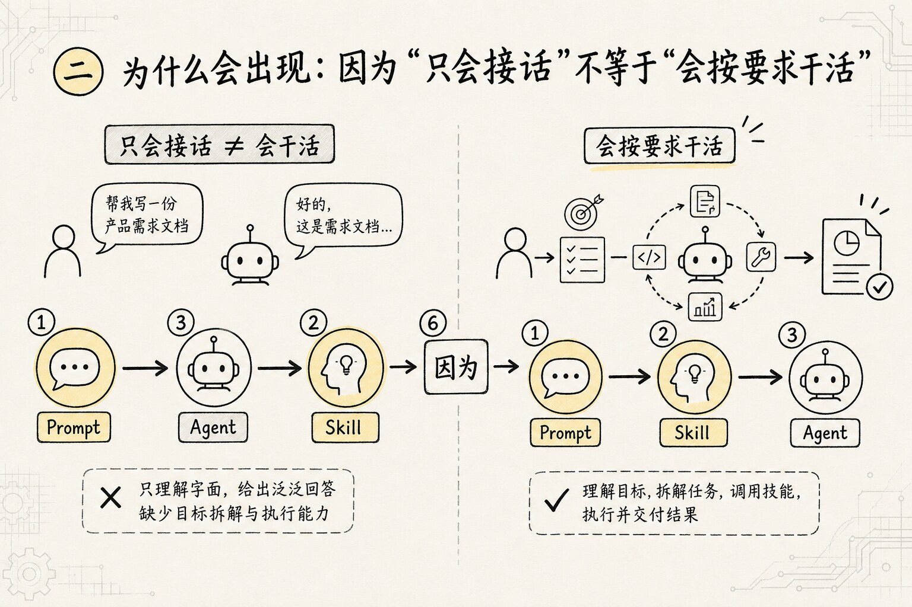
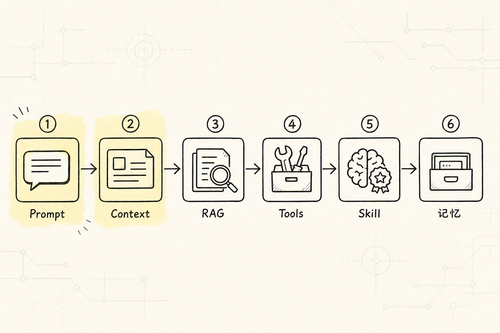
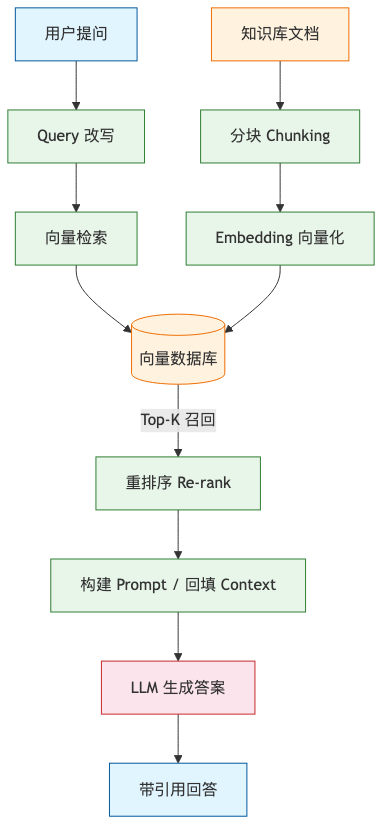
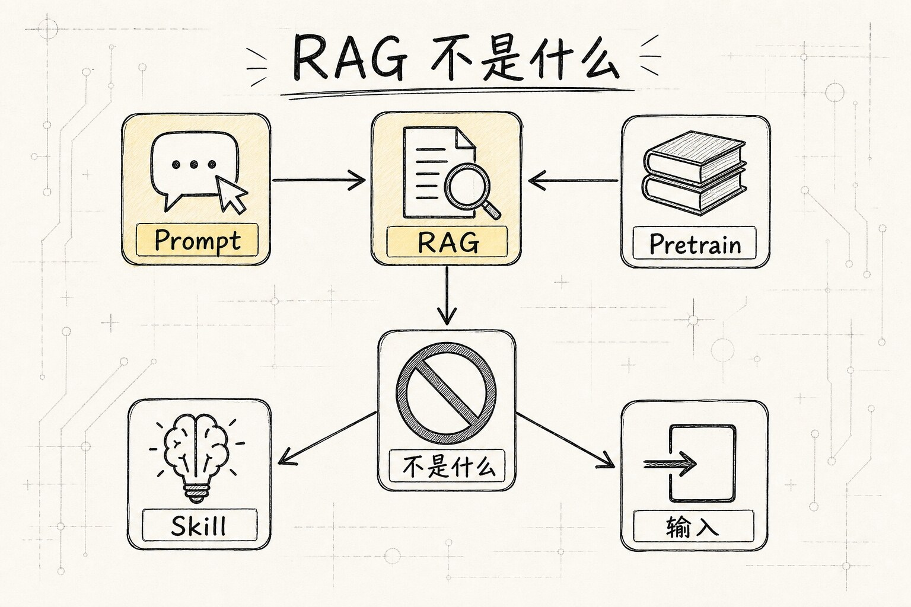
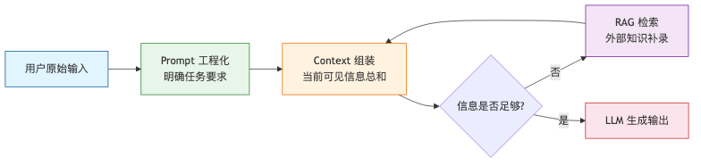
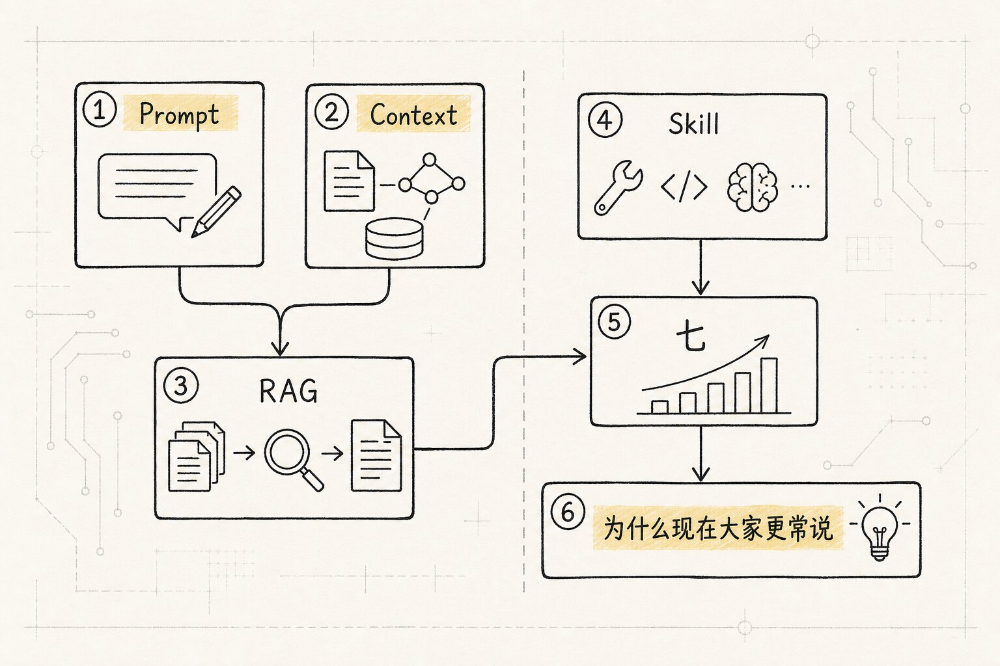

# Prompt、Context、RAG 到底是什么：一条 LLM 输入链路的演进逻辑

很多人刚接触大语言模型时，都会有一种很强的错觉：

是不是模型版本一升级，它就突然"更聪明"了？

这当然有一部分是真的。模型本身的能力确实会变强。但在日常使用里，真正决定你拿到的结果好不好，往往不只是模型参数，而是另外三件事：

- 你是怎么给它下任务的

- 你给了它多少有用材料

- 当它自己不知道时，你有没有办法帮它去外面查资料

这三件事，正好对应今天最常见的三个词：

- `Prompt（提示词，给 LLM 的输入指令，质量和结构直接决定输出效果）`

- `Context（上下文，模型这一次调用中能看到的全部信息总和）`

- `RAG（Retrieval-Augmented Generation，检索增强生成，让 LLM 先查外部知识库再回答，解决幻觉和知识滞后问题）`

如果你总觉得这些词听起来很熟，但又老是混在一起，那很正常。因为它们本来就不像三门互不相干的独立技术，更像一条很自然的"补漏洞"过程：

1. 模型本来只会接着你的话往下写，这不够干活，于是我们开始认真给它下任务，这就有了 `Prompt`

2. 但只有任务还不够，模型还需要看到背景材料，于是输入里开始区分"要求"和"资料"，这就有了 `Context`

3. 可上下文里能放的资料总是有限，而且模型脑子里的知识也会过期，于是系统开始想办法去外面查，再把结果塞回来，这就有了 `RAG`

也就是说，这篇文章会讲清楚：

**这几个概念为什么会出现，它们各自解决了什么问题，又留下了什么新问题，最后才一个接一个长出来。**

为了让整篇文章更好懂，我们先固定一个贯穿全文的例子：

```text
“帮我总结公司知识库里关于 Redis 缓存雪崩的处理办法，并给我一个适合新人看的解释。”
```

后面你会看到，`Prompt`、`Context`、`RAG` 都是在围绕这句话分别发挥作用。

## 一、故事要从一个“只会接话”的模型开始


前文讲过，[[01.LLM的原理#一、先建立直觉：LLM 是什么|大语言模型最底层做的事]]，本质上是 next token prediction：根据前文预测下一个 token。你可以先把它理解成一个"特别会接话的续写机器"。

这个起点很重要，因为后面所有概念，几乎都是在给这个"只会接话的模型"补能力。

一开始，你让它干活时遇到的第一个问题是：

**它虽然很会说，但它不知道你到底想让它怎么说。**

比如你丢一句：

```text
讲讲 Redis 缓存雪崩
```

这句话对人来说都很模糊，更别说对模型了。它会卡在很多岔路口上：

- 你要它讲定义，还是讲解决方案？

- 你要它写给新人，还是写给架构师？

- 你要它短一点，还是讲透一点？

- 你想听通用知识，还是公司内部实践？

于是，人类为了让它不乱猜，做了第一件很自然的事：

**把任务说清楚。**

这一步，就是 `Prompt` 出现的原因。

## 二、Prompt 为什么会出现：因为“只会接话”不等于“会按要求干活”



所以，`Prompt（提示词）` 不是什么神秘咒语，它其实是第一个非常朴素的补丁：

**模型原本只会往下写，人类为了让它按要求写，于是开始认真写任务说明书。**

还是刚才那个例子。如果你换成：

```text
请你帮我总结公司知识库里关于 Redis 缓存雪崩的处理办法，
输出一版适合新人阅读的解释。
要求：
1. 先解释什么是缓存雪崩
2. 再解释为什么会发生
3. 最后总结常见处理办法
4. 不要太学术，尽量用生活化比喻
```

你会发现，模型的表现通常会明显变好。关键在于，它终于知道：

- 任务目标是什么

- 输出对象是谁

- 回答结构是什么

- 风格限制是什么

你可以把 Prompt 想成你在给一个刚入职的实习生派任务：

- 你只说"去弄一下这个"，他容易懵

- 你把目标、边界、格式、对象讲清楚，他就更容易做好

所以 Prompt 解决的是第一个问题：

**怎么让模型别乱发挥，而是按要求完成任务。**

### Prompt 带来了什么变化

Prompt 出现以后，模型从"单纯会接话"进化成了"可以被组织起来完成具体任务"。

一个常见的 Prompt 往往会包含：

- `任务目标`

- `约束条件`

- `输出格式`

- `示例`

这一步非常关键，但它很快又暴露出第二个问题：

**就算你把任务说清楚了，模型也未必有足够材料把任务做好。**

### Prompt 没解决的问题：模型还是可能“按要求胡说八道”


这里有个边界一定要讲清楚。

`Prompt` 解决的是：

**模型该做什么、按什么方式做、做成什么样。**

但它没解决的是：

**模型凭什么知道这些事实。**

比如，你现在要求它：

```text
总结公司知识库里关于 Redis 缓存雪崩的处理办法
```

这时候就算 Prompt 写得很漂亮，也只是把"要求"写清楚了。可如果模型根本没见过你们公司的知识库，它还是可能出现两种情况：

- 要么直接不知道

- 要么开始一本正经地乱猜

也就是说，Prompt 解决的是"怎么提需求"，不是"资料从哪来"。

这就引出了第二个概念：

**既然任务说明不等于资料本身，那模型在回答前到底看到了哪些材料？**

这个问题，引出了 `Context`。

## 三、Context 为什么会出现：因为只有任务，没有材料，模型还是干不好活



`Context（上下文）` 这个词，本质上就是对第二个问题的回答：

**模型这一次回答之前，手里到底拿到了哪些材料？**

所以你可以把 Context 理解成：

**模型在这一次调用里，能看到的全部信息。**

注意，是"全部信息"，不只是你刚刚打进去的那一句任务要求。

继续用我们那个例子：

```text
“帮我总结公司知识库里关于 Redis 缓存雪崩的处理办法，并给我一个适合新人看的解释。”
```

如果这是一个真正的 AI 系统，那模型在生成答案之前，可能看到的不只是这句用户提问，还可能包括：

- System Prompt（定义 LLM 角色和行为底线的全局指令，用户通常不可见）：你是一个技术助理，回答要准确、简洁

- 用户当前问题

- 之前几轮对话历史

- 公司知识库里被找出来的几段相关文档

- 某个工具返回的检索结果

- 一些代码片段或配置示例

这些东西加在一起，才构成这次调用的 `Context`。

到这里你就能看出它和 Prompt 的关系了：

- `Prompt` 更强调"你怎么提要求"

- `Context` 更强调"模型当前到底看到了什么"

换句话说，Prompt 更像题目要求，Context 更像题目加上你桌上摊开的全部参考材料。

### 一个最好记的比喻：开卷考试的资料桌


如果 Prompt 是老师给你的题目要求，那 Context 更像是你参加开卷考试时，桌上摊开的全部材料。

桌上可能有：

- 题目本身

- 你刚刚记的笔记

- 上一题的草稿

- 参考书里的几页内容

- 老师额外发的一张提示纸条

模型能输出什么，很大程度上取决于它桌上摊了什么。

这个比喻特别有用，因为它能一下子解释很多常见现象：

- 为什么同一个模型，在不同产品里表现差很多

因为它们给的上下文不一样。

- 为什么有时"你明明已经说过了，它还是忘了"

因为那段内容可能没有被带回当前上下文。

- 为什么有时信息给得越多，结果反而越差

因为桌上摊太乱了，重点被淹没了。

### Context 里可能包含什么


一个比较常见的上下文，可能包含这些部分：

- `System Prompt`：系统层的行为规则

- `User Prompt`：用户当前问题

- `History`：之前的对话历史

- `Retrieved Chunks`：检索回来的文档片段

- `Tool Results`：工具执行结果

- `Local Files / Code`：代码、文档、配置等材料

你会发现，`Prompt` 其实也属于输入的一部分，但 `Context` 是更大的那个篮子。

换句话说：

**Prompt 是 Context 的一部分，但 Context 不等于 Prompt。**

### Context 解决了“资料从哪来”的一部分，但又留下了新问题

有了 Context 以后，模型当然比"只看一句 Prompt"时强多了。因为现在它不只是按要求回答，而是可以结合背景材料回答。

但新的问题马上又来了：

**模型这次能看到的材料，总是有限的。**

这会带来两个很现实的问题：

1. 你不可能把所有资料永远都塞进去

2. 模型脑子里原本记住的知识，本身也可能过期

比如你问一个最新政策、一个公司内部文档、一个昨天刚更新的产品说明。模型就算很强，也不太可能天然知道。

这时，单靠"把当前上下文整理好"还不够，因为问题已经变成：

**如果当前 Context 里没有答案，那怎么办？**

这个问题，就会继续引出 `RAG`。

### Context 不是长期记忆

这里还有一个初学者特别容易混淆的点：

很多人会把 `Context` 直接理解成"模型的记忆"。

这个说法不够准确。

更准确的理解是：

**Context 是当前这一轮的工作台，不是长期记忆仓库。**

你可以把它想成电脑桌面：

- 桌面上现在摊开的文件，是当前工作内容

- 真正长期保存的资料，在硬盘、网盘、知识库里

模型也是类似的。

它这一次看见的东西，属于当前调用的上下文；一旦这轮调用结束，那些内容并不会自动变成一个稳定、永久、随时可调用的长期记忆系统。

所以，如果你问：

"Context 是不是长期记忆？"

答案应该是：

**不是。它更像临时可见的工作区。**

### 为什么上下文不是越大越好

很多人直觉上会觉得：那我把所有资料都塞进去，不就万无一失了吗？

现实恰恰不是这样。

因为上下文窗口再大，也是有限的。Context Window（LLM 一次能处理的最大 Token 数，输入+输出总和不能超过）不是无限资源。而且哪怕窗口还装得下，信息太多也会带来几个问题：

- 重点被噪音淹没

- 相似但不相关的材料混在一起

- 模型注意力被拉散

- 成本和延迟变高

这就像你开卷考试时，把整个图书馆都搬到桌上。理论上材料更多了，实际上你会更乱。

所以好的系统不会无脑多塞，而会把最相关、最有信号的材料放到模型面前。

到这里，链条就已经很清楚了：

- 只会接话，不会按要求做事，于是有了 `Prompt`

- 只有要求，没有材料，还是做不好，于是有了 `Context`

- 当前材料不够，或者知识过期，于是就需要 `RAG`

## 四、RAG 为什么会出现：因为当前上下文里没有答案时，系统得学会去外面找

`RAG（检索增强生成）` 本质上是在补第三个漏洞：

**当前 Context 里没有答案，但这个答案明明存在于外部资料里，那系统总不能干等着。**

于是，人们想到的办法很自然：

**先去查，再来答。**

或者更接地气一点：

**模型先去找资料，再基于资料回答。**

还是回到我们的例子。

用户说：

```text
帮我总结公司知识库里关于 Redis 缓存雪崩的处理办法，并给我一个适合新人看的解释。
```

如果模型本身没见过你们公司的知识库，它直接回答就有风险。因为它可能只会用自己的通用知识讲 Redis，讲不到你们公司真正写过的实践。这时候问题已经变成：它手头根本没资料。

这时，系统更合理的做法是先找资料：

1. 先去公司知识库里查

2. 把相关内容找出来

3. 把最相关的几段塞回当前 Context

4. 再让模型生成答案

这整套过程，就可以粗糙理解为 RAG。

所以 RAG 出现的根本原因和热词无关，真正的问题是：

**模型参数里的知识不够新、不够全、不够贴合当前问题，于是系统必须具备一种从模型外部临时补知识的能力。**

### 一个好记的比喻：学生去资料室找参考页

你可以把模型想成一个学生。

这个学生表达能力很好，讲解能力也不错，但他不可能把你公司所有内部文档都背在脑子里。

于是，RAG 就像在考试前做了一件事：

先去资料室，把和"Redis 缓存雪崩"最相关的几页资料找出来，复印后带回桌上，然后学生再根据这些资料作答。

所以：

- 模型负责"读懂问题"和"组织答案"

- RAG 负责"把外部资料补进来"

这也是为什么大家会说，RAG 是在给模型补上下文。

### 一个最基础的 RAG 流程长什么样

很多人听到 RAG，会立刻被"向量库""embedding""召回率"这些词劝退。其实从入门角度看，先记住最粗的流程就够了：

```text
文档入库
-> 切成小段
-> 建立索引
-> 用户提问
-> 找出最相关的几段
-> 把这几段塞进 Context
-> 模型生成最终答案
```

如果你想再稍微专业一点，可以把中间两步补成：

```text
文档入库
-> 切块
-> 向量化 / 建索引
-> 用户提问
-> 检索相关片段
-> 回填到 Context
-> 模型生成
```

你不用一上来就懂什么叫向量化，也不用先搞懂向量数据库的内部实现。对入门来说，更重要的是看懂这条职责链：

**RAG 的任务，是给回答问题这件事准备资料。**

RAG 的完整链路，用图来看会更清楚：



上图展示了 RAG 的完整链路。右侧是离线阶段：原始文档先被切分成块，通过 [[01.LLM的原理#三、Embedding：把 token 放进味道地图|Embedding]] 写入向量数据库。左侧是在线阶段：用户提问先经过 Query 改写，再到向量库检索最相关的片段，经过重排序后回填到 Context，最后由 LLM 组织生成答案。

### RAG 不是什么



这里一定要把几个特别容易混淆的点讲清楚。

`RAG` 不是：

- 重新训练模型

- 微调模型（Fine-tuning，在预训练好的模型基础上用领域数据继续训练以适应特定任务）

- 让模型永久学会新知识

- 简单的关键词搜索

它更像一种运行时补资料机制。

也就是说，RAG 的核心是：在模型回答前，把相关知识临时拿给它看，而不是把知识写进模型脑子里。

所以如果你问：

"RAG 是不是重新训练模型？"

答案是：

**不是。RAG 更像临时开卷，不是重新上学。**

## 五、把三者放回“问题接着问题”的链路里，你就不容易再混了


单独看 `Prompt`、`Context`、`RAG`，很容易变成背名词。

但如果你按"前一个办法解决了什么，又暴露了什么新问题"来理解，关系就会一下子顺起来。

它们不是三个平行按钮，而像三次连续补丁：

- 模型只会接话，不会按要求干活，于是补上 `Prompt`

- 有了任务说明，但没有足够材料，于是补上 `Context`

- 有了当前材料，但材料仍然可能不够或过期，于是补上 `RAG`

先记住这一句固定总结：

**Prompt 决定你怎么提要求，Context 决定模型这次能看到什么，RAG 决定当它看不到时，怎么把外部资料补进来。**

再看我们这个例子：

```text
“帮我总结公司知识库里关于 Redis 缓存雪崩的处理办法，并给我一个适合新人看的解释。”
```

这句话在系统里大概会经历这样一条路：

```text
用户提问
-> Prompt 组织任务
-> Context 装入当前可见信息
-> 如果信息不够，就触发 RAG
-> 检索结果回填 Context
-> 模型输出最终答案
```

这个过程用图来看会更直观：



上图展示了 Prompt、Context、RAG 三者在同一条输入链路上的接力关系。用户提问先经过 Prompt 层做任务拆解，再进入 Context 层做信息组装；如果当前材料不足以回答问题，RAG 层负责查缺补漏，把外部资料临时补回 Context，最终才把修好的上下文喂给模型生成答案。

你也可以把它想成三个人分工：

- `Prompt` 像提需求的人：把事说清楚

- `Context` 像桌上的资料：决定当前能参考什么

- `RAG` 像跑腿拿资料的人：缺材料时去外面补

于是，为什么它们总一起出现，也就很好理解了。

因为它们根本不是平级竞争关系。它们在同一条输入链路上前后接力。

如果你更喜欢"提问式"记忆法，也可以直接记成三问：

1. `Prompt` 回答的是：你到底想让我怎么做？

2. `Context` 回答的是：我这次回答时，手里到底有哪些资料？

3. `RAG` 回答的是：如果手里没有资料，我能不能先去外面找？

## 六、最容易混淆的几个点

这一部分你可以当成速查表。

### 1. Prompt 和 Context 到底有什么区别

最容易记的说法是：

- `Prompt` 更偏"任务说明"

- `Context` 更偏"当前可见信息总和"

Prompt 往往会成为 Context 的一部分，但 Context 还可以包含历史消息、检索结果、工具输出、文档片段等更多东西。

一句话版：

**Prompt 是你怎么说，Context 是模型最终看到了什么。**

如果按"问题视角"来记，就是：

- Prompt 解决"要求不清"的问题

- Context 解决"材料不够明面化"的问题

### 2. Context 和 Memory 是一回事吗

不是。

这篇不展开 `Memory`，你只要先抓住最小区别：

- `Context` 是当前这一轮临时可见的工作区

- `Memory` 更强调跨轮、跨任务、跨时间保存和再取回

所以：

**Context 更像桌面，Memory 更像资料柜。**

### 3. RAG 和微调有什么区别

这是另一个高频混淆点。

你可以先粗暴这么记：

- `RAG`：回答之前先去查资料

- `Fine-tuning（微调）`：用额外数据继续训练模型，让它整体行为更贴近某类任务

RAG 偏运行时取资料，微调偏训练期改模型。

所以如果你的问题是：

"我想让模型知道公司内部知识库内容"

很多时候第一反应更应该是看能不能用 RAG，而不是一上来就想着重训模型。

### 4. Prompt 写得很好，能不能替代外部知识补充

不能。

Prompt 能让模型更清楚你要什么，但它不能凭空制造它原本不知道的事实。

如果模型没有见过你们公司的 Redis 文档，或者这些知识已经过期，那 Prompt 再漂亮，也只是让它更优雅地"猜"。

所以：

**Prompt 解决表达问题，不解决知识缺口。**

### 5. RAG 是不是万能药

也不是。

很多人一听 RAG，会以为"只要接了知识库，回答就一定准确了"。现实里没这么简单。

RAG 仍然可能翻车，常见原因包括：

- 知识库本身就脏

- 文档切块切得很差

- 检索召回不准

- 找回来的内容太多或太乱

- 最终塞进 Context 的材料不够关键

也就是说，RAG 只是"有机会把正确资料拿回来"，不等于"系统一定会用对资料"。

所以别把它理解成"终极大招"，它更像是在解决第三个问题时，又引入了一套新的工程挑战。

## 七、为什么现在大家更常说 Context Engineering



当你把前面三部分都串起来后，就会自然理解为什么今天很多工程讨论里，开始更常出现另一个词：

`Context Engineering（上下文工程）`

这个词你不用现在就背得很重。对入门来说，只要先抓住它想强调的一件事：

**真正让系统好用的，往往是你怎么组织整张资料桌，而不只是有没有 Prompt 或 RAG。**

也就是：

- 哪些信息该进来

- 哪些信息不该进来

- 哪些要排前面

- 哪些要压缩

- 哪些要丢掉

- 哪些该从外部检索后再补进来

你会发现，这已经超出了单点技巧，进入了一整套"信息喂养工程"。

还是拿我们的例子说。

如果用户问的是 Redis 缓存雪崩，你当然可以暴力把整个 Redis 知识库全塞进模型。但这通常不划算。更好的方案往往是：

1. 先把问题表达清楚

2. 再检索出最相关的几段

3. 把真正关键的处理办法放进上下文

4. 把无关内容压掉

5. 最后再让模型生成一版面向新人的解释

这就是为什么现代系统越来越重视上下文组织，而不只盯着模型强不强。

换句话说，今天很多看起来像"模型更聪明了"的效果，其实背后是：

**任务说明更清楚了，资料桌更干净了，补资料的机制也更顺了。**

## 八、最低成本记忆法

如果你读到这里，只想带走一个最短版本，那就记住这三句：

- `Prompt` 是任务说明书

- `Context` 是当前资料桌

- `RAG` 是去外面拿补充资料的人

再压缩成一整句，就是：

**Prompt 决定你怎么提要求，Context 决定模型这次能看到什么，RAG 决定当它看不到时，怎么把外部资料补进来。**

所以，很多时候真正让系统变强的，是这三层配合得够不够好，不一定是模型参数突然神奇暴涨。

当你理解了这条链，再去看各种 AI 产品、RAG 框架、Agent 系统，你就不会再只盯着"模型版本号"，而会开始问更有价值的问题：

- 任务说明有没有写清楚？

- 给模型的上下文是不是干净、相关、够用？

- 缺知识时，系统有没有可靠地去外面补资料？

这三个问题，往往比"它是不是最新模型"更决定真实效果。

## 延伸阅读

### 外部资料

- [OpenAI Prompting Guide](https://platform.openai.com/docs/guides/prompting)

- [Anthropic Context Windows](https://docs.anthropic.com/en/docs/build-with-claude/context-windows)

- Lewis et al. (2020) [Retrieval-Augmented Generation for Knowledge-Intensive NLP Tasks](https://arxiv.org/abs/2005.11401)

- [Anthropic Contextual Retrieval](https://www.anthropic.com/research/contextual-retrieval)
