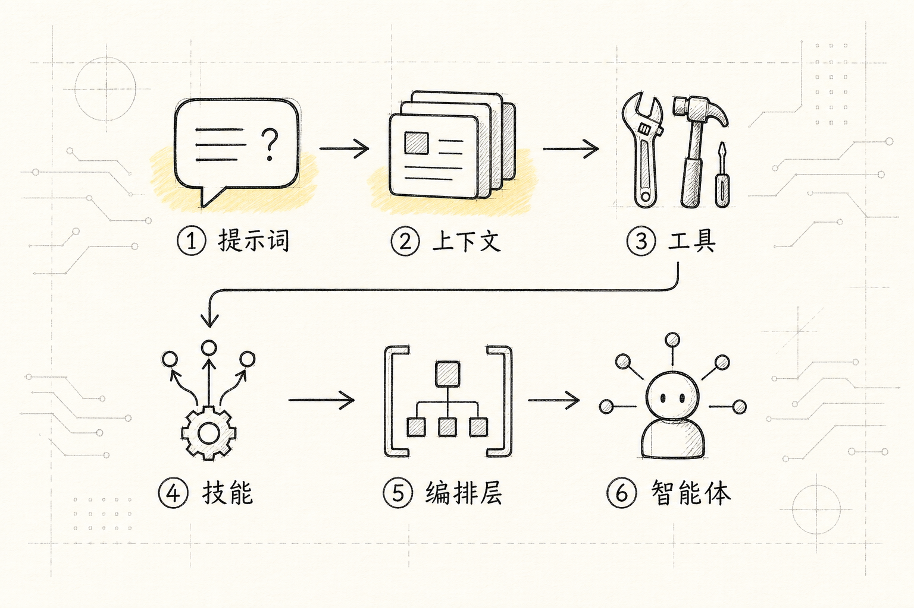
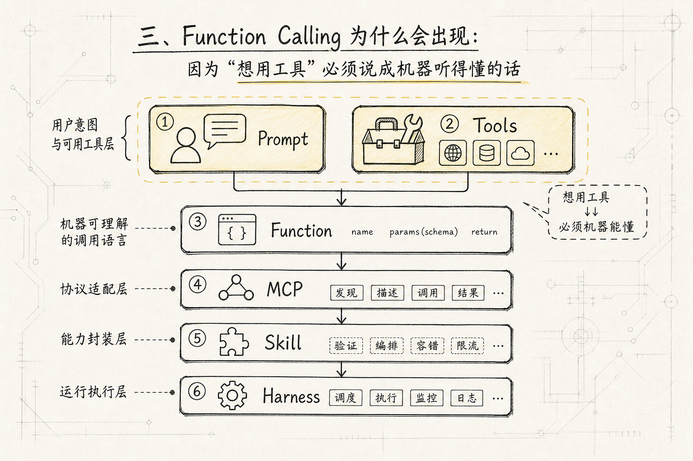
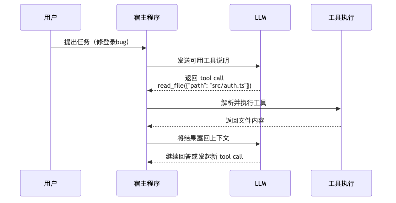
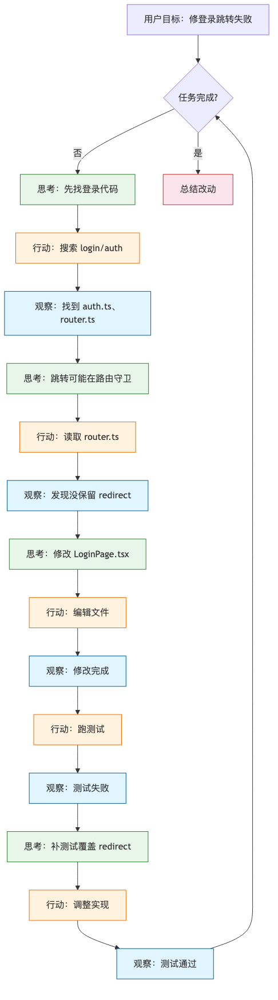
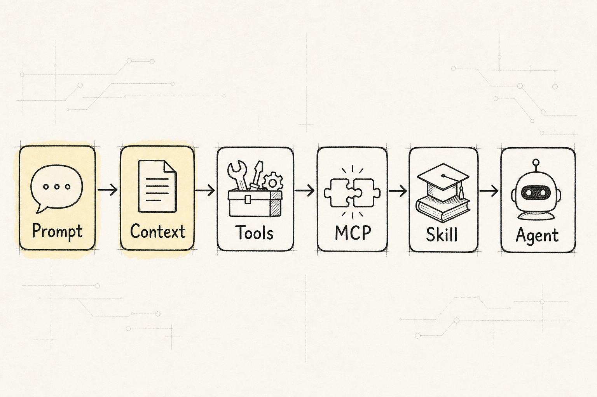
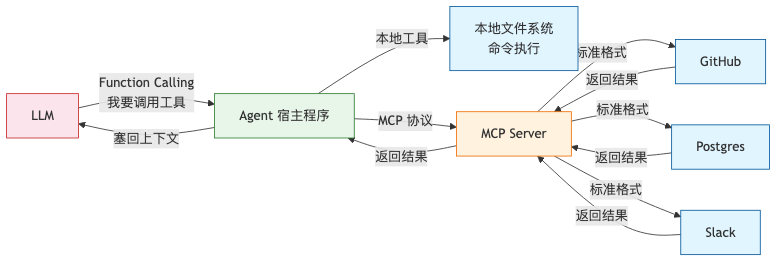
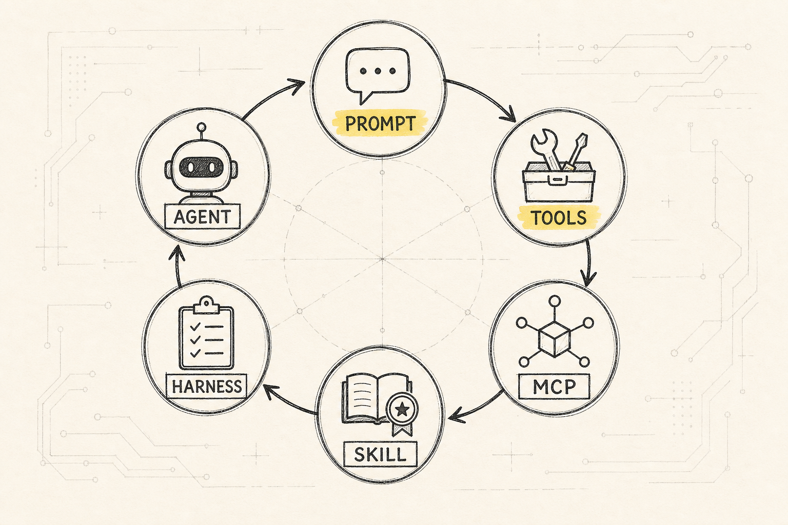
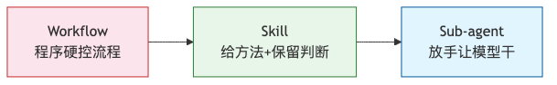

# 从对话到干活：Agent、Tools、Function Calling、MCP、Skill 到底是什么

很多人第一次听到 `Agent`，会下意识觉得它是一个"更高级的大模型"。

前文已经讲过，[[01.LLM的原理#一、先建立直觉：LLM 是什么|LLM 本质上是语言预测器]]：它很会读、很会写，也能按要求组织答案。Agent 的变化不在于模型突然长出了手脚，而在于模型外面慢慢补了一整套执行系统。

这个说法听起来很顺，但容易把事情讲玄。

如果把它拆回工程现实，Agent 并不是模型突然长出了手脚。而是人们在模型外面慢慢补了一整套执行系统：

**模型原来只会生成文字；后来它能用结构化方式表达"我要调用什么工具"；再后来，外层程序开始反复执行"思考 -> 行动 -> 观察"的循环；接着，为了把越来越多外部工具标准化接进来，出现了 MCP；而为了让 Agent 不只是有工具，还能复用某类任务的做法，又出现了 Skill。**

所以这篇文章不想上来给 Agent 下一个很学术的定义。我们想回答一个更朴素的问题：

**LLM 是怎么从一个聊天机器人，变成一个能真正干活的系统的？**

为了让整篇文章不飘，我们固定一个例子：

```text
请帮我把当前项目里的登录 bug 修掉：
1. 找到相关代码
2. 判断为什么登录后跳转失败
3. 修改代码
4. 跑测试
5. 总结你改了什么
```

如果你把这句话发给一个普通聊天模型，它最多只能给你分析思路。

但如果你把它发给 Claude Code、Codex、Cursor 这类编程 Agent，它真的可能去读文件、搜代码、改文件、跑命令、看测试结果。

区别不在于"模型本体突然会操作电脑了"。

区别在于模型外面多了一层能执行动作的运行时。

这层运行时，才是理解 Agent 的关键。

## 一、故事要从一个"只能说话"的模型开始


先沿用前文的结论：LLM 最基础的能力，是根据上下文生成后续内容。它能解释、能总结、能写代码，也能按 Prompt 组织答案。

但这里有一个非常现实的边界：

**会说，不等于会做。**

你问它：

```text
这个登录 bug 可能是什么原因？
```

它可以回答：

- 可能是 token 没保存

- 可能是路由守卫拦截

- 可能是 cookie 跨域问题

- 可能是登录成功后的 redirect 参数丢了

这些回答可能很有帮助，但它仍然停留在"建议"层面。

真正修 bug 需要的是另一组动作：

- 读取项目文件

- 搜索登录相关代码

- 打开路由配置

- 修改源码

- 运行测试

- 根据报错继续调整

这些动作都发生在模型外部。模型本身不能直接读你的硬盘，不能直接敲命令，也不能直接改文件。

于是，第一个问题出现了：

**如果模型只能生成文字，它怎么才能对真实世界产生影响？**

最直接的答案是：

**给它工具。**

## 二、Tools 为什么会出现：因为模型需要"手"



`Tools（工具，模型执行外部动作的能力接口）` 解决的是第一个缺口：

**模型会判断下一步该做什么，但它自己没有执行动作的能力。**

你可以把模型想成一个很聪明但坐在玻璃房里的人。他能看懂任务，也能提出方案，但他碰不到外面的文件、浏览器、数据库和命令行。

工具系统的作用，就是在玻璃房外面给他接几只手。

比如在编程 Agent 里，常见工具可能包括：

- `Read`：读取文件

- `Search`：搜索代码

- `Edit`：修改文件

- `Bash`：执行命令

- `Browser`：打开网页或操作浏览器

- `Test`：运行测试或构建

回到我们修登录 bug 的例子。模型如果只聊天，只能说：

```text
你可以检查一下 auth.ts 和 router.ts。
```

但有了工具以后，它就可以发起一个动作请求：

```text
读取 src/auth.ts
```

外层程序执行这个读取动作，把文件内容拿回来，再塞回模型上下文。模型看到文件后，再决定下一步要不要继续搜索、修改或测试。

这时，LLM 就不再只是"回答问题"，而是开始参与一个任务执行流程。

### 工具不是魔法，而是宿主程序开放的能力


这里要特别注意一件事：

**工具不是模型自己变出来的能力，而是宿主程序提前提供给模型的能力。**

所谓宿主程序，可以理解成包住模型的那个应用，比如：

- ChatGPT

- Claude Code

- Cursor

- Codex

- 一个你自己写的 Agent 框架

宿主程序告诉模型：

```text
你现在可以使用这些工具。
每个工具叫什么。
什么时候该用。
参数格式是什么。
调用后会返回什么。
```

模型要做的是判断"现在要不要用工具、用哪个工具、传什么参数"。

真正执行动作的，是外层程序。

所以工具系统解决的是：

**让模型有机会把语言判断转化成外部动作。**

但这马上带来了第二个问题：

**模型怎么稳定地告诉程序：我要调用哪个工具、参数是什么？**

如果模型只是输出一句自然语言：

```text
我想看看 src/auth.ts 这个文件。
```

程序很难稳定解析。它要猜：

- 这是普通回答，还是工具请求？

- 工具名是什么？

- 文件路径是哪一段？

- 参数有没有缺失？

于是，单纯有工具还不够。我们还需要一种结构化的调用格式。

这就引出了 `Function Calling`。

## 三、Function Calling 为什么会出现：因为"想用工具"必须说成机器听得懂的话



`Function Calling（函数调用，LLM 生成结构化参数请求外部工具的标准格式）` 解决的是第二个问题：

**模型不能只用自然语言表达"我想干什么"，它需要按约定输出一个可解析的工具调用请求。**

直白地说就是：

模型不能只说：

```text
我想读一下 src/auth.ts。
```

它最好能说成：

```json
{
"name": "read_file",
"arguments": {
"path": "src/auth.ts"
}
}
```

这样外层程序就不用猜了。它可以很明确地知道：

- 模型想调用 `read_file`

- 参数是 `path`

- 路径是 `src/auth.ts`

这就是 Function Calling 的核心价值。

它不是让模型"真的在内部执行函数"，而是让模型生成一个结构化请求。真正的函数执行，仍然发生在应用程序这一侧。

### 一次工具调用大概长什么样

一个最简化的工具调用流程可以这样理解：



上图展示了一次 Function Calling 的完整交互。主角是"用户的请求"：它从用户出发，经过模型判断变成结构化指令，再由宿主程序落地执行，最后结果回到模型决定下一步。容易出问题的环节是**解析阶段**——如果模型生成的 JSON 格式不对，整个调用就会失败，所以参数校验不能省。

比如修登录 bug 时，第一轮可能是：

```text
用户：帮我修登录 bug
模型：我要搜索 login 相关代码
工具调用：search_code({ "query": "login" })
程序：执行搜索
工具结果：返回匹配文件列表
模型：根据结果决定读取哪个文件
```

这一步让模型第一次从"说建议"变成了"发动作请求"。

但注意，它仍然不是完整 Agent。

因为单次工具调用只能解决一个动作，而真实任务往往需要很多步：

1. 先搜索

2. 再读文件

3. 再判断问题

4. 再修改代码

5. 再跑测试

6. 测试失败再读报错

7. 再继续修改

这时候问题变成：

**谁来控制这一轮又一轮的推进？**

这就引出了 Agent。

## 四、Agent 为什么会出现：因为真实任务不是一次问答，而是一串循环


`Agent（智能体，能自主决策并调用外部工具完成多步骤任务的 AI 系统）` 最容易被神化，但从工程角度看，它可以先粗暴理解成：

**模型外面那层负责循环、状态、工具、权限和上下文的执行壳。**

它解决的是第三个问题：

**一次工具调用不够，真实任务需要系统持续判断、持续行动、持续观察结果。**

普通聊天像这样：

```text
用户问
-> 模型答
```

带工具的一次调用像这样：

```text
用户问
-> 模型请求工具
-> 程序执行工具
-> 模型基于结果回答
```

而 Agent 更像这样：

```text
用户给目标
-> 模型判断下一步
-> 调用工具
-> 观察结果
-> 更新状态
-> 再判断下一步
-> 再调用工具
-> 直到完成或需要用户决策
```

这就是很多 Agent 系统的核心循环，也常被叫作 `Agent Loop（Agent 执行循环，模型反复进行"思考→行动→观察"直到任务完成或终止）`。

### Agent Loop 像一个会边做边看的工作流

继续用修登录 bug 的例子。

一个 Agent 可能会这样推进：



这个循环的"主角"是 LLM 的推理过程。它像是一个边做边改的项目经理：先想，再干，然后看结果，再决定下一步。最大风险是循环不收敛——模型在"思考"和"行动"之间反复横跳却完不成任务，所以生产环境必须设最大循环次数和人工介入点。

（我们在一个内部 Agent 里试过不设循环上限，结果模型写代码时一直判断"还差一点点"，循环了 47 次。后来改成"连续两次判断结果相同或达到 10 次上限则退出"，问题解决。）

你会发现，这已经不是"模型回答一句话"了，而是一个不断滚动的执行过程。

Agent 的重点不只是"它能调用工具"，而是它能把工具调用组织成一条任务链。

### ReAct 范式：边想边做，边做边看


很多 Agent 入门资料会提到 `ReAct（Reason + Act，推理与行动交替的 Agent 工作范式）`。有时也会被写成 `Reason + Act`，也就是"推理 + 行动"。

它解决的其实正是这个循环问题：

**模型不能只在脑子里推理，也不能只盲目行动；它需要在推理和行动之间交替。**

一个经典的 ReAct 轨迹大概是：

```text
Thought：我需要知道登录逻辑在哪里
Action：Search("login redirect")
Observation：找到 LoginPage.tsx 和 router.ts
Thought：我需要检查登录成功后的跳转实现
Action：Read("src/pages/LoginPage.tsx")
Observation：看到 navigate("/") 被写死了
Thought：问题可能是没有使用 redirect 参数
Action：Edit("src/pages/LoginPage.tsx", ...)
Observation：修改完成
```

它的关键不是格式本身，而是三件事：

- `Thought`：模型维护当前计划和判断

- `Action`：模型发起外部动作

- `Observation`：工具结果回到模型，影响下一步判断

所以 ReAct 可以看成一种最朴素的 Agent 工作方式：

**想一下，做一步，看结果，再想下一步。**

这听起来很简单，但非常重要。因为真实世界的任务充满不确定性。你不知道搜索会搜到什么，不知道测试会报什么错，也不知道第一次修改是否正确。

Agent 之所以有用，就是因为它不是一次性把完整答案猜完，而是允许模型在执行过程中不断修正。

## 五、Agent 不是什么：它不是一个完全自主的"电子员工"


讲到这里，很容易产生另一个误解：

既然 Agent 能循环、能用工具、能改代码，那是不是可以完全放手让它干？

先别急。

Agent 确实比普通聊天模型更能干活，但它的边界也更危险。

因为它一旦能行动，就会带来新问题：

- 工具调错了怎么办？

- 文件改坏了怎么办？

- 命令有危险怎么办？

- 它陷入循环怎么办？

- 它误解用户目标怎么办？

- 它把错误结果当成正确观察怎么办？

所以成熟的 Agent 系统，通常不只是"模型 + 工具"这么简单，还会有一堆护栏：

- 权限审批

- 工具参数校验

- 沙箱环境

- 最大循环次数

- 上下文压缩

- 日志和可观测性

- 出错时请求用户决策

这也是为什么说 Agent 更像一层执行壳，而不是一个神秘大脑。

模型负责语言理解、计划和判断。

程序负责工具执行、状态管理、权限边界和错误处理。

更好的分工是：

**把模糊的语义判断交给模型，把确定的执行边界交给代码。**

（简单说，生产环境的 Agent 不能随便跑高危命令。命令白名单和目录沙箱是底线，不是可选项。）

## 六、MCP 为什么会出现：因为工具越来越多，接入方式不能一直手写



到这里，Agent 已经能用工具了。那为什么还需要 `MCP（模型上下文协议，标准化接入外部能力的开放协议）`？

原因也很朴素：

**当每个 Agent、每个工具、每个外部服务都要单独适配时，工具生态会变得非常混乱。**

想象一下，你现在有很多外部能力：

- GitHub：查 issue、建 PR、看 CI

- Notion：读文档、写页面

- Slack：搜讨论、发消息

- Postgres：查数据库

- Figma：读设计稿

- 本地文件系统：读写文件

- 浏览器：打开网页、截图、点击按钮

如果每个 Agent 产品都要为每个服务写一套专用插件，事情会很快失控：

```text
Claude Code 要接一遍 GitHub
Cursor 要接一遍 GitHub
Codex 要接一遍 GitHub
另一个内部 Agent 还要接一遍 GitHub
```

每套接法都要重新处理：

- 工具列表怎么暴露

- 参数 schema 怎么描述

- 权限怎么申请

- 返回结果怎么包装

- 连接怎么建立

- 认证怎么处理

这时候就需要一个更标准的协议，把外部能力接入 Agent 的方式统一起来。

这就是 MCP 想解决的问题。

### MCP 不是替代 Function Calling，而是在更外层接工具

初学者很容易把 `Function Calling` 和 `MCP` 混在一起。

一个简单区分是：

- `Function Calling`：模型怎么向宿主程序提出工具调用请求

- `MCP`：宿主程序怎么从外部服务器发现和调用工具、资源、提示模板

它们不在同一层。



上图展示了 Function Calling 和 MCP 的分层关系。主角是"模型的工具调用请求"：它从 LLM 出发，先通过 Function Calling 到达宿主程序；宿主程序判断这个工具是本地的还是 MCP 的，如果是后者，就通过 MCP 协议转发给对应的外部服务。异常分支在于**本地 vs 远程**——同一套 Function Calling 语义，背后可能是完全不同的执行路径。

可以这样想：

```text
模型
-> 通过 Function Calling 表达"我要调用工具"
-> Agent 宿主程序解析这个请求
-> 如果工具来自 MCP Server，就通过 MCP 去调用外部能力
-> 外部结果返回给 Agent
-> Agent 再把结果塞回模型上下文
```

所以 MCP 更像是 Agent 的"外接设备标准"。

有了它，一个外部服务可以把自己的能力暴露成标准形式：

- `Tools`：可执行动作，比如查 issue、发消息、跑查询

- `Resources`：可读取上下文，比如文件、文档、数据库 schema

- `Prompts`：可复用的任务提示模板

Agent 客户端只要按协议连接，就能知道这个服务器提供了什么能力。

这比每个应用都手写一套插件要清晰得多。

### MCP 和 Agent 怎么结合


在一个 Agent 系统里，MCP 通常不会单独工作。它会嵌在 Agent Loop 里。

大概流程是：

```text
用户给任务
-> Agent 加载本地工具和 MCP 工具
-> 模型看到可用工具说明
-> 模型决定调用某个工具
-> Agent 判断这个工具来自本地还是 MCP Server
-> Agent 通过对应方式执行
-> 工具结果回到上下文
-> 模型继续下一步
```

比如你让 Agent：

```text
帮我看一下 GitHub 上最新失败的 CI，然后修掉对应问题。
```

它可能会经历：

```text
调用 GitHub MCP 工具读取 CI 失败日志
-> 读取本地代码文件
-> 修改代码
-> 运行本地测试
-> 再调用 GitHub 工具评论或更新 PR
```

这里 GitHub 能力不是写死在 Agent 里面，而是通过 MCP 接进来的。

这就是 MCP 的价值：

**它让 Agent 的能力扩展从"每个工具单独硬接"变成"按协议接入一组外部能力"。**

（MCP 本身不会提升模型智力。它提升的是外部能力接入的标准化程度。如果没有好的工具设计和权限控制，接了 MCP 也可能只是让 Agent 多了一堆乱用的工具。）

## 七、Skill 为什么会出现：因为 Agent 还需要"做事方法"



讲到这里，Agent 已经有工具，也可以通过 MCP 接入更多外部能力了。

但这还不够。

因为很多任务的难点，不是"有没有工具"，而是：

**这类任务到底应该按什么方法做。**

这正是本地 wiki 里反复强调的一点：MCP 解决的是"外部能力怎么接进来"，而 Skill 解决的是"接进来以后，Agent 应该如何完成某类任务"。

也就是说，MCP 偏能力接入，Skill 偏任务方法。

继续用修登录 bug 的例子。

即使 Agent 有这些工具：

- 搜索文件

- 读取文件

- 修改文件

- 执行测试

- 查看 Git diff

它仍然可能做得很粗糙：

```text
搜 login
-> 看到第一个可疑文件
-> 直接改
-> 测试失败
-> 再猜一个地方
-> 继续改
```

真正靠谱的做法应该更像：

```text
先读项目约定和测试命令
-> 搜索登录入口、路由守卫和 redirect 逻辑
-> 只读分析，不急着改
-> 找到最小修改点
-> 改前说明计划
-> 改后跑相关测试
-> 最后总结改动、证据和风险
```

这套"怎么做这类任务"的经验，如果每次都靠模型临场发挥，就很不稳定。

于是就有了 `Skill（技能，封装某类任务经验、流程和约束的可复用能力包）`。

### Skill 是什么


Skill 可以先理解成：

**把某一类任务的经验、流程、约束和必要脚本，打包成 Agent 可发现、可复用的能力包。**

它不是一个底层工具，也不是一个外部服务协议。它更像一份可以被运行时加载的"岗位培训材料"。

更准确地说：

- `Tool` 解决"能做什么动作"

- `MCP` 解决"外部能力怎么接进来"

- `Skill` 解决"遇到某类任务时，应该按什么方法做，哪些规则不能忘"

比如一个 `obsidian-markdown` Skill 会告诉 Agent：

```text
编辑 Obsidian 笔记时：
1. 注意 frontmatter
2. 内部链接用 wikilink
3. 图片嵌入用 ![[...]]
4. callout 用 > [!type]
5. 修改后检查链接和渲染格式
```

一个 `skill-creator` Skill 会告诉 Agent：

```text
创建 Skill 时：
1. 先理解具体使用场景
2. 再设计 SKILL.md 和必要资源
3. SKILL.md 要简洁
4. 详细材料放 references
5. 易错、重复、需要确定性的操作放 scripts
6. 最后验证触发和输出是否符合预期
```

这不是给模型增加一个新 API，而是给模型一份"这个领域该怎么干"的操作手册。

所以，如果说 Agent 是执行单元，那么 Skill 就是能力包。

它把过去做这类任务的经验，从临时聊天提示里拿出来，变成运行时可加载的资产。

### Skill 和 Prompt 有什么区别

Skill 很容易被误解成一段更长的 prompt。

但两者重点不同。

`Prompt` 通常是当前这次任务的指令：

```text
请帮我修复这个登录 bug。
```

`Skill` 则是某一类任务长期复用的工作方法：

```text
做代码修改类任务时，先读项目规范，再定位相关文件，改动要最小，最后跑测试并总结风险。
```

Prompt 更像"今天要做什么"。

Skill 更像"这类活应该怎么做"。

也因为这样，Skill 很适合沉淀那些你不想每次都重复交代的经验：

- 写博客的固定结构

- 编辑 Obsidian 的格式规则

- 做代码 review 的检查顺序

- 处理 Excel 的工具选择

- 生成 PPT 的设计规范

- 调试某类项目的常见路径

如果这些东西每次都靠用户临时写进 prompt，就会有三个问题：

- 用户会漏说

- 模型会忘记

- 不同任务里的做法会漂移

Skill 的价值，就是把这些经验从"一次性提示"升级成"可复用能力"。

### Skill 和 Tool、MCP 的区别

可以继续用修登录 bug 来区分：

```text
Tool：读取 src/router.ts
Function Calling：read_file({ "path": "src/router.ts" })
MCP：通过 GitHub 服务读取 CI 日志
Skill：遇到"修 bug"任务时，先定位、再最小修改、最后验证和总结
```

也就是说：

- Tool 是动作

- Function Calling 是动作请求格式

- MCP 是能力接入标准

- Skill 是任务方法论

如果只有 Tool，Agent 只是有手。

如果有 Skill，它才更像接受过训练，知道这类活该怎么干。

### Skill、Workflow、Sub-agent 的位置

本地 wiki 里还有一个很有用的分法：可以把 `Workflow`、`Skill`、`Sub-agent` 放在一条控制光谱上看。

```text
Workflow：流程最刚性，步骤主要由程序控制
Skill：方法可复用，但执行时仍允许模型判断
Sub-agent：给子任务一个独立上下文，让模型在局部任务里自主推进
```

比如：

```text
Workflow：固定执行 "导入 CSV -> 清洗 -> 生成报表"
Skill：告诉 Agent "写技术概念博客时，要先查 wiki，再按问题演化链写"
Sub-agent：派一个独立 Agent 去调研资料，最后把摘要交回主 Agent
```

所以 Skill 不是最硬的流程，也不是完全放手的子 Agent。

它更像中间层：

**把稳定经验写下来，但仍然让模型根据现场灵活使用。**



上图是一条"控制光谱"：Workflow 把每一步都写死，Skill 给方向但允许临场发挥，Sub-agent 几乎完全放权。实际使用时，一个复杂任务往往是三者混搭——关键步骤用 Workflow 保底，通用方法用 Skill 引导，独立调研用 Sub-agent 分担。

### Skill 通常长什么样


从工程上看，一个 Skill 通常是一个小目录，里面至少有一个 `SKILL.md`，必要时还会带 reference、script 和 asset：

```text
my-skill/
├── SKILL.md
├── references/
├── scripts/
└── assets/
```

其中最重要的是 `SKILL.md`。

它一般包含两部分：

- frontmatter：告诉系统这个 Skill 叫什么、什么时候该触发

- 正文：告诉 Agent 触发后应该怎么做

有些 Skill 还会带：

- `references/`：放详细资料、模板、长文档

- `scripts/`：放确定性、重复、容易写错的执行步骤

- `assets/`：放输出时要用的模板、图片、字体或样例文件

一个非常简化的 `SKILL.md` 可能像这样：

```markdown
---
name: obsidian-blog-writer
description: Use when writing or editing Obsidian technical blog posts with local wiki references, frontmatter, wikilinks, and problem-driven structure.
---
# Obsidian Blog Writer
## Workflow
1. Read the target writing template.
2. Check related local wiki articles.
3. Draft by problem evolution, not glossary listing.
4. Use wikilinks for local notes.
5. Verify frontmatter, headings, and links.
```

这份 Skill 不需要告诉模型什么是 Markdown，也不需要解释一堆常识。它只需要告诉模型：

**这类任务里，哪些步骤不能忘，哪些本地规则必须遵守。**

### 如何做一个 Skill

做 Skill 不要从"我要写一份很全的文档"开始，而要从一个问题开始：

**我希望 Agent 下次遇到哪类任务时，表现得更稳定？这类任务里哪些经验值得复用？**

一个比较稳的制作流程是：

```text
先确定任务类型
-> 收集 2-3 个真实使用场景
-> 抽出稳定流程和常见坑
-> 把核心触发条件和工作流写进 SKILL.md
-> 把长资料、示例、规范放进 references
-> 把确定性、重复、易错步骤放进 scripts
-> 用真实任务验证这个 Skill 是否真的减少了偏差
```

比如你想做一个"技术概念博客写作 Skill"，可以这样拆：

```text
任务类型：写技术概念博客
适用场景：解释 LLM、Agent、RAG、MCP、Harness
核心流程：先查 wiki -> 再查外部资料 -> 抽问题链 -> 写正文 -> 检查链接
SKILL.md：只放核心流程和写作原则
references：放完整模板、示例文章、风格要求
scripts：如果需要，可放链接检查或 frontmatter 检查脚本
验证：拿一篇新主题文章试写，看是否符合风格
```

这里最重要的是：Skill 要服务真实重复任务，不要为了"看起来专业"而写成大百科。

### 如何做好 Skill


一个好 Skill 不是越长越好，而是越能在关键时刻帮 Agent 少犯错越好。

可以用这几条判断：

**第一，触发条件要清楚。**

`description` 是系统判断是否加载 Skill 的关键。它要写清楚"什么时候用"，而不是只写一个漂亮介绍。

差的描述：

```text
This skill helps with documents.
```

更好的描述：

```text
Use when creating or editing Obsidian technical blog posts with wikilinks, frontmatter, callouts, or local wiki references.
```

**第二，正文要短，只放核心规则。**

Skill 会占上下文窗口。不要把模型本来就知道的东西重复写进去。

比如不需要解释"Markdown 用 # 表示标题"。

但要写清楚"本仓库的博客要先按问题演化链写，不要写成并列概念清单"。

**第三，复杂资料要延迟加载。**

如果有大量示例、API 文档、模板，不要全塞进 `SKILL.md`，而是放到 `references/`，在正文里告诉 Agent 什么时候读。

这叫渐进式披露：

```text
先加载 Skill 的核心说明
需要细节时，再读 reference
需要确定性操作时，再运行 script
```

这其实也是 Harness Engineering（Agent 运行底座工程，研究如何给 Agent 提供可靠、可控、可观察的执行环境的技术方向） 里的一个重要思路：不要一次性把所有资料灌给模型，而是先给导航，真正需要时再加载局部细节。

**第四，脆弱操作尽量做成脚本。**

如果某个步骤很容易写错，比如批量转换文件、检查链接、处理 PDF、生成固定格式表格，就不要每次让模型手写一遍。

把它放进 `scripts/`，让 Agent 调脚本，会更稳定。

**第五，要保留适当自由度。**

Skill 不是把 Agent 变成死板流程机。

写作、设计、调试这类任务，应该给原则和检查点，保留判断空间。

格式转换、批处理、校验这类任务，应该给更明确的步骤，甚至直接给脚本。

一句话记：

**高变化任务给方法，低容错任务给流程，易错重复任务给脚本。**

**第六，Skill 要能进入运行时，而不只是躺在文档里。**

也就是说，系统需要能发现它、加载它、让 Agent 在合适的时候使用它。

否则它只是知识库里一篇好文档，还没有真正变成 Agent 的能力包。

### Skill 的边界

Skill 也不是万能药。

它不能替代工具，不能直接访问外部系统，也不能保证模型永远不犯错。

它真正能做的是：

**把过去做这类任务的经验，变成 Agent 下次可以复用的上下文。**

所以 Skill 最适合解决这些问题：

- 每次都要重复提醒 Agent 的规则

- 某个领域有固定工作流

- 某类文件有特殊格式

- 团队内部有约定

- 任务容易因为少一步检查而翻车

如果一个任务只做一次，或者没有稳定方法，未必值得做 Skill。

但如果你发现自己第三次对 Agent 说同一套要求，那它就很可能应该沉淀成 Skill。

## 八、为什么现在很多 Agent 喜欢用 CLI

讲到这里，还有一个很现实的问题：

为什么现在很多能干活的 Agent，尤其是编程 Agent，都喜欢跑在 `CLI（命令行界面，通过文本指令与计算机交互的终端环境）` 里？

比如 Claude Code、Codex CLI、Aider 这一类工具，核心交互都不是漂亮网页，而是终端。

这不是因为大家不想做 UI，而是因为命令行天然适合 Agent 干活。

### CLI 直接站在工程现场

编程任务的现场本来就在本地项目里：

- 文件系统

- Git 仓库

- 测试命令

- 构建脚本

- 包管理器

- 环境变量

- 日志输出

这些东西最自然的入口就是命令行。

一个 CLI Agent 不需要绕很远，它就在项目目录里，可以直接：

```text
rg "login"
npm test
git diff
pnpm build
cat package.json
```

对于编程这种任务来说，终端不是落后的界面，反而是最高密度的执行界面。

### CLI 也更容易给 Agent 做工具边界

Agent 需要的不是一个"漂亮按钮"，而是一组清楚、可记录、可复现的动作。

CLI 正好有这些特点：

- 命令输入清楚

- 输出文本清楚

- 成功失败有退出码

- 很多工具本来就可脚本化

- 执行过程容易记录到日志

- 权限边界可以围绕目录、命令、沙箱来做

这对 Agent 很重要。因为 Agent 干活时，最怕的是"它到底做了什么没人知道"。

命令行虽然朴素，但它留下的痕迹很清晰：

```text
它读了什么文件
它改了什么文件
它跑了什么命令
命令返回了什么
测试有没有通过
```

所以今天很多 Agent 先从 CLI 长出来，并不是偶然。

它们不是在追求复古，而是在选择一个最接近真实工程动作的运行环境。

## 九、把这几个概念放回一条链里

现在我们可以把整条演化链串起来了。

不要把 `Tools`、`Function Calling`、`Agent`、`MCP`、`Skill` 当成一堆平级名词。更好的理解方式是：

- `Tools` 解决：模型怎么接触外部世界

- `Function Calling` 解决：模型怎么结构化地提出工具调用请求

- `Agent` 解决：怎么把多次模型判断和多次工具调用组织成任务循环

- `MCP` 解决：外部工具和上下文能力怎么标准化接入 Agent

- `Skill` 解决：一类任务的做法怎么被 Agent 复用

- `CLI` 解决：Agent 在工程现场如何低成本、可复现地执行动作


上图展示的是"从对话到干活"的完整演化链。每一步都是在前一步的基础上补一个缺口：有嘴（LLM）之后需要手（Tools），手需要标准动作单（Function Calling），动作多了需要循环调度（Agent），外部世界太大需要统一接口（MCP），任务复杂了需要方法论（Skill），最后放到工程现场才能真的跑起来（CLI）。缺任何一环，Agent 都很难落地干活。

用一条流程来记：

```text
LLM 只会生成文字
-> 给它 Tools，让它能请求外部动作
-> 用 Function Calling，让请求变成结构化格式
-> 用 Agent Loop，让多步任务能持续推进
-> 用 MCP，让外部能力能标准化接入
-> 用 Skill，让任务方法能复用
-> 放到 CLI / IDE / 浏览器等环境里，让它真正碰到工作现场
```

回到修登录 bug 的例子：

```text
用户：帮我修登录 bug
-> Agent 把任务、代码上下文、工具说明交给模型
-> 模型通过 Function Calling 请求搜索代码
-> Agent 执行搜索工具
-> 搜索结果回到上下文
-> Agent 根据"修 bug"类 Skill 先定位、再最小修改、再验证
-> 模型请求读取文件
-> Agent 读取文件
-> 模型请求编辑文件
-> Agent 做权限检查后修改文件
-> 模型请求运行测试
-> Agent 执行命令并返回结果
-> 模型根据测试结果继续修或总结
```

这才是"从对话到干活"的真实变化。

不是聊天框突然有了灵魂，而是聊天框背后长出了一套运行时。

## 十、初学者最容易混淆的几个点

### 1. Tool 和 Function Calling 是一回事吗

不是。

`Tool` 是能力本身，比如读文件、查天气、搜索网页。

`Function Calling` 是模型表达"我要用这个能力"的结构化方式。

一句话记：

**Tool 是手，Function Calling 是模型伸手前写出的动作单。**

### 2. Agent 和 Workflow 是一回事吗

不是，但它们有重叠。

`Workflow` 更像提前写好的流程图，步骤稳定，控制权主要在程序。

`Agent` 更像边做边判断的执行循环，控制权有一部分交给模型。

比如：

```text
提取 PDF -> 翻译 -> 保存 Markdown
```

这种固定流程很适合 Workflow。

但：

```text
帮我排查为什么登录失败，并根据项目情况修掉
```

这种任务路径不确定，更适合 Agent。

一句话记：

**Workflow 适合确定流程，Agent 适合不确定任务。**

### 3. MCP 是不是让模型更聪明

不是。

MCP 本身不会提升模型智力。它提升的是：

**外部能力接入 Agent 的标准化程度。**

如果没有好的工具设计、权限控制和上下文组织，接了 MCP 也可能只是让 Agent 多了一堆乱用的工具。

所以 MCP 更像插座标准，不是发动机。

### 4. Skill 和 Tool 是一回事吗

不是。

`Tool` 是一个可执行动作，比如读文件、跑测试、查 issue。

`Skill` 是一套任务方法，比如"写 Obsidian 技术博客时要先查 wiki、按问题链写、检查 wikilink"。

一句话记：

**Tool 让 Agent 有手，Skill 让 Agent 知道某类活怎么干。**

### 5. Agent 是不是越自主越好

也不是。

很多任务里，Agent 最重要的能力不是"完全自主"，而是：

- 知道什么时候该停

- 知道什么时候该问人

- 知道哪些命令不能乱跑

- 知道工具失败后不要硬编结果

- 能把自己做过的事讲清楚

一个成熟 Agent 不应该像失控的自动化脚本，而应该像一个有边界的协作者。

## 十一、今天为什么会继续走向 Harness


如果只看到 Agent Loop，我们会以为问题已经解决了：

模型会想，工具会做，循环会推进。

但真正做过复杂任务后，会发现新的问题马上出现：

- 工具越来越多，怎么选才不乱？

- 上下文越来越长，怎么压缩才不丢任务？

- 权限越来越复杂，怎么既安全又不频繁打断？

- 多个 Agent 并行时，怎么分工和合并结果？

- 执行失败后，怎么恢复、重试、回滚？

- 用户怎么知道 Agent 现在卡在哪里？

这些问题已经不只是"有没有 Agent"了，而是：

**怎样给 Agent 提供一个可靠、可控、可观察的执行环境。**

这就会引出下一层概念：`Harness（Agent 运行底座，把模型、工具、权限、上下文、任务状态、日志、执行环境组织在一起的完整运行时框架）`。

你可以先把 Harness 粗略理解成：

**把模型、工具、权限、上下文、任务状态、日志、执行环境组织在一起的 Agent 运行底座。**

如果说 Agent 是"会干活的循环"，那 Harness 更像"让这个循环在真实工程里稳定工作的车间"。

这也是为什么今天很多讨论会从 Agent 继续走向：

- Tool Harness

- Agent Runtime

- Context Engineering

- Permission System

- Observability

- Multi-agent Orchestration

因为真正难的不是让模型偶尔调一次工具，而是让它在复杂任务里持续、稳定、有边界地做事。

## 十二、最后给一个最低成本记忆法


如果你只想带走最短版本，就记这几句话：

- `LLM` 是会读写和推理的语言大脑

- `Tools` 是给它接上的外部手脚

- `Function Calling` 是它请求使用手脚的结构化格式

- `Agent` 是让它反复"判断 -> 行动 -> 观察"的执行循环

- `MCP` 是把更多外部能力标准化接进来的协议

- `Skill` 是把一类任务的做法沉淀成可复用工作说明

- `CLI` 是很多工程任务最自然的执行现场

再压成一句话：

**Agent 不是一个更神秘的模型，而是"LLM + 工具 + 循环 + 状态 + 权限 + Skill + 执行环境"的组合。**

当你理解这条链，再去看各种 Agent 产品，就不会只问：

```text
它是不是很智能？
```

你会开始问更关键的问题：

```text
它有哪些工具？
工具怎么调用？
有没有适合这类任务的 Skill？
结果怎么回到上下文？
权限怎么控制？
失败时怎么处理？
它到底在什么环境里执行？
```

这些问题，才真正决定一个 Agent 能不能从"会聊天"，走到"能干活"。
