# 如何让 Agent 更好干活：从聊天模型到 Agent Harness

前文已经讲过，[[03.从对话到干活-Agent#四、Agent 为什么会出现：因为真实任务不是一次问答，而是一串循环|Agent]] 不是一个突然变聪明的大语言模型，而是模型外面多了一套工具、状态和执行循环。

但很多人第一次接触 Agent 时，仍然会自然地把它理解成：

以前只能聊天，现在能查资料、写代码、跑命令、改文件、操作浏览器，所以它就是“更高级的大模型”。

这个理解很自然，但容易漏掉最关键的一层。

**Agent 的能力，不只是模型本身变强了，而是模型外面多了一套让它能行动、能被约束、能被验证的运行系统。**

同样是一个模型，有些团队做出来的 Agent 可以连续跑很久，成功率很高；换到另一个产品里，却经常乱试、跑偏、忘记上下文、跳过验证。这个差距很多时候不在模型，而在模型外面的那套工程系统。

这套系统，现在越来越多人用一个词来概括：

**Harness（约束并支撑 Agent 稳定运行的工程底盘）。**

为了让整篇文章不飘，我们固定一个例子：

```text
请帮我修复当前项目里的登录跳转 bug：
1. 找到登录和路由相关代码
2. 判断为什么登录后跳转失败
3. 修改代码
4. 跑测试验证
5. 总结改动和风险
```

如果你把这句话发给普通 LLM，它大概率只能给你建议。

如果你把它发给接了工具的 Agent，它可能真的会去搜代码、读文件、改文件、跑测试。

但如果你希望它像一个靠谱工程师一样稳定交付，就还需要一层 Harness。

这篇文章按这条线讲：

```text
Prompt 让模型更容易听懂
-> Context 让模型拿到正确的信息
-> Tool 让模型能做一步动作
-> Agent 让模型能连续做事
-> Harness 让 Agent 在真实环境里稳定做对事
```

## 一、Agent 现在遇到的真正问题是什么

先说结论：

**今天很多 Agent 的问题，不是完全不会干活，而是干活方式不稳定。**

它们在演示里很惊艳，到了真实项目里却会暴露出很多细碎但致命的问题。

### 1. 它可能不知道现场

修登录跳转 bug，不是看到一个 `navigate("/")` 就能直接改。

一个靠谱的人类工程师会先看：

- 登录成功后 token 存在哪里
- 路由守卫在哪里判断登录态
- redirect 参数是谁生成的
- 第三方登录是否走同一条链路
- 项目里有没有现成测试
- 最近有没有相关改动

Agent 如果没有拿到这些现场信息，就只能猜。

这不是模型不会推理，而是它看见的世界太窄。它也许能给出一个看似合理的修复，但那个修复可能只覆盖了当前文件，没有覆盖真实链路。

### 2. 它可能乱用工具

Tool 让 Agent 有了“手”，但手多了也会乱。

它可能在不需要搜索时反复搜索，在该读源码时硬猜，在该跑测试时直接总结，在可以用只读命令解决时跑一堆危险 shell。

一个只能聊天的模型，最多说错话。  
一个能写文件、删文件、跑命令的 Agent，如果没有工具边界，就可能真的破坏环境。

所以工具不是越多越好。工具越多，越需要设计调用规则、参数校验、权限边界和结果回写。

### 3. 它可能没有状态感

长任务里，Agent 经常会出现一种很微妙的问题：每一步局部看都像有道理，但整体越来越乱。

它读过哪些文件？  
排除过哪些原因？  
当前假设是什么？  
用户刚刚说不能改哪个模块？  
测试失败到底是新问题还是旧问题？

如果这些东西只是散落在聊天历史里，Agent 就很容易在多轮执行后丢失重点。上下文越长，它越像在一张堆满便签的桌子上找线索。

### 4. 它可能没有成本意识

很多 Agent 不是真的做不出来，而是做得太贵。

比如一个“整理新闻并生成 PDF”的任务，Agent 可能会搜索、写 Markdown、转 PDF、修格式、安装依赖、再转一次、发送失败、继续补救。每一步看起来都在努力，但整体链路已经偏离了最经济的路径。

这类 Agent 很像“按努力收费的实习生”：很勤奋，但未必知道什么时候该停下来，什么时候该换方案，什么时候该问人。

### 5. 它可能缺少验收意识

Agent 很容易把“我改了代码”当成“我完成了任务”。

但真实工程里，完成不是这个意思。

完成至少意味着：

- 相关测试是否通过
- 关键分支是否覆盖
- 是否引入新风险
- 失败时是否能继续定位
- 用户是否能理解这次改动

如果没有验收，Agent 只是把动作做完，不代表把任务做对。

### 6. 它可能出错后拉不回来

真实环境里，失败不是例外，而是常态。

搜索可能不准，测试可能失败，API 可能超时，依赖可能缺失，工具返回可能太长，模型判断也可能错。

如果系统没有恢复机制，Agent 一旦走错，就会在错误路径上越补越多。最后你看到的不是一个清晰的失败，而是一团“它好像做了很多但不知道做到哪了”的中间态。

所以，Agent 的核心矛盾变成：

**我们已经让模型能动起来了，但还没有让它像一个稳定系统那样工作。**

这就是 Harness 要解决的问题。

## 二、Prompt、Context、Harness：问题是一层层外扩的

理解 Harness 之前，最好先把过去两年 AI 工程的演化线捋一下。

它大致经历了三次重心迁移：


问题边界从"怎么说清楚"扩展到"怎么给对信息"，再到"怎么让整条执行链稳定跑完"。每一层都包含前一层，不是替代关系。

### Prompt 解决的是表达问题

前文已经专门讲过 [[02.如何让LLM更聪明#二、Prompt 为什么会出现：因为“只会接话”不等于“会按要求干活”|Prompt 为什么会出现]]。这里不再重复定义，只沿用那个结论：

大模型刚火的时候，大家最先发现的是：

同一个模型，你换一种问法，效果可能差很多。

你说：

```text
帮我总结一下这篇文章。
```

它可能给你一个很平的总结。

但你换成：

```text
请你扮演技术编辑，用面向初学者的方式，
按“核心观点 - 关键论据 - 可操作建议”三部分总结。
```

结果马上就不一样。

所以那个阶段，大家研究角色设定、输出格式、few-shot（给模型几个示例，让它按格式模仿输出的提示技巧）示例、约束条件。Prompt Engineering 的本质，就是用语言塑造模型当前的生成空间。

它解决的是：

**模型有没有听懂你想要什么。**

但 Prompt 很快遇到天花板。因为很多任务不是“说清楚”就行，而是模型真的得知道。

### Context 解决的是信息问题

比如你让模型分析一份公司内部需求文档，结合历史评审意见找风险，再写一版发给产品经理的反馈稿。

这时光靠提示词没用。它至少要拿到：

- 当前需求文档
- 历史评审记录
- 团队规范
- 项目背景
- 当前任务目标
- 输出对象是谁
- 语气应该正式还是直接

这就是 [[02.如何让LLM更聪明#三、Context 为什么会出现：因为只有任务，没有材料，模型还是干不好活|Context]] Engineering 的问题：

**系统必须在合适的时机，把正确的信息送进模型上下文。**

这里的 context 不只是几段背景材料，而是所有影响模型当前决策的信息总和：

- 用户输入
- 历史对话
- 检索结果
- 工具返回
- 当前任务状态
- 中间产物
- 系统规则
- 安全约束
- 其他 Agent 传来的结构化结果

所以 [[02.如何让LLM更聪明#四、RAG 为什么会出现：因为当前上下文里没有答案时，系统得学会去外面找|RAG]]、记忆、检索、重排、压缩、[[03.从对话到干活-Agent#七、Skill 为什么会出现：因为 Agent 还需要"做事方法"|Skill]] 的渐进式披露，其实都可以放进 Context Engineering 里理解。

它解决的是：

**模型有没有拿到足够且正确的信息。**

但即使信息给对了，问题也没有结束。

因为 Agent 开始进入真实环境后，系统面对的已经不是“一次回答对不对”，而是“整条任务链路能不能跑通”。

### Harness 解决的是执行问题

修登录 bug 不是一次回答，而是一条执行链：

```text
理解目标
-> 搜索相关代码
-> 阅读文件
-> 提出假设
-> 修改代码
-> 跑测试
-> 根据反馈继续修
-> 总结风险
```

这里的难点不只是“给模型什么信息”，而是：

- 它下一步该做什么
- 它能不能用这个工具
- 工具结果怎么写回状态
- 它跑偏时谁发现
- 它失败后怎么恢复
- 它做完后怎么验收

这就进入 Harness Engineering。

如果说 Prompt 关注“怎么把话说清楚”，Context 关注“怎么把信息给对”，那么 Harness 关注的是：

**当模型开始连续行动时，怎么监督它、约束它、纠偏它、验收它。**

所以这三者不是替代关系，而是包含关系：

```text
Prompt 是对指令的工程化
Context 是对输入环境的工程化
Harness 是对整个运行系统的工程化
```

## 三、Harness 到底是什么

`Harness` 原本有“马具、缰绳、约束装置”的意思。

放到 AI Agent 里，可以先理解成：

**套在模型外面，让 Agent 能稳定干活的运行系统。**

有一个很有用的记法：

```text
agent = model + harness
harness = agent - model
```

也就是说，一个 Agent 系统里，除了模型本身以外，那些让它能稳定交付的东西，大多都可以算进 Harness：

- 上下文怎么组织
- 工具怎么暴露
- 权限怎么控制
- 任务怎么编排
- 状态怎么记录
- 失败怎么恢复
- 成果怎么验收
- 日志怎么观测
- 反馈怎么进入下一轮改进

它不是替模型思考，而是给模型搭一个能工作的环境。

你可以用一个新人拜访客户的例子理解。

Prompt 是你把任务讲清楚：

```text
先寒暄，再介绍方案，再确认需求，最后约定下一步。
```

Context 是你把资料准备齐：

```text
客户背景、历史沟通记录、产品报价、竞品情况、这次会议目标。
```

Harness 是你把整个过程托住：

```text
带 checklist 去，关键节点汇报，会后核对纪要，
发现偏差马上纠正，最后按明确标准验收结果。
```

所以 Harness 不是一个单独插件，也不是一个神秘框架。

它更像一套围绕 Agent Loop 的工程底盘。

## 四、Harness 是怎么做的：把模型放进可控循环里

一个最小 Agent Loop 大概长这样：

```text
用户给目标
-> 模型判断下一步
-> 调用工具
-> 观察结果
-> 更新状态
-> 再判断下一步
-> 直到完成、失败或需要用户决策
```

看起来很简单，但真正的关键在于：**模型不是自己直接暴露在真实世界里运行，而是被放进一个可控的状态机里运行。**

可以把它写成更工程化的伪代码：

```ts
while (!state.aborted) {
  const query = buildQuery(state)
  const response = await model(query)
  const intent = parse(response)

  if (!intent.toolUse) {
    return finalAnswer(response)
  }

  const result = await runTool(intent.toolUse, state.toolContext)
  state = appendResult(state, result)
  state = maybeCompact(state)
  state = nextTurn(state)
}
```



这个循环的"主角"是用户请求。它从状态出发，经模型推理，如果需要工具就走执行分支，结果回写后再进入下一轮。关键控制点在 Harness 手里：模型只负责"想下一步"，Harness 负责"能不能做、做完往哪记、记完怎么继续"。

这里最重要的不是代码，而是控制权分配：

- 模型负责提出“下一步意图”
- Harness 负责判断这个意图能不能执行
- 工具负责作用于外部世界
- 状态负责把结果沉淀成下一轮输入
- 验收负责判断任务是否真的完成

也就是说，Harness 做的不是让模型“更会说”，而是把模型的每一次判断接到真实行动、状态更新和反馈闭环里。

回到登录跳转 bug，一个 Harness 比较好的 Agent，不应该只是这样：

```text
看到了 LoginPage.tsx
-> 改一行
-> 说修好了
```

而应该更像：

```text
读取项目结构
-> 搜索 login/auth/router/redirect
-> 确认登录链路
-> 找到 redirect 参数丢失的位置
-> 修改最小范围代码
-> 跑相关测试
-> 如果失败，读取失败信息继续修
-> 测试通过后总结 diff、证据和风险
```

这就是 Harness 的核心价值：

**把“模型的聪明”变成“系统的可靠”。**

## 五、一个成熟 Harness 包含哪些方面

不要把 Harness 想成一个组件。它更像六层能力叠在一起。



Harness 不是单点功能，而是围绕 Agent Loop 的六层工程底盘。它们同时托住模型的每一次判断，让"能行动"变成"稳定行动"。

### 1. 上下文边界：让 Agent 知道自己在哪里

Agent 要干活，首先要知道现场。

修登录 bug 时，它至少需要知道：

- 项目结构
- 登录相关文件
- 路由配置
- 项目规范
- 当前 Git 状态
- 测试命令
- 用户给过的限制

好的 Harness 不会一股脑把所有信息都塞给模型，而是做分层组织：

- 固定规则放固定位置
- 当前任务单独呈现
- 证据和工具结果分开
- 长结果裁剪或摘要
- 关键结论沉淀成状态
- 需要某个能力时再渐进加载细节

这也是为什么“一份超长 AGENTS.md”往往不是好方案。上下文是稀缺资源，给太多会挤掉真正相关的信息；所有规则都重要，最后等于没有重点。

### 2. 工具系统：让动作可执行、可检查

Tool 让模型有了手，但 Harness 要让这双手受控。

一个成熟工具系统不能只是：

```text
run(anything)
```

它至少要定义：

- 工具名是什么
- 参数 schema 是什么
- 是否只读
- 是否能并发
- 是否需要权限
- 失败如何返回
- 输出太长如何处理
- 结果如何写回上下文
- 执行记录如何展示和回放

工具系统的目标不是“工具越多越好”，而是：

**模型发出的行动意图，必须能被宿主程序理解、校验、执行、记录。**

### 3. 权限与安全：让 Agent 知道什么不能随便做

Agent 一旦能行动，就必须有边界。

读文件、改文件、跑测试、安装依赖、访问数据库、删除文件、调用生产接口，这些动作风险完全不同。

所以 Harness 需要权限分级：

```text
只读搜索：通常可以直接做
读取敏感文件：需要限制
修改代码：最好展示 diff
安装依赖：需要说明原因
危险命令：必须确认或禁止
生产操作：默认不允许
```

权限不是为了处处卡住 Agent，而是为了让人敢把任务交给它。

好的权限系统应该像靠谱同事：

- 小事自己推进
- 大事先说明
- 危险事必须确认
- 不确定时回来问人

### 4. 执行编排：让 Agent 不只是局部试错

很多 Agent 的问题不是单步不会，而是不会把所有步骤串起来。

它会搜索，也会总结，也会写代码，但整个过程想到哪做到哪，最后交付一堆半成品。

Harness 要给任务一条轨道：

```text
理解目标
-> 收集信息
-> 提出假设
-> 制定方案
-> 执行修改
-> 验证结果
-> 总结风险
```

这也是 Plan Mode 这类设计的价值。

Plan Mode 不是为了写一份漂亮计划，而是把“先读、先想、先确认，再写入真实环境”变成运行时规则。

尤其在编程 Agent 里，这个区分很重要：

```text
规划阶段：只读探索，不改文件
执行阶段：按计划修改，必要时申请权限
验收阶段：跑测试、看 diff、总结风险
```

### 5. 状态与记忆：让 Agent 不要每轮都失忆

没有状态管理的 Agent，每一轮都像重新开始。

Harness 至少要记录：

- 当前目标
- 已读文件
- 已做动作
- 当前假设
- 被排除的方案
- 测试结果
- 用户限制
- 待办事项

这些东西不应该全靠自然语言聊天历史保存，而应该整理成结构化状态。

可以粗略分成三类：

- 当前任务状态：现在做到哪一步
- 中间产物：读过的文件、测试结果、判断结论
- 长期记忆：项目规范、用户偏好、常见约定

状态管理做不好，Agent 就会越跑越乱。状态管理做好了，它才有连续工作的感觉。

### 6. 验收、观测与恢复：让 Agent 不只是做完，而是做对

一个 Agent 能不能进生产，最后往往取决于这一层。

因为真实任务里，系统不仅要会做，还要知道：

- 做得对不对
- 为什么失败
- 失败在哪一步
- 能不能重试
- 能不能回滚
- 什么时候该停下来问人

修登录 bug 时，靠谱的验收不是一句“已修复”，而是：

```text
修改了 LoginPage.tsx 的 redirect 处理
补充了 redirect 场景测试
运行 npm test -- LoginPage，通过
未发现其他路由守卫改动
风险：第三方登录如果复用同一入口，需要再补一条验证
```

这类输出说明 Agent 不是凭感觉完成，而是有证据链。

## 六、如果自己做一个最小 Harness，应该先做什么

如果你想自己实现一个很小的 Agent Harness，不要一上来就做多 Agent、插件市场、复杂记忆系统。

更稳的顺序是先搭最小骨架。

### 第一步：跑通主循环

先让系统能完成这件事：

```text
用户目标
-> 模型决定下一步
-> 如果需要工具，执行工具
-> 工具结果写回状态
-> 继续下一轮
-> 没有工具调用时结束
```

主循环是 Agent 的心跳。没有这条循环，其他能力都是散的。

### 第二步：只接少量工具

先接最必要、最可控的工具：

- search
- read
- edit
- run_test

不要一开始就给模型一个万能 shell。

工具越少，越容易观察模型怎么决策；工具越清晰，越容易做权限和日志。

### 第三步：加权限分级

最小权限可以先分三档：

```text
read：直接允许
write：展示 diff 后允许
danger：必须用户确认或禁止
```

不要等出了事故才补权限。权限应该从第一天就进入工具设计。

### 第四步：加任务状态

至少记录：

- 当前目标
- 已读文件
- 已做动作
- 当前假设
- 测试结果
- 待办事项

这样模型不是每一轮从长聊天历史里捞信息，而是能看到结构化状态。

### 第五步：加验收标准

每类任务都应该有完成标准。

比如代码修改任务：

- 是否有 diff
- 是否跑了相关测试
- 测试是否通过
- 是否总结了风险

没有验收标准，Agent 很容易把“动过了”当成“做完了”。

### 第六步：再考虑扩展能力

等最小 Harness 稳了，再考虑：

- [[03.从对话到干活-Agent#六、MCP 为什么会出现：因为工具越来越多，接入方式不能一直手写|MCP]]
- [[03.从对话到干活-Agent#七、Skill 为什么会出现：因为 Agent 还需要"做事方法"|Skill]]
- 子 Agent
- 长期记忆
- 调度任务
- 多环境运行

顺序很重要。主循环、工具接口、权限边界、状态记录、验收标准，是最早必须立住的骨架。

## 七、把整条演化链再串一次

现在回头看，整个演化其实很自然：


这是一条能力逐渐外扩的演化链。每新增一层都不替代前一层，而是在外面套一圈工程保障。LLM 是核心，但让它能稳定干活的，是外面一圈又一圈的工程系统。

所以不要把 Harness 理解成一个新潮名词。

它其实是在回答一个非常朴素的问题：

**当模型从聊天框走进真实工作环境以后，外面那套让它安全、稳定、可控地工作的系统应该长什么样？**

如果只记一句话：

**LLM 负责生成判断，Tool 负责连接行动，Agent 负责循环推进，Harness 负责让整个过程稳定、可控、可验收。**

再短一点：

- `LLM`：会说
- `Tool`：能做一步
- `Agent`：能连续做事
- `Harness`：让它稳定做对事

## 参考资料

- [OpenAI：Harness engineering: leveraging Codex in an agent-first world](https://openai.com/index/harness-engineering/)
- [OpenAI：The next evolution of the Agents SDK](https://openai.com/index/the-next-evolution-of-the-agents-sdk)
- 本地 wiki：[第01章 范式转换：为什么需要 Harness Engineering](../../wiki/AI/第01章-范式转换-为什么需要-harness-engineering.md)
- 本地 wiki：[query.ts 状态机：构建 Query、工具调用与压缩闭环](../../wiki/AI/query-ts-状态机：构建-query、工具调用与压缩闭环.md)
