# LLM 到 Agent Harness：从聊天模型到工程基础设施的演进时间线

这条时间线**不是普通的 LLM 大事年表**，更准确说，它关注的是一个更窄也更关键的问题：

> **“LLM 从聊天模型 → 编程助手 → 工具调用 → Agent → Agent Harness 基础设施”的演进时间线。**

换句话说，这篇不是按模型参数、榜单分数或发布会热度来排，而是看一件事：

> **模型是怎样一步步从“会回答”，走到“能进入真实环境里做事”的。**

有几个节点更像“演进口径”，不一定是严格发布日期。下面会按主线整理，同时把容易混淆的时间点顺手校正。

---

## 一、先给结论：这条时间线的主线是什么？

它讲的其实是这条路线：



一句话概括：

> **LLM 先学会“回答”，再学会“写代码”，再学会“调用工具”，最后开始变成能在真实软件环境、个人入口和企业流程里执行任务的 Agent。**

---

## 二、详细时间表

### 1. 2021 年 6 月：GitHub Copilot —— LLM 进入编辑器

|项目|内容|
|---|---|
|代表事件|GitHub Copilot 技术预览|
|代表形态|VS Code 编辑器插件|
|核心能力|根据当前代码上下文，自动补全代码、函数、注释|
|技术意义|LLM 第一次大规模进入开发者日常工作流|
|阶段定位|**编辑器辅助阶段**|

GitHub 在 2021 年 6 月发布 Copilot 技术预览，官方称其为 “AI pair programmer”，由 OpenAI Codex 驱动，可以根据代码上下文生成整行或整个函数。([The GitHub Blog](https://github.blog/news-insights/product-news/introducing-github-copilot-ai-pair-programmer/ "Introducing GitHub Copilot: your AI pair programmer"))

这个阶段的 LLM 还不是 Agent，它更像：

```text
你写代码 → 它补全代码
```

它不会主动规划任务，也不会自己跑命令、改多个文件、看报错再修复。

**工程价值：**

- 降低重复代码编写成本
    
- 提高样板代码生成效率
    
- 开始让开发者相信：AI 可以参与编程
    

**局限：**

- 主要是补全，不是完整任务执行
    
- 不理解完整项目目标
    
- 不具备终端、浏览器、文件系统操作能力
    

---

### 2. 2022 年 12 月：ChatGPT —— 对话式 LLM 爆发

|项目|内容|
|---|---|
|代表事件|ChatGPT 发布|
|代表形态|聊天服务|
|核心能力|对话、解释、总结、翻译、写作、代码问答|
|技术意义|LLM 从开发者工具变成大众产品|
|阶段定位|**对话式 LLM 阶段**|

OpenAI 在 2022 年 11 月 30 日发布 ChatGPT，基于 GPT-3.5 系列模型微调而来。([OpenAI](https://openai.com/index/chatgpt/ "Introducing ChatGPT"))

这个节点非常关键，因为它把 LLM 的交互方式变成了：

```text
自然语言输入 → 自然语言输出
```

以前 AI 工具往往需要按钮、表单、API、配置。ChatGPT 让普通人直接用一句话完成任务：

```text
帮我总结这篇文章
帮我写一封邮件
解释这段代码
把这个方案整理成表格
```

**技术意义：**

- Prompt 成为新的交互界面
    
- LLM 从“模型能力”变成“产品体验”
    
- 人们开始意识到：语言本身可以成为软件入口
    

**但这时还没真正 Agent 化：**

ChatGPT 主要还是回答问题，不能稳定地：

- 操作真实软件
    
- 长时间执行任务
    
- 调用多个工具
    
- 自己检查结果
    

---

### 3. 2023 年 3 月 / 6 月：GPT-4 + Function Calling —— 从聊天到工具调用

|项目|内容|
|---|---|
|代表事件|GPT-4 发布；OpenAI API 支持 Function Calling|
|代表形态|API / 函数调用|
|核心能力|让模型选择结构化函数调用参数|
|技术意义|LLM 开始连接外部系统|
|阶段定位|**工具调用编排阶段**|

GPT-4 在 2023 年 3 月发布，是一个大规模多模态模型，可以接受图像和文本输入，并在多项专业考试和基准任务上表现明显强于 GPT-3.5。([OpenAI](https://openai.com/index/gpt-4-research/ "GPT-4"))

随后 OpenAI 在 2023 年 6 月发布 Function Calling API，让模型可以输出结构化函数调用参数，从而连接外部工具、数据库和业务系统。([OpenAI](https://openai.com/index/function-calling-and-other-api-updates/ "Function calling and other API updates"))

这一步非常重要。

以前模型只能说：

```text
明天东京可能是晴天。
```

Function Calling 后，模型可以变成：

```json
{
  "function": "get_weather",
  "arguments": {
    "city": "Tokyo",
    "date": "tomorrow"
  }
}
```

也就是说，LLM 不只是“生成文本”，而是开始成为：

> **自然语言 → 工具调用 → 外部结果 → 再生成答案**

这就是后来 Agent 的底层前提。

**工程意义：**

- 可以接数据库
    
- 可以接搜索
    
- 可以接企业 API
    
- 可以接订单、工单、知识库、告警系统
    
- 可以把 LLM 放进真实业务流程
    

---

### 4. 2023 年 11 月：Claude 2.1 —— 长上下文 + Tool Use

|项目|内容|
|---|---|
|代表事件|Claude 2.1 发布|
|代表形态|长上下文模型|
|核心能力|200K token 上下文、工具使用能力|
|技术意义|LLM 可以处理更长资料，并结合工具执行任务|
|阶段定位|**长上下文工具交互阶段**|

如果按“长上下文 + 工具使用被明确产品化”的口径看，Claude 2.1 是一个很适合放进这条线的节点。Anthropic 在 2023 年 11 月发布 Claude 2.1，强调它支持 200K token 上下文，并支持开发者定义工具，让 Claude 决定什么时候调用函数/API、搜索网页或检索私有知识库。([Anthropic](https://www.anthropic.com/news/claude-2-1 "Introducing Claude 2.1"))

这个阶段解决了两个大问题：

#### 第一，模型能读更长内容

以前模型上下文短，读不了完整项目、完整文档、长合同、长代码库。

200K 上下文意味着它可以一次性看到：

- 长篇技术文档
    
- 多个源码文件
    
- 长会议记录
    
- 大型知识库片段
    
- 复杂需求说明书
    

#### 第二，模型能结合工具工作

这让 LLM 进一步接近 Agent：

```text
用户任务
  ↓
模型理解
  ↓
决定是否调用工具
  ↓
读取外部结果
  ↓
继续推理
  ↓
输出答案
```

**这一步的关键词是：**

> **上下文变长，工具变多，任务变复杂。**

---

### 5. 2024 年 3 月：Devin —— “AI 软件工程师”概念出圈

|项目|内容|
|---|---|
|代表事件|Cognition 发布 Devin|
|代表形态|自治软件工程师|
|核心能力|规划任务、写代码、运行命令、浏览网页、修复错误|
|技术意义|LLM 从“代码助手”升级为“软件任务执行者”|
|阶段定位|**自治软件工程师阶段**|

Devin 的公开出圈时间更准确地说是 **2024 年 3 月**。Cognition 在当月介绍 Devin，称它可以规划和执行复杂工程任务，并配有 shell、代码编辑器和浏览器等开发工具环境。([Cognition](https://cognition.ai/blog/introducing-devin "Introducing Devin, the first AI software engineer"))

Devin 的意义不在于它一定完美，而在于它提出了一个新范式：

```text
以前：AI 帮你写一段代码
Devin：AI 尝试完成一个工程任务
```

例如：

```text
修复这个 bug
实现这个 feature
跑测试
查看报错
修改代码
再次运行
提交结果
```

这就是 Agent 和 Copilot 最大的区别。

|类型|特点|
|---|---|
|Copilot|局部补全|
|ChatGPT|对话生成|
|Devin|多步骤工程执行|
|Agent|规划 + 工具 + 反馈循环|

**Devin 把大家的注意力从“模型有多强”转向了：**

> **模型之外，还需要完整的执行环境。**

也就是后面说的 Agent Harness。

---

### 6. 2024 年 8 月 - 2025 年初：Cursor —— IDE 原生 Agent 化

|项目|内容|
|---|---|
|代表事件|Cursor Composer / Agent 演进|
|代表形态|AI 原生 IDE|
|核心能力|多文件编辑、上下文检索、终端调用、自动修复|
|技术意义|Agent 被嵌入开发者 IDE 工作流|
|阶段定位|**IDE 原生 Agent 阶段**|

Cursor 在 2024 年 8 月左右让 Composer 默认面向 Pro/Business 用户开放，后续逐步增强多文件编辑和上下文能力。([Cursor](https://cursor.com/changelog/0-40-x "New Chat UX, Default-On Composer, New Cursor Tab Model"))

到 2024 年 11 月，Cursor changelog 里已经提到 Composer 中早期版本 Agent 可以自己选择上下文并使用终端。([Cursor](https://cursor.com/changelog/0-43-x "New Composer UI, Agent, Commit Messages"))

到 2025 年 2 月，Cursor 进一步把 Agent 作为默认模式，统一 Chat、Composer 和 Agent 体验。([Cursor](https://cursor.com/changelog/page/9 "Changelog"))

这个阶段非常贴近日常开发者真正会用的 “AI 编程工具”：

```text
用户提出任务
  ↓
Agent 读取项目上下文
  ↓
修改多个文件
  ↓
运行终端命令
  ↓
读取错误
  ↓
继续修复
```

**它比 Devin 更贴近日常开发：**

- Devin 更像云端软件工程师
    
- Cursor 更像你 IDE 里的副驾驶升级成了执行助手
    

**这一步的关键变化是：**

> **AI 不再只是聊天窗口，而是进入 IDE 的主工作区。**

---

### 7. 2024 年 10 月 / 2025 年 2 月：Computer Use —— GUI 操作能力出现

|项目|内容|
|---|---|
|代表事件|Anthropic Computer Use|
|代表形态|GUI / 屏幕操作 Agent|
|核心能力|看屏幕、移动鼠标、点击、输入文字|
|技术意义|LLM 可以操作普通图形界面|
|阶段定位|**GUI Agent 阶段**|

Computer Use 常被放在 2025 年前后的 Agent 浪潮里讨论，但它的 public beta 实际在 2024 年 10 月就已经出现。Anthropic 当时表示 Claude 3.5 Sonnet 可以像人一样通过屏幕、光标、点击和键盘输入来使用电脑，但这个能力仍处于实验阶段。([Anthropic](https://www.anthropic.com/news/3-5-models-and-computer-use "Introducing computer use, a new Claude 3.5 Sonnet, and ..."))

这个能力很重要，因为现实世界大量软件没有 API：

- 企业后台
    
- 旧系统
    
- 表单页面
    
- 管理端
    
- 浏览器网页
    
- 本地桌面软件
    

Function Calling 解决的是：

```text
模型调用 API
```

Computer Use 解决的是：

```text
模型操作 GUI
```

这意味着 Agent 不再只能调用你写好的接口，而是可以：

```text
打开网页 → 看页面 → 点击按钮 → 填表单 → 提交 → 读取结果
```

**这一步其实让 Agent 更接近 RPA，但比传统 RPA 更灵活。**

|传统 RPA|GUI Agent|
|---|---|
|靠固定脚本|靠视觉和语言理解|
|页面变化容易坏|有一定适应能力|
|流程死板|可以动态决策|
|需要人工配置规则|可以自然语言下达任务|

---

### 8. 2024 年 11 月：MCP —— Agent 工具连接标准化

|项目|内容|
|---|---|
|代表事件|Anthropic 发布 Model Context Protocol|
|代表形态|协议标准|
|核心能力|统一连接工具、数据源、业务系统|
|技术意义|避免每个 Agent 重复造连接器|
|阶段定位|**Agent 基础设施标准化阶段**|

Anthropic 在 2024 年 11 月发布并开源 MCP，即 Model Context Protocol，用来标准化 AI 助手和数据源、业务工具、开发环境之间的连接方式。([Anthropic](https://www.anthropic.com/news/model-context-protocol "Introducing the Model Context Protocol"))

MCP 解决的是一个很工程化的问题：

```text
每个模型 × 每个工具
```

如果没有标准，每个组合都要单独适配：

```text
Claude 接 GitHub
Claude 接 Postgres
Claude 接 Jira
ChatGPT 接 GitHub
ChatGPT 接 Postgres
Cursor 接 GitHub
Cursor 接数据库
……
```

MCP 想把它变成：

```text
Agent Client ←→ MCP Server ←→ 外部工具 / 数据源
```

这就像 Agent 世界里的 “USB-C”。

**它的意义不是模型更聪明，而是生态更容易接起来。**

---

### 9. 2025 年 2 月 / 5 月：Claude Code —— 终端里的 Coding Agent

|项目|内容|
|---|---|
|代表事件|Claude Code 预览 / GA|
|代表形态|终端 Agent|
|核心能力|读文件、改代码、运行命令、处理 Git 工作流|
|技术意义|Agent 进入命令行与真实工程环境|
|阶段定位|**终端 Agent 阶段**|

Anthropic 在 2025 年 2 月发布 Claude 3.7 Sonnet 时，也预览了 Claude Code。Reuters 报道中提到，Anthropic 同时推出 Claude Code 预览，定位为面向开发者的 AI 编程助手。([Reuters](https://www.reuters.com/technology/artificial-intelligence/anthropic-launches-advanced-ai-hybrid-reasoning-model-2025-02-24/ "Anthropic launches advanced AI hybrid reasoning model"))

之后 Claude Code 在 2025 年 5 月进入一般可用阶段。Anthropic 后续资料也提到 Claude Code 从内部工程实验成长为重要开发工具。([Anthropic](https://www.anthropic.com/news/anthropic-acquires-bun-as-claude-code-reaches-usd1b-milestone "Anthropic acquires Bun as Claude Code reaches $1B ..."))

Claude Code 的关键点是：

```text
它不只是聊天。
它能进入你的项目目录，读文件、改文件、运行命令。
```

更像这样：

```text
claude "帮我修复登录接口的测试失败"
```

然后它可能会：

1. 查看项目结构
    
2. 读取相关代码
    
3. 找测试文件
    
4. 运行测试
    
5. 分析报错
    
6. 修改代码
    
7. 再跑测试
    
8. 总结改动
    

这就是比较完整的 Coding Agent Loop。

---

### 10. 2025 年 4 月 / 5 月：OpenAI Codex CLI / Codex Cloud —— OpenAI 进入编码 Agent 战场

|项目|内容|
|---|---|
|代表事件|Codex CLI 开源；Codex Cloud 发布|
|代表形态|本地终端 Agent / 云端软件工程 Agent|
|核心能力|读代码、改代码、运行代码、生成 PR|
|技术意义|编码 Agent 开始形成平台竞争|
|阶段定位|**本地 + 云端 Coding Agent 阶段**|

OpenAI 的 Codex CLI 是本地运行的编码 Agent，官方 GitHub 仓库介绍它可以在本机运行。([GitHub](https://github.com/openai/codex "openai/codex: Lightweight coding agent that runs in your ..."))

OpenAI 也在 2025 年 5 月发布 Codex 云端研究预览版，称其可以并行执行多个软件工程任务，例如写功能、回答代码库问题、修 bug、提出 PR，每个任务运行在独立云端沙箱中。([OpenAI](https://openai.com/index/introducing-codex/ "Introducing Codex"))

这一步和 Claude Code 很像，但形态分成两类：

|形态|代表|
|---|---|
|本地终端 Agent|Codex CLI / Claude Code|
|云端工程 Agent|Codex Cloud / Devin|
|IDE Agent|Cursor / Windsurf|
|浏览器 Agent|Computer Use / Browser Agent|

这个阶段的竞争重点已经不是单纯“谁的模型强”，而是：

- 谁的上下文管理更好
    
- 谁的工具调用更稳
    
- 谁的权限控制更安全
    
- 谁的代码修改更可靠
    
- 谁的沙箱和回滚机制更完善
    

---

### 11. 2025 年末 - 2026 年初：OpenClaw —— 个人 Agent 控制平面爆火

|项目|内容|
|---|---|
|代表事件|OpenClaw 从开源项目变成开发者社区热点|
|代表形态|本地运行的个人 Agent 助手 / Gateway|
|核心能力|多渠道接入、长期运行、工具调用、文件记忆、浏览器与系统操作|
|技术意义|Agent 从 IDE 和终端扩展到个人日常入口|
|阶段定位|**个人 Agent 控制平面阶段**|

如果说 Claude Code、Codex CLI 主要让 Agent 进入“工程目录”，OpenClaw 的爆火则把另一个问题推到了台前：

```text
Agent 能不能不只待在 IDE、终端或网页聊天框里，
而是接到 WhatsApp、Telegram、Slack、飞书、微信、定时任务和本地设备上？
```

公开报道通常把 OpenClaw 的起点追溯到 2025 年 11 月，随后它在 2026 年初迅速成为开发者社区的热门开源 Agent 项目。TechTarget 的报道提到，OpenClaw 在 2025 年 11 月首次亮相，并在 2026 年 2 月初已经积累到很高的 GitHub star 量级。([TechTarget](https://www.techtarget.com/searchcio/feature/OpenClaw-and-Moltbook-explained-The-latest-AI-agent-craze "OpenClaw and Moltbook explained: The latest AI agent craze"))

OpenClaw 真正让人兴奋的地方，不是“它又发明了一个新模型”，而是它把 Agent 包在一个更贴近个人使用场景的运行时里：

```text
聊天入口 / 定时任务 / 设备节点
  ↓
OpenClaw Gateway
  ↓
Agent Session
  ↓
Workspace + Memory + Tools + Skills
  ↓
执行动作 / 返回消息
```

官方 GitHub README 把 OpenClaw 描述成运行在自己设备上的个人 AI 助手，并强调它可以接入用户已经在用的消息渠道；OpenClaw 文档里的 workspace 设计，也把 `AGENTS.md`、`SOUL.md`、`TOOLS.md`、`memory/`、`skills/` 这类文件组织成 Agent 的长期上下文和能力边界。([GitHub](https://github.com/openclaw/openclaw "OpenClaw — Personal AI Assistant")) ([OpenClaw Docs](https://docs.openclaw.ai/concepts/agent-workspace "Agent Workspace - OpenClaw"))

这就是它和 Coding Agent 的差别：

|类型|更关心什么|
|---|---|
|Claude Code / Codex CLI|怎么在代码库里完成工程任务|
|Cursor Agent|怎么在 IDE 里协助开发者持续修改|
|OpenClaw|怎么让 Agent 从多个个人入口被唤起，并长期接管一些日常数字任务|

所以 OpenClaw 的爆火，其实标志着 Agent 叙事从“能不能写代码”继续往外扩了一圈：

```text
能不能成为一个常驻的个人数字助理？
能不能跨聊天工具、浏览器、本地文件和定时任务执行？
能不能把记忆、身份、工具和技能长期沉淀在本地 workspace 里？
```

但也正因为它离个人真实环境太近，OpenClaw 暴露的问题会更尖锐：

- 成本不透明：一次简单消息背后可能带出长提示词、记忆检索和多轮工具调用
    
- 权限敏感：它可能接触文件、消息、浏览器、Shell 和外部账号
    
- 记忆复杂：长期记忆如果缺少分层、过期和人工整理，容易从“懂你”变成“误记你”
    
- 安全边界更难：入口越多，提示词注入、误操作和数据外泄风险越需要被运行时治理
    

因此，OpenClaw 不是单纯多了一个热门开源项目。它更像 2025 年末到 2026 年初 Agent 领域的一次集体提醒：

> **当 Agent 真的开始接入个人入口和本地环境，Harness 就不再是抽象架构词，而是成本、安全、权限、记忆和治理的现实问题。**

---

### 12. 2025 年 - 2026 年：Claude Code + MCP —— 终端 Agent 接入外部工具

|项目|内容|
|---|---|
|代表事件|Claude Code 支持 MCP|
|代表形态|终端 Agent + 工具协议|
|核心能力|连接数据库、API、Issue 系统、监控系统等|
|技术意义|Coding Agent 从“项目内执行”扩展到“跨系统执行”|
|阶段定位|**Agent 工具生态阶段**|

Claude Code 文档显示，它可以通过 MCP 连接外部工具和数据源，MCP Server 可以给 Claude Code 提供工具、数据库和 API 访问能力。([Claude](https://code.claude.com/docs/en/mcp "Connect Claude Code to tools via MCP"))

这让 Claude Code 不再只是：

```text
读本地代码 → 改本地代码
```

而是可以变成：

```text
读 GitHub Issue
查数据库
看监控告警
读日志
改代码
跑测试
提交 PR
```

这就是 Agent 真正进入企业工作流的关键。

---

### 13. 2026 年 3 月：Claude Code 源码泄露事件 —— Agent Harness 被社区研究

|项目|内容|
|---|---|
|代表事件|Claude Code 源码因 sourcemap 意外泄露|
|代表形态|社区逆向分析 Agent Harness|
|核心能力|观察真实 Coding Agent 的运行时设计|
|技术意义|Agent Harness 成为显性工程问题|
|阶段定位|**Agent Harness 工程化审查阶段**|

这里要特别纠正图里的说法：  
**这不是“源代码开源”，而是一次意外泄露。**

2026 年 3 月 31 日，Claude Code 的 npm 包中因为 source map 文件问题，意外暴露了大量 TypeScript 源码。Zscaler 的安全研究文章称，这次泄露涉及 `@anthropic-ai/claude-code` 包中的 sourcemap 文件，暴露了 Claude Code 的完整源代码内容。([Zscaler](https://www.zscaler.com/jp/blogs/security-research/anthropic-claude-code-leak "Anthropic Claude Code Leak | ThreatLabz"))

这件事之所以对 Agent 领域影响大，是因为社区第一次可以较系统地观察一个成熟 Coding Agent 的真实工程结构，比如：

- 工具调用系统
    
- 上下文压缩
    
- 任务循环
    
- 权限确认
    
- Shell 执行
    
- 文件修改
    
- Git 操作
    
- Prompt 组织
    
- 状态管理
    
- 错误恢复
    
- 子任务拆分
    

这就把一个概念推到了台前：

> **Agent 的核心不只是模型，而是 Harness。**

---

## 三、什么是 Agent Harness？

这里不再重新展开一遍 Harness 的完整定义，详细解释可以回到 [[04.如何让Agent更好干活-Harness#三、Harness 到底是什么|前文的 Harness 介绍]]。

在这条时间线里，只需要先记住一句话：

> **把 LLM 包装成一个能稳定执行任务的运行时系统。**

模型本身只是“大脑”，Harness 是身体、工具箱、安全带、记忆、权限系统和工作流管理器。它把模型、上下文、工具、权限、状态、验证和恢复机制组织到同一条任务循环里。



所以 2026 年之后，大家开始讨论的就不只是：

```text
模型会不会写代码？
```

而是：

```text
怎样让模型可靠、安全、可控地完成工程任务？
```

---

## 四、按阶段重新归纳

### 阶段 1：编辑器辅助

代表：GitHub Copilot

```text
AI 在你旁边补代码
```

核心能力：

- 单文件上下文
    
- 代码补全
    
- 函数生成
    
- 注释生成代码
    

问题：

- 不会主动执行任务
    
- 不会跑测试
    
- 不会自己修复错误
    

---

### 阶段 2：聊天助手

代表：ChatGPT

```text
AI 通过对话帮你解释、总结、写代码
```

核心能力：

- 问答
    
- 写作
    
- 解释代码
    
- 生成代码片段
    

问题：

- 和真实开发环境脱节
    
- 不能直接操作文件
    
- 不能自动验证结果
    

---

### 阶段 3：工具调用

代表：GPT-4 Function Calling、Claude Tool Use

```text
AI 可以调用外部函数和系统
```

核心能力：

- API 调用
    
- 数据库查询
    
- 搜索
    
- 私有知识库检索
    
- 业务系统连接
    

问题：

- 工具需要开发者提前定义
    
- 每套系统都要单独接
    
- 权限和安全复杂
    

---

### 阶段 4：自治软件工程师

代表：Devin

```text
AI 尝试完成完整工程任务
```

核心能力：

- 规划
    
- 写代码
    
- 浏览网页
    
- 运行命令
    
- 修 bug
    
- 长任务执行
    

问题：

- 成本高
    
- 成功率不稳定
    
- 难以完全信任
    
- 需要强沙箱和权限控制
    

---

### 阶段 5：IDE 原生 Agent

代表：Cursor

```text
AI 成为 IDE 内的任务执行者
```

核心能力：

- 多文件编辑
    
- 项目级上下文
    
- 终端调用
    
- lint/test 反馈
    
- 自动修复
    

优势：

- 贴近日常开发
    
- 人可以随时介入
    
- 修改可视化
    
- 比纯云端 Agent 更可控
    

---

### 阶段 6：GUI / Browser Agent

代表：Computer Use

```text
AI 能像人一样操作界面
```

核心能力：

- 看屏幕
    
- 点按钮
    
- 输入文字
    
- 操作网页
    
- 填表单
    
- 执行浏览器任务
    

意义：

- 解决没有 API 的系统
    
- 连接传统 GUI 软件
    
- 接近自动化办公/RPA
    

---

### 阶段 7：终端 Agent + MCP

代表：Claude Code、Codex CLI、MCP

```text
AI 在终端和外部工具之间执行任务
```

核心能力：

- 读代码
    
- 改代码
    
- 跑测试
    
- 调 shell
    
- 连数据库
    
- 连 GitHub/Jira/监控系统
    
- 通过 MCP 扩展工具生态
    

意义：

- Agent 开始成为开发基础设施
    
- 工具连接标准化
    
- 企业可以构建自己的 Agent 工具链
    

---

### 阶段 8：个人 Agent 控制平面

代表：OpenClaw

```text
AI 从 IDE 和终端走向个人日常入口
```

核心能力：

- 接入聊天工具
    
- 通过 Gateway 唤起 Agent
    
- 使用本地 workspace 承载身份、规则、记忆和技能
    
- 定时触发任务
    
- 调用浏览器、文件、Shell 和外部服务
    

意义：

- Agent 不再只服务工程任务，也开始进入个人数字生活
    
- “入口、记忆、权限、成本、安全边界”变成用户真正能感受到的问题
    
- 个人 Agent 的 Harness 问题被提前暴露出来
    

---

## 五、这条时间线最核心的洞察

它真正想表达的是：

```text
LLM 的发展，不是从 GPT-3 到 GPT-4 这么简单。
而是从“生成文本”一路走向“接入环境并执行任务”。
```

更准确的演进是：

|年份|关键词|本质变化|
|---|---|---|
|2021|Copilot|LLM 进入编辑器|
|2022|ChatGPT|LLM 进入大众对话|
|2023|GPT-4 / Function Calling|LLM 开始调用工具|
|2023|Claude 2.1|长上下文 + 工具使用|
|2024|Devin|软件工程任务自治化|
|2024-2025|Cursor Agent|IDE 工作流 Agent 化|
|2024-2025|Computer Use|GUI 操作 Agent 化|
|2024-2025|MCP|工具连接协议化|
|2025-2026|Claude Code / Codex|终端 Coding Agent 成熟|
|2025-2026|OpenClaw|个人 Agent 控制平面爆火|
|2026|Harness Engineering|Agent 运行时工程化|

---

## 六、最终版一句话总结

这条时间线可以总结成：

> **LLM 的发展正在从“会说话的模型”，变成“能接工具、能看环境、能操作系统、能跑代码、能进入个人入口并完成任务的 Agent 系统”。**

如果按开发者视角说得更直接一点：

> **未来竞争的重点，不只是模型参数和推理能力，而是 Agent Harness：上下文管理、工具协议、沙箱执行、权限控制、状态记忆、成本约束、结果验证和失败恢复。**
